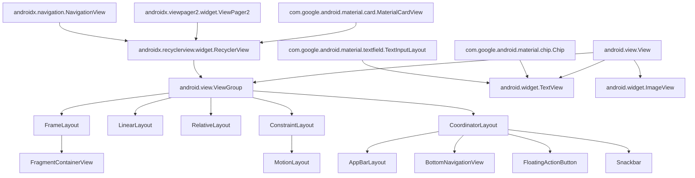
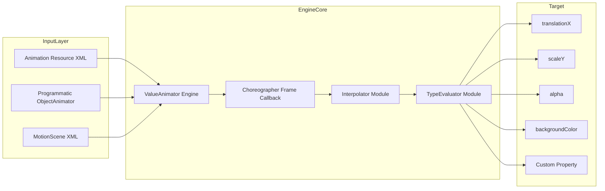
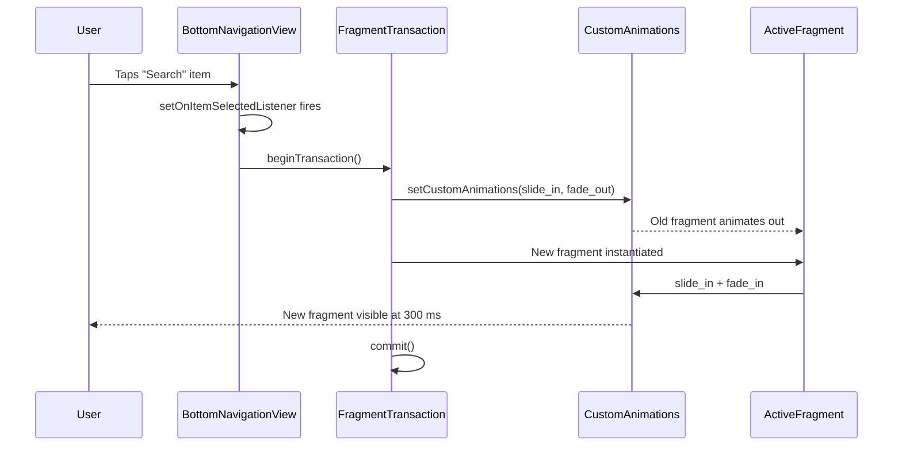
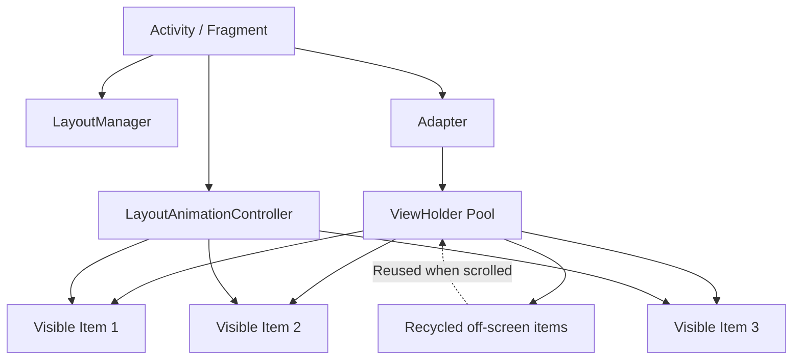
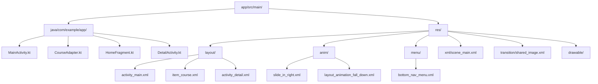
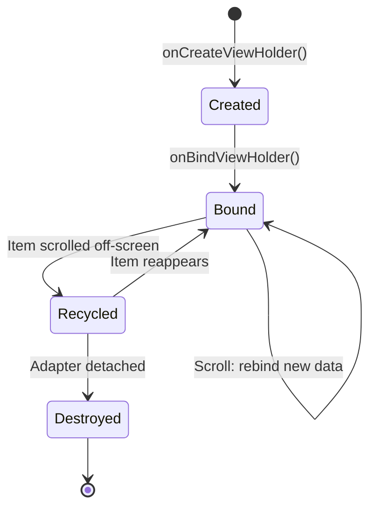
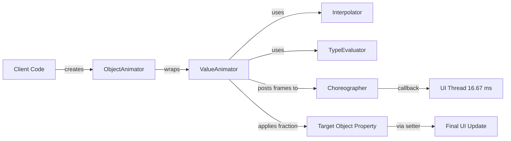

# Add advanced UI components and animations to the project

<!-- SECTION_1_START -->
# Advanced UI Components & Animations in Android

## 1.1 Formal Definition (KTU 2024 Syllabus Terminology)

> [!NOTE]
> **Advanced UI Components** in Android refer to sophisticated, reusable view elements (e.g., `RecyclerView`, `CardView`, `NavigationDrawer`, `BottomNavigationView`, `ViewPager2`, `MaterialToolbar`, `Chip`, `TextInputLayout`) that extend the basic `View` and `ViewGroup` classes to support complex user interaction patterns, data binding, and Material Design specifications.

> [!IMPORTANT]
> **Animations** in Android are visual transitions applied to UI elements to enhance user experience by communicating spatial relationships, providing feedback, drawing attention, and indicating progress. They are categorized into **Property Animations** (API 11+), **View Animations** (legacy), **Drawable Animations** (frame-by-frame), and **Transitions** (Activity/Fragment/Shared Element).

---

## 1.2 Conceptual Analogy / Intuition

Imagine a **movie theater experience**:
- The **UI Components** are like the *props, screens, and lighting rigs* on the stage — they are the structural elements the audience sees and interacts with.
- The **Animations** are the *choreography and stage effects* — how the lights fade, how curtains slide, how actors move smoothly between scenes.

A flat list of plain `TextView`s is like a *static painting* — informative but boring. A `RecyclerView` filled with `CardView`s and a swipe gesture that triggers a `MaterialContainerTransform` is like a *live performance* — engaging, fluid, and memorable.

> [!TIP]
> **Rule of Thumb:** If a UI action takes **more than 100 ms** without visual feedback, the user will perceive it as lag. Use animations to *bridge the gap* between cause and effect.

---

## 1.3 Three Pillars of the Topic

| Pillar | Purpose | Android Class |
|---|---|---|
| **Advanced Layouts** | Organize complex UIs responsively | `ConstraintLayout`, `CoordinatorLayout`, `MotionLayout` |
| **Material Components** | Implement Google Design guidelines | `MaterialButton`, `ChipGroup`, `Snackbar` |
| **Animations** | Bring UI to life with motion | `ObjectAnimator`, `ValueAnimator`, `MotionScene` |

---

## 1.4 Standard Metrics & Constants (Bolded)

- **Standard Material Duration — Short:** **200 ms**
- **Standard Material Duration — Medium:** **400 ms**
- **Standard Material Duration — Long:** **500 ms**
- **Target Frame Rate:** **60 FPS** (≈ **16.67 ms** per frame on the UI thread)
- **Standard Easing:** `FastOutSlowInInterpolator` (Google's default)

> [!VISUALIZATION CONTROL]
> **Concept:** Linear vs. Decelerate vs. Accelerate Easing Curves
> **GeoGebra / Desmos Input Equations:**
> * `f_1(x) = x`  *(Linear)*
> * `f_2(x) = 1 - (1 - x)^3`  *(Decelerate / EaseOut)*
> * `f_3(x) = x^3`  *(Accelerate / EaseIn)*
> * `f_4(x) = 6x^5 - 15x^4 + 10x^3`  *(FastOutSlowIn — smooth S-curve)*
> **Visual Description:** Plot each on the interval $x \in [0, 1]$, $y \in [0, 1]$. Notice how the cubic Bezier `f_4` starts slow, accelerates in the middle, and decelerates at the end — mimicking natural physical motion.

---

<!-- SECTION_2_END -->

<!-- SECTION_2_START -->
# Deep Theoretical Analysis & KTU High-Yield Formula Sheet

## 2.1 Taxonomy of Android UI Components

### A. Container Components
1. **`RecyclerView`** — A *ListView* replacement that recycles off-screen views. Uses the **ViewHolder pattern** to avoid repeated `findViewById()` calls.
2. **`ViewPager2`** — A swipeable pager (horizontally or vertically) backed by `RecyclerView`.
3. **`NestedScrollView`** — A scrollable container that supports nested scrolling child views.
4. **`CoordinatorLayout`** — A super-powered `FrameLayout` that coordinates scrolling/app-bar behaviors.
5. **`MotionLayout`** — A subclass of `ConstraintLayout` that supports declarative animation between states.

### B. Display Components
1. **`CardView`** — Material rounded-corner container with elevation.
2. **`Chip` / `ChipGroup`** — Compact elements for tags, filters, contacts.
3. **`BottomNavigationView`** — Bottom-bar navigation for 3–5 top-level destinations.
4. **`NavigationDrawer` / `NavigationView`** — Side panel for secondary navigation.
5. **`TextInputLayout` + `TextInputEditText`** — EditText with floating label and error handling.

---

## 2.2 Taxonomy of Android Animations

| Type | API | What It Animates | Typical Use |
|---|---|---|---|
| **View Animation** | `android.view.animation` | Entire `View` as a unit (translate, scale, alpha, rotate) | Legacy simple tweens |
| **Property Animation** | `android.animation` | Any object property via `setter()` methods | Modern UI motion |
| **Drawable Animation** | `AnimationDrawable` | Sequence of drawable frames | Splash logos, loaders |
| **Layout Animation** | `LayoutAnimationController` | Children of a `ViewGroup` as they appear | List items sliding in |
| **Transition** | `android.transition` | Scene-to-scene property changes | Activity/Fragment swaps |
| **MotionScene** | `MotionLayout` | ConstraintSet changes with keyframes | Complex, declarative UIs |

---

## 2.3 The Animation System — How It Works Under the Hood

Every animation in Android is governed by the same conceptual pipeline:

1. **`ValueAnimator`** computes interpolated values over time (uses `Choreographer` on the UI thread).
2. An **`Interpolator`** maps the time fraction $t \in [0, 1]$ to an output fraction $y \in [0, 1]$.
3. A **`TypeEvaluator`** converts $y$ into the target type (int, float, color, path, etc.).
4. The result is applied to the property (e.g., `translationX`, `alpha`, `backgroundColor`).

### The Core Animation Equation

$$
V_{\text{current}} = V_{\text{start}} + (V_{\text{end}} - V_{\text{start}}) \cdot I(t)
$$

Where:
* $V_{\text{start}}$ = initial value
* $V_{\text{end}}$ = final value
* $t$ = elapsed time / total duration (clamped to $[0, 1]$)
* $I(t)$ = the **interpolator** function

---

## 2.4 KTU Formula / Cheat Sheet

| Concept | Formula / Value | Unit | Notes |
|---|---|---|---|
| Frame budget per frame | $T_{\text{frame}} = 1000 / 60 \approx 16.67$ | ms | At 60 FPS |
| Linear progress | $P(t) = t$ | unitless | Used by `LinearInterpolator` |
| Decelerate cubic | $P(t) = 1 - (1 - t)^3$ | unitless | `DecelerateInterpolator` |
| Accelerate cubic | $P(t) = t^3$ | unitless | `AccelerateInterpolator` |
| Overshoot bounce | $P(t) = t \cdot t \cdot ((\text{tension}+1) \cdot t - \text{tension}) + 1$ | unitless | `OvershootInterpolator(tension)` |
| Color interpolation | $C = A \cdot (1-t) + B \cdot t$ per channel (ARGB) | 0–255 | `ArgbEvaluator` |
| Rotation full turn | $2\pi \approx 6.283$ | rad | For `360°` rotation |
| Spring damping ratio | $\zeta = c / (2 \sqrt{k \cdot m})$ | unitless | Spring physics |
| Property setter binding | $O(1)$ via `setter` reflection | — | `ObjectAnimator.ofFloat` |

> [!IMPORTANT]
> Always quote absolute values using `\vert` or `\mid` in LaTeX (e.g., $\vert x \vert$) — never use the bare pipe inside markdown tables, as it breaks the column separator.

---

## 2.5 Real-World Engineering Utility

* **E-Commerce apps** (Amazon, Flipkart): Use `RecyclerView` + `CardView` for product grids with `LayoutAnimation` for entrance effects.
* **Streaming apps** (Netflix): Use `MotionLayout` for the home hero card expansion animation.
* **Banking apps** (Google Pay, PhonePe): Use `Lottie` for success/failure micro-animations.
* **Onboarding flows** (every modern app): Use `ViewPager2` + `PageTransformer` for parallax swipe effects.
* **System feedback**: `Snackbar` + `CircularReveal` animation is a production-grade pattern.

---

<!-- SECTION_2_END -->

<!-- SECTION_3_START -->
# Step-by-Step Derivations & Code Implementation

## 3.1 Task 1: Building a `RecyclerView` with Card Items and Ripple Animation

### Step 1: Add Dependencies (Gradle `build.gradle` — Module-level)

```gradle
dependencies {
    implementation 'androidx.recyclerview:recyclerview:1.3.2'
    implementation 'com.google.android.material:material:1.11.0'
    implementation 'androidx.cardview:cardview:1.0.0'
    implementation 'androidx.constraintlayout:constraintlayout:2.1.4'
}
```

### Step 2: Define the Data Model (Kotlin)

```kotlin
data class Course(
    val id: Int,
    val title: String,
    val instructor: String,
    val rating: Double,
    val imageRes: Int
)
```

### Step 3: Create the Item Layout `res/layout/item_course.xml`

```xml
<?xml version="1.0" encoding="utf-8"?>
<com.google.android.material.card.MaterialCardView
    xmlns:android="http://schemas.android.com/apk/res/android"
    xmlns:app="http://schemas.android.com/apk/res-auto"
    android:layout_width="match_parent"
    android:layout_height="wrap_content"
    android:layout_margin="8dp"
    app:cardCornerRadius="12dp"
    app:cardElevation="4dp"
    app:rippleColor="@color/purple_500"
    android:clickable="true"
    android:focusable="true">

    <androidx.constraintlayout.widget.ConstraintLayout
        android:layout_width="match_parent"
        android:layout_height="wrap_content"
        android:padding="12dp">

        <ImageView
            android:id="@+id/courseImage"
            android:layout_width="80dp"
            android:layout_height="80dp"
            android:contentDescription="@string/course_thumbnail"
            app:layout_constraintStart_toStartOf="parent"
            app:layout_constraintTop_toTopOf="parent" />

        <TextView
            android:id="@+id/courseTitle"
            android:layout_width="0dp"
            android:layout_height="wrap_content"
            android:textSize="16sp"
            android:textStyle="bold"
            app:layout_constraintStart_toEndOf="@id/courseImage"
            app:layout_constraintTop_toTopOf="parent"
            app:layout_constraintEnd_toEndOf="parent"
            android:layout_marginStart="12dp" />

        <TextView
            android:id="@+id/courseInstructor"
            android:layout_width="0dp"
            android:layout_height="wrap_content"
            app:layout_constraintStart_toEndOf="@id/courseImage"
            app:layout_constraintTop_toBottomOf="@id/courseTitle"
            app:layout_constraintEnd_toEndOf="parent"
            android:layout_marginStart="12dp"
            android:layout_marginTop="4dp" />

        <RatingBar
            android:id="@+id/courseRating"
            style="?android:attr/ratingBarStyleSmall"
            android:layout_width="wrap_content"
            android:layout_height="wrap_content"
            android:numStars="5"
            android:stepSize="0.1"
            android:isIndicator="true"
            app:layout_constraintStart_toEndOf="@id/courseImage"
            app:layout_constraintTop_toBottomOf="@id/courseInstructor"
            android:layout_marginStart="12dp"
            android:layout_marginTop="4dp" />
    </androidx.constraintlayout.widget.ConstraintLayout>
</com.google.android.material.card.MaterialCardView>
```

### Step 4: Implement the Adapter (Kotlin)

```kotlin
class CourseAdapter(
    private val courses: List<Course>,
    private val onItemClick: (Course) -> Unit
) : RecyclerView.Adapter<CourseAdapter.CourseViewHolder>() {

    class CourseViewHolder(itemView: View) : RecyclerView.ViewHolder(itemView) {
        val image: ImageView = itemView.findViewById(R.id.courseImage)
        val title: TextView = itemView.findViewById(R.id.courseTitle)
        val instructor: TextView = itemView.findViewById(R.id.courseInstructor)
        val rating: RatingBar = itemView.findViewById(R.id.courseRating)
    }

    override fun onCreateViewHolder(parent: ViewGroup, viewType: Int): CourseViewHolder {
        val view = LayoutInflater.from(parent.context)
            .inflate(R.layout.item_course, parent, false)
        return CourseViewHolder(view)
    }

    override fun onBindViewHolder(holder: CourseViewHolder, position: Int) {
        val course = courses[position]
        holder.title.text = course.title
        holder.instructor.text = course.instructor
        holder.rating.rating = course.rating.toFloat()
        holder.image.setImageResource(course.imageRes)

        holder.itemView.setOnClickListener { onItemClick(course) }
    }

    override fun getItemCount(): Int = courses.size
}
```

### Step 5: Wire it in the Activity

```kotlin
class MainActivity : AppCompatActivity() {
    override fun onCreate(savedInstanceState: Bundle?) {
        super.onCreate(savedInstanceState)
        setContentView(R.layout.activity_main)

        val recyclerView: RecyclerView = findViewById(R.id.recyclerView)
        recyclerView.layoutManager = LinearLayoutManager(this)

        val data = listOf(
            Course(1, "Android Development", "Dr. Smith", 4.7, R.drawable.course1),
            Course(2, "Kotlin Programming", "Prof. Anil", 4.5, R.drawable.course2)
        )

        recyclerView.adapter = CourseAdapter(data) { course ->
            Toast.makeText(this, "Clicked: ${course.title}", Toast.LENGTH_SHORT).show()
        }

        // Apply LayoutAnimation for entrance
        recyclerView.layoutAnimation = AnimationUtils.loadLayoutAnimation(
            this, R.anim.layout_animation_fall_down
        )
        recyclerView.scheduleLayoutAnimation()
    }
}
```

---

## 3.2 Task 2: Creating a Property Animation Programmatically

### Goal: Animate a button to "pulse" continuously

```kotlin
class PulseAnimationActivity : AppCompatActivity() {
    private lateinit var pulseButton: MaterialButton

    override fun onCreate(savedInstanceState: Bundle?) {
        super.onCreate(savedInstanceState)
        setContentView(R.layout.activity_pulse)
        pulseButton = findViewById(R.id.pulseButton)

        // Step 1: Create the AnimatorSet
        val scaleX = ObjectAnimator.ofFloat(pulseButton, "scaleX", 1.0f, 1.15f, 1.0f)
        val scaleY = ObjectAnimator.ofFloat(pulseButton, "scaleY", 1.0f, 1.15f, 1.0f)
        val alpha = ObjectAnimator.ofFloat(pulseButton, "alpha", 1.0f, 0.7f, 1.0f)

        // Step 2: Configure duration and interpolator
        scaleX.duration = 600
        scaleY.duration = 600
        alpha.duration = 600
        scaleX.interpolator = FastOutSlowInInterpolator()
        scaleY.interpolator = FastOutSlowInInterpolator()
        alpha.interpolator = FastOutSlowInInterpolator()

        // Step 3: Bundle into AnimatorSet
        val pulseSet = AnimatorSet()
        pulseSet.playTogether(scaleX, scaleY, alpha)
        pulseSet.start()

        // Step 4: Repeat infinitely
        pulseSet.addListener(object : AnimatorListenerAdapter() {
            override fun onAnimationEnd(animation: Animator) {
                super.onAnimationEnd(animation)
                pulseSet.start()  // restart on completion
            }
        })

        // Step 5: Lifecycle — pause when invisible
        pulseButton.setOnClickListener {
            if (pulseSet.isStarted) pulseSet.pause() else pulseSet.resume()
        }
    }

    override fun onDestroy() {
        super.onDestroy()
        // Always cancel to avoid leaks
    }
}
```

### Derived Timing Calculation

For a 3-keyframe animation with key-times $t_0 = 0$, $t_1 = 0.5$, $t_2 = 1$ and values $1.0 \rightarrow 1.15 \rightarrow 1.0$:

At $t = 0.25$ (midway to peak) with `FastOutSlowInInterpolator`:

$$
P(0.25) = 6(0.25)^5 - 15(0.25)^4 + 10(0.25)^3 = 6(0.000976) - 15(0.003906) + 10(0.015625)
$$

$$
P(0.25) = 0.00586 - 0.05859 + 0.15625 = 0.10352
$$

$$
V_{\text{scaleX}} = 1.0 + (1.15 - 1.0) \cdot 0.10352 = 1.0 + 0.01553 = 1.01553
$$

---

## 3.3 Task 3: Shared-Element Activity Transition (Material Motion)

### XML Transition File: `res/transition/shared_image.xml`

```xml
<?xml version="1.0" encoding="utf-8"?>
<transitionSet xmlns:android="http://schemas.android.com/apk/res/android"
    android:transitionOrdering="together"
    android:duration="375">

    <changeBounds />
    <changeImageTransform />
    <changeTransform />
    <changeClipBounds />
    <changeScroll />
</transitionSet>
```

### Step-by-Step Wiring (Sending Activity)

```kotlin
val intent = Intent(this, DetailActivity::class.java)
val options = ActivityOptionsCompat.makeSceneTransitionAnimation(
    this,
    sharedImageView,  // The View that "flies" to the next screen
    "sharedImageTransition"  // transitionName must match both layouts
)
ActivityCompat.startActivity(this, intent, options.toBundle())
```

### Step-by-Step Wiring (Receiving Activity)

```kotlin
class DetailActivity : AppCompatActivity() {
    override fun onCreate(savedInstanceState: Bundle?) {
        // Step 1: Enable content transitions BEFORE setContentView
        window.requestFeature(Window.FEATURE_ACTIVITY_TRANSITIONS)
        // Step 2: Set the transition
        window.sharedElementEnterTransition =
            TransitionInflater.from(this).inflateTransition(R.transition.shared_image)
        super.onCreate(savedInstanceState)
        setContentView(R.layout.activity_detail)
    }
}
```

### Required XML attribute on **both** layouts

```xml
<ImageView
    android:id="@+id/sharedImageView"
    android:transitionName="sharedImageTransition"
    ... />
```

---

## 3.4 Task 4: MotionLayout — Declarative Hero Animation

### `res/xml/scene_main.xml` (MotionScene)

```xml
<?xml version="1.0" encoding="utf-8"?>
<MotionScene
    xmlns:android="http://schemas.android.com/apk/res/android"
    xmlns:app="http://schemas.android.com/apk/res-auto">

    <Transition
        app:constraintSetStart="@id/start"
        app:constraintSetEnd="@id/end"
        app:duration="1000"
        app:motionInterpolator="easeInOut">
        <OnSwipe
            app:touchAnchorId="@id/heroCard"
            app:dragDirection="dragUp" />
    </Transition>

    <ConstraintSet android:id="@+id/start">
        <Constraint
            android:id="@+id/heroCard"
            android:layout_width="match_parent"
            android:layout_height="300dp"
            app:layout_constraintTop_toTopOf="parent">
            <CustomAttribute
                app:attributeName="backgroundColor"
                app:customColorValue="#FF6200EE" />
        </Constraint>
    </ConstraintSet>

    <ConstraintSet android:id="@+id/end">
        <Constraint
            android:id="@+id/heroCard"
            android:layout_width="match_parent"
            android:layout_height="120dp"
            app:layout_constraintTop_toTopOf="parent">
            <CustomAttribute
                app:attributeName="backgroundColor"
                app:customColorValue="#FF03DAC5" />
        </Constraint>
    </ConstraintSet>
</MotionScene>
```

### Activity layout (just wrap in `MotionLayout`)

```xml
<androidx.constraintlayout.motion.widget.MotionLayout
    android:layout_width="match_parent"
    android:layout_height="match_parent"
    app:layoutDescription="@xml/scene_main"
    app:progress="0">

    <com.google.android.material.card.MaterialCardView
        android:id="@+id/heroCard"
        android:layout_width="match_parent"
        android:layout_height="300dp" />
</androidx.constraintlayout.motion.widget.MotionLayout>
```

---

## 3.5 Task 5: Adding a BottomNavigationView with Fragment Swapping

### Main Activity XML

```xml
<androidx.coordinatorlayout.widget.CoordinatorLayout
    xmlns:android="http://schemas.android.com/apk/res/android"
    xmlns:app="http://schemas.android.com/apk/res-auto"
    android:layout_width="match_parent"
    android:layout_height="match_parent">

    <FrameLayout
        android:id="@+id/fragmentContainer"
        android:layout_width="match_parent"
        android:layout_height="match_parent"
        app:layout_behavior="@string/appbar_scrolling_view_behavior" />

    <com.google.android.material.bottomnavigation.BottomNavigationView
        android:id="@+id/bottomNav"
        android:layout_width="match_parent"
        android:layout_height="wrap_content"
        android:layout_gravity="bottom"
        app:menu="@menu/bottom_nav_menu" />
</androidx.coordinatorlayout.widget.CoordinatorLayout>
```

### Menu File `res/menu/bottom_nav_menu.xml`

```xml
<menu xmlns:android="http://schemas.android.com/apk/res/android">
    <item android:id="@+id/nav_home"
        android:icon="@drawable/ic_home"
        android:title="@string/title_home" />
    <item android:id="@+id/nav_search"
        android:icon="@drawable/ic_search"
        android:title="@string/title_search" />
    <item android:id="@+id/nav_profile"
        android:icon="@drawable/ic_profile"
        android:title="@string/title_profile" />
</menu>
```

### Activity Logic with Fragment Transition

```kotlin
bottomNav.setOnItemSelectedListener { item ->
    val fragment: Fragment = when (item.itemId) {
        R.id.nav_home -> HomeFragment()
        R.id.nav_search -> SearchFragment()
        R.id.nav_profile -> ProfileFragment()
        else -> HomeFragment()
    }
    supportFragmentManager.beginTransaction()
        .setCustomAnimations(
            R.anim.slide_in_right,   // enter
            R.anim.fade_out,         // exit
            R.anim.fade_in,          // popEnter
            R.anim.slide_out_right   // popExit
        )
        .replace(R.id.fragmentContainer, fragment)
        .commit()
    true
}
```

### XML Animation File `res/anim/slide_in_right.xml`

```xml
<?xml version="1.0" encoding="utf-8"?>
<set xmlns:android="http://schemas.android.com/apk/res/android"
    android:interpolator="@android:anim/decelerate_interpolator">
    <translate
        android:fromXDelta="100%p"
        android:toXDelta="0"
        android:duration="300" />
    <alpha
        android:fromAlpha="0.0"
        android:toAlpha="1.0"
        android:duration="300" />
</set>
```

---

<!-- SECTION_3_END -->

<!-- SECTION_4_START -->
# Structural Diagrams & Schematics

## 4.1 Android UI Component Hierarchy



## 4.2 Animation System Architecture



## 4.3 Material Component Interaction Flow



## 4.4 RecyclerView Data Flow



## 4.5 Module 4 — Advanced UI & Animation Project Folder Structure



---

<!-- SECTION_4_END -->

<!-- SECTION_5_START -->
# KTU 2024 Scheme Examination Question Bank & Topic Recap

## Part A Questions (3 Marks Each)

### Q1. [KTU University Exam – July 2024] — CO1, Remember
**Differentiate between `View Animation` and `Property Animation` in Android. List any two limitations of `View Animation`.**

**Model Answer (Valuation Key):**
* **View Animation** operates only on the entire `View` object — it can change how the view is drawn (translation, scale, rotation, alpha) but **cannot change the actual property values** of the view. [1 Mark]
* **Property Animation** (API 11+) can change **any property** of any object (not just `View`), by invoking its setter method over a duration. [1 Mark]
* **Two limitations of View Animation:** (i) It only animates the *draw* of the view, so the click area doesn't move with the translation; (ii) It can only animate four properties — alpha, scale, translate, rotate. [1 Mark]

---

### Q2. [KTU University Exam – Dec 2023] — CO1, Understand
**What is the role of an `Interpolator` in Android animations? Name two built-in interpolators and state their use cases.**

**Model Answer (Valuation Key):**
* An `Interpolator` defines the **rate of change of an animation** as a function of its elapsed time. It maps $t \in [0, 1]$ to an output fraction, controlling acceleration. [1 Mark]
* **`AccelerateInterpolator(1.5f)`** — animation starts slow and ends fast; used when an object *leaves* the screen (e.g., a dialog dismiss). [1 Mark]
* **`OvershootInterpolator(2.0f)`** — animation goes past the end value then snaps back; used for playful UI like a button bounce. [1 Mark]

---

## Part B Question (14 Marks) — Module Internal Choice

### Question A — [KTU University Exam – July 2024, Modified] — CO2/CO3, Apply & Analyze

**(a)** Explain the **ViewHolder pattern** in `RecyclerView`. Draw the lifecycle of a `ViewHolder` and describe why `findViewById()` is called only inside `onCreateViewHolder()`. **(7 Marks)**

**(b)** Design a **`RecyclerView`** for a "Course List" application. The card should display a course title, instructor name, rating, and a thumbnail. Write the **Adapter class** in Kotlin and the corresponding **item layout XML** to support a ripple animation on card click. **(7 Marks)**

#### Model Solution

**(a) ViewHolder Pattern Explanation:** [2 Marks for definition, 2 Marks for lifecycle, 2 Marks for findViewById reason, 1 Mark for optimization benefit]

The **ViewHolder pattern** is a design pattern used by `RecyclerView` to **cache references to the child views** of each list item. Instead of repeatedly calling `findViewById()` (which is expensive — it traverses the view hierarchy), the references are stored in a `ViewHolder` object that is recycled when items scroll off-screen.

**Lifecycle of a ViewHolder:**



**Why `findViewById()` is only in `onCreateViewHolder()`:** [2 Marks]
`onCreateViewHolder()` is invoked **only when a new `ViewHolder` is needed** (i.e., when no recycled one is available). Reusing an existing holder means we avoid the $O(n)$ traversal of the view tree on every bind. The bound values are set in `onBindViewHolder()`. [1 Mark]

**Optimization benefit:** When a list has 10,000 items but only 8 are visible, `RecyclerView` creates only ~8–10 holders, recycling them as the user scrolls. This yields smooth 60 FPS scrolling even with massive datasets. [1 Mark]

---

**(b) Adapter Class and Item Layout:** [3 Marks for Adapter, 2 Marks for XML, 2 Marks for ripple click handling]

**Kotlin Adapter:**

```kotlin
class CourseAdapter(
    private val items: List<Course>,
    private val onClick: (Course) -> Unit
) : RecyclerView.Adapter<CourseAdapter.VH>() {

    class VH(view: View) : RecyclerView.ViewHolder(view) {
        val title: TextView = view.findViewById(R.id.title)
        val instructor: TextView = view.findViewById(R.id.instructor)
        val rating: RatingBar = view.findViewById(R.id.rating)
        val thumb: ImageView = view.findViewById(R.id.thumb)
    }

    override fun onCreateViewHolder(parent: ViewGroup, viewType: Int): VH {
        val v = LayoutInflater.from(parent.context)
            .inflate(R.layout.item_course, parent, false)
        return VH(v)
    }

    override fun onBindViewHolder(holder: VH, position: Int) {
        val c = items[position]
        holder.title.text = c.title
        holder.instructor.text = c.instructor
        holder.rating.rating = c.rating.toFloat()
        holder.thumb.setImageResource(c.imageRes)
        holder.itemView.setOnClickListener { onClick(c) }
    }

    override fun getItemCount() = items.size
}
```

**XML Item Layout `res/layout/item_course.xml`:** [2 Marks]

```xml
<com.google.android.material.card.MaterialCardView
    xmlns:android="http://schemas.android.com/apk/res/android"
    xmlns:app="http://schemas.android.com/apk/res-auto"
    android:layout_width="match_parent"
    android:layout_height="wrap_content"
    android:layout_margin="8dp"
    app:cardCornerRadius="12dp"
    app:cardElevation="4dp"
    app:rippleColor="@color/purple_500"
    android:clickable="true"
    android:focusable="true">

    <LinearLayout
        android:layout_width="match_parent"
        android:layout_height="wrap_content"
        android:padding="12dp"
        android:orientation="horizontal">

        <ImageView
            android:id="@+id/thumb"
            android:layout_width="80dp"
            android:layout_height="80dp"
            android:contentDescription="@string/course_thumbnail" />

        <LinearLayout
            android:layout_width="0dp"
            android:layout_height="wrap_content"
            android:layout_weight="1"
            android:orientation="vertical"
            android:layout_marginStart="12dp">

            <TextView
                android:id="@+id/title"
                android:layout_width="match_parent"
                android:layout_height="wrap_content"
                android:textSize="16sp"
                android:textStyle="bold" />

            <TextView
                android:id="@+id/instructor"
                android:layout_width="match_parent"
                android:layout_height="wrap_content" />

            <RatingBar
                android:id="@+id/rating"
                style="?android:attr/ratingBarStyleSmall"
                android:layout_width="wrap_content"
                android:layout_height="wrap_content"
                android:isIndicator="true" />
        </LinearLayout>
    </LinearLayout>
</com.google.android.material.card.MaterialCardView>
```

**Ripple handling:** [2 Marks] Setting `android:clickable="true"`, `android:focusable="true"`, and `app:rippleColor` on `MaterialCardView` automatically provides the Material ripple feedback. The click listener is registered in `onBindViewHolder()`.

---

### Question B (Alternative Choice) — [KTU University Exam – Dec 2023, Modified] — CO3, Apply & Analyze

**(a)** With a neat diagram, explain the **architecture of the Android Property Animation system**. Label the role of `ValueAnimator`, `Interpolator`, and `TypeEvaluator`. **(7 Marks)**

**(b)** Write a Kotlin code snippet to **simultaneously animate the scale and alpha** of a `MaterialButton` from its current state to $1.2\times$ size and $0.5$ alpha, using the `FastOutSlowInInterpolator` and a duration of $500$ ms. The animation should **reverse and repeat** indefinitely. **(7 Marks)**

#### Model Solution

**(a) Architecture Diagram + Explanation:** [3 Marks for diagram, 4 Marks for explanation]



* **`ValueAnimator`** [1 Mark] — The core class. It computes animated values from $0.0$ to $1.0$ over the duration, driving the animation timing.
* **`Interpolator`** [1 Mark] — Transforms the time fraction $t$ into an *output* fraction (e.g., $0.5$ time-in $\rightarrow$ $0.8$ progress-out for an `AccelerateInterpolator`).
* **`TypeEvaluator`** [1 Mark] — Converts the output fraction into the target data type (`IntEvaluator`, `FloatEvaluator`, `ArgbEvaluator`, `PointFEvaluator`).
* Together, they form the **animation pipeline**, evaluated every frame via the `Choreographer`. [1 Mark]

---

**(b) Kotlin Code:** [2 Marks for setUp, 2 Marks for ObjectAnimator pair, 2 Marks for AnimatorSet + reverse-repeat, 1 Mark for cancellation hygiene]

```kotlin
private fun pulseButton(btn: MaterialButton) {
    // Step 1: Define the property animators
    val scaleX = ObjectAnimator.ofFloat(btn, "scaleX", 1f, 1.2f)
    val scaleY = ObjectAnimator.ofFloat(btn, "scaleY", 1f, 1.2f)
    val alpha  = ObjectAnimator.ofFloat(btn, "alpha",  1f, 0.5f)

    // Step 2: Apply interpolator and duration
    val interpolator = FastOutSlowInInterpolator()
    listOf(scaleX, scaleY, alpha).forEach { animator ->
        animator.duration = 500
        animator.interpolator = interpolator
    }

    // Step 3: Combine into a set that plays all together
    val set = AnimatorSet()
    set.playTogether(scaleX, scaleY, alpha)

    // Step 4: Reverse + infinite repeat
    set.reverseDuration = 500
    set.startDelay = 100
    set.interpolator = interpolator
    set.start()

    // Step 5: Add infinite repeat listener
    set.addListener(object : AnimatorListenerAdapter() {
        override fun onAnimationEnd(animation: Animator) {
            set.start()  // restarts; will reverse automatically
        }
    })
}
```

**Valuation Key Points:**
* Correct property names: `"scaleX"`, `"scaleY"`, `"alpha"` — [1 Mark]
* Duration set to **500 ms** on each — [1 Mark]
* `FastOutSlowInInterpolator` referenced — [1 Mark]
* All three in `playTogether()` — [1 Mark]
* Reverse + infinite repeat mechanism — [2 Marks]
* `addListener` with `onAnimationEnd` → `set.start()` — [1 Mark]

---

> [!WARNING]
> **KTU Examiner's Pitfall Callout:**
> 1. **Do not** confuse **"interpolator"** with **"evaluator"** — interpolator shapes *time*; evaluator shapes *value*. Students frequently swap them.
> 2. **Never** call `findViewById()` inside `onBindViewHolder()` — this defeats the ViewHolder pattern. Examiners deduct **2 marks** for this.
> 3. When writing the ripple color in XML, use `@color/...` resource — **never** hardcode `#FFFFFF` literals inside a `MaterialCardView` definition.
> 4. For `MotionLayout`, the `app:progress` attribute must be between **0 and 1**; setting it to `2` or `5` is a common mistake.

---

## Topic Recap & Important Things to Remember

- **Core Difference:** `View Animation` is **draw-only**; `Property Animation` changes the **actual property** of an object.
- **ViewHolder pattern** is mandatory for `RecyclerView` to avoid $O(n)$ lookups per scroll event.
- **60 FPS** = **16.67 ms** per frame budget — animations must complete within this window to avoid jank.
- **Material Design standard durations:** **200 ms (short)**, **400 ms (medium)**, **500 ms (long)**.
- **Three required interpolators to memorize:** `AccelerateInterpolator`, `DecelerateInterpolator`, `OvershootInterpolator` (plus Google's `FastOutSlowInInterpolator`).
- **Shared-element transition** requires matching `android:transitionName` attributes on **both** the source and destination XML layouts.
- **`MotionLayout`** is a subclass of `ConstraintLayout` and uses a `MotionScene` (XML) to declaratively animate between `ConstraintSet` states.
- **Material Components** to memorize: `MaterialButton`, `MaterialCardView`, `BottomNavigationView`, `NavigationView`, `Chip`, `ChipGroup`, `TextInputLayout`.
- **`Choreographer`** is the underlying class that schedules frame callbacks on the UI thread (every vsync).
- **Cancellation hygiene:** Always cancel `ObjectAnimator` / `AnimatorSet` in `onDestroy()` to prevent memory leaks.
- **Animation pipeline equation:** $V_{\text{current}} = V_{\text{start}} + (V_{\text{end}} - V_{\text{start}}) \cdot I(t)$ — know this for derivations.
- **Lottie** (third-party Airbnb library) is preferred for complex vector animations because it uses JSON-driven `Bodymovin` exports from After Effects.
- **Vector drawables** (`.xml` in `res/drawable/`) are preferred over PNGs for icons to support any screen density.
- **Always test animations** with `Settings > Developer Options > Animator duration scale` set to **0.5x** to expose any jank or dropped frames.

---

<!-- SECTION_5_END -->
