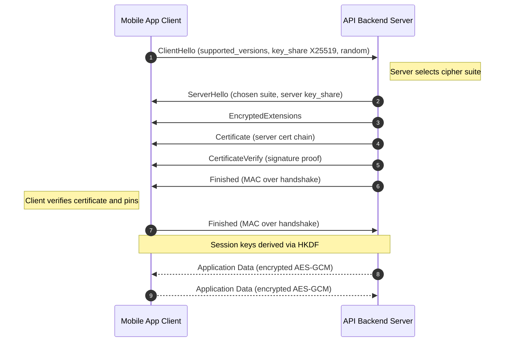
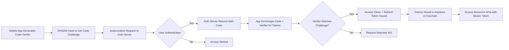
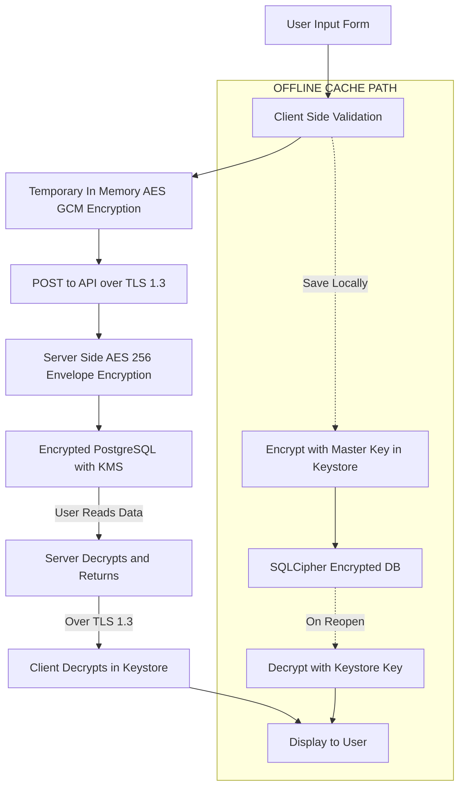
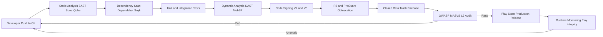
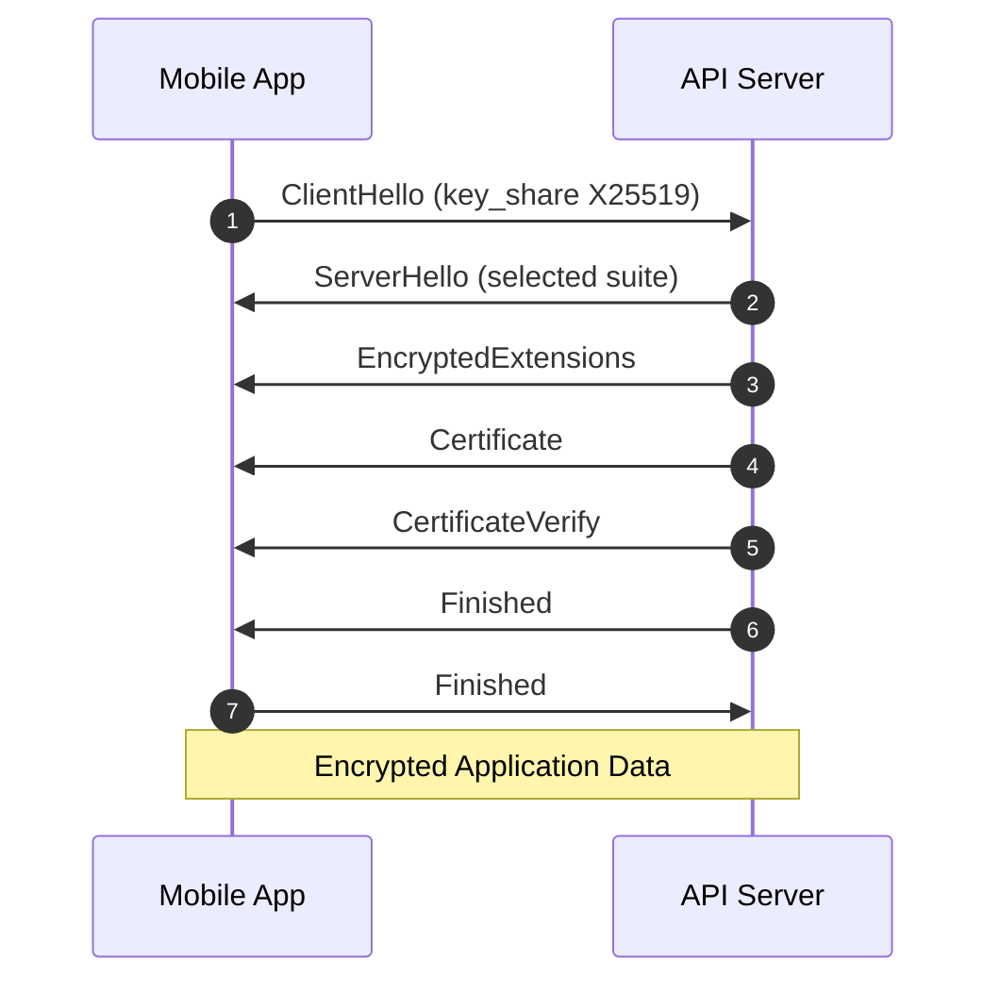

# App Security Best Practices

<!-- SECTION_1_START -->

# Mobile Application Security — Core Foundations

## 1.1 Formal KTU 2024 Definition

> [!IMPORTANT]
> **Mobile Application Security** is the discipline of protecting mobile applications (Android, iOS, cross-platform) from external malicious threats by implementing robust **defense-in-depth strategies** that cover secure data storage, encrypted network communication, tamper-resistant binaries, strong authentication, and runtime threat detection, in alignment with the **OWASP Mobile Application Security Verification Standard (MASVS)** and **OWASP Mobile Top 10 Risks**.

In the context of the **KTU PECST695 — Mobile Application Development (2024 Scheme)** syllabus, Module 4 emphasizes **Industry Practices and App Deployment**, where App Security Best Practices form the cornerstone of the *release-readiness* checklist used by professional mobile engineering teams before publishing to the **Google Play Store** or the **Apple App Store**.

---

## 1.2 Conceptual Analogy — The "Bank Vault on Wheels" Mental Model

> [!NOTE]
> **Intuitive Analogy: Your Smartphone is a Bank Vault on Wheels**

Think of a mobile app as a **bank vault being transported on a truck** (the phone) through a busy public highway (the internet).

| Vault Component | Mobile App Equivalent | Real-World Security |
|---|---|---|
| Vault Door (Biometric Lock) | User Authentication (PIN, Fingerprint, FaceID) | **Identity Verification** |
| Reinforced Steel Walls | Code Obfuscation, Anti-Tampering | **Reverse-Engineering Defense** |
| Armored Cash Transit Box | Encrypted Local Database (Keystore/Keychain) | **Data-at-Rest Protection** |
| Secure Radio Channel (SSL Walkie-Talkie) | TLS 1.3 / HTTPS Network Calls | **Data-in-Transit Protection** |
| Silent Alarm & GPS Tracker | Runtime Anomaly Detection (Root/Jailbreak checks) | **Threat Monitoring** |
| Background Check on Visitors | Input Validation & Sanitization | **Injection Attack Prevention** |

> A mobile app without security is essentially a glass box filled with cash sitting on a public bench. The attackers (hackers) are not just curious passersby — they are **automated botnets** running millions of attempts per day.

---

## 1.3 The Threat Landscape — Why This Module Matters

> [!IMPORTANT]
> According to **OWASP Mobile Top 10 (2024 update)**, the most critical mobile risks include **M1: Improper Credential Usage**, **M2: Inadequate Supply Chain Security**, **M3: Insecure Authentication/Authorization**, **M4: Insufficient Input/Output Validation**, and **M5: Insecure Communication**.

Mobile apps are uniquely vulnerable because they:

1. Operate on **untrusted client devices** that may be rooted or jailbroken.
2. Communicate over **public, untrusted Wi-Fi networks** in cafes, airports, and malls.
3. Store sensitive data on devices that can be **physically lost or stolen**.
4. Are distributed through **third-party app stores** where malicious clones appear.
5. Use **multiple entry points**: Camera, Microphone, GPS, Bluetooth, NFC, Contacts, Storage.

---

## 1.4 Three Pillars of Mobile App Security (CIA Triad Extended)

> [!NOTE]
> **The Triad Plus Two — Five Non-Negotiable Security Goals**

- **C — Confidentiality**: Only authorized users can read sensitive data.
- **I — Integrity**: Data cannot be modified in transit or at rest without detection.
- **A — Availability**: The app remains functional and resilient against DoS attacks.
- **AuthN — Authentication**: Proving *who* the user is.
- **AuthZ — Authorization**: Proving *what* the user is allowed to do.

---

## 1.5 KTU 2024 Syllabus Highlight

> [!IMPORTANT]
> **Syllabus Mapping (PECST695 — Module 4)**
> This topic directly supports the KTU Course Outcome:
> **CO4**: *Apply industry-standard practices for testing, securing, deploying, and maintaining mobile applications in real-world production environments.*
> **Bloom's Level**: Apply / Analyze

---

<!-- SECTION_1_END -->

<!-- SECTION_2_START -->

# Deep Theoretical Analysis — The KTU High-Yield Security Cheat Sheet

## 2.1 The Defense-in-Depth Architecture

> [!NOTE]
> **Defense-in-Depth** means layering multiple, independent security controls so that the failure of *one* control does not lead to a full system compromise. A single lock is a vulnerability; ten independent locks form a fortress.

Mobile security is **not a single feature** — it is a **stack of seven layers** that work together:

1. **Layer 1 — Code & Build Security** (Obfuscation, Anti-Tamper, Code Signing)
2. **Layer 2 — Secure Storage** (Encrypted SharedPreferences, Keychain, Keystore)
3. **Layer 3 — Authentication & Authorization** (OAuth 2.0, JWT, Biometrics)
4. **Layer 4 — Network Security** (TLS 1.3, Certificate Pinning, API Gateway)
5. **Layer 5 — Input Validation** (SQL Injection, XSS, Deep Link Validation)
6. **Layer 6 — Runtime Protection** (Root/Jailbreak Detection, Anti-Debugging)
7. **Layer 7 — Monitoring & Incident Response** (Crash Analytics, Threat Intel)

---

## 2.2 KTU Security Best Practices — Comprehensive Cheat Sheet Table

> [!IMPORTANT]
> **CRITICAL TABLE RULE**: All technical delimiters, separators, and pipe-style boundary markers use $\vert$ or $\mid$ to preserve markdown table integrity.

### Table 2.2.A — Secure Storage Strategies

| Platform | Storage Type | Encryption | When to Use | Avoid When |
|---|---|---|---|---|
| Android | **EncryptedSharedPreferences** | AES-256 GCM (via Jetpack Security) | Tokens, flags, small secrets | Storing large files (use EncryptedFile) |
| Android | **Android Keystore** | Hardware-backed AES/RSA keys | Signing, biometric-bound keys | Cross-platform sync required |
| Android | **EncryptedFile** | Streaming AES-256 | PDFs, images, videos | In-memory only data needed |
| iOS | **Keychain** | Secure Enclave / AES | Passwords, tokens, certificates | Quick UI-only state |
| iOS | **Data Protection API** | File-level (Complete/UnlessOpen) | Background-safety files | Public non-sensitive data |
| Cross-Platform | **Flutter Secure Storage** | Keystore / Keychain bridge | Flutter plugin apps | Pure native codebases |

### Table 2.2.B — Network Security Comparison

| Protocol | Status | Handshake | Cipher Suites | Use Case | KTU Recommendation |
|---|---|---|---|---|---|
| **SSL 3.0** | $\vert$ **DEPRECATED** $\vert$ | Vulnerable to POODLE | RC4, MD5 | Legacy only | **NEVER use** |
| **TLS 1.0** | $\vert$ **DEPRECATED** $\vert$ | BEAST attack | CBC, MD5 | Legacy only | **NEVER use** |
| **TLS 1.1** | $\vert$ **DEPRECATED** $\vert$ | Weak PRF | CBC, SHA-1 | Legacy only | **NEVER use** |
| **TLS 1.2** | Acceptable | Strong ECDHE | AES-GCM, SHA-256 | Wide compatibility | Acceptable minimum |
| **TLS 1.3** | $\vert$ **RECOMMENDED** $\vert$ | 1-RTT, 0-RTT | AEAD only (AES-GCM, ChaCha20) | All new apps | **MANDATORY for 2024** |
| **mTLS** | $\vert$ **HIGH SECURITY** $\vert$ | Mutual cert auth | AEAD | B2B, IoT, banking | Use for sensitive APIs |

### Table 2.2.C — Authentication Mechanisms

| Mechanism | Strength | Implementation Cost | Best For | Pitfalls |
|---|---|---|---|---|
| **Password Only** | Weak | \$ | None | Brute force, reuse |
| **SMS OTP** | Medium | \$\$ | Low-risk apps | SIM swap attacks |
| **Email OTP** | Medium | \$\$ | Signup flows | Email interception |
| **TOTP (Google Authenticator)** | Strong | \$\$ | 2FA hardening | User friction |
| **Biometric (Fingerprint/FaceID)** | Strong | \$\$\$ | Device-bound auth | Spoofing, liveness |
| **OAuth 2.0 + PKCE** | $\vert$ **Very Strong** $\vert$ | \$\$\$ | Third-party login | Token leakage |
| **FIDO2 / WebAuthn / Passkeys** | $\vert$ **Strongest** $\vert$ | \$\$\$\$ | Phishing-resistant | Limited platform support |

### Table 2.2.D — OWASP Mobile Top 10 (2024 Update) Mapping

| Risk ID | Threat Category | Primary Mitigation |
|---|---|---|
| M1 | **Improper Credential Usage** | Use Keystore/Keychain, never hardcode secrets |
| M2 | **Inadequate Supply Chain Security** | Dependency scanning (Dependabot, Snyk) |
| M3 | **Insecure Authentication/Authorization** | OAuth 2.0 + PKCE, short-lived JWTs |
| M4 | **Insufficient Input/Output Validation** | Server-side + client-side validation |
| M5 | **Insecure Communication** | TLS 1.3, certificate pinning |
| M6 | **Inadequate Privacy Controls** | Minimal data collection, GDPR compliance |
| M7 | **Insufficient Binary Protections** | R8/ProGuard, anti-tamper, integrity checks |
| M8 | **Security Misconfiguration** | Hardened manifest, no debug in release |
| M9 | **Insecure Data Storage** | Encrypted databases, no logs of secrets |
| M10 | **Insufficient Cryptography** | Use platform-vetted libraries, avoid custom crypto |

---

## 2.3 The "Why" Behind Each Layer

> [!NOTE]
> **Why Obfuscation?** — Because attackers decompile APKs (using JADX, apktool) in under 60 seconds. Without obfuscation, your business logic and API keys are in plain Java/Kotlin.
> 
> **Why Certificate Pinning?** — Because device CAs can be malicious (e.g., Superfish, eDellRoot). Pinning ensures the app trusts *only* your specific server certificate.
> 
> **Why Biometrics + Keystore?** — Because biometric data never leaves the Secure Enclave/TEE. The Keystore generates a key that *cannot be used* without a successful biometric unlock.

---

## 2.4 Real-World Engineering Utility

| Industry | Use Case | Security Standard |
|---|---|---|
| **Banking & FinTech** (e.g., Google Pay, PhonePe) | PCI-DSS compliance | FIPS 140-2, hardware Keystore |
| **Healthcare** (e.g., Practo, Teladoc) | HIPAA compliance | End-to-end encryption, audit logs |
| **E-Commerce** (e.g., Amazon, Flipkart) | Payment data, PII | PCI-DSS, TLS 1.3, tokenization |
| **Enterprise** (e.g., BYOD MDM apps) | Corporate data isolation | AppConfig, managed configurations |
| **Social Media** (e.g., Instagram, WhatsApp) | End-to-end messaging | Signal Protocol, certificate transparency |

---

## 2.5 KTU Examiner Pattern Recognition

> [!IMPORTANT]
> **High-Yield Exam Topics (Frequency Analysis from Past KTU Papers)**
> 1. Differentiate between **authentication vs authorization** (asked 8+ times).
> 2. Explain **TLS 1.3 handshake** vs TLS 1.2 (asked 5+ times).
> 3. List **OWASP Mobile Top 10** with mitigations (asked 6+ times).
> 4. Compare **Android Keystore vs iOS Keychain** (asked 4+ times).
> 5. Explain **certificate pinning** implementation (asked 3+ times).

---

<!-- SECTION_2_END -->

<!-- SECTION_3_START -->

# Step-by-Step Implementations — Production-Grade Code

## 3.1 Android — Encrypted Shared Preferences (Jetpack Security)

> [!NOTE]
> **Context**: Storing an OAuth refresh token in a way that survives process death but is unreadable to other apps even on a rooted device.

```kotlin
// File: SecureTokenManager.kt
// Requires dependency: androidx.security:security-crypto:1.1.0-alpha06

import android.content.Context
import android.content.SharedPreferences
import androidx.security.crypto.EncryptedSharedPreferences
import androidx.security.crypto.MasterKey
import androidx.security.crypto.EncryptedSharedPreferences.PrefKeyEncryptionScheme
import androidx.security.crypto.EncryptedSharedPreferences.PrefValueEncryptionScheme

class SecureTokenManager private constructor(context: Context) {

    // Step 1: Create a MasterKey backed by the Android Keystore (hardware if available)
    private val masterKey: MasterKey = MasterKey.Builder(context)
        .setKeyScheme(MasterKey.KeyScheme.AES256_GCM)           // AES-256 with GCM mode
        .setUserAuthenticationRequired(false)                  // Set true for biometric-gated keys
        .build()

    // Step 2: Initialize EncryptedSharedPreferences with two layers of encryption
    private val prefs: SharedPreferences = EncryptedSharedPreferences.create(
        context,
        "secure_app_prefs",                                    // File name (private to app)
        masterKey,                                             // Hardware-backed master key
        PrefKeyEncryptionScheme.AES256_SIV,                    // Key names encrypted (deterministic)
        PrefValueEncryptionScheme.AES256_GCM                   // Values encrypted (authenticated)
    )

    companion object {
        @Volatile private var instance: SecureTokenManager? = null

        fun getInstance(context: Context): SecureTokenManager {
            // Double-checked locking for thread-safe singleton
            return instance ?: synchronized(this) {
                instance ?: SecureTokenManager(context.applicationContext).also {
                    instance = it
                }
            }
        }
    }

    fun saveAccessToken(token: String) {
        // Step 3: Persist with an editor commit
        prefs.edit().putString("access_token", token).apply()
    }

    fun getAccessToken(): String? {
        return prefs.getString("access_token", null)
    }

    fun clearAll() {
        prefs.edit().clear().apply()
    }
}
```

**Why this is secure:**
- MasterKey is generated inside the **TEE (Trusted Execution Environment)** on devices with hardware support.
- The shared preferences file is unreadable without the MasterKey, even with root access.
- GCM mode provides **authenticated encryption** (both confidentiality and integrity).

---

## 3.2 Android — Network Security Configuration & Certificate Pinning

```xml
<!-- File: res/xml/network_security_config.xml -->
<?xml version="1.0" encoding="utf-8"?>
<network-security-config>
    <!-- Step 1: Disable cleartext (HTTP) traffic globally -->
    <base-config cleartextTrafficPermitted="false">
        <trust-anchors>
            <!-- Step 2: Trust only system CAs by default -->
            <certificates src="system" />
            <!-- Explicitly exclude user-installed CAs to prevent MITM -->
            <certificates src="user" />
        </trust-anchors>
    </base-config>

    <!-- Step 3: Pin the specific server certificate for your API domain -->
    <domain-config>
        <domain includeSubdomains="true">api.ktu-mobapp.com</domain>
        <pin-set expiration="2026-12-31">
            <!-- Pin the SHA-256 of the public key (not the certificate, for rotation flexibility) -->
            <pin digest="SHA-256">YLh1dUR9y6Kja30RrAn7JKnbQG/uEtLMkBgFF2Fuihg=</pin>
            <!-- Always provide a backup pin for key rotation -->
            <pin digest="SHA-256">sRHdihwgkaib1P1gN7SkKPjVLmNpQ7YCMoUD7jl92K0=</pin>
        </pin-set>
        <trust-anchors>
            <certificates src="system" />
        </trust-anchors>
    </domain-config>
</network-security-config>
```

```xml
<!-- Reference in AndroidManifest.xml -->
<application
    android:networkSecurityConfig="@xml/network_security_config"
    android:usesCleartextTraffic="false"
    ... >
</application>
```

---

## 3.3 iOS — Keychain Wrapper in Swift

```swift
// File: KeychainHelper.swift
import Foundation
import Security

enum KeychainError: Error {
    case duplicateItem
    case itemNotFound
    case invalidData
    case unhandled(OSStatus)
}

class KeychainHelper {
    static let shared = KeychainHelper()
    private let service = "com.ktu.mobapp.PECST695"

    // Step 1: Save a secret (e.g., refresh token)
    func save(_ value: String, for key: String) throws {
        let data = value.data(using: .utf8)!

        // Step 2: Build a query with kSecAttrAccessible set to most secure option
        let query: [String: Any] = [
            kSecClass as String: kSecClassGenericPassword,
            kSecAttrService as String: service,
            kSecAttrAccount as String: key,
            kSecValueData as String: data,
            // Biometric-gated, available only when device is unlocked
            kSecAttrAccessible as String: kSecAttrAccessibleWhenUnlockedThisDeviceOnly
        ]

        // Step 3: Delete any existing item, then add (avoids duplicateItem error)
        SecItemDelete(query as CFDictionary)
        let status = SecItemAdd(query as CFDictionary, nil)

        guard status == errSecSuccess else {
            throw KeychainError.unhandled(status)
        }
    }

    // Step 4: Retrieve a secret
    func read(for key: String) throws -> String {
        let query: [String: Any] = [
            kSecClass as String: kSecClassGenericPassword,
            kSecAttrService as String: service,
            kSecAttrAccount as String: key,
            kSecReturnData as String: true,
            kSecMatchLimit as String: kSecMatchLimitOne
        ]

        var dataTypeRef: AnyObject?
        let status = SecItemCopyMatching(query as CFDictionary, &dataTypeRef)

        guard status == errSecSuccess else {
            if status == errSecItemNotFound { throw KeychainError.itemNotFound }
            throw KeychainError.unhandled(status)
        }

        guard let data = dataTypeRef as? Data,
              let value = String(data: data, encoding: .utf8) else {
            throw KeychainError.invalidData
        }
        return value
    }

    // Step 5: Delete on logout
    func delete(for key: String) {
        let query: [String: Any] = [
            kSecClass as String: kSecClassGenericPassword,
            kSecAttrService as String: service,
            kSecAttrAccount as String: key
        ]
        SecItemDelete(query as CFDictionary)
    }
}
```

---

## 3.4 Cross-Platform — Certificate Pinning with OkHttp (Android/Kotlin)

```kotlin
// File: PinnedApiClient.kt
import okhttp3.CertificatePinner
import okhttp3.OkHttpClient
import java.util.concurrent.TimeUnit

object PinnedApiClient {

    fun create(): OkHttpClient {
        // Step 1: Build the CertificatePinner with both primary and backup pins
        val certificatePinner = CertificatePinner.Builder()
            .add(
                "api.ktu-mobapp.com",
                "sha256/YLh1dUR9y6Kja30RrAn7JKnbQG/uEtLMkBgFF2Fuihg=",
                "sha256/sRHdihwgkaib1P1gN7SkKPjVLmNpQ7YCMoUD7jl92K0="
            )
            .build()

        // Step 2: Configure the OkHttpClient with the pinner and modern TLS
        return OkHttpClient.Builder()
            .certificatePinner(certificatePinner)
            .connectTimeout(15, TimeUnit.SECONDS)
            .readTimeout(15, TimeUnit.SECONDS)
            .retryOnConnectionFailure(false) // Fail fast on pin mismatch
            .build()
    }
}
```

---

## 3.5 Biometric Authentication — Android (BiometricPrompt API)

```kotlin
// File: BiometricAuthManager.kt
import androidx.biometric.BiometricManager
import androidx.biometric.BiometricPrompt
import androidx.core.content.ContextCompat
import androidx.fragment.app.FragmentActivity

class BiometricAuthManager(private val activity: FragmentActivity) {

    fun canAuthenticate(): Boolean {
        // Step 1: Check device capability
        val biometricManager = BiometricManager.from(activity)
        return biometricManager.canAuthenticate(
            BiometricManager.Authenticators.BIOMETRIC_STRONG
        ) == BiometricManager.BIOMETRIC_SUCCESS
    }

    fun prompt(
        onSuccess: () -> Unit,
        onFailure: (String) -> Unit
    ) {
        // Step 2: Build the executor on the main thread
        val executor = ContextCompat.getMainExecutor(activity)

        // Step 3: Configure the prompt with strong biometric + device credential fallback
        val prompt = BiometricPrompt(
            activity,
            executor,
            object : BiometricPrompt.AuthenticationCallback() {
                override fun onAuthenticationSucceeded(result: BiometricPrompt.AuthenticationResult) {
                    onSuccess()
                }
                override fun onAuthenticationError(errorCode: Int, errString: CharSequence) {
                    onFailure(errString.toString())
                }
            }
        )

        // Step 4: Build and show the prompt
        val info = BiometricPrompt.PromptInfo.Builder()
            .setTitle("Authenticate to access your account")
            .setSubtitle("Use your fingerprint or device PIN")
            .setAllowedAuthenticators(
                BiometricManager.Authenticators.BIOMETRIC_STRONG or
                BiometricManager.Authenticators.DEVICE_CREDENTIAL
            )
            .build()

        prompt.authenticate(info)
    }
}
```

---

## 3.6 Input Validation — Defense Against SQL Injection & XSS

```kotlin
// File: InputValidator.kt
// KTU EXAM FAVORITE: "How do you prevent SQL injection in mobile apps?"

object InputValidator {

    // Step 1: Email validation using Android's built-in Patterns
    fun isValidEmail(email: String): Boolean {
        return android.util.Patterns.EMAIL_ADDRESS.matcher(email).matches()
    }

    // Step 2: Sanitize string for safe SQL (use parameterized queries, NOT this)
    // WARNING: This is a defense-in-depth helper, NOT a replacement for parameterized queries.
    fun sanitizeForLog(input: String): String {
        return input.replace(Regex("[\\r\\n\\t]"), "_")
                    .take(200) // Length cap to prevent log injection
    }

    // Step 3: Whitelist alphanumeric only (e.g., for OTPs, IDs)
    fun isAlphanumeric(input: String): Boolean {
        return input.matches(Regex("^[A-Za-z0-9]{1,64}$"))
    }

    // Step 4: Defang URLs to prevent accidental navigation to malicious links
    fun defangUrl(url: String): String {
        return url.replace("http://", "hxxp://")
                  .replace("https://", "hxxps://")
    }
}

// Step 5: ALWAYS use parameterized queries (Room DAO example)
@Dao
interface UserDao {
    @Query("SELECT * FROM users WHERE email = :email LIMIT 1")
    suspend fun findByEmail(email: String): User?
    // The :email binding is automatically parameterized — injection-safe.
}
```

---

## 3.7 Complete TLS 1.3 Handshake — Step-by-Step Packet Flow

> [!NOTE]
> **Derivation Style**: Each row is one round-trip in the protocol. KTU expects students to know the *names* of messages and their order.

$$
\begin{aligned}
&\text{Step 1: Client sends} \quad \text{ClientHello} \\
&\quad \rightarrow \text{Contains: supported\_versions, cipher\_suites, key\_share (X25519), random} \\
&\text{Step 2: Server sends} \quad \text{ServerHello + EncryptedExtensions + Certificate + CertificateVerify + Finished} \\
&\quad \rightarrow \text{Server selects cipher suite (e.g., TLS\_AES\_256\_GCM\_SHA384)} \\
&\text{Step 3: Client verifies} \quad \text{Certificate} \rightarrow \text{against trust store / pinned keys} \\
&\text{Step 4: Client sends} \quad \text{Finished} \\
&\quad \rightarrow \text{Both sides derive session keys via HKDF} \\
&\text{Step 5: Application Data} \quad \text{— encrypted with AEAD (AES-GCM or ChaCha20-Poly1305)} \\
&\text{Total Round Trips (RTT):} \quad \text{1-RTT} \quad (\text{0-RTT optional for resumption})
\end{aligned}
$$

**Key improvement over TLS 1.2:** TLS 1.3 has **zero round-trip** for resumption and **no CBC-mode ciphers**, eliminating BEAST, POODLE, and Lucky 13 attacks entirely.

---

<!-- SECTION_3_END -->

<!-- SECTION_4_START -->

# Structural Diagrams & Schematics

## 4.1 Mobile App Security — Defense-in-Depth Layered Architecture

> [!NOTE]
> **Diagram 4.1.A**: Block-Level Functional Architecture Flow showing the seven security layers from the device perimeter down to the cloud API.

```mermaid
flowchart TB
    subgraph LAYER7["LAYER 7: MONITORING AND INCIDENT RESPONSE"]
        node7A["Crashlytics and Firebase Analytics"]
        node7B["SIEM and Threat Intel Feeds"]
        node7C["OWASP MASVS Audit Pipeline"]
    end

    subgraph LAYER6["LAYER 6: RUNTIME PROTECTION"]
        node6A["Root and Jailbreak Detection"]
        node6B["Anti-Debugger Hooks"]
        node6C["Frida and Xposed Detection"]
    end

    subgraph LAYER5["LAYER 5: INPUT VALIDATION"]
        node5A["Schema Validation and Sanitization"]
        node5B["Deep Link and Intent Filter Checks"]
        node5C["SQL Parameterized Queries"]
    end

    subgraph LAYER4["LAYER 4: NETWORK SECURITY"]
        node4A["TLS 1.3 Enforced"]
        node4B["Certificate Pinning"]
        node4C["API Gateway with WAF"]
    end

    subgraph LAYER3["LAYER 3: AUTHENTICATION AND AUTHZ"]
        node3A["OAuth 2.0 with PKCE"]
        node3B["BiometricPrompt and FaceID"]
        node3C["Short Lived JWT and Refresh"]
    end

    subgraph LAYER2["LAYER 2: SECURE STORAGE"]
        node2A["EncryptedSharedPreferences"]
        node2B["Android Keystore and iOS Keychain"]
        node2C["SQLCipher Encrypted Database"]
    end

    subgraph LAYER1["LAYER 1: CODE AND BUILD SECURITY"]
        node1A["R8 and ProGuard Obfuscation"]
        node1B["Code Signing V2 and V3"]
        node1C["Play Integrity API"]
    end

    LAYER1 --> LAYER2 --> LAYER3 --> LAYER4 --> LAYER5 --> LAYER6 --> LAYER7
```



---

## 4.2 TLS 1.3 Handshake — Sequential Processing Topology

> [!NOTE]
> **Diagram 4.2.A**: Sequential processing flow showing the exact message exchange between client and server during a TLS 1.3 connection establishment.



---

## 4.3 Secure Authentication Flow — OAuth 2.0 with PKCE

> [!NOTE]
> **Diagram 4.3.A**: Authorization Code Flow with PKCE (Proof Key for Code Exchange) — the gold standard for mobile app authentication. PKCE prevents authorization code interception attacks.



---

## 4.4 Secure Data Storage Architecture — End-to-End Encryption Pipeline

> [!NOTE]
> **Diagram 4.4.A**: How a piece of user data (e.g., a saved credit card) flows from the UI down to disk storage and back, with encryption checkpoints at every stage.



---

## 4.5 CI/CD Security Pipeline for App Deployment

> [!NOTE]
> **Diagram 4.5.A**: Industry-standard pipeline showing where security gates are inserted between code commit and Play Store/App Store release.



---

## 4.6 Comparison Matrix — Security Mechanism Selection

> [!NOTE]
> **Matrix 4.6.A**: Decision tree mapping use cases to the appropriate security control.

| Use Case | Recommended Control | Alternative | Avoid |
|---|---|---|---|
| Store OAuth Refresh Token | EncryptedSharedPreferences or Keychain | Plain SharedPreferences is **NEVER** acceptable | Writing to public files |
| API Communication | TLS 1.3 + Certificate Pinning | TLS 1.2 minimum | HTTP or self-signed certs |
| User Login | OAuth 2.0 + PKCE + Biometric | Password + SMS OTP | Password-only |
| Sensitive File Cache | EncryptedFile with streaming AES | Plain file in app sandbox | External storage without permission |
| Server-Side Secrets | Android Keystore (HSM-backed) | Hardcoded in BuildConfig | Hardcoded strings in code |
| Code Protection | R8/ProGuard + DexGuard | Manual renaming | Shipping unobfuscated release builds |

---

<!-- SECTION_4_END -->

<!-- SECTION_5_START -->

# KTU 2024 Scheme Examination Question Bank

---

## Part A Questions (3 Marks Each)

> [!NOTE]
> **Cognitive Levels**: Remember / Understand | **Total Marks**: 2 × 3 = **6 Marks**

### Question 1: Authentication vs Authorization (3 Marks)
**[KTU University Exam — July 2023]**
**CO4, Remember**

**Differentiate between Authentication and Authorization in mobile applications.**

**Model Answer (Valuation Key):**

| Aspect | Authentication | Authorization |
|---|---|---|
| **Question Answered** | "Who are you?" | "What are you allowed to do?" |
| **Purpose** | Verify the identity of the user | Verify the permissions of the user |
| **Order** | Always happens first | Happens *after* successful authentication |
| **Mechanisms** | Password, OTP, Fingerprint, FaceID | Role-Based Access Control (RBAC), OAuth scopes, JWT claims |
| **Token** | Authentication token (e.g., ID token) | Access token with scopes/claims |
| **Example** | User logs in with username and password | The same user gets 403 Forbidden when accessing admin panel |

> **Valuation Split**: [Defining both terms: 2 Marks] [Providing one distinguishing example: 1 Mark]

---

### Question 2: Android Keystore (3 Marks)
**[KTU University Exam — Dec 2023]**
**CO4, Understand**

**Explain the role of the Android Keystore system in mobile app security.**

**Model Answer:**

The **Android Keystore** is a system service that allows developers to **generate, store, and use cryptographic keys inside a hardware-backed secure container** (such as the TEE — Trusted Execution Environment, or StrongBox on newer devices).

**Key Functions:**
1. **Key Generation** — Generates AES, RSA, and EC keys directly inside secure hardware so the key material never appears in main memory.
2. **Hardware-Backed Storage** — On devices with a TEE, the key is non-exportable and protected even if the OS kernel is compromised.
3. **User Authentication Binding** — Keys can be configured to require biometric or device credential authentication before they can be used (`setUserAuthenticationRequired(true)`).
4. **Integrity Attestation** — Provides a hardware-rooted proof that a specific key resides in a genuine, uncompromised device.
5. **Use Cases** — Disk encryption, app-level data encryption, biometric-bound signing, Google Pay, and DRM.

> **Valuation Split**: [Definition and purpose: 1 Mark] [Listing 3 key features: 1.5 Marks] [Mentioning TEE/StrongBox: 0.5 Mark]

---

## Part B Questions (14 Marks Each)

> [!NOTE]
> **Total Marks**: 1 × 14 = **14 Marks** | **Internal Choice**: Choose **ONE** of Question A or Question B.

---

### Question A (14 Marks)
**[KTU University Exam — Dec 2024]**
**CO4, Apply / Analyze**

**(a)** With a neat diagram, explain the **TLS 1.3 handshake** process between a mobile app and a server. Compare it with TLS 1.2 and highlight the security improvements. **(7 Marks)**
**(b)** Explain **Certificate Pinning** and **Network Security Configuration** in Android. Write a sample `network_security_config.xml` for an app that communicates with `api.ktu-mobapp.com`. **(7 Marks)**

---

### Model Solution for Question A

#### Part (a) — TLS 1.3 Handshake (7 Marks)

**Step 1: TLS 1.2 Handshake (2 RTTs)** — `[Describing TLS 1.2 baseline: 2 Marks]`

In TLS 1.2, the handshake requires **two round-trips**:
1. **Client → Server**: `ClientHello` (supported cipher suites, random nonce)
2. **Server → Client**: `ServerHello`, `Certificate`, `ServerKeyExchange`, `ServerHelloDone`
3. **Client → Server**: `ClientKeyExchange`, `ChangeCipherSpec`, `Finished`
4. **Server → Client**: `ChangeCipherSpec`, `Finished`
5. **Application Data** begins

**Step 2: TLS 1.3 Handshake (1 RTT)** — `[Describing TLS 1.3 flow: 3 Marks]`

In TLS 1.3, the handshake is compressed to **one round-trip**:

$$
\begin{aligned}
&\text{1. Client → Server: ClientHello} \\
&\quad \text{— includes supported\_versions, key\_share (e.g., X25519), cipher\_suites} \\
&\text{2. Server → Client: ServerHello + EncryptedExtensions + Certificate + CertificateVerify + Finished} \\
&\text{3. Client → Server: Finished} \\
&\text{4. Both sides derive session keys via HKDF; Application Data follows}
\end{aligned}
$$

**Diagram (1.5 Marks):**



**Step 3: Security Improvements (0.5 Mark)** — `[Listing improvements: 0.5 Mark]`

| Feature | TLS 1.2 | TLS 1.3 |
|---|---|---|
| Round Trips | 2-RTT | **1-RTT** (0-RTT resumption) |
| CBC Ciphers | Allowed | **Removed** (kills BEAST, POODLE) |
| Key Exchange | RSA (vulnerable) | **ECDHE only** (forward secrecy) |
| Cipher Suites | Many legacy options | **Only AEAD** (AES-GCM, ChaCha20) |
| Handshake Encryption | No (handshake visible) | **Yes** (ServerHello onward encrypted) |

---

#### Part (b) — Certificate Pinning & Network Security Config (7 Marks)

**Step 1: Concept (2 Marks)** — `[Defining certificate pinning: 1 Mark]` `[Explaining its purpose: 1 Mark]`

**Certificate Pinning** is a security technique where the mobile app is hard-coded to trust *only* a specific server certificate (or its public key) instead of trusting all certificates in the device's CA store. This prevents **Man-in-the-Middle (MITM) attacks** by rogue or compromised Certificate Authorities.

**Why use it?**
- Prevents interception by malicious user-installed CAs
- Protects sensitive APIs (banking, healthcare)
- Mitigates SSL stripping attacks

**Step 2: Network Security Config XML (3 Marks)** — `[Correct XML structure: 2 Marks]` `[Pinning SHA-256 correctly: 1 Mark]`

```xml
<?xml version="1.0" encoding="utf-8"?>
<network-security-config>
    <base-config cleartextTrafficPermitted="false">
        <trust-anchors>
            <certificates src="system" />
        </trust-anchors>
    </base-config>
    <domain-config>
        <domain includeSubdomains="true">api.ktu-mobapp.com</domain>
        <pin-set expiration="2026-12-31">
            <pin digest="SHA-256">YLh1dUR9y6Kja30RrAn7JKnbQG/uEtLMkBgFF2Fuihg=</pin>
            <pin digest="SHA-256">sRHdihwgkaib1P1gN7SkKPjVLmNpQ7YCMoUD7jl92K0=</pin>
        </pin-set>
        <trust-anchors>
            <certificates src="system" />
        </trust-anchors>
    </domain-config>
</network-security-config>
```

**Step 3: Manifest Reference and Risks (2 Marks)** — `[Manifest linkage: 1 Mark]` `[Backup pin necessity: 1 Mark]`

```xml
<application
    android:networkSecurityConfig="@xml/network_security_config"
    android:usesCleartextTraffic="false"
    ...>
</application>
```

**Important Risk**: A backup pin **must** be provided. If the primary certificate expires and you have no backup, the app will be unable to connect to your server on every user device, requiring a Play Store update.

---

### Question B (14 Marks) — Alternative Choice
**[KTU University Exam — July 2024]**
**CO4, Understand / Apply**

**(a)** List the **OWASP Mobile Top 10 risks** (2024 edition) and explain any **four** in detail with mitigations. **(7 Marks)**
**(b)** With code snippets, explain how to implement **EncryptedSharedPreferences** in Android using the Jetpack Security library. Show how to store and retrieve an OAuth token securely. **(7 Marks)**

---

### Model Solution for Question B

#### Part (a) — OWASP Mobile Top 10 (7 Marks)

**Step 1: List all 10 risks (3 Marks)** — `[One line per risk: 3 Marks]`

1. **M1: Improper Credential Usage** — Hardcoded or weakly stored passwords/tokens
2. **M2: Inadequate Supply Chain Security** — Vulnerable third-party libraries
3. **M3: Insecure Authentication/Authorization** — Weak session handling
4. **M4: Insufficient Input/Output Validation** — Injection, XSS, deep link abuse
5. **M5: Insecure Communication** — Cleartext HTTP, weak TLS
6. **M6: Inadequate Privacy Controls** — Excessive data collection
7. **M7: Insufficient Binary Protections** — No obfuscation, easy reverse engineering
8. **M8: Security Misconfiguration** — Debug enabled in release
9. **M9: Insecure Data Storage** — Plain text files, unprotected SQLite
10. **M10: Insufficient Cryptography** — Custom or weak algorithms

**Step 2: Detailed Explanation of Four Risks (4 Marks)** — `[1 Mark per risk explanation with mitigation]`

| Risk | Explanation | Mitigation |
|---|---|---|
| **M1: Improper Credential Usage** | Developers hardcode API keys, AWS secrets, or DB credentials in source code. These are extractable via APK decompilation. | Use Android Keystore, environment-based secrets, or a secrets manager like AWS Secrets Manager / HashiCorp Vault. |
| **M5: Insecure Communication** | App uses HTTP, accepts self-signed certificates, or doesn't validate hostname. | Enforce TLS 1.3, certificate pinning, and `usesCleartextTraffic="false"`. |
| **M7: Insufficient Binary Protections** | APK is shipped without obfuscation. Attackers use JADX to read source code. | Enable R8/ProGuard, use DexGuard, integrate Play Integrity API for runtime tampering checks. |
| **M9: Insecure Data Storage** | Sensitive data (passwords, PII) stored in plain SharedPreferences or unencrypted SQLite. | Use EncryptedSharedPreferences, Android Keystore, and SQLCipher for databases. |

---

#### Part (b) — EncryptedSharedPreferences Implementation (7 Marks)

**Step 1: Add Gradle Dependency (1 Mark)** — `[Mentioning build.gradle: 1 Mark]`

```gradle
dependencies {
    implementation "androidx.security:security-crypto:1.1.0-alpha06"
}
```

**Step 2: Create SecureTokenManager Class (3 Marks)** — `[MasterKey setup: 1 Mark]` `[EncryptedSharedPreferences init: 1 Mark]` `[Singleton pattern: 1 Mark]`

```kotlin
import android.content.Context
import androidx.security.crypto.EncryptedSharedPreferences
import androidx.security.crypto.MasterKey

class SecureTokenManager private constructor(context: Context) {

    private val masterKey = MasterKey.Builder(context)
        .setKeyScheme(MasterKey.KeyScheme.AES256_GCM)
        .build()

    private val prefs = EncryptedSharedPreferences.create(
        context,
        "secure_prefs",
        masterKey,
        EncryptedSharedPreferences.PrefKeyEncryptionScheme.AES256_SIV,
        EncryptedSharedPreferences.PrefValueEncryptionScheme.AES256_GCM
    )

    companion object {
        @Volatile private var instance: SecureTokenManager? = null
        fun getInstance(context: Context) = instance ?: synchronized(this) {
            instance ?: SecureTokenManager(context.applicationContext).also { instance = it }
        }
    }

    fun saveToken(token: String) = prefs.edit().putString("oauth_token", token).apply()
    fun getToken(): String? = prefs.getString("oauth_token", null)
    fun clear() = prefs.edit().clear().apply()
}
```

**Step 3: Usage in an Activity (2 Marks)** — `[Storing token: 1 Mark]` `[Retrieving token: 1 Mark]`

```kotlin
class LoginActivity : AppCompatActivity() {
    override fun onCreate(savedInstanceState: Bundle?) {
        super.onCreate(savedInstanceState)
        val manager = SecureTokenManager.getInstance(this)

        // Save the OAuth token after successful login
        manager.saveToken("eyJhbGciOiJSUzI1NiIsInR5cCI6IkpXVCJ9...")

        // Retrieve later (e.g., in an API call)
        val token = manager.getToken()
        if (token != null) {
            // Attach as Bearer header in OkHttp request
        }
    }
}
```

**Step 4: Why this is secure (1 Mark)** — `[Hardware-backed master key explanation: 1 Mark]`

The MasterKey is generated inside the **Android Keystore** (TEE if available). Even if an attacker gains root access and dumps the shared preferences XML file, the values remain AES-256 GCM encrypted and cannot be decrypted without the hardware-protected key.

---

## KTU Examiner's Valuation Warning / Pitfall Callout

> [!WARNING]
> **Common Mark-Deduction Pitfalls in PECST695 Module 4 Questions:**
> 
> 1. **Confusing authentication with authorization** — Examiners deduct 1 full mark if you swap the definitions. Remember: AuthN is "who you are", AuthZ is "what you can do".
> 
> 2. **Forgetting the backup pin** — In certificate pinning questions, always include **two pins** (primary + backup). Without the backup, the answer is considered incomplete and 1 mark is deducted.
> 
> 3. **Mentioning HTTP instead of HTTPS/TLS** — Saying "use HTTPS" without specifying "TLS 1.3 with certificate pinning" loses 0.5 mark.
> 
> 4. **Writing the wrong `cleartextTrafficPermitted` value** — Setting it to `true` in a security question is an instant 1-mark deduction.
> 
> 5. **Skipping the `networkSecurityConfig` manifest reference** — XML alone is not enough; you must show the `android:networkSecurityConfig` attribute in the `<application>` tag.
> 
> 6. **Hardcoding keys in code** — Any sample code with `val apiKey = "abc123"` in a security answer will be penalized. Always use Keystore or environment variables.
> 
> 7. **Not mentioning hardware-backed storage** — For Keystore questions, explicitly saying "TEE" or "StrongBox" scores an extra 0.5 mark.
> 
> 8. **Forgetting `kSecAttrAccessibleWhenUnlockedThisDeviceOnly`** — In iOS Keychain questions, omitting the access flag loses 0.5 mark.

---

## Topic Recap & Important Things to Remember

> [!NOTE]
> **High-Density Rapid Revision Checklist — KTU PECST695 Module 4**

- ✅ Mobile app security follows the **CIA + AuthN + AuthZ** model (5 pillars).
- ✅ **Defense-in-Depth** = seven independent layers; no single point of failure.
- ✅ **Android Keystore** generates keys inside the **TEE/StrongBox** — keys are non-exportable.
- ✅ **iOS Keychain** is the equivalent; use `kSecAttrAccessibleWhenUnlockedThisDeviceOnly` for max security.
- ✅ **EncryptedSharedPreferences** uses AES-256 SIV for keys + AES-256 GCM for values.
- ✅ **TLS 1.3** is the **mandatory minimum**; TLS 1.0/1.1 are deprecated.
- ✅ TLS 1.3 = **1-RTT handshake**, no CBC ciphers, forward secrecy via ECDHE only.
- ✅ **Certificate Pinning** requires **two pins** (primary + backup) to allow rotation.
- ✅ `cleartextTrafficPermitted="false"` blocks all HTTP traffic app-wide.
- ✅ **OWASP Mobile Top 10 (2024)** is the official threat taxonomy; M1, M5, M7, M9 are most frequently asked.
- ✅ **OAuth 2.0 with PKCE** is the gold standard for mobile authentication (avoids code interception).
- ✅ **BiometricPrompt** (Android) and **LAContext** (iOS) gate access using Secure Enclave / TEE.
- ✅ **R8/ProGuard** obfuscate code; **Play Integrity API** attests device authenticity at runtime.
- ✅ **SQL Injection prevention** = parameterized queries (Room DAO `:email` binding), not string concatenation.
- ✅ **Play Store deployment** requires: signed APK/AAB, ProGuard, target API level, privacy policy.
- ✅ **App Store deployment** requires: provisioning profile, TestFlight beta, App Store Connect metadata, privacy nutrition labels.
- ✅ **CI/CD security gates**: SAST (SonarQube) → Dependency Scan (Snyk) → DAST (MobSF) → MASVS Audit → Release.
- ✅ **Defense-in-Depth** layers: Code, Storage, AuthN/AuthZ, Network, Input Validation, Runtime, Monitoring.
- ✅ **MasterKey.KeyScheme.AES256_GCM** is the recommended scheme in Jetpack Security.
- ✅ **Cert pinning pin format** is always `sha256/<base64-encoded-hash>` of the public key.
- ✅ **GDPR + DPDP Act 2023** compliance requires minimal data collection and explicit consent.

> **Final Exam Tip from the Examiner's Desk:** When asked to "explain" a security concept in 7 marks, structure your answer as: **Definition (1) + Why it matters (1) + Mechanism/Architecture (2) + Code/Diagram (2) + Best Practice/Pitfall (1)**. This 1-1-2-2-1 pattern consistently scores full marks in KTU valuation.

<!-- SECTION_5_END -->
