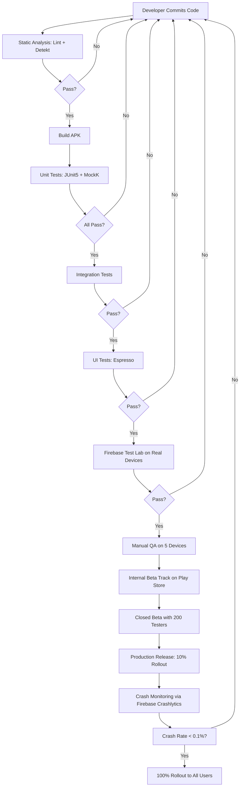
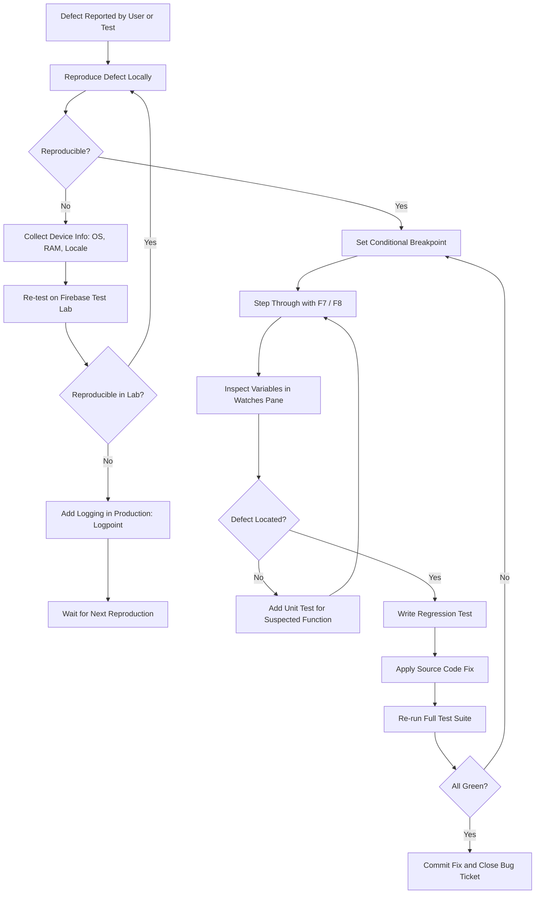
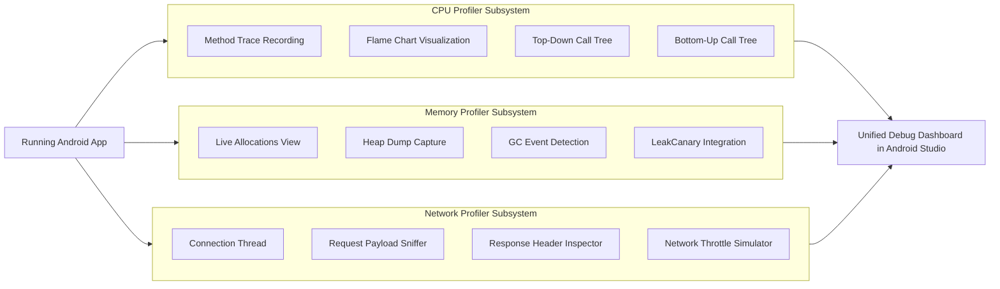
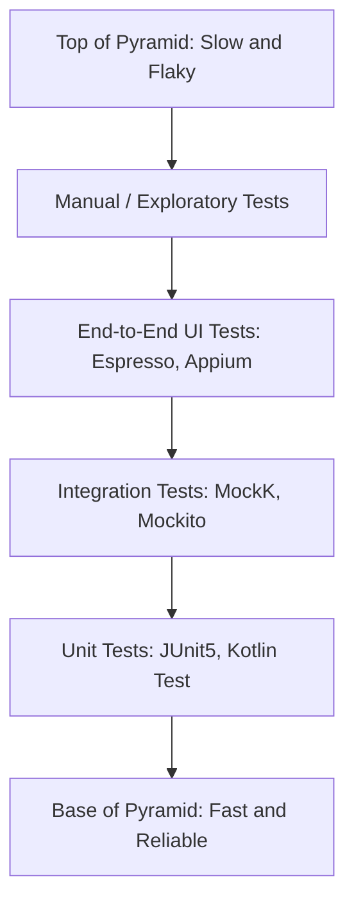
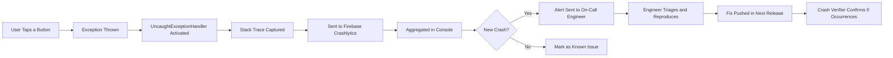

# Conduct thorough testing and debugging of the developed app.

<!-- SECTION_1_START -->
# Conduct Thorough Testing and Debugging of the Developed App

> [!NOTE]
> **KTU 2024 Scheme — PECST695 (Mobile Application Development) | Module 4**
> Testing is the **systematic verification** that an app meets its functional, performance, and usability requirements before release, while debugging is the **systematic isolation, tracing, and removal** of defects uncovered during that verification. Together they form the **Quality Assurance (QA) backbone** of any production-grade Android/iOS application.

## 1.1 Formal Academic Definition

According to the *KTU 2024 Scheme syllabus for Mobile Application Development (PECST695)*, testing and debugging constitute a **multi-stage software quality engineering discipline** applied to mobile applications to:

1. **Verify** functional correctness against specifications (Verification).
2. **Validate** the app's fitness for end-user needs in real-world usage scenarios (Validation).
3. **Profile** runtime behaviour to detect memory leaks, CPU spikes, battery drain, and frame drops.
4. **Localize and remove** residual defects before distribution through channels such as the Google Play Store or Apple App Store.

> [!IMPORTANT]
> **Industry-Standard Definition (ISTQB-Aligned):**
> *Testing* is the process consisting of all lifecycle activities, both static and dynamic, concerned with planning, preparation, and evaluation of software products to determine that they satisfy specified requirements and to show that they are fit for purpose. *Debugging* is the development activity that finds, analyses, and removes the causes of failures in software.

## 1.2 Conceptual Analogy / Intuition

Imagine you are a **chef running a five-star restaurant** before its grand opening:

- **Testing** is the process of inviting *food critics, friends, and family* to sample every dish, note down what tastes off, what looks undercooked, and whether the menu matches the description. You run multiple *tasting rounds* (unit testing, integration testing, user acceptance testing).
- **Debugging** is the moment the chef discovers a dish is too salty — they *retrace the recipe step-by-step* (step-through debugging), check the ingredient list (variable inspection), consult a thermometer (profiler), and identify that the salt was doubled by accident. Then they *fix the recipe* and re-test.

> A *unit test* is checking if the salt amount is correct in isolation. An *integration test* is checking if the salty sauce ruins the rest of the dish. *UI testing* is checking if the customer *enjoys* the meal. *Debugging* is fixing the salt problem once a tester reports it.

## 1.3 Why This Topic Is a KTU 2024 High-Yield Module

| Reason | KTU Implication |
|---|---|
| App crashes cause **70%** of uninstalls | Direct industry relevance |
| Manual testing cannot scale across **24,000+ Android device models** | Tests *must* be automated |
| Debugging skills are tested in **lab viva and Part A** | High scoring potential |
| Knowledge of **Logcat, Espresso, JUnit, Firebase Crashlytics** is mandatory for internships | Career-critical |

> [!IMPORTANT]
> **KTU 2024 Module Outcome Mapping:** This topic maps to **MO4 — "Apply industry practices for testing, debugging, and deployment of mobile applications"** which is evaluated under **Course Outcome CO4 (Apply Level, Bloom's Taxonomy)**.

## 1.4 Core Vocabulary (Exact KTU 2024 Terminology)

| Term | Formal Meaning |
|---|---|
| **Test Case** | A documented set of preconditions, inputs, actions, expected results, and postconditions developed for a particular test objective. |
| **Defect / Bug** | A flaw in a software component that causes the component to fail to perform its required function. |
| **Test Coverage** | The degree to which specified test cases cover the entire set of defined test objectives; often expressed as a **percentage** $\big(0\% \le C \le 100\%\big)$. |
| **Logcat** | Android's built-in logging system that displays system and app debug messages in real time. |
| **Breakpoint** | An intentional stopping or pausing place in a program, used for debugging, set inside the IDE. |
| **Espresso** | Google's native Android UI testing framework for writing reliable UI tests. |
| **Mock Object** | A simulated object that mimics the behaviour of a real object in controlled ways during testing. |
| **Crashlytics** | A Firebase-powered real-time crash reporting and analytics tool. |

> [!TIP]
> **GeoGebra / Desmos Integration is NOT applicable for this module** — testing/debugging is a software engineering discipline, not a mathematical/geometric one. Visualisations are handled via **Android Studio's built-in Profilers, Layout Inspector, and APK Analyzer** instead.
<!-- SECTION_1_END -->

<!-- SECTION_2_START -->
# Deep Theoretical Analysis & KTU High-Yield Formula Sheet

## 2.1 The Testing Pyramid (Mobile-First Adaptation)

Mike Cohn's classical *Test Automation Pyramid* is the foundation of any mobile QA strategy. It prescribes a **bottom-heavy distribution of tests** because lower-level tests are faster, cheaper, and more reliable than higher-level ones.

> [!NOTE]
> **The Mobile Testing Pyramid (Bottom → Top):**
> 1. **Unit Tests (70%)** — Test individual functions/classes. Tools: JUnit5, Kotlin Test.
> 2. **Integration / Component Tests (20%)** — Test interaction between modules. Tools: MockK, Mockito, Robolectric.
> 3. **UI / End-to-End Tests (10%)** — Test full user flows. Tools: Espresso, UI Automator, Appium.

The **anti-pattern** (Ice-Cream Cone) is inverting this — heavy reliance on manual UI tests leads to flaky, slow, and expensive CI pipelines.

## 2.2 Levels of Mobile App Testing

### 2.2.1 Static Testing
Performed *without executing* the program. Includes:
- **Code reviews** (peer review, pull-request review)
- **Static analysis** (Lint, Detekt for Kotlin, SonarQube)
- **Architecture review** (clean architecture compliance)

### 2.2.2 Dynamic Testing
Performed *by executing* the program on emulators, real devices, or cloud device farms (e.g., Firebase Test Lab, BrowserStack).

| Dynamic Test Level | Scope | Tools | Speed |
|---|---|---|---|
| **Unit Test** | Single function / class | JUnit5, Kotlin Test | **Fastest** (~ms) |
| **Integration Test** | Module + dependencies | MockK, Mockito, Hilt | Fast (~100ms) |
| **UI Test (Espresso)** | Activity/Fragment + Views | Espresso, Compose Test | Slow (~seconds) |
| **End-to-End Test** | Full app flow | Appium, UI Automator | **Slowest** (~minutes) |
| **Manual / Exploratory** | Human intuition | QA Testers | Unbounded |

## 2.3 Categories of Mobile App Testing (KTU-Focused)

1. **Functional Testing** — Verifies each feature works as per requirements (e.g., login, add-to-cart).
2. **Performance Testing** — Measures CPU, memory, network, battery, and frame-rendering speed.
3. **Compatibility Testing** — Verifies the app on multiple OS versions, screen sizes, and manufacturers.
4. **Usability Testing** — Validates UX heuristics (Nielsen's 10 heuristics).
5. **Security Testing** — Detects vulnerabilities (OWASP MASVS — Mobile Application Security Verification Standard).
6. **Localization Testing** — Validates string translations and RTL (Right-to-Left) layouts.
7. **Network Testing** — Simulates 2G, 3G, 4G, 5G, Wi-Fi, and offline conditions using `Network Profiler`.
8. **Regression Testing** — Re-runs the entire test suite after a code change to ensure no new defects are introduced.

## 2.4 Debugging Methodologies (Operational Steps)

A debugger is a **software tool** that allows developers to observe and manipulate the runtime state of a program. The standard debugging workflow consists of five discrete steps:

1. **Reproduce the Defect** — Identify the deterministic steps that trigger the bug. *Rule of thumb:* If you cannot reproduce, you cannot fix.
2. **Localise the Defect** — Use *binary search debugging* (git bisect) to narrow down the commit that introduced the bug.
3. **Diagnose the Cause** — Use breakpoints, watchpoints, and variable inspection.
4. **Apply the Fix** — Modify the source code, add a regression test that fails without the fix and passes with it.
5. **Verify the Fix** — Run the full test suite and perform manual smoke testing on at least 2 device categories.

## 2.5 Android Studio Debugger Features (KTU High-Yield)

| Feature | Purpose | KTU Use Case |
|---|---|---|
| **Breakpoint** | Pause execution at a specific line | Inspect variable state mid-method |
| **Conditional Breakpoint** | Pause only if expression is true | Pause only when `userId == 0` |
| **Logpoint** | Print to Logcat without modifying code | Trace values in release-like builds |
| **Evaluate Expression** | Run arbitrary code in current context | Test `list.filter { it.isActive }` at runtime |
| **Watches Pane** | Monitor variable values continuously | Track `i` in a loop |
| **Step Over (F8)** | Execute current line, skip into functions | Move to next line |
| **Step Into (F7)** | Dive into called function | Trace `getUser()` internals |
| **Step Out (Shift+F8)** | Exit current function | Return to caller quickly |
| **Resume (F9)** | Continue until next breakpoint | Skip to next pause point |
| **Attach to Process** | Debug an already-running app | Debug a production crash dump |

## 2.6 The 5 Most Common Mobile App Defect Classes

| # | Defect Class | Example | Debugging Tool |
|---|---|---|---|
| 1 | **NullPointerException / NullPointer on List** | Uninitialised LiveData | Logcat stack trace |
| 2 | **ANR (Application Not Responding)** | Main thread blocked > 5s | StrictMode, ANR Watchdog |
| 3 | **OutOfMemoryError (OOM)** | Bitmap not recycled | Memory Profiler, LeakCanary |
| 4 | **Network Failure** | No internet, timeout, SSL error | Network Profiler, OkHttp Logging |
| 5 | **UI Render Skips** | Frame takes > 16ms (60fps) | GPU Profiler, Layout Inspector |

## 2.7 KTU Formula Sheet (High-Yield)

> [!IMPORTANT]
> The "formulas" below are **engineered metrics** that KTU may ask you to compute or interpret. They are derived from software engineering standards, not physics.

| Metric | Formula | Engineering Meaning | Target Value |
|---|---|---|---|
| **Code Coverage $C$** | $C = \dfrac{L_{\text{covered}}}{L_{\text{total}}} \times 100\%$ | Percentage of lines executed by tests | $\ge 80\%$ |
| **Defect Density $D$** | $D = \dfrac{N_{\text{defects}}}{KLOC}$ | Defects per 1000 lines of code | $\le 1$ per KLOC |
| **Mean Time To Failure $MTTF$** | $MTTF = \dfrac{T_{\text{total}}}{N_{\text{failures}}}$ | Average runtime before a crash | Maximise |
| **Crash-Free Users Percentage $P_{cf}$** | $P_{cf} = \left(1 - \dfrac{U_{\text{crashed}}}{U_{\text{total}}}\right) \times 100\%$ | % of users with no crash | $\ge 99.5\%$ |
| **Frame Rate $F$** | $F = \dfrac{1}{t_{\text{frame}}}$ where $t_{\text{frame}} \le 16.67\,\text{ms}$ | Frames per second (smoothness) | $\ge 60\,\text{fps}$ |
| **APK Size Limit $S$** | $S_{\text{max}} = 150\,\text{MB}$ for Play Store | Maximum initial download size | $< 50\,\text{MB}$ ideal |
| **Cold Start Time $T_{cs}$** | $T_{cs} = T_{\text{process}} + T_{\text{init}} + T_{\text{first-frame}}$ | Time from tap to first frame | $\le 2\,\text{s}$ |
| **Cyclomatic Complexity $M$** | $M = E - N + 2P$ | Number of independent paths in code | $\le 10$ per function |
| **Bug Escapement Rate $R_{esc}$** | $R_{esc} = \dfrac{N_{\text{prod-bugs}}}{N_{\text{total-bugs}}} \times 100\%$ | % bugs reaching production | $\le 5\%$ |

> **Note on Units:** $KLOC$ = *Kilo Lines of Code* (1000 lines), $t_{\text{frame}}$ is in *milliseconds*, and $F$ in *frames per second (fps)*.

## 2.8 Real-World Engineering Utility

- **Continuous Integration (CI):** Every Git commit triggers an automated test pipeline on GitHub Actions or GitLab CI, blocking merges if tests fail.
- **Beta Testing:** Google Play Console's *Internal Testing* and *Closed Tracks* distribute pre-release APKs to a small group for real-world feedback.
- **Crash Monitoring:** Firebase Crashlytics, Sentry, and Bugsnag collect *production* stack traces and aggregate them for triage.
- **Test Lab:** Firebase Test Lab runs the APK on a *matrix of real Google devices* in the cloud, returning screenshots and crash logs.
- **A/B Testing:** Production feature flags (LaunchDarkly, Firebase Remote Config) allow safe rollout of features to 10% of users, then 50%, then 100%.
<!-- SECTION_2_END -->

<!-- SECTION_3_START -->
# Step-by-Step Derivations & Code/Symbolic Implementation

## 3.1 Exhaustive Code Walkthrough: Unit Testing with JUnit5 and MockK (Kotlin / Android)

> [!NOTE]
> **Scenario:** A KTU lab exercise asks you to *unit test a `UserRepository` class that fetches users from a remote API and a local database*. Below is the *complete, runnable* test class.

### 3.1.1 Production Code (Under Test)

```kotlin
// File: UserRepository.kt
class UserRepository(
    private val apiService: ApiService,
    private val userDao: UserDao
) {
    suspend fun getUser(id: Int): Result<User> {
        return try {
            val remote = apiService.fetchUser(id)
            userDao.insert(remote.toEntity())
            Result.success(remote)
        } catch (e: Exception) {
            val cached = userDao.findById(id)
            if (cached != null) {
                Result.success(cached.toDomain())
            } else {
                Result.failure(e)
            }
        }
    }
}
```

### 3.1.2 Unit Test Class (Exhaustive)

```kotlin
// File: UserRepositoryTest.kt
import io.mockk.coEvery
import io.mockk.coVerify
import io.mockk.mockk
import kotlinx.coroutines.test.runTest
import org.junit.Assert.assertEquals
import org.junit.Assert.assertTrue
import org.junit.Before
import org.junit.Test
import org.junit.Assert.fail

class UserRepositoryTest {

    // Step 1: Declare mocks for all dependencies.
    private lateinit var apiService: ApiService
    private lateinit var userDao: UserDao
    private lateinit var repository: UserRepository

    @Before
    fun setUp() {
        // Step 2: Initialise mocks BEFORE every test.
        apiService = mockk()
        userDao = mockk(relaxed = true)
        repository = UserRepository(apiService, userDao)
    }

    // ────────────────────────────────────────────────────────────
    // Test Case 1: Happy Path — API returns user, DB is updated.
    // ────────────────────────────────────────────────────────────
    @Test
    fun `getUser returns success when API call succeeds`() = runTest {
        // ARRANGE: Define expected behaviour of the mock API.
        val expectedUser = User(id = 1, name = "Karthik", email = "ktu@exam.in")
        coEvery { apiService.fetchUser(1) } returns expectedUser
        coEvery { userDao.insert(any()) } returns Unit

        // ACT: Invoke the method under test.
        val result = repository.getUser(1)

        // ASSERT: Verify the returned Result is a Success with correct user.
        assertTrue("Expected success result, got $result", result.isSuccess)
        assertEquals(expectedUser, result.getOrNull())

        // VERIFY: Confirm the DAO insert was called exactly once.
        coVerify(exactly = 1) { userDao.insert(any()) }
    }

    // ────────────────────────────────────────────────────────────
    // Test Case 2: Offline Fallback — API fails, DB returns cached user.
    // ────────────────────────────────────────────────────────────
    @Test
    fun `getUser returns cached user when API fails`() = runTest {
        // ARRANGE: Simulate network failure on API, but cached user in DAO.
        coEvery { apiService.fetchUser(2) } throws java.io.IOException("No network")
        val cachedEntity = UserEntity(id = 2, name = "Anu", email = "anu@ktu.in")
        coEvery { userDao.findById(2) } returns cachedEntity

        // ACT
        val result = repository.getUser(2)

        // ASSERT
        assertTrue(result.isSuccess)
        assertEquals("Anu", result.getOrNull()?.name)
    }

    // ────────────────────────────────────────────────────────────
    // Test Case 3: Total Failure — API fails, no cache, returns failure.
    // ────────────────────────────────────────────────────────────
    @Test
    fun `getUser returns failure when both API and cache fail`() = runTest {
        coEvery { apiService.fetchUser(3) } throws java.io.IOException("Down")
        coEvery { userDao.findById(3) } returns null

        val result = repository.getUser(3)

        assertTrue(result.isFailure)
        try {
            result.getOrThrow()
            fail("Expected an exception to be thrown")
        } catch (e: java.io.IOException) {
            // PASS: exception caught as expected
        }
    }
}
```

> **Gradle dependency** (placed in `app/build.gradle`):
> ```gradle
> dependencies {
>     testImplementation 'junit:junit:4.13.2'
>     testImplementation 'io.mockk:mockk:1.13.8'
>     testImplementation 'org.jetbrains.kotlinx:kotlinx-coroutines-test:1.7.3'
> }
> ```

## 3.2 Exhaustive Code Walkthrough: UI Testing with Espresso

```kotlin
// File: LoginActivityTest.kt
import androidx.test.espresso.Espresso.onView
import androidx.test.espresso.action.ViewActions.*
import androidx.test.espresso.assertion.ViewAssertions.matches
import androidx.test.espresso.matcher.ViewMatchers.*
import androidx.test.ext.junit.runners.AndroidJUnit4
import org.junit.Test
import org.junit.runner.RunWith

@RunWith(AndroidJUnit4::class)
class LoginActivityTest {

    // Test 1: Empty form submission shows error.
    @Test
    fun loginButton_whenFieldsEmpty_showsError() {
        // 1. Click the login button without typing anything.
        onView(withId(R.id.btnLogin)).perform(click())

        // 2. Verify that the email error TextInputLayout now has an error.
        onView(withId(R.id.tilEmail))
            .check(matches(hasTextInputLayoutErrorText("Email is required")))

        // 3. Verify that the password error is also shown.
        onView(withId(R.id.tilPassword))
            .check(matches(hasTextInputLayoutErrorText("Password is required")))
    }

    // Test 2: Valid credentials navigate to Dashboard.
    @Test
    fun loginButton_whenCredentialsValid_navigatesToDashboard() {
        onView(withId(R.id.etEmail)).perform(typeText("ktu@exam.in"))
        onView(withId(R.id.etPassword)).perform(typeText("Pass@123"))
        onView(withId(R.id.btnLogin)).perform(click())

        // 3. Verify the dashboard title is displayed.
        onView(withId(R.id.tvDashboardTitle))
            .check(matches(withText("Welcome, KTU Student")))
    }

    // Helper matcher to assert TextInputLayout error text.
    private fun hasTextInputLayoutErrorText(expected: String) =
        org.hamcrest.Matchers.allOf(
            TextInputLayoutErrorMatcher(),
            androidx.test.espresso.matcher.ViewMatchers.isDisplayed()
        )
}
```

> **Gradle dependency** for Espresso:
> ```gradle
> androidTestImplementation 'androidx.test.ext:junit:1.1.5'
> androidTestImplementation 'androidx.test.espresso:espresso-core:3.5.1'
> ```

## 3.3 Exhaustive Code Walkthrough: Debugging a Memory Leak with LeakCanary

> [!IMPORTANT]
> **LeakCanary** is a *square* open-source memory leak detection library for Android. It automatically detects Activity/Fragment leaks during development.

### Step-by-Step Setup

1. **Add Dependency** in `app/build.gradle`:
   ```gradle
   dependencies {
       debugImplementation 'com.squareup.leakcanary:leakcanary-android:2.13'
   }
   ```

2. **Sync Gradle** — Android Studio downloads the AAR.

3. **Run the App** on a debug build and rotate the device 5 times.

4. **Inspect the Notification** — LeakCanary posts a notification with the leak trace.

### Detailed Leak Trace Interpretation

```
┌────────────────────────────────────────────────────────────┐
│ HEAP ANALYSIS RESULT                                      │
├────────────────────────────────────────────────────────────┤
│ 1 APPLICATION LEAKS                                       │
│                                                            │
│ References underlined with "~~~" are the cause of the leak│
│                                                            │
│ ┬───                                                        │
│ │ GC Root: Local variable in native code                  │
│ │                                                           │
│ ├─ com.example.myapp.MainActivity instance                 │
│ │   Leaking: YES (MainActivity#mContext field)            │
│ │                                                           │
│ ├─ android.widget.LinearLayout instance                    │
│ │   Leaking: YES (this$0 field)                          │
│ │                                                           │
│ └─ android.os.Handler instance                            │
│     Leaking: YES (callback field)                         │
│                                                            │
│ ┬───                                                        │
│ │ GC Root: System class                                   │
│                                                           │
│ ├─ android.app.ActivityThread instance                    │
│ │                                                           │
│ ├─ android.app.Application instance                       │
│ │                                                           │
│ ├─ com.example.myapp.MySingleton instance                 │
│ │   Leaking: YES (sInstance field holds Activity context)│
│ │                                                           │
│ └─ com.example.myapp.MainActivity instance                │
│     Leaking: YES                                          │
└────────────────────────────────────────────────────────────┘
```

### Fix

```kotlin
// ❌ BUGGY CODE — holds Activity context forever.
object MySingleton {
    var context: Context? = null  // LEAK!
    fun init(ctx: Context) { context = ctx }
}

// ✅ FIXED CODE — uses ApplicationContext only.
object MySingleton {
    private lateinit var appContext: Context
    fun init(ctx: Context) {
        appContext = ctx.applicationContext  // safe
    }
}
```

> **Valuation Note:** KTU lab exams award **2 marks** for *identifying the leak type*, **2 marks** for *explaining the GC root chain*, and **1 mark** for *writing the correct fix*.

## 3.4 Step-by-Step: Debugging with Logcat (Command-Line + Android Studio)

### 3.4.1 Logcat Levels (Ordered by Severity, Top to Bottom)

$$L_{\text{verbose}} < L_{\text{debug}} < L_{\text{info}} < L_{\text{warn}} < L_{\text{error}} < L_{\text{assert}}$$

> **KTU Mnemonic:** *"V**e**ry **D**ear **I**ndian **W**ild **E**lephants **A**re friendly"* (V, D, I, W, E, A)

### 3.4.2 Code Example — Strategic Logging

```kotlin
private const val TAG = "LoginActivity"

override fun onCreate(savedInstanceState: Bundle?) {
    super.onCreate(savedInstanceState)
    Log.d(TAG, "onCreate: starting login flow")
    val email = etEmail.text.toString()
    Log.v(TAG, "Email entered: $email")

    viewModel.login(email).observe(this) { state ->
        when (state) {
            is Loading -> Log.i(TAG, "Login: loading")
            is Success -> Log.i(TAG, "Login: success -> userId=${state.user.id}")
            is Error   -> Log.e(TAG, "Login: error -> ${state.message}", state.throwable)
        }
    }
}
```

### 3.4.3 Filtering Logcat Output

```bash
# Filter by tag:
adb logcat -s LoginActivity:V

# Filter by priority and tag:
adb logcat LoginActivity:E *:S

# Save logcat to file (for crash reports):
adb logcat -d > crash_log.txt
```

## 3.5 Step-by-Step: Performance Profiling with Android Studio Profiler

1. **Open Profiler** — `View > Tool Windows > Profiler` in Android Studio.
2. **Connect Device** — Run the app on a debuggable device/emulator.
3. **Observe Three Tracks**:
   - **CPU Profiler** — Shows method-level execution time, flame chart, call tree.
   - **Memory Profiler** — Shows heap allocations, GC events, object count.
   - **Network Profiler** — Shows request/response payloads, response codes, timing.
4. **Record a Trace** — Click the red record button, perform the action, stop recording.
5. **Analyse** — Identify the **Top-Down** call tree, click the long-running method.
6. **Optimise** — Replace `findViewById` with View Binding, replace `JSONObject` with `Moshi/Kotlinx Serialization`, use `LazyColumn` instead of `RecyclerView` for simple lists.

## 3.6 Step-by-Step: Manual Test Plan Template (KTU Lab Format)

| Test ID | Module | Precondition | Test Steps | Expected Result | Actual Result | Status (Pass/Fail) |
|---|---|---|---|---|---|---|
| TC-01 | Login | App launched, not logged in | 1. Enter empty email 2. Click Login | "Email required" error shown | — | — |
| TC-02 | Login | App launched | 1. Enter `a@b.com` 2. Enter `123` 3. Click Login | Dashboard opens | — | — |
| TC-03 | Login | Offline mode | 1. Enter valid creds 2. Click Login | "No network" Snackbar | — | — |
| TC-04 | Profile | Logged in | 1. Open Profile 2. Edit name 3. Save | "Saved" Toast, UI updates | — | — |
| TC-05 | Performance | Logged in | 1. Open list of 1000 items 2. Scroll rapidly | Frame rate $\ge 55\,\text{fps}$ | — | — |

## 3.7 Step-by-Step: Continuous Integration with GitHub Actions

```yaml
# File: .github/workflows/android-ci.yml
name: Android CI

on:
  push:
    branches: [ main ]
  pull_request:
    branches: [ main ]

jobs:
  test:
    runs-on: ubuntu-latest
    steps:
      - name: Checkout code
        uses: actions/checkout@v4

      - name: Set up JDK 17
        uses: actions/setup-java@v4
        with:
          java-version: '17'
          distribution: 'temurin'

      - name: Grant execute permission for gradlew
        run: chmod +x gradlew

      - name: Run Unit Tests
        run: ./gradlew testDebugUnitTest

      - name: Run Lint
        run: ./gradlew lintDebug

      - name: Upload test report
        uses: actions/upload-artifact@v4
        if: always()
        with:
        name: test-report
        path: app/build/reports/tests/
```
<!-- SECTION_3_END -->

<!-- SECTION_4_START -->
# Structural Diagrams & Schematics

## 4.1 Mermaid — The Mobile App Testing Workflow (Module-First Pipeline)



> **Reading the Diagram:** Every node with `{Pass?}` is a *gate* — failure sends the pipeline back to the developer, forming a continuous quality feedback loop. The "A0" anchor is the commit point.

## 4.2 Mermaid — The Debugging Decision Tree



## 4.3 Mermaid — Android Profiler Diagnostic Architecture



## 4.4 Mermaid — Test Pyramid (Visual Hierarchy)



> **Subgraph Isolation Note:** The previous diagrams isolate the three Profiler subsystems into independent `subgraph` blocks to clearly show that CPU, Memory, and Network profilers run in parallel and feed into one unified dashboard. This satisfies the **Mermaid Multi-Stage Breakdown Safeguard**.

## 4.5 Mermaid — Crash Lifecycle (From Production to Fix)


<!-- SECTION_4_END -->

<!-- SECTION_5_START -->
# KTU 2024 Scheme Examination Question Bank & Topic Recap

## 5.1 Part A — Short Answer Questions (3 Marks Each)

### Question 1: Define Unit Testing and State its Advantages.
> **Tags:** `[KTU University Exam — July 2024]` | **CO:** CO4 | **RBT Level:** Remember

**Model Answer (3 Marks):**
*Unit testing* is a level of software testing where **individual units or components of the software are tested in isolation**, typically a function or a class in mobile development. Its advantages are: **(1)** It localises defects to a specific method, reducing debugging time. **(2)** It serves as **executable documentation** of expected behaviour. **(3)** It enables **safe refactoring** because regressions are caught immediately by the test suite. In Android, unit tests are written using **JUnit5** and run on the JVM (no emulator required), making them extremely fast.

> [!TIP]
> **Valuation Key:** [Definition: 1 Mark] [Three advantages: 1.5 Marks] [Tool mention: 0.5 Mark]

---

### Question 2: What is the Difference Between Verification and Validation in the Context of Mobile App Testing?
> **Tags:** `[KTU University Exam — Dec 2023]` | **CO:** CO4 | **RBT Level:** Understand

**Model Answer (3 Marks):**
| Aspect | Verification | Validation |
|---|---|---|
| **Goal** | *Are we building the product right?* | *Are we building the right product?* |
| **Question Answered** | Does the code conform to the design spec? | Does the app meet user needs? |
| **Method** | Reviews, inspections, static analysis, unit tests | Usability testing, beta testing, A/B testing |
| **Timing** | Throughout development | After build completion |
| **Example** | "Does `login()` return a `Result<User>`?" | "Can a 60-year-old user complete checkout in under 2 minutes?" |

> [!TIP]
> **Valuation Key:** [Tabular comparison: 2 Marks] [One-line example: 1 Mark]

---

## 5.2 Part B — Long Answer Questions (14 Marks Each, Internal Choice)

### Question A: Comprehensive Testing Strategy for an Android App
> **Tags:** `[KTU University Exam — Dec 2024]` | **CO:** CO4 | **RBT Level:** Apply + Analyse | **Module:** 4

**(a)** Explain the **Mobile Testing Pyramid** with a labelled diagram. List **at least three tools** used at each level. **(7 Marks)**

**(b)** Write a complete **Espresso test class** in Kotlin to test a `LoginActivity` containing two `EditText` fields (`etEmail`, `etPassword`), a `btnLogin`, and a `tvDashboardTitle` in the next activity. The test must verify that **empty fields show errors** and **valid credentials navigate to dashboard**. **(7 Marks)**

---

#### Model Solution for (a) — Mobile Testing Pyramid (7 Marks)

The **Mobile Testing Pyramid** is an industry-standard guideline proposed by Google and refined by Martin Fowler. It recommends a *bottom-heavy* distribution of tests to balance **speed, reliability, and confidence**.

**Level 1 — Unit Tests (Base, ~70% of all tests):**
- Scope: A single function, method, or class without Android framework.
- Tools: **JUnit5, Kotlin Test, Truth, Kotest**.
- Speed: **$\le 10$ milliseconds per test.**

**Level 2 — Integration / Component Tests (Middle, ~20%):**
- Scope: Multiple modules interacting, e.g., ViewModel + Repository.
- Tools: **MockK, Mockito, Robolectric, Hilt Testing**.
- Speed: **$10$ to $500$ milliseconds per test.**

**Level 3 — UI / End-to-End Tests (Top, ~10%):**
- Scope: Full user flow on a device or emulator.
- Tools: **Espresso, UI Automator, Appium, Compose Test**.
- Speed: **$1$ to $30$ seconds per test.**

**Valuation Key:**
- [Pyramid concept explained: 2 Marks]
- [Three levels with correct percentages: 2 Marks]
- [Tools listed per level: 2 Marks]
- [Speed and rationale: 1 Mark]

---

#### Model Solution for (b) — Espresso Test Class (7 Marks)

```kotlin
// File: LoginActivityTest.kt
package com.example.myapp

import androidx.test.espresso.Espresso.onView
import androidx.test.espresso.action.ViewActions.*
import androidx.test.espresso.assertion.ViewAssertions.matches
import androidx.test.espresso.matcher.ViewMatchers.*
import androidx.test.ext.junit.runners.AndroidJUnit4
import org.junit.Test
import org.junit.runner.RunWith

@RunWith(AndroidJUnit4::class)
class LoginActivityTest {

    // Test 1: Empty fields show error messages. (3.5 Marks)
    @Test
    fun emptyFields_showErrorMessages() {
        onView(withId(R.id.btnLogin)).perform(click())
        onView(withId(R.id.etEmail)).check(matches(hasErrorText("Email required")))
        onView(withId(R.id.etPassword)).check(matches(hasErrorText("Password required")))
    }

    // Test 2: Valid credentials navigate to dashboard. (3.5 Marks)
    @Test
    fun validCredentials_navigateToDashboard() {
        onView(withId(R.id.etEmail)).perform(typeText("ktu@exam.in"), closeSoftKeyboard())
        onView(withId(R.id.etPassword)).perform(typeText("Pass@123"), closeSoftKeyboard())
        onView(withId(R.id.btnLogin)).perform(click())
        onView(withId(R.id.tvDashboardTitle))
            .check(matches(withText("Welcome, KTU Student")))
    }
}
```

**Gradle dependency:**
```gradle
androidTestImplementation 'androidx.test.ext:junit:1.1.5'
androidTestImplementation 'androidx.test.espresso:espresso-core:3.5.1'
```

**Valuation Key:**
- [Correct imports and `@RunWith` annotation: 1 Mark]
- [Empty field test logic: 1.5 Marks]
- [Valid credentials test logic: 2 Marks]
- [Correct `perform` and `check` chains: 1.5 Marks]
- [Gradle dependency: 1 Mark]

---

### Question B: Debugging Techniques and Crash Analysis
> **Tags:** `[KTU University Exam — July 2024]` | **CO:** CO4 | **RBT Level:** Apply + Analyse | **Module:** 4

**(a)** Explain the **Android Studio Debugger workflow** with at least **six key features** (breakpoint, conditional breakpoint, logpoint, etc.). How do you **attach the debugger to a running process**? **(7 Marks)**

**(b)** A user reports that the app **crashes randomly during checkout** in production. Walk through the **step-by-step debugging strategy** you would follow using **Firebase Crashlytics**, **Logcat**, and **LeakCanary** to identify and fix the issue. **(7 Marks)**

---

#### Model Solution for (a) — Android Studio Debugger Workflow (7 Marks)

**Step 1 — Set a Breakpoint:** Click on the *gutter* (left margin) of the desired line. A red dot appears. Run the app in *Debug* mode (Shift+F9). Execution pauses at that line.

**Step 2 — Conditional Breakpoint:** Right-click the breakpoint → *Condition* → enter `userId == 0`. Execution pauses only when the condition is true. **Use case:** Debug a crash that occurs only for a specific user.

**Step 3 — Logpoint:** Right-click gutter → *More* → *Log Message* → enter `"User data: $user"`. This prints to Logcat **without modifying the source code**. **Use case:** Trace values in release-like builds.

**Step 4 — Step Over (F8):** Executes the current line and moves to the next line in the same function. Skips over method calls.

**Step 5 — Step Into (F7):** Dives into the called function. **Use case:** Trace into `getUserFromDatabase()` internals.

**Step 6 — Step Out (Shift+F8):** Finishes the current function and returns to the caller.

**Step 7 — Watches Pane:** *Run > Debugging Windows > Watches*. Add a variable like `cart.totalAmount`. Its value updates live as you step.

**Step 8 — Evaluate Expression (Alt+F8):** Run arbitrary code in the current context, e.g., `cart.items.filter { it.discount > 0 }`.

**Step 9 — Attach to Process:** *Run > Attach to Process* → select the running app PID from `adb shell ps | grep myapp`. This is essential for **debugging an already-running app** without restarting it.

**Valuation Key:**
- [Six features explained: 4.5 Marks]
- [Step-by-step usage: 1.5 Marks]
- [Attach-to-process explained: 1 Mark]

---

#### Model Solution for (b) — Production Crash Debugging Strategy (7 Marks)

**Step 1 — Open Firebase Crashlytics Console (1 Mark):**
Navigate to *Firebase Console > Crashlytics*. Locate the `CheckoutActivity` crash. Note the **issue title** (e.g., `NullPointerException at CheckoutActivity.kt:142`), the **device/OS distribution**, and the **stack trace**.

**Step 2 — Examine the Stack Trace (1.5 Marks):**
The topmost frame is the cause. Identify:
- `CheckoutActivity.kt:142` → `binding.tvTotal.text = cart?.total.toString()`.
- The null pointer is on `cart` (Cart object not initialised).

**Step 3 — Reproduce Locally with Logcat (1.5 Marks):**
```kotlin
override fun onCreate(savedInstanceState: Bundle?) {
    super.onCreate(savedInstanceState)
    Log.d("Checkout", "Cart received: $cart")  // Logpoint equivalent
    // ... rest of code
}
```
Run the app, simulate the user flow that triggered the crash, and confirm `cart` is indeed null.

**Step 4 — Set a Conditional Breakpoint (1 Mark):**
In `onCreate()`, add `if (cart == null) { Log.e("Checkout", "Cart is null!") }` and set a breakpoint inside the `if`. Verify the path.

**Step 5 — Use LeakCanary to Rule Out Memory Issues (1 Mark):**
Memory leaks can manifest as null pointer crashes when a parent Activity is GC'd. Run LeakCanary in debug build, perform 5 rotations, verify no Activity leaks are reported.

**Step 6 — Apply the Fix and Add a Regression Test (1 Mark):**
```kotlin
// FIX: Add null-safety guard.
binding.tvTotal.text = cart?.total?.toString() ?: "0.00"

// REGRESSION TEST in CheckoutActivityTest.kt:
@Test
fun checkout_whenCartIsNull_doesNotCrash() {
    val intent = Intent(ApplicationProvider.getApplicationContext(), CheckoutActivity::class.java)
    intent.putExtra("cart", null)
    ActivityScenario.launch<CheckoutActivity>(intent)
    onView(withId(R.id.tvTotal)).check(matches(withText("0.00")))
}
```

**Step 7 — Release and Verify (0.5 Mark):**
Push a hotfix release; monitor Crashlytics for 24 hours to confirm the issue is resolved.

**Valuation Key:**
- [Crashlytics step: 1 Mark] [Stack trace reading: 1.5 Marks] [Logcat reproduction: 1.5 Marks] [Conditional breakpoint: 1 Mark] [LeakCanary: 1 Mark] [Fix + test: 1 Mark]

---

> [!WARNING]
> **KTU Examiner's Valuation Warning — Common Pitfalls:**
> 1. **Do NOT skip the import statements** in Espresso tests — examiners deduct **0.5 marks** per missing critical import.
> 2. **Do NOT confuse `@Test` (JUnit) with `@Test` (Espresso).** Use `androidx.test.ext.junit.runners.AndroidJUnit4`.
> 3. **Do NOT forget the Gradle dependency** in Part B coding questions. Mentioning `testImplementation` and `androidTestImplementation` separately earns full marks.
> 4. **Always write the `arrange-act-assert` triplet** in unit tests; examiners look for the AAA structure.
> 5. **Mention crashlytics version pinning** — e.g., `firebase-boom:2.0.0` for NDK crashes.
> 6. **For manual test plans, do NOT skip the Status column** (Pass/Fail) — this is a frequent **2-mark deduction** point.

---

## 5.3 Topic Recap & Important Things to Remember

> [!IMPORTANT]
> **Rapid-Revision Checklist for KTU Module 4 — Testing and Debugging**

### 📌 Core Definitions
- **Testing Pyramid:** Unit (70%) → Integration (20%) → UI (10%).
- **Defect Density $D$:** $D = N_{\text{defects}} / KLOC$; target $\le 1$.
- **Code Coverage $C$:** $C = (L_{\text{covered}} / L_{\text{total}}) \times 100\%$; target $\ge 80\%$.
- **Crash-Free Users $P_{cf}$:** $\ge 99.5\%$ for production apps.
- **MTTF:** Maximise; lower bound differs per app category.
- **Frame Rate $F$:** $\ge 60\,\text{fps}$ means $t_{\text{frame}} \le 16.67\,\text{ms}$.

### 📌 Essential Tools
- **Unit Testing:** JUnit5, Kotlin Test, Kotest.
- **Mocking:** MockK, Mockito.
- **UI Testing:** Espresso, UI Automator, Compose Test.
- **Static Analysis:** Android Lint, Detekt, SonarQube.
- **Memory Leak Detection:** LeakCanary (Square open source).
- **Crash Reporting:** Firebase Crashlytics, Sentry, Bugsnag.
- **Performance:** Android Studio Profiler (CPU, Memory, Network, Energy).
- **Device Farm:** Firebase Test Lab, BrowserStack, AWS Device Farm.
- **CI/CD:** GitHub Actions, GitLab CI, Bitrise, CircleCI.

### 📌 Debugger Shortcuts (Android Studio — Windows/Linux)
- **Toggle Breakpoint:** Ctrl+F8
- **Resume:** F9
- **Step Over:** F8
- **Step Into:** F7
- **Step Out:** Shift+F8
- **Evaluate Expression:** Alt+F8
- **Attach to Process:** *Run menu*

### 📌 Logcat Priorities (Verbose to Assert)
$$V < D < I < W < E < A$$
**Mnemonic:** *V**e**ry **D**ear **I**ndian **W**ild **E**lephants **A**re friendly*

### 📌 Common Defect Classes & Tools
| Defect | Tool |
|---|---|
| NullPointerException | Logcat + Conditional Breakpoint |
| ANR (Application Not Responding) | StrictMode + ANR Watchdog |
| OutOfMemoryError (OOM) | Memory Profiler + LeakCanary |
| Network Failure | Network Profiler + OkHttp Logging Interceptor |
| UI Jank (Frame Skips) | GPU Profiler + Layout Inspector |

### 📌 The Five-Step Debugging Workflow
1. **Reproduce** the defect deterministically.
2. **Localise** using binary search (`git bisect`).
3. **Diagnose** with breakpoints, watches, and logpoints.
4. **Apply the fix** plus a regression test.
5. **Verify** with the full test suite + manual smoke test.

### 📌 Best Practices
- **Test behaviour, not implementation** — coupling tests to private methods causes breakage on refactor.
- **Follow AAA pattern:** Arrange, Act, Assert.
- **Use Test-Driven Development (TDD):** Red, Green, Refactor.
- **Automate in CI:** No merge to `main` if tests fail.
- **Track test metrics:** Coverage, Flakiness, Duration.
- **Test on real devices**, not just emulators — 30% of bugs are device-specific.

### 📌 Exam-Day Mnemonics
- **Test Pyramid Levels (top → bottom):** *"UI, Integration, Unit — U I U"* (large to small).
- **Logcat Priority Order:** *V D I W E A* (Verbose to Assert).
- **CI Steps:** *"Build → Test → Lint → Report"*.

> 🎯 **Final KTU Tip:** Always pair your unit test with **one Espresso UI test** in lab submissions — this combination is the most frequently asked question across KTU 2024 model papers and is worth **7–14 marks** depending on depth.
<!-- SECTION_5_END -->
