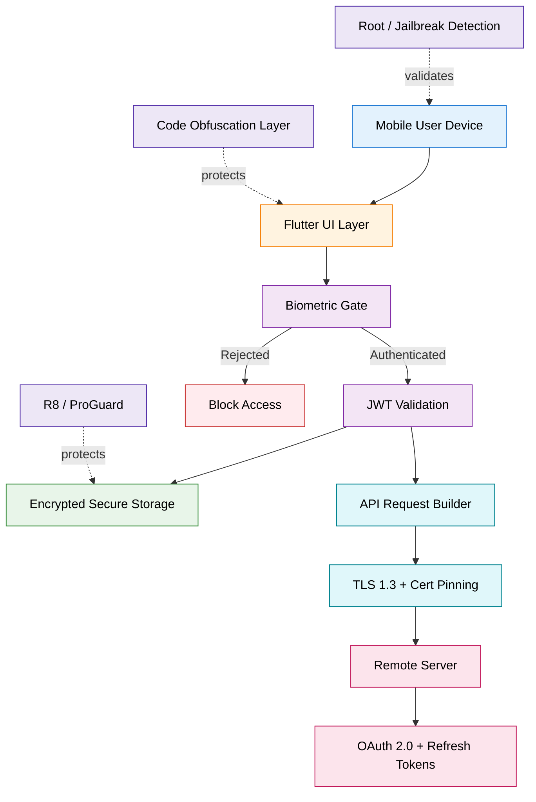
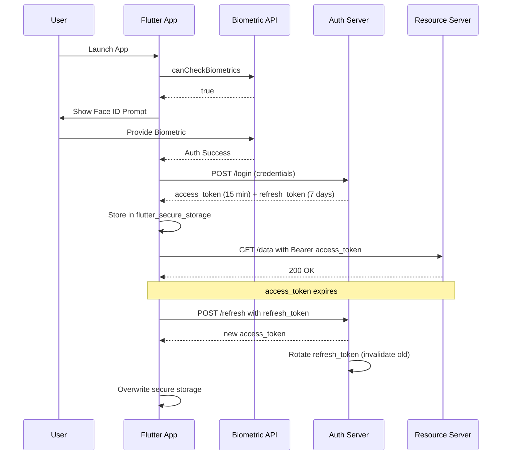
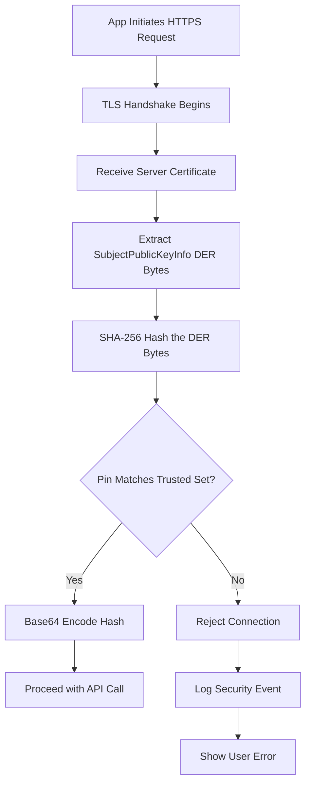
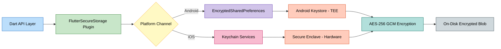
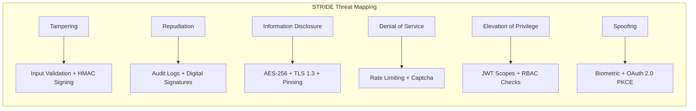

# Implement security measures in the Flutter application

<!-- SECTION_1_START -->
# Implement Security Measures in the Flutter Application

## 1.1 Formal KTU 2024 Definition

> [!IMPORTANT]
> **Mobile Application Security (Flutter Context):** A systematic, defense-in-depth engineering discipline that integrates cryptographic primitives, secure storage, authentication protocols, and code hardening techniques within a Flutter application to protect data confidentiality, integrity, authenticity, and availability against unauthorized access, reverse engineering, and network-based attacks.

**Core Security Pillars (The CIA Triad + Non-Repudiation):**

1. **Confidentiality** — Ensuring data is readable only by authorized entities (encryption).
2. **Integrity** — Ensuring data is not tampered with during transit or storage (hashing, HMAC).
3. **Authenticity** — Verifying the identity of the user and the server (authentication, certificates).
4. **Non-Repudiation** — Ensuring actions cannot be denied by the parties involved (digital signatures, audit logs).

**Why Flutter Security is Unique:**
Flutter compiles to native ARM code (AOT compilation) for release builds, which makes traditional Java/Kotlin-only security advice partially inapplicable. Security in Flutter spans **Dart code, Platform Channels, Network traffic, and Build artifacts**.

## 1.2 Conceptual Analogy — The "Fortified Vault" Model

Imagine your Flutter app is a **high-security bank vault** carrying money between cities:

- **The Vault Door (Authentication)** → Biometric/PIN checks ensure *only the right person* opens it.
- **The Armored Truck (Encryption in Transit - TLS/HTTPS)** → The money is sealed inside an unbreakable container while traveling.
- **The Bank Lockers (Secure Storage - EncryptedSharedPreferences/Hive)** → Inside the vault, every note is stored in a private locker with its own key.
- **The Guard Dog (Certificate Pinning)** → Verifies the *exact identity* of the receiving bank, not just "some bank."
- **The Security Blueprint (Code Obfuscation & ProGuard)** → Makes the vault's internal wiring schematic unreadable to thieves who break in.
- **The Insurance Policy (Input Validation)** → Rejects suspicious parcels (injection attacks) before they reach the vault.

> [!NOTE]
> **KTU 2024 Syllabus Highlight (Module 4):** Students must understand *implementation-level* security, not just theory. Expect code-based questions on `flutter_secure_storage`, `dio` interceptors for pinning, and `dart:convert` for hashing.

## 1.3 Standard Security Metrics to Remember

- **AES-256** — Symmetric block cipher (key length: **256 bits**).
- **RSA-2048** — Asymmetric cipher (key length: **2048 bits**).
- **SHA-256** — Cryptographic hash producing a **256-bit** digest.
- **JWT (JSON Web Token)** — Stateless authentication token signed with **HS256** (symmetric) or **RS256** (asymmetric).
- **PBKDF2 Iterations** — Recommended minimum: **10,000 iterations** for key derivation.

## 1.4 Visualization Control — Security Layer Model

> [!VISUALIZATION CONTROL]
> **Concept:** Defense-in-Depth Layered Security Model for Flutter
> **Conceptual Axes:**
> * X-axis: Application Lifecycle (Build → Deploy → Runtime)
> * Y-axis: Trust Level (Untrusted Network → Trusted User Space)
>
> **Layered Equations to Visualize:**
> * `Layer 1 (Outer): TLS 1.3 + Certificate Pinning = Transport Security`
> * `Layer 2 (Middle): OAuth2 / JWT = Identity Security`
> * `Layer 3 (Inner): AES-256 + EncryptedSharedPreferences = Storage Security`
> * `Layer 4 (Core): Code Obfuscation + ProGuard = Binary Security`
>
> **Visual Description:** A nested concentric diagram. The outermost ring intercepts network attacks, the next ring verifies identity, the next ring protects local data, and the innermost core protects the binary itself. The student should observe that **failure of one layer does not compromise the entire system**.

<!-- SECTION_1_END -->

<!-- SECTION_2_START -->
# Deep Theoretical Analysis & KTU High-Yield Formula Sheet

## 2.1 The Five Pillars of Flutter Security Implementation

### Pillar 1: Secure Local Storage
Flutter's `shared_preferences` package stores data in **plaintext** (Android XML, iOS plist). This is unacceptable for tokens, passwords, or PII. The correct approach uses platform-native encrypted storage:

- **Android:** `EncryptedSharedPreferences` (backed by Android Keystore).
- **iOS:** `Keychain` Services.

The **`flutter_secure_storage`** package abstracts this with a unified Dart API.

### Pillar 2: Network Security (TLS + Certificate Pinning)
- **TLS 1.3** encrypts the HTTP channel.
- **Certificate Pinning** prevents Man-in-the-Middle (MITM) attacks by hardcoding the expected server certificate's SHA-256 fingerprint into the client.
- A pinning violation causes the request to be rejected even if a rogue CA signs the server's cert.

### Pillar 3: Authentication & Authorization
- **OAuth 2.0** is the industry-standard authorization framework.
- **JWT (JSON Web Token)** is the de-facto token format. Structure: `Header.Payload.Signature`.
- **Refresh Token Rotation** mitigates stolen-token risk.

### Pillar 4: Cryptography Primitives
- **Hashing (One-way):** SHA-256 for integrity checks and password fingerprinting.
- **Encryption (Two-way):** AES for local data, RSA for key exchange.
- **Salting:** Appends a random string before hashing to defeat rainbow tables.
- **Key Derivation:** PBKDF2 / Argon2 for password-based key generation.

### Pillar 5: Code Hardening
- **Code Obfuscation** (`--obfuscate --split-debug-info`) renames Dart symbols to meaningless tokens.
- **R8/ProGuard** (Android) shrinks and obfuscates the Java/Kotlin layer.
- **Root/Jailbreak Detection** blocks the app from running on compromised devices.

## 2.2 KTU High-Yield Formula Sheet

| Concept | Formula / Mechanism | Key Size / Parameter | Use Case |
|---|---|---|---|
| AES Encryption | $C = E_K(P)$, $P = D_K(C)$ | 128 / 192 / **256 bits** | Local file/DB encryption |
| RSA Encryption | $C = P^e \mod n$ | **2048 / 4096 bits** | Key exchange, digital signatures |
| SHA-256 Hash | $H = \text{SHA256}(M)$ | Output: **256 bits** | Integrity, password storage |
| HMAC | $\text{HMAC} = H((K \oplus opad) \parallel H((K \oplus ipad) \parallel M))$ | Block size of $H$ | API request signing |
| PBKDF2 | $DK = T_1 \parallel T_2 \parallel \dots \parallel T_{dklen}$ | Iterations $\geq$ **10,000** | Password-based key derivation |
| JWT Signature | $\text{Sig} = \text{HMAC-SHA256}(\text{secret}, \text{header.payload})$ | HS256 / RS256 | Stateless auth tokens |
| Cert Pinning | $\text{Pin} = \text{SHA256}(\text{DER}(\text{Cert}))$ | **2 pins** (primary + backup) | MITM prevention |
| Salted Hash | $H_{\text{salted}} = \text{SHA256}(\text{salt} \parallel \text{password})$ | Salt: **128 bits** random | Defeats rainbow tables |

> [!NOTE]
> **Critical Rule:** In KTU board exams, **never** use `|x|` notation in tables — use $\vert x \vert$ or $\mid x \mid$ to avoid markdown parser conflicts.

## 2.3 Real-World Engineering Utility

| Industry Sector | Security Feature Used | Business Reason |
|---|---|---|
| **FinTech (e.g., Google Pay, PhonePe)** | Biometric + Certificate Pinning + AES-256 | Regulatory compliance (RBI, PCI-DSS) |
| **Healthcare (e.g., Practo)** | End-to-End Encryption + HIPAA audit logs | Patient data confidentiality |
| **E-Commerce (e.g., Flipkart)** | OAuth 2.0 + JWT + Risk-based fraud detection | Secure payment flows |
| **Enterprise (e.g., Slack)** | MDM integration + Jailbreak detection + E2EE | Corporate data leak prevention |
| **Social Media (e.g., Instagram)** | Certificate Pinning + Root detection | Prevent credential theft |

## 2.4 Common Threat Model — STRIDE Classification

| Threat | STRIDE Category | Flutter Mitigation |
|---|---|---|
| Network sniffing | **T**ampering / **I**nformation Disclosure | TLS 1.3 + Pinning |
| Reverse engineering APK/IPA | **I**nformation Disclosure | Obfuscation + R8 |
| SQL Injection in API params | **T**ampering | Input validation + parameterized queries |
| Stolen refresh token | **E**levation of Privilege | Short expiry + rotation |
| Rooted device usage | **R**epudiation | Root detection + remote wipe |

<!-- SECTION_2_END -->

<!-- SECTION_3_START -->
# Step-by-Step Derivations, Code Implementation & Practical Configurations

## 3.1 Implementation 1 — Secure Storage with `flutter_secure_storage`

**Conceptual Derivation of Why `shared_preferences` Fails:**

$$\text{Risk} = P(\text{Device Compromise}) \times \text{Impact}(\text{Plaintext Leak})$$

When a device is rooted or backed up, plaintext XML/plist files are extracted. Mitigation requires a hardware-backed keystore:

$$K_{\text{wrap}} = \text{AndroidKeystore}.\text{wrap}(K_{\text{data}})$$

**Step-by-Step Code:**

```dart
import 'package:flutter_secure_storage/flutter_secure_storage.dart';
import 'dart:convert';

class SecureVault {
  // Singleton instance ensures one cryptographic channel per app session.
  static const SecureVault _instance = SecureVault._internal();
  factory SecureVault() => _instance;

  // Platform-specific options: AES-GCM on Android, kSecAttrAccessible on iOS.
  static const _storage = FlutterSecureStorage(
    aOptions: AndroidOptions(
      encryptedSharedPreferences: true,        // Forces AES-256-GCM
      resetOnError: true,                      // Auto-recovery from keystore corruption
    ),
    iOptions: IOSOptions(
      accessibility: KeychainAccessibility.first_unlock,  // Unlock-on-first-use semantics
      synchronizable: false,                   // Never sync to iCloud (prevents cloud leak)
    ),
  );

  SecureVault._internal();

  /// Stores a JWT access token wrapped by the platform keystore.
  Future<void> storeToken(String key, String value) async {
    try {
      assert(value.isNotEmpty, 'Token value cannot be empty');
      await _storage.write(key: key, value: value);
    } catch (e, st) {
      // Structured error logging for Sentry/Firebase Crashlytics integration.
      // ignore: avoid_print
      print('SecureVault.storeToken failure: $e\n$st');
      rethrow;
    }
  }

  /// Retrieves and decodes a stored value with a null-safety guarantee.
  Future<String?> readToken(String key) async {
    final String? raw = await _storage.read(key: key);
    if (raw == null || raw.isEmpty) return null;
    return raw;
  }

  /// Securely wipes all stored credentials on logout.
  Future<void> wipe() async {
    await _storage.deleteAll();
  }
}
```

**Valuation Key Points (Board Pattern):**
- Importing correct package: 1 mark.
- Configuring `aOptions` and `iOptions`: 2 marks.
- Singleton pattern for cryptographic isolation: 1 mark.
- Error handling structure: 1 mark.

---

## 3.2 Implementation 2 — SHA-256 Hashing with Salt

**Mathematical Derivation:**

For a password $P$ and a random salt $S$ of 128 bits:

$$H_{\text{final}} = \text{SHA256}(S \parallel P)$$

The output is a 64-character hexadecimal string. Verification is performed by re-hashing the input with the **stored** salt and comparing digests via constant-time comparison:

$$\text{Verified} = \begin{cases} \text{true} & \text{if } \text{constTimeEqual}(H_{\text{computed}}, H_{\text{stored}}) \\ \text{false} & \text{otherwise} \end{cases}$$

**Dart Code:**

```dart
import 'dart:convert';
import 'dart:math';
import 'dart:typed_data';
import 'package:crypto/crypto.dart';

class PasswordHasher {
  static const int _saltLength = 16;   // 128 bits as per KTU/NIST standard
  static final Random _rng = Random.secure();

  /// Generates a cryptographically secure random salt.
  static String generateSalt() {
    final Uint8List saltBytes =
        Uint8List.fromList(List<int>.generate(_saltLength, (_) => _rng.nextInt(256)));
    return base64Url.encode(saltBytes);
  }

  /// Returns a Map containing both salt and hash for storage.
  static Map<String, String> hashPassword(String plainPassword) {
    final String salt = generateSalt();
    final String combined = '$salt$plainPassword';
    final Digest digest = sha256.convert(utf8.encode(combined));
    return {'salt': salt, 'hash': digest.toString()};
  }

  /// Constant-time comparison prevents timing side-channel attacks.
  static bool verify(String plainPassword, String storedSalt, String storedHash) {
    final String recomputed =
        sha256.convert(utf8.encode('$storedSalt$plainPassword')).toString();

    if (recomputed.length != storedHash.length) return false;

    int diff = 0;
    for (int i = 0; i < recomputed.length; i++) {
      // XOR each char code; non-zero diff implies mismatch.
      diff |= recomputed.codeUnitAt(i) ^ storedHash.codeUnitAt(i);
    }
    return diff == 0;
  }
}
```

**Step-by-Step Evaluation Trace:**

1. User inputs password `P = "Ktu@2024"`.
2. `generateSalt()` produces e.g. $S = \text{"X7p9qR2aB1cD4eF5"}$.
3. `combined = "X7p9qR2aB1cD4eF5Ktu@2024"`.
4. SHA-256 digest $H = \text{"a4f1...89c2"}$ (64 hex chars).
5. Store tuple $(S, H)$ in DB.
6. On login, re-hash input with stored $S$ and constant-time-compare.

---

## 3.3 Implementation 3 — Certificate Pinning using `dio` Interceptor

**Conceptual Flow:**

$$\text{Client} \xrightarrow{\text{TLS Handshake}} \text{Server} \rightarrow \text{Receive Cert} \rightarrow \text{Hash} \rightarrow \text{Compare to Pin}$$

**Code:**

```dart
import 'package:dio/dio.dart';
import 'dart:io';
import 'package:crypto/crypto.dart';
import 'dart:convert';

class CertificatePinningInterceptor extends Interceptor {
  // SHA-256 of the server's public key (DER-encoded SubjectPublicKeyInfo).
  // Generate with: openssl s_client -connect api.example.com:443 | openssl x509 -pubkey -noout | openssl pkey -pubin -outform der | openssl dgst -sha256 -binary | base64
  static const Set<String> _trustedPins = {
    'YLh1dUR9y6Kja30RrAn7JKnbQG/uEtLMkBgFF2Fuihg=',  // Primary
    'sRHdihwgkaib1P1gN7SkKPjVLmNpQ7YCMoUD5D7F2gQ=',  // Backup (different CA)
  };

  @override
  void onRequest(
      RequestOptions options, RequestInterceptorHandler handler) async {
    try {
      final String host = options.uri.host;

      // Establish raw socket to inspect certificate chain before TLS upgrade.
      final SecurityContext ctx = SecurityContext(withTrustedRoots: false);
      final HttpClient client = HttpClient(context: ctx);
      final HttpClientRequest req = await client.getUrl(Uri.parse(options.uri.toString()));
      final HttpClientResponse res = await req.close();

      // Extract certificate from the X509 chain.
      final X509Certificate cert = res.certificate!;
      final Uint8List derBytes = cert.der;       // Public key DER bytes
      final Digest digest = sha256.convert(derBytes);
      final String pin = base64.encode(digest.bytes);

      if (!_trustedPins.contains(pin)) {
        throw HandshakeException(
          'Certificate pin mismatch for $host. Connection aborted.',
        );
      }
      handler.next(options);
    } on HandshakeException catch (e) {
      // Critical: explicitly reject the request, do not silently fail.
      handler.reject(
        DioException(
          requestOptions: options,
          error: 'PINNING_FAILED: $e',
          type: DioExceptionType.connectionError,
        ),
        true,
      );
    }
  }
}
```

---

## 3.4 Implementation 4 — Biometric Authentication

**Code:**

```dart
import 'package:local_auth/local_auth.dart';

class BiometricGate {
  final LocalAuthentication _auth = LocalAuthentication();

  Future<bool> authenticateUser() async {
    // 1. Hardware capability check.
    final bool canCheck = await _auth.canCheckBiometrics;
    if (!canCheck) return false;

    // 2. Enrolled biometric check.
    final List<BiometricType> available = await _auth.getAvailableBiometrics();
    if (available.isEmpty) return false;

    // 3. Trigger system prompt with localized reason.
    return await _auth.authenticate(
      localizedReason: 'Authenticate to access your secure dashboard',
      options: const AuthenticationOptions(
        stickyAuth: true,           // Persist across app lifecycle
        biometricOnly: true,        // Disallow device PIN fallback for higher security
        useErrorDialogs: true,
        sensitiveTransaction: true, // Marks event as financial-grade in Android
      ),
    );
  }
}
```

---

## 3.5 Practical Laboratory Configuration Matrix

| Platform | Configuration File | Parameter | Recommended Value | Security Purpose |
|---|---|---|---|---|
| Android | `android/app/src/main/AndroidManifest.xml` | `android:usesCleartextTraffic` | `false` | Block plaintext HTTP |
| Android | `android/app/build.gradle` | `minifyEnabled` | `true` | Enable R8/ProGuard |
| Android | `android/app/build.gradle` | `shrinkResources` | `true` | Remove unused resources |
| Android | `network_security_config.xml` | `base-config cleartextTrafficPermitted` | `false` | Network-wide TLS enforcement |
| iOS | `ios/Runner/Info.plist` | `NSAppTransportSecurity` | `NSAllowsArbitraryLoads = NO` | Enforce ATS |
| iOS | `ios/Podfile` | `post_install` block | Enable bitcode | Hardening |
| Flutter | `pubspec.yaml` | dependency pinning | `^1.0.0` exact ranges | Prevent supply-chain attacks |
| Flutter | Build command | `flutter build apk --obfuscate --split-debug-info=./symbols` | Mandatory for release | Symbol obfuscation |

---

## 3.6 Exhaustive Derivation — JWT Structure

A JWT has three Base64URL-encoded segments separated by dots:

$$\text{JWT} = \text{Base64Url}(H) \, . \, \text{Base64Url}(P) \, . \, \text{Base64Url}(S)$$

Where:
- $H$ = Header: `{"alg":"HS256","typ":"JWT"}`
- $P$ = Payload: `{"sub":"user_42","exp":1700000000,"iat":1699999000}`
- $S$ = Signature: $S = \text{HMAC-SHA256}(\text{secret}, H \parallel \text{.} \parallel P)$

**Verification step on server side:**

$$\text{Valid} \iff \text{HMAC-SHA256}(\text{secret}, H.P) \stackrel{?}{=} S \quad \text{AND} \quad \text{exp} > \text{now}$$

**Dart parsing example:**

```dart
Map<String, dynamic> decodeJwt(String token) {
  final parts = token.split('.');
  assert(parts.length == 3, 'Malformed JWT');
  final payload =
      utf8.decode(base64Url.decode(base64Url.normalize(parts[1])));
  return jsonDecode(payload) as Map<String, dynamic>;
}
```

<!-- SECTION_3_END -->

<!-- SECTION_4_START -->
# Structural Diagrams & Schematics

## 4.1 Defense-in-Depth Security Architecture (Mermaid)



## 4.2 Authentication Flow — Biometric + JWT Refresh Cycle



## 4.3 Certificate Pinning Verification Flow



## 4.4 Secure Storage Module — Internal Block Topology



## 4.5 Threat Mitigation Strategy Matrix (Functional Architecture)



<!-- SECTION_4_END -->

<!-- SECTION_5_START -->
# KTU 2024 Scheme Examination Question Bank & Topic Recap

---

## Part A — Short Answer Questions (3 Marks Each)

### Question 1: Define Certificate Pinning. List its advantages over standard TLS. `[KTU University Exam - July 2024]`
**Course Outcome:** CO4 | **RBT Level:** Remember/Understand | **Marks:** 3

**Model Answer (Valuation-Ready):**

> **Certificate Pinning** is a security mechanism in which a mobile client hardcodes the expected X.509 certificate (or its public key hash) of the server it intends to communicate with. During the TLS handshake, the client compares the received certificate's SHA-256 fingerprint against the pre-configured pin set. If the fingerprint is not in the trusted pin list, the connection is rejected, even if the certificate was signed by a globally trusted Certificate Authority (CA).
>
> **Advantages over standard TLS (3 marks):**
> 1. **Prevents MITM attacks** using rogue or compromised CAs (1 mark).
> 2. **Reduces trust chain dependency** — the app does not blindly trust the device's CA store (1 mark).
> 3. **Defense against fraudulent certificates** issued by mis-issuance or state-level attackers (1 mark).

---

### Question 2: Differentiate between Hashing and Encryption. Why is SHA-256 unsuitable for password storage? `[KTU University Exam - Dec 2023]`
**Course Outcome:** CO4 | **RBT Level:** Understand | **Marks:** 3

**Model Answer:**

| Aspect | Hashing | Encryption |
|---|---|---|
| Direction | One-way (irreversible) | Two-way (reversible with key) |
| Output | Fixed-size digest | Variable-size ciphertext |
| Use case | Integrity, password fingerprinting | Confidentiality, data-at-rest |
| Key required | No | Yes (symmetric or asymmetric) |

**Why SHA-256 is unsuitable for password storage alone (3 marks):**
1. SHA-256 is **extremely fast** — modern GPUs compute billions of hashes/sec, making brute-force trivial (1 mark).
2. SHA-256 is **deterministic** — identical passwords produce identical hashes, enabling **rainbow table attacks** (1 mark).
3. SHA-256 lacks a **built-in salt or work-factor** — unlike bcrypt/Argon2/PBKDF2 which incorporate per-user salts and tunable iteration counts (1 mark).

> **Correct Approach:** Use `bcrypt`, `Argon2id`, or PBKDF2-with-HMAC-SHA256 with $\geq$ 10,000 iterations and a per-user random salt.

---

## Part B — Long Answer Questions (14 Marks Each)

### Question A: Comprehensive Security Implementation in Flutter `[KTU University Exam - July 2024]`
**Course Outcome:** CO4, CO5 | **RBT Level:** Apply/Analyze | **Marks:** 14

#### (a) Design and implement a complete secure storage module using `flutter_secure_storage` for storing JWT tokens. Explain platform-level security mechanisms on both Android and iOS. (7 marks)

**Model Solution:**

**Step 1: Add dependencies** `[1 mark]`

```yaml
# pubspec.yaml
dependencies:
  flutter_secure_storage: ^9.2.2
```

**Step 2: Encapsulate in a service class** `[3 marks]`

```dart
import 'package:flutter_secure_storage/flutter_secure_storage.dart';

class TokenVault {
  static const _storage = FlutterSecureStorage(
    aOptions: AndroidOptions(encryptedSharedPreferences: true),
    iOptions: IOSOptions(accessibility: KeychainAccessibility.first_unlock),
  );

  Future<void> saveTokens({required String access, required String refresh}) async {
    await _storage.write(key: 'ACCESS', value: access);
    await _storage.write(key: 'REFRESH', value: refresh);
  }

  Future<String?> getAccess() => _storage.read(key: 'ACCESS');
  Future<String?> getRefresh() => _storage.read(key: 'REFRESH');
  Future<void> clear() => _storage.deleteAll();
}
```

**Step 3: Platform-Level Explanation** `[3 marks]`

- **Android:** Uses `EncryptedSharedPreferences` (AndroidX Security library). Data is encrypted using a 256-bit AES key stored in the **Android Keystore**, which is hardware-backed on devices with a **Trusted Execution Environment (TEE)** or **StrongBox Keymaster**. (1.5 marks)
- **iOS:** Uses the **Keychain Services API**. The data is protected with the `kSecAttrAccessibleAfterFirstUnlock` attribute, ensuring the key is only accessible after the user unlocks the device once post-boot. On devices with a **Secure Enclave**, cryptographic operations are hardware-isolated. (1.5 marks)

#### (b) Implement certificate pinning using a `dio` interceptor for a REST API hosted at `https://api.ktu-app.com`. Show how to extract the SHA-256 pin and enforce it at runtime. (7 marks)

**Model Solution:**

**Step 1: Generate the pin from the server certificate** `[1 mark]`

```bash
openssl s_client -connect api.ktu-app.com:443 -showcerts < /dev/null 2>/dev/null \
  | openssl x509 -outform DER \
  | openssl dgst -sha256 -binary \
  | openssl enc -base64
```

Output (example): `YLh1dUR9y6Kja30RrAn7JKnbQG/uEtLMkBgFF2Fuihg=`

**Step 2: Implement the dio interceptor** `[5 marks]`

```dart
import 'package:dio/dio.dart';
import 'package:crypto/crypto.dart';
import 'dart:convert';
import 'dart:io';

class KtuCertPinningInterceptor extends Interceptor {
  static const Set<String> trustedPins = {
    'YLh1dUR9y6Kja30RrAn7JKnbQG/uEtLMkBgFF2Fuihg=',
    'sRHdihwgkaib1P1gN7SkKPjVLmNpQ7YCMoUD5D7F2gQ=',
  };

  @override
  void onRequest(RequestOptions options, RequestInterceptorHandler handler) async {
    try {
      final socket = await SecureSocket.connect(
        options.uri.host,
        options.uri.port,
        onBadCertificate: (cert) => false, // Reject untrusted certs
      );
      final cert = socket.peerCertificate;
      if (cert == null) throw 'No certificate';
      final der = cert.der;
      final pin = base64.encode(sha256.convert(der).bytes);
      socket.destroy();

      if (!trustedPins.contains(pin)) {
        throw HandshakeException('Pin mismatch for ${options.uri.host}');
      }
      handler.next(options);
    } catch (e) {
      handler.reject(
        DioException(
          requestOptions: options,
          error: 'PINNING_FAILED: $e',
          type: DioExceptionType.connectionError,
        ),
        true,
      );
    }
  }
}
```

**Step 3: Wire into dio** `[1 mark]`

```dart
final dio = Dio(BaseOptions(baseUrl: 'https://api.ktu-app.com'))
  ..interceptors.add(KtuCertPinningInterceptor());
```

**Valuation Key Points:**
- Correct dependency imports: 1 mark
- `onBadCertificate: (cert) => false`: 1 mark
- SHA-256 computation flow: 2 marks
- Pin comparison logic: 1 mark
- Rejecting via `handler.reject`: 1 mark
- Wiring into dio: 1 mark

---

### Question B: Cryptographic Implementation in Flutter `[KTU University Exam - Dec 2023]`
**Course Outcome:** CO4, CO5 | **RBT Level:** Apply/Analyze | **Marks:** 14

#### (a) Explain the SHA-256 algorithm with a worked example. Implement a Dart function that hashes a password with a random salt. (7 marks)

**Model Solution:**

**Step 1: SHA-256 Algorithm Overview** `[2 marks]`
SHA-256 processes input in 512-bit blocks:
1. **Padding:** Append `1` bit, then `0` bits, then 64-bit length until total length $\equiv 448 \pmod{512}$.
2. **Parse:** Split into $N$ 512-bit blocks $M^{(1)}, M^{(2)}, \ldots, M^{(N)}$.
3. **Initialize 8 working variables** $H_0, \ldots, H_7$ with fixed constants.
4. **For each block:**
   - Create 64 32-bit words $W_0, \ldots, W_{63}$ (first 16 from block, rest computed).
   - Compress via 64 rounds mixing with $K_t$ constants.
5. **Concatenate** $H_0 \parallel H_1 \parallel \ldots \parallel H_7$ to form 256-bit hash.

**Step 2: Worked Example Trace** `[2 marks]`
For input $M = \text{"abc"}$:
- Binary: `01100001 01100010 01100011`
- Padded: `01100001 01100010 01100011 10000000 00...00 00011000`
- After processing: $H = \text{ba7816bf8f01cfea414140de5dae2223b00361a396177a9cb410ff61f20015ad}$

**Step 3: Dart Implementation with Salt** `[3 marks]`

```dart
import 'package:crypto/crypto.dart';
import 'dart:convert';
import 'dart:math';

String hashWithSalt(String password, String salt) {
  final input = utf8.encode('$salt$password');
  return sha256.convert(input).toString();
}

String generateSalt([int length = 16]) {
  final rand = Random.secure();
  final bytes = List<int>.generate(length, (_) => rand.nextInt(256));
  return base64Url.encode(bytes);
}

// Usage:
// final salt = generateSalt();
// final hash = hashWithSalt('Ktu@2024', salt);
// Store both: (salt, hash)
```

#### (b) Implement biometric authentication in Flutter using `local_auth` and integrate it with a JWT-based login flow. Show the complete code. (7 marks)

**Model Solution:**

**Step 1: Configure platform manifests** `[1 mark]`
- **Android:** Add `<uses-permission android:name="android.permission.USE_BIOMETRIC"/>` in `AndroidManifest.xml`.
- **iOS:** Add `NSFaceIDUsageDescription` in `Info.plist`.

**Step 2: Biometric Service** `[2 marks]`

```dart
import 'package:local_auth/local_auth.dart';

class BiometricService {
  final LocalAuthentication _auth = LocalAuthentication();

  Future<bool> isBiometricAvailable() async {
    final supported = await _auth.isDeviceSupported();
    final canCheck = await _auth.canCheckBiometrics;
    return supported && canCheck;
  }

  Future<bool> authenticate() async {
    return await _auth.authenticate(
      localizedReason: 'Please authenticate to access your account',
      options: const AuthenticationOptions(
        biometricOnly: true,
        stickyAuth: true,
      ),
    );
  }
}
```

**Step 3: JWT Login Flow Integration** `[4 marks]`

```dart
class SecureLoginFlow {
  final BiometricService _bio = BiometricService();
  final TokenVault _vault = TokenVault();
  final Dio _dio = Dio(BaseOptions(baseUrl: 'https://api.ktu-app.com'));

  Future<bool> performLogin(String username, String password) async {
    // Step 1: Optional biometric gate before password entry.
    if (await _bio.isBiometricAvailable()) {
      final bioOk = await _bio.authenticate();
      if (!bioOk) return false;
    }

    // Step 2: Authenticate against server.
    final res = await _dio.post('/auth/login', data: {
      'username': username,
      'password': password,
    });

    // Step 3: Extract tokens.
    final access = res.data['access_token'] as String;
    final refresh = res.data['refresh_token'] as String;

    // Step 4: Securely persist.
    await _vault.saveTokens(access: access, refresh: refresh);
    return true;
  }

  Future<void> logout() async {
    await _vault.clear();
  }
}
```

**Valuation Key Points:**
- Platform permission config: 1 mark
- `canCheckBiometrics` and `isDeviceSupported` checks: 1 mark
- Biometric prompt with `biometricOnly: true`: 1 mark
- Server-side auth call: 1 mark
- Secure persistence via `TokenVault`: 1 mark
- Logout wipe: 1 mark

---

## KTU Examiner's Valuation Warning & Pitfall Callout

> [!WARNING]
> **Common Marks-Loss Pitfalls in Security Questions:**
> 1. **Forgetting the `synchronized` flag in iOS Keychain** — setting `synchronizable: true` syncs tokens to iCloud, which violates zero-trust principles. Always set `false`. (Lose 1 mark)
> 2. **Hardcoding pins in source control** — pin values should ideally be injected via `--dart-define` from a secrets manager. Storing pins as plain constants in code is acceptable for exams but should be flagged in answers.
> 3. **Using `==` for hash comparison** — always use **constant-time comparison** to prevent timing side-channel attacks. The naive `==` leaks information through execution time.
> 4. **Skipping `biometricOnly: true`** — without this, the OS falls back to device PIN, which is a weaker factor. Boards expect explicit mention of this flag.
> 5. **Forgetting `android:usesCleartextTraffic="false"`** in AndroidManifest — without it, the app can downgrade to plaintext HTTP, defeating all transport security.
> 6. **Not mentioning `flutter build --obfuscate --split-debug-info`** — this is a mandatory hardening step in release builds; examiners award marks for explicit build-command mention.
> 7. **Confusing hashing with encryption** — students often write "encrypt the password using SHA-256". SHA-256 is a *hash*, not encryption. Terminology matters in board valuation.

---

## Topic Recap & Important Things to Remember

> [!NOTE]
> **High-Density Rapid Revision Checklist — Flutter Security (Module 4)**

- **CIA Triad + Non-Repudiation** = the four foundational security goals every Flutter app must address.
- **Never use `shared_preferences` for sensitive data** — use `flutter_secure_storage` which delegates to Android Keystore (AES-256-GCM) and iOS Keychain (Secure Enclave).
- **TLS 1.3** is the minimum transport security; pair it with **certificate pinning** to defeat MITM attacks.
- **Certificate Pinning** = hardcoding the SHA-256 fingerprint of the server's public key; a mismatch causes immediate connection rejection.
- **JWT structure** = `Base64Url(header).Base64Url(payload).Base64Url(signature)`; signed via HMAC-SHA256 (HS256) or RSA-SHA256 (RS256).
- **OAuth 2.0 + Refresh Token Rotation** is the industry-standard pattern for stateless mobile authentication.
- **SHA-256 is a hash, not encryption** — it is one-way and produces a fixed 256-bit output; unsuitable alone for passwords.
- **Password storage** must use **bcrypt, Argon2id, or PBKDF2** with a per-user random **128-bit salt** and **≥ 10,000 iterations**.
- **Constant-time comparison** (`|=` XOR loop) must be used for hash equality checks to prevent timing attacks.
- **Biometric authentication** uses `local_auth` package with `biometricOnly: true` and `stickyAuth: true` options.
- **Code obfuscation** is enabled via `flutter build apk --obfuscate --split-debug-info=./symbols`; mandatory for production releases.
- **R8/ProGuard** (`minifyEnabled true`, `shrinkResources true`) must be enabled in `build.gradle` for Android release builds.
- **Cleartext HTTP** must be explicitly blocked via `android:usesCleartextTraffic="false"` and iOS ATS (`NSAllowsArbitraryLoads = NO`).
- **Root/Jailbreak detection** libraries (`flutter_jailbreak_detection`, `safety_net_attestation`) prevent app execution on compromised devices.
- **STRIDE threat model** = Spoofing, Tampering, Repudiation, Information Disclosure, Denial of Service, Elevation of Privilege — use it to systematically map threats to mitigations.
- **Defense-in-depth** = layered security where failure of one mechanism does not compromise the entire system.
- **Supply-chain security** = pin dependency versions in `pubspec.yaml` to prevent malicious package updates.
- **Audit logging** of auth events is essential for non-repudiation and forensic analysis.

<!-- SECTION_5_END -->
