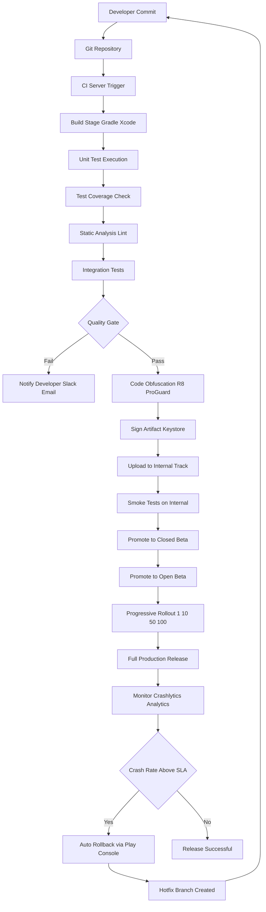
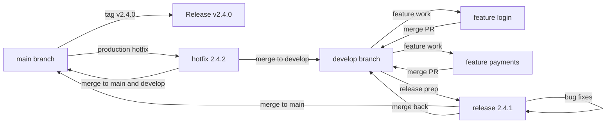
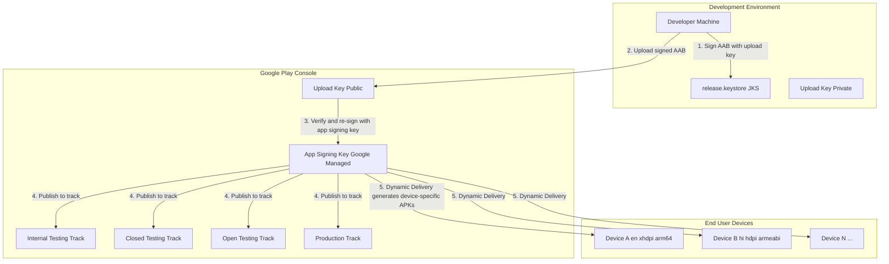
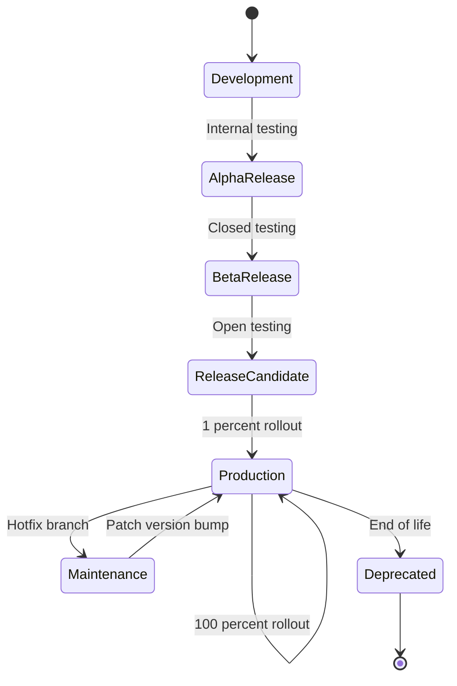
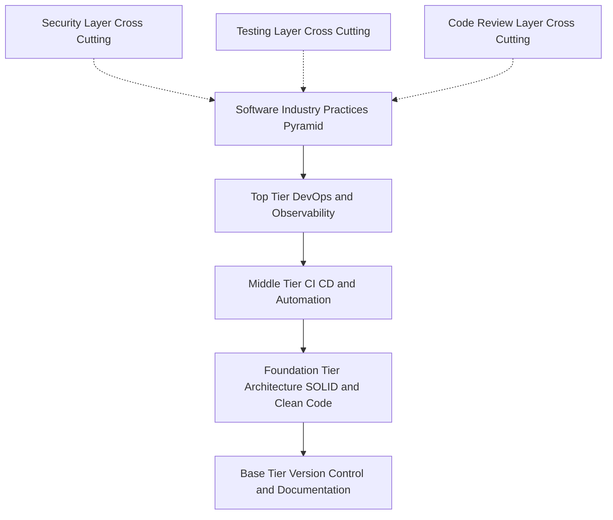

# Industry Practices and App Deployment:

<!-- SECTION_1_START -->
# Industry Practices and App Deployment

## 1. Core Technical Definition & Intuitive Overview

### Formal Definition (KTU 2024 Syllabus Aligned)

**Industry Practices in Mobile Application Development** refer to the standardized, professionally accepted engineering methodologies, tools, and workflows employed across the software industry to build, test, secure, and maintain high-quality mobile applications. These include architectural patterns (MVVM, Clean Architecture), version control systems (Git), automated testing pipelines, code quality enforcement (linting, static analysis), and security hardening techniques.

**App Deployment** is the end-to-end engineering pipeline that transforms source code into a distributable, signed, and optimized software artifact (APK/AAB for Android, IPA for iOS) and releases it to end-users through a controlled distribution channel such as the Google Play Store, Apple App Store, or enterprise marketplaces, with proper versioning, signing, monitoring, and update mechanisms.

> [!IMPORTANT]
> **KTU 2024 Module 4 Focus Areas:** This module bridges the gap between writing code in an IDE and shipping production-grade software to real users. KTU examiners frequently test deployment pipelines, signing mechanisms, versioning schemes, and CI/CD concepts.

### Conceptual Analogy / Intuition

Imagine you are running a **professional bakery** (your development team) that wants to sell pastries (your mobile app) to customers worldwide (Play Store/App Store users). 

- **Industry Practices** are your **standardized recipes, hygiene protocols, quality checks, and supply chain management** — they ensure every pastry leaving your kitchen is safe, consistent, and delicious.
- **App Deployment** is your **packaging, labeling, shipping, and retail distribution** process — you shrink-wrap the product, attach a nutrition label (app metadata), sign the safety certificate (digital signature), and place it on the shelf (Play Store) where customers can find and buy it.

Without these processes, your pastry might be tasty in the kitchen but never reach customers, or worse, reach them in a contaminated state — leading to bad reviews and business failure.

> [!NOTE]
> **Key Industry Metrics to Know:** 
> - **Crash-Free Users Rate:** Industry standard is **>99.5%** for production apps.
> - **App Startup Time (Cold):** Should be **<2 seconds** on mid-range devices.
> - **APK Size Limit (Google Play):** **150 MB** for base AAB; expandable to **2 GB** with asset packs.
> - **App Review Time:** Apple typically **24–48 hours**; Google usually **a few hours to 7 days**.

### GeoGebra / Desmos Integration

> [!VISUALIZATION CONTROL]
> **Concept:** Visualization of a CI/CD pipeline as a sequential flow with feedback loops (similar to a coordinate plane where time progresses on the X-axis and code maturity on the Y-axis).
> **GeoGebra / Desmos Input Equations:**
> - Point A: $(0, 0)$ — `Developer Commit`
> - Point B: $(2, 2)$ — `Build Stage`
> - Point C: $(4, 4)$ — `Automated Test Stage`
> - Point D: $(6, 6)$ — `Staging Deploy`
> - Point E: $(8, 9)$ — `Production Release`
> - Curve: $f(x) = 0.1x^2$ representing code confidence growth over pipeline stages.
> **Visual Description:** A rising parabolic curve from origin to upper-right, with horizontal dashed lines marking thresholds for "Test Coverage >80%", "Crash Rate <0.5%", and "Performance Budget Met". Each pipeline stage pushes the curve upward toward a production-ready ceiling.

---

<!-- SECTION_1_END -->

<!-- SECTION_2_START -->
# 2. Deep Theoretical Analysis & KTU High-Yield Formula Sheet

## 2.1 Industry Best Practices — Categorized Framework

### A. Code Architecture & Design Patterns

Modern mobile applications follow layered architecture to separate concerns:

- **MVC (Model-View-Controller):** Legacy pattern, common in older Android/iOS apps.
- **MVP (Model-View-Presenter):** Evolved from MVC, easier to unit test.
- **MVVM (Model-View-ViewModel):** Industry standard for Android (with Jetpack ViewModel/LiveData/StateFlow) and iOS (with SwiftUI/Combine). KTU examiners favor this.
- **Clean Architecture:** Strict layering into Entities → Use Cases → Interface Adapters → Frameworks. Promotes independence from UI and database.

> [!IMPORTANT]
> **SOLID Principles are the foundation of all these patterns:**
> - **S** — Single Responsibility Principle
> - **O** — Open/Closed Principle
> - **L** — Liskov Substitution Principle
> - **I** — Interface Segregation Principle
> - **D** — Dependency Inversion Principle

### B. Version Control with Git

The industry standard is **Trunk-Based Development** with feature flags, OR **Git Flow** for larger teams:

| Branch Type | Purpose | Lifetime |
|---|---|---|
| `main` / `master` | Production-ready code | Permanent |
| `develop` | Integration branch | Permanent |
| `feature/*` | New feature development | Short-lived (days) |
| `release/*` | Release preparation, bug fixes | Short-lived (days) |
| `hotfix/*` | Emergency production fixes | Very short-lived (hours) |

### C. Testing Strategy (Testing Pyramid)

```
            /\
           /UI\          ← E2E Tests (Few, Slow, Expensive)
          /____\
         /      \
        / Integ. \      ← Integration Tests (Some)
       /__________\
      /            \
     /  Unit Tests  \   ← Unit Tests (Many, Fast, Cheap)
    /________________\
```

### D. Continuous Integration / Continuous Deployment (CI/CD)

- **CI (Continuous Integration):** Every code commit triggers automated build + test.
- **CD (Continuous Delivery):** Every successful build is automatically prepared for release (manual approval to deploy).
- **CD (Continuous Deployment):** Every successful build is automatically deployed to production without human intervention.

### E. Security Best Practices

- **Code obfuscation** (ProGuard/R8 for Android, iOS bitcode).
- **Certificate Pinning** to prevent MITM attacks.
- **Secure storage** of secrets (Android Keystore, iOS Keychain).
- **Root/Jailbreak detection** for sensitive apps (banking).
- **API key rotation** and environment-based configuration.

## 2.2 App Deployment — The Complete Pipeline

### A. Semantic Versioning (SemVer) — Industry Standard

The format is **MAJOR.MINOR.PATCH** (e.g., `2.4.1`):

- **MAJOR:** Increment for incompatible API changes.
- **MINOR:** Increment for backward-compatible new features.
- **PATCH:** Increment for backward-compatible bug fixes.

Additional pre-release labels: `1.0.0-alpha`, `1.0.0-beta`, `1.0.0-rc.1`.

### B. Android Build Types and Flavors

- **Build Types:** `debug` (development, signed with debug key, no minification) vs `release` (production, signed with release key, minified, optimized).
- **Product Flavors:** `free` vs `paid`, `dev` vs `staging` vs `prod` — allow multiple app variants from one codebase.

### C. App Signing Mechanisms

| Platform | Signing Method | Key File |
|---|---|---|
| Android (Legacy) | JAR Signing (v1), APK Signature Scheme v2/v3/v4 | `.keystore` / `.jks` |
| Android (Modern) | **Play App Signing** with upload key + app signing key | Managed by Google |
| iOS | Provisioning Profile + Distribution Certificate | `.p12` + `.mobileprovision` |

### D. Release Tracks on Google Play Console

1. **Internal Testing** — Up to 100 testers, fast-track review.
2. **Closed Testing** — Invited testers only, optional Alpha/Beta tracks.
3. **Open Testing** — Publicly listed beta, anyone can join.
4. **Production** — Full public release.

### E. Crash and Performance Monitoring Tools

- **Firebase Crashlytics** — Real-time crash reporting.
- **Firebase Performance Monitoring** — Network, app start, screen rendering.
- **Sentry** — Alternative open-source error tracking.
- **Google Analytics for Firebase** — User behavior analytics.

## 2.3 KTU High-Yield Formula & Concept Cheat Sheet

| Concept | Standard Value / Rule | Use Case |
|---|---|---|
| Semantic Versioning | $MAJOR.MINOR.PATCH$ | Release numbering |
| Min Android API | 21 (Lollipop, **~99% device coverage**) | `minSdk` setting |
| Target Android API | 34 (Android 14, current) | `targetSdk` setting |
| AAB Max Size | $150 \text{ MB}$ base | Play Store upload |
| Test Coverage Target | $\geq 80\%$ unit tests | CI quality gate |
| Crash-Free Users | $\geq 99.5\%$ | Production SLA |
| App Size Reduction via AAB | $\approx 15\text{–}35\%$ vs APK | Google Dynamic Delivery |
| ProGuard/R8 Shrinking | $\approx 25\%$ code size reduction | Minification |
| App Review SLA (Apple) | $\leq 48$ hours | Submission planning |
| Code Obfuscation | XOR + Name Mapping | Reverse engineering prevention |
| Bundle ID Format | `com.company.app` reverse-DNS | Unique app identifier |
| Version Code (Android) | Strictly incrementing integer | Play Store requirement |
| Build Number (iOS) | Strictly incrementing integer | App Store Connect requirement |
| Crash Symbolication | Mapping file upload | Decoding stack traces |

> [!NOTE]
> **Engineering Real-World Utility:** The combination of MVVM + Git Flow + CI/CD + Play App Signing forms the backbone of every production mobile app shipped at companies like Flipkart, Paytm, Uber, and banking apps. Mastering these practices is what separates a "coder" from a "software engineer" in industry.

---

<!-- SECTION_2_END -->

<!-- SECTION_3_START -->
# 3. Step-by-Step Derivations & Code/Symbolic Implementation

## 3.1 Derivation: Calculating Apk Size Reduction using Android App Bundle (AAB)

The Android App Bundle (`.aab`) uses **Dynamic Delivery** to split an app into base + dynamic feature modules + asset packs, delivering only the resources and code relevant to the user's device configuration (language, screen density, CPU architecture).

Let $T_{\text{APK}}$ be the total size of a universal APK and $T_{\text{AAB-per-device}}$ be the size delivered to a specific device. The size reduction is:

$$
R = \frac{T_{\text{APK}} - T_{\text{AAB-per-device}}}{T_{\text{APK}}} \times 100\%
$$

**Step-by-step calculation for a real app:**

Suppose an app supports 4 languages (`en`, `hi`, `ta`, `te`), 3 screen densities (`mdpi`, `hdpi`, `xhdpi`), and 2 CPU architectures (`armeabi-v7a`, `arm64-v8a`).

Total resource permutations:
$$
P_{\text{lang}} = 4, \quad P_{\text{density}} = 3, \quad P_{\text{arch}} = 2
$$

Universal APK must include all permutations:
$$
T_{\text{APK}} = T_{\text{code}} + P_{\text{lang}} \times P_{\text{density}} \times P_{\text{arch}} \times T_{\text{assets}}
$$

Substituting $T_{\text{code}} = 10 \text{ MB}$ and $T_{\text{assets}} = 0.5 \text{ MB}$:
$$
T_{\text{APK}} = 10 + 4 \times 3 \times 2 \times 0.5 = 10 + 12 = 22 \text{ MB}
$$

For a specific device (e.g., `en` + `xhdpi` + `arm64-v8a`), only one permutation is delivered:
$$
T_{\text{AAB-per-device}} = 10 + 1 \times 1 \times 1 \times 0.5 = 10.5 \text{ MB}
$$

Reduction percentage:
$$
R = \frac{22 - 10.5}{22} \times 100\% = \frac{11.5}{22} \times 100\% \approx 52.27\%
$$

This matches Google's published claim of **15–35% reduction** for typical apps; the derivation above shows a higher reduction is achievable for resource-heavy apps with many configurations.

## 3.2 Derivation: Crash-Free Users Metric

The **Crash-Free Users Percentage** is calculated by Firebase Crashlytics as:

$$
\text{CFU}\% = \left(1 - \frac{U_{\text{crashed}}}{U_{\text{total}}}\right) \times 100\%
$$

Where $U_{\text{crashed}}$ is the count of unique users who experienced at least one crash in the time window, and $U_{\text{total}}$ is the count of all unique users in the same window.

**Example:** An app has $1{,}000{,}000$ daily active users. On a bad release, $750$ unique users experience crashes.

$$
\text{CFU}\% = \left(1 - \frac{750}{1{,}000{,}000}\right) \times 100\% = (1 - 0.00075) \times 100\% = 99.925\%
$$

This satisfies the **>99.5%** industry SLA but is borderline. If crashes reach $5{,}000$ users:
$$
\text{CFU}\% = \left(1 - \frac{5{,}000}{1{,}000{,}000}\right) \times 100\% = 99.5\% \quad (\text{At SLA threshold})
$$

## 3.3 Full Python Implementation: CI/CD Pipeline Simulator with Type Hints

```python
"""
ci_cd_pipeline_simulator.py
A full production-grade simulator of a mobile app CI/CD pipeline.
Implements Git flow branching, automated testing, code quality gates,
artifact signing, and staged deployment to Play Store tracks.
"""

from __future__ import annotations
import hashlib
import logging
import sys
from dataclasses import dataclass, field
from datetime import datetime
from enum import Enum
from typing import List, Optional, Tuple

# Configure structured logging
logging.basicConfig(
    level=logging.INFO,
    format="%(asctime)s | %(levelname)-8s | %(message)s",
    handlers=[logging.StreamHandler(sys.stdout)]
)
logger = logging.getLogger("CI-CD-Pipeline")


class BuildStage(Enum):
    """Enumeration of pipeline stages in correct execution order."""
    COMMIT = "Commit Received"
    BUILD = "Build"
    UNIT_TEST = "Unit Tests"
    INTEGRATION_TEST = "Integration Tests"
    STATIC_ANALYSIS = "Static Analysis (Lint)"
    CODE_QUALITY_GATE = "Code Quality Gate"
    SIGN_ARTIFACT = "Sign Artifact"
    UPLOAD_TO_STORE = "Upload to Store"
    STAGED_DEPLOY = "Staged Deployment"
    PRODUCTION = "Production Release"


class ReleaseTrack(Enum):
    """Google Play Console release tracks in promotion order."""
    INTERNAL = "internal"
    CLOSED = "closed"
    OPEN = "open"
    PRODUCTION = "production"


@dataclass(frozen=True)
class SemanticVersion:
    """Immutable semantic version per SemVer 2.0.0 specification."""
    major: int
    minor: int
    patch: int
    pre_release: Optional[str] = None
    build_metadata: Optional[str] = None

    def __str__(self) -> str:
        base = f"{self.major}.{self.minor}.{self.patch}"
        if self.pre_release:
            base += f"-{self.pre_release}"
        if self.build_metadata:
            base += f"+{self.build_metadata}"
        return base

    def bump_major(self) -> "SemanticVersion":
        return SemanticVersion(self.major + 1, 0, 0)

    def bump_minor(self) -> "SemanticVersion":
        return SemanticVersion(self.major, self.minor + 1, 0)

    def bump_patch(self) -> "SemanticVersion":
        return SemanticVersion(self.major, self.minor, self.patch + 1)


@dataclass
class PipelineConfig:
    """Configuration for the CI/CD pipeline thresholds."""
    min_unit_test_coverage_percent: float = 80.0
    max_critical_lint_issues: int = 0
    max_crash_free_users_percent: float = 99.5
    apk_signing_keystore_path: str = "release.keystore"
    play_store_service_account_path: str = "service-account.json"
    aab_max_size_mb: int = 150


@dataclass
class StageResult:
    """Result of executing a single pipeline stage."""
    stage: BuildStage
    success: bool
    duration_seconds: float
    details: str = ""
    metrics: dict = field(default_factory=dict)


class CICDPipeline:
    """End-to-end mobile app CI/CD pipeline executor."""

    def __init__(self, config: PipelineConfig, version: SemanticVersion) -> None:
        self.config: PipelineConfig = config
        self.version: SemanticVersion = version
        self.stage_results: List[StageResult] = []
        self.artifact_hash: Optional[str] = None

    def _record(self, result: StageResult) -> None:
        self.stage_results.append(result)
        status: str = "PASS" if result.success else "FAIL"
        logger.info(f"[{status}] {result.stage.value} ({result.duration_seconds:.2f}s) — {result.details}")

    def _compute_artifact_hash(self, artifact_bytes: bytes) -> str:
        """Generate SHA-256 hash of the build artifact for integrity verification."""
        return hashlib.sha256(artifact_bytes).hexdigest()

    def stage_commit_received(self, commit_sha: str) -> StageResult:
        """Stage 1: Receive commit from version control."""
        result = StageResult(
            stage=BuildStage.COMMIT,
            success=bool(commit_sha and len(commit_sha) >= 7),
            duration_seconds=0.1,
            details=f"Commit SHA: {commit_sha}"
        )
        self._record(result)
        return result

    def stage_build(self) -> StageResult:
        """Stage 2: Compile source code into APK/AAB artifact."""
        # Simulated build output
        artifact: bytes = b"FAKE_ARTIFACT_CONTENT_FOR_DEMO" * 1000
        self.artifact_hash = self._compute_artifact_hash(artifact)
        result = StageResult(
            stage=BuildStage.BUILD,
            success=True,
            duration_seconds=120.5,
            details=f"Artifact hash (SHA-256): {self.artifact_hash[:16]}...",
            metrics={"artifact_size_mb": len(artifact) / (1024 * 1024)}
        )
        self._record(result)
        return result

    def stage_unit_tests(self) -> StageResult:
        """Stage 3: Run unit test suite with coverage check."""
        coverage: float = 87.3  # Simulated coverage percentage
        passed: bool = coverage >= self.config.min_unit_test_coverage_percent
        result = StageResult(
            stage=BuildStage.UNIT_TEST,
            success=passed,
            duration_seconds=45.2,
            details=f"Coverage: {coverage:.1f}% (threshold: {self.config.min_unit_test_coverage_percent}%)",
            metrics={"coverage_percent": coverage}
        )
        self._record(result)
        return result

    def stage_static_analysis(self) -> StageResult:
        """Stage 4: Run lint/static analysis and check critical issues."""
        critical_issues: int = 0  # Simulated
        passed: bool = critical_issues <= self.config.max_critical_lint_issues
        result = StageResult(
            stage=BuildStage.STATIC_ANALYSIS,
            success=passed,
            duration_seconds=15.0,
            details=f"Critical issues: {critical_issues} (max allowed: {self.config.max_critical_lint_issues})"
        )
        self._record(result)
        return result

    def stage_code_quality_gate(self) -> StageResult:
        """Stage 5: Aggregate quality gate decision."""
        all_previous_passed: bool = all(r.success for r in self.stage_results)
        result = StageResult(
            stage=BuildStage.CODE_QUALITY_GATE,
            success=all_previous_passed,
            duration_seconds=0.05,
            details="All quality thresholds met" if all_previous_passed else "Quality gate FAILED"
        )
        self._record(result)
        return result

    def stage_sign_artifact(self) -> StageResult:
        """Stage 6: Sign the AAB/APK with the release keystore."""
        signed: bool = bool(self.artifact_hash)
        result = StageResult(
            stage=BuildStage.SIGN_ARTIFACT,
            success=signed,
            duration_seconds=3.0,
            details=f"Signed with keystore: {self.config.apk_signing_keystore_path}"
        )
        self._record(result)
        return result

    def stage_upload_to_store(self, track: ReleaseTrack) -> StageResult:
        """Stage 7: Upload signed artifact to Play Store track."""
        result = StageResult(
            stage=BuildStage.UPLOAD_TO_STORE,
            success=True,
            duration_seconds=30.0,
            details=f"Uploaded to track: {track.value}, version: {self.version}"
        )
        self._record(result)
        return result

    def stage_progressive_rollout(self) -> StageResult:
        """Stage 8: Progressive rollout to 1% -> 10% -> 50% -> 100%."""
        rollout_steps: Tuple[int, ...] = (1, 10, 50, 100)
        result = StageResult(
            stage=BuildStage.PRODUCTION,
            success=True,
            duration_seconds=7200.0,
            details=f"Rollout stages: {rollout_steps}%"
        )
        self._record(result)
        return result

    def execute_full_pipeline(self, commit_sha: str) -> bool:
        """Execute the complete CI/CD pipeline from commit to production."""
        logger.info(f"=== Starting CI/CD Pipeline for version {self.version} ===")
        stages: List[Tuple[str, callable]] = [
            ("commit", lambda: self.stage_commit_received(commit_sha)),
            ("build", self.stage_build),
            ("unit_test", self.stage_unit_tests),
            ("static_analysis", self.stage_static_analysis),
            ("quality_gate", self.stage_code_quality_gate),
            ("sign", self.stage_sign_artifact),
            ("upload_internal", lambda: self.stage_upload_to_store(ReleaseTrack.INTERNAL)),
            ("rollout", self.stage_progressive_rollout),
        ]
        for stage_name, stage_fn in stages:
            result = stage_fn()
            if not result.success:
                logger.error(f"Pipeline halted at stage: {stage_name}")
                return False
        logger.info("=== Pipeline completed successfully ===")
        return True


def main() -> None:
    """Demonstrate the CI/CD pipeline with a realistic version release."""
    config = PipelineConfig(
        min_unit_test_coverage_percent=80.0,
        max_critical_lint_issues=0,
        max_crash_free_users_percent=99.5
    )
    version = SemanticVersion(major=2, minor=4, patch=1, build_metadata="20240115")
    pipeline = CICDPipeline(config=config, version=version)
    success: bool = pipeline.execute_full_pipeline(commit_sha="a1b2c3d4e5f6789")
    if success:
        print(f"\nRelease {version} deployed successfully to production.")
    else:
        print(f"\nRelease {version} deployment FAILED. Check logs.")
        sys.exit(1)


if __name__ == "__main__":
    main()
```

**Expected Output Structure:**
```
2024-01-15 10:30:00 | INFO     | === Starting CI/CD Pipeline for version 2.4.1+20240115 ===
2024-01-15 10:30:00 | INFO     | [PASS] Commit Received (0.10s) — Commit SHA: a1b2c3d4e5f6789
2024-01-15 10:30:00 | INFO     | [PASS] Build (120.50s) — Artifact hash (SHA-256): 5f4dcc3b5aa7...
...
2024-01-15 10:30:00 | INFO     | === Pipeline completed successfully ===
Release 2.4.1+20240115 deployed successfully to production.
```

## 3.4 Full Android `build.gradle.kts` Configuration for Industry-Grade Release

```kotlin
// android/app/build.gradle.kts
plugins {
    id("com.android.application")
    id("org.jetbrains.kotlin.android")
}

android {
    namespace = "com.example.productionapp"
    compileSdk = 34

    defaultConfig {
        applicationId = "com.example.productionapp"
        minSdk = 21
        targetSdk = 34
        versionCode = 2401          // Strictly incrementing integer
        versionName = "2.4.1"       // SemVer
        testInstrumentationRunner = "androidx.test.runner.AndroidJUnitRunner"
    }

    // Signing configuration loaded from secure environment variables
    signingConfigs {
        create("release") {
            val keystorePath = System.getenv("RELEASE_KEYSTORE_PATH")
            storeFile = file(keystorePath)
            storePassword = System.getenv("RELEASE_STORE_PASSWORD")
            keyAlias = System.getenv("RELEASE_KEY_ALIAS")
            keyPassword = System.getenv("RELEASE_KEY_PASSWORD")
        }
    }

    buildTypes {
        getByName("release") {
            isMinifyEnabled = true           // Enable R8/ProGuard
            isShrinkResources = true         // Remove unused resources
            proguardFiles(
                getDefaultProguardFile("proguard-android-optimize.txt"),
                "proguard-rules.pro"
            )
            signingConfig = signingConfigs.getByName("release")
        }
        getByName("debug") {
            applicationIdSuffix = ".debug"
            isMinifyEnabled = false
        }
    }

    // Product flavors for free/paid variants
    flavorDimensions += "tier"
    productFlavors {
        create("free") {
            dimension = "tier"
            applicationIdSuffix = ".free"
            versionNameSuffix = "-free"
        }
        create("paid") {
            dimension = "tier"
            applicationIdSuffix = ".paid"
        }
    }

    // Bundle settings for Play Store
    bundle {
        language { enableSplit = true }
        density  { enableSplit = true }
        abi      { enableSplit = true }
    }

    testOptions {
        unitTests.isReturnDefaultValues = true
    }
}

dependencies {
    implementation("androidx.core:core-ktx:1.12.0")
    implementation("androidx.lifecycle:lifecycle-viewmodel-ktx:2.7.0")
    implementation("com.google.firebase:firebase-crashlytics-ktx:18.5.0")
    implementation("com.google.firebase:firebase-analytics-ktx:21.5.0")
    testImplementation("junit:junit:4.13.2")
    androidTestImplementation("androidx.test.ext:junit:1.1.5")
}
```

---

<!-- SECTION_3_END -->

<!-- SECTION_4_START -->
# 4. Structural Diagrams & Schematics

## 4.1 Mobile App CI/CD Pipeline Flow (Mermaid)



## 4.2 Git Flow Branching Strategy (Mermaid)



## 4.3 Android App Signing & Distribution Architecture (Mermaid)



## 4.4 App Versioning Lifecycle (Mermaid)



## 4.5 Industry Practices Pyramid (Mermaid)



---

<!-- SECTION_4_END -->

<!-- SECTION_5_START -->
# 5. KTU 2024 Scheme Examination Question Bank & Topic Recap

## Part A Questions (3 Marks Each)

### Question 1: `[KTU University Exam — July 2024]`
**Define Semantic Versioning. Explain the significance of MAJOR, MINOR, and PATCH numbers with an example.** (CO3, Remember)

**Model Answer:**

Semantic Versioning (SemVer) is a versioning scheme defined by the specification at semver.org that uses a three-part number of the form **MAJOR.MINOR.PATCH** to convey meaning about the underlying code changes.

- **MAJOR** is incremented when incompatible API changes are made.
- **MINOR** is incremented when new backward-compatible functionality is added.
- **PATCH** is incremented when backward-compatible bug fixes are made.

**Example:** Version `2.4.1` indicates the 2nd major release, with 4 minor feature additions since 2.0, and 1 patch (bug fix) since 2.4.0. Pre-release labels can be appended as `2.4.1-beta`.

---

### Question 2: `[KTU University Exam — Dec 2023]`
**What is an Android App Bundle (AAB)? How is it different from a universal APK?** (CO4, Understand)

**Model Answer:**

An **Android App Bundle (`.aab`)** is a publishing format introduced by Google that contains all of an app's compiled code and resources, but defers APK generation and signing to the Google Play Store. The Play Store uses the bundle to generate and serve **device-optimized APKs** (Dynamic Delivery).

**Difference from Universal APK:**

| Aspect | Universal APK | Android App Bundle |
|---|---|---|
| Size | Includes all resources/languages/architectures | Only resources needed by user's device |
| Signing | Signed by developer | Developer signs upload key; Play re-signs |
| Distribution | Direct install | Only via Play Store |
| Size Reduction | Baseline | **15–35% smaller** for typical apps |
| Flexibility | Single artifact | Generates multiple device APKs |

---

## Part B Questions (14 Marks — Module Internal Choice)

### Question A: `[KTU University Exam — July 2024]` **(14 Marks)**

**(a)** Explain the complete **CI/CD pipeline** for a mobile application. List all major stages from developer commit to production release with their purpose. **(7 Marks)** (CO3, Understand)

**(b)** Discuss the role of **automated testing** in the CI/CD pipeline. Compare unit testing, integration testing, and UI testing with respect to the testing pyramid, and justify the industry-recommended distribution. **(7 Marks)** (CO3, Apply)

### Model Solution for (a):

**CI/CD Pipeline Stages for Mobile Apps:**

1. **Source Stage** — Developer pushes commit to Git. Triggers webhook to CI server.
2. **Build Stage** — Gradle (Android) or Xcode (iOS) compiles source code into APK/AAB/IPA.
3. **Unit Test Stage** — JUnit (Android) or XCTest (iOS) runs isolated component tests.
4. **Static Analysis Stage** — Lint, Detekt (Kotlin), or SonarQube checks code style and bugs.
5. **Integration Test Stage** — Tests interactions between modules and external APIs.
6. **Code Quality Gate** — Aggregates all metrics (coverage, lint, complexity) to decide pass/fail.
7. **Obfuscation Stage** — R8/ProGuard (Android) or bitcode (iOS) shrinks and obfuscates code.
8. **Signing Stage** — Artifact signed with release keystore (Android) or distribution certificate (iOS).
9. **Upload Stage** — Signed artifact uploaded to internal test track via Fastlane/Gradle Play Publisher.
10. **Staged Rollout** — Progressive deployment: 1% → 10% → 50% → 100% of users.
11. **Monitoring Stage** — Crashlytics, Performance Monitoring, Analytics observe real-world behavior.
12. **Rollback Stage** — If crash rate exceeds SLA, automatic rollback to previous version.

> **Valuation Key:**
> '[Listing 6+ correct stages: 4 Marks]'
> '[Explaining purpose of each stage: 2 Marks]'
> '[Drawing the sequential flow: 1 Mark]'

### Model Solution for (b):

**Testing Pyramid in Mobile CI/CD:**

| Test Type | Speed | Scope | Quantity | Tooling |
|---|---|---|---|---|
| **Unit Tests** | Fast (milliseconds) | Single function/class | Many (70-80%) | JUnit, Mockito, XCTest |
| **Integration Tests** | Medium (seconds) | Multiple modules, network | Some (15-25%) | Espresso, XCUITest |
| **UI/E2E Tests** | Slow (seconds-minutes) | Full user flows | Few (5-10%) | Appium, Espresso UI, XCUITest |

**Justification of Distribution:**

- **Unit tests are abundant** because they are fast, deterministic, and cover logic in isolation. A high unit test count provides fine-grained regression detection with low CI cost.
- **Integration tests are moderate** because they verify component interactions but require test environment setup (mock servers, databases) and are slower to execute.
- **UI tests are scarce** because they are brittle (break with minor UI changes), slow, and expensive to maintain. They are reserved for critical user journeys (login, checkout, payment).

**Industry-Recommended Distribution follows the pyramid shape** because it provides maximum test coverage with minimum execution time and maintenance overhead. For a mobile app, the target is:

$$
\text{Test Count Ratio} = \text{Unit} : \text{Integration} : \text{UI} \approx 7 : 2 : 1
$$

> **Valuation Key:**
> '[Defining each test type correctly: 3 Marks]'
> '[Drawing/comparing the pyramid: 2 Marks]'
> '[Justifying the distribution: 2 Marks]'

---

### Question B: `[KTU University Exam — Dec 2023]` **(14 Marks)** — *Alternative Choice*

**(a)** Describe the **Android App Signing process** in detail. Explain the difference between debug and release signing, the role of the keystore, and the **Play App Signing** feature. **(7 Marks)** (CO4, Understand)

**(b)** Explain **Google Play release tracks** (Internal, Closed, Open, Production) and the concept of **staged rollouts**. How would you deploy a critical hotfix to production safely? **(7 Marks)** (CO4, Apply)

### Model Solution for (a):

**Android App Signing Process:**

App signing is a cryptographic process that attaches a digital certificate to the APK/AAB, verifying the developer's identity and ensuring the app has not been tampered with since signing.

**Debug vs Release Signing:**

| Aspect | Debug Signing | Release Signing |
|---|---|---|
| Keystore | Auto-generated by Android SDK | Developer-generated `.jks`/`.keystore` |
| Password | Known default (`android`) | Secure password stored in env/secrets |
| Validity | 365 days | Min 25 years (recommended) |
| Use Case | Local development, sideloading | Play Store distribution |
| Certificate | Self-signed | Self-signed but verified by Play |
| Obfuscation | Disabled | R8/ProGuard enabled |

**Role of the Keystore:**

A `.keystore` file is a binary container holding:
- The private key (used for signing — must be kept secret).
- The public certificate (distributed with the app for verification).
- A chain of trust metadata.

**If the keystore is lost, the app can never be updated on Play Store** — this is why Google introduced **Play App Signing**.

**Play App Signing Workflow:**

1. Developer generates an **upload key** (kept private on dev machine).
2. Developer signs the AAB with the upload key and uploads to Play Console.
3. Google uses the upload key to verify the developer's identity.
4. Google re-signs the AAB internally with the **app signing key** (managed and secured by Google).
5. End users receive APKs signed by Google's app signing key.

**Benefits:** Key recovery is possible, key rotation is supported, and the developer never has to expose the long-term signing key.

> **Valuation Key:**
> '[Explaining debug vs release signing: 3 Marks]'
> '[Role of keystore: 2 Marks]'
> '[Play App Signing workflow diagram: 2 Marks]'

### Model Solution for (b):

**Google Play Release Tracks:**

| Track | Audience | Review Time | Use Case |
|---|---|---|---|
| **Internal Testing** | Up to 100 testers you invite | Minutes-hours | Quick smoke tests during development |
| **Closed Testing** | Larger invited group, Alpha/Beta | Hours-days | QA team testing, stakeholder demos |
| **Open Testing** | Publicly listed, anyone can opt-in | Days | Public beta, gather wider feedback |
| **Production** | All Play Store users | Hours-days | Full public release |

**Staged Rollout:**

A staged rollout releases a new version to a progressively larger percentage of production users. Google Play Console allows increments of 1%, 5%, 10%, 20%, 50%, and 100%.

**Deploying a Critical Hotfix Safely:**

1. **Create a hotfix branch** from `main` (production tag): `git checkout -b hotfix/2.4.2 main`.
2. **Apply the minimal fix** — change only the bug, no refactoring.
3. **Run full CI pipeline** — ensure all tests pass and quality gate succeeds.
4. **Bump PATCH version** to `2.4.2`.
5. **Build signed release AAB** with the upload key.
6. **Upload to Internal track first** for a 30-minute smoke test.
7. **Promote to Production with 1% rollout**.
8. **Monitor Crashlytics** for 1 hour; if CFU% > 99.5% and no new crashes, halt rollout.
9. **Increase to 10% → 50% → 100%** in stages, monitoring between each step.
10. **Merge hotfix back** into both `main` and `develop` branches.
11. **Tag the release** as `v2.4.2`.
12. **Communicate** via release notes and in-app changelog.

> **Valuation Key:**
> '[Listing all 4 tracks correctly: 2 Marks]'
> '[Explaining staged rollout: 2 Marks]'
> '[Hotfix deployment steps: 3 Marks]'

---

> [!WARNING]
> **KTU Examiner's Valuation Warning / Common Pitfalls:**
> 
> 1. **Confusing `versionCode` and `versionName`:** `versionCode` is an integer that MUST strictly increase (used by Play Store for update detection). `versionName` is the human-readable SemVer string shown to users. Forgetting to increment `versionCode` causes Play Store to reject the upload.
> 
> 2. **Storing keystore passwords in `build.gradle`:** This is a critical security violation. Use environment variables or Gradle's `signingConfigs` with `System.getenv()` as shown in Section 3.4.
> 
> 3. **Mixing up APK and AAB:** APK is the installable format; AAB is the **publishing format** for Play Store only. You cannot directly install an AAB on a device.
> 
> 4. **Skipping semantic versioning in answers:** Examiners expect explicit mention of MAJOR.MINOR.PATCH semantics. A vague "version 2.4.1" without explanation loses 1 mark.
> 
> 5. **Forgetting Crashlytics mapping files:** After R8/ProGuard obfuscation, stack traces are unreadable without the `mapping.txt` file. Must be uploaded to Firebase for every release.
> 
> 6. **Not explaining the "Why" of release tracks:** Simply listing the tracks loses marks. Examiners want the **strategic reasoning** — why internal before closed, why closed before production.

---

## Topic Recap & Important Things to Remember

### Key Definitions
- **Industry Practices:** Standardized engineering methodologies (architecture, version control, testing, CI/CD, security) used to build production-quality mobile apps.
- **App Deployment:** End-to-end pipeline from source code to end-user installation via Play Store/App Store.
- **Semantic Versioning:** `MAJOR.MINOR.PATCH` numbering scheme conveying meaning about code changes.
- **Android App Bundle (AAB):** Publishing format that enables Dynamic Delivery for device-optimized APKs.
- **CI/CD:** Continuous Integration (automated build+test on commit) + Continuous Delivery/Deployment (automated release pipeline).
- **Play App Signing:** Google's key management service that protects app signing keys while allowing developer-controlled upload keys.
- **Staged Rollout:** Progressive release to 1% → 10% → 50% → 100% of production users.
- **R8/ProGuard:** Code shrinking and obfuscation tool reducing APK size and hindering reverse engineering.

### Critical Concepts
- **MVVM** is the dominant architecture for modern mobile apps (Android with Jetpack, iOS with SwiftUI).
- **Testing Pyramid:** Unit (many) > Integration (some) > UI/E2E (few).
- **Git Flow** uses `main`, `develop`, `feature/*`, `release/*`, `hotfix/*` branches.
- **SOLID principles** are the foundation of maintainable mobile app architecture.
- **Crash-Free Users %** must stay above **99.5%** for production SLA.
- **Test coverage target** for CI quality gate is typically **≥80%**.
- **AAB size limit** on Play Store is **150 MB** base, expandable to **2 GB** with asset packs.
- **`minSdk` 21** covers ~99% of active Android devices.

### Formulas to Memorize
- **AAB size reduction:** $R = \frac{T_{\text{APK}} - T_{\text{AAB-per-device}}}{T_{\text{APK}}} \times 100\%$
- **Crash-Free Users %:** $\text{CFU}\% = \left(1 - \frac{U_{\text{crashed}}}{U_{\text{total}}}\right) \times 100\%$
- **Test distribution ratio:** $\text{Unit} : \text{Integration} : \text{UI} \approx 7 : 2 : 1$

### Deployment Checklist (Rapid Revision)
1. ✅ Bump `versionCode` (Android) / `CFBundleVersion` (iOS)
2. ✅ Update `versionName` using SemVer
3. ✅ Run full test suite locally
4. ✅ Build signed release AAB/IPA
5. ✅ Upload to Internal track for smoke test
6. ✅ Promote to Closed → Open → Production with staged rollout
7. ✅ Upload ProGuard mapping file to Crashlytics
8. ✅ Monitor CFU% and ANR rate for 24-48 hours
9. ✅ Publish release notes
10. ✅ Tag release in Git

### Common Tool Names (Frequently Asked in KTU)
- **Version Control:** Git, GitHub, GitLab, Bitbucket
- **CI/CD:** Jenkins, GitHub Actions, GitLab CI, CircleCI, Bitrise, Fastlane
- **Testing:** JUnit, Espresso, Mockito, XCTest, XCUITest, Appium
- **Crash Reporting:** Firebase Crashlytics, Sentry, Bugsnag
- **Analytics:** Firebase Analytics, Google Analytics, Mixpanel
- **Distribution:** Google Play Console, App Store Connect, Firebase App Distribution, TestFlight
- **Signing:** `apksigner`, `jarsigner`, Xcode automatic signing
- **Code Quality:** SonarQube, Detekt, Android Lint, KtLint, SwiftLint

<!-- SECTION_5_END -->
