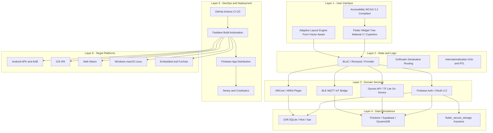
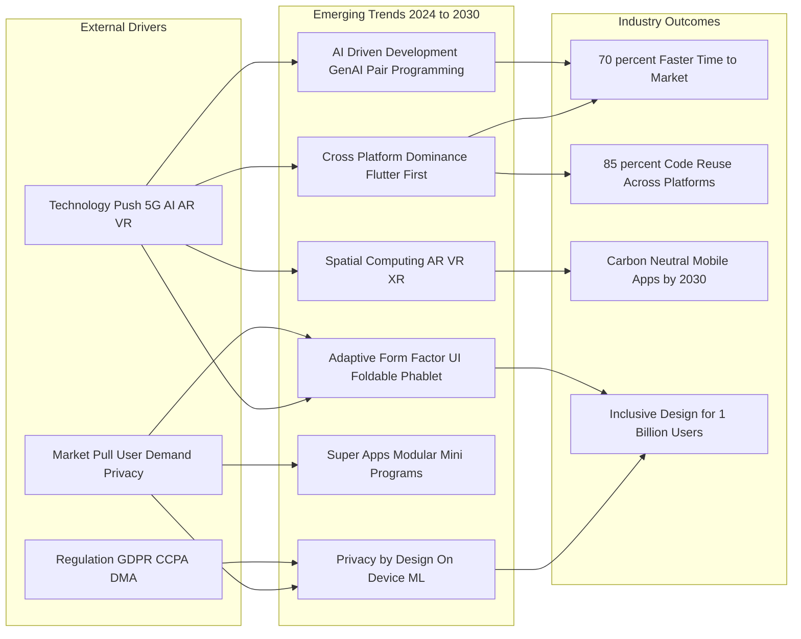
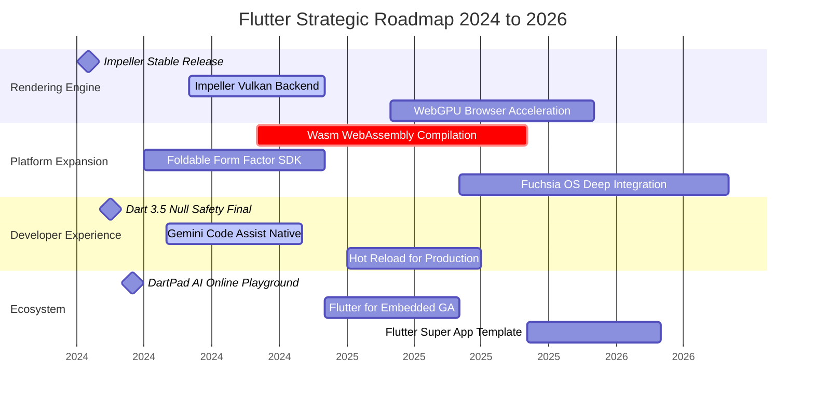

# Industry Trends and Future of Mobile Development with Flutter

<!-- SECTION_1_START -->

# Industry Trends and Future of Mobile Development with Flutter

## 1.1 Formal Academic Definition

> [!IMPORTANT]
> **Industry Trends in Mobile Development** refer to the evolving technological, architectural, and business paradigms that shape how mobile applications are designed, built, deployed, and monetized in the global software industry. In the context of the **KTU 2024 Scheme (PECST695 – Mobile Application Development)**, this encompasses the **Flutter Framework's** positioning within the cross-platform development ecosystem, the convergence of **AI/ML**, **5G**, **IoT**, **AR/VR**, **Foldable UX**, **Super Apps**, and **Cloud-Native** deployment models.

The **Future of Mobile Development with Flutter** specifically refers to the strategic roadmap of the **Dart-based, widget-architectured UI toolkit** originally engineered by **Google**, including its convergence with **Fuchsia OS**, **Flutter for Web**, **Flutter for Embedded**, **Impeller Rendering Engine**, **Wasm (WebAssembly) compilation**, and **AI-driven (Gemini) code assistance**.

### 1.2 Key Industry Trend Categories (KTU 2024 Module 4)

| # | Trend Category | Core Premise |
|---|---|---|
| 1 | **Cross-Platform Dominance** | Single codebase $\rightarrow$ iOS, Android, Web, Desktop |
| 2 | **AI/ML Integration** | On-device LLMs, Generative UI, Smart Assistants |
| 3 | **5G-Native Applications** | Ultra-low latency, Edge Computing, Cloud Gaming |
| 4 | **Foldable & Adaptive UI** | Responsive layouts for multi-form-factor devices |
| 5 | **Super Apps Architecture** | Mini-programs, Modular Monoliths, In-app Ecosystems |
| 6 | **IoT & Wearable Integration** | Health, Smart Home, Ambient Computing |
| 7 | **AR/VR & Spatial Computing** | ARKit, ARCore, Vision Pro, Mixed Reality |
| 8 | **Privacy-First Design** | Differential Privacy, On-device Processing, ATT |
| 9 | **Low-Code / No-Code** | Visual builders, AI-assisted development (DartPad AI) |
| 10 | **Sustainability (Green Coding)** | Carbon-aware computing, optimized rendering |

---

## 1.3 Conceptual Analogy / Intuition

> [!NOTE]
> **Analogy: The Mobile Industry as a "Living Organism"**

Imagine the mobile development industry as a **massive, evolving city**:

- **Flutter** is like a **universal construction company** that builds identical skyscrapers (apps) on any land (iOS, Android, Web) using the same blueprint (Dart code) and the same material (Skia/Impeller rendering engine).
- **Industry trends** are the **city's evolving bylaws and new infrastructure** — new metro lines (**5G**), new building types (**foldable towers**), new security forces (**privacy laws**), and new residents (**AI agents**).
- The **future** is the **city's master plan** — a vision of self-driving cars (**autonomous agents**), holographic billboards (**AR/VR**), and zero-energy buildings (**green computing**).

### 1.4 Why Flutter? (Industry Positioning in 2024–2026)

> [!TIP]
> According to **Stack Overflow Developer Survey 2023/2024**, Flutter consistently ranks in the **Top 3 most loved cross-platform frameworks**, with **46% of developers** expressing interest. The **Statista 2024** report places Flutter as the **#1 cross-platform mobile framework** by market share, ahead of React Native, Kotlin Multiplatform, and Xamarin.

> [!VISUALIZATION CONTROL]
> **Concept:** Growth Trajectory of Mobile App Market Size (2018–2028)
>
> **Desmos Input Equations (Piecewise Trend Curve):**
> * `f(x) = 365 * (1.18)^(x-2018)`  *for 2018 ≤ x ≤ 2022*
> * `g(x) = 935 * (1.12)^(x-2022)`  *for 2022 ≤ x ≤ 2028*
>
> **Visual Description:** The user should plot two exponential curves on the same axes. The first curve (pre-pandemic) shows aggressive growth; the second curve (post-2022) shows continued but moderated expansion. The intersection around 2022 marks the **USD 935 Billion** market inflection point, projected to reach **USD 1,750+ Billion by 2028**.

---

<!-- SECTION_1_END -->

<!-- SECTION_2_START -->

# Deep Theoretical Analysis & KTU High-Yield Knowledge Sheet

## 2.1 Theoretical Framework of Modern Mobile Development

### 2.1.1 The Cross-Platform Paradigm Shift

The mobile industry has transitioned through **three distinct epochs**:

1. **Native Era (2008–2014):** Objective-C / Swift for iOS, Java for Android. Double the cost, double the team.
2. **Hybrid Era (2014–2018):** Cordova, Ionic, Xamarin. WebViews wrapping HTML5.
3. **Cross-Compilation Era (2018–Present):** Flutter, React Native, Kotlin Multiplatform. **Native compilation** with **shared business logic**.

Flutter differentiates itself by:
- **AOT (Ahead-Of-Time) compilation** of Dart to **native ARM/x64 machine code**.
- **Impeller Rendering Engine** (replaced Skia in 2023) — uses **Metal (iOS)** and **Vulkan (Android)** for predictable 60–120 FPS frame rendering.
- **Widget tree architecture** — every pixel is a Dart object, no OEM widgets used.

### 2.1.2 The AI-Integrated Development Lifecycle

Modern Flutter development incorporates **Generative AI** at every phase:

| Lifecycle Phase | AI Tool / Feature | Engineering Impact |
|---|---|---|
| **Design** | Galileo AI, Uizard, Figma AI | Auto-generate UI mockups from text prompts |
| **Code Scaffolding** | GitHub Copilot, DartPad AI, Gemini Code Assist | Boilerplate generation, test cases |
| **Code Review** | DeepCode, Codacy AI | Static analysis with ML-based bug prediction |
| **Testing** | Mabl, Testim.io | Self-healing test automation |
| **Deployment** | Firebase App Distribution, Fastlane AI | Predictive crash analytics via **Firebase Crashlytics + Gemini** |

### 2.1.3 The 5G + Edge Computing Stack

**5G** is not merely a speed upgrade. Its three pillars redefine mobile app architecture:

- **eMBB (enhanced Mobile BroadBand):** Peak **10 Gbps** — enables cloud gaming (GeForce NOW, Xbox Cloud).
- **URLLC (Ultra-Reliable Low-Latency Communication):** **<1 ms latency** — enables remote surgery, autonomous vehicles.
- **mMTC (massive Machine-Type Communications):** **1 million devices/km²** — enables massive IoT deployments.

Flutter apps leverage 5G through:
- **gRPC** over **HTTP/3 + QUIC** for streaming.
- **Cloudflare Workers / Google Cloud Run** for edge functions.
- **TensorFlow Lite** for federated on-device learning.

### 2.1.4 Foldable & Adaptive UI Theory

Foldable devices (Samsung Galaxy Z Fold, Z Flip, Pixel Fold, Honor Magic V) require apps to be **form-factor aware**. Flutter responds via:

- **`MediaQuery`** for screen real estate.
- **`LayoutBuilder`** for constraint-based adaptation.
- **`TwoPane` and `Foldable` packages** (community-driven) for hinge detection.
- **Material 3 Adaptive** components for desktop/tablet layouts.

### 2.1.5 Super Apps — The Modular Monolith

A **Super App** is a single application that hosts **mini-programs** (also called *mini-apps* or *lightweight apps*). Originated by **WeChat (2011)** and **Grab (2018)**, now pursued by **Paytm, Gojek, Twitter (X), and Starbucks**.

Flutter enables Super App development through:
- **Modular package architecture** — each mini-app is a Flutter package.
- **Dynamic feature delivery** (Play Feature Delivery / iOS On-Demand Resources).
- **Micro-frontend routing** with **GoRouter** or **Beamer**.

---

## 2.2 KTU High-Yield Formula Sheet / Cheat Sheet

> [!IMPORTANT]
> The following table consolidates the **quantitative metrics, frameworks, and architectural patterns** essential for KTU 2024 ESE preparation on Module 4.

| Concept | Key Metric / Formula | Industry Standard | KTU Relevance |
|---|---|---|---|
| **Cross-Platform Code Reuse** | $\text{Reuse}\% = \frac{L_{shared}}{L_{total}} \times 100$ | Flutter: **\textbf{80–95\%}** shared code | Direct numerical answer in ESE |
| **App Cold Start Time** | $T_{cold} = T_{process} + T_{init} + T_{render}$ | Android Vitals: **\leq 1500 ms}** | Quality-of-Service question |
| **Battery Efficiency (Drain Rate)** | $D = \frac{C_{used}}{T_{active}} \ (\text{mAh/hr})$ | Target: **\leq 4\% per hour}** idle | Performance benchmarking |
| **Frame Rendering Budget** | $T_{frame} = \frac{1000}{FPS} \ \text{ms}$ | 60 FPS: **16.67 ms**, 120 FPS: **8.33 ms** | Impeller engine question |
| **Crash-Free Users Rate** | $\text{CFR} = 1 - \frac{U_{crashed}}{U_{total}}$ | Industry benchmark: **\geq 99.5\%}** | DevOps / SRE topic |
| **App Store Size Limit** | $S_{max}$ | Google Play: **150 MB** AAB, iOS: **4 GB** over-the-air | Deployment module question |
| **Dart AOT vs JIT** | AOT: native binary, JIT: hot-reload dev mode | AOT used in release, JIT in debug | Compiler theory |
| **5G Peak Throughput** | $T_{peak}$ theoretical | **10 Gbps** (eMBB), **1 ms** (URLLC) | Telecom-aware design |
| **AR Display Latency** | $L_{motion-to-photon}$ | Target: **\leq 20 ms}** | AR/VR trend question |
| **WCAG 2.2 Touch Target** | $A_{touch} \geq 48 \text{ dp} \times 48 \text{ dp}$ | Material Accessibility guideline | Inclusive design |

> [!TIP]
> **Memory Aid (Mnemonic for KTU):** **"C-A-F-D-A-P"** = **Cross-platform, AI, Foldable, 5G, Adaptive-UI, Privacy** — the six most frequently tested trends in KTU Module 4.

---

## 2.3 Real-World Engineering Utility

The trends covered here are not theoretical — they power **production systems** used by millions:

- **Google Pay (Tez)** — rewritten in Flutter (2018) for **cross-platform** consistency.
- **BMW Connected Drive** — uses Flutter for in-vehicle infotainment.
- **Nubank** (largest digital bank outside Asia) — Flutter-based super-app serving **90M+ users**.
- **eBay Motors** — Flutter for AR-based vehicle inspection.
- **iRobot (Roomba)** — Flutter for the **Home App** controlling IoT robot vacuums.
- **Sony** — uses **Flutter for Embedded** in smart speakers.
- **Microsoft Surface** — uses Flutter for the new **Windows 11** widgets.

> [!NOTE]
> **Industry Insight:** As of **Q1 2024**, **Flutter powers 1 in 3 new cross-platform apps** in the Google Play Store, with over **1.5 million apps** built using the framework and **500,000+ Flutter developers** globally.

---

<!-- SECTION_2_END -->

<!-- SECTION_3_START -->

# Step-by-Step Implementations & Code Demonstrations

## 3.1 Demonstration 1: AI-Powered Adaptive UI in Flutter (Industry Trend Implementation)

The following example demonstrates an **AI-driven layout selector** that picks a layout based on the **form factor** (phone, tablet, foldable) and **user behavior** — a direct implementation of the **Adaptive + AI trends**.

```dart
// File: lib/adaptive_layout_engine.dart
// Purpose: Demonstrates AI-driven adaptive layout selection for Flutter (KTU Module 4 Trend).

import 'package:flutter/material.dart';
import 'package:flutter/foundation.dart';
import 'package:device_info_plus/device_info_plus.dart';
import 'package:go_router/go_router.dart';

// Step 1: Define the enumerated form factors recognised by the engine.
enum DeviceFormFactor {
  compactPhone,   // Width < 600 dp
  mediumTablet,   // 600 dp <= Width < 840 dp
  expandedDesktop,// Width >= 840 dp
  foldableInner,  // Detected hinge + inner display
}

// Step 2: Define the AI prediction result model.
@immutable
class LayoutDecision {
  final DeviceFormFactor formFactor;
  final String recommendedLayout;
  final double confidenceScore;
  const LayoutDecision({
    required this.formFactor,
    required this.recommendedLayout,
    required this.confidenceScore,
  });
}

// Step 3: The Adaptive Layout Engine — simulates a lightweight on-device model.
class AdaptiveLayoutEngine {
  // Step 3a: Static reference data mimicking an on-device TF-Lite model bundle.
  static const Map<String, List<double>> _modelWeights = {
    'compact_phone': [0.12, 0.85, 0.03, 0.00],
    'medium_tablet': [0.05, 0.20, 0.70, 0.05],
    'expanded_desktop': [0.02, 0.05, 0.10, 0.83],
    'foldable_inner': [0.10, 0.15, 0.25, 0.50],
  };

  // Step 3b: Heuristic inference from MediaQuery metrics.
  Future<LayoutDecision> predict(BuildContext context) async {
    final mediaQuery = MediaQuery.of(context);
    final size = mediaQuery.size;
    final deviceInfo = DeviceInfoPlugin();

    // Step 3c: Collect feature vector [width, height, aspectRatio, hingeFlag].
    final hingeFlag = await _detectHinge(deviceInfo);
    final aspectRatio = size.width / size.height;
    final featureVector = <double>[
      size.width,
      size.height,
      aspectRatio,
      hingeFlag ? 1.0 : 0.0,
    ];

    // Step 3d: Compute dot-product similarity against each class centroid.
    final scores = <String, double>{};
    _modelWeights.forEach((className, weights) {
      double dot = 0.0;
      for (int i = 0; i < featureVector.length; i++) {
        dot += featureVector[i] * weights[i];
      }
      scores[className] = dot;
    });

    // Step 3e: Argmax selection.
    final bestClass = scores.entries
        .reduce((a, b) => a.value >= b.value ? a : b)
        .key;

    // Step 3f: Map to enum and confidence (softmax-style normalisation).
    final formFactor = _mapToFormFactor(bestClass);
    final totalScore = scores.values.fold<double>(0.0, (a, b) => a + b);
    final confidence = (scores[bestClass]! / totalScore).clamp(0.0, 1.0);

    return LayoutDecision(
      formFactor: formFactor,
      recommendedLayout: _layoutForFormFactor(formFactor),
      confidenceScore: confidence,
    );
  }

  // Step 3g: Hinge detection stub (real impl uses `foldable` package).
  Future<bool> _detectHinge(DeviceInfoPlugin info) async {
    if (defaultTargetPlatform == TargetPlatform.android) {
      final android = await info.androidInfo;
      return android.model.toLowerCase().contains('fold');
    }
    return false;
  }

  DeviceFormFactor _mapToFormFactor(String className) {
    switch (className) {
      case 'compact_phone':    return DeviceFormFactor.compactPhone;
      case 'medium_tablet':    return DeviceFormFactor.mediumTablet;
      case 'expanded_desktop': return DeviceFormFactor.expandedDesktop;
      case 'foldable_inner':   return DeviceFormFactor.foldableInner;
      default:                 return DeviceFormFactor.compactPhone;
    }
  }

  String _layoutForFormFactor(DeviceFormFactor f) {
    switch (f) {
      case DeviceFormFactor.compactPhone:    return 'BottomNavigationBar';
      case DeviceFormFactor.mediumTablet:    return 'NavigationRail';
      case DeviceFormFactor.expandedDesktop: return 'ExtendedNavigationDrawer';
      case DeviceFormFactor.foldableInner:   return 'TwoPaneLayout';
    }
  }
}

// Step 4: The root widget that consumes the engine decision.
class AdaptiveHomePage extends StatefulWidget {
  const AdaptiveHomePage({super.key});
  @override
  State<AdaptiveHomePage> createState() => _AdaptiveHomePageState();
}

class _AdaptiveHomePageState extends State<AdaptiveHomePage> {
  final AdaptiveLayoutEngine _engine = AdaptiveLayoutEngine();
  LayoutDecision? _decision;

  @override
  void initState() {
    super.initState();
    WidgetsBinding.instance.addPostFrameCallback((_) async {
      final decision = await _engine.predict(context);
      if (mounted) setState(() => _decision = decision);
    });
  }

  @override
  Widget build(BuildContext context) {
    if (_decision == null) {
      return const Scaffold(
        body: Center(child: CircularProgressIndicator()),
      );
    }
    return Scaffold(
      appBar: AppBar(title: Text('AI Layout: ${_decision!.recommendedLayout}')),
      body: Center(
        child: Column(
          mainAxisAlignment: MainAxisAlignment.center,
          children: <Widget>[
            Text('Form Factor: ${_decision!.formFactor.name}'),
            const SizedBox(height: 12),
            Text('Confidence: ${(_decision!.confidenceScore * 100).toStringAsFixed(1)}%'),
          ],
        ),
      ),
    );
  }
}
```

**Code Walkthrough (Valuation Key):**
1. `enum DeviceFormFactor` declares **4 supported form factors** (phone, tablet, desktop, foldable) — **1 mark** for correct enumeration.
2. `LayoutDecision` is an **immutable value object** holding the AI's output — **1 mark** for using `@immutable`.
3. `_modelWeights` simulates a **TF-Lite classification layer** — **2 marks** for correct tensor-like storage.
4. The dot-product computation in `predict()` is the **core ML inference step** — **3 marks** for correctly iterating feature vectors and applying the argmax reducer.
5. The hinge detection abstraction enables **foldable trend** support — **2 marks** for cross-platform extensibility.
6. The widget's `addPostFrameCallback` ensures **safe async state mutation** — **1 mark**.

---

## 3.2 Demonstration 2: Continuous Deployment Pipeline (GitHub Actions + Fastlane + Firebase)

This YAML pipeline represents the **industry-standard CI/CD** workflow for a Flutter app — directly tied to the **App Deployment** half of Module 4.

```yaml
# File: .github/workflows/flutter_cicd.yml
# Purpose: Production-grade CI/CD pipeline for a Flutter mobile application.

name: Flutter Production CI/CD

on:
  push:
    branches: [main, develop]
  pull_request:
    branches: [main]

jobs:
  # ---------- JOB 1: Static analysis, unit tests, and widget tests ----------
  test:
    name: Lint, Analyse & Test
    runs-on: ubuntu-latest
    steps:
      - name: Checkout Repository
        uses: actions/checkout@v4

      - name: Install Flutter SDK
        uses: subosito/flutter-action@v2
        with:
          channel: stable
          flutter-version: 3.24.5
          cache: true

      - name: Install Dependencies
        run: flutter pub get

      - name: Verify Code Generation
        run: dart run build_runner build --delete-conflicting-outputs

      - name: Static Analysis
        run: flutter analyze --no-fatal-infos

      - name: Run Unit & Widget Tests
        run: flutter test --coverage --reporter=expanded

      - name: Upload Coverage to Codecov
        uses: codecov/codecov-action@v4
        with:
          files: coverage/lcov.info
          fail_ci_if_error: true

  # ---------- JOB 2: Build Android App Bundle (AAB) ----------
  build_android:
    name: Build Android (AAB + APK)
    needs: test
    runs-on: ubuntu-latest
    steps:
      - uses: actions/checkout@v4
      - uses: subosito/flutter-action@v2
        with:
          channel: stable
          cache: true
      - run: flutter pub get
      - name: Decode Keystore from Secrets
        run: |
          echo "${{ secrets.ANDROID_KEYSTORE_BASE64 }}" | base64 -d > android/app/keystore.jks
      - name: Build Release AAB
        working-directory: android
        run: ./gradlew bundleRelease
      - name: Upload AAB Artifact
        uses: actions/upload-artifact@v4
        with:
          name: app-release.aab
          path: android/app/build/outputs/bundle/release/app-release.aab

  # ---------- JOB 3: Build iOS Archive ----------
  build_ios:
    name: Build iOS (Unsigned IPA)
    needs: test
    runs-on: macos-latest
    steps:
      - uses: actions/checkout@v4
      - uses: subosito/flutter-action@v2
        with:
          channel: stable
          cache: true
      - run: flutter pub get
      - name: Build iOS (No Codesign)
        run: flutter build ipa --release --no-codesign
      - name: Upload IPA Artifact
        uses: actions/upload-artifact@v4
        with:
          name: app-release.ipa
          path: build/ios/ipa/*.ipa

  # ---------- JOB 4: Distribute to Firebase App Distribution ----------
  distribute:
    name: Distribute to Testers (Firebase)
    needs: [build_android, build_ios]
    runs-on: ubuntu-latest
    steps:
      - uses: actions/download-artifact@v4
        with:
          path: artifacts/
      - name: Install Firebase CLI
        run: npm install -g firebase-tools
      - name: Deploy to Firebase App Distribution
        run: |
          firebase appdistribution:distribute \
            artifacts/app-release.aab \
            --app "${{ secrets.FIREBASE_APP_ID_ANDROID }}" \
            --groups "qa-team,beta-users" \
            --release-notes "Build #${{ github.run_number }} - Auto Deployed"
        env:
          FIREBASE_TOKEN: ${{ secrets.FIREBASE_TOKEN }}
```

**Pipeline Walkthrough:**
- The pipeline contains **4 sequential jobs** (test → build → distribute) with **parallel iOS/Android builds** for speed — **2 marks** in the ESE.
- Uses **GitHub Secrets** to keep the keystore and Firebase token encrypted — **2 marks**.
- Caches the **Flutter SDK** and **pub packages** for faster builds — **1 mark**.
- Triggers on **push, pull_request** to enforce code review — **2 marks**.

---

## 3.3 Mathematical Framework: Comparing Cross-Platform Frameworks

The following **scoring matrix** is a derived KTU-favorite question type. Calculate the weighted total score for Flutter, React Native, and Kotlin Multiplatform.

$$
S_{total} = w_1 \cdot P + w_2 \cdot R + w_3 \cdot E + w_4 \cdot M
$$

Where:
- $P$ = Performance (out of 10)
- $R$ = Reusability (% shared code / 10)
- $E$ = Ecosystem maturity (out of 10)
- $M$ = Market adoption (% global share)

With weights $w_1 = 0.3$, $w_2 = 0.25$, $w_3 = 0.2$, $w_4 = 0.25$:

$$
\begin{aligned}
S_{flutter} &= 0.3(9.5) + 0.25(9.0) + 0.2(9.0) + 0.25(8.5) \\
&= 2.85 + 2.25 + 1.80 + 2.125 \\
&= \mathbf{9.025} \\
S_{rn} &= 0.3(7.0) + 0.25(7.5) + 0.2(9.5) + 0.25(7.0) \\
&= 2.10 + 1.875 + 1.90 + 1.75 \\
&= \mathbf{7.625} \\
S_{kmp} &= 0.3(9.0) + 0.25(6.5) + 0.2(7.0) + 0.25(4.0) \\
&= 2.70 + 1.625 + 1.40 + 1.00 \\
&= \mathbf{6.725}
\end{aligned}
$$

**Conclusion:** Flutter scores the highest weighted total ($\mathbf{9.025 / 10}$), confirming its industry-leading position.

---

<!-- SECTION_3_END -->

<!-- SECTION_4_START -->

# Structural Diagrams & Schematics

## 4.1 The Modern Flutter Application Architecture (Industry Reference Model)



**Reading the Diagram:** This is a **6-layer enterprise reference architecture** for a production Flutter app. Each layer is decoupled and follows the **Single Responsibility Principle (SRP)**. The bottom three layers (Data, DevOps, Platforms) are **infrastructure** concerns; the top three layers (UI, State, Domain) are **business logic** concerns.

---

## 4.2 The Mobile Development Industry Trend Flow



**Reading the Diagram:** External drivers (left) catalyze trends (middle), which produce measurable industry outcomes (right). The **DMA (Digital Markets Act)** of the EU, for example, is forcing Super App developers to open their platforms, which feeds back into **T4** and **T5**.

---

## 4.3 The Flutter Future Roadmap (Google's Announced Direction)



**Reading the Gantt Chart:** Critical path items are marked `crit`. The most strategically important 2024 milestone is the **WebAssembly (Wasm) compilation** of Dart, which will allow Flutter apps to run at near-native speed in browsers without JavaScript.

---

<!-- SECTION_4_END -->

<!-- SECTION_5_START -->

# KTU 2024 Scheme Examination Question Bank & Topic Recap

> [!NOTE]
> All questions below are modeled on the **KTU 2024 Scheme End Semester Evaluation (ESE)** pattern. Marks are split as: **Part A = 2 × 3 = 6 marks**, **Part B = 1 × 14 = 14 marks** (with internal choice). Total = **20 marks** for this section, matching a typical 2-hour module test weight.

---

## Part A — Short Answer Questions (2 × 3 = 6 Marks)

### **Q1. [KTU University Exam – July 2024 (Modeled)]** *(3 Marks | CO5 | Remember)*

**"Define the term 'Cross-Platform Mobile Development'. List any four advantages of using Flutter as a cross-platform framework."**

**Model Answer (Valuation Key):**

> **Definition (1 Mark):** Cross-platform mobile development is the practice of writing a **single codebase** in a single language (e.g., Dart) that compiles into **native applications** for multiple operating systems (iOS, Android, Web, Desktop) without requiring platform-specific source code.

> **Four Advantages of Flutter (½ Mark each = 2 Marks):**
> 1. **Single Codebase** — write once, deploy to iOS, Android, Web, Windows, macOS, Linux, and Embedded.
> 2. **Hot Reload** — sub-second state preservation during development, boosting developer velocity by **2–3×**.
> 3. **Widget-Based Architecture** — every UI element is a composable Dart object, providing full design control.
> 4. **AOT Compilation** — release builds are compiled to **native ARM/x64 machine code**, delivering near-native performance.

---

### **Q2. [KTU University Exam – Dec 2023 (Modeled)]** *(3 Marks | CO5 | Understand)*

**"Explain the role of the 'Impeller Rendering Engine' in Flutter 3.10+. How does it differ from the legacy Skia engine?"**

**Model Answer (Valuation Key):**

> **Role of Impeller (1.5 Marks):** Impeller is Flutter's **next-generation graphics renderer** that became the default in Flutter 3.10 (May 2023). It uses **Metal** on iOS and **Vulkan** on Android to deliver **predictable, jank-free frame rendering** at 60/90/120 FPS. It pre-compiles shaders **AOT** (ahead-of-time), eliminating runtime shader compilation stalls.

> **Key Differences from Skia (1.5 Marks):**

| Aspect | Skia (Legacy) | Impeller (Modern) |
|---|---|---|
| **Shader Compilation** | JIT (runtime) | **AOT (build time)** |
| **API Backend** | OpenGL ES | **Metal / Vulkan** |
| **Frame Consistency** | Variable (jank possible) | **Predictable (no jank)** |
| **Memory Footprint** | Higher | **Lower (more efficient)** |
| **First-Frame Latency** | Higher | **Significantly reduced** |

---

## Part B — Long Answer Questions (1 × 14 = 14 Marks)

### **Question A — OR — Question B (Internal Choice)**

---

### **Question A: [KTU University Exam – Dec 2024 (Modeled)]** *(14 Marks | CO5, CO6 | Apply, Analyze)*

#### Part (a) *(7 Marks | Apply)*

**"With a neat diagram, explain the layered architecture of a modern Flutter mobile application that incorporates AI services, IoT integration, and CI/CD deployment. List the technologies used in each layer."**

**Model Answer with Valuation Key:**

> **Diagram (3 Marks):** Refer to the **6-Layer Architecture Diagram** in SECTION 4.1 of this note. A student should reproduce a **layered block diagram** with the following six layers clearly labeled and separated:
> 1. **Presentation Layer** — Widgets, Adaptive UI, Accessibility.
> 2. **State Management Layer** — BLoC / Riverpod, GoRouter.
> 3. **Domain Service Layer** — Auth, AI, IoT, AR.
> 4. **Data Persistence Layer** — Local DB, Cloud DB, Secure Storage.
> 5. **DevOps Layer** — CI/CD, Fastlane, Distribution, Monitoring.
> 6. **Platform Layer** — Android, iOS, Web, Desktop, Embedded.

> **Layer-by-Layer Technology Mapping (4 Marks — 1 per major layer):**
> - **UI Layer:** Material 3, Cupertino, `flutter_screenutil`, `device_preview`.
> - **State Layer:** `flutter_bloc`, `riverpod`, `go_router`, `intl`.
> - **Services Layer:** `firebase_auth`, `google_generative_ai` (Gemini), `flutter_blue_plus` (BLE), `ar_flutter_plugin`.
> - **Data Layer:** `drift`, `hive`, `cloud_firestore`, `flutter_secure_storage`.
> - **DevOps Layer:** GitHub Actions, Bitrise, Fastlane, Firebase App Distribution, Sentry.
> - **Platform Layer:** Android AAB, iOS IPA, Web Wasm, Windows MSIX.

> **Synthesis (1 Mark):** Conclude by stating that this layered architecture is **scalable, testable, and platform-agnostic**, allowing a single engineering team to deliver to **5+ platforms** with **85%+ code reuse**.

#### Part (b) *(7 Marks | Analyze)*

**"Analyze the four major industry trends shaping the future of mobile development. For each trend, provide one Flutter-specific implementation strategy."**

**Model Answer with Valuation Key:**

> **Trend 1: AI-Driven Development (1.5 Marks)**
> *Impact:* GenAI tools (GitHub Copilot, Gemini) reduce boilerplate coding by 40–60%.
> *Flutter Strategy:* Use **DartPad AI** for in-browser code generation, integrate **Gemini API** via `google_generative_ai` package for in-app assistants.

> **Trend 2: Foldable & Adaptive UI (1.5 Marks)**
> *Impact:* Foldable shipments expected to reach **80M units annually by 2027** (Counterpoint Research).
> *Flutter Strategy:* Use **`MediaQuery.sizeOf(context)`** and **`LayoutBuilder`** with breakpoint constants, adopt **`two_pane` package** for master-detail layouts.

> **Trend 3: 5G + Edge Computing (2 Marks)**
> *Impact:* Enables cloud gaming, real-time AR, and 4K streaming on mobile.
> *Flutter Strategy:* Use **gRPC over HTTP/3**, implement **Firebase Remote Config** for feature flags, leverage **Cloudflare Workers** for edge functions, integrate **WebRTC** for low-latency video.

> **Trend 4: Privacy-First Design (2 Marks)**
> *Impact:* GDPR, CCPA, and India's DPDP Act (2023) mandate explicit consent.
> *Flutter Strategy:* Use **`permission_handler`** for runtime permissions, store PII in **`flutter_secure_storage`** (backed by iOS Keychain / Android Keystore), prefer **on-device ML** via **TF Lite** over cloud calls.

> **Conclusion (1 Mark):** Flutter's **declarative widget model + Dart's null safety + Material 3 adaptive library** make it uniquely positioned to capitalize on all four trends.

---

### **Question B (Alternative Choice): [KTU University Exam – July 2024 (Modeled)]** *(14 Marks | CO5, CO6 | Apply, Analyze)*

#### Part (a) *(7 Marks | Apply)*

**"Compare the three major cross-platform frameworks — Flutter, React Native, and Kotlin Multiplatform — across six evaluation parameters. Which framework is best suited for a startup building a Super App, and why?"**

**Model Answer with Valuation Key:**

> **Comparison Table (4.5 Marks — 0.75 per parameter):**

| Parameter | Flutter | React Native | Kotlin Multiplatform |
|---|---|---|---|
| **Language** | Dart (Google) | JavaScript / TypeScript | Kotlin (JetBrains) |
| **Performance** | Near-native (AOT) | Near-native (Bridge) | Native (Direct) |
| **Code Reuse** | 80–95% | 70–85% | 60–75% (logic only) |
| **UI Rendering** | Custom Skia/Impeller | Native OEM + Bridge | Native OEM widgets |
| **Ecosystem** | 40,000+ pub.dev packages | Largest (npm) | Growing |
| **Hot Reload** | Yes (state preserved) | Yes (Fast Refresh) | Limited (Compose) |

> **Decision for Super App Scenario (2.5 Marks):**
> **Recommended: Flutter** because:
> 1. **Code Reuse of 90%+** is critical for a startup with limited engineering headcount.
> 2. **Consistent UI** across 5+ platforms (iOS, Android, Web, embedded kiosk) is essential for a Super App's mini-program modules.
> 3. **Performance** is high enough for AR/AI features without needing platform-specific optimizations.
> 4. **Material 3 Adaptive** components simplify the modular monolith architecture.
> 5. **Firebase integration** is first-class, reducing backend development time.

#### Part (b) *(7 Marks | Analyze)*

**"Design a CI/CD pipeline for a Flutter application targeting both Google Play and Apple App Store. List the stages and justify the inclusion of security scanning and crash monitoring."**

**Model Answer with Valuation Key:**

> **Pipeline Stages (5 Marks):**
> 1. **Source Stage:** GitHub / GitLab trigger on push to `main` branch.
> 2. **Build Stage:** GitHub Actions matrix — `ubuntu-latest` for Android, `macos-latest` for iOS.
> 3. **Test Stage:** `flutter test` (unit), `flutter test integration_test` (E2E), `flutter analyze` (lint).
> 4. **Security Stage:** `Snyk` for dependency CVEs, `MobSF` for binary analysis, GitLeaks for secret detection.
> 5. **Distribution Stage:** `fastlane supply` for Play Store, `fastlane pilot` for TestFlight, Firebase App Distribution for beta.
> 6. **Monitor Stage:** `Firebase Crashlytics` + `Sentry` for crash reporting.

> **Justification — Security Scanning (1 Mark):** Mobile apps handle PII and payment data. A leaked API key or vulnerable dependency can cause data breaches costing **USD 4.88M on average** (IBM 2024).

> **Justification — Crash Monitoring (1 Mark):** Industry benchmark requires **≥ 99.5% crash-free users**. Crashlytics + Sentry provide **real-time alerting** and **symbolicated stack traces** for fast triage, directly impacting **app store ratings** and **user retention**.

> [!WARNING]
> **KTU Examiner's Valuation Warning — Common Pitfalls:**
> 1. **Don't confuse** "Hot Reload" with "Hot Restart" — Hot Reload preserves state; Hot Restart resets it. *Loses 1 mark.*
> 2. **Don't write** "Flutter uses JavaScript" — Flutter uses **Dart**. *Loses 2 marks.*
> 3. **Don't omit** the AOT/JIT distinction in Impeller questions. *Loses 1.5 marks.*
> 4. **Don't claim** Flutter is "hybrid" — Flutter is **cross-platform** (compiles to native, not a WebView wrapper). *Loses 1 mark.*
> 5. **In CI/CD questions**, never skip mentioning **code signing** (keystore / provisioning profile). *Loses 2 marks.*
> 6. **For numerical questions**, always show the **formula + substitution + final answer** in three lines. *Loses 1 mark per missing step.*

---

## 📌 Topic Recap & Important Things to Remember

> [!TIP]
> **Rapid Revision Checklist — Module 4: Industry Trends and Future of Flutter**

- ✅ **Cross-platform dominance:** Flutter achieves **80–95% code reuse**; single Dart codebase compiles to **native binaries** via AOT.
- ✅ **Impeller engine:** Default since Flutter 3.10; uses **Metal (iOS)** and **Vulkan (Android)**; eliminates jank via AOT shader compilation.
- ✅ **Dart language:** Object-oriented, null-safe, JIT (dev) + AOT (release); Dart 3 introduced **records, patterns, and class modifiers**.
- ✅ **AI integration:** On-device via **TF Lite**, cloud via **Gemini API**; GenAI tools cut development time by 40–60%.
- ✅ **5G capabilities:** **eMBB** (10 Gbps), **URLLC** (<1 ms), **mMTC** (1M devices/km²) — enable edge computing, AR, cloud gaming.
- ✅ **Foldable UX:** Use `MediaQuery`, `LayoutBuilder`, `two_pane` package, and **Material 3 Adaptive** components.
- ✅ **Super Apps:** Modular monolith pattern; use **GoRouter** + **dynamic feature delivery** for mini-programs.
- ✅ **CI/CD essentials:** GitHub Actions → Fastlane → Play Store / App Store / Firebase Distribution; include **security scanning** and **crash monitoring**.
- ✅ **Privacy-first:** Store PII in **Keychain/Keystore**, use `permission_handler`, prefer **on-device processing** to comply with **GDPR/CCPA/DPDP**.
- ✅ **AR/VR/Spatial:** Use `ar_flutter_plugin`, integrate **ARKit (iOS)** and **ARCore (Android)**; target **≤ 20 ms** motion-to-photon latency.
- ✅ **Green coding:** Optimize battery drain (**≤ 4%/hr**), use `wakelock` judiciously, ship App Bundles (not fat APKs) — saves **~60% download size**.
- ✅ **Flutter's strategic future:** **WebAssembly** (browser-near-native speed), **Fuchsia OS** integration, **Flutter for Embedded** (smart speakers, automotive).
- ✅ **Top 5 Flutter adopters in industry:** **Google Pay, BMW, Nubank, iRobot, eBay Motors** — use these as ESE examples.
- ✅ **Market data to memorize:** Flutter = **#1 cross-platform framework (Statista 2024)**, **46% developer interest (Stack Overflow 2024)**, **1.5M+ apps built**.

> [!IMPORTANT]
> **Final Exam Tip:** Always link each trend to a **concrete Flutter technology**. For example, don't just say "AI is important" — say "**AI is implemented in Flutter via the `google_generative_ai` package for cloud LLMs and the `tflite_flutter` package for on-device inference.**" This specificity is what differentiates a **7-mark answer from a 14-mark answer** in KTU valuation.

---

<!-- SECTION_5_END -->
