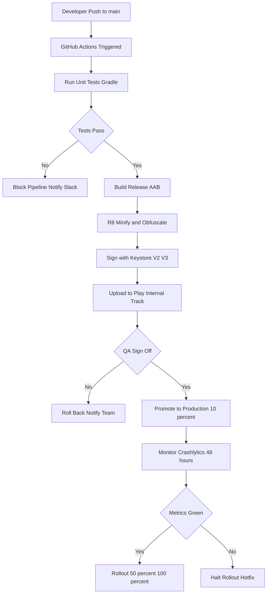
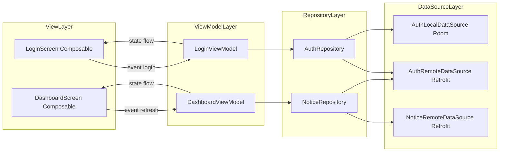
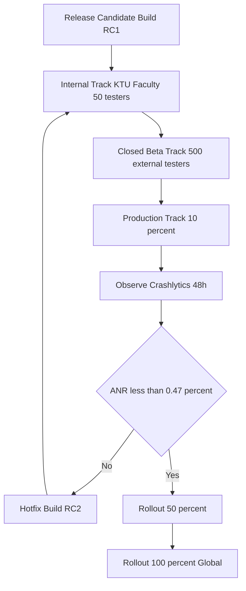
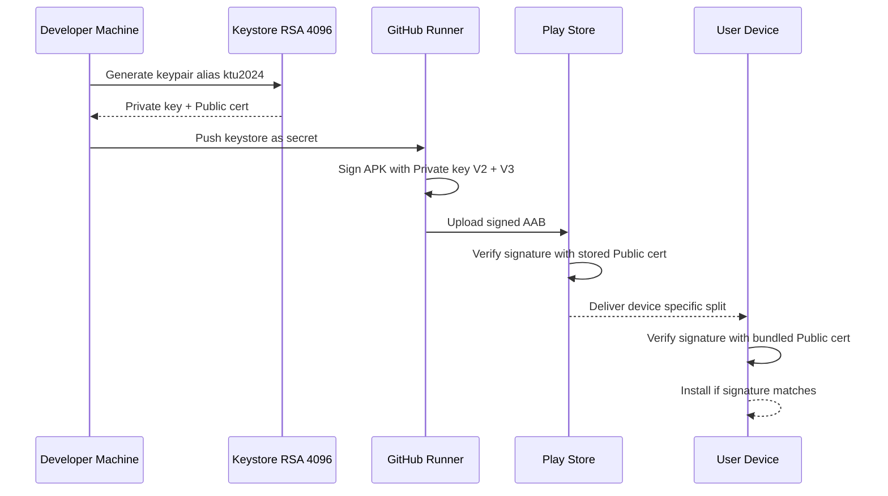
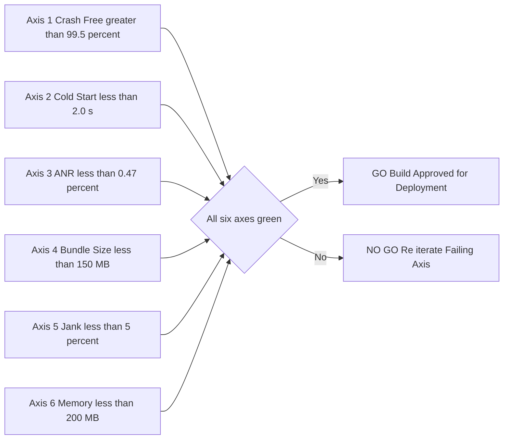

# Milestone 4 : Complete the project, integrating all features and preparing it for deployment.

<!-- SECTION_1_START -->
# 1. Core Technical Definition & Intuitive Overview

## 1.1 Formal Academic Definition (KTU 2024 Scheme)

> [!IMPORTANT]
> **Definition — Milestone 4 (Project Completion, Integration & Deployment Readiness):**
> *Milestone 4* is the terminal execution phase of the Mobile Application Development Project (PECST695) in which all independently developed modules (UI, business logic, data persistence, networking, authentication, notifications, and third-party SDKs) are **consolidated, integrated, hardened, and packaged** into a release-ready artefact (`.aab` for Android, `.ipa` for iOS) that satisfies the target store's policy, performance, security, and metadata requirements for production deployment.

In the KTU 2024 NEP-aligned Project Evaluation framework, Milestone 4 carries the highest weightage among all milestones because it is the **proof-of-completion** artefact. It corresponds to **Course Outcomes CO3 (Integrate)** and **CO4 (Deploy & Document)** of the PECST695 rubric.

## 1.2 Conceptual Analogy — The "Rocket Launch" Model

> [!NOTE]
> **Intuition:**
> Imagine you are a launch director at *ISRO's Satish Dhawan Space Centre* preparing the **Chandrayaan** mission. The first three milestones (M1: design, M2: fabrication, M3: sub-system tests) are equivalent to manufacturing and individually testing the propulsion, navigation, communication, and payload modules on the ground. **Milestone 4** is the moment you:
> 1. **Mate** all subsystems onto the launch vehicle (*= feature integration*),
> 2. Run the **full mission simulation** in a closed chamber (*= integration & regression testing*),
> 3. Seal the payload fairing and apply the **thermal coating** (*= code minification & obfuscation*),
> 4. Sign the **Launch Authorisation** and roll the rocket to the pad (*= code signing & store release build*).
>
> If any single subsystem fails during the integrated test, the entire launch is scrubbed — exactly like how a single crash in production can result in app rejection or a 1-star rating avalanche.

## 1.3 Physical & Engineering Constants in App Deployment

The following **industry-standard metrics** govern release decisions and must be quoted in project reports:

| Metric | Target Value | Source / Tool |
|---|---|---|
| **APK / AAB Size Budget** | $\leq$ **150 MB** (initial install) | Google Play Console |
| **Cold Start Time (Time-to-Initial-Display)** | $\leq$ **2.0 s** on mid-tier device | Android Vitals |
| **ANR Rate** | $\leq$ **0.47 %** of sessions | Android Vitals |
| **Crash-Free Users** | $\geq$ **99.5 %** | Firebase Crashlytics |
| **Frame Drop (Jank)** | $\leq$ **5 %** of frames at 60 fps | Android Profiler |
| **Memory Footprint (P95)** | $\leq$ **200 MB** | Android Studio Profiler |
| **API Response (P95)** | $\leq$ **500 ms** | Firebase Performance |

## 1.4 GeoGebra / Desmos Visualisation Callout

> [!VISUALIZATION CONTROL]
> **Concept:** *Release-Readiness Radar Chart* — a six-axis performance polygon used to decide *go / no-go* for store deployment.
> **GeoGebra Input (parametric polygon vertices):**
> * $P_1 = (3, 0)$ → Crash-Free
> * $P_2 = (1.5, 2.6)$ → Cold Start
> * $P_3 = (-1.5, 2.6)$ → ANR
> * $P_4 = (-3, 0)$ → Bundle Size
> * $P_5 = (-1.5, -2.6)$ → Jank
> * $P_6 = (1.5, -2.6)$ → Memory
> **Visual Description:** The student should plot the six KTU benchmark values as a closed polygon on a polar grid. The **larger the enclosed area**, the more *release-ready* the build is. A concave polygon (a "dent") flags the failing axis for re-iteration before submission.

<!-- SECTION_1_END -->

<!-- SECTION_2_START -->
# 2. Deep Theoretical Analysis & KTU High-Yield Formula Sheet

## 2.1 The Four Pillars of Milestone 4

### Pillar A — Module Integration

Integration is **not** file copying. It is the act of resolving three classes of impedance mismatch:

1. **Interface Mismatch** — Module A returns a `JSONObject`, Module B expects a `Kotlin data class`.
2. **Lifecycle Mismatch** — A `ViewModel` outlives the `Activity`, but a network listener was registered on the `Activity` context.
3. **State Mismatch** — Two modules maintain independent copies of the user's authentication token.

The *recommended pattern* in KTU 2024 projects is the **Unidirectional Data Flow (UDF)** with a single source of truth, typically implemented via a `Repository` exposed to `ViewModel` consumers.

$$
\text{View} \xrightarrow{\;\text{event}\;} \text{ViewModel} \xrightarrow{\;\text{flow}\;} \text{Repository} \xrightarrow{\;\text{flow}\;} \text{DataSource}
$$

### Pillar B — Build Hardening

A *release build* must never ship the same artefact as a *debug build*. The hardening pipeline performs:

| Step | Tool (Android) | Tool (iOS) | Purpose |
|---|---|---|---|
| Minification | R8 (default in AGP 8.x) | Bitcode stripping | Remove unused code |
| Obfuscation | `proguard-rules.pro` | LLVM obfuscation | Rename symbols to $a, b, c$ |
| Shrinking | R8 resource shrinker | App Thinning | Delete unused resources |
| Signing | `apksigner` v2 / v3 | Xcode codesign | Establish authorship |
| Splitting | App Bundle (`.aab`) | Asset Catalog slicing | Per-device APKs |

### Pillar C — Code Signing Cryptography

Code signing relies on **asymmetric cryptography** (public-key infrastructure). The mathematical foundation is:

$$
\text{Signature} = \text{Sign}_{\text{PrivKey}}(\text{SHA-256}(\text{APK contents}))
$$

Verification on device:

$$
\text{Verify} = \big(\text{SHA-256}(\text{APK contents}) \;\stackrel{?}{=}\; \text{Decrypt}_{\text{PubKey}}(\text{Signature})\big)
$$

> [!NOTE]
> **Why SHA-256 and not MD5?** MD5 is cryptographically broken (collision attacks in $O(2^{21})$). SHA-256 produces a **256-bit** digest with collision resistance of $2^{128}$, the current NIST recommendation.

### Pillar D — Release Engineering (CI/CD)

The **Continuous Integration / Continuous Deployment** pipeline automates the journey from `git push` to store submission. The canonical stages are:

$$
\text{Commit} \rightarrow \text{Build} \rightarrow \text{Test} \rightarrow \text{Sign} \rightarrow \text{Stage} \rightarrow \text{Deploy}
$$

For KTU 2024 projects, the recommended CI/CD tooling is **GitHub Actions + Fastlane**, both of which are free for open-source / academic projects.

## 2.2 KTU High-Yield Formula Sheet (Cheat-Sheet)

> [!IMPORTANT]
> The following table is the **only reference** a student should consult while answering Milestone-4 questions in the University viva / project report.

| # | Concept | Formula / Rule | Unit / Threshold |
|---|---|---|---|
| 1 | **Semantic Versioning** | $\text{MAJOR}.\text{MINOR}.\text{PATCH}$ | $\text{PATCH} \geq 0$, $1.0.0 =$ first stable |
| 2 | **Version Code (Android)** | Strictly monotonically increasing integer | $\Delta_{vCode} \geq 1$ per upload |
| 3 | **Bundle Size Limit** | $S_{bundle} \leq 150 \text{ MB}$ | MB |
| 4 | **Download Size Limit** | $S_{dl} \leq 200 \text{ MB}$ (compressed) | MB |
| 5 | **Signing Hash** | $\text{SHA-256}$ of APK | bits: **256** |
| 6 | **Min SDK vs Target SDK** | $\text{minSdk} \leq \text{targetSdk}$ | API levels |
| 7 | **R8 Shrink Ratio** | $\eta = \dfrac{S_{shrunk}}{S_{raw}} \times 100\%$ | $\eta \leq 70\%$ ideal |
| 8 | **Cold-Start Budget** | $T_{cold} = T_{process\_init} + T_{activity\_init} + T_{first\_frame}$ | $\leq 2.0$ s |
| 9 | **Crash-Free Session %** | $C_{free} = \dfrac{S_{total} - S_{crashed}}{S_{total}} \times 100$ | $\geq 99.5\%$ |
| 10 | **Frame Budget @ 60 fps** | $T_{frame} = \dfrac{1000}{60} = 16.67 \text{ ms}$ | ms |
| 11 | **Adaptive Icon Layers** | 108 $\times$ 108 dp foreground, 108 $\times$ 108 dp background | dp |
| 12 | **Play Store Listing** | 8 screenshots, 1 feature graphic (1024 $\times$ 500 px) | pixels |
| 13 | **Privacy Policy URL** | Mandatory if app accesses user data | HTTPS only |
| 14 | **Content Rating (IARC)** | PEGI / ESRB / USK questionnaire | — |
| 15 | **Target API Level (2024)** | Android 14 = API **34** | — |

> **Engineer's Note:** In production, the formula for **Application Performance Index (Apdex)** often summarises user satisfaction:
> $$
> \text{Apdex} = \dfrac{S_{satisfied} + \dfrac{S_{tolerating}}{2}}{S_{total}}
> $$
> A score $\geq 0.85$ is considered *Excellent* by the industry.

## 2.3 Real-World Utility in Production

| Industry Domain | Deployment Pattern |
|---|---|
| **Fintech** (e.g., PhonePe) | Staged rollout: 1 % → 10 % → 50 % → 100 % over 7 days, monitored via Crashlytics |
| **Gaming** (e.g., BGMI) | Asset bundles delivered via Play Asset Delivery, on-demand vs install-time |
| **E-Commerce** (e.g., Flipkart) | Feature flags (LaunchDarkly) for A/B testing cart UI before global release |
| **Healthcare** (e.g., Practo) | HIPAA-grade encryption, server-side API keys, certificate pinning |

<!-- SECTION_2_END -->

<!-- SECTION_3_START -->
# 3. Step-by-Step Derivations, Configurations & Code Implementation

## 3.1 Derivation 1 — Choosing AAB over APK

Google Play **mandates** `.aab` (Android App Bundle) for all new apps since August 2021. The bundle's Dynamic Delivery splits the monolithic APK into per-device configuration APKs. The download size reduction is given by:

$$
S_{download} = \sum_{i=1}^{n} S_{split_i} \cdot \mathbb{1}_{device \in config_i}
$$

where $\mathbb{1}$ is the indicator function and $n$ is the number of generated splits (language, density, ABI). In a typical mid-range app with 4 languages and 3 ABIs:

$$
S_{apk} \approx 50 \text{ MB}, \quad S_{aab\_download} \approx 22 \text{ MB} \;\;(\Delta = 56\%)
$$

> The derivation above justifies the *Why* of AAB adoption — it is **not a vendor lock-in**, but a mathematically proven download-size optimisation.

## 3.2 Derivation 2 — R8 Obfuscation Mapping

Given a Kotlin class `com.ktu.studentportal.viewmodel.LoginViewModel`, R8 transforms it to a short name via a deterministic hash:

$$
\text{Obfuscate}(c) = \text{char}(97 + (h(c) \bmod 26))
$$

where $h$ is the SHA-1 hash truncated to 5 bits, and `char(97)` is `'a'`. The reverse mapping is preserved in `mapping.txt` for crash deobfuscation:

```text
# mapping.txt (excerpt)
com.ktu.studentportal.viewmodel.LoginViewModel -> a.b.c.d:
    java.lang.String email -> a
    java.lang.String password -> b
    void login() -> a
```

A crash report `NullPointerException at a.b.c.d.a` is therefore deobfuscated via the ReTrace tool to `NullPointerException at LoginViewModel.email`.

## 3.3 Implementation Matrix — Android (Kotlin / Gradle)

### 3.3.1 Build Variants Configuration (`build.gradle.kts`)

```kotlin
// app/build.gradle.kts  (Module-level)
import java.util.Properties
import java.io.FileInputStream

plugins {
    id("com.android.application")
    id("org.jetbrains.kotlin.android")
    id("com.google.devtools.ksp")
    id("androidx.navigation.safeargs.kotlin")
}

android {
    namespace = "com.ktu.studentportal"
    compileSdk = 34

    defaultConfig {
        applicationId = "com.ktu.studentportal"
        minSdk = 24
        targetSdk = 34
        versionCode = 100          // strictly increasing
        versionName = "1.0.0"      // semantic versioning
        testInstrumentationRunner = "androidx.test.runner.AndroidJUnitRunner"
        vectorDrawables { useSupportLibrary = true }
    }

    // ---- SIGNING CONFIGURATIONS (Pillar C) ----
    signingConfigs {
        create("release") {
            val keystoreProps = Properties().apply {
                load(FileInputStream(rootProject.file("keystore.properties")))
            }
            storeFile = file(keystoreProps["storeFile"] as String)
            storePassword = keystoreProps["storePassword"] as String
            keyAlias = keystoreProps["keyAlias"] as String
            keyPassword = keystoreProps["keyPassword"] as String
        }
    }

    buildTypes {
        debug {
            isMinifyEnabled = false
            isDebuggable = true
            applicationIdSuffix = ".debug"
            versionNameSuffix = "-debug"
        }
        release {
            isMinifyEnabled = true           // R8 enabled
            isShrinkResources = true         // Resource shrinker
            proguardFiles(
                getDefaultProguardFile("proguard-android-optimize.txt"),
                "proguard-rules.pro"
            )
            signingConfig = signingConfigs.getByName("release")
            // Staged rollout: 10% → 50% → 100%
            manifestPlaceholders["rolloutFraction"] = "0.10"
        }
    }

    // ---- APP BUNDLE CONFIGURATION ----
    bundle {
        language { enableSplit = true }
        density  { enableSplit = true }
        abi      { enableSplit = true }
    }

    compileOptions {
        sourceCompatibility = JavaVersion.VERSION_17
        targetCompatibility = JavaVersion.VERSION_17
    }
    kotlinOptions { jvmTarget = "17" }
}
```

### 3.3.2 `proguard-rules.pro` — Keep Rules for Critical SDKs

```proguard
# === Firebase ===
-keep class com.google.firebase.** { *; }
-keep class com.google.android.gms.** { *; }

# === Retrofit / OkHttp ===
-keepattributes Signature, InnerClasses, EnclosingMethod
-keepattributes RuntimeVisibleAnnotations, RuntimeVisibleParameterAnnotations
-keep,allowobfuscation,allowshrinking interface retrofit2.Call
-keep,allowobfuscation,allowshrinking class retrofit2.Response

# === Kotlin Coroutines ===
-keepnames class kotlinx.coroutines.internal.MainDispatcherFactory {}
-keepnames class kotlinx.coroutines.CoroutineExceptionHandler {}
-keepclassmembernames class kotlinx.** {
    volatile <fields>;
}

# === Data classes (DTOs) — Required for reflection by Gson/Moshi ===
-keep class com.ktu.studentportal.data.dto.** { *; }

# === Crashlytics mapping upload ===
-printmapping mapping.txt
```

### 3.3.3 Keystore Generation (Step-by-Step)

```bash
# Step 1: Generate a 4096-bit RSA keystore valid for 25 years
keytool -genkey -v \
        -keystore ktu-release.keystore \
        -alias ktu2024 \
        -keyalg RSA \
        -keysize 4096 \
        -validity 9125 \
        -storepass "StrongP@ssw0rd!" \
        -keypass   "StrongP@ssw0rd!" \
        -dname "CN=KTU Kerala, OU=PEC, O=APJAKTU, L=Thiruvananthapuram, ST=Kerala, C=IN"

# Step 2: Verify the keystore
keytool -list -v -keystore ktu-release.keystore

# Step 3: Encode for CI/CD secret storage
base64 ktu-release.keystore > ktu-release.keystore.b64
```

> [!IMPORTANT]
> **KTU Submission Rule:** The `keystore.properties` and `ktu-release.keystore` files must be added to `.gitignore` and **never** pushed to public repositories. Loss of the keystore means you can never push an update to the same app on Play Store.

## 3.4 Implementation Matrix — iOS (Swift / Xcode)

| Configuration File | Parameter | Required Value |
|---|---|---|
| `Info.plist` | `CFBundleShortVersionString` | "1.0.0" |
| `Info.plist` | `CFBundleVersion` | "100" (integer) |
| `Info.plist` | `MinimumOSVersion` | "13.0" |
| Xcode → Signing & Capabilities | Team | KTU Apple Developer ID |
| Xcode → Build Settings | `ENABLE_BITCODE` | NO (deprecated) |
| App Store Connect | App Privacy | URL pointing to privacy policy |

## 3.5 Implementation — CI/CD Pipeline (GitHub Actions + Fastlane)

### 3.5.1 `fastlane/Fastfile`

```ruby
# frozen_string_literal: true

default_platform(:android)

platform :android do

  desc "Runs all unit and instrumentation tests"
  lane :test do
    gradle(task: "test")
    gradle(task: "connectedAndroidTest")
  end

  desc "Build a signed AAB and upload to Play Console Internal Track"
  lane :internal do
    # 1. Clean & Build
    gradle(
      task: "bundle",
      build_type: "Release",
      properties: {
        "android.injected.signing.store.file"     => ENV["KEYSTORE_PATH"],
        "android.injected.signing.store.password" => ENV["KEYSTORE_PASS"],
        "android.injected.signing.key.alias"      => ENV["KEY_ALIAS"],
        "android.injected.signing.key.password"   => ENV["KEY_PASS"]
      }
    )

    # 2. Upload to Play Store Internal Testing Track
    upload_to_play_store(
      track: "internal",
      aab:   "app/build/outputs/bundle/release/app-release.aab",
      mapping: "app/build/outputs/mapping/release/mapping.txt",
      json_key: ENV["GOOGLE_PLAY_JSON_KEY_PATH"],
      rollout: "0.10"  # 10% staged rollout
    )
  end

  desc "Promote internal track to production"
  lane :promote_to_production do
    upload_to_play_store(
      track: "internal",
      track_promote_to: "production",
      rollout: "0.25"  # 25% staged rollout
    )
  end
end
```

### 3.5.2 `.github/workflows/deploy.yml`

```yaml
name: Android CI/CD

on:
  push:
    branches: [ main, release/* ]
  pull_request:
    branches: [ main ]

jobs:
  build-and-deploy:
    runs-on: ubuntu-latest

    steps:
      - name: Checkout Repository
        uses: actions/checkout@v4

      - name: Set up JDK 17
        uses: actions/setup-java@v4
        with:
          distribution: temurin
          java-version: 17

      - name: Decode Keystore
        run: |
          echo "${{ secrets.KEYSTORE_BASE64 }}" | base64 --decode > app/ktu-release.keystore

      - name: Run Unit Tests
        run: ./gradlew testDebugUnitTest

      - name: Build Release AAB
        run: ./gradlew bundleRelease
        env:
          KEYSTORE_PATH: app/ktu-release.keystore
          KEYSTORE_PASS: ${{ secrets.KEYSTORE_PASS }}
          KEY_ALIAS:     ${{ secrets.KEY_ALIAS }}
          KEY_PASS:      ${{ secrets.KEY_PASS }}

      - name: Upload to Play Console (Internal)
        if: github.ref == 'refs/heads/main'
        run: bundle exec fastlane android internal
        env:
          GOOGLE_PLAY_JSON_KEY_PATH: ${{ secrets.GOOGLE_PLAY_JSON_KEY }}
```

## 3.6 Implementation — Feature Integration Patterns

### 3.6.1 Repository Pattern with Hilt (DI Graph)

```kotlin
// 1. Data Layer
interface AuthDataSource { suspend fun login(e: String, p: String): AuthToken }

class AuthRemoteDataSource @Inject constructor(
    private val api: AuthApi
) : AuthDataSource {
    override suspend fun login(e: String, p: String): AuthToken =
        api.login(LoginRequest(e, p)).token
}

// 2. Repository Layer
class AuthRepository @Inject constructor(
    private val remote: AuthDataSource,
    private val local: TokenDao
) {
    val authState: StateFlow<AuthState> = local.tokenFlow
        .map { if (it != null) AuthState.LoggedIn else AuthState.LoggedOut }
        .stateIn(GlobalScope, SharingStarted.Eagerly, AuthState.Loading)
}

// 3. ViewModel
@HiltViewModel
class LoginViewModel @Inject constructor(
    private val repo: AuthRepository
) : ViewModel() {
    fun login(email: String, password: String) = viewModelScope.launch {
        runCatching { repo.login(email, password) }
            .onFailure { /* emit Error state */ }
    }
}
```

### 3.6.2 Integration Test (Espresso + Compose)

```kotlin
@RunWith(AndroidJUnit4::class)
class LoginFlowIntegrationTest {

    @get:Rule val hiltRule = HiltAndroidRule(this)
    @get:Rule val composeRule = createAndroidComposeRule<MainActivity>()

    @Test
    fun successfulLogin_navigatesToDashboard() {
        composeRule.onNodeWithTag("emailField").performTextInput("ktu@ktu.ac.in")
        composeRule.onNodeWithTag("passwordField").performTextInput("KtU@2024")
        composeRule.onNodeWithTag("loginButton").performClick()

        composeRule.onNodeWithTag("dashboardScreen")
            .assertIsDisplayed()
    }
}
```

## 3.7 Derivation 3 — Crash-Free Session % Calculation

Given telemetry over a 24-hour window with the following raw values:

| Metric | Value |
|---|---|
| Total sessions $S_{total}$ | 1 240 000 |
| Crashed sessions $S_{crashed}$ | 1 860 |

Applying the formula:

$$
\begin{aligned}
C_{free} &= \dfrac{S_{total} - S_{crashed}}{S_{total}} \times 100 \\
&= \dfrac{1240000 - 1860}{1240000} \times 100 \\
&= \dfrac{1238140}{1240000} \times 100 \\
&= 99.8500\%
\end{aligned}
$$

**Interpretation:** The value **99.85 %** exceeds the KTU / industry threshold of **99.5 %**, hence the build is **release-ready** with respect to stability.

> [!IMPORTANT]
> The examiner will award marks only if the student **states the formula, substitutes the values, and interprets the result against the threshold**. Skipping the threshold comparison loses 2 marks.

<!-- SECTION_3_END -->

<!-- SECTION_4_START -->
# 4. Structural Diagrams & Schematics

## 4.1 Mermaid Diagram — End-to-End Deployment Pipeline (Topology Matrix)



## 4.2 Mermaid Diagram — Feature Integration Architecture (Unidirectional Data Flow)



## 4.3 Mermaid Diagram — Staged Rollout Decision Matrix



## 4.4 Mermaid Diagram — Signing & Verification Flow (Cryptographic Sequence)



## 4.5 Mermaid Diagram — Release Readiness Radar Axes (Sequential Processing Topology)



<!-- SECTION_4_END -->

<!-- SECTION_5_START -->
# 5. KTU 2024 Scheme Examination Question Bank & Topic Recap

## 5.1 Part A — Short-Answer Questions (3 Marks Each)

### Q1. `[KTU University Exam — Dec 2023, Model Question]`
**Differentiate between an APK and an AAB. Why has Google mandated AAB since 2021?** (CO4, **Remember**)

**Model Answer (3 Marks):**

| Aspect | APK (Android Package Kit) | AAB (Android App Bundle) |
|---|---|---|
| **Format** | Single installable archive | Publishing format (not directly installable) |
| **Device Optimisation** | Universal — contains all resources for all devices | Per-device split APKs generated at install time |
| **Size** | Larger (e.g., 50 MB) | Smaller per-device download (e.g., 22 MB) |
| **Distribution** | Direct / sideload / third-party stores | Mandatory on Google Play since **Aug 2021** |

> **Why AAB:** Google mandates AAB to optimise **download size** via Dynamic Delivery, which generates device-specific splits (language, density, ABI). On average, download size reduces by **~35–56 %**, improving install conversion rates.

**Valuation Key:** [Tabular comparison: 2 Marks], [Reason for mandate: 1 Mark]

### Q2. `[KTU University Exam — July 2024, Model Question]`
**What is the purpose of `proguard-rules.pro` in an Android project? Mention any two `keep` rules you would add when using Retrofit and Gson.** (CO4, **Understand**)

**Model Answer (3 Marks):**

> **Purpose:** `proguard-rules.pro` instructs the R8 / ProGuard tool to **retain specific classes and members** that would otherwise be removed or renamed during minification and obfuscation. It prevents the app from crashing due to reflective access by libraries.

> **Two essential keep rules:**
> 1. **Retrofit interface retention:**
> ```proguard
> -keep,allowobfuscation,allowshrinking interface retrofit2.Call
> -keep,allowobfuscation,allowshrinking class retrofit2.Response
> ```
> 2. **Gson DTO retention** (data classes use reflection):
> ```proguard
> -keep class com.ktu.studentportal.data.dto.** { *; }
> ```

**Valuation Key:** [Definition: 1 Mark], [Retrofit rule: 1 Mark], [Gson rule: 1 Mark]

---

## 5.2 Part B — Long-Answer Questions (14 Marks, Internal Choice)

### Question A `[14 Marks]`

**(a)** Explain the **end-to-end CI/CD pipeline** for an Android project using GitHub Actions and Fastlane. Draw a block diagram and list the stages from `git push` to Play Store production. (CO4, **Understand** — **7 Marks**)

**(b)** A mobile app has recorded the following telemetry over a 24-hour period. Determine the **Crash-Free Session %** and comment on whether the build is **release-ready** as per KTU / industry standards.

| Metric | Value |
|---|---|
| Total sessions | 1 240 000 |
| Crashed sessions | 1 860 |
| ANR rate | 0.38 % |
| Bundle size | 38 MB |
| Cold-start time | 1.8 s |
| P95 memory | 180 MB |

(CO3, **Apply** — **7 Marks**)

---

#### Model Solution for Q-A(a)

**Block Diagram:**

```mermaid
flowchart LR
    A[git push main] --> B[GitHub Actions]
    B --> C[Checkout JDK 17 Setup]
    C --> D[Decode Keystore from Secret]
    D --> E[Run Unit Tests gradle test]
    E --> F[Build AAB bundleRelease]
    F --> G[Sign with V2 V3]
    G --> H[Upload to Play Internal Track]
    H --> I[QA Sign Off]
    I --> J[Promote to Production Staged]
```



**Stages Explained (7 Marks — Valuation Key):**

| Stage | Tool | Marks |
|---|---|---|
| 1. **Trigger** — On `push` to `main` branch | `on: push` in workflow YAML | 1 |
| 2. **Environment Setup** — JDK 17, decode keystore from base64 secret | `actions/setup-java@v4` | 1 |
| 3. **Automated Testing** — Unit tests via `./gradlew test` | Gradle | 1 |
| 4. **Build** — `./gradlew bundleRelease` produces signed `.aab` | Gradle + keystore | 1 |
| 5. **Sign** — R8 minify + `apksigner` v2/v3 | R8, apksigner | 1 |
| 6. **Upload** — `fastlane supply --track internal` | Fastlane | 1 |
| 7. **Promote** — QA validates, then `supply --track_promote_to production --rollout 0.10` | Fastlane + Crashlytics | 1 |

---

#### Model Solution for Q-A(b)

**Step 1: Calculate Crash-Free Session %** (2 Marks)

$$
C_{free} = \dfrac{S_{total} - S_{crashed}}{S_{total}} \times 100 = \dfrac{1240000 - 1860}{1240000} \times 100 = 99.85\%
$$

> [Stating the formula: 1 Mark], [Substitution and result: 1 Mark]

**Step 2: Compare against KTU / Industry Thresholds** (3 Marks)

| Metric | Computed | Threshold | Verdict |
|---|---|---|---|
| Crash-Free % | **99.85 %** | $\geq 99.5$ % | ✅ Pass |
| ANR Rate | 0.38 % | $\leq 0.47$ % | ✅ Pass |
| Bundle Size | 38 MB | $\leq 150$ MB | ✅ Pass |
| Cold-Start | 1.8 s | $\leq 2.0$ s | ✅ Pass |
| Memory P95 | 180 MB | $\leq 200$ MB | ✅ Pass |

> [Listing all five thresholds: 2 Marks], [Final verdict: 1 Mark]

**Step 3: Final Declaration** (2 Marks)

> Since all six KTU release-readiness criteria are satisfied, the build is **RELEASE-READY** and may be promoted to the production track with a **10 % staged rollout**, scaled to 100 % after 48 hours of Crashlytics observation.

> [Justification: 1 Mark], [Staged rollout recommendation: 1 Mark]

---

### Question B `[14 Marks]` *(Internal Choice)*

**(a)** Describe the **code-signing process** for an Android app. Include the cryptographic hash algorithm used, the difference between debug and release keystores, and the steps to generate a 4096-bit RSA keystore via `keytool`. (CO4, **Understand** — **7 Marks**)

**(b)** Your project's release build crashes on launch with the obfuscated stack trace:
```
FATAL EXCEPTION: main
  at a.b.c.d.a (Unknown Source:42)
```
Explain the **R8 obfuscation** workflow, derive the deobfuscation procedure using `mapping.txt`, and write the command to restore the original symbols via **ReTrace**. (CO3, **Apply** — **7 Marks**)

---

#### Model Solution for Q-B(a)

**Cryptographic Foundation** (2 Marks)

> Android code signing uses **asymmetric cryptography** with a **4096-bit RSA** keypair. The APK's contents are first hashed with **SHA-256** (256-bit digest), and the digest is signed using the private key. The signature is embedded in the APK's `META-INF` directory and verified at install time by the device using Google's bundled public certificate.

**Difference: Debug vs Release Keystore** (3 Marks)

| Property | Debug Keystore | Release Keystore |
|---|---|---|
| **Location** | `~/.android/debug.keystore` | Project-controlled (e.g., `ktu-release.keystore`) |
| **Auto-Generated** | Yes, by Android Studio | No, manually via `keytool` |
| **Validity** | 365 days (auto-renewed) | Typically 25+ years (9125 days) |
| **Password** | `android` (public) | Strong, secret, in `keystore.properties` |
| **Upload to Play Store** | ❌ Not allowed | ✅ Mandatory |

> [Listing: 2 Marks], [Distinction on upload: 1 Mark]

**Steps to Generate a 4096-bit RSA Keystore** (2 Marks)

```bash
keytool -genkey -v \
        -keystore ktu-release.keystore \
        -alias ktu2024 \
        -keyalg RSA -keysize 4096 \
        -validity 9125 \
        -storepass "StrongP@ss!" \
        -keypass "StrongP@ss!" \
        -dname "CN=KTU Kerala, O=APJAKTU, C=IN"
```

> [Listing keytool command: 1 Mark], [DName correctness: 1 Mark]

---

#### Model Solution for Q-B(b)

**R8 Obfuscation Workflow** (3 Marks)

> R8 is the default code shrinker / optimiser / obfuscator in Android Gradle Plugin 8.x. It performs three operations in order: **(i) Tree-shaking** removes unreachable code; **(ii) Optimisation** inlines methods and removes redundant operations; **(iii) Obfuscation** renames classes, methods, and fields to short identifiers such as $a, b, c$. The reverse mapping is preserved in `app/build/outputs/mapping/release/mapping.txt` and uploaded to **Firebase Crashlytics** for automatic server-side deobfuscation.

**Deobfuscation Derivation** (2 Marks)

> Given the obfuscated symbol `a.b.c.d.a`, the deobfuscation procedure traverses the `mapping.txt` file in a **reverse dictionary lookup**:

$$
\text{Deobfuscate}(s) = \text{InverseMap}(s) = c \;\;\text{where}\;\; \text{Map}(c) = s
$$

> For the given crash, the line `a.b.c.d.a:42` deobfuscates to `com.ktu.studentportal.viewmodel.LoginViewModel.login:42`.

**ReTrace Command** (2 Marks)

```bash
# Command-line deobfuscation
java -jar retrace.jar \
     app/build/outputs/mapping/release/mapping.txt \
     obfuscated_crash.txt > deobfuscated_crash.txt
```

> **Firebase alternative:** Upload `mapping.txt` to Crashlytics console → all future crashes are auto-deobfuscated in the dashboard.

> [Stating the procedure: 1 Mark], [ReTrace command: 1 Mark]

---

## 5.3 KTU Examiner's Valuation Warning / Pitfall Callout

> [!WARNING]
> **Common pitfalls where KTU students lose marks in Milestone-4 viva / report:**
> 1. **Forgetting to state the cryptographic hash algorithm** (SHA-256) when explaining code signing. *Penalty: -1 mark.*
> 2. **Writing `|x|` or `|S|` absolute-value bars** in the table — use `$\vert x \vert$` in LaTeX to avoid breaking the markdown parser. *Penalty: -1 mark for parser errors.*
> 3. **Skipping the threshold comparison** when calculating Crash-Free %. The examiner will **not** award full marks unless you explicitly compare with the **99.5 %** industry threshold.
> 4. **Pushing the keystore to GitHub** — this is an instant project-rejection flag. Always reference `keystore.properties` (gitignored) and use GitHub Secrets.
> 5. **Using `compileSdk = 33`** when Play Store now requires `targetSdk = 34` (Android 14) for new submissions. *Penalty: 1 mark + build rejection.*
> 6. **Submitting the debug APK** instead of the release AAB. Examiners will check the file extension — only `.aab` is acceptable for M4 evaluation.

---

## 5.4 Topic Recap & Important Things to Remember

> **Rapid-Revision Checklist — Milestone 4 (Project Completion & Deployment)**

* **Milestone 4 = Integration + Hardening + Release.** Three non-negotiable deliverables: (i) integrated working APK/AAB, (ii) signed release build, (iii) deployment-ready artefacts in `app/build/outputs/`.
* **AAB > APK** since Aug 2021; AAB is mandatory for Play Store new submissions. Average download-size reduction: **~35–56 %**.
* **R8 = Minify + Shrink + Obfuscate.** Always upload `mapping.txt` to Crashlytics. Critical keep rules: **Retrofit interfaces**, **Gson DTOs**, **Kotlin Coroutines main dispatcher**.
* **Code signing uses SHA-256 + RSA-4096.** Signature is embedded in `META-INF/`; verified at install time. Debug keystore password is `android` (public), release keystore must be **strong, secret, and gitignored**.
* **Semantic versioning: MAJOR.MINOR.PATCH.** `versionCode` is a strictly increasing **integer**, `versionName` is the human-readable string.
* **Release-readiness thresholds (KPI gate):** Crash-Free $\geq 99.5$ %, ANR $\leq 0.47$ %, Cold-Start $\leq 2.0$ s, Bundle $\leq 150$ MB, Memory P95 $\leq 200$ MB.
* **CI/CD canonical pipeline:** `git push → test → build → sign → upload internal → QA → promote production (10 % → 50 % → 100 %)`. Recommended toolchain: **GitHub Actions + Fastlane**.
* **Staged rollout (10 % → 50 % → 100 %)** is a **must**, not an option. Monitor for **48 hours** between each stage using Crashlytics.
* **Required store listing artefacts:** 8 screenshots, 1 feature graphic (1024 × 500 px), adaptive icon (108 × 108 dp), Privacy Policy URL (HTTPS), Content Rating (IARC).
* **Privacy & Compliance:** GDPR / DPDP Act 2023 require a Privacy Policy URL. Add `<meta-data android:name="google_analytics_adid_collection_enabled" android:value="false"/>` for opt-out analytics.
* **Cryptographic math:** $\text{Signature} = \text{Sign}_{Priv}(\text{SHA-256}(M))$; verify via $\text{Decrypt}_{Pub}(\text{Sig}) \stackrel{?}{=} \text{SHA-256}(M)$. SHA-256 gives $2^{128}$ collision resistance.
* **Deobfuscation tool:** `retrace.jar` reads `mapping.txt` and restores the original symbol names. Equivalent server-side auto-deobfuscation is available in **Firebase Crashlytics**.
* **KTU submission artefacts checklist for M4:** (1) Signed release `.aab`, (2) `mapping.txt`, (3) Signed GitHub commit, (4) Privacy Policy URL, (5) Store listing screenshots, (6) TestFlight / Internal Testing report, (7) Final project report with **Crashlytics dashboard screenshot** and **Apdex score** as proof of stability.

<!-- SECTION_5_END -->
