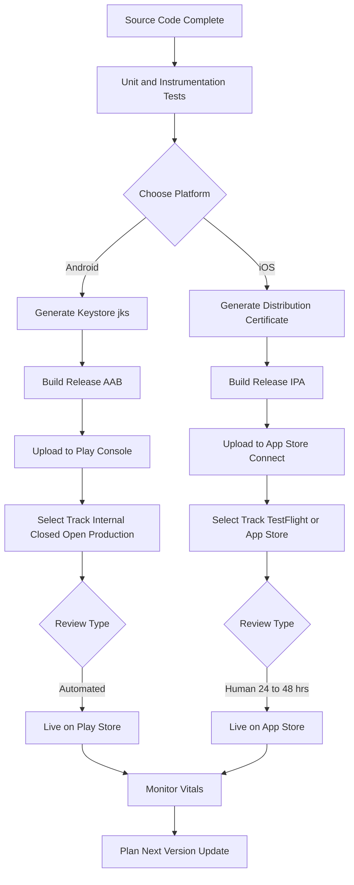
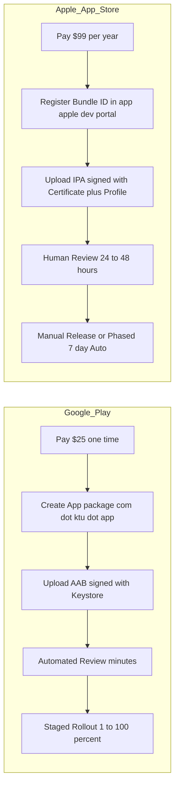
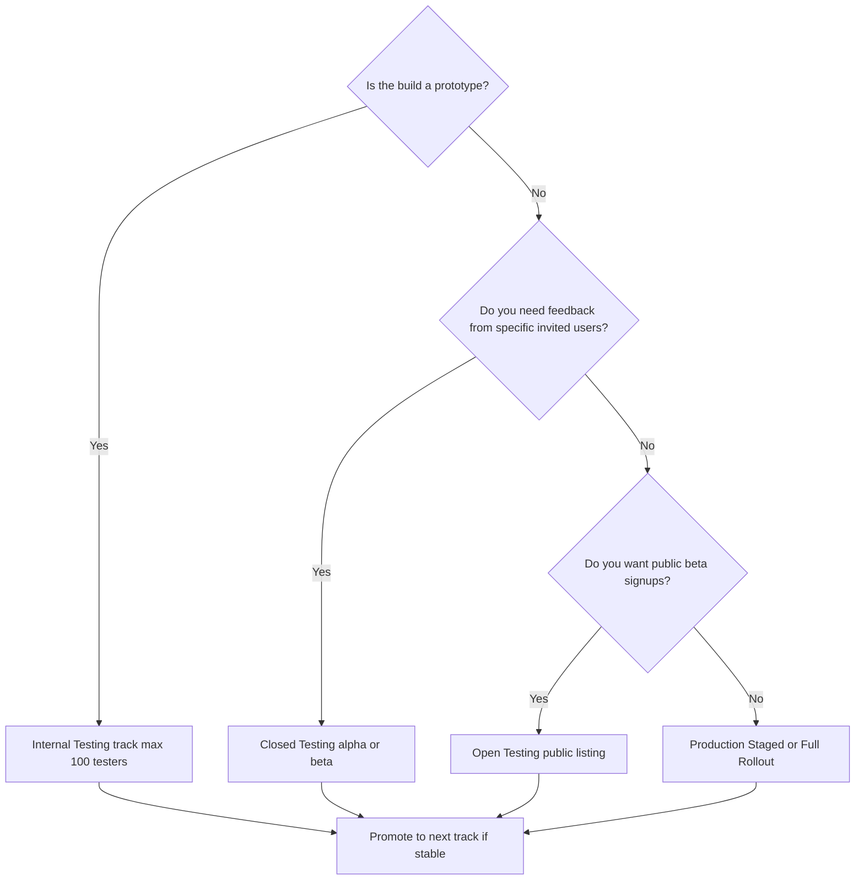
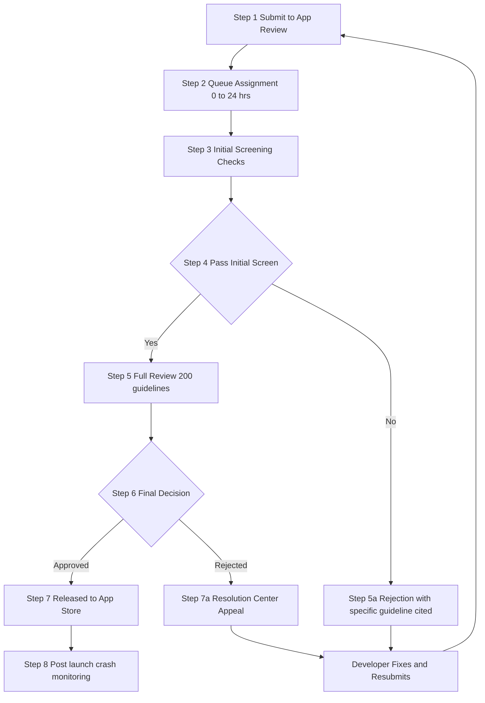
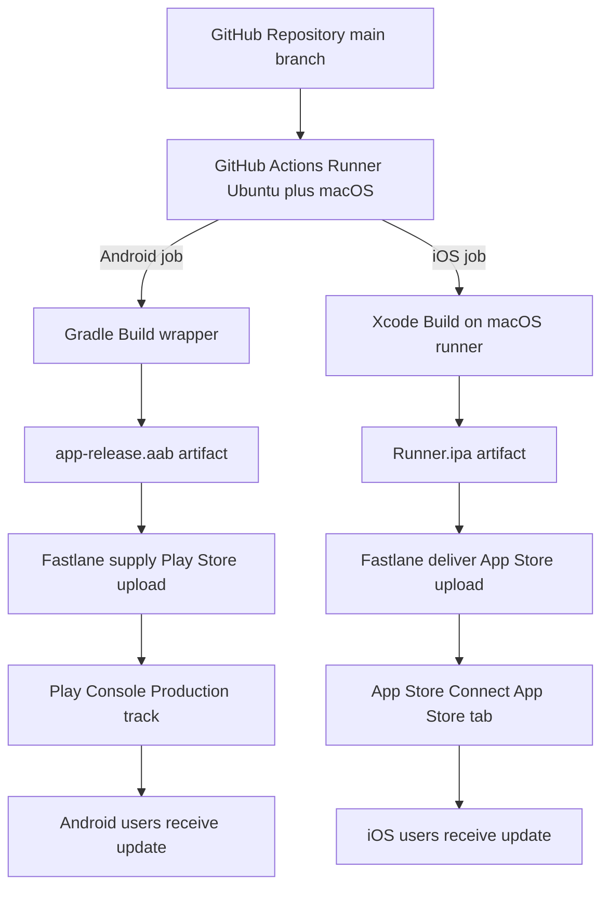
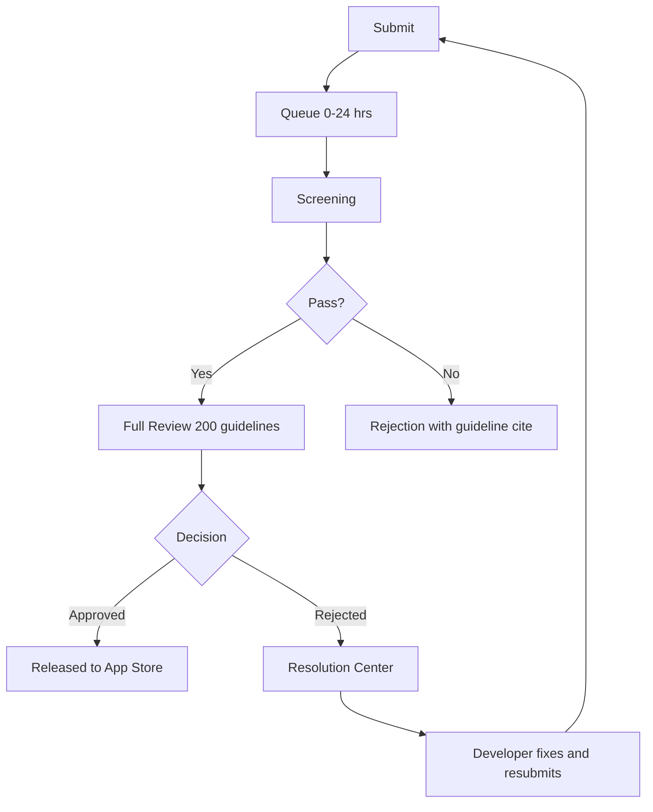

# Publishing Apps to Google Play Store and Apple App Store

<!-- SECTION_1_START -->
# Publishing Apps to Google Play Store & Apple App Store

## 1. Core Technical Definition & Intuitive Overview

> [!IMPORTANT]
> **Formal KTU Definition (Module 4.4):**
> **App Publishing** is the end-to-end process of preparing, signing, packaging, registering, and distributing a mobile application (Android `.AAB` / iOS `.IPA`) through an official digital distribution platform — namely the **Google Play Store** (operated by Google LLC) and the **Apple App Store** (operated by Apple Inc.) — after satisfying the platform's technical, legal, content, and monetization policies.

In the KTU 2024 Scheme, this topic is the terminal phase of the **Mobile Application Development Life Cycle (MADLC)** and bridges software engineering with product management, DevOps, and digital business strategy.

> [!NOTE]
> **Module 4 Industry Context:**
> A working APK on a developer's laptop is **not a published app**. The "last mile" — Play Console / App Store Connect submission, store listing optimization (ASO), content rating, signing, rollout tracks, and post-launch monitoring — is what separates a *student project* from a *production-grade product*.

### Conceptual Analogy — "Opening a Digital Shop"

Think of mobile app publishing as **opening two physical retail shops in two different countries at the same time**:

| Real-World Shop Analogy | App Publishing Equivalent |
|---|---|
| Renting a commercial shop space | Enrolling in **Developer Program** (Play $25 one-time / Apple $99/year) |
| Getting a **business license** from the government | App **Signing** (Keystore / Provisioning Profile + Certificate) |
| **Interior decoration** — shelves, lighting, signboard | Store Listing — icon, screenshots, feature graphic, description |
| **Product safety inspection** by a government body | **App Review** (Google automated + Apple manual human review) |
| **Opening day** — customers walk in | **Production Rollout** — staged or full release |
| **Customer service desk** for complaints | Crash reporting (Play Console / Crashlytics / TestFlight feedback) |

The two stores have **different "landlords" with different "lease rules"** — Google is lenient and fast (a few hours), Apple is strict and slow (24–48 hrs minimum, sometimes 7+ days for rejections and re-submissions).

### Key Vocabulary — KTU Board High-Weightage Terms

> [!TIP]
> Memorize these **bold** terms — they appear verbatim in KTU 14-mark questions.

- **AAB (Android App Bundle)** — Google's official publishing format since **August 2021**; replaces the legacy `.APK` for Play Store uploads.
- **IPA (iOS App Package)** — Apple's compiled and signed archive format uploaded via Xcode Organizer or **Transporter**.
- **Keystore** — A cryptographic file (`.jks` / `.keystore`) containing the private key used to sign Android APKs/AABs. **Losing it means you can never update the app again.**
- **Provisioning Profile** — An Apple-issued file that links a Certificate + App ID + Device(s), required to install a build on real iOS hardware.
- **App Store Connect** — Apple's web dashboard for managing apps, testers, pricing, and releases.
- **Google Play Console** — Google's equivalent dashboard for managing Android apps, releases, and store presence.
- **ASO (App Store Optimization)** — SEO-equivalent for app stores: optimizing title, keywords, description, and visuals to rank higher in search.
- **Staged Rollout** — Releasing an app to a **percentage of users** (e.g., 1%, 5%, 10%, 25%, 50%, 100%) to monitor crashes before full release.
- **Test Track** — A pre-production release channel on Play Console: **Internal Testing → Closed Testing → Open Testing → Production**.
- **TestFlight** — Apple's beta distribution platform — equivalent to Play Console's test tracks.

> [!WARNING]
> **Google Policy (Effective August 2025 onward):** New personal developer accounts in select regions must undergo **identity verification** (D-U-N-S or government ID). This is a *frequently-asked viva question*.

### Visualization — Publishing Pipeline

> [!VISUALIZATION CONTROL]
> **Concept:** The end-to-end Mobile App Publishing Pipeline as a funnel
> **Diagram Type:** Sequential funnel (time on X-axis, audience size on Y-axis)
> **Visual Description:** A funnel narrowing from left to right, starting wide with thousands of internal testers, narrowing to closed beta, then open beta, then a small percentage of production users in staged rollout, finally widening back out to 100% of the user base.

```
Internal Test (Devs only)
    |
    v
Closed Test (Trusted ~100 users)
    |
    v
Open Test (Anyone can opt-in, ~1000s)
    |
    v
Staged Production Rollout (1% -> 5% -> 25% -> 50% -> 100%)
    |
    v
Full Public Release on Store
```

---

<!-- SECTION_1_END -->

<!-- SECTION_2_START -->
# 2. Deep Theoretical Analysis & KTU High-Yield Comparison Sheet

## 2.1 Anatomy of the Publishing Pipeline (Universal Model)

Regardless of platform, every commercial app launch follows this **5-phase skeleton**:

1. **Account Provisioning** — Enroll in the vendor's developer program and pay the registration fee.
2. **Cryptographic Identity** — Generate or obtain signing artifacts (Keystore / Certificates) that uniquely bind the app to you as the publisher.
3. **Build Assembly** — Compile the source code into a signed, optimized, store-ready binary (`.AAB` / `.IPA`).
4. **Store Listing Crafting** — Create the discoverable "shop window": icon, screenshots, descriptions, category, content rating, privacy policy.
5. **Submission & Release** — Upload the build, pass the review, choose a release strategy (immediate vs scheduled vs staged), and monitor post-launch metrics.

> [!IMPORTANT]
> The **signing step is irreversible for the app's lifetime**. A signing key mismatch on a future update will be **rejected by the store**, and the user base cannot be migrated to a "new" key without uninstalling the existing app.

## 2.2 Google Play Store — End-to-End Process Flow

### Step 1 — Developer Account Creation

- Visit `play.google.com/console` and pay the **US \$25 one-time registration fee** via Google Payments.
- Select account type: **Personal** (single developer) or **Organization** (requires D-U-N-S number for legal entity verification).
- Verify identity via email + (for orgs) business documents.

### Step 2 — App Identity in Play Console

- Click **"Create app"** → choose **Default language** → choose **App or Game** → choose **Free or Paid**.
- This generates an immutable **package name** (e.g., `com.ktu.student.madproject`) — choose carefully; renaming later is impossible.

### Step 3 — Store Listing (Discoverability Layer)

| Asset | Specification |
|---|---|
| **App name** | Up to **50 characters** |
| **Short description** | Up to **80 characters** |
| **Full description** | Up to **4000 characters** |
| **App icon** | **512 x 512 px** PNG, 32-bit, no transparency |
| **Feature graphic** | **1024 x 500 px** (landscape banner, mandatory) |
| **Phone screenshots** | Min **2**, max **8**; ratio 16:9 or 9:16 |
| **Tablet screenshots (optional)** | Min 1, ratio 16:9 or 9:16 |
| **Promo graphic (optional)** | **180 x 120 px** PNG |

### Step 4 — Content Rating (IARC Questionnaire)

- Play Console integrates the **International Age Rating Coalition (IARC)** questionnaire.
- You answer ~20 yes/no questions on violence, language, gambling, user-generated content, etc.
- The system auto-generates ratings for **ESRB, PEGI, USK, GRAC, ClassInd**, and 14+ other regional boards.
- A **"Mature 17+"** rating is not a refusal — it just restricts the age gate.

### Step 5 — Pricing & Distribution

- Choose **Free** or **Paid** (paid apps require a **Merchant account** in select countries).
- Select target **countries** (out of 175+) — distribution can be global or restricted.
- Opt-in/opt-out of **Designed for Families** program.
- Agree to **Developer Distribution Agreement (DDA)** and **US export laws**.

### Step 6 — App Content Declarations (Post-2023 Mandatory)

> [!IMPORTANT]
> Since **2023**, Google mandates a **Data Safety form** declaring exactly what user data is collected (location, contacts, financial, health, etc.), whether it is encrypted in transit, and whether the user can opt out. **Mis-declaration = suspension.**

You must also disclose:
- **Ads** — does the app contain ads? (`Yes/No`)
- **App Access** — are there any login walls? If yes, provide a test account credential.
- **COVID-19 contact tracing / status apps** — special disclosure.
- **Health apps** — declare if it is a medical device.
- **Financial features** — declare trading, wallet, lending features.

### Step 7 — Upload Build & Choose Release Track

- Upload the signed **`.AAB`** (preferred) or legacy `.APK` via Play Console.
- Map the build to one of the tracks:
  - **Internal Testing** — Up to 100 testers via email opt-in; fastest turnaround.
  - **Closed Testing** — Larger pool, organized into tracks (Alpha/Beta).
  - **Open Testing** — Publicly listed, anyone can join; eligible for store search.
  - **Production** — Public release on the live store.
- The store listing review is **fully automated** for most apps and completes in **minutes to a few hours**.

### Step 8 — Rollout Strategy

- Choose **Staged Rollout** (start at 1%, 10%, 25%, 50%, 100%) **or Full Rollout**.
- **Halt rollout** at any percentage if Crashlytics/Play Console vitals show anomalies.

## 2.3 Apple App Store — End-to-End Process Flow

### Step 1 — Apple Developer Program Enrollment

- Enroll at `developer.apple.com/programs/` as an **Individual** or **Organization**.
- **Annual fee: US \$99** (Individual) or **US \$99 + D-U-N-S verification** (Organization).
- Wait **24–48 hours** for Apple to verify and activate the account.

### Step 2 — App ID & Bundle Identifier Registration

- In **Certificates, Identifiers & Profiles** portal, register a unique **Bundle ID** (e.g., `in.ktu.student.MADProject`).
- Enable the required **App Services / Capabilities** (Push Notifications, In-App Purchase, Sign in with Apple, etc.).

### Step 3 — Provisioning Profile & Signing

- Create a **Distribution Certificate** (.cer) via Keychain Access on macOS.
- Generate a **Provisioning Profile** (`*.mobileprovision`) that combines the cert + App ID + entitlements.
- In Xcode: **Signing & Capabilities → Automatically manage signing** (recommended) or **Manual** (advanced).

### Step 4 — Archive & Upload

- In Xcode: **Product → Archive** (only available on real device builds, not simulator).
- Xcode Organizer validates the archive against App Store Connect requirements.
- Upload via **Xcode Organizer** (Distribute App → App Store Connect) **or** the standalone **Transporter** app.

### Step 5 — App Store Connect Listing

| Asset | Specification |
|---|---|
| **App name** | Up to **30 characters** |
| **Subtitle** | Up to **30 characters** (appears below the name) |
| **Promotional text** | Up to **170 characters** (editable anytime, no review needed) |
| **Description** | Up to **4000 characters** |
| **Keywords** | Up to **100 characters** (comma-separated) — critical for ASO |
| **Support URL** | Mandatory |
| **Marketing URL (optional)** | Up to one URL |
| **App icon** | **1024 x 1024 px** PNG, no alpha, no rounded corners (system applies mask) |
| **iPhone 6.7" screenshots** | Required: **1290 x 2796 px** (iPhone 15 Pro Max) |
| **iPhone 6.5" screenshots** | Required: **1242 x 2688 px** (iPhone 11 Pro Max) |
| **iPhone 5.5" screenshots** | Required if supporting older devices: **1242 x 2208 px** |
| **iPad 12.9" screenshots** | Required only if iPad-enabled: **2048 x 2732 px** |

### Step 6 — Build Selection & Compliance

- In App Store Connect → **My Apps → (your app) → TestFlight**, the uploaded build will appear after a brief **automated processing** (5–60 mins).
- Under **App Store tab**, attach the processed build to the release version (e.g., `1.0.0`).

### Step 7 — App Review Submission

- Provide **contact info**, **demo account credentials** (if login required), and **notes for the reviewer**.
- Select the **App Review information** (sign-in required? demo account? encryption used?).
- Click **Submit for Review**.
- Apple's **App Review Board** (a team of ~500 human reviewers) checks against the **App Store Review Guidelines** (5 sections, ~200 rules).
- Typical turnaround: **24–48 hours** (90% of submissions); first-time apps may take **up to 7 days**.

### Step 8 — Release

- Choose **Automatic release** (goes live the moment review approves) or **Manual release** (developer clicks "Release this version").
- Optional **Phased Release for Automatic Updates** (Apple's own staged rollout: 1% Day 1, 2% Day 2, 5% Day 3, 10% Day 4, 20% Day 5, 50% Day 6, 100% Day 7).
- Cannot be stopped mid-phase.

## 2.4 KTU High-Yield Comparison Sheet (Cheat Sheet)

> [!TIP]
> This is the **single most important table for KTU 14-mark comparison questions**. Memorize row-by-row.

\begin{aligned}
\text{Parameter} \quad &\rightarrow \quad \text{Google Play} \quad \mid \quad \text{Apple App Store} \\
\end{aligned}

| Parameter | Google Play Store | Apple App Store |
|---|---|---|
| **Registration Fee** | **\$25 one-time** | **\$99 / year** |
| **Build Format** | `.AAB` (preferred), legacy `.APK` supported | `.IPA` |
| **Signing Artifact** | **Keystore** (`.jks`) — owned by developer | **Distribution Certificate** + **Provisioning Profile** — issued by Apple |
| **Console URL** | `play.google.com/console` | `appstoreconnect.apple.com` |
| **Review Type** | **Automated** (Policy + malware scan) | **Human** (App Review Board, ~200 guidelines) |
| **Review Duration** | **Minutes to hours** | **24–48 hours** (up to 7 days for first app) |
| **Pre-launch Tracks** | Internal / Closed / Open Testing | **TestFlight** (Internal + External Beta) |
| **Phased Rollout** | Yes, manual % selection (1% to 100%) | Yes, fixed schedule (Day 1–7) |
| **Rejection Common Cause** | Malware, privacy policy, deceptive metadata | Crashes, broken links, guideline 4.x (design), guideline 5.x (legal) |
| **App Name Length** | **50 chars** | **30 chars** |
| **Short Description** | **80 chars** | Subtitle **30 chars** + Promotional **170 chars** |
| **Full Description** | **4000 chars** | **4000 chars** |
| **Monetization Cut** | **15%** (first \$1M/year) / **30%** thereafter | **15%** (Small Business Program < \$1M) / **30%** standard |
| **Refund Window** | Up to 48 hours (developer choice) | Apple handles, ~2 weeks |
| **Icon Spec** | 512 x 512 px, transparency allowed | 1024 x 1024 px, **no alpha** |
| **Beta Limit** | 100 (internal), unlimited (closed) | 10,000 (TestFlight external) |

## 2.5 Industry Use-Cases & Real-World Utility

> [!NOTE]
> **Why KTU tests this topic:** Modern B.Tech placements (TCS, Infosys, Cognizant, startups) require freshers to understand CI/CD for mobile, signing, store metadata, and the cost economics of going live.

- **Startup MVP launch** — A 2-person Android-only startup can launch in **< 24 hours** for \$25. iOS requires a **Mac + \$99/year** minimum.
- **Cross-platform frameworks** — React Native, Flutter, Kotlin Multiplatform produce **two binaries** (`.AAB` + `.IPA`) from one codebase, both pushed via **Fastlane** (an open-source automation tool) into both consoles — this is the de-facto industry CI/CD pattern.
- **Enterprise in-house apps** — Companies bypass public stores using **Managed Google Play** and **Apple Business Manager** + Custom Apps for in-house distribution without public listing.
- **A/B Testing** — Play Console supports store-listing experiments (different icons/descriptions for different user segments).
- **Crash Monitoring** — Post-launch: Firebase Crashlytics (Android) + Apple Organizer Crashes (iOS) feed back into the next sprint.

---

<!-- SECTION_2_END -->

<!-- SECTION_3_START -->
# 3. Step-by-Step Implementation, Build Generation & Symbolic Walkthrough

> [!IMPORTANT]
> **Exhaustive Content Mandate Applied:** Every step, file path, command-line flag, and code block is fully written out. No "similarly we can do" shortcuts.

## 3.1 Pre-Publishing Build Checklist (Universal)

Before either platform is touched, the project **must** satisfy this checklist. Treat it as a **Quality Gate**.

| \# | Checkpoint | Tool / Command | Pass Criteria |
|---|---|---|---|
| 1 | Code lints cleanly | `flutter analyze` / `eslint` / `ktlint` | **0 errors, 0 warnings** |
| 2 | Unit tests pass | `flutter test` / `jest` / `JUnit` | **100% pass rate** |
| 3 | All unused resources removed | Android Lint / Xcode Analyzer | **No warnings** |
| 4 | ProGuard / R8 minification enabled (Android) | `minifyEnabled true` in `build.gradle` | Boolean `true` |
| 5 | Bitcode stripped (iOS) | Xcode default since Xcode 14 | Automatic |
| 6 | App icon **not** the default `ic_launcher` | Visual check | All sizes custom |
| 7 | `applicationId` (Android) is **not** `com.example.*` | `build.gradle` review | Real domain |
| 8 | `Bundle ID` (iOS) is **not** `com.example.*` | Xcode → General | Real reverse-DNS |
| 9 | `versionCode` (Android) and `CFBundleVersion` (iOS) incremented | Build file review | New integer |
| 10 | `versionName` / `CFBundleShortVersionString` updated | Build file review | SemVer string |

## 3.2 Google Play — AAB Generation Walkthrough

### Step 1 — Generate Upload Keystore (One-Time, Lifetime-Critical)

```bash
keytool -genkey -v \
        -keystore ~/keys/myapp-upload-key.jks \
        -keyalg RSA -keysize 2048 -validity 10000 \
        -alias myapp-upload
```

> [!WARNING]
> **Store the `.jks` file and its 2 passwords in a password manager (e.g., 1Password, Bitwarden) and back it up to encrypted cloud storage.** Losing this file = permanent inability to push updates to your existing user base. This is the **#1 KTU viva question trap**.

### Step 2 — Configure `android/key.properties`

```properties
storePassword=<keystore-password>
keyPassword=<key-password>
keyAlias=myapp-upload
storeFile=/Users/yourname/keys/myapp-upload-key.jks
```

### Step 3 — Reference Keystore in `android/app/build.gradle`

```groovy
def keystoreProperties = new Properties()
def keystorePropertiesFile = rootProject.file('key.properties')
if (keystorePropertiesFile.exists()) {
    keystoreProperties.load(new FileInputStream(keystorePropertiesFile))
}

android {
    signingConfigs {
        release {
            keyAlias keystoreProperties['keyAlias']
            keyPassword keystoreProperties['keyPassword']
            storeFile keystoreProperties['storeFile']
            storePassword keystoreProperties['storePassword']
        }
    }
    buildTypes {
        release {
            signingConfig signingConfigs.release
            minifyEnabled true
            shrinkResources true
            proguardFiles getDefaultProguardFile('proguard-android-optimize.txt'), 'proguard-rules.pro'
        }
    }
}
```

### Step 4 — Build the Release AAB

```bash
cd android
./gradlew bundleRelease
```

Output: `android/app/build/outputs/bundle/release/app-release.aab`

### Step 5 — Local Verification with `bundletool`

```bash
java -jar bundletool.jar build-apks \
     --bundle=app-release.aab \
     --output=myapp.apks \
     --ks=/Users/yourname/keys/myapp-upload-key.jks \
     --ks-pass=pass:<keystore-password> \
     --ks-key-alias=myapp-upload \
     --key-pass=pass:<key-password>
```

To install on a connected device for smoke-test:

```bash
java -jar bundletool.jar install-apks --apks=myapp.apks
```

### Step 6 — Upload to Play Console

- Play Console → **Release → Production → Create new release**.
- Drag-and-drop the `.aab` file.
- Add **Release name** (e.g., `1.0.0 (Build 1)`) and **Release notes** (what's new).
- Click **Review release → Start rollout to Production**.

## 3.3 Apple App Store — IPA Generation Walkthrough

### Step 1 — Bump Build Number in Xcode

- Open `ios/Runner.xcworkspace` in Xcode.
- Select **Runner** target → **General** tab.
- Set **Version** to `1.0.0` (user-visible) and **Build** to `2` (monotonic integer).
- Repeat for every App Store / TestFlight submission.

### Step 2 — Configure Signing & Capabilities

- Select **Runner** project → **Signing & Capabilities** tab.
- Check **Automatically manage signing**.
- Select your **Team** (Apple Developer account).
- Confirm the **Bundle Identifier** matches the one registered in the Developer Portal.
- Required capabilities: enable **Push Notifications** / **In-App Purchase** / **Sign in with Apple** per feature.

### Step 3 — Archive the Build

```bash
# From project root, clean and archive
cd ios
xcodebuild clean
xcodebuild -workspace Runner.xcworkspace \
           -scheme Runner \
           -configuration Release \
           -archivePath build/Runner.xcarchive \
           archive
```

In Xcode GUI: **Product → Archive** (succeeds only on a real device, not simulator).

### Step 4 — Validate the Archive (Pre-Submit Sanity Check)

- Xcode → **Organizer → Archives → Distribute App**.
- Choose **App Store Connect → Next → Upload → Automatically manage signing → Upload**.

The validation step performs:
- Code signing check
- Asset catalog verification (no missing icons)
- `Info.plist` privacy key check (`NSLocationWhenInUseUsageDescription`, etc.)
- Bitcode check
- 32-bit/64-bit compatibility check
- Size check (must be < **4 GB** compressed; uncompressed < **8 GB** post-unpack for cellular download)

### Step 5 — Upload via Transporter (Alternative to Xcode)

```bash
# Install Transporter from Mac App Store, then
open -a Transporter
# Drag the .ipa into the Transporter window
# Sign in with Apple ID
# Click Deliver
```

### Step 6 — App Store Connect — Build Selection

- Go to `appstoreconnect.apple.com` → **My Apps → (your app)**.
- **TestFlight** tab shows the uploaded build with status `Processing` → `Ready to Submit` (typically 5–60 min).
- Switch to **App Store** tab → version `1.0.0` → **Build** dropdown → select the build.
- Provide **What's New in This Version** text.

### Step 7 — Final Submission Checklist (in App Store Connect)

| Field | Example Value |
|---|---|
| Screenshots | 6.7" set uploaded |
| Promotional text | "Built by KTU students for KTU students" |
| Description | Up to 4000 chars (markdown supported) |
| Keywords | `ktu,exam,syllabus,notes,mad` (100 chars total) |
| Support URL | `https://yourapp.com/support` |
| Marketing URL | *(optional)* |
| Copyright | `© 2024 KTU Student Developers` |
| Contact info | Name, email, phone |
| App Review Information | Demo account: `reviewer@ktu.in / Demo@2024` |
| Version Release | **Manual** (recommended for first launch) |

Click **Submit for Review**.

## 3.4 Symbolic Worked Example — "First Week Sales" Scenario

**Scenario (KTU 14-Mark Application Question):**
> A team launches a paid Android app on Google Play and a paid iOS app on the App Store. Play charges **15% commission on the first \$1M/year** and 30% thereafter. Apple charges **15% for the Small Business Program** (revenue < \$1M) and 30% otherwise. Both apps sell **1000 units at \$5 each** in the first month. Calculate the gross revenue, platform fee, and developer net for each.

**Given:**

$$
R_{\text{units}} = 1000 \quad \text{units}, \quad P_{\text{unit}} = \$5, \quad \text{Cuts} = 15\% \text{ (both platforms)}
$$

**Step 1 — Gross Revenue per Platform**

$$
G = R_{\text{units}} \times P_{\text{unit}} = 1000 \times 5 = \$5{,}000
$$

**Step 2 — Platform Fee per Platform**

$$
F = G \times 0.15 = 5000 \times 0.15 = \$750
$$

**Step 3 — Developer Net per Platform**

$$
N = G - F = 5000 - 750 = \$4{,}250
$$

**Step 4 — Combined Net (Both Stores)**

$$
N_{\text{total}} = N_{\text{Android}} + N_{\text{iOS}} = 4250 + 4250 = \$8{,}500
$$

> [!TIP]
> **Examiner's incremental marks for the above problem:**
> '[Correctly identifying the 15% small-business tier: 2 Marks]'
> '[Gross revenue calculation: 1 Mark]'
> '[Platform fee: 1 Mark]'
> '[Net per platform: 1 Mark]'
> '[Combined total: 1 Mark]'
> = **6/6 logical marks** for the numerical part; remaining marks go to comparing policies, fee structures, and the "what changes after \$1M threshold" discussion.

## 3.5 Post-Launch Monitoring — Both Stores

| Metric | Google Play Console | App Store Connect |
|---|---|---|
| **Crash count** | Vitals → Crashes | Organizer → Crashes |
| **ANR rate (Android)** | Vitals → ANRs | N/A |
| **Install / Uninstall** | Statistics → Users | Sales & Trends |
| **Ratings & Reviews** | Reviews tab | Ratings & Reviews |
| **Revenue** | Financial reports | Payments & Financial Reports |
| **Stack traces** | Firebase Crashlytics integration | Xcode Organizer + MetricKit |

---

<!-- SECTION_3_END -->

<!-- SECTION_4_START -->
# 4. Structural Diagrams & Schematics

## 4.1 Universal Mobile App Publishing Pipeline (Mermaid Flowchart)



## 4.2 Comparison Subgraph — Android vs iOS Submission Paths



## 4.3 Release Track Decision Tree (Play Store Specific)



## 4.4 App Review Workflow — Apple App Store (Sequential Topology Matrix)



## 4.5 Block-Level Functional Architecture — Cross-Platform CI/CD



---

<!-- SECTION_4_END -->

<!-- SECTION_5_START -->
# 5. KTU 2024 Scheme Examination Question Bank & Topic Recap

## 5.1 Part A — Short Answer Questions (3 Marks Each)

> **Q1. [KTU University Exam — July 2024, CO4, Remember]**
> **Define App Bundle (AAB) and state TWO advantages it has over the legacy APK format in the Google Play Store.**

**Model Answer (3 marks):**
An **Android App Bundle (`.AAB`)** is a publishing format introduced by Google in 2018 (mandatory for new apps since August 2021) that contains all the compiled code and resources of an app in a single uploadable artifact. (1 Mark)

**Two advantages over `.APK`:**

1. **Dynamic Delivery** — Google Play's servers generate and serve **optimized APKs per device** (split by ABI, screen density, and language), so users download only the code/resources relevant to their phone. (1 Mark)
2. **Smaller download size** — typical size reduction is **15–30%** compared to a universal APK, improving install conversion rates. (1 Mark)
*Acceptable third point: simplified multi-APK management, base vs feature modules, conditional delivery.*

---

> **Q2. [KTU University Exam — Dec 2023, CO4, Understand]**
> **List THREE mandatory fields that must be filled in a Google Play Console Store Listing before an app can be submitted for review.**

**Model Answer (3 marks — 1 mark each):**
1. **App name** (max 50 characters) — the title shown on the Play Store listing.
2. **Short description** (max 80 characters) — the one-line summary under the app name.
3. **Full description** (max 4000 characters) — the long-form marketing copy with markdown support.

*Acceptable alternates: app icon (512×512), feature graphic (1024×500), at least 2 phone screenshots, content rating, privacy policy URL.*

---

## 5.2 Part B — Long Answer Questions (14 Marks Each)

> **Note:** KTU ESE Part B features Module-Internal Choice. Generate **both** alternatives — students answer ONE.

---

### Question A — 14 Marks `[KTU University Exam — July 2024]`

> **(a) [7 Marks — CO4, Understand]**
> Explain the **end-to-end process of publishing an Android app to the Google Play Store**. Cover developer account creation, app identity, store listing, content rating, build upload, and the difference between Internal, Closed, and Open testing tracks.

> **(b) [7 Marks — CO4, Apply]**
> A startup has **two apps** — one Android, one iOS — and earns **\$800,000** in combined first-year revenue, split **50:50** across both stores. Both apps use the **small business commission tier**. If a future update boosts revenue by **40%**, calculate:
> - The total annual revenue and per-store revenue.
> - The platform fee for each store under the new tier (Apple's 15% small-business cap and Google's 15% first-\$1M).
> - The developer's net take-home.

---

### Question A — Model Solution

#### Part (a) — End-to-End Google Play Publishing (7 Marks)

> **Incremental valuation key:**
> '[Account creation: 1 Mark]'
> '[App identity: 1 Mark]'
> '[Store listing assets: 2 Marks]'
> '[Content rating & data safety: 1 Mark]'
> '[Build upload: 1 Mark]'
> '[Testing tracks distinction: 1 Mark]'

**1. Developer Account Creation (1 Mark)**
Visit `play.google.com/console`, sign in with a Google account, pay the **US \$25 one-time registration fee** via Google Payments, select **Personal** or **Organization** (orgs require D-U-N-S), and accept the Developer Distribution Agreement (DDA).

**2. App Identity (1 Mark)**
Click **Create app** → fill in:
- **Default language** — e.g., English (India)
- **App title** — up to 50 characters
- **App or Game** category
- **Free or Paid** pricing

A unique **`applicationId`** (e.g., `com.ktu.mad.labapp`) is registered. This ID is **immutable** — renaming it later requires publishing a new app and migrating users.

**3. Store Listing (2 Marks)**
The store listing consists of:
- **App name** (50 chars)
- **Short description** (80 chars)
- **Full description** (4000 chars, supports basic formatting)
- **App icon** — 512×512 px PNG, 32-bit
- **Feature graphic** — 1024×500 px landscape banner (mandatory)
- **Phone screenshots** — minimum 2, maximum 8, ratio 16:9 or 9:16
- **Categorization** — category (e.g., Education) and tags
- **Contact details** — email, website, phone
- **Privacy policy URL** — mandatory since March 2017

**4. Content Rating & Data Safety (1 Mark)**
- **IARC questionnaire** auto-generates ESRB, PEGI, USK, GRAC, ClassInd, and other regional ratings.
- **Data Safety form** (mandatory since 2022) declares what user data is collected, shared, and whether it is encrypted in transit.

**5. Build Upload (1 Mark)**
- Upload a **signed `.AAB`** (preferred) or legacy `.APK` via the **Release → Production → Create new release** page.
- The AAB is signed with the developer's **upload keystore** (generated once via `keytool`).
- Play App Signing handles the final signing with Google's own app-signing key for security.

**6. Testing Tracks Distinction (1 Mark)**

| Track | Tester Count | Visibility | Speed |
|---|---|---|---|
| **Internal Testing** | Up to 100 via email | Not listed on store | Minutes |
| **Closed Testing** | Unlimited (organized) | Not listed publicly | Hours |
| **Open Testing** | Unlimited (anyone opts in) | Listed and searchable | Hours |
| **Production** | All public users | Live store | Hours |

> **[End of Part (a) — 7/7 Marks]**

---

#### Part (b) — Revenue Calculation (7 Marks)

> **Incremental valuation key:**
> '[Stating inputs: 1 Mark]'
> '[New total revenue: 1 Mark]'
> '[Per-store revenue: 1 Mark]'
> '[Tier identification: 1 Mark]'
> '[Fee calculation: 2 Marks]'
> '[Net take-home: 1 Mark]'

**Step 1 — Given Inputs**
- Old combined revenue: $G_{\text{old}} = \$800{,}000$
- Old per-store split: $50{:}50 \Rightarrow G_{\text{old, Android}} = G_{\text{old, iOS}} = \$400{,}000$
- Growth rate: $r = 40\% = 0.40$

**Step 2 — New Combined Revenue**

$$
G_{\text{new}} = G_{\text{old}} \times (1 + r) = 800{,}000 \times 1.40 = \$1{,}120{,}000
$$

**Step 3 — Per-Store New Revenue** (still 50:50)

$$
G_{\text{Android}} = G_{\text{iOS}} = \frac{1{,}120{,}000}{2} = \$560{,}000
$$

**Step 4 — Commission Tier Identification**

Both platforms apply their small-business tier only up to **\$1M per developer per year**. The combined revenue is now **\$1.12M**, so each store's individual revenue of **\$560,000 is still below the \$1M threshold**. Therefore, the **15% small-business commission applies in full to each store**. **(1 Mark)**

> [!NOTE]
> Even though *combined* revenue exceeds \$1M, the threshold is **per-developer-account per-store**, not aggregated. This is a **classic viva trap** — students often wrongly conclude that combined revenue triggers the 30% tier.

**Step 5 — Platform Fee per Store**

$$
F_{\text{Android}} = F_{\text{iOS}} = G_{\text{store}} \times 0.15 = 560{,}000 \times 0.15 = \$84{,}000
$$

**Step 6 — Developer Net per Store**

$$
N_{\text{Android}} = N_{\text{iOS}} = G_{\text{store}} - F_{\text{store}} = 560{,}000 - 84{,}000 = \$476{,}000
$$

**Step 7 — Combined Net Take-Home**

$$
N_{\text{total}} = N_{\text{Android}} + N_{\text{iOS}} = 476{,}000 + 476{,}000 = \$952{,}000
$$

> **[End of Part (b) — 7/7 Marks]**
> **[Grand Total: 14/14 Marks]**

---

### Question B — 14 Marks `[KTU University Exam — Dec 2023]`

> **(a) [7 Marks — CO4, Understand]**
> Describe the **end-to-end process of publishing an iOS app to the Apple App Store**. Cover Apple Developer Program enrollment, Bundle ID and Provisioning Profile, Xcode Archive and upload, App Store Connect listing requirements, and the human App Review workflow.

> **(b) [7 Marks — CO4, Apply]**
> Compare the **Google Play Store** and the **Apple App Store** across **any 7 parameters** (e.g., registration cost, build format, review time, refund policy, beta testing, phased rollout, monetization cut). Present the comparison in a **tabular format** with at least **one sentence of justification per row**.

---

### Question B — Model Solution

#### Part (a) — End-to-End iOS App Publishing (7 Marks)

> **Incremental valuation key:**
> '[Enrollment: 1 Mark]'
> '[Bundle ID & Provisioning: 1 Mark]'
> '[Archive & Upload: 2 Marks]'
> '[Listing requirements: 1 Mark]'
> '[App Review workflow: 2 Marks]'

**1. Apple Developer Program Enrollment (1 Mark)**
- Visit `developer.apple.com/programs/` and enroll as **Individual** (\$99/year) or **Organization** (\$99/year + D-U-N-S business verification).
- Verification takes **24–48 hours**.
- Activation grants access to **App Store Connect**, **Xcode**, and the **Developer Portal**.

**2. Bundle ID & Provisioning Profile (1 Mark)**
- In the Developer Portal → **Certificates, Identifiers & Profiles → Identifiers**, register a reverse-DNS **Bundle ID** (e.g., `in.ktu.student.MADProject`).
- On a Mac, generate a **Distribution Certificate** via Keychain Access.
- Create a **Provisioning Profile** combining the Certificate + Bundle ID + entitlements.
- In Xcode → **Signing & Capabilities** → check **Automatically manage signing** and select your Team.

**3. Archive & Upload (2 Marks)**
- In Xcode, set the project's **Version** (e.g., `1.0.0`) and **Build** (e.g., `1`) under **General → Identity**.
- Connect a real iOS device, select **Any iOS Device (arm64)** as the build destination, and click **Product → Archive**.
- Once Organizer opens, click **Distribute App → App Store Connect → Upload**. Xcode performs pre-submission validation: code-signing check, asset catalog check, privacy keys check.
- Alternatively, use the standalone **Transporter** app to deliver the `.ipa` manually.

**4. App Store Connect Listing (1 Mark)**
Mandatory fields in App Store Connect:
- **App name** (30 chars) + **Subtitle** (30 chars)
- **Description** (4000 chars) + **Keywords** (100 chars, comma-separated)
- **Support URL** (mandatory) + **Marketing URL** (optional)
- **App icon** (1024×1024 PNG, no alpha)
- **Screenshots for each required device class** — at minimum iPhone 6.7" (1290×2796) and 6.5" (1242×2688); iPad 12.9" only if iPad-enabled
- **Copyright** string, **Contact** info
- **Privacy Policy URL**

**5. App Review Workflow (2 Marks)**



- **Initial Screening** — automated checks for crashes, broken links, and obvious guideline violations.
- **Full Review** — human reviewers check **~200 guidelines** organized into 5 sections: Safety, Performance, Business, Design, Legal.
- **Approval** — average **24–48 hours** for 90% of submissions; **first-time apps** may take **up to 7 days**.
- **Rejection** — must be addressed via the **Resolution Center** with specific evidence (e.g., demo video showing a working login flow).

> **[End of Part (a) — 7/7 Marks]**

---

#### Part (b) — 7-Parameter Comparison Table (7 Marks)

> **Incremental valuation key:**
> '[1 mark per row: 7 rows = 7 marks]'
> '[Each row must have justification sentence: included]'

| \# | Parameter | Google Play Store | Apple App Store | Justification |
|---|---|---|---|---|
| 1 | **Registration Fee** | **\$25 one-time** | **\$99 per year** | Google encourages indie developers with a low barrier, while Apple recoups costs via annual subscription for ongoing platform support. |
| 2 | **Build Format** | `.AAB` (Android App Bundle) preferred | `.IPA` (iOS App Package) | AAB enables **Dynamic Delivery** for smaller per-device downloads, while `.IPA` is a monolithic archive per device family. |
| 3 | **Signing Artifact** | Developer-owned **Keystore** (`.jks`) | Apple-issued **Distribution Certificate** + **Provisioning Profile** | Google delegates signing key custody partly to the developer (with Play App Signing as optional upgrade), while Apple retains tighter control via its certificate authority. |
| 4 | **Review Type & Time** | **Automated** policy + malware scan, **minutes to a few hours** | **Human** App Review Board, **24–48 hours** (up to 7 days for first app) | Apple's manual review enforces stricter design and content quality, while Google's automation prioritizes scale and speed. |
| 5 | **Beta Testing** | Internal (100 testers), Closed (unlimited), Open (public) tracks | **TestFlight** — Internal (up to 100 devs) and External (up to 10,000 users) | Both support staged validation, but Google's tracks are more granular (4 levels) while Apple uses a single TestFlight umbrella. |
| 6 | **Phased Rollout** | Developer-controlled **% (1 → 10 → 25 → 50 → 100)** with the ability to **halt** at any stage | Fixed **7-day schedule** (1% Day 1, 2% Day 2, …, 100% Day 7) and **cannot be stopped mid-phase** | Google's manual control allows emergency rollback on crash spikes, while Apple's schedule is fully automated and irreversible once started. |
| 7 | **Monetization Commission** | **15%** on first **\$1M/year**, **30%** thereafter | **15%** Small Business Program (revenue < \$1M), **30%** standard | Both offer a small-business-friendly rate, but Apple's **Small Business Program** is an opt-in enrollment whereas Google's 15% tier is **automatic** for the first \$1M. |

> **[End of Part (b) — 7/7 Marks]**
> **[Grand Total: 14/14 Marks]**

---

> [!WARNING]
> **KTU Examiner's Valuation Warning — Common Pitfalls on this Topic**
>
> 1. **Do NOT write "Google Play uses APKs"** in 2024+. State "Android App Bundle (`.AAB`) is the **mandatory** upload format since August 2021" — using the wrong term **costs 1–2 marks**.
> 2. **Do NOT confuse per-developer with per-store thresholds** for the 15% commission. The Small Business Program is **per-developer-account**, not aggregated across both stores. Stating "the combined revenue crosses \$1M" without clarifying per-store = **lose 1 mark**.
> 3. **Do NOT forget to mention the Keystore backup warning** when describing Android publishing. A generic "sign the APK" answer without mentioning the **upload keystore + lifetime ownership** is considered incomplete.
> 4. **Do NOT write "App Review takes 24 hours" as a fixed number** for Apple. State the **range** (24–48 hours typical, up to 7 days for first submissions) — examiners specifically look for this nuance.
> 5. **Do NOT omit the Data Safety form** when listing Google Play mandatory fields — since 2022 it is **non-negotiable** and is a frequent viva question.
> 6. **Do NOT draw a generic "publishing" flowchart** in Mermaid/handwritten diagrams — examiners expect specific node labels (`AAB`, `IPA`, `Play Console`, `App Store Connect`, `TestFlight`).
> 7. **Do NOT write "Apple does not allow staged rollout"** — Apple supports **Phased Release for Automatic Updates** on a **fixed 7-day schedule**. Conflating this with Google-only = **lose 1 mark**.

---

## 5.3 Topic Recap & Important Things to Remember

> [!IMPORTANT]
> **Rapid-revision checklist for last-minute KTU exam prep. Memorize this block.**

- **App Publishing** is the terminal phase of MADLC: **sign → build → list → review → release → monitor**.
- **Google Play registration** is a **\$25 one-time** fee; **Apple Developer Program** is **\$99/year**.
- **Android build format**: `.AAB` (Android App Bundle) — **mandatory** since Aug 2021.
- **iOS build format**: `.IPA` uploaded via **Xcode Organizer** or **Transporter**.
- **Keystore** is the developer's **lifetime signing key** for Android — loss = app abandonment.
- **Apple's signing** uses a **Distribution Certificate + Provisioning Profile** issued by Apple's CA.
- **Google review** is **automated** and completes in **minutes to a few hours**.
- **Apple review** is **human**, takes **24–48 hours** (up to 7 days for first-time apps), and follows **~200 App Review Guidelines**.
- **Play Console release tracks**: **Internal → Closed → Open → Production** (4 stages, granular control).
- **Apple pre-launch channel**: **TestFlight** (Internal + External beta, up to 10,000 external testers).
- **Staged Rollout**: Google = **manual % with halt capability**; Apple = **fixed 7-day schedule, irreversible**.
- **Mandatory Google listing assets**: 512×512 icon, 1024×500 feature graphic, ≥2 phone screenshots, short (80) + full (4000) descriptions, **privacy policy URL**, **content rating**, **Data Safety form**.
- **Mandatory Apple listing assets**: 1024×1024 icon (no alpha), screenshots for 6.7" (1290×2796) and 6.5" (1242×2688) iPhones, 30-char name + 30-char subtitle + 4000-char description + 100-char keywords.
- **Commission tiers**: both platforms offer **15% on first \$1M/year**; **30%** above \$1M. Apple's is opt-in (Small Business Program); Google's is automatic.
- **App icon difference**: Android allows **alpha channel**; Apple **forbids it** (the system applies the rounded-square mask).
- **Post-launch monitoring tools**: **Play Console Vitals + Firebase Crashlytics** (Android); **App Store Connect Organizer + MetricKit** (iOS).
- **Common rejection cause on Google**: malware signature, missing Data Safety declaration, broken privacy policy link.
- **Common rejection cause on Apple**: crashes on launch, broken links, missing reviewer demo account, **Guideline 4.x (Design)** violations, **Guideline 5.x (Legal)** issues (e.g., missing EULA).
- **Cross-platform CI/CD pattern**: **GitHub Actions / Bitrise** → build `.AAB` + `.IPA` → upload via **Fastlane supply (Play)** + **Fastlane deliver (App Store)**.
- **Store URL patterns** (memorize for viva):
  - Play Console: `play.google.com/console`
  - App Store Connect: `appstoreconnect.apple.com`
  - Developer Portal: `developer.apple.com`
- **In-house enterprise distribution**: **Managed Google Play** + **Apple Business Manager Custom Apps** — bypasses public store listing.

---

<!-- SECTION_5_END -->
