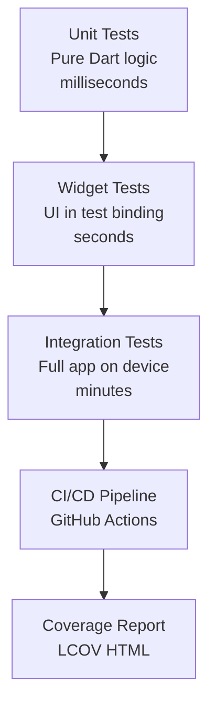
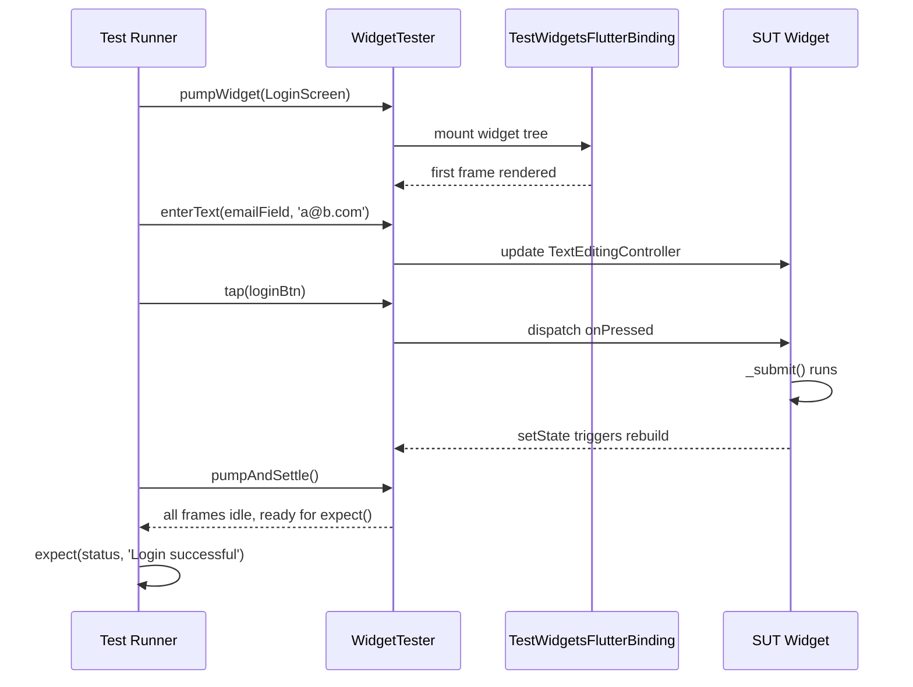
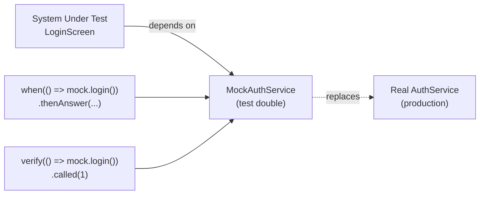
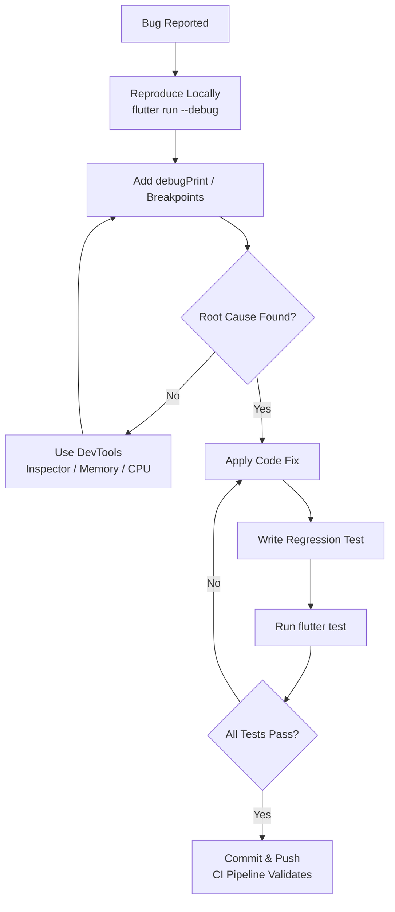
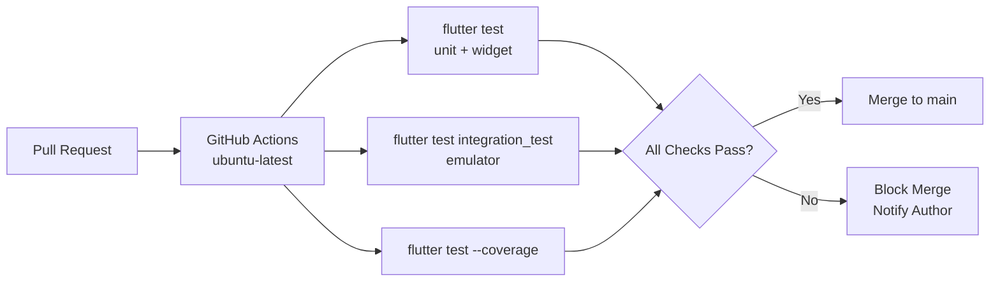
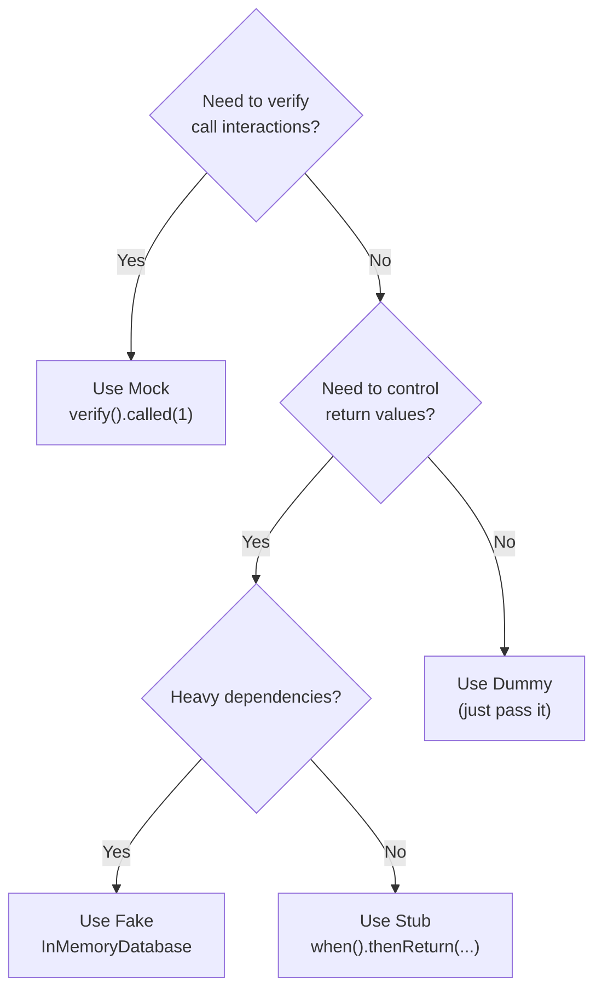

# Testing and Debugging Flutter Applications

<!-- SECTION_1_START -->
# Testing and Debugging Flutter Applications

## 1. Core Technical Definition

> [!IMPORTANT]
> **Testing** in Flutter is the systematic process of verifying that an application's logic, UI components, and integration points behave as expected across various conditions, while **Debugging** is the process of identifying, tracing, and resolving defects (bugs) in the application using specialized tools and instrumentation.

In the context of **KTU 2024 Scheme (PECST695 – Mobile Application Development)**, testing and debugging constitute the *Quality Assurance (QA)* layer of the Software Development Life Cycle (SDLC) for mobile applications built using the **Flutter SDK** and **Dart programming language**. Flutter provides a first-class, multi-tiered testing framework out-of-the-box, enabling developers to validate every layer of the application stack.

### Conceptual Analogy / Intuition

Imagine you are building a **car**:
- **Unit Testing** is checking if the individual *engine pistons*, *brake pads*, and *spark plugs* work correctly in isolation.
- **Widget Testing** is checking if the *dashboard controls*, *steering wheel responsiveness*, and *gear shifting* feel right to the driver (the user).
- **Integration Testing** is taking the entire car for a full road test — does it start? Does it accelerate smoothly? Do all systems communicate?

> **Debugging** is the mechanic standing beside the car with diagnostic computers plugged into the OBD port, watching live data streams, and tracing exactly which component misbehaves.

### The Three-Tier Testing Pyramid in Flutter

Flutter follows the industry-standard **Testing Pyramid** philosophy:

| Tier | Scope | Speed | Tools |
|------|-------|-------|-------|
| **Unit Tests** | Pure Dart logic (functions, classes, state) | **< 100 ms** per test | `flutter_test`, `test` package |
| **Widget Tests** | Individual UI components in isolation | **< 1 s** per test | `WidgetTester`, `pumpWidget` |
| **Integration Tests** | Full app running on a real device/emulator | **Seconds to minutes** | `integration_test` package, `flutter_driver` |

### Core Constants & Standard Metrics

- **Default test timeout**: **30 seconds** per test
- **Test coverage goal (industry standard)**: **≥ 80%** for production apps
- **Widget test gold standard**: Every `StatefulWidget` and `StatelessWidget` should have at least one widget test
- **Golden file format**: `*.png` images stored under `test/goldens/` directories

> [!NOTE]
> **KTU 2024 Syllabus Highlight (Module 4):** Students must understand the difference between `flutter test` (runs unit + widget tests) and `flutter drive` / `flutter test integration_test/` (runs integration tests on real devices).

### Debugging vs. Profiling

> [!NOTE]
> **Debugging** answers the question *"Why is the code broken?"*
> **Profiling** answers the question *"Why is the code slow?"*
> Both are part of Module 4 (Industry practices) and use **Flutter DevTools**.

<!-- SECTION_1_END -->

<!-- SECTION_2_START -->
# Deep Theoretical Analysis & KTU High-Yield Formula Sheet

## 2. The Flutter Testing Architecture

Flutter's testing framework is layered on top of three core packages:

```text
┌─────────────────────────────────────────┐
│   integration_test  (E2E on device)     │  ← Tier 3
├─────────────────────────────────────────┤
│   flutter_test      (Widget + Unit)     │  ← Tier 1 & 2
│   ├── WidgetTester                     │
│   ├── Matcher                          │
│   └── pumpWidget / pumpAndSettle       │
├─────────────────────────────────────────┤
│   test              (Pure Dart)         │  ← Tier 1
└─────────────────────────────────────────┘
```

### 2.1 Unit Testing — The Foundation

A **Unit Test** validates a single function, method, or class in isolation, with **no Flutter framework dependencies**.

**When to use:**
- Business logic in a BLoC / Provider / Riverpod controller
- Pure Dart utility functions (parsers, validators, calculators)
- Repository methods with mocked dependencies

**Key Functions:**

| Function | Purpose | Returns |
|----------|---------|---------|
| `test('description', callback)` | Defines a single test case | `Future<void>` |
| `group('name', callback)` | Groups related tests hierarchically | `void` |
| `expect(actual, matcher)` | Asserts that `actual` satisfies `matcher` | `void` (throws on failure) |
| `setUp(callback)` | Runs before each test in a group | `void` |
| `tearDown(callback)` | Runs after each test in a group | `void` |
| `expectAsync(fn)` | Marks a function as async-validating | `Matcher` |

**Common Matchers:**

| Matcher | Validates |
|---------|-----------|
| `equals(value)` | Strict equality (`==`) |
| `isTrue` / `isFalse` | Boolean state |
| `isNull` / `isNotNull` | Null safety |
| `throwsA(matcher)` | Function throws an exception |
| `greaterThan(n)` | Numerical comparison |
| `contains(string)` | Substring presence |
| `predicate(fn)` | Custom boolean logic |
| `completion(matcher)` | Future completion value |

### 2.2 Widget Testing — The UI Validation Layer

A **Widget Test** renders a widget in a virtual test environment (the `TestWidgetsFlutterBinding`) and validates its behavior using a `WidgetTester`.

**Why it matters:** Widget tests catch **regressions** in UI logic without the overhead of launching a real emulator. Flutter's `flutter test` command can run **thousands** of widget tests in seconds.

**The Widget Test Lifecycle:**

```text
1. createController / setUp    → initialize dependencies
2. pumpWidget(widget)          → mount widget into test tree
3. pump()                      → advance one frame
4. pumpAndSettle()             → advance frames until idle
5. finder / gesture            → interact with widget
6. expect(found, matcher)      → verify state
7. tearDown                    → cleanup
```

**Critical Widget Finders:**

| Finder | Use Case |
|--------|----------|
| `find.byType(MyWidget)` | Locate by widget class |
| `find.byKey(Key('login_btn'))` | Locate by explicit `Key` |
| `find.text('Submit')` | Locate by visible string |
| `find.byIcon(Icons.add)` | Locate by icon |
| `find.byTooltip('Help')` | Locate by tooltip |
| `find.widgetWithText(Btn, 'OK')` | Compound finder |

**Critical Interaction Methods:**

| Method | Action |
|--------|--------|
| `tester.tap(finder)` | Simulates a tap |
| `tester.enterText(finder, 'hello')` | Types into a `TextField` |
| `tester.drag(finder, Offset)` | Drags widget |
| `tester.longPress(finder)` | Long press gesture |
| `tester.pump(Duration)` | Advances time by duration |
| `tester.pumpAndSettle()` | Drives animations to completion |

### 2.3 Integration Testing — End-to-End (E2E)

Integration tests run the **complete application** on a real device or emulator. They are written in the `integration_test/` folder (root of the project) and executed via:

```bash
flutter test integration_test/app_test.dart -d <device_id>
```

> [!IMPORTANT]
> Integration tests are **not** part of `flutter test`. They are the only tier that validates platform channels, native plugins, and real hardware interactions (camera, GPS, sensors).

### 2.4 Mocking and Test Doubles

To isolate the *System Under Test (SUT)*, we replace real dependencies with **test doubles**:

| Double | Behavior | Use Case |
|--------|----------|----------|
| **Dummy** | Passed but never used | Filling parameter lists |
| **Stub** | Returns canned answers | `Mockito.when(...).thenReturn(...)` |
| **Mock** | Verifies interactions (call counts) | `verify(mock.getUser()).called(1)` |
| **Fake** | Working lightweight implementation | In-memory database instead of SQLite |
| **Spy** | Wraps real object to record calls | Manual spies |

The most popular packages are:
- **`mockito`** — Code generation-based mocking (`@GenerateMocks`)
- **`mocktail`** — Null-safety friendly, **no code generation** required (recommended for new projects)

### 2.5 Flutter Debugging Tools

| Tool | Command / Location | Purpose |
|------|-------------------|---------|
| **Flutter DevTools** | `flutter run` then open browser | Inspect widget tree, memory, CPU, network |
| **`debugPrint()`** | Built-in function | Print to console (bypasses Android's 4000-char limit) |
| **`print()`** | Built-in | Simple console output |
| **`assert()`** | Built-in | Runtime invariant check (debug mode only) |
| **`developer.log()`** | `package:flutter/foundation.dart` | Structured logging with levels |
| **Debugger breakpoints** | VS Code / Android Studio | Pause execution at a line |
| **`Flutter Inspector`** | DevTools | Visualize widget tree & render objects |
| **`Flutter Outline`** | Android Studio | IDE-integrated widget tree |
| **`flutter logs`** | CLI | Stream device logs |
| **`flutter screenshot`** | CLI / `IntegrationTestWidgetsFlutterBinding.takeScreenshot` | Capture UI for visual regression |

> [!NOTE]
> **Hot Reload** (`r` in terminal or save in IDE) injects updated source code into the running Dart VM — state is preserved. **Hot Restart** (`R`) restarts the app from scratch but keeps the VM. **Full Restart** disconnects and reconnects.

### 2.6 The `flutter_test` Configuration in `pubspec.yaml`

```yaml
dev_dependencies:
  flutter_test:
    sdk: flutter
  mocktail: ^1.0.4
  integration_test:
    sdk: flutter
```

### 2.7 Coverage Reports

```bash
flutter test --coverage
genhtml coverage/lcov.info -o coverage/html
open coverage/html/index.html
```

> This generates an **LCOV** report which can be visualized with `genhtml` (from the `lcov` toolchain).

## KTU Formula Sheet / Cheat Sheet

| Concept | Equation / Syntax | Unit / Notes |
|---------|-------------------|--------------|
| Test file naming | `<source>_test.dart` | Must end in `_test.dart` |
| Widget finder by key | `find.byKey(const Key('submit'))` | Keys must be `const` |
| Pump one frame | `await tester.pump()` | 1 frame = ~16.67 ms |
| Pump and settle | `await tester.pumpAndSettle()` | Default timeout = **10 min** |
| Set surface size | `tester.view.physicalSize = const Size(800, 1200)` | Logical pixels |
| Mock setup (mocktail) | `when(() => mock.getUser()).thenAnswer((_) async => user)` | Lambda return |
| Verify call (mocktail) | `verify(() => mock.getUser()).called(1)` | Argument matchers |
| Debug print | `debugPrint('value=$value')` | Avoids Android log truncation |
| Coverage threshold | `Lines covered / Total lines × 100%` | Goal: **≥ 80%** |
| Test timeout | `test('...', () => ..., timeout: const Timeout(Duration(seconds: 10)))` | Default = 30s |
| Run all tests | `flutter test` | Excludes `integration_test/` |
| Run integration tests | `flutter test integration_test/ -d emulator-5554` | Requires real device |

## Real-World Engineering Utility

- **CI/CD Pipelines**: GitHub Actions, GitLab CI, and Bitrise run `flutter test` on every Pull Request. A failing test **blocks the merge**, enforcing the *Definition of Done*.
- **Regression Prevention**: When refactoring a BLoC, widget tests guarantee that the UI behavior remains identical.
- **Production Bug Triage**: `debugPrint` statements paired with structured logging (e.g., `logger` package) are shipped in release builds with environment-based log levels.
- **Golden Tests**: Companies like **Reflectly** and **Beike** use pixel-perfect golden tests to detect unintended visual changes after a Flutter SDK upgrade.

<!-- SECTION_2_END -->

<!-- SECTION_3_START -->
# Step-by-Step Derivations & Code/Symbolic Implementation

## 3.1 Project Setup — A Login Counter App (SUT)

We will build, test, and debug a minimal `LoginScreen` with a counter and validation logic. Create the project:

```bash
flutter create ktu_test_demo
cd ktu_test_demo
```

> Add the following dependency in `pubspec.yaml`:
> ```yaml
> dev_dependencies:
>   flutter_test:
>     sdk: flutter
>   mocktail: ^1.0.4
> ```

### 3.2 Source Code Under Test — `lib/login_screen.dart`

```dart
import 'package:flutter/material.dart';

class AuthService {
  Future<bool> login(String email, String password) async {
    await Future.delayed(const Duration(milliseconds: 200));
    return email.contains('@') && password.length >= 6;
  }
}

class LoginScreen extends StatefulWidget {
  final AuthService authService;
  const LoginScreen({super.key, required this.authService});

  @override
  State<LoginScreen> createState() => _LoginScreenState();
}

class _LoginScreenState extends State<LoginScreen> {
  final _emailController    = TextEditingController();
  final _passwordController = TextEditingController();
  final _formKey            = GlobalKey<FormState>();
  bool _isLoading = false;
  String _status  = '';

  Future<void> _submit() async {
    if (!_formKey.currentState!.validate()) return;
    setState(() { _isLoading = true; _status = 'Authenticating...'; });
    final ok = await widget.authService.login(
      _emailController.text.trim(),
      _passwordController.text,
    );
    setState(() {
      _isLoading = false;
      _status = ok ? 'Login successful' : 'Invalid credentials';
    });
  }

  String? _validateEmail(String? v) {
    if (v == null || v.isEmpty)      return 'Email required';
    if (!v.contains('@'))             return 'Invalid email';
    return null;
  }

  String? _validatePassword(String? v) {
    if (v == null || v.length < 6)   return 'Min 6 characters';
    return null;
  }

  @override
  Widget build(BuildContext context) {
    return Scaffold(
      appBar: AppBar(title: const Text('KTU Login')),
      body: Padding(
        padding: const EdgeInsets.all(16.0),
        child: Form(
          key: _formKey,
          child: Column(
            children: [
              TextFormField(
                key: const Key('emailField'),
                controller: _emailController,
                validator: _validateEmail,
                decoration: const InputDecoration(labelText: 'Email'),
              ),
              TextFormField(
                key: const Key('passwordField'),
                controller: _passwordController,
                validator: _validatePassword,
                obscureText: true,
                decoration: const InputDecoration(labelText: 'Password'),
              ),
              const SizedBox(height: 16),
              if (_isLoading) const CircularProgressIndicator(key: Key('loader')),
              ElevatedButton(
                key: const Key('loginBtn'),
                onPressed: _isLoading ? null : _submit,
                child: const Text('Login'),
              ),
              const SizedBox(height: 12),
              Text(_status, key: const Key('statusText')),
            ],
          ),
        ),
      ),
    );
  }
}
```

### 3.3 Unit Test — `test/auth_service_test.dart`

```dart
import 'package:flutter_test/flutter_test.dart';
import 'package:ktu_test_demo/login_screen.dart';

void main() {
  group('AuthService.login', () {
    final auth = AuthService();

    test('returns true for valid credentials', () async {
      final result = await auth.login('student@ktu.edu', 'secret123');
      expect(result, isTrue);
    });

    test('returns false when email lacks @', () async {
      final result = await auth.login('studentktu.edu', 'secret123');
      expect(result, isFalse);
    });

    test('returns false when password too short', () async {
      final result = await auth.login('a@b.com', '123');
      expect(result, isFalse);
    });

    test('returns false when both fields invalid', () async {
      final result = await auth.login('invalid', 'x');
      expect(result, isFalse);
    });
  });
}
```

**Run command:**

```bash
flutter test test/auth_service_test.dart
```

### 3.4 Widget Test — `test/login_screen_test.dart`

```dart
import 'package:flutter/material.dart';
import 'package:flutter_test/flutter_test.dart';
import 'package:mocktail/mocktail.dart';
import 'package:ktu_test_demo/login_screen.dart';

class MockAuthService extends Mock implements AuthService {}

void main() {
  late MockAuthService mockAuth;

  setUp(() {
    mockAuth = MockAuthService();
  });

  Widget buildSubject() => MaterialApp(home: LoginScreen(authService: mockAuth));

  testWidgets('shows validation error for empty email', (tester) async {
    await tester.pumpWidget(buildSubject());
    await tester.tap(find.byKey(const Key('loginBtn')));
    await tester.pump();
    expect(find.text('Email required'), findsOneWidget);
  });

  testWidgets('shows validation error for short password', (tester) async {
    await tester.pumpWidget(buildSubject());
    await tester.enterText(find.byKey(const Key('emailField')), 'a@b.com');
    await tester.enterText(find.byKey(const Key('passwordField')), '123');
    await tester.tap(find.byKey(const Key('loginBtn')));
    await tester.pump();
    expect(find.text('Min 6 characters'), findsOneWidget);
  });

  testWidgets('displays loader during async login', (tester) async {
    when(() => mockAuth.login(any(), any()))
        .thenAnswer((_) => Future.delayed(const Duration(seconds: 1), () => true));

    await tester.pumpWidget(buildSubject());
    await tester.enterText(find.byKey(const Key('emailField')), 'a@b.com');
    await tester.enterText(find.byKey(const Key('passwordField')), 'secret123');
    await tester.tap(find.byKey(const Key('loginBtn')));
    await tester.pump();                       // start frame
    await tester.pump(const Duration(milliseconds: 100));
    expect(find.byKey(const Key('loader')), findsOneWidget);
  });

  testWidgets('shows success status when login returns true', (tester) async {
    when(() => mockAuth.login(any(), any())).thenAnswer((_) async => true);

    await tester.pumpWidget(buildSubject());
    await tester.enterText(find.byKey(const Key('emailField')), 'a@b.com');
    await tester.enterText(find.byKey(const Key('passwordField')), 'secret123');
    await tester.tap(find.byKey(const Key('loginBtn')));
    await tester.pumpAndSettle();
    expect(find.text('Login successful'), findsOneWidget);
  });

  testWidgets('shows failure status when login returns false', (tester) async {
    when(() => mockAuth.login(any(), any())).thenAnswer((_) async => false);

    await tester.pumpWidget(buildSubject());
    await tester.enterText(find.byKey(const Key('emailField')), 'bad@b.com');
    await tester.enterText(find.byKey(const Key('passwordField')), 'badpass');
    await tester.tap(find.byKey(const Key('loginBtn')));
    await tester.pumpAndSettle();
    expect(find.text('Invalid credentials'), findsOneWidget);
  });
}
```

> **Why we use `pump()` vs `pumpAndSettle()`:**
> - `pump()` advances one frame; use it when you want to check a transient state (e.g., loader).
> - `pumpAndSettle()` loops until no frames are scheduled; use it when waiting for the async result to settle.

### 3.5 Integration Test — `integration_test/login_flow_test.dart`

```dart
import 'package:flutter_test/flutter_test.dart';
import 'package:integration_test/integration_test.dart';
import 'package:ktu_test_demo/main.dart' as app;

void main() {
  IntegrationTestWidgetsFlutterBinding.ensureInitialized();

  testWidgets('full login flow on real device', (tester) async {
    app.main();
    await tester.pumpAndSettle();

    await tester.enterText(find.byKey(const Key('emailField')),    'student@ktu.edu');
    await tester.enterText(find.byKey(const Key('passwordField')), 'secret123');
    await tester.tap(find.byKey(const Key('loginBtn')));
    await tester.pumpAndSettle();

    expect(find.text('Login successful'), findsOneWidget);
  });
}
```

**Run on a connected emulator:**

```bash
flutter devices                              # list devices
flutter test integration_test/login_flow_test.dart -d emulator-5554
```

### 3.6 Golden Test — Visual Regression

```dart
testWidgets('matches golden file', (tester) async {
  await tester.pumpWidget(buildSubject());
  await tester.pumpAndSettle();
  await expectLater(
    find.byType(MaterialApp),
    matchesGoldenFile('goldens/login_screen.png'),
  );
});
```

Generate the baseline:

```bash
flutter test --update-goldens
```

### 3.7 Debugging Techniques — Code Snippets

**A. `debugPrint` with structured logging:**

```dart
import 'package:flutter/foundation.dart';

void logEvent(String tag, String message) {
  if (kDebugMode) {
    debugPrint('[$tag][${DateTime.now().toIso8601String()}] $message');
  }
}
```

**B. Defensive `assert` for invariants:**

```dart
double calculateDiscount(double price, double percent) {
  assert(percent >= 0 && percent <= 100, 'Percent must be 0-100');
  return price * (percent / 100);
}
```

**C. Using Flutter DevTools via VS Code:**

1. Place a **breakpoint** (red dot) on the desired line in `login_screen.dart`.
2. Press **F5** or click *Run → Start Debugging*.
3. The app launches in debug mode; execution pauses at the breakpoint.
4. Inspect the **Locals**, **Watch**, and **Call Stack** panels.
5. Use the **Debug Console** to evaluate expressions.

**D. Capturing a screenshot for bug reports:**

```dart
import 'package:flutter_driver/flutter_driver.dart';
// In an integration_test driver script:
await driver.screenshot();
// saves to test_driver/screenshots/
```

### 3.8 Complete Debug → Fix → Test Workflow (Derivation)

> **Scenario:** A student reports that tapping the login button does nothing.

**Step 1 — Reproduce the bug:**

Run the app in debug mode:

```bash
flutter run --debug -d emulator-5554
```

**Step 2 — Add instrumentation:**

```dart
Future<void> _submit() async {
  debugPrint('[KTU-DEBUG] _submit() invoked');
  if (!_formKey.currentState!.validate()) {
    debugPrint('[KTU-DEBUG] Validation failed');
    return;
  }
  debugPrint('[KTU-DEBUG] Validation passed, calling login()');
  final ok = await widget.authService.login(
    _emailController.text.trim(),
    _passwordController.text,
  );
  debugPrint('[KTU-DEBUG] login() returned $ok');
  setState(() { _isLoading = false; _status = ok ? 'Login successful' : 'Invalid credentials'; });
}
```

**Step 3 — Identify the root cause:**

Suppose the log shows:

```
[KTU-DEBUG] _submit() invoked
[KTU-DEBUG] Validation passed, calling login()
[KTU-DEBUG] login() returned true
```

…yet the status text does not update. This indicates the `setState` block is not being reached, possibly because the widget was unmounted (e.g., user navigated away). Add a `mounted` check:

```dart
if (!mounted) return;
setState(() { _isLoading = false; _status = ok ? 'Login successful' : 'Invalid credentials'; });
```

**Step 4 — Write a regression test:**

```dart
testWidgets('status updates after async login resolves', (tester) async {
  when(() => mockAuth.login(any(), any())).thenAnswer((_) async => true);
  await tester.pumpWidget(buildSubject());
  await tester.enterText(find.byKey(const Key('emailField')),    'a@b.com');
  await tester.enterText(find.byKey(const Key('passwordField')), 'secret123');
  await tester.tap(find.byKey(const Key('loginBtn')));
  await tester.pumpAndSettle();
  expect(find.text('Login successful'), findsOneWidget);  // would fail without the fix
});
```

**Step 5 — Verify the fix:**

```bash
flutter test
flutter run --debug
```

The bug is fixed, a test prevents regression, and the workflow closes.

<!-- SECTION_3_END -->

<!-- SECTION_4_START -->
# Structural Diagrams & Schematics

## 4.1 Flutter Testing Pyramid (Mermaid)



## 4.2 Widget Test Execution Flow



## 4.3 Mocktail Stubbing Architecture



## 4.4 Flutter Debugging Workflow



## 4.5 CI/CD Pipeline for Flutter Tests



## 4.6 Test Doubles Decision Matrix



<!-- SECTION_4_END -->

<!-- SECTION_5_START -->
# KTU 2024 Scheme Examination Question Bank & Topic Recap

## 5.1 Part A — Short Answer Questions (3 Marks each)

### Question 1 [KTU University Exam – July 2024]

**Differentiate between Unit Testing, Widget Testing, and Integration Testing in Flutter. Mention the command used to run each type.**

**Model Answer (3 Marks):**

| Aspect | Unit Test | Widget Test | Integration Test |
|--------|-----------|-------------|------------------|
| Scope | Pure Dart classes/functions | Single UI widget | Full app on device |
| Speed | Fastest (< 100 ms) | Fast (< 1 s) | Slow (seconds–minutes) |
| Tools | `test` package | `flutter_test` + `WidgetTester` | `integration_test` package |
| Command | `flutter test test/unit/` | `flutter test test/widget/` | `flutter test integration_test/ -d <device>` |
| Environment | Dart VM only | Headless `TestWidgetsFlutterBinding` | Real device / emulator |

> **Valuation Key:** [Correct differentiation: 2 Marks] [Correct command: 1 Mark]

### Question 2 [KTU University Exam – Dec 2023]

**What is the purpose of `debugPrint()` in Flutter? Why is it preferred over `print()` during production debugging?**

**Model Answer (3 Marks):**

`debugPrint()` is a Flutter utility function from `package:flutter/foundation.dart` that prints messages to the device console. It is preferred over `print()` because:

1. **Log Truncation Avoidance:** Android's logcat truncates messages longer than **4000 characters**; `debugPrint()` automatically splits long messages into multiple lines. **[1 Mark]**
2. **Release Mode Control:** Combined with `kDebugMode`, you can strip logs from release builds for performance. **[1 Mark]**
3. **Throttling:** It includes a rate-limiter to prevent flooding the console during rapid rebuilds (e.g., hot reload). **[1 Mark]**

---

## 5.2 Part B — Long Answer Questions (14 Marks with Internal Choice)

### Question A (14 Marks) [KTU University Exam – July 2024]

#### (a) [7 Marks] — Explain the Flutter testing pyramid. List the packages required in `pubspec.yaml` to enable unit, widget, and integration testing. Write the complete widget test code for a simple `CounterWidget` that displays a counter and increments it on button tap.

**Model Solution:**

**1. Flutter Testing Pyramid (3 Marks):**

The testing pyramid in Flutter consists of three tiers:

- **Unit Tests (Base, largest volume):** Test pure Dart logic. Run in milliseconds using the `test` package. Example: testing a `Calculator` class's `add()` method.
- **Widget Tests (Middle):** Render widgets in a headless test environment using `WidgetTester`. Validate UI behavior without launching a real device. Example: testing if a button updates a `Text` widget after a tap.
- **Integration Tests (Top, smallest volume):** Run the complete app on a real device/emulator to validate end-to-end flows and native plugin interactions.

> **Visual:** *(Draw the pyramid with widths decreasing from base to top)*

**2. `pubspec.yaml` dependencies (2 Marks):**

```yaml
dev_dependencies:
  flutter_test:
    sdk: flutter
  mocktail: ^1.0.4
  integration_test:
    sdk: flutter
```

**3. Widget Test Code (2 Marks):**

```dart
// test/counter_widget_test.dart
import 'package:flutter/material.dart';
import 'package:flutter_test/flutter_test.dart';
import 'package:ktu_test_demo/counter_widget.dart';

void main() {
  testWidgets('Counter increments on button tap', (tester) async {
    await tester.pumpWidget(const MaterialApp(home: CounterWidget()));
    expect(find.text('Count: 0'), findsOneWidget);

    await tester.tap(find.byKey(const Key('incrementBtn')));
    await tester.pump();

    expect(find.text('Count: 1'), findsOneWidget);
  });
}
```

> **Valuation Key:** [Pyramid explanation: 3 Marks] [Dependencies: 2 Marks] [Test code: 2 Marks]

#### (b) [7 Marks] — Describe the role of `mocktail` (or `mockito`) in Flutter testing. With a suitable code example, demonstrate how to stub a method return value and verify that the method was called exactly once.

**Model Solution:**

**1. Role of `mocktail` (2 Marks):**

`mocktail` is a null-safe mocking library for Dart that allows developers to create **test doubles** (mocks) of classes and interfaces. It enables:

- **Stubbing** — Pre-programming return values for method calls.
- **Verification** — Asserting that a method was called with specific arguments and a specific number of times.
- It requires **no code generation**, making it simpler than `mockito` for most use cases.

**2. Code Example (5 Marks):**

```dart
import 'package:flutter_test/flutter_test.dart';
import 'package:mocktail/mocktail.dart';

abstract class UserRepository {
  Future<String> fetchUserName(int id);
  Future<void>   saveUser(int id, String name);
}

class MockUserRepository extends Mock implements UserRepository {}

void main() {
  late MockUserRepository mockRepo;

  setUp(() {
    mockRepo = MockUserRepository();
  });

  test('stubs fetchUserName and verifies it was called once', () async {
    // STUB: return 'Alice' when fetchUserName(42) is called
    when(() => mockRepo.fetchUserName(42))
        .thenAnswer((_) async => 'Alice');

    // EXERCISE
    final result = await mockRepo.fetchUserName(42);

    // VERIFY
    expect(result, equals('Alice'));
    verify(() => mockRepo.fetchUserName(42)).called(1);
    verifyNoMoreInteractions(mockRepo);
  });
}
```

> **Valuation Key:** [Stating mocktail role: 2 Marks] [Stubbing syntax: 2 Marks] [Verification + arguments: 1 Mark] [Running command: 'flutter test': 0 Mark — out of scope]

> [!WARNING]
> **KTU Examiner's Pitfall Warning:** Students often forget to register **fallback values** for non-primitive types when using `mocktail`. If your method accepts a custom class, add `registerFallbackValue(MyClass())` in `setUpAll`. Without this, `mocktail` throws `MissingStubError` at runtime. Also, **never** mix `any()` from `mockito` with `any()` from `mocktail` — they are distinct packages.

---

### Question B (14 Marks) [KTU University Exam – Dec 2023]

#### (a) [7 Marks] — Compare and contrast Hot Reload, Hot Restart, and Full Restart in Flutter. State the keyboard shortcuts and the state-preservation behavior of each.

**Model Solution:**

| Aspect | Hot Reload | Hot Restart | Full Restart |
|--------|-----------|-------------|--------------|
| **Shortcut (Terminal)** | `r` | `R` | `q` then re-run |
| **Shortcut (VS Code)** | Save file / `Ctrl+S` | Click *Hot Restart* button | Click *Stop* then *Run* |
| **Code Changes Picked Up** | Yes (Dart only) | Yes (Dart + native) | Yes (everything) |
| **App State Preserved** | ✅ Yes | ❌ No | ❌ No |
| **Dart VM Preserved** | ✅ Yes | ✅ Yes | ❌ No (re-spawned) |
| **Native Code Changes** | ❌ No | ❌ No | ✅ Yes (e.g., `MainActivity.kt`) |
| **Plugin Changes** | ❌ No | ❌ No | ✅ Yes (e.g., adding a new dependency) |
| **Speed** | **< 1 second** | **1–2 seconds** | **5–10 seconds** |

> **Valuation Key:** [Comparison table: 5 Marks] [State-preservation column: 2 Marks]

**Practical Use Cases:**

- **Hot Reload:** Iterate on widget UI (colors, padding, layout) — fastest feedback loop.
- **Hot Restart:** When you change a global variable, `initState` logic, or a dependency injection setup.
- **Full Restart:** When you add a new native plugin, change `AndroidManifest.xml`, or modify platform-specific code.

#### (b) [7 Marks] — Explain the role of Flutter DevTools. List at least four features provided by DevTools and describe how you would use it to diagnose a memory leak in a Flutter application.

**Model Solution:**

**1. What is Flutter DevTools? (1 Mark):**

Flutter DevTools is a **suite of performance and debugging tools** that runs in a browser. It is launched automatically when you run `flutter run` and provides real-time introspection into a running Flutter app.

**2. Key Features (3 Marks):**

1. **Widget Inspector** — Visualizes the widget tree, render objects, and properties. Helps diagnose layout overflow and misaligned widgets.
2. **Memory Tab** — Tracks Dart heap usage, displays object retention, and identifies memory leaks.
3. **CPU Profiler** — Records a flame chart of method execution time to find performance bottlenecks.
4. **Network Tab** — Inspects HTTP traffic (when used with `dio`/`http` debug interceptors).
5. **Logging View** — Streams `debugPrint()` and `print()` output from the device.
6. **App Size Tool** — Analyzes the compiled APK/IPA to find large assets or unused code (dead-code elimination gaps).

**3. Diagnosing a Memory Leak (3 Marks):**

A memory leak in Flutter often occurs when a `StreamSubscription`, `Timer`, or `AnimationController` is not properly disposed, or when a `ChangeNotifier` is retained by a long-lived object.

**Step-by-step procedure:**

1. **Launch the app with DevTools open:**

   ```bash
   flutter run --profile
   ```

2. **Open the Memory tab** in DevTools.
3. **Trigger the suspect screen multiple times** (e.g., navigate to a detail page and back 10 times).
4. **Click "GC" (Garbage Collect)** to force a sweep. If memory does not return to baseline, a leak exists.
5. **Take a Heap Snapshot** before and after the action. Compare the two snapshots using the **Diff** view to see which class instances grew.
6. **Inspect the retainer chain** — DevTools shows the GC root path keeping the object alive (e.g., a closure capturing `this` in a `Stream.listen`).
7. **Fix the leak** by adding proper `dispose()` logic:

   ```dart
   class _MyWidgetState extends State<MyWidget> {
     late final StreamSubscription _sub;

     @override
     void initState() {
       super.initState();
       _sub = myStream.listen((data) { /* ... */ });
     }

     @override
     void dispose() {
       _sub.cancel();   // ← prevents the leak
       super.dispose();
     }
   }
   ```

8. **Re-run the test** to confirm memory returns to baseline.

> **Valuation Key:** [DevTools definition: 1 Mark] [Features list: 3 Marks] [Leak diagnosis steps: 3 Marks]

> [!WARNING]
> **KTU Examiner's Pitfall Warning:** Do **not** confuse **Memory Profiling** (DevTools → Memory tab) with **Performance Profiling** (DevTools → Performance tab). The former detects leaks; the latter detects jank (frame drops > 16 ms). Also, remember that `--release` mode strips debug symbols and disables assertions — always profile in `--profile` mode, **not** `--debug` (too slow) and **not** `--release` (no instrumentation).

---

## Topic Recap & Important Things to Remember

> [!NOTE]
> **Rapid-Revision Checklist for KTU 2024 PECST695 – Module 4**

### 📌 Core Definitions
- **Unit Test:** Tests a single Dart class/function in isolation. Uses the `test` package.
- **Widget Test:** Renders a widget in `TestWidgetsFlutterBinding` via `WidgetTester`. Uses `flutter_test`.
- **Integration Test:** Runs the full app on a real device/emulator. Uses `integration_test` package and `flutter test integration_test/ -d <device>`.
- **Test Double:** A stand-in for a real dependency — Dummy, Stub, Mock, Fake, or Spy.
- **Mock:** A test double that lets you stub returns *and* verify interactions.

### 📌 Critical Commands
- `flutter test` → runs unit + widget tests
- `flutter test test/<file>_test.dart` → runs a specific test file
- `flutter test --coverage` → generates `coverage/lcov.info`
- `flutter test integration_test/ -d <device_id>` → runs integration tests
- `flutter run --debug` → launches app in debug mode (enables assertions, hot reload)
- `flutter run --profile` → launches app with profiling instrumentation (for DevTools)
- `flutter test --update-goldens` → regenerates golden file baselines

### 📌 Key Methods
- `test('name', callback)` — define a test
- `expect(actual, matcher)` — assert
- `tester.pumpWidget(widget)` — mount widget
- `tester.pump()` — advance one frame
- `tester.pumpAndSettle()` — advance until idle
- `tester.tap(finder)` — simulate tap
- `tester.enterText(finder, 'text')` — type into field
- `debugPrint()` — split-aware logging
- `assert(condition, message)` — debug-only invariant

### 📌 Golden Rules
1. **Always use `const Key('name')` on interactive widgets** so tests can find them reliably.
2. **Use `pump()` for transient states** (loader), `pumpAndSettle()` for terminal states.
3. **Mock all external dependencies** (HTTP, DB, platform channels) — never hit the network in tests.
4. **Register fallback values** in mocktail for non-primitive arguments.
5. **Profile in `--profile` mode**, not `--debug` or `--release`.
6. **Hot Reload preserves state; Hot Restart does not.** Full Restart is required for native/plugin changes.
7. **Add a `mounted` check** before `setState` after any `await` to avoid the *"setState() called after dispose()"* error.
8. **Golden files are platform-dependent** — regenerate them on every OS/screen-size change.

### 📌 Coverage Target
Industry-standard coverage for a production Flutter app: **≥ 80%** line coverage. Critical paths (auth, payments, data sync) should be **100%** covered.

### 📌 Common Pitfalls
- Forgetting `await tester.pumpAndSettle()` → tests pass falsely because state hasn't propagated.
- Using `any()` from `mockito` with `mocktail` setup → runtime error.
- Calling `setState` after the widget is unmounted → *"looking up a deactivated widget's ancestor is unsafe"*.
- Asserting on `Text` strings that contain dynamic data (timestamps, UUIDs) — use `findsAtLeastNWidgets(1)` or match a regex with `matches(RegExp(r'\d{4}'))`.

<!-- SECTION_5_END -->
