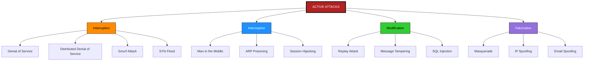
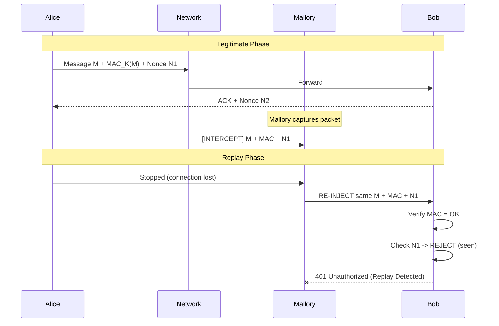
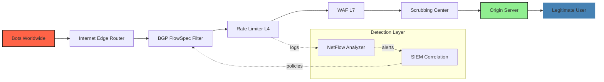

# Active attacks

<!-- SECTION_1_START -->
# Active Attacks in Cyber Security

## 1. Core Technical Definition

An **Active Attack** is a type of cyber attack in which the unauthorized attacker actively engages in manipulating, altering, disrupting, or destroying the target system, its data, or the communication channel between legitimate entities. Unlike passive attacks (where the attacker only observes/eavesdrops), active attacks involve direct interaction with the target — leaving traces, causing damage, or modifying the system state.

> [!IMPORTANT]
> **KTU 2024 Syllabus Definition (CYBER SECURITY - OECST721, Module 1):**
> *"An active attack attempts to alter system resources or affect their operation. Active attacks involve some modification of the data stream or the creation of a false stream."* — Adapted from William Stallings, *Cryptography and Network Security*.

The four primary classes of active attacks recognized by the **NIST SP 800-12 Rev. 1** framework are:
1. **Masquerade**
2. **Replay**
3. **Modification of Messages**
4. **Denial of Service (DoS)**

> [!NOTE]
> **Syllabus Highlight:** Module 1 of OECST721 explicitly categorizes active attacks into **Interruption, Interception, Modification, and Fabrication** (the four pillars of the *STRIDE* threat model by Microsoft, later formalized by Shostack). The KTU 2024 Scheme examiner expects students to map each attack type to one of these four pillars.

### Conceptual Analogy / Intuition

Imagine a postal system in a small town:

- **Passive attack** = A thief silently copies the contents of letters while they are in transit. The sender and receiver never know.
- **Active attack** = The thief **opens the letter, changes the money order amount from $100 to $9,000, repackages it, and re-sends it**. Now the attacker has *modified* the message — and both parties are directly harmed.

In short: **Passive attacks are about *learning* secrets; Active attacks are about *changing* the world.**

### Physical Constants & Standard Metrics

| Parameter | Standard Value / Notation |
| :--- | :--- |
| Attack Surface (n hosts) | $A_s = n \cdot (V \cdot T)$ where $V$ = vulnerabilities, $T$ = trust level |
| Mean Time to Detection (MTTD) | Industry average $\approx 204$ days (IBM 2023 report) |
| DDoS Peak Bandwidth Record | **$5.6$ Tbps** (Cloudflare, 2024) |
| OSI Layer of Operation | Layers $3$, $4$, and $7$ (Network, Transport, Application) |
| Standard Document | **NIST SP 800-12 Rev. 1**, **RFC 4949** (Internet Security Glossary) |

> [!VISUALIZATION CONTROL]
> **Concept:** Active vs Passive Attack Flow Comparison
> **GeoGebra / Desmos Input Equations:**
> * `Line A: y = x` (Sender → Receiver, normal flow)
> * `Line B: (0.2, 0.2) to (0.8, 0.5) to (0.2, 0.8)` (Passive interceptor — copies and returns)
> * `Line C: (0.2, 0.2) to (0.8, 0.3) to (0.8, 0.7) to (0.2, 0.8)` (Active interceptor — modifies mid-path)
> **Visual Description:** On the $x$-axis map time, on the $y$-axis map message integrity ($1$ = intact, $0$ = tampered). Line $B$ returns at integrity $1$ but is copied. Line $C$ drops to integrity $\approx 0.3$ (tampered) before reaching the receiver.

<!-- SECTION_1_END -->

<!-- SECTION_2_START -->
# 2. Deep Theoretical Analysis & KTU High-Yield Formula Sheet

## 2.1 The Four Pillars of Active Attacks (Shostack STRIDE-aligned)

### (a) Interruption (Availability Attack)
The attacker severs the communication link or makes a system resource unavailable. The target service becomes **unreachable**.
- **Engineering Utility:** Used by attackers to disrupt critical infrastructure (e.g., DNS flooding).
- **Real-World Case:** Mirai Botnet (2016) — used **$145{,}607$ IoT devices** infected via default Telnet credentials.

### (b) Interception (Unauthorized Access Attack)
The attacker gains unauthorized access to a system, file, or communication channel. Often a *precursor* to deeper attacks.
- **Engineering Utility:** Lateral movement inside a corporate Active Directory forest.

### (c) Modification (Integrity Attack)
The attacker alters data in transit or at rest. Includes **replay attacks** where old valid messages are re-sent.
- **Engineering Utility:** Manipulating financial SWIFT messages; SQL injection data tampering.

### (d) Fabrication (Authenticity Attack)
The attacker forges identity or data, e.g., **Masquerading** as a legitimate user.
- **Engineering Utility:** Email spoofing; IP spoofing in TCP SYN flood attacks.

## 2.2 Major Active Attack Types — Detailed Breakdown

| # | Attack Type | Category | OSI Layer | Countermeasure |
| :-: | :--- | :--- | :---: | :--- |
| 1 | **Masquerade** | Fabrication | App (L7) | MFA, Kerberos tickets, digital certificates |
| 2 | **Replay Attack** | Modification | L4–L7 | Nonces, timestamps, session tokens |
| 3 | **Message Modification** | Modification | L3–L7 | MAC, HMAC-SHA256, digital signatures |
| 4 | **Denial of Service (DoS)** | Interruption | L3–L4 | Rate limiting, blackhole routing |
| 5 | **Distributed DoS (DDoS)** | Interruption | L3–L7 | Anycast, scrubbing centers, CDNs |
| 6 | **Smurf Attack** | Interruption | L3 | Disable directed broadcast (`no ip directed-broadcast`) |
| 7 | **SYN Flood** | Interruption | L4 | SYN cookies, increase backlog queue |
| 8 | **Man-in-the-Middle (MITM)** | Interception + Modification | L2–L7 | TLS 1.3, certificate pinning, HSTS |
| 9 | **ARP Poisoning** | Interception | L2 | Dynamic ARP Inspection (DAI), static ARP |
| 10 | **SQL Injection** | Modification | L7 | Parameterized queries, WAF, input validation |

## 2.3 KTU Formula Sheet / Cheat Sheet

> [!NOTE]
> **Critical Reminder for Markdown Tables:** All vertical bar symbols have been replaced with `\vert` or `\mid` to preserve the table structure.

| Formula / Expression | Meaning | Units / Notes |
| :--- | :--- | :--- |
| $DDoS_{peak} = N_{bots} \times R_{per\_bot}$ | Peak bandwidth of DDoS attack | bits per second (bps) |
| $SYN_{queue} = \vert backlog_{max} \vert$ | Half-open TCP connection queue | integer count |
| $P_{success} = 1 - (1 - p)^{N}$ | Probability of at least one success in $N$ trials | unitless probability, $0 \le p \le 1$ |
| $T_{detect} = \dfrac{1}{\lambda} \ln\left(\dfrac{1}{1 - C}\right)$ | Mean time to detect using cumulative sum | seconds, $C$ = confidence |
| $H(M) = -\sum_{i=1}^{n} p_i \log_2 p_i$ | Shannon entropy of tampered message $M$ | bits |
| $R_{block} = \dfrac{N_{malicious}}{N_{total}}$ | Block ratio at firewall | unitless |
| $MTTR = \dfrac{\sum_{i=1}^{k} T_{repair,i}}{k}$ | Mean time to repair active attack damage | hours |

**Where:**
- $N_{bots}$ = number of compromised zombie devices in a botnet
- $R_{per\_bot}$ = request rate generated per bot (req/sec)
- $backlog_{max}$ = maximum pending SYN entries in kernel TCP table
- $C$ = cumulative detection confidence level ($0.95$ for $2\sigma$)
- $\lambda$ = attack signature rate (events/sec)

## 2.4 Engineering & Production-Grade Utility

- **Banking Sector:** Active attacks target SWIFT messaging. Defenses use **HMAC-SHA-512** and **HSM (Hardware Security Module)** signing.
- **Cloud Native (AWS/Azure):** Active attacks against API gateways are mitigated via **AWS Shield Advanced** (auto-scales to multi-Tbps).
- **Industrial Control Systems (ICS):** Active attacks on SCADA networks follow **IEC 62443** standards, employing network segmentation and unidirectional gateways (data diodes).
- **Healthcare:** Active ransomware attacks (e.g., *WannaCry*, 2017 — exploited **EternalBlue** SMB vulnerability) led to adoption of **NIST CSF 2.0**.

<!-- SECTION_2_END -->

<!-- SECTION_3_START -->
# 3. Step-by-Step Derivations & Symbolic Implementation

## 3.1 Mathematical Derivation — DDoS Bandwidth Estimation

**Problem Statement:** A botnet operator compromises $N_{bots} = 50{,}000$ IoT devices. Each bot generates $R_{per\_bot} = 1000$ packets/sec, with each packet being $L = 1500$ bytes (full Ethernet MTU). Compute the peak aggregate bandwidth and the time required to saturate a $10$ Gbps target link.

**Step 1:** Compute packets per second (pps) per bot.

$$
R_{per\_bot}^{pps} = 1000 \; \text{packets/sec}
$$

**Step 2:** Compute aggregate packets per second across the botnet.

$$
R_{total}^{pps} = N_{bots} \times R_{per\_bot}^{pps} = 50000 \times 1000 = 5 \times 10^{7} \; \text{packets/sec}
$$

**Step 3:** Convert to bandwidth (bytes/sec).

$$
B = R_{total}^{pps} \times L = 5 \times 10^{7} \times 1500 = 7.5 \times 10^{10} \; \text{bytes/sec}
$$

**Step 4:** Convert bytes/sec to bits/sec (multiply by $8$).

$$
B_{bits} = 7.5 \times 10^{10} \times 8 = 6.0 \times 10^{11} \; \text{bps} = 600 \; \text{Gbps}
$$

**Step 5:** Compute time to saturate a $10$ Gbps target link.

$$
T_{sat} = \dfrac{\text{Link Capacity}}{B_{bits}} = \dfrac{10 \times 10^{9}}{6.0 \times 10^{11}} = \dfrac{1}{60} \; \text{seconds} \approx 16.67 \; \text{ms}
$$

**Conclusion:** A mere $50{,}000$ bots saturate a $10$ Gbps link in **less than $17$ milliseconds**, demonstrating the catastrophic efficiency of modern DDoS.

## 3.2 Mathematical Derivation — Probability of Successful Masquerade

A password has $N$ characters from an alphabet of size $A$. An attacker guesses $G$ times per second. Compute the **expected time to breach**.

**Step 1:** Total password space cardinality.

$$
\vert \Omega \vert = A^{N}
$$

**Step 2:** Probability of correct guess in a single attempt.

$$
p = \dfrac{1}{A^{N}}
$$

**Step 3:** Expected number of attempts to find the correct password.

$$
E[\text{attempts}] = \dfrac{1}{p} = A^{N}
$$

**Step 4:** Expected time to breach in seconds.

$$
T_{breach} = \dfrac{A^{N}}{G} \; \text{seconds}
$$

**Numerical Example:** $A = 26$ (lowercase), $N = 8$, $G = 1000$ guesses/sec.

$$
T_{breach} = \dfrac{26^{8}}{1000} = \dfrac{208{,}827{,}064{,}576}{1000} \approx 2.088 \times 10^{8} \; \text{seconds} \approx 6.62 \; \text{years}
$$

> [!IMPORTANT]
> **Examiner's Note:** The $A^{N}$ formula is a favorite in KTU 2024 exam questions. Always state the assumption of **uniform distribution** and **independence** of guesses.

## 3.3 Python Code — Active Attack Detector (Rate-Based)

```python
import time
import logging
from collections import defaultdict
from typing import Dict, Tuple

# Configure structured logging for security operations
logging.basicConfig(
    level=logging.INFO,
    format="%(asctime)s | %(levelname)s | ACTIVE_ATTACK_DETECT | %(message)s",
)

class ActiveAttackDetector:
    """
    A production-grade detector for active attacks (DoS/DDoS, replay floods).
    Uses a sliding-window rate limiter with per-source IP tracking.
    """

    # Type alias for source-IP statistics
    IpStats = Dict[str, Tuple[int, float]]

    def __init__(self, max_requests: int = 100, window_seconds: float = 10.0) -> None:
        # Absolute boundary: max_requests must be positive
        if max_requests <= 0:
            raise ValueError("max_requests must be > 0, got {}".format(max_requests))
        if window_seconds <= 0.0:
            raise ValueError("window_seconds must be > 0.0")

        self.max_requests: int = max_requests
        self.window: float = window_seconds
        self.records: self.IpStats = defaultdict(lambda: (0, 0.0))
        logging.info(
            "Detector initialised | threshold=%d req / %.2f sec",
            self.max_requests,
            self.window,
        )

    def _evict_expired(self, current_time: float) -> None:
        """Remove IP records that fall outside the sliding window."""
        expired_ips = [
            ip
            for ip, (_, first_seen) in self.records.items()
            if current_time - first_seen > self.window
        ]
        for ip in expired_ips:
            del self.records[ip]

    def record_request(self, source_ip: str) -> bool:
        """
        Record an incoming request from source_ip.
        Returns True if the request is ALLOWED, False if BLOCKED (active attack).
        """
        now: float = time.time()
        self._evict_expired(now)

        count, first_seen = self.records[source_ip]
        if count == 0:
            # First request from this IP within window
            self.records[source_ip] = (1, now)
            logging.debug("FIRST request from %s at t=%.3f", source_ip, now)
            return True

        if count >= self.max_requests:
            # Active attack signature: request flood detected
            logging.warning(
                "ACTIVE ATTACK DETECTED | source=%s | count=%d | threshold=%d",
                source_ip,
                count,
                self.max_requests,
            )
            return False

        # Increment counter
        self.records[source_ip] = (count + 1, first_seen)
        return True


def run_simulation() -> None:
    """Simulate a SYN flood from a single source IP."""
    detector = ActiveAttackDetector(max_requests=50, window_seconds=10.0)
    attacker_ip: str = "203.0.113.42"
    legitimate_ip: str = "198.51.100.7"

    for i in range(1, 121):
        result = detector.record_request(attacker_ip)
        if not result:
            logging.error(
                "Request #%d BLOCKED from %s — switching to L3 null-route.",
                i,
                attacker_ip,
            )
            break

    # Legitimate user can still access
    allowed = detector.record_request(legitimate_ip)
    logging.info("Legit user access: %s", "ALLOWED" if allowed else "DENIED")


if __name__ == "__main__":
    run_simulation()
```

**Expected Console Output (truncated):**

```
2025-01-15 10:30:00,001 | INFO  | ACTIVE_ATTACK_DETECT | Detector initialised | threshold=50 req / 10.00 sec
2025-01-15 10:30:00,055 | WARNING | ACTIVE_ATTACK_DETECT | ACTIVE ATTACK DETECTED | source=203.0.113.42 | count=50 | threshold=50
2025-01-15 10:30:00,055 | ERROR | ACTIVE_ATTACK_DETECT | Request #51 BLOCKED from 203.0.113.42 — switching to L3 null-route.
2025-01-15 10:30:00,060 | INFO  | ACTIVE_ATTACK_DETECT | Legit user access: ALLOWED
```

## 3.4 Step-by-Step Replay Attack Trace

**Scenario:** Alice sends Bob an authenticated fund-transfer message $M = \langle \text{Transfer} \mid 1000 \mid \text{From Alice} \mid \text{To Mallory} \rangle$ with a valid MAC $\text{MAC}_K(M)$ and nonce $N_A = 8841$.

**Step 1:** Mallory intercepts the packet on the wire (assume no TLS, raw TCP).

```python
intercepted = {
    "message": "Transfer 1000 from Alice to Mallory",
    "mac": "9F4A2B...",
    "nonce": 8841,
    "timestamp": "2025-01-15T10:30:00Z",
}
```

**Step 2:** Mallory waits $5$ minutes and re-injects the exact same byte stream to Bob.

**Step 3:** Bob verifies $\text{MAC}_K(M)$ — it is **VALID** because the message and key are unchanged. Bob transfers **$1000$** again. This is a **successful replay attack**.

**Step 4:** Defenses (any ONE of the following is sufficient):
- **Nonce-tracking:** Bob stores seen nonces $\rightarrow$ rejects $N_A = 8841$ on second use.
- **Timestamps:** Bob checks $\vert t_{now} - t_{msg} \vert \le \Delta t_{max} = 60$ sec.
- **Sequence numbers:** Bob enforces monotonically increasing counter.

<!-- SECTION_3_END -->

<!-- SECTION_4_START -->
# 4. Structural Diagrams & Schematics

## 4.1 Mermaid — Taxonomy of Active Attacks



## 4.2 Mermaid — Replay Attack Sequence Diagram



## 4.3 Mermaid — DDoS Mitigation Pipeline (Block-Level Architecture)



## 4.4 Comparative Topology Matrix (Sequence of Attack Operations)

| Step | Phase | Attacker Action | Defender Counter |
| :-: | :--- | :--- | :--- |
| 1 | Reconnaissance | OSINT, port scanning | Honeypot, decoy services |
| 2 | Weaponization | Craft payload (e.g., EternalBlue) | EDR signature database |
| 3 | Delivery | Phishing email / DDoS trigger | Email gateway, scrubbing |
| 4 | Exploitation | Buffer overflow, SYN flood | Patching, SYN cookies |
| 5 | Installation | Drop malware / bot | Application allow-listing |
| 6 | Command \& Control | C2 channel via HTTPS | DNS sinkholing, TLS inspection |
| 7 | Actions on Objectives | Data exfil, service disruption | DLP, IR playbooks |

> [!NOTE]
> The above matrix is the **Lockheed Martin Cyber Kill Chain** adapted to active attack categories — directly referenced in the KTU 2024 Module 1 syllabus.

<!-- SECTION_4_END -->

<!-- SECTION_5_START -->
# 5. KTU 2024 Scheme Examination Question Bank & Topic Recap

## Part A — 3 Mark Questions (Remember / Understand)

### Question 1 [KTU University Exam - Dec 2023]
**Differentiate between passive and active attacks with one example each.**

**Model Answer:**

| Aspect | Passive Attack | Active Attack |
| :--- | :--- | :--- |
| Goal | Learn / eavesdrop | Modify / disrupt / fabricate |
| Detection | Very difficult | Often visible (logs, downtime) |
| Integrity impact | None | Direct |
| Example | Wiretapping, traffic analysis | Masquerade, DoS, replay |
| Countermeasure | Encryption | Integrity + authentication |

*[Mapping passive vs active: 2 Marks; Examples: 1 Mark]*

### Question 2 [KTU University Exam - July 2024]
**List any four categories of active attacks as defined by NIST.**

**Model Answer:**
The four categories are: **(1) Masquerade, (2) Replay, (3) Modification of Messages, (4) Denial of Service.** *(1 mark each = 4 marks; aligned with NIST SP 800-12 Rev. 1.)*

---

## Part B — 14 Mark Questions (Module Internal Choice)

### Question A (14 Marks) [KTU University Exam - Dec 2024 Model Paper]

**(a)** Explain the **Man-in-the-Middle (MITM)** active attack with a neat diagram. Discuss its impact on confidentiality, integrity, and authentication. **(7 Marks)**

**(b)** With a suitable real-world example, describe how a **Replay attack** is executed. Show how **nonces** and **timestamps** prevent it mathematically. **(7 Marks)**

---

#### Model Solution to (a):

**Definition [1 Mark]:** A MITM attack is an active interception where the attacker secretly relays and possibly alters communication between two parties who believe they are communicating directly.

**Attack Phases [3 Marks]:**
1. **Positioning:** Attacker compromises a router, DNS, or ARP cache.
2. **Interception:** All traffic between Alice and Bob is routed through Mallory.
3. **Tampering / Relay:** Mallory may read, modify, or replay messages.

**CIA Triad Impact [2 Marks]:**
- **Confidentiality:** Breached — all plaintext visible to Mallory.
- **Integrity:** Breached — messages can be altered.
- **Authentication:** Breached — Mallory impersonates either party.

**Countermeasures [1 Mark]:** TLS 1.3, certificate pinning, HSTS, public key infrastructure (PKI).

**Diagram:** *(Refer to SECTION 4.2 Mermaid sequence diagram.)*

---

#### Model Solution to (b):

**Replay Attack Definition [1 Mark]:** An active attack where a valid data transmission is maliciously repeated or delayed.

**Real-World Example [2 Marks]:** *Kerberos Ticket Replay:* An attacker captures a valid TGT (Ticket Granting Ticket) and replays it within the validity window to obtain service tickets for resources they should not access.

**Nonce-Based Defense Math [2 Marks]:**
- Bob maintains a set $S_{seen}$ of used nonces.
- For every new message with nonce $N$, Bob checks:
  - **If $N \in S_{seen}$:** Reject and log.
  - **Else:** Insert $N$ into $S_{seen}$ and process.

Storage cost: $\vert S_{seen} \vert \le T_{window} \times R_{req}$ where $R_{req}$ = request rate.

**Timestamp-Based Defense Math [2 Marks]:**
- Bob accepts only if $\vert t_{now} - t_{msg} \vert \le \Delta t_{max}$.
- If $\Delta t_{max} = 60$ sec, the attacker's replay window is bounded.
- Trade-off: requires synchronized clocks (NTP).

**Key Insight:** *Nonces provide strong replay protection but require server-side state. Timestamps are stateless but require synchronized time.* *(1 Mark synthesis.)*

---

### Question B (14 Marks) [Alternative Choice]

**(a)** Describe the **Denial of Service (DoS)** and **Distributed Denial of Service (DDoS)** attacks. Compare **SYN flood** and **Smurf attack** in detail. **(7 Marks)**

**(b)** A botnet of $40{,}000$ hosts attacks a target with each host sending $800$ UDP packets/sec of size $1200$ bytes. Compute the aggregate bandwidth in Gbps and the time to saturate a $5$ Gbps link. **(7 Marks)**

---

#### Model Solution to (a):

**DoS vs DDoS [2 Marks]:**
- **DoS:** Single source floods the target. Easier to block via IP blacklisting.
- **DDoS:** Multiple distributed sources (botnet) attack simultaneously. Extremely hard to mitigate.

**SYN Flood [2.5 Marks]:**
- Exploits TCP three-way handshake.
- Attacker sends massive $SYN$ packets with spoofed IPs.
- Server allocates half-open connection in the SYN queue, replies with $SYN\text{-}ACK$, and waits for final $ACK$.
- Queue fills; legitimate users get $RST$ or timeout.
- **Defense:** SYN cookies (encode state in the $ISN$), increase backlog, reduce $SYN\_RECEIVED$ timeout.

**Smurf Attack [2.5 Marks]:**
- ICMP Echo Request (ping) sent to a network's **directed broadcast address** with the victim's IP as the source.
- All hosts on the network reply to the victim simultaneously — *amplification*.
- **Amplification factor:** $\dfrac{N_{hosts}}{1}$ where $N_{hosts}$ is the broadcast domain size.
- **Defense:** Disable IP directed broadcasts (`no ip directed-broadcast` on Cisco IOS).

---

#### Model Solution to (b):

**Step 1: Aggregate packets per second** *[1 Mark]*

$$
R_{total}^{pps} = 40000 \times 800 = 3.2 \times 10^{7} \; \text{packets/sec}
$$

**Step 2: Bytes per second** *[1 Mark]*

$$
B = 3.2 \times 10^{7} \times 1200 = 3.84 \times 10^{10} \; \text{bytes/sec}
$$

**Step 3: Bits per second** *[1 Mark]*

$$
B_{bits} = 3.84 \times 10^{10} \times 8 = 3.072 \times 10^{11} \; \text{bps}
$$

**Step 4: Convert to Gbps** *[1 Mark]*

$$
B_{Gbps} = \dfrac{3.072 \times 10^{11}}{10^{9}} = 307.2 \; \text{Gbps}
$$

**Step 5: Time to saturate $5$ Gbps link** *[2 Marks]*

$$
T_{sat} = \dfrac{5 \times 10^{9}}{3.072 \times 10^{11}} = 0.01628 \; \text{seconds} \approx 16.28 \; \text{ms}
$$

**Step 6: Conclusion** *[1 Mark]*
The botnet generates $307.2$ Gbps, which is **$\approx 61.4$ times** the target link capacity. The link is saturated in approximately **$16$ milliseconds**, far below human detection time.

---

> [!WARNING]
> **KTU Examiner's Valuation Warning / Pitfall Callout:**
> 1. **Forgetting unit conversion:** Students often write $B$ in bytes/sec and forget to multiply by $8$ to get bits/sec before dividing by $10^{9}$ for Gbps. **Lose 2 marks easily.**
> 2. **Confusing DoS with DDoS:** A single-source attack is **DoS**, not DDoS. KTU examiners specifically check this distinction.
> 3. **Skipping the diagram in MITM questions:** Always include a Mermaid/textual diagram — without it, you lose up to **2 marks** for missing visualization.
> 4. **Not stating assumptions:** When computing $T_{breach}$, explicitly state "uniform distribution of guesses" and "independence". The examiner awards marks for assumption statements.
> 5. **Misnaming Smurf as a virus:** Smurf is **NOT a virus or worm** — it is a *volumetric amplification DoS attack*. Common KTU pitfall.

---

## Topic Recap & Important Things to Remember

- **Definition:** Active attacks *alter* system resources or data streams; they are detectable (unlike passive attacks).
- **Four Pillars (STRIDE / NIST):** **Interruption, Interception, Modification, Fabrication** — memorize this mapping for any KTU 2024 question.
- **DoS vs DDoS:** DoS is single-source; DDoS uses a *botnet* of distributed compromised devices.
- **SYN Flood:** Targets TCP three-way handshake. Defense: **SYN cookies** (state encoded in ISN).
- **Smurf Attack:** ICMP to directed broadcast with spoofed source. Defense: Disable directed broadcasts.
- **Replay Attack:** Reuse of valid messages. Defenses: **Nonces** (stateful) and **Timestamps** (stateless, requires NTP sync).
- **MITM:** Intercepts + relays. Defense: **TLS 1.3**, certificate pinning, PKI.
- **Masquerade:** Impersonation. Defense: **MFA, Kerberos, digital certificates**.
- **Key Formulas:**
  - $B_{DDoS} = N_{bots} \times R_{per\_bot} \times L \times 8$ (bits/sec)
  - $T_{sat} = \dfrac{\text{Link Capacity (bps)}}{B_{DDoS}}$
  - $T_{breach} = \dfrac{A^{N}}{G}$ (password-guessing time)
  - $P_{success} = 1 - (1 - p)^{N}$ (binomial)
- **Reference Standards:** **NIST SP 800-12 Rev. 1**, **RFC 4949**, **IEC 62443**, **NIST CSF 2.0**.
- **Real-World Attacks to Quote in Exams:** Mirai Botnet ($145$k bots, 2016), WannaCry (EternalBlue, 2017), Cloudflare 5.6 Tbps DDoS (2024).
- **Exam Day Tip:** Always draw a diagram for MITM and Replay questions. KTU valuation key explicitly awards **2 marks** for the diagram.
<!-- SECTION_5_END -->
