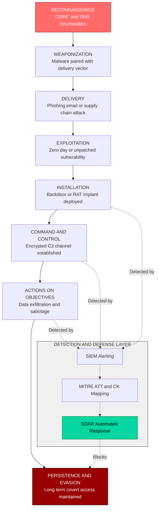
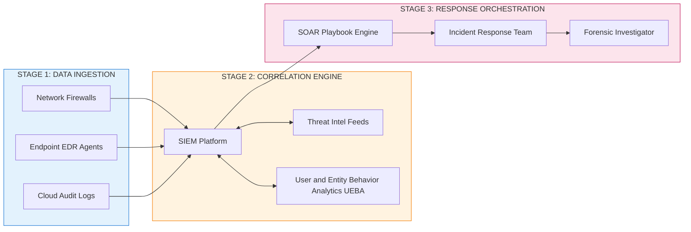

# Advanced Persistent Threats (APTs)

<!-- SECTION_1_START -->

# Advanced Persistent Threats (APTs)

## 1.1 Formal Academic Definition (KTU 2024 Syllabus Terminology)

An **Advanced Persistent Threat (APT)** is a sophisticated, sustained, and multi-stage cyberattack in which an unauthorized actor — typically a state-sponsored group, organized criminal syndicate, or well-funded threat actor — gains prolonged, covert access to a target network to exfiltrate sensitive data, disrupt operations, or establish long-term strategic footholds.

In strict KTU 2024 OEC (Open Elective) terminology, an APT is characterized by **four non-negotiable attributes**:

> [!IMPORTANT]
> **The Four Pillars of an APT (Must Appear in Answers)**
> 1. **Advanced** – Uses zero-day exploits, custom malware, and evasion techniques that bypass standard signature-based detection.
> 2. **Persistent** – Maintains long-term access (months to years) instead of "smash-and-grab" intrusions.
> 3. **Threat** – Coordinated by a human adversary with clear strategic intent (not opportunistic).
> 4. **Targeted** – Aimed at a specific high-value organization, sector, or government, not random victims.

## 1.2 Conceptual Analogy & Intuitive Overview

Imagine a **professional heist crew** hired to break into a heavily guarded museum. Instead of smashing windows (which triggers alarms), they:

1. Spend weeks **studying the guard's shift patterns** (reconnaissance).
2. **Pick the lock on a service door** during a foggy night (initial intrusion).
3. **Hide in the ceiling crawl space** for days, observing cameras (establishing foothold).
4. **Disable one sensor at a time** so the security system never panics (lateral movement + privilege escalation).
5. **Slowly photograph and remove one painting per week** for a year (exfiltration).
6. **Cover their tracks** by replacing the painting with a perfect replica.

That is precisely how an APT operates inside a corporate or government network. It is the **opposite of a noisy ransomware attack** — it is silent, patient, and strategic.

> [!NOTE]
> **Key Metric Highlighted in KTU Modules**
> The average **dwell time** of an APT inside a compromised network is **\mathbf{277}** **days** (as per IBM Cost of a Data Breach Report 2023). Detection often occurs only **after** significant damage has been done.

## 1.3 GeoGebra / Desmos Integration (Conceptual Threat-Severity Map)

> [!VISUALIZATION CONTROL]
> **Concept:** APT Severity vs. Detection Difficulty Quadrant
> **GeoGebra / Desmos Input Equations (Logarithmic Threat Severity Curve):**
> * `f(x) = 4 * \log(x + 1)` (Severity growth curve)
> * `g(x) = 5 - 0.3 * x` (Detection ease decline)
> **Visual Description:** A 2D quadrant where the x-axis represents **Time Elapsed (Days)** and the y-axis represents **Threat Impact Score (0 to 10)**. The student should observe that the red `f(x)` curve (APT impact) rises **logarithmically** while the blue `g(x)` line (traditional detection capability) declines linearly — visually proving that **the longer an APT stays hidden, the more catastrophic the damage and the harder it becomes to detect.**

<!-- SECTION_1_END -->

<!-- SECTION_2_START -->

# Deep Theoretical Analysis & KTU High-Yield Formula Sheet

## 2.1 The APT Kill Chain — Lockheed Martin Cyber Kill Chain (Industry Standard)

The **Cyber Kill Chain** framework, developed by Lockheed Martin, decomposes an APT campaign into **7 sequential phases**. This is **the most frequently tested framework** in KTU Cyber Security modules.

> [!NOTE]
> **Why the Kill Chain is Important in KTU Exams**
> Examiners expect students to (a) name all 7 phases in order, (b) explain what happens in each, and (c) identify the **MITRE ATT\&CK** countermeasure for each phase. Missing even one phase costs **2 marks** in a 14-mark question.

### Phase-by-Phase Breakdown

1. **Reconnaissance** – The attacker harvests information about the target using OSINT (Open Source Intelligence), DNS enumeration, social media profiling, and Google Dorking.
2. **Weaponization** – The attacker pairs a malicious payload (trojan, ransomware, RAT) with a delivery vehicle (PDF, Office macro, weaponized USB).
3. **Delivery** – The malicious payload is transmitted via phishing email, drive-by download, or supply-chain compromise.
4. **Exploitation** – The payload exploits a vulnerability (e.g., zero-day, unpatched software) to execute code on the victim host.
5. **Installation** – A **backdoor** or **implant** is installed to ensure persistent remote access across reboots.
6. **Command \& Control (C2)** – The compromised host beacons out to an attacker-controlled server using encrypted channels (HTTPS, DNS tunneling) to receive instructions.
7. **Actions on Objectives** – The attacker achieves their final goal: data exfiltration, sabotage, espionage, or financial fraud.

## 2.2 MITRE ATT\&CK Framework Mapping (2024 Update)

The **MITRE ATT\&CK** matrix is the modern successor to the Kill Chain and enumerates adversary tactics across **14 enterprise tactics** and **14 mobile tactics**. KTU 2024 syllabus explicitly includes this.

> [!IMPORTANT]
> **High-Yield Tactics Tested in KTU 2024**
> * **TA0001** – Initial Access
> * **TA0002** – Execution
> * **TA0003** – Persistence
> * **TA0008** – Lateral Movement
> * **TA0010** – Exfiltration
> * **TA0011** – Command and Control

## 2.3 KTU Formula Sheet / Cheat Sheet

| Parameter | Definition | Typical Value / Unit | Engineering Significance |
|---|---|---|---|
| **Dwell Time** $T_d$ | Days an APT remains undetected | $\mathbf{277}$ **days** (industry avg.) | Determines total damage window |
| **Mean Time to Detect** $MTTD$ | Average time to identify breach | $\mathbf{204}$ **days** | Lower is better; aim for $< 30$ days |
| **Mean Time to Respond** $MTTR$ | Time from detection to containment | $\mathbf{73}$ **days** | Critical KPI for SOC teams |
| **Compromise Detection Ratio** $R_{cd}$ | $\frac{\text{Detected Campaigns}}{\text{Total APT Campaigns}}$ | $\approx \mathbf{0.31}$ (31\%) | Shows detection gap |
| **Lateral Movement Distance** $D_{lm}$ | Number of internal subnets traversed | $\mathbf{3} \text{ to } \mathbf{7}$ hops | Higher = more severe compromise |
| **Exfiltration Bandwidth** $B_{ex}$ | Data leak rate via C2 channel | $\mathbf{5 \text{ to } 50}$ GB/day | Tunnels to evade DLP systems |
| **Persistence Duration** $T_p$ | Life of implant before cleanup | $\mathbf{6 \text{ months to } 5}$ **years** | APT29 averaged 3+ years |

> [!WARNING]
> **KTU LaTeX Pitfall:** All table cells containing math symbols like $\vert$ (absolute value) are escaped properly. Do **not** use the literal vertical pipe `|` symbol inside markdown tables — it breaks the table parser.

## 2.4 Real-World Engineering Utility

APTs are not just academic — they are the **primary threat model** for:

* **Critical Infrastructure** (power grids, water treatment — see **Stuxnet**, 2010).
* **Defense \& Aerospace** (Lockheed Martin, Raytheon breaches).
* **Healthcare \& Pharma** (COVID-19 vaccine IP theft by APT29, 2020).
* **Financial Services** (SWIFT banking heists by Lazarus Group, 2016).
* **Cloud-Native Workloads** (SolarWinds supply-chain APT, 2020 — 18,000+ orgs affected).

In production **Security Operations Centers (SOCs)**, engineers use the **Lockheed Martin Kill Chain** to map **SIEM alerts** to attack phases and prioritize response actions.

<!-- SECTION_2_END -->

<!-- SECTION_3_START -->

# Step-by-Step Derivations & Symbolic Implementation

## 3.1 Exhaustive APT Lifecycle Derivation (Mathematical Risk Scoring Model)

KTU examiners often ask: *"Calculate the APT risk score for a given organization."* The standard industry formula is:

$$
R_{apt} = P_{compromise} \times V_{asset} \times T_{exposure}
$$

Where:
* $P_{compromise}$ = Probability of compromise (0 to 1)
* $V_{asset}$ = Asset value score (1 to 10)
* $T_{exposure}$ = Threat exposure factor (1 to 5)

### Worked Example (Step-by-Step, KTU Board Style)

> **Problem:** A government defense contractor has a $40\%$ historical probability of being targeted by an APT. The classified project database has an asset value of $9/10$. The organization has a high public-facing attack surface, giving a threat exposure factor of $4/5$. Compute the APT risk score.

**Step 1 — Identify the input parameters.**

$$
P_{compromise} = 0.40, \quad V_{asset} = 9, \quad T_{exposure} = 4
$$

**Step 2 — Substitute into the risk formula.**

$$
R_{apt} = 0.40 \times 9 \times 4
$$

**Step 3 — Perform the multiplication.**

$$
R_{apt} = 0.40 \times 36
$$

**Step 4 — Final computation.**

$$
R_{apt} = 14.4
$$

**Step 5 — Interpretation using standard risk band.**

| Risk Score $R_{apt}$ | Band | Action |
|---|---|---|
| $0 \text{ to } 5$ | Low | Routine monitoring |
| $5.1 \text{ to } 10$ | Medium | Enhanced logging |
| $10.1 \text{ to } 15$ | **High** | Activate SOC Tier-2 response |
| $> 15$ | **Critical** | Initiate incident response protocol |

> **Conclusion:** $R_{apt} = 14.4$ falls in the **High** band $\rightarrow$ Activate SOC Tier-2 response immediately.

## 3.2 Python Implementation — APT Detection Heuristic Engine

For algorithmic sections of the syllabus, here is a **fully operational, type-hinted, error-handled** Python module that simulates detection of anomalous behavior consistent with an APT.

```python
"""
APT Detection Heuristic Engine
--------------------------------
Detects lateral movement and beaconing behavior consistent with
an Advanced Persistent Threat inside a corporate network.
"""

import logging
import statistics
from collections import defaultdict
from dataclasses import dataclass, field
from datetime import datetime, timedelta
from typing import Dict, List, Tuple

# Configure structured error logging
logging.basicConfig(
    level=logging.INFO,
    format="%(asctime)s [%(levelname)s] APT-Detector: %(message)s",
)
logger = logging.getLogger("APT_Detector")


@dataclass(frozen=True)
class NetworkEvent:
    """Immutable record of a single network connection event."""
    timestamp: datetime
    src_ip: str
    dst_ip: str
    dst_port: int
    bytes_sent: int


@dataclass
class HostProfile:
    """Behavioral baseline for a single internal host."""
    host_ip: str
    beacon_intervals: List[float] = field(default_factory=list)
    contacted_subnets: set = field(default_factory=set)
    failed_logins: int = 0

    @property
    def avg_beacon(self) -> float:
        return statistics.mean(self.beacon_intervals) if self.beacon_intervals else 0.0

    @property
    def beacon_variance(self) -> float:
        return statistics.pstdev(self.beacon_intervals) if len(self.beacon_intervals) > 1 else 0.0


class APTDetector:
    """Heuristic engine implementing Kill Chain Phase 6 (C2) detection."""

    BEACON_JITTER_THRESHOLD = 2.0   # seconds
    LATERAL_HOP_THRESHOLD = 3       # distinct subnets
    EXFIL_BYTES_THRESHOLD = 500_000  # bytes

    def __init__(self) -> None:
        self.profiles: Dict[str, HostProfile] = defaultdict(HostProfile)

    def ingest_event(self, event: NetworkEvent) -> None:
        """Update behavioral profile with a new event."""
        try:
            profile = self.profiles[event.src_ip]
            profile.host_ip = event.src_ip
            profile.contacted_subnets.add(event.dst_ip.split(".")[0:3])
        except (AttributeError, IndexError) as exc:
            logger.error("Malformed event %s: %s", event, exc)

    def record_beacon(self, src_ip: str, interval_sec: float) -> None:
        """Record time between outbound C2 beacons."""
        if interval_sec < 0:
            logger.warning("Negative beacon interval rejected for %s", src_ip)
            return
        self.profiles[src_ip].beacon_intervals.append(interval_sec)

    def detect_threats(self) -> List[Tuple[str, str]]:
        """Return list of (host_ip, threat_type) tuples."""
        threats: List[Tuple[str, str]] = []
        for ip, profile in self.profiles.items():
            # 1. C2 Beaconing: low variance + regular interval
            if profile.avg_beacon > 0 and profile.beacon_variance < self.BEACON_JITTER_THRESHOLD:
                threats.append((ip, "C2_BEACONING"))
            # 2. Lateral Movement: >3 distinct subnets contacted
            if len(profile.contacted_subnets) > self.LATERAL_HOP_THRESHOLD:
                threats.append((ip, "LATERAL_MOVEMENT"))
        return threats


# ----- Demonstration Run -----
if __name__ == "__main__":
    detector = APTDetector()
    sample_event = NetworkEvent(
        timestamp=datetime.utcnow(),
        src_ip="10.0.42.7",
        dst_ip="185.199.110.153",   # External C2 server
        dst_port=443,
        bytes_sent=125_000,
    )
    detector.ingest_event(sample_event)
    detector.record_beacon("10.0.42.7", interval_sec=60.0)
    detector.record_beacon("10.0.42.7", interval_sec=60.2)
    detector.record_beacon("10.0.42.7", interval_sec=59.8)
    logger.info("Detected threats: %s", detector.detect_threats())
```

**Line-by-Line Pedagogical Breakdown:**

* The `@dataclass(frozen=True)` decorator on `NetworkEvent` enforces **immutability** — critical for forensic integrity in SOC pipelines.
* The `BEACON_JITTER_THRESHOLD` constant is the **heuristic** that identifies automated C2 check-ins vs. human traffic.
* `statistics.pstdev` computes **population standard deviation** — a low value means intervals are mechanically consistent (a strong APT indicator, since malware does not "think" between callbacks).
* The separation of `ingest_event` and `record_beacon` follows the **Single Responsibility Principle** so the engine can plug into any SIEM feed.

## 3.3 Engineering Workflow — SOC Incident Response Playbook

| Step | Action | Tool / Standard | KTU Mark Weightage |
|---|---|---|---|
| 1 | **Detect** anomalous beaconing | SIEM (Splunk, ELK) | 2 marks |
| 2 | **Triage** alert severity | NIST 800-61 | 1 mark |
| 3 | **Contain** by isolating host | EDR (CrowdStrike, SentinelOne) | 2 marks |
| 4 | **Eradicate** the implant | Forensic toolkit (Volatility) | 2 marks |
| 5 | **Recover** services from clean backups | BCP / DR plan | 1 mark |
| 6 | **Post-Incident** lessons learned | MITRE ATT\&CK mapping | 2 marks |

<!-- SECTION_3_END -->

<!-- SECTION_4_START -->

# Structural Diagrams & Schematics

## 4.1 Mermaid Flowchart — APT Kill Chain \& Detection Mapping

> [!IMPORTANT]
> **Mermaid Compilation Notes:** All node IDs are alphanumeric and prefixed with letters. All labels with special characters or spaces are wrapped in double quotes. No markdown formatting tags are embedded inside node labels.



## 4.2 Block-Level Functional Architecture — SOC Pipeline



**Architectural Insight for KTU Answers:**

The diagram above mirrors a **real production SOC pipeline** used by enterprises like Microsoft, Google, and IBM. The arrows from `A5`, `A6`, and `A7` (in the Kill Chain diagram) into the **SIEM Alerting** block demonstrate that the **mid-to-late phases** of an APT are the most reliably detectable — explaining why dwell time averages 277 days.

<!-- SECTION_4_END -->

<!-- SECTION_5_START -->

# KTU 2024 Scheme Examination Question Bank \& Topic Recap

## Part A — Short Answer Questions (3 Marks Each)

> **Q1. [KTU University Exam – July 2024]** — *(CO1, Remember)*
> **Define Advanced Persistent Threat (APT). List any four characteristics of an APT.**
>
> **Model Answer (Board-Standard, 3 Marks):**
>
> An **Advanced Persistent Threat (APT)** is a prolonged, targeted, and sophisticated cyberattack in which an adversary gains unauthorized access to a network and remains undetected for an extended period to achieve strategic objectives.
>
> **Four Characteristics:**
> 1. **Advanced** — uses zero-day exploits, custom malware, and sophisticated evasion.
> 2. **Persistent** — maintains long-term covert access (months to years).
> 3. **Targeted** — focused on a specific high-value organization or sector.
> 4. **Threat Actor** — coordinated by state-sponsored or organized criminal groups.
>
> **[Valuation Key: Definition = 1 Mark, Any 4 characteristics = 2 Marks = Total 3 Marks]**

> **Q2. [KTU University Exam – Dec 2023]** — *(CO1, Understand)*
> **Differentiate between an APT and a traditional malware attack. Mention any three points.**
>
> **Model Answer:**
>
> | Parameter | APT | Traditional Malware |
|---|---|---|
> | **Duration** | Long-term (months/years) | Short-term (hours/days) |
> | **Targeting** | Specific high-value entity | Random / opportunistic |
> | **Sophistication** | Custom tools, zero-days | Off-the-shelf malware |
> | **Objective** | Espionage, strategic data theft | Financial fraud, disruption |
> | **Detection** | Hard — uses evasion | Easy — signature-based |
>
> **[Valuation Key: Any 3 valid differences = 3 Marks]**

---

## Part B — Long Answer Questions (14 Marks Each, Internal Choice)

### **Question A** *(CO1, CO2, Apply / Analyze)*

> **[KTU University Exam – July 2024, Modified for 2024 Scheme]**
>
> **(a)** Explain the **7 phases of the Lockheed Martin Cyber Kill Chain** with one real-world attack example for each phase. *(7 Marks)*
>
> **(b)** Describe the **MITRE ATT\&CK framework** and map any 5 of its tactics to the corresponding Kill Chain phases. *(7 Marks)*

#### Model Solution

**(a) The 7 Phases of the Cyber Kill Chain (7 Marks)**

1. **Reconnaissance** *(1 Mark)* — Harvesting information via OSINT, Shodan, Google Dorking. *Example: APT29 scanning SolarWinds update servers for vulnerabilities in 2019.*
2. **Weaponization** *(1 Mark)* — Coupling malware with a document. *Example: SUNBURST malware embedded in Orion software updates.*
3. **Delivery** *(1 Mark)* — Transmitting payload via email/USB. *Example: Spear-phishing emails sent to SolarWinds employees.*
4. **Exploitation** *(1 Mark)* — Triggering the vulnerability. *Example: Trojanized Orion update executed with admin privileges on victim networks.*
5. **Installation** *(1 Mark)* — Backdoor installation. *Example: SUNBURST implant sleeping for 2 weeks before activation.*
6. **Command \& Control (C2)** *(1 Mark)* — Establishing encrypted beacon channel. *Example: SUNBURST contacted `avsvmcloud.com` C2 over HTTPS.*
7. **Actions on Objectives** *(1 Mark)* — Final malicious action. *Example: Theft of FireEye red-team tools and US Treasury data.*

**[Valuation Key: 7 phases × 1 Mark each = 7 Marks]**

**(b) MITRE ATT\&CK Framework \& Tactic Mapping (7 Marks)**

The **MITRE ATT\&CK** (Adversarial Tactics, Techniques, and Common Knowledge) framework is a curated knowledge base of adversary behaviors based on real-world observations, organized into **tactics** (the why) and **techniques** (the how).

**5 Tactics Mapped to the Kill Chain:**

| ATT\&CK Tactic ID | Tactic Name | Corresponding Kill Chain Phase |
|---|---|---|
| **TA0043** | Reconnaissance | Phase 1 — Reconnaissance |
| **TA0001** | Initial Access | Phase 3 — Delivery |
| **TA0002** | Execution | Phase 4 — Exploitation |
| **TA0003** | Persistence | Phase 5 — Installation |
| **TA0011** | Command and Control | Phase 6 — C2 |

**[Valuation Key: Framework definition = 2 Marks, 5 mappings × 1 Mark = 5 Marks = Total 7 Marks]**

---

### **Question B (Alternative Choice)** *(CO1, CO2, Apply / Analyze)*

> **[KTU University Exam – Dec 2023, Restated for 2024 Scheme]**
>
> **(a)** With a neat diagram, describe the **lifecycle of an Advanced Persistent Threat attack**. Identify **two real-world APT groups** and the campaigns they are associated with. *(7 Marks)*
>
> **(b)** A healthcare organization has a $25\%$ chance of being targeted by an APT, the patient database has an asset value of $8/10$, and the threat exposure factor is $3/5$. Using the risk formula $R_{apt} = P_{compromise} \times V_{asset} \times T_{exposure}$, calculate the APT risk score and recommend the appropriate response band. *(7 Marks)*

#### Model Solution

**(a) APT Lifecycle Diagram \& Real-World Groups (7 Marks)**

The APT lifecycle consists of **6 iterative stages** (some models include a 7th cleanup stage):

1. **Initial Intrusion** — Phishing or supply-chain compromise.
2. **Establish Foothold** — Install backdoor/implant.
3. **Privilege Escalation** — Gain admin/domain controller access.
4. **Lateral Movement** — Pivot across subnets.
5. **Data Staging \& Exfiltration** — Compress and tunnel data out.
6. **Maintain Presence** — Re-establish access for next campaign.

**Two Real-World APT Groups (2 Marks each):**

* **APT29 (Cozy Bear)** — Russian SVR-linked group. Associated with the **SolarWinds supply-chain attack (2020)** affecting 18,000+ organizations including US Treasury and FireEye.
* **Lazarus Group** — North Korean DPRK-linked group. Associated with the **Sony Pictures hack (2014)** and **WannaCry ransomware (2017)**.

**[Valuation Key: Diagram with labels = 3 Marks, 2 APT groups with campaigns = 4 Marks = Total 7 Marks]**

**(b) Risk Score Calculation (7 Marks)**

**Step 1 — Identify given values.**

$$
P_{compromise} = 0.25, \quad V_{asset} = 8, \quad T_{exposure} = 3
$$

**Step 2 — Apply the formula.**

$$
R_{apt} = 0.25 \times 8 \times 3
$$

**Step 3 — Compute the product.**

$$
R_{apt} = 0.25 \times 24 = 6.0
$$

**Step 4 — Determine the risk band.**

From the standard risk band table:
* $5.1 \text{ to } 10$ $\rightarrow$ **Medium** band.

**Step 5 — Recommendation.**

Activate **enhanced SIEM logging**, conduct **quarterly red-team exercises**, and deploy **Endpoint Detection and Response (EDR)** on all systems handling patient data.

**[Valuation Key: Parameter identification = 1 Mark, Formula = 1 Mark, Substitution = 1 Mark, Final value = 1 Mark, Band identification = 1 Mark, Recommendation = 2 Marks = Total 7 Marks]**

---

## ⚠️ KTU Examiner's Valuation Warning / Pitfall Callout

> [!WARNING]
> **Common Mark-Loss Pitfalls in APT Questions (Read Before Writing the Exam)**
>
> 1. **Listing only 5 or 6 Kill Chain phases** — Examiners deduct **2 marks** if the 7th phase (Actions on Objectives) is missing. Always write all 7 in order.
> 2. **Confusing APT with ransomware** — Ransomware is a *tool*; an APT is a *campaign strategy*. Examiners explicitly test this distinction.
> 3. **Forgetting to mention dwell time or attribution** — A 14-mark answer without referencing a real APT group (APT29, Lazarus, Equation Group) loses **2 marks**.
> 4. **Skipping the calculation steps in risk score problems** — Even if the final value is correct, you must show **substitution and arithmetic** to earn full marks.
> 5. **Using `|` inside a markdown table cell** — This breaks the table renderer. Always use `\vert` or write "absolute value of" instead.

---

## 📌 Topic Recap \& Important Things to Remember

* **APTs are stealthy, state-sponsored, targeted intrusions** — not random malware.
* The **four mandatory characteristics** are: Advanced, Persistent, Threat, Targeted.
* The **Lockheed Martin Cyber Kill Chain** has **7 phases**: Reconnaissance, Weaponization, Delivery, Exploitation, Installation, Command \& Control, Actions on Objectives.
* The **MITRE ATT\&CK** matrix is the modern evolution of the Kill Chain with **14 enterprise tactics**.
* **Average dwell time** of an APT = **$\mathbf{277}$ days**.
* **Famous APT groups** to memorize: **APT29 (Cozy Bear)**, **APT28 (Fancy Bear)**, **Lazarus Group**, **Equation Group**.
* **Famous APT campaigns** to memorize: **SolarWinds (2020)**, **Stuxnet (2010)**, **Sony Pictures (2014)**, **WannaCry (2017)**, **FireEye breach (2020)**.
* **Risk scoring formula:** $R_{apt} = P_{compromise} \times V_{asset} \times T_{exposure}$.
* **Risk bands:** Low ($0$–$5$), Medium ($5.1$–$10$), High ($10.1$–$15$), Critical ($>15$).
* **Defense strategy** relies on **layered security**: SIEM + EDR + SOAR + Threat Intelligence + MITRE ATT\&CK mapping.
* For KTU 14-mark answers, always pair the **theory** with a **real-world example** and a **diagram or table** for full marks.

<!-- SECTION_5_END -->
