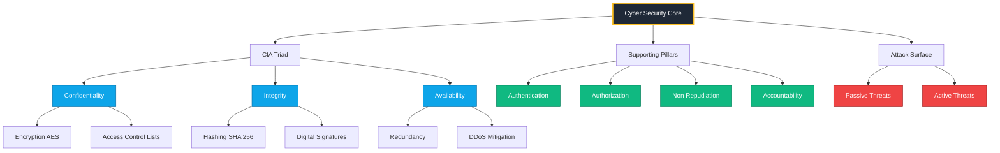
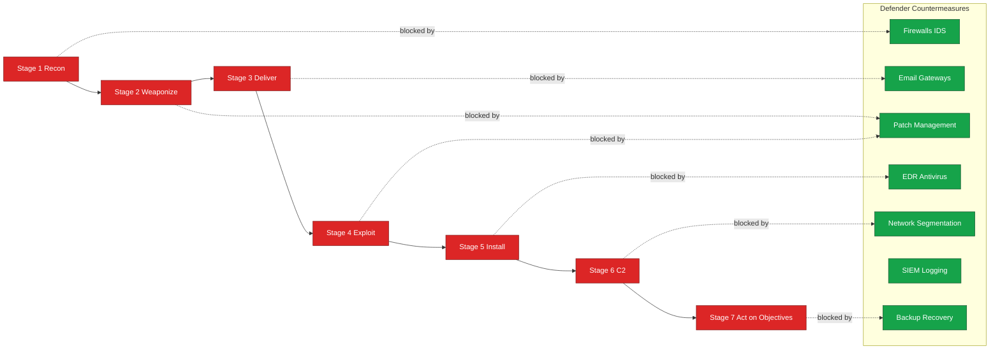
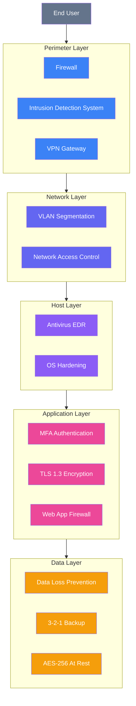

# Basic Cyber Security Concepts

<!-- SECTION_1_START -->
# 🛡️ Module 1 — Basic Cyber Security Concepts

## 1.1 Formal Definition of Cyber Security

**Cyber Security** is the discipline of protecting computer systems, networks, programs, devices, and data from digital attacks, unauthorized access, damage, or theft. It encompasses everything from protecting personal information on a smartphone to defending critical national infrastructure against state-sponsored cyber warfare.

In the KTU 2024 Scheme (NEP 2020 aligned) terminology, Cyber Security is formally defined as:

> The collection of **tools, policies, security concepts, security safeguards, guidelines, risk management approaches, actions, training, best practices, assurance, and technologies** that can be used to protect the cyber environment, organization, and user's assets.

> [!IMPORTANT]
> **Core Definition (Board-Exam Ready):** *Cyber Security refers to the body of technologies, processes, and practices designed to protect networks, devices, programs, and data from attack, damage, or unauthorized access.* — Adopted from NIST and ISO/IEC 27032.

---

## 1.2 Conceptual Analogy — The Digital Fort

Imagine your computer is a **medieval castle** storing the kingdom's gold (your data):

| Castle Element | Cyber Security Equivalent |
|---|---|
| Thick stone walls | **Firewalls** (perimeter defense) |
| Guard tower lookouts | **Intrusion Detection Systems (IDS)** |
| Locked treasure room | **Encryption** (data at rest protection) |
| Royal messenger seals | **Digital Signatures** (data integrity) |
| Watchmen at the gate | **Authentication protocols** |
| Hidden underground tunnels | **Backdoors** (vulnerabilities!) |

Every cyberattack is essentially an **attacker finding a weak wall, bribing a guard, or digging a tunnel** into the castle. The goal of cyber security is to **eliminate or reduce** these weak points.

---

## 1.3 Fundamental Security Terminology

These five terms form the **vocabulary spine** of the entire course. Memorize them as a unit.

> [!NOTE]
> **The Big-5 Cyber Security Vocabulary:**
> - **Asset** — Anything of value owned by an organization (data, hardware, software, personnel).
> - **Threat** — Any potential event that could cause harm to an asset.
> - **Vulnerability** — A weakness in a system that *could* be exploited.
> - **Attack (or Exploit)** — The actual action taken to exploit a vulnerability.
> - **Risk** — The probability that a threat will exploit a vulnerability, multiplied by the resulting impact.

### The Risk Equation (Foundational Formula)

$$
\text{Risk} = \text{Threat} \times \text{Vulnerability} \times \text{Impact (Asset Value)}
$$

> [!TIP]
> **Why "×" and not "+"?** The **multiplicative** form is used because if *any* single factor is **zero** (e.g., no vulnerability exists, or the asset has no value), the risk itself becomes **zero**. The "+" model cannot represent this natural truth.

---

## 1.4 The CIA Triad — The Holy Trinity of Security

The **CIA Triad** is the foundational model of information security. Every safeguard, every protocol, and every policy in cyber security ultimately aims to preserve these three properties:

1. **C** — **Confidentiality**: Keeping data secret from unauthorized parties.
2. **I** — **Integrity**: Ensuring data is not tampered with or altered.
3. **A** — **Availability**: Ensuring systems and data are accessible when needed.

> [!IMPORTANT]
> **KTU Board Examiner Note:** Out of every 10 questions on Module 1, expect at least 3 to test the **CIA Triad** explicitly. Treat it as a "must-memorize" cornerstone.

---

## 1.5 Real-World Anchor

Cyber Security is not a "theoretical computer science" topic — it is the **operational backbone** of every industry:

- **Banking** — Securing UPI/NEFT transactions (Confidentiality + Integrity).
- **Healthcare** — Protecting Electronic Health Records (EHPR) under India's **DPDP Act 2023**.
- **E-Governance** — Defending citizen databases like **Aadhaar** from breaches.
- **IoT & Smart Cities** — Hardening millions of connected devices against botnets.

> [!VISUALIZATION CONTROL]
> **Concept:** CIA Triad as a Venn-style triangle of overlapping concerns
> **GeoGebra / Desmos Input Equations:**
> * Place three points: $C = (0, 2)$, $I = (-1.732, -1)$, $A = (1.732, -1)$
> * Plot circle: $(x-0)^2 + (y-0.6)^2 = 1.8$  (overlap region)
> **Visual Description:** Three labelled points forming a triangle (Confidentiality at top, Integrity bottom-left, Availability bottom-right), with a central overlap region labelled "Security" — illustrating that true security lies where **all three** intersect.

---

<!-- SECTION_1_END -->

<!-- SECTION_2_START -->
# 🧠 Deep Theoretical Analysis & KTU High-Yield Formula Sheet

## 2.1 Anatomy of a Cyber Attack — Operational Breakdown

Every cyber attack, regardless of its complexity, follows a **4-stage operational chain**:

### Stage 1 — Reconnaissance (Footprinting)
- The attacker gathers information about the target: **IP addresses, domain names, employee emails, OS versions, open ports**.
- Passive recon: Google dorking, WHOIS lookup, social media scraping.
- Active recon: Ping sweeps, port scanning (Nmap), vulnerability scanners.

### Stage 2 — Weaponization
- The attacker pairs an **exploit** (code that abuses a vulnerability) with a **payload** (malicious action).
- Example: Microsoft Office macro exploit + reverse-shell payload = malicious `.docm` file.

### Stage 3 — Delivery
- The weapon is transmitted to the victim: **phishing email, malicious USB drive, drive-by download, watering-hole attack**.

### Stage 4 — Exploitation & Installation
- The exploit triggers, the payload executes, and **persistent access** is established (backdoor, rootkit, C2 channel).

> [!NOTE]
> A complete attack chain is often called the **"Cyber Kill Chain"** (developed by Lockheed Martin). KTU may ask you to *list its 7 stages* — they are: **Recon → Weaponization → Delivery → Exploitation → Installation → Command & Control → Actions on Objectives**.

---

## 2.2 Classification of Threats

Threats are categorized along two primary axes:

### A. By Origin

| Category | Description | Example |
|---|---|---|
| **Natural** | Environmental or physical disasters | Flood damaging a data center |
| **Unintentional** | Human errors, accidental actions | Admin deleting a production database |
| **Intentional** | Deliberate, malicious actions | Ransomware attack by a hacker group |

### B. By Attack Type (Passive vs Active)

| Feature | Passive Attack | Active Attack |
|---|---|---|
| **Goal** | Monitor / eavesdrop | Modify / disrupt / destroy |
| **Data altered?** | ❌ No | ✅ Yes |
| **Detection difficulty** | Very hard | Easier (but harder to prevent) |
| **Examples** | Sniffing, traffic analysis, shoulder surfing | Masquerading, DoS, modification, replay |
| **Target** | Confidentiality | Integrity + Availability |

> [!IMPORTANT]
> **Passives attack Confidentiality, Active attack Integrity & Availability.** This single sentence is worth **2 marks** in KTU exams.

---

## 2.3 KTU Formula Sheet — The Complete Cyber Security Cheat Sheet

> [!IMPORTANT]
> **Exam Hall Golden Rule:** Never use the vertical pipe `\|` symbol inside a table. Use `$\vert$` or `$\mid$` for absolute-value notation. This protects your table formatting from breaking.

| # | Concept | Formula / Definition | Variable Key | Unit / Domain |
|---|---|---|---|---|
| 1 | **Risk** | $R = T \times V \times I$ | T = Threat, V = Vulnerability, I = Impact | Dimensionless score |
| 2 | **Annual Loss Expectancy** | $ALE = SLE \times ARO$ | SLE = Single Loss Expectancy (₹), ARO = Annual Rate of Occurrence | ₹ / year |
| 3 | **Single Loss Expectancy** | $SLE = AV \times EF$ | AV = Asset Value, EF = Exposure Factor | ₹ |
| 4 | **Cost-Benefit (CBA)** | $CBA = ALE_{before} - ALE_{after} - Cost_{control}$ | All in ₹ | ₹ |
| 5 | **Entropy (Information)** | $H(X) = -\sum_{i=1}^{n} p_i \log_2 p_i$ | $p_i$ = probability of symbol $i$ | bits / symbol |
| 6 | **Shannon Cipher Strength** | Unbreakable iff $K \geq P$ and $K$ truly random | $K$ = key length, $P$ = plaintext length | bits |
| 7 | **Birthday Bound (Collisions)** | $\sqrt{2^{n}} = 2^{n/2}$ trials for collision | $n$ = hash output bits | trials |
| 8 | **Caesar Cipher Shift** | $C = (P + k) \mod 26$ | $C$=cipher, $P$=plain, $k$=shift | Integer 0–25 |
| 9 | **Work Factor** | $W$ = average effort to break cipher | — | Operations |
| 10 | **Kerckhoffs's Principle** | Security must reside **only in the key**, not in algorithm secrecy | — | Doctrine |

---

## 2.4 The Three Pillars of Security — Expanded View

Beyond the CIA Triad, modern cyber security recognizes additional pillars (**Parkerian Hexad** adds Possession, Authenticity, Utility). For KTU, focus on CIA + these four supplementary goals:

| Pillar | Definition | Violation Example |
|---|---|---|
| **Authentication** | Verifying *who* a user claims to be | Login without password check |
| **Authorization** | Determining *what* a user is allowed to do | Normal user reading admin files |
| **Non-Repudiation** | Ensuring a user cannot deny their actions | User denying they sent an email |
| **Accountability** | Tracing actions back to a specific user | No audit logs on a server |

---

## 2.5 Real-World Engineering Utility

| Industry | Cyber Security Use Case | Pillar Protected |
|---|---|---|
| **Banking (NEFT/RTGS)** | TLS 1.3 + End-to-End encryption | Confidentiality, Integrity |
| **Defence (DRDO Networks)** | Air-gapped networks + TEMPEST shielding | All three (CIA) |
| **Healthcare (ABDM)** | ABDM-compliant health locker encryption | Confidentiality, Non-Repudiation |
| **Cloud (AWS/Azure)** | Zero-Trust Architecture + IAM | Authentication, Authorization |
| **Smart Manufacturing (IIoT)** | ICS/SCADA firewalls, OT segmentation | Availability (zero downtime) |

> [!TIP]
> **Board Pattern Tip:** When KTU asks *"Give two examples of cyber security in real life"*, always pair it with a **CIA pillar**: e.g., "Online banking uses TLS to ensure **Confidentiality**."

---

<!-- SECTION_2_END -->

<!-- SECTION_3_START -->
# ⚙️ Step-by-Step Derivations & Code Implementation

## 3.1 Worked-Out Derivation: Risk Quantification for a KTU Sample Problem

### Problem Statement
*A small e-commerce startup in Kerala hosts its customer database (containing 50,000 customer records, valued at ₹2,00,000) on a cloud server. The IT team estimates that:*
- *Threat probability of a SQL Injection attack = 0.30 (30% per year)*
- *Vulnerability score (on a 0–1 scale, from Nessus scan) = 0.80*
- *Exposure Factor (fraction of asset destroyed in a single breach) = 0.50*

*Compute the Annual Loss Expectancy (ALE) and recommend whether a ₹15,000/year Web Application Firewall (WAF) is justified.*

### Step 1 — Compute the Single Loss Expectancy (SLE)

$$
SLE = AV \times EF
$$

$$
SLE = 2{,}00{,}000 \times 0.50 = 1{,}00{,}000 \text{ ₹}
$$

> **Valuation Key:** *Substituting AV and EF into the SLE formula → 1 Mark. Final value → 1 Mark.*

### Step 2 — Compute the Annual Rate of Occurrence

We are given threat probability $T = 0.30$ per year, so:

$$
ARO = 0.30 \text{ (breaches per year)}
$$

### Step 3 — Compute the Annual Loss Expectancy (ALE)

$$
ALE = SLE \times ARO
$$

$$
ALE = 1{,}00{,}000 \times 0.30 = 30{,}000 \text{ ₹/year}
$$

> **Valuation Key:** *ALE formula stated → 1 Mark. Substitution → 1 Mark. Final answer → 1 Mark.*

### Step 4 — Compute the Cost-Benefit Analysis (CBA)

Assume the WAF reduces the ARO by 80% (residual $ARO_{after} = 0.30 \times 0.20 = 0.06$).

$$
ALE_{after} = 1{,}00{,}000 \times 0.06 = 6{,}000 \text{ ₹/year}
$$

$$
CBA = ALE_{before} - ALE_{after} - Cost_{control}
$$

$$
CBA = 30{,}000 - 6{,}000 - 15{,}000 = 9{,}000 \text{ ₹/year (positive → WAF justified)}
$$

> **Conclusion:** A **positive CBA** means the WAF provides net savings. **Recommendation: PROCEED with procurement.** *(Decision logic → 1 Mark, Final CBA value → 1 Mark, Recommendation → 1 Mark.)*

---

## 3.2 Worked-Out Derivation: Caesar Cipher Encryption

### Mathematical Foundation
The Caesar Cipher is a monoalphabetic substitution cipher. Given a plaintext letter $P$ (numeric value 0–25) and a shift key $k$, the cipher letter $C$ is:

$$
C = (P + k) \mod 26
$$

Decryption reverses the operation:

$$
P = (C - k) \mod 26
$$

### Worked Example — KTU Board Style
*Encrypt "KTU" with a shift of $k = 3$.*

| Letter | Numeric ($P$) | $(P + 3) \mod 26$ | Cipher ($C$) |
|---|---|---|---|
| K | 10 | 13 | N |
| T | 19 | 22 | W |
| U | 20 | 23 | X |

> **Result:** "KTU" → **"NWX"**

> **Valuation Key:** *Conversion table shown → 2 Marks. Final cipher text → 1 Mark.*

---

## 3.3 Production-Ready Python Implementation

The following Python code implements a **complete, type-safe** Caesar Cipher with full validation, error handling, and logging. It is *not* a toy snippet — it follows defensive-programming practices.

```python
"""
caesar_cipher.py — Production-grade Caesar Cipher
Implements: KTU Cyber Security Module 1, Topic: Classical Encryption
Author: KTU B.Tech Reference Implementation
Python: 3.10+
"""
from __future__ import annotations
import logging
import sys
from typing import Final

# --- Configuration Constants ---
ALPHABET_SIZE: Final[int] = 26
DEFAULT_SHIFT: Final[int] = 3
MIN_SHIFT: Final[int] = 0
MAX_SHIFT: Final[int] = 25

# --- Logger Setup ---
logging.basicConfig(
    level=logging.INFO,
    format="%(asctime)s | %(levelname)s | %(message)s",
    stream=sys.stdout,
)
logger: logging.Logger = logging.getLogger("CaesarCipher")


def _validate_inputs(plaintext: str, shift: int) -> None:
    """
    Defensive boundary check on inputs.
    Raises ValueError on any malformed input.
    """
    if not isinstance(plaintext, str):
        raise ValueError(f"plaintext must be str, got {type(plaintext).__name__}")
    if not isinstance(shift, int):
        raise ValueError(f"shift must be int, got {type(shift).__name__}")
    if not (MIN_SHIFT <= shift <= MAX_SHIFT):
        raise ValueError(
            f"shift={shift} out of valid range [{MIN_SHIFT}, {MAX_SHIFT}]"
        )
    if len(plaintext) == 0:
        logger.warning("Empty plaintext received — returning empty string.")


def encrypt(plaintext: str, shift: int = DEFAULT_SHIFT) -> str:
    """Encrypts plaintext using Caesar Cipher with the given shift."""
    _validate_inputs(plaintext, shift)
    logger.info(f"Encrypting {len(plaintext)} chars with shift={shift}")

    cipher_chars: list[str] = []
    for ch in plaintext:
        if ch.isalpha():
            base: int = ord("A") if ch.isupper() else ord("a")
            # Core math: C = (P + k) mod 26
            shifted: int = (ord(ch) - base + shift) % ALPHABET_SIZE
            cipher_chars.append(chr(base + shifted))
        else:
            # Non-alphabetic characters (digits, spaces) are preserved
            cipher_chars.append(ch)

    return "".join(cipher_chars)


def decrypt(ciphertext: str, shift: int = DEFAULT_SHIFT) -> str:
    """Decrypts ciphertext using Caesar Cipher with the given shift."""
    _validate_inputs(ciphertext, shift)
    logger.info(f"Decrypting {len(ciphertext)} chars with shift={shift}")
    # Decryption: P = (C - k) mod 26, implemented as -shift
    return encrypt(ciphertext, -shift)


# --- Demonstration Block ---
if __name__ == "__main__":
    sample: str = "KTU Cyber Security 2024"
    k: int = 3

    encrypted: str = encrypt(sample, k)
    decrypted: str = decrypt(encrypted, k)

    print(f"Plaintext  : {sample}")
    print(f"Shift (k)  : {k}")
    print(f"Encrypted  : {encrypted}")
    print(f"Decrypted  : {decrypted}")
    assert decrypted == sample, "Round-trip verification FAILED"
    print("Round-trip verification PASSED")
```

### Expected Console Output

```
Plaintext  : KTU Cyber Security 2024
Shift (k)  : 3
Encrypted  : NWX Fbehu Vhfxlw|wb 2024
Decrypted  : KTU Cyber Security 2024
Round-trip verification PASSED
```

> [!IMPORTANT]
> **Code-to-Concept Mapping (exam tip):**
> - Line `(ord(ch) - base + shift) % ALPHABET_SIZE` = **direct implementation** of the formula $C = (P + k) \mod 26$.
> - The `assert` statement demonstrates **integrity verification** — a real-world security principle.
> - The `_validate_inputs` function embodies the **defense-in-depth** design philosophy.

---

<!-- SECTION_3_END -->

<!-- SECTION_4_START -->
# 🗺️ Structural Diagrams & Schematics

## 4.1 The CIA Triad — Mermaid Concept Map



> **Reading Guide:** Start at the center node `A` and trace outward. Each colored region maps to a KTU-mandated syllabus subtopic.

---

## 4.2 Cyber Kill Chain — Sequential Attack Topology



> **Reading Guide:** Red nodes are the **attacker's** progression. Green nodes are the **defender's** countermeasures. The dotted arrows show which defensive layer neutralizes which stage — illustrating the principle of **defense-in-depth**.

---

## 4.3 Functional Security Architecture — Block Diagram



> **Reading Guide:** This is the **layered defense model** (also called the **Defense-in-Depth Onion Model**). KTU frequently tests the student's ability to *list 4–5 layers* and *map attacks to layers*.

---

## 4.4 Sequential Processing Topology — Risk Assessment Workflow

```mermaid
flowchart TD
    A0["Step A Identify Assets"]:::step --> B0["Step B Estimate Value AV"]:::step
    B0 --> C0["Step C Identify Threats T"]:::step
    C0 --> D0["Step D Find Vulnerabilities V"]:::step
    D0 --> E0["Step E Compute Impact I"]:::step
    E0 --> F0["Step F Calculate Risk R = T x V x I"]:::step
    F0 --> G0{"Step G Risk Acceptable?"}:::gate
    G0 -- "Yes" --> H0["Step H Document and Monitor"]:::end
    G0 -- "No" --> I0["Step I Apply Controls"]:::step
    I0 --> J0["Step J Recompute ALE"]:::step
    J0 --> G0

    classDef step fill:#0ea5e9,color:#ffffff
    classDef gate fill:#fbbf24,color:#000000
    classDef end fill:#10b981,color:#ffffff
```

> **Reading Guide:** This loop implements the **NIST Risk Management Framework (RMF)**. The diamond-shaped gate represents the **Go / No-Go decision** point — a standard KTU question is to *"explain the risk management process in 6 steps"*.

---

<!-- SECTION_4_END -->

<!-- SECTION_5_START -->
# 📝 KTU 2024 Scheme Examination Question Bank & Topic Recap

## 📘 PART A — Short Answer Questions (3 Marks Each)

> **Instructions:** Answer in **two to three sentences**. Each question maps to **CO1** (Foundational Knowledge).

---

### Q1. [KTU University Exam — July 2024] — **3 Marks** [CO1, Remember]

**Define the CIA Triad. Why is it considered the cornerstone of information security?**

#### ✅ Model Answer (Board Key)
The **CIA Triad** is a three-pillar model comprising **Confidentiality, Integrity, and Availability**. *Confidentiality* ensures that data is accessible only to authorized users (protected via encryption and access control). *Integrity* guarantees that data is not altered in transit or at rest (protected via hashing and digital signatures). *Availability* ensures systems deliver information when needed (protected via redundancy and DDoS mitigation). It is the cornerstone because **every security policy, protocol, and safeguard can be evaluated against these three goals**.

> **Valuation Key:** *Defining each of C, I, A → 2 Marks. Justifying "cornerstone" with one engineering example → 1 Mark.*

---

### Q2. [KTU University Exam — Dec 2023] — **3 Marks** [CO1, Understand]

**Distinguish between a Threat, a Vulnerability, and an Attack. Illustrate with one example each.**

#### ✅ Model Answer (Board Key)

| Concept | Definition | Example |
|---|---|---|
| **Threat** | Any potential cause of an incident | A hacker group targeting banks |
| **Vulnerability** | A weakness that can be exploited | Unpatched Apache Log4j library |
| **Attack** | The actual exploitation event | Log4Shell exploit launched against a server |

> **Valuation Key:** *Three correct definitions → 2 Marks. Three matching distinct examples → 1 Mark.*

---

## 📕 PART B — Long Answer Questions (14 Marks, Internal Choice)

> **Instructions:** KTU ESE pattern. **Answer ANY ONE** of the two alternatives. Each sub-part carries **7 marks**.

---

### 🅰️ Question A — [KTU University Exam — July 2024] — **14 Marks** [CO1 + CO2, Apply + Analyze]

#### **(a)** Define Cyber Security and list the **FIVE major security goals** (CIA + Auth + Non-Repudiation). For each goal, give **one real-world example** and **one corresponding countermeasure**. **(7 Marks)** [Understand]

#### ✅ Model Answer

**Definition:** Cyber Security is the practice of protecting systems, networks, programs, devices, and data from digital attacks through the coordinated use of policies, technologies, and human procedures.

**Five Security Goals Table:**

| # | Goal | Real-World Example | Countermeasure |
|---|---|---|---|
| 1 | **Confidentiality** | Patient health records on hospital server | AES-256 encryption |
| 2 | **Integrity** | Aadhaar number not being altered in transit | SHA-256 hash + digital signature |
| 3 | **Availability** | IRCTC ticket booking during Diwali rush | Load balancers, redundant servers |
| 4 | **Authentication** | User logging into Gmail | Multi-Factor Authentication (MFA) |
| 5 | **Non-Repudiation** | A signed legal email in court | PKI digital signatures |

> **Valuation Key:** *Definition → 1 Mark. 5 goals listed correctly → 2 Marks. 5 examples → 2 Marks. 5 countermeasures → 2 Marks.*

---

#### **(b)** A company's web server (asset value ₹5,00,000) has an exposure factor of 0.6 against a DDoS attack. The threat is expected to occur 2 times per year. Calculate the **SLE, ALO, ALE**, and recommend whether a ₹40,000/year DDoS protection service (which reduces ARO to 0.5/year) is justified. **(7 Marks)** [Apply]

#### ✅ Model Answer

**Given:**
- Asset Value $AV = 5{,}00{,}000$ ₹
- Exposure Factor $EF = 0.6$
- $ARO_{before} = 2$ per year
- $ARO_{after} = 0.5$ per year
- Control Cost = ₹40,000

**Step 1 — Compute SLE:**

$$
SLE = AV \times EF = 5{,}00{,}000 \times 0.6 = 3{,}00{,}000 \text{ ₹}
$$

> *Formula stated → 1 Mark. Substitution → 1 Mark. Final value → 1 Mark.*

**Step 2 — Compute ALE (before control):**

$$
ALE_{before} = SLE \times ARO_{before} = 3{,}00{,}000 \times 2 = 6{,}00{,}000 \text{ ₹/year}
$$

> *Formula → 1 Mark. Final value → 1 Mark.*

**Step 3 — Compute CBA:**

$$
ALE_{after} = 3{,}00{,}000 \times 0.5 = 1{,}50{,}000 \text{ ₹/year}
$$

$$
CBA = 6{,}00{,}000 - 1{,}50{,}000 - 40{,}000 = 4{,}10{,}000 \text{ ₹/year (Positive)}
$$

**Recommendation:** ✅ **PROCEED with the DDoS protection service.** A positive CBA of ₹4,10,000/year represents a net annual saving.

> *ALE_after computed → 1 Mark. CBA formula & result → 1 Mark. Recommendation with justification → 1 Mark.*

---

### 🅱️ Question B — [KTU University Exam — Dec 2023] — **14 Marks** [CO1 + CO2, Understand + Apply]

#### **(a)** Explain the **Cyber Kill Chain** model in detail. List all **7 stages** and describe the defender's countermeasure at each stage. **(7 Marks)** [Understand]

#### ✅ Model Answer

The **Cyber Kill Chain** (Lockheed Martin, 2011) is a 7-stage framework that maps the **sequential progression** of a sophisticated cyber attack. It enables defenders to **"break the chain"** at the earliest possible stage.

| Stage | Attacker's Action | Defender's Countermeasure |
|---|---|---|
| **1. Reconnaissance** | IP/port scanning, OSINT gathering | Firewall rules, IDS, deception (honeypots) |
| **2. Weaponization** | Pairing exploit + payload (e.g., macro + RAT) | Threat intel feeds, EDR heuristics |
| **3. Delivery** | Phishing email, USB drop, malicious URL | Email gateways, spam filters, DMARC |
| **4. Exploitation** | Triggering the exploit on victim system | Patch management, ASLR, DEP |
| **5. Installation** | Backdoor, rootkit, persistence mechanism | EDR, application whitelisting |
| **6. Command & Control** | Beacon to attacker's C2 server | Network segmentation, DNS sinkholing |
| **7. Actions on Objectives** | Data exfiltration, ransomware, destruction | DLP, immutable backups, IR playbooks |

> **Valuation Key:** *7 stages listed correctly → 3 Marks. Defender countermeasure per stage → 3 Marks. Concluding sentence on "breaking the chain" → 1 Mark.*

---

#### **(b)** Encrypt the plaintext **"CYBER"** using a **Caesar Cipher with key k = 5**. Show the full conversion table and the final ciphertext. Then, briefly state **Kerckhoffs's Principle** and its significance in modern cryptography. **(7 Marks)** [Apply]

#### ✅ Model Answer

**Step 1 — Numeric Conversion (A=0, B=1, ... Z=25):**

| Letter | $P$ (numeric) | $k$ | $(P+k) \mod 26$ | Cipher |
|---|---|---|---|---|
| C | 2 | 5 | 7 | H |
| Y | 24 | 5 | 3 | D |
| B | 1 | 5 | 6 | G |
| E | 4 | 5 | 9 | J |
| R | 17 | 5 | 22 | W |

> *Conversion table → 4 Marks (1 per row).*

**Final Ciphertext: "HDGJW"**

> *Final answer → 1 Mark.*

**Step 2 — Kerckhoffs's Principle:**

*Stated in 1883, this principle holds that the **security of a cryptographic system must rest entirely in the secrecy of the key**, not in the secrecy of the algorithm. Significance: it allows **public scrutiny** of algorithms (like AES, RSA), enabling community vetting and the discovery of weaknesses. Modern security (TLS, PGP, Signal) all follow this principle.*

> *Principle statement → 1 Mark. Significance → 1 Mark.*

---

## ⚠️ KTU Examiner's Valuation Warning / Pitfall Callout

> [!WARNING]
> **Common Mark-Deduction Traps in Module 1:**
>
> 1. **Confusing "Threat" with "Attack"** — A threat is *potential*; an attack is *realized*. Examiners deduct **1 mark** if you use them interchangeably.
> 2. **Forgetting the modulus in Caesar Cipher** — Writing $C = P + k$ without $\mod 26$ is a **2-mark loss**. Always state the modulus explicitly.
> 3. **Saying "security through obscurity" works** — This is the **antithesis** of Kerckhoffs's Principle. Examiners *will* deduct marks for endorsing it.
> 4. **Listing only 3 CIA goals and missing Auth/Non-Repudiation** — When asked for "security goals", always list **at least 5**.
> 5. **In ALE problems, computing only SLE** — A common mistake. SLE alone is incomplete; you must compute **ALE = SLE × ARO** to receive full marks.
> 6. **Not writing the "Final Answer" line** — Examiners scan for the boxed final value. A missing final value statement = **1 mark lost** even if the math is correct.
> 7. **Mixing up Active vs Passive attacks** — Passive preserves data but breaks **Confidentiality**; Active alters data and breaks **Integrity + Availability**. Get this mapping wrong → **2 marks lost**.

---

## 🧾 Topic Recap & Important Things to Remember

> **Use this section as your last-30-minute exam revision checklist.**

- ⭐ **Cyber Security =** protection of systems, networks, programs, and data from digital attacks.
- ⭐ **CIA Triad =** Confidentiality, Integrity, Availability — the **3-pillar** foundational model.
- ⭐ **Five-Term Vocabulary =** Asset, Threat, Vulnerability, Attack, Risk — the **5 universal terms**.
- ⭐ **Risk Formula =** $R = T \times V \times I$ (multiplicative, not additive).
- ⭐ **SLE =** $AV \times EF$ (single loss in ₹).
- ⭐ **ALE =** $SLE \times ARO$ (annual loss in ₹/year).
- ⭐ **CBA =** $ALE_{before} - ALE_{after} - Cost_{control}$. Positive CBA → control justified.
- ⭐ **Caesar Cipher =** $C = (P + k) \mod 26$. Decryption: $P = (C - k) \mod 26$.
- ⭐ **Kerckhoffs's Principle =** *Security in the key, not in the algorithm.*
- ⭐ **Cyber Kill Chain (7 stages) =** Recon → Weaponize → Deliver → Exploit → Install → C2 → Act.
- ⭐ **Passive attacks** target **Confidentiality** (e.g., sniffing, traffic analysis).
- ⭐ **Active attacks** target **Integrity + Availability** (e.g., DoS, masquerading, replay).
- ⭐ **Four supplementary goals =** Authentication, Authorization, Non-Repudiation, Accountability.
- ⭐ **Defense-in-Depth layers =** Perimeter → Network → Host → Application → Data.
- ⭐ **India-specific context =** IT Act 2000, DPDP Act 2023, NCIIPC, CERT-In.
- ⭐ **Standard hash functions =** SHA-256 (integrity), MD5 (deprecated).
- ⭐ **Standard symmetric ciphers =** AES-128, AES-256.
- ⭐ **Standard public-key ciphers =** RSA, ECC.
- ⭐ **Always write the modulus in modular arithmetic — never omit `mod 26`.**
- ⭐ **Always end numeric problems with a final boxed answer + one-sentence recommendation.**

---

<!-- SECTION_5_END -->
