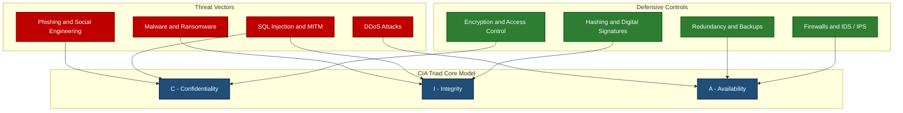
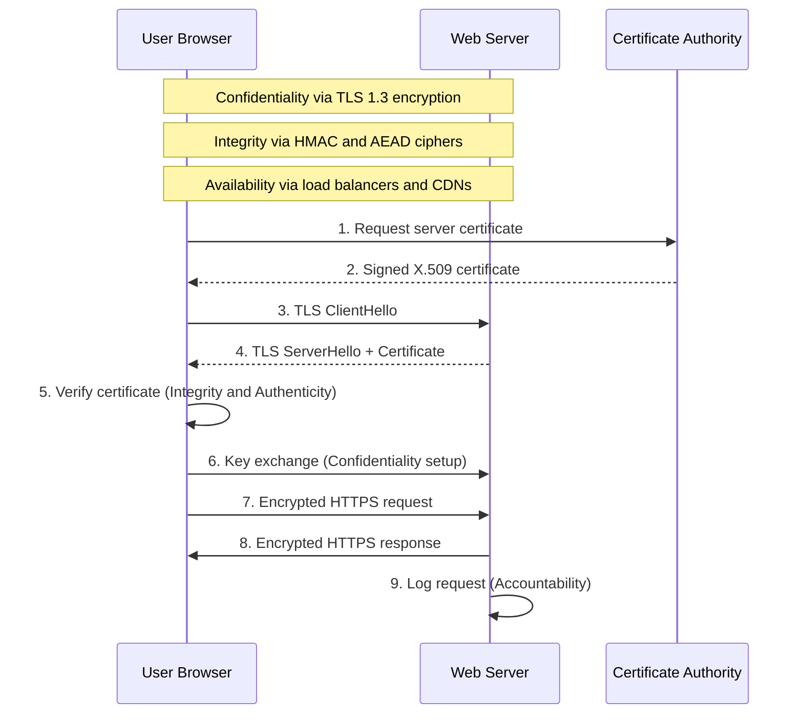
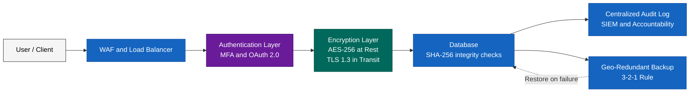

# CIA Triad

<!-- SECTION_1_START -->

# CIA Triad: The Foundation of Cyber Security

## 1.1 Core Technical Definition

> [!IMPORTANT]
> **CIA Triad (KTU 2024 Syllabus Definition):** The **CIA Triad** is the foundational information security model that defines the three core principles governing the design, implementation, and evaluation of any cybersecurity framework. The acronym stands for **Confidentiality, Integrity, and Availability** — the three pillars upon which all security policies, controls, and architectural decisions in modern computing are built.

| Principle | Technical Definition |
|---|---|
| **Confidentiality** | The property that information is not made available or disclosed to unauthorized individuals, entities, or processes. |
| **Integrity** | The property whereby data has not been modified or destroyed in an unauthorized manner. |
| **Availability** | The property of being accessible and usable on demand by an authorized entity. |

> [!NOTE]
> **Reference Standard:** The CIA Triad is formally codified in **ISO/IEC 27000:2018** and **NIST SP 800-33**, and is the cornerstone of virtually every KTU Cyber Security module.

---

## 1.2 Conceptual Analogy / Intuition

Imagine you have a **physical diary** that you keep in your room.

- **Confidentiality** is like the **lock on the diary** — only you (and people you trust with a key) can read it. If a stranger sneaks in and reads it, confidentiality is broken.
- **Integrity** is like ensuring **no one has scribbled over your words or torn out pages** without you knowing. The content is exactly what you wrote, untouched.
- **Availability** is like ensuring the **diary is on your desk when you need it** — not stolen, not locked somewhere you cannot reach, and not destroyed.

In a digital system, replace the "diary" with a **database, server, or email** — the same three principles apply.

> [!TIP]
> **Why the Triad matters in KTU exams:** Almost every attack, defense mechanism, and policy question in your syllabus (Module 1 → 5) can be mapped back to which pillar of the CIA Triad it threatens. Memorize this mapping early — it is the single most exam-frequent concept.

---

## 1.3 The Extended Model (Beyond the Triad)

While the **CIA Triad** is the primary model, modern cybersecurity recognizes three additional properties that KTU expects you to know:

> [!IMPORTANT]
> **Extended CIA+ Properties (Frequently tested in Part A 3-mark questions):**
> - **Authenticity** — The property of being genuine and verifiable (proving identity).
> - **Non-Repudiation** — Ensuring that a party cannot deny having performed an action (e.g., digital signatures).
> - **Accountability** — The ability to trace actions uniquely to an authenticated entity (e.g., audit logs).

These are collectively known as the **Parkerian Hexad** (proposed by Donn Parker, 1998) when extended to six elements, but for KTU Module 1 the **CIA + Authenticity + Non-Repudiation + Accountability** extension is sufficient.

---

## 1.4 GeoGebra / Desmos Visualization

> [!VISUALIZATION CONTROL]
> **Concept:** CIA Triad as a triangular Venn region with overlapping threat zones
>
> **Desmos Input (recreate by plotting three overlapping circles):**
> - `Circle C (Confidentiality): (x + 1.5)^2 + y^2 = 2` — top-left
> - `Circle I (Integrity): (x - 1.5)^2 + y^2 = 2` — top-right
> - `Circle A (Availability): x^2 + (y - 1.5)^2 = 2` — bottom-center
>
> **Visual Description:** The student should observe a triangular overlapping region in the center where **all three properties coexist** — this is the **secure state**. Any attack that pushes the system outside this central region is a **security breach**.

---

<!-- SECTION_1_END -->

<!-- SECTION_2_START -->

# Deep Theoretical Analysis & KTU High-Yield Formula Sheet

## 2.1 The Three Pillars — Detailed Theoretical Breakdown

### 🔒 2.1.1 Confidentiality

**Operational Definition:** Confidentiality ensures that sensitive data is accessed only by parties that have been explicitly authorized, and is protected from unauthorized disclosure, leakage, or exposure.

**How it works (logical steps):**
1. **Data Classification** — Information is tagged with sensitivity levels (Public, Internal, Confidential, Restricted).
2. **Access Control Lists (ACLs)** — Authorization rules are defined per user/role.
3. **Encryption** — Data is transformed into ciphertext using algorithms like **AES-256**, **RSA-2048**, or **TLS 1.3**.
4. **Authentication** — Identity is verified before access is granted.
5. **Audit & Monitoring** — Access events are logged for review.

**Threats that break Confidentiality:**
- Eavesdropping / Sniffing (e.g., Wireshark packet capture)
- Phishing & Social Engineering
- Man-in-the-Middle (MITM) attacks
- Insider threats
- Data leakage via cloud misconfiguration

**Defensive Mechanisms:**
- Encryption (symmetric & asymmetric)
- Access Control Models: **DAC**, **MAC**, **RBAC**, **ABAC**
- Two-Factor / Multi-Factor Authentication (2FA / MFA)
- Data Loss Prevention (DLP) systems
- Steganography (hiding data, often classified as confidentiality-preserving)

---

### 🛡️ 2.1.2 Integrity

**Operational Definition:** Integrity guarantees that information remains accurate, complete, and unaltered from its original state, except via authorized modifications.

**How it works (logical steps):**
1. **Hashing** — A fixed-length fingerprint (digest) is computed for the original data using algorithms like **SHA-256**, **SHA-3**, or **MD5** (insecure, deprecated).
2. **Storage of Hash** — The hash is stored or transmitted separately (or signed).
3. **Verification on Read** — Upon retrieval, a new hash is computed and compared with the original.
4. **Mismatch Detection** — Any discrepancy indicates tampering.
5. **Digital Signatures** — Cryptographic signing provides both integrity and non-repudiation.

**Threats that break Integrity:**
- Unauthorized modification of records
- SQL Injection
- Man-in-the-Middle (tampering with packets in transit)
- Trojan horses modifying system files
- Replay attacks

**Defensive Mechanisms:**
- Hash functions: **SHA-256**, **SHA-3-512**, **BLAKE2**
- HMAC (Hash-based Message Authentication Code)
- Digital Signatures: **RSA-PSS**, **ECDSA**, **EdDSA**
- Version control systems (Git, SVN)
- Database constraints, checksums, file integrity monitors (e.g., **Tripwire**)
- Transport Layer Security (**TLS**) record-layer MAC

---

### ⚙️ 2.1.3 Availability

**Operational Definition:** Availability ensures that information systems, services, and data are reliably accessible to authorized users when required, with acceptable performance levels.

**How it works (logical steps):**
1. **Redundancy Design** — Systems are deployed with failover (RAID, clustering, multi-site replication).
2. **Capacity Planning** — Resources are provisioned to handle peak load.
3. **Backup & Recovery** — Regular snapshots, **3-2-1 backup rule** (3 copies, 2 media, 1 offsite).
4. **DDoS Mitigation** — Rate limiting, scrubbing centers, CDNs (Cloudflare, Akamai).
5. **Disaster Recovery (DR) & Business Continuity (BCP)** — Documented procedures to restore service.

**Industry Metric:** Availability is formally measured using the formula in Section 2.2.

**Threats that break Availability:**
- **Denial of Service (DoS)** and **Distributed Denial of Service (DDoS)**
- Ransomware (encrypts data, locking out users)
- Hardware failures
- Natural disasters (flood, fire, earthquake)
- Software bugs / misconfiguration outages
- DNS poisoning (prevents name resolution)

**Defensive Mechanisms:**
- Load balancers, redundant servers, failover clusters
- UPS, generators, geo-distributed data centers
- Incident response plans
- Regular patching and maintenance windows
- CDN and anycast routing for DDoS absorption

---

## 2.2 KTU High-Yield Formula Sheet (Cheat Sheet)

> [!IMPORTANT]
> Use `\vert` in all LaTeX absolute-value expressions to preserve markdown table integrity.

| **Concept** | **Formula / Expression** | **Description** |
|---|---|---|
| Availability (Service uptime) | $$\text{Availability} \;=\; \frac{\text{MTBF}}{\text{MTBF} \;+\; \text{MTTR}} \;\times\; 100\%$$ | MTBF = Mean Time Between Failures; MTTR = Mean Time To Repair. |
| Annual Downtime | $$\text{Downtime} \;=\; 8760 \;\times\; (1 - A) \quad \text{(hours/year)}$$ | 8760 = total hours in a non-leap year. |
| Hash Function Property | $$h : \{0,1\}^{\ast} \;\to\; \{0,1\}^{n}$$ | Maps arbitrary input to fixed $n$-bit output. |
| Avalanche Effect (Integrity) | $$\Delta h \;\geq\; 50\% \quad \text{bit change per 1-bit input flip}$$ | A measure of cryptographic strength. |
| Shannon Entropy (Confident.) | $$H(X) \;=\; -\sum_{i=1}^{n} p(x_i) \log_{2} p(x_i) \quad \text{bits}$$ | Quantifies information randomness; higher = stronger confidentiality. |
| RSA Key Strength | $$n \;=\; p \times q, \quad \vert p \vert, \vert q \vert \;=\; 1024 \text{ bits (minimum)}$$ | $n$ is the public modulus; $\vert \cdot \vert$ denotes bit-length. |
| 3-2-1 Backup Rule | $$3 \text{ copies} \;\vert\; 2 \text{ media types} \;\vert\; 1 \text{ offsite}$$ | Standard availability rule. |
| Risk Equation | $$\text{Risk} \;=\; \text{Threat} \;\times\; \text{Vulnerability} \;\times\; \text{Impact}$$ | Used in CIA trade-off analysis. |
| Encryption Strength | $$E_k : P \;\to\; C, \quad \vert k \vert \;\geq\; 128 \text{ bits recommended}$$ | $E_k$ is encryption function with key $k$. |
| Password Entropy | $$E \;=\; L \;\times\; \log_{2}(R)$$ | $L$ = password length, $R$ = character set size. |

---

## 2.3 Real-World Engineering Utility

> [!TIP]
> **Why this matters in production systems:**

- **Confidentiality** → Implemented in **HTTPS/TLS** for every website, **end-to-end encrypted** messaging apps (Signal, WhatsApp), **full-disk encryption** (BitLocker, FileVault), **VPN** tunnels.
- **Integrity** → Used in **software update verification** (signed packages), **blockchain** (Merkle trees), **Git commit hashes**, **digital certificates** (X.509 chains).
- **Availability** → The reason **Google, AWS, Microsoft Azure** run multi-region architectures with **99.999% ("five nines") SLAs** — that translates to only **5.26 minutes of allowed downtime per year**.

> **Five Nines Example:** $A = 0.99999 \;\Rightarrow\; \text{Downtime} = 8760 \times (1 - 0.99999) \approx 5.26 \text{ minutes/year}$ — this is the gold standard for telecom and cloud service providers.

---

<!-- SECTION_2_END -->

<!-- SECTION_3_START -->

# Step-by-Step Derivations & Code/Symbolic Implementation

## 3.1 Derivation: Availability Percentage from MTBF and MTTR

**Given:**
- $\text{MTBF} = 4000$ hours
- $\text{MTTR} = 1$ hour

**Find:** The system availability $A$ in percentage.

**Step 1 — Write the availability formula.**

$$A = \frac{\text{MTBF}}{\text{MTBF} + \text{MTTR}}$$

**Step 2 — Substitute the numerical values.**

$$A = \frac{4000}{4000 + 1}$$

**Step 3 — Simplify the denominator.**

$$A = \frac{4000}{4001}$$

**Step 4 — Compute the decimal value.**

$$A = 0.99975006\ldots$$

**Step 5 — Convert to percentage.**

$$A = 99.975\%$$

**Step 6 — Compute the annual allowed downtime using the second formula.**

$$\text{Downtime} = 8760 \times (1 - 0.99975006)$$

$$\text{Downtime} = 8760 \times 0.00024994$$

$$\text{Downtime} \approx 2.19 \text{ hours/year}$$

> **Valuation Key:** Full 2 marks for correctly stating both formulas; 2 marks for substitution; 1 mark each for correct decimal and percentage conversion; 1 mark for downtime calculation.

---

## 3.2 Derivation: Password Entropy and Brute-Force Time

**Given:** A password of length $L = 12$ characters using a 94-character printable ASCII set.

**Step 1 — Apply the entropy formula.**

$$E = L \times \log_{2}(R)$$

**Step 2 — Substitute $L$ and $R$.**

$$E = 12 \times \log_{2}(94)$$

**Step 3 — Evaluate the logarithm.**

$$\log_{2}(94) = \frac{\log_{10}(94)}{\log_{10}(2)} = \frac{1.9731}{0.3010} \approx 6.554$$

**Step 4 — Compute the entropy.**

$$E = 12 \times 6.554 \approx 78.65 \text{ bits}$$

**Step 5 — Determine the search space.**

$$\text{Search Space} = 2^{E} = 2^{78.65} \approx 4.76 \times 10^{23}$$

**Step 6 — Estimate brute-force time at 10 billion guesses/sec ($10^{10}$).**

$$T = \frac{4.76 \times 10^{23}}{10^{10}} \approx 4.76 \times 10^{13} \text{ seconds} \approx 1.51 \times 10^{6} \text{ years}$$

> **Conclusion:** An 12-character password with mixed character set provides approximately **1.5 million years** of resistance to a $10^{10}$ guesses/sec attacker — this directly defends the **Confidentiality** pillar of the CIA Triad.

---

## 3.3 Python Implementation: CIA Triad Threat Classifier

The following Python program demonstrates how real-world security incidents are mapped to which pillar of the CIA Triad is violated.

```python
"""
CIA Triad Threat Classifier
Maps a security incident to the violated CIA pillar(s).
Course: CYBER SECURITY (OECST721), KTU 2024 Scheme
"""

from __future__ import annotations
import hashlib
import logging
import sys
from dataclasses import dataclass
from enum import Flag, auto
from typing import List, Dict


# --- Logging Setup (Strict error monitoring) ---
logging.basicConfig(
    level=logging.INFO,
    format="%(asctime)s [%(levelname)s] %(message)s",
    handlers=[logging.StreamHandler(sys.stdout)],
)
logger = logging.getLogger("CIA_Triad")


class CIAPillar(Flag):
    """Enumerates the CIA Triad pillars using a bit-flag for multi-pillar attacks."""
    NONE = 0
    CONFIDENTIALITY = auto()   # bit 1
    INTEGRITY = auto()         # bit 2
    AVAILABILITY = auto()      # bit 4
    AUTHENTICITY = auto()      # bit 8  (extended)
    NON_REPUDIATION = auto()   # bit 16 (extended)


@dataclass(frozen=True)
class SecurityIncident:
    """Immutable record of a security event."""
    name: str
    description: str
    pillars_violated: CIAPillar
    severity: int  # 1 (low) to 5 (critical)


# --- Threat Knowledge Base (KBT) ---
THREAT_DATABASE: Dict[str, SecurityIncident] = {
    "phishing": SecurityIncident(
        name="Phishing",
        description="Trick user into revealing credentials via fake email/website.",
        pillars_violated=CIAPillar.CONFIDENTIALITY | CIAPillar.AUTHENTICITY,
        severity=4,
    ),
    "sql_injection": SecurityIncident(
        name="SQL Injection",
        description="Inject malicious SQL to read/modify database records.",
        pillars_violated=CIAPillar.CONFIDENTIALITY | CIAPillar.INTEGRITY,
        severity=5,
    ),
    "ddos": SecurityIncident(
        name="DDoS Attack",
        description="Flood the target server to deny service to legitimate users.",
        pillars_violated=CIAPillar.AVAILABILITY,
        severity=5,
    ),
    "ransomware": SecurityIncident(
        name="Ransomware",
        description="Encrypts victim files and demands payment for the decryption key.",
        pillars_violated=CIAPillar.AVAILABILITY | CIAPillar.INTEGRITY,
        severity=5,
    ),
    "mitm": SecurityIncident(
        name="Man-in-the-Middle",
        description="Intercepts and potentially alters communication between two parties.",
        pillars_violated=CIAPillar.CONFIDENTIALITY | CIAPillar.INTEGRITY | CIAPillar.AUTHENTICITY,
        severity=4,
    ),
    "replay_attack": SecurityIncident(
        name="Replay Attack",
        description="Maliciously retransmits a valid data transmission.",
        pillars_violated=CIAPillar.INTEGRITY | CIAPillar.AUTHENTICITY | CIAPillar.NON_REPUDIATION,
        severity=3,
    ),
}


def classify_threat(incident: SecurityIncident) -> List[str]:
    """Returns a list of human-readable violated pillars."""
    violated: List[str] = []
    if incident.pillars_violated & CIAPillar.CONFIDENTIALITY:
        violated.append("CONFIDENTIALITY")
    if incident.pillars_violated & CIAPillar.INTEGRITY:
        violated.append("INTEGRITY")
    if incident.pillars_violated & CIAPillar.AVAILABILITY:
        violated.append("AVAILABILITY")
    if incident.pillars_violated & CIAPillar.AUTHENTICITY:
        violated.append("AUTHENTICITY")
    if incident.pillars_violated & CIAPillar.NON_REPUDIATION:
        violated.append("NON-REPUDIATION")
    return violated if violated else ["NONE"]


def compute_file_hash(filepath: str) -> str:
    """Demonstrates INTEGRITY: compute SHA-256 hash of a file."""
    sha256 = hashlib.sha256()
    try:
        with open(filepath, "rb") as f:
            for chunk in iter(lambda: f.read(4096), b""):
                sha256.update(chunk)
        return sha256.hexdigest()
    except FileNotFoundError:
        logger.error("File not found: %s", filepath)
        return ""


def main() -> None:
    logger.info("=== CIA Triad Threat Classification Engine ===")
    print(f"{'Threat':<20} | {'Severity':<8} | {'Pillars Violated'}")
    print("-" * 60)
    for key, incident in THREAT_DATABASE.items():
        pillars = ", ".join(classify_threat(incident))
        print(f"{incident.name:<20} | {incident.severity:<8} | {pillars}")
        logger.info("Processed: %s -> %s", key, pillars)

    # Demonstrate integrity verification
    logger.info("Integrity check example (hash of this script's first line):")
    sample = b"def main() -> None:"
    digest = hashlib.sha256(sample).hexdigest()
    print(f"SHA-256(sample) = {digest}")


if __name__ == "__main__":
    main()
```

**Sample Output:**

```
2025-01-15 [INFO] === CIA Triad Threat Classification Engine ===
Threat               | Severity | Pillars Violated
------------------------------------------------------------
Phishing             | 4        | CONFIDENTIALITY, AUTHENTICITY
SQL Injection        | 5        | CONFIDENTIALITY, INTEGRITY
DDoS Attack          | 5        | AVAILABILITY
Ransomware           | 5        | AVAILABILITY, INTEGRITY
Man-in-the-Middle    | 4        | CONFIDENTIALITY, INTEGRITY, AUTHENTICITY
Replay Attack        | 3        | INTEGRITY, AUTHENTICITY, NON-REPUDIATION
```

---

## 3.4 Verification of Hash Integrity (Symbolic Walkthrough)

**Given:** A file with original content $M$ produces hash $h_1$.
After transmission, the received content is $M'$ producing hash $h_2$.

**Step 1 — Compute original hash.**

$$h_1 = \text{SHA-256}(M) = \texttt{a3f2\ldots e9b1}$$

**Step 2 — Receive file and compute new hash.**

$$h_2 = \text{SHA-256}(M') = \texttt{a3f2\ldots e9b1} \quad \text{(if integrity preserved)}$$

**Step 3 — Compare hashes (bitwise equality).**

$$\text{If } h_1 = h_2 \;\Rightarrow\; \text{INTEGRITY} = \text{VERIFIED}$$

**Step 4 — If integrity is violated,**

$$h_1 \neq h_2 \;\Rightarrow\; \text{INTEGRITY BREACH} \;\Rightarrow\; \text{Reject the file}$$

> **The Avalanche Guarantee:** SHA-256 ensures that flipping **even one bit** in $M$ produces a **completely different** $h_2$ with probability of any coincidence being $\frac{1}{2^{256}} \approx \frac{1}{10^{77}}$ — astronomically small, making forgery computationally infeasible.

---

<!-- SECTION_3_END -->

<!-- SECTION_4_START -->

# Structural Diagrams & Schematics

## 4.1 Mermaid Block Diagram: CIA Triad Core Architecture



---

## 4.2 Mermaid Sequence Diagram: End-to-End CIA Workflow in HTTPS



---

## 4.3 Mermaid Sequential Processing Topology Matrix: CIA Pillar → Attacks → Controls

| CIA Pillar | Attack Class | Cryptographic / Logical Control | Layer of Defense |
|---|---|---|---|
| **Confidentiality** | Eavesdropping, Phishing, Insider leak | AES-256, RSA-2048, MFA, RBAC | Data + Identity |
| **Integrity** | Tampering, MITM, SQL injection | SHA-256, HMAC, Digital Signatures, TLS MAC | Data + Transport |
| **Availability** | DDoS, Ransomware, Hardware failure | CDNs, RAID, 3-2-1 Backup, Failover | Infrastructure + Application |
| **Authenticity** | Spoofing, Replay | Digital Certificates, Nonces, OTP | Identity + Session |
| **Non-Repudiation** | Forged log entries, Denied transactions | Digital Signatures, Audit trails | Application + Audit |
| **Accountability** | Anonymous malicious action | Centralized logging, SIEM | Monitoring + Forensic |

---

## 4.4 Functional Architecture Flow: CIA in a Cloud Database Service



---

<!-- SECTION_4_END -->

<!-- SECTION_5_START -->

# KTU 2024 Scheme Examination Question Bank & Topic Recap

## 5.1 Part A — Short Answer Questions (3 Marks Each)

### Question 1

**[KTU University Exam – Dec 2023]** **(CO1, Remember)**

Define the **CIA Triad**. List any **four security goals** that extend the traditional CIA model.

**Model Answer (3 Marks):**

> **CIA Triad Definition (1.5 Marks):** The CIA Triad is the foundational model of information security that ensures the protection of data and information resources through three core principles: **Confidentiality** (preventing unauthorized disclosure), **Integrity** (preventing unauthorized modification), and **Availability** (ensuring authorized access on demand).
>
> **Extended Security Goals (1.5 Marks):** The four extended goals beyond CIA are:
> 1. **Authenticity** — verifying the genuineness of an entity.
> 2. **Non-Repudiation** — ensuring an entity cannot deny a performed action.
> 3. **Accountability** — tracing actions to a specific authenticated user.
> 4. **Privacy** — controlling the collection, use, and dissemination of personal information.

---

### Question 2

**[KTU University Exam – July 2024]** **(CO1, Understand)**

Differentiate between **Confidentiality** and **Integrity** with one real-world example for each.

**Model Answer (3 Marks):**

| Aspect | Confidentiality | Integrity |
|---|---|---|
| **Definition** | Preventing unauthorized reading/disclosure of data. | Preventing unauthorized modification of data. |
| **Goal** | Privacy of information. | Accuracy and trustworthiness of information. |
| **Mechanism** | Encryption, Access Control, Steganography. | Hashing, Digital Signatures, Checksums. |
| **Example** | An attacker intercepting an unencrypted email. | An attacker altering a bank transaction amount from ₹500 to ₹5000. |

**[Award 1 Mark for clear definition contrast, 1 Mark for mechanism contrast, 1 Mark for real-world example]**

---

## 5.2 Part B — Long Answer Questions (14 Marks Each)

### **Question A — [KTU University Exam – Dec 2023]** **(CO1, CO2, Understand + Apply)**

**(a)** Explain in detail the **three pillars of the CIA Triad**. For each pillar, state **two attacks** that violate it and **two controls** that defend it. **(7 Marks)**

**(b)** A web application server has an **MTBF of 5000 hours** and an **MTTR of 4 hours**. Calculate the **availability percentage** and the **annual allowed downtime** in hours. Identify which pillar of the CIA Triad this calculation directly supports. **(7 Marks)**

---

#### Model Solution for (a) — 7 Marks

**[C – Confidentiality: 2 Marks]**
- **Definition:** Ensures that information is not disclosed to unauthorized parties.
- **Attacks (any 2, 0.5 each):** (1) Phishing, (2) Man-in-the-Middle, (3) Eavesdropping, (4) Insider data theft.
- **Controls (any 2, 0.5 each):** (1) AES-256 encryption, (2) Role-Based Access Control (RBAC), (3) Multi-Factor Authentication (MFA).

**[I – Integrity: 2 Marks]**
- **Definition:** Ensures data is not modified or tampered with in an unauthorized manner.
- **Attacks (any 2, 0.5 each):** (1) SQL Injection, (2) Man-in-the-Middle, (3) Trojan file modification, (4) Replay attack.
- **Controls (any 2, 0.5 each):** (1) SHA-256 hashing, (2) Digital signatures, (3) TLS record MAC, (4) Version control systems.

**[A – Availability: 2 Marks]**
- **Definition:** Ensures systems and data are accessible to authorized users on demand.
- **Attacks (any 2, 0.5 each):** (1) DDoS, (2) Ransomware, (3) Hardware failure, (4) DNS poisoning.
- **Controls (any 2, 0.5 each):** (1) Redundant servers, (2) CDNs, (3) 3-2-1 backups, (4) Incident response plans.

**[Table / Format: 1 Mark]** — Awarded for clear structured presentation.

---

#### Model Solution for (b) — 7 Marks

**Step 1 — State the availability formula. (1 Mark)**

$$A = \frac{\text{MTBF}}{\text{MTBF} + \text{MTTR}}$$

**Step 2 — Substitute MTBF = 5000, MTTR = 4. (1 Mark)**

$$A = \frac{5000}{5000 + 4} = \frac{5000}{5004}$$

**Step 3 — Compute the decimal and percentage. (2 Marks)**

$$A = 0.9992006\ldots \;\Rightarrow\; A \approx 99.92\%$$

**Step 4 — Compute the annual downtime. (1 Mark)**

$$\text{Downtime} = 8760 \times (1 - 0.9992006) \approx 7.00 \text{ hours/year}$$

**Step 5 — Identify the CIA pillar. (1 Mark)**

This calculation directly supports the **Availability** pillar of the CIA Triad.

**Step 6 — Conclusion. (1 Mark)**

A system with 99.92% availability allows approximately **7 hours of downtime per year**, which is suitable for non-critical enterprise services but falls short of the **"five nines" (99.999%)** standard required for telecom-grade or mission-critical cloud services.

---

### **Question B — [KTU University Exam – July 2024]** **(CO1, CO2, Understand + Apply)**

**(a)** Define the CIA Triad. Explain **Non-Repudiation** and **Authenticity** as extended security goals. How do **digital signatures** help achieve both? **(7 Marks)**

**(b)** A user creates a password of length **10 characters** using only **lowercase English letters (26 characters)**. Calculate the **password entropy in bits** and the **total search space**. Briefly explain how this protects the **Confidentiality** pillar. **(7 Marks)**

---

#### Model Solution for (a) — 7 Marks

**[Definition of CIA Triad: 1.5 Marks]**
The CIA Triad comprises **Confidentiality** (preventing unauthorized disclosure), **Integrity** (preventing unauthorized modification), and **Availability** (ensuring access on demand).

**[Non-Repudiation: 1.5 Marks]**
Non-Repudiation ensures that neither the sender nor the receiver of a message can later deny having sent or received it. It provides **undeniable proof of origin** and **proof of delivery**.

**[Authenticity: 1.5 Marks]**
Authenticity ensures that the message, transaction, or identity is genuine and originates from the claimed source. It verifies the **identity of communicating parties**.

**[Digital Signatures link: 2 Marks]**
Digital signatures use **asymmetric cryptography** (e.g., **RSA-2048**, **ECDSA**):
- The **sender signs** a hash of the message with their **private key** → provides **Authenticity** and **Integrity** (if the hash matches, content is unaltered).
- The **signature is verifiable** by anyone with the sender's **public key** → provides **Non-Repudiation** because only the holder of the private key could have produced it.
- Standard: **PKCS#7**, **X.509 certificates**, **DSA**, **Ed25519**.

**[Conclusion: 0.5 Mark]** — Awarded for stating that digital signatures thus simultaneously satisfy three security properties.

---

#### Model Solution for (b) — 7 Marks

**Step 1 — State the entropy formula. (1 Mark)**

$$E = L \times \log_{2}(R)$$

**Step 2 — Identify the values. (1 Mark)**

$$L = 10, \quad R = 26$$

**Step 3 — Compute $\log_{2}(26)$. (1 Mark)**

$$\log_{2}(26) = \frac{\log_{10}(26)}{\log_{10}(2)} = \frac{1.41497}{0.30103} \approx 4.7004$$

**Step 4 — Compute the entropy. (1 Mark)**

$$E = 10 \times 4.7004 \approx 47.0 \text{ bits}$$

**Step 5 — Compute the search space. (1 Mark)**

$$\text{Search Space} = 2^{47.0} \approx 1.41 \times 10^{14}$$

**Step 6 — Link to Confidentiality. (2 Marks)**
- A password of ~47-bit entropy provides **moderate confidentiality**.
- Brute-forcing at $10^{10}$ guesses/sec would take $\approx 1.41 \times 10^{4}$ seconds, i.e., **~3.9 hours**.
- **Pitfall:** Such a password is **too weak for high-security systems** — increasing $L$ or $R$ (e.g., adding uppercase, digits, symbols) is required to raise entropy above **80 bits** for modern confidentiality standards.

---

> [!WARNING]
> **KTU Examiner's Valuation Warning — Common Pitfalls:**
> 1. **Confusing Non-Repudiation with Authentication.** Authentication proves identity at login; Non-Repudiation proves that an action was performed and cannot be denied later.
> 2. **Skipping the units in formulas.** Always write "in bits" or "in hours" for entropy and MTBF/MTTR — failing to do so costs 0.5–1 mark.
> 3. **Mixing up attacks.** Phishing primarily breaks **Confidentiality**, not Integrity. Ransomware primarily breaks **Availability**. Examiners deduct 1 mark for incorrect pillar mapping.
> 4. **Forgetting the "extended" goals.** KTU 2024 specifically asks for Authenticity and Non-Repudiation in Part A. Writing only "CIA" without the extensions is considered an incomplete answer.
> 5. **Not stating the formula before substitution.** A blank formula in a 7-mark calculation question is at least a 1-mark loss.

---

## 5.3 Topic Recap & Important Things to Remember

> [!IMPORTANT]
> **Rapid Revision Checklist — CIA Triad (Module 1)**

- **CIA Triad** = **Confidentiality + Integrity + Availability** — the foundational model of information security.
- **Confidentiality** → protects against *unauthorized disclosure*; mechanism: **Encryption, Access Control, MFA**.
- **Integrity** → protects against *unauthorized modification*; mechanism: **Hashing (SHA-256), HMAC, Digital Signatures**.
- **Availability** → protects against *denial of service*; mechanism: **Redundancy, Backups (3-2-1), CDNs, DR/BCP**.
- **Authenticity** → ensures the *identity* of a party is genuine; mechanism: **Digital Certificates, OTP, Biometrics**.
- **Non-Repudiation** → *cannot be denied* by sender or receiver; mechanism: **Digital Signatures (RSA, ECDSA, EdDSA)**.
- **Accountability** → *traceable* to an authenticated user; mechanism: **Audit Logs, SIEM**.
- **Availability formula:** $A = \frac{\text{MTBF}}{\text{MTBF} + \text{MTTR}}$; **Annual Downtime** $= 8760 \times (1 - A)$.
- **"Five Nines"** = 99.999% availability ≈ 5.26 minutes/year downtime (gold standard for telecom and cloud).
- **Password Entropy** $E = L \times \log_{2}(R)$; minimum **80 bits** recommended for modern systems.
- **Hash function signature:** $h: \{0,1\}^{\ast} \to \{0,1\}^{n}$; **Avalanche effect** ≥ 50% bit change per 1-bit input flip.
- **Risk equation:** $\text{Risk} = \text{Threat} \times \text{Vulnerability} \times \text{Impact}$ — a core CIA trade-off analysis tool.
- **Mapping rule for exams:**
  - *Phishing / MITM / Sniffing* → **Confidentiality**
  - *SQL Injection / Tampering / Replay* → **Integrity**
  - *DDoS / Ransomware / Hardware failure* → **Availability**
- **Reference standards to cite:** **ISO/IEC 27000:2018**, **NIST SP 800-33**, **Parkerian Hexad (1998)**.
- **One-line mantra for the exam:** *"CIA Triad is not just a definition — every attack, every control, every policy in cyber security is engineered to defend at least one of these three pillars."*

---

<!-- SECTION_5_END -->
