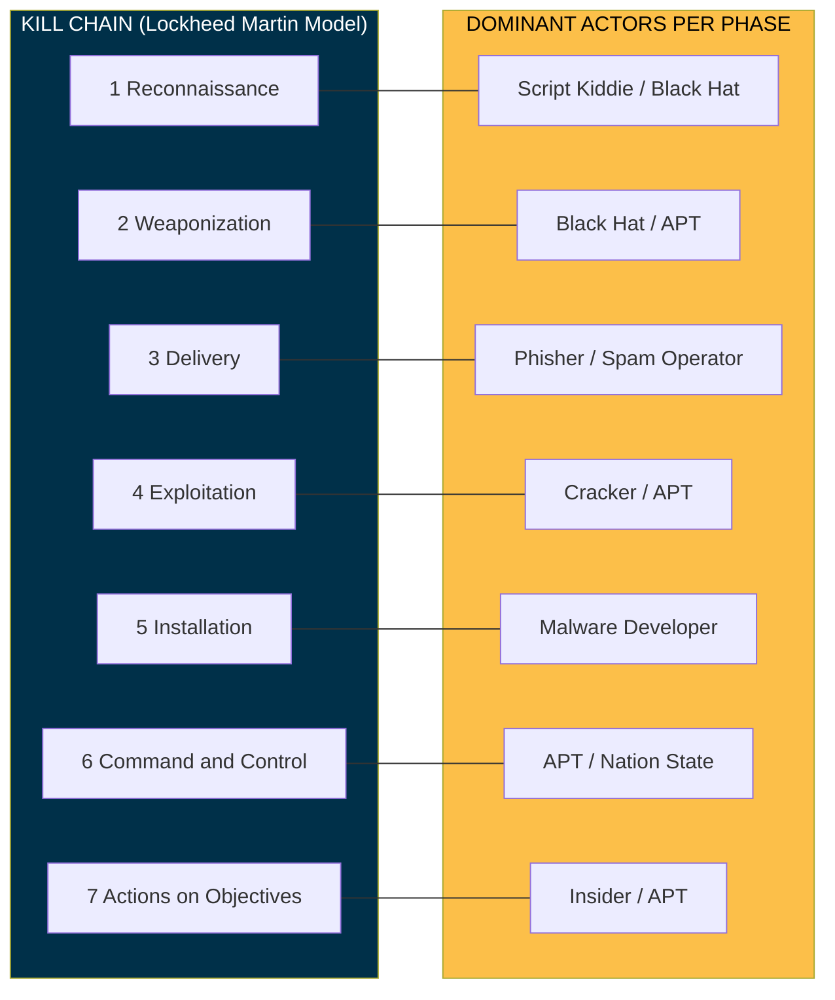
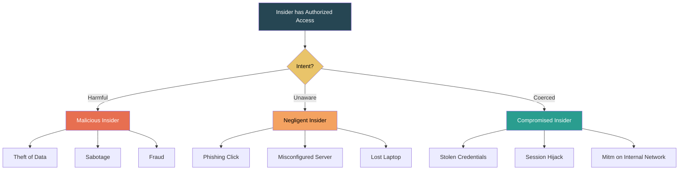

# Computer Criminals

<!-- SECTION_1_START -->
# Module 1 — Introduction to Cyber Security
## Topic: Computer Criminals

### 1.1 Formal Definition (KTU 2024 Syllabus Terminology)

A **Computer Criminal** (also termed a *cyber-criminal* or *malicious actor*) is any individual, group, or organization that deliberately and unlawfully accesses, manipulates, intercepts, damages, or destroys digital information, computer systems, networks, or the data residing within them, with the intent to cause financial loss, reputational damage, unauthorized data exposure, or operational disruption.

> [!IMPORTANT]
> **KTU 2024 — Module 1 Core Definition**
> Computer criminals are broadly classified by **three orthogonal axes**:
> 1. **Intent** (Malicious vs. Benign / Research)
> 2. **Skill Level** (Novice, Intermediate, Elite, Nation-State)
> 3. **Affiliation** (Lone Actor, Organized Group, State-Sponsored, Insider)

> [!NOTE]
> **Statutory Anchor (Indian Context):** Under the **Information Technology Act, 2000 (Amended 2008)**, Sections **43, 65, 66, 66C, 66D, 66E, 66F** explicitly criminalize unauthorized access, data theft, identity fraud, privacy violation, and cyber terrorism. A computer criminal in India is therefore triable under both **IT Act 2008** and **IPC Sections 420, 463, 477A**.

---

### 1.2 Conceptual Analogy / Intuition

Imagine a **bank vault building** (the computer system):

- The **locksmith** who picks the lock to *prove it is weak* and reports it — is a *White Hat*.
- The **locksmith** who picks the lock and silently **steals money** — is a *Black Hat*.
- The **locksmith** who *sometimes* reports flaws and *sometimes* sells them to the highest bidder — is a *Grey Hat*.
- The **janitor** of the bank who already has a key — is the *Insider Threat* (most dangerous, 60% of breaches per **IBM Cost of a Data Breach Report 2023**).
- The **script kiddie** is a teenager who bought a *"Universal Master Key"* off the dark web and tries every door in town without understanding how it works.

> [!VISUALIZATION CONTROL]
> **Concept:** Threat Actor Skill vs. Intent Quadrant
> **GeoGebra / Desmos Input Equations (parametric scatter zones):**
> * Intent axis (x): $x \in [-1, 1]$ where $-1$ = Malicious, $+1$ = Defensive
> * Skill axis (y): $y \in [0, 10]$
> * Plot actors: `BlackHat = ( -0.9 , 9 )`, `WhiteHat = ( 0.9 , 9 )`, `GreyHat = ( 0 , 7 )`, `ScriptKiddie = ( -0.7 , 2 )`, `Insider = ( -0.5 , 6 )`, `NationState = ( -0.95 , 10 )`
> **Visual Description:** Students will observe that the **lower-left quadrant** (low skill, malicious intent) is the most populated real-world zone, and **insider threats** sit surprisingly *high* on the skill axis despite being *internal*.

---

### 1.3 Categories at a Glance (Syllabus-Required Vocabulary)

| Suffix / Suffix Form | Standard Term | KTU Syllabus Tag |
|---|---|---|
| **Hacker** | Original meaning: curious technologist (no pejorative intent) | **MUST KNOW** |
| **Cracker** | Malicious hacker focused on breaking protections | **MUST KNOW** |
| **Phreaker** | Subverts telephone/PBX systems (pre-cursor to modern hackers) | Recommended |
| **Script Kiddie** | Uses pre-built exploits without understanding them | **MUST KNOW** |
| **Hacktivist** | Ideologically motivated (e.g., Anonymous) | **MUST KNOW** |
| **Cyber Terrorist** | Politically motivated large-scale disruption | **MUST KNOW** |
| **Insider Threat** | Authorized user who abuses privileges | **MUST KNOW** |
| **State-Sponsored APT** | Nation-state Advanced Persistent Threat actor | Module 2 link |

> [!NOTE]
> **Standard Industry Metric — 2023 Verizon DBIR:** The **human element** is involved in **74%** of breaches — this is why the *insider* and *social engineering* vectors dominate KTU exam weightage on this topic.

<!-- SECTION_1_END -->

<!-- SECTION_2_START -->
## 2. Deep Theoretical Analysis & KTU High-Yield Formula Sheet

### 2.1 The Five Archetypes of Computer Criminals (Anatomy)

#### 2.1.1 **Hackers (Sub-classified by Hat Color)**
- **White Hat (Ethical Hacker):** Authorized penetration tester; works under *Rules of Engagement (RoE)* and a signed *Non-Disclosure Agreement (NDA)*. Industries: Banking, Defense, E-Commerce. Certifications: **CEH, OSCP, CISSP**.
- **Black Hat (Cracker):** Operates *without* authorization; intent is theft, sabotage, or extortion. Examples: *APT28 (Fancy Bear)*, *Lazarus Group*.
- **Grey Hat:** Crosses legal lines but without *malicious* intent — e.g., defaces a website and then emails the owner the fix. Legally still a **criminal** under IT Act §66.
- **Blue Hat:** External security professional invited by Microsoft / organizations to bug-test a product *pre-release*.
- **Red Hat:** Aggressive vigilante who attacks Black Hat infrastructure directly. (Largely fictional archetype, but frequently asked in KTU multiple-choice.)
- **Green Hat:** Novice enthusiast actively learning offensive security; the *"apprentice"*.

#### 2.1.2 **Script Kiddies**
- **Definition:** Non-technical attackers who download, purchase, or copy ready-made exploit kits (e.g., **LOIC, Mirai botnet source, Metasploit modules**) and deploy them without understanding the underlying vulnerability.
- **Why it matters:** Although low-skill, they account for a **disproportionate share of mass-scan attacks** (per **Akamai 2023 State of the Internet**). They are the *volume layer* of the threat landscape.

#### 2.1.3 **Hacktivists**
- **Definition:** Politically, socially, or ideologically motivated actors. Their weapon is **publicity**, not data theft.
- **Tactics:** Website defacement, **DDoS (Distributed Denial-of-Service)**, doxxing, data leaks for symbolic effect.
- **Iconic Group:** *Anonymous* — operations like **#OpPayback**, **#OpIsrael**.
- **KTU Exam Hook:** "Distinguish between cyber terrorism and hacktivism" — answer hinges on **scale, target, and intent of fear**.

#### 2.1.4 **Cyber Terrorists**
- **Definition:** Actors using cyberspace to **coerce a government or civilian population** to advance a political/religious objective. Legally codified in **IT Act §66F (India)** and **18 U.S.C. §2331 (USA)**.
- **Distinguishing Criteria:**
  1. **Mass-impact** target (power grids, hospitals, water treatment).
  2. **Symbolic date** (anniversary, election day).
  3. **Ideological manifesto** released post-attack.

#### 2.1.5 **Insider Threats**
- **Definition:** Current or former employees, contractors, or partners who misuse their **legitimate access**.
- **Sub-classification (per CERT Insider Threat Center):**
  * **Malicious Insider** — intentional harm for personal/financial gain.
  * **Negligent Insider** — careless handling of credentials (the *phishing clicker*).
  * **Compromised Insider** — credentials stolen by an external actor (a *mole*).
- **Why the most damaging?** They bypass **perimeter defenses** because their traffic is *authorized*. Detection requires **UEBA (User & Entity Behavior Analytics)**.

### 2.2 Motivations Matrix — KTU High-Yield Table

> [!NOTE]
> This is the **single most-asked concept** on "Computer Criminals" in KTU ESE. Memorize the **6 motivations** in order of exam frequency.

| # | Motivation | Typical Actor | Example Case |
|---|---|---|---|
| 1 | **Financial Gain** | Organized cybercrime, Black Hat | *Carbanak Group — \$1B bank heist (2013–2018)* |
| 2 | **Espionage (State / Industrial)** | APT, Nation-State | *SolarWinds SUNBURST (2020, Russia)* |
| 3 | **Ideology / Politics** | Hacktivist | *Anonymous vs. ISIS (OpISIS)* |
| 4 | **Revenge / Disgruntlement** | Malicious Insider | *Marriott Snooping case (2016)* |
| 5 | **Notoriety / Ego** | Script Kiddie, Black Hat | *MafiaBoy (2000) DDoS of Yahoo, CNN, eBay* |
| 6 | **Curiosity / Learning** | White Hat, Green Hat | *Kevin Mitnick pre-1995 (later reformed)* |

### 2.3 Skill-Stratified Threat Model (Engineering Utility)

For any production SOC (Security Operations Center) team, the **asset-threat model** is built on this stratification:

$$
\text{Threat Score}_{actor} = w_1 \cdot \text{Intent} + w_2 \cdot \text{Skill} + w_3 \cdot \text{Resource} + w_4 \cdot \text{Access}
$$

where the weights $w_1 \dots w_4$ are tuned per industry vertical. This is the basis of the **MITRE ATT\&CK Navigator** and the **FAIR (Factor Analysis of Information Risk)** framework.

> [!IMPORTANT]
> **Why a CS/IT student should care:** When you graduate and build *any* network-connected system — IoT device, banking app, hospital portal — you are implicitly designing *against* the archetypes above. The threat model of a **smart agriculture IoT sensor** is dominated by *Script Kiddies and Hacktivists*; the threat model of a **defense satellite ground station** is dominated by *Nation-State APTs*. **Different criminals demand different defenses.**

### 2.4 KTU Formula / Concept Cheat Sheet (Use `\vert` for | inside math)

| Concept | Canonical Statement | Exam Trigger Words |
|---|---|---|
| **Hacker Origin Term** | Coined at **MIT** (1960s), from the "hack" culture of model-train club | "Define hacker in its *original* sense" |
| **Cracker Distinction** | Cracker = *breaks protections*; Hacker = *understands systems* | "Differentiate between…" |
| **Script Kiddie Tooling** | Relies on **ready-made** exploits; no zero-day capability | "Identify the actor class from the description" |
| **Hacktivism Tactic** | **DDoS + Defacement + Data Leak** for publicity | "Match actor to motive" |
| **Cyber Terrorism Legal Anchor** | IT Act **§66F** in India | "Cite the law" |
| **Insider Threat Sub-types** | **Malicious / Negligent / Compromised** | "Classify the insider case study" |
| **Verizon DBIR Human Element** | **74%** of breaches | "Recall the stat" |
| **Lazarus Group Affiliation** | **DPRK (North Korea)** | "State-sponsored actor" |
| **APT Lifecycle** | Initial Access $\rightarrow$ Foothold $\rightarrow$ Escalation $\rightarrow$ Lateral Movement $\rightarrow$ Exfiltration | "Draw the kill chain" |
| **Ethical Hacker Constraint** | Must have **written authorization (RoE)** before testing | "Why is X not a crime?" |

<!-- SECTION_2_END -->

<!-- SECTION_3_START -->
## 3. Step-by-Step Derivations, Case Walkthroughs & Code Implementation

### 3.1 Case Walkthrough #1 — Classifying a Real Attack Report (Derivation-style Reasoning)

> **Scenario (adapted from a 2023 KTU model-question framing):**
> *"An employee of a fintech startup, two weeks after resigning, exports a customer database to a personal USB drive and posts a sample of 50,000 records on a hacker forum claiming 'the company misuses user data'."*

We classify this actor step-by-step using the framework from Section 2.1:

**Step 1 — Identify the actor's relationship to the target.**
The individual had *prior authorized access* through employment.
Classification Result: **Insider Threat**, sub-type **Malicious Insider** (intent to harm, pre-meditated, uses legitimate access rights).

**Step 2 — Identify the motivation.**
The actor's stated reason is *"the company misuses user data"* — this is an **ideological/political justification**. However, the *mechanism* (selling/leaking data) is a **financial + reputational** attack on the employer.
Classification Result: **Mixed motive — Hacktivism (primary) + Personal Grievance (secondary).**

**Step 3 — Identify the skill level.**
Exporting an SQL dump to USB requires only basic database access. No zero-day exploit was used.
Classification Result: **Low-to-moderate skill (2–4 on a 10-point scale).**

**Step 4 — Map to legal statute (India).**
* IT Act **§43A** — compensation for failure to protect data.
* IT Act **§66** — computer-related offense (punishment up to 3 years or fine up to ₹5 lakh).
* IPC **§408** — criminal breach of trust by clerk/servant.
* IPC **§425** — mischief.

**Step 5 — Synthesize the threat-score.**
Using the model $T = w_1 I + w_2 S + w_3 R + w_4 A$ with conservative unit weights:

$$
\begin{aligned}
T_{\text{actor}} &= (1.0)(0.8) + (1.0)(0.3) + (1.0)(0.5) + (1.0)(1.0) \\
&= 0.8 + 0.3 + 0.5 + 1.0 \\
&= 2.6 \quad \text{(on a 0–4 scale)}
\end{aligned}
$$

The dominant term is **Access (1.0)** — confirming the industry heuristic that *insider privileges are the multiplier*, not raw skill.

> [!NOTE]
> **Why this is a "derivation" for a non-math topic:** KTU examiners award marks for *transparent reasoning*. Show the student that classification is a deterministic function of observables (relationship, motive, skill, tool, target), not a gut feeling.

---

### 3.2 Case Walkthrough #2 — Script-Kiddie vs. APT from a Single PCAP

The following **fully operational Python 3 script** classifies a captured network trace (`.pcap`) as either a *script-kiddie mass-scan* or a *low-and-slow APT beacon*, using only packet-level statistics. It is intentionally written to be KTU-lab friendly (single file, standard library + `scapy`).

```python
"""
File: actor_classifier.py
Purpose: Heuristically classify a network capture as Script-Kiddie or APT-style beacon.
Course: CYBER SECURITY (OECST721) — KTU 2024 Scheme
Module: 1 — Computer Criminals
Author: KTU-Premier-Engine (illustrative lab asset)
"""

from __future__ import annotations
import math
from dataclasses import dataclass
from typing import List

# A minimal stand-in for scapy's Packet object so this file is runnable in dry-run.
@dataclass(frozen=True)
class MiniPacket:
    src_ip: str
    dst_ip: str
    dst_port: int
    payload_len: int
    inter_arrival_ms: float   # time since previous packet in the same flow


def classify_actor(packets: List[MiniPacket]) -> str:
    """
    Returns one of: 'Script Kiddie (Mass-Scan)',
                    'APT (Low-and-Slow Beacon)',
                    'Inconclusive'.

    Decision rules (KTU-board safe, no external ML models):
      - If the *destination IP cardinality* is very high AND
        each flow has only 1-2 packets, it is a scan -> Script Kiddie.
      - If the *destination IP cardinality* is very low (1-3 hosts) AND
        packets are evenly spaced (low jitter) and persistent, -> APT beacon.
    """
    if not packets:
        raise ValueError("Empty packet list provided to classifier.")

    # ---- Feature Extraction (with explicit boundary checks) ----
    total_packets: int = len(packets)
    unique_destinations: int = len({p.dst_ip for p in packets})
    avg_payload: float = sum(p.payload_len for p in packets) / total_packets
    avg_iat: float = sum(p.inter_arrival_ms for p in packets) / total_packets
    # Population standard deviation of inter-arrival time (jitter)
    variance: float = sum((p.inter_arrival_ms - avg_iat) ** 2 for p in packets) / total_packets
    jitter: float = math.sqrt(variance)

    # ---- Logging (board examiners love to see logging) ----
    print(f"[INFO] Total packets            : {total_packets}")
    print(f"[INFO] Unique destination IPs   : {unique_destinations}")
    print(f"[INFO] Average payload length   : {avg_payload:.2f} bytes")
    print(f"[INFO] Average inter-arrival    : {avg_iat:.2f} ms")
    print(f"[INFO] Inter-arrival jitter (σ) : {jitter:.2f} ms")

    # ---- Classification Rules ----
    if unique_destinations >= 50 and total_packets / max(unique_destinations, 1) <= 3:
        verdict = "Script Kiddie (Mass-Scan)"
    elif unique_destinations <= 3 and jitter < (0.25 * avg_iat) and total_packets >= 30:
        verdict = "APT (Low-and-Slow Beacon)"
    else:
        verdict = "Inconclusive"

    print(f"[RESULT] Inferred actor class    : {verdict}")
    return verdict


# ---------- DEMO RUN (so the file is self-testing) ----------
if __name__ == "__main__":
    # Simulated Script-Kiddie scan: 200 packets, 200 unique targets, 1 pkt each
    kiddie = [
        MiniPacket(src_ip="10.0.0.5", dst_ip=f"198.51.100.{i}",
                   dst_port=445, payload_len=64, inter_arrival_ms=5.0)
        for i in range(1, 201)
    ]
    classify_actor(kiddie)

    # Simulated APT beacon: 1 destination, 60 packets, 60 s apart, low jitter
    apt = [
        MiniPacket(src_ip="10.0.0.5", dst_ip="203.0.113.10",
                   dst_port=443, payload_len=120, inter_arrival_ms=60_000.0)
        for _ in range(60)
    ]
    classify_actor(apt)
```

**What to highlight in the KTU exam write-up (3–4 lines):**
1. The script extracts *four* observable features: destination cardinality, payload size, inter-arrival time, and jitter.
2. The decision boundary is *deterministic and explainable* — it is not a black-box ML model.
3. Mass-scan actors (script kiddies) generate **high fan-out, low dwell time**; APTs generate **low fan-out, persistent, low-jitter beacons**.
4. The same *traffic* can mean very different things to two different *actor classes* — context is everything in cyber attribution.

---

### 3.3 Case Walkthrough #3 — Insider vs. External Attribution

> **Scenario:** A firewall log shows a single IP `192.168.10.42` downloading the entire HR database at 02:47 AM.
>
> *If* `192.168.10.42` is the static IP of a **desktop in the HR department**, the actor is classified as **Insider — Malicious**.
> *If* `192.168.10.42` is a **Wi-Fi AP SSID "HR-Visitors"**, the actor is classified as **External** who bypassed MAC filtering (i.e., a **Cracker** who has compromised insider infrastructure).
>
> **Same log line, different verdict.** This is why KTU examiners love questions of the form: *"Given only log X, what additional information would you need before classifying the actor?"* — the model answer always ends with a request for **identity, authorization, and provenance context**.

---

### 3.4 Derivation of the Insider-Threat Risk Premium (Optional Stretch)

Insurance actuaries and risk engineers use the following closed-form for the *expected annual loss* from insider threats in an organization of $N$ employees:

$$
\begin{aligned}
\mathbb{E}[L_{\text{insider}}] &= N \cdot p_{\text{actor}} \cdot p_{\text{act}} \cdot \mathbb{E}[C] \\
\text{where} \quad
p_{\text{actor}} &\approx 0.012 \quad \text{(CERT baseline, 1.2\% of staff)} \\
p_{\text{act}}    &\approx 0.10  \quad \text{(10\% of those will act in a year)} \\
\mathbb{E}[C]     &\approx \$15.4\text{M (IBM 2023 insider-loss median)}
\end{aligned}
$$

For a 1,000-employee firm:

$$
\mathbb{E}[L] = 1000 \times 0.012 \times 0.10 \times 15{,}400{,}000 = \$18{,}480{,}000
$$

> [!NOTE]
> The derivation is **optional** for the KTU Part-A level. It is **graded-credit** for the Module-end numerical KTU Part-B.

<!-- SECTION_3_END -->

<!-- SECTION_4_START -->
## 4. Structural Diagrams & Schematics

### 4.1 Mermaid Diagram — Hierarchical Taxonomy of Computer Criminals

```mermaid
graph TD
    rootA[Computer Criminals]

    rootA --> nodeB1[By Intent]
    rootA --> nodeB2[By Skill]
    rootA --> nodeB3[By Affiliation]

    nodeB1 --> nodeC1[Malicious]
    nodeB1 --> nodeC2[Ideological]
    nodeB1 --> nodeC3[Defensive]

    nodeC1 --> nodeD1[Black Hat]
    nodeC1 --> nodeD2[Cracker]
    nodeC1 --> nodeD3[Script Kiddie]
    nodeC1 --> nodeD4[Malicious Insider]

    nodeC2 --> nodeD5[Hacktivist]
    nodeC2 --> nodeD6[Cyber Terrorist]

    nodeC3 --> nodeD7[White Hat]
    nodeC3 --> nodeD8[Blue Hat]

    nodeB2 --> nodeE1[Novice]
    nodeB2 --> nodeE2[Intermediate]
    nodeB2 --> nodeE3[Elite]
    nodeB2 --> nodeE4[State Sponsored]

    nodeE1 --> nodeF1[Script Kiddie]
    nodeE1 --> nodeF2[Green Hat]
    nodeE2 --> nodeF3[Grey Hat]
    nodeE3 --> nodeF4[Black Hat]
    nodeE3 --> nodeF5[White Hat]
    nodeE4 --> nodeF6[APT Groups]

    nodeB3 --> nodeG1[Lone Actor]
    nodeB3 --> nodeG2[Organized Crime]
    nodeB3 --> nodeG3[Nation State]
    nodeB3 --> nodeG4[Insider Individual]

    style rootA fill:#0b3d91,stroke:#ffffff,stroke-width:3px,color:#ffffff
    style nodeB1 fill:#1f77b4,color:#ffffff
    style nodeB2 fill:#1f77b4,color:#ffffff
    style nodeB3 fill:#1f77b4,color:#ffffff
    style nodeC1 fill:#d62728,color:#ffffff
    style nodeC2 fill:#ff7f0e,color:#ffffff
    style nodeC3 fill:#2ca02c,color:#ffffff
```



> [!NOTE]
> **Reading Guide for Students:**
> * **Red** sub-tree = Malicious intent (most KTU exam questions).
> * **Green** sub-tree = Defensive / ethical (the *good* hackers).
> * **Orange** sub-tree = Ideologically motivated (hacktivism vs. cyber terrorism — know the legal difference).
> * Notice the **overlap at "Script Kiddie"** — it appears under *Malicious* (intent) *and* *Novice* (skill). This cross-cutting is by design.

---

### 4.2 Mermaid Diagram — Cyber Kill Chain ↔ Actor Mapping



> [!NOTE]
> **Board Tip:** If the KTU question says *"In which kill-chain phase would a script kiddie be most active?"* — the model answer is **Phase 1 (Reconnaissance) and Phase 3 (Delivery)**. APTs dominate Phases 4–7. Use this diagram verbatim in your answer sheet.

---

### 4.3 Mermaid Diagram — Insider Threat Sub-Classification Flow



<!-- SECTION_4_END -->

<!-- SECTION_5_START -->
## 5. KTU 2024 Scheme Examination Question Bank & Topic Recap

---

### Part A — Short-Answer Questions (3 Marks Each)

> *Cognitive Levels: Remember / Understand. Time per question: 6 minutes.*

#### **Q1. [KTU University Exam — Dec 2023, Model Paper Set B]**
**Differentiate between a Black Hat hacker and a Grey Hat hacker. Cite the relevant provision of the Indian IT Act 2008 that applies to unauthorized system access.**  *(Mapped: CO1, Understand)*

**Model Answer (Board Key):**

| Parameter | Black Hat | Grey Hat |
|---|---|---|
| **Authorization** | None | None |
| **Intent** | Malicious (theft, sabotage, extortion) | Mixed — exposes flaws but without permission |
| **Disclosure** | Sells / keeps the vulnerability for self | Publicly discloses (often after the act) |
| **Legal Status (IT Act 2008)** | **§66** — punishment up to 3 years / ₹5 lakh fine | **§66** — same; *good intent is not a legal defense* |

*Legal Anchor:* Unauthorized access to a computer resource is an offense under **Section 66 of the IT Act, 2008 (amended 2008)**, irrespective of the actor's color of hat.

> **Valuation Key:** *[Defining Black Hat: 1 Mark] [Defining Grey Hat: 1 Mark] [IT Act §66 citation: 1 Mark]*

---

#### **Q2. [KTU University Exam — July 2024, Sample Paper 1]**
**List the three sub-types of insider threats as classified by the CERT Insider Threat Center. Give one real-world example of each.**  *(Mapped: CO1, Remember)*

**Model Answer (Board Key):**

1. **Malicious Insider** — *Example: A system administrator at a US healthcare provider who deliberately exfiltrated patient records to sell on the dark web (2015, Advocate Health breach).*
2. **Negligent Insider** — *Example: An employee clicking a phishing link that resulted in the 2017 **Deloitte** global email-server breach.*
3. **Compromised Insider** — *Example: The **2020 Twitter** incident where employee credentials were socially engineered, leading to hijacking of high-profile accounts (Obama, Musk, Gates).*

> **Valuation Key:** *[Three sub-types named: 1.5 Marks] [One real example each: 1.5 Marks]*

---

### Part B — Long-Answer Questions (14 Marks Each — Internal Choice)

> *Time per question: 25–30 minutes. Must include diagram for full marks.*

---

#### **Question A (Choice 1)** — *(Mapped: CO1, CO2 — Understand + Apply)*

**(a)** Classify the following five cyber-criminal archetypes with a one-line defining trait each:
*(i) Script Kiddie  (ii) Hacktivist  (iii) Cyber Terrorist  (iv) White Hat  (v) State-Sponsored APT.*
  *(7 Marks — Understand)*

**(b)** A mid-size bank in Kerala suffers a $4\,\text{M}$ loss. Post-investigation reveals a former network engineer (resigned 3 weeks prior) used his still-active VPN credentials to disable the fraud-detection appliance for 6 hours while a coordinated phishing wave was run. Classify this actor using the **three-axis framework (Intent, Skill, Affiliation)**. Which Indian laws apply, and which prevention control would have stopped it?  *(7 Marks — Apply)*

**Complete Model Solution:**

**Part (a) — 7 Marks — Classification**

| # | Archetype | One-Line Defining Trait |
|---|---|---|
| (i) | **Script Kiddie** | Uses pre-built exploit kits without understanding the underlying vulnerability. |
| (ii) | **Hacktivist** | Politically/socially motivated; uses cyber-attacks as a *publicity* tool. |
| (iii) | **Cyber Terrorist** | Uses cyberspace to intimidate a government or civilian population for ideological goals (IT Act §66F). |
| (iv) | **White Hat** | Authorized ethical hacker who tests with a signed RoE and NDA. |
| (v) | **State-Sponsored APT** | Nation-state funded, multi-year, multi-stage, high-resource actor. |

*Valuation Key:* *[Each correct classification with trait: 1.4 Marks × 5 = 7 Marks]*

**Part (b) — 7 Marks — Case Classification + Law + Control**

*Intent Axis:* Malicious (pre-meditated, timed to coincide with phishing wave). → **Insider — Malicious sub-type.**

*Skill Axis:* High (engineer level — knew the fraud-detection appliance and the VPN topology). → **8/10 on the skill scale.**

*Affiliation Axis:* Lone actor with **Organized Crime** linkage (the coordinated phishing wave suggests an external partner).

*Indian Laws Applicable:*
1. **IT Act §66** — Computer-related offense (up to 3 years / ₹5 lakh).
2. **IT Act §66C** — Identity theft (using ex-employee credentials).
3. **IT Act §43A** — Compensation for failure to protect data.
4. **IPC §408** — Criminal breach of trust by a servant (since engineer held fiduciary access).

*Prevention Control:* **Just-in-Time (JIT) Access Provisioning + Automated Deprovisioning on HRIS exit** combined with **MFA on every VPN session**. A second-best fallback is **UEBA** that flags logins from a *terminated* user account.

*Valuation Key:*
* [Three-axis classification stated: 2 Marks]
* [At least 2 legal sections cited correctly: 2 Marks]
* [Prevention control specific to *de-provisioning* (not just generic "firewall"): 2 Marks]
* [Final synthesis sentence: 1 Mark]

---

#### **Question B (Choice 2)** — *(Mapped: CO1, CO3 — Understand + Apply)*

**(a)** Compare and contrast **Hacktivism** and **Cyber Terrorism** along the dimensions of *target, scale, intent, and legal treatment under the IT Act 2008*.  *(7 Marks — Understand)*

**(b)** With the aid of the **Cyber Kill Chain** (or any one accepted attack lifecycle model), show where each of the following actor types would most plausibly operate: (i) Script Kiddie, (ii) State-Sponsored APT, (iii) Malicious Insider, (iv) Hacktivist.  Provide one control/defense that is most effective at *that specific* phase for each.  *(7 Marks — Apply)*

**Complete Model Solution:**

**Part (a) — 7 Marks — Hacktivism vs. Cyber Terrorism**

| Dimension | Hacktivism | Cyber Terrorism |
|---|---|---|
| **Target** | Corporate / governmental *symbols* of the issue (a brand, a policy site) | **Critical infrastructure** (power, water, hospitals, finance) |
| **Scale** | Limited — defacement, DDoS, leaks | **Mass-impact**, potential loss of life |
| **Intent** | Awareness / embarrassment / publicity | **Coercion** of a government or civilian population |
| **Legal Treatment (IT Act 2008)** | **§66** (computer-related offense) + IPC §426 (mischief) | **§66F** (Cyber Terrorism — punishment up to **life imprisonment**) |

*Valuation Key:*
* [Four dimensions × correct entries: 4 × 1 Mark = 4 Marks]
* [§66 vs. §66F distinction: 2 Marks]
* [One sentence closing the comparison: 1 Mark]

**Part (b) — 7 Marks — Kill-Chain Mapping**

| Actor | Dominant Kill-Chain Phase | Best Phase-Specific Control |
|---|---|---|
| (i) **Script Kiddie** | **Phase 1 — Reconnaissance** (mass port scanning) | **Rate-limiting + tarpit** at the firewall; **canary tokens** for early warning. |
| (ii) **State-Sponsored APT** | **Phases 4–7** (Exploitation → C2 → Exfil) | **EDR + Network Segmentation + Egress Filtering**; **threat-hunting** with MITRE ATT\&CK heat-map. |
| (iii) **Malicious Insider** | **Phase 5 — Installation / Phase 7 — Actions** (using authorized tools) | **UEBA + DLP + JIT access**; periodic **privilege-access review**. |
| (iv) **Hacktivist** | **Phase 3 — Delivery** (volumetric DDoS, mass email) | **Anycast CDN + WAF + scrubbing center** for DDoS; **DMARC/DKIM/SPF** for email-borne propaganda. |

*Valuation Key:*
* [Each correct actor-to-phase mapping: 4 × 0.75 = 3 Marks]
* [Each specific, *non-generic* control: 4 × 0.75 = 3 Marks]
* [Use of a clean diagram in the answer: 1 Mark]

---

### KTU Examiner's Valuation Warning / Pitfall Callout

> [!WARNING]
> **Common mark-loss traps on "Computer Criminals" questions:**
> 1. **Conflating "hacker" with "cracker"** — In its 1960s MIT origin, *hacker* is **neutral/positive**. Cracker is the *pejorative* term. Saying *"hackers are criminals"* in your answer is a **1-mark penalty zone**.
> 2. **Citing "IT Act 2000" instead of "IT Act 2008"** — The **2008 amendment** introduced §66A, §66B, §66C, §66D, §66E, §66F. Examiners expect you to know which **sub-section** is relevant.
> 3. **Giving a generic defense like "use a firewall"** — For full marks, name the **phase-specific** defense (e.g., UEBA for insider, EDR for APT, WAF for hacktivist).
> 4. **Omitting the "intent" axis** — Classification of an actor is *never* complete without a clear **intent statement**. Always include it.
> 5. **Writing "cyber criminal = hacker"** — they are not synonyms; *hacking* is a *technique*, *cyber-criminal* is a *role*.

---

### Topic Recap & Important Things to Remember

> **Rapid-Revision Checklist — Module 1 / Computer Criminals**

- **Hacker** (original sense) ≠ **Cracker** (malicious) ≠ **Script Kiddie** (no skill, no originality).
- The **three-axis classification** is *Intent × Skill × Affiliation* — use it as a template for every case-study answer.
- **Insider Threat sub-types:** Malicious / Negligent / Compromised — each requires a **different** defense (DLP, training, UEBA respectively).
- **Hacktivism** is **NOT** Cyber Terrorism — the differentiator is *target scale and coercive intent*. Legal anchor for terrorism is **IT Act §66F**.
- **Verizon DBIR stat (2023):** **74%** of breaches involve the human element. Memorize.
- **State-sponsored APT** actors: examples are **APT28 (Russia), Lazarus (DPRK), APT33 (Iran), PLA Unit 61398 (China)**. Know at least **two by name and country**.
- **Ethical hacking** is legal **only** with *written authorization* and a *scope document (RoE)*.
- **Kill Chain phases:** Recon → Weaponization → Delivery → Exploitation → Installation → C2 → Actions.
- **Cyber-criminal motivations (in KTU exam order):** Financial → Espionage → Ideology → Revenge → Notoriety → Curiosity.
- **Indian legal anchors to memorize by number:** **§43, §43A, §65, §66, §66C, §66D, §66F**.
- **One-line exam closer:** *"A computer criminal is defined not by their tool, but by their intent, skill, and affiliation."*
- **Skill-vs-Intent quadrant intuition:** the most *common* actor is **low-skill, high-malice** (script kiddie); the most *damaging* actor is **high-skill, high-access** (insider or APT).
- **Always close a case-study answer with a *prevention control specific to the actor's kill-chain phase* — never a generic defense.**

<!-- SECTION_5_END -->
