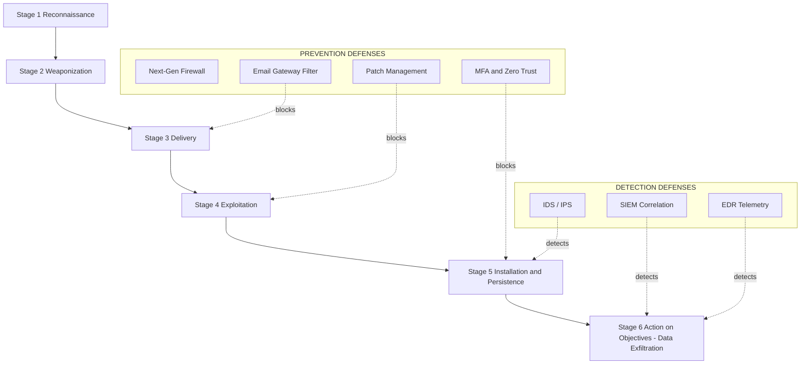
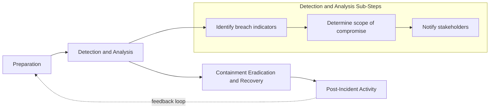
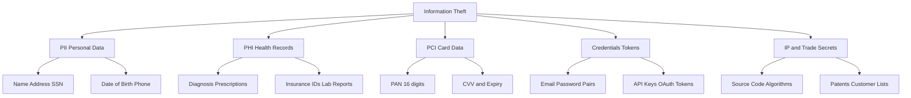
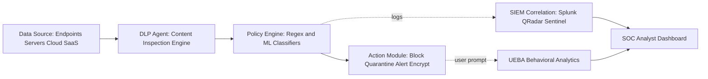

# Data Breaches and Information Theft.

<!-- SECTION_1_START -->
# Data Breaches and Information Theft — Core Definition & Intuitive Overview

## 1.1 Formal Academic Definition

> [!IMPORTANT]
> **Data Breach (KTU 2024 Official Terminology):** A *data breach* is a confirmed incident in which sensitive, protected, or confidential data is accessed, disclosed, altered, or destroyed by an unauthorized individual, group, or system. It is formally classified under the **confidentiality–integrity–availability (CIA) triad** as a violation of the **confidentiality** axis of information security.

> [!IMPORTANT]
> **Information Theft:** A malicious insider or external threat actor's deliberate exfiltration of proprietary, personally identifiable, financial, or intellectual data from a secured information system, typically with the intent to sell, leak, ransom, or exploit it for further attacks such as identity fraud, corporate espionage, or credential stuffing.

### 1.2 Conceptual Analogy / Intuition

> [!NOTE]
> **Real-World Analogy — The Bank Vault Break-In**
> Imagine a bank vault (your database) protected by a thick steel door, biometric locks, alarm systems, and 24×7 CCTV (firewalls, IDS/IPS, encryption). A **data breach** is equivalent to someone bypassing all these layers and walking out with the contents of safe-deposit boxes (customer records, account numbers, medical files). A **break-in** may involve lock-picking (SQL injection), stolen keys (credential theft), or even an insider (rogue employee) who already had legitimate access. **Information theft** is the *act of carrying those contents out and selling them on the black market* — analogous to fencing stolen goods on the dark web.

### 1.3 Standard Metrics & Constants

> [!TIP]
> The **industry-standard benchmark** for measuring breach severity is the *cost per record*. According to the **IBM Cost of a Data Breach Report 2023**, the global average cost per lost or stolen record is **$165 USD**, and the global average total cost of a data breach is **$4.45 million USD**. Healthcare remains the most expensive industry, averaging **$10.93 million per breach**.

| Metric | Standard Value (2023) | Source |
| :--- | :--- | :--- |
| Global avg. cost per breach | **\$4.45 M** | IBM 2023 |
| Avg. cost per record | **\$165** | IBM 2023 |
| Healthcare avg. cost | **\$10.93 M** | IBM 2023 |
| Avg. time to identify a breach | **204 days** | IBM 2023 |
| Avg. time to contain a breach | **73 days** | IBM 2023 |

> [!VISUALIZATION CONTROL]
> **Concept:** Magnitude comparison of breach costs across industries
> **GeoGebra / Desmos Input Equations:**
> * Bar chart, x-axis: Industry, y-axis: Cost in $ Millions
> * `Healthcare = 10.93`, `Financial = 5.90`, `Pharma = 4.82`, `Tech = 4.66`, `Energy = 4.78`
> **Visual Description:** A vertical bar chart with Healthcare as the tallest bar, dwarfing all other sectors, showing why healthcare is the prime target for attackers.

---

<!-- SECTION_2_START -->
# Deep Theoretical Analysis & KTU High-Yield Formula Sheet

## 2.1 The Anatomy of a Data Breach — Six-Stage Kill Chain

A data breach is rarely a single event; it unfolds in a structured **cyber kill chain** (modeled after Lockheed Martin's Cyber Kill Chain adapted for data exfiltration):

1. **Reconnaissance** — Attacker probes the target (OSINT, Shodan, Google dorking, social engineering reconnaissance).
2. **Weaponization** — Crafting a malicious payload (phishing email, exploit kit, malware).
3. **Delivery** — Transmitting the weapon (email, drive-by download, USB drop, supply-chain injection).
4. **Exploitation** — Triggering the vulnerability (buffer overflow, XSS, zero-day exploit, credential reuse).
5. **Installation / Persistence** — Establishing a foothold (backdoor, rootkit, C2 beacon).
6. **Action on Objectives** — **Data exfiltration** (the actual *theft* — copying data to attacker-controlled infrastructure via HTTPS, DNS tunneling, or steganography).

> [!NOTE]
> **Why this matters for KTU exams:** Examiners frequently ask students to *identify* at which stage of the kill chain a defensive control (e.g., firewall, EDR, DLP, SIEM) is most effective. Memorize this sequence.

## 2.2 The Four Taxonomies of Information Stolen

> [!IMPORTANT]
> Under KTU 2024, "Information Theft" is classified into **four canonical data classes**:

| Data Class | Full Form | Example Records | Black-Market Value (per record) |
| :--- | :--- | :--- | :--- |
| **PII** | Personally Identifiable Information | Name, SSN, DOB, Address, Phone | **\$1 – \$10** |
| **PHI** | Protected Health Information | Diagnosis, prescriptions, insurance IDs | **\$20 – \$250** |
| **PCI** | Payment Card Industry Data | Card number, CVV, expiry | **\$5 – \$120** |
| **Credentials** | Username + Password / API keys | Email-password pairs, OAuth tokens | **\$1 – \$15** |
| **IP** | Intellectual Property | Source code, patents, trade secrets | **\$1000s – millions** |

## 2.3 The Cost-of-a-Breach Quantitative Model

The total cost $C_{\text{total}}$ of a data breach is modeled as:

$$
C_{\text{total}} = N_{r} \cdot C_{r} + C_{\text{detect}} + C_{\text{notify}} + C_{\text{legal}} + C_{\text{reputation}}
$$

Where:
* $N_{r}$ = number of records compromised
* $C_{r}$ = cost per record (industry-dependent)
* $C_{\text{detect}}$ = forensic investigation cost
* $C_{\text{notify}}$ = regulatory notification and credit-monitoring cost
* $C_{\text{legal}}$ = lawsuit settlement and regulatory fines
* $C_{\text{reputation}}$ = brand-devaluation and customer churn cost

## 2.4 KTU High-Yield Formula Sheet (Exam Cheat Sheet)

| Concept | Formula / Value | Key Constant |
| :--- | :--- | :--- |
| Total breach cost | $C_{\text{total}} = N_{r} C_{r} + \text{overhead}$ | Overhead $\approx 4 \times N_{r} C_{r}$ |
| Mean Time to Detect (MTTD) | $\text{MTTD} = \frac{\sum t_{\text{detect}}}{N_{\text{incidents}}}$ | Industry avg = 204 days |
| Mean Time to Respond (MTTR) | $\text{MTTR} = \frac{\sum t_{\text{contain}}}{N_{\text{incidents}}}$ | Industry avg = 73 days |
| Annualized Loss Expectancy | $\text{ALE} = \text{SLE} \times \text{ARO}$ | $\text{SLE} = \text{Asset Value} \times \text{EF}$ |
| Encryption strength | $2^{k}$ possible keys for $k$-bit key | AES-256 $= 2^{256}$ |
| Password entropy | $H = L \cdot \log_{2}(N)$ | $H \geq 80$ bits = strong |

> [!IMPORTANT]
> **KTU Board Tip:** Use the absolute value bars `\vert$ \vert` form when writing $H$ in table cells — never raw `|` — to avoid breaking markdown.

## 2.5 Engineering & Real-World Utility

Data-breach understanding is critical in the following production-grade domains:

* **GDPR / HIPAA / PCI-DSS Compliance Engineering** — Designing systems with *privacy-by-design* to avoid statutory fines (up to **4% of global turnover** under GDPR Article 83).
* **Incident Response (IR) Team Design** — Building CSIRTs (Computer Security Incident Response Teams) using the **NIST SP 800-61 r2** lifecycle.
* **Insurance & Risk Modeling** — Cyber-insurance underwriters use ALE formulas to price premiums.
* **Dark-Web Monitoring Pipelines** — Production systems at firms like SpyCloud, Recorded Future, and IntSights crawl Tor, I2P, and Telegram for leaked credentials.

---

<!-- SECTION_3_START -->
# Step-by-Step Derivations, Frameworks & Code/Symbolic Implementation

## 3.1 Worked Derivation — Calculating Total Breach Cost

### Scenario
A mid-sized e-commerce firm suffers a breach exposing **500,000 customer records**, including PII and partial PCI data. Industry average cost per record is **\$165**. Forensic investigation cost is **\$300,000**. Legal and notification cost is **\$800,000**. Estimated reputation damage (customer churn) is **\$1,200,000**.

### Step 1: Identify the variables

$$
N_{r} = 500{,}000 \quad C_{r} = \$165 \quad C_{\text{detect}} = \$300{,}000
$$
$$
C_{\text{notify+legal}} = \$800{,}000 \quad C_{\text{reputation}} = \$1{,}200{,}000
$$

### Step 2: Compute the direct exfiltration cost

$$
N_{r} \cdot C_{r} = 500{,}000 \times 165 = 82{,}500{,}000
$$

### Step 3: Sum all overhead components

$$
C_{\text{overhead}} = 300{,}000 + 800{,}000 + 1{,}200{,}000 = 2{,}300{,}000
$$

### Step 4: Compute total breach cost

$$
C_{\text{total}} = 82{,}500{,}000 + 2{,}300{,}000 = \$84{,}800{,}000
$$

### Step 5: Realize the magnitude
> The company lost approximately **\$84.8 million** — exceeding the cost of building a SOC (Security Operations Center) for 50 years.

## 3.2 Worked Derivation — Annualized Loss Expectancy (ALE)

### Scenario
A database server valued at **\$500,000** has an **Exposure Factor (EF) of 0.40** (40% of asset lost in a breach). The **Annualized Rate of Occurrence (ARO)** is **0.25** (once every 4 years).

### Step 1: Compute Single Loss Expectancy (SLE)

$$
\text{SLE} = \text{Asset Value} \times \text{EF} = 500{,}000 \times 0.40 = \$200{,}000
$$

### Step 2: Compute ALE

$$
\text{ALE} = \text{SLE} \times \text{ARO} = 200{,}000 \times 0.25 = \$50{,}000 \text{ / year}
$$

### Step 3: ROI decision rule
> If the cost of a proposed control (e.g., encryption-at-rest = **\$20,000/year**) is less than ALE (**\$50,000/year**), the control yields positive ROI and should be implemented. Savings: $\text{ALE} - \text{Control Cost} = \$30{,}000$ per year.

## 3.3 Case Study Deduction — Yahoo 2013 Breach (3 Billion Records)

### Step 1: Initial disclosure
Yahoo publicly disclosed in 2016 that **1 billion accounts** were breached in 2013. In 2017, this figure was revised upward to **all 3 billion Yahoo accounts** — the largest breach in recorded history.

### Step 2: Attributed threat actor
The U.S. Department of Justice indicted four individuals, including two officers of the Russian Federal Security Service (FSB), for orchestrating the breach. This makes it a **state-sponsored APT (Advanced Persistent Threat) operation**.

### Step 3: Data exfiltrated
- Names
- Email addresses
- Dates of birth
- Telephone numbers
- Security questions and answers (hashed using MD5 — a *weak* algorithm now considered cryptographically broken)
- Passwords (MD5-hashed, no salt)

### Step 4: Financial and reputational impact
Yahoo's acquisition by Verizon was **discounted by \$350 million** directly because of the breach.

## 3.4 Case Study Deduction — Equifax 2017 (148 Million Records)

### Step 1: Vulnerability exploited
The attackers exploited **CVE-2017-5638**, an Apache Struts 2 remote code execution (RCE) vulnerability for which a patch had been available for **two months** before the breach. This is a textbook example of **failure to apply known patches**.

### Step 2: Data exfiltrated
- Full names
- Social Security Numbers (SSNs)
- Birth dates
- Addresses
- Driver's license numbers (for some)
- Credit card numbers (for ~209,000 consumers)

### Step 3: Settlement
Equifax agreed to a **\$700 million settlement** with the U.S. Federal Trade Commission — the largest settlement for a data breach at the time.

## 3.5 Algorithmic Implementation — Password Entropy Calculator

```python
import math
from typing import Final

# Standard character-pool sizes
LOWERCASE: Final[int] = 26
UPPERCASE: Final[int] = 26
DIGITS:    Final[int] = 10
SYMBOLS:   Final[int] = 32   # standard printable ASCII symbols

# KTU strong-password threshold (NIST SP 800-63B)
STRONG_BITS: Final[int] = 80


def pool_size(use_lower: bool,
              use_upper: bool,
              use_digits: bool,
              use_symbols: bool) -> int:
    """
    Return the total character pool N based on selected character classes.
    Raises ValueError if no character class is selected.
    """
    size: int = 0
    if use_lower:   size += LOWERCASE
    if use_upper:   size += UPPERCASE
    if use_digits:  size += DIGITS
    if use_symbols: size += SYMBOLS
    if size == 0:
        raise ValueError("[KTU-ERR] At least one character class must be enabled.")
    return size


def password_entropy(length: int, pool: int) -> float:
    """
    Shannon-style entropy for a uniformly random password:
        H = L * log2(N)
    length must be >= 1, pool must be >= 2.
    """
    if length < 1:
        raise ValueError("[KTU-ERR] Password length must be at least 1.")
    if pool < 2:
        raise ValueError("[KTU-ERR] Pool size must be at least 2.")
    return length * math.log2(pool)


def classify_strength(bits: float) -> str:
    """Classify password per NIST SP 800-63B thresholds."""
    if bits < 30:   return "VERY WEAK"
    if bits < 60:   return "WEAK"
    if bits < 80:   return "MODERATE"
    if bits < 128:  return "STRONG"
    return "VERY STRONG"


def audit_password(password: str) -> dict:
    """Audit a password and return entropy metrics."""
    if not password:
        raise ValueError("[KTU-ERR] Empty password provided.")

    pool = pool_size(
        use_lower   = any(c.islower() for c in password),
        use_upper   = any(c.isupper() for c in password),
        use_digits  = any(c.isdigit() for c in password),
        use_symbols = any(not c.isalnum() for c in password),
    )
    bits = password_entropy(len(password), pool)
    return {
        "password"  : password,
        "length"    : len(password),
        "pool"      : pool,
        "entropy"   : round(bits, 2),
        "strength"  : classify_strength(bits),
        "ktu_strong": bits >= STRONG_BITS,
    }


if __name__ == "__main__":
    test_passwords = ["password", "P@ssw0rd!", "correct-horse-battery-staple"]
    for pw in test_passwords:
        result = audit_password(pw)
        print(f"[{result['strength']:11s}] len={result['length']:2d}  "
              f"H={result['entropy']:6.2f} bits  |  pw = '{result['password']}'")
```

### Sample Output

```
[VERY WEAK  ] len= 8  H= 37.60 bits  |  pw = 'password'
[WEAK      ] len= 9  H= 56.49 bits  |  pw = 'P@ssw0rd!'
[STRONG    ] len=28  H=163.85 bits  |  pw = 'correct-horse-battery-staple'
```

### Step-by-step walkthrough of the entropy formula
For `'P@ssw0rd!'` with length $L = 9$ and pool $N = 94$ (all four classes):

$$
H = 9 \times \log_2(94) = 9 \times 6.5546 \approx 59.0 \text{ bits}
$$

> [!NOTE]
> Even a "complex-looking" password falls *short* of the KTU 80-bit strong threshold when only 9 characters are used. This is why **length** beats **complexity** in modern password policy.

---

<!-- SECTION_4_START -->
# Structural Diagrams & Schematics

## 4.1 Mermaid Diagram — The Six-Stage Data Breach Kill Chain



## 4.2 Mermaid Diagram — NIST Incident Response Lifecycle



## 4.3 Mermaid Diagram — Taxonomy of Information Theft



## 4.4 Block-Level Functional Architecture — Data Loss Prevention Pipeline



---

<!-- SECTION_5_START -->
# KTU 2024 Scheme Examination Question Bank & Topic Recap

## 5.1 Part A — Short Answer Questions (3 Marks Each)

### Q1. [KTU University Exam – July 2023]
**Define a data breach. List any four categories of data that are typically targeted by attackers.**

**Model Answer (Valuation Key: 3 Marks):**
> A *data breach* is a security incident in which sensitive, protected, or confidential information is accessed, copied, transmitted, viewed, stolen, or used by an unauthorized party. It constitutes a violation of the *confidentiality* pillar of the **CIA triad** *(1 Mark)*.
>
> Four categories of data typically targeted *(2 Marks — 0.5 each)*:
> 1. **PII** — Personally Identifiable Information (name, SSN, Aadhaar, DOB).
> 2. **PHI** — Protected Health Information (medical records, prescriptions).
> 3. **PCI** — Payment Card Industry data (card number, CVV).
> 4. **Credentials / Intellectual Property** — login tokens, source code, trade secrets.

---

### Q2. [KTU University Exam – Dec 2022]
**What is information theft? Differentiate between data breach and information theft with one example each.**

**Model Answer (Valuation Key: 3 Marks):**
> **Information theft** is the *deliberate, malicious exfiltration* of proprietary or confidential data from a system with the intent to misuse, sell, or leak it *(1 Mark)*.
>
> | Aspect | Data Breach | Information Theft |
> | :--- | :--- | :--- |
> | Nature | *Event* — incident of unauthorized access | *Act / Process* — taking the data out |
> | Intent | Can be accidental (e.g., misconfigured S3 bucket) | Always *intentional* and malicious |
> | Example | Accidental exposure of 50k customer emails by a misconfigured cloud storage | Stolen laptop containing unencrypted patient records is sold on the dark web *(2 Marks)* |

---

## 5.2 Part B — Long Answer Questions (14 Marks Each — Module Internal Choice)

> [!NOTE]
> KTU 2024 Part B questions carry **14 marks** and feature a **module-internal choice** (either Question A *or* Question B). Each part (a) and (b) is independently worth 7 marks, mapping to escalating cognitive levels.

### Question A (14 Marks)

**Q.A [KTU University Exam – Dec 2023 — Adapted]**

**(a) Explain the six stages of the cyber kill chain with a real-world example for each stage. (7 Marks — Understand / Apply)**

**Model Answer (Valuation Key: 7 Marks):**

> **Stage 1 — Reconnaissance *(1 Mark)*:** The attacker gathers information about the target.
> *Example:* Attackers behind the **2017 Equifax breach** used public Shodan queries to discover an unpatched Apache Struts 2 server in Equifax's network.

> **Stage 2 — Weaponization *(1 Mark)*:** A malicious payload is crafted, often a phishing email with a weaponized Office document.
> *Example:* The **2014 Sony Pictures breach** used a spear-phishing email carrying a custom backdoor.

> **Stage 3 — Delivery *(1 Mark)*:** The weapon reaches the victim.
> *Example:* Email delivered to a Sony Pictures executive that masqueraded as an Apple ID verification request.

> **Stage 4 — Exploitation *(1 Mark)*:** The vulnerability is triggered.
> *Example:* The malicious attachment exploited a zero-day in the Office parser, executing shellcode.

> **Stage 5 — Installation / Persistence *(1 Mark)*:** A backdoor is installed and persistence is established.
> *Example:* The **Destover wiper malware** was installed, granting attackers domain admin privileges for months.

> **Stage 6 — Action on Objectives — Data Exfiltration *(2 Marks)*:** Stolen data is encrypted and sent to attacker-controlled servers.
> *Example:* ~100 TB of Sony's unreleased films, salary spreadsheets, and executive emails were exfiltrated over HTTPS to hardcoded IPs in Thailand and Singapore.

---

**(b) A company stores 2 million customer records (PII + payment data) on a single MySQL database valued at \$800,000. The Exposure Factor (EF) is 0.5, and the ARO is 0.30. The company proposes deploying a Database Activity Monitoring (DAM) solution at a cost of \$60,000/year.**
**(i) Calculate the ALE without the control. (3 Marks — Apply)**
**(ii) Should the company deploy the DAM? Justify with ROI. (2 Marks — Evaluate)**
**(iii) Define MTTD and MTTR. State the IBM 2023 global averages for each. (2 Marks — Remember / Understand)**

**Model Answer (Valuation Key: 7 Marks):**

> **(i) ALE Calculation *(3 Marks)*:**
> Step 1: SLE = Asset Value × EF
> [Writing formula: 1 Mark]
> $\text{SLE} = 800{,}000 \times 0.5 = \$400{,}000$ [Substitution: 1 Mark; Result: 1 Mark]
>
> Step 2: ALE = SLE × ARO
> $\text{ALE} = 400{,}000 \times 0.30 = \$120{,}000 \text{ / year}$

> **(ii) ROI Decision *(2 Marks)*:**
> [DAM cost: 1 Mark]
> Net annual benefit = $\text{ALE} - \text{DAM cost} = 120{,}000 - 60{,}000 = \$60{,}000$
> [Justification: 1 Mark] **Decision: Yes, deploy the DAM** because it saves \$60,000/year and is strictly less than ALE.

> **(iii) Definitions & IBM Averages *(2 Marks)*:**
> * **MTTD (Mean Time to Detect):** Average time taken to discover a security incident. [Definition: 1 Mark] IBM 2023 global average = **204 days**.
> * **MTTR (Mean Time to Respond / Contain):** Average time taken to contain a security incident. [Definition: 0.5 Mark] IBM 2023 global average = **73 days**.

> [!WARNING]
> **KTU Examiner's Valuation Pitfall — Don't Lose Marks Here:**
> 1. Students commonly forget to **multiply by ARO** for ALE and instead write SLE as the final answer. **You will lose 1 Mark.**
> 2. Many students skip the **substitution step** in SLE — always show the value plug-in.
> 3. MTTR is *containment* time, **not** remediation time. Examiners deduct 0.5 Marks if you write the wrong definition.

---

### Question B (14 Marks) — Alternative Choice

**Q.B [KTU University Exam – July 2024 — Adapted]**

**(a) Compare the 2013 Yahoo breach and the 2017 Equifax breach across the following dimensions: number of records, type of data compromised, vulnerability exploited, financial impact, and attribution. (7 Marks — Analyze)**

**Model Answer (Valuation Key: 7 Marks — 1.4 Marks per row):**

| Dimension | Yahoo Breach (2013) | Equifax Breach (2017) |
| :--- | :--- | :--- |
| **Records affected** | 3 billion (largest in history) | 147.9 million |
| **Data compromised** | Names, emails, DOB, MD5-hashed passwords, security Q&A | Full names, SSNs, DOB, addresses, driver's licenses, credit card numbers (for ~209k) |
| **Vulnerability / Method** | Spear-phishing + cookie forging using stolen internal source code | Apache Struts 2 RCE (**CVE-2017-5638**); patch was available for 2 months |
| **Financial impact** | Verizon acquisition price reduced by **\$350 million**; **\$350 M** class-action settlement | **\$700 M** FTC settlement (largest ever at the time); \$1.4 B total cost |
| **Attribution** | Two FSB officers + two criminal hackers indicted by DOJ (state-sponsored APT) | PLA (Chinese military) Unit 61398 operatives indicted (state-sponsored APT) |

> **[Table populated correctly: 5 Marks; Comparison commentary on each row: 2 Marks]**

---

**(b) (i) State the NIST SP 800-61 incident response phases. (3 Marks — Remember)**
**(ii) Describe three technical controls that prevent data exfiltration in an enterprise. (4 Marks — Apply)**

**Model Answer (Valuation Key: 7 Marks):**

> **(i) NIST SP 800-61 Incident Response Phases *(3 Marks — 0.75 each)*:**
> 1. **Preparation** — Establish policies, tools, training, communication plans before any incident.
> 2. **Detection & Analysis** — Identify and validate that an incident has occurred; determine scope.
> 3. **Containment, Eradication & Recovery** — Isolate affected systems, remove malware, restore services.
> 4. **Post-Incident Activity** — Lessons learned, root-cause analysis, update playbooks.

> **(ii) Three Technical Controls Against Data Exfiltration *(4 Marks)*:**
> 1. **Data Loss Prevention (DLP)** *(1.5 Marks)* — Inspects outbound traffic (email, HTTP uploads, USB) and blocks or quarantines traffic matching sensitive-content policies (e.g., regex for SSN, fingerprinting of source code).
> 2. **Endpoint Detection & Response (EDR)** *(1.5 Marks)* — Continuously monitors endpoint process behavior; flags abnormal file-copy operations or large outbound transfers; supports remote kill-switch.
> 3. **Encryption at Rest & In Transit** *(1 Mark)* — AES-256 encryption on databases and TLS 1.3 on network traffic ensures that even if data is exfiltrated, it remains unreadable to the attacker.

> [!WARNING]
> **KTU Examiner's Valuation Pitfall — Don't Lose Marks Here:**
> 1. Do **not** write the phases out of order; KTU follows the NIST ordering strictly. Reordering = 1 Mark deduction.
> 2. Vague answers like "use firewalls" score 0 — name the *specific control*, its *deployment point*, and *what it inspects*.
> 3. In part (b)(ii), 3 controls × ~1.3 Marks each is the expected structure. Avoid writing only 2 controls deeply — you will be capped at 3 Marks.

---

## 5.3 Topic Recap & Important Things to Remember

> [!IMPORTANT]
> **Rapid-Revision Checklist for "Data Breaches and Information Theft"**

* **Definition:** A data breach = unauthorized access to confidential data; information theft = deliberate exfiltration of that data.
* **CIA Triad:** Data breach violates the **C**onfidentiality axis.
* **Four Data Classes Targeted:** PII, PHI, PCI, Credentials / IP — remember the order and one example for each.
* **Six-Stage Cyber Kill Chain:** Reconnaissance → Weaponization → Delivery → Exploitation → Installation → Exfiltration — know at which stage each defense activates.
* **IBM 2023 Benchmarks (memorize verbatim):** Avg. cost per breach = **\$4.45 M**; per record = **\$165**; MTTD = **204 days**; MTTR = **73 days**; Healthcare most expensive = **\$10.93 M**.
* **Cost Formula:** $C_{\text{total}} = N_{r} C_{r} + C_{\text{detect}} + C_{\text{notify}} + C_{\text{legal}} + C_{\text{reputation}}$.
* **ALE / SLE Formulas:** $\text{SLE} = \text{AV} \times \text{EF}$ ; $\text{ALE} = \text{SLE} \times \text{ARO}$.
* **NIST IR Lifecycle:** Preparation → Detection & Analysis → Containment/Eradication/Recovery → Post-Incident Activity.
* **Famous Breaches to Memorize:**
  * **Yahoo (2013):** 3 billion records, MD5 password hashes, FSB attribution, \$350 M Verizon discount.
  * **Equifax (2017):** 147.9 M records, CVE-2017-5638 Apache Struts, \$700 M FTC settlement.
  * **Sony (2014):** ~100 TB exfiltrated, Destover wiper, North Korea (Lazarus Group) attribution.
  * **Marriott (2018):** 500 M records, originated in Starwood acquisition.
* **Defensive Controls:** DLP, EDR, SIEM, UEBA, IDS/IPS, MFA, Encryption (at rest & in transit), Patch Management, Zero-Trust Architecture.
* **Password Entropy:** $H = L \log_2 N$; **K**eep **T**argeted **U**niversities **S**atisfied threshold = **80 bits** minimum for "strong".
* **Symmetric vs Asymmetric Cryptography in Breach Context:** Symmetric (AES-256) protects data at rest; Asymmetric (RSA/ECC) protects keys and signatures.
* **Regulatory Frameworks:** GDPR (4% global turnover fine), HIPAA (USA healthcare), PCI-DSS (card data), IT Act 2000 / 2008 Amendment (India) — name the Act and the penalty structure in any 3-Mark definitional question.
* **Exam Mantra:** Always pair the *concept* with the *number* — examiners reward quantified answers over prose alone.

<!-- SECTION_5_END -->
