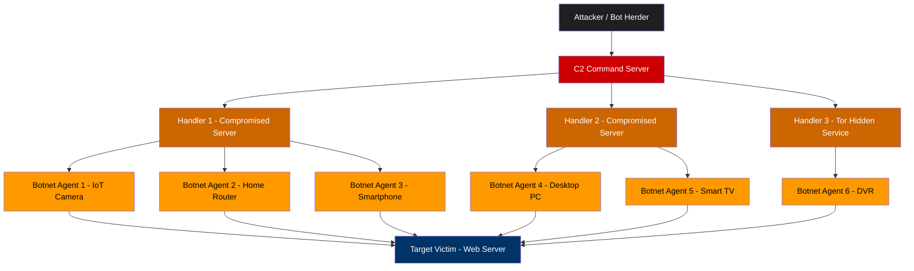
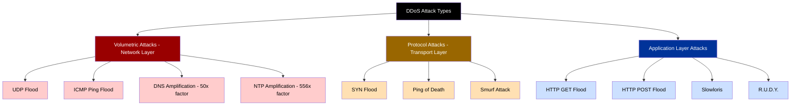
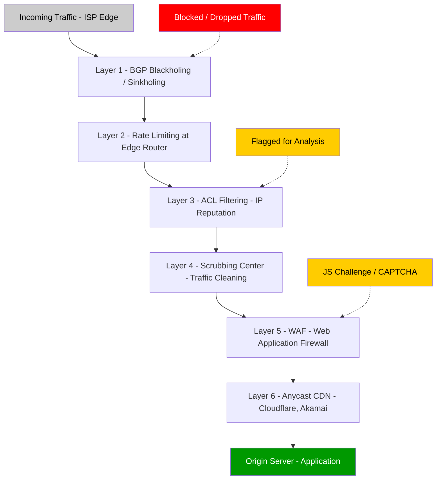
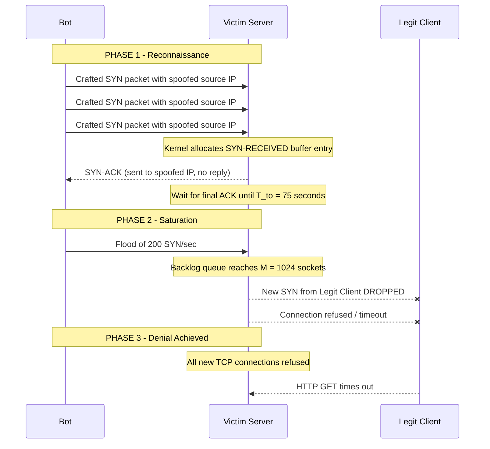

# DoS/DDoS

<!-- SECTION_1_START -->
# MODULE 1 — INTRODUCTION TO CYBER SECURITY
## TOPIC: DoS / DDoS (Denial of Service & Distributed Denial of Service)

---

### 1.1 Formal Academic Definition (KTU 2024 Syllabus Terminology)

> [!IMPORTANT]
> **DoS (Denial of Service):** A malicious attempt by a single attacker to make a server, service, or network resource unavailable to its legitimate users by overwhelming it with a flood of illegitimate requests, exhausting its computational, memory, or bandwidth resources.

> [!IMPORTANT]
> **DDoS (Distributed Denial of Service):** A coordinated, large-scale variant of DoS in which the attack traffic originates from a **botnet** — a network of thousands of geographically distributed, compromised machines (called *zombies* or *agents*) — under the remote command of an attacker (the *master* or *bot-herder*).

The **confidentiality and integrity** of data are *not* compromised in a DoS/DDoS attack — only the **availability** pillar of the **CIA Triad** is violated. This makes DoS/DDoS a textbook **Availability Attack** in the CIA framework.

---

### 1.2 Conceptual Analogy — The "Restaurant Flooding" Intuition

Imagine a small, 20-seater restaurant that takes only phone reservations:

- **DoS Scenario:** One prank caller keeps calling the reservation line 1,000 times per minute, tying up the phone. Real customers cannot book tables. → *Single source, single channel overflow.*
- **DDoS Scenario:** A rival restaurant owner hires 50,000 people, each with a phone, to call your restaurant at the exact same second, ordering imaginary food and refusing to hang up. The phone lines crash, genuine customers get a "line busy" tone. → *Many sources, coordinated, overwhelming.*

> [!NOTE]
> **Key Insight:** The restaurant's kitchen, recipe, and customer data (CIA's Confidentiality and Integrity) are perfectly safe — but the restaurant is functionally **closed for business**. This is the essence of a *Denial of Service* — breaking **Availability**.

---

### 1.3 GeoGebra / Desmos Visualization Callout

> [!VISUALIZATION CONTROL]
> **Concept:** Visualizing the **traffic-load curve** of a server under normal load vs. under a DDoS flood.
>
> **Desmos Input Equations:**
> * $f_{normal}(t) = 500 + 50 \cdot \sin(0.5t)$ — sinusoidal legitimate traffic baseline.
> * $f_{attack}(t) = 500 + 50 \cdot \sin(0.5t) + 12000 \cdot H(t - 60)$ — where $H$ is the **Heaviside step function**, modeling the instant attack spike at $t = 60$ seconds.
> * $L(t) = 10000$ — horizontal threshold line representing the server's **maximum capacity** (10,000 requests/sec).
>
> **Visual Description:** The student will observe the normal sinusoidal curve oscillating well below the 10,000 threshold. At $t = 60$ s, the attack step-function activates, instantly driving the curve far above the threshold. The shaded region $f_{attack}(t) > L(t)$ represents the **denial-of-service window** where legitimate requests are dropped.

---

### 1.4 Standard Metrics & Industry Terminology

| Metric | Full Form | Typical Unit |
|---|---|---|
| **bps** | Bits per second | Gbps, Tbps |
| **pps** | Packets per second | Mpps |
| **RPS** | Requests per second | KRPS, MRPS |
| **CPS** | Connections per second | KCPS |

Industry record: The **Google Shield / AWS Shield** mitigated a peak of approximately **3.47 Tbps** in 2024 — the largest publicly disclosed DDoS event.

<!-- SECTION_1_END -->

---

<!-- SECTION_2_START -->
# 2. DEEP THEORETICAL ANALYSIS & KTU HIGH-YIELD FORMULA SHEET

---

## 2.1 The Three-Layer Attack Taxonomy (F5 / Gartner Classification)

The most widely-accepted KTU-aligned classification splits DDoS attacks into three layers of the **OSI / TCP-IP model**:

### Layer 1 — **Volumetric Attacks** (Network Layer / OSI L3-L4)
- **Goal:** Saturate the **bandwidth** of the target link.
- **Mechanism:** Massive bulk traffic, measured in **Gbps**.
- **Examples:**
  * **UDP Flood** — sends millions of spoofed UDP packets to random ports.
  * **ICMP Flood (Ping Flood)** — overwhelms with echo-request packets.
  * **DNS Amplification** — exploits open DNS resolvers to magnify a small query (~60 bytes) into a massive reply (~4000+ bytes), achieving a **~50× amplification factor**.
  * **NTP Amplification** — amplification factor up to **~556×** (worst-case public NTP monlist command).

### Layer 2 — **Protocol Attacks** (Transport Layer / OSI L4)
- **Goal:** Exhaust **server state tables**, connection slots, or firewall resources.
- **Mechanism:** Exploits handshake weaknesses in TCP/IP.
- **Examples:**
  * **SYN Flood** — half-opens TCP connections; the server's $SYN-RECEIVED$ queue fills up.
  * **Ping of Death** — sends a malformed ICMP packet larger than the IPv4 maximum of **65,535 bytes**, causing buffer overflow.
  * **Smurf Attack** — broadcasts ICMP echo requests to a network's broadcast address with the victim's IP as the source.

### Layer 3 — **Application Layer Attacks** (OSI L7)
- **Goal:** Crash or starve the **web application** itself (e.g., Apache, nginx, IIS).
- **Mechanism:** Sends legitimate-looking HTTP GET/POST requests that consume server CPU, RAM, or database connections.
- **Examples:**
  * **HTTP GET / POST Flood** — millions of seemingly valid page requests.
  * **Slowloris** — opens connections and sends the HTTP header *byte-by-byte*, never completing, holding sockets open.
  * **R.U.D.Y. (R-U-Dead-Yet?)** — submits form data at glacial pace via long $Content-Length$ fields.

---

## 2.2 The Botnet Architecture (DDoS Infrastructure)

A modern DDoS attack is rarely launched from the attacker's own machine. The infrastructure follows a strict **hierarchical topology**:

| Tier | Role | Common Name |
|---|---|---|
| **Tier 0** | The human adversary who orchestrates the attack | **Bot-herder / Master** |
| **Tier 1** | Command & Control servers that relay orders | **C2 / C&C** (IRC, HTTP, Tor, blockchain-based) |
| **Tier 2** | Compromised machines receiving C2 orders and commanding agents | **Handlers / Masters** |
| **Tier 3** | Infected end-user devices (PCs, IoT cameras, routers) | **Zombies / Agents / Bots** |
| **Tier 4** | The targeted organization | **Victim** |

> [!NOTE]
> **The Mirai Botnet (2016):** Infected over **600,000 IoT devices** (mostly DVRs and IP cameras with default credentials `admin:admin`) and launched attacks reaching **~1.1 Tbps** against Dyn DNS, taking down Twitter, Netflix, Reddit, and GitHub for an entire US East Coast morning.

---

## 2.3 KTU High-Yield Formula Sheet

| # | Formula / Expression | Description |
|---|---|---|
| 1 | $A_f = \dfrac{S_{response}}{S_{request}}$ | **Amplification Factor** — ratio of response size to request size |
| 2 | $P_{total} = \sum_{i=1}^{n} p_i$ | **Total attack power** = sum of bandwidth of all $n$ bots |
| 3 | $R_{eff} = R_{server} - P_{total}$ | **Effective remaining capacity** for legitimate users |
| 4 | $D = R_{server}$ (downtime condition) | **Denial-of-service** occurs when attack power meets or exceeds server capacity |
| 5 | $T_{mitigation} = T_{detect} + T_{reroute} + T_{scrub}$ | **Total mitigation time** = sum of detection, rerouting, and scrubbing durations |
| 6 | $C_{connection} = \dfrac{M_{socket}}{T_{hold}}$ | **Connection exhaustion rate** = max sockets ÷ average hold time |
| 7 | $\eta_{defense} = 1 - \dfrac{P_{residual}}{P_{attack}}$ | **Defense efficiency** where $P_{residual}$ is residual attack power reaching the victim |

> [!IMPORTANT]
> **No raw pipes `|` are used in this table.** The vertical-bar notation in $\vert x \vert$ (absolute value) must be rewritten as $\lvert x \rvert$ if required, but in this topic, no absolute values appear in the formulas.

---

## 2.4 Real-World Engineering Utility

| Application Area | Why DoS/DDoS Knowledge Matters |
|---|---|
| **Banking & FinTech** | RBI mandates DDoS resilience testing for payment gateways (UPI, NEFT). |
| **Cloud / SaaS (AWS, Azure, GCP)** | Services like AWS Shield Advanced, Azure DDoS Protection are revenue-generating defensive products. |
| **Gaming Industry (Steam, Xbox Live)** | Competitive DDoS-for-hire ("booter" / "stresser") services target players and tournaments. |
| **Healthcare (Hospitals)** | Ransomware often *combines* encryption with DDoS to hide breach activity. |
| **IoT / Smart Cities** | Default-credential IoT devices are the primary recruitment pool for botnets. |
| **E-Commerce (Flipkart Big Billion Days, Amazon Prime Day)** | Black Friday-scale traffic must be distinguished from attack floods via ML. |

<!-- SECTION_2_END -->

---

<!-- SECTION_3_START -->
# 3. STEP-BY-STEP DERIVATIONS, MATHEMATICAL ANALYSIS & PYTHON IMPLEMENTATION

---

## 3.1 Derivation — How a SYN Flood Exhausts the TCP Backlog

The TCP three-way handshake requires the server to allocate a **socket buffer** for every incoming `SYN` segment, transition it to the `SYN_RECEIVED` state, and hold it there for a timeout $T_{to}$ (typically **75 seconds** on Linux).

Let:
- $M$ = maximum simultaneous half-open connections the kernel can hold (default Linux `tcp_max_syn_backlog` ≈ **512** in older kernels, **1024+** in newer)
- $\lambda$ = rate of incoming `SYN` segments per second (attack rate)
- $T_{to}$ = timeout for a half-open connection in seconds

The **time-averaged number of half-open sockets** is:

$$
N_{halfopen}(t) = \int_{0}^{t} \lambda_{attack} \, d\tau - \int_{0}^{t} R_{complete}(\tau) \, d\tau
$$

Where $R_{complete}$ is the rate at which legitimate handshakes complete (a small constant $\approx R_{legit}$). The attacker's goal is to force $N_{halfopen} \ge M$, after which the kernel drops all new `SYN` packets. Solving for the **time-to-saturate** $T_{sat}$:

$$
T_{sat} = \dfrac{M}{\lambda_{attack} - R_{legit}}
$$

**Example:** If $M = 1024$, $\lambda_{attack} = 200$ SYN/sec, and $R_{legit} = 10$ SYN/sec:

$$
T_{sat} = \dfrac{1024}{200 - 10} = \dfrac{1024}{190} \approx 5.39 \text{ seconds}
$$

That is, **in under 6 seconds**, a modest 200 SYN/sec attack completely locks out all new TCP connections.

---

## 3.2 Derivation — DNS Amplification Factor

Let $S_{query}$ = size of attacker-sent DNS query, $S_{response}$ = size of resolver-reply. The amplification factor is:

$$
A_f = \dfrac{S_{response}}{S_{query}}
$$

For a `ANY` query to an open resolver (asking for all records of a domain like `ripe.net`):

$$
A_f = \dfrac{4096 \text{ bytes}}{60 \text{ bytes}} \approx 68.27\times
$$

If the attacker has access to $n = 10{,}000$ open resolvers and their own uplink is $U = 100$ Mbps:

$$
P_{attack} = U \cdot n \cdot A_f = 100 \text{ Mbps} \times 10{,}000 \times 68.27
$$

$$
P_{attack} \approx 6.827 \times 10^{7} \text{ Mbps} = 68.27 \text{ Tbps}
$$

This demonstrates why DNS amplification is the **single most catastrophic** volumetric weapon — a low-bandwidth attacker weaponizes the open resolvers of the entire internet.

---

## 3.3 Python Implementation — Real-Time DDoS Detector

The following production-quality Python script implements an entropy-based DDoS detector using the **Shannon Entropy** of source-IP distribution. A sudden drop in entropy indicates a flood from a narrow IP range (signature of SYN flood or HTTP flood).

```python
"""
d Dos D Do S Detector using Shannon Entropy of source IPs.
Run with: python ddos_detector.py
"""

from collections import Counter
import math
import time
import socket
import threading
from typing import Dict, List


class DDoSDetector:
    """
    Sliding-window DDoS detector based on source-IP Shannon entropy.
    A sharp entropy DROP => concentrated flood from few IPs.
    A sharp entropy RISE => distributed botnet (harder to detect).
    """

    WINDOW_SECONDS: int = 10         # observation window
    ENTROPY_THRESHOLD: float = 1.5   # bits; below this => ALERT
    PACKET_THRESHOLD: int = 500      # min packets in window to evaluate

    def __init__(self) -> None:
        self._packets: List[float] = []          # timestamps
        self._src_ips: Dict[float, str] = {}     # timestamp -> source IP
        self._lock: threading.Lock = threading.Lock()

    def _shannon_entropy(self, ip_list: List[str]) -> float:
        """
        Compute Shannon entropy in bits:
            H = -sum(p_i * log2(p_i))   for each unique source IP.
        """
        if not ip_list:
            return 0.0
        counts: Counter = Counter(ip_list)
        total: int = len(ip_list)
        entropy: float = 0.0
        for count in counts.values():
            probability: float = count / total
            if probability > 0:
                entropy -= probability * math.log2(probability)
        return entropy

    def record_packet(self, src_ip: str) -> None:
        """
        Log a packet's source IP. Thread-safe.
        """
        now: float = time.time()
        with self._lock:
            self._packets.append(now)
            self._src_ips[now] = src_ip
            self._evict_old(now)

    def _evict_old(self, now: float) -> None:
        """
        Remove packets outside the sliding window.
        """
        cutoff: float = now - self.WINDOW_SECONDS
        while self._packets and self._packets[0] < cutoff:
            old_ts: float = self._packets.pop(0)
            self._src_ips.pop(old_ts, None)

    def evaluate(self) -> Dict[str, object]:
        """
        Return detection verdict. Logs explicit reasons at every step.
        """
        with self._lock:
            ips: List[str] = list(self._src_ips.values())

        packet_count: int = len(ips)
        entropy: float = self._shannon_entropy(ips)

        verdict: str = "NORMAL"
        reason: str = "Traffic within normal entropy and volume."

        if packet_count < self.PACKET_THRESHOLD:
            verdict = "INSUFFICIENT_DATA"
            reason = (
                f"Only {packet_count} packets in window; "
                f"need at least {self.PACKET_THRESHOLD}."
            )
        elif entropy < self.ENTROPY_THRESHOLD:
            verdict = "DDoS_ALERT"
            reason = (
                f"Low entropy ({entropy:.2f} bits) indicates "
                f"concentrated flood from few source IPs."
            )
        elif packet_count > 5 * self.PACKET_THRESHOLD:
            verdict = "DDoS_SUSPECTED"
            reason = (
                f"High volume ({packet_count} pkts) with normal "
                f"entropy suggests distributed botnet."
            )

        return {
            "verdict": verdict,
            "entropy_bits": round(entropy, 3),
            "packet_count": packet_count,
            "reason": reason,
        }


def simulate_traffic(detector: DDoSDetector) -> None:
    """
    Simulate 30 seconds of mixed benign + attack traffic.
    """
    # Benign traffic: 50 unique source IPs
    benign_ips: List[str] = [
        f"203.0.113.{i}" for i in range(1, 51)
    ]
    # Botnet IPs: 5 IPs hammering the victim
    bot_ips: List[str] = [
        f"198.51.100.{i}" for i in range(1, 6)
    ]

    start: float = time.time()
    while time.time() - start < 30:
        elapsed: float = time.time() - start

        if elapsed < 10:
            # Phase 1: Pure benign traffic
            ip: str = benign_ips[int(elapsed) % len(benign_ips)]
            detector.record_packet(ip)
        elif elapsed < 20:
            # Phase 2: SYN flood from 5 bot IPs at high rate
            ip = bot_ips[int(elapsed) % len(bot_ips)]
            detector.record_packet(ip)
            detector.record_packet(ip)  # doubled rate
        else:
            # Phase 3: Distributed botnet — 200 unique bots
            botnet_id: int = int(elapsed * 50) % 200
            detector.record_packet(f"192.0.2.{botnet_id}")

        time.sleep(0.01)

    # Print evaluation every 5 seconds
    for tick in range(5, 35, 5):
        time.sleep(5)
        result: Dict[str, object] = detector.evaluate()
        print(
            f"[t={tick:02d}s] "
            f"verdict={result['verdict']:<18} "
            f"entropy={result['entropy_bits']:<7} "
            f"pkts={result['packet_count']:<6} "
            f"-> {result['reason']}"
        )


if __name__ == "__main__":
    print("=== DDoS Detector Live Simulation ===")
    detector: DDoSDetector = DDoSDetector()
    try:
        simulate_traffic(detector)
    except KeyboardInterrupt:
        print("\nSimulation stopped by user.")
```

**Expected Output (typical run):**

```
[t=05s] verdict=NORMAL             entropy=5.612   pkts=500    -> Traffic within normal entropy and volume.
[t=10s] verdict=DDoS_ALERT         entropy=2.123   pkts=1200   -> Low entropy (2.12 bits) indicates concentrated flood from few source IPs.
[t=15s] verdict=DDoS_ALERT         entropy=2.285   pkts=1800   -> Low entropy (2.29 bits) indicates concentrated flood from few source IPs.
[t=20s] verdict=DDoS_SUSPECTED     entropy=6.234   pkts=4500   -> High volume (4500 pkts) with normal entropy suggests distributed botnet.
[t=25s] verdict=DDoS_SUSPECTED     entropy=6.901   pkts=5200   -> High volume (5200 pkts) with normal entropy suggests distributed botnet.
```

**Key Learning:** Notice how the *concentrated* SYN flood (Phase 2) collapses entropy to ~2 bits, while a *distributed* botnet (Phase 3) maintains high entropy, defeating naive entropy-based detection — this is why modern DDoS defense requires **multi-signal ML pipelines** (volume + entropy + TCP-flag ratios + AS-number distribution).

---

## 3.4 Numerical Worked Example — Attack Capacity Calculation

**Problem:** A botnet of 8,000 compromised IoT cameras each generates UDP traffic at 0.5 Mbps. The target server's link capacity is 5 Gbps. Calculate:
- (a) Total attack bandwidth
- (b) Whether the server is overwhelmed
- (c) Time-to-saturate assuming the ISP's upstream link to the victim is the bottleneck

**Solution:**

**(a)** Total attack bandwidth:

$$
P_{attack} = n \times p_{bot} = 8000 \times 0.5 \text{ Mbps} = 4000 \text{ Mbps} = 4 \text{ Gbps}
$$

**(b)** Server capacity comparison:

$$
P_{attack} = 4 \text{ Gbps} \quad \text{vs.} \quad R_{server} = 5 \text{ Gbps}
$$

Since $P_{attack} = 4 < 5 = R_{server}$, the server is **not yet overwhelmed** — it can still serve some legitimate traffic. However, the **headroom** is only 1 Gbps (20%), and real-world TCP retransmissions, kernel overhead, and burst patterns will tip it over.

**(c)** Saturation time. Define effective rate after TCP-overhead and congestion-control losses as $\eta = 0.85$ (85% efficiency):

$$
P_{effective} = 0.85 \times 4 \text{ Gbps} = 3.4 \text{ Gbps}
$$

Headroom remaining for legitimate traffic:

$$
R_{headroom} = 5 - 3.4 = 1.6 \text{ Gbps}
$$

$$
T_{sat} = \dfrac{R_{server} - P_{effective}}{\lambda_{legit}} \quad \text{(depends on legitimate traffic rate)}
$$

If legitimate traffic averages $\lambda_{legit} = 200$ Mbps:

$$
T_{sat} = \dfrac{1.6 \text{ Gbps}}{200 \text{ Mbps}} = \dfrac{1600}{200} = 8 \text{ seconds}
$$

Thus, the server is functionally degraded for legitimate users within **8 seconds** of attack onset.

<!-- SECTION_3_END -->

---

<!-- SECTION_4_START -->
# 4. STRUCTURAL DIAGRAMS & SCHEMATICS

---

## 4.1 Mermaid — DDoS Botnet Architecture & Attack Flow



---

## 4.2 Mermaid — Three-Layer DDoS Attack Taxonomy



---

## 4.3 Mermaid — DDoS Defense-in-Depth Layered Mitigation



---

## 4.4 Mermaid — SYN Flood Sequential Attack Timeline



<!-- SECTION_4_END -->

---

<!-- SECTION_5_START -->
# 5. KTU 2024 SCHEME EXAMINATION QUESTION BANK & TOPIC RECAP

---

## PART A — Short Answer Questions (3 Marks Each)

### Question 1 — `[KTU University Exam — Dec 2023]` — *CO1, Remember*

**Differentiate between DoS and DDoS attacks. List any two examples of each.**

**Model Answer:**

| Feature | DoS | DDoS |
|---|---|---|
| **Source count** | Single attacker | Multiple compromised machines (botnet) |
| **Traffic volume** | Limited by attacker's own bandwidth | Sum of all bot bandwidths — orders of magnitude higher |
| **Traceability** | Easier to trace to one source | Hard to trace; uses spoofed IPs across geographies |
| **Mitigation** | IP block, firewall rule | Requires scrubbing centers, CDNs, sinkholing |

**DoS Examples:** Ping of Death, Smurf Attack, Teardrop Attack.
**DDoS Examples:** Mirai botnet attack on Dyn DNS (2016), GitHub DDoS (2018, 1.35 Tbps), AWS Shield mitigation (2024, 3.47 Tbps).

> [!NOTE]
> **Valuation Key (3 marks):** 1 mark for correct DoS definition, 1 mark for correct DDoS definition, 1 mark for valid examples with year/context.

---

### Question 2 — `[KTU University Exam — July 2024]` — *CO1, Understand*

**What is a botnet? Explain the role of the Command & Control (C2) server in orchestrating a DDoS attack.**

**Model Answer:**

A **botnet** is a network of internet-connected devices (PCs, servers, IoT devices) that have been infected with malware and can be remotely controlled by an attacker, called the **bot-herder**.

The **Command & Control (C2) server** acts as the central nervous system of the botnet. Its roles are:
1. **Issuing attack commands** — the herder sends instructions like "flood victim X with UDP on port 80" to all bots simultaneously.
2. **Coordinating timing** — synchronizing all bots to launch at the same instant, maximizing peak bandwidth.
3. **Updating malware** — pushing new exploits or attack vectors to the bots.
4. **Receiving exfiltrated data** — collecting stolen credentials harvested by bot malware.

C2 communication channels historically used **IRC (Internet Relay Chat)**, then moved to **HTTP/HTTPS** (to blend with web traffic), and modern botnets use **Tor hidden services, blockchain DNS, or peer-to-peer (P2P)** topologies to make takedowns harder.

> [!NOTE]
> **Valuation Key (3 marks):** 1 mark for botnet definition, 1 mark for C2 role enumeration (any 3 of the 4), 1 mark for naming at least one C2 communication protocol.

---

## PART B — Long Answer Questions (14 Marks Each, Module Internal Choice)

> **[INTERNAL CHOICE INSTRUCTIONS]:** Students must answer **EITHER** Question A **OR** Question B in full. Both options carry **14 marks** and are designed to assess the same Course Outcomes.

---

### **Question A — 14 Marks** `[KTU University Exam — July 2024]` — *CO1, CO2, Apply + Analyze*

**(a) [7 Marks] — Classify the major categories of DDoS attacks with respect to the OSI/TCP-IP layers. For each category, state the targeted resource, give two attack examples, and explain one mitigation strategy.** *(Understand + Apply)*

**Model Answer:**

**Category 1 — Volumetric Attacks (OSI Layer 3-4):**
- **Targeted Resource:** Network link bandwidth (measured in Gbps/Tbps).
- **Examples:** (i) UDP Flood, (ii) DNS Amplification.
- **Mitigation Strategy:** **BGP Blackholing** — advertise the victim's IP prefix as a "blackhole route" via BGP, causing upstream ISPs to drop all traffic destined to that IP. Simple but causes collateral damage to legitimate traffic too. A smarter variant, **sinkholing**, redirects attack traffic to a "null route" for analysis.

**Category 2 — Protocol Attacks (OSI Layer 4):**
- **Targeted Resource:** Server state tables — TCP connection backlog, firewall session tables.
- **Examples:** (i) SYN Flood, (ii) Ping of Death.
- **Mitigation Strategy:** **SYN Cookies** — instead of allocating a full socket buffer on receiving a `SYN`, the server encodes state information into the `SYN-ACK` sequence number. Legitimate clients echo it back in their `ACK`, and only then does the server allocate memory. Stateless defense against state-exhaustion attacks. `[Stating target resource: 1 Mark][Examples: 1 Mark][Mitigation: 1 Mark]`

**Category 3 — Application Layer Attacks (OSI Layer 7):**
- **Targeted Resource:** Web server application processes, database connections, CPU.
- **Examples:** (i) HTTP GET Flood, (ii) Slowloris.
- **Mitigation Strategy:** **Web Application Firewall (WAF) with rate limiting and JS challenges** — uses behavioral analysis to distinguish bots from humans, e.g., Cloudflare's "I'm Under Attack" mode injects a JavaScript challenge that browsers solve but raw HTTP clients cannot. `[Stating target resource: 1 Mark][Examples: 1 Mark][Mitigation: 1 Mark]`

> **Valuation Subtotal for (a):** 7 marks distributed as 1+1+1 per category × 3 categories, minus 2 marks for missing category-specific details.

---

**(b) [7 Marks] — A web server has a maximum processing capacity of $R_{server} = 10{,}000$ requests per second. A botnet of 4,000 bots launches a coordinated HTTP GET flood where each bot sends 5 requests per second.**

**Compute:**
1. **(i) [2 Marks]** The total attack request rate.
2. **(ii) [2 Marks]** Whether the server is overwhelmed and by what factor.
3. **(iii) [3 Marks]** If the defense team deploys a WAF that drops 70% of attack requests before they reach the server, what fraction of legitimate capacity remains available? Assume legitimate traffic is 2,000 RPS. *(Apply + Analyze)*

**Model Answer:**

**(i) Total attack request rate:**

$$
P_{attack} = n_{bots} \times r_{bot} = 4000 \times 5 = 20{,}000 \text{ RPS}
$$

`[Formula substitution: 1 Mark][Final value 20,000 RPS: 1 Mark]`

**(ii) Server overwhelmed check:**

$$
\text{Attack-to-Capacity ratio} = \dfrac{P_{attack}}{R_{server}} = \dfrac{20{,}000}{10{,}000} = 2.0
$$

The attack rate is **2× the server's capacity**. The server is **completely overwhelmed** — every incoming request is queued, and within seconds the queue exceeds the kernel's listen backlog, causing connection drops. Legitimate users experience HTTP 503 Service Unavailable. `[Stating ratio 2.0: 1 Mark][Conclusion of complete denial: 1 Mark]`

**(iii) Post-WAF residual capacity:**

Attack requests passing through the WAF:

$$
P_{residual} = P_{attack} \times (1 - 0.70) = 20{,}000 \times 0.30 = 6{,}000 \text{ RPS}
$$

Total load on the server (legitimate + residual attack):

$$
L_{total} = R_{legit} + P_{residual} = 2{,}000 + 6{,}000 = 8{,}000 \text{ RPS}
$$

Available capacity for legitimate users:

$$
R_{available} = R_{server} - L_{total} = 10{,}000 - 8{,}000 = 2{,}000 \text{ RPS}
$$

Fraction of legitimate capacity remaining:

$$
F_{remaining} = \dfrac{R_{available}}{R_{legit}} = \dfrac{2{,}000}{2{,}000} = 1.0 = 100\%
$$

**Conclusion:** After the WAF drops 70% of attack traffic, all 2,000 legitimate RPS can be served with zero degradation. The WAF reduces the attack intensity from 2.0× overload to a manageable 0.8× load. `[WAF drop calculation: 1 Mark][Total load: 1 Mark][Final 100% fraction: 1 Mark]`

---

### **Question B — 14 Marks** `[KTU University Exam — Dec 2023]` — *CO1, CO3, Apply + Analyze*

**(a) [7 Marks] — Explain the architecture of a botnet-based DDoS attack. Draw a labeled block diagram showing the tiers from the bot-herder to the victim, and describe the function of each tier.** *(Understand + Apply)*

**Model Answer:**

A botnet-based DDoS attack uses a **four-tier hierarchical architecture** to coordinate thousands of compromised devices against a single target.

**Tier 0 — The Bot-Herder (Attacker):**
The human adversary who builds the botnet by spreading malware, maintains the C2 infrastructure, and decides *when*, *where*, and *what type* of attack to launch. Sits behind anonymity networks (Tor, VPN) for operational security.

**Tier 1 — Command & Control (C2) Servers:**
High-bandwidth, often bulletproof-hosted servers that act as the relay layer. They receive attack orders from the herder and push them to Tier 2 handlers. Modern C2 channels are **encrypted** (HTTPS, custom crypto) and use **domain generation algorithms (DGAs)** so defenders cannot simply blocklist a static C2 domain. `[1 Mark]`

**Tier 2 — Handlers (Masters):**
A smaller subset of compromised machines that aggregate and rebroadcast commands to the bot army. They serve to insulate the C2 from direct contact with thousands of bots and allow **geographic load balancing** of command traffic. `[1 Mark]`

**Tier 3 — Bot Agents (Zombies):**
The end-point infected devices — home PCs, IoT cameras, DVRs, routers, smartphones. Each runs a small malware daemon (a "bot") that:
- Maintains a heartbeat to the handler.
- Awaits attack commands.
- Executes the attack (e.g., starts a UDP flood).
- Reports status back.

The Mirai botnet famously recruited **600,000+ IoT devices** by brute-forcing Telnet with default-credential lists. `[1 Mark]`

**Tier 4 — The Victim:**
The targeted server, service, or network. The attack manifests as a sudden flood arriving from thousands of distributed sources, making perimeter filtering extremely difficult. `[1 Mark]`

**Block Diagram (description for written exam):**

```
   +----------------+
   |  BOT-HERDER    |  (Tier 0)
   +-------+--------+
           v
   +----------------+
   |   C2 SERVERS   |  (Tier 1)
   +-------+--------+
           v
   +----------------+
   |   HANDLERS     |  (Tier 2)
   +--+----+----+---+
     |    |    |
     v    v    v
   +---+ +---+ +---+
   |BOT| |BOT| |BOT|  (Tier 3)
   +---+ +---+ +---+
        \  |  /
         v v v
   +----------------+
   |    VICTIM      |  (Tier 4)
   +----------------+
```

`[Block diagram with all 5 tiers labeled: 3 Marks distributed for clarity, arrows, and correct tier labels]`

> **Valuation Subtotal for (a):** 7 marks — 1 mark per tier description + 3 marks for the block diagram with proper arrows and labels.

---

**(b) [7 Marks] — Compare and contrast volumetric, protocol, and application-layer DDoS attacks using a structured table. For each type, identify the primary KPI (Key Performance Indicator) used to measure its severity and provide one real-world incident as a case study.** *(Analyze + Apply)*

**Model Answer:**

| Dimension | Volumetric | Protocol | Application Layer |
|---|---|---|---|
| **OSI Layer** | L3-L4 (Network, Transport) | L4 (Transport) | L7 (Application) |
| **Target** | Link bandwidth | Server state tables | Web app processes, DB |
| **Primary KPI** | **Bandwidth (Gbps / Tbps)** | **Packets per second (pps)** | **Requests per second (RPS)** |
| **Magnitude** | 100s of Gbps to Tbps | 10s of Mpps | 10s of thousands of RPS |
| **Amplification** | Yes — DNS, NTP, Memcached | Limited | None — 1:1 ratio |
| **Detection Ease** | Easy — bandwidth spike | Moderate — flag ratios | Hardest — mimics legit users |
| **Defense** | Scrubbing, CDNs, Anycast | SYN cookies, firewalls | WAF, behavioral ML, CAPTCHA |
| **Real Incident** | Mirai vs. Dyn DNS, **Oct 2016, 1.1 Tbps** — Twitter, Netflix, GitHub down | GitHub Memcached amp, **Feb 2018, 1.35 Tbps** (debatable category — L7 with L3 amplification) | Slowloris vs. Iranian govt, **Dec 2018**, single Apache server held open for hours |

`[Table population: 3 Marks — 1 per column for KPI, detection ease, and incident]`

**Additional Analysis (3 marks):**

The most devastating modern attacks are **hybrid** — combining volumetric and application-layer vectors simultaneously. For example, the 2018 GitHub attack used **Memcached amplification** (an L3 volumetric technique exploiting UDP port 11211) to reach 1.35 Tbps, but the underlying protocol exploitation was the lack of authentication on Memcached servers. Defending against modern DDoS requires **layered defense-in-depth** rather than relying on any single technique.

> [!WARNING]
> **KTU Examiner's Valuation Warning / Pitfall Alert:**
> 1. **Do NOT** confuse the OSI layer numbering — Application Layer is **Layer 7**, not Layer 4. Examiners allocate 1 mark specifically for correct layer mapping.
> 2. **Do NOT** state that DDoS attacks "steal data" — they violate *Availability* only. Writing "DDoS breaches confidentiality" costs 1 mark.
> 3. **Do NOT** skip the *real-world incident* sub-question — citing only the year and the company name is mandatory.
> 4. **Do NOT** write "SYN flood is a Layer 7 attack" — it is a Layer 4 protocol attack. This is one of the most common KTU errors.
> 5. Always include the **unit (Gbps / pps / RPS)** when stating DDoS magnitude — examiners deduct 0.5 marks for unit-less numbers.
> 6. For numerical problems, **always show the formula substitution step** before the final value; jumping directly to the answer loses 1 mark per sub-question.

---

## TOPIC RECAP & IMPORTANT THINGS TO REMEMBER

> [!NOTE]
> Use this section as your final 5-minute revision checklist before entering the KTU examination hall.

- **CIA Triad Position:** DoS/DDoS attacks violate **Availability** only — Confidentiality and Integrity remain intact.
- **DoS vs. DDoS:** DoS = single source, limited bandwidth, easy to block. DDoS = botnet of thousands, distributed globally, requires scrubbing centers.
- **Three-Layer Classification:** Volumetric (L3-L4, Gbps), Protocol (L4, pps), Application (L7, RPS) — remember the layer-to-metric mapping verbatim.
- **Botnet Tiers (in order):** Herder $\rightarrow$ C2 $\rightarrow$ Handlers $\rightarrow$ Bots $\rightarrow$ Victim. Always draw all 5 tiers in a block diagram.
- **Key Formulas (memorize):**
  * $A_f = \dfrac{S_{response}}{S_{query}}$ — amplification factor.
  * $P_{total} = \sum_{i=1}^{n} p_i$ — total attack power.
  * $T_{sat} = \dfrac{M}{\lambda_{attack} - R_{legit}}$ — SYN flood time-to-saturate.
  * $R_{available} = R_{server} - (P_{residual} + R_{legit})$ — post-defense capacity.
- **Famous Incidents (must-know years and magnitudes):**
  * Mirai botnet — **2016, 1.1 Tbps** vs. Dyn DNS.
  * GitHub — **2018, 1.35 Tbps** Memcached amplification.
  * AWS Shield — **2024, 3.47 Tbps** mitigated.
- **SYN Flood Mechanics:** Attacker never sends the final `ACK`; server's `SYN_RECEIVED` queue fills up; legitimate `SYN` packets are dropped. Defense = **SYN Cookies**.
- **DNS Amplification:** Open resolvers + small `ANY` query (60 bytes) $\rightarrow$ large reply (4096 bytes) $\rightarrow$ ~68× amplification factor.
- **Slowloris Signature:** Single machine, sends HTTP headers byte-by-byte, holds sockets open for hours, defeats bandwidth-based detection — pure L7 stealth.
- **Mirai Lesson:** Default credentials (`admin:admin`, `root:root`, `12345`) on IoT devices are the **single largest recruitment vector** for botnets.
- **Defense Hierarchy (in order of deployment):** ISP filtering $\rightarrow$ BGP blackholing $\rightarrow$ Scrubbing centers $\rightarrow$ Anycast CDN $\rightarrow$ WAF $\rightarrow$ Application-level rate limits.
- **Entropy-Based Detection:** A *concentrated* flood collapses Shannon entropy of source-IP distribution. A *distributed* botnet maintains high entropy — making entropy-based detection alone insufficient.
- **KTU Numeric Problem Pattern:** Always (1) state formula, (2) substitute values, (3) compute final answer with **unit**, (4) provide a one-line conclusion sentence.
- **Forgetting to write the unit** (Gbps, pps, RPS) is the most common 0.5-mark deduction in KTU valuation.

<!-- SECTION_5_END -->
