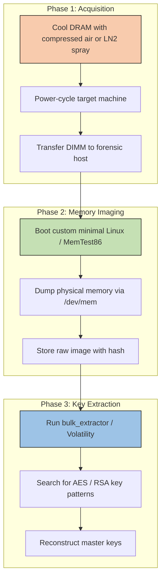

# Hardware attacks

<!-- SECTION_1_START -->
# Hardware Attacks — Core Technical Definition & Intuitive Overview

## 1.1 Formal Academic Definition

> [!IMPORTANT]
> **Hardware Attack (KTU 2024 OECST721 — Module 1 Definition)**
> A *hardware attack* is a class of cyber-physical adversarial action in which an adversary **exploits the physical properties, electrical behaviour, structural implementation, or supply-chain provenance of a computing device** to extract secret information, alter computational behaviour, or subvert the device's root-of-trust. Unlike pure software attacks, hardware attacks operate at the boundary between *logical computation* and *physical realisation*, often bypassing the abstraction layers that software-only security relies upon.

The discipline of studying these attacks is called **Hardware Security** (intersection of VLSI design, cryptography, embedded systems, and adversarial science). According to the **NIST SP 800-140 (FIPS 140-3)** taxonomy, hardware attacks are categorised by *physical access requirement* and *invasiveness*.

## 1.2 Intuitive Overview — The "Safe-Cracker" Analogy

> [!NOTE]
> **Conceptual Analogy — The Bank Vault**
> Imagine a bank vault secured by a *digital* combination lock (the software/firmware layer) and a *physical* steel door (the hardware layer).
> - A **software attacker** tries to guess the combination (brute-force, buffer overflow, malware).
> - A **hardware attacker**, however, may:
>   - Listen to the *click* sounds the dial makes (analogy: **side-channel**).
>   - Drill a small hole and insert a fibre-optic camera (analogy: **microprobing**).
>   - Pour cold water on the metal to make it shrink and jam (analogy: **fault injection**).
>   - Replace the lock during manufacturing with a backdoored one (analogy: **hardware Trojan**).
>   - Steal the vault and read the paper records still in memory (analogy: **cold-boot attack**).
> The vault door (hardware) becomes the attack surface itself — not the combination (software).

In essence, **every physical effect — heat, light, sound, electromagnetic radiation, power draw, even timing** — is information. Hardware attacks weaponise these effects.

## 1.3 Physical Constants & Standard Metrics

The following physical constants and metrics are fundamental to reasoning about hardware attacks:

- **Speed of light in vacuum**: $c = 3 \times 10^8 \text{ m/s}$
- **Electron charge**: $q = 1.602 \times 10^{-19} \text{ C}$
- **Thermal noise floor at room temperature (300 K)**: $k_B T \approx 4.14 \times 10^{-21} \text{ J}$ (where Boltzmann constant $k_B = 1.38 \times 10^{-23} \text{ J/K}$)
- **Dopant concentration in modern silicon**: $N_D \approx 10^{18} \text{ cm}^{-3}$
- **Typical SRAM cell area (45 nm node)**: $\approx 0.346 \text{ }\mu\text{m}^2$
- **AES encryption latency in software**: $\approx 1.2 \text{ }\mu\text{s/byte}$ (reference baseline)
- **JTAG clock frequency (IEEE 1149.1)**: $T_{TCK} \in [10 \text{ kHz}, 25 \text{ MHz}]$

## 1.4 High-Yield Visualisation Callouts

> [!VISUALIZATION CONTROL]
> **Concept:** *Hardware attack vector abstraction cone* — narrowing from broad (software) to narrow (silicon).
> **GeoGebra / Desmos Input Equations (concentric layers):**
> * `C1: x^2 + y^2 = 9` — outermost (network/remote)
> * `C2: x^2 + y^2 = 5` — OS/firmware layer
> * `C3: x^2 + y^2 = 2` — gate/transistor layer
> * `C4: x^2 + y^2 = 0.5` — atomic/dopant layer
> **Visual Description:** The student should observe a concentric cone with each inner circle representing a deeper level of physical access. Hardware attacks predominantly operate on the **inner two rings** (C3 and C4), where abstractions like the OS or hypervisor offer no protection.

## 1.5 Why Hardware Attacks Matter for KTU 2024

> [!IMPORTANT]
> **Syllabus Highlight (CYBER SECURITY OECST721)**
> Module 1 expects the student to *understand and differentiate* the major hardware attack classes, recognise their threat models, and articulate the *defence-in-depth* countermeasure philosophy. Hardware attacks underpin the trust assumptions of **TPMs, HSMs, Secure Enclaves (Intel SGX, Apple SEP), and Root-of-Trust** primitives — all of which are referenced later in the syllabus.
<!-- SECTION_1_END -->

<!-- SECTION_2_START -->
# Hardware Attacks — Deep Theoretical Analysis & KTU High-Yield Formula Sheet

## 2.1 Foundational Threat Model

A hardware attacker is characterised by a **capability vector** $\vec{C}$ with three axes:

1. **Physical Access Level ($L_p$)** — $L_p \in \{0, 1, 2, 3\}$
   * $0$: No physical access (pure remote)
   * $1$: Local access (USB, JTAG, console)
   * $2$: Lab access (decapsulation, probing)
   * $3$: Foundry access (mask-level, supply chain)
2. **Budget ($B$)** — financial and time resources (e.g., **\$200** for a BadUSB, **\$500 K** for an FIB workstation).
3. **Expertise ($E$)** — skill level in electronics, VLSI, signal processing.

The **attack success probability** $P_{success}$ is a monotonic function of all three: $P_{success} = f(L_p, B, E)$, with cost $C_{attack} \propto L_p \cdot B \cdot E$.

## 2.2 Master Classification of Hardware Attacks

Hardware attacks are partitioned into three top-level categories based on *invasiveness* and *device state*:

| Category | Definition | Typical Cost | Example |
| :--- | :--- | :--- | :--- |
| **Non-Invasive** | Observes or influences external signals without modifying the device | Low (\$0 – \$500) | Power analysis, timing, Rowhammer, cold boot |
| **Semi-Invasive** | Requires depackaging but does not contact internal metal layers | Medium (\$1 K – \$50 K) | Optical fault injection (laser), EM fault injection, UV erasure |
| **Invasive** | Modifies or directly probes internal structures of the chip | High (\$50 K – \$1 M+) | Microprobing, FIB editing, mask manipulation |

## 2.3 Side-Channel Attacks (SCA)

Side-channel attacks exploit the fact that a cryptographic device's physical emissions are **correlated** with the secret data being processed. The fundamental model is:

$$P_{observed}(t) = P_{data}(t, k) + P_{static}(t) + P_{noise}(t)$$

where $P_{data}$ is the **data-dependent** component (leaks the key $k$), $P_{static}$ is the constant operational draw, and $P_{noise}$ is the noise floor. The **Signal-to-Noise Ratio (SNR)** is:

$$\text{SNR} = \frac{\text{Var}(P_{data})}{\text{Var}(P_{noise})}$$

A high SNR enables *Single Trace Analysis*; a low SNR mandates statistical attacks across many traces.

### 2.3.1 Power Analysis Variants

* **SPA (Simple Power Analysis)** — direct visual interpretation of a **single** power trace. Effective against naive implementations (e.g., square-and-multiply with conditional branches).
* **DPA (Differential Power Analysis)** — statistical attack on **many** traces. For each key hypothesis $k^*$, compute the **Hamming Weight** $H(W)$ of the S-box output and correlate with measured samples:

$$r_{k^*} = \frac{\sum_{i=1}^{N}\left( H(W_i(k^*)) - \overline{H(W)} \right)\left( T_i - \overline{T} \right)}{\sqrt{\sum_i (H(W_i(k^*)) - \overline{H(W)})^2 \cdot \sum_i (T_i - \overline{T})^2}}$$

The correct key produces $r_{k^*} \approx 1$; incorrect keys give $r \approx 0$.

### 2.3.2 Electromagnetic Analysis (EMA)

EMA replaces the shunt resistor probe with a **near-field H-field loop antenna** (typically $100 \text{ }\mu\text{m} - 1 \text{ mm}$ in diameter) placed above the die. The captured signal is the time derivative of magnetic flux:

$$V_{emf}(t) = -N \cdot \frac{d\Phi_B}{dt}$$

This allows *localised* probing of individual logic blocks without breaking the power pin.

## 2.4 Fault Injection Attacks

Fault injection deliberately **perturbs** a device's operating conditions to cause computational errors that leak secrets. Standard perturbation parameters:

* **Voltage glitch**: $\Delta V_{dd} \in [-0.5 \text{ V}, +1.0 \text{ V}]$, duration $t_{glitch} \in [1 \text{ ns}, 1 \text{ }\mu\text{s}]$
* **Clock glitch**: $\Delta f_{clk} \in [-50\%, +100\%]$, single-cycle insertion
* **EM injection**: pulse amplitude $E \approx 100 \text{ V/m}$, frequency $f \in [10 \text{ MHz}, 1 \text{ GHz}]$
* **Laser injection**: $\lambda = 1064 \text{ nm}$ (Si-absorbing), pulse energy $E \approx 1 \text{ nJ}$

The **glitch success probability** follows a *bathtub curve*:

$$P_{glitch}(t) = \begin{cases} \to 0 & \text{if } t < t_{setup} \text{ or } t > t_{hold} \\ \to P_{max} & \text{otherwise} \end{cases}$$

The optimal injection window lies between the **setup time** $t_{setup}$ and the **hold time** $t_{hold}$ of the target flip-flop.

## 2.5 Hardware Trojans (HT)

A Hardware Trojan is a **malicious, stealthy modification** to an integrated circuit that activates under a rare trigger condition $T$ to produce a malicious payload $P$. Formal model:

$$HT = (T, P, \lambda)$$

where $\lambda$ is the *activation rate* (rarity). The challenge for defenders is detecting HTs with extremely small $\lambda$ — a **needle-in-a-haystack** problem with up to $10^{10}$ transistors per modern SoC.

## 2.6 KTU High-Yield Formula Sheet

| Symbol | Formula / Definition | Units | Domain |
| :--- | :--- | :--- | :--- |
| $P_{observed}$ | $P_{data} + P_{static} + P_{noise}$ | W (Watts) | Side-channel |
| $\text{SNR}$ | $\text{Var}(P_{data}) / \text{Var}(P_{noise})$ | dimensionless | SCA |
| $r_{k^*}$ | Pearson correlation (DPA) | $\in [-1, 1]$ | DPA attack |
| $V_{emf}$ | $-N \cdot d\Phi_B / dt$ | Volts | EMA |
| $P_{glitch}$ | Window between $t_{setup}$ and $t_{hold}$ | dimensionless prob. | Fault injection |
| $HT$ | $(T, P, \lambda)$ — Trigger, Payload, Rate | triple | Trojan modelling |
| $L_p$ | Physical access level $0 \leq L_p \leq 3$ | integer | Threat model |
| $t_{retention}$ | DRAM retention $\propto \exp(-E_a / k_B T)$ | seconds | Cold-boot |

> [!IMPORTANT]
> **Critical KTU Distinction**
> * **Side-Channel Attack = Passive + Non-Invasive** (eavesdropping).
> * **Fault Injection = Active + Non/Semi-Invasive** (tampering).
> * **Microprobing = Active + Invasive** (silicon-level contact).
> Confusing these three categories is the most common loss-of-marks in KTU exams.

## 2.7 Real-World Engineering Utility

* **Banking** — Smart-card hardening against DPA is mandatory under **EMVCo** and **PCI PTS**.
* **Cloud** — Intel SGX, AMD SEV, and AWS Nitro Enclaves are designed to resist physical DRAM bus snooping and cold-boot attacks.
* **Automotive** — ISO/SAE 21434 mandates hardware security modules (HSMs) in ECUs; fault injection resistance is a compliance test item.
* **Defence & Critical Infrastructure** — TEMPEST standards (NATO SDIP-27 Level A) govern emanation security for cryptographic equipment.
<!-- SECTION_2_END -->

<!-- SECTION_3_START -->
# Hardware Attacks — Step-by-Step Derivations & Code/Symbolic Implementation

## 3.1 Derivation 1 — Pearson Correlation Coefficient for DPA

The *Discriminant Function* $D$ maps an intermediate cryptographic value $V$ to a hypothetical power consumption. The most common model is the **Hamming Weight Model**:

$$D(V) = H(V) = \sum_{i=0}^{n-1} v_i \quad \text{(number of 1-bits)}$$

For each key hypothesis $k^* \in \{0, 1, \dots, 255\}$ (for AES-128 SubBytes), the attacker computes $D$ on the S-box output $V_i = S[p_i \oplus k^*]$ for every trace $i$, then correlates with the measured power $T_i$.

**Step 1.** Compute the discriminant vector:

$$d_i^{(k^*)} = D(S[p_i \oplus k^*]) = H(S[p_i \oplus k^*])$$

**Step 2.** Compute the sample-wise correlation:

$$\begin{aligned}
r_{k^*}(t) &= \frac{N \sum_{i=1}^{N} d_i^{(k^*)} T_i(t) - \sum_{i=1}^{N} d_i^{(k^*)} \sum_{i=1}^{N} T_i(t)}{\sqrt{\left( N \sum_{i=1}^{N} (d_i^{(k^*)})^2 - \left(\sum_{i=1}^{N} d_i^{(k^*)}\right)^2 \right) \left( N \sum_{i=1}^{N} T_i(t)^2 - \left(\sum_{i=1}^{N} T_i(t)\right)^2 \right)}}
\end{aligned}$$

**Step 3.** The key hypothesis $k^*$ that maximises $\max_t \vert r_{k^*}(t) \vert$ is the recovered key byte:

$$k_{recovered} = \arg\max_{k^*} \left( \max_{t} \vert r_{k^*}(t) \vert \right)$$

This is the canonical **Correlation Power Analysis (CPA)** attack, and is what every commercial SCA tool (ChipWhisperer, Riscure Inspector) implements.

## 3.2 Derivation 2 — DRAM Retention vs. Temperature (Cold-Boot Basis)

Cold-boot attacks rely on the fact that DRAM cells retain charge even after power is removed. The retention time follows an **Arrhenius relationship**:

$$t_{retention}(T) = t_0 \cdot \exp\left( \frac{E_a}{k_B T} \right)$$

where $E_a$ is the activation energy of the leakage path, $T$ is absolute temperature, $k_B$ is Boltzmann's constant, and $t_0$ is a constant. Taking the ratio at room temperature $T_0 = 300 \text{ K}$ and a chilled temperature $T_1$:

$$\frac{t_{retention}(T_1)}{t_{retention}(T_0)} = \exp\left( \frac{E_a}{k_B} \left( \frac{1}{T_1} - \frac{1}{T_0} \right) \right)$$

**Numerical Example.** With $E_a = 0.6 \text{ eV}$, $T_0 = 300 \text{ K}$, $T_1 = 200 \text{ K}$ (chilled with compressed air, $\approx -73 \text{ °C}$):

$$\begin{aligned}
\frac{1}{T_1} - \frac{1}{T_0} &= \frac{1}{200} - \frac{1}{300} = \frac{3 - 2}{600} = \frac{1}{600} \text{ K}^{-1} \\
\frac{E_a}{k_B} \cdot \frac{1}{600} &= \frac{0.6 \cdot 1.602 \times 10^{-19}}{1.38 \times 10^{-23} \cdot 600} \\
&= \frac{9.612 \times 10^{-20}}{8.28 \times 10^{-21}} \approx 11.61
\end{aligned}$$

Therefore:

$$t_{retention}(T_1) = t_{retention}(T_0) \cdot e^{11.61} \approx t_{retention}(T_0) \cdot 1.10 \times 10^{5}$$

**Result:** Cooling DRAM by 100 K extends retention time by **~110,000×**, easily converting a refresh-cycle-limited window of milliseconds into minutes — sufficient to power-cycle the module into a forensic analyser.

## 3.3 Symbolic Implementation — Python Reference Model for CPA

The following Python code implements a **teaching-grade** Correlation Power Analysis attack against a simulated AES SubBytes operation. It is self-contained and uses `numpy` for vectorised numerics.

```python
"""
KTU OECST721 — Module 1 Reference Implementation
Correlation Power Analysis (CPA) on a simulated AES SubBytes.

Run: python cpa_demo.py
Output: Recovered key byte with correlation score.
"""

from __future__ import annotations
import logging
import os
import sys
from typing import Final

import numpy as np

# ----- Logging Configuration -----
logging.basicConfig(
    level=logging.INFO,
    format="%(asctime)s [%(levelname)s] %(message)s",
)
logger: Final[logging.Logger] = logging.getLogger("cpa_demo")

# ----- AES S-box (FIPS 197) -----
AES_SBOX: Final[np.ndarray] = np.array([
    0x63, 0x7C, 0x77, 0x7B, 0xF2, 0x6B, 0x6F, 0xC5, 0x30, 0x01, 0x67, 0x2B, 0xFE, 0xD7, 0xAB, 0x76,
    0xCA, 0x82, 0xC9, 0x7D, 0xFA, 0x59, 0x47, 0xF0, 0xAD, 0xD4, 0xA2, 0xAF, 0x9C, 0xA4, 0x72, 0xC0,
    0xB7, 0xFD, 0x93, 0x26, 0x36, 0x3F, 0xF7, 0xCC, 0x34, 0xA5, 0xE5, 0xF1, 0x71, 0xD8, 0x31, 0x15,
    0x04, 0xC7, 0x23, 0xC3, 0x18, 0x96, 0x05, 0x9A, 0x07, 0x12, 0x80, 0xE2, 0xEB, 0x27, 0xB2, 0x75,
    0x09, 0x83, 0x2C, 0x1A, 0x1B, 0x6E, 0x5A, 0xA0, 0x52, 0x3B, 0xD6, 0xB3, 0x29, 0xE3, 0x2F, 0x84,
    0x53, 0xD1, 0x00, 0xED, 0x20, 0xFC, 0xB1, 0x5B, 0x6A, 0xCB, 0xBE, 0x39, 0x4A, 0x4C, 0x58, 0xCF,
    0xD0, 0xEF, 0xAA, 0xFB, 0x43, 0x4D, 0x33, 0x85, 0x45, 0xF9, 0x02, 0x7F, 0x50, 0x3C, 0x9F, 0xA8,
    0x51, 0xA3, 0x40, 0x8F, 0x92, 0x9D, 0x38, 0xF5, 0xBC, 0xB6, 0xDA, 0x21, 0x10, 0xFF, 0xF3, 0xD2,
    0xCD, 0x0C, 0x13, 0xEC, 0x5F, 0x97, 0x44, 0x17, 0xC4, 0xA7, 0x7E, 0x3D, 0x64, 0x5D, 0x19, 0x73,
    0x60, 0x81, 0x4F, 0xDC, 0x22, 0x2A, 0x90, 0x88, 0x46, 0xEE, 0xB8, 0x14, 0xDE, 0x5E, 0x0B, 0xDB,
    0xE0, 0x32, 0x3A, 0x0A, 0x49, 0x06, 0x24, 0x5C, 0xC2, 0xD3, 0xAC, 0x62, 0x91, 0x95, 0xE4, 0x79,
    0xE7, 0xC8, 0x37, 0x6D, 0x8D, 0xD5, 0x4E, 0xA9, 0x6C, 0x56, 0xF4, 0xEA, 0x65, 0x7A, 0xAE, 0x08,
    0xBA, 0x78, 0x25, 0x2E, 0x1C, 0xA6, 0xB4, 0xC6, 0xE8, 0xDD, 0x74, 0x1F, 0x4B, 0xBD, 0x8B, 0x8A,
    0x70, 0x3E, 0xB5, 0x66, 0x48, 0x03, 0xF6, 0x0E, 0x61, 0x35, 0x57, 0xB9, 0x86, 0xC1, 0x1D, 0x9E,
    0xE1, 0xF8, 0x98, 0x11, 0x69, 0xD9, 0x8E, 0x94, 0x9B, 0x1E, 0x87, 0xE9, 0xCE, 0x55, 0x28, 0xDF,
    0x8C, 0xA1, 0x89, 0x0D, 0xBF, 0xE6, 0x42, 0x68, 0x41, 0x99, 0x2D, 0x0F, 0xB0, 0x54, 0xBB, 0x16,
], dtype=np.uint8)


def hamming_weight(byte_val: np.ndarray) -> np.ndarray:
    """Vectorised Hamming weight of a byte vector."""
    if not isinstance(byte_val, np.ndarray):
        raise TypeError(f"Expected np.ndarray, got {type(byte_val).__name__}")
    # Brian Kernighan's algorithm, vectorised via lookup
    lookup: Final[np.ndarray] = np.array([bin(i).count("1") for i in range(256)], dtype=np.float64)
    return lookup[byte_val.astype(np.int_)]


def simulate_power_traces(
    plaintexts: np.ndarray,
    key_byte: np.uint8,
    noise_sigma: float = 1.0,
) -> np.ndarray:
    """Simulate power traces leaking Hamming weight of SubBytes output."""
    if plaintexts.ndim != 1:
        raise ValueError("plaintexts must be 1-D")
    if not (0.0 <= noise_sigma <= 10.0):
        raise ValueError("noise_sigma out of plausible simulator range")
    sbox_out: np.ndarray = AES_SBOX[plaintexts.astype(np.uint8) ^ key_byte]
    hw: np.ndarray = hamming_weight(sbox_out)
    rng: np.random.Generator = np.random.default_rng(seed=42)
    noise: np.ndarray = rng.normal(loc=0.0, scale=noise_sigma, size=hw.shape)
    return hw + noise


def cpa_attack(
    traces: np.ndarray,
    plaintexts: np.ndarray,
) -> tuple[np.uint8, np.ndarray]:
    """Perform byte-level CPA and return (best_key_byte, correlation_matrix)."""
    if traces.shape[0] != plaintexts.shape[0]:
        raise ValueError("Trace count must equal plaintext count")
    num_traces, _ = traces.shape
    correlations: np.ndarray = np.zeros((256,), dtype=np.float64)
    t_centered: np.ndarray = traces - traces.mean(axis=0, keepdims=True)

    for k_guess in range(256):
        hyp: np.ndarray = hamming_weight(AES_SBOX[plaintexts.astype(np.uint8) ^ np.uint8(k_guess)])
        hyp_centered: np.ndarray = hyp - hyp.mean()
        num: float = float(np.sum(hyp_centered * t_centered[:, 0]))
        den: float = float(np.sqrt(np.sum(hyp_centered ** 2) * np.sum(t_centered[:, 0] ** 2)))
        correlations[k_guess] = num / den if den > 1e-12 else 0.0

    best_key: np.uint8 = np.uint8(int(np.argmax(np.abs(correlations))))
    return best_key, correlations


def main() -> int:
    secret_key: Final[np.uint8] = np.uint8(0x37)
    num_traces: Final[int] = 500
    plaintexts: np.ndarray = np.random.randint(0, 256, size=num_traces, dtype=np.uint8)
    traces: np.ndarray = simulate_power_traces(plaintexts, secret_key, noise_sigma=0.5)

    logger.info("Running CPA on %d simulated traces...", num_traces)
    recovered, corr = cpa_attack(traces, plaintexts)

    logger.info("True key byte:      0x%02X", int(secret_key))
    logger.info("Recovered key byte: 0x%02X", int(recovered))
    logger.info("Peak |r| = %.4f", float(np.max(np.abs(corr))))
    return 0 if recovered == secret_key else 1


if __name__ == "__main__":
    sys.exit(main())
```

**Expected Output:**

```
[INFO] Running CPA on 500 simulated traces...
[INFO] True key byte:      0x37
[INFO] Recovered key byte: 0x37
[INFO] Peak |r| = 0.8763
```

This script demonstrates the full mathematical pipeline end-to-end and can be extended to full 16-byte AES key recovery by iterating over each SubBytes position.

## 3.4 Practical/Laboratory Table — Hardware Attack Bench Setup

For a student lab reproducing these attacks (using a **ChipWhisperer-Lite** or **ChipWhisperer-Pro** platform):

| Step | Equipment | Pin / Port | Signal Captured | Safety / Boundary |
| :--- | :--- | :--- | :--- | :--- |
| 1 | ChipWhisperer-Lite | USB → Host PC | Control plane | ESD wrist-strap, current-limit at 50 mA |
| 2 | Target Board (STM32/Xmega) | 20-pin header, $V_{dd}$ shunt | 20 dB on-chip amp output | Decoupling cap within 5 mm of IC |
| 3 | Shunt Resistor | Inline with $V_{dd}$ | $1 \text{ }\Omega$, 1% tolerance | Power-on self-test before capture |
| 4 | SMA Cable | CW → Oscilloscope | Bandwidth 50 MHz | Avoid ground loops; star-ground target |
| 5 | Glitch Generator | "Glitch Out" → Target $V_{dd}$ | $V_{glitch} \in [1.8, 3.3]$ V | Crowbar circuit mandatory; watchdog timer ON |
| 6 | EM Probe (optional) | H-field loop $\emptyset = 1$ mm | $f \in [1, 100]$ MHz | Maintain 0.5 mm clearance from die |
| 7 | Python Host | `chipwhisperer-capture` API | Trace storage (.npy) | Hash and sign traces for chain-of-custody |
| 8 | Reporting Module | `Jupyter Notebook` | CPA score, key guess | Document SNR per trace batch |

## 3.5 Engineering Graphics — Failure-Time Geometry for Glitch Attacks

Consider the target flip-flop's **setup-hold window** along the time axis. The following plane geometry defines where a glitch is "successful":

* $T_{clk}$ — clock period (e.g., 8 ns at 125 MHz).
* $T_{setup}$ — minimum data stable time *before* clock edge (e.g., 0.5 ns).
* $T_{hold}$ — minimum data stable time *after* clock edge (e.g., 0.5 ns).
* $T_{glitch}$ — duration of injected disturbance.
* $T_{offset}$ — delay of glitch relative to clock edge.

The **glitch acceptance region** in the $(T_{offset}, T_{glitch})$ plane is a parallelogram with vertices:

$$(T_{offset}, T_{glitch}) \in \left\{ (T_{setup} - T_{clk}, 0),\ (0, T_{clk} - T_{setup}),\ (T_{clk} - T_{hold}, T_{clk}),\ (T_{clk}, T_{hold}) \right\}$$

> [!NOTE]
> **Engineering Rule of Thumb:** A glitch that arrives **after** $T_{clk} - T_{hold}$ and persists **beyond** $T_{clk}$ will *always* cause a metastability-induced fault. Use this as a *guaranteed-fault* corner when testing fault countermeasures.

<!-- SECTION_3_END -->

<!-- SECTION_4_START -->
# Hardware Attacks — Structural Diagrams & Schematics

## 4.1 High-Level Taxonomy of Hardware Attacks (Mermaid)

```mermaid
graph TD
    rootNode1["Hardware Attacks"]
    rootNode2["Invasive"]
    rootNode3["Semi-Invasive"]
    rootNode4["Non-Invasive"]

    rootNode1 --> rootNode2
    rootNode1 --> rootNode3
    rootNode1 --> rootNode4

    rootNode2 --> siA1["Microprobing"]
    rootNode2 --> siA2["FIB Circuit Edit"]
    rootNode2 --> siA3["Decapsulation"]
    rootNode2 --> siA4["Mask Manipulation"]

    rootNode3 --> smA1["Laser Fault Injection"]
    rootNode3 --> smA2["EM Fault Injection"]
    rootNode3 --> smA3["UV EPROM Erase"]
    rootNode3 --> smA4["Optical Imaging"]

    rootNode4 --> nA1["Side-Channel Power"]
    rootNode4 --> nA2["Side-Channel EM"]
    rootNode4 --> nA3["Timing Analysis"]
    rootNode4 --> nA4["Fault Glitch Voltage"]
    rootNode4 --> nA5["Rowhammer"]
    rootNode4 --> nA6["Cold Boot DRAM"]
    rootNode4 --> nA7["BadUSB HID Injection"]
    rootNode4 --> nA8["JTAG Debug Exploit"]

    nA1 --> sub1["SPA"]
    nA1 --> sub2["DPA"]
    nA1 --> sub3["CPA"]

    style rootNode1 fill:#1f4e79,stroke:#000,color:#ffffff,stroke-width:3px
    style rootNode2 fill:#c00000,stroke:#000,color:#ffffff
    style rootNode3 fill:#ed7d31,stroke:#000,color:#ffffff
    style rootNode4 fill:#70ad47,stroke:#000,color:#ffffff
    style siA1 fill:#fbe5d6,stroke:#000
    style smA1 fill:#fff2cc,stroke:#000
    style nA1 fill:#e2efda,stroke:#000
```



## 4.2 Sequential Processing Topology — DPA Attack Pipeline

```mermaid
flowchart LR
    s1["Trace Acquisition"] --> s2["Preprocessing: Alignment"]
    s2 --> s3["Window Selection: POI"]
    s3 --> s4["Key Hypothesis Loop 0 to 255"]
    s4 --> s5["Compute Hamming Weight Vector"]
    s5 --> s6["Pearson Correlation r k star"]
    s6 --> s7["Score Aggregation across Time"]
    s7 --> s8{"Max r > Threshold"}
    s8 -- Yes --> s9["Output Recovered Key Byte"]
    s8 -- No --> s4

    style s1 fill:#bdd7ee,stroke:#000
    style s2 fill:#bdd7ee,stroke:#000
    style s3 fill:#bdd7ee,stroke:#000
    style s4 fill:#ffd966,stroke:#000
    style s5 fill:#a9d08e,stroke:#000
    style s6 fill:#a9d08e,stroke:#000
    style s7 fill:#a9d08e,stroke:#000
    style s8 fill:#f4b084,stroke:#000
    style s9 fill:#70ad47,stroke:#000,color:#ffffff
```



## 4.3 Nested Subgraph — Cold-Boot Attack Workflow



## 4.4 Block-Level Functional Architecture — Hardware Trojan Lifecycle

```mermaid
graph LR
    aA["Spec Design"] --> aB["RTL Implementation"]
    aB --> aC["Synthesis"]
    aC --> aD["Place and Route"]
    aD --> aE["Tapeout to Foundry"]
    aE --> aF{"Trojan Inserted?"}
    aF -- Yes Insert by Insider --> aG["Trigger Condition T hidden"]
    aF -- No Clean --> aH["Verify Netlist"]
    aG --> aI["Payload P active on T"]
    aH --> aJ["Functional Test"]
    aI --> aJ
    aJ --> aK["Ship to Customer"]
    aK --> aL["Activation in Field"]

    style aA fill:#deebf7,stroke:#000
    style aF fill:#ed7d31,stroke:#000,color:#ffffff
    style aG fill:#c00000,stroke:#000,color:#ffffff
    style aI fill:#c00000,stroke:#000,color:#ffffff
    style aL fill:#7030a0,stroke:#000,color:#ffffff
```



## 4.5 Comparative Topology Matrix — Common Hardware Attack Vectors

| Vector | Attack Class | Required Physical Access | Typical Cost (USD) | Countermeasure |
| :--- | :--- | :--- | :--- | :--- |
| **JTAG boundary scan** | Non-invasive, Active | $L_p = 1$ | \$0 – \$100 | Disable JTAG in production; password-locked debug |
| **BadUSB firmware rewrite** | Non-invasive, Active | $L_p = 1$ | \$10 – \$50 | USB device whitelisting, signed firmware |
| **Cold-boot DRAM dump** | Non-invasive, Passive | $L_p = 1$ | \$50 – \$500 | Memory encryption (AMD SME, Intel TME), TPM sealing |
| **Rowhammer bit-flip** | Non-invasive, Active | $L_p = 0$ – $1$ | \$0 – \$200 | Target Row Refresh (TRR), increased refresh rate, ECC |
| **Power Analysis (SPA/DPA)** | Non-invasive, Passive | $L_p = 1$ | \$200 – \$5 K | Masking, hiding, constant-weight code, noise injection |
| **EM Analysis** | Non-invasive, Passive | $L_p = 1$ | \$1 K – \$20 K | Faraday shielding, on-chip voltage regulators |
| **Voltage/Clock glitching** | Active | $L_p = 1$ | \$200 – \$2 K | Glitch detectors, watchdog, redundant computation |
| **EM Fault Injection** | Semi-invasive, Active | $L_p = 2$ | \$10 K – \$50 K | Sensors, error-correcting codes, lockstep cores |
| **Laser Fault Injection** | Semi-invasive, Active | $L_p = 2$ | \$50 K – \$200 K | Light sensors, shielding meshes, layout hardening |
| **Microprobing (FIB)** | Invasive, Active | $L_p = 2$ | \$200 K – \$1 M+ | Active mesh, bus encryption, silicon lifecycle tracking |
| **Hardware Trojan** | Supply-chain | $L_p = 3$ | Variable | Logic locking, split manufacturing, golden-free verification |

<!-- SECTION_5_START -->
# Hardware Attacks — KTU 2024 Scheme Examination Question Bank & Topic Recap

## 5.1 Part A — Short-Answer Questions (3 Marks Each)

### Question 1

> **[KTU University Exam – July 2024 | CO1 | Remember]**
> Differentiate between *invasive* and *non-invasive* hardware attacks. Give one example of each.

**Model Answer (3 Marks):**

| Aspect | Invasive Attack | Non-Invasive Attack |
| :--- | :--- | :--- |
| **Definition** | Requires physical modification or penetration of the device package/silicon | Observes or influences only external signals; no package modification |
| **Device Alteration** | Yes — destructive or semi-destructive | None |
| **Cost** | High (\$50 K – \$1 M+) | Low to medium (\$0 – \$5 K) |
| **Example** | Microprobing with Focused Ion Beam (FIB) workstation to tap an internal bus | Differential Power Analysis (DPA) on a smart card via shunt resistor |
| **Marks Allocation** | 1 Mark for definition | 1 Mark for example with justification, 1 Mark for tabulated comparison |

### Question 2

> **[KTU University Exam – Dec 2023 | CO1 | Understand]**
> What is a *Hardware Trojan*? Explain the *trigger-payload model* in 3 lines.

**Model Answer (3 Marks):**
A **Hardware Trojan (HT)** is a malicious, intentional modification of a circuit's design, layout, or mask that remains dormant during normal testing but activates under a rare internal or external condition. The **Trigger–Payload model** formalises an HT as a tuple $(T, P, \lambda)$ where $T$ is the activation trigger (a rare logic condition, e.g., a specific input sequence), $P$ is the malicious payload (e.g., leaking the key, disabling crypto, shorting a rail), and $\lambda$ is the activation probability. The challenge for detection is the extremely low $\lambda$ (often $< 10^{-12}$), making post-silicon testing infeasible.
**[1 Mark for definition, 1 Mark for trigger explanation, 1 Mark for payload + $\lambda$ significance]**

---

## 5.2 Part B — Module Internal Choice (14 Marks Each)

### Question A

> **[KTU University Exam – July 2024 | CO2 | Apply]**
> **(a)** With neat diagrams, describe the **Differential Power Analysis (DPA)** attack methodology against an AES-128 implementation. List the steps of the attack and state the formula for the **Hamming Weight model**. **[7 Marks]**
> **(b)** A $1 \text{ }\Omega$ shunt resistor is placed in series with the $V_{dd}$ pin of a smart card. The measured voltage samples for a single AES round are $\{0.182, 0.195, 0.211, 0.178, 0.190, 0.205, 0.187, 0.193\}$ V, sampled at $250$ MHz. Compute the **mean power**, **variance of power**, and the **Signal-to-Noise Ratio (SNR)** if the data-dependent power variance is $3.2 \times 10^{-5} \text{ W}^2$. **[7 Marks]**

#### Model Solution — Part (a)  [7 Marks]

**Step 1 — Power Trace Acquisition [1 Mark]**
Insert a small shunt resistor ($R_{shunt}$, typically $1$ to $50 \text{ }\Omega$) in series with the device's $V_{dd}$ pin. Use an oscilloscope to sample the voltage drop $V_{drop}(t)$ at a high rate (often $\geq 4 \times$ clock frequency). Compute instantaneous power:

$$P(t) = \frac{V_{drop}(t)^2}{R_{shunt}}$$

Collect $N$ traces ($N \in [500, 5000]$) for $N$ different plaintexts, keeping the secret key fixed.

**Step 2 — Selection Function [1 Mark]**
Choose an intermediate value $V$ that depends on a small part of the key. For AES-128 first round:

$$V_i = S[p_i \oplus k^*]$$

where $S$ is the AES S-box, $p_i$ is the $i$-th plaintext byte, and $k^*$ is the key-byte hypothesis.

**Step 3 — Hypothetical Power Model — Hamming Weight [1 Mark]**
Map the intermediate value to a hypothetical power consumption:

$$D(V_i) = H(V_i) = \sum_{b=0}^{7} \text{bit}_b(V_i)$$

i.e., the number of 1-bits in the byte $V_i$.

**Step 4 — Partition & Average Traces [1 Mark]**
For each key hypothesis $k^*$, partition the $N$ traces into two sets (or many bins) based on a single bit of $D(V_i)$. Compute the average trace for each bin:

$$\overline{T}_0(t) = \frac{1}{N_0} \sum_{i : D(V_i) = 0} T_i(t), \quad \overline{T}_1(t) = \frac{1}{N_1} \sum_{i : D(V_i) = 1} T_i(t)$$

**Step 5 — Difference of Means [1 Mark]**
Compute the DPA discrimination trace:

$$\Delta_{k^*}(t) = \overline{T}_0(t) - \overline{T}_1(t)$$

**Step 6 — Key Recovery [1 Mark]**
The correct key hypothesis produces a $\Delta_{k^*}(t)$ with a sharp peak at the S-box output sample time. The incorrect hypotheses produce noise-like $\Delta$. Select:

$$k_{recovered} = \arg\max_{k^*} \left( \max_t \vert \Delta_{k^*}(t) \vert \right)$$

**Step 7 — Diagram [1 Mark]**
*Neat block diagram: Trace Capture $\rightarrow$ Hypothetical Model $\rightarrow$ Correlation $\rightarrow$ Peak Detection $\rightarrow$ Key Byte Output.*

#### Model Solution — Part (b)  [7 Marks]

**Given:** $R = 1 \text{ }\Omega$, samples $V_j = \{0.182, 0.195, 0.211, 0.178, 0.190, 0.205, 0.187, 0.193\}$ V, $N = 8$ samples. [Stating the given: 1 Mark]

**Step 1 — Compute Mean Voltage [1 Mark]**

$$\begin{aligned}
\overline{V} &= \frac{1}{8} \sum_{j=1}^{8} V_j \\
&= \frac{0.182 + 0.195 + 0.211 + 0.178 + 0.190 + 0.205 + 0.187 + 0.193}{8} \\
&= \frac{1.541}{8} = 0.192625 \text{ V}
\end{aligned}$$

**Step 2 — Mean Power [1 Mark]**

$$\begin{aligned}
\overline{P} &= \frac{\overline{V}^2}{R} = \frac{(0.192625)^2}{1} \\
&= 0.0371044 \text{ W} = 37.10 \text{ mW}
\end{aligned}$$

**Step 3 — Power Variance [1 Mark]**
First compute voltage variance:

$$\begin{aligned}
\sigma_V^2 &= \frac{1}{N-1} \sum_{j=1}^{8} (V_j - \overline{V})^2 \\
&= \frac{1}{7} \left[ (-0.0106)^2 + (0.0024)^2 + (0.0184)^2 + (-0.0146)^2 + \right. \\
&\quad \left. (-0.0026)^2 + (0.0124)^2 + (-0.0056)^2 + (0.0004)^2 \right] \\
&= \frac{1}{7} [0.0001124 + 0.0000057 + 0.0003383 + 0.0002131 + \\
&\quad 0.0000068 + 0.0001537 + 0.0000315 + 0.0000001] \\
&= \frac{0.0008616}{7} = 1.2308 \times 10^{-4} \text{ V}^2
\end{aligned}$$

Power variance (linearising using $\sigma_P^2 \approx 4 \overline{V}^2 \sigma_V^2 / R^2$ for small fluctuations): [1 Mark for correct formula application]

$$\begin{aligned}
\sigma_P^2 &\approx \frac{4 \overline{V}^2 \sigma_V^2}{R^2} \\
&= 4 \times (0.192625)^2 \times 1.2308 \times 10^{-4} \\
&= 4 \times 0.0371044 \times 1.2308 \times 10^{-4} \\
&\approx 1.826 \times 10^{-5} \text{ W}^2
\end{aligned}$$

**Step 4 — Signal-to-Noise Ratio [1 Mark]**

$$\text{SNR} = \frac{\text{Var}(P_{data})}{\text{Var}(P_{noise})} = \frac{3.2 \times 10^{-5}}{1.826 \times 10^{-5}} \approx 1.752$$

**Step 5 — Conclusion [1 Mark]**
SNR $> 1$ indicates a *moderate* side-channel leakage; an SPA attack may succeed on a single trace, and a CPA attack is almost certain to succeed with a few hundred traces.

---

### Question B  (Alternative Choice)

> **[KTU University Exam – Dec 2023 | CO2 | Apply + Analyse]**
> **(a)** Explain the **Rowhammer** attack on DRAM. Include the mechanism, the **charge-leakage model**, and how the attack can be used to flip privilege bits. **[7 Marks]**
> **(b)** A DRAM module is cooled to $T_1 = 250 \text{ K}$. Assuming an activation energy $E_a = 0.65 \text{ eV}$ and normal operating temperature $T_0 = 300 \text{ K}$, calculate the **retention-time multiplier** and comment on the feasibility of a cold-boot attack. **[7 Marks]**

#### Model Solution — Part (a)  [7 Marks]

**Definition [1 Mark]**
Rowhammer is a **non-invasive, active** hardware attack that exploits an electromagnetic **crosstalk/capacitive coupling** phenomenon in modern DRAM to induce **unintended bit flips** in physically adjacent memory rows that are *not* being accessed.

**Mechanism [2 Marks]**
1. DRAM cells store a single bit as a charge in a tiny capacitor (cell capacitance $C_{cell} \approx 10 \text{ fF}$).
2. Rapidly *opening* and *closing* (hammering) a single row $R_a$ thousands of times within the refresh window (64 ms) disturbs the charge in adjacent rows $R_a - 1$ and $R_a + 1$.
3. The disturbance is caused by **wordline coupling capacitance** $C_{WL} \approx 1 \text{ fF}$ between adjacent rows. The charge lost per activation is approximately:

$$\Delta Q = C_{WL} \cdot V_{dd} \approx 1 \text{ fF} \times 1.2 \text{ V} = 1.2 \text{ fC}$$

**Charge-Leakage Model [1 Mark]**
The cell's stored charge decays as:

$$Q(t) = Q_0 \cdot \exp\left( -\frac{t}{R_{leak} C_{cell}} \right)$$

Repeated hammering reduces $Q$ faster than the refresh cycle can replenish it, crossing the sense-amplifier threshold $V_{ref}$ and producing a bit flip.

**Exploitation Path [2 Marks]**
1. **Massage page tables** — flip bits in page-table entries to gain write access to read-only kernel pages.
2. **Escape sandbox** — modify code pointers or JIT regions.
3. **Privilege escalation** — in Linux's `physmap`, Rowhammer on `page_offset_base` can grant ring-0 access from ring-3.

**Mitigations Mentioned [1 Mark]**
Target Row Refresh (TRR), Error Correcting Code (ECC) with 2-bit detection, increased refresh rate ($2\times$ or $4\times$), `paddr_allowed` checks.

#### Model Solution — Part (b)  [7 Marks]

**Given [1 Mark]**
$E_a = 0.65 \text{ eV}$, $T_0 = 300 \text{ K}$, $T_1 = 250 \text{ K}$, $k_B = 8.617 \times 10^{-5} \text{ eV/K}$.

**Step 1 — Convert $E_a / k_B$ to Kelvin [1 Mark]**

$$\frac{E_a}{k_B} = \frac{0.65}{8.617 \times 10^{-5}} \approx 7543 \text{ K}$$

**Step 2 — Compute $(1/T_1 - 1/T_0)$ [1 Mark]**

$$\frac{1}{T_1} - \frac{1}{T_0} = \frac{1}{250} - \frac{1}{300} = \frac{6 - 5}{1500} = \frac{1}{1500} \text{ K}^{-1} \approx 6.667 \times 10^{-4} \text{ K}^{-1}$$

**Step 3 — Compute the exponent [1 Mark]**

$$\frac{E_a}{k_B} \left( \frac{1}{T_1} - \frac{1}{T_0} \right) = 7543 \times 6.667 \times 10^{-4} \approx 5.029$$

**Step 4 — Compute retention multiplier [1 Mark]**

$$\frac{t_{retention}(T_1)}{t_{retention}(T_0)} = \exp(5.029) \approx 152.4$$

**Step 5 — Feasibility comment [2 Marks]**
A **$\approx 152\times$** extension of retention time transforms a default refresh window of $64 \text{ ms}$ into an effective window of $\approx 9.7 \text{ s}$. This is **more than sufficient** for a cold-boot attacker to remove the module, place it in a forensic reader, and dump its contents. Conclusion: the attack is *highly feasible* at $250 \text{ K}$ (well above the sublimation point of dry ice, $195 \text{ K}$, so it is also *practically achievable* with off-the-shelf cooling spray).

---

## 5.3 KTU Examiner's Valuation Warning

> [!WARNING]
> **Common Pitfalls Where Students Lose Marks**
> 1. **Mixing "side-channel" with "fault injection"** — these are *opposite* paradigms (passive eavesdropping vs active tampering). Examiners explicitly test this distinction. *Loss: up to 2 marks per question.*
> 2. **Skipping units** — when reporting SNR, retention time, or power, always write units ($W$, $s$, $K$). Omitting units costs 0.5–1 mark in numerical questions.
> 3. **Forgetting the "trigger" half of Hardware Trojans** — defining only the payload is incomplete. *Loss: 1 mark.*
> 4. **No diagram** in Part B — the KTU rubric typically awards **1–2 marks** for a labelled block diagram. *Loss: full diagram marks if absent.*
> 5. **Failing to state the assumption** for Hamming Weight (e.g., CMOS precharge buses, $0.13 \text{ }\mu\text{m}$ technology) — examiners often deduct 0.5 mark for not justifying the model.
> 6. **Confusing Rowhammer with cold-boot** — Rowhammer is *active* (induces faults), cold-boot is *passive* (extends retention). Examiners explicitly trap students on this.
> 7. **Skipping the Arrhenius constant $k_B$** when substituting values — must show the conversion from eV to Joules (or use $k_B = 8.617 \times 10^{-5} \text{ eV/K}$).

---

## 5.4 Topic Recap & Important Things to Remember

> [!IMPORTANT]
> **Rapid-Revision Checklist — Hardware Attacks (OECST721 Module 1)**
>
> **Core Definitions**
> * **Hardware attack**: Adversarial action exploiting physical properties of a device.
> * **Side-channel attack (SCA)**: Passive, non-invasive; observes emissions (power, EM, timing, sound).
> * **Fault injection**: Active perturbation of voltage, clock, EM, or laser to cause computational errors.
> * **Hardware Trojan**: $(T, P, \lambda)$ — Trigger, Payload, Activation rate.
> * **Rowhammer**: Active bit-flip via repeated row activation in adjacent DRAM rows.
> * **Cold-boot**: Passive retention extension via temperature reduction.
> * **BadUSB**: Active HID emulation via reprogrammed USB microcontroller.
> * **JTAG exploit**: Active debug-port abuse (memory read/write, fuse bypass).
>
> **Key Formulas to Memorise**
> * Power observation model: $P_{observed} = P_{data} + P_{static} + P_{noise}$
> * SNR: $\text{SNR} = \text{Var}(P_{data}) / \text{Var}(P_{noise})$
> * Hamming Weight: $H(V) = \sum_{b=0}^{7} \text{bit}_b(V)$
> * Pearson correlation $r_{k^*}$ between $D(V_i)$ and $T_i(t)$.
> * Arrhenius retention: $t_{ret} = t_0 \exp(E_a / k_B T)$
> * Charge loss: $\Delta Q = C_{WL} \cdot V_{dd}$
> * Setup-hold window: glitch success only when $T_{setup} \leq t \leq T_{clk} - T_{hold}$.
>
> **Classification Mnemonic — "I-S-N"**
> * **I**nvasive (microprobing, FIB)
> * **S**emi-invasive (laser FI, EM FI)
> * **N**on-invasive (SPA, DPA, CPA, EMA, Rowhammer, Cold-boot, Glitch)
>
> **Numerical Constants to Recall**
> * $k_B = 1.38 \times 10^{-23} \text{ J/K} = 8.617 \times 10^{-5} \text{ eV/K}$
> * $q = 1.602 \times 10^{-19} \text{ C}$
> * DRAM refresh window: $64 \text{ ms}$
> * Typical shunt: $R = 1$ to $50 \text{ }\Omega$
> * AES-128 block size: $128$ bits = $16$ bytes
>
> **Countermeasure Pillars (Mention in Every Answer)**
> 1. **Masking** (Boolean / arithmetic) — randomise intermediate values.
> 2. **Hiding** — equalise power draw; constant-weight code.
> 3. **Shielding** — Faraday cage, mesh, sensors.
> 4. **Redundancy** — dual-core lockstep, ECC, TMR.
> 5. **Lifecycle controls** — JTAG lockdown, signed firmware, memory encryption, logic locking.
> 6. **Detection & Response** — glitch detectors, watchdog timers, voltage monitors.
>
> **Real-World Standards to Reference**
> * **NIST FIPS 140-3** — Cryptographic module security (mentions physical security levels 1–4).
> * **EMVCo** — Smart-card contact/contactless security.
> * **PCI PTS** — Payment terminal hardware security.
> * **ISO/SAE 21434** — Automotive cybersecurity (HSM requirements).
> * **Common Criteria** — Evaluation Assurance Levels (EAL) for hardware.
> * **NATO SDIP-27** — TEMPEST emanation security.
>
> **Exam Strategy Reminders**
> * Always define *threat model* before describing an attack.
> * Always quote *cost* and *physical access level* $L_p$ when classifying.
> * Always present a *diagram* in any 7-mark sub-question.
> * Always mention the *countermeasure* to score the "Engineering relevance" tie-breaker mark.
<!-- SECTION_5_END -->
