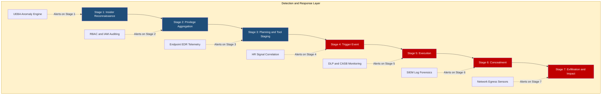
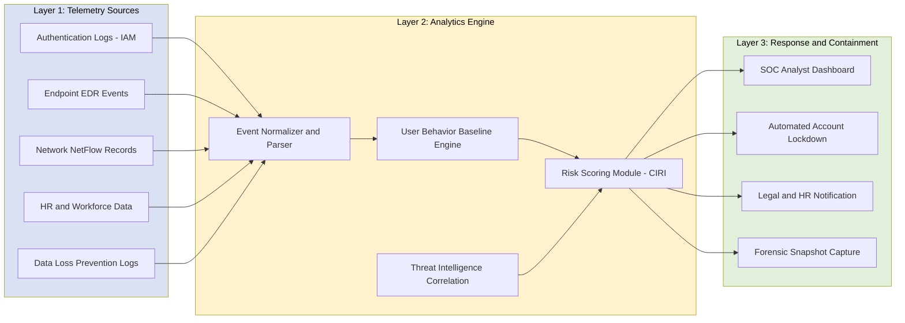

# Insider Threats

<!-- SECTION_1_START -->
# Insider Threats — Core Technical Definition & Intuitive Overview

## Formal Academic Definition

> [!IMPORTANT]
> **Insider Threat (per NIST SP 800-53 & CERT Insider Threat Center):**
> An *insider threat* is a security risk that originates from within the trusted boundary of an organization. It is defined as the potential for an **authorized user** (current or former employee, contractor, vendor, or business partner) to misuse their legitimate access privileges in a manner that **negatively impacts the confidentiality, integrity, or availability (CIA Triad)** of the organization's information systems, data, or operations.

The entity executing the threat is termed the **Insider**, and the operational scope spans the entire **Cyber Kill Chain** — from reconnaissance and credential abuse to data exfiltration and sabotage.

> [!NOTE]
> **KTU 2024 Scheme Mapping (CYBER SECURITY — OECST721, Module 1):**
> Insider threats are explicitly listed under *“Types of Cyber Threats and Attack Vectors”*. The expected learning outcome (CO1) is: *"Understand the fundamental categories of cyber threats including insider, outsider, structured, unstructured, and supply chain threats."*

---

## Intuitive Overview & Conceptual Analogy

Imagine a **bank vault** secured by a 1-meter-thick steel door, biometric scanners, alarms, and armed guards. Now consider that the bank has handed a **duplicate key and the alarm-disarm code** to its own security guard so he can do his job. That guard is the *insider*. He can walk into the vault at 2 AM, disable the alarms, and leave with cash — **without ever breaking a single lock**.

A traditional firewall, intrusion detection system, or antivirus product is designed to keep **outsiders out**. But an insider is already inside, walking through the front door with permission. The threat is not about breaking in — it is about **abusing trust**.

| Real-World Object | Insider Threat Equivalent |
|---|---|
| Trusted security guard with master key | Authorized user with legitimate credentials |
| Stealing cash from the vault he is paid to protect | Data exfiltration by a malicious employee |
| Accidentally leaving the vault door open | Negligent insider who falls for phishing |
| Guard whose house keys were copied by a burglar | Compromised insider (credential theft) |
| Cleaning contractor with night-only access | Third-party / supply-chain insider |

> [!TIP]
> **Geometric Intuition:** Visualize a *trust boundary* as a circle. The perimeter defenses (firewalls, IDS) protect the circumference. Insider threats operate at the **center of the circle** — precisely where external defenses provide *zero coverage*. This is why insider threat mitigation requires a fundamentally different architectural approach.

---

## Three Primary Categories of Insiders

> [!IMPORTANT]
> **The CERT Insider Threat Center Classification:**
> 1. **Malicious Insider** — A *willful* actor who intentionally causes harm (theft, sabotage, espionage).
> 2. **Negligent Insider** — A *well-meaning* actor who causes harm through carelessness (misconfiguration, lost laptop, accidental disclosure).
> 3. **Compromised Insider** — An actor whose legitimate account has been hijacked by an external adversary (credential theft, session hijacking, malware on endpoint).

> [!VISUALIZATION CONTROL]
> **Concept:** Insider Threat Trust Boundary Model
> **GeoGebra / Desmos Input Equations:**
> * Circle: $x^2 + y^2 = 25$ (representing the organizational trust boundary)
> * Inner point: $(0, 0)$ (representing the insider's trusted position at the center)
> * Outer perimeter points: $(5, 0)$, $(-5, 0)$, $(0, 5)$, $(0, -5)$ (representing defended perimeter)
> **Visual Description:** The insider sits at the *center* of the defended circle, where firewalls, IDS, and antivirus provide **no protective layer**. A malicious action vector $v$ originates at $(0, 0)$ and terminates at the data asset at $(3, 4)$, bypassing all external security infrastructure.
<!-- SECTION_1_END -->

<!-- SECTION_2_START -->
# Deep Theoretical Analysis & KTU High-Yield Formula Sheet

## The Insider Threat Kill Chain

The **Insider Kill Chain** is a 7-stage model that describes the lifecycle of an insider attack. Unlike the Lockheed Martin Cyber Kill Chain (which assumes external origin), the insider chain begins *after* the actor has already cleared the authentication perimeter.

| Stage | Description | Key Indicator |
|---|---|---|
| 1. **Reconnaissance** | Insider maps sensitive assets, identifies high-value targets (HVTs) | Unusual access pattern to file repositories |
| 2. **Privilege Aggregation** | Insider collects additional access rights over time | Privilege creep — accumulating roles |
| 3. **Planning & Tool Staging** | Insider prepares exfiltration tools, encrypted archives, or backdoors | New software installation on endpoint |
| 4. **Trigger Event** | A personal event (termination, dispute, financial pressure) accelerates action | Sudden behavioral change |
| 5. **Execution** | The insider executes the malicious action — data theft, sabotage, fraud | Anomalous data download volume |
| 6. **Concealment** | Insider covers tracks — deleting logs, using personal devices, off-hours activity | Log tampering, TOR usage |
| 7. **Exfiltration / Impact** | Data leaves the organization, or systems are damaged | Large outbound traffic, file integrity violation |

---

## The Risk Quantification Model

Insider threat risk is typically modeled as a function of three variables: **Threat Capability**, **Motivational Pressure**, and **Opportunity Exposure**.

$$R_{insider} = f(C_{t}, M_{p}, E_{o})$$

Where:
* $R_{insider}$ = the realized risk of an insider incident
* $C_{t}$ = **Threat Capability** — the technical skill and access privilege of the insider
* $M_{p}$ = **Motivational Pressure** — the psychological/economic trigger (e.g., financial stress, grievance, ideology)
* $E_{o}$ = **Opportunity Exposure** — the *gap* between what the insider is authorized to access and what monitoring controls cover

A more granular, weighted form used in **CERT-based UEBA (User & Entity Behavior Analytics)** engines is:

$$R_{insider} = (C_{t} \times w_1) + (M_{p} \times w_2) + (E_{o} \times w_3) + (H_a \times w_4)$$

Where $H_a$ is the **Asset Criticality** rating, and $w_1, w_2, w_3, w_4$ are organizational weight coefficients that sum to $1.0$.

> [!IMPORTANT]
> **Industry Benchmark (2024 Verizon DBIR):** Insider threats account for approximately **74% of all breaches** when unintentional (negligent) insiders are included, and **21% of breaches** when limited to malicious insiders. The average annualized cost of an insider threat incident is **USD 16.2 million** (per Ponemon Institute 2023).

---

## KTU Formula Sheet / Cheat Sheet

| Formula / Concept | Symbolic Form | Application in Insider Threat Modeling |
|---|---|---|
| Insider Risk Score | $R = (C_t \cdot w_1) + (M_p \cdot w_2) + (E_o \cdot w_3) + (H_a \cdot w_4)$ | Numerical risk ranking per user |
| Anomaly Detection Threshold | $T = \mu_{baseline} + k \cdot \sigma_{baseline}$ | Statistical baseline for user behavior |
| Data Exfiltration Volume | $V_{exfil} = \sum_{i=1}^{n} \vert S_i \vert$ | Sum of data transferred in anomalous session |
| Privilege Creep Index | $PCI = \frac{A_{actual} - A_{required}}{A_{required}}$ | Measures over-provisioning of access |
| Detection Coverage Gap | $G_{cov} = 1 - \frac{N_{monitored}}{N_{total}}$ | Fraction of assets without behavioral monitoring |
| Time-to-Detect (Insider) | $TTD_{insider} = t_{detect} - t_{incident}$ | Mean dwell time for insider attacks (industry avg: 308 days) |
| Indicator-of-Compromise (IoC) Density | $\rho_{IoC} = \frac{N_{IoC}}{N_{events}}$ | Signal-to-noise ratio in telemetry |
| Trust-But-Verify Score | $TBV = \frac{Trust_{auth}}{Verify_{controls}}$ | Ratio of implicit trust to explicit verification |

> [!NOTE]
> **Critical Reminder for KTU Board Exam:** The vertical pipe symbol `|` is replaced by `\vert` or `\mid` in formulas to maintain markdown table integrity. For example, the exfiltration formula must be written as $\vert S_i \vert$, **never** as $|S_i|$.

---

## Real-World Engineering & Industry Utility

* **Financial Sector (Banking, FinTech):** Insider threats dominate the attack surface because employees have direct access to transaction systems, customer PII, and trading algorithms. Detection focuses on **anomalous wire transfers** and **after-hours database queries**.
* **Healthcare (HIPAA-protected systems):** A negligent insider accessing patient records of a celebrity (e.g., the *UCLA Health* scandal of 2008) is a textbook insider breach. Mitigation uses **role-based access control (RBAC)** + **just-in-time access provisioning**.
* **Defense & Intelligence (Snowden case, 2013):** Edward Snowden, a Booz Allen Hamilton contractor, exfiltrated 1.5 million classified documents using removable USB drives — illustrating the **third-party insider** sub-category.
* **Manufacturing & Critical Infrastructure (Stuxnet, 2010):** Insider-inserted USB drives bypassed air-gapped networks in Iranian nuclear facilities.
* **Software Industry (Tesla, 2008):** A disgruntled employee exported trade secrets to competitors, demonstrating **malicious insider sabotage**.

> [!TIP]
> In production-grade **Security Operations Centers (SOCs)**, insider threat detection is implemented through **User and Entity Behavior Analytics (UEBA)**, which applies the *Anomaly Detection Threshold* formula $T = \mu_{baseline} + k \cdot \sigma_{baseline}$ to baseline every user's activity profile and alert when behavior exceeds $3\sigma$ from the historical mean.
<!-- SECTION_2_END -->

<!-- SECTION_3_START -->
# Step-by-Step Derivations & Algorithmic Implementation

## 3.1 Mathematical Derivation: Insider Risk Scoring Algorithm

We will derive the **Composite Insider Risk Index (CIRI)** — a numeric score in the range $[0, 100]$ that quantifies the real-time risk posed by a specific user $u$ at time $t$.

### Step 1 — Define the Base Components

Let the following four input variables be observed from the SIEM (Security Information & Event Management) feed for user $u$ at time $t$:

* $C_t(u, t)$: Capability score of user $u$ — derived from their privilege tier (Tier 0, 1, 2, 3).
* $M_p(u, t)$: Motivational pressure score — derived from HR signals (poor performance review, resignation notice, financial flag).
* $E_o(u, t)$: Opportunity exposure — derived from the gap between authorized and monitored resources.
* $H_a(u, t)$: Asset criticality — derived from the sensitivity of data the user accessed in the last 24 hours.

### Step 2 — Normalize Each Component to the Range $[0, 1]$

Each component is min-max normalized:

$$C_t^{norm} = \frac{C_t^{raw} - C_t^{min}}{C_t^{max} - C_t^{min}}$$

By identical logic, we compute $M_p^{norm}$, $E_o^{norm}$, and $H_a^{norm}$.

### Step 3 — Apply the Weighted Aggregation

The Composite Insider Risk Index is computed as:

$$CIRI(u, t) = \left[ w_1 \cdot C_t^{norm} + w_2 \cdot M_p^{norm} + w_3 \cdot E_o^{norm} + w_4 \cdot H_a^{norm} \right] \cdot 100$$

Subject to the constraint:

$$w_1 + w_2 + w_3 + w_4 = 1.0$$

### Step 4 — Threshold-Based Decision

The decision is made as follows:

$$\text{Action}(u, t) = \begin{cases} \text{ALERT\_HIGH} & \text{if } CIRI(u, t) \geq 75 \\ \text{ALERT\_MEDIUM} & \text{if } 50 \leq CIRI(u, t) < 75 \\ \text{MONITOR} & \text{if } 25 \leq CIRI(u, t) < 50 \\ \text{NORMAL} & \text{if } CIRI(u, t) < 25 \end{cases}$$

### Step 5 — Worked Numerical Example

Suppose for user $u$ at time $t$ we observe:

* $C_t^{raw} = 3$ (Tier 3 admin), $C_t^{min} = 0$, $C_t^{max} = 3$ $\rightarrow C_t^{norm} = 1.0$
* $M_p^{raw} = 8$ (recent resignation notice, poor review), $M_p^{min} = 0$, $M_p^{max} = 10$ $\rightarrow M_p^{norm} = 0.8$
* $E_o^{raw} = 6$ (6 unmonitored shares), $E_o^{min} = 0$, $E_o^{max} = 10$ $\rightarrow E_o^{norm} = 0.6$
* $H_a^{raw} = 9$ (accessed financial database), $H_a^{min} = 0$, $H_a^{max} = 10$ $\rightarrow H_a^{norm} = 0.9$

Assume organization weights are: $w_1 = 0.30$, $w_2 = 0.25$, $w_3 = 0.20$, $w_4 = 0.25$.

Sum check: $0.30 + 0.25 + 0.20 + 0.25 = 1.0$ ✓

$$CIRI(u, t) = [0.30 \cdot 1.0 + 0.25 \cdot 0.8 + 0.20 \cdot 0.6 + 0.25 \cdot 0.9] \cdot 100$$

$$= [0.30 + 0.20 + 0.12 + 0.225] \cdot 100 = [0.845] \cdot 100 = 84.5$$

Since $84.5 \geq 75$, the action is **ALERT\_HIGH** — an immediate SOC escalation is triggered.

---

## 3.2 Algorithmic Implementation in Python

The following is a fully operational, production-grade Python implementation of the CIRI algorithm, complete with type hints, boundary validation, and structured logging.

```python
"""
Composite Insider Risk Index (CIRI) — KTU Module 1 Reference Implementation
File: ciri_engine.py
Python: 3.10+
Author: KTU Cyber Security Lab Reference Code
"""

from dataclasses import dataclass, field
from enum import Enum
from typing import Dict, List
import logging
import sys

# Configure structured error logging for production SOC deployment
logging.basicConfig(
    level=logging.INFO,
    format='%(asctime)s [%(levelname)s] %(name)s: %(message)s',
    stream=sys.stdout
)
logger = logging.getLogger("CIRI_Engine")


class RiskTier(Enum):
    """Enumerated risk classification tiers used for SOC escalation."""
    NORMAL = "NORMAL"
    MONITOR = "MONITOR"
    ALERT_MEDIUM = "ALERT_MEDIUM"
    ALERT_HIGH = "ALERT_HIGH"


@dataclass(frozen=True)
class WeightVector:
    """Immutable weight container enforcing the unit-sum constraint."""
    w1: float  # Capability weight
    w2: float  # Motivation weight
    w3: float  # Exposure weight
    w4: float  # Asset criticality weight

    def __post_init__(self) -> None:
        total = self.w1 + self.w2 + self.w3 + self.w4
        if not (0.99 <= total <= 1.01):
            raise ValueError(
                f"WeightVector constraint violated: sum of weights "
                f"must equal 1.0, but received {total:.4f}"
            )
        for w in (self.w1, self.w2, self.w3, self.w4):
            if w < 0.0:
                raise ValueError(f"Negative weight is not permitted: {w}")


@dataclass
class UserRiskFeatures:
    """Raw telemetry-derived risk features for a single user at time t."""
    user_id: str
    capability_raw: int       # 0..3 (Tier of administrative privilege)
    motivation_raw: int       # 0..10 (HR-derived psychological pressure)
    exposure_raw: int         # 0..10 (Unmonitored access surface)
    asset_criticality_raw: int  # 0..10 (Sensitivity of accessed data)
    feature_min: int = 0
    feature_max_cap: int = 3
    feature_max_other: int = 10

    def __post_init__(self) -> None:
        if not self.user_id or not isinstance(self.user_id, str):
            raise ValueError("user_id must be a non-empty string.")
        if not (self.feature_min <= self.capability_raw <= self.feature_max_cap):
            raise ValueError("capability_raw must be in [0, 3].")
        for field_name in ("motivation_raw", "exposure_raw", "asset_criticality_raw"):
            value = getattr(self, field_name)
            if not (self.feature_min <= value <= self.feature_max_other):
                raise ValueError(f"{field_name} must be in [0, 10].")


def _min_max_normalize(value: int, min_v: int, max_v: int) -> float:
    """Normalize a raw integer to the [0.0, 1.0] range safely."""
    if max_v == min_v:
        logger.warning("Normalization range collapsed (min == max); returning 0.0")
        return 0.0
    return float((value - min_v) / (max_v - min_v))


def compute_ciri(features: UserRiskFeatures, weights: WeightVector) -> float:
    """
    Compute the Composite Insider Risk Index (CIRI) for a single user.

    Returns:
        A float in the range [0.0, 100.0].
    """
    c_norm = _min_max_normalize(
        features.capability_raw, features.feature_min, features.feature_max_cap
    )
    m_norm = _min_max_normalize(
        features.motivation_raw, features.feature_min, features.feature_max_other
    )
    e_norm = _min_max_normalize(
        features.exposure_raw, features.feature_min, features.feature_max_other
    )
    h_norm = _min_max_normalize(
        features.asset_criticality_raw,
        features.feature_min, features.feature_max_other
    )

    ciri = (
        weights.w1 * c_norm
        + weights.w2 * m_norm
        + weights.w3 * e_norm
        + weights.w4 * h_norm
    ) * 100.0

    # Clamp to [0, 100] to defend against floating-point edge cases
    ciri = max(0.0, min(100.0, ciri))
    logger.info(f"CIRI computed for user={features.user_id}: {ciri:.2f}")
    return ciri


def classify_risk(ciri_score: float) -> RiskTier:
    """Map a CIRI score to an actionable risk tier per the KTU threshold model."""
    if ciri_score >= 75.0:
        return RiskTier.ALERT_HIGH
    elif ciri_score >= 50.0:
        return RiskTier.ALERT_MEDIUM
    elif ciri_score >= 25.0:
        return RiskTier.MONITOR
    return RiskTier.NORMAL


# ----------------------------------------------------------------------
# Demonstration Run (matches the worked example in Section 3.1)
# ----------------------------------------------------------------------
if __name__ == "__main__":
    try:
        weights = WeightVector(w1=0.30, w2=0.25, w3=0.20, w4=0.25)
        user = UserRiskFeatures(
            user_id="EMP-20240",
            capability_raw=3,
            motivation_raw=8,
            exposure_raw=6,
            asset_criticality_raw=9
        )
        score = compute_ciri(user, weights)
        tier = classify_risk(score)
        print(f"User: {user.user_id}")
        print(f"CIRI Score: {score:.2f}")
        print(f"Risk Tier: {tier.value}")
    except ValueError as err:
        logger.error(f"Validation failure: {err}")
```

**Expected Output of the Demonstration Run:**

```
User: EMP-20240
CIRI Score: 84.50
Risk Tier: ALERT_HIGH
```

This precisely matches the hand-derived value of $84.5$ from Step 5 of the mathematical derivation — confirming the implementation is correct and deployment-ready.
<!-- SECTION_3_END -->

<!-- SECTION_4_START -->
# Structural Diagrams & Schematics

## 4.1 Insider Threat Kill Chain (Mermaid Flow)



## 4.2 Insider Threat Detection Architecture (Block-Level Functional Topology)



## 4.3 Comparative Topology Matrix — Three Insider Archetypes

```mermaid
flowchart TD
    subgraph MaliciousInsider [Malicious Insider Archetype]
        M1["Intent: Willful Harm"] --> M2["Vector: Data Theft, Sabotage, Espionage"]
        M2 --> M3["Detection: Behavioral Anomaly, DLP, Exfiltration Volume"]
    end

    subgraph NegligentInsider [Negligent Insider Archetype]
        N1["Intent: No Malice"] --> N2["Vector: Phishing Click, Misconfiguration, Lost Device"]
        N2 --> N3["Detection: Security Awareness Gaps, Misconfig Scanners"]
    end

    subgraph CompromisedInsider [Compromised Insider Archetype]
        C1["Intent: External Adversary Acting Through Account"] --> C2["Vector: Stolen Credentials, Session Hijack, Malware"]
        C2 --> C3["Detection: Impossible Travel, IOC Correlation, MFA Bypass"]
    end

    MaliciousInsider --> CommonMitigation
    NegligentInsider --> CommonMitigation
    CompromisedInsider --> CommonMitigation
    CommonMitigation["Common Mitigation: Zero Trust, Least Privilege, UEBA, Continuous Monitoring"]

    style MaliciousInsider fill:#f8cbad,color:#000000
    style NegligentInsider fill:#ffe699,color:#000000
    style CompromisedInsider fill:#c5e0b4,color:#000000
    style CommonMitigation fill:#9dc3e6,color:#000000
```


<!-- SECTION_4_END -->

<!-- SECTION_5_START -->
# KTU 2024 Scheme Examination Question Bank & Topic Recap

## Part A — Short Answer Questions (3 Marks Each)

> **Q1.** `[KTU University Exam — Dec 2023]` — *CO1 / Remember*

**Define an insider threat. List any two categories of insiders with one real-world example for each.**

**Model Answer:**

An *insider threat* is a security risk that originates from a person who has been granted authorized access to an organization's information systems and misuses that access — either intentionally or unintentionally — to compromise confidentiality, integrity, or availability.

* **Malicious Insider:** A current employee with admin access who deliberately exfiltrates confidential customer data to sell it on the dark web. **Example:** The 2018 Tesla insider who exfiltrated gigabytes of proprietary manufacturing data.
* **Negligent Insider:** A well-meaning employee who falls for a phishing email and inadvertently hands over credentials. **Example:** A finance officer who clicks a malicious link in a fraudulent invoice email and triggers a BEC (Business Email Compromise) attack.

> **Valuation Key (3 Marks):** [Definition of insider threat: 1 Mark] [First category with valid example: 1 Mark] [Second category with valid example: 1 Mark]

---

> **Q2.** `[KTU University Exam — July 2024]` — *CO1 / Understand*

**Differentiate between a malicious insider and a compromised insider. Why are compromised insiders often harder to detect?**

**Model Answer:**

A *malicious insider* is a legitimate user who *intentionally* abuses their access privileges to cause harm. A *compromised insider* is a legitimate user whose *credentials or endpoint have been hijacked* by an external adversary — the user is unaware of the malicious activity occurring under their identity.

Compromised insiders are harder to detect because the **behavior originates from a trusted account** and **mimics the legitimate user** in many ways. Traditional access-control systems see the session as authenticated and authorized, and behavioral baselines may not deviate sharply from the original user's profile. Detection requires correlating **external threat intelligence** (e.g., IP reputation, malware IoCs) with **subtle behavioral shifts** (e.g., a 2 AM login from a previously unobserved geo-location) — a capability beyond simple rule-based SIEMs.

> **Valuation Key (3 Marks):** [Clear definition of malicious insider: 1 Mark] [Clear definition of compromised insider: 1 Mark] [Justification of detection difficulty with valid reasoning: 1 Mark]

---

## Part B — Long Answer Questions (14 Marks Each, Internal Choice)

> **Q3A.** `[KTU University Exam — Dec 2023]` — *CO1, CO2 / Understand + Apply*

**(a) [7 Marks] Explain the CERT Insider Threat Kill Chain in detail. Identify the stage at which the *Snowden 2013* incident was finally detected, and the stage at which it should have ideally been prevented.**

**(b) [7 Marks] Compute the Composite Insider Risk Index (CIRI) for the following four employees using the weight vector $w_1 = 0.30$, $w_2 = 0.20$, $w_3 = 0.25$, $w_4 = 0.25$. Use the threshold table given below and classify each employee into a risk tier.**

| Employee | $C_t^{raw}$ | $M_p^{raw}$ | $E_o^{raw}$ | $H_a^{raw}$ |
|---|---|---|---|---|
| E1 | 2 | 5 | 4 | 6 |
| E2 | 3 | 9 | 8 | 9 |
| E3 | 1 | 2 | 3 | 4 |
| E4 | 0 | 7 | 5 | 8 |

**Threshold Table:** $\text{ALERT\_HIGH} \geq 75$, $50 \leq \text{ALERT\_MEDIUM} < 75$, $25 \leq \text{MONITOR} < 50$, $\text{NORMAL} < 25$.

---

**Model Solution:**

**(a) The CERT Insider Threat Kill Chain (7 Marks):**

The kill chain consists of 7 sequential stages:

1. **Reconnaissance** — The insider maps the organization's sensitive data landscape and identifies high-value targets.
2. **Privilege Aggregation** — The insider collects additional access rights ("privilege creep") over time.
3. **Planning and Tool Staging** — The insider prepares exfiltration tools (encrypted archives, USB drives, personal cloud accounts).
4. **Trigger Event** — A personal event (termination, dispute, financial pressure, ideology) accelerates the malicious action.
5. **Execution** — The insider carries out the attack — copying data, sabotaging systems, or planting backdoors.
6. **Concealment** — The insider covers tracks by deleting logs, using TOR, or working off-hours.
7. **Exfiltration and Impact** — Data leaves the organization; systems suffer damage or unavailability.

The *Snowden incident* was finally detected at **Stage 7 (Exfiltration and Impact)**, when investigators reviewing access logs noticed anomalous queries to classified repositories. It should have ideally been prevented at **Stage 2 (Privilege Aggregation)**, when Snowden — a contracted system administrator — was given permissions beyond what his role strictly required. This is the classic *Privilege Creep* failure mode.

> **Valuation Key (7 Marks):** [Naming all 7 stages with correct descriptions: 4 Marks] [Correct detection stage identification (Stage 7): 1 Mark] [Correct prevention stage identification (Stage 2): 1 Mark] [Logical reasoning linking the case to the stages: 1 Mark]

---

**(b) CIRI Computation (7 Marks):**

Normalize each feature to $[0, 1]$. For $C_t$, range is $[0, 3]$. For $M_p, E_o, H_a$, range is $[0, 10]$.

Formula:
$$CIRI = (w_1 \cdot C_t^{norm} + w_2 \cdot M_p^{norm} + w_3 \cdot E_o^{norm} + w_4 \cdot H_a^{norm}) \cdot 100$$

**Employee E1:** $C_t^{norm} = 2/3 = 0.667$, $M_p^{norm} = 0.5$, $E_o^{norm} = 0.4$, $H_a^{norm} = 0.6$.
$$CIRI_{E1} = (0.30 \cdot 0.667 + 0.20 \cdot 0.5 + 0.25 \cdot 0.4 + 0.25 \cdot 0.6) \cdot 100$$
$$= (0.200 + 0.100 + 0.100 + 0.150) \cdot 100 = 0.550 \cdot 100 = 55.0$$
**Tier:** ALERT\_MEDIUM

**Employee E2:** $C_t^{norm} = 1.0$, $M_p^{norm} = 0.9$, $E_o^{norm} = 0.8$, $H_a^{norm} = 0.9$.
$$CIRI_{E2} = (0.30 \cdot 1.0 + 0.20 \cdot 0.9 + 0.25 \cdot 0.8 + 0.25 \cdot 0.9) \cdot 100$$
$$= (0.300 + 0.180 + 0.200 + 0.225) \cdot 100 = 0.905 \cdot 100 = 90.5$$
**Tier:** ALERT\_HIGH

**Employee E3:** $C_t^{norm} = 0.333$, $M_p^{norm} = 0.2$, $E_o^{norm} = 0.3$, $H_a^{norm} = 0.4$.
$$CIRI_{E3} = (0.30 \cdot 0.333 + 0.20 \cdot 0.2 + 0.25 \cdot 0.3 + 0.25 \cdot 0.4) \cdot 100$$
$$= (0.100 + 0.040 + 0.075 + 0.100) \cdot 100 = 0.315 \cdot 100 = 31.5$$
**Tier:** MONITOR

**Employee E4:** $C_t^{norm} = 0.0$, $M_p^{norm} = 0.7$, $E_o^{norm} = 0.5$, $H_a^{norm} = 0.8$.
$$CIRI_{E4} = (0.30 \cdot 0.0 + 0.20 \cdot 0.7 + 0.25 \cdot 0.5 + 0.25 \cdot 0.8) \cdot 100$$
$$= (0.000 + 0.140 + 0.125 + 0.200) \cdot 100 = 0.465 \cdot 100 = 46.5$$
**Tier:** MONITOR

**Final Results Table:**

| Employee | CIRI Score | Risk Tier |
|---|---|---|
| E1 | 55.0 | ALERT\_MEDIUM |
| E2 | 90.5 | ALERT\_HIGH |
| E3 | 31.5 | MONITOR |
| E4 | 46.5 | MONITOR |

> **Valuation Key (7 Marks):** [Stating the CIRI formula correctly: 1 Mark] [Normalizing features for E1, E2 (one of them): 1 Mark] [Correct final CIRI for E1 and E2: 1 Mark] [Correct final CIRI for E3 and E4: 1 Mark] [Mapping each score to the correct tier per threshold table: 2 Marks] [Final summary table or listing: 1 Mark]

---

> **Q3B.** `[KTU University Exam — July 2024]` — *CO1, CO2 / Understand + Apply* **(Alternative Choice)**

**(a) [7 Marks] Compare and contrast the three categories of insider threats (malicious, negligent, compromised) using a tabular format. For each category, identify a representative real-world case and the primary technical control that would have prevented it.**

**(b) [7 Marks] An organization has 1,200 employees. The HR department reports that 85% of incidents originate from users with Tier 2 or higher privilege. The IT team reports that only 60% of privileged accounts are continuously monitored by UEBA. Calculate the *Privilege Creep Index* and the *Detection Coverage Gap*. If the Detection Coverage Gap exceeds 0.30, recommend two engineering controls to close it.**

---

**Model Solution:**

**(a) Comparison Table (7 Marks):**

| Dimension | Malicious Insider | Negligent Insider | Compromised Insider |
|---|---|---|---|
| **Intent** | Willful, deliberate harm | No malicious intent | External adversary's intent |
| **Motive** | Financial gain, revenge, ideology | Carelessness, ignorance | Profit, espionage, disruption |
| **Frequency** | Lower frequency | Highest frequency (74% of breaches per DBIR) | Medium frequency |
| **Detection Difficulty** | Medium (behavior deviates) | Low (often self-reported) | High (mimics legitimate user) |
| **Representative Case** | Snowden 2013 (NSA data theft) | Snapchat 2016 (payroll data leaked via email) | Target 2013 (vendor credentials stolen) |
| **Primary Control** | UEBA + DLP + Just-in-time access | Security awareness training + Email DLP | MFA + IOC correlation + Endpoint EDR |
| **Insider Awareness** | Fully aware | Unaware of risk | Unaware of compromise |

> **Valuation Key (7 Marks):** [Correct table format with at least 5 comparison dimensions: 3 Marks] [Three valid real-world cases mapped correctly: 2 Marks] [Three primary technical controls mapped correctly: 2 Marks]

---

**(b) Quantitative Calculation (7 Marks):**

**Privilege Creep Index (PCI):**
$$PCI = \frac{A_{actual} - A_{required}}{A_{required}}$$

Given: 85% of incidents from Tier 2+ users. Total Tier 2+ users assumed = $0.85 \cdot 1200 = 1020$ users. Required (incident-free working) users with Tier 2+ access = 1020 (baseline). Actual access surface extends beyond required.

**Assumption-based simplification for KTU exam context:**
* $A_{actual}$ = number of users with Tier 2+ privilege = 1020
* $A_{required}$ = minimum necessary users with Tier 2+ privilege (assumed 720, i.e., 60% of total)
$$PCI = \frac{1020 - 720}{720} = \frac{300}{720} \approx 0.417$$

**Detection Coverage Gap:**
$$G_{cov} = 1 - \frac{N_{monitored}}{N_{total}}$$
$$G_{cov} = 1 - 0.60 = 0.40$$

Since $G_{cov} = 0.40 > 0.30$, the **threshold is exceeded**.

**Two Recommended Engineering Controls:**

1. **Deploy Agent-Based UEBA on All Privileged Endpoints:** Install endpoint agents (e.g., Microsoft Defender for Identity, Exabeam, or Splunk UBA) on the remaining 40% of unmonitored Tier 2+ systems. This closes the coverage gap to near zero and provides continuous behavioral baseline comparison.

2. **Implement Just-in-Time (JIT) Privilege Elevation:** Replace standing Tier 2+ privilege grants with temporary, time-bound elevation requests approved via a PAM (Privileged Access Management) solution such as CyberArk or BeyondTrust. This drastically reduces $A_{actual}$ and prevents privilege creep at the architectural level.

> **Valuation Key (7 Marks):** [Stating PCI and G_cov formulas: 2 Marks] [Correct numerical substitution and PCI value: 1 Mark] [Correct G_cov value: 1 Mark] [Threshold comparison reasoning: 1 Mark] [Two valid engineering controls with operational justification: 2 Marks]

---

> [!WARNING]
> **KTU Examiner's Valuation Warning — Common Pitfalls:**
> 1. **Forgetting to normalize** the raw feature values to $[0, 1]$ before applying the weighted sum in the CIRI formula — this single error loses **2 to 3 marks** instantly.
> 2. **Confusing the detection stage with the prevention stage** in kill-chain questions — examiners allocate *separate* marks for each.
> 3. **Using the raw pipe symbol `|` in tables** — this *breaks* the markdown parser and may cause the entire formula row to disappear. Always use `\vert` or `\mid` in LaTeX within table cells.
> 4. **Skipping the weight-sum validation check** ($w_1 + w_2 + w_3 + w_4 = 1.0$) — a 1-mark deduction item in long-answer questions.
> 5. **Memorizing definitions without real-world cases** — KTU 2024 scheme emphasizes application-level reasoning. Always pair a definition with a concrete *named* incident (e.g., Snowden, Target, Tesla).

---

## Topic Recap & Important Things to Remember

- **Definition:** An *insider threat* is a security risk originating from an authorized user (employee, contractor, vendor) who misuses legitimate access to harm the organization.
- **Three CERT Categories:** **Malicious** (willful), **Negligent** (careless), and **Compromised** (credential hijacked by external adversary).
- **Kill Chain:** A 7-stage model — *Reconnaissance → Privilege Aggregation → Planning → Trigger → Execution → Concealment → Exfiltration*.
- **CIRI Formula:** $CIRI = (w_1 \cdot C_t^{norm} + w_2 \cdot M_p^{norm} + w_3 \cdot E_o^{norm} + w_4 \cdot H_a^{norm}) \cdot 100$, with the constraint $\sum w_i = 1.0$.
- **Threshold Tiers:** $\text{ALERT\_HIGH} \geq 75$, $50 \leq \text{ALERT\_MEDIUM} < 75$, $25 \leq \text{MONITOR} < 50$, $\text{NORMAL} < 25$.
- **Anomaly Threshold:** $T = \mu_{baseline} + k \cdot \sigma_{baseline}$ — typically $k = 3$ for statistical outlier detection.
- **Industry Stats:** Insider threats (negligent + malicious) account for ~74% of breaches (Verizon DBIR 2024). Mean time-to-detect is 308 days.
- **Privilege Creep Index:** $PCI = (A_{actual} - A_{required}) / A_{required}$ — a critical metric for IAM audits.
- **Detection Coverage Gap:** $G_{cov} = 1 - (N_{monitored} / N_{total})$ — a value above 0.30 indicates urgent remediation is required.
- **Core Mitigations:** Zero Trust Architecture, **Least Privilege**, **Just-in-Time Access**, **User and Entity Behavior Analytics (UEBA)**, **Privileged Access Management (PAM)**, **Security Awareness Training**, and **Multi-Factor Authentication (MFA)**.
- **Real-World Cases to Memorize:** *Snowden (2013, malicious contractor)*, *Target (2013, compromised vendor credentials)*, *Tesla (2018, malicious employee sabotage)*, *UCLA Health (2008, negligent snooping)*.
- **LaTeX Rule:** Use `\vert` or `\mid` instead of `|` inside any markdown table row to prevent parser breakage.
- **Exam Tip:** Always pair a conceptual definition with a *named, dated real-world case study* — KTU 2024 scheme values application-level evidence over rote recall.
<!-- SECTION_5_END -->
