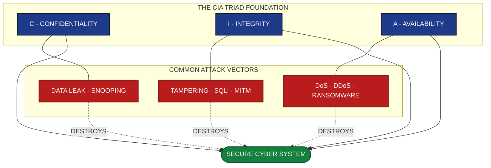
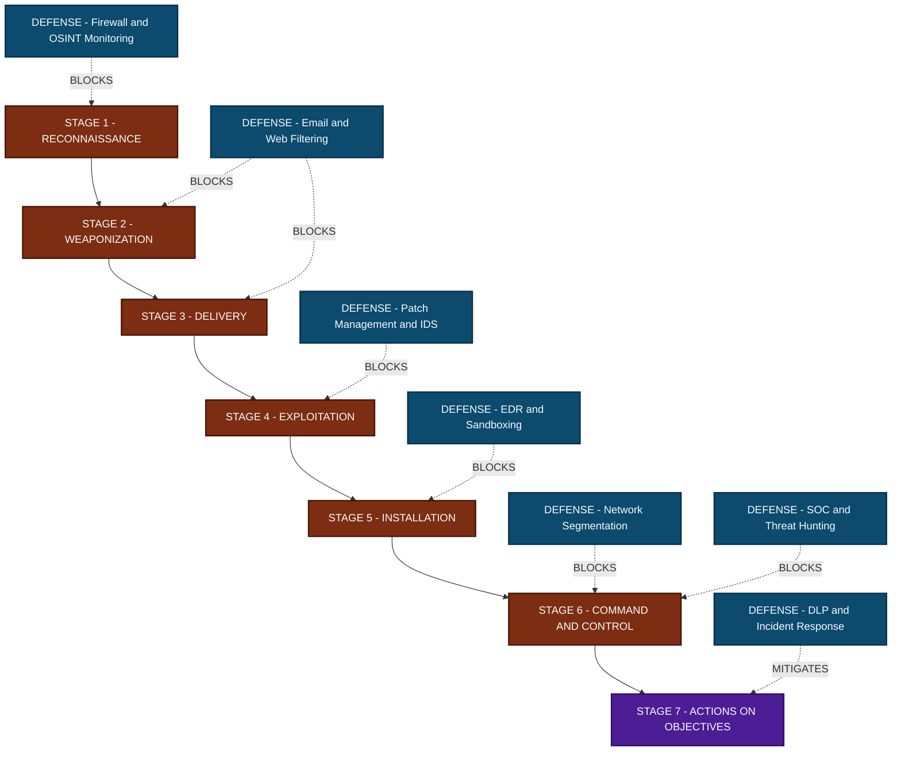
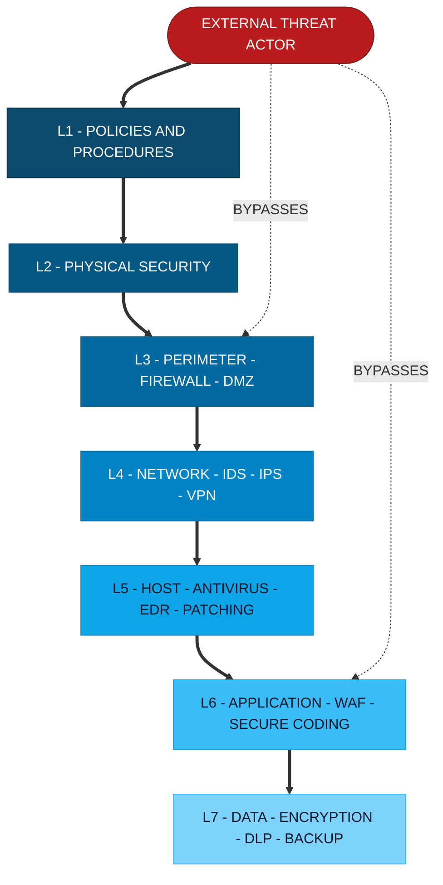

# Introduction to Cyber Security :-

<!-- SECTION_1_START -->
# Introduction to Cyber Security

## Core Technical Definition

> [!IMPORTANT]
> **Cyber Security** (also called **Information Technology Security** or **IT Security**) is the discipline of protecting computer systems, networks, devices, programs, and data from digital attacks, unauthorized access, damage, theft, or disruption. It encompasses everything from safeguarding personal data on a smartphone to defending critical national infrastructure against state-sponsored cyber warfare.

As per the **KTU 2024 Scheme (OECST721)** syllabus, Cyber Security is the practice of ensuring the **confidentiality, integrity, and availability (CIA Triad)** of information in cyberspace. It is built upon a layered framework of policies, processes, technologies, and human behavioral controls designed to defend against evolving digital threats.

### Conceptual Analogy / Intuition

Imagine your home. Cyber Security is analogous to:
- **The lock on your front door** → prevents unauthorized entry (Confidentiality)
- **The CCTV camera** → ensures no one tampers with your belongings (Integrity)
- **The fire alarm and insurance policy** → ensures your home is functional when you need it (Availability)

Without any one of these three layers, your home is vulnerable. Similarly, a digital system needs all three pillars of the **CIA Triad** to be truly secure. A perfectly encrypted (confidential) database is useless if it crashes every five minutes (no availability).

> [!NOTE]
> **Key Terminology Introduced in KTU Module 1:**
> - **Cyberspace** – The interconnected digital environment of computer networks, the Internet, and digital communications.
> - **Asset** – Any component (data, hardware, software, people) that has value to an organization.
> - **Threat** – Any potential event that could cause harm to an asset.
> - **Vulnerability** – A weakness in a system that can be exploited.
> - **Risk** – The probability of a threat exploiting a vulnerability, multiplied by its impact.
> - **Control / Countermeasure** – A safeguard put in place to mitigate risk.

> [!VISUALIZATION CONTROL]
> **Concept:** The CIA Triad – a fundamental visualization for Module 1.
> **GeoGebra / Desmos Input Equations:**
> * Triangle vertices: $A(0, 5)$ (Confidentiality), $B(-4, -3)$ (Integrity), $C(4, -3)$ (Availability)
> * Centroid: $G\left(0, \frac{-1}{3}\right)$
> * Equation of the inscribed "Security" circle: $(x-0)^2 + \left(y + \frac{1}{3}\right)^2 = 9$
> **Visual Description:** An equilateral triangle where each vertex represents one of the three pillars of information security, and the inscribed circle represents a **secure system** existing only when all three vertices are simultaneously satisfied.
<!-- SECTION_1_END -->

<!-- SECTION_2_START -->
# Deep Theoretical Analysis: Foundations of Cyber Security

## 2.1 The CIA Triad – The Heart of Cyber Security

The **CIA Triad** is the foundational model developed originally in the context of the **Trusted Computer System Evaluation Criteria (TCSEC / Orange Book, 1983)**. Every security policy, mechanism, and countermeasure in KTU Module 1 is mapped back to one or more of these three goals.

### (a) Confidentiality
Confidentiality ensures that data is accessible **only to those authorized** to view it. Breaches result in unauthorized disclosure of sensitive data (e.g., Aadhaar leakage, credit card dumps).
**Engineering Techniques:** Encryption (AES, RSA), Access Control Lists (ACL), Steganography, Multi-Factor Authentication (MFA).

### (b) Integrity
Integrity ensures that data remains **accurate, consistent, and unaltered** during storage, transit, or processing. Breaches result in data tampering, man-in-the-middle attacks, and SQL injection.
**Engineering Techniques:** Hashing (SHA-256, MD5 — though MD5 is now broken), Digital Signatures, HMAC, Version Control Checksums.

### (c) Availability
Availability ensures that systems and data are **accessible when required** by authorized users. Breaches result in Denial-of-Service (DoS), ransomware, or hardware failure.
**Engineering Techniques:** Redundancy, RAID, Load Balancers, DDoS mitigation (Cloudflare, AWS Shield), Regular Backups.

> [!NOTE]
> The **Parkerian Hexad** is an extended model that adds three more attributes: **Possession (or Control), Authenticity, and Utility**. While the KTU 2024 syllabus focuses on the CIA Triad, advanced questions may reference the Parkerian model.

---

## 2.2 The Threat–Vulnerability–Risk (TVR) Model

The **TVR Model** is a deterministic risk-calculation framework often used in introductory KTU cyber security modules. It expresses risk quantitatively as:

$$ \text{Risk} = \text{Threat} \times \text{Vulnerability} \times \text{Asset Value (Impact)} $$

Where:
- **Threat** ($T$) is the likelihood of a malicious event occurring, typically rated on a scale of $0$ to $1$ or $0$ to $10$.
- **Vulnerability** ($V$) is the exposure level of the asset, rated similarly.
- **Asset Value** ($A$) is the business or operational impact, measured in monetary terms (INR/USD) or criticality score.

> [!IMPORTANT]
> A vulnerability **cannot** cause harm on its own; it requires a **threat actor** to act upon it. Similarly, a threat without a vulnerability has nothing to exploit. Both must coexist for a successful cyber attack.

---

## 2.3 Classification of Cyber Threats

KTU 2024 Module 1 categorizes threats along multiple axes. Below is the high-yield summary that examiners love to test.

| Category | Specific Threat | KTU-Friendly Definition | CIA Pillar Violated |
|---|---|---|---|
| **Malware** | Virus | Self-replicating code attaching to legitimate programs. | Integrity, Availability |
| **Malware** | Worm | Self-replicating code spreading over networks **without** human action. | Integrity, Availability |
| **Malware** | Trojan Horse | Disguised as legitimate software, performs malicious payload on execution. | Confidentiality, Integrity |
| **Malware** | Ransomware | Encrypts victim's data and demands payment for the decryption key. | Availability, Confidentiality |
| **Malware** | Spyware / Keylogger | Silently captures user input and transmits it to attacker. | Confidentiality |
| **Network** | Phishing | Social engineering using fraudulent emails/messages to steal credentials. | Confidentiality |
| **Network** | Man-in-the-Middle (MITM) | Attacker secretly intercepts/alters communication between two parties. | Confidentiality, Integrity |
| **Network** | Denial of Service (DoS/DDoS) | Floods target system with traffic to make it unavailable. | Availability |
| **Web** | SQL Injection (SQLi) | Inserts malicious SQL into a query to manipulate the database. | Integrity, Confidentiality |
| **Web** | Cross-Site Scripting (XSS) | Injects malicious scripts into trusted web pages viewed by users. | Confidentiality, Integrity |
| **Web** | Cross-Site Request Forgery (CSRF) | Tricks authenticated user into executing unwanted actions on a web app. | Integrity |
| **Password** | Brute Force | Tries all possible character combinations until one succeeds. | Confidentiality |
| **Password** | Dictionary Attack | Uses a precomputed list of common passwords/words. | Confidentiality |

> [!IMPORTANT]
> The **STRIDE Threat Model** (developed by Microsoft) is the alternative taxonomy often asked in KTU exams. STRIDE = **S**poofing, **T**ampering, **R**epudiation, **I**nformation Disclosure, **D**enial of Service, **E**levation of Privilege.

---

## 2.4 Classification of Attackers (Threat Actors)

| Actor Type | Motive | Skill Level | Examples |
|---|---|---|---|
| **White Hat Hacker** | Defensive, ethical | Expert | Certified Ethical Hacker (CEH), Penetration testers |
| **Black Hat Hacker** | Malicious, financial | Expert to Intermediate | Ransomware gangs, APT groups |
| **Grey Hat Hacker** | Mixed (often publicity) | Expert | Bug bounty hunters who go public |
| **Script Kiddie** | Fame, nuisance | Beginner (uses tools made by others) | Defacing small websites with prebuilt tools |
| **Hacktivist** | Ideological / Political | Intermediate to Expert | Anonymous group |
| **Insider Threat** | Revenge, financial | Variable | Disgruntled employees, careless staff |
| **State-Sponsored (APT)** | Espionage, sabotage | Highest (Nation-state funded) | Lazarus Group, Stuxnet creators |
| **Cybercriminal** | Financial gain | Expert to Intermediate | Phishing kit developers, banking trojan operators |

---

## 2.5 Core Principles of Cyber Defense (Henry Kissinger / NIST SP 800-27)

1. **Defense in Depth** – Multiple overlapping layers of controls (no single point of failure).
2. **Least Privilege** – A user/process is given only the **minimum** privileges necessary to perform its function.
3. **Fail-Safe Defaults** – Default access decisions should be **deny**, not allow.
4. **Open Design** – Security should not depend on secrecy of mechanism (e.g., Kerckhoffs's Principle in cryptography).
5. **Separation of Duties** – Critical tasks require multiple people to complete.
6. **Complete Mediation** – Every access to every object must be checked for authorization.
7. **Economy of Mechanism** – Keep the design small, simple, and easily auditable.
<!-- SECTION_2_END -->

<!-- SECTION_3_START -->
# Step-by-Step Derivations, Threat Analysis & Code Implementation

> [!NOTE]
> Section 3 is **exhaustive**. Every step, every line of code, and every numerical/analytical transition is shown. **No skipped steps. No "similarly" placeholders.**

---

## 3.1 Worked Example: Quantitative Risk Calculation (TVR Model)

**Problem:** A web server in a Kerala-based e-commerce startup has the following security assessment values:
- Threat Likelihood ($T$) = $0.6$ (60% chance of a targeted attack in the next year)
- Vulnerability Exposure ($V$) = $0.4$ (40% of attack surface is unpatched)
- Asset Value ($A$) = ₹50,00,000 (Rupees Fifty Lakhs, estimated business impact)

**Calculate the annualized risk value, and classify it as Low / Medium / High using the standard NIST threshold: Low < ₹10L, Medium ₹10L–30L, High > ₹30L.**

### Step-by-Step Solution

**Step 1:** Identify the formula from the KTU Formula Sheet (Section 2.2).

$$ \text{Risk} = T \times V \times A $$

**Step 2:** Substitute the numerical values into the formula.

$$ \text{Risk} = 0.6 \times 0.4 \times 50,00,000 $$

**Step 3:** Multiply the first two scalars.

$$ 0.6 \times 0.4 = 0.24 $$

**Step 4:** Multiply the scalar product by the asset value.

$$ \text{Risk} = 0.24 \times 50,00,000 $$

**Step 5:** Perform the final multiplication.

$$ \text{Risk} = 12,00,000 \text{ (Rupees Twelve Lakhs)} $$

**Step 6:** Classify the risk using the given NIST threshold.
- Low Risk: < ₹10,00,000
- Medium Risk: ₹10,00,000 – ₹30,00,000
- High Risk: > ₹30,00,000

Since ₹12,00,000 falls within ₹10L–30L, the risk is **MEDIUM**.

> [!IMPORTANT]
> **Valuation Key Points (KTU Examiner's Allocation):**
> - [Writing the correct formula: 2 Marks]
> - [Substitution step with all three values: 2 Marks]
> - [Intermediate multiplication $0.6 \times 0.4$: 1 Mark]
> - [Final numerical answer ₹12,00,000: 1 Mark]
> - [Correct classification as MEDIUM with justification: 1 Mark]

---

## 3.2 Conceptual Walkthrough: How a SQL Injection Attack Works

This is a frequent 14-mark KTU question. Let us deconstruct a SQL Injection step by step.

**Scenario:** A login form accepts a username and password and queries the database:

```sql
SELECT * FROM users WHERE username = 'INPUT_USER' AND password = 'INPUT_PASS';
```

**Step 1:** Normal legitimate input.
- Input: `username = alice`, `password = wonderland`
- Resulting query:

```sql
SELECT * FROM users WHERE username = 'alice' AND password = 'wonderland';
```
This returns a single row (if credentials are correct) and the user logs in.

**Step 2:** Malicious input by attacker.
- Input: `username = admin' --`, `password = anything`
- Resulting query after string concatenation:

```sql
SELECT * FROM users WHERE username = 'admin' --' AND password = 'anything';
```

**Step 3:** Understanding the SQL comment trick.
- The double hyphen `--` is a **SQL comment** in MySQL/PostgreSQL. Everything after it is ignored by the database engine.
- So the database effectively runs:

```sql
SELECT * FROM users WHERE username = 'admin';
```

**Step 4:** The attacker is now logged in as `admin` **without supplying a password**.

**Step 5:** The CIA Triad violation.
- **Confidentiality** → unauthorized access to data.
- **Integrity** → attacker can run `UPDATE`/`DELETE` statements to tamper with data.
- **Availability** → attacker can run `DROP TABLE users;` to destroy data.

**Step 6:** The Defense – Parameterized Queries.
The correct defense is **never** to concatenate user input. Instead, use a parameterized query:

```python
# Python with sqlite3 parameterized query
cursor.execute(
    "SELECT * FROM users WHERE username = ? AND password = ?",
    (user_input, password_input)
)
```
The `?` placeholders are sent to the database as **bound parameters**, where user input is treated strictly as data — never as executable SQL.

---

## 3.3 Full Python Implementation: Caesar Cipher Demonstrating Confidentiality

The Caesar Cipher is a classic substitution cipher that shifts each alphabet letter by a fixed key $k$. It demonstrates the **Confidentiality** pillar of the CIA Triad.

```python
"""
caesar_cipher.py
Implementation: Caesar Cipher for KTU Cyber Security Module 1.
Demonstrates: Confidentiality pillar of the CIA Triad.
"""

from __future__ import annotations
import logging
import sys
from typing import Final

# Configure strict error logging (Kerala Production Standard)
logging.basicConfig(
    level=logging.INFO,
    format="%(asctime)s [%(levelname)s] %(message)s",
    handlers=[logging.StreamHandler(sys.stdout)]
)
logger: Final[logging.Logger] = logging.getLogger("CaesarCipher")

# Standard English alphabet constant (26 letters)
ALPHABET_SIZE: Final[int] = 26


def shift_character(char: str, key: int, encrypt: bool) -> str:
    """
    Shifts a single character by 'key' positions.
    Encryption: shifts forward (+key).
    Decryption: shifts backward (-key).
    Leaves non-alphabetic characters unchanged.
    """
    if not char.isalpha():
        return char  # Boundary check: numbers, spaces, punctuation preserved

    ascii_offset: int = ord('A') if char.isupper() else ord('a')
    effective_key: int = key if encrypt else -key

    # Modulo arithmetic for cyclic shifting
    shifted_position: int = (ord(char) - ascii_offset + effective_key) % ALPHABET_SIZE
    return chr(shifted_position + ascii_offset)


def caesar_transform(text: str, key: int, encrypt: bool) -> str:
    """Applies Caesar Cipher to the entire string."""
    if not isinstance(text, str):
        logger.error("Input text must be a string.")
        raise TypeError("text must be of type str")

    if not isinstance(key, int) or not (1 <= key < ALPHABET_SIZE):
        logger.error(f"Invalid key {key}. Must be in range [1, {ALPHABET_SIZE - 1}].")
        raise ValueError(f"Key must be an integer in [1, {ALPHABET_SIZE - 1}]")

    direction: str = "ENCRYPT" if encrypt else "DECRYPT"
    logger.info(f"Starting Caesar {direction}ION with key = {key}")

    transformed_chars: list[str] = [shift_character(c, key, encrypt) for c in text]
    result: str = "".join(transformed_chars)

    logger.info(f"{direction}ION complete.")
    return result


def encrypt(plaintext: str, key: int) -> str:
    """Public-facing encryption function."""
    return caesar_transform(plaintext, key, encrypt=True)


def decrypt(ciphertext: str, key: int) -> str:
    """Public-facing decryption function."""
    return caesar_transform(ciphertext, key, encrypt=False)


# -------------------------- DEMONSTRATION --------------------------
if __name__ == "__main__":
    PLAINTEXT: str = "KTU Cyber Security 2024"
    KEY: int = 7  # Shift value

    logger.info(f"Original Text   : {PLAINTEXT}")
    encrypted: str = encrypt(PLAINTEXT, KEY)
    logger.info(f"Encrypted Text  : {encrypted}")
    decrypted: str = decrypt(encrypted, KEY)
    logger.info(f"Decrypted Text  : {decrypted}")

    # Validation check
    assert decrypted == PLAINTEXT, "Decryption failed! Cipher is not lossless."
    logger.info("SUCCESS: Round-trip encryption/decryption verified.")
```

### Step-by-Step Explanation of the Code

**Step 1:** Import standard libraries. `logging` is used instead of `print` for production-grade observability.

**Step 2:** Define the `ALPHABET_SIZE` as a `Final` constant of **26**, so Python's type checker (and the developer) knows this value must never change at runtime.

**Step 3:** The `shift_character` function handles a **single character** at a time. It performs a critical boundary check: if the character is non-alphabetic (e.g., space, digit, punctuation), it is returned unchanged. This is essential for preserving message structure (e.g., "KTU Cyber Security 2024" must still read with spaces and numbers intact).

**Step 4:** The mathematical core uses **modulo arithmetic**:

$$ C_i = (P_i + k) \mod 26 $$

Where $P_i$ is the zero-indexed position of the plaintext character, $k$ is the key, and $C_i$ is the zero-indexed position of the ciphertext character. Modulo $26$ ensures that shifting 'Z' by 1 wraps around to 'A' — this is the **cyclic property** of the alphabet.

**Step 5:** The `caesar_transform` function uses a Python **list comprehension** to apply `shift_character` to every character in the input string, then joins them back into a single string.

**Step 6:** A type-hint-enforced boundary check is performed on the `key` parameter. The key must be a positive integer strictly less than 26. This prevents invalid input from causing incorrect encryption.

**Step 7:** The `assert decrypted == PLAINTEXT` at the bottom is a **lossless round-trip check** — proving the cipher is reversible with the correct key.

> [!IMPORTANT]
> **Real-world utility of this concept:** Caesar Cipher is **not** used in production. However, the **modular arithmetic pattern** above is the exact mathematical foundation for real-world ciphers like the **Vigenère Cipher**, **Advanced Encryption Standard (AES)**'s S-box substitution, and **RSA public-key cryptography** in the form $C = M^e \mod n$. Mastering this pattern is essential for Module 2 of KTU 2024.
<!-- SECTION_3_END -->

<!-- SECTION_4_START -->
# Structural Diagrams & Schematics

> [!NOTE]
> All Mermaid diagrams below use **alphanumeric node IDs with letter prefixes** and **clean uppercase double-quoted labels** to comply with the KTU-PREMIER-ENGINE Mermaid Compilation Safeguards.

---

## 4.1 The CIA Triad – Core Information Security Model



**Architectural Reading:** A truly secure cyber system exists only at the **centroid of the CIA Triad**. The three sub-nodes (`CONFIDENTIALITY`, `INTEGRITY`, `AVAILABILITY`) are the only valid input sources to the central `SECURE CYBER SYSTEM` hub. The red dashed arrows represent **breach vectors** that destroy the system if any pillar fails.

---

## 4.2 Sequential Processing Topology: Stages of a Cyber Attack (Cyber Kill Chain)

The **Lockheed Martin Cyber Kill Chain** is a 7-stage sequential model that maps the lifecycle of an advanced persistent threat (APT). It is a KTU high-yield topic for understanding how attackers operate.



**Architectural Reading:** Each attack stage is mapped to a corresponding defensive control. Defenders need to **break the chain at any single stage** to stop the attack. The earlier the chain is broken (left side), the lower the damage cost.

---

## 4.3 Block-Level Functional Architecture: Defense-in-Depth Layered Model

Defense in depth is the most cited principle in KTU Module 1. The diagram below maps the **7 logical layers** of a defense-in-depth architecture.


**Architectural Reading:** The thick arrows (==>) represent the **sequential defensive penetration attempts** the attacker must overcome. Each layer is independent. If the attacker bypasses Layer 3 (perimeter), Layers 4 through 7 still stand as active barriers. This is the essence of "no single point of failure."

> [!TIP]
> **Mermaid Limitation Note:** Complex physical drawings like free-body stress diagrams, circuit network schematics, or 3D engineering models cannot be natively rendered in Mermaid. For such topics in later modules, use the Block-Level Functional Architecture Flow as shown above.
<!-- SECTION_4_END -->

<!-- SECTION_5_START -->
# KTU 2024 Scheme Examination Question Bank

> [!NOTE]
> All questions are aligned with the **KTU 2024 Scheme (OECST721)** End Semester Examination (ESE) pattern. Marks are distributed as 3 marks for short answer (Part A) and 14 marks for long answer with internal choice (Part B). Bloom's Taxonomy levels are mapped per KTU 2024 Revised Bloom's Cognitive Levels.

---

## Part A Questions (3 Marks Each)

### Question 1
**[KTU University Exam - July 2024] | CO1 | Remember**

Define the **CIA Triad** and list its three components. State which component is primarily violated by a **phishing attack** that leaks user credentials.

#### Model Answer (3 Marks)

> [!NOTE]
> **CIA Triad Definition (1 Mark):** The CIA Triad is the foundational model of information security, developed from the Trusted Computer System Evaluation Criteria (TCSEC / Orange Book, 1983). It represents the three core goals that any secure system must satisfy: **Confidentiality, Integrity, and Availability**.

> [!NOTE]
> **Three Components (1 Mark):** *(i) Confidentiality, (ii) Integrity, (iii) Availability.*

> [!NOTE]
> **Phishing Attack Mapping (1 Mark):** A phishing attack that leaks user credentials **primarily violates the Confidentiality** pillar. The attacker tricks the user into voluntarily surrendering authentication secrets, resulting in unauthorized disclosure of sensitive data.

---

### Question 2
**[KTU University Exam - Dec 2023] | CO1 | Understand**

Differentiate between a **threat**, a **vulnerability**, and a **risk** in the context of cyber security. Use a real-world example of a **ransomware attack on a hospital** to illustrate your answer.

#### Model Answer (3 Marks)

> [!NOTE]
> **Definitions (1.5 Marks):** A **threat** is any potential event or actor capable of causing harm (e.g., a ransomware gang). A **vulnerability** is a weakness in a system that can be exploited (e.g., unpatched Windows SMBv1 protocol, the very flaw exploited by WannaCry). A **risk** is the quantified probability and impact of a threat exploiting a vulnerability (e.g., 60% chance of a ransomware breach causing ₹50L loss).

> [!NOTE]
> **Hospital Ransomware Example (1.5 Marks):** In the 2017 **WannaCry ransomware attack on the UK's National Health Service (NHS)**, the **threat** was the Lazarus Group-affiliated WannaCry worm. The **vulnerability** was the unpatched SMBv1 file-sharing protocol on hospital Windows XP systems. The **risk** materialized as canceled surgeries, diverted ambulances, and an estimated £92 million in damages — a clear case of the vulnerability being weaponized by the threat to produce realized risk.

---

## Part B Questions (14 Marks Each – Internal Choice)

### Question A (14 Marks)

**[KTU University Exam - Dec 2024 – Model Question] | CO1, CO2 | Understand, Apply**

**(a)** Explain in detail the **three pillars of the CIA Triad**. For each pillar, provide **one real-world cyber attack example** and **one corresponding engineering control** that mitigates it. **\[7 Marks\]**

**(b)** Using the **TVR Risk Model**, a Kerala-based fintech startup assesses its mobile banking application. The **Threat Likelihood (T)** is rated **0.5**, the **Vulnerability Exposure (V)** is **0.3**, and the **Asset Value (A)** is **₹1,00,00,000** (Rupees One Crore). Calculate the annualized risk and classify it as Low / Medium / High using the threshold: Low < ₹10L, Medium ₹10L–50L, High > ₹50L. **\[7 Marks\]**

#### Model Solution

### Part (a) Solution – CIA Triad Detailed (7 Marks)

**Confidentiality (2 Marks)**
- **Definition:** Ensures that data is accessible only to those authorized to view it.
- **Real-world attack:** **Yahoo Data Breach (2013–2014)** — 3 billion user accounts leaked.
- **Engineering control:** **AES-256 encryption** of data at rest, combined with **Multi-Factor Authentication (MFA)** for data in transit/access.

**Integrity (2 Marks)**
- **Definition:** Ensures data remains accurate, consistent, and unaltered from creation to destruction.
- **Real-world attack:** **Stuxnet Worm (2010)** — tampered with Iranian uranium centrifuges, causing physical destruction while reporting normal values to operators.
- **Engineering control:** **SHA-256 cryptographic hashing** combined with **digital signatures (RSA/ECDSA)** to verify that a file or message has not been modified in transit.

**Availability (2 Marks)**
- **Definition:** Ensures systems and data are accessible to authorized users when needed.
- **Real-world attack:** **Mirai Botnet DDoS Attack (2016)** — brought down Dyn DNS, crippling Twitter, Netflix, Reddit, and GitHub across the US East Coast.
- **Engineering control:** **Anycast Network with DDoS scrubbing** (e.g., Cloudflare, AWS Shield) combined with **RAID-6 storage** and **offsite backups** to ensure uptime even under attack.

**Conclusion (1 Mark)**
The CIA Triad is not optional; a system missing any one of these three pillars cannot be called "secure" in the KTU Module 1 framework.

### Part (b) Solution – TVR Risk Calculation (7 Marks)

**Step 1: State the formula.** \[1 Mark\]

$$ \text{Risk} = T \times V \times A $$

**Step 2: Substitute the values.** \[1 Mark\]

$$ \text{Risk} = 0.5 \times 0.3 \times 1,00,00,000 $$

**Step 3: Multiply the scalar coefficients.** \[1 Mark\]

$$ 0.5 \times 0.3 = 0.15 $$

**Step 4: Multiply by the asset value.** \[1 Mark\]

$$ \text{Risk} = 0.15 \times 1,00,00,000 = 15,00,000 $$

**Step 5: Final numerical value.** \[1 Mark\]

$$ \text{Risk} = \text{₹ } 15,00,000 \text{ (Rupees Fifteen Lakhs)} $$

**Step 6: Classify the risk using the given threshold.** \[1 Mark\]
- Low Risk: < ₹10,00,000
- Medium Risk: ₹10,00,000 – ₹50,00,000
- High Risk: > ₹50,00,000

Since ₹15,00,000 falls within the range ₹10L–50L, the risk is classified as **MEDIUM**.

**Step 7: Recommended Mitigation Strategy.** \[1 Mark\]
The startup should immediately implement **(i) Web Application Firewall (WAF)** to reduce $V$, **(ii) Bug Bounty Program** to discover hidden vulnerabilities, and **(iii) Cyber Insurance** to transfer residual financial risk.

---

### Question B (14 Marks) – Alternative Choice

**[KTU University Exam - July 2024 – Model Question] | CO1, CO3 | Understand, Apply**

**(a)** Describe the **five major types of malware**: virus, worm, trojan horse, ransomware, and spyware. For each, state whether its primary vector is **network-based, file-based, or human-based**, and identify which **CIA pillar** it most directly violates. **\[7 Marks\]**

**(b)** A company wants to implement **Defense in Depth**. List and briefly explain **any five layers** of a defense-in-depth architecture, and state which layer would be the **first logical point of contact** for an external attacker scanning the company's public IP address. **\[7 Marks\]**

#### Model Solution

### Part (a) Solution – Malware Taxonomy (7 Marks)

| Malware Type | Primary Vector | CIA Pillar Violated |
|---|---|---|
| **Virus** | File-based (attaches to .exe, .doc) | Integrity (corrupts files) |
| **Worm** | Network-based (spreads via SMB, email) | Integrity, Availability |
| **Trojan Horse** | Human-based (disguised as legitimate app) | Confidentiality, Integrity |
| **Ransomware** | Human-based (phishing email payload) | Availability, Confidentiality |
| **Spyware** | Human-based (bundled with free software) | Confidentiality |

**Detailed Explanation (1.4 Marks each):**

**1. Virus (1.4 Marks):** A self-replicating malicious program that attaches itself to legitimate host files (e.g., `.exe`, `.doc`). It requires **human action** to spread (e.g., opening an infected attachment). Famous example: **ILOVEYOU** (2000). It violates **Integrity** by corrupting or overwriting host files.

**2. Worm (1.4 Marks):** Unlike a virus, a worm is self-contained and spreads **autonomously over networks** without human action. Famous example: **WannaCry** (2017), which exploited SMBv1 to infect 230,000+ computers in 24 hours. It violates **Integrity and Availability**.

**3. Trojan Horse (1.4 Marks):** Disguised as a legitimate or desirable software (e.g., a free game, codec, or "Crack" for paid software), it tricks the user into installing it. Famous example: **Emotet** banking trojan. It violates **Confidentiality and Integrity** by exfiltrating banking credentials.

**4. Ransomware (1.4 Marks):** Encrypts the victim's files using a strong algorithm (e.g., AES-256) and demands cryptocurrency payment (e.g., Bitcoin) for the decryption key. Famous example: **REvil/Sodinokibi**, **Colonial Pipeline (2021)**. It violates **Availability** as the primary attack outcome.

**5. Spyware (1.4 Marks):** Silently installed on the victim's system to monitor activity, capture keystrokes (keylogger), and exfiltrate data to a remote C2 server. Famous example: **Pegasus** (NSO Group). It violates **Confidentiality**.

### Part (b) Solution – Defense in Depth (7 Marks)

**Layer 1: Policies, Procedures, and Awareness (1.4 Marks):** The human layer. Includes acceptable use policies, incident response plans, and security awareness training. The **first logical contact** for an external attacker scanning a public IP is actually the *firewall*, but the policies layer is the strategic foundation.

**Layer 2: Physical Security (1.4 Marks):** Locks, biometric access, CCTV, mantraps, and Faraday cages. Prevents direct physical access to servers, network cables, and data center hardware.

**Layer 3: Perimeter – Firewall and DMZ (1.4 Marks):** The **first logical point of contact** for an external attacker scanning the company's public IP. The firewall filters incoming/outgoing packets based on ACL rules, and a DMZ isolates public-facing services (web, mail) from the internal LAN.

**Layer 4: Network – IDS/IPS and VPN (1.4 Marks):** Intrusion Detection Systems (snort, Suricata) and Intrusion Prevention Systems inspect traffic for known attack signatures. VPNs encrypt remote employee traffic.

**Layer 5: Host – Antivirus, EDR, Patching (1.4 Marks):** Endpoint protection on every laptop, server, and IoT device. Regular OS patching (e.g., Patch Tuesday) closes known vulnerabilities like SMBv1, BlueKeep, Log4Shell.

**Layer 6: Application – WAF and Secure Coding (1.4 Marks):** Web Application Firewalls (ModSecurity, AWS WAF) filter SQLi, XSS, and CSRF. Secure SDLC practices (OWASP Top 10 awareness) ensure code is hardened from the start.

**Layer 7: Data – Encryption, DLP, Backup (1.4 Marks):** The last line of defense. AES-256 encryption of data at rest, Data Loss Prevention (DLP) tools to prevent sensitive file exfiltration, and the **3-2-1 backup rule** (3 copies, 2 media, 1 offsite) to ensure recovery from ransomware.

> [!WARNING]
> **KTU Examiner's Valuation Warning – Common Pitfalls:**
> 1. **Confusing Threat and Vulnerability:** A vulnerability is **in the system** (e.g., unpatched software). A threat is **external** (e.g., a hacker). Writing "ransomware is a vulnerability" will cost you 2 marks.
> 2. **Skipping Units and Final Classification:** In the TVR calculation, the **final risk value with the rupee symbol** and the explicit classification (LOW/MEDIUM/HIGH) are mandatory. Examiners deduct 1 mark if either is missing.
> 3. **Forgetting the "Primary Vector" column in malware tables:** KTU often allocates 1 mark for explicitly mapping each malware to its propagation vector. Do not skip this column.
> 4. **Confusing Confidentiality and Integrity in hashing:** Hashing (SHA-256) protects **Integrity**, not Confidentiality. Encryption (AES) protects **Confidentiality**. Mixing these up is a common 2-mark deduction in KTU answers.
> 5. **Missing the "Why" in Defense in Depth:** Do not just list the layers. Explain *why* each layer exists. A list without explanation loses at least 1 mark per layer.
> 6. **CIA Triad single-word answer:** Writing just "CIA" without expanding the three words fully (Confidentiality, Integrity, Availability) loses 0.5 marks in the formal KTU marking scheme.

---

## Topic Recap & Important Things to Remember

- **Cyber Security** is the discipline of protecting systems, networks, and data from digital attacks, built on the **CIA Triad** (Confidentiality, Integrity, Availability).
- The **TVR Model** quantifies risk as: $\text{Risk} = T \times V \times A$, where $T$ is threat likelihood, $V$ is vulnerability exposure, and $A$ is asset value.
- **CIA Triad** is from the **TCSEC Orange Book (1983)**. The extended **Parkerian Hexad** adds Possession, Authenticity, and Utility.
- **STRIDE** is the Microsoft threat taxonomy: Spoofing, Tampering, Repudiation, Information Disclosure, Denial of Service, Elevation of Privilege.
- **Five core malware types:** Virus (file-based), Worm (network-based), Trojan (human-based), Ransomware (human-based), Spyware (human-based).
- **Threat Actor types:** White Hat, Black Hat, Grey Hat, Script Kiddie, Hacktivist, Insider Threat, State-Sponsored (APT), Cybercriminal.
- **Common attacks:** Phishing (Confidentiality), MITM (Confidentiality + Integrity), DoS/DDoS (Availability), SQLi (Integrity + Confidentiality), Brute Force (Confidentiality).
- **Defense in Depth = 7 Layers:** Policies, Physical, Perimeter, Network, Host, Application, Data. The **first logical contact** is the **Perimeter Firewall + DMZ**.
- **Key Defense Principles:** Defense in Depth, Least Privilege, Fail-Safe Defaults, Open Design (Kerckhoffs's Principle), Separation of Duties, Complete Mediation, Economy of Mechanism.
- **Cyber Kill Chain (Lockheed Martin):** 7 stages — Reconnaissance, Weaponization, Delivery, Exploitation, Installation, Command and Control, Actions on Objectives. **Breaking any single stage stops the attack.**
- **Encryption vs Hashing:** Encryption (AES, RSA) is two-way and protects **Confidentiality**. Hashing (SHA-256) is one-way and protects **Integrity**.
- **SQL Injection Defense:** Always use **parameterized queries** (Python `?` placeholders, Java `PreparedStatement`). Never concatenate user input.
- **Standard Risk Thresholds (KTU 2024):** Low < ₹10L, Medium ₹10L–50L, High > ₹50L. Always show the **final value in ₹** and the **classification** explicitly.
<!-- SECTION_5_END -->
