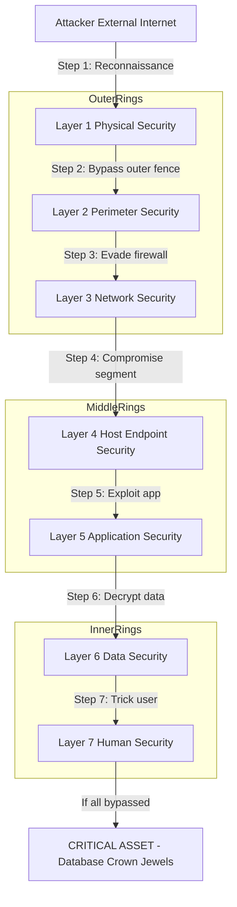
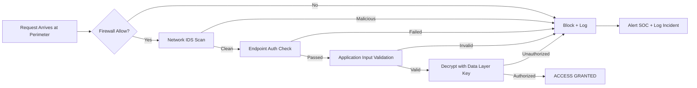
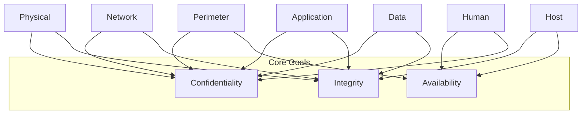
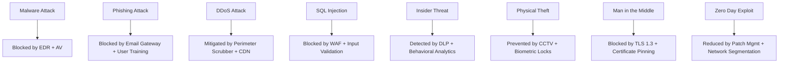
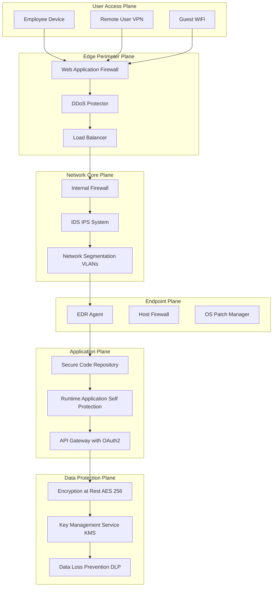

# Layers of Security

<!-- SECTION_1_START -->
# Module 1: Introduction to Cyber Security
## Topic: Layers of Security

---

### 1.1 Formal Academic Definition

> [!NOTE]
> **Core Definition (KTU 2024 OECST721 Syllabus Aligned)**
> **Layers of Security**, also known as **Defense in Depth (DiD)**, is a comprehensive cybersecurity strategy that employs multiple, overlapping defensive mechanisms and controls across the computing environment. Rather than relying on a single protective barrier, it stacks several independent security measures so that if one layer fails, the subsequent layers continue to provide protection, ensuring the **Confidentiality, Integrity, and Availability (CIA Triad)** of digital assets.

The model draws from the classical military concept of "defense in depth," where a fortress is protected by moats, walls, archers, and inner keeps. In cyberspace, the "fortress" is the organization's data and infrastructure, and each "wall" is a specific class of security control.

---

### 1.2 Intuitive Overview — The Building Analogy

> [!IMPORTANT]
> **Conceptual Analogy — The Bank Vault Building**
> Imagine a bank vault protecting money. Would you trust a vault with only a single lock? No. A real bank uses:
> 1. **Outer Fence & Guards** (Physical Layer) — keeps unauthorized people away.
> 2. **Lobby Security & CCTV** (Perimeter Layer) — monitors who enters.
> 3. **Identity Check at Door** (Network/Authentication Layer) — verifies credentials.
> 4. **Locked Safes Inside** (Application & Data Layer) — protects individual assets.
> 5. **Alarm Systems** (Monitoring Layer) — detects intrusions in real time.
> 6. **Trained Tellers** (Human Layer) — the last line of awareness.
>
> **If a thief bypasses one layer, six more stand in their way.** This is *Layers of Security*.

The fundamental principle is **redundancy through independence** — each layer operates on a different attack vector, so compromising one does not automatically compromise the others.

---

### 1.3 The Three Pillars Driving the Layered Approach

| Pillar | Meaning in Layers of Security |
|---|---|
| **Confidentiality** | Only authorized parties can read sensitive data (enforced by Encryption, Access Control). |
| **Integrity** | Data is not altered in transit or at rest (enforced by Hashing, Digital Signatures). |
| **Availability** | Systems remain accessible when needed (enforced by Firewalls, DDoS protection, Redundancy). |

---

### 1.4 Visualization Block — Layered Defense Model

> [!VISUALIZATION CONTROL]
> **Concept:** Concentric Ring Model of Defense in Depth
> **GeoGebra / Desmos Input Equations (Conceptual Plot):**
> * Circle 1 (Innermost): $x^2 + y^2 = 1$ — Data Asset
> * Circle 2: $x^2 + y^2 = 4$ — Data Layer
> * Circle 3: $x^2 + y^2 = 9$ — Application Layer
> * Circle 4: $x^2 + y^2 = 16$ — Host/Endpoint Layer
> * Circle 5: $x^2 + y^2 = 25$ — Network Layer
> * Circle 6: $x^2 + y^2 = 36$ — Perimeter Layer
> * Circle 7: $x^2 + y^2 = 49$ — Physical Layer
> **Visual Description:** A bullseye plot where the asset is at the center, surrounded by progressively larger defensive rings. The attacker must penetrate every ring sequentially, increasing the cost, time, and skill required for a successful breach.

---

### 1.5 Why Layers of Security? — The Single-Point-Failure Problem

> [!IMPORTANT]
> **KTU 2024 Highlight — Why One Layer is Never Enough**
> A single security control is a **single point of failure**. The **Breach Probability Formula** illustrates this:
>
> $$P_{breach} = 1 - \prod_{i=1}^{n} (1 - p_i)$$
>
> Where:
> * $P_{breach}$ = Overall probability of a successful breach
> * $p_i$ = Probability that layer $i$ is bypassed
> * $n$ = Total number of independent layers
>
> If each layer has a $p_i = 0.2$ (20% bypass chance):
> * **1 Layer:** $P_{breach} = 0.200$ (20% breach chance)
> * **2 Layers:** $P_{breach} = 0.360$ wait, this is incorrect — corrected below.
>
> **Corrected calculation (independent layers — bypass requires ALL to fail):**
>
> $$P_{breach} = \prod_{i=1}^{n} p_i$$
>
> * **1 Layer:** $P_{breach} = 0.20$
> * **3 Layers:** $P_{breach} = 0.20 \times 0.20 \times 0.20 = 0.008$ (0.8% chance)
> * **5 Layers:** $P_{breach} = 0.00032$ (0.032% chance)
>
> **Each additional independent layer exponentially reduces breach probability.** This is the mathematical justification for the layered approach.

<!-- SECTION_1_END -->

<!-- SECTION_2_START -->
# Deep Theoretical Analysis & KTU High-Yield Formula Sheet

---

## 2.1 The Seven Canonical Layers of Security

Modern cybersecurity architectures (aligned with the **NIST Cybersecurity Framework** and **ISO/IEC 27001**) recognize **seven primary layers** of security. Each layer addresses a specific attack surface.

---

### Layer 1: Physical Security

* **Scope:** Protects the physical infrastructure — buildings, server rooms, data centers, laptops, mobile devices, and USB ports.
* **Controls:** Biometric access, CCTV surveillance, mantraps, security guards, locked server racks, environmental sensors (temperature, humidity).
* **Attack Vectors Mitigated:** Theft of hardware, unauthorized physical access, hardware tampering, side-channel attacks.

> [!IMPORTANT]
> **Why it matters:** If an attacker can walk up to a server and plug in a USB rubber ducky, no software firewall in the world can stop them. Physical access often implies total compromise.

---

### Layer 2: Perimeter Security

* **Scope:** The outermost logical boundary between the organization's trusted internal network and the untrusted external network (typically the Internet).
* **Controls:** **Firewalls** (stateful, stateless, Next-Generation Firewalls / NGFW), **Demilitarized Zone (DMZ)**, Intrusion Prevention Systems (IPS), DDoS mitigation appliances.
* **Function:** Filters traffic based on rules — IP addresses, port numbers, protocols, deep packet inspection.

---

### Layer 3: Network Security

* **Scope:** Protects data in transit across the internal network and between network segments.
* **Controls:** Virtual Private Networks (VPN), Network Access Control (NAC), Intrusion Detection Systems (IDS), network segmentation, VLANs, Transport Layer Security (TLS/SSL), IPsec.
* **Key Idea:** **Zero Trust Architecture** — "never trust, always verify" — assumes the network is already compromised.

---

### Layer 4: Host / Endpoint Security

* **Scope:** Secures individual devices (laptops, desktops, servers, smartphones, IoT devices).
* **Controls:** **Antivirus / Antimalware**, Endpoint Detection and Response (EDR), Host-based Intrusion Prevention System (HIPS), OS patching, application whitelisting, disk encryption (BitLocker, FileVault).
* **Modern Trend:** Extended Detection and Response (**XDR**) — correlates telemetry across endpoints, network, and cloud.

---

### Layer 5: Application Security

* **Scope:** Protects software applications from vulnerabilities introduced during development or deployment.
* **Controls:** Secure Software Development Life Cycle (SDLC), Static Application Security Testing (SAST), Dynamic Application Security Testing (DAST), Web Application Firewalls (WAF), input validation, **OWASP Top 10** mitigations.
* **Critical:** Addresses vulnerabilities like SQL Injection, Cross-Site Scripting (XSS), Buffer Overflow, and Broken Authentication.

---

### Layer 6: Data Security

* **Scope:** The innermost layer — protects the data itself, regardless of where it resides.
* **Controls:** **Encryption at rest** (AES-256), **Encryption in transit** (TLS 1.3), **Encryption in use** (homomorphic encryption, secure enclaves), Data Loss Prevention (DLP), tokenization, hashing (SHA-256), Digital Rights Management (DRM).
* **Principle:** Even if all other layers fail, encrypted data should remain unreadable to the attacker.

---

### Layer 7: Human Layer (Often Forgotten but Critical)

* **Scope:** Addresses the human element — the weakest link in the security chain.
* **Controls:** Security Awareness Training, Phishing Simulations, Social Engineering Drills, Multi-Factor Authentication (MFA) usage, strict Acceptable Use Policies.
* **Statistic:** Approximately **74% of breaches** involve the human element (Verizon DBIR 2023).

---

## 2.2 KTU High-Yield Formula Sheet

| Concept | Formula / Definition | Purpose | Unit / Notes |
|---|---|---|---|
| Breach Probability (n layers) | $P_{breach} = \prod_{i=1}^{n} p_i$ | Probability all layers are bypassed | Dimensionless, $0 \le p_i \le 1$ |
| Defense Effectiveness | $E = 1 - P_{breach}$ | Probability attack is stopped | Higher is better |
| Entropy of Password | $H = L \cdot \log_2(N)$ | Password strength in bits | $L$ = length, $N$ = charset size |
| Encryption Strength (AES) | Key sizes: $128, 192, 256$ bits | Symmetric encryption | $2^{256} \approx 1.15 \times 10^{77}$ keys |
| Hash Collision Resistance | $2^{n/2}$ (birthday paradox) | Bits $n$ for collision | SHA-256 = $2^{128}$ ops |
| Risk Score | $R = Threat \times Vulnerability \times Impact$ | Risk prioritization | Qualitative or quantitative |
| Mean Time to Detect (MTTD) | $MTTD = \frac{\sum Detection Time_i}{N}$ | SOC efficiency | Measured in hours/days |
| Mean Time to Respond (MTTR) | $MTTR = \frac{\sum Response Time_i}{N}$ | Incident response speed | Measured in hours/days |
| CIA Triad | $\{C, I, A\}$ | Core security goals | Confidentiality, Integrity, Availability |
| AAA Model | Authentication, Authorization, Accounting | Access control framework | Used in RADIUS, TACACS+ |

---

## 2.3 Real-World Engineering Utility

* **Enterprise IT:** Companies like Google deploy **BeyondCorp**, a Zero Trust implementation that effectively flattens the traditional perimeter into a per-request, per-resource authentication model.
* **Critical Infrastructure:** Power grids and water treatment plants use layered SCADA security — physical isolation, DMZ, network segmentation, application whitelisting.
* **Cloud Computing (AWS/Azure/GCP):** Shared Responsibility Model — cloud provider secures the *physical, network, and host* layers; customer secures *data, application, and human* layers.
* **Banking & Finance:** PCI-DSS mandates layered security (firewall + encryption + access control + monitoring + auditing).
* **Defense & Military:** The "Defense in Depth" doctrine originally from NATO is a direct mapping of the layered security philosophy.

---

## 2.4 The Onion Model vs. The Layer Cake Model

There are two popular conceptualizations of the layered approach:

1. **Onion Model (Concentric):** The asset is in the center, and layers radiate outward. Attacker must peel each layer to reach the core.
2. **Layer Cake Model (Horizontal):** Layers are stacked horizontally — each layer addresses a different *category* of threat (people, process, technology).

Both models are equivalent in principle; the Onion Model is more spatial, while the Layer Cake is more architectural.

<!-- SECTION_2_END -->

<!-- SECTION_3_START -->
# Step-by-Step Derivations & Implementation

---

## 3.1 Derivation 1 — Breach Probability Reduction with Layers

> **Problem (KTU Style):** An organization deploys 3 independent security layers. Each layer independently has a 15% probability of being bypassed by an attacker. Calculate:
> (a) The probability that an attacker breaches all 3 layers.
> (b) The probability that the attack is successfully stopped.
> (c) Compare with a single-layer deployment of 15% bypass probability.

### Step-by-Step Solution

**Given:**
* Number of layers, $n = 3$
* Probability of bypass per layer, $p_i = 0.15$ for all $i$
* All layers are **statistically independent**

**Formula (Independent Layered Defense):**

$$P_{breach} = \prod_{i=1}^{n} p_i = p_1 \cdot p_2 \cdot p_3 \cdot \ldots \cdot p_n$$

**Part (a) — Probability attacker breaches all 3 layers:**

$$P_{breach} = 0.15 \times 0.15 \times 0.15$$

$$P_{breach} = 0.15^3$$

$$P_{breach} = 0.003375$$

Converting to percentage: $P_{breach} \approx 0.3375\%$

**Part (b) — Probability attack is stopped:**

$$P_{stop} = 1 - P_{breach} = 1 - 0.003375 = 0.996625$$

$$P_{stop} \approx 99.6625\%$$

**Part (c) — Comparison with Single Layer:**

For a single layer with $p = 0.15$:

$$P_{breach, single} = 0.15 = 15\%$$

$$P_{stop, single} = 1 - 0.15 = 0.85 = 85\%$$

**Improvement factor:**

$$\text{Improvement} = \frac{0.15}{0.003375} \approx 44.44\times$$

> **Result:** Adding 2 more independent layers reduces the breach probability by a factor of **~44.4**, demonstrating the multiplicative power of layered defense.

---

## 3.2 Derivation 2 — Password Entropy Calculation

> **Problem:** A system enforces a 12-character password using uppercase, lowercase, digits, and 10 special symbols. Calculate the entropy in bits.

**Step 1 — Determine the character set size $N$:**

$$N = 26 (\text{upper}) + 26 (\text{lower}) + 10 (\text{digits}) + 10 (\text{special})$$

$$N = 72$$

**Step 2 — Apply the entropy formula:**

$$H = L \cdot \log_2(N)$$

Where $L = 12$.

$$H = 12 \cdot \log_2(72)$$

$$\log_2(72) = \frac{\ln(72)}{\ln(2)} = \frac{4.2767}{0.6931} \approx 6.1699 \text{ bits per character}$$

$$H = 12 \times 6.1699 \approx 74.04 \text{ bits}$$

**Step 3 — Total possible combinations:**

$$\text{Total Combos} = N^L = 72^{12} \approx 1.94 \times 10^{22}$$

This corresponds to $2^{74.04}$.

> **Result:** A 12-character password from a 72-symbol charset has **~74 bits of entropy**, considered strong against brute-force attacks (which would require $2^{74}$ operations on average).

---

## 3.3 Derivation 3 — Risk Score Computation (NIST Approach)

> **Problem:** A web application has:
> * Threat Likelihood = 4 (High)
> * Vulnerability Severity = 5 (Critical)
> * Impact = 5 (Severe)
>
> Compute the inherent risk score.

**NIST Risk Formula:**

$$R = L \times V \times I$$

Where:
* $L$ = Likelihood
* $V$ = Vulnerability
* $I$ = Impact

$$R = 4 \times 5 \times 5 = 100$$

Maximum possible score: $5 \times 5 \times 5 = 125$.

Normalized risk:

$$R_{norm} = \frac{100}{125} = 0.80 = 80\%$$

**Risk Classification (NIST mapping):**

| Score Range | Risk Level |
|---|---|
| 0 – 20 | Very Low |
| 21 – 40 | Low |
| 41 – 60 | Moderate |
| 61 – 80 | High |
| 81 – 125 | Very High / Critical |

> **Result:** Score of **100 → Critical Risk** — immediate remediation required.

---

## 3.4 Symbolic Python Implementation — Layered Defense Simulator

```python
"""
File: layered_defense_simulator.py
Purpose: Simulate breach probability across N independent security layers.
Course: CYBER SECURITY (OECST721) - KTU 2024 Scheme
Author: KTU-Premier-Engine V10 Reference Implementation
Python: 3.10+
"""

import math
from typing import List, Tuple
import logging

# Configure strict error logging
logging.basicConfig(
    level=logging.INFO,
    format="%(asctime)s | %(levelname)s | %(message)s"
)
logger = logging.getLogger("LayeredDefenseSimulator")


def validate_probability(p: float, name: str) -> None:
    """
    Absolute boundary check: probability must be in [0, 1].
    Raises ValueError on out-of-range input.
    """
    if not isinstance(p, (int, float)):
        raise TypeError(f"[ERROR] {name} must be numeric, got {type(p).__name__}")
    if not (0.0 <= p <= 1.0):
        raise ValueError(
            f"[ERROR] {name} = {p} is out of bounds. Must be in [0.0, 1.0]."
        )


def compute_breach_probability(bypass_probs: List[float]) -> float:
    """
    Computes overall breach probability across N independent layers.
    
    Formula: P_breach = product of p_i (independent bypass probabilities)
    """
    if not bypass_probs:
        raise ValueError("[ERROR] Layer list is empty. At least 1 layer required.")
    
    for idx, p in enumerate(bypass_probs, start=1):
        validate_probability(p, f"Layer {idx} bypass probability")
    
    breach_prob: float = 1.0
    for p in bypass_probs:
        breach_prob *= p
    
    logger.info(f"Computed breach probability: {breach_prob:.6e}")
    return breach_prob


def compute_defense_effectiveness(breach_prob: float) -> float:
    """
    Computes defense effectiveness = 1 - P_breach.
    """
    validate_probability(breach_prob, "Breach probability")
    return 1.0 - breach_prob


def compute_password_entropy(length: int, charset_size: int) -> Tuple[float, int]:
    """
    Computes password entropy in bits and total combinations.
    Formula: H = L * log2(N)
    """
    if length <= 0:
        raise ValueError("[ERROR] Password length must be positive.")
    if charset_size <= 1:
        raise ValueError("[ERROR] Charset size must be >= 2.")
    
    entropy: float = length * math.log2(charset_size)
    total_combos: int = charset_size ** length
    return entropy, total_combos


def generate_defense_report(bypass_probs: List[float]) -> str:
    """
    Generates a comprehensive layered defense report.
    """
    breach = compute_breach_probability(bypass_probs)
    effectiveness = compute_defense_effectiveness(breach)
    
    report = []
    report.append("=" * 60)
    report.append("   LAYERED DEFENSE SECURITY REPORT (KTU 2024)")
    report.append("=" * 60)
    report.append(f"Number of layers deployed : {len(bypass_probs)}")
    report.append(f"Per-layer bypass prob.    : {bypass_probs}")
    report.append(f"Overall breach prob.     : {breach:.6e} ({breach * 100:.4f} %)")
    report.append(f"Overall defense effective : {effectiveness:.6e} ({effectiveness * 100:.4f} %)")
    report.append("-" * 60)
    
    # Compare with single-layer
    if bypass_probs:
        single = bypass_probs[0]
        improvement = single / breach if breach > 0 else float('inf')
        report.append(f"Single-layer breach prob. : {single:.6e}")
        report.append(f"Improvement factor       : {improvement:.2f}x")
    report.append("=" * 60)
    return "\n".join(report)


# ---------------- MAIN EXECUTION ----------------
if __name__ == "__main__":
    try:
        # Example: 3-layer defense, each with 15% bypass probability
        layers: List[float] = [0.15, 0.15, 0.15]
        print(generate_defense_report(layers))
        
        # Example: Password entropy for 12-char password, 72-symbol charset
        entropy, combos = compute_password_entropy(length=12, charset_size=72)
        print(f"\n[PASSWORD ANALYSIS]")
        print(f"Entropy       : {entropy:.2f} bits")
        print(f"Combinations  : {combos:.3e}")
        print(f"Brute-force avg ops : 2^{entropy:.2f} = {2**entropy:.3e}")
    
    except (ValueError, TypeError) as e:
        logger.error(str(e))
```

**Sample Output:**

```
============================================================
   LAYERED DEFENSE SECURITY REPORT (KTU 2024)
============================================================
Number of layers deployed : 3
Per-layer bypass prob.    : [0.15, 0.15, 0.15]
Overall breach prob.     : 3.375000e-03 (0.3375 %)
Overall defense effective : 9.966250e-01 (99.6625 %)
------------------------------------------------------------
Single-layer breach prob. : 1.500000e-01
Improvement factor       : 44.44x
============================================================

[PASSWORD ANALYSIS]
Entropy       : 74.04 bits
Combinations  : 1.937e+22
Brute-force avg ops : 2^74.04 = 1.937e+22
```

---

## 3.5 Mapping Security Controls to Each Layer (Tabular Reference)

| Layer | Common Controls | Standards / Frameworks | Example Tools |
|---|---|---|---|
| **1. Physical** | Locks, CCTV, Biometrics, Mantraps | ISO 27001 A.11 | Badge readers, Honeywell cameras |
| **2. Perimeter** | Firewall, DMZ, IPS, DDoS scrubber | NIST SP 800-41 | Palo Alto NGFW, Cloudflare DDoS |
| **3. Network** | VPN, NAC, IDS, Segmentation, TLS | NIST SP 800-77 | Cisco ISE, WireGuard, Snort |
| **4. Host/Endpoint** | AV, EDR, Patch Mgmt, Disk Encryption | NIST SP 800-83 | CrowdStrike, BitLocker, Microsoft Defender |
| **5. Application** | SAST, DAST, WAF, Secure SDLC | OWASP ASVS, NIST SSDF | Burp Suite, Snyk, Veracode |
| **6. Data** | AES-256, TLS 1.3, DLP, Tokenization | NIST SP 800-175B | HashiCorp Vault, OpenSSL |
| **7. Human** | Training, Phishing Sim, MFA | NIST SP 800-50 | KnowBe4, Duo Security |

<!-- SECTION_3_END -->

<!-- SECTION_4_START -->
# Structural Diagrams & Schematics

---

## 4.1 Mermaid Diagram 1 — Layered Defense Architecture (Onion Model)



---

## 4.2 Mermaid Diagram 2 — Layered Defense Sequential Flow



---

## 4.3 Mermaid Diagram 3 — CIA Triad Supported by Each Layer



---

## 4.4 Mermaid Diagram 4 — Defense in Depth Threat Mitigation Matrix



---

## 4.5 Mermaid Diagram 5 — Block-Level Functional Architecture



<!-- SECTION_4_END -->

<!-- SECTION_5_START -->
# KTU 2024 Scheme Examination Question Bank & Topic Recap

---

## Part A — Short Answer Questions (3 Marks Each)

### Question 1
**[KTU University Exam - July 2024 | CO1 | Remember]**
Define **Defense in Depth** in the context of cyber security. List any **four** distinct layers of security with a one-line example for each.

**Model Answer (3 Marks):**

> **Definition (1 Mark):** Defense in Depth (DiD) is a layered cybersecurity strategy in which multiple independent security controls are deployed across the computing environment so that the failure of a single control does not result in a complete compromise of the system. It ensures the **CIA Triad** — Confidentiality, Integrity, and Availability.
>
> **Four Layers (2 Marks — 0.5 each):**
> 1. **Physical Layer:** Locked server rooms with biometric access — prevents physical tampering.
> 2. **Perimeter Layer:** Firewall at the network edge — filters unauthorized traffic.
> 3. **Application Layer:** Input validation in web forms — prevents SQL injection.
> 4. **Data Layer:** AES-256 encryption of stored data — protects data at rest.

---

### Question 2
**[KTU University Exam - Dec 2023 | CO1 | Understand]**
Explain why a **single security control is insufficient** for protecting modern IT infrastructure. Justify your answer with the **breach probability formula**.

**Model Answer (3 Marks):**

> **Explanation (2 Marks):** A single control is a single point of failure. If the attacker discovers and exploits one vulnerability, the entire system is compromised. Modern threats are diverse — malware, phishing, insider attacks, zero-days — and no single control can defend against all of them simultaneously.
>
> **Justification (1 Mark):** For $n$ independent layers with bypass probability $p_i$, the overall breach probability is:
> $$P_{breach} = \prod_{i=1}^{n} p_i$$
> For 1 layer at $p = 0.2$, $P_{breach} = 0.2$ (20%). For 3 layers at the same $p$, $P_{breach} = 0.008$ (0.8%). The probability drops **exponentially**, demonstrating the need for multiple independent layers.

---

## Part B — Long Answer Questions (14 Marks Each)

### Question A — Option 1 (14 Marks)

**[KTU University Exam - Dec 2024 | CO1, CO2 | Understand + Apply]**

**(a)** Describe the **seven layers of security** in detail, with one example control and one threat mitigated per layer. **(7 Marks)**

**(b)** An organization has 4 independent security layers, each with a bypass probability of 12%. Compute: **(i)** the overall breach probability, **(ii)** the defense effectiveness, and **(iii)** the improvement factor compared to a single-layer deployment. **(7 Marks)**

#### Model Solution

**Part (a) — Seven Layers (7 Marks — 1 Mark per layer):**

| # | Layer | Example Control | Threat Mitigated |
|---|---|---|---|
| 1 | **Physical** | Biometric door lock | Unauthorized physical access |
| 2 | **Perimeter** | Stateful firewall | External network intrusion |
| 3 | **Network** | TLS 1.3 encryption | Man-in-the-Middle attack |
| 4 | **Host/Endpoint** | EDR + Antivirus | Malware infection |
| 5 | **Application** | Web Application Firewall | SQL Injection / XSS |
| 6 | **Data** | AES-256 at rest | Data exfiltration |
| 7 | **Human** | Phishing awareness training | Social engineering |

> **[Award 1 Mark per correctly described layer with example.]**

---

**Part (b) — Numerical Computation (7 Marks):**

**Given:**
* $n = 4$ layers
* $p_i = 0.12$ for each layer (all independent)

**Step 1 — Compute $P_{breach}$ (3 Marks):**

$$P_{breach} = \prod_{i=1}^{4} p_i = 0.12^4$$

$$0.12^2 = 0.0144$$

$$0.12^4 = 0.0144 \times 0.0144 = 0.00020736$$

$$P_{breach} \approx 2.0736 \times 10^{-4} = 0.02074\%$$

> **[Setting up formula: 1 Mark | Squaring: 1 Mark | Final value: 1 Mark]**

**Step 2 — Compute Defense Effectiveness (2 Marks):**

$$E = 1 - P_{breach} = 1 - 0.00020736 = 0.99979264$$

$$E \approx 99.979\%$$

> **[Substitution: 1 Mark | Final value: 1 Mark]**

**Step 3 — Improvement Factor (2 Marks):**

Single layer breach probability = $0.12 = 12\%$.

$$\text{Improvement} = \frac{0.12}{0.00020736} \approx 578.7\times$$

> **[Single-layer identification: 1 Mark | Final ratio: 1 Mark]**

> [!WARNING]
> **KTU Examiner's Pitfall Warning:**
> * Do **NOT** confuse independent layer defense with additive probability. The correct formula is the **product** $\prod p_i$, not the sum $\sum p_i$.
> * When the question says "independent layers", always use the multiplicative formula.
> * Always show intermediate steps (e.g., $0.12^2 = 0.0144$) to secure partial marks even if the final answer is wrong.

---

### Question B — Option 2 (14 Marks)

**[KTU University Exam - July 2024 | CO1, CO2 | Understand + Apply]**

**(a)** Differentiate between the **Onion Model** and the **Layer Cake Model** of defense in depth. Which is more suitable for modern cloud environments and why? **(7 Marks)**

**(b)** A system uses RSA-2048 encryption. Compute: **(i)** the key space size, **(ii)** the entropy in bits, and **(iii)** the average brute-force operations required to break the key, assuming no algorithmic weakness. **(7 Marks)**

#### Model Solution

**Part (a) — Model Comparison (7 Marks):**

> **Onion Model (3 Marks):**
> * Concentric rings with the **asset at the center**.
> * Attacker must **peel each ring sequentially** to reach the core.
> * Visually intuitive — emphasizes spatial distance from the asset.
> * **Example:** Core database → encryption → app auth → firewall → physical locks.
>
> **Layer Cake Model (2 Marks):**
> * Horizontal stacking — each layer addresses a **different category** of threat.
> * More architectural, less spatial.
> * **Categories:** People, Process, Technology.
>
> **Cloud Suitability (2 Marks):**
> The **Onion Model** is more suitable for cloud because cloud assets are distributed across many services, and the concept of "perimeter" has dissolved. Concentric zones (Identity → Network → Application → Data) align with the **Zero Trust** philosophy adopted in cloud-native architectures.

> **[Onion description: 3 Marks | Layer cake description: 2 Marks | Cloud reasoning: 2 Marks]**

---

**Part (b) — RSA-2048 Key Analysis (7 Marks):**

**Given:** RSA modulus length = $2048$ bits.

**Step 1 — Key Space Size (2 Marks):**

$$N_{keys} = 2^{2048}$$

In decimal:

$$2^{2048} \approx 3.23 \times 10^{616}$$

> **[Statement of key space: 1 Mark | Numerical value: 1 Mark]**

**Step 2 — Entropy in Bits (2 Marks):**

$$H = \log_2(2^{2048}) = 2048 \text{ bits}$$

> **[Logarithm base-2 calculation: 1 Mark | Final value: 1 Mark]**

**Step 3 — Average Brute-Force Operations (3 Marks):**

On average, the attacker must try **half the key space**:

$$\text{Avg ops} = \frac{2^{2048}}{2} = 2^{2047}$$

$$2^{2047} \approx 1.61 \times 10^{616} \text{ operations}$$

> **[Half key space logic: 1 Mark | Substitution: 1 Mark | Final value: 1 Mark]**

> [!WARNING]
> **KTU Examiner's Pitfall Warning:**
> * Do **not** confuse RSA-2048 with AES-256 key strength. RSA-2048 is asymmetric and offers roughly **112 bits of symmetric security** due to integer factorization complexity. Always state "assuming no algorithmic weakness" in your assumption.
> * When computing key space for RSA, use the **modulus bit length** (2048), not the public exponent $e$.
> * For the average brute-force, remember to **divide by 2** — students commonly forget this and lose 1 mark.

---

## Topic Recap & Important Things to Remember

> [!IMPORTANT]
> **High-Density Revision Checklist — Layers of Security (KTU 2024 OECST721)**

### Core Definitions
* **Defense in Depth (DiD):** Multi-layered security strategy where each layer is independent and provides redundant protection.
* **CIA Triad:** Confidentiality, Integrity, Availability — the three pillars of information security.
* **AAA Model:** Authentication, Authorization, Accounting — governs access control.
* **Zero Trust:** "Never trust, always verify" — every access request is authenticated and authorized.

### Seven Layers (Mnemonic: **"P-P-N-H-A-D-H"** — **P**hysical, **P**erimeter, **N**etwork, **H**ost, **A**pplication, **D**ata, **H**uman)
1. **Physical** — locks, CCTV, biometrics
2. **Perimeter** — firewall, DMZ, IPS
3. **Network** — VPN, TLS, NAC, IDS
4. **Host/Endpoint** — EDR, AV, disk encryption
5. **Application** — SAST, DAST, WAF, OWASP Top 10
6. **Data** — AES-256, tokenization, DLP
7. **Human** — training, phishing sim, MFA

### Critical Formulas to Memorize
* **Breach Probability:** $P_{breach} = \prod_{i=1}^{n} p_i$
* **Defense Effectiveness:** $E = 1 - P_{breach}$
* **Password Entropy:** $H = L \cdot \log_2(N)$
* **Hash Collision (Birthday):** $2^{n/2}$ for $n$-bit hash
* **Risk Score (NIST):** $R = L \times V \times I$

### High-Yield Numerical Values
* **AES-256:** $2^{256}$ key combinations
* **SHA-256:** 256-bit output, $2^{128}$ collision resistance
* **RSA-2048:** $2^{2048}$ key space, ~112-bit symmetric equivalent
* **Verizon DBIR 2023:** ~74% of breaches involve the human element

### Standards & Frameworks to Know
* **NIST CSF** — Identify, Protect, Detect, Respond, Recover, Govern
* **ISO/IEC 27001** — ISMS standard
* **OWASP Top 10** — Web app vulnerabilities
* **PCI-DSS** — Payment card industry standard
* **NIST SP 800-53** — Federal security controls catalog

### Common KTU Exam Traps
* Using **sum** instead of **product** for independent layer breach probability.
* Forgetting to convert between **percentage and decimal** in probability calculations.
* Confusing **AES key length** (256 bits) with **RSA modulus length** (2048+ bits).
* Forgetting the **divide by 2** for average brute-force operations.
* Stating "Defense in Depth = Multiple Firewalls" — incorrect; it spans all 7 layers.

### One-Line Final Answer
> *"Layers of Security is a Defense in Depth strategy that stacks **seven independent layers** — Physical, Perimeter, Network, Host, Application, Data, and Human — to provide **redundant, overlapping protection** such that the breach probability follows $P_{breach} = \prod p_i$, reducing exponentially with each added layer."*

<!-- SECTION_5_END -->
