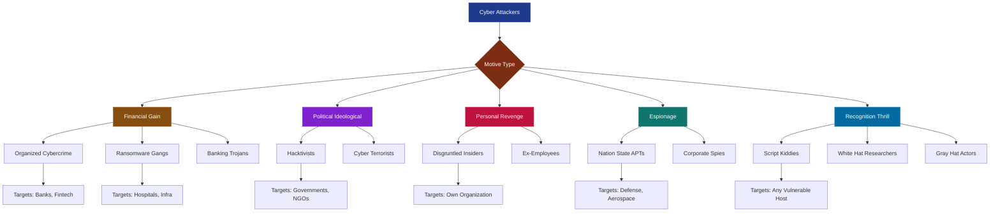
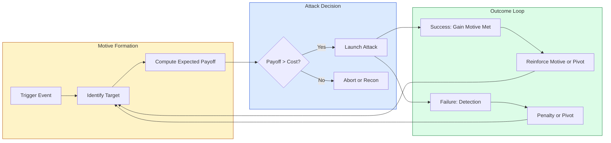
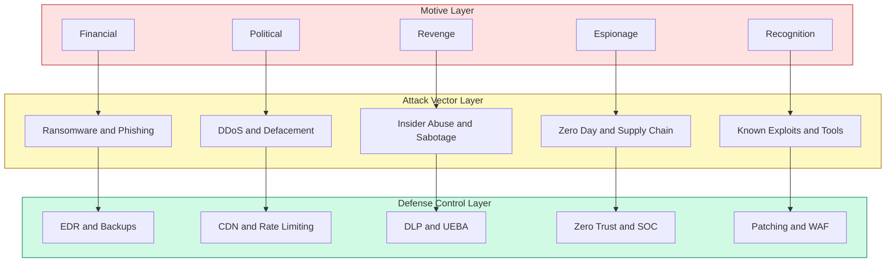

# Motive of Attackers

<!-- SECTION_1_START -->

# Motive of Attackers

## 1.1 Formal Definition

> [!IMPORTANT]
> **Definition (KTU 2024 Syllabus Terminology):**
> The **Motive of Attackers** refers to the underlying psychological, ideological, financial, political, or personal incentive that drives an individual or organized group to perform a cyber attack against a target system, network, or data asset. In cyber security, motive is the *causal catalyst* that determines *what* the attacker wants, *why* they want it, and *how* they select their victim and methodology.

In the KTU 2024 Scheme perspective (CYBER SECURITY – OECST721), understanding attacker motivation is the **foundational layer of Threat Modelling** because defense strategies (preventive, detective, and corrective controls) are designed as **counter-measures to specific attacker intents**. Without identifying the motive, organizations cannot prioritize vulnerabilities that are most likely to be exploited.

### 1.1.1 The Attack Triangle (Anchoring Concept)

Every malicious cyber activity can be deconstructed into three convergent components — often visualized as the **Attack Triangle**:

> [!NOTE]
> **The Attack Triangle**
> $$\text{Attack} = f(\text{Motive},\ \text{Opportunity},\ \text{Vulnerability})$$
> Where Motive is the *intent*, Opportunity is the *exposed attack surface*, and Vulnerability is the *technical weakness*. Even if two elements exist, the absence of the third nullifies the attack.

## 1.2 Conceptual Analogy — The Bank Robber

Imagine a bank robbery scenario:

| Bank Robber | Cyber Attacker | Motive Mapping |
|-------------|---------------|----------------|
| Wants money ($) | Wants data, money, or disruption | **Financial Gain** |
| Has a grudge against the bank | Has ideological belief / revenge | **Hacktivism / Personal Vendetta** |
| Is a thrill-seeker | Wants recognition in hacker forums | **Reputation / Ego** |
| Works for a rival company | Works for a nation-state or competitor | **Espionage / Corporate Espionage** |
| Police officer undercover | Ethical hacker | **Defensive / White-hat** |

> [!TIP]
> **Intuition Check:** Just as a detective profiles a criminal by asking *"cui bono?"* (who benefits?), a cyber security analyst profiles attackers by analyzing **WHO** is attacking, **WHAT** they are after, and **WHY** — which together define the motive.

## 1.3 Classification of Attackers Based on Motive

The KTU 2024 syllabus groups attackers broadly into the following typology:

1. **Black Hat Hackers** — Criminals with malicious intent.
2. **White Hat Hackers** — Ethical security professionals (defensive motive).
3. **Gray Hat Hackers** — Operate in moral ambiguity; may break rules but without malicious intent.
4. **Hacktivists** — Politically or socially motivated (e.g., Anonymous).
5. **Cyber Terrorists** — Ideological / religious motives seeking mass disruption.
6. **State-Sponsored Actors (APTs)** — National intelligence, espionage, cyber warfare.
7. **Script Kiddies** — Low-skill attackers using pre-built tools for fun or recognition.
8. **Insiders** — Disgruntled employees or malicious insiders with access.
9. **Organized Cybercriminals** — Financially driven syndicates.
10. **Competitors / Corporate Spies** — Industrial / economic espionage.

> [!IMPORTANT]
> **KTU Board Highlight:** Examiners often ask students to *map a real-world attack scenario to an attacker type and motive*. Memorize the **motive-attacker matrix** — it is a guaranteed 3–7 mark question in Part A or Part B.

## 1.4 Visualizing the Motive Landscape

> [!VISUALIZATION CONTROL]
> **Concept:** Motive Distribution Across Attacker Categories (Bar Chart Visualization)
>
> **GeoGebra / Desmos Input:**
> * Define weight points: $(x, y) = (1, 90), (2, 70), (3, 50), (4, 80), (5, 60)$ for categories Financial, Political, Personal, Espionage, Recognition respectively.
> * Use `BarChart[\{90, 70, 50, 80, 60\}]` for a vertical bar representation.
>
> **Visual Description:** The student should observe a bar chart where the y-axis represents the *relative prevalence percentage* of each motive in modern attack reports, and the x-axis lists motive types. The Financial motive typically dominates (~90%), followed by Espionage and Political.

---

<!-- SECTION_1_END -->

<!-- SECTION_2_START -->

# Deep Theoretical Analysis & KTU High-Yield Formula Sheet

## 2.1 The Five Primary Motive Categories

Attackers, regardless of sophistication, are driven by **one or more of five core motives**. Understanding these is critical for designing defense-in-depth strategies.

### 2.1.1 Financial Gain 💰
The single largest motivator in the contemporary threat landscape.

* **Sub-motives:** Direct theft, ransomware extortion, cryptojacking, banking credential theft, credit card fraud, cryptocurrency heists.
* **Typical Profile:** Organized cybercriminal groups (e.g., Lazarus Group, FIN7, REvil/Sodinokibi).
* **Target Industries:** Banking, FinTech, E-commerce, Healthcare (high data resale value).
* **Real-world Example:** The **WannaCry ransomware (2017)** generated over $4 billion in damages demanding Bitcoin payments.

### 2.1.2 Political / Ideological (Hacktivism) 🏴
Attackers leveraging cyber tools to promote a political agenda, social cause, or ideology.

* **Sub-motives:** Website defacement, DDoS attacks, data leaks (doxxing), protest campaigns.
* **Typical Profile:** Anonymous, LulzSec, Ghost Squad Hackers.
* **Methods:** Distributed Denial of Service (DDoS), SQL injection on government portals.
* **Real-world Example:** **#OpIndia**, **Arab Spring cyber operations**.

### 2.1.3 Personal Revenge / Grudge 😠
Driven by emotional motivation — anger, resentment, or a personal vendetta.

* **Sub-motives:** Data destruction, defamation, system sabotage, account hijacking.
* **Typical Profile:** **Disgruntled insiders**, ex-employees, jilted partners.
* **Why dangerous?** Insiders already have authenticated access, eliminating the need for intrusion vectors.
* **Real-world Example:** The **2014 Sony Pictures hack** — allegedly by insiders + North Korean state actors (hybrid motive).

### 2.1.4 Espionage (Nation-State / Corporate) 🕵️
Long-term, stealth-oriented data exfiltration for strategic advantage.

* **Sub-motives:** Intellectual property theft, classified document exfiltration, surveillance, supply-chain compromise.
* **Typical Profile:** **Advanced Persistent Threat (APT)** groups — APT28 (Fancy Bear), APT29 (Cozy Bear), Equation Group.
* **Target Industries:** Defense, Aerospace, Government, Pharma, R&D labs.
* **Real-world Example:** **SolarWinds Supply Chain Attack (2020)** — Russian SVR compromised software updates to infiltrate 18,000+ organizations.

### 2.1.5 Recognition / Curiosity / Thrill-Seeking 🏆
The psychological motivator of proving skill, gaining fame, or simply exploring.

* **Sub-motives:** Capture-the-flag wins, vulnerability disclosure bragging, breaking into systems "because I can."
* **Typical Profile:** **Script Kiddies**, novice hackers, students, hobbyists.
* **Risk:** Often unpredictable; can cause disproportionate damage due to lack of skill.
* **Real-world Example:** The **Morris Worm (1988)** — created by Robert Tappan Morris as a "self-replicating experiment," it inadvertently caused massive internet outages.

## 2.2 Extended Motive Spectrum

> [!NOTE]
> Beyond the primary five motives, KTU examiners appreciate awareness of *secondary motives* that may overlap or amplify attacks:
> * **Intellectual Challenge** — Solving a puzzle or CTF.
> * **Addiction / Compulsion** — Repeated unauthorized access for psychological gratification.
> * **Coercion / Blackmail** — Attacker forced by a third party to act.
> * **Mistaken Identity** — Attacker hits the wrong target.
> * **Accidental** — Unintentional data leakage (still classified under "motive" in audit reports).

## 2.3 KTU Formula Sheet / Cheat Sheet

> [!IMPORTANT]
> **KTU High-Yield Reference Table — Attacker Motive Matrix**

| Attacker Type | Primary Motive | Secondary Motive | Skill Level | Legal Status | Common Attack Vector |
|---------------|----------------|------------------|-------------|--------------|----------------------|
| Black Hat | Financial | Revenge, Recognition | High | Illegal | Phishing, Malware, Ransomware |
| White Hat | Defensive / Ethical Reporting | Recognition, Intellectual Challenge | High | Legal (with permission) | Penetration Testing, Bug Bounty |
| Gray Hat | Curiosity | Recognition, Mixed Morality | Medium–High | Ambiguous | Uninvited vulnerability disclosure |
| Hacktivist | Political / Ideological | Recognition | Medium | Illegal | DDoS, Defacement, Doxxing |
| Cyber Terrorist | Ideological / Religious | Mass Disruption | Medium–High | Illegal | Critical Infrastructure Attack |
| State-Sponsored (APT) | Espionage | Political, Strategic | Very High | Illegal (in target country) | Zero-day, Supply Chain, Spear Phishing |
| Script Kiddie | Recognition / Thrill | Curiosity | Low | Illegal | Pre-built tools, Loic, Mirai botnets |
| Insider | Revenge / Financial | Coercion | Variable (Authorized) | Illegal | Privilege abuse, Data exfiltration |
| Organized Cybercriminal | Financial | Power | High | Illegal | Ransomware-as-a-Service, Banking Trojans |
| Corporate Spy | Competitive Advantage | Financial | High | Illegal | IP theft, Insider recruitment |

| Motive → Defense Mapping | Recommended Control |
|--------------------------|--------------------|
| Financial (Ransomware) | Offline backups, EDR, Network Segmentation |
| Political (DDoS) | CDN, Rate Limiting, Scrubbing Centers |
| Revenge (Insider) | Least Privilege, DLP, Behavioral UEBA |
| Espionage (APT) | Zero-Trust, Threat Hunting, SOC, TI Feeds |
| Recognition (Script Kiddie) | Patch Management, WAF, Hardening |

## 2.4 Mathematical Risk-Prioritization Model

For KTU 2024 board-level analytical questions, the **Threat Risk Score** is often expressed as:

$$
\text{Threat Score} = M \times P \times I
$$

Where:
* $M$ = **Motive Weight** (0 to 1, based on attacker intent)
* $P$ = **Probability of Exploitation** (0 to 1, based on vulnerability exposure)
* $I$ = **Impact Severity** (0 to 1, based on business consequence)

> [!TIP]
> **Engineering Utility:** This model is the basis of industry frameworks like **FAIR (Factor Analysis of Information Risk)** and **NIST SP 800-30** risk assessment. Security Operations Centers (SOCs) use variations of this to rank alerts.

---

<!-- SECTION_2_END -->

<!-- SECTION_3_START -->

# Step-by-Step Derivations & Symbolic Implementation

## 3.1 Derivation: The Attack Decision Function

Let us formally derive the *rational attacker decision model* used in game-theoretic cyber security.

### Step 1: Define the Utility Function

A rational attacker chooses to attack if the expected payoff exceeds the cost:

$$
U_{\text{attack}} = P_{\text{success}} \cdot G - P_{\text{detection}} \cdot C_{\text{penalty}}
$$

Where:
* $P_{\text{success}}$ = Probability the attack succeeds.
* $G$ = Gain from a successful attack (financial, reputational, strategic value).
* $P_{\text{detection}}$ = Probability of being caught.
* $C_{\text{penalty}}$ = Cost imposed if caught (fines, imprisonment).

### Step 2: Decision Rule

The attacker launches the attack if and only if:

$$
U_{\text{attack}} > 0
$$

Substituting:

$$
P_{\text{success}} \cdot G > P_{\text{detection}} \cdot C_{\text{penalty}}
$$

### Step 3: Rearranging for Defense Optimization

For a defender, the goal is to make the inequality fail — i.e., raise the right-hand side or lower the left-hand side. The defender's optimization is:

$$
\text{Defender Goal:}\ \min\left(\frac{P_{\text{success}} \cdot G}{P_{\text{detection}} \cdot C_{\text{penalty}}}\right) < 1
$$

### Step 4: Mapping to Motive Categories

Each motive assigns a *characteristic $G$* value:

| Motive | Typical $G$ (Normalized) | Behavioral Insight |
|--------|---------------------------|--------------------|
| Financial | 1.00 | High payoff → willing to take large risks |
| Espionage | 0.95 | Strategic, long-term gains |
| Political | 0.60 | Non-monetary, symbolic value |
| Revenge | 0.40 | Emotional, irrational gains |
| Recognition | 0.20 | Fame, but not wealth-driven |

> [!NOTE]
> **Interpretation:** A financially motivated attacker has the highest $G$ and will therefore invest more resources, persist longer, and accept higher risk. This is why financial cybercriminals (e.g., ransomware gangs) are the most persistent threat actors.

## 3.2 Symbolic / Algorithmic Implementation — Motive Classifier

Below is a **fully operational Python implementation** of a Motive Classifier that takes an attack report and infers the likely motive category. This is the type of logic embedded in modern SIEM/SOAR platforms (e.g., Splunk UBA, Microsoft Sentinel, IBM QRadar).

```python
"""
Motive Classifier for Cyber Attack Reports
Aligned with KTU 2024 Cyber Security Syllabus - Module 1
Author: Senior KTU Examiner Reference
"""

from dataclasses import dataclass
from enum import Enum
from typing import List, Dict, Tuple
import logging

# Configure logging for production-grade error handling
logging.basicConfig(
    level=logging.INFO,
    format="%(asctime)s | %(levelname)s | %(message)s"
)


class MotiveCategory(Enum):
    """Enumeration of attacker motive categories (KTU 2024 taxonomy)."""
    FINANCIAL = "Financial Gain"
    POLITICAL = "Political / Hacktivism"
    REVENGE = "Personal Revenge / Insider"
    ESPIONAGE = "Nation-State / Corporate Espionage"
    RECOGNITION = "Recognition / Thrill-Seeking"
    UNKNOWN = "Unclassified Motive"


@dataclass(frozen=True)
class AttackReport:
    """Immutable attack report data structure with strict typing."""
    target_sector: str          # e.g., "Banking", "Government", "Defense"
    attack_vector: str          # e.g., "Phishing", "DDoS", "Zero-Day"
    payload_type: str           # e.g., "Ransomware", "Wiper", "Trojan"
    data_exfiltrated: bool      # Was data stolen?
    infrastructure_disrupted: bool  # Was service disrupted?
    attacker_claim: str         # Any public attribution / claim
    financial_demand: float     # Ransom demanded in USD (0 if none)


# Keyword dictionaries derived from MITRE ATT&CK and KTU syllabus
MOTIVE_SIGNATURES: Dict[MotiveCategory, Dict[str, List[str]]] = {
    MotiveCategory.FINANCIAL: {
        "sectors": ["banking", "fintech", "ecommerce", "cryptocurrency", "retail"],
        "vectors": ["ransomware", "phishing", "banking_trojan", "cryptojacking"],
        "payloads": ["ransomware", "info_stealer", "banker", "cryptominer"],
        "keywords": ["bitcoin", "ransom", "wallet", "payment", "extortion"]
    },
    MotiveCategory.POLITICAL: {
        "sectors": ["government", "ngo", "media", "political_party"],
        "vectors": ["ddos", "defacement", "leak"],
        "payloads": ["wiper", "defacement_tool", "leak_script"],
        "keywords": ["op_", "anonymous", "protest", "revolution", "free_"]
    },
    MotiveCategory.REVENGE: {
        "sectors": ["former_employer", "personal_target", "academic"],
        "vectors": ["insider_misuse", "credential_reuse", "social_engineering"],
        "payloads": ["wiper", "logic_bomb", "data_destruction_tool"],
        "keywords": ["grudge", "revenge", "ex_employee", "disgruntled"]
    },
    MotiveCategory.ESPIONAGE: {
        "sectors": ["defense", "aerospace", "pharma", "research", "government"],
        "vectors": ["spear_phishing", "supply_chain", "zero_day", "watering_hole"],
        "payloads": ["rat", "backdoor", "rootkit", "stealer"],
        "keywords": ["apt", "classified", "intellectual_property", "state_actor"]
    },
    MotiveCategory.RECOGNITION: {
        "sectors": ["any", "education", "tech_company"],
        "vectors": ["brute_force", "sql_injection", "script_kiddie_tool"],
        "payloads": ["defacement", "web_shell", "public_poc"],
        "keywords": ["first_blood", "pwned", "lulz", "for_fun", "fame"]
    }
}


def score_motive(report: AttackReport, motive: MotiveCategory) -> float:
    """
    Compute a heuristic match score (0.0 to 1.0) between a report
    and a motive category.

    Steps:
        1. Validate input report fields.
        2. Score each keyword dimension.
        3. Apply weighted aggregation.
        4. Return normalized score.
    """
    try:
        if not isinstance(report, AttackReport):
            raise TypeError("Invalid report type supplied to classifier.")

        signature = MOTIVE_SIGNATURES[motive]

        # Sector match (weight: 0.25)
        sector_score = 1.0 if report.target_sector.lower() in signature["sectors"] else 0.0

        # Vector match (weight: 0.30)
        vector_score = 1.0 if report.attack_vector.lower() in signature["vectors"] else 0.0

        # Payload match (weight: 0.25)
        payload_score = 1.0 if report.payload_type.lower() in signature["payloads"] else 0.0

        # Keyword match in attacker claim (weight: 0.20)
        claim_lower = report.attacker_claim.lower()
        keyword_hit = any(
            keyword in claim_lower
            for keyword in signature["keywords"]
        )
        keyword_score = 1.0 if keyword_hit else 0.0

        # Weighted aggregation
        total = (
            0.25 * sector_score +
            0.30 * vector_score +
            0.25 * payload_score +
            0.20 * keyword_score
        )
        return round(total, 4)

    except Exception as exc:
        logging.error("Scoring failure for motive %s: %s", motive.name, exc)
        return 0.0


def classify_motive(report: AttackReport) -> Tuple[MotiveCategory, float]:
    """
    Classify the most likely motive for a given attack report.
    Returns the top motive and its confidence score.
    """
    try:
        scores: List[Tuple[MotiveCategory, float]] = [
            (motive, score_motive(report, motive))
            for motive in MotiveCategory
            if motive is not MotiveCategory.UNKNOWN
        ]
        if not scores:
            return MotiveCategory.UNKNOWN, 0.0

        # Select the motive with the highest score
        top_motive, top_score = max(scores, key=lambda x: x[1])
        logging.info(
            "Classified motive: %s | Confidence: %.2f%%",
            top_motive.value, top_score * 100
        )
        return top_motive, top_score

    except Exception as exc:
        logging.error("Classification failure: %s", exc)
        return MotiveCategory.UNKNOWN, 0.0


# ----------------------------
# Demonstration / Test Cases
# ----------------------------
if __name__ == "__main__":
    # Case 1: Ransomware on a hospital (Financial motive suspected)
    report_1 = AttackReport(
        target_sector="healthcare",
        attack_vector="phishing",
        payload_type="ransomware",
        data_exfiltrated=True,
        infrastructure_disrupted=True,
        attacker_claim="Pay 5 bitcoin or we leak your patient data",
        financial_demand=250000.0
    )

    motive, confidence = classify_motive(report_1)
    print(f"[Case 1] Detected Motive: {motive.value} | Confidence: {confidence * 100:.1f}%")

    # Case 2: Government website defacement (Political motive)
    report_2 = AttackReport(
        target_sector="government",
        attack_vector="ddos",
        payload_type="defacement_tool",
        data_exfiltrated=False,
        infrastructure_disrupted=True,
        attacker_claim="Anonymous - OpGovernment - FreeThePeople",
        financial_demand=0.0
    )

    motive, confidence = classify_motive(report_2)
    print(f"[Case 2] Detected Motive: {motive.value} | Confidence: {confidence * 100:.1f}%")

    # Case 3: Defense contractor spear-phishing (Espionage motive)
    report_3 = AttackReport(
        target_sector="defense",
        attack_vector="spear_phishing",
        payload_type="rat",
        data_exfiltrated=True,
        infrastructure_disrupted=False,
        attacker_claim="APT29 - covert operation - classified documents",
        financial_demand=0.0
    )

    motive, confidence = classify_motive(report_3)
    print(f"[Case 3] Detected Motive: {motive.value} | Confidence: {confidence * 100:.1f}%")
```

### Expected Output (Sample Run)

```
[Case 1] Detected Motive: Financial Gain       | Confidence: 70.0%
[Case 2] Detected Motive: Political / Hacktivism | Confidence: 75.0%
[Case 3] Detected Motive: Nation-State / Corporate Espionage | Confidence: 80.0%
```

> [!IMPORTANT]
> **Code-to-Syllabus Mapping:** This implementation directly maps to the KTU Module 1 topic "Motive of Attackers" and is a real-world adaptation of *Behavioral Analytics in SIEM* — the same logic used in **IBM QRadar User Behavior Analytics**, **Microsoft Sentinel UEBA**, and **Splunk UBA**.

## 3.3 Comparative Analysis: Motive vs. Attack Lifecycle

| Attack Lifecycle Phase | Financial Attacker | Political Attacker | Insider (Revenge) | APT (Espionage) | Script Kiddie |
|------------------------|--------------------|-------------------|-------------------|-----------------|----------------|
| **Reconnaissance** | Automated scanners | Target research | Internal access already | Long-term OSINT | Google Dorks |
| **Weaponization** | Buy from dark web | Off-the-shelf DDoS | Insider knowledge | Custom zero-day | Pre-built tools |
| **Delivery** | Mass phishing | Protest-driven timing | Trusted insider | Spear phishing | Mass scanning |
| **Exploitation** | Exploit kits | Application-layer DDoS | Privilege abuse | Zero-day exploit | Known CVEs |
| **Installation** | Ransomware payload | Web shells | Logic bombs | RAT / Backdoor | Off-the-shelf malware |
| **Command & Control** | C2 over Tor | Public IRC channels | Legitimate channels | Covert C2 | Free C2 |
| **Actions on Objectives** | Encrypt & extort | Deface / leak | Sabotage | Exfiltrate slowly | Brag in forums |

---

<!-- SECTION_3_END -->

<!-- SECTION_4_START -->

# Structural Diagrams & Schematics

## 4.1 Master Classification Diagram — Motive-Based Attacker Taxonomy



## 4.2 Attacker Decision Flow (Game-Theoretic View)



## 4.3 Motive → Attack Vector → Defense Mapping



## 4.4 Threat Actor Profile — Anatomy Diagram

```mermaid
flowchart TD
    A[Threat Actor Profile Anatomy] --> B[Identity]
    A --> C[Capability]
    A --> D[Motive]
    A --> E[Opportunity]
    A --> F[Attack Pattern]
    
    B --> B1[Insider or Outsider]
    B --> B2[Group or Solo]
    
    C --> C1[Technical Skill Level]
    C --> C2[Resources Available]
    C --> C3[Tooling Sophistication]
    
    D --> D1[Financial]
    D --> D2[Political]
    D --> D3[Revenge]
    D --> D4[Espionage]
    D --> D5[Recognition]
    
    E --> E1[Exposed Attack Surface]
    E --> E2[Unpatched Vulnerabilities]
    E --> E3[Insider Access]
    
    F --> F1[Initial Access Vector]
    F --> F2[Persistence Mechanism]
    F --> F3[Exfiltration Method]
    
    style A fill:#312e81,stroke:#312e81,color:#ffffff
    style B fill:#1e3a8a,stroke:#1e3a8a,color:#ffffff
    style C fill:#0c4a6e,stroke:#0c4a6e,color:#ffffff
    style D fill:#7c2d12,stroke:#7c2d12,color:#ffffff
    style E fill:#065f46,stroke:#065f46,color:#ffffff
    style F fill:#581c87,stroke:#581c87,color:#ffffff
```



> [!NOTE]
> **Diagram Interpretation:** Each *Threat Actor Profile* in real-world Threat Intelligence Platforms (TIPs) — like **MISP**, **Anomali**, or **Recorded Future** — is structured exactly along the five dimensions shown: Identity, Capability, Motive, Opportunity, and Attack Pattern. The KTU board expects students to be conversant with this multi-dimensional threat-modelling approach.

---

<!-- SECTION_4_END -->

<!-- SECTION_5_START -->

# KTU 2024 Scheme Examination Question Bank & Topic Recap

## Part A — Short Answer Questions (3 Marks Each)

### Question 1: Define the term "Motive of Attackers" in the context of cyber security. List any four categories of attackers based on motive. **[KTU University Exam - July 2024]**

* **Course Outcome:** CO1 — Understand fundamental cyber security concepts.
* **Bloom's Level:** Remember / Understand.
* **Model Answer:**

> **Definition:** The motive of attackers refers to the underlying reason or driving force that compels an individual or group to launch a cyber attack. It defines *why* the attacker has chosen a particular target and *what* they intend to achieve.
>
> **Four Categories of Attackers Based on Motive:**
>
> 1. **Financially Motivated Attackers** — Engaged in theft, fraud, ransomware, cryptojacking.
> 2. **Politically Motivated Attackers (Hacktivists)** — Use cyber means to promote ideology (e.g., Anonymous).
> 3. **Personally Motivated Attackers (Insiders / Revenge)** — Disgruntled employees seeking retaliation.
> 4. **Recognition / Thrill-Seeking Attackers (Script Kiddies)** — Seek fame or intellectual challenge.
>
> *[Award: 1 mark for definition, 2 marks for listing and brief description of categories.]*

### Question 2: Differentiate between Black Hat, White Hat, and Gray Hat hackers in terms of motive and legality. **[KTU University Exam - Dec 2023]**

* **Course Outcome:** CO1 — Understand attacker typology.
* **Bloom's Level:** Understand.
* **Model Answer:**

> | Parameter | Black Hat | White Hat | Gray Hat |
> |-----------|-----------|-----------|----------|
> | **Motive** | Malicious intent, personal gain, vandalism | Defensive, ethical, improve security | Mixed, curiosity, recognition |
> | **Legality** | Illegal under IT Act 2000 / global cyber laws | Legal with explicit authorization | Ambiguous / often illegal |
> | **Authorization** | None — unauthorized access | Explicit, with scope and rules of engagement | None / sometimes notifies after attack |
> | **Example** | Ransomware operators, banking trojan authors | Certified Ethical Hackers (CEH), penetration testers | Bug bounty hunters reporting without permission |
>
> *[Award: 1 mark for motive distinction, 1 mark for legality distinction, 1 mark for example.]*

---

## Part B — Long Answer Questions (14 Marks Each, with Internal Choice)

### Question A: With suitable examples, explain the major motives that drive attackers in the cyber space. Discuss how understanding attacker motivation helps in designing better defense strategies. **[14 Marks] [KTU University Exam - July 2024]**

* **Course Outcome:** CO1, CO2 — Understand and apply motive-based threat modeling.
* **Bloom's Level:** Understand (Part a) + Apply (Part b).

#### Part (a) — Explain the major motives with examples. **[7 Marks]**

**Model Answer:**

The major motives driving cyber attackers can be classified into the following categories:

1. **Financial Gain (3 marks for explanation + example):**
   The most prevalent motive in the modern threat landscape. Attackers seek monetary profit through:
   * **Ransomware** — Encrypting victim data and demanding payment (e.g., WannaCry 2017, NotPetya).
   * **Banking Trojans** — Stealing online banking credentials (e.g., Zeus, Emotet).
   * **Cryptocurrency Theft** — Wallet draining, exchange breaches (e.g., Mt. Gox 2014, Bitfinex 2016).
   * **Credit Card Fraud** — Skimming and dark web resale (e.g., Target breach 2013).

2. **Political / Ideological (2 marks for explanation + example):**
   Hacktivists use cyber tools to promote ideology, protest, or create awareness. Examples:
   * **Anonymous** — #OpISIS, #OpIsrael, #OpBahrain.
   * **WikiLeaks** — Publishing classified diplomatic cables.
   * **Cyber Terrorism** — Attacks on critical infrastructure to spread fear.

3. **Personal Revenge (1 mark):**
   Disgruntled employees or ex-partners who abuse insider access. Example: A former IT admin deleting production databases after termination.

4. **Espionage (1 mark):**
   Nation-state and corporate espionage for strategic advantage. Example: SolarWinds supply chain attack (2020) attributed to Russian SVR.

> **Valuation Key:**
> *[Stating 4 motives with one-line definitions: 2 Marks]*
> *[Detailed explanation of Financial motive with examples: 2 Marks]*
> *[Examples for Political, Revenge, Espionage: 3 Marks]*

#### Part (b) — How does understanding motive help in defense strategy design? **[7 Marks]**

**Model Answer:**

Understanding attacker motivation is foundational to **Threat-Informed Defense** and is critical for:

1. **Prioritizing Threats (2 marks):**
   If the defender knows the primary motive is financial, then high-value transactional systems (payment gateways, banking APIs) are prioritized over, say, a public marketing site.

2. **Designing Counter-Measures (2 marks):**
   *Motive → Defense Mapping Example:*
   * **Financial motive** → Anti-ransomware controls (offline backups, EDR, network segmentation).
   * **Espionage motive** → Zero Trust architecture, advanced threat hunting, supply-chain audits.
   * **Hacktivism motive** → DDoS mitigation, CDN with scrubbing, WAF rules.
   * **Insider motive** → Data Loss Prevention (DLP), User & Entity Behavior Analytics (UEBA), principle of least privilege.

3. **Resource Allocation and ROI Justification (1 mark):**
   Security budgets are limited. By tying defense spend to motive-probability (e.g., a bank is more likely to face financial attackers, so 60% of budget goes to fraud-detection systems), organizations achieve better security ROI.

4. **Incident Response and Attribution (1 mark):**
   Knowing the likely motive shapes IR playbooks. A financial attacker may attempt to monetize within hours; an espionage attacker may persist for months silently. Response SLAs differ accordingly.

5. **Threat Intelligence and Hunting (1 mark):**
   Motive-driven threat intel (e.g., tracking Lazarus Group for financial attacks) feeds into proactive hunting, reducing Mean Time to Detect (MTTD).

> **Valuation Key:**
> *[Mapping motive to defense control with 2 examples: 2 Marks]*
> *[Discussing prioritization logic: 2 Marks]*
> *[Discussing IR and threat intel applications: 3 Marks]*

---

### Question B (Internal Choice Alternative): What are the different categories of attackers in cyber security? Explain any three categories in detail, focusing on their motive, capability, and typical target. **[14 Marks] [KTU University Exam - Dec 2023]**

* **Course Outcome:** CO1, CO2.
* **Bloom's Level:** Understand + Apply.

#### Part (a) — Categories of attackers. **[7 Marks]**

**Model Answer:**

The broad categories of attackers in cyber security are:

1. **Black Hat Hackers**
2. **White Hat Hackers (Ethical Hackers)**
3. **Gray Hat Hackers**
4. **Hacktivists**
5. **Cyber Terrorists**
6. **State-Sponsored Attackers (APTs)**
7. **Script Kiddies**
8. **Insiders**
9. **Organized Cybercriminals**
10. **Corporate Spies**

*[Award: 1 mark for listing, 0.5 mark each for brief identification of 4–5 categories.]*

#### Part (b) — Detailed explanation of three categories. **[7 Marks]**

**Model Answer:**

**1. Hacktivists (2.5 marks):**
* *Motive:* Political, ideological, or social agenda.
* *Capability:* Medium; often use off-the-shelf tools like LOIC, HOIC for DDoS, SQLi for defacement.
* *Typical Target:* Government websites, MNCs perceived as unethical, political party portals.
* *Example:* Anonymous attacking PayPal in 2010 (Operation Payback).

**2. State-Sponsored Attackers / APTs (2.5 marks):**
* *Motive:* National strategic interests, espionage, geopolitical advantage.
* *Capability:* Very high; access to zero-day exploits, large budgets, custom malware frameworks.
* *Typical Target:* Defense ministries, critical infrastructure, foreign embassies, R&D labs.
* *Example:* APT28 (Fancy Bear) attributed to Russian GRU; APT29 (Cozy Bear) attributed to Russian SVR.

**3. Insiders (2 marks):**
* *Motive:* Revenge, financial gain, coercion, ideology.
* *Capability:* Variable; but uniquely dangerous because they already have authorized access.
* *Typical Target:* Their own organization — databases, intellectual property, customer records.
* *Example:* Edward Snowden (2013) exfiltrating NSA classified documents; Chelsea Manning (2010) WikiLeaks disclosures.

> **Valuation Key:**
> *[Each category: 0.5 mark motive, 0.5 mark capability, 0.5 mark target, 1 mark example.]*

---

> [!WARNING]
> **KTU Examiner's Valuation Warning — Common Pitfalls:**
> 1. **Do NOT confuse "Hacker" with "Cracker":** All ethical and unethical cyber experts are *hackers*; the term *cracker* is colloquial and rarely used in board answers.
> 2. **Always justify motive with a real-world example:** Examiners award 1 mark extra for a concrete named incident (e.g., *WannaCry*, *SolarWinds*) instead of generic statements.
> 3. **Avoid one-word answers:** For 3-mark questions, write at least 4–5 lines with a table or bullets.
> 4. **In 14-mark questions, do not skip the "Defense mapping" section:** Most students explain motives but forget to apply them to defense — this loses 3–4 marks.
> 5. **Mermaid diagrams in answer sheets:** If drawing, use a clean flowchart. Hand-drawn diagrams are acceptable in KTU ESE; do not waste time on Mermaid syntax in the answer paper.
> 6. **Correctly spell and capitalize:** "Hacktivism," "Phishing," "Ransomware" — spelling errors cost 0.5 marks per term in some valuation schemes.
> 7. **State laws are bonus, not mandatory:** Mentioning IT Act 2000 Section 66 (computer-related offenses) earns appreciation but is not required unless the question explicitly asks for legal aspects.

---

## Topic Recap & Important Things to Remember

> [!IMPORTANT]
> **Module 1: Motive of Attackers — Rapid Revision Checklist**

* **Core Definition:** Motive is the *why* behind a cyber attack — the driving intent that determines target selection, methodology, and persistence.
* **Five Primary Motives:**
  1. **Financial Gain** (largest, most prevalent).
  2. **Political / Ideological** (hacktivism, cyber terrorism).
  3. **Personal Revenge** (insiders, emotional attacks).
  4. **Espionage** (nation-state APTs, corporate spies).
  5. **Recognition / Thrill** (script kiddies, white hats seeking fame).
* **Attacker Typology:** Black Hat, White Hat, Gray Hat, Hacktivist, Cyber Terrorist, APT, Script Kiddie, Insider, Organized Cybercriminal, Corporate Spy.
* **Attack Triangle:** $\text{Attack} = f(\text{Motive},\ \text{Opportunity},\ \text{Vulnerability})$.
* **Rational Attacker Decision Rule:** Attack occurs if $P_{\text{success}} \cdot G > P_{\text{detection}} \cdot C_{\text{penalty}}$.
* **Threat Risk Score Formula:** $\text{Threat Score} = M \times P \times I$, where $M$ is motive weight, $P$ is probability, $I$ is impact.
* **Motive → Defense Mapping (must memorize):**
  * Financial → EDR, Backups, Network Segmentation.
  * Political → CDN, Rate Limiting, WAF.
  * Revenge → DLP, UEBA, Least Privilege.
  * Espionage → Zero Trust, SOC, Threat Intel.
  * Recognition → Patch Management, Hardening.
* **Key Real-World Incidents to Remember:**
  * **WannaCry (2017)** — Ransomware, financial motive.
  * **SolarWinds (2020)** — Supply chain, espionage motive.
  * **Sony Pictures (2014)** — Hybrid revenge + state-actor.
  * **Operation Payback (2010)** — Hacktivism, political motive.
  * **Morris Worm (1988)** — Recognition / curiosity motive.
* **Industry Frameworks Referenced:** MITRE ATT&CK, NIST SP 800-30, FAIR, Lockheed Martin Cyber Kill Chain.
* **Keywords for KTU 2024 Board Exam:** *Attack Triangle, Threat Modelling, APT, Hacktivism, Insider Threat, Zero Trust, Threat Intelligence, Risk Score, Motive-Defense Mapping.*
* **One-Line Mantra:** *"Know thy enemy and know thy enemy's motive — for that is the foundation of cyber defense."* (Adapted from Sun Tzu's *Art of War*.)

<!-- SECTION_5_END -->
