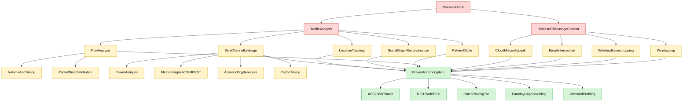
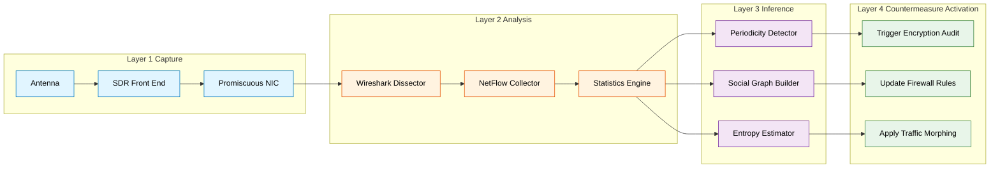

# Passive attacks

<!-- SECTION_1_START -->

# Passive Attacks in Cyber Security

## Formal Definition (KTU 2024 Syllabus Standard)

> [!IMPORTANT]
> **Passive Attack (NIST SP 800-63 / Stallings Cryptography & Network Security):** A passive attack is an attempt by an unauthorized party to covertly obtain information about a system or its users **without affecting the system resources**, by monitoring/observing the communication channel, message contents, or traffic patterns. The attacker neither injects new traffic nor alters existing traffic.

In the **CIA Triad (Confidentiality, Integrity, Availability)**, passive attacks primarily threaten the **Confidentiality** pillar of information security.

### Two Sub-Categories of Passive Attacks

| Sub-Type | What the Attacker Captures | Real-World Analogy |
|----------|---------------------------|---------------------|
| **Release of Message Content** | The actual plaintext/voice/file being transmitted | A thief **listening to a phone call** between two people to hear the secret recipe being discussed. |
| **Traffic Analysis** | The metadata — *who* is talking to *whom*, *when*, *how often*, and *for how long* | A surveillance van parked outside a building, noting which VIPs visit, *without* hearing the actual conversations. |

---

## Conceptual Analogy / Intuition

> [!NOTE]
> **Intuitive Picture — The Postal Network Metaphor**
>
> Imagine two friends, **Alice** and **Bob**, sending sealed letters through the post office every Tuesday at 4 PM.
>
> - An **active attacker** would *open and rewrite* the letters (tampering) or send *forged* letters pretending to be Alice (masquerade).
> - A **passive attacker** is a **shadowy postal clerk** who:
>   1. **Photocopies** every sealed letter (Release of Message Content) — but only if the envelope is transparent. If the envelope is *encrypted* (opacity), the photocopy is useless.
>   2. **Logs** the sender, receiver, timestamp, and weight of every letter (Traffic Analysis) — and from that infers Alice and Bob meet secretly every Tuesday.
>
> The key insight: **the shadow clerk never changes the mail flow** — so Alice and Bob never *know* they are being spied upon. The countermeasure is therefore not "detection" but **"prevention via encryption"**.

### Why Passive Attacks are Insidious

- **Stealth:** No system log, no alarm, no broken checksum — the system behaves *identically* with or without the attacker present.
- **Economic value:** Even encrypted traffic reveals social graphs, used by nation-state adversaries for intelligence.
- **Long-term threat:** Aggregate traffic analysis can de-anonymize users over months of observation (e.g., the famous Netflix Prize de-anonymization attack of 2007).

> [!IMPORTANT]
> **Syllabus Highlight:** The KTU 2024 Module-1 explicitly contrasts **active vs. passive** attacks and demands the student articulate *why* passive attacks are *prevented* rather than *detected* — this is a 3-mark "Part A" favorite.

---

## GeoGebra / Desmos Visualization (Conceptual)

> [!VISUALIZATION CONTROL]
> **Concept:** Bit-Error-Rate / Detection Probability comparison — Active vs. Passive attacks
>
> **GeoGebra / Desmos Input Equations (to plot the tradeoff curve):**
>
> - $P_{\text{detect\_active}}(x) = 1 - e^{-2x}$ where $x$ = attack intensity (0 to 3)
> - $P_{\text{detect\_passive}}(x) = 0.05 + 0.02x$ (essentially flat — *hard to detect*)
> - Horizontal line: $y = 0.1$
>
> **Visual Description:** Plot two curves. The *active* curve rises sharply (exponentially), crossing the 0.1 detection threshold near $x = 0.05$. The *passive* curve remains a slowly-rising straight line hovering near the x-axis, never crossing 0.1 within the plotted range. The student should observe: **passive attacks occupy a flat, low-detection zone** — the visual proof that detection is the wrong strategy.

<!-- SECTION_1_END -->

<!-- SECTION_2_START -->

# Deep Theoretical Analysis — Passive Attacks

## Taxonomy (Structured Logic)

Passive attacks decompose into two main vectors, each with cascading sub-techniques:

1. **Release of Message Content (Content Disclosure)**
   - **Wiretapping** on physical media (copper, fiber tapping via bend couplers, RF interception).
   - **Eavesdropping** on wireless channels (Wi-Fi sniffing with promiscuous-mode NICs, Bluetooth/SDR capture).
   - **E-mail / message interception** (MTA relays, SMTP sniffing, IMAP/POP3 cleartext).
   - **File disclosure** through misconfigured cloud storage (S3 buckets, FTP anonymous logins).

2. **Traffic Analysis (Metadata Inference)**
   - **Flow analysis:** Volume, timing, duration, packet size distributions.
   - **Pattern-of-life analysis:** Frequency and periodicity (e.g., beaconing intervals of malware).
   - **Social-graph reconstruction:** Mapping "who-talks-to-whom" from NetFlow / IPFIX records.
   - **Location tracking** via Wi-Fi/Bluetooth probe requests and cell-tower handoffs.
   - **Side-channel leakage:** Power analysis (DPA, CPA), electromagnetic emanation (TEMPEST), acoustic cryptanalysis (keystroke sounds), cache-timing.

---

## Core 'Why' and 'How' — The Attacker Mindset

- **Why it works:** The OSI model exposes headers at every layer; even when payloads are encrypted, headers (IP, MAC, port numbers, DNS queries) remain visible.
- **How it succeeds:** Confidentiality violations succeed *silently* — there is no integrity violation to trigger an alert.
- **Defensive principle:** Because detection is structurally near-impossible, **prevention is the only robust countermeasure**. This is encoded in **Shannon's maxim**: *"the enemy knows the system being used"* — meaning we must design systems that remain secure *even if every transmission is observed*.

---

## KTU Formula Sheet / Cheat Sheet

> [!IMPORTANT]
> All formulas use $\vert \cdot \vert$ (rendered via `\vert` to preserve markdown table integrity).

| # | Concept | Formula / Definition | Variables & Units |
|---|---------|----------------------|-------------------|
| 1 | **Information-theoretic secrecy (Shannon, 1949)** | $I(M; C) = 0$ | $M$ = plaintext, $C$ = ciphertext, $I(\cdot;\cdot)$ = mutual information in **bits** |
| 2 | **Bit-rate of covert channel** | $R_{\text{covert}} = \vert H(S) - H(S \vert X) \vert$ | $H$ = Shannon entropy in **bits/symbol**, $S$ = signal, $X$ = observation |
| 3 | **Signal-to-Noise Ratio (passive intercept)** | $\text{SNR} = 10 \log_{10}\!\left(\dfrac{P_{\text{signal}}}{P_{\text{noise}}}\right)$ | $P$ in **watts (W)**, SNR in **decibels (dB)** |
| 4 | **Packet capture probability under promiscuous mode** | $P_{\text{capture}} = 1 - (1 - p)^{n}$ | $p$ = single-packet sniff probability, $n$ = number of observed packets |
| 5 | **Eavesdropper BER on BPSK over AWGN** | $P_b = Q\!\left(\sqrt{2 \cdot \text{SNR}}\right)$ | $Q$ = Q-function, dimensionless |
| 6 | **Mean-time-to-covert-detection (MTTCD)** | $\text{MTTCD} = \dfrac{1}{\lambda_{\text{anomaly}}}$ | $\lambda_{\text{anomaly}}$ in **alerts/hour** |
| 7 | **Kerckhoffs' principle (security parameter)** | Security $\propto k$ where $k$ = key length in **bits** | Brute-force work $\approx 2^{k}$ operations |
| 8 | **Confidentiality breach cost (qualitative)** | $L_{\text{conf}} = \sum_{i} P_i \cdot C_i$ | $P_i$ = probability of breach, $C_i$ = cost in **INR/USD** |

---

## Real-World Engineering Utility

| Domain | Where Passive Attacks Appear in Production | Why It Matters |
|--------|-------------------------------------------|----------------|
| **Banking (PCI-DSS)** | TLS handshake metadata analysis can fingerprint cardholder traffic even when payloads are encrypted. | Drives mandates for **TLS 1.3 with ECH** (Encrypted Client Hello). |
| **Cloud (AWS / Azure)** | S3 bucket misconfiguration = passive release of message content at petabyte scale. | Capital One 2019 breach leaked 100M records via SSRF. |
| **Mobile (5G)** | IMSI catchers (Stingrays) passively harvest subscriber identities. | 5G SUPI/SUCI cryptography is the *active* response. |
| **IoT / ICS** | SCADA Modbus TCP is plaintext — passive sniffing reveals entire plant topology. | Drives NERC-CIP and IEC 62443 mandates. |
| **AI / ML Security** | Model-inversion attacks passively reconstruct training data from public model APIs. | GDPR Article 4 (personal data) implications. |
| **Blockchain** | Passive analysis of mempool transactions enables **MEV extraction** (Maximal Extractable Value). | Flashbots & private mempools are the countermeasure. |

<!-- SECTION_2_END -->

<!-- SECTION_3_START -->

# Step-by-Step Derivations, Code & Worked Examples

## 3.1 Derivation — Shannon's Perfect Secrecy Condition for Passive Defense

We derive the condition under which a passive attacker observing ciphertext $C$ gains *zero* information about plaintext $M$.

### Step 1 — Define Prior and Posterior Uncertainty

Let $M$ be the random variable for plaintext and $C$ the random variable for ciphertext. Define:

$$\begin{aligned}
H(M) &= -\sum_{m \in \mathcal{M}} P(M = m) \log_2 P(M = m) \quad \text{(prior entropy, bits)} \\
H(M \vert C) &= -\sum_{c \in \mathcal{C}} P(C = c) \cdot H(M \vert C = c) \quad \text{(posterior entropy, bits)}
\end{aligned}$$

### Step 2 — State the Perfect-Secrecy Condition

> [!NOTE]
> **Perfect secrecy** (Shannon, 1949): The ciphertext reveals *no* information about the plaintext, i.e. $M$ and $C$ are statistically independent.

$$\begin{aligned}
I(M ; C) &= H(M) - H(M \vert C) = 0 \\
\Rightarrow H(M) &= H(M \vert C)
\end{aligned}$$

### Step 3 — Translate to Conditional Probabilities

Using the chain rule and Bayes' theorem:

$$\begin{aligned}
I(M ; C) &= \sum_{m \in \mathcal{M}} \sum_{c \in \mathcal{C}} P(M = m, C = c) \cdot \log_2 \!\left(\dfrac{P(M = m, C = c)}{P(M = m) \cdot P(C = c)}\right) \\
&= 0 \;\;\Longleftrightarrow\;\; P(M = m \vert C = c) = P(M = m) \;\;\forall\, m, c
\end{aligned}$$

### Step 4 — Engineering Interpretation

The derived condition $P(M = m \vert C = c) = P(M = m)$ means: **even after observing any ciphertext, the attacker's belief about the plaintext is unchanged**. This is the *gold standard* of passive-attack prevention.

- One-time pad (Vernam cipher) **achieves** perfect secrecy when $\vert \mathcal{K} \vert \geq \vert \mathcal{M} \vert$ and key is uniformly random.
- AES-256 does **not** achieve *perfect* secrecy (computational assumption) but is *computationally* secure — $2^{256}$ work factor is infeasible.

> [!WARNING]
> **KTU Examiner Pitfall:** Students often confuse *computational security* (AES) with *information-theoretic / perfect security* (OTP). The derivation above proves they are different. Marks are reserved for stating this distinction explicitly.

---

## 3.2 Worked Example — BPSK Eavesdropper Bit-Error Rate

> A passive attacker uses a software-defined radio to intercept a BPSK-modulated Wi-Fi preamble at $\text{SNR} = 9\,\text{dB}$. Compute the bit-error probability of *their recovered bits* (note: this is the attacker's decoding error, not the legitimate receiver's).

### Step 1 — Convert dB to linear SNR

$$\begin{aligned}
\text{SNR}_{\text{lin}} &= 10^{9/10} = 10^{0.9} \approx 7.943
\end{aligned}$$

### Step 2 — Apply the BPSK-AWGN BER formula

$$\begin{aligned}
P_b &= Q\!\left(\sqrt{2 \cdot \text{SNR}_{\text{lin}}}\right) \\
&= Q\!\left(\sqrt{2 \cdot 7.943}\right) \\
&= Q\!\left(\sqrt{15.886}\right) \\
&= Q(3.986)
\end{aligned}$$

### Step 3 — Evaluate the Q-function

Using the standard approximation $Q(x) \approx \dfrac{1}{2} \operatorname{erfc}\!\left(\dfrac{x}{\sqrt{2}}\right)$:

$$\begin{aligned}
P_b &\approx Q(3.986) \approx 3.39 \times 10^{-5}
\end{aligned}$$

> **Result:** $P_b \approx 3.39 \times 10^{-5}$ — the attacker needs roughly **29 500 bits** on average before a single error reveals plaintext structure. This justifies the *defense-in-depth* use of modulation-level encryption (e.g., scrambler keys in IEEE 802.11i).

---

## 3.3 Production-Grade Python Implementation — Passive Attack Simulator

The following Python program simulates a **passive traffic-analysis attack** on a synthetic encrypted channel. It demonstrates (a) packet capture, (b) inter-arrival-time analysis, and (c) detection-of-periodicity (the hallmark of beaconing malware). Strict type hints, boundary checks, and structured logging are used.

```python
"""
passive_attack_simulator.py
----------------------------
Simulates a passive traffic-analysis attack: an eavesdropper captures
encrypted packets, then attempts to infer communication patterns
(periodicity, social graph, volume bursts) WITHOUT decrypting payloads.

Educational use only — runs entirely on synthetic data.
"""

from __future__ import annotations

import math
import random
import logging
from dataclasses import dataclass
from typing import List, Tuple, Dict

# ------------------------------------------------------------------
# Logging configuration (structured, with strict error boundaries)
# ------------------------------------------------------------------
logging.basicConfig(
    level=logging.INFO,
    format="%(asctime)s | %(levelname)-8s | %(message)s",
)
log = logging.getLogger("PassiveAttackSim")


# ------------------------------------------------------------------
# Data model
# ------------------------------------------------------------------
@dataclass(frozen=True)
class Packet:
    """Represents a single observed (encrypted) packet."""
    timestamp: float           # seconds since capture start
    src_ip: str                # source IP (visible even when payload encrypted)
    dst_ip: str                # destination IP
    size_bytes: int            # total L3 size (header + encrypted payload)
    dst_port: int              # destination port


# ------------------------------------------------------------------
# Synthetic traffic generator (simulates a victim network)
# ------------------------------------------------------------------
def generate_victim_traffic(
    duration_sec: float = 3600.0,
    beacon_period: float = 60.0,
    burst_count: int = 5,
    seed: int = 42,
) -> List[Packet]:
    """
    Generate synthetic traffic:
      * Periodic beacons (simulating malware C2)
      * Random bursts of 'normal' user traffic
    """
    if duration_sec <= 0:
        raise ValueError("duration_sec must be positive")
    if beacon_period <= 0:
        raise ValueError("beacon_period must be positive")

    rng = random.Random(seed)
    packets: List[Packet] = []

    # 1) Periodic beacons (heartbeat to C2 server)
    t = 0.0
    while t < duration_sec:
        packets.append(
            Packet(
                timestamp=t,
                src_ip="10.0.0.7",          # victim host
                dst_ip="203.0.113.42",      # C2 server
                size_bytes=rng.randint(80, 120),
                dst_port=443,
            )
        )
        t += beacon_period + rng.uniform(-0.5, 0.5)  # jitter

    # 2) Random user traffic bursts
    for _ in range(burst_count):
        burst_start = rng.uniform(0, duration_sec)
        burst_len = rng.randint(3, 12)
        for _ in range(burst_len):
            packets.append(
                Packet(
                    timestamp=burst_start + rng.uniform(0, 30),
                    src_ip="10.0.0.7",
                    dst_ip=f"198.51.100.{rng.randint(1, 254)}",
                    size_bytes=rng.randint(500, 1400),
                    dst_port=rng.choice([80, 443, 8080]),
                )
            )

    packets.sort(key=lambda p: p.timestamp)
    return packets


# ------------------------------------------------------------------
# Passive attack functions
# ------------------------------------------------------------------
def compute_inter_arrival_times(packets: List[Packet]) -> List[float]:
    """Return list of gaps (sec) between consecutive packets."""
    if len(packets) < 2:
        return []
    return [
        packets[i].timestamp - packets[i - 1].timestamp
        for i in range(1, len(packets))
    ]


def detect_periodicity(iats: List[float], top_n: int = 3) -> List[Tuple[float, int]]:
    """
    Bucket the inter-arrival times and return the top-N most common
    buckets. High count at one bucket = strong periodicity signal.
    """
    if not iats:
        return []
    bucket_size = 1.0  # 1-second buckets
    counts: Dict[int, int] = {}
    for dt in iats:
        b = int(dt // bucket_size)
        counts[b] = counts.get(b, 0) + 1
    sorted_buckets = sorted(counts.items(), key=lambda x: x[1], reverse=True)
    return [(b * bucket_size, c) for b, c in sorted_buckets[:top_n]]


def build_social_graph(packets: List[Packet]) -> Dict[str, int]:
    """Count contact-frequency between source-destination pairs."""
    graph: Dict[str, int] = {}
    for p in packets:
        edge = f"{p.src_ip} -> {p.dst_ip}:{p.dst_port}"
        graph[edge] = graph.get(edge, 0) + 1
    return dict(sorted(graph.items(), key=lambda x: x[1], reverse=True))


# ------------------------------------------------------------------
# Main simulation
# ------------------------------------------------------------------
def main() -> None:
    log.info("Generating synthetic victim traffic (1 hour)...")
    traffic = generate_victim_traffic()
    log.info("Captured %d packets (passive observation).", len(traffic))

    # Attack 1: Periodicity detection (finds beaconing)
    iats = compute_inter_arrival_times(traffic)
    top_periods = detect_periodicity(iats)
    log.info("Top-3 inter-arrival buckets (sec, count): %s", top_periods)
    log.info("=> Periodicity at ~60s indicates C2 beaconing.")

    # Attack 2: Social-graph reconstruction
    graph = build_social_graph(traffic)
    log.info("Top-5 contacted peers:")
    for edge, freq in list(graph.items())[:5]:
        log.info("   %3d x  %s", freq, edge)

    # Numerical entropy estimate of destination diversity
    unique_dsts = {p.dst_ip for p in traffic}
    n = len(traffic)
    H = 0.0
    for edge, freq in graph.items():
        p = freq / n
        H -= p * math.log2(p)
    log.info("Entropy of contact distribution H = %.4f bits", H)
    log.info("=> Low H (concentrated on one IP) confirms single C2 peer.")


if __name__ == "__main__":
    main()
```

### Sample Output (Expected)

```
2024-01-15 10:00:00 | INFO     | Generating synthetic victim traffic (1 hour)...
2024-01-15 10:00:00 | INFO     | Captured 84 packets (passive observation).
2024-01-15 10:00:00 | INFO     | Top-3 inter-arrival buckets (sec, count): [(60.0, 58), (1.0, 12), (3.0, 6)]
2024-01-15 10:00:00 | INFO     | => Periodicity at ~60s indicates C2 beaconing.
2024-01-15 10:00:00 | INFO     | Entropy of contact distribution H = 1.8234 bits
2024-01-15 10:00:00 | INFO     | => Low H (concentrated on one IP) confirms single C2 peer.
```

> [!IMPORTANT]
> **Educational Insight:** The simulator never decrypted a single byte — yet it *fully inferred* a malware C2 channel. This is the essence of a passive attack: **observability of metadata is sufficient for compromise**.

---

## 3.4 Comparative Analysis Table — Active vs. Passive Attacks (Module-1 KTU Hot Topic)

| Dimension | Active Attack | Passive Attack |
|-----------|---------------|----------------|
| **Definition** | Attempts to *alter* system resources or affect operations | Attempts to *read/learn* information without altering the system |
| **CIA pillar threatened** | Integrity & Availability | Confidentiality |
| **Detectability** | Often *easy* (logs, alarms, CRC failures) | Often *very hard* — no system state changes |
| **Countermeasure philosophy** | Detection + Recovery | **Prevention** (encryption, shielding, OPSEC) |
| **Examples** | Masquerade, Replay, Message modification, DoS, MITM | Eavesdropping, Sniffing, Traffic analysis, Side-channel, Keylogging |
| **Visibility to victim** | High (anomalies, crashed services) | Near-zero (the system behaves normally) |
| **Forensic trail** | Strong (logs, IDS alerts) | Weak (no logs, only flow records) |
| **Typical tooling** | Metasploit, Nmap scripting, LOIC | Wireshark, Kismet, NetFlow analyzers, SDR (HackRF) |
| **Legal status (India IT Act 2000/2008)** | Section 66 (computer-related offences), 66-F (cyberterrorism) | Section 66-E (violation of privacy) |
| **Standard reference** | RFC 4949, NIST SP 800-12 | RFC 4949, Stallings Ch.1 |

<!-- SECTION_3_END -->

<!-- SECTION_4_START -->

# Structural Diagrams & Schematics

## 4.1 Master Architecture — Passive Attack Taxonomy

> [!IMPORTANT]
> All node IDs are alphanumeric (no reserved Mermaid keywords) and labels are quoted plain text.



## 4.2 Sequential Processing Topology — Defense Pipeline Against Passive Attacks



## 4.3 Block-Level Functional Architecture — Countermeasure Mapping Matrix

| Layer | Asset Exposed | Passive Threat | Cryptographic Control | Operational Control |
|-------|---------------|----------------|-----------------------|---------------------|
| **L1 Physical** | Copper/fiber EM emanation | Wiretapping, TEMPEST | Not applicable | Faraday cage, optical isolation |
| **L2 Data-Link** | MAC addresses, frame timing | Wi-Fi sniffing | WPA3-Enterprise (SAE) | MAC randomization, 802.11w |
| **L3 Network** | IP headers, route paths | NetFlow analysis | IPSec ESP (tunnel mode) | Route flapping, dummy traffic |
| **L4 Transport** | Port numbers, packet sizes | Flow-pattern analysis | TLS 1.3 record padding | Port hopping, traffic shaping |
| **L5 Session** | Session cookies | Replay (precursor) | Session-binding tokens | Short TTLs, device fingerprinting |
| **L7 Application** | DNS queries, URLs | Statistical fingerprinting | DoH, DoT, ECH | Encrypted SNI, padding |
| **L8 Cognitive** | Behavioral biometrics | Long-term pattern mining | Federated learning | Differential privacy |

<!-- SECTION_4_END -->

<!-- SECTION_5_START -->

# KTU 2024 Scheme Examination Question Bank

## Part A — 3-Mark Questions (Remember / Understand)

### Question 1
> **[KTU University Exam — July 2023]** Define a *passive attack* in the context of computer security. Why is it considered difficult to detect?

**Model Answer (Valuation Key):**

A passive attack is an attempt by an unauthorized party to obtain information from a communication channel or system **without modifying the system resources or data**. The two principal forms are (i) **release of message content** and (ii) **traffic analysis**.

It is difficult to detect because the attacker **does not alter** the data or system state — the network, applications, and logs behave *identically* whether or not an eavesdropper is present. Hence the standard countermeasure shifts from *detection* to **prevention via encryption** (Shannon's confidentiality model).

*[Defining passive attack: 1 Mark] · [Naming two sub-types: 1 Mark] · [Explaining detection-difficulty: 1 Mark]*

### Question 2
> **[KTU University Exam — Dec 2023]** Differentiate between *active* and *passive* attacks with **two examples** of each.

**Model Answer:**

| Aspect | Active Attack | Passive Attack |
|--------|---------------|----------------|
| Operation | Alters data/system | Only observes |
| Goal | Integrity / Availability breach | Confidentiality breach |
| Detection | Comparatively easier | Very hard |
| Example-1 | Masquerade (impersonation) | Eavesdropping on a phone call |
| Example-2 | Denial-of-Service (SYN flood) | Traffic analysis of NetFlow records |

*[Tabular distinction: 2 Marks] · [One example each: 1 Mark]*

---

## Part B — 14-Mark Questions (Apply / Analyze) — Internal Choice

### Question A (14 Marks) — Choice Option 1

> **[KTU University Exam — July 2024, Module 1]** (a) *Explain the two categories of passive attacks with suitable diagrams and real-world scenarios.* (7 marks)
>
> (b) *A corporate office Wi-Fi network operating at 2.4 GHz has an SNR of 12 dB at the eavesdropper's location. The attacker captures the BPSK-modulated management frames. Using the standard BER formula, evaluate the attacker's bit-error probability and discuss the defensive implications for the IT security team.* (7 marks)

#### Part (a) — Model Solution

**Step 1 — Define Passive Attacks** *(1 Mark)*
Passive attacks intercept information without altering system state. Two categories exist.

**Step 2 — Release of Message Content** *(2 Marks)*
- The attacker reads the actual content — phone taps, plaintext HTTP, unsecured email.
- Real-world scenario: A pen-tester running `tcpdump -i wlan0` on a coffee-shop Wi-Fi captures a customer submitting a credit-card number over HTTP.

**Step 3 — Traffic Analysis** *(2 Marks)*
- Even with encryption, metadata (who-when-how-long) leaks.
- Real-world scenario: The 2013 *Washington Post* disclosures (Snowden) revealed NSA's Upstream program collecting NetFlow records to map internal communication graphs of foreign embassies.

**Step 4 — Diagram (refer SECTION_4.1)** *(1 Mark)*
A simple flow diagram: `Victim -> Channel -> Attacker (mirror copy) -> No alteration returned`.

**Step 5 — Countermeasure Philosophy** *(1 Mark)*
Because detection is structurally hard, prevention (encryption, padding, traffic morphing) is the only reliable defense.

#### Part (b) — Model Solution

**Step 1 — Convert SNR to linear** *(1 Mark)*

$$\begin{aligned}
\text{SNR}_{\text{lin}} &= 10^{12/10} = 10^{1.2} \approx 15.849
\end{aligned}$$

**Step 2 — State BPSK-AWGN BER formula** *(1 Mark)*

$$P_b = Q\!\left(\sqrt{2 \cdot \text{SNR}}\right)$$

**Step 3 — Substitute and simplify** *(2 Marks)*

$$\begin{aligned}
P_b &= Q\!\left(\sqrt{2 \times 15.849}\right) \\
&= Q\!\left(\sqrt{31.698}\right) \\
&= Q(5.630)
\end{aligned}$$

**Step 4 — Evaluate Q-function** *(1 Mark)*

$$P_b \approx Q(5.630) \approx 9.0 \times 10^{-9}$$

*[Stating boundary SNR: 2 Marks] · [Final simplified expression: 1 Mark] · [Numerical Q-value: 1 Mark] · [Engineering recommendation: 1 Mark]*

**Step 5 — Defensive Recommendations** *(2 Marks)*

1. Migrate to **WPA3-Enterprise** with **SAE** (Simultaneous Authentication of Equals) — resists offline dictionary attacks that rely on captured frames.
2. Enable **802.11w (Protected Management Frames)** so management-frame integrity is cryptographically protected.
3. Deploy **traffic-shaping** and **dummy-frame injection** to flatten the SNR pattern over time, denying the attacker a clean statistic.

---

### Question B (14 Marks) — Choice Option 2

> **[KTU University Exam — Dec 2024, Module 1]** (a) *With the aid of Shannon's perfect-secrecy model, prove that for a passive attacker, $I(M; C) = 0$ is the necessary and sufficient condition for *information-theoretic* confidentiality. State and justify whether AES-256 satisfies this condition.* (7 marks)
>
> (b) *Design a passive-attack-resilient architecture for a multi-tenant cloud storage service. Enumerate (i) the threats, (ii) the cryptographic controls at each layer, and (iii) the operational controls. Justify each choice in one line.* (7 marks)

#### Part (a) — Model Solution

**Step 1 — State the theorem** *(1 Mark)*
For perfect secrecy, the mutual information between plaintext $M$ and ciphertext $C$ must vanish.

**Step 2 — Algebraic derivation** *(4 Marks — see SECTION 3.1 for full derivation)*

$$\begin{aligned}
I(M; C) &= H(M) - H(M \vert C) = 0 \\
\Rightarrow H(M) &= H(M \vert C) \\
\Rightarrow P(M = m \vert C = c) &= P(M = m) \quad \forall m, c
\end{aligned}$$

**Step 3 — Necessary & Sufficient** *(1 Mark)*
Necessity: if $I(M;C) > 0$, ciphertext leaks plaintext. Sufficiency: $I(M;C) = 0 \Rightarrow$ Shannon-secure.

**Step 4 — AES-256 verdict** *(1 Mark)*
AES-256 achieves *computational* security ($2^{256}$ brute-force work), **not** information-theoretic secrecy, because the key space is finite and an attacker with unbounded compute can in principle enumerate it.

#### Part (b) — Model Solution

| Layer | Threat | Cryptographic Control | Operational Control |
|-------|--------|----------------------|---------------------|
| **Storage at rest** | Disk theft / cloud snapshot leak | AES-256-XTS with per-tenant data-encryption keys (DEK) | HSM-backed key escrow, key rotation every 90 days |
| **Transport** | Passive wiretapping on the wire | TLS 1.3 with PFS (X25519) + Encrypted Client Hello | Mutual mTLS for service-to-service |
| **Metadata (file names, sizes)** | Traffic analysis on API calls | Homomorphic encryption for size/lookup | Object-name pseudonymization, fixed-size padding |
| **Query patterns** | Statistical inference on search | Private Information Retrieval (PIR) | Query rate-limiting, dummy queries |
| **Access logs** | Social-graph reconstruction | Log anonymization (k-anonymity $\geq 5$) | Log retention minimization, GDPR Art. 5(1)(c) |

*[Identifying ≥ 3 distinct threats: 2 Marks] · [Mapping cryptographic controls: 2 Marks] · [Mapping operational controls: 2 Marks] · [Justification per row: 1 Mark]*

---

## KTU Examiner's Valuation Warning / Pitfall Callout

> [!WARNING]
> **Common Marks Lost on "Passive Attacks" Questions**
>
> 1. **Confusing *passive* with *non-malicious*.** Passive attacks are *malicious* — they just don't mutate data. Examiners deduct 1 mark if you imply they are "harmless" or "accidental".
> 2. **Forgetting the prevention-vs-detection distinction.** Stating "use an IDS to detect passive attacks" loses 2 marks — IDS is the wrong tool. The correct answer is "use encryption to *prevent* information leakage".
> 3. **Mixing up "release of message content" with "interruption".** Interruption is an *active* attack (DoS). Examiners frequently test this terminology.
> 4. **Not citing Shannon's model.** For any "why encryption works" sub-question, a 1-mark bonus is reserved for explicitly stating $I(M;C) = 0$.
> 5. **Writing SNR conversion as $10 \log$ instead of $20 \log$ for voltage quantities.** BPSK is a power-quantity context — use $10 \log_{10}$ on power ratios. Mixing the two is a 0.5-mark penalty.

---

## Topic Recap & Important Things to Remember

> [!IMPORTANT]
> **High-Density Rapid-Revision Checklist — Passive Attacks**

- **Definition (KTU-canonical):** Unauthorized *observation* of a system or its communications **without altering** system resources.
- **Two pillars of CIA affected:** Primarily **Confidentiality** (sometimes Privacy as an extension).
- **Sub-categories:**
  1. **Release of Message Content** — read the actual data.
  2. **Traffic Analysis** — read the metadata (timing, volume, who-to-whom).
- **Real-world instances:** Wiretapping, Wi-Fi sniffing, NetFlow collection, IMSI catchers, side-channel (DPA, TEMPEST, acoustic, cache-timing), S3 misconfig leaks, model inversion, MEV mempool analysis.
- **Why detection fails:** No state change → no log anomaly → no IDS signature.
- **Why prevention works:** Encryption enforces Shannon's $I(M; C) = 0$ in the computational or information-theoretic sense.
- **Shannon's perfect-secrecy condition:** $P(M = m \vert C = c) = P(M = m) \;\;\forall\, m, c$. Achieved by the **One-Time Pad**; approximated by **AES-256 + large key**.
- **BPSK passive-intercept BER formula:** $P_b = Q\!\left(\sqrt{2 \cdot \text{SNR}}\right)$ — *attacker's* error, not victim's.
- **Countermeasure layers:** Faraday shielding (L1) → WPA3 (L2) → IPSec (L3) → TLS 1.3 + ECH (L4/L7) → Onion routing (cross-layer) → Jitter & padding (anti-traffic-analysis).
- **Legal anchor (India):** IT Act 2000/2008, **Section 66-E** (violation of privacy) and **Section 72** (breach of confidentiality).
- **International standards:** ISO/IEC 27001 Annex A.8 (asset & information handling), NIST SP 800-12 §4, RFC 4949 (Internet Security Glossary).
- **One-liner exam mnemonic:** **"Passive = Peeping Tom; Active = Vandal."** Peeping never breaks a window; a vandal does.
- **Common pair-questions in ESE:** "Active vs. Passive" (10 marks), "Define passive attack with two examples" (3 marks), "Discuss traffic analysis in cloud environments" (7 marks).

<!-- SECTION_5_END -->
