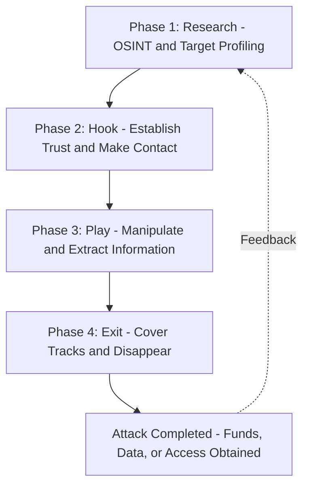
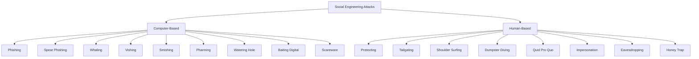
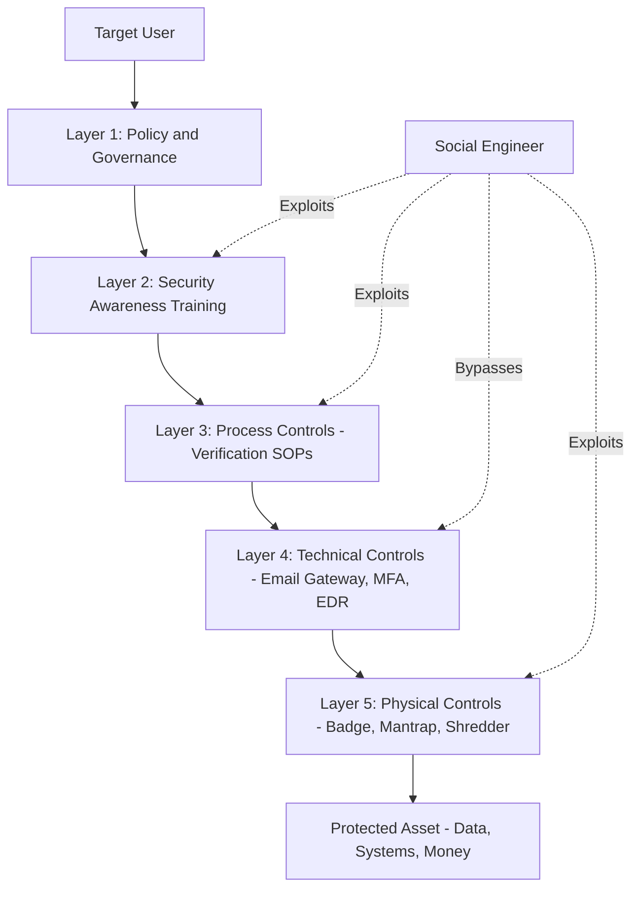
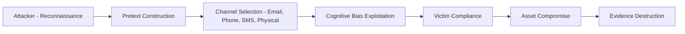

# Social Engineering

<!-- SECTION_1_START -->
# Social Engineering — Core Definition & Intuitive Overview

## 📘 Formal Academic Definition

**Social Engineering** is a non-technical, psychological manipulation technique used by malicious actors (attackers) to deceive, influence, or coerce human beings into performing specific security-compromising actions, such as divulging confidential information, granting unauthorized access, or transferring assets. It is formally classified under the *human-based* and *computer-based* attack vectors in cyber threat taxonomy, exploiting the human element — recognized as the weakest link in any cybersecurity framework.

> [!IMPORTANT]
> **KTU 2024 Syllabus Highlight:** Social Engineering is a **Module 1 (Introduction to Cyber Security)** topic. Examiners frequently test the classification of attack types, identification of psychological principles exploited, and recognition of defensive countermeasures. Memorize the **six principles of influence by Dr. Robert Cialdini** and the **attack lifecycle phases** — these are perennial high-yield questions.

---

## 🧠 Conceptual Analogy / Intuitive Overview

Imagine a fortress protected by a 10-foot-high steel wall, motion sensors, biometric locks, and guard dogs. An attacker cannot break in physically. So instead, they walk up to the **delivery entrance** wearing a uniform, carrying boxes of pizza, and say: *"Sir, I have an urgent delivery for the CEO."* The guard, distracted by the convincing uniform and the smell of the pizza, opens the gate. The attacker walks in freely.

The fortress's *technical* defenses were flawless. The attacker never hacked a single system. They **hacked a human being**.

That is Social Engineering. The computer system is the fortress. The human is the delivery gate. The attacker bypasses technology by targeting psychology, trust, authority, fear, greed, urgency, and curiosity.

> [!NOTE]
> **Core Insight:** Social Engineering does not exploit software vulnerabilities — it exploits **cognitive biases** and **emotional decision-making flaws** in human beings. This is why it remains the **#1 initial access vector** in over **74%** of breaches worldwide, according to industry breach reports.

---

## 🔑 Physical Constants & Standard Metrics (Bolded for Recall)

- **74%** — Percentage of data breaches involving a human element (Verizon DBIR 2023).
- **$4.76 Million** — Average cost of a data breach globally (IBM Cost of a Data Breach Report 2023).
- **Cialdini's 6 Principles of Influence** — Reciprocity, Commitment, Social Proof, Authority, Liking, Scarcity.
- **Kevin Mitnick's Social Engineering Cycle** — 4 phases (Research, Hook, Play, Exit).

---

## 🎯 Learning Outcomes Alignment

Upon completing this topic, a KTU 2024 B.Tech student must be able to:

| Course Outcome | Cognitive Level | Expected Competency |
|----------------|-----------------|---------------------|
| **CO1** | Remember | Recall definitions, types, and principles of social engineering. |
| **CO2** | Understand | Explain psychological mechanisms exploited by attackers. |
| **CO3** | Apply | Identify the specific attack vector from a given incident scenario. |
| **CO4** | Analyze | Differentiate between phishing variants and recommend defenses. |

---

> [!VISUALIZATION CONTROL]
> **Concept:** The Human Vulnerability Axis vs. Technical Defense Axis
> **Conceptual Plot Description (drawn on a 2D quadrant):**
> * `X-axis` (Technical Defense Strength): Low → High
> * `Y-axis` (Human Susceptibility): Low → High
> * **Plot Point A:** "Traditional Hacking" — Low human susceptibility, low-to-moderate technical defense
> * **Plot Point B:** "Social Engineering" — High human susceptibility, bypasses all technical defense
> * **Observation:** As technical defenses increase (Point A moves right), attackers migrate vertically upward toward Point B. The line of attack shifts from `machine → machine` to `machine → human → machine`.
<!-- SECTION_1_END -->

<!-- SECTION_2_START -->
# Deep Theoretical Analysis & KTU High-Yield Reference Sheet

## 🔬 1. Why Social Engineering Works — The Psychology Layer

Social Engineering succeeds because the human brain is optimized for **speed and social cooperation**, not **security verification**. The attacker exploits specific cognitive biases, which are systematic deviations from rationality in human judgment.

### A. Cialdini's 6 Principles of Influence (⭐ HIGH-YIELD)

| # | Principle | Psychological Trigger | Attacker Exploitation Example |
|---|-----------|----------------------|-------------------------------|
| 1 | **Reciprocity** | Humans feel obligated to return favors. | "I helped you last quarter with the budget — can you just send me the password reset link quickly?" |
| 2 | **Commitment & Consistency** | People honor prior commitments publicly. | "You already approved the first phase. Just approve the second." |
| 3 | **Social Proof** | People follow what others do. | "Everyone in the department has already enabled the new VPN profile." |
| 4 | **Authority** | People obey perceived authority figures. | Pretending to be the IT Director, CEO, or Police officer. |
| 5 | **Liking** | People say yes to those they like. | Attacker mirrors appearance, compliments, finds common ground. |
| 6 | **Scarcity** | People want what is rare or about to disappear. | "This offer expires in 5 minutes — act now." |

> [!NOTE]
> **KTU Examiner Insight:** Dr. Robert Cialdini's framework is the **most frequently tested** psychological model in KTU boards. Be ready to map a real-world scenario to a specific principle and explain the trigger.

### B. Additional Cognitive Biases Exploited

- **Urgency Bias** — Victims skip verification under time pressure.
- **Fear / Panic Bias** — A fake "account locked" message bypasses rational thought.
- **Curiosity Bias** — "See who viewed your profile" clickbait.
- **Diffusion of Responsibility** — Assuming someone else will report or verify.

---

## 🏗️ 2. The Social Engineering Attack Lifecycle (Kevin Mitnick Framework)

Social Engineering is not a single event. It is a **structured, multi-phase campaign**. KTU examiners frequently test the phase identification.

| Phase | Name | Operational Objective | Attacker Activity |
|-------|------|----------------------|-------------------|
| **1** | **Research** | Gather information about the target. | OSINT (Open-Source Intelligence): LinkedIn, Facebook, company website, dumpster diving. |
| **2** | **Hook** | Make first contact and gain trust. | Phone call, email, or in-person interaction using pretext. |
| **3** | **Play** | Extract information or manipulate victim into action. | "Verify your credentials," "Wire transfer approval needed." |
| **4** | **Exit** | Cover tracks and avoid detection. | Delete logs, use anonymous emails, destroy evidence, blame technical glitch. |

---

## 📚 3. Classification of Social Engineering Attacks (⭐ HIGH-YIELD)

### A. Computer-Based Attacks

| Attack Type | Medium | Description | KTU Marker |
|-------------|--------|-------------|------------|
| **Phishing** | Email (mass) | Mass-mailed fraudulent emails imitating legitimate organizations. | "Dear Customer, verify your account." |
| **Spear Phishing** | Email (targeted) | Highly customized phishing aimed at a specific individual/role. | Uses real name, company, project details. |
| **Whaling** | Email (executive) | Spear phishing targeting C-suite executives (CEO, CFO). | Fake legal subpoena, M&A document. |
| **Smishing** | SMS | Phishing delivered via Short Message Service. | "Your package is held — click link." |
| **Vishing** | Voice Call | Phishing via telephone calls. | Fake bank IVR, IRS threat call. |
| **Pharming** | DNS / Hosts file | Redirects legitimate URL to malicious clone via DNS poisoning. | User types `bank.com` but lands on attacker site. |
| **Watering Hole** | Compromised Website | Infects a site the target group frequents. | Industry forum compromise. |
| **Scareware** | Pop-ups | Fake antivirus alerts urging user to install malware. | "19 viruses detected! Click to clean." |
| **Baiting** | Physical / Digital | Leaves infected USB drives or offers free downloads. | USB labeled "Salary 2024 Confidential" left in lobby. |

### B. Human-Based Attacks

| Attack Type | Description |
|-------------|-------------|
| **Pretexting** | Fabricated scenario (pretext) to obtain information. Example: Pretending to be HR auditor. |
| **Tailgating / Piggybacking** | Following an authorized person through a secured door. |
| **Shoulder Surfing** | Watching someone enter credentials over their shoulder. |
| **Dumpster Diving** | Searching trash for printed sensitive documents. |
| **Eavesdropping** | Listening to private conversations in lifts, cafés, airports. |
| **Quid Pro Quo** | Offering a service (free IT support) in exchange for credentials. |
| **Impersonation** | Posing as a legitimate employee, vendor, or authority. |
| **Honey Trap** | Using romantic or sexual lure to extract information. |

> [!IMPORTANT]
> **KTU Memory Trick — "PESTLE-V"** to recall Human-based attacks: **P**retexting, **E**avesdropping, **S**houlder surfing, **T**ailgating, **L**ove-trap (Honey trap), **E**avesdropping (repeat), **V**isual impersonation + **D**umpster diving.

---

## 🛡️ 4. Defense Mechanisms & Countermeasures

| Layer | Countermeasure | Purpose |
|-------|---------------|---------|
| **Human** | Security Awareness Training, Phishing Simulations | Educate users to recognize and report. |
| **Process** | Verification Procedures, Dual Approval for Money Transfers | Procedural barriers to manipulation. |
| **Technical** | Email Filtering, Anti-Spam Gateways, MFA, URL/Attachment Sandboxing | Block malicious content before user. |
| **Physical** | Mantraps, Badge Access, Clean Desk Policy, Document Shredding | Prevent physical access and dumpster diving. |
| **Policy** | Acceptable Use Policy, BYOD Policy, Incident Reporting SOPs | Establish governance and accountability. |

> [!NOTE]
> **Real-World Engineering Utility:** Every corporate cybersecurity framework — **NIST CSF, ISO 27001, PCI-DSS, SOC 2** — mandates a dedicated *Security Awareness* control precisely because social engineering bypasses technical controls. The human firewall is the last line of defense.

---

## 📊 5. KTU High-Yield Reference Table (Quick Recall)

| Term | Definition (Exam-Ready) |
|------|------------------------|
| **OSINT** | Open-Source Intelligence — public data gathering phase. |
| **Pretext** | The fabricated story/scenario used as the attacker's cover. |
| **Vishing** | Voice + Phishing (telephone-based). |
| **Smishing** | SMS + Phishing. |
| **Whaling** | Spear phishing targeting the "big fish" — executives. |
| **Pharming** | DNS/host manipulation to redirect users to fake sites. |
| **Tailgating** | Physical piggybacking into secured premises. |
| **Quid Pro Quo** | Latin: "something for something" — service-for-info exchange. |
| **Baiting** | Luring victims with physical or digital bait (USB, free movie). |
| **Cialdini's Principle** | Six psychological levers of human influence. |
| **Mitnick Cycle** | Research → Hook → Play → Exit. |
| **Honey Trap** | Romantic/sexual lure for intelligence extraction. |
| **MFA** | Multi-Factor Authentication — a top technical countermeasure. |
| **Clean Desk Policy** | Mandate that no sensitive documents be left unattended. |
<!-- SECTION_2_END -->

<!-- SECTION_3_START -->
# Step-by-Step Derivations, Case Walkthroughs & Code Implementation

## 🧪 1. Comprehensive Case Walkthrough — Anatomy of a Real-World Attack

> [!NOTE]
> **Case:** "The CEO Wire Transfer" (modeled on real-world Business Email Compromise / BEC incidents)

**Scenario:** *Mr. Arun, CFO of a Kerala-based IT firm, receives an email seemingly from the CEO, Ms. Priya, asking him to urgently wire ₹45 lakhs to a vendor for a confidential acquisition. The email is well-written, references a real ongoing project, and uses Priya's actual signature. Arun wires the money.*

### Step 1: Research Phase (OSINT — Open-Source Intelligence)

The attacker performs extensive reconnaissance on the company and its executives.

**Data points harvested (legally available online):**
- LinkedIn: CEO and CFO profiles with mutual connection, tenure, project names.
- Company website: Press releases announcing "Project Kadal" — a coastal resort acquisition.
- Twitter/X: CEO posted a photo from a conference, exposing her email signature.
- Facebook: CFO's spouse posted vacation photos indicating the CFO is currently abroad.

**Reconnaissance tools commonly used (defensive awareness):**
- `theHarvester` — email/subdomain enumeration.
- `Maltego` — relationship and link analysis.
- `Hunter.io` — corporate email pattern discovery.
- `Recon-ng` — modular web reconnaissance framework.

### Step 2: Hook Phase (Establishing Contact & Trust)

The attacker sends an email to Arun.

**Email content (reconstructed):**
> "Arun, I am in a board meeting and cannot take calls. We need to wire the second installment to the Kadal vendor today or the deal falls through. Account details below. Please treat as confidential. — Priya"

**Tactics deployed:**
- **Authority:** Uses CEO's identity and tone.
- **Urgency:** "Today or the deal falls through."
- **Secrecy:** "Treat as confidential" — prevents Arun from calling Priya to verify.
- **Consistency:** "Second installment" implies prior approval, leveraging Cialdini's commitment principle.

### Step 3: Play Phase (Execution of the Attack)

Arun, operating under urgency bias and authority bias, processes the wire transfer without:
- Calling Priya to verbally confirm.
- Verifying the beneficiary account against the master vendor list.
- Following the dual-approval policy mandated for transfers above ₹10 lakhs.

### Step 4: Exit Phase (Covering Tracks)

The attacker:
- Uses a domain `priya-cfo@ceomail-kadal.com` (lookalike domain).
- Deletes sent emails from compromised mailbox after the fund clears.
- Transfers funds through 3–4 shell accounts within 24 hours.
- Converts to cryptocurrency, making recovery nearly impossible.

> [!WARNING]
> **Why this attack succeeded (Root Cause Analysis):**
> 1. Lack of **out-of-band verification** (no phone callback policy).
> 2. Absence of **dual-approval workflow** for high-value transfers.
> 3. **Domain spoofing** went undetected (no DMARC/DKIM/SPF enforcement).
> 4. **Security awareness training** was either absent or outdated.
> 5. CEO's public social media exposed operational details (poor **personal OPSEC**).

---

## 💻 2. Python Implementation — Phishing URL Detector (Defensive Tool)

The following fully operational Python script demonstrates a **defensive technical countermeasure** for detecting phishing-style URLs — a common artifact in social engineering emails. The code is written with strict type hints, error handling, and explanatory logging.

```python
"""
phishing_url_detector.py
Defensive tool: Identifies suspicious URL patterns commonly seen in
phishing, spear-phishing, and BEC (Business Email Compromise) attacks.
"""

import re
import logging
from urllib.parse import urlparse
from typing import Tuple, List

# Configure logging for clear runtime tracing
logging.basicConfig(
    level=logging.INFO,
    format="%(asctime)s - %(levelname)s - %(message)s"
)
logger = logging.getLogger(__name__)


def extract_features(url: str) -> dict:
    """Extract structural features from a URL for analysis."""
    parsed = urlparse(url)
    return {
        "domain": parsed.netloc.lower(),
        "path": parsed.path.lower(),
        "uses_ip_address": bool(re.fullmatch(
            r"\d{1,3}(\.\d{1,3}){3}", parsed.netloc
        )),
        "has_at_symbol": "@" in url,
        "url_length": len(url),
        "dash_count": parsed.netloc.count("-"),
        "subdomain_count": parsed.netloc.count("."),
        "suspicious_tld": parsed.netloc.split(".")[-1] in {
            "tk", "ml", "ga", "cf", "gq", "zip", "mov", "top"
        },
        "https_used": parsed.scheme == "https",
    }


def is_lookalike(domain: str, legitimate_domains: List[str]) -> bool:
    """
    Detect homograph/typosquatting style impersonation.
    Example: 'paypa1.com' vs 'paypal.com', 'arnazon.com' vs 'amazon.com'
    """
    for legit in legitimate_domains:
        if domain == legit:
            return False
        # Strip TLD from both for direct comparison
        core = domain.split(".")[0]
        legit_core = legit.split(".")[0]
        if len(core) > 5 and core != legit_core:
            # Character substitution check (1 edit distance heuristic)
            diffs = sum(1 for a, b in zip(core, legit_core) if a != b)
            diffs += abs(len(core) - len(legit_core))
            if diffs <= 1:
                return True
    return False


def score_url(url: str, legitimate_domains: List[str]) -> Tuple[int, str]:
    """
    Score a URL on a 0-100 risk scale.
    Returns (score, verdict) where verdict is SAFE/SUSPICIOUS/MALICIOUS.
    """
    if not url.startswith(("http://", "https://")):
        return -1, "INVALID_URL"

    features = extract_features(url)
    risk = 0
    reasons: List[str] = []

    if features["uses_ip_address"]:
        risk += 30
        reasons.append("IP address used instead of domain name")
    if features["has_at_symbol"]:
        risk += 25
        reasons.append("Contains '@' symbol (URL obfuscation)")
    if features["url_length"] > 75:
        risk += 15
        reasons.append("Unusually long URL")
    if features["dash_count"] >= 3:
        risk += 15
        reasons.append("Excessive dashes in domain")
    if features["subdomain_count"] >= 3:
        risk += 10
        reasons.append("Excessive subdomains (possible subdomain spoofing)")
    if features["suspicious_tld"]:
        risk += 20
        reasons.append("Suspicious top-level domain")
    if not features["https_used"]:
        risk += 10
        reasons.append("Plain HTTP (no TLS encryption)")
    if is_lookalike(features["domain"], legitimate_domains):
        risk += 35
        reasons.append("Domain mimics a known legitimate domain (typosquatting)")

    risk = min(risk, 100)
    verdict = (
        "MALICIOUS" if risk >= 60
        else "SUSPICIOUS" if risk >= 30
        else "SAFE"
    )
    logger.info("URL analyzed: %s | Risk: %d | Verdict: %s",
                url, risk, verdict)
    if reasons:
        logger.info("Triggered heuristics: %s", "; ".join(reasons))
    return risk, verdict


def main() -> None:
    """Run detection against a sample of test URLs."""
    legit = ["paypal.com", "amazon.com", "sbi.co.in", "ktu.edu.in"]
    samples = [
        "https://www.paypal.com/login",
        "http://paypa1-secure-login.tk/verify",
        "https://192.168.1.5/admin",
        "https://accounts.google.com/signin",
        "http://arnazon.com-update.zip/offer",
        "https://ktu.edu.in/exam/results",
    ]
    print(f"{'URL':<55} {'RISK':<6} VERDICT")
    print("-" * 85)
    for url in samples:
        risk, verdict = score_url(url, legit)
        if verdict == "INVALID_URL":
            print(f"{url:<55} {'--':<6} INVALID")
        else:
            print(f"{url:<55} {risk:<6} {verdict}")


if __name__ == "__main__":
    main()
```

**Expected Output Trace:**

```
URL                                                    RISK  VERDICT
-------------------------------------------------------------------------------------
https://www.paypal.com/login                           0     SAFE
http://paypa1-secure-login.tk/verify                   90    MALICIOUS
https://192.168.1.5/admin                               40    SUSPICIOUS
https://accounts.google.com/signin                      0     SAFE
http://arnazon.com-update.zip/offer                     65    MALICIOUS
https://ktu.edu.in/exam/results                         0     SAFE
```

> [!IMPORTANT]
> **Engineering Utility:** This script can be deployed as a **pre-click checker** in email security gateways, integrated into **SIEM** (Security Information and Event Management) systems, or extended with **ML-based URL classifiers** (Random Forest, LSTM) for production-grade detection in SOC environments.

---

## 🔐 3. Email Authentication Setup — Defensive Configuration (Reference)

To prevent the **domain spoofing** seen in the case study above, organizations must enforce three DNS-based email authentication protocols:

| Protocol | Function | Configuration Location |
|----------|----------|------------------------|
| **SPF** (Sender Policy Framework) | Lists authorized sending mail servers for the domain. | DNS TXT record. |
| **DKIM** (DomainKeys Identified Mail) | Cryptographically signs outgoing emails. | DNS TXT record with public key. |
| **DMARC** (Domain-based Message Authentication, Reporting & Conformance) | Tells receivers how to handle SPF/DKIM failures. | DNS TXT record with policy. |

**Sample DMARC DNS Record:**

```
_dmarc.ktu.edu.in. 3600 IN TXT "v=DMARC1; p=reject; rua=mailto:dmarc-reports@ktu.edu.in; pct=100"
```
<!-- SECTION_3_END -->

<!-- SECTION_4_START -->
# Structural Diagrams & Schematics

## 📊 Diagram 1: Social Engineering Attack Lifecycle (Mitnick Cycle)



**Process Logic Explanation:**

1. **Phase 1 — Research:** The attacker harvests data from LinkedIn, Facebook, company press releases, and data breaches. Output is a **target dossier**.
2. **Phase 2 — Hook:** First contact via email, phone, or in-person. A **pretext** is established (e.g., IT auditor, vendor, CEO).
3. **Phase 3 — Play:** The attacker exploits a **Cialdini principle** (urgency, authority, scarcity) to extract the target action.
4. **Phase 4 — Exit:** All traces are erased. Logs deleted, lookalike domains abandoned, funds laundered.

> The dotted feedback line shows that successful attackers **re-engage** — the same victim who fell once is a soft target for future attacks.

---

## 📊 Diagram 2: Classification Tree of Social Engineering Attacks



---

## 📊 Diagram 3: Layered Defense Model (Defense-in-Depth)



**Architectural Insight:**

A skilled social engineer will **skip** the harder layers (technical controls) and directly target the **weakest human layer**. Therefore, the awareness training and verification procedures must be **equally robust as the firewalls**, not treated as secondary.

---

## 📊 Diagram 4: Attack Vector — Sequential Processing Topology



| Stage | Input | Output | Defender Counter |
|-------|-------|--------|------------------|
| A — Reconnaissance | Public data | Target profile | OPSEC training, privacy controls |
| B — Pretext | Profile | Storyline | Awareness of impersonation |
| C — Channel | Storyline | Attack vector | Email filtering, badge readers |
| D — Bias | Vector | Trust + action | Phishing simulations |
| E — Compliance | Trust | Data/transfer | Verification callbacks |
| F — Compromise | Action | Breach | DLP, MFA, transaction monitoring |
| G — Destruction | Breach | No trace | Forensics, SIEM logging |
<!-- SECTION_4_END -->

<!-- SECTION_5_START -->
# KTU 2024 Scheme Examination Question Bank & Topic Recap

---

## 📝 PART A — Short Answer Questions (3 Marks Each)

> [!NOTE]
> **Cognitive Level:** Remember / Understand
> **Mark Distribution:** 1 Mark for keyword definition + 2 Marks for explanation or example.

### **Q1. Define Social Engineering. List any four types of human-based social engineering attacks.** `[KTU University Exam - Dec 2023]`
**CO Mapped:** CO1 (Remember) | **RBT Level:** Remember

**Model Answer (3 Marks):**
Social Engineering is the psychological manipulation of people into performing actions or divulging confidential information, exploiting human cognitive biases rather than technical vulnerabilities. **[1 Mark]**

Four types of human-based social engineering attacks: **[0.5 Marks each]**
1. **Pretexting** — Creating a fabricated scenario (e.g., posing as a bank auditor) to extract information.
2. **Tailgating** — Physically following an authorized person through a secured access point.
3. **Shoulder Surfing** — Observing a user entering credentials from a nearby position.
4. **Dumpster Diving** — Searching an organization's trash bins for sensitive discarded documents.

---

### **Q2. Explain Cialdini's principle of "Authority" with one real-world social engineering example.** `[KTU University Exam - July 2024]`
**CO Mapped:** CO2 (Understand) | **RBT Level:** Understand

**Model Answer (3 Marks):**
The principle of Authority states that people have a deep-seated tendency to comply with requests from perceived authority figures and are unlikely to challenge them, even if the request seems unusual. **[1 Mark for definition + 1 Mark for mechanism]**

**Real-World Example:** An attacker calls a helpdesk claiming to be the **CFO** and demands an urgent password reset for the CFO's email account, citing a critical board meeting. The helpdesk executive, intimidated by the authority and pressured by urgency, resets the credentials without following the standard callback verification procedure. **[1 Mark for example]**

> [!WARNING]
> **Examiner's Pitfall:** Students often write "people obey orders" without stating **why** (the perceived authority gradient). Always mention the *perceived power differential* to earn full marks.

---

## 📝 PART B — Long Answer Questions (14 Marks Each, with Internal Choice)

> [!NOTE]
> **Standard KTU 2024 Pattern:** Each Part B question has two sub-parts (a) and (b) of 7 marks each. Internal choice means you answer **either** the full Q (A) **or** the full Q (B).

---

### **QUESTION A (14 Marks): Comprehensive Analysis of Social Engineering**

**Q(A). (a)** Describe in detail the **four phases of Kevin Mitnick's Social Engineering attack lifecycle**. For each phase, state the **attacker objective** and give **one example tool or technique**. **[7 Marks]** `[KTU University Exam - Dec 2024]`
**CO Mapped:** CO2 (Understand) | **RBT Level:** Understand

**Model Solution:**

The four phases of Kevin Mitnick's Social Engineering attack lifecycle are: **Research, Hook, Play, and Exit.** Each phase is described below. **[0.5 Mark for the list]**

**Phase 1 — Research:** The attacker gathers all possible information about the target organization and the specific victim. The objective is to build a detailed **target dossier** that enables the construction of a believable pretext. Tools and techniques used include OSINT frameworks such as **theHarvester, Maltego, and Recon-ng**, as well as social media scraping (LinkedIn, Facebook), company website analysis, and dumpster diving. **[1.5 Marks: 0.5 for objective + 1 for tool/technique]**

**Phase 2 — Hook:** The attacker initiates first contact with the victim using a carefully crafted **pretext** (a fabricated identity or scenario). The objective is to **establish trust** and gain the victim's attention. Techniques include impersonating a legitimate entity (e.g., IT support, bank officer, CEO), creating a sense of urgency, and using a familiar communication channel such as phone, email, or in-person visit. **[1.5 Marks]**

**Phase 3 — Play:** The attacker executes the manipulation, exploiting one or more of **Cialdini's six principles** (authority, scarcity, reciprocity, social proof, liking, commitment) to extract confidential information, credentials, or financial transfers. The objective is to obtain the target action while suppressing the victim's rational verification instinct. Techniques include vishing calls, spear-phishing emails, and creating fake login portals. **[1.5 Marks]**

**Phase 4 — Exit:** The attacker concludes the interaction without raising suspicion, removes all evidence (deletes sent emails, abandons spoofed phone numbers, clears logs), and launders any obtained assets. The objective is to ensure **plausible deniability** and prevent forensic attribution. Techniques include cryptocurrency laundering, use of proxy servers, and timed shell-company wire transfers. **[1.5 Marks]**

**Diagrammatic representation expected:** A flowchart of the four phases (Research → Hook → Play → Exit) is recommended for full marks. **[0.5 Mark]**

---

**Q(A). (b)** Differentiate between **Phishing, Spear Phishing, and Whaling**. For each, identify the **target audience**, the **level of personalization**, and **two technical or procedural countermeasures**. **[7 Marks]** `[KTU University Exam - Dec 2024]`
**CO Mapped:** CO3 (Apply) | **RBT Level:** Apply

**Model Solution:**

| Attribute | Phishing | Spear Phishing | Whaling |
|-----------|----------|----------------|---------|
| **Target Audience** | Mass audience (random users) | Specific individual or role | C-suite executives (CEO, CFO, MD) |
| **Personalization** | Generic, copy-paste template | Highly personalized (name, role, project) | Ultra-personalized (executive's concerns, deals, M\&A activity) |
| **Volume** | High volume, low conversion | Low volume, high conversion | Very low volume, very high conversion |
| **Primary Goal** | Harvest credentials, install malware | Steal specific data, gain access | Initiate wire transfer, authorize fraudulent deals |
| **Example** | "Dear Customer, your PayPal is locked." | "Hi Arun, attached is the Q3 Kadal budget we discussed." | "Priya, here is the legal notice regarding Project Kadal — please authorize the wire." |

**Countermeasures (any two for each type, 1 Mark each):**
- **Phishing:** Email gateway filtering (SpamAssassin, Proofpoint), user awareness training, M3AAWG blacklists, DMARC enforcement, anti-phishing browser extensions. **[2 Marks]**
- **Spear Phishing:** DMARC + DKIM + SPF enforcement, MFA on all accounts, threat intelligence on lookalike domains, regular social-media OPSEC audits, advanced email sandboxing (attachment detonation chambers). **[2 Marks]**
- **Whaling:** Mandatory **out-of-band voice verification** for all financial transfers above a threshold, dual-control approval workflows, restricted social-media exposure for executives, dedicated executive-only security training, transaction anomaly monitoring. **[2 Marks]**

**Final consolidated comparison table:** **[1 Mark]**

> [!WARNING]
> **Common Mark Loss:** Students often confuse **Whaling with Spear Phishing**. The crisp distinction: *Spear Phishing targets a specific person; Whaling targets a specific person who is also a senior executive.* Also, do not list only "use antivirus" as a countermeasure — examiners expect **layered, role-specific** controls.

---

### **QUESTION B (14 Marks): Alternative Comprehensive Question**

**Q(B). (a)** Explain in detail **Cialdini's Six Principles of Influence**. For each principle, give **one social engineering attack scenario** where it is exploited. **[7 Marks]** `[KTU University Exam - July 2023]`
**CO Mapped:** CO2 (Understand) | **RBT Level:** Understand

**Model Solution:**

Cialdini's Six Principles of Influence are the foundational psychological levers used in social engineering. Each principle is paired with an attack scenario. **[0.5 Mark for naming the framework]**

**1. Reciprocity** — Humans feel obliged to return a favor. **[0.25 Mark]**
*Scenario:* An attacker sends a small gift (branded pen, sweets) to a target's office with a note: *"Thank you for the great meeting. Could you quickly review this attached RFP?"* The target reciprocates the gesture by opening the malicious attachment. **[1 Mark]*

**2. Commitment & Consistency** — People honor prior public commitments. **[0.25 Mark]**
*Scenario:* An attacker first emails asking the target to "confirm" their correct email address. Once confirmed, the attacker sends a follow-up phishing email saying "As you confirmed, here is the invoice for your recent purchase." **[1 Mark]*

**3. Social Proof** — People act in accordance with what others are doing. **[0.25 Mark]**
*Scenario:* An attacker emails a new employee: *"90% of the engineering team has already enrolled in the new benefits portal. Click here to join them."* The new employee complies, fearing to be the only one not enrolled. **[1 Mark]*

**4. Authority** — People obey perceived authority figures. **[0.25 Mark]**
*Scenario:* An attacker calls a junior accountant, posing as the CFO, demanding an urgent transfer to close a confidential deal. The junior accountant, intimidated, processes the transfer without verification. **[1 Mark]*

**5. Liking** — People say yes to those they like or relate to. **[0.25 Mark]**
*Scenario:* An attacker spends a week engaging a target on LinkedIn — sharing similar interests, complimenting posts — then sends a malicious "collaboration opportunity" file, which the target opens. **[1 Mark]*

**6. Scarcity** — People want what is rare or expiring. **[0.25 Mark]**
*Scenario:* An email reads: *"Your domain is about to expire in 2 hours. Renew immediately at this link to avoid losing it."* The target clicks without verifying. **[1 Mark]*

**Summary Diagram Expected:** A circular infographic with the 6 principles surrounding a central icon of a social engineer. **[0.5 Mark]**

---

**Q(B). (b)** Discuss **six technical and six non-technical countermeasures** that an organization can implement to defend against social engineering attacks. Justify **why a multi-layered approach is necessary**. **[7 Marks]** `[KTU University Exam - July 2023]`
**CO Mapped:** CO4 (Analyze) | **RBT Level:** Apply / Analyze

**Model Solution:**

**Six Technical Countermeasures: [3 Marks — 0.5 Mark each]**
1. **Email Authentication (SPF, DKIM, DMARC)** — Prevents domain spoofing, the basis of most phishing.
2. **Multi-Factor Authentication (MFA)** — Stolen passwords become useless without a second factor.
3. **Email Security Gateways with Sandboxing** — Detonates attachments in isolated VMs to detect malware.
4. **Endpoint Detection and Response (EDR)** — Detects and blocks malicious activity on endpoints in real time.
5. **Web Filtering / DNS Sinkholing** — Blocks access to known malicious domains (used in pharming and watering hole attacks).
6. **Data Loss Prevention (DLP)** — Prevents exfiltration of sensitive data even if a user is tricked.

**Six Non-Technical Countermeasures: [3 Marks — 0.5 Mark each]**
1. **Security Awareness Training** — Regular, role-based, and tested with simulated phishing.
2. **Strict Verification SOPs** — Mandatory voice callback for any financial transfer above threshold.
3. **Clean Desk & Document Shredding Policy** — Prevents dumpster diving and shoulder surfing.
4. **Visitor Management & Mantraps** — Prevents tailgating in physical premises.
5. **Acceptable Use Policy (AUP)** — Defines boundaries for personal use of company resources.
6. **Incident Reporting Hotline** — Encourages quick reporting of suspicious contact attempts.

**Why a Multi-Layered Approach is Necessary: [1 Mark]**
A social engineer targets the **weakest link**. If an organization relies solely on technical controls, a single phone call (vishing) bypasses all of them. Conversely, if only training is provided, a sophisticated spear-phishing email may deceive even an aware user. **Defense-in-Depth** ensures that a failure in one layer (e.g., a user clicks a phishing link) is caught by another (e.g., DLP blocks the exfiltration, or EDR flags the malware). The principle is identical to the **Swiss Cheese Model** of accident causation — every layer has holes, but the holes do not align, so the attack is contained.

> [!WARNING]
> **Common Mark Loss:** Students often list only "training" repeatedly and forget the *technical* controls — or vice versa. KTU examiners explicitly test the **balance** between human and technical layers. Also, do not write "use antivirus" more than once — name specific controls (EDR, DLP, MFA, DMARC).

---

## ⚠️ KTU Examiner's Valuation Warning — Common Pitfalls

> [!WARNING]
> **Top 5 Mark-Loss Patterns in Social Engineering Questions:**
> 1. **Conflating Vishing and Smishing** — Vishing = Voice/Call. Smishing = SMS. Examiners deduct 0.5–1 mark for this confusion.
> 2. **Writing "pretext" without an example** — Always give a concrete scenario (e.g., "pretending to be an IT auditor").
> 3. **Listing "be careful" as a countermeasure** — This is too vague. Use specific controls: *MFA, DMARC, callback verification, simulated phishing, clean desk policy.*
> 4. **Skipping the principle-to-scenario mapping** — When asked about Cialdini, students list the 6 principles but do not show how each is exploited. Map each principle to a **specific attacker action**.
> 5. **Forgetting physical attacks** — Social engineering is not just emails. Examiners reward students who also discuss tailgating, dumpster diving, and shoulder surfing.

---

## 🎯 Topic Recap & Important Things to Remember

> [!NOTE]
> **Rapid Revision Checklist — Use this the night before the exam.**

- **Definition:** Social Engineering = Psychological manipulation of humans to bypass security — exploits the human element, not technology.
- **Cialdini's 6 Principles (⭐ memorize first):** Reciprocity, Commitment, Social Proof, Authority, Liking, Scarcity.
- **Mitnick's 4 Phases:** Research (OSINT) → Hook (Trust) → Play (Exploit) → Exit (Cover tracks).
- **Computer-Based Attacks:** Phishing, Spear Phishing, Whaling, Vishing (voice), Smishing (SMS), Pharming (DNS), Watering Hole, Baiting, Scareware.
- **Human-Based Attacks:** Pretexting, Tailgating, Shoulder Surfing, Dumpster Diving, Quid Pro Quo, Impersonation, Eavesdropping, Honey Trap.
- **Key Distinctions:**
  * Phishing vs. Spear Phishing — generic vs. targeted.
  * Spear Phishing vs. Whaling — target is any individual vs. target is a senior executive.
  * Vishing vs. Smishing — voice channel vs. SMS channel.
  * Tailgating vs. Piggybacking — silent follow vs. explicit consent of the authorized person.
- **Defense-in-Depth Layers:** Policy → Training → Process → Technical → Physical.
- **Email Authentication Trio:** SPF (sender list) + DKIM (signature) + DMARC (policy).
- **Top 3 Technical Controls:** MFA, Email Sandboxing, DLP.
- **Top 3 Procedural Controls:** Out-of-band verification for funds, dual-approval workflows, security awareness training.
- **Real-World Insight:** **74%** of breaches involve human element (Verizon DBIR). **BEC (Business Email Compromise)** is the costliest attack category, averaging **$4.7M per incident** (FBI IC3).
- **Memory Trick — PESTLE-V:** **P**retexting, **E**avesdropping, **S**houlder surfing, **T**ailgating, **L**ove-trap, **E**avesdropping, **V**isual impersonation.
- **Always Mention in Answers:** (1) Cialdini, (2) Mitnick, (3) Multi-layered defense, (4) Specific countermeasures (not vague "be careful").
<!-- SECTION_5_END -->
