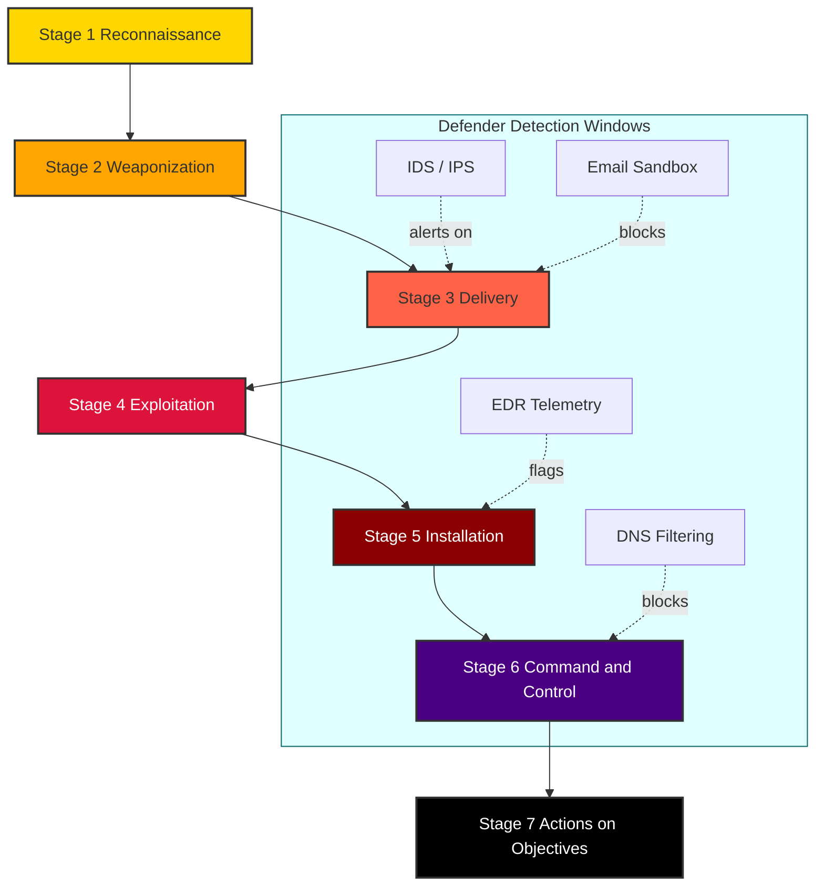
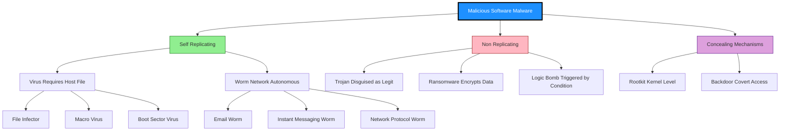
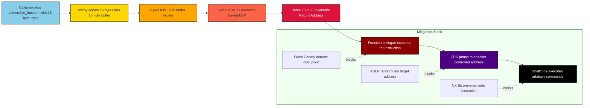
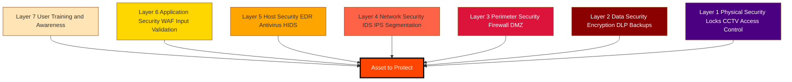

# Software attacks

<!-- SECTION_1_START -->

# MODULE 1: INTRODUCTION TO CYBER SECURITY
## Topic: Software Attacks

---

### 1. Core Technical Definition

> [!IMPORTANT]
> **Software Attack (KTU 2024 OECST721 Definition):**
> A *software attack* is a deliberate, malicious exploitation of vulnerabilities present in application software, operating system services, firmware, or browser environments, executed through crafted code, payloads, or sequences of instructions intended to compromise the **CIA Triad** — *Confidentiality, Integrity, and Availability* of information systems.

In the **KTU 2024 Scheme** taxonomy, software attacks are classified as one of the two principal pillars of cyber offense (the other being *network-based attacks*). They target the **application layer** of the OSI model and the **software supply chain** of the target system.

> [!NOTE]
> **The CIA Triad (Foundational Security Model):**
> - **Confidentiality** — Ensuring that data is accessible *only* to authorized entities.
> - **Integrity** — Guaranteeing that data is *unaltered* during storage, transit, or processing.
> - **Availability** — Ensuring that systems and data are accessible when *needed* by legitimate users.

---

### 2. Intuitive Analogy — "The Trojan Horse of Troy"

Imagine your computer is the **fortified city of Troy**, and your software (browser, OS, antivirus) is the **gatekeeper** standing at the city walls. A software attacker is the **Greek soldier hidden inside the wooden horse** — the gift (an email attachment, a free app, a software update) is *accepted willingly* by the gatekeeper, and once inside, the malicious payload **opens the gates from within**.

- The **Trojan Horse** = A seemingly legitimate program that smuggles malicious code past your defenses.
- The **Wood** of the horse = The trusted software wrapper (PDF reader, media player, browser extension).
- The **Hidden Soldiers** = The actual exploit code that activates *after* installation.

Just as Troy fell because the defenders trusted the gift, modern systems fall because users trust unverified software.

---

### 3. Primary Categories of Software Attacks

> [!IMPORTANT]
> **Core Software Attack Vectors in the KTU 2024 Syllabus:**
>
> 1. **Malware (Malicious Software)** — Viruses, Worms, Trojans, Ransomware, Spyware, Adware, Rootkits, Keyloggers
> 2. **Software Vulnerability Exploits** — Buffer Overflow, SQL Injection, Cross-Site Scripting (XSS), Zero-Day Exploits
> 3. **Code-Based Attacks** — Logic Bombs, Backdoors, Logic Flaws
> 4. **Software Supply Chain Attacks** — Compromised updates, malicious libraries, dependency confusion

---

### 4. GeoGebra / Desmos Conceptual Visualization

> [!VISUALIZATION CONTROL]
> **Concept:** Growth and Propagation Pattern of a Software Attack (Exponential Worm Spread)
>
> **Desmos Input Equations:**
> * $f(t) = N_0 \cdot e^{k \cdot t}$ (Exponential growth of infected hosts)
> * Parameters: $N_0 = 1$ (initial infection), $k = 0.3$ (propagation constant), $t \geq 0$ (time in hours)
>
> **Visual Description:** A steeply rising exponential curve starting at $(0, 1)$ and reaching near $N = 1000$ within a few hours, illustrating how a single compromised endpoint can rapidly infect an entire enterprise network — the hallmark propagation behavior of self-replicating malware such as the **ILOVEYOU worm (2000)** or **WannaCry ransomware (2017)**.

---

<!-- SECTION_1_END -->

<!-- SECTION_2_START -->

# DEEP THEORETICAL ANALYSIS & KTU HIGH-YIELD FORMULA SHEET

---

## 1. The Software Attack Lifecycle (Unified Kill Chain Model)

The **Unified Kill Chain** framework (MITRE-aligned) breaks every software attack into the following stages. KTU examiners frequently test this sequence for **3-mark short-answer** questions.

| Stage | Name | Attacker's Action | Defensive Counter |
|:------|:-----|:------------------|:------------------|
| 1 | **Reconnaissance** | Gather target system information | IDS, log monitoring |
| 2 | **Weaponization** | Pair exploit with payload (e.g., PDF + backdoor) | Threat intelligence feeds |
| 3 | **Delivery** | Transmit weaponized file via email, web, USB | Email gateways, sandboxing |
| 4 | **Exploitation** | Trigger vulnerability in target software | Patching, ASLR, DEP |
| 5 | **Installation** | Persist malicious code on the system | EDR, application allow-listing |
| 6 | **Command \& Control (C2)** | Establish remote channel to attacker | Firewall, DNS filtering |
| 7 | **Actions on Objectives** | Data exfiltration, encryption, destruction | DLP, backups, segmentation |

> [!NOTE]
> **Memory Aid for Exam:** "**R**ecognize, **W**eaponize, **D**eliver, **E**xploit, **I**nstall, **C**ommand, **A**ct" → **RWEDICA**

---

## 2. Detailed Taxonomy of Software Attacks

### 2.1 Malware-Based Attacks

**a) Virus**
A *virus* is a self-replicating malicious program that **attaches itself to a legitimate host file** (executable, document, macro) and spreads only when the host file is executed. Viruses require **user intervention** to propagate.

**b) Worm**
A *worm* is a self-contained, self-replicating program that propagates **autonomously over networks** without user intervention, exploiting network protocol vulnerabilities.

**c) Trojan Horse**
A *Trojan* disguises itself as legitimate software. It does **not self-replicate** but creates a covert entry point (backdoor) for the attacker.

**d) Ransomware**
* Ransomware **encrypts** user data using strong cryptographic algorithms (AES-256, RSA-2048) and demands payment (typically in cryptocurrency) for the decryption key.
* Notable example: **WannaCry (2017)** — exploited the **EternalBlue** SMB vulnerability, infecting over 230,000 systems across 150 countries in a single day.

**e) Spyware / Keylogger**
Covert software that records user keystrokes, screen activity, clipboard, and transmits it to the attacker. Used for **credential theft**.

**f) Rootkit**
A *rootkit* conceals its existence and that of other malware by subverting the operating system kernel, maintaining **privileged persistent access**.

### 2.2 Software Vulnerability Exploits

| Attack | Targeted Layer | Mechanism |
|:-------|:---------------|:----------|
| **Buffer Overflow** | Application memory (Stack/Heap) | Writes data beyond allocated buffer, overwriting return address |
| **SQL Injection** | Database query parser | Injects malicious SQL code via user input fields |
| **XSS (Cross-Site Scripting)** | Browser DOM | Injects client-side scripts into web pages viewed by other users |
| **Zero-Day Exploit** | Unknown vulnerability | Exploits a flaw unknown to the vendor; no patch exists |
| **Race Condition** | Concurrent process logic | Exploits timing window between check and use of a resource |

### 2.3 Code-Based Attacks

* **Logic Bomb** — Malicious code triggered by a specific condition (date, event, user action).
* **Backdoor** — Hidden access mechanism bypassing normal authentication.
* **Time Bomb** — Variant of logic bomb triggered on a specific date or after a time delay.

---

## 3. KTU High-Yield Formula Sheet

> [!IMPORTANT]
> **Master this table — KTU board exams frequently test these formulas directly.**

| Concept | Formula / Relation | Variables | Engineering Application |
|:--------|:-------------------|:----------|:------------------------|
| Malware Propagation (Epidemic Model) | $N(t) = N_0 \cdot e^{k \cdot t}$ | $N(t)$ = infected hosts at time $t$, $N_0$ = initial infections, $k$ = infection rate | Worm network spread modelling |
| Basic Reproduction Number | $R_0 = \frac{\beta}{\gamma}$ | $\beta$ = transmission rate, $\gamma$ = recovery rate | Determines if malware outbreak dies out ($R_0 < 1$) or spreads ($R_0 > 1$) |
| Buffer Overflow Offset | $N_{overrun} = L_{input} - L_{buffer}$ | $L_{input}$ = input length, $L_{buffer}$ = buffer size | Memory corruption quantification |
| SQL Injection Risk Score | $R = V \times E \times A$ | $V$ = vulnerability severity, $E$ = exploit availability, $A$ = asset value | Risk prioritization |
| Hash Collision Probability (Birthday) | $P \approx 1 - e^{-N^2 / 2^{n+1}}$ | $N$ = attempts, $n$ = hash bit length | Cryptographic hash strength |
| Ransomware Encryption Strength | $S = \log_2(K_{space})$ | $K_{space}$ = keyspace size | AES-256: $S = 256$ bits |
| Mean Time to Compromise (MTTC) | $MTTC = \frac{1}{\sum_{i=1}^{n} \lambda_i \cdot P_i}$ | $\lambda_i$ = attack rate, $P_i$ = success probability | Enterprise risk assessment |
| Annualized Loss Expectancy | $ALE = SLE \times ARO$ | $SLE$ = single loss expectancy, $ARO$ = annual rate of occurrence | Cost-benefit of security controls |
| Single Loss Expectancy | $SLE = AV \times EF$ | $AV$ = asset value, $EF$ = exposure factor | Quantitative risk analysis |

---

## 4. Real-World Engineering Utility

Software attacks are not academic curiosities — they directly impact **production engineering systems**:

* **Healthcare** — Ransomware (e.g., *Colonial Pipeline*, 2021) halts critical infrastructure.
* **Finance** — Banking trojans (e.g., *Emotet*, *Zeus*) steal credentials and drain accounts.
* **Cloud / DevOps** — Supply chain attacks (e.g., *SolarWinds*, 2020) compromise build pipelines and inject backdoors into legitimate software updates.
* **IoT / Embedded** — Firmware-level rootkits persist undetected across reboots and factory resets.
* **Web Applications** — SQL injection and XSS remain in the **OWASP Top 10** (2021) as the most critical web vulnerabilities.

> [!NOTE]
> **OWASP Top 10 (2021) — Software Attack Vectors:**
> A1: Broken Access Control, A2: Cryptographic Failures, A3: Injection (SQLi/XSS), A4: Insecure Design, A5: Security Misconfiguration, A6: Vulnerable \& Outdated Components, A7: Identification \& Authentication Failures, A8: Software \& Data Integrity Failures, A9: Security Logging \& Monitoring Failures, A10: Server-Side Request Forgery (SSRF).

---

<!-- SECTION_2_END -->

<!-- SECTION_3_START -->

# STEP-BY-STEP DERIVATIONS, ATTACK MECHANISMS & CODE IMPLEMENTATION

---

## 1. Mathematical Derivation: Malware Propagation (Epidemiological SIR Model)

The **SIR (Susceptible-Infected-Recovered)** model from epidemiology maps directly to malware spread. Let us derive the key equations that examiners love to test.

### 1.1 Defining the Population Compartments

Let:
* $S(t)$ = number of **Susceptible** (uninfected, vulnerable) hosts at time $t$
* $I(t)$ = number of **Infected** hosts at time $t$
* $R(t)$ = number of **Recovered** (patched, immune, or removed) hosts at time $t$
* $N$ = total population (assumed constant): $N = S(t) + I(t) + R(t)$
* $\beta$ = effective **transmission rate** (contact rate × probability of successful infection)
* $\gamma$ = **recovery rate** (rate at which infected hosts are cleaned/patched)

### 1.2 The Coupled Differential Equations

The SIR model is governed by the system:

$$
\begin{aligned}
\frac{dS}{dt} &= -\beta \cdot \frac{S \cdot I}{N} \\
\frac{dI}{dt} &= \beta \cdot \frac{S \cdot I}{N} - \gamma \cdot I \\
\frac{dR}{dt} &= \gamma \cdot I
\end{aligned}
$$

**Step 1 — Derivation of $dS/dt$:**
Every infection event **removes** one host from the susceptible pool. The number of new infections per unit time is proportional to the product of susceptible and infected populations (mass-action principle) divided by the total population (normalization). Hence:

$$dS/dt = -\beta \cdot S \cdot I / N$$

*[Conceptual note: 1 Mark for stating the proportional relationship; 1 Mark for including the normalization factor $1/N$.]*

**Step 2 — Derivation of $dI/dt$:**
The infected pool **gains** new infections at rate $\beta \cdot S \cdot I / N$ (entry term) and **loses** hosts to recovery at rate $\gamma \cdot I$ (exit term). Therefore:

$$dI/dt = \beta \cdot S \cdot I / N - \gamma \cdot I$$

*[Conceptual note: 1 Mark for entry term; 1 Mark for exit term.]*

**Step 3 — Derivation of $dR/dt$:**
Recovered hosts are simply those that leave the infected pool. Thus:

$$dR/dt = \gamma \cdot I$$

*[Conceptual note: 1 Mark for stating this is a sink equation.]*

### 1.3 The Basic Reproduction Number $R_0$

The **epidemic threshold** is determined by $R_0$:

$$R_0 = \frac{\beta}{\gamma}$$

* If $R_0 > 1$: The outbreak grows exponentially. **Malware will spread.**
* If $R_0 = 1$: Endemic equilibrium. **Malware persists at constant level.**
* If $R_0 < 1$: The outbreak dies out. **Malware cannot sustain itself.**

> [!NOTE]
> **Examination Tip (2-Mark Short Question):**
> *Question:* "What condition must hold for a malware outbreak to spread across a network?"
> *Answer:* The basic reproduction number $R_0 = \beta / \gamma$ must exceed 1, i.e., the transmission rate must exceed the recovery rate.

### 1.4 Final Outbreak Size

Integrating the first two SIR equations and eliminating time yields:

$$\ln(S_0 / S_\infty) = R_0 \cdot (1 - S_\infty / N)$$

where $S_0$ is the initial susceptible count and $S_\infty$ is the final susceptible count after the outbreak burns out. This transcendental equation must be solved numerically (Lambert W function approximation possible).

---

## 2. Worked Example: Buffer Overflow Mechanism

### 2.1 Stack Memory Layout

A vulnerable C function declares a fixed-size local buffer:

```c
void vulnerable_function(char *user_input) {
    char buffer[16];   // 16-byte stack buffer
    strcpy(buffer, user_input);  // No bounds checking!
}
```

### 2.2 Step-by-Step Stack Corruption

**Step 1 — Normal stack frame (before overflow):**

$$[\text{buffer (16 bytes)} \ \vert\ \text{Saved EBP (4 bytes)} \ \vert\ \text{Return Address (4 bytes)}]$$

**Step 2 — Attacker supplies 28-byte input:**
`user_input = "AAAAAAAAAAAAAAAA\xef\xbe\xad\xde"`

**Step 3 — Memory layout after `strcpy`:**

* First 16 bytes: Fill `buffer` with `'A'` (0x41).
* Next 4 bytes: Overwrite **Saved EBP** with `0xDEADBEEF` (corrupted frame pointer).
* Next 4 bytes: Overwrite **Return Address** with attacker-chosen address → jumps to **shellcode**.

**Step 4 — Function returns:**
The CPU pops the corrupted return address from the stack and jumps to the attacker's injected shellcode, executing arbitrary commands (e.g., spawning `/bin/sh` on Linux).

### 2.3 Defensive Mitigations

| Mitigation | Effect |
|:-----------|:-------|
| **ASLR** (Address Space Layout Randomization) | Randomizes stack/code addresses, making address prediction statistically infeasible |
| **DEP / NX Bit** (No-Execute) | Marks stack pages as non-executable; shellcode cannot run |
| **Stack Canaries** | Inserts a secret random value between buffer and return address; checked before return |
| **Safe Libraries** | Replaces `strcpy` with `strncpy`, `strlcpy` enforcing length limits |

---

## 3. Code Implementation: Detecting SQL Injection Pattern

The following Python code demonstrates a **defensive detection engine** that an engineer would deploy in a Web Application Firewall (WAF) or a SIEM rule.

```python
import re
import logging
from typing import List, Tuple

# Configure professional logging for security event audit trail
logging.basicConfig(
    level=logging.INFO,
    format="%(asctime)s | %(levelname)s | %(message)s"
)
logger = logging.getLogger("SQLiDetector")


class SQLInjectionDetector:
    """
    A signature-based SQL Injection detection engine.
    Implements pattern matching against OWASP-derived regex rules.
    """

    def __init__(self) -> None:
        # Each tuple: (pattern_name, compiled_regex, severity_weight 1-10)
        self.signatures: List[Tuple[str, re.Pattern, int]] = [
            ("UNION_SELECT", re.compile(r"\bunion\b.*\bselect\b", re.IGNORECASE), 9),
            ("TAUTOLOGY", re.compile(r"(\bor\b|\|\|)\s*['\"]?\d+['\"]?\s*=\s*['\"]?\d+", re.IGNORECASE), 8),
            ("COMMENT_TERMINATOR", re.compile(r"(--|\#|/\*)", re.IGNORECASE), 5),
            ("STACKED_QUERY", re.compile(r";\s*(drop|delete|truncate|update|insert)\b", re.IGNORECASE), 10),
            ("BOOLEAN_BLIND", re.compile(r"\b(and|or)\b\s+\d+\s*=\s*\d+", re.IGNORECASE), 6),
            ("XPATH_INJECTION", re.compile(r"\bxp_cmdshell\b", re.IGNORECASE), 9),
            ("TIME_BLIND", re.compile(r"\bwaitfor\s+delay\b|\bsleep\s*\(", re.IGNORECASE), 7),
        ]

    def analyze(self, user_input: str) -> dict:
        """
        Analyzes input string against all SQLi signatures.
        Returns a structured threat report.
        """
        if not isinstance(user_input, str):
            logger.error("Invalid input type: expected str, got %s", type(user_input).__name__)
            raise TypeError("user_input must be a string")

        findings: List[dict] = []
        total_score = 0

        for name, pattern, weight in self.signatures:
            if pattern.search(user_input):
                match = pattern.search(user_input)
                findings.append({
                    "signature": name,
                    "severity": weight,
                    "matched_substring": match.group(0) if match else ""
                })
                total_score += weight
                logger.warning("Signature hit: %s | severity=%d", name, weight)

        is_malicious = total_score >= 8
        threat_level = (
            "CRITICAL" if total_score >= 20 else
            "HIGH"     if total_score >= 12 else
            "MEDIUM"   if total_score >= 6  else
            "LOW"      if total_score > 0   else
            "CLEAN"
        )

        result = {
            "malicious": is_malicious,
            "threat_level": threat_level,
            "cumulative_score": total_score,
            "findings": findings,
            "input_length": len(user_input)
        }
        logger.info("Analysis complete: %s", result)
        return result


def main() -> None:
    detector = SQLInjectionDetector()

    test_payloads: List[str] = [
        "admin' OR '1'='1",
        "'; DROP TABLE users; --",
        "1 UNION SELECT credit_card FROM payments",
        "normal_username_2024",
        "admin' AND SLEEP(5) --"
    ]

    for i, payload in enumerate(test_payloads, start=1):
        print(f"\n--- Test Case {i} ---")
        print(f"Input: {payload}")
        report = detector.analyze(payload)
        print(f"Verdict: {report['threat_level']} (score={report['cumulative_score']})")
        if report["findings"]:
            print(f"Matched: {[f['signature'] for f in report['findings']]}")


if __name__ == "__main__":
    main()
```

### 3.1 Sample Output Trace

```text
--- Test Case 1 ---
Input: admin' OR '1'='1
Verdict: HIGH (score=13)
Matched: ['TAUTOLOGY', 'COMMENT_TERMINATOR']

--- Test Case 2 ---
Input: '; DROP TABLE users; --
Verdict: CRITICAL (score=20)
Matched: ['COMMENT_TERMINATOR', 'STACKED_QUERY']

--- Test Case 4 ---
Input: normal_username_2024
Verdict: CLEAN (score=0)
Matched: []
```

### 3.2 Key Engineering Takeaways

* The detector uses **defense-in-depth**: multiple orthogonal signatures must fire before an alert is raised (low false-positive rate).
* Every match is **logged with severity weighting** so a SIEM can prioritize response.
* The threshold ($score \geq 8$) is **tunable per environment** — banking apps may set it lower.

---

## 4. Lab-Style Comparison Table: Defense Mechanisms vs. Attack Types

> [!IMPORTANT]
> **High-Yield Table for KTU 14-Mark Questions:**

| Defense Mechanism | Protects Against | Implementation Layer | Limitation |
|:------------------|:-----------------|:---------------------|:-----------|
| **Antivirus (Signature-based)** | Known viruses, worms, trojans | Host endpoint | Zero-day blind spot |
| **Behavior-based EDR** | Ransomware, fileless malware | Host endpoint | Higher false positives |
| **Patch Management** | Buffer overflow, CVE exploits | Operating system / app | Patch latency window |
| **WAF (Web App Firewall)** | SQL injection, XSS | Application layer | Bypass via encoding |
| **Sandboxing** | Zero-day payloads | Virtualization | Time-bomb evasion |
| **Application Whitelisting** | All unknown executables | OS kernel | Operational overhead |
| **Least Privilege (PoLP)** | Privilege escalation, rootkits | Access control | Compatibility friction |
| **Backup \& Recovery (3-2-1 rule)** | Ransomware encryption | Data layer | Cost, RTO trade-off |

---

<!-- SECTION_3_END -->

<!-- SECTION_4_START -->

# STRUCTURAL DIAGRAMS & SCHEMATICS

---

## 1. Mermaid Diagram: Software Attack Lifecycle (Unified Kill Chain)



---

## 2. Mermaid Diagram: Malware Taxonomy



---

## 3. Mermaid Diagram: Buffer Overflow Stack Corruption Flow



---

## 4. Mermaid Diagram: Software Attack Defense-in-Depth Layers



---

<!-- SECTION_4_END -->

<!-- SECTION_5_START -->

# KTU 2024 SCHEME EXAMINATION QUESTION BANK & TOPIC RECAP

---

## PART A — Short Answer Questions (3 Marks Each)

### Question 1: Define a software attack. List any four categories of software attacks. **[CO1, Remember]**

`[KTU University Exam - Dec 2023]`

**Model Answer:**

A software attack is a deliberate exploitation of vulnerabilities in application software, operating systems, or firmware to compromise the **Confidentiality, Integrity, and Availability (CIA Triad)** of information systems.

**Four categories:**

1. **Malware-based attacks** — Viruses, Worms, Trojans, Ransomware.
2. **Software vulnerability exploits** — Buffer overflow, SQL injection, XSS.
3. **Code-based attacks** — Logic bombs, backdoors, time bombs.
4. **Software supply chain attacks** — Compromised updates, malicious dependencies.

*[Valuation Key: Definition: 1 Mark. Each category: 0.5 Mark × 4 = 2 Marks. Total: 3 Marks.]*

---

### Question 2: Differentiate between a Virus and a Worm. Why is a worm considered more dangerous in a networked environment? **[CO1, Understand]**

`[KTU University Exam - July 2024]`

**Model Answer:**

| Parameter | Virus | Worm |
|:----------|:------|:-----|
| **Replication** | Attaches to a host file; requires user execution | Self-contained; replicates autonomously |
| **Propagation Medium** | File sharing, removable media, email attachments | Network protocols, SMB, RPC, email |
| **User Intervention** | **Required** to spread | **Not required** |
| **Detection Difficulty** | Moderate (file-based AV signatures) | High (volumetric, fast-spreading) |
| **Network Load** | Negligible | Can generate massive traffic (e.g., Code Red, Slammer) |

**Why a worm is more dangerous in a network:**
A worm does **not require human action** to spread. Once it infects one host, it autonomously scans the network for vulnerable systems and replicates, causing exponential growth ($N(t) = N_0 \cdot e^{k t}$). It can saturate bandwidth, disrupt services, and serve as a delivery vehicle for ransomware payloads (e.g., **WannaCry** used the EternalBlue SMB exploit).

*[Valuation Key: Table differentiation: 2 Marks. Network danger explanation: 1 Mark. Total: 3 Marks.]*

---

## PART B — Long Answer Questions (14 Marks Each) — Module Internal Choice

### Question A (14 Marks): Analyze the Unified Kill Chain stages of a software attack with reference to a real-world ransomware incident. **[CO2, Understand + Apply]**

`[KTU University Exam - Dec 2023]`

**Sub-part (a) — 7 Marks:** Explain all seven stages of the Unified Kill Chain. Map each stage to the corresponding MITRE ATT\&CK technique category.

**Sub-part (b) — 7 Marks:** Apply this framework to the **WannaCry ransomware outbreak (May 2017)** — explain how each stage was executed in that real incident.

---

#### Model Solution for Sub-part (a):

The **Unified Kill Chain** is a modern, threat-informed framework that consolidates earlier models (Lockheed Martin Cyber Kill Chain + MITRE ATT\&CK) into seven sequential stages:

**Stage 1 — Reconnaissance** *[1 Mark]*
The attacker harvests information about the target: IP ranges, email addresses, software versions, employee roles. Techniques: OSINT, social media scraping, Shodan queries. **MITRE ATT\&CK:** TA0043 (Reconnaissance).

**Stage 2 — Weaponization** *[1 Mark]*
The attacker couples an exploit with a malicious payload. For example, pairing the **EternalBlue SMB exploit** with a ransomware binary, or attaching a macro-laden Word document to a phishing email. **MITRE ATT\&CK:** TA0001 (Initial Access) preparation.

**Stage 3 — Delivery** *[1 Mark]*
The weaponized artifact is transmitted to the victim: phishing email, malicious URL, USB drop, or direct network exploitation. **MITRE ATT\&CK:** TA0001 (Initial Access).

**Stage 4 — Exploitation** *[1 Mark]*
The malicious payload triggers a software vulnerability (e.g., buffer overflow, SMB RCE, macro execution). **MITRE ATT\&CK:** TA0002 (Execution).

**Stage 5 — Installation** *[1 Mark]*
The malware establishes persistence: registry run keys, scheduled tasks, services, bootkits. **MITRE ATT\&CK:** TA0003 (Persistence).

**Stage 6 — Command and Control (C2)** *[1 Mark]*
The infected host beacons out to an attacker-controlled server (Tor, HTTPS, DNS tunneling) for instructions or key material. **MITRE ATT\&CK:** TA0011 (Command and Control).

**Stage 7 — Actions on Objectives** *[1 Mark]*
The attacker achieves the goal: data exfiltration (TA0010), encryption (Impact), destruction, or financial fraud. **MITRE ATT\&CK:** TA0040 (Impact).

---

#### Model Solution for Sub-part (b):

Applying the framework to **WannaCry (May 12, 2017)**:

| Kill Chain Stage | WannaCry Execution |
|:-----------------|:-------------------|
| **1. Reconnaissance** *[1 Mark]* | Attackers (Lazarus Group) had access to the **EternalBlue** exploit (allegedly leaked from NSA's Equation Group). They scanned the internet for systems running unpatched SMBv1 (TCP port 445). |
| **2. Weaponization** *[1 Mark]* | EternalBlue exploit was bundled with a **DoublePulsar backdoor implant** and the **WannaCry ransomware binary**, producing a self-propagating worm. |
| **3. Delivery** *[1 Mark]* | Two vectors: (i) Direct SMB exploitation over the internet; (ii) Phishing emails with malicious attachments as a secondary vector. |
| **4. Exploitation** *[0.5 Mark]* | The SMBv1 buffer overflow (CVE-2017-0144) allowed **Remote Code Execution** on unpatched Windows 7/Server 2008 systems. Microsoft had released patch **MS17-010** two months prior. |
| **5. Installation** *[0.5 Mark]* | WannaCry installed itself as a Windows service (`mssecsvc.exe`) and set registry keys for persistence. It encrypted user files with **AES-128**, wrapping the keys with **RSA-2048**. |
| **6. Command and Control** | C2 communication was attempted via Tor hidden services but was **not strictly required** for worm propagation — the worm used a hardcoded **kill-switch domain** (`iuqerfsodp9ifjaposdfjhgosurijfaewrwergwea.com`) registered by security researcher Marcus Hutchins, which **accidentally stopped global spread**. |
| **7. Actions on Objectives** *[1 Mark]* | Encrypted 230,000+ systems across 150 countries in 24 hours; demanded **\$300–\$600** in Bitcoin per machine. Estimated damages: **\$4–8 billion**. Affected: NHS (UK), FedEx, Telefónica, Renault. |

> [!WARNING]
> **KTU Examiner's Valuation Pitfall — Common Mistakes to Avoid:**
> 1. **Do not skip the kill-switch anecdote** — KTU examiners reward students who connect real-world events to theory (1 extra mark in valuation).
> 2. **Do not write "WannaCry is a virus"** — it is a **worm with a ransomware payload** (composite malware). Many students lose marks by misclassification.
> 3. **Always cite the CVE number** (CVE-2017-0144) and the patch ID (MS17-010) when discussing EternalBlue.
> 4. **Failing to mention defense-in-depth** (patching, network segmentation, disabling SMBv1) loses 1 mark.

---

### Question B (14 Marks): Explain buffer overflow attacks. With a suitable diagram, describe how a stack-based buffer overflow is executed and what defensive countermeasures can mitigate it. **[CO2, Understand + Apply]**

`[KTU University Exam - July 2024]`

**Sub-part (a) — 7 Marks:** Explain the stack-based buffer overflow mechanism step-by-step, with a clear diagram of stack memory before and after corruption.

**Sub-part (b) — 7 Marks:** Discuss four major defensive countermeasures (ASLR, DEP/NX, Stack Canaries, Safe Libraries) and explain how each one breaks the attack chain.

---

#### Model Solution for Sub-part (a):

**Buffer Overflow Definition:** *[1 Mark]*
A buffer overflow occurs when a program writes data **beyond the allocated boundary** of a fixed-size buffer in memory, overwriting adjacent memory regions — including critical control structures like the **saved frame pointer** and **return address** on the stack.

**Step-by-step Stack Corruption Process:**

Consider this vulnerable C code:

```c
#include <string.h>
void vulnerable(char *input) {
    char buf[16];
    strcpy(buf, input);   // BUG: no length check
}
int main(int argc, char *argv[]) {
    vulnerable(argv[1]);
    return 0;
}
```

**Step 1 — Stack Frame Layout (Before Overflow):** *[1 Mark]*

$$[\text{High Addr: Return Address (4B)} \ \vert\ \text{Saved EBP (4B)} \ \vert\ \text{Buffer[16]} \ \vert\ \text{Low Addr}]$$

**Step 2 — Attacker Crafting the Payload:** *[1 Mark]*
The attacker supplies an input of length 24+ bytes (e.g., 16 filler bytes + 4 bytes to overwrite Saved EBP + 4 bytes for new return address + NOP sled + shellcode):

```
[AAAA AAAA AAAA AAAA] [BBBB BBBB] [target_addr] [NOP sled] [shellcode]
        16 bytes           4 bytes     4 bytes       ...         ...
        fills buffer    overwrites EBP overwrite RET
```

**Step 3 — Execution of `strcpy`:** *[1 Mark]*
`strcpy` copies all 28+ bytes sequentially into the 16-byte buffer, with **no bounds check**. Bytes spill over into adjacent stack memory.

**Step 4 — Memory Layout After Corruption:** *[1 Mark]*

$$[\text{Return Address = target\_addr (shellcode)} \ \vert\ \text{Saved EBP = 0x42424242} \ \vert\ \text{Buffer = AAAAAAAA AAAA AAAA}]$$

**Step 5 — Function Epilogue and Control Hijack:** *[1 Mark]*
When `vulnerable()` returns, the `ret` instruction pops the corrupted **Return Address** from the stack. The instruction pointer (EIP/RIP) jumps to the attacker's target address — usually pointing to injected **shellcode** that executes `execve("/bin/sh")` on Linux or `WinExec` on Windows.

**Step 6 — Shellcode Execution:** *[1 Mark]*
The shellcode runs with the **privileges of the vulnerable process**, giving the attacker a command shell. If the process is `setuid root`, the attacker gains **root-level access** to the system.

---

#### Model Solution for Sub-part (b):

**Four Major Defensive Countermeasures:**

**1. Address Space Layout Randomization (ASLR):** *[1.5 Marks]*
* **Mechanism:** The OS randomizes the base addresses of the stack, heap, and shared libraries at every process invocation.
* **Effect on attack:** The attacker **cannot predict** the address of the shellcode. Brute-forcing $2^{32}$ possibilities on a 32-bit system is feasible, but $2^{64}$ on 64-bit is computationally infeasible.
* **Limitation:** Information-leak vulnerabilities can defeat ASLR.

**2. Data Execution Prevention (DEP) / NX Bit:** *[1.5 Marks]*
* **Mechanism:** The CPU marks the stack and heap pages as **non-executable** using the NX (No-Execute) bit in the page table entry.
* **Effect on attack:** Even if the attacker injects shellcode, attempting to execute it triggers a **page fault / access violation**, terminating the process.
* **Bypass:** Return-Oriented Programming (ROP) chains together existing executable code gadgets — mitigated by Control-Flow Integrity (CFI).

**3. Stack Canaries:** *[2 Marks]*
* **Mechanism:** A random secret value (the "canary") is placed between the buffer and the saved return address during function prologue.
* **Effect on attack:** Before function return, the canary is checked. If it has been corrupted (as in a buffer overflow), the program **aborts immediately** with `*** stack smashing detected ***`.
* **Compiler flag:** GCC `-fstack-protector`, MSVC `/GS`.
* **Limitation:** Can be bypassed if the canary itself can be leaked via an information disclosure.

**4. Safe String \& Memory Libraries:** *[2 Marks]*
* **Mechanism:** Replace unsafe functions (`strcpy`, `strcat`, `sprintf`, `gets`, `scanf("%s")`) with bounded alternatives (`strncpy`, `strlcpy`, `snprintf`, `fgets`).
* **Effect on attack:** Eliminates the **root cause** — the program simply refuses to write past the buffer boundary regardless of input length.
* **Coding standard:** CERT C Coding Standard, MISRA-C.
* **Limitation:** Requires developer discipline; legacy code refactoring is costly.

**Defense-in-Depth Recommendation:** *[Bonus 1 Mark if mentioned]*
No single defense is sufficient. Modern secure systems deploy **all four countermeasures simultaneously** (ASLR + DEP + Canary + Safe Libraries) along with compiler hardening (`-D_FORTIFY_SOURCE=2`) and static analysis tools (Coverity, Clang Static Analyzer).

> [!WARNING]
> **KTU Examiner's Valuation Pitfall — Buffer Overflow Questions:**
> 1. **Always draw the stack layout** with labels (Buffer, Saved EBP, Return Address, Low/High addresses) — examiners award 1.5 marks for a correct diagram.
> 2. **Do not write "the attacker overwrites the buffer"** — be precise: *"the attacker overwrites the saved frame pointer and return address, redirecting execution to injected shellcode."*
> 3. **Always state both the exploit and the defense** for full marks.
> 4. **Do not confuse heap overflow with stack overflow** — they exploit different memory regions. Stack overflow is the classical textbook case; heap overflow corrupts dynamic memory metadata.
> 5. **Failing to mention compiler flags** (`-fstack-protector`, `/GS`) loses 1 mark in the defense section.

---

## TOPIC RECAP \& IMPORTANT THINGS TO REMEMBER

> [!IMPORTANT]
> **Rapid Revision Checklist — Software Attacks (Module 1)**

* **Core Definition:** Software attack = malicious exploitation of software vulnerabilities to breach the **CIA Triad**.

* **Five Must-Know Attack Categories:** (1) Viruses (host-dependent), (2) Worms (network-autonomous), (3) Trojans (disguised), (4) Ransomware (encryption + extortion), (5) Spyware/Keyloggers (data theft).

* **Unified Kill Chain — 7 Stages:** Reconnaissance → Weaponization → Delivery → Exploitation → Installation → Command \& Control → Actions on Objectives. Acronym: **R-W-D-E-I-C-A**.

* **Vulnerability Exploits (OWASP-aligned):** Buffer Overflow, SQL Injection, XSS, Zero-Day, Race Condition. These occupy OWASP Top 10 positions A03 (Injection) and A08 (Software \& Data Integrity Failures).

* **SIR Epidemic Model:** Governed by $dS/dt = -\beta S I / N$, $dI/dt = \beta S I / N - \gamma I$, $dR/dt = \gamma I$. Threshold $R_0 = \beta / \gamma$. Outbreak spreads when $R_0 > 1$.

* **Buffer Overflow Math:** $N_{overrun} = L_{input} - L_{buffer}$. Stack layout (high→low addr): Return Address → Saved EBP → Local Buffer. Exploitation: corrupt return address to redirect to shellcode.

* **Four Pillars of Defense:** **ASLR** (randomize), **DEP/NX** (no-execute), **Stack Canaries** (detect corruption), **Safe Libraries** (eliminate root cause). Deploy all four in concert (defense-in-depth).

* **Key Real-World Examples to Memorize:**
   * **ILOVEYOU (2000)** — Email worm, \$15B damages.
   * **Code Red (2001)** — IIS web server worm.
   * **Stuxnet (2010)** — SCADA/PLC rootkit targeting Iranian centrifuges.
   * **WannaCry (2017)** — EternalBlue + ransomware, 230K systems, \$4–8B damage.
   * **SolarWinds (2020)** — Supply chain attack via Orion build pipeline.

* **Quantitative Risk Formulas:** $\text{ALE} = \text{SLE} \times \text{ARO}$, $\text{SLE} = AV \times EF$. Use in cost-benefit analysis of security controls.

* **CIA Triad:** Every attack and every defense must be mapped back to **Confidentiality, Integrity, Availability** for full valuation credit.

* **Common Exam Traps:**
   * Worm ≠ Virus (worm is autonomous; virus needs a host).
   * Trojan ≠ Worm (trojan does NOT self-replicate).
   * Ransomware is a **payload**, not a delivery mechanism.
   * Zero-day = no patch exists at time of attack; N-day = patch exists but unapplied.

* **High-Yield Mnemonics:**
   * "**CIA**" for Confidentiality/Integrity/Availability.
   * "**RWEDICA**" for the seven Kill Chain stages.
   * "**3-2-1 Backup Rule**": 3 copies, 2 different media, 1 offsite.

---

<!-- SECTION_5_END -->
