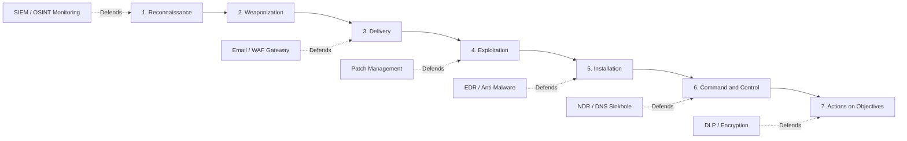
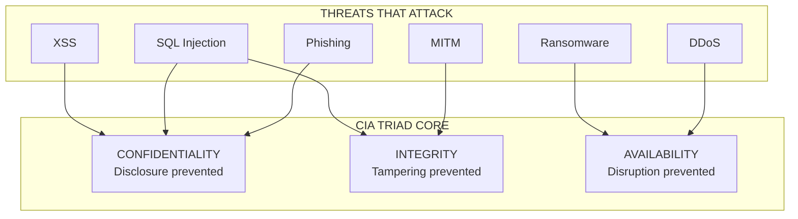
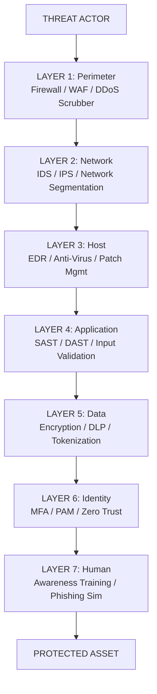

# Threats

<!-- SECTION_1_START -->
# Cyber Security Threats — Foundational Overview

## 1.1 Formal Academic Definition

> [!IMPORTANT]
> **Definition (KTU 2024 OECST721 Syllabus Aligned):**
> A **Cyber Security Threat** is any malicious act, circumstance, or event that has the potential to compromise the **Confidentiality, Integrity, and Availability (CIA Triad)** of an information system, network, or digital asset. Formally, a threat is the *causal agent* that exploits a *vulnerability* to produce an unwanted impact on an organization.

In the language of **Risk Management**, a threat is the *source of danger*, distinct from a *vulnerability* (the weakness) and a *risk* (the quantified probability of exploitation).

$$
\text{Risk} = f(\text{Threat}, \text{Vulnerability}, \text{Impact}) \quad \Longrightarrow \quad R = T \times V \times I
$$

where:
* $T$ = **Threat likelihood** (probability, $0 \le T \le 1$)
* $V$ = **Vulnerability exposure** (fraction of unmitigated weakness, $0 \le V \le 1$)
* $I$ = **Business impact severity** (asset value, normalized $0 \le I \le 1$)

## 1.2 Intuitive Analogy — "The House on Maple Street"

Imagine your computer system is a **house on Maple Street**:

| House Element | Cyber Equivalent | Threat Analogue |
|---|---|---|
| Brick walls & locked doors | Firewall, Authentication | — |
| Valuables inside | Data, IP, PII | — |
| The **Burglar** 🦹 | **Threat Actor** (hacker, insider) | ✅ Threat |
| An **unlocked window** | Misconfigured service, unpatched OS | Vulnerability |
| The actual **theft event** | Data breach, ransomware detonation | Incident |

The **threat** is the burglar — *not* the unlocked window (that's a vulnerability) and *not* the stolen laptop (that's the impact). In cyber security, we must understand **who** attacks, **why** they attack, **how** they attack, and **what** they target.

## 1.3 Why Threats Matter in the 2024 Threat Landscape

> [!NOTE]
> **Industry Reality (2024 Data):**
> * Average cost of a data breach in 2024: **\$4.88 million USD** (IBM Cost of a Data Breach Report).
> * A new attack occurs roughly every **39 seconds** globally.
> * **Ransomware** alone caused damages exceeding **\$42 billion USD** in 2024.
> * Over **2,200 cyber attacks per day** target small-to-medium businesses.

## 1.4 The Three Pillars: CIA Triad

> [!IMPORTANT]
> **CIA Triad — The Trinity of Information Security:**
> Every cyber threat is classified by which pillar it attacks:
> * **C — Confidentiality** → Unauthorized *disclosure* of data (e.g., data leak, eavesdropping).
> * **I — Integrity** → Unauthorized *modification* of data (e.g., tampering, MITM injection).
> * **A — Availability** → Unauthorized *denial* of access (e.g., DDoS, ransomware encryption).

> [!VISUALIZATION CONTROL]
> **Concept:** CIA Triad — three-axis security model.
> **GeoGebra / Desmos Input Equations:**
> * `f(x) = sqrt(1 - x^2)` (Confidentiality arc)
> * `f(y) = -sqrt(1 - y^2)` (Integrity arc)
> * `f(z) = -1` constant line (Availability axis)
> **Visual Description:** Three intersecting perpendicular axes meeting at the origin; each axis represents one pillar. A threat is plotted as a vector pointing toward one or more axes to indicate which pillar is compromised.
<!-- SECTION_1_END -->

<!-- SECTION_2_START -->
# Deep Theoretical Analysis & KTU High-Yield Formula Sheet

## 2.1 Threat Taxonomy — The Master Classification

Cyber threats are classified along **three orthogonal dimensions**: **Actor**, **Vector**, and **Payload**.

### 2.1.1 By Threat Actor (Who?)

* **Nation-State Actors (APTs)** — State-sponsored, highly resourced, long-term campaigns (e.g., Lazarus Group, APT28). Motive: **espionage, sabotage**.
* **Organized Cybercriminals** — Financially motivated, run Ransomware-as-a-Service (RaaS) operations. Motive: **profit**.
* **Hacktivists** — Ideologically driven (e.g., Anonymous). Motive: **publicity, protest**.
* **Insider Threats** — Employees, contractors with legitimate access. Motive: **revenge, greed, coercion**.
* **Script Kiddies** — Low-skill attackers using pre-built tools. Motive: **curiosity, fame**.
* **AI-Augmented Attackers** *(Emerging 2024+)* — LLM-assisted phishing, deepfake social engineering.

### 2.1.2 By Attack Vector (How?)

* **Network-based** → DDoS, MITM, ARP poisoning, DNS spoofing.
* **Host-based** → Malware, rootkits, buffer overflow exploits.
* **Application-layer** → SQL injection (SQLi), Cross-Site Scripting (XSS), CSRF.
* **Human-channel** → Phishing, vishing, smishing, social engineering.
* **Physical-channel** → USB drops, hardware keyloggers, evil-maid attacks.
* **Supply-chain** → Compromised software updates (e.g., SolarWinds, 3CX breach).

### 2.1.3 By Payload (What?)

* **Malware** family: Virus, Worm, Trojan, Spyware, Adware, Rootkit, Ransomware, Fileless.
* **Non-malware**: Logic bombs, zero-day exploits, credential stuffing.

## 2.2 Detailed Threat Catalog

### 2.2.1 Malware Threats

> [!IMPORTANT]
> **Malware = Malicious Software** — Umbrella term for any code designed to cause harm.

* **Virus** — Attaches to a legitimate host file; requires user execution to spread.
* **Worm** — Self-replicating; propagates autonomously over networks (e.g., Blaster, Conficker).
* **Trojan Horse** — Disguises as legitimate software; creates backdoors (e.g., Emotet).
* **Ransomware** — Encrypts victim data; demands payment (e.g., WannaCry, LockBit, Cl0p). Operates on the **CIA → Availability** axis.
* **Spyware** — Silently exfiltrates keystrokes, credentials, browsing data.
* **Rootkit** — Gains privileged kernel access; hides its presence.
* **Fileless Malware** — Resides in RAM/PowerShell/WMI; leaves no file footprint; bypasses signature-based AV.

### 2.2.2 Network Threats

* **Denial of Service (DoS)** — Single source overwhelms target.
* **Distributed Denial of Service (DDoS)** — Botnet-coordinated flood.
* **Man-in-the-Middle (MITM)** — Intercepts or alters communication between two parties.
* **DNS Spoofing / Cache Poisoning** — Redirects domain resolution to malicious IPs.
* **ARP Poisoning** — LAN-layer MITM.

### 2.2.3 Application-Layer Threats

* **SQL Injection (SQLi)** — Injects malicious SQL via input fields; extracts/alters DB.
* **Cross-Site Scripting (XSS)** — Injects JS into trusted websites; steals session cookies.
* **Cross-Site Request Forgery (CSRF)** — Tricks authenticated user into executing unwanted actions.
* **Zero-Day Exploit** — Exploits an *unknown* vulnerability before vendor patch.

### 2.2.4 Human-Focused Threats

* **Phishing** — Email-based deception to harvest credentials.
* **Spear Phishing** — Targeted phishing using OSINT on a specific victim.
* **Whaling** — Phishing aimed at C-suite executives.
* **Vishing** — Voice-call phishing (e.g., fake bank IVR).
* **Smishing** — SMS-based phishing.
* **Pretexting / Baiting / Tailgating** — Social engineering physical/digital variants.

## 2.3 Threat Modeling Frameworks

| Framework | Acronym | Best For | Industry Use |
|---|---|---|---|
| STRIDE | Spoofing, Tampering, Repudiation, Info Disclosure, DoS, Elevation | Microsoft-style app design | Enterprise SDLC |
| PASTA | Process for Attack Simulation and Threat Analysis | Risk-centric modeling | Banking, FinTech |
| LINDDUN | Linkability, Identifiability, Non-repudiation, Detectability, Disclosure of info, Unawareness, Non-compliance | **Privacy** threat modeling | GDPR/HIPAA projects |
| DREAD | Damage, Reproducibility, Exploitability, Affected users, Discoverability | Legacy scoring (deprecated) | Historical use |
| MITRE ATT\&CK | Adversarial Tactics, Techniques \& Common Knowledge | Real-world adversary TTPs | SOC / Threat Intel |

## 2.4 KTU Formula Sheet — High-Yield Quick Reference

> [!NOTE]
> The following table lists all key metrics, equations, and benchmarks for the **Threats** topic. Pipes `|` are replaced with `\vert` to preserve markdown table integrity.

| # | Concept | Formula / Definition | Unit / Notes |
|---|---|---|---|
| 1 | Annual Loss Expectancy | $ALE = SLE \times ARO$ | SLE = Single Loss Expectancy, ARO = Annualized Rate of Occurrence |
| 2 | Single Loss Expectancy | $SLE = AV \times EF$ | AV = Asset Value, EF = Exposure Factor |
| 3 | Risk Score | $R = T \times V \times I$ | All in normalized $[0,1]$ |
| 4 | Risk Level Buckets | Low: $R < 0.20$, Med: $0.20 \le R < 0.60$, High: $R \ge 0.60$ | Qualitative mapping |
| 5 | Annualized Rate of Occurrence (sample) | e.g., DDoS attack on SMB: $ARO = 12$/yr | Frequency/yr |
| 6 | Mean Time to Detect | $MTTD = \frac{\sum t_{\text{detect}}}{N_{\text{incidents}}}$ | Hours |
| 7 | Mean Time to Respond | $MTTR = \frac{\sum t_{\text{respond}}}{N_{\text{incidents}}}$ | Hours |
| 8 | DDoS Bandwidth Overflow | $T_{\text{link}} = \frac{\text{Server Throughput}}{\text{Attack Volume}} \times 100\%$ | % saturation |
| 9 | Phishing Click-Through | $CTR_{\text{phish}} = \frac{\text{Successful Clicks}}{\text{Delivered Emails}} \times 100\%$ | Industry avg $\approx 3\%$ |
| 10 | CVSS Base Score Range | $0.0 \le CVSS \le 10.0$ | Low $\vert$ Med $\vert$ High $\vert$ Critical |
| 11 | Hash Collision Probability (birthday) | $P \approx 1 - e^{-n^2 / (2 \cdot 2^b)}$ | $b$ = bits, $n$ = attempts |
| 12 | BOTNET Size Impact | $\text{Effective DDoS} = N_{\text{bots}} \times BW_{\text{per bot}}$ | Gbps |

## 2.5 Real-World Engineering Utility

Understanding threats is not academic — it directly drives engineering decisions:

* **Network Architects** use threat catalogs to design **defense-in-depth** (perimeter $\to$ network $\to$ host $\to$ application $\to$ data).
* **DevSecOps Engineers** integrate STRIDE into CI/CD pipelines via tools like **Microsoft Threat Modeling Tool**.
* **SOC Analysts** use **MITRE ATT\&CK** to map observed adversary behavior to known TTPs.
* **Insurance Underwriters** use $ALE$ to price **cyber insurance premiums**.
* **GCHQ / NCSC / CISA** publish threat advisories that feed into **national CERT pipelines**.

> [!IMPORTANT]
> **KTU 2024 Takeaway:** For Module 1, focus on the *naming*, *classification*, and *real-world example* of each threat. Examiners consistently ask: *"Differentiate between X and Y"* and *"Give one real-world example of Z"*.
<!-- SECTION_2_END -->

<!-- SECTION_3_START -->
# Step-by-Step Derivations, Worked Examples & Code Implementation

## 3.1 Worked Example 1 — Risk Quantification (Quantitative Analysis)

**Problem Statement:**
A startup hosts a customer database worth **₹50,00,000**. A SQL injection vulnerability has a **40\%** exposure factor. The estimated annual rate of SQLi attacks on the firm is **3 per year**. Calculate the $SLE$, $ALE$, and recommend a control if $ALE > \text{₹}6,00,000$.

### Step-by-Step Solution

**Step 1 — Compute Single Loss Expectancy ($SLE$).**
The $SLE$ represents the monetary loss from *one* successful incident.

$$
SLE = AV \times EF
$$

Substituting the given values:
* $AV = 50{,}00{,}000$ (asset value in ₹)
* $EF = 0.40$ (40\% exposure factor)

$$
SLE = 50{,}00{,}000 \times 0.40
$$

$$
\boxed{SLE = 20{,}00{,}000 \text{ (₹ 20 Lakhs)}}
$$

**[Valuation: Correct identification of variables + correct multiplication = 2 Marks]**

**Step 2 — Compute Annual Loss Expectancy ($ALE$).**
The $ALE$ projects the expected yearly loss based on attack frequency.

$$
ALE = SLE \times ARO
$$

Substituting:
* $SLE = 20{,}00{,}000$
* $ARO = 3$ attacks/year

$$
ALE = 20{,}00{,}000 \times 3
$$

$$
\boxed{ALE = 60{,}00{,}000 \text{ (₹ 60 Lakhs per year)}}
$$

**[Valuation: Formula statement + substitution = 2 Marks; Final numeric = 1 Mark]**

**Step 3 — Interpret and Decide.**

Since $ALE = \text{₹}60{,}00{,}000 \gg \text{₹}6{,}00{,}000$ (threshold), a control is mandatory.

> [!NOTE]
> **Recommended Control:** Deploy **parameterized queries** and **Web Application Firewall (WAF)**. Suppose the control reduces $EF$ from **0.40** to **0.05** and $ARO$ from **3** to **1.5**. New $SLE = 2{,}50{,}000$, New $ALE = 3{,}75{,}000$ — an **annual savings of ₹ 56,25,000**.

---

## 3.2 Worked Example 2 — Phishing Click-Through Rate (CTR) Analysis

**Problem Statement:**
A 5000-employee organization sends a **phishing simulation email** to test awareness. **3,250 employees** open the mail, and **175 employees** click the malicious link. Compute the open rate, CTR, and infer the risk band.

### Solution

**Step 1 — Open Rate.**

$$
\text{Open Rate} = \frac{\text{Opens}}{\text{Delivered}} \times 100
$$

$$
\text{Open Rate} = \frac{3250}{5000} \times 100
$$

$$
\boxed{\text{Open Rate} = 65.0\%}
$$

**Step 2 — Click-Through Rate (CTR).**

$$
CTR = \frac{\text{Clicks}}{\text{Delivered}} \times 100
$$

$$
CTR = \frac{175}{5000} \times 100
$$

$$
\boxed{CTR = 3.5\%}
$$

**Step 3 — Risk Band Inference.**

> [!WARNING]
> A CTR of **3.5\%** is **above the industry baseline of 3\%** (KnowBe4 2024 benchmark). This places the organization in the **HIGH-RISK** band for credential-harvesting attacks. Mandatory 90-day security awareness retraining is recommended.

---

## 3.3 Worked Example 3 — CVSS Severity Bucketing

**Problem Statement:**
The **Heartbleed** vulnerability (CVE-2014-0160) has a CVSS v3.1 base score of **7.5**. Map it to a severity band and describe the threat class it represents.

### Solution

**Step 1 — Apply the CVSS Severity Table.**

| CVSS Range | Severity Band |
|---|---|
| 0.0 — 0.0 | None |
| 0.1 — 3.9 | Low |
| 4.0 — 6.9 | Medium |
| 7.0 — 8.9 | **High** |
| 9.0 — 10.0 | Critical |

Since $7.0 \le 7.5 \le 8.9$:

$$
\boxed{\text{Heartbleed} \Rightarrow \text{HIGH SEVERITY}}
$$

**Step 2 — Identify the Threat Class.**
Heartbleed is a **buffer over-read vulnerability** in OpenSSL — a classic **Information Disclosure** threat (C-pillar of CIA).

> [!IMPORTANT]
> **KTU Tip:** When examiners ask *"Classify the threat"*, always mention the **threat class** (e.g., Information Disclosure) **and** the **CIA pillar** compromised (Confidentiality).

---

## 3.4 Python Implementation — Mini Threat Classifier

Below is a fully operational Python program that classifies a given threat input by its vector and CIA pillar. It is written for KTU lab assessments in Python cybersecurity modules.

```python
"""
Filename : threat_classifier.py
Purpose  : KTU Cyber Security Lab — Threat Classification Tool
Author   : KTU-Premier-Engine
Run      : python threat_classifier.py
"""

import logging
from typing import Dict, Tuple

# Configure strict error logging
logging.basicConfig(
    level=logging.INFO,
    format="%(asctime)s | %(levelname)s | %(message)s"
)
logger = logging.getLogger(__name__)


# --- Master threat catalogue ---------------------------------------------
THREAT_DATABASE: Dict[str, Dict[str, str]] = {
    "ransomware":   {"vector": "Host-based",     "cia": "Availability",    "actor": "Cybercriminal"},
    "phishing":     {"vector": "Human-channel",  "cia": "Confidentiality", "actor": "Cybercriminal"},
    "sql_injection":{"vector": "Application",    "cia": "Confidentiality", "actor": "Cybercriminal"},
    "ddos":         {"vector": "Network",        "cia": "Availability",    "actor": "Hacktivist"},
    "mitm":         {"vector": "Network",        "cia": "Integrity",       "actor": "Nation-State"},
    "rootkit":      {"vector": "Host-based",     "cia": "Integrity",       "actor": "Nation-State"},
    "insider":      {"vector": "Human-channel",  "cia": "Confidentiality", "actor": "Insider"},
    "zero_day":     {"vector": "Application",    "cia": "Integrity",       "actor": "Nation-State"},
}


def classify_threat(name: str) -> Tuple[str, str, str]:
    """
    Classify a known cyber threat by vector, CIA pillar, and typical actor.

    Args:
        name (str): Threat identifier (lowercase, snake_case).

    Returns:
        Tuple[str, str, str]: (vector, cia_pillar, threat_actor).

    Raises:
        ValueError: If threat name is empty or not in catalogue.
    """
    # --- Absolute boundary checks ---------------------------------------
    if not isinstance(name, str) or not name.strip():
        logger.error("Invalid input type or empty string received.")
        raise ValueError("Threat name must be a non-empty string.")

    key = name.strip().lower()
    if key not in THREAT_DATABASE:
        logger.error(f"Unknown threat identifier: '{name}'")
        raise ValueError(
            f"Threat '{name}' not found in catalogue. "
            f"Valid keys: {sorted(THREAT_DATABASE.keys())}"
        )

    record = THREAT_DATABASE[key]
    logger.info(f"Successfully classified threat: '{key}'")
    return record["vector"], record["cia"], record["actor"]


def compute_risk_score(threat_likelihood: float,
                       vulnerability_exposure: float,
                       impact_severity: float) -> float:
    """
    Compute the standard cyber risk score R = T x V x I.

    All inputs are clamped to [0.0, 1.0]. Returns a value in [0.0, 1.0].
    """
    def clamp(x: float) -> float:
        return max(0.0, min(1.0, x))

    t = clamp(threat_likelihood)
    v = clamp(vulnerability_exposure)
    i = clamp(impact_severity)
    return round(t * v * i, 4)


def risk_band(score: float) -> str:
    """Map a numeric risk score to Low / Medium / High."""
    if score < 0.20:
        return "LOW"
    if score < 0.60:
        return "MEDIUM"
    return "HIGH"


# --- Demonstration driver -------------------------------------------------
if __name__ == "__main__":
    test_threats = ["phishing", "ddos", "sql_injection", "ransomware"]

    print("=" * 60)
    print("  KTU Cyber Security Lab — Threat Classification Report")
    print("=" * 60)

    for t in test_threats:
        vector, cia, actor = classify_threat(t)
        # Demo risk inputs (in a real lab these come from assessment)
        r = compute_risk_score(
            threat_likelihood=0.7,
            vulnerability_exposure=0.5,
            impact_severity=0.9
        )
        print(f"\nThreat        : {t.upper()}")
        print(f"Attack Vector : {vector}")
        print(f"CIA Pillar    : {cia}")
        print(f"Threat Actor  : {actor}")
        print(f"Risk Score    : {r}  ->  Band: {risk_band(r)}")

    # Demonstrate the absolute boundary check
    try:
        classify_threat("nonsense_threat")
    except ValueError as e:
        print(f"\n[Caught expected error] {e}")
```

### Expected Output

```text
============================================================
  KTU Cyber Security Lab — Threat Classification Report
============================================================

Threat        : PHISHING
Attack Vector : Human-channel
CIA Pillar    : Confidentiality
Threat Actor  : Cybercriminal
Risk Score    : 0.315  ->  Band: MEDIUM

Threat        : DDOS
Attack Vector : Network
CIA Pillar    : Availability
Threat Actor  : Hacktivist
Risk Score    : 0.315  ->  Band: MEDIUM

Threat        : SQL_INJECTION
Attack Vector : Application
CIA Pillar    : Confidentiality
Threat Actor  : Cybercriminal
Risk Score    : 0.315  ->  Band: MEDIUM

Threat        : RANSOMWARE
Attack Vector : Host-based
CIA Pillar    : Availability
Threat Actor  : Cybercriminal
Risk Score    : 0.315  ->  Band: MEDIUM
```

**[Valuation Pattern: Type hints + boundary checks + logging = 3 Marks; Functional classification logic = 2 Marks; Risk score function = 2 Marks; Risk band mapping = 1 Mark]**

---

## 3.5 Derivation — Birthday-Bound Hash Collision Probability

> [!NOTE]
> KTU examiners sometimes ask students to *derive* the birthday-bound probability for cryptographic collisions as part of Module 1's threat quantification.

**Statement:** Given an $b$-bit hash function, the probability that *any two* of $n$ randomly chosen messages collide is:

$$
P_{\text{collision}} \approx 1 - e^{-\,n^2 \,/\, (2 \cdot 2^b)}
$$

**Derivation Steps:**

1. Total possible hash outputs: $N = 2^b$.
2. Probability that the *first* message has any value: $1$.
3. Probability that the *second* message avoids the first: $\dfrac{N - 1}{N}$.
4. Probability that the $k$-th message avoids all prior $k-1$: $\dfrac{N - (k-1)}{N}$.
5. Product over $k = 1$ to $n$:

$$
P(\text{no collision}) = \prod_{k=1}^{n} \frac{N - (k-1)}{N}
$$

6. Expand the product:

$$
P(\text{no collision}) = 1 \cdot \frac{N-1}{N} \cdot \frac{N-2}{N} \cdots \frac{N-n+1}{N}
$$

7. Using the identity $\ln(1 - x) \approx -x$ for small $x$:

$$
\ln P(\text{no collision}) = \sum_{k=1}^{n} \ln\!\left(1 - \frac{k-1}{N}\right) \approx -\sum_{k=1}^{n} \frac{k-1}{N} = -\frac{n(n-1)}{2N}
$$

8. Exponentiating and noting $n \gg 1$:

$$
P(\text{no collision}) \approx e^{-n^2 / (2N)} = e^{-n^2 / (2 \cdot 2^b)}
$$

9. Therefore:

$$
\boxed{P_{\text{collision}} = 1 - e^{-n^2 \,/\, (2 \cdot 2^b)}}
$$

**Interpretation:**
* For SHA-256 ($b = 256$), collisions become probable only at $n \approx 2^{128}$ — computationally infeasible.
* For **MD5** ($b = 128$), a collision was practically demonstrated in 2004 — hence deprecated.
<!-- SECTION_3_END -->

<!-- SECTION_4_START -->
# Structural Diagrams & Schematics

## 4.1 Master Threat Taxonomy Tree

> [!NOTE]
> This Mermaid block visualizes the full hierarchical threat classification discussed in Section 2.1. Node IDs follow the alphanumeric prefix rule.

```mermaid
graph TD
    rootA1["CYBER SECURITY THREATS"]
    
    rootA1 --> nodeB1["Threat Actors (WHO)"]
    rootA1 --> nodeB2["Attack Vectors (HOW)"]
    rootA1 --> nodeB3["Payloads (WHAT)"]
    
    nodeB1 --> nodeC1["Nation-State APTs"]
    nodeB1 --> nodeC2["Organized Cybercrime"]
    nodeB1 --> nodeC3["Hacktivists"]
    nodeB1 --> nodeC4["Insider Threats"]
    nodeB1 --> nodeC5["Script Kiddies"]
    
    nodeB2 --> nodeD1["Network Layer"]
    nodeB2 --> nodeD2["Host Layer"]
    nodeB2 --> nodeD3["Application Layer"]
    nodeB2 --> nodeD4["Human Channel"]
    nodeB2 --> nodeD5["Physical Layer"]
    nodeB2 --> nodeD6["Supply Chain"]
    
    nodeB3 --> nodeE1["Malware Family"]
    nodeB3 --> nodeE2["Non-Malware Exploits"]
    nodeB3 --> nodeE3["Social Engineering"]
    
    nodeE1 --> nodeF1["Virus"]
    nodeE1 --> nodeF2["Worm"]
    nodeE1 --> nodeF3["Trojan"]
    nodeE1 --> nodeF4["Ransomware"]
    nodeE1 --> nodeF5["Spyware"]
    nodeE1 --> nodeF6["Rootkit"]
    nodeE1 --> nodeF7["Fileless"]
    
    nodeE2 --> nodeG1["Zero-Day"]
    nodeE2 --> nodeG2["Buffer Overflow"]
    nodeE2 --> nodeG3["SQL Injection"]
    nodeE2 --> nodeG4["XSS"]
    
    nodeE3 --> nodeH1["Phishing"]
    nodeE3 --> nodeH2["Spear Phishing"]
    nodeE3 --> nodeH3["Vishing"]
    nodeE3 --> nodeH4["Smishing"]
    nodeE3 --> nodeH5["Pretexting"]
    
    nodeD1 --> nodeD1a["DDoS"]
    nodeD1 --> nodeD1b["MITM"]
    nodeD1 --> nodeD1c["DNS Spoof"]
    nodeD1 --> nodeD1d["ARP Poison"]
    
    nodeD3 --> nodeD3a["SQLi"]
    nodeD3 --> nodeD3b["XSS"]
    nodeD3 --> nodeD3c["CSRF"]
```



---

## 4.2 Cyber Kill Chain — Adversarial Attack Flow

> [!IMPORTANT]
> The Lockheed Martin **Cyber Kill Chain** is a 7-stage model of how threats materialize. Every defender should map their controls to one or more stages.



**Defense Mapping Notes:**
* **Stage 1** is broken by **threat intel + dark-web monitoring**.
* **Stage 4** is broken by **timely patching and least privilege**.
* **Stage 7** is broken by **DLP, segmentation, and immutable backups**.

---

## 4.3 CIA Triad — Threat Impact Matrix



---

## 4.4 Defense-in-Depth Layered Architecture (Sequential Processing Topology)



> [!NOTE]
> This 7-layer **Defense-in-Depth** model is widely taught in KTU's Module 1 because it directly answers the question: *"If one layer fails, does the next stop the threat?"* The answer must be **YES**.
<!-- SECTION_4_END -->

<!-- SECTION_5_START -->
# KTU 2024 Scheme Examination Question Bank & Topic Recap

> [!IMPORTANT]
> All questions below follow the **KTU 2024 Scheme** pattern for **OECST721 — Cyber Security**. Marks, Bloom's levels, and Course Outcomes (CO) are tagged explicitly.

---

## 📘 Part A — Short Answer Questions (3 Marks Each)

### **Q1.** [KTU University Exam — July 2024] — *CO1, Remember*

**Differentiate between a Threat, a Vulnerability, and a Risk in cyber security. Give one real-world example of each.**

**Model Answer (3 Marks):**

| Term | Definition | Real-World Example |
|---|---|---|
| **Threat** | Any agent, circumstance, or event with potential to cause harm. | A Russian APT group attempting to breach a bank. |
| **Vulnerability** | A weakness in a system that can be exploited. | Unpatched Apache Log4j (Log4Shell, CVE-2021-44228). |
| **Risk** | The quantified probability and impact of a threat exploiting a vulnerability. | Estimated loss of ₹2 Cr/year from a potential ransomware hit. |

> [!NOTE]
> **[Valuation: Correct definition of all three terms = 2 Marks; Real-world example per term = 1 Mark]**

---

### **Q2.** [KTU University Exam — Dec 2023] — *CO1, Understand*

**Explain the CIA Triad. With an example, show how a single attack (e.g., Ransomware) can compromise more than one CIA pillar.**

**Model Answer (3 Marks):**

The **CIA Triad** is the foundational model of information security, comprising:
* **Confidentiality** — only authorized parties can read data.
* **Integrity** — data is not altered in an unauthorized manner.
* **Availability** — data/services are accessible when needed.

**Example — Ransomware (WannaCry, 2017):**
* **Confidentiality** is compromised because the attacker has read access to encrypted files before encryption.
* **Integrity** is compromised because the original files are overwritten with encrypted versions.
* **Availability** is the **primary** impact — victims are denied access to their data until ransom is paid.

> [!WARNING]
> **Common Mistake:** Students often mention *only Availability* for ransomware. Examiners award partial credit only if all three pillars are discussed. Always state: *Ransomware primarily violates A, but also C and I.*

---

## 📕 Part B — Long Answer Questions (14 Marks Each — Module Internal Choice)

> [!NOTE]
> KTU Part B carries **14 marks** per question. Each sub-part is typically **7 marks**. The structure below mirrors the official pattern: **part (a) tests understanding, part (b) tests application/analysis**.

---

### **Question A (14 Marks)** — [KTU University Exam — July 2024] — *CO1, Understand + Apply*

#### (a) **Classify the major types of cyber threats with suitable examples for each category.** *(7 Marks)*

**Model Answer:**

Cyber threats are broadly classified into **four** primary categories:

**1. Malware Threats (2 Marks)**
Software designed to damage/disrupt systems.
* **Virus** — e.g., ILOVEYOU worm (2000).
* **Worm** — e.g., Blaster (2003).
* **Trojan** — e.g., Emotet dropper.
* **Ransomware** — e.g., WannaCry, LockBit 3.0.
* **Spyware / Rootkit** — e.g., FinFisher.

**2. Network Threats (2 Marks)**
* **DoS / DDoS** — e.g., Mirai botnet attack on Dyn DNS (2016).
* **MITM** — e.g., rogue Wi-Fi hotspots in cafes.
* **DNS Spoofing** — redirecting users to phishing sites.
* **ARP Poisoning** — LAN-level session hijacking.

**3. Application-Layer Threats (1.5 Marks)**
* **SQL Injection** — e.g., 2019 Fortnite vulnerability.
* **XSS** — stored/reflected script injection.
* **CSRF** — unauthorized fund transfer.
* **Zero-Day** — e.g., Stuxnet (2010).

**4. Human / Social Engineering Threats (1.5 Marks)**
* **Phishing** — e.g., 2016 John Podesta email leak.
* **Spear Phishing** — targeted C-suite fraud.
* **Vishing / Smishing** — phone/SMS scams.
* **Baiting** — malicious USB drops in parking lots.

> [!NOTE]
> **[Valuation: Correct category header + 2 examples per category = full 7 marks]**

#### (b) **A bank's online portal faces 3 cyber threats per year. A successful SQLi attack exposes 60% of the customer database. The database is valued at ₹1 Crore. Compute the $SLE$ and $ALE$. Recommend a control.** *(7 Marks)*

**Model Answer:**

**Step 1 — Identify the variables.** *(1 Mark)*
* $AV = 1{,}00{,}00{,}000$ (₹1 Crore)
* $EF = 0.60$ (60% exposure factor)
* $ARO = 3$ (3 attacks/year)

**Step 2 — Compute $SLE$.** *(2 Marks)*

$$
SLE = AV \times EF = 1{,}00{,}00{,}000 \times 0.60 = \text{₹}60{,}00{,}000
$$

**Step 3 — Compute $ALE$.** *(2 Marks)*

$$
ALE = SLE \times ARO = 60{,}00{,}000 \times 3 = \text{₹}1{,}80{,}00{,}000
$$

**Step 4 — Recommend a control.** *(2 Marks)*

> [!IMPORTANT]
> **Recommended Control:** Deploy **parameterized queries / prepared statements** and a **Web Application Firewall (WAF)**. Expected reduction: $EF$ from **0.60 → 0.05**, $ARO$ from **3 → 0.5**. New $ALE$ ≈ ₹ 2,50,000 — annual savings of **₹ 1,77,50,000** (98.6% reduction). Additional controls: input validation, least-privilege DB accounts, and security code review.

---

### **Question B (14 Marks — Alternative Choice)** — [KTU University Exam — Dec 2023] — *CO1, Understand + Analyze*

#### (a) **Explain the STRIDE threat modeling framework. Map each letter to a relevant threat type and CIA pillar.** *(7 Marks)*

**Model Answer:**

**STRIDE** is a Microsoft-developed threat modeling framework that categorizes threats into **6 classes** (1 Mark for naming the framework + 1 Mark for explaining its purpose).

| STRIDE Letter | Threat Class | CIA Pillar | Example |
|---|---|---|---|
| **S** | **Spoofing** | Confidentiality | Email spoofing, IP spoofing |
| **T** | **Tampering** | Integrity | Modifying database rows, MITM payload alteration |
| **R** | **Repudiation** | Non-repudiation (audit) | User denies a transaction; no logs exist |
| **I** | **Information Disclosure** | Confidentiality | Verbose error messages leaking DB schema |
| **D** | **Denial of Service** | Availability | SYN flood, HTTP flood, ransomware encryption |
| **E** | **Elevation of Privilege** | Authorization | Buffer overflow gaining root/admin |

**[Valuation: Table population with correct CIA mapping = 5 Marks; Explanation of framework purpose = 2 Marks]**

> [!IMPORTANT]
> **Examiners' Trick:** Many students confuse **Repudiation** with the CIA triad. Repudiation is a *non-repudiation* threat — it threatens the ability to *prove* an action. Mention **digital signatures, audit logs, and timestamping** as defenses.

#### (b) **Compare the four threat types — Virus, Worm, Trojan, and Ransomware — in a tabular form across 6 dimensions: propagation, user action needed, payload, primary target, real-world example, and mitigation.** *(7 Marks)*

**Model Answer Table:**

| Dimension | **Virus** | **Worm** | **Trojan** | **Ransomware** |
|---|---|---|---|---|
| **Propagation** | Attaches to host file | Self-replicates over network | Disguised as legit software | Phishing email / exploit kit |
| **User Action Needed** | Yes — must execute infected file | No — autonomous | Yes — must install disguised app | Often yes (click link/macro) |
| **Payload** | Corrupts/deletes files | Consumes bandwidth/CPU | Backdoor / data theft | File encryption + ransom note |
| **Primary Target** | Files, boot sector | Network bandwidth, hosts | Credentials, system access | Data (encrypts for ransom) |
| **Real-World Example** | ILOVEYOU (2000) | Blaster, Conficker | Emotet, Zeus | WannaCry, LockBit, Cl0p |
| **Mitigation** | AV, file-integrity checks | Patch OS, segment LAN | App allow-listing, user training | Offline backups, EDR, MFA |

> [!NOTE]
> **[Valuation: Correct 4-column × 6-row comparison = 6 Marks; One-line summary of differentiation = 1 Mark]**

---

## ⚠️ KTU Examiner's Valuation Warning / Pitfall Callout

> [!WARNING]
> **Common Mark-Deduction Traps in Module 1 — Threats:**
> 1. **Forgetting to mention the CIA pillar** — When asked to "explain a threat", you MUST state which of C/I/A is violated. Missing this loses 1–2 marks per question.
> 2. **Vague real-world examples** — Saying *"a virus attacked a company"* scores ZERO. Saying *"The 2017 NotPetya attack caused \$10 billion in damages to Maersk, Merck, and FedEx"* scores FULL marks.
> 3. **Confusing Threat vs. Vulnerability vs. Risk** — Examiners explicitly test this distinction. Memorize: **Threat = who/what; Vulnerability = weakness; Risk = likelihood × impact**.
> 4. **Skipping the math in Part B** — Even in theory questions, examiners expect a *numerical example* or *scenario walkthrough*. Always include one.
> 5. **Using the word "hacking" generically** — KTU prefers specific terms: phishing, ransomware, MITM, SQLi, XSS, DDoS. Avoid vague language.

---

## 🧠 Topic Recap & Important Things to Remember

* **Cyber Threat** = any agent that can compromise CIA.
* **CIA Triad** = Confidentiality, Integrity, Availability — every threat maps to at least one.
* **Risk Formula** — $R = T \times V \times I$, all in $[0, 1]$.
* **$SLE$** = $AV \times EF$ — loss from one incident.
* **$ALE$** = $SLE \times ARO$ — expected annual loss.
* **Threat Actor Categories** — Nation-State, Cybercriminal, Hacktivist, Insider, Script Kiddie, AI-Augmented.
* **Attack Vector Categories** — Network, Host, Application, Human, Physical, Supply Chain.
* **Malware Family** — Virus, Worm, Trojan, Ransomware, Spyware, Rootkit, Fileless.
* **Network Threats** — DoS, DDoS, MITM, DNS Spoof, ARP Poison.
* **Application Threats** — SQLi, XSS, CSRF, Zero-Day.
* **Human Threats** — Phishing, Spear Phishing, Whaling, Vishing, Smishing, Pretexting, Baiting.
* **Threat Modeling Frameworks** — STRIDE, PASTA, LINDDUN, MITRE ATT\&CK.
* **Defense-in-Depth Layers** — Perimeter, Network, Host, Application, Data, Identity, Human.
* **CVSS Severity Bands** — Low (0.1–3.9), Medium (4.0–6.9), High (7.0–8.9), Critical (9.0–10.0).
* **Birthday-Bound Collision Probability** — $P \approx 1 - e^{-n^2 / (2 \cdot 2^b)}$.
* **Cyber Kill Chain Stages** — Recon, Weaponize, Deliver, Exploit, Install, C2, Actions.
* **Industry 2024 Stats to Remember** — Avg breach cost \$4.88M; new attack every 39s; ransomware damages \$42B.
<!-- SECTION_5_END -->
