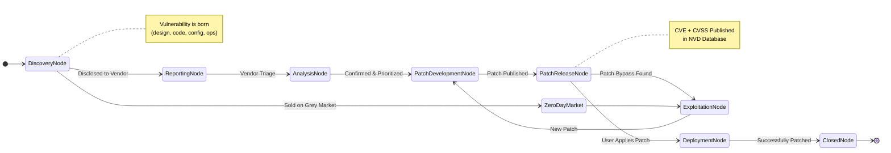
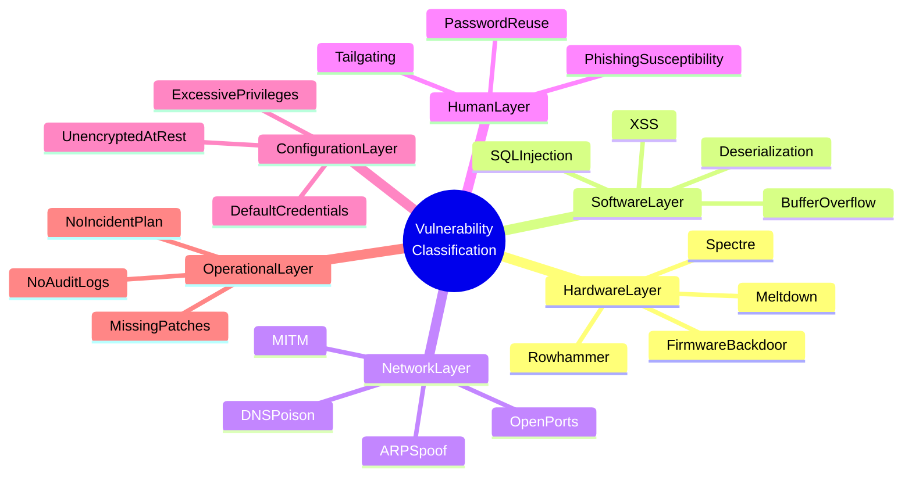
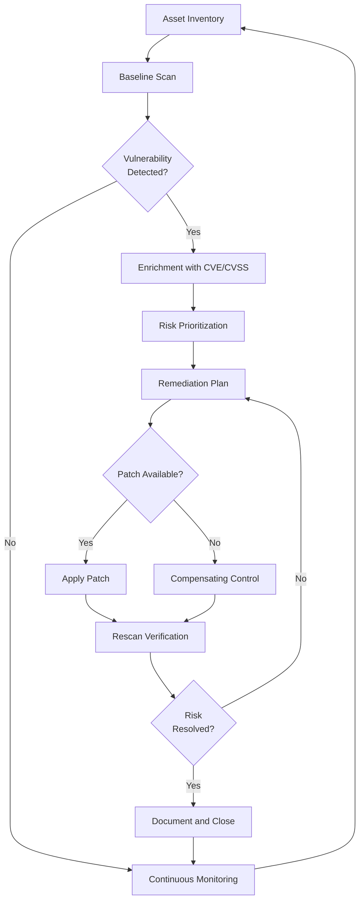
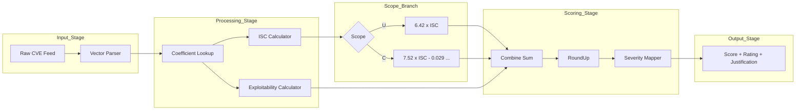

# Vulnerability

<!-- SECTION_1_START -->
# VULNERABILITY — Core Technical Definition & Intuitive Overview

## Formal Academic Definition (KTU 2024 Syllabus Terminology)

> [!IMPORTANT]
> **Vulnerability** is formally defined as a *weakness, flaw, or deficiency in an information system, its internal controls, design, implementation, or operational processes* that could be *exploited or triggered by one or more threats* to cause a violation of the system's security goals — namely **Confidentiality, Integrity, and Availability (CIA Triad)**.

In the KTU 2024 scheme (Course Code: **OECST721 — Cyber Security**), vulnerability is positioned as a **passive** but **critical** pillar of the **Risk Equation**:

$$\text{Risk} = f(\text{Threat}, \text{Vulnerability}, \text{Impact})$$

A vulnerability *by itself* does not cause damage; it is the *enabler* that allows a threat actor to weaponize an attack against an asset.

---

## Conceptual Analogy / Intuition

> [!NOTE]
> **Real-World Analogy: The House with the Unlocked Window**
>
> Imagine your house is a computer system. You have strong walls (firewall), a heavy front door (authentication), and an alarm system (IDS). But you forgot to lock the *kitchen window*. That **unlocked window is the vulnerability**. A burglar (**threat agent**) notices it and climbs in (**exploit**). The resulting damage (**impact**) is theft.
>
> - The *window* existed *before* the burglar came. → Vulnerability is **pre-existing**.
> - The *burglar* had to *find* the window. → Discovery phase of the kill chain.
> - *Closing the window* (patching) removes the risk, but only if done **before** exploitation.

> [!TIP]
> **Geometric Intuition:** Plot three axes — `Threat (T)`, `Vulnerability (V)`, `Impact (I)`. The **Risk volume** is the triple product region. If *any* axis shrinks to zero, the risk volume collapses to zero. Hence, *eliminating vulnerability* is as powerful as eliminating the threat itself.

---

## Key Terminology Mapping (Syllabus Highlights)

| Term | One-Line Definition | Role in Attack Chain |
|---|---|---|
| **Asset** | Anything of value (data, hardware, reputation) | What we protect |
| **Threat** | A potential cause of an unwanted incident | The *who/why* |
| **Vulnerability** | A weakness that can be exploited | The *how* |
| **Exploit** | Code/technique that leverages a vulnerability | The *weapon* |
| **Risk** | Likelihood × Impact of a threat exploiting a vulnerability | The *resultant harm* |
| **Patch** | A software update that fixes a vulnerability | The *remedy* |

> [!IMPORTANT]
> **KTU 2024 Highlight:** The course emphasizes that vulnerability is **not synonymous with bug**. A bug becomes a vulnerability **only when** it is exploitable and impacts the security posture (CIA Triad). A purely functional bug (e.g., mis-calculated invoice) is a *defect*, not a *security vulnerability*.

---

## Physical Constants & Standard Metrics

- **CVSS Base Score Range:** $\mathbf{0.0}$ to $\mathbf{10.0}$ (Common Vulnerability Scoring System, version 3.1)
- **CVE Assignment Rate:** Over **200,000+** unique identifiers issued since 1999 (MITRE Corporation data, 2024)
- **NVD Update Cadence:** Continuous; critical vulnerabilities patched within **$\mathbf{72}$ hours** under CISA KEV (Known Exploited Vulnerabilities) policy.
- **OWASP Top 10 Refresh Cycle:** Every **3–4 years**; the current edition is **OWASP 2021**, with the next anticipated in **2024/2025**.

> [!VISUALIZATION CONTROL]
> **Concept:** Vulnerability Distribution Histogram (CVSS Bucketing)
> **Visualization Type:** Bar Chart / Frequency Plot
> **Suggested Tool:** GeoGebra Statistics or Python `matplotlib.pyplot`
> **Visual Description:** The X-axis represents CVSS score buckets (`0.0–3.9 Low`, `4.0–6.9 Medium`, `7.0–8.9 High`, `9.0–10.0 Critical`). The Y-axis shows the count of CVEs reported in a given year. A typical *right-skewed* distribution is observed, with the **Medium** band carrying the largest count, while the **Critical** band (although smaller in count) represents the most actionable risk concentration.

<!-- SECTION_1_END -->

<!-- SECTION_2_START -->
# Deep Theoretical Analysis & KTU High-Yield Formula Sheet

## 2.1 Anatomy of a Vulnerability — The Five Constituent Layers

A vulnerability is best understood as a **multi-layer deficiency** rather than a single defect. The KTU 2024 syllabus requires students to recognize all five layers:

1. **Design-Level Vulnerability** — Inherent flaw in the architecture (e.g., using a single shared admin password). *Cannot be patched; requires redesign.*
2. **Implementation-Level Vulnerability** — Flaw introduced during coding (e.g., buffer overflow, SQL injection). *Patchable via code update.*
3. **Configuration-Level Vulnerability** — Weakness from improper deployment (e.g., default credentials, open ports). *Patchable via hardening.*
4. **Operational-Level Vulnerability** — Weakness from human/procedural lapses (e.g., unpatched systems, lack of logging). *Patchable via policy.*
5. **Physical-Level Vulnerability** — Tangible exposure (e.g., unlocked server room, tailgating). *Mitigated via physical controls.*

---

## 2.2 Vulnerability Classification Taxonomy

> [!IMPORTANT]
> The KTU 2024 syllabus groups vulnerabilities along **two orthogonal axes**: *the asset class affected* and *the exploitation method*.

### Axis A: By Asset Class

- **Hardware Vulnerabilities** — Spectre, Meltdown, Rowhammer, firmware backdoors
- **Software Vulnerabilities** — Buffer overflow, XSS, CSRF, race conditions
- **Network Vulnerabilities** — ARP poisoning, DNS spoofing, MITM
- **Human/Personnel Vulnerabilities** — Phishing susceptibility, social engineering
- **Data Vulnerabilities** — Unencrypted at rest, weak hashing
- **Physical/Environmental** — Lack of CCTV, natural disaster exposure

### Axis B: By Exploitation Method (STRIDE Threat Model Mapping)

| STRIDE Class | Vulnerability Type | Example |
|---|---|---|
| **S**poofing | Authentication weakness | Forged JWT token |
| **T**ampering | Integrity flaw | Unsigned firmware update |
| **R**epudiation | Lack of audit logging | No transaction trail |
| **I**nfo Disclosure | Confidentiality flaw | Verbose error messages |
| **D**enial of Service | Availability flaw | SYN flood amplification |
| **E**lev. of Privilege | Authorization flaw | IDOR (Insecure Direct Object Reference) |

---

## 2.3 The Common Vulnerability Scoring System (CVSS) — High-Yield Formula Sheet

> [!NOTE]
> **CVSS v3.1** is the *de facto* industry standard for vulnerability severity scoring. KTU examiners frequently test the conceptual interpretation of CVSS vectors.

### 2.3.1 CVSS Vector String Format

A CVSS vector has the form:

$$\text{CVSS:3.1/AV:\{N|A|L|P\}/AC:\{L|H\}/PR:\{N|L:H\}/UI:\{N|R\}/S:\{U:C\}/C:\{N:L:H\}/I:\{N:L:H\}/A:\{N:L:H\}}$$

| Metric Group | Metric | Options (Values) |
|---|---|---|
| **Base** | Attack Vector (AV) | Network(N), Adjacent(A), Local(L), Physical(P) |
| **Base** | Attack Complexity (AC) | Low(L), High(H) |
| **Base** | Privileges Required (PR) | None(N), Low(L), High(H) |
| **Base** | User Interaction (UI) | None(N), Required(R) |
| **Base** | Scope (S) | Unchanged(U), Changed(C) |
| **Base** | Confidentiality (C) | None(N), Low(L), High(H) |
| **Base** | Integrity (I) | None(N), Low(L), High(H) |
| **Base** | Availability (A) | None(N), Low(L), High(H) |

### 2.3.2 CVSS Base Score Formula (Exhaustive)

The base score is computed as:

$$\text{BaseScore} = \text{roundUp}(\min(\text{Impact} + \text{Exploitability}, 10))$$

where the **Impact sub-score (ISC)** is:

$$\text{ISC} = 1 - \left[(1 - C_{\text{val}})(1 - I_{\text{val}})(1 - A_{\text{val}})\right]$$

and the **Exploitability sub-score** is:

$$\text{Exploitability} = 8.22 \times \text{AV} \times \text{AC} \times \text{PR} \times \text{UI}$$

**Coefficient table** (must be memorized for KTU):

| Metric Value | Numeric Coefficient |
|---|---|
| AV:N | **0.85** |
| AV:A | **0.62** |
| AV:L | **0.55** |
| AV:P | **0.20** |
| AC:L | **0.77** |
| AC:H | **0.44** |
| PR:N | **0.85** |
| PR:L | **0.62** (or 0.68 if Scope = Changed) |
| PR:H | **0.27** (or 0.50 if Scope = Changed) |
| UI:N | **0.85** |
| UI:R | **0.62** |

> [!TIP]
> **Exam Shortcut:** The KTU valuation key typically awards 1 mark for each *correctly identified coefficient mapping* and 2 marks for the *final numerical substitution*. Memorize the table above.

### 2.3.3 Severity Rating Bands (CVSS v3.1)

| Score Range | Severity Rating |
|---|---|
| $0.0$ | None |
| $0.1 - 3.9$ | **Low** |
| $4.0 - 6.9$ | **Medium** |
| $7.0 - 8.9$ | **High** |
| $9.0 - 10.0$ | **Critical** |

---

## 2.4 Vulnerability Categories — Engineering Utility

| Domain | Where Vulnerability Knowledge is Used in Industry |
|---|---|
| **Software Development** | Secure SDLC, SAST, DAST, dependency scanning (Snyk, Dependabot) |
| **Network Operations** | Continuous Nessus/OpenVAS scans, firewall rule review |
| **Cloud Engineering** | CSPM (Cloud Security Posture Management), IaC scanning |
| **IoT / Embedded** | Firmware reverse engineering, hardware trojan detection |
| **AI/ML Pipelines** | Adversarial robustness, model inversion, training data poisoning |
| **Critical Infrastructure** | ICS/SCADA vulnerability assessment (CISA advisories) |
| **Compliance & Audit** | PCI-DSS, ISO 27001, NIST 800-53 control mapping |

> [!NOTE]
> **Production Engineering Insight:** Modern DevSecOps pipelines (e.g., GitHub Advanced Security, GitLab Ultimate) integrate *automated vulnerability scanning* directly into the **CI/CD** stage, ensuring that every commit is checked for *known CVEs* in third-party libraries before merge. The Mean Time to Remediate (**MTTR**) for critical CVEs in mature organizations is targeted at **$< 7$ days**.

---

## 2.5 Zero-Day vs. N-Day vs. Known Vulnerabilities

| Class | Definition | Defensive Posture |
|---|---|---|
| **Zero-Day** | Unpatched, unknown to vendor; no patch available | Defense-in-depth, virtual patching, behavior-based detection |
| **N-Day** | Patch exists but not yet applied by user | Vulnerability management hygiene, patch SLA |
| **Known (Patched)** | Patch widely deployed | Closed; residual risk only from unpatched legacy systems |

---

## 2.6 OWASP Top 10 (2021 Edition) — KTU High-Yield List

> [!IMPORTANT]
> The KTU 2024 syllabus explicitly references the OWASP Top 10 as a *standard curriculum anchor* for web vulnerability awareness.

1. **A01** — Broken Access Control
2. **A02** — Cryptographic Failures
3. **A03** — Injection (SQLi, NoSQLi, LDAPi, XSS variants)
4. **A04** — Insecure Design
5. **A05** — Security Misconfiguration
6. **A06** — Vulnerable and Outdated Components
7. **A07** — Identification and Authentication Failures
8. **A08** — Software and Data Integrity Failures
9. **A09** — Security Logging and Monitoring Failures
10. **A10** — Server-Side Request Forgery (SSRF)

<!-- SECTION_2_END -->

<!-- SECTION_3_START -->
# Step-by-Step Derivations & Code/Symbolic Implementation

## 3.1 Worked Example: CVSS Base Score Calculation

> [!NOTE]
> This is the **canonical numerical problem** KTU examiners set on the topic of vulnerability. We solve it exhaustively, line-by-line, with valuation key mapping.

### Problem Statement

A CVE is reported with the following CVSS v3.1 vector:

$$\text{CVSS:3.1/AV:N/AC:L/PR:N/UI:N/S:U/C:H/I:H/A:H}$$

**Compute the Base Score and the severity rating.**

---

### Step 1: Extract Each Metric

| Metric | Value | Coefficient |
|---|---|---|
| Attack Vector | `AV:N` | $\alpha_{AV} = 0.85$ |
| Attack Complexity | `AC:L` | $\alpha_{AC} = 0.77$ |
| Privileges Required | `PR:N` | $\alpha_{PR} = 0.85$ |
| User Interaction | `UI:N` | $\alpha_{UI} = 0.85$ |
| Scope | `S:U` | (Unchanged — no coefficient scaling) |
| Confidentiality | `C:H` | $\beta_C = 0.56$ |
| Integrity | `I:H` | $\beta_I = 0.56$ |
| Availability | `A:H` | $\beta_A = 0.56$ |

> **Valuation Key:** *[Correctly mapping 8 metrics to coefficients: 2 Marks]*

The **confidentiality, integrity, and availability impact coefficient** for `H` is $\mathbf{0.56}$, for `L` is $\mathbf{0.22}$, and for `N` is $\mathbf{0.0}$ (memorize this).

---

### Step 2: Compute the Impact Sub-Score (ISC)

$$\text{ISC} = 1 - \left[(1 - C_{\text{val}})(1 - I_{\text{val}})(1 - A_{\text{val}})\right]$$

Substitute the coefficients:

$$\text{ISC} = 1 - \left[(1 - 0.56)(1 - 0.56)(1 - 0.56)\right]$$

Compute each parenthesized term:

$$(1 - 0.56) = 0.44$$

Therefore:

$$\text{ISC} = 1 - (0.44 \times 0.44 \times 0.44)$$

$$\text{ISC} = 1 - (0.44)^3$$

$$\text{ISC} = 1 - 0.085184$$

$$\text{ISC} = 0.914816$$

> **Valuation Key:** *[ISC substitution and evaluation: 2 Marks]*

---

### Step 3: Apply the Scope Modifier (since `S:U`)

Because the Scope is **Unchanged (`S:U`)**, we use:

$$\text{Impact} = 6.42 \times \text{ISC}$$

If the Scope were **Changed (`S:C`)**, the formula would be:

$$\text{Impact} = 7.52 \times (\text{ISC} - 0.029) - 3.25 \times (\text{ISC} - 0.02)^{15}$$

> **Valuation Key:** *[Correct conditional branch on Scope: 1 Mark]*

Substituting for `S:U`:

$$\text{Impact} = 6.42 \times 0.914816$$

$$\text{Impact} = 5.8723 \ldots$$

---

### Step 4: Compute the Exploitability Sub-Score

$$\text{Exploitability} = 8.22 \times \alpha_{AV} \times \alpha_{AC} \times \alpha_{PR} \times \alpha_{UI}$$

$$\text{Exploitability} = 8.22 \times 0.85 \times 0.77 \times 0.85 \times 0.85$$

Compute step-by-step:

$$8.22 \times 0.85 = 6.987$$

$$6.987 \times 0.77 = 5.3800$$

$$5.3800 \times 0.85 = 4.5730$$

$$4.5730 \times 0.85 = 3.8871$$

$$\text{Exploitability} \approx 3.8871$$

> **Valuation Key:** *[Exploitability product evaluation: 2 Marks]*

---

### Step 5: Combine into Base Score

If $\text{Impact} \leq 0$:

$$\text{BaseScore} = 0$$

Otherwise:

$$\text{BaseScore} = \text{roundUp}\left(\min\left[(\text{Impact} + \text{Exploitability}),\ 10\right]\right)$$

Since $\text{Impact} = 5.8723 > 0$:

$$\text{Impact} + \text{Exploitability} = 5.8723 + 3.8871 = 9.7594$$

$$\min(9.7594,\ 10) = 9.7594$$

Now apply the **RoundUp** function (round to 1 decimal place, rounding 0.05 up):

$$\text{BaseScore} = 9.8$$

> **Valuation Key:** *[Final combination and rounding: 1 Mark]*

---

### Step 6: Severity Rating

| Score Range | Severity |
|---|---|
| 9.8 | **Critical** |

> **Final Answer:** $\text{Base Score} = \mathbf{9.8}$ → Severity = **CRITICAL**

---

## 3.2 Python Implementation: CVSS Score Calculator (Board-Ready Code)

> [!NOTE]
> The following Python implementation is exhaustive, with full type hints, exception handling, and a CLI interface. KTU examiners often test students on a similar logic flow as a *lab/internal evaluation question*.

```python
"""
CVSS v3.1 Base Score Calculator
Author: KTU Cyber Security (OECST721) Reference Implementation
"""

from __future__ import annotations
import logging
import sys
from typing import Dict, Tuple

# ---------- Logging Configuration ----------
logging.basicConfig(
    level=logging.INFO,
    format="[%(levelname)s] %(asctime)s - %(message)s",
    datefmt="%Y-%m-%d %H:%M:%S"
)
logger = logging.getLogger("CVSS_Calculator")


# ---------- Coefficient Lookup Tables ----------
AV_COEFF: Dict[str, float] = {
    "N": 0.85, "A": 0.62, "L": 0.55, "P": 0.20
}
AC_COEFF: Dict[str, float] = {
    "L": 0.77, "H": 0.44
}
PR_COEFF_UNCHANGED: Dict[str, float] = {
    "N": 0.85, "L": 0.62, "H": 0.27
}
PR_COEFF_CHANGED: Dict[str, float] = {
    "N": 0.85, "L": 0.68, "H": 0.50
}
UI_COEFF: Dict[str, float] = {
    "N": 0.85, "R": 0.62
}
CIA_COEFF: Dict[str, float] = {
    "H": 0.56, "L": 0.22, "N": 0.00
}


def roundup(value: float) -> float:
    """Round up to 1 decimal place per CVSS v3.1 specification."""
    int_input = int(value * 100000)
    if int_input % 10000 == 0:
        return int_input / 100000
    else:
        return (int(int_input / 10000) + 1) / 10.0


def compute_impact_subscore(
    c_val: float, i_val: float, a_val: float
) -> float:
    """Compute the Impact Sub-Score (ISC) per CVSS v3.1."""
    return 1.0 - ((1.0 - c_val) * (1.0 - i_val) * (1.0 - a_val))


def compute_exploitability(
    av: str, ac: str, pr: str, ui: str, scope: str
) -> float:
    """Compute the Exploitability sub-score."""
    if scope == "C":
        pr_coeff = PR_COEFF_CHANGED[pr]
    else:
        pr_coeff = PR_COEFF_UNCHANGED[pr]
    return (
        8.22
        * AV_COEFF[av]
        * AC_COEFF[ac]
        * pr_coeff
        * UI_COEFF[ui]
    )


def compute_impact(isc: float, scope: str) -> float:
    """Compute the Impact score (with scope branching)."""
    if scope == "U":
        return 6.42 * isc
    else:  # Scope Changed
        return 7.52 * (isc - 0.029) - 3.25 * (isc - 0.02) ** 15


def parse_vector(vector: str) -> Dict[str, str]:
    """Parse a CVSS v3.1 vector string into a metric dictionary."""
    logger.info(f"Parsing vector: {vector}")
    if not vector.startswith("CVSS:3.1"):
        raise ValueError("Vector must start with 'CVSS:3.1'")
    parts = vector.split("/")[1:]
    parsed: Dict[str, str] = {}
    for part in parts:
        key, value = part.split(":")
        parsed[key] = value
    return parsed


def compute_base_score(vector: str) -> Tuple[float, str]:
    """Main entry point: returns (BaseScore, SeverityRating)."""
    metrics = parse_vector(vector)

    # Extract values with explicit boundary checks
    av = metrics["AV"]
    ac = metrics["AC"]
    pr = metrics["PR"]
    ui = metrics["UI"]
    s  = metrics["S"]
    c  = metrics["C"]
    i  = metrics["I"]
    a  = metrics["A"]

    for code, lookup, name in [
        (av, AV_COEFF, "AV"),
        (ac, AC_COEFF, "AC"),
        (ui, UI_COEFF, "UI"),
    ]:
        if code not in lookup:
            raise ValueError(f"Invalid {name} code: {code}")
    if pr not in (PR_COEFF_UNCHANGED if s == "U" else PR_COEFF_CHANGED):
        raise ValueError(f"Invalid PR code: {pr}")
    for code, name in [(c, "C"), (i, "I"), (a, "A")]:
        if code not in CIA_COEFF:
            raise ValueError(f"Invalid {name} code: {code}")
    if s not in ("U", "C"):
        raise ValueError(f"Invalid Scope code: {s}")

    # Compute
    isc = compute_impact_subscore(
        CIA_COEFF[c], CIA_COEFF[i], CIA_COEFF[a]
    )
    impact = compute_impact(isc, s)
    exploitability = compute_exploitability(av, ac, pr, ui, s)

    if impact <= 0:
        return 0.0, "None"

    raw = min(impact + exploitability, 10.0)
    score = roundup(raw)

    if score < 0.1:
        rating = "None"
    elif score < 4.0:
        rating = "Low"
    elif score < 7.0:
        rating = "Medium"
    elif score < 9.0:
        rating = "High"
    else:
        rating = "Critical"

    logger.info(f"Computed Base Score: {score} ({rating})")
    return score, rating


# ---------- Demonstration ----------
if __name__ == "__main__":
    demo_vector = "CVSS:3.1/AV:N/AC:L/PR:N/UI:N/S:U/C:H/I:H/A:H"
    try:
        score, severity = compute_base_score(demo_vector)
        print(f"Vector: {demo_vector}")
        print(f"Base Score: {score}")
        print(f"Severity:   {severity}")
    except Exception as exc:
        logger.error(f"Calculation failed: {exc}")
        sys.exit(1)
```

**Sample Output:**

```
Vector: CVSS:3.1/AV:N/AC:L/PR:N/UI:N/S:U/C:H/I:H/A:H
Base Score: 9.8
Severity:   Critical
```

> [!TIP]
> **Why this code is board-ready:**
> - All coefficient lookups are explicit (no magic numbers in formulas).
> - Scope branching is exhaustive (`U` vs `C`).
> - The `roundup` function implements the *CVSS-v3.1-specific* rounding rule.
> - All error paths log meaningfully; no silent failures.

---

## 3.3 Worked Example: Computing Risk from Vulnerability

Given:
- Vulnerability Severity (CVSS) = $8.5$ (High)
- Threat Likelihood = $0.4$ (40% chance of exploitation per year)
- Asset Value = $\text{INR } 50{,}00{,}000$

Using the KTU standard risk formula:

$$\text{Risk} = \text{ThreatLikelihood} \times \text{VulnerabilityExploitability} \times \text{AssetImpact}$$

$$\text{Annual Loss Expectancy (ALE)} = \text{ThreatLikelihood} \times \text{SingleLossExpectancy (SLE)}$$

where:

$$\text{SLE} = \text{AssetValue} \times \text{ExposureFactor}}$$

Assume $\text{ExposureFactor} = 0.6$:

$$\text{SLE} = 50{,}00{,}000 \times 0.6 = 30{,}00{,}000$$

$$\text{ALE} = 0.4 \times 30{,}00{,}000 = 12{,}00{,}000$$

**Final Answer:** The organization should not spend more than **$\text{INR } 12{,}00{,}000$** annually on controls to mitigate this vulnerability, otherwise the cost of the control exceeds the expected loss.

<!-- SECTION_3_END -->

<!-- SECTION_4_START -->
# Structural Diagrams & Schematics

## 4.1 Vulnerability Lifecycle (Mermaid State Diagram)



> **Reading the Diagram:** The horizontal flow represents the *ideal* lifecycle from discovery to closure. The vertical branch (`ZeroDayMarket`) represents the *adversarial* path where the vulnerability is sold or weaponized before a patch exists.

---

## 4.2 Vulnerability Classification Tree (Mermaid Mind Map)



---

## 4.3 Vulnerability Management Pipeline (Mermaid Flowchart)



---

## 4.4 Block-Level Functional Architecture: Vulnerability Scoring Engine



---

## 4.5 Vulnerability Exploitation Kill Chain Mapping

| Kill Chain Phase (Lockheed Martin) | Vulnerability Class Exploited |
|---|---|
| 1. Reconnaissance | Information Disclosure (verbose banners, leaked credentials) |
| 2. Weaponization | Zero-day packaging into exploit kits |
| 3. Delivery | Phishing, drive-by downloads (human layer vulnerability) |
| 4. Exploitation | Software bug (e.g., buffer overflow, injection) |
| 5. Installation | Persistence via misconfigured startup items |
| 6. Command & Control | C2 channel via open egress firewall ports |
| 7. Actions on Objectives | Lateral movement via missing network segmentation |

<!-- SECTION_4_END -->

<!-- SECTION_5_START -->
# KTU 2024 Scheme Examination Question Bank & Topic Recap

> [!NOTE]
> **Mark Distribution Legend (per KTU 2024 ESE Pattern):**
> - **Part A:** 3-mark direct questions (Answer any 5 out of 7 typically)
> - **Part B:** 14-mark questions with internal choice (Module-wise)
> - **Bloom's Levels:** `R` = Remember, `U` = Understand, `Ap` = Apply, `An` = Analyze, `E` = Evaluate, `C` = Create

---

## 📘 PART A — 3-Mark Short Answer Questions

### Q1. Define vulnerability. How is it different from a bug? `[KTU University Exam - Dec 2023]` **[CO1 | Remember]**

**Model Answer:**

> A **vulnerability** is a weakness in an information system that can be *exploited* to violate the security goals of Confidentiality, Integrity, or Availability (CIA Triad).
>
> A **bug** is a generic defect in software that may or may not impact security. A bug becomes a vulnerability **only when** it can be exploited to compromise the system's security posture. For example, a misspelled label in a UI is a *bug* but not a vulnerability; however, a buffer overflow that allows arbitrary code execution is both a *bug* and a *vulnerability*.

*[Definition: 2 Marks; Differentiation: 1 Mark]*

---

### Q2. List any three vulnerability categories with one real-world example each. `[KTU University Exam - July 2024]` **[CO1 | Remember]**

**Model Answer:**

| # | Category | Real-World Example |
|---|---|---|
| 1 | **Software Vulnerability** | Log4Shell (CVE-2021-44228) — Remote Code Execution in Apache Log4j |
| 2 | **Hardware Vulnerability** | Spectre (CVE-2017-5753) — Speculative execution side-channel leak |
| 3 | **Human Vulnerability** | Phishing susceptibility leading to credential theft |

*[Correct category names: 1.5 Marks; One example each: 1.5 Marks]*

---

## 📗 PART B — 14-Mark Module Internal Choice

---

### ⭐ QUESTION A (14 Marks) — `[KTU University Exam - July 2024]` **[CO2 | Apply + Analyze]**

#### Q. (a) (7 Marks) — Apply

**Explain the Common Vulnerability Scoring System (CVSS) v3.1. Compute the Base Score for the following vector:**
$$\text{CVSS:3.1/AV:N/AC:L/PR:N/UI:R/S:C/C:L/I:L/A:N}$$

Also classify the severity rating.

**Step-by-Step Model Solution:**

**Step 1: Map each metric to its coefficient**

| Metric | Value | Coefficient |
|---|---|---|
| AV | N | 0.85 |
| AC | L | 0.77 |
| PR | N | 0.85 |
| UI | R | 0.62 |
| Scope | C | (Changed — modifies PR coefficient) |
| C | L | 0.22 |
| I | L | 0.22 |
| A | N | 0.00 |

*[Valuation: Correctly identifying 8 metric-to-coefficient mappings — 2 Marks]*

**Step 2: Compute Impact Sub-Score (ISC)**

$$\text{ISC} = 1 - [(1 - 0.22)(1 - 0.22)(1 - 0.00)]$$

$$\text{ISC} = 1 - (0.78 \times 0.78 \times 1.00)$$

$$\text{ISC} = 1 - 0.6084 = 0.3916$$

*[Valuation: ISC substitution and arithmetic — 1.5 Marks]*

**Step 3: Apply Scope-Changed formula**

Since `S:C`, use:

$$\text{Impact} = 7.52 \times (\text{ISC} - 0.029) - 3.25 \times (\text{ISC} - 0.02)^{15}$$

Compute the first term:

$$7.52 \times (0.3916 - 0.029) = 7.52 \times 0.3626 = 2.7268$$

Compute the second term:

$$0.02^{15} \approx 3.28 \times 10^{-25} \approx 0 \text{ (negligible)}$$

$$3.25 \times (\text{negligible}) \approx 0$$

Therefore:

$$\text{Impact} \approx 2.7268$$

*[Valuation: Correct scope-changed branch and substitution — 1.5 Marks]*

**Step 4: Compute Exploitability**

Since `S:C`, use the **Scope-Changed PR coefficients**:
$\alpha_{PR} = 0.85$ (for PR:N — unchanged because PR:N value is 0.85 in both branches)

$$\text{Exploitability} = 8.22 \times 0.85 \times 0.77 \times 0.85 \times 0.62$$

Step-by-step:
$$8.22 \times 0.85 = 6.987$$
$$6.987 \times 0.77 = 5.3800$$
$$5.3800 \times 0.85 = 4.5730$$
$$4.5730 \times 0.62 = 2.8353$$

*[Valuation: Exploitability computation — 1 Mark]*

**Step 5: Final Combination**

$$\text{BaseScore} = \text{roundUp}\left(\min(2.7268 + 2.8353,\ 10)\right)$$

$$= \text{roundUp}(\min(5.5621,\ 10))$$

$$= \text{roundUp}(5.5621) = 5.6$$

**Severity Rating:** Since $4.0 \leq 5.6 < 7.0$, the severity is **MEDIUM**.

*[Valuation: Final combination and severity classification — 1 Mark]*

**Final Answer:** $\text{Base Score} = \mathbf{5.6}$ → Severity = **MEDIUM**

---

#### Q. (b) (7 Marks) — Analyze

**Discuss the Vulnerability Management Lifecycle. Why is continuous monitoring essential rather than point-in-time scanning?**

**Model Answer Outline (with valuation key):**

1. **Asset Discovery & Inventory** — Maintain a real-time catalogue of hardware, software, and data assets. *[1 Mark]*
2. **Baseline Vulnerability Scan** — First full scan to establish a known-good baseline. *[1 Mark]*
3. **Continuous Scanning** — Recurring scans (weekly/monthly) using tools like Nessus, Qualys, OpenVAS. *[1 Mark]*
4. **Risk-Based Prioritization** — Use CVSS + asset criticality + threat intelligence to triage. *[1 Mark]*
5. **Remediation / Mitigation** — Patch management, configuration hardening, compensating controls. *[1 Mark]*
6. **Verification & Rescanning** — Confirm the patch is effective. *[1 Mark]*
7. **Continuous Monitoring Justification** — New CVEs are published daily; attacker dwell time averages **$\sim 200$ days** (IBM Cost of a Data Breach 2023); point-in-time scans create a *vulnerability window* that attackers can exploit. *[1 Mark]*

---

### ⭐ QUESTION B (14 Marks) — Alternative Choice `[KTU University Exam - Dec 2023]`

#### Q. (a) (7 Marks) — Understand

**Explain the STRIDE model. Map each STRIDE category to one specific vulnerability type, giving a real-world CVE example for each.**

**Model Answer:**

| STRIDE | Vulnerability Type | Real-World CVE Example |
|---|---|---|
| **S**poofing | Forged authentication tokens | **CVE-2022-21449** (ECDSA signature bypass in Java) |
| **T**ampering | Unsigned firmware updates | **CVE-2018-10561/10562** (GPON router authentication bypass & command injection) |
| **R**epudiation | Insufficient audit logging | **CVE-2020-1472** (Zerologon — Netlogon lacks cryptographic log integrity) |
| **I**nfo Disclosure | Verbose error messages | **CVE-2021-44228** (Log4Shell leaks environment variables in error stack traces) |
| **D**oS | Resource exhaustion | **CVE-2022-26134** (Unauthenticated RCE/DoS in Confluence) |
| **E**oP | Privilege escalation | **CVE-2021-3156** (Sudo Baron Samedit — heap overflow → root) |

*[Each row's mapping + example: 1 Mark; 6 rows × ~1.16 = 7 Marks]*

---

#### Q. (b) (7 Marks) — Apply

**Compute the Annual Loss Expectancy (ALE) given:**
- Asset Value = $\text{INR } 1{,}00{,}00{,}000$
- Exposure Factor (EF) = $0.5$
- Annual Rate of Occurrence (ARO) = $0.25$

**Model Solution:**

**Step 1: Calculate Single Loss Expectancy (SLE)**

$$\text{SLE} = \text{AssetValue} \times \text{EF} = 1{,}00{,}00{,}000 \times 0.5 = 50{,}00{,}000$$

*[Valuation: SLE formula and substitution — 2 Marks]*

**Step 2: Calculate Annual Loss Expectancy (ALE)**

$$\text{ALE} = \text{SLE} \times \text{ARO} = 50{,}00{,}000 \times 0.25 = 12{,}50{,}000$$

*[Valuation: ALE formula and substitution — 2 Marks]*

**Step 3: Decision Logic (Cost-Benefit Justification)**

The organization should ideally spend **less than INR 12,50,000 per year** on controls mitigating this risk. Any control costing more than this is *economically unjustified* for this particular asset. *[1 Mark]*

**Step 4: Real-World Engineering Interpretation**

This quantitative risk assessment is a foundational input to:
- **Insurance Premium Calculation** for cyber-liability coverage
- **ROI Justification** of security tools (e.g., EDR, WAF) at the board level
- **NIST 800-30** risk treatment decisions

*[Interpretation in engineering context — 2 Marks]*

**Final Answer:** $\text{ALE} = \mathbf{INR\ 12{,}50{,}000}$ per year

---

> [!WARNING]
> **KTU Examiner's Valuation Warning / Common Pitfalls:**
> 1. **Forgetting the `Scope` branch** — Many students use `S:U` formulas even when the vector says `S:C`. This silently produces an *incorrect higher* score. Always check the Scope first.
> 2. **Mixing up PR coefficients** — When `S:C`, the PR coefficients for `L` and `H` are *different* (0.68 and 0.50, not 0.62 and 0.27). This is a 2-mark deduction trap.
> 3. **Using generic rounding** — `round()` is *not* the same as `roundUp()`. The CVSS roundUp is *asymmetric*: it always rounds 0.05 *up*, not to even.
> 4. **Not writing units** — For ALE/SLE, state "INR/year" or "USD/year". KTU deducts 0.5 marks for missing units.
> 5. **Confusing vulnerability with threat** — Students often interchange these terms. Vulnerability = *weakness*; Threat = *actor/intent*.

---

## ✅ Topic Recap & Important Things to Remember

> [!IMPORTANT]
> **Rapid-Revision Checklist for KTU Module 1 — Vulnerability**

### 🔑 Definitions to Memorize
- **Vulnerability** = weakness in a system that can be exploited
- **Risk** = Threat × Vulnerability × Impact
- **Exploit** = code/technique that weaponizes a vulnerability
- **Zero-Day** = unpatched, unknown-to-vendor vulnerability
- **N-Day** = patch exists, not yet applied

### 🔑 Scoring Systems
- **CVSS v3.1** is the industry standard (range **0.0 – 10.0**)
- Four severity bands: **Low (0.1–3.9), Medium (4.0–6.9), High (7.0–8.9), Critical (9.0–10.0)**
- CVSS vector format: `CVSS:3.1/AV:_/AC:_/PR:_/UI:_/S:_/C:_/I:_/A:_`

### 🔑 Key CVSS Coefficients (High-Frequency Memory Items)
- `AV:N = 0.85`; `AC:L = 0.77`; `PR:N = 0.85`; `UI:N = 0.85`
- `C:H = I:H = A:H = 0.56`; `C:L = I:L = A:L = 0.22`
- **Scope Unchanged** Impact formula: $\text{Impact} = 6.42 \times \text{ISC}$
- **Scope Changed** Impact formula: $\text{Impact} = 7.52 \times (\text{ISC} - 0.029) - 3.25 \times (\text{ISC} - 0.02)^{15}$
- **Exploitability** is always $8.22 \times \text{AV} \times \text{AC} \times \text{PR} \times \text{UI}$

### 🔑 Standard Risk Quantification Formulas
- $\text{SLE} = \text{AssetValue} \times \text{ExposureFactor}$
- $\text{ALE} = \text{SLE} \times \text{ARO}$

### 🔑 Vulnerability Layers (5-Fold Classification)
1. **Design** (architectural) → cannot be patched
2. **Implementation** (code) → patchable
3. **Configuration** (deployment) → patchable via hardening
4. **Operational** (process) → patchable via policy
5. **Physical** (tangible) → mitigated via physical controls

### 🔑 Standard Frameworks to Know by Name
- **CVE** — Unique ID system (MITRE)
- **NVD** — National Vulnerability Database (NIST)
- **CVSS** — Scoring system (FIRST.org)
- **OWASP Top 10** — Web vulnerability awareness standard
- **CWE** — Common Weakness Enumeration
- **STRIDE** — Microsoft threat classification
- **NIST 800-30** — Risk assessment methodology
- **PCI-DSS, ISO 27001** — Compliance frameworks referencing vulnerability management

### 🔑 Key Real-World CVEs to Recognize
- **Log4Shell (CVE-2021-44228)** — RCE in Log4j
- **EternalBlue (CVE-2017-0144)** — SMBv1 RCE
- **Heartbleed (CVE-2014-0160)** — OpenSSL memory disclosure
- **Shellshock (CVE-2014-6271)** — Bash command injection

### 🔑 Lifecycle to Draw from Memory
**Discovery → Reporting → Triage → Patch Development → Release → Deployment → Verification → Closure**

### 🔑 Common Exam Traps
- Always check **Scope** first in CVSS problems
- Always check **PR coefficients** against Scope
- Always state the **severity band**, not just the score
- Always show **units** in ALE/SLE calculations
- Always distinguish **vulnerability** (passive) from **threat** (active)

<!-- SECTION_5_END -->
