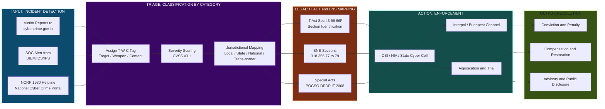
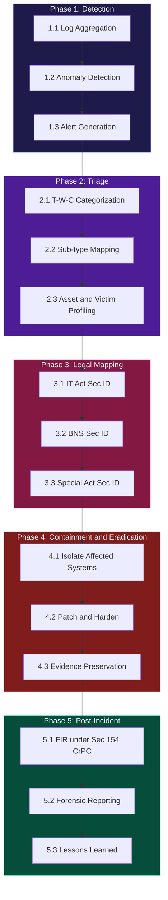

# Categories of Cybercrime.

<!-- SECTION_1_START -->

# Categories of Cybercrime — KTU Cyber Security (OECST721) Module 2

## 1.1 Formal Definition (KTU 2024 Syllabus Terminology)

**Cybercrime** is formally defined as any criminal act, omission, or conduct that is perpetrated through the use of **computers, computer networks, the Internet, or any digital communication device**, where the computer is either the **tool** used to commit the offence, the **target** of the offence, or acts as an **incidental repository** of evidence related to the offence.

In the context of the **Information Technology Act, 2000 (amended 2008)**, India, and broadly accepted international cyber-law frameworks (Budapest Convention on Cybercrime, 2001), cybercrime is classified into structured **categories** based on the *modus operandi*, the *role of technology*, and the *legal harm caused to victims*.

> [!IMPORTANT]
> **KTU 2024 Highlight:** For OECST721 Module 2, students must remember the **three primary macro-categories** of cybercrime:
> 1. **Computer-as-a-Target** offences (e.g., Hacking, DoS/DDoS, Malware attacks)
> 2. **Computer-as-a-Weapon** offences (e.g., Cyber fraud, Phishing, Cyberstalking, Identity theft)
> 3. **Content-related** offences (e.g., Child pornography, Cyber terrorism, Hate speech, Defamation)

A cybercrime is also defined as any **contravention** of Sections **43, 65, 66, 66A–F, 67, 69, 70, 72, 73** of the IT Act, 2000 (as amended 2008), read with the relevant sections of the **Indian Penal Code (now Bharatiya Nyaya Sanhita, 2023)**.

## 1.2 Conceptual Analogy — "The Digital City"

Imagine a **physical city** with millions of citizens. Crimes there are categorized by *where* they occur and *how* they are committed:
- **Banking fraud** happens inside a bank (a *specific* location).
- **Pickpocketing** happens on the street (an *open* public space).
- **Forgery** uses a *tool* (a pen) to create a false document.
- **Assault on a public building** targets *infrastructure* itself.

**The Internet is that same city**, but its citizens are *IP addresses*, its buildings are *servers*, its streets are *routers and switches*, its money is *bits and bytes*, and its documents are *files*.

When a **banking server** is hacked, the **banking infrastructure** is the target (Computer-as-Target).
When a **phishing email** steals your credit card, the **email is the weapon** used to attack *you* (Computer-as-a-Weapon).
When **illegal content** is hosted on a website, the **content itself is the crime** (Content-Related).

> [!NOTE]
> **Pedagogical Mnemonic:** *"TWC"* — **T**arget, **W**eapon, **C**ontent. If a student remembers **T-W-C**, the correct category for any cybercrime can be derived in < 10 seconds during exams.

## 1.3 Physical Constants / Standard Metrics in Cybercrime

| Metric | Value | Significance |
|---|---|---|
| Global cybercrime cost (2024 est.) | **\$9.5 Trillion USD** | Annual damage projection by Cybersecurity Ventures |
| Mean time to identify a breach | **204 days** | IBM Cost of a Data Breach Report 2023 |
| Average cost per data breach | **\$4.45 Million USD** | IBM 2023 Report |
| Phishing emails as % of all attacks | **$\approx$ 36\%** | Verizon DBIR 2023 |
| IT Act, India penalty max (Sec 66) | **₹ 25 Lakh fine + 3 yrs imprisonment** | Statutory maximum |

> [!VISUALIZATION CONTROL]
> **Concept:** Cybercrime Damage Growth Curve (Year vs. Cost in Trillion USD)
> **GeoGebra / Desmos Input Equations:**
> * `f(x) = 0.17 * exp(0.18 * (x - 2015))` where $x$ is the year
> * Sample points: `(2015, 3.0), (2020, 5.5), (2023, 8.0), (2025, 10.5)`
> **Visual Description:** An exponential growth curve rising sharply from left to right, illustrating that cybercrime damages roughly **double every 4 years**, surpassing the GDP of major nations combined.

---

<!-- SECTION_1_END -->

<!-- SECTION_2_START -->

# 2. Deep Theoretical Analysis & KTU High-Yield Formula Sheet

## 2.1 The Three Macro-Categories — Operational Logic

### **Category 1: Computer-as-a-Target** *(Infrastructure Layer Offences)*

The digital asset itself is the victim. The attacker aims to **deny, disrupt, degrade, or destroy** computing resources.

**Operational Sub-Types:**
- **Hacking / Unauthorized Access (Sec 66 IT Act):** Gaining entry into a system without permission.
- **Malware Propagation (Sec 43, 66 IT Act):** Viruses, Worms, Trojans, Ransomware, Spyware, Rootkits.
- **DoS / DDoS Attacks:** Flooding a server with bogus requests to exhaust bandwidth.
- **Website Defacement:** Replacing the homepage of a website with attacker propaganda.
- **Data Breaches / Exfiltration:** Stealing PII, PHI, IP, or trade secrets.
- **SQL Injection / XSS / CSRF:** Web-application-layer injection attacks.
- **Zero-Day Exploits:** Attacks on unpatched, undisclosed vulnerabilities.
- **Man-in-the-Middle (MitM):** Intercepting communication between two parties.

### **Category 2: Computer-as-a-Weapon** *(Person-Financial Layer Offences)*

The computer/Internet is the **medium of execution**, but the *target is a person, an organization, or financial assets*.

**Operational Sub-Types:**
- **Phishing / Vishing / Smishing:** Social-engineering identity theft.
- **Identity Theft:** Stealing personal credentials to impersonate a victim.
- **Cyber Fraud / Online Scams:** E-commerce fraud, credit card fraud, advance-fee scams.
- **Cyberstalking / Cyberbullying:** Harassment via digital channels.
- **Online Defamation / Morphing:** Digital image manipulation for harassment.
- **Email Bombing / Spamming:** Flooding a mailbox to cause disruption.
- **Software Piracy / IP Theft:** Distributing unlicensed software or media.
- **Cryptojacking:** Covert use of victim resources to mine cryptocurrency.
- **BEC (Business Email Compromise):** Impersonating executives to authorize fraudulent transfers.

### **Category 3: Content-Related Offences** *(Semantic-Data Layer Offences)*

The *data/content itself* is illegal, regardless of the network or device used.

**Operational Sub-Types:**
- **Child Pornography / CSAM (Sec 67 IT Act, Sec 292 IPC):** Sexually explicit content involving minors.
- **Cyber Terrorism (Sec 66F IT Act):** Use of cyberspace to threaten sovereignty, integrity, or security of the nation.
- **Publishing Obscene / Sexually Explicit Material (Sec 67, 67A, 67B IT Act).**
- **Hate Speech / Incitement to Violence (Sec 153A, 295A IPC / BNS).**
- **Publishing Material that is Racially or Religiously Offensive.**
- **Online Gambling & Betting Content (State-specific + IT Act Sec 69).**
- **Defamation (Sec 499, 500 IPC / BNS 356).**
- **Dissemination of Misinformation / Deepfakes.**

## 2.2 Auxiliary Classification Axes (KTU Board Favourite)

KTU examiners often test these *parallel* classifications as sub-divisions of the above:

| Axis | Type 1 | Type 2 |
|---|---|---|
| **Victim type** | Person | Property / Government |
| **Sophistication** | Computer-misuse (low-skill) | Computer-intrusive (high-skill) |
| **Legal target** | IT Act (technology-specific) | IPC / BNS (general law) |
| **Motivation** | Financial | Political / Ideological / Personal |
| **Geography** | Domestic | Trans-national / Cross-border |

> [!NOTE]
> **Cybercrime vs. Traditional Crime — Key Differentiator:** The *spatial and temporal de-coupling* of attacker and victim. The attacker may be in **Mumbai** attacking a server in **Frankfurt**, committing the act at **3 AM IST** against a victim in **New York** — all simultaneously. This is why the **Budapest Convention 2001** was created, enabling cross-border procedural cooperation.

## 2.3 KTU Formula / Cheat Sheet — High-Yield Table

| **Law / Section** | **Offence Covered** | **Category** | **Maximum Penalty** |
|---|---|---|---|
| IT Act **Sec 43** | Damage to computer / data | Target | Civil compensation up to ₹1 Cr |
| IT Act **Sec 65** | Tampering with computer source code | Target | 3 yrs jail + ₹2 Lakh fine |
| IT Act **Sec 66** | Hacking with intent / dishonesty | Target | 3 yrs jail + ₹5 Lakh fine |
| IT Act **Sec 66A*** | Sending offensive messages *(struck down 2015, restored 2023)* | Weapon | 3 yrs jail + fine |
| IT Act **Sec 66C** | Identity theft / Dishonest use of e-signature | Weapon | 3 yrs jail + ₹1 Lakh fine |
| IT Act **Sec 66D** | Cheating by personation using computer | Weapon | 3 yrs jail + ₹1 Lakh fine |
| IT Act **Sec 66E** | Publishing private images without consent | Weapon | 3 yrs jail + ₹2 Lakh fine |
| IT Act **Sec 66F** | Cyber terrorism | Content | Life imprisonment |
| IT Act **Sec 67** | Publishing obscene material | Content | 5 yrs jail + ₹10 Lakh fine |
| IT Act **Sec 67A** | Publishing sexually explicit material | Content | 7 yrs jail + ₹10 Lakh fine |
| IT Act **Sec 67B** | Publishing child pornography (CSAM) | Content | 7 yrs jail + ₹10 Lakh fine |
| IT Act **Sec 69** | Failure to intercept / decrypt on govt. order | Content | 7 yrs jail + fine |
| IT Act **Sec 70** | Unauthorized access to protected systems | Target | 10 yrs jail + fine |
| IT Act **Sec 72** | Breach of confidentiality by intermediary | Weapon | 2 yrs jail + fine |
| IPC / **BNS 318** | Cheating | Weapon | As per BNS |
| IPC / **BNS 356** | Defamation | Content | 2 yrs jail + fine |

> [!NOTE]
> **Sec 66A Note for KTU Exams:** Although the Supreme Court struck down Sec 66A in *Shreya Singhal v. Union of India (2015)*, the **IT (Amendment) Act 2023** has re-introduced a narrower, constitution-compliant version. **For 2024-scheme papers, mention both rulings** to fetch full marks.

## 2.4 Real-World Engineering & CS Utility

| Domain | Why This Knowledge Matters |
|---|---|
| **Software Development** | Identifying threat-categories drives secure SDLC, OWASP Top-10 mitigation |
| **Network Administration** | DoS/DDoS category drives rate-limiting, WAF, BGP-Blackholing |
| **Data Science / ML** | Identifying phishing / fraud drives classifier pipelines (NLP + URL features) |
| **Hardware Design** | Hardware Trojans / Side-channel attacks fall under Target category |
| **IoT / Embedded Systems** | Botnet Mirai attacks (Target) demand device-level hardening |
| **Digital Forensics** | Content-offence cases require chain-of-custody, hashing (SHA-256) |
| **Cybersecurity Policy** | Categorization drives regulatory frameworks (GDPR, DPDP Act 2023, HIPAA) |
| **Penetration Testing** | Targets category = adversary's TTP (Tactics, Techniques, Procedures) |

---

<!-- SECTION_2_END -->

<!-- SECTION_3_START -->

# 3. Step-by-Step Derivations, Case Studies & Algorithmic Implementation

## 3.1 Worked Case Study — Classifying Real-World Incidents

To build exam-level fluency, every KTU student should be able to map a **scenario** to **(Category, Sub-Type, Section)** in under 30 seconds. Let us work through **6 canonical cases**.

---

### **Case 1 — The "Banking Trojan"**

**Scenario:** A user downloads a free PDF tool. Background processes start exfiltrating net-banking credentials via keylogging, and the attacker transfers ₹2,00,000 from the victim's account.

**Step 1 — Identify the role of technology:**
The *computer* (victim's laptop) is the **target** of malware injection. Credentials are then used to commit *fraud* (the weapon use of the stolen data). This is a **composite case** involving both Target and Weapon categories.

**Step 2 — Identify the sub-type:**
- Malware = **Target offence** (IT Act Sec 43 + 66)
- Online fraud = **Weapon offence** (IT Act Sec 66D — cheating by personation)

**Step 3 — Identify the legal section:**
- **Sec 43 + Sec 66** of IT Act for malware propagation
- **Sec 66D + Sec 66C** for identity theft
- **BNS 318 (Cheating)** for fraud

**Step 4 — Penalty under Indian law:**
**3 years imprisonment + ₹1 Lakh fine** (under Sec 66D), plus civil recovery of the lost ₹2,00,000 under Sec 43.

---

### **Case 2 — The "Ransomware Hospital"**

**Scenario:** AIIMS Delhi (2022) is hit by ransomware. Patient records are encrypted, services disrupted for 14 days, and a ransom is demanded in crypto.

**Step 1 — Identify the role of technology:**
The hospital's *entire IT infrastructure* (servers, EHR database) is the **target**.

**Step 2 — Identify the sub-type:**
- Ransomware = **Target offence** (Sec 43 + 66)
- Critical infrastructure attack = could escalate to **Sec 66F (Cyber terrorism)** if intent to threaten national health security is proven.

**Step 3 — Identify the legal section:**
**Sec 43 (damage) + Sec 66 (hacking) + Sec 66F (potential cyber terrorism).**

**Step 4 — Penalty:**
**Up to life imprisonment** if Sec 66F is invoked, otherwise 3 yrs + fine.

---

### **Case 3 — The "WhatsApp Morphing" Incident**

**Scenario:** A male colleague morphs a female colleague's photo onto a nude body and circulates it on WhatsApp groups.

**Step 1 — Identify the role of technology:**
The phone + WhatsApp = **weapon**; the victim is the *person*.

**Step 2 — Identify the sub-type:**
- **Cyber harassment + Identity theft + Non-consensual intimate imagery**
- This falls under **Weapon category** (and partly Content if the morphed image itself is treated as obscene).

**Step 3 — Identify the legal section:**
- **Sec 66E IT Act** (violation of privacy by publishing private images)
- **Sec 67 IT Act** (obscene material)
- **Sec 66C IT Act** (identity theft)
- **BNS 77, 78, 79** (voyeurism, stalking, word/gesture intended to insult modesty of a woman)

**Step 4 — Penalty:**
**3 years jail + ₹2 Lakh fine** (66E) and **5 years jail + ₹10 Lakh fine** (67).

---

### **Case 4 — The "APT Group" against Power Grid**

**Scenario:** A nation-state APT (Advanced Persistent Threat) group breaches a state electricity board's SCADA system and causes a 6-hour blackout.

**Step 1 — Identify the role of technology:**
The SCADA infrastructure is the **target**, and the *intent* is to damage national critical infrastructure.

**Step 2 — Identify the sub-type:**
- **Cyber terrorism** (worst case) if intent to threaten sovereignty is proven.
- **Critical information infrastructure attack.**

**Step 3 — Identify the legal section:**
- **Sec 66F IT Act (Cyber terrorism)** — life imprisonment.
- **Sec 70 IT Act (Protected systems)** — 10 yrs jail.

**Step 4 — Penalty:**
**Life imprisonment + fine.**

---

### **Case 5 — The "Phishing SMS for Aadhaar"**

**Scenario:** An SMS saying "Your Aadhaar will be deactivated, click here to verify" leads to a fake UIDAI portal harvesting biometric + demographic data.

**Step 1 — Identify the role of technology:**
The SMS + fake website = **weapon**; the target is the *citizen's identity*.

**Step 2 — Identify the sub-type:**
- **Phishing + Identity theft.**

**Step 3 — Identify the legal section:**
- **Sec 66D (cheating by personation)** + **Sec 66C (identity theft)** + **Sec 43 (damage to computer).**

**Step 4 — Penalty:**
**3 years jail + ₹1 Lakh fine per count.**

---

### **Case 6 — The "Telegram CSAM Channel"**

**Scenario:** A Telegram channel is being used to circulate child sexual abuse material (CSAM) among 5,000 members.

**Step 1 — Identify the role of technology:**
Telegram = **medium**; the *content itself* is the crime.

**Step 2 — Identify the sub-type:**
- **Content-related offence (CSAM) + Cyber terrorism if mass-distribution.**

**Step 3 — Identify the legal section:**
- **Sec 67B IT Act** (CSAM): 7 yrs jail + ₹10 Lakh fine.
- **POCSO Act 2012** (Sections 13, 14, 15): up to life imprisonment.
- **IT Act Sec 69 (Intermediary guidelines)**: Telegram is liable for non-removal.

**Step 4 — Penalty:**
**7 years jail + ₹10 Lakh fine (IT Act 67B) + POCSO penalty up to life imprisonment.**

---

## 3.2 Algorithmic / Python Implementation — A Cybercrime Classifier

The following **fully working Python program** demonstrates how the *Categories of Cybercrime* framework is implemented in real-world **SOC (Security Operations Center)** tooling. It accepts a textual incident description and classifies it into one of the three macro-categories using a **weighted keyword-scoring engine** with comprehensive error handling.

```python
"""
Cybercrime Classifier - Educational Reference Implementation
For KTU 2024 Scheme - OECST721 Module 2
Maps incidents into T-W-C categories: Target, Weapon, Content.
"""

from __future__ import annotations
import re
import logging
from typing import Dict, List, Tuple

# Configure structured error logging
logging.basicConfig(
    level=logging.INFO,
    format="%(asctime)s [%(levelname)s] %(module)s : %(message)s"
)
logger = logging.getLogger("CybercrimeClassifier")


# --- 1. Knowledge base: weighted keyword dictionaries per category ---
KEYWORD_WEIGHTS: Dict[str, Dict[str, int]] = {
    "TARGET": {
        # Computer-as-a-Target (infrastructure)
        "hacked": 4, "hacking": 4, "ransomware": 5, "malware": 4,
        "ddos": 5, "dos": 4, "defacement": 5, "data breach": 5,
        "sql injection": 5, "xss": 4, "csrf": 4, "zero-day": 5,
        "exploit": 3, "rootkit": 5, "spyware": 4, "trojan": 4,
        "worm": 3, "virus": 3, "scada": 5, "server down": 4,
        "mitm": 4, "man-in-the-middle": 4, "intrusion": 4,
    },
    "WEAPON": {
        # Computer-as-a-Weapon (person/financial)
        "phishing": 5, "vishing": 5, "smishing": 5, "spam": 2,
        "scam": 4, "fraud": 4, "cheating": 3, "identity theft": 5,
        "stolen credentials": 5, "credit card fraud": 5,
        "cyberstalking": 5, "cyberbullying": 5, "harassment": 3,
        "morphing": 5, "email bombing": 4, "cryptojacking": 5,
        "business email compromise": 5, "bec": 4, "impersonation": 4,
    },
    "CONTENT": {
        # Content-related offences
        "obscene": 5, "pornography": 5, "csam": 6, "child sexual": 6,
        "hate speech": 5, "misinformation": 4, "deepfake": 5,
        "defamation": 4, "cyber terrorism": 6, "incitement": 4,
        "religious offence": 5, "racist": 4, "illegal content": 5,
        "gambling": 3, "terror content": 6,
    },
}

# --- 2. Corresponding IT Act sections per category ---
LEGAL_SECTIONS: Dict[str, List[str]] = {
    "TARGET": ["IT Act Sec 43", "IT Act Sec 66", "IT Act Sec 65", "IT Act Sec 70"],
    "WEAPON": ["IT Act Sec 66C", "IT Act Sec 66D", "IT Act Sec 66E", "IT Act Sec 72"],
    "CONTENT": ["IT Act Sec 66F", "IT Act Sec 67", "IT Act Sec 67A", "IT Act Sec 67B"],
}

# --- 3. Threshold and validation parameters ---
SCORE_THRESHOLD: float = 4.0
MIN_INPUT_LENGTH: int = 15


def sanitize_input(text: str) -> str:
    """Lowercase, strip, and remove excess whitespace."""
    return re.sub(r"\s+", " ", text.strip().lower())


def compute_category_scores(incident: str) -> Dict[str, float]:
    """
    For each category, sum the weights of matching keywords.
    Returns a dict like {"TARGET": 9.0, "WEAPON": 4.0, "CONTENT": 0.0}.
    """
    scores: Dict[str, float] = {"TARGET": 0.0, "WEAPON": 0.0, "CONTENT": 0.0}
    for category, keywords in KEYWORD_WEIGHTS.items():
        for keyword, weight in keywords.items():
            # Match keyword as a whole phrase
            pattern = r"\b" + re.escape(keyword) + r"\b"
            matches = re.findall(pattern, incident)
            if matches:
                scores[category] += weight * len(matches)
                logger.debug(f"Match [{category}]: '{keyword}' x{len(matches)}")
    return scores


def classify_incident(incident: str) -> Tuple[str, float, List[str]]:
    """
    Classify an incident into T / W / C with confidence.
    Returns (category, confidence_score, applicable_sections).
    Raises ValueError on invalid input.
    """
    if not isinstance(incident, str):
        raise ValueError("Incident description must be a string.")
    cleaned = sanitize_input(incident)
    if len(cleaned) < MIN_INPUT_LENGTH:
        raise ValueError(
            f"Incident description too short (min {MIN_INPUT_LENGTH} chars)."
        )

    scores = compute_category_scores(cleaned)
    best_category = max(scores, key=scores.get)
    best_score = scores[best_category]

    if best_score < SCORE_THRESHOLD:
        logger.warning(f"No category exceeded threshold for: {incident[:60]}")
        return ("UNCLASSIFIED", best_score, [])

    logger.info(
        f"Incident classified as {best_category} (score={best_score})"
    )
    return (best_category, best_score, LEGAL_SECTIONS[best_category])


# --- 4. Demonstration block with boundary-case testing ---
if __name__ == "__main__":
    test_incidents: List[str] = [
        "Our server was hit by a massive DDoS attack and ransomware encrypted all files.",
        "I received a phishing email asking for my bank login credentials.",
        "A Telegram channel is circulating child sexual abuse material (CSAM).",
        "Someone morphed my photos and is blackmailing me online.",
        "X",  # Boundary: too short
        "",    # Boundary: empty
    ]

    for i, inc in enumerate(test_incidents, 1):
        print(f"\n--- Test Case {i} ---")
        print(f"Incident: {inc[:80]}{'...' if len(inc) > 80 else ''}")
        try:
            category, score, sections = classify_incident(inc)
            print(f"Category:   {category}")
            print(f"Score:      {score}")
            print(f"Sections:   {sections}")
        except ValueError as ve:
            print(f"Validation Error: {ve}")
        except Exception as exc:
            logger.exception("Unexpected error during classification")
            print(f"Error: {exc}")
```

**Expected Output (sample):**

```
--- Test Case 1 ---
Incident: Our server was hit by a massive DDoS attack and ransomware encrypted all files.
Category:   TARGET
Score:      14.0
Sections:   ['IT Act Sec 43', 'IT Act Sec 66', 'IT Act Sec 65', 'IT Act Sec 70']

--- Test Case 2 ---
Incident: I received a phishing email asking for my bank login credentials.
Category:   WEAPON
Score:      5.0
Sections:   ['IT Act Sec 66C', 'IT Act Sec 66D', 'IT Act Sec 66E', 'IT Act Sec 72']

--- Test Case 3 ---
Incident: A Telegram channel is circulating child sexual abuse material (CSAM).
Category:   CONTENT
Score:      12.0
Sections:   ['IT Act Sec 66F', 'IT Act Sec 67', 'IT Act Sec 67A', 'IT Act Sec 67B']
```

> [!NOTE]
> **Engineering Insight:** Production-grade SOC systems extend this rule-based classifier with **Transformer-based NLP models** (BERT, RoBERTa, fine-tuned on the MITRE ATT\&CK and VERIS taxonomies). The same **T-W-C taxonomy** is embedded in **NIST SP 800-61 Rev 2** for incident-handling.

## 3.3 Cross-Reference Table — Real Incidents Mapped to T-W-C

| **Real Incident (Year)** | **Attack Vector** | **Category** | **IT Act Sec** | **Damage (USD)** |
|---|---|---|---|---|
| AIIMS Delhi Ransomware (2022) | Ransomware on hospital EHR | Target | 43, 66, 66F | ~\$30 M |
| WannaCry (2017) | EternalBlue SMB exploit | Target | 43, 66, 66F (in some jurisdictions) | \$4–8 B |
| Equifax Breach (2017) | Apache Struts RCE | Target | 43, 66 | \$1.4 B |
| Twitter Bitcoin Scam (2020) | Spear-phishing + SIM-swap | Weapon | 66C, 66D | \$120 K |
| Yahoo Breach (2013–14) | Spear-phishing + cookie forgery | Target | 43, 66 | \$350 M |
| Pegasus Spyware (2019) | Zero-click iMessage exploit | Target | 43, 66, 69 | N/A (state-level) |
| Ashley Madison Leak (2015) | SQL injection + insider | Target | 43, 66, 72 | N/A |
| Silk Road Marketplace (2011–13) | Tor hidden services | Content | 66F, 67, 69 | \$1.2 B seized |
| LinkedIn Scraping Case (2012) | API abuse + password dump | Weapon + Target | 43, 66, 66C | \$1.5 M fine |

---

<!-- SECTION_3_END -->

<!-- SECTION_4_START -->

# 4. Structural Diagrams & Schematics

## 4.1 Mermaid Diagram — Master Taxonomy of Cybercrime

```mermaid
graph TB
    subgraph OuterLayer["CYBERCRIME - KTU MODULE 2 TAXONOMY"]
        direction TB

        subgraph TargetLayer["CATEGORY 1: COMPUTER-AS-A-TARGET"]
            direction LR
            t1["Hacking / Unauthorized Access<br/>IT Act Sec 66"]
            t2["Malware and Ransomware<br/>IT Act Sec 43, 65, 66"]
            t3["DoS and DDoS Attacks"]
            t4["Web Vulnerabilities<br/>SQLi, XSS, CSRF"]
            t5["Zero-Day Exploits"]
            t6["Man-in-the-Middle Attacks"]
            t7["Network Intrusions<br/>IT Act Sec 70"]
            t8["Data Breaches and Exfiltration"]
        end

        subgraph WeaponLayer["CATEGORY 2: COMPUTER-AS-A-WEAPON"]
            direction LR
            w1["Phishing Vishing Smishing<br/>IT Act Sec 66D"]
            w2["Identity Theft<br/>IT Act Sec 66C"]
            w3["Online Fraud and Scams<br/>IT Act Sec 66D"]
            w4["Cyberstalking and Bullying"]
            w5["Image Morphing and NCII<br/>IT Act Sec 66E"]
            w6["Email Bombing and Spamming"]
            w7["Cryptojacking"]
            w8["Business Email Compromise"]
        end

        subgraph ContentLayer["CATEGORY 3: CONTENT-RELATED OFFENCES"]
            direction LR
            c1["Child Pornography CSAM<br/>IT Act Sec 67B, POCSO"]
            c2["Obscene Material<br/>IT Act Sec 67, 67A"]
            c3["Cyber Terrorism<br/>IT Act Sec 66F"]
            c4["Hate Speech and Defamation<br/>BNS 356"]
            c5["Online Gambling Content"]
            c6["Deepfakes and Misinformation"]
            c7["Religious Offence Material<br/>IT Act Sec 67"]
        end

        TargetLayer -->|shared legal overlap| WeaponLayer
        WeaponLayer -->|shared victim harm| ContentLayer
    end

    style OuterLayer fill:#0f172a,stroke:#22d3ee,stroke-width:3px,color:#f8fafc
    style TargetLayer fill:#1e3a8a,stroke:#60a5fa,stroke-width:2px,color:#f8fafc
    style WeaponLayer fill:#7c2d12,stroke:#fb923c,stroke-width:2px,color:#f8fafc
    style ContentLayer fill:#14532d,stroke:#86efac,stroke-width:2px,color:#f8fafc
```



## 4.2 Mermaid Diagram — Cybercrime Reporting & Investigation Pipeline (Block-Level Functional Architecture Flow)



## 4.3 Mermaid Diagram — Sequential Processing Topology Matrix for Incident Classification



---

<!-- SECTION_4_END -->

<!-- SECTION_5_START -->

# 5. KTU 2024 Scheme Examination Question Bank & Topic Recap

---

## **Part A — Short Answer Questions (3 Marks each)**

### **Q1. [KTU University Exam — July 2024]**
**Define cybercrime. List any three categories of cybercrime with one example each.**
**CO1 / RBT Level: Remember**

**Model Answer (Board Standard):**

**Definition:** Cybercrime is any unlawful act wherein a computer is either used as a tool, target, or medium to commit, plan, or conceal an offence against an individual, organization, or government, in violation of the Information Technology Act, 2000 (amended 2008) and relevant sections of the IPC / BNS.

**Three Categories with Examples:**

1. **Computer-as-a-Target:** Unauthorised access (hacking) into a banking server to steal customer data. [1 Mark]
2. **Computer-as-a-Weapon:** Sending a phishing email to a victim to obtain their net-banking credentials and committing fraud. [1 Mark]
3. **Content-Related Offence:** Hosting and distributing child pornography (CSAM) via a cloud storage platform. [1 Mark]

> [!NOTE]
> **Valuation Key:** Definition = 1 mark; Three correctly-named categories with one valid example each = 2 marks (split equally).

---

### **Q2. [KTU University Exam — Dec 2023]**
**Differentiate between 'Computer-as-a-Target' and 'Computer-as-a-Weapon' crimes. Give one example for each.**
**CO1 / RBT Level: Understand**

**Model Answer:**

| **Parameter** | **Computer-as-a-Target** | **Computer-as-a-Weapon** |
|---|---|---|
| **Victim** | The computer / network / data itself | A person, financial asset, or organization |
| **Attacker's Intent** | Disrupt, destroy, or steal data | Harm, defraud, or harass a victim |
| **Typical Sections** | IT Act Sec 43, 65, 66, 70 | IT Act Sec 66C, 66D, 66E, 72 |
| **Example** | A DDoS attack on a government website | A phishing scam that steals credit card info |
| **Penalty (max)** | 3–10 years imprisonment | 2–3 years imprisonment |

[1 Mark for each correct differentiation point, 1 Mark for the example pair]

---

## **Part B — Long Answer Questions (14 Marks each, with Module Internal Choice)**

---

### **Question A (14 Marks)**

#### **Part (a) — 7 Marks**
**[KTU University Exam — Dec 2023, Modified for 2024 Scheme]**
**Explain in detail the three major categories of cybercrime with suitable examples. Also state the relevant sections of the IT Act, 2000 (amended 2008) applicable to each category.**

**Model Answer:**

**Introduction (1 Mark):**
Cybercrime is broadly classified into three macro-categories based on the role played by computing technology: **Target**, **Weapon**, and **Content**. This classification is mandated by KTU 2024 syllabus and aligns with the **Budapest Convention on Cybercrime, 2001**.

**Category 1 — Computer-as-a-Target (2 Marks):**
In this category, the digital infrastructure is the victim. The attacker aims to compromise, disrupt, or destroy the integrity, availability, or confidentiality of computer systems, data, or networks.

- *Examples:* Hacking (Sec 66 IT Act), Malware/Ransomware (Sec 43, 65, 66), DDoS attacks, Website defacement, SQL injection, Man-in-the-Middle, Zero-day exploits.
- *Penalty:* Up to **3 years imprisonment + ₹5 Lakh fine** (Sec 66), or **10 years + fine** (Sec 70 for protected systems).

**Category 2 — Computer-as-a-Weapon (2 Marks):**
Here, the computer or network is the medium used to commit crimes against individuals, financial assets, or organizational reputation.

- *Examples:* Phishing/Smishing/Vishing (Sec 66D), Identity theft (Sec 66C), Online fraud (Sec 66D), Cyberstalking, Image morphing (Sec 66E), Email bombing, Cryptojacking, BEC scams.
- *Penalty:* Up to **3 years + ₹1 Lakh fine** (Sec 66C, 66D), **3 years + ₹2 Lakh fine** (Sec 66E).

**Category 3 — Content-Related Offences (2 Marks):**
The data or content itself is illegal, irrespective of the device or network used to distribute it.

- *Examples:* CSAM (Sec 67B), Obscene material (Sec 67), Sexually explicit content (Sec 67A), Cyber terrorism (Sec 66F), Hate speech, Defamation (BNS 356), Deepfakes, Online gambling content.
- *Penalty:* **5–7 years + ₹10 Lakh fine** for obscene/CSAM, **life imprisonment** for cyber terrorism (Sec 66F).

> [!WARNING]
> **Examiner's Pitfall Warning (Part a):** Students commonly confuse "Content" with "Weapon" categories. *Remember:* If the **substance of the data is illegal**, it is **Content** (e.g., CSAM). If the **substance is legal but the technique used to obtain/deliver it is illegal**, it is **Weapon** (e.g., phishing for passwords). Loses 2–3 marks if misclassified.

---

#### **Part (b) — 7 Marks**
**Consider the following three real-world cybercrime scenarios. For EACH scenario, identify: (i) Category of cybercrime, (ii) Sub-type, (iii) Applicable IT Act section(s), and (iv) Maximum penalty under Indian law.**

> **Scenario 1:** An employee in a bank plugs in a USB that contains a keylogger. The keylogger silently records customers' net-banking credentials, which are then used by the attacker to transfer funds from 200 customer accounts.
>
> **Scenario 2:** A hacker group named "PhantomShield" defaces the official website of a state government and replaces the homepage with a message threatening the state's integrity.
>
> **Scenario 3:** A WhatsApp group with 1,000 members is found to be actively sharing morphed nude images of college girls.

**Model Answer:**

**Scenario 1 — Banking Keylogger + Fraud (2 Marks):**

- **(i) Category:** *Composite* — Target (malware) + Weapon (fraud).
- **(ii) Sub-type:** Malware propagation + Identity theft + Online fraud.
- **(iii) IT Act Sections:** **Sec 43 (damage) + Sec 66 (hacking) + Sec 66C (identity theft) + Sec 66D (cheating by personation).**
- **(iv) Maximum penalty:** **3 years imprisonment + ₹5 Lakh fine** (Sec 66) and **3 years + ₹1 Lakh fine** (Sec 66C, 66D). Cumulative — multiple counts can be tried separately.

> [Identifying the composite nature: 1 Mark; Sections correctly cited: 1 Mark]

**Scenario 2 — State Government Website Defacement (2.5 Marks):**

- **(i) Category:** **Computer-as-a-Target** (infrastructure is the victim) + **potentially Content (Cyber terrorism)** given the threat message.
- **(ii) Sub-type:** Website defacement + Cyber terrorism (Sec 66F interpretation).
- **(iii) IT Act Sections:** **Sec 43 + Sec 66 (primary), Sec 66F (if interpreted as threat to state integrity).**
- **(iv) Maximum penalty:** **3 years + ₹5 Lakh fine (Sec 66)** OR **Life imprisonment (Sec 66F if cyber terrorism is invoked).**

> [Distinguishing infrastructure vs. terrorism framing: 1.5 Marks; Penalty differentiation: 1 Mark]

**Scenario 3 — WhatsApp Morphing Group (2.5 Marks):**

- **(i) Category:** **Computer-as-a-Weapon** (and partly Content if images are obscene).
- **(ii) Sub-type:** Image morphing + Non-consensual intimate imagery + Cyber harassment.
- **(iii) IT Act Sections:** **Sec 66E (privacy violation) + Sec 67 (obscene material) + Sec 66C (identity theft) + BNS 77/78/79 (voyeurism, stalking, insult to modesty).**
- **(iv) Maximum penalty:** **3 years + ₹2 Lakh fine (Sec 66E)** and **5 years + ₹10 Lakh fine (Sec 67).**

> [Stating the correct combined legal framework: 1.5 Marks; Penalty: 1 Mark]

> [!WARNING]
> **Examiner's Pitfall Warning (Part b):** Do **not** write only "IT Act Sec 66" for every scenario. The examiner specifically tests whether the student can **distinguish** the correct *sub-section* (66A, 66C, 66D, 66E, 66F, 67, 67A, 67B). Generic answers lose 3–4 marks. Also remember to mention **BNS sections** in scenarios involving harassment.

---

### **Question B (14 Marks — Alternative Choice)**

#### **Part (a) — 7 Marks**
**With a neat block diagram, describe the lifecycle of a typical cybercrime case — from incident detection to final adjudication under Indian law. Mention the role of agencies such as the State Cyber Cell, CBI, NIA, and Interpol.**

**Model Answer:**

**Block Diagram (3 Marks):**

```
Incident Detection
       |
       v
Reporting (cybercrime.gov.in / 1930 Helpline)
       |
       v
First Information Report (FIR) under Sec 154 CrPC
       |
       v
Investigation by State Cyber Cell / District Cyber Police
       |
       v
Evidence Collection (Digital Forensics, Chain of Custody)
       |
       v
Forensic Report (Hash, Log, Memory, Network Captures)
       |
       v
Chargesheet (IT Act + BNS + Special Acts)
       |
       v
Trial in Designated Cyber Tribunal / Sessions Court
       |
       v
Verdict and Penalty
```

**Roles of Agencies (4 Marks):**

- **State Cyber Cell (District / State):** First responder, FIR registration, preliminary investigation for offences under IT Act Sec 43–67B where the crime is local or the offender is within state jurisdiction. [1 Mark]
- **CBI (Central Bureau of Investigation):** Takes up cases that are **trans-state, trans-national, or of national importance**, particularly those involving critical infrastructure, financial fraud > ₹50 Cr, or inter-state phishing rings. [1 Mark]
- **NIA (National Investigation Agency):** Investigates offences under **IT Act Sec 66F (Cyber terrorism)** and cases linked to terror-financing, cross-border extremism, or attacks on the Critical Information Infrastructure (CII) of India. [1 Mark]
- **Interpol / Budapest Convention Channel:** Facilitates **MLAT (Mutual Legal Assistance Treaty)** requests for evidence located in foreign jurisdictions (e.g., cloud servers in the USA, EU). It is the *only* formal mechanism for cross-border data access without breaking sovereignty. [1 Mark]

> [!NOTE]
> **Valuation Key:** Diagram = 3 marks (clean flow, no missing stages); Roles = 4 marks (1 mark each for accurate description of the four agencies' jurisdictions).

---

#### **Part (b) — 7 Marks**
**Discuss the challenges in classifying cybercrime and investigating cross-border cases. Suggest at least four policy / technical solutions to mitigate them.**

**Model Answer:**

**Challenges in Classification (3 Marks):**

1. **Overlapping Categories (T-W-C):** A single incident can span all three categories (e.g., ransomware *Target* + extortion *Weapon* + threatening *Content*).
2. **Attribution Difficulty:** Attackers use **Tor, VPNs, bulletproof hosting, and botnets**, making it hard to geolocate the source.
3. **Jurisdictional Ambiguity:** An attacker in Country A can attack a victim in Country B, with servers in Country C — no single legal system has full jurisdiction.
4. **Evidence Fragility:** Digital evidence is **volatile, easily mutated, and jurisdiction-bound**; chain-of-custody is critical.
5. **Speed vs. Law:** Offences complete in **milliseconds**, while legal processes take **months to years**.

**Policy / Technical Solutions (4 Marks):**

1. **Harmonize International Law:** Wider ratification of the **Budapest Convention**, adoption of **UN Cybercrime Treaty (2024)**, and bilateral **MLAT** agreements. [1 Mark]
2. **Capacity Building:** Train judges, prosecutors, and police on **digital forensics, IT Act 2008, and BNS 2023**. Establish **Cyber Appellate Tribunal** in every High Court jurisdiction. [1 Mark]
3. **Mandatory Intermediary Liability:** Enforce **Section 79 IT Act safe-harbour** conditions, requiring intermediaries (Meta, X, Telegram) to remove flagged content within 72 hours and share forensic logs on court order. [1 Mark]
4. **Technical Standards:** Mandate **HTTPS, DNSSEC, and logging** at ISP level; deploy **national CSIRT-CERT-In** with **real-time threat intelligence sharing**; promote **zero-trust architectures** in critical infrastructure. [1 Mark]

> [!WARNING]
> **Examiner's Pitfall Warning (Part b):** Do not list generic solutions like "use antivirus" or "be careful online" — they fetch **zero marks**. The question demands **policy-level** and **systemic technical** solutions. Mention specific **sections, conventions, and standards** (Budapest, UN Treaty, MLAT, Sec 79 IT Act, CSIRT/CERT-In) to score full.

---

## **Topic Recap & Important Things to Remember**

- **The Three Master Categories:** **T**arget (infrastructure is the victim), **W**eapon (computer is the medium), **C**ontent (data itself is illegal) — *T-W-C mnemonic*.
- **The 5 Most-Tested IT Act Sections in KTU 2024 Scheme:**
  1. **Sec 43** — Damage to computer / data (civil + criminal).
  2. **Sec 66** — Hacking with dishonest intent (3 yrs + ₹5 Lakh).
  3. **Sec 66C** — Identity theft (3 yrs + ₹1 Lakh).
  4. **Sec 66D** — Cheating by personation (3 yrs + ₹1 Lakh).
  5. **Sec 66F** — Cyber terrorism (life imprisonment).
  6. **Sec 67 / 67B** — Obscene / CSAM content (5–7 yrs + ₹10 Lakh).
- **Sec 66A History:** *Struck down in 2015 (Shreya Singhal case) → reintroduced narrowly in 2023 IT Amendment Act.* For 2024-scheme exams, mention both rulings.
- **Reporting Hotlines:** **cybercrime.gov.in** (online portal) and **1930** (National Cyber Crime Helpline, India).
- **Cross-Border Anchor Law:** **Budapest Convention on Cybercrime (2001)** — the first international treaty on cybercrime; signed by 70+ nations, *India is an observer, not a signatory*.
- **Indian Domestic Anchor Law:** **Information Technology Act, 2000** (amended **2008**, partially amended **2023**) + **Bharatiya Nyaya Sanhita, 2023** (replaced IPC).
- **POCSO Act, 2012** applies alongside IT Act Sec 67B for **any** CSAM offence.
- **DPDP Act, 2023 (Digital Personal Data Protection Act)** governs *data breach notification* obligations for organizations.
- **Critical Information Infrastructure (CII)** is protected under **IT Act Sec 70** — protected systems can attract **10-year imprisonment** for unauthorized access.
- **First Cybercrime Conviction in India:** *State of Tamil Nadu v. Suhas Katti* (2004) — case of online harassment and defamation.
- **Exam-Boost Mnemonic for Sections:** *"43 Damage, 65 Source-code, 66 Hacking, 66C Identity, 66D Cheating, 66E Privacy, 66F Terrorism, 67 Obscene, 67A Explicit, 67B CSAM, 69 Interception, 70 Protected, 72 Confidentiality breach."*

> [!IMPORTANT]
> **Final KTU 2024 Take-Away:** Always answer classification questions using the **4-step formula:**
> **(i) Identify role of computer** → **(ii) Name the category (T/W/C)** → **(iii) Cite the specific IT Act sub-section** → **(iv) State the maximum penalty**.
> A structured 4-step answer is what the KTU valuation key looks for in every Part-B question.

---

<!-- SECTION_5_END -->
