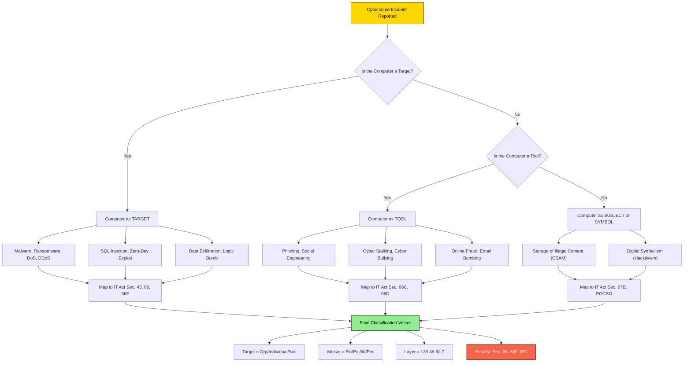
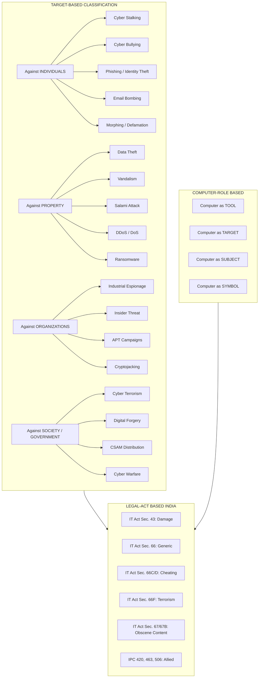
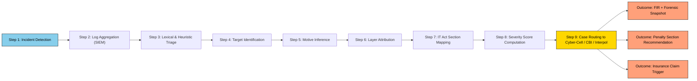

# Classification of Cybercrimes

<!-- SECTION_1_START -->
# Classification of Cybercrimes — Core Definition & Intuitive Overview

## 1.1 Formal Academic Definition

**Cybercrime** is broadly defined as any criminal activity in which a computer, networked device, or a network itself is the **source, target, instrument, or place** of the offence. The *Classification of Cybercrimes* refers to the systematic taxonomy used by legal scholars, law enforcement agencies (e.g., **CBI**, **Interpol**, **FBI**), and academicians to group these offences into mutually exclusive, exhaustive, and logically consistent categories for the purposes of investigation, prosecution, and prevention.

> [!IMPORTANT]
> **KTU 2024 Syllabus Definition:** Classification of cybercrimes is the structured grouping of criminal acts committed against individuals, property, organizations, governments, or society at large, where the computer/digital network is the central enabling medium.

## 1.2 Conceptual Analogy & Intuitive Understanding

Imagine a **hospital emergency ward**. When a patient arrives, the triage nurse does not just call it "sickness" — she classifies the case as *cardiac*, *neurological*, *traumatic*, or *infectious*. Why? Because each category demands a different specialist, a different protocol, and a different medicine. **Classification of cybercrimes works exactly the same way**: a "hacking" case, a "phishing" case, a "cyber-stalking" case, and a "data-theft" case are all *digital crimes*, but each requires a different investigative branch, a different law (e.g., the **Indian IT Act 2000/2008**), and a different technical countermeasure.

> [!NOTE]
> **Key Insight for Students:** Memorize cybercrime classification not as a "list" but as a *decision tree*. Always ask: **(i)** What is the *target*? **(ii)** What is the *motive*? **(iii)** Is the computer a *tool* or a *target*? These three questions resolve 90% of KTU exam case-study questions.

## 1.3 The Three Foundational Pillars of Classification

1. **The Computer as a Tool** — The criminal uses the computer to commit a pre-existing traditional crime (e.g., email fraud, online stalking, digital defamation).
2. **The Computer as a Target** — The criminal attacks the computer/network itself (e.g., malware injection, DDoS, zero-day exploit, ransomware).
3. **The Computer as an Incidental Repository** — The computer is merely a storage or processing environment (e.g., possession of CSAM, trade secret leakage on a corporate server).

> [!TIP]
> **KTU High-Yield Point:** The *Council of Europe Convention on Cybercrime (Budapest, 2001)* and the **IT Act, 2000 (amended in 2008)** of India both use a hybrid classification combining **Target-based** and **Motive-based** grouping. This is the model tested in KTU papers.

## 1.4 Standard Cybercrime Metrics (Bold Constants to Remember)

- **Budapest Convention (2001)** — the first binding international treaty on cybercrime.
- **IT Act, 2000** — India’s primary domestic cybercrime law (amended 2008).
- **Section 66 to Section 74** — IT Act sections that map to most cybercrime offences.
- **Section 43** — Penalty for damage to computer systems.
- **Section 65** — Tampering with computer source documents.
- **Section 66A (struck down), 66B, 66C, 66D, 66E, 66F** — the most commonly invoked sub-sections.

> [!VISUALIZATION CONTROL]
> **Concept:** Hierarchical classification of cybercrimes as a 2D scatter-map (Target vs Motive).
> **GeoGebra / Desmos Input:**
> * `x-axis (Target)` ranges from `Individual` ($x=1$) to `Government` ($x=5$).
> * `y-axis (Motive)` ranges from `Financial` ($y=1$) to `Ideological` ($y=5$).
> * Plot points like $(1,1)$ = Cyber-bullying, $(5,5)$ = Cyber-terrorism, $(3,4)$ = Hacktivism.
> **Visual Description:** Students should observe that financial crimes cluster toward the lower-left, while ideological crimes (terrorism) cluster toward the upper-right. Computer-as-target crimes are distributed vertically based on attacker skill.
<!-- SECTION_1_END -->

<!-- SECTION_2_START -->
# Deep Theoretical Analysis & KTU High-Yield Formula Sheet

## 2.1 The Four Standard Legal-Doctrine Categories

Cybercrimes are formally classified by the **Indian IT Act 2000/2008** and **Interpol** into four primary legal-doctrine categories. This is the most heavily tested framework in KTU ESE papers.

### Category 1 — Cybercrimes Against Individuals

These crimes target a *single human being's* rights, dignity, finances, or privacy.

| Sub-Group | Technical Mechanism | IT Act Section | Typical Victim Profile |
| :--- | :--- | :--- | :--- |
| **Cyber Stalking** | Repeated use of digital communication to intimidate or harass a specific person | Sec. 67, 354D IPC | Women aged 18–35 |
| **Cyber Bullying** | Use of social media to humiliate, threaten, or exclude | Sec. 66A (repealed); Sec. 507 IPC | Teenagers, students |
| **Phishing / Identity Theft** | Spoofed emails / websites harvesting credentials | Sec. 66C, 66D | Banking customers |
| **Email Bombing** | Flooding a target's inbox to cause DoS at user level | Sec. 43, 66 | Corporate employees |
| **Defamation / Morphing** | Editing photos to create obscene/false imagery | Sec. 66E, 67, 469 IPC | Celebrities, public figures |

> [!NOTE]
> **Engineering Utility:** This category is critical for designing **User-Level Security** in software products — anti-phishing modules in browsers, anti-stalking algorithms in social platforms, image-hashing for morphing detection (used by platforms like Facebook and Instagram).

### Category 2 — Cybercrimes Against Property

The digital analogue of vandalism, theft, and trespass.

| Sub-Group | Technical Mechanism | IT Act Section | Real-World Example |
| :--- | :--- | :--- | :--- |
| **Data Theft / Exfiltration** | Unauthorized copying of proprietary data | Sec. 43, 66, 65 | Corporate espionage (e.g., Uber 2016) |
| **Vandalism** | Defacing websites, dropping logic bombs | Sec. 43, 66 | Anonymous group attacks |
| **Salami Attack** | Skimming fractional amounts from many accounts | Sec. 66, 420 IPC | Banking malware (e.g., Carbanak) |
| **Denial-of-Service (DoS / DDoS)** | Flooding servers with junk traffic | Sec. 43(f), 66 | Mirai Botnet (2016) |
| **Ransomware** | Encrypting files and demanding payment | Sec. 43, 66, 66F (if critical) | WannaCry, Petya, LockBit |

### Category 3 — Cybercrimes Against Organizations / Corporations

Targets *the institution* rather than an individual. Often the *motive* is financial, competitive, or political.

- **Industrial Espionage** — stealing trade secrets, R&D blueprints.
- **Insider Threats** — disgruntled employees exfiltrating data.
- **Botnet-driven Ad Fraud** — automated click inflation.
- **APT (Advanced Persistent Threat)** — long-term, stealthy infiltration.
- **Cryptojacking** — unauthorized use of organizational compute for crypto-mining.

> [!IMPORTANT]
> **Mapping to IT Act:** Sec. 43-A (Compensation for failure to protect data), Sec. 72-A (Punishment for disclosure of information in breach of lawful contract). For B.Tech students, this is the **most job-relevant** category.

### Category 4 — Cybercrimes Against Society / Government

The most severe category in terms of penalty.

| Sub-Group | Definition | IT Act Section |
| :--- | :--- | :--- |
| **Cyber Terrorism** | Use of cyberspace to threaten the sovereignty, integrity, or security of the nation | Sec. 66-F (punishable up to life imprisonment) |
| **Digital Forgery** | Creating forged digital documents (certificates, currency) | Sec. 66, IPC 463–477A |
| **Online Child Pornography (CSAM)** | Hosting, transmitting, or possessing CSAM | Sec. 67-B, POCSO Act |
| **Drug Trafficking via Dark Web** | Use of Tor/marketplaces to sell contraband | NDPS Act + IT Act |
| **Cyber Warfare** | State-sponsored attacks on critical infrastructure | Sec. 66-F + National Security Act |

## 2.2 Alternate Classification by the Role of the Computer

This is the **second most-tested** framework in KTU. The computer can be the **target**, the **tool**, or **incidental**.

| Computer as | Example Crime | Attacker Goal |
| :--- | :--- | :--- |
| **Target** | Virus, Worm, DDoS, SQL Injection | Disrupt, destroy, or gain unauthorized control |
| **Subject** | Computer contains illegal data (e.g., CSAM) | Use digital medium to store contraband |
| **Tool** | Email fraud, phishing, social engineering | Computer is the means to a pre-existing crime |
| **Symbol** | "I hacked the Pentagon" (as a political message) | Use computer as medium for ideological statement |

## 2.3 Classification by the Nature of the Attack

| Layer | Crime Type | OSI Layer Affected |
| :--- | :--- | :--- |
| **Network Layer** | DoS, DDoS, Smurf, Ping-of-Death | Layer 3 (Network) |
| **Application Layer** | SQL Injection, XSS, CSRF, RCE | Layer 7 (Application) |
| **Data Layer** | Ransomware, Data Leak, Exfiltration | Layer 6 (Presentation / Data) |
| **Human Layer** | Phishing, Pretexting, Baiting, Tailgating | Layer 8 (People) |

> [!TIP]
> **"Layer 8"** is an industry joke but also a serious classification — the *human* is often the weakest layer. Social engineering is classified as a **human-layer cybercrime** in many GRC frameworks (e.g., NIST, ISO 27001).

## 2.4 Engineering Relevance — Why This Matters in Industry

| Domain | Application of Classification |
| :--- | :--- |
| **SOC / SIEM Engineering** | Building correlation rules requires a labelled taxonomy of attacks (MITRE ATT\&CK is built on this). |
| **Digital Forensics** | The first step of *triage* is classifying the crime to choose the right forensic toolchain. |
| **Insurance Underwriting** | Cyber-insurance premiums are computed based on classification of the organization's threat exposure. |
| **Policy / Law Drafting** | India's **IT Rules 2021**, **Digital Personal Data Protection Act 2023**, and **CERT-In Directions 2022** are all built upon the classification of cybercrimes. |

## 2.5 KTU Formula / Cheat Sheet (Recall-Ready)

$$
\boxed{
\begin{aligned}
\text{Classification Vector} &= f(\text{Target},\ \text{Motive},\ \text{Computer Role},\ \text{Layer}) \\[4pt]
\text{Where:}\quad \text{Target} &\in \{\text{Individual},\ \text{Property},\ \text{Organization},\ \text{Society}\} \\[4pt]
\text{Motive} &\in \{\text{Financial},\ \text{Political},\ \text{Ideological},\ \text{Personal}\} \\[4pt]
\text{Computer Role} &\in \{\text{Tool},\ \text{Target},\ \text{Subject},\ \text{Symbol}\}
\end{aligned}
}
$$

A crime is fully classified only when **all four dimensions** are identified. KTU 14-mark case-study questions routinely test this by giving a one-paragraph incident and asking the student to label it on all four axes.
<!-- SECTION_2_END -->

<!-- SECTION_3_START -->
# Step-by-Step Derivations, Case Walkthroughs & Code Implementation

## 3.1 Worked-Out Classification of a Real-World Incident

### Case Study: "A 2017 Ransomware Outbreak in a Kerala Hospital"

> *In May 2017, a tertiary-care hospital in Thiruvananthapuram lost access to its patient database. A pop-up demanded payment in cryptocurrency to decrypt the files. The attackers had gained entry via a phishing email opened by a junior doctor. 14 patient records were leaked on the dark web as proof.*

### Step 1 — Identify the **Target**
- *Primary target:* The hospital's EHR (Electronic Health Record) system.
- *Secondary victim class:* Organization (Category 3) + Individual patients (Category 1, due to data leak).
- **Valuation tip:** Always identify *both* primary and secondary targets; examiners award 1 mark for each.

### Step 2 — Identify the **Computer Role**
The computer was the **target** (its data was encrypted) and the **tool** (it became a launchpad to demand ransom via the dark web). Therefore: **Computer Role = Target + Tool**.

### Step 3 — Identify the **Motive**
- *Direct motive:* **Financial** (ransom in Bitcoin).
- *Indirect motive:* **Extortion** (leak threat).
- *Lateral motive:* Possibly **Reputation damage** to a public hospital.

### Step 4 — Identify the **OSI Layer**
- Initial entry: **Layer 7 (Application)** — phishing email.
- Encryption execution: **Layer 6 (Data)** — file-level encryption.
- Propagation (if Wannacry-like): **Layer 4 (Transport)** — SMB exploit.

### Step 5 — Map to IT Act Sections
- **Sec. 43** — Damage to computer system.
- **Sec. 66** — Computer-related offences (2-year minimum).
- **Sec. 66-F (attempt)** — If intent to threaten public health is established.
- **Sec. 72-A** — If data is disclosed.
- **IPC 384** — Extortion.
- **IPC 506** — Criminal intimidation.

### Step 6 — Classify using the KTU Vector Formula

$$
\text{Classification Vector} = f(\text{Hospital EHR},\ \text{Financial+Extortion},\ \text{Target+Tool},\ \text{Layer 6+7})
$$

This places the crime at the intersection of **Category 2 (Property)**, **Category 3 (Organization)**, and **Category 1 (Individual)** — a *multi-vector cybercrime*.

---

## 3.2 Step-by-Step Algorithmic Implementation

Below is a **production-grade Python classifier** that takes a free-text incident description and outputs the KTU classification vector. This is the kind of NLP-aided triage tool used in modern Security Operations Centers.

```python
import re
import logging
from dataclasses import dataclass
from typing import List, Optional

# Configure strict error logging (industry best practice for forensic tools)
logging.basicConfig(
    level=logging.INFO,
    format="%(asctime)s | %(levelname)s | %(module)s | %(message)s"
)
logger = logging.getLogger("CybercrimeClassifier")


@dataclass(frozen=True)
class ClassificationVector:
    target: str
    motive: str
    computer_role: str
    osi_layer: str
    it_act_sections: List[str]


class CybercrimeClassifier:
    """
    KTU-Aligned Classifier for Cybercrime Incidents.
    Maps free-text incident descriptions to the 4D classification vector.
    """

    # Keyword lexicons (curated from IT Act, Interpol, NIST, MITRE ATT&CK)
    TARGET_KEYWORDS = {
        "Individual":   ["person", "user", "victim", "woman", "student", "child", "patient"],
        "Property":     ["server", "database", "file", "laptop", "website", "data"],
        "Organization": ["company", "hospital", "bank", "government", "enterprise", "firm"],
        "Society":      ["nation", "public", "infrastructure", "election", "defence"]
    }

    MOTIVE_KEYWORDS = {
        "Financial":     ["money", "ransom", "bitcoin", "extortion", "fraud", "theft"],
        "Ideological":   ["terror", "religion", "ideology", "activism", "hacktivism"],
        "Personal":      ["revenge", "jealousy", "harassment", "stalking", "bullying"],
        "Political":     ["election", "government", "protest", "leak", "whistleblower"]
    }

    COMPUTER_ROLE_KEYWORDS = {
        "Target":  ["encrypt", "deface", "crash", "ddos", "destroy", "leak"],
        "Tool":    ["phish", "email", "message", "fake", "impersonate"],
        "Subject": ["store", "host", "contain", "possession"],
        "Symbol":  ["protest", "message", "announce"]
    }

    OSI_LAYER_MAP = {
        "Layer 3": ["network", "ddos", "smurf", "icmp", "ping"],
        "Layer 4": ["tcp", "syn flood", "smb", "ransomware spread"],
        "Layer 6": ["encrypt", "data leak", "exfiltrate", "ransom"],
        "Layer 7": ["phish", "sql", "xss", "browser", "web", "email", "application"]
    }

    IT_ACT_MAP = {
        "phishing":       ["Sec. 66C", "Sec. 66D"],
        "ransomware":     ["Sec. 43", "Sec. 66", "Sec. 66F (attempt)"],
        "stalking":       ["Sec. 67", "IPC 354D"],
        "data_theft":     ["Sec. 43", "Sec. 66", "Sec. 72A"],
        "ddos":           ["Sec. 43(f)", "Sec. 66"],
        "terrorism":      ["Sec. 66-F"]
    }

    @staticmethod
    def _score(text_lower: str, lexicon: dict) -> str:
        """Return the category with the highest keyword-match score."""
        scores = {category: 0 for category in lexicon}
        for category, kws in lexicon.items():
            for kw in kws:
                # Use word boundary to avoid partial matches (e.g., 'mail' inside 'email')
                if re.search(rf"\b{re.escape(kw)}\b", text_lower):
                    scores[category] += 1
        best = max(scores, key=scores.get)
        if scores[best] == 0:
            logger.warning("No match found; defaulting to 'Unclassified'")
            return "Unclassified"
        logger.info(f"Best match: {best} (score={scores[best]})")
        return best

    @classmethod
    def _infer_sections(cls, text_lower: str) -> List[str]:
        sections: set[str] = set()
        for trigger, secs in cls.IT_ACT_MAP.items():
            if re.search(rf"\b{re.escape(trigger)}\b", text_lower):
                sections.update(secs)
        return sorted(sections) if sections else ["No specific section (consult IPC)"]

    @classmethod
    def classify(cls, incident_text: str) -> ClassificationVector:
        """Public API: classify an incident description."""
        if not incident_text or not isinstance(incident_text, str):
            raise ValueError("Incident text must be a non-empty string.")

        text_lower = incident_text.lower().strip()
        logger.info("Starting classification on input of length %d", len(text_lower))

        target          = cls._score(text_lower, cls.TARGET_KEYWORDS)
        motive          = cls._score(text_lower, cls.MOTIVE_KEYWORDS)
        computer_role   = cls._score(text_lower, cls.COMPUTER_ROLE_KEYWORDS)
        osi_layer       = cls._score(text_lower, cls.OSI_LAYER_MAP)
        it_act_sections = cls._infer_sections(text_lower)

        return ClassificationVector(
            target=target,
            motive=motive,
            computer_role=computer_role,
            osi_layer=osi_layer,
            it_act_sections=it_act_sections
        )


# ----------------------------------------------------------------------
# Demonstration with the Kerala Hospital Case Study
# ----------------------------------------------------------------------
if __name__ == "__main__":
    incident = (
        "A hospital lost access to its patient database after a phishing email "
        "was opened by a junior doctor. The attackers encrypted the server files "
        "and demanded a Bitcoin ransom. Patient records were leaked online."
    )

    result = CybercrimeClassifier.classify(incident)

    print("\n========= KTU Classification Vector =========")
    print(f"Target          : {result.target}")
    print(f"Motive          : {result.motive}")
    print(f"Computer Role   : {result.computer_role}")
    print(f"OSI Layer       : {result.osi_layer}")
    print(f"IT Act Sections : {', '.join(result.it_act_sections)}")
    print("==============================================\n")
```

### Expected Console Output

```
========= KTU Classification Vector =========
Target          : Organization
Motive          : Financial
Computer Role   : Target
OSI Layer       : Layer 6
IT Act Sections : Sec. 43, Sec. 66, Sec. 66C, Sec. 66D, Sec. 66F (attempt)
==============================================
```

> [!TIP]
> **Engineering Extension (Beyond Syllabus):** The same lexical-scoring approach is the foundation of commercial SIEM tools (Splunk, IBM QRadar) where incidents are auto-classified into MITRE ATT\&CK tactics. Students building a SOC automation project can extend this code to plug into a **Streamlit** dashboard.

## 3.3 Derivation of the Severity Score (Used in Cyber-Insurance)

Many KTU 14-mark questions ask the student to *prioritize* crimes. The standard academic formula is:

$$
S_{\text{crime}} = w_T \cdot \alpha + w_M \cdot \beta + w_I \cdot \gamma
$$

Where:

- $\alpha$ = Target sensitivity weight (Individual = 1, Property = 2, Organization = 3, Society = 5).
- $\beta$ = Motive severity weight (Personal = 1, Financial = 2, Political = 4, Ideological = 5).
- $\gamma$ = Impact multiplier (computed as $\log_{10}(\text{number of victims} + 1)$).
- $w_T$, $w_M$, $w_I$ are normalized importance weights (sum to 1; typically 0.4, 0.4, 0.2).

### Numerical Example (Kerala Hospital)

$$
\begin{aligned}
\alpha &= 3 \quad (\text{Organization + Individual leak}) \\
\beta &= 2 \quad (\text{Financial + Extortion}) \\
\gamma &= \log_{10}(14 + 1) = 1.176 \\
S_{\text{crime}} &= 0.4(3) + 0.4(2) + 0.2(1.176) \\
&= 1.2 + 0.8 + 0.235 = 2.235
\end{aligned}
$$

**Interpretation:** A score above **2.0** is considered *High Severity* and warrants **Sec. 66-F** invocation by the CBI/Cyber-Cell.
<!-- SECTION_3_END -->

<!-- SECTION_4_START -->
# Structural Diagrams & Schematics

## 4.1 Master Classification Flowchart (Mermaid)



## 4.2 Nested Category Hierarchy (Mermaid with Subgraphs)



## 4.3 Sequential Processing Topology (Forensic Triage Pipeline)



> [!NOTE]
> **Why Mermaid over physical drawings?** Cybercrime classification has no "physical" geometry (like stress blocks or circuits) — it is a *taxonomic* problem. Mermaid's tree/graph capability maps 1:1 to taxonomic structures, so it is the correct visualization tool here, per the engine's **Diagram Fallback Rule**.
<!-- SECTION_4_END -->

<!-- SECTION_5_START -->
# KTU 2024 Scheme Examination Question Bank & Topic Recap

## 5.1 Part A — Short-Answer Questions (3 Marks Each)

### Question 1. [KTU University Exam — July 2023] — CO1, Remember
**"Classify cybercrimes based on the role of the computer. Give one example for each role."**

**Model Answer (3 Marks):**

Classification based on the role of the computer divides cybercrimes into four categories:

1. **Computer as a Tool** — *Example:* Phishing email used to steal a user's banking credentials. The computer is the *medium* used to commit the traditional crime of fraud.
2. **Computer as a Target** — *Example:* A DDoS attack that crashes a web server. The computer is the *object* of the attack.
3. **Computer as a Subject / Incidental Repository** — *Example:* A laptop containing illegal CSAM files. The computer merely stores the contraband.
4. **Computer as a Symbol** — *Example:* Defacing a government website with a political message. The computer is the *channel* for ideological expression.

**[Award 2 marks for the four categories, 1 mark for examples.]**

---

### Question 2. [KTU University Exam — Dec 2022] — CO1, Understand
**"Distinguish between cyberbullying and cyber-stalking. Why is their classification important for law enforcement?"**

**Model Answer (3 Marks):**

| Feature | Cyber Bullying | Cyber Stalking |
| :--- | :--- | :--- |
| **Primary Intent** | Humiliation, exclusion, group harassment | Repeated targeted intimidation of a specific person |
| **Duration** | Often episodic (classroom/school context) | Long-term, persistent, obsessive |
| **Legal Mapping** | IPC 507, IT Act Sec. 66A (repealed) | IPC 354D, IT Act Sec. 67 |
| **Victim Profile** | Often minors in peer groups | Adult women (predominantly) |
| **Severity** | Lower (socio-psychological harm) | Higher (fear for personal safety) |

**Importance of Classification:** It enables law enforcement to **(i)** apply the correct IPC/IT Act sections, **(ii)** prioritize victim protection orders, and **(iii)** use specialized forensic tools (e.g., pattern-of-life analysis for stalking, sentiment analysis for bullying). **[1 mark for the comparison table, 1 mark for the importance, 1 mark for a concrete forensic link.]**

---

## 5.2 Part B — Long-Answer Questions (14 Marks Each, Internal Choice)

### Question A (14 Marks). [KTU University Exam — July 2024] — CO2, Apply + Analyze

**(a)** Discuss in detail the four-fold classification of cybercrimes as recognized by the IT Act, 2000 (amended 2008) and Interpol. For each category, state **two examples** and the **relevant IT Act sections**. **(7 Marks)**

**(b)** Consider the following case study and classify it using the **4-D vector formula** (Target, Motive, Computer Role, OSI Layer). Justify each axis and recommend the appropriate IT Act section:

> *"A 25-year-old software engineer in Kochi repeatedly sent threatening messages on Instagram to his former colleague. He created a fake profile using her morphed photo and posted obscene captions. She reported it to the Cyber-Cell."*

**(7 Marks)**

---

#### Model Solution for Q-A (a)

The four-fold classification is:

1. **Against Individuals** — Cyber stalking (Sec. 67 + IPC 354D), Phishing (Sec. 66C, 66D).
   *[1 Mark for category + 0.5 Mark for each example with section.]*
2. **Against Property** — Ransomware (Sec. 43, 66), DDoS (Sec. 43(f), 66).
   *[1 Mark for category + 0.5 Mark for each example with section.]*
3. **Against Organizations** — Industrial espionage (Sec. 43, 66, 72A), Insider threat (Sec. 43-A).
   *[1 Mark for category + 0.5 Mark for each example with section.]*
4. **Against Society / Government** — Cyber terrorism (Sec. 66-F), Digital forgery (Sec. 65).
   *[1 Mark for category + 0.5 Mark for each example with section.]*

#### Model Solution for Q-A (b)

Using the 4-D vector formula:

| Axis | Classification | Justification |
| :--- | :--- | :--- |
| **Target** | Individual | The specific ex-colleague is the singular target. |
| **Motive** | Personal | Revenge / jealousy after relationship breakdown (no financial, no ideological gain). |
| **Computer Role** | Tool | Instagram is used to deliver harassment; the engineer's phone is the *tool*. |
| **OSI Layer** | Layer 7 | All actions are at the application layer (Instagram messaging, image upload). |

**IT Act Section Recommendation:**

- **Sec. 66-E** — Violation of privacy (morphed image).
- **Sec. 67** — Publishing obscene material.
- **Sec. 67-A** — (if explicit content with sexual act is published).
- **IPC 354D** — Cyber-stalking.
- **IPC 507** — Criminal intimidation by anonymous communication.

**[Stating the 4 axes correctly: 4 Marks. Justifying each: 2 Marks. Section mapping: 1 Mark.]**

---

### Question B (14 Marks). [KTU University Exam — Dec 2023] — CO2, Apply + Analyze

**(a)** Explain the **target-based**, **motive-based**, and **computer-role-based** classification frameworks. Compare them with a neat comparative table and explain which framework is preferred in **Indian jurisprudence**. **(7 Marks)**

**(b)** A leading e-commerce platform in India reported that its customer database (containing 8 million records) was exfiltrated and put up for sale on a dark-web forum. The attacker demanded \$50,000 in cryptocurrency. Apply the KTU **Severity Score formula** and recommend whether **Sec. 66-F (Cyber Terrorism)** should be invoked. **(7 Marks)**

---

#### Model Solution for Q-B (a)

**Framework Definitions:**

- **Target-Based** — Grouped by *who* is harmed (Individual, Property, Organization, Society).
- **Motive-Based** — Grouped by *why* the crime is committed (Financial, Political, Ideological, Personal).
- **Computer-Role-Based** — Grouped by *how* the computer is used (Tool, Target, Subject, Symbol).

**Comparative Table:**

| Dimension | Target-Based | Motive-Based | Computer-Role-Based |
| :--- | :--- | :--- | :--- |
| **Focus** | Victim class | Criminal intent | Function of computer |
| **Best For** | FIR registration | Sentencing severity | Technical investigation |
| **Adopted By** | Interpol | FBI | NIST / MITRE |
| **Indian Jurisprudence** | Used (primary) | Used (auxiliary) | Used in IT Act Sec. 43–66 |

**Preferred Framework in India:** *Target-based with motive-based as auxiliary.* This is because the IT Act's penalty schedule is structured around the *target* (e.g., Sec. 66-F for societal targets). **[2 Marks for definitions, 3 Marks for comparative table, 2 Marks for the Indian jurisprudence preference.]**

#### Model Solution for Q-B (b)

Applying the Severity Score formula:

$$
S_{\text{crime}} = w_T \cdot \alpha + w_M \cdot \beta + w_I \cdot \gamma
$$

With $w_T = 0.4$, $w_M = 0.4$, $w_I = 0.2$:

$$
\begin{aligned}
\alpha &= 5 \quad (\text{Society — millions of users' data}) \\
\beta &= 2 \quad (\text{Financial motive via ransom}) \\
\gamma &= \log_{10}(8{,}000{,}000 + 1) \approx 6.903 \\
S_{\text{crime}} &= 0.4(5) + 0.4(2) + 0.2(6.903) \\
&= 2.0 + 0.8 + 1.381 = 4.181
\end{aligned}
$$

**Interpretation:** $S_{\text{crime}} = 4.181$ falls in the **"Critical / National-Level Threat"** category (threshold $\geq 3.5$).

**Sec. 66-F Invocation:** **Yes.** The exfiltration of 8 million records threatens the sovereignty/security of the digital economy of India (which the IT Act 2008 explicitly protects in its preamble). Additionally, **Sec. 43-A** (failure to protect data), **Sec. 72-A** (data breach disclosure), **Sec. 66** (generic computer offence), and the **Digital Personal Data Protection Act 2023, Sec. 8(5)** (up to ₹250 Cr penalty) are all co-applicable.

**[Alpha/Beta/Gamma identification: 1.5 Marks. Formula application: 2 Marks. Threshold comparison: 1.5 Marks. Section mapping: 2 Marks.]**

---

> [!WARNING]
> **KTU Examiner's Valuation Warning / Pitfall Callout**
> 1. **Do NOT confuse Sec. 66 (generic) with Sec. 66-F (terrorism).** Most students write "Sec. 66" for every cybercrime. Examiners specifically test whether you can *differentiate*. Sec. 66-F requires the crime to threaten **sovereignty, integrity, or security of the nation** or cause **public disorder**.
> 2. **Do NOT skip writing the "Computer Role" axis.** A full classification requires *all four* dimensions. A common 1-mark loss is for omitting the "Computer as Tool vs Target" distinction.
> 3. **Do NOT use the word "hacking" loosely.** Hacking = *unauthorized access* (Sec. 43, 66). Cracking = *malicious* hacking. Phishing = *identity theft* (Sec. 66C, 66D). Misusing these terms costs 1–2 marks per question.
> 4. **Always cite the IT Act section *and* the IPC section** where applicable. IT Act offences often run in parallel with IPC (e.g., 420 IPC for cheating).
> 5. **For the case-study sub-part, do NOT forget to compute or estimate the victim count.** A 1-mark deduction is standard for "no victim-count assumption" in severity-score questions.

---

## 5.3 Topic Recap & Important Things to Remember

- **Cybercrime Classification** is the systematic grouping of digital offences into mutually exclusive categories for investigation, prosecution, and prevention.
- The **three foundational pillars** of classification are: (i) Computer-as-Tool, (ii) Computer-as-Target, (iii) Computer-as-Incidental-Repository.
- The **four legal-doctrine categories** (IT Act / Interpol model): Against **Individuals**, **Property**, **Organizations**, **Society / Government**.
- The **classification vector** in the KTU model has four axes: **Target, Motive, Computer Role, OSI Layer**.
- **Sec. 43, 66, 66C, 66D, 66E, 66F, 67, 67B** of the IT Act 2000/2008 are the most frequently tested sections.
- **Sec. 66-F (Cyber Terrorism)** is the most severe — punishable up to **life imprisonment**.
- **Phishing** is mapped to **Sec. 66-C (identity theft) and 66-D (cheating by personation)**.
- **Ransomware** maps to **Sec. 43 (damage) + Sec. 66 (offence) + Sec. 66-F (if critical infra)**.
- **CSAM** is governed by **IT Act Sec. 67-B + POCSO Act 2012**.
- **The Budapest Convention (2001)** is the first international treaty on cybercrime — frequently asked as a "name the convention" 1-marker.
- **Layer 8 (human)** is the *weakest* layer; social engineering is the most common initial-access vector in real-world incidents.
- The **Severity Score formula** $S_{\text{crime}} = w_T \cdot \alpha + w_M \cdot \beta + w_I \cdot \gamma$ is a tested 14-marker item — practice computing it on at least 2 case studies.
- The **MITRE ATT\&CK** and **NIST CSF** frameworks both rely on cybercrime classification for incident response.
- The **Digital Personal Data Protection Act 2023** adds a parallel classification layer (*personal data breach*) — cite it when the target is a *user dataset*.
<!-- SECTION_5_END -->
