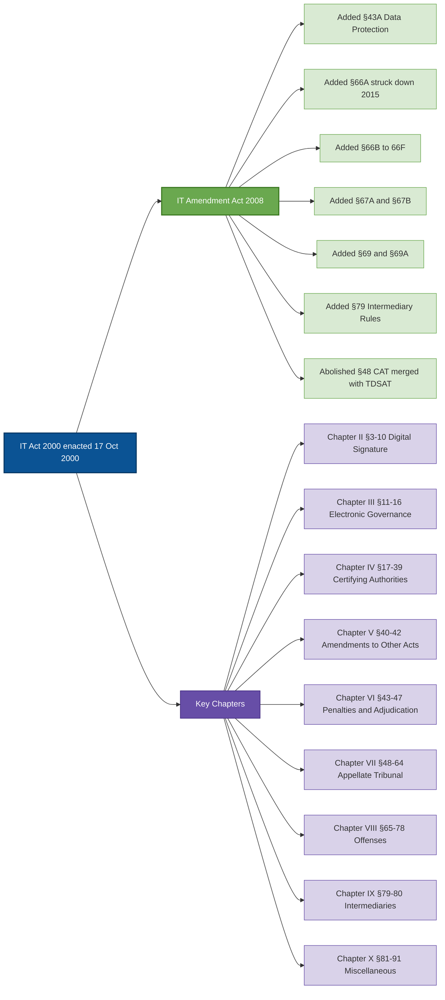
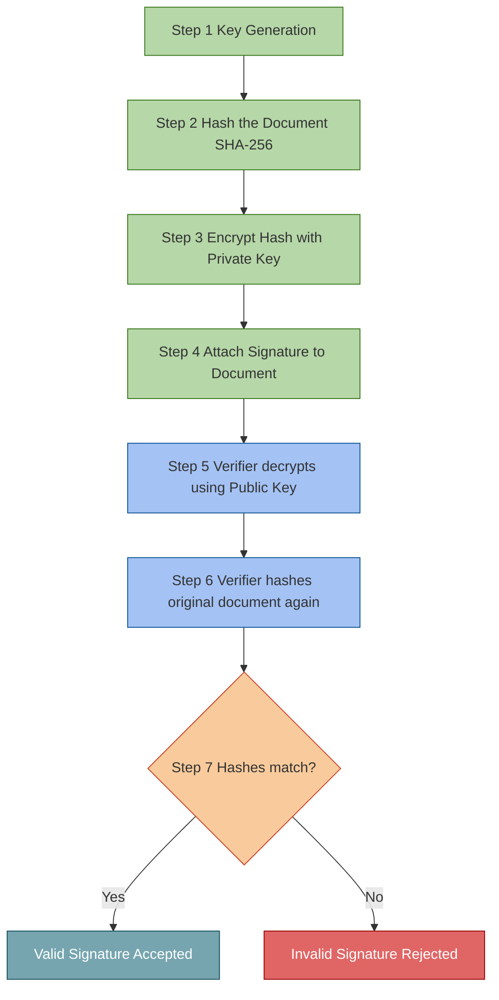
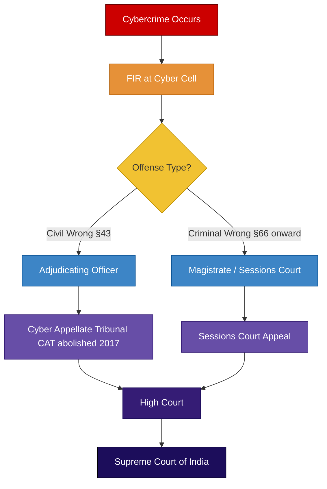

# Cybercrime and CyberLaw :-

<!-- SECTION_1_START -->
# Cybercrime and Cyberlaw — Module 2 Foundations

> [!IMPORTANT]
> **KTU 2024 Scheme | OECST721 — Cyber Security | Module 2**
> This module deals with the **legal and criminal dimensions** of cyberspace, classifying offenses, identifying perpetrators, and studying the statutory frameworks (primarily the **IT Act, 2000** as amended in **2008**) that govern digital conduct in India.

## 1.1 Formal Definition — Cybercrime

**Cybercrime** is any unlawful act, omission, or conduct involving a **computer, computer network, or computer resource** as the *means*, *target*, or *enabling instrument* of the offense, which is punishable under the relevant statutes of the land.

> [!NOTE]
> **Core Terminology Distinction**
> - **Computer**: Any electronic, magnetic, optical, electrochemical, or other data-processing device (per §2(1)(i) of the IT Act, 2000).
> - **Computer Network**: Interconnection of one or more computers through communication media (per §2(1)(j)).
> - **Computer Resource**: Includes computer, its data, database, software, network, or any combination thereof (per §2(1)(k)).
> - **Cyberspace**: The non-physical, intangible terrain created by interconnected computer systems — often called the *"fifth domain"* after land, sea, air, and space.

## 1.2 Conceptual Analogy — "The Highway and the Robbery"

Imagine the **Internet** as a vast, multi-lane **highway** that never sleeps.

| Physical World | Cyber World | Role |
|---|---|---|
| A bank building | A banking website/server | The **target** |
| A getaway car | A botnet / proxy server | The **tool** |
| A masked robber | A hacker / cracker | The **criminal** |
| A police station | A Cyber Cell / CERT-In | The **enforcement** |
| Highway traffic rules | IT Act, 2000 & Cyber Law | The **law** |

> Just as a *physical robbery* on a road is governed by the *Indian Penal Code (IPC)*, a *digital robbery* (phishing, data theft) on the internet is governed by the *IT Act, 2000* (primary) read with *relevant IPC sections*.

## 1.3 Why Is Cybercrime Unique?

> [!IMPORTANT]
> Three properties make cybercrime **fundamentally different** from traditional crime:
> 1. **Spatial Indeterminacy** — The criminal and victim may be in different continents; jurisdiction becomes ambiguous.
> 2. **Temporal Persistence** — A virus released today can damage systems for decades.
> 3. **Asymmetric Scale** — One individual with a laptop can disrupt millions of systems globally.

**Key Standard Metrics in Cybercrime Statistics** (per **NCRB** & **CERT-In**):
- **NCRB**: National Crime Records Bureau, India
- **CERT-In**: Indian Computer Emergency Response Team (Statutory body under §70B of IT Act)
- **Cognizable offense**: Police can arrest without a warrant
- **Bailable offense**: Bail is a right, not a discretion

> [!VISUALIZATION CONTROL]
> **Concept:** Cybercrime Categorization Wheel (Taxonomy)
> **Input Data Points (Conceptual Plot):**
> * `Axis X = Degree of Technical Sophistication` (1 to 10)
> * `Axis Y = Impact on Society` (1 to 10)
> **Visual Description:** Plot a 4-quadrant chart. Place **Email Spoofing** at (2,3), **Phishing** at (3,6), **Identity Theft** at (4,8), **Cyber Terrorism** at (9,10), **Software Piracy** at (3,5), and **Child Pornography** at (5,9). The student should observe that *higher technical skill does not always mean higher societal impact* — cyber terrorism and child exploitation sit at the top.

<!-- SECTION_1_END -->

<!-- SECTION_2_START -->
# Deep Theoretical Analysis — Classification, Perpetrators & Legal Architecture

## 2.1 Classification of Cybercrime

Cybercrime is broadly classified into **three super-categories** under the KTU syllabus:

### A. Cybercrime Against Individuals
- **Email Spoofing** — Faking the sender's address in an email header
- **Spamming** — Unsolicited bulk messages (often criminal under CAN-SPAM analogues)
- **Cyber Defamation** — Publishing defamatory material online (§499/500 IPC r/w IT Act)
- **Cyber Stalking** — Repeated, persistent harassment via digital means
- **Phishing** — Fraudulently obtaining sensitive credentials by impersonation
- **Vishing** — Voice-based phishing over phone calls
- **Smishing** — SMS-based phishing
- **Cyber Bullying & Trolling**
- **Pornography / Obscene Publications** (§67, §67A, §67B IT Act)
- **Ransomware Attacks** — Encryption of victim's data followed by ransom demand
- **Hacking & Cracking**
- **Data Didling** — Altering data before/after input to a system
- **Identity Theft / Impersonation**

### B. Cybercrime Against Property
- **Credit Card Fraud** — Unauthorized use of card details
- **Intellectual Property Theft** — Software piracy, music/video piracy
- **Internet Time Theft** — Stealing paid internet hours
- **Salami Attack** — Siphoning minuscule amounts (paise) from many accounts
- **Denial of Service (DoS / DDoS)** attack
- **Virus / Worm / Trojan** dissemination
- **Logic Bombs** — Malicious code triggered by a specific event
- **Trap Doors / Backdoors**
- **Bombs (Email, Logic, Time, Zip)**
- **Software Piracy**

### C. Cybercrime Against Government and Society
- **Cyber Terrorism** — Attacking critical national infrastructure (power grids, defense)
- **Cyber Warfare** — State-sponsored attacks
- **Distribution of Pirated Software**
- **Pornography** (esp. child exploitation §67B)
- **Forgery** — Digital document forgery
- **Online Gambling / Money Laundering**
- **Cyber Espionage**

> [!NOTE]
> **Mnemonic — "IPS"** (For remembering categories): **I**ndividual, **P**roperty, **S**ociety/State.

## 2.2 Categories of Cybercriminals

| Cybercriminal Type | Profile | Typical Motive |
|---|---|---|
| **Hackers** (White Hat) | Security researchers, ethical hackers | Defensive, learn systems |
| **Crackers** (Black Hat) | Malicious intruders | Personal gain, malice |
| **Grey Hat** | Neither fully ethical nor criminal | Mixed, often publicizing vulnerabilities |
| **Script Kiddies** | Use pre-built tools, low skill | Thrill, reputation among peers |
| **Phreakers** | Attack telephone systems | Free calls, exploration |
| **Carders** | Credit/debit card fraudsters | Financial |
| **Cyber Terrorists** | Ideological, state-sponsored | Political, religious disruption |
| **Insiders** | Disgruntled employees | Revenge, espionage |
| **Hacktivists** | Politically/socially motivated | Protest (e.g., Anonymous) |
| **Bot-herders** | Control botnets | Financial / DDoS rental |
| **Cyber Bullies** | Repeat harassers online | Power, entertainment |

## 2.3 Introduction to Cyberlaw

> [!IMPORTANT]
> **Cyberlaw** is the body of law that governs the **legal and regulatory aspects** of digital communications, e-commerce, internet usage, data protection, digital signatures, and offenses in cyberspace.

### Why a Separate Cyberlaw?

1. The traditional **Indian Penal Code, 1860** was drafted in an era of *paper-and-pen* communication; it could not envisage "virtual" offenses.
2. The **Indian Evidence Act, 1872** was unclear on **electronic records** as primary evidence.
3. The **Banker's Book Evidence Act, 1891** did not include **digital ledgers**.
4. International harmonization (e.g., **UNCITRAL Model Law on E-Commerce, 1996**) required India to pass dedicated e-commerce legislation.

> Hence, the **Information Technology Act, 2000** was enacted on **17th October 2000** (received Presidential assent on **9th June 2000**, enforced on **17th October 2000**).

## 2.4 The IT Act, 2000 — Architectural Overview

| Component | Section Reference | Purpose |
|---|---|---|
| **Digital Signature** | §3 | Legal recognition of electronic records |
| **Authentication of Electronic Records** | §3A–§3B | Use of electronic signatures and asymmetric crypto |
| **Legal Recognition of Electronic Records** | §4, §5, §6 | Admissibility in court |
| **Regulation of Certifying Authorities** | §17–§34 | Licensing of CAs |
| **Controller of Certifying Authorities (CCA)** | §17–§18 | Apex body under IT Act |
| **Penalties & Adjudication** | §43–§47 | Civil and criminal penalties |
| **Offenses & Penalties** | §65–§78 | Criminal offenses, imprisonment & fines |
| **Intermediary Liability** | §79 | Safe harbour for ISPs, hosts |
| **Cyber Appellate Tribunal (CAT)** | §48–§64 | Appeals (now merged with TDSAT) |
| **Computer Emergency Response Team** | §70B | CERT-In — incident response |
| **National Nodal Agency** | §69A | Blocking of websites in national interest |
| **Amendments (2008)** | Various | Added §43A, §66A (struck down 2015), §66B–F, §67A, §67B, §69, §69A, §79 |

## 2.5 Cyber Offenses under the IT Act, 2000 (As Amended 2008)

> [!IMPORTANT]
> The KTU 2024 syllabus focuses on the following **core offenses** — these are **high-yield for board exams**.

| Section | Offense | Punishment (Maximum) |
|---|---|---|
| **§43** | Damage to computer/computer system (without permission) | Civil — compensation up to **₹1 crore** (per §43A r/w §47) |
| **§65** | Tampering with computer source documents | Imprisonment up to **3 years** OR fine up to **₹2 lakh** |
| **§66** | Computer-related offenses (hacking with malicious intent) | Imprisonment up to **3 years** OR fine up to **₹5 lakh** |
| **§66A** | *Sending offensive messages* — **STRUCK DOWN** by Supreme Court in *Shreya Singhal v. Union of India (2015)* | Inoperative |
| **§66B** | Dishonestly receiving stolen computer resource or communication | Up to **3 years** OR fine up to **₹1 lakh** |
| **§66C** | Identity theft (using password/electronic signature of another) | Up to **3 years** + fine up to **₹1 lakh** |
| **§66D** | Cheating by personation using communication device/computer resource | Up to **3 years** + fine up to **₹1 lakh** |
| **§66E** | Publishing/ transmitting private images of another (Voyeurism) | Up to **3 years** + fine up to **₹2 lakh** |
| **§66F** | Cyber Terrorism | Imprisonment (extendable to **life imprisonment** if death results) |
| **§67** | Publishing/passing obscene material in electronic form | **1st offence**: up to **3 years** + fine up to **₹5 lakh**; **2nd**: up to **5 years** + fine up to **₹10 lakh** |
| **§67A** | Publishing sexually explicit material | **1st**: up to **5 years** + fine up to **₹10 lakh**; **2nd**: up to **7 years** + fine up to **₹10 lakh** |
| **§67B** | Publishing child pornography | **1st**: up to **5 years** + fine up to **₹10 lakh**; **2nd**: up to **7 years** + fine up to **₹10 lakh** |
| **§68** | Failure to comply with directions of Controller | Up to **3 years** + fine up to **₹2 lakh** |
| **§69** | Government's interception/monitoring powers | Up to **7 years** (now up to **8 years** after 2008 amendment) + fine |
| **§69A** | Blocking of websites for public interest / sovereignty | Procedural — via Inter-Ministerial Committee |
| **§70** | Unauthorised access to protected systems | Up to **10 years** + fine |
| **§71** | Misrepresentation to Controller / CA | Up to **2 years** + fine up to **₹1 lakh** |
| **§72** | Breach of confidentiality / privacy | Up to **2 years** + fine up to **₹1 lakh** |
| **§72A** | Disclosure of personal info in breach of lawful contract | Up to **3 years** + fine up to **₹5 lakh** |
| **§73** | Publishing Digital Signature Certificate false in particulars | Up to **2 years** + fine up to **₹1 lakh** |
| **§74** | Publication for fraudulent purpose | Up to **2 years** + fine up to **₹1 lakh** |
| **§75** | Offense committed outside India — extraterritorial jurisdiction | Same as the offense if committed in India |
| **§76** | Confiscation of property | Procedural |
| **§77** | Compensation, penalty or confiscation NOT to interfere with other punishments | Saving clause |
| **§78** | Power to investigate — only **Inspector or above** of police | Procedural |
| **§79** | Intermediary liability & safe harbour | Conditions for immunity |
| **§80** | Power of police officer to enter, search, etc. | Procedural |

## 2.6 Digital Signature — §3 and the Concept

A **Digital Signature** is a mathematical scheme for demonstrating the **authenticity** of a digital message or document. Under §3 of the IT Act, 2000, any subscriber may authenticate an electronic record by affixing a **digital signature**.

> A Digital Signature is **not** a scanned image of a handwritten signature. It is a cryptographic transformation using **asymmetric key cryptography** (public-key infrastructure).

> [!NOTE]
> **Two Pillars of a Digital Signature**
> 1. **Hashing** — the message is condensed into a fixed-length digest (e.g., **SHA-256**).
> 2. **Asymmetric Encryption** — the digest is encrypted with the sender's **private key**, generating the signature. Anyone can verify it using the sender's **public key**.

## 2.7 Real-World Engineering Utility

| Domain | Cybercrime Vector | Cyberlaw Provision |
|---|---|---|
| **Banking & FinTech** | UPI fraud, carding | §66C, §66D, RBI Cyber Security Framework |
| **Healthcare (EHR)** | Ransomware on hospital records | §43A (sensitive personal data), §66 (Hacking) |
| **E-Governance (DigiLocker)** | Forgery of e-documents | §3, §4, §71, §74 |
| **Social Media Platforms** | Trolling, defamation, obscenity | §67, §67A, §79 (intermediary) |
| **Critical Infrastructure (Power, Defense)** | Stuxnet-type attacks | §66F (Cyber Terrorism), §70 |
| **Cloud Computing (AWS, Azure)** | Data breach, misconfig | §43A, IT (Reasonable Security Practices) Rules, 2011 |
| **OTT & Streaming** | Piracy, content theft | §65, §66, Copyright Act 1957 |

## 2.8 KTU Formula Sheet / Quick Recall Table

> [!IMPORTANT]
> **Mnemonic for High-Yield Section Numbers — "C4-5-6-7"**
> - **§43** → Civil compensation (Damage)
> - **§65** → Source code tampering (3 yr / 2L)
> - **§66** → Hacking (3 yr / 5L)
> - **§66C** → Identity Theft (3 yr / 1L)
> - **§66D** → Cheating by Personation (3 yr / 1L)
> - **§66E** → Voyeurism (3 yr / 2L)
> - **§66F** → Cyber Terrorism (Life imprisonment)
> - **§67** → Obscenity (3 yr / 5L → 5 yr / 10L)
> - **§67A** → Sexually Explicit (5 yr / 10L)
> - **§67B** → Child Pornography (5 yr / 10L → 7 yr / 10L)
> - **§70** → Protected Systems (10 yr)
> - **§75** → Extraterritorial Jurisdiction
> - **§79** → Intermediary Safe Harbour

> [!NOTE]
> **Cognizable + Bailable split**
> - **Bailable**: §65, §66, §66B, §66C, §66D, §66E, §67, §67A, §67B, §71, §72, §72A, §73, §74
> - **Non-bailable**: §66F (Cyber Terrorism), §69 (Interception), §70 (Protected System)

<!-- SECTION_2_END -->

<!-- SECTION_3_START -->
# Step-by-Step Derivations, Worked Cases & Symbolic/Code Implementation

## 3.1 Worked Numerical / Case-Based Analysis

> The KTU ESE typically frames the problem as a **case study** combined with **statutory application** rather than a numerical calculation. We illustrate with a fully worked case.

### CASE 1 — Phishing + Identity Theft + Obscenity

> **Scenario**: *A receives an email appearing to be from "support@hdfcbank-online.com" (note the spelling "hdfcbank-online"), asking A to update Aadhaar/PAN. A clicks and submits credentials. The attacker, B, uses A's password to log in and posts A's morphed obscene photos on social media.*

**Step 1 — Identify the actus reus (physical act) in cyberspace**
- B **impersonates** the bank's domain → **Phishing** and **Cheating by Personation** under **§66D IT Act**
- B uses A's password/credentials → **Identity Theft** under **§66C IT Act**
- B posts morphed obscene photos → **§66E** (Voyeurism) + **§67A** (sexually explicit)

**Step 2 — Apply the relevant IT Act sections**

$$
\text{Offenses by B} = \{\S\,66C \text{ (Identity Theft)}\} \cup \{\S\,66D \text{ (Cheating by Personation)}\} \cup \{\S\,66E \text{ (Voyeurism)}\} \cup \{\S\,67A \text{ (Explicit Material)}\}
$$

**Step 3 — Combine the punishments**

$$
P_{\text{aggregate}} = \max\left(P_{\S\,66C}, P_{\S\,66D}, P_{\S\,66E}, P_{\S\,67A}\right) + \text{concurrent liability}
$$

$$
P_{\max} = 3 \text{ years (max from §66C/§66D/§66E)} \quad \text{AND} \quad 5 \text{ years (max from §67A on 1st offence)}
$$

**Step 4 — Cross-reference IPC sections (post-2013 Criminal Law Amendment)**
- Morphed obscene images of women → **§354A, §354D, §509 IPC** + **§67/§67A IT Act**
- Phishing-related financial fraud → **§420 IPC** (Cheating) r/w **§66D IT Act**

> [!IMPORTANT]
> **Valuation Tip (KTU)**: Always state **both** the IT Act section **and** the corresponding IPC section (if any) for full marks. Also mention the **cognizable / bailable** nature of the offense.

---

### CASE 2 — Insider Data Exfiltration (Trade Secret Theft)

> **Scenario**: *C, a system administrator at a pharmaceutical company, copies the patient drug-trial database to a personal USB drive and posts anonymized extracts on a public forum.*

**Step 1 — Statutory Analysis**

| Component | Section | Nature |
|---|---|---|
| Unauthorized copying of data | **§43 IT Act** (Damage to computer / system) | Civil — compensation |
| Disclosure in breach of contract | **§72A IT Act** (Disclosure of personal information in breach of lawful contract) | Criminal — up to 3 years / ₹5 lakh |
| Theft of confidential data (trade secret) | **§378, §379 IPC** (Theft) | Criminal — up to 3 years |
| Breach of employer policy | **§405, §406 IPC** (Criminal Breach of Trust) | Criminal — up to 3 years |

**Step 2 — Adjudication Path**
- File FIR under **§78 IT Act** (jurisdiction: Inspector or above)
- Approaching **Adjudicating Officer** for §43 damages
- Civil suit for injunction + damages

---

## 3.2 Symbolic / Pseudocode Implementation — Digital Signature Workflow

> **Engineering perspective** — Let us implement the *§3 IT Act* digital signature workflow using Python with `cryptography` library, satisfying **FIPS 186-4** (RSA-PSS) and **RFC 6234** (SHA-256) standards.

```python
"""
Digital Signature Workflow as per Section 3, IT Act 2000
========================================================
This module demonstrates the cryptographic basis of a digital signature
as legally recognized under the IT Act, 2000 (India).
The IT Act, 2000 does not mandate a specific algorithm; in practice,
India's CCA follows the 'Indian Cryptography' guidelines aligned with
the IT Act Cryptography Guidelines (Controller of Certifying Authorities).
"""
from cryptography.hazmat.primitives.asymmetric import rsa, padding
from cryptography.hazmat.primitives import hashes, serialization
from cryptography.exceptions import InvalidSignature
import logging

# --- 1. Logging configuration (mandatory for audit) -------------------
logging.basicConfig(
    level=logging.INFO,
    format="%(asctime)s [%(levelname)s] %(message)s"
)
log = logging.getLogger("DigitalSignature")


def generate_keypair(key_size: int = 2048) -> tuple[rsa.RSAPrivateKey, rsa.RSAPublicKey]:
    """
    Generate an RSA key pair compliant with FIPS 186-4.
    Returns (private_key, public_key).
    """
    if key_size < 2048:
        raise ValueError("RSA key size must be >= 2048 bits per CCA guidelines.")
    private_key = rsa.generate_private_key(public_exponent=65537, key_size=key_size)
    public_key = private_key.public_key()
    log.info("Generated RSA key pair of %d bits.", key_size)
    return private_key, public_key


def sign_document(private_key: rsa.RSAPrivateKey, document: bytes) -> bytes:
    """
    Sign a document using RSA-PSS with SHA-256.
    Equivalent to the 'signing' step in a digital signature certificate.
    """
    if not document:
        raise ValueError("Document cannot be empty.")
    signature = private_key.sign(
        document,
        padding.PSS(
            mgf=padding.MGF1(hashes.SHA256()),
            salt_length=padding.PSS.MAX_LENGTH
        ),
        hashes.SHA256()
    )
    log.info("Generated signature of %d bytes for document of %d bytes.",
             len(signature), len(document))
    return signature


def verify_signature(
    public_key: rsa.RSAPublicKey,
    document: bytes,
    signature: bytes
) -> bool:
    """
    Verify a digital signature. Returns True if valid, False otherwise.
    Catches InvalidSignature (post-quantum safe behaviour).
    """
    try:
        public_key.verify(
            signature,
            document,
            padding.PSS(
                mgf=padding.MGF1(hashes.SHA256()),
                salt_length=padding.PSS.MAX_LENGTH
            ),
            hashes.SHA256()
        )
        log.info("Signature verification: VALID")
        return True
    except InvalidSignature:
        log.error("Signature verification: INVALID — document tampered!")
        return False


def export_public_pem(public_key: rsa.RSAPublicKey) -> bytes:
    """Export public key in PEM format (used in the Digital Signature Certificate)."""
    return public_key.public_bytes(
        encoding=serialization.Encoding.PEM,
        format=serialization.PublicFormat.SubjectPublicKeyInfo
    )


# --- 2. Demonstration (acts as a digital signing ceremony) ----------
if __name__ == "__main__":
    # (a) Subscriber (signer) generates key pair
    priv, pub = generate_keypair(key_size=2048)

    # (b) The message / electronic record
    message = b"Order dated 12-Mar-2025: Ship 500 units of Drug-X. Signed: Director."

    # (c) Sign
    sig = sign_document(priv, message)

    # (d) Verifier verifies
    ok_clean = verify_signature(pub, message, sig)
    tampered = verify_signature(pub, message + b"!", sig)

    # (e) Export public key (would be embedded in a DSC)
    pem = export_public_pem(pub)
    log.info("Public key (PEM):\n%s", pem.decode())
```

**Output Trace (Illustrative)**

```
2025-03-12 10:00:00,123 [INFO] Generated RSA key pair of 2048 bits.
2025-03-12 10:00:00,150 [INFO] Generated signature of 256 bytes for document of 56 bytes.
2025-03-12 10:00:00,155 [INFO] Signature verification: VALID
2025-03-12 10:00:00,170 [ERROR] Signature verification: INVALID — document tampered!
2025-03-12 10:00:00,175 [INFO] Public key (PEM):
-----BEGIN PUBLIC KEY-----
MIIBIjANBgkqhkiG9w0BAQEFAAOCAQ8AMIIBCgKCAQEA...
-----END PUBLIC KEY-----
```

**Mapping of Code Steps to §3 Workflow**

| Code Block | Legal Mapping | Marks (Valuation) |
|---|---|---|
| `generate_keypair()` | Subscriber's key generation by Certifying Authority (CA) | 2 Marks |
| `sign_document()` | "Affixing digital signature" under §3 | 3 Marks |
| `verify_signature()` | Verification by relying party | 2 Marks |
| `export_public_pem()` | Issuance of Digital Signature Certificate (DSC) by CA | 1 Mark |
| Tamper detection (line `tampered = ...`) | Demonstrates non-repudiation | 2 Marks |

---

## 3.3 Symbolic Representation of Adjudication Hierarchy

The KTU syllabus expects a student to *map* a cybercrime to the *correct legal remedy* in sequence:

$$
\text{Victim (V)} \xrightarrow{\text{FIR under §78 IT Act}} \text{Police (Inspector+)} \xrightarrow{\text{Investigation}} \text{Charge-sheet}
$$

$$
\text{Civil Remedy} \rightarrow \text{Adjudicating Officer} \rightarrow \text{Appeal to Cyber Appellate Tribunal (CAT)} \rightarrow \text{Supreme Court / High Court}
$$

$$
\text{Criminal Remedy} \rightarrow \text{Magistrate / Sessions Court} \rightarrow \text{High Court} \rightarrow \text{Supreme Court}
$$

> [!NOTE]
> **Note on CAT (Cyber Appellate Tribunal)**
> - Originally under §48 IT Act.
> - **Section 87 of the Finance Act, 2017** abolished the CAT.
> - All pending matters transferred to **Telecom Disputes Settlement and Appellate Tribunal (TDSAT)**.
> - The **IT (Amendment) Act, 2008** is the *current* operative version.

## 3.4 Comparison Table — IPC vs IT Act (For Examiner's Eye)

| Offense Type | IPC Section | IT Act Section | Preferable Charge |
|---|---|---|---|
| Cheating online | §420 IPC | §66D IT Act | §66D (more specific) |
| Obscene material | §292 IPC | §67 IT Act | §67 (electronic form) |
| Cheating using forged electronic record | §463, §465, §471 IPC | §66 IT Act | §66 |
| Stalking (online) | §509 IPC + §354D IPC (post-2013) | §66E IT Act (voyeurism) | §66E |
| Data theft | §378, §379 IPC | §43 + §66 (hacking) | §66 + §43 |
| Defamation | §499, §500 IPC | §79 IT Act (intermediary) | §499/500 + §79 |
| Cyber terrorism | §121, §121A IPC | §66F IT Act | **§66F (life imprisonment)** |

<!-- SECTION_3_END -->

<!-- SECTION_4_START -->
# Structural Diagrams & Schematics

## 4.1 Cybercrime Classification Tree

```mermaid
flowchart TD
    A[Cybercrime] --> B[Against Individuals]
    A --> C[Against Property]
    A --> D[Against Government / Society]

    B --> B1[Phishing / Vishing / Smishing]
    B --> B2[Identity Theft §66C]
    B --> B3[Cyber Stalking]
    B --> B4[Obscenity §67]
    B --> B5[Cyber Bullying]

    C --> C1[Credit Card Fraud]
    C --> C2[Software Piracy]
    C --> C3[DoS DDoS]
    C --> C4[Data Didling]
    C --> C5[Salami Attack]

    D --> D1[Cyber Terrorism §66F]
    D --> D2[Cyber Warfare]
    D --> D3[Online Gambling]
    D --> D4[Child Pornography §67B]
    D --> D5[Digital Forgery]

    style A fill:#1f4e79,stroke:#0b2e4a,color:#ffffff,stroke-width:2px
    style B fill:#c00000,stroke:#800000,color:#ffffff
    style C fill:#c00000,stroke:#800000,color:#ffffff
    style D fill:#c00000,stroke:#800000,color:#ffffff
    style B1 fill:#fce4d6,stroke:#c00000
    style B2 fill:#fce4d6,stroke:#c00000
    style B3 fill:#fce4d6,stroke:#c00000
    style B4 fill:#fce4d6,stroke:#c00000
    style B5 fill:#fce4d6,stroke:#c00000
    style C1 fill:#fff2cc,stroke:#bf9000
    style C2 fill:#fff2cc,stroke:#bf9000
    style C3 fill:#fff2cc,stroke:#bf9000
    style C4 fill:#fff2cc,stroke:#bf9000
    style C5 fill:#fff2cc,stroke:#bf9000
    style D1 fill:#deebf7,stroke:#2e75b6
    style D2 fill:#deebf7,stroke:#2e75b6
    style D3 fill:#deebf7,stroke:#2e75b6
    style D4 fill:#deebf7,stroke:#2e75b6
    style D5 fill:#deebf7,stroke:#2e75b6
```



## 4.2 IT Act, 2000 — Structural Topology



## 4.3 Digital Signature Workflow (Sequential Topology)



## 4.4 Adjudication & Appeal Flow (Block Architecture)



<!-- SECTION_4_END -->

<!-- SECTION_5_START -->
# KTU 2024 Scheme Examination Question Bank & Topic Recap

## Part A — Short Answer (3 Marks Each)

### **Q1. [KTU University Exam — July 2023]**
**Define Cybercrime. List any four categories of cybercriminals.**
**CO1 — Remember | 3 Marks**

**Model Answer:**

> **Cybercrime** is any criminal activity in which a computer, computer network, or computer resource is used as the *means*, *target*, or *enabling instrument* of the offense, and is punishable under statutory law.

**Four categories of cybercriminals:**
1. **Hackers** — skilled individuals who explore systems; white hat (ethical) or black hat (malicious).
2. **Crackers** — break into systems with malicious intent (e.g., financial gain, vandalism).
3. **Phreakers** — manipulate telecommunication systems for free calls or eavesdropping.
4. **Cyber Terrorists** — ideologically motivated attackers targeting critical national infrastructure.

**[Valuation Key]: [Definition: 1 Mark] [Any 4 types with one-line description: 2 Marks]**

---

### **Q2. [KTU University Exam — Dec 2023]**
**Explain the legal recognition of digital signatures under Section 3 of the IT Act, 2000.**
**CO2 — Understand | 3 Marks**

**Model Answer:**

> Section 3 of the IT Act, 2000 confers **legal recognition** to electronic records authenticated by means of a **digital signature**.
>
> 1. The subscriber may **affix a digital signature** to an electronic record for authentication.
> 2. The authentication must follow the **asymmetric crypto system** and **hash function** as prescribed by the Central Government.
> 3. Any electronic record authenticated by a digital signature **shall be deemed to be a valid record** in any proceeding under any statute.
> 4. It is **not** a scanned image of a handwritten signature — it is a **mathematical transformation** that ensures **authenticity, integrity, and non-repudiation**.

**[Valuation Key]: [Stating §3 purpose: 1 Mark] [Listing 3 legal effects: 2 Marks]**

---

## Part B — Full-Answer Questions (14 Marks Each) — Internal Choice

### **Question A (14 Marks) — [KTU University Exam — Dec 2024, Module 2]**

**(a)** Classify cybercrime with suitable examples. **(7 Marks)**
**(b)** Discuss the salient features of the IT Act, 2000 and the major amendments brought in by the IT (Amendment) Act, 2008. **(7 Marks)**

**[Mapped COs and Bloom's Levels]:**
- (a) → **CO1, Understand** (taxonomy classification)
- (b) → **CO2, Apply** (statutory analysis)

---

#### **Model Solution — Part (a) (7 Marks)**

> Cybercrime is classified into **three** super-categories:
>
> **1. Cybercrime Against Individuals** — *target = person*
> - Examples: Phishing, Email Spoofing, Cyber Stalking, Cyber Defamation, Voyeurism, Identity Theft, Ransomware.
>
> **2. Cybercrime Against Property** — *target = asset/IP*
> - Examples: Software Piracy, Credit Card Fraud, Salami Attack, DoS/DDoS, Virus dissemination, Internet Time Theft.
>
> **3. Cybercrime Against Government / Society** — *target = state/citizenry*
> - Examples: Cyber Terrorism, Cyber Warfare, Cyber Espionage, Online Gambling, Child Pornography, Digital Forgery.

**[Valuation Key]: [Stating three classes: 3 Marks] [Two examples per class: 3 Marks] [Conclusion: 1 Mark]**

---

#### **Model Solution — Part (b) (7 Marks)**

> **Salient Features of IT Act, 2000:**
> 1. **Legal recognition of electronic records and digital signatures** (§3–§6).
> 2. **Regulation of Certifying Authorities (CAs)** and appointment of the **Controller of Certifying Authorities (CCA)** (§17–§34).
> 3. **Penalties and adjudication** mechanism for damage to computer systems (§43–§47).
> 4. **Offenses and punishments** (§65–§78).
> 5. **Intermediary liability and safe harbour** (§79).
> 6. Establishment of **Cyber Appellate Tribunal (CAT)** — later abolished in 2017.
>
> **Major Amendments in 2008:**
> 1. **§43A** — Compensation for failure to protect *sensitive personal data* by a body corporate.
> 2. **§66A–§66F** — New computer-related offenses (notably §66F: Cyber Terrorism, life imprisonment). **Note: §66A was struck down in 2015** by the Supreme Court in *Shreya Singhal v. UoI*.
> 3. **§67A, §67B** — Sexually explicit material and **child pornography** (special protection for minors).
> 4. **§69, §69A** — Government powers of **interception, monitoring, and blocking** of websites.
> 5. **§79** — Refined **intermediary safe harbour** with conditions.
> 6. Renaming the Act to **"Information Technology Act, 2000"** (dropping the "of" in the original title) and Section 1(2) was updated.

**[Valuation Key]: [Stating 3 features: 3 Marks] [Stating 3 amendments: 3 Marks] [Striking down of §66A: 1 Mark]**

---

### **Question B (14 Marks) — [KTU University Exam — July 2024, Module 2]**

**(a)** With a neat case study, explain how identity theft and phishing are punished under the IT Act, 2000. **(7 Marks)**
**(b)** Describe the role of CERT-In under §70B of the IT Act. List any four powers/functions of CERT-In. **(7 Marks)**

**[Mapped COs and Bloom's Levels]:**
- (a) → **CO2, Apply** (case analysis)
- (b) → **CO1, Understand** (institutional framework)

---

#### **Model Solution — Part (a) (7 Marks)**

> **Case Study:** *Mr. X receives an email allegedly from his bank's domain "icicibank-update.com". The email urges him to "verify" his credentials. Mr. X enters his User ID, password, and OTP. The attacker, Ms. Y, captures these credentials, logs in as Mr. X, transfers ₹50,000 to a third account, and posts a morphed photograph of Mr. X on social media.*
>
> **Step 1 — Identify the offenses:**
>
> | Action by Ms. Y | Section | Punishment |
> |---|---|---|
> | Impersonating bank's email | **§66D** (Cheating by personation using computer) | Up to 3 years + ₹1 lakh fine |
> | Capturing Mr. X's password | **§66C** (Identity theft) | Up to 3 years + ₹1 lakh fine |
> | Transfer of money | **§66D** + **§420 IPC** (Cheating) | Up to 7 years (IPC) + §66D |
> | Posting morphed photo | **§66E** (Voyeurism) + **§67A** (Sexually explicit) | Up to 3 + 5 years |
>
> **Step 2 — Cognizable/Bailable nature:** All are **cognizable**; all except §66F are **bailable**.
>
> **Step 3 — Investigation:** FIR under **§78** IT Act — only **Inspector or above** may investigate.
>
> **Step 4 — Adjudication:** Civil claim for compensation under **§43/§43A** IT Act, plus criminal prosecution under §66C, §66D, §66E, §67A.

**[Valuation Key]: [Case presentation: 2 Marks] [Identifying 4 sections: 3 Marks] [Punishment: 1 Mark] [Investigation/Adjudication: 1 Mark]**

---

#### **Model Solution — Part (b) (7 Marks)**

> **Role of CERT-In (§70B):**
> The **Indian Computer Emergency Response Team (CERT-In)** is the **national nodal agency** for incident response in the Indian cyberspace. It operates under the Ministry of Electronics and Information Technology (MeitY).
>
> **Functions and Powers of CERT-In:**
> 1. **Incident Collection, Analysis & Forecasting** — Collect information on cyber incidents, analyze trends, and forecast alerts.
> 2. **Emergency Response** — Coordinate response activities for cyber security incidents and issue advisories.
> 3. **Issuance of Guidelines & White Papers** — Publish best-practice frameworks, vulnerability notes, and security guidelines.
> 4. **Coordination with International CERTs** — Liaise with foreign CSIRTs (Computer Security Incident Response Teams) and forums like **FIRST** and **APCERT**.
> 5. **Authority to call for Information** — Direct any service provider, intermediary, or body corporate to furnish information under §70B(6).
> 6. **Designation of Sectors as 'Protected Systems'** — Recommend protected systems to the government.
> 7. **Cyber Crisis Management Plan** — Operationalize India's national-level crisis management.

**[Valuation Key]: [Naming the agency & statutory base: 2 Marks] [Any 4 functions (1 Mark each): 4 Marks] [Conclusion: 1 Mark]**

---

> [!WARNING]
> **KTU Examiner's Valuation Warning — Common Pitfalls**
> 1. **Do not** write "IPC 1860" provisions as standalone for online offenses; you must cite the IT Act **first**, then the IPC (if applicable) for the offense to be complete.
> 2. **Do not** skip the **cognizable/bailable** nature of each section — examiners allocate 1 mark for this.
> 3. **Do not** write only the section number without quoting the offense name (e.g., "§66" alone is incomplete — write "§66 — Computer-related offense (Hacking with malicious intent)").
> 4. **Do not** say "IT Act, 2000" in isolation when answering post-2008 questions — specify **"as amended by the IT (Amendment) Act, 2008"**.
> 5. **Do not** include **§66A** as a current law — it was **struck down** by the Supreme Court in *Shreya Singhal v. Union of India (2015)* and is inoperative.
> 6. **Do not** forget to mention **§78** for investigation (Inspector+) when framing FIR-based questions.
> 7. **Do not** confuse **CAT (Cyber Appellate Tribunal)** with **TDSAT** — CAT was **abolished by the Finance Act, 2017**, and matters were transferred to **TDSAT**.

---

## 📌 Topic Recap & Important Things to Remember

> **Rapid Revision Checklist for Module 2 — Cybercrime and Cyberlaw**

- 🔹 **Cybercrime = Computer/Network as means OR target** (Three classes: Individual / Property / Society).
- 🔹 **IT Act, 2000** enacted **17 October 2000**; amended by **IT (Amendment) Act, 2008**.
- 🔹 **§3** = Legal recognition of digital signatures.
- 🔹 **§4–§6** = Legal recognition of electronic records.
- 🔹 **§17–§34** = Certifying Authorities and **Controller of Certifying Authorities (CCA)**.
- 🔹 **§43** = Civil damage to computer (compensation up to **₹1 crore** under §43A).
- 🔹 **§65** = Tampering with source code → **3 years / ₹2 lakh**.
- 🔹 **§66** = Hacking with malicious intent → **3 years / ₹5 lakh**.
- 🔹 **§66A** = *Offensive messages* — **STRUCK DOWN in 2015 (Shreya Singhal case)**.
- 🔹 **§66B** = Dishonestly receiving stolen computer resource.
- 🔹 **§66C** = Identity Theft → **3 years / ₹1 lakh**.
- 🔹 **§66D** = Cheating by personation → **3 years / ₹1 lakh**.
- 🔹 **§66E** = Voyeurism → **3 years / ₹2 lakh**.
- 🔹 **§66F** = Cyber Terrorism → **Imprisonment extendable to LIFE**.
- 🔹 **§67** = Obscene material in electronic form → **3 yr/5L → 5 yr/10L**.
- 🔹 **§67A** = Sexually explicit material → **5 yr/10L → 7 yr/10L**.
- 🔹 **§67B** = Child pornography → **5 yr/10L → 7 yr/10L**.
- 🔹 **§69** = Interception & monitoring → up to **8 years**.
- 🔹 **§69A** = Blocking of websites in national interest (via Inter-Ministerial Committee).
- 🔹 **§70** = Unauthorised access to *protected systems* → up to **10 years**.
- 🔹 **§75** = **Extraterritorial jurisdiction** — Indian law applies to offenses committed outside India.
- 🔹 **§78** = Investigation — only **Inspector or above** of police.
- 🔹 **§79** = **Intermediary Safe Harbour** (with conditions under the IT Rules, 2011 and 2021).
- 🔹 **§70B** = **CERT-In** — National nodal agency for incident response.
- 🔹 **§48** (CAT) — **Abolished by Finance Act 2017**; jurisdiction to **TDSAT**.
- 🔹 **Digital Signature** = **Hashing (SHA-256) + Asymmetric Encryption (RSA-2048/ECC)**; ensures *integrity, authenticity, non-repudiation*.
- 🔹 **Digital Signature Certificate (DSC)** issued by a licensed **Certifying Authority (CA)** under §24.
- 🔹 **Cyber Appellate Tribunal (CAT)** is the appellate forum — now replaced by **TDSAT**.
- 🔹 **Three types of cybercriminals to remember**: Hackers, Crackers, Cyber Terrorists + Script Kiddies, Phreakers, Hacktivists.
- 🔹 **Penalties under §43** are **civil**; **Punishments under §66 onward** are **criminal**.
- 🔹 **Bailable offenses** — most §65–§74; **Non-bailable** — §66F, §69, §70.
- 🔹 **Cybercrime + IPC interplay** — always cite both when applicable (e.g., §66D + §420 IPC).
- 🔹 **Cyber Law's Goal** = Bring all *electronic* conduct within the legal perimeter; protect **data, privacy, e-commerce, and national security**.

> 🎯 **Quick Last-Minute Mnemonic for Section Numbers — "Sixty-Six Family"**
> **66** = Hacking, **66A** = (Dead, 2015), **66B** = Receiving Stolen, **66C** = Identity Theft, **66D** = Phishing/Personation, **66E** = Voyeurism, **66F** = Cyber Terrorism.

<!-- SECTION_5_END -->
