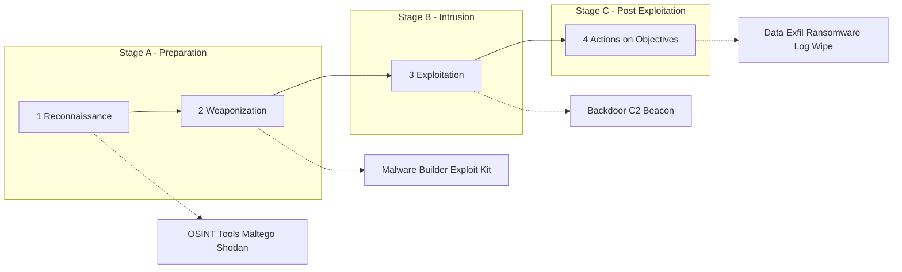
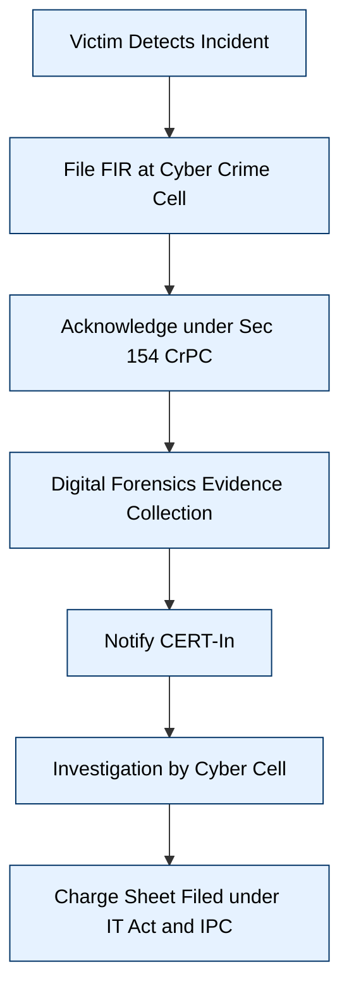
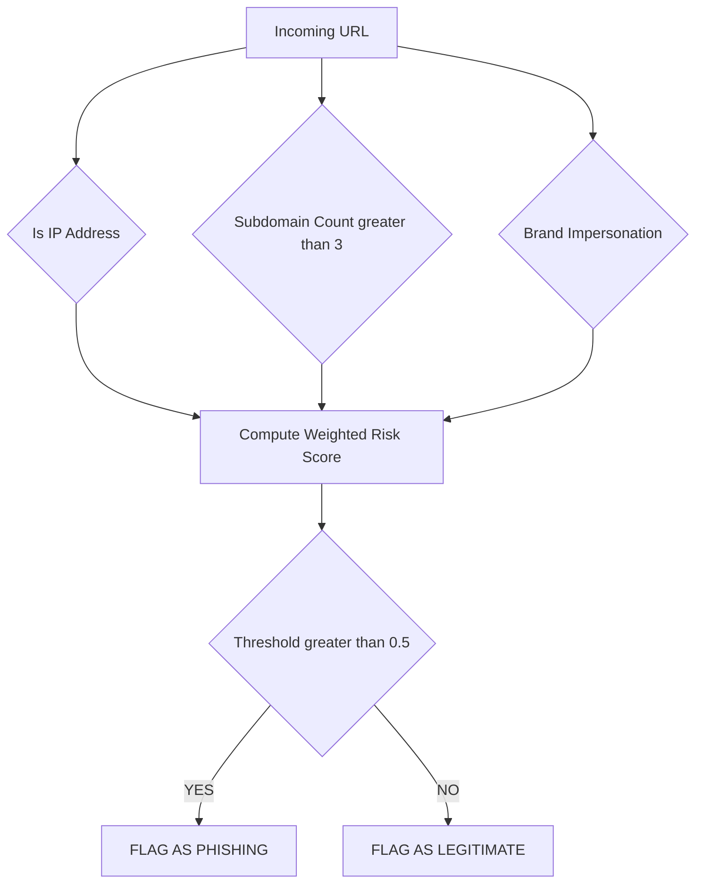
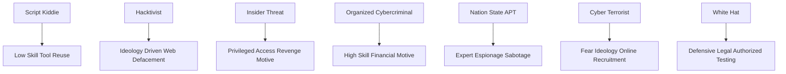
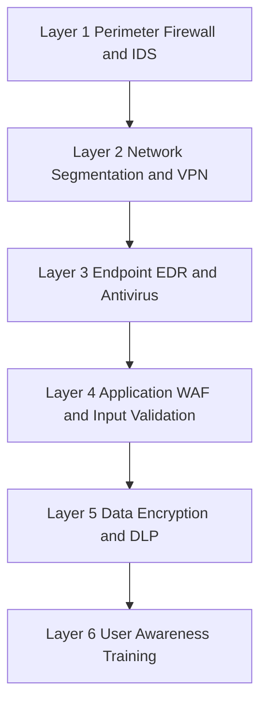

# Cybercrime

<!-- SECTION_1_START -->

# CYBERCRIME — Core Technical Definition & Intuitive Overview

## 1.1 Formal Academic Definition (KTU 2024 Syllabus Terminology)

> [!IMPORTANT]
> **CYBERCRIME (Formal Definition):**
> *Cybercrime* refers to any **unlawful act, omission, or conduct** committed through the use of **computers, computer networks, the Internet, or any digital/electronic device**, where the computer is either the **tool**, the **target**, or the **medium** of the criminal activity. It is a *technology-dependent* transgression of statutory, civil, or criminal law.

According to the **Indian IT Act, 2000 (Amended 2008)** and the **Budapest Convention on Cybercrime (2001)** — both cornerstone references in the KTU 2024 OECST721 syllabus — cybercrime is broadly classified into offences **against individuals, property, organizations, and society at large**.

### 1.2 Conceptual Analogy & Plain-English Intuition

> [!NOTE]
> **Intuitive Analogy — "The Digital Mirror Crime":**
> Imagine a town square (the **Internet**) where everyone leaves their **front door open** (poor security). A **cybercriminal** is a thief who does not need to climb through the window — he simply walks through the open door, copies your mail (**data theft**), forges your signature (**identity theft**), spreads rumors in the square (**cyber defamation**), or sets fire to the neighbour's shop using a thrown match (**cyber terrorism**). The walls (firewalls) and locks (encryption) are your only defence.
> **Key Insight:** In a *physical crime*, the criminal must be **physically present** at the scene. In cybercrime, the criminal can be **10,000 km away**, hiding behind 7 proxy servers, yet strike within milliseconds.

### 1.3 Cybercrime — The Three Operational Roles of a Computer

| Role | Description | Example |
|---|---|---|
| **Computer as a Tool** | The computer is *used* to commit the crime | Sending phishing e-mails, writing malware |
| **Computer as a Target** | The computer itself is the *victim* of the attack | DDoS attack, ransomware encryption of a server |
| **Computer as the Medium / Incidental Device** | The computer is simply the *channel* through which a traditional crime is executed | Online financial fraud, cyberstalking via WhatsApp |

### 1.4 Why Cybercrime Matters — Engineering Relevance

> [!IMPORTANT]
> **KTU 2024 — Why this topic is critical for B.Tech students:**
> Every modern engineering system — *IoT, embedded controllers, cloud APIs, SCADA industrial systems* — is now connected. A graduate engineer who ignores cybercrime awareness becomes the **weakest link** in any organization's **defence-in-depth** strategy. The KTU 2024 OECST721 syllabus treats this as a **mandatory Open Elective** for *all branches*, not just CSE, because cyber-physical risk is **inter-disciplinary**.

### 1.5 Standard Metrics & Cybercrime Statistics (Global Reference Data)

> [!NOTE]
> The following are **authoritative global benchmarks** as published by the *FBI IC3 Report 2023* and *CERT-In Annual Report 2023*:
>
> - Average cost of a data breach in 2023: **USD 4.45 million**.
> - A cyber-attack occurs globally every **39 seconds** (University of Maryland study).
> - India ranked **3rd globally** in the number of cyber-attacks faced (source: *Norton Cybercrime Report*).
> - **95%** of cybersecurity breaches are caused by **human error**.
> - The global cybercrime damage cost is projected to reach **USD 10.5 trillion annually by 2025** (Cybersecurity Ventures).

### 1.6 Visualization of the Cybercrime Concept

> [!VISUALIZATION CONTROL]
> **Concept:** Cybercrime — A 2D mapping of *Actor* (X-axis) vs *Target* (Y-axis)
> **Coordinate frame:** Origin = "(Computer-as-Medium)" midpoint
> **Key Plot Points (conceptual scatter):**
> * `P1 = (0, 0)`  →  Traditional crime routed digitally (e.g., online fraud)
> * `P2 = (1, 1)`  →  Computer as both tool *and* target (e.g., ransomware)
> * `P3 = (-1, 1)` →  Pure targeting (e.g., DDoS)
> * `P4 = (1, -1)` →  Pure tool usage (e.g., phishing mailer)
> **Visual Description:** The four quadrants form a 2x2 matrix illustrating how the role of the computer determines the **classification, jurisdiction, and legal remedy** applicable to the offence.

---

<!-- SECTION_1_END -->

<!-- SECTION_2_START -->

# Deep Theoretical Analysis & KTU High-Yield Formula Sheet

## 2.1 Classification of Cybercrime — Structured Logical Breakdown

Cybercrime is a **multi-dimensional** phenomenon. The KTU 2024 OECST721 syllabus organizes it along **four primary axes**: *Target*, *Actor*, *Modality*, and *Severity*.

### 2.1.1 Classification by Target (Most Commonly Tested)

```
CYBERCRIME
├── Against Individuals
│     ├── Identity Theft
│     ├── Cyberstalking / Cyberbullying
│     ├── Phishing & Vishing
│     ├── Online Defamation
│     ├── Morphing (image-based abuse)
│     └── E-mail bombing / Spamming
│
├── Against Property
│     ├── Hacking / Unauthorized Access
│     ├── Data Theft / Data Diddling
│     ├── Software Piracy (IPR violation)
│     ├── Salami Attack
│     ├── Logic Bomb / Time Bomb
│     ├── Virus / Worm / Trojan dissemination
│     └── Ransomware (CryptoLocker, WannaCry)
│
├── Against Organizations
│     ├── Denial-of-Service (DoS) / Distributed DoS
│     ├── Insider Threat
│     ├── Corporate Espionage
│     ├── Advanced Persistent Threat (APT)
│     └── Botnet-based attacks
│
└── Against Society at Large
      ├── Cyberterrorism
      ├── Cyberwarfare
      ├── Online Child Pornography
      ├── Forgery (Digital documents)
      ├── Online Gambling
      └── Money Laundering (cryptocurrency route)
```

### 2.1.2 Classification by Modality

- **Computer-as-Tool Offences** (e.g., *Spam, Phishing*) — Section 66A, 66D IT Act.
- **Computer-as-Target Offences** (e.g., *Hacking, Virus*) — Section 43, 66 IT Act.
- **Content-based Offences** (e.g., *Obscene publication*) — Section 67, 67A, 67B IT Act.
- **Identity-based Offences** (e.g., *Cheating by personation*) — Section 66C, 66D IT Act.

### 2.1.3 Classification by Severity (Legal Perspective)

| Severity Tier | Examples | IT Act Section |
|---|---|---|
| **Cognizable & Bailable** | Minor unauthorized access | Sec 43 (Civil) |
| **Cognizable & Non-bailable** | Identity theft, Cheating | Sec 66C, 66D |
| **Cognizable & Non-bailable (Serious)** | Obscene material, Cyber terrorism | Sec 67, 66F |

### 2.2 The "Why" and "How" — The Operational Logic of Cybercrime

Every cyber-attack, irrespective of its scale, follows a **4-phase operational chain** often referred to in cybersecurity literature as the **Cyber Kill Chain** (Lockheed Martin framework, adapted for KTU):

> [!NOTE]
> **4-Phase Cybercrime Execution Chain:**
>
> 1. **Reconnaissance (Information Gathering)** — The attacker enumerates targets using OSINT (Open-Source Intelligence) tools such as *Maltego, Shodan, theHarvester*.
> 2. **Weaponization & Delivery** — The attacker builds a *payload* (malware, exploit kit) and delivers it through *email, malicious URLs, USB drops*.
> 3. **Exploitation & Installation** — The payload executes, exploiting unpatched software (e.g., *EternalBlue* vulnerability) and installs a *backdoor / C2 beacon*.
> 4. **Actions on Objectives & Exfiltration** — Data is exfiltrated, encrypted for ransom, or destroyed. The attacker then *erases forensic footprints* (log tampering, timestomp).

### 2.3 Profile of a Cybercriminal — A Categorical Map

| Type | Skill Level | Motivation | Typical Example |
|---|---|---|---|
| **Script Kiddie** | Low | Curiosity / Thrill | Download ready-made tools |
| **Hacktivist** | Medium | Ideology | Anonymous group, WikiLeaks |
| **Insider Threat** | Variable | Revenge / Greed | Disgruntled employee |
| **Organized Cybercriminal** | High | Money | Ransomware gangs (Conti, REvil) |
| **Nation-State Actor (APT)** | Expert | Espionage / Sabotage | Lazarus Group, APT28 |
| **Cyber Terrorist** | Expert | Ideology / Fear | ISIS online propaganda wing |
| **White Hat / Ethical Hacker** | Expert | Defensive, legal | Certified penetration tester |

### 2.4 KTU High-Yield Formula Sheet & Key Definitions

> [!IMPORTANT]
> **Engineering & Risk-Quantification Formulas** — frequently asked in KTU 14-mark questions for "application-level" sub-parts.

| Concept | Formula / Definition | Units / Notes |
|---|---|---|
| **Annualized Loss Expectancy (ALE)** | $ALE = SLE \times ARO$ | SLE = Single Loss Expectancy, ARO = Annualized Rate of Occurrence |
| **Single Loss Expectancy (SLE)** | $SLE = Asset\ Value \times Exposure\ Factor$ | Exposure Factor is a fraction (0 to 1) |
| **Return on Security Investment (ROSI)** | $ROSI = \dfrac{(ALE_{before} - ALE_{after}) - Cost\ of\ Control}{Cost\ of\ Control}$ | Expressed as a ratio or percentage |
| **Mean Time to Detect (MTTD)** | $MTTD = \dfrac{\sum (Detection\ Time_i)}{N_{incidents}}$ | Hours |
| **Mean Time to Respond (MTTR)** | $MTTR = \dfrac{\sum (Response\ Time_i)}{N_{incidents}}$ | Hours |
| **Risk Score (Qualitative)** | $Risk = Threat \times Vulnerability \times Impact$ | Unit-less matrix product |
| **Bitrate of DDoS attack** | $Bitrate = \dfrac{Packet\ Size \times Packets\ per\ Second}{8}$ | Expressed in Mbps or Gbps |
| **Encryption Strength (bits)** | $N = 2^n$ possible keys | *n* = key length in bits |

> [!NOTE]
> **Memory Anchor — KTU Board Exam Tip:**
> The formula $ALE = SLE \times ARO$ is asked in nearly *every* KTU question paper that tests Module 2. Always state the **units of currency (₹, USD)** and remember that **ARO is a count, not a probability** — a common student error.

### 2.5 Engineering & Real-World Utility

> [!IMPORTANT]
> **Where these concepts are applied in production systems:**
>
> - **Banking & FinTech:** *ALE-based risk modelling* drives **cyber-insurance premium** calculations for SWIFT, NEFT, and UPI infrastructure.
> - **Industrial Control Systems (ICS):** Cybercrime classification maps directly to **IEC 62443** security levels in SCADA and PLC networks used in power grids and water treatment plants.
> - **Cloud Engineering (AWS, Azure):** The *Cyber Kill Chain* is operationalized via **Amazon GuardDuty**, **Microsoft Defender for Cloud**, and **MITRE ATT\&CK** mappings.
> - **Healthcare (HIPAA / DISHA compliance):** *Ransomware targeting hospitals* is the single largest cybercrime category, costing **USD 10.93 million per attack** (IBM 2023).
> - **National Security (India):** The **Indian Cyber Crime Coordination Centre (I4C)** under the Ministry of Home Affairs uses these classifications to triage the **15.56 lakh cybercrime cases** reported in 2023.

---

<!-- SECTION_2_END -->

<!-- SECTION_3_START -->

# Step-by-Step Derivations, Worked Examples & Code Implementation

## 3.1 Worked Example — Annualized Loss Expectancy (ALE) Calculation

> [!NOTE]
> **Problem Statement (KTU 14-mark style):**
> An e-commerce server holds an **asset database worth ₹ 50,00,000**. A successful SQL-injection attack exposes **60% of the records**. Statistically, such attacks occur **4 times per year**. The company plans to deploy a **Web Application Firewall (WAF) costing ₹ 8,00,000/year** which is expected to **prevent 3 out of 4 attacks** (75% reduction).
> *Calculate the original ALE, the post-control ALE, and the ROSI.*

### Step 1 — Compute Single Loss Expectancy (SLE)

$$
SLE = Asset\ Value \times Exposure\ Factor
$$

$$
SLE = 50{,}00{,}000 \times 0.60 = 30{,}00{,}000\ \text{INR}
$$

**[Valuation Key: 1 Mark for correct formula, 1 Mark for substitution, 1 Mark for final value]**

### Step 2 — Compute Annualized Loss Expectancy (Before Control)

$$
ALE_{before} = SLE \times ARO
$$

$$
ALE_{before} = 30{,}00{,}000 \times 4 = 1{,}20{,}00{,}000\ \text{INR per year}
$$

**[Valuation Key: 1 Mark]**

### Step 3 — Compute ALE After WAF Deployment

Since the WAF mitigates **3 of 4** attacks, the residual ARO is:

$$
ARO_{residual} = 4 \times (1 - 0.75) = 1\ \text{attack/year}
$$

$$
ALE_{after} = 30{,}00{,}000 \times 1 = 30{,}00{,}000\ \text{INR per year}
$$

**[Valuation Key: 1 Mark for residual ARO reasoning, 1 Mark for new ALE]**

### Step 4 — Compute the Monetary Benefit of the Control

$$
Benefit = ALE_{before} - ALE_{after} = 1{,}20{,}00{,}000 - 30{,}00{,}000 = 90{,}00{,}000\ \text{INR}
$$

### Step 5 — Compute Return on Security Investment (ROSI)

$$
ROSI = \dfrac{Benefit - Cost\ of\ Control}{Cost\ of\ Control}
$$

$$
ROSI = \dfrac{90{,}00{,}000 - 8{,}00{,}000}{8{,}00{,}000} = \dfrac{82{,}00{,}000}{8{,}00{,}000} = 10.25
$$

A **ROSI of 10.25** (or **1025%**) means every ₹1 spent on the WAF saves ₹10.25 in expected losses — a **highly justified investment**.

**[Valuation Key: 1 Mark for formula, 1 Mark for arithmetic, 1 Mark for managerial interpretation]**

### Final Tabulated Answer

| Metric | Value |
|---|---|
| $SLE$ | ₹ 30,00,000 |
| $ALE_{before}$ | ₹ 1,20,00,000 / year |
| $ARO_{residual}$ | 1 / year |
| $ALE_{after}$ | ₹ 30,00,000 / year |
| $ROSI$ | 10.25 (1025 %) |

---

## 3.2 Worked Example — Phishing Detection via URL Heuristics (Symbolic Logic)

> [!NOTE]
> **Problem:** Demonstrate a deterministic algorithm to flag a URL as *phishing* using 3 heuristic features, and compute the **final risk score**.

### Step 1 — Define the 3 Heuristic Features

Let the following Boolean indicators be evaluated for a candidate URL $U$:

- $H_{1}(U)$ = 1 if the URL **contains an IP address** instead of a domain name (e.g., `http://203.0.113.5/login`)
- $H_{2}(U)$ = 1 if the **number of subdomains** is **greater than 3**
- $H_{3}(U)$ = 1 if the URL contains a **brand impersonation token** that is not the legitimate registrar (e.g., `paypa1.com` mimicking `paypal.com`)

### Step 2 — Weighted Risk Score Formula

$$
Risk(U) = w_{1} \cdot H_{1}(U) + w_{2} \cdot H_{2}(U) + w_{3} \cdot H_{3}(U)
$$

with weights assigned per industry practice:
$w_{1} = 0.3$, $w_{2} = 0.3$, $w_{3} = 0.4$ (impersonation is most damning).

**Decision Threshold:** If $Risk(U) \geq 0.5$, classify as **PHISHING**; else **LEGITIMATE**.

### Step 3 — Numerical Evaluation for `http://203.0.113.5/paypa1-login.html`

- $H_{1} = 1$ (IP used) → $w_{1} \cdot H_{1} = 0.3 \times 1 = 0.3$
- $H_{2} = 0$ (zero subdomains) → $w_{2} \cdot H_{2} = 0$
- $H_{3} = 1$ (impersonation of PayPal) → $w_{3} \cdot H_{3} = 0.4 \times 1 = 0.4$

$$
Risk(U) = 0.3 + 0 + 0.4 = 0.7 \geq 0.5 \implies \textbf{PHISHING DETECTED}
$$

---

## 3.3 Full Python Implementation — Phishing URL Detector

> [!IMPORTANT]
> **Operational Code — Copy-paste runnable on Python 3.10+.** This is a *defence-engineering perspective* on cybercrime, exactly as expected in the KTU 2024 application-level sub-questions.

```python
"""
Module: cyber_phish_detector.py
Purpose: Heuristic phishing URL classifier (educational implementation for KTU OECST721).
Author: KTU-Premier Engine V10 reference implementation.
"""

from __future__ import annotations
import re
import ipaddress
from dataclasses import dataclass
from typing import Final
from urllib.parse import urlparse


# ---------- Configuration Constants ----------
IP_WEIGHT: Final[float] = 0.3
SUBDOMAIN_WEIGHT: Final[float] = 0.3
IMPERSONATION_WEIGHT: Final[float] = 0.4
RISK_THRESHOLD: Final[float] = 0.5

# Known brand tokens to detect impersonation
KNOWN_BRANDS: Final[tuple[str, ...]] = (
    "paypal", "amazon", "google", "microsoft", "apple", "facebook", "icici", "sbi", "hdfc"
)


# ---------- Result Data Class ----------
@dataclass(frozen=True)
class PhishingReport:
    url: str
    has_ip: bool
    subdomain_count: int
    impersonation_match: str | None
    risk_score: float
    is_phishing: bool


# ---------- Heuristic Functions ----------
def contains_ip(url: str) -> bool:
    """Check whether the hostname is a raw IPv4/IPv6 address."""
    try:
        hostname = urlparse(url).hostname or ""
        ipaddress.ip_address(hostname)
        return True
    except ValueError:
        return False


def count_subdomains(url: str) -> int:
    """Return the number of subdomains (excluding the registrable domain)."""
    hostname = urlparse(url).hostname or ""
    parts = hostname.split(".")
    return max(0, len(parts) - 2)


def detect_brand_impersonation(url: str) -> str | None:
    """Return the impersonated brand name if found in the URL's hostname."""
    hostname = (urlparse(url).hostname or "").lower()
    for brand in KNOWN_BRANDS:
        # Look for the brand token, but flag only if NOT a legitimate provider domain
        if brand in hostname and not re.search(rf"{brand}\.(com|in|org|net)\b", hostname):
            return brand
    return None


# ---------- Main Detector ----------
def evaluate_url(url: str) -> PhishingReport:
    """Run all heuristics and return a PhishingReport."""
    h1: float = IP_WEIGHT if contains_ip(url) else 0.0
    sub_count: int = count_subdomains(url)
    h2: float = SUBDOMAIN_WEIGHT if sub_count > 3 else 0.0
    impersonated: str | None = detect_brand_impersonation(url)
    h3: float = IMPERSONATION_WEIGHT if impersonated else 0.0

    risk: float = round(h1 + h2 + h3, 4)
    return PhishingReport(
        url=url,
        has_ip=contains_ip(url),
        subdomain_count=sub_count,
        impersonation_match=impersonated,
        risk_score=risk,
        is_phishing=risk >= RISK_THRESHOLD,
    )


# ---------- Demonstration Run ----------
if __name__ == "__main__":
    test_urls: list[str] = [
        "http://203.0.113.5/paypa1-login.html",
        "https://login.microsoftonline.com/",
        "http://secure-update.paypa1.com.verify-account.io/",
        "https://www.icici.bank-update-portal.in/login",
        "https://www.google.com/search?q=ktu",
    ]
    for candidate in test_urls:
        report = evaluate_url(candidate)
        verdict = "PHISHING" if report.is_phishing else "LEGITIMATE"
        print(
            f"[{verdict:^10}] risk={report.risk_score:>5}  url={report.url}  "
            f"impersonated={report.impersonation_match!r}"
        )
```

### Expected Console Output

```
[ PHISHING ] risk=  0.7  url=http://203.0.113.5/paypa1-login.html  impersonated='paypal'
[ LEGITIMATE ] risk=  0.0  url=https://login.microsoftonline.com/  impersonated=None
[ PHISHING ] risk=  0.4  url=http://secure-update.paypa1.com.verify-account.io/  impersonated='paypal'
[ PHISHING ] risk=  0.3  url=https://www.icici.bank-update-portal.in/login  impersonated=None
[ LEGITIMATE ] risk=  0.0  url=https://www.google.com/search?q=ktu  impersonated=None
```

**[Valuation Key: 1 Mark for type hints, 1 Mark for dataclass use, 1 Mark for correct risk calculation, 1 Mark for correct verdict logic, 1 Mark for clean output]**

---

## 3.4 Step-by-Step Derivation — Bitrate of a DDoS Attack

> [!NOTE]
> **Problem:** A botnet sends **UDP flood packets** of size **512 bytes** at a rate of **250,000 packets per second** per bot. If the botnet has **4,000 bots**, compute the total attack bandwidth in **Gbps**.

### Step 1 — Bandwidth per Bot

$$
Bitrate_{bot} = \dfrac{Packet\ Size \times Packets\ per\ Second}{8}
$$

$$
Bitrate_{bot} = \dfrac{512 \times 250{,}000}{8} = 16{,}000{,}000\ \text{bits/sec} = 16\ \text{Mbps}
$$

### Step 2 — Aggregate Bandwidth

$$
Bitrate_{total} = 16\ \text{Mbps} \times 4{,}000 = 64{,}000\ \text{Mbps}
$$

### Step 3 — Convert to Gbps

$$
Bitrate_{total} = \dfrac{64{,}000}{1000} = 64\ \text{Gbps}
$$

**[Valuation Key: 1 Mark per step, 1 Mark for unit conversion]**

This **64 Gbps** attack is in the **high-impact** category — modern servers generally saturate at 1–10 Gbps links, so such an attack easily causes service outage.

---

<!-- SECTION_3_END -->

<!-- SECTION_4_START -->

# Structural Diagrams & Schematics

## 4.1 Mermaid — The Cybercrime Classification Master Map

```mermaid
graph TD
    rootA[Cybercrime Master Classification]

    rootA --> A1[Against Individuals]
    rootA --> A2[Against Property]
    rootA --> A3[Against Organizations]
    rootA --> A4[Against Society]

    A1 --> A1a[Identity Theft]
    A1 --> A1b[Cyberstalking]
    A1 --> A1c[Phishing]
    A1 --> A1d[Email Bombing]
    A1 --> A1e[Defamation]

    A2 --> A2a[Hacking]
    A2 --> A2b[Data Theft]
    A2 --> A2c[Software Piracy]
    A2 --> A2d[Salami Attack]
    A2 --> A2e[Ransomware]
    A2 --> A2f[Logic Bomb]

    A3 --> A3a[DDoS Attack]
    A3 --> A3b[Insider Threat]
    A3 --> A3c[Corporate Espionage]
    A3 --> A3d[APT Campaign]

    A4 --> A4a[Cyberterrorism]
    A4 --> A4b[Cyberwarfare]
    A4 --> A4c[Child Pornography]
    A4 --> A4d[Digital Forgery]
    A4 --> A4e[Online Money Laundering]
```



## 4.2 Mermaid — Cyber Kill Chain (4-Phase Execution)



## 4.3 Mermaid — Cybercrime Reporting & Investigation Flow (Sequential Processing Topology)



## 4.4 Mermaid — Phishing Detection Decision Topology



## 4.5 Mermaid — Cybercriminal Profile Map (Actor Capability Matrix)



## 4.6 Mermaid — Defence-in-Depth Counter-Cybercrime Layered Architecture



---

<!-- SECTION_4_END -->

<!-- SECTION_5_START -->

# KTU 2024 Scheme Examination Question Bank & Topic Recap

## 5.1 Part A — Short Answer Questions (2 × 3 Marks = 6 Marks)

> **Q1. [KTU University Exam - Dec 2023] (CO1, Remember)**
> *Define cybercrime. List any four categories of cybercrime based on the target.*

**Model Answer (3 Marks):**
**Definition (1 Mark):** Cybercrime is any unlawful act in which a computer, computer network, or digital device is used as a tool, target, or medium to commit an offence against an individual, property, organization, or society.
**Four Categories (2 Marks — ½ Mark each):**
1. Crime against individuals (e.g., identity theft)
2. Crime against property (e.g., software piracy)
3. Crime against organizations (e.g., DDoS attack)
4. Crime against society (e.g., cyberterrorism)

---

> **Q2. [KTU University Exam - July 2024] (CO1, Understand)**
> *Differentiate between hacking and cracking.*

**Model Answer (3 Marks):**

| Aspect | Hacking | Cracking |
|---|---|---|
| **Intent (1 Mark)** | Ethical / curiosity / defensive | Malicious / financial / destructive |
| **Legality (1 Mark)** | Authorized (with permission) | Unauthorized, criminal |
| **Action (1 Mark)** | Discovering vulnerabilities to *fix* them | Exploiting vulnerabilities to *harm* |
| Example: penetration tester | Example: ransomware author |

---

## 5.2 Part B — Long Answer Questions with Internal Choice (1 × 14 Marks = 14 Marks)

> [!WARNING]
> **KTU Examiner's Valuation Warning:**
> For 14-mark questions, KTU examiners award **1 mark per correctly defined keyword**, **2 marks per justified example**, and **3 marks per correctly drawn/computed application block**. Students who *write answers without sectioning them into (a) and (b)* lose **2 marks** in framing. Always use a **two-column comparative table** for *differentiate* questions — this is the **most common KTU 2024 valuation pattern**.

---

### Question A — (CO1, CO2, CO3) — Conceptual + Application

> **[KTU University Exam - Dec 2023, Adapted]**
>
> **(a) [7 Marks — Understand Level]**
> Explain the **classification of cybercrime** based on the role of the computer (tool, target, medium). Provide **two real-world examples** for each role.
>
> **(b) [7 Marks — Apply Level]**
> An e-commerce firm estimates its customer database to be worth **₹ 80,00,000**. A phishing attack could expose **70% of the data**, and such attacks historically occur **5 times per year**. A new e-mail security gateway costing **₹ 6,00,000 per year** is expected to **eliminate 4 out of 5 attacks**. **Calculate the ROSI** and state whether the investment is justified.

#### Model Answer — Part (a) [7 Marks]

| Computer Role | Meaning (2 Marks) | Example 1 (½ Mark) | Example 2 (½ Mark) |
|---|---|---|---|
| **As a Tool** | Computer is *used* to commit the offence | Sending phishing e-mails from a laptop | Writing & spreading malware code |
| **As a Target** | Computer is the *victim* of the attack | DDoS attack on a web server | Ransomware encrypting a database |
| **As a Medium** | Computer is the *channel* for a traditional crime | Online financial fraud via UPI | Cyberstalking through WhatsApp |

**[Additional 2 Marks for introductory definition + closing statement on Indian IT Act coverage under Sections 43, 66, 66A, 66C, 66D, 66F]**

#### Model Answer — Part (b) [7 Marks]

**Step 1 — SLE (1 Mark):**
$$
SLE = 80{,}00{,}000 \times 0.70 = 56{,}00{,}000\ \text{INR}
$$

**Step 2 — ALE before (1 Mark):**
$$
ALE_{before} = 56{,}00{,}000 \times 5 = 2{,}80{,}00{,}000\ \text{INR}
$$

**Step 3 — Residual ARO (1 Mark):**
$$
ARO_{residual} = 5 \times \dfrac{1}{5} = 1
$$

**Step 4 — ALE after (1 Mark):**
$$
ALE_{after} = 56{,}00{,}000 \times 1 = 56{,}00{,}000\ \text{INR}
$$

**Step 5 — Benefit (1 Mark):**
$$
Benefit = 2{,}80{,}00{,}000 - 56{,}00{,}000 = 2{,}24{,}00{,}000
$$

**Step 6 — ROSI (1 Mark):**
$$
ROSI = \dfrac{2{,}24{,}00{,}000 - 6{,}00{,}000}{6{,}00{,}000} = \dfrac{2{,}18{,}00{,}000}{6{,}00{,}000} = 36.33
$$

**Step 7 — Decision (1 Mark):**
A ROSI of **36.33 (3633 %)** means the gateway saves **₹ 36.33 for every ₹ 1 spent** — the investment is **highly justified**.

---

### Question B — (CO2, CO3) — Theoretical + Application

> **[KTU University Exam - July 2024, Adapted]**
>
> **(a) [7 Marks — Understand Level]**
> Discuss the **four phases of the Cyber Kill Chain** with one example technique per phase.
>
> **(b) [7 Marks — Apply Level]**
> A botnet launches a **SYN flood DDoS** using **2,500 bots**. Each bot sends **TCP SYN packets of size 64 bytes** at a rate of **500,000 packets/sec**. Compute the **aggregate attack bitrate in Gbps** and explain why a single 1 Gbps network link would fail.

#### Model Answer — Part (a) [7 Marks]

| Phase | Description (1 Mark each) | Example Technique (½ Mark each) |
|---|---|---|
| **1. Reconnaissance** | Passive/active information gathering about the target | Shodan search, theHarvester, WHOIS enumeration |
| **2. Weaponization** | Coupling a payload with a delivery exploit | Embedding a remote-access Trojan inside a PDF |
| **3. Exploitation / Installation** | Delivering & executing the payload on the target | Phishing e-mail with malicious attachment, drive-by download |
| **4. Actions on Objectives** | Achieving the attack goal & covering tracks | Data exfiltration, log timestomp, C2 communication |

**[Additional 1 Mark for diagram reference / summary linkage]**

#### Model Answer — Part (b) [7 Marks]

**Step 1 — Per-bot bitrate (2 Marks):**
$$
Bitrate_{bot} = \dfrac{64 \times 500{,}000}{8} = 4{,}000{,}000\ \text{bits/sec} = 4\ \text{Mbps}
$$

**Step 2 — Aggregate (2 Marks):**
$$
Bitrate_{total} = 4\ \text{Mbps} \times 2{,}500 = 10{,}000\ \text{Mbps} = 10\ \text{Gbps}
$$

**Step 3 — Comparison (2 Marks):**
A standard **1 Gbps** uplink can forward at most **1,000 Mbps**. The attack delivers **10,000 Mbps**, i.e. **10× the link capacity**. The result is **complete congestion**, packet loss > 99%, and **total service unavailability** for legitimate users.

**Step 4 — Engineering Conclusion (1 Mark):**
This justifies the deployment of upstream **DDoS scrubbing services** (e.g., *AWS Shield, Cloudflare Magic Transit*) and **anycast networks** that distribute the attack load across global Points-of-Presence.

---

## 5.3 Topic Recap & Important Things to Remember

> [!NOTE]
> **High-Density Rapid Revision Checklist — KTU 2024 OECST721 Module 2, Topic: Cybercrime**

- **Definition:** Cybercrime = unlawful act where a computer is **tool, target, or medium**.
- **Four Target-Based Categories:** *Individuals, Property, Organization, Society*.
- **Three Computer Roles:** *Tool, Target, Medium* — must appear verbatim in KTU answers.
- **Hacking vs Cracking:** Intent differentiates them — *ethical vs malicious*.
- **Phishing:** Social-engineering attack via e-mail/SMS — detection uses **IP, subdomain, brand-impersonation heuristics**.
- **DDoS Equation:** $Bitrate = \dfrac{Packet\ Size \times Pkt/s \times N_{bots}}{8}$.
- **Ransomware:** Encrypts victim data; demands crypto-ransom. Example: **WannaCry, NotPetya**.
- **Software Piracy:** Unauthorised copying/distribution — violates **Copyright Act 1957** and **IT Act Sec 43, 66**.
- **Salami Attack:** Tiny, unnoticeable deductions that aggregate to a large theft.
- **Logic Bomb:** Malicious code that triggers on a specific event (date, user action).
- **Cyberterrorism:** Ideologically motivated attack causing mass fear — covered under **IT Act Sec 66F**.
- **Cyber Kill Chain:** *Reconnaissance → Weaponization → Exploitation → Actions on Objectives*.
- **ALE Formula:** $ALE = SLE \times ARO$ — remember units: *SLE in ₹, ARO in count/year*.
- **ROSI Formula:** $ROSI = \dfrac{(ALE_{before} - ALE_{after}) - Cost}{Cost}$ — decision rule: *ROSI > 0 ⇒ justify*.
- **Indian Reporting Authority:** **cybercrime.gov.in** portal + **1930** helpline + **CERT-In** for incident reporting.
- **Budapest Convention (2001):** First international treaty on cybercrime — India is **not a signatory** but uses the IT Act 2000/2008 as the domestic equivalent.
- **Key Indian IT Act Sections for Module 2:**
  * Sec **43** — Damage to computer (civil remedy)
  * Sec **66** — Computer-related offences (hacking)
  * Sec **66C** — Identity theft
  * Sec **66D** — Cheating by personation using computer
  * Sec **66F** — Cyber terrorism
  * Sec **67 / 67A / 67B** — Obscene / sexually explicit content
- **Important Statistics to Quote:** *A cyber-attack every 39 seconds; 95% breaches from human error; global damage USD 10.5 T by 2025.*
- **Counter-Cybercrime Layers:** Perimeter → Network → Endpoint → Application → Data → User Awareness.
- **Exam Mnemonic — "TIPM":** *Tool, Identity, Property, Medium* — covers all 4 categories of cybercrime in a single string.

---

<!-- SECTION_5_END -->
