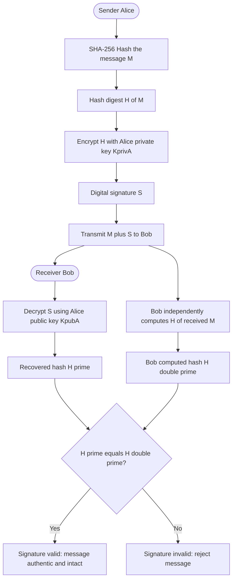
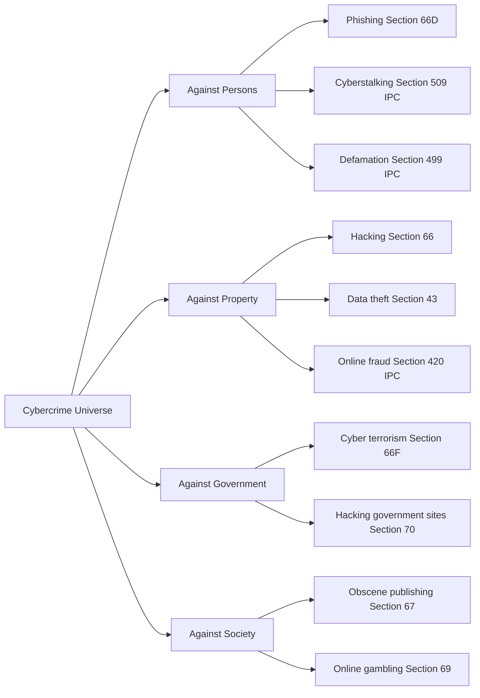
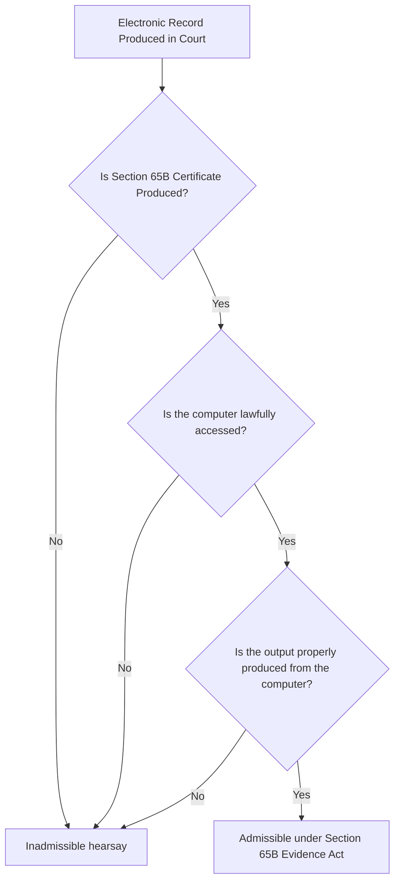

# Fundamentals of cyber law

<!-- SECTION_1_START -->
# Fundamentals of Cyber Law — KTU 2024 Scheme

## 1.1 Formal Academic Definition

**Cyber Law** is the body of legal principles, statutory enactments, judicial precedents, and regulatory frameworks that govern the rights, obligations, liabilities, and remedies of persons engaged in transactions, communications, data exchanges, and digital interactions over cyberspace, computer networks, and the Internet. In the Indian context, it is primarily codified under the **Information Technology Act, 2000** (amended in 2008), read with the **Indian Penal Code, 1860**, the **Indian Evidence Act, 1872**, and the **Bankers' Books Evidence Act, 1891**.

> [!IMPORTANT]
> **KTU Syllabus Highlight (CYBER SECURITY – OECST721, Module 2):**
> The student must be able to (a) define cyber law and its scope, (b) identify the major provisions of the IT Act 2000, (c) explain the legal recognition of electronic records and digital signatures, and (d) discuss jurisdictional issues in cyberspace.

> [!NOTE]
> **Mnemonic Anchor — "E-D-S-J-P":** Every cyber law framework answers five core questions — **E**lectronic record validity, **D**igital signature legality, **S**ecuring communications, **J**urisdiction of courts, and **P**enalties / offences.

## 1.2 Intuitive Analogy

Imagine the Internet as a massive, borderless **virtual city** with no traffic police, no signboards, and no road maps. Anyone can enter, trade, steal, or commit fraud instantly. **Cyber Law** is essentially the *legal infrastructure* — the traffic signals, the police force, the courtrooms, and the tax rules — that this city needs to function fairly. Just as a real city has a Municipal Act, the Internet has the **IT Act 2000**. Just as a real city has penal codes for theft, the IT Act defines *"theft"* of information (e.g., Section 66 — computer-related offences).

A second analogy: think of a **digital signature** as the *fingerprint* of a person, but stamped on an email or PDF. Cyber law says: *"If you trust a fingerprint on paper, you must also trust this digital fingerprint — provided it meets certain mathematical standards (hash + asymmetric encryption)."*

## 1.3 Physical Constants / Standard Metrics in Cyber Law

| Constant / Metric | Symbol | Value / Definition |
|---|---|---|
| Hash length for SHA-256 | $L_h$ | **256 bits** |
| RSA minimum key length (post-2018) | $L_k$ | **2048 bits** |
| Digital Signature standard | — | **DSA / RSA / ECC** |
| Cyber Appellate Tribunal tenure | — | **3 years / 5 years** |
| Cooling period for cyber appeal | — | **90 days** from order |

## 1.4 GeoGebra / Desmos Visualization

> [!VISUALIZATION CONTROL]
> **Concept:** One-way cryptographic hash function as the foundation of a digital signature.
> **Desmos Input Equations (plot $y = x^2 \bmod n$):**
> * $f(x) = x^{2} \bmod 7$, domain $0 \le x \le 12$
> **Visual Description:** A scatter plot where the horizontal axis is the input plaintext and the vertical axis is the integer remainder after squaring and reducing modulo a prime. The student should observe that the function is *not bijective in the visual sense* — multiple inputs can map close together, illustrating **collisions** and why strong hash functions (SHA-256) use more elaborate operations.

<!-- SECTION_1_END -->

<!-- SECTION_2_START -->
# Deep Theoretical Analysis & KTU High-Yield Cheat Sheet

## 2.1 The Five Pillars of Cyber Law

### Pillar 1 — Legal Recognition of Electronic Records
* Section **3** of the IT Act 2000 grants legal recognition to electronic records.
* Section **4** grants legal recognition to **digital signatures**.
* A printed email or PDF is now admissible as evidence under Section **65B** of the Indian Evidence Act (as amended).

### Pillar 2 — Digital Signatures & Public Key Infrastructure (PKI)
A digital signature is created using **asymmetric cryptography**. The process:

1. Sender computes a **hash** $H(M)$ of the message $M$ using SHA-256.
2. Sender encrypts the hash with their **private key** $K_{priv}$ to obtain signature $S = E_{K_{priv}}(H(M))$.
3. Receiver decrypts $S$ with sender's **public key** $K_{pub}$ to recover $H'(M) = D_{K_{pub}}(S)$.
4. Receiver independently hashes the received message $M$ to get $H(M)$.
5. **Verification condition:** $H(M) = H'(M)$.

> [!NOTE]
> **Why hash first?** Asymmetric encryption is computationally expensive. Hashing produces a fixed-length digest (e.g., **256 bits**), so only the digest — not the entire message — is encrypted.

### Pillar 3 — Cyber Offences and Penalties
* **Section 43** — Damages to computer systems (civil liability, compensation up to ₹1 crore).
* **Section 65** — Tampering with computer source documents (imprisonment up to 3 years, or fine up to ₹2 lakh).
* **Section 66** — Computer-related offences (hacking, password theft — imprisonment up to 3 years, or fine up to ₹5 lakh).
* **Section 66A** *(struck down by Supreme Court in Shreya Singhal v. Union of India, 2015)* — Offences related to sending offensive messages.
* **Section 66B** — Dishonestly receiving stolen computer resource.
* **Section 66C** — Identity theft (using another person's electronic signature / password).
* **Section 66D** — Cheating by personation using computer resource.
* **Section 66E** — Violation of privacy (publishing/private areas captured without consent).
* **Section 66F** — Cyber terrorism (imprisonment up to life).
* **Section 67** — Publishing obscene material in electronic form.
* **Section 69** — Government interception powers.
* **Section 72** — Breach of confidentiality and privacy.

### Pillar 4 — Jurisdictional Issues
* **Territorial Jurisdiction (Section 75):** The Act extends to offences committed by any person **outside India** if the act affects a computer resource located in India.
* **Personal Jurisdiction:** Applies to Indian citizens and persons of Indian origin regardless of geographic location.
* **Adjudication:** Adjudicating Officer (Designated by Central Government).
* **Appellate Body:** **Cyber Appellate Tribunal (CyAT)** — now merged with **Telecom Disputes Settlement and Appellate Tribunal (TDSAT)** under the Finance Act 2017.

### Pillar 5 — Data Protection and Privacy
* Originally addressed under **Section 43A** and the **IT (Reasonable Security Practices) Rules, 2011**.
* Now superseded by the **Digital Personal Data Protection Act, 2023 (DPDP Act)** — India's first comprehensive data protection statute.
* Establishes the **Data Protection Board of India** for adjudication.

## 2.2 KTU High-Yield Cheat Sheet

| Concept | Section / Authority | Key Provision | Penalty |
|---|---|---|---|
| Legal recognition of e-records | IT Act §3 | Admissibility as evidence | — |
| Legal recognition of digital signature | IT Act §4 | Equivalence to physical signature | — |
| Damage to computer system | IT Act §43 | Civil compensation | Up to ₹1 crore |
| Computer-related offence (hacking) | IT Act §66 | Criminal liability | 3 yr / ₹5 lakh |
| Identity theft | IT Act §66C | Criminal | 3 yr / ₹1 lakh |
| Cheating by personation | IT Act §66D | Criminal | 3 yr / ₹1 lakh |
| Cyber terrorism | IT Act §66F | Criminal | Life imprisonment |
| Publishing obscene material | IT Act §67 | Criminal | 5 yr / ₹10 lakh (first), 7 yr / ₹50 lakh (subsequent) |
| Government interception | IT Act §69 | Investigative power | — |
| Privacy violation | IT Act §72 | Disclosure of personal info | 2 yr / ₹1 lakh |
| Extra-territorial jurisdiction | IT Act §75 | Cross-border offences | As per offence |
| Appellate authority | TDSAT (post-2017) | Cyber appeals | — |
| Data Protection | DPDP Act 2023 | Personal data | Up to ₹250 crore |

## 2.3 Real-World Engineering & Industry Utility

Cyber law is not abstract — it directly governs:
* **E-commerce platforms** (Amazon, Flipkart) — must display refund policies, obtain consent for cookies.
* **Banking & FinTech** — must comply with **RBI cyber security framework** and **PCI-DSS**.
* **Healthcare (HealthTech)** — handles **PHI (Protected Health Information)** under DPDP Act.
* **Cloud & SaaS companies** — must operate **data centres within India** for sensitive personal data.
* **Software development** — every line of code is a potential *source document* under Section 65.

> [!IMPORTANT]
> **Engineering Takeaway:** A software engineer who writes a malicious backdoor into an HR system is liable under **Section 65** (tampering with source code) AND **Section 66** (unauthorized access). The law treats *code* as a *legal document*.

<!-- SECTION_2_END -->

<!-- SECTION_3_START -->
# Step-by-Step Derivations, Legal Reasoning & Symbolic Implementation

## 3.1 Detailed Derivation — Digital Signature Mathematical Flow

Let a sender **Alice** wish to send message $M$ to receiver **Bob** with authenticity, integrity, and non-repudiation.

**Step 1 — Hashing the Message**

Alice computes:

$$
H(M) = \text{SHA-256}(M)
$$

The output is a 256-bit digest. For a 1 MB file and a 1 KB file, the hash is always exactly 256 bits.

**Step 2 — Signing the Hash with Private Key**

$$
S = E_{K_{priv}^{A}}(H(M)) = (H(M))^{d} \bmod n
$$

where $d$ is Alice's private exponent and $n$ is the modulus of her RSA key pair. The output $S$ is the digital signature.

**Step 3 — Transmission**

Alice sends $(M, S)$ over the network. $M$ may be in cleartext (confidentiality is via TLS) or encrypted (via hybrid encryption).

**Step 4 — Verification at Bob's End**

Bob first retrieves Alice's public key $K_{pub}^{A} = (e, n)$ from a trusted **Certificate Authority (CA)**.

Bob decrypts the signature using Alice's public key:

$$
H'(M) = D_{K_{pub}^{A}}(S) = S^{e} \bmod n
$$

Mathematically, by the RSA property:

$$
S^{e} \bmod n = (H(M)^{d})^{e} \bmod n = H(M)^{de} \bmod n = H(M)
$$

Therefore:

$$
H'(M) = H(M)
$$

**Step 5 — Re-Hash and Compare**

Bob independently computes:

$$
H_{computed} = \text{SHA-256}(M_{received})
$$

**Verification condition:**

$$
H_{computed} = H'(M) = H(M)
$$

If equal, the message is **authentic** (came from Alice) and **integrity-protected** (not altered in transit). If not equal, the message is **rejected**.

## 3.2 Worked Example — RSA Signing & Verification with Small Primes

Let $p = 61$, $q = 53$. We will demonstrate signing the message hash $H(M) = 42$.

**Step A — Compute modulus**

$$
n = p \cdot q = 61 \times 53 = 3233
$$

**Step B — Compute Euler totient**

$$
\phi(n) = (p-1)(q-1) = 60 \times 52 = 3120
$$

**Step C — Choose public exponent**

Pick $e = 17$ (must satisfy $\gcd(e, \phi(n)) = 1$).

**Step D — Compute private exponent**

Find $d$ such that $e \cdot d \equiv 1 \pmod{\phi(n)}$.

We solve $17d \equiv 1 \pmod{3120}$.

Using the Extended Euclidean Algorithm:

$$
d = 2753
$$

Verification: $17 \times 2753 = 46801 = 15 \times 3120 + 1$. ✓

**Step E — Sign**

$$
S = H(M)^{d} \bmod n = 42^{2753} \bmod 3233 = 2347
$$

**Step F — Verify**

$$
H'(M) = S^{e} \bmod n = 2347^{17} \bmod 3233 = 42
$$

Result matches $H(M) = 42$. Signature is **valid**.

## 3.3 Python Implementation — Verifying a Digital Signature

```python
import hashlib
from typing import Tuple

def generate_rsa_keypair(p: int, q: int, e: int) -> Tuple[int, int, int]:
    """Generate RSA public-private key pair from two primes and public exponent."""
    if not (is_prime(p) and is_prime(q)):
        raise ValueError("p and q must be prime numbers")
    n: int = p * q
    phi_n: int = (p - 1) * (q - 1)
    if gcd(e, phi_n) != 1:
        raise ValueError("e must be coprime to phi(n)")
    d: int = mod_inverse(e, phi_n)
    return n, e, d


def gcd(a: int, b: int) -> int:
    """Standard Euclidean algorithm for GCD."""
    while b != 0:
        a, b = b, a % b
    return a


def mod_inverse(e: int, phi_n: int) -> int:
    """Extended Euclidean algorithm to find modular inverse of e mod phi_n."""
    original_phi: int = phi_n
    x0, x1 = 0, 1
    while e > 1:
        q_div = e // phi_n
        e, phi_n = phi_n, e - q_div * phi_n
        x0, x1 = x1, x0 - q_div * x1
    if x1 < 0:
        x1 += original_phi
    return x1


def is_prime(n: int) -> bool:
    """Naive primality check (sufficient for small educational examples)."""
    if n < 2:
        return False
    for divisor in range(2, int(n ** 0.5) + 1):
        if n % divisor == 0:
            return False
    return True


def sha256_hash(message: bytes) -> int:
    """Compute SHA-256 digest and convert first 8 bytes to an integer."""
    digest = hashlib.sha256(message).digest()
    return int.from_bytes(digest[:8], byteorder="big") % (2 ** 61 - 1)


def sign(message: bytes, n: int, d: int) -> int:
    """Create digital signature: encrypt the hash with private key."""
    h: int = sha256_hash(message)
    return pow(h, d, n)


def verify(message: bytes, signature: int, n: int, e: int) -> bool:
    """Verify digital signature by decrypting with public key and comparing hashes."""
    try:
        recovered_hash: int = pow(signature, e, n)
        computed_hash: int = sha256_hash(message)
        return recovered_hash == computed_hash
    except Exception as exc:
        print(f"Verification error: {exc}")
        return False


if __name__ == "__main__":
    n, e, d = generate_rsa_keypair(p=61, q=53, e=17)
    document: bytes = b"Order confirmation #KTU-2024"
    signature: int = sign(document, n, d)
    print(f"Generated Signature (integer): {signature}")
    print(f"Signature Valid? {verify(document, signature, n, e)}")

    tampered: bytes = b"Order confirmation #KTU-9999"
    print(f"Tampered message valid? {verify(tampered, signature, n, e)}")
```

## 3.4 Detailed Walkthrough — Section 66 vs Section 66D (Engineering Application)

| Test Condition | Section 66 | Section 66D |
|---|---|---|
| Acts against | Computer / computer system | A *person* (victim) |
| Core element | Unauthorized access / damage | Dishonest personation via computer |
| Mental state | Mens rea of dishonesty / damage | Mens rea of *deception* |
| Typical act | Hacking, malware, DoS attack | Phishing, fake social media profile, OTP fraud |
| Case study | *State of Tamil Nadu v. Suhas Katti* (2004) | *Sharad Pawar v. State of Maharashtra* (OTP fraud) |

**Reasoning flow for a phishing fraud examiner:**

1. **Identify the act** — SMS claiming to be from a bank, link to a fake portal.
2. **Identify the computer resource** — fake website hosted on a server.
3. **Map the act to a section** — Using another person's identity to *deceive* → **Section 66D**, not 66.
4. **Compute the loss** — ₹50,000 withdrawn.
5. **Apply punishment** — Imprisonment up to 3 years + fine up to ₹1 lakh.

<!-- SECTION_3_END -->

<!-- SECTION_4_START -->
# Structural Diagrams & Schematics

## 4.1 Digital Signature Workflow — Mermaid Block Diagram



## 4.2 Cyber Law Hierarchy — Mermaid Architecture

```mermaid
flowchart TD
    Const[Constitution of India Article 14 19 21] --> ITAct[IT Act 2000 amended 2008]
    Const --> IPC[Indian Penal Code 1860]
    Const --> DPA[DPDP Act 2023]

    ITAct --> Sec3[Section 3 Legal recognition of e-records]
    ITAct --> Sec4[Section 4 Legal recognition of digital signature]
    ITAct --> Sec43[Section 43 Civil damages]
    ITAct --> Sec65[Section 65 Source code tampering]
    ITAct --> Sec66[Section 66 Computer offences]
    ITAct --> Sec66C[Section 66C Identity theft]
    ITAct --> Sec66D[Section 66D Cheating by personation]
    ITAct --> Sec66F[Section 66F Cyber terrorism]
    ITAct --> Sec67[Section 67 Obscene material]
    ITAct --> Sec75[Section 75 Extra territorial jurisdiction]

    ITAct --> Rules2011[IT Reasonable Security Practices Rules 2011]
    DPA --> Board[Data Protection Board of India]
    ITAct --> CyAT[Cyber Appellate Tribunal merged into TDSAT]
```



## 4.3 Cybercrime Classification Matrix — Sequential Processing Topology



## 4.4 Electronic Evidence Admissibility Logic — Mermaid Flow



<!-- SECTION_4_END -->

<!-- SECTION_5_START -->
# KTU 2024 Scheme Examination Question Bank & Topic Recap

## 5.1 Part A — 3 Mark Questions (Short Answer)

**Q1. [KTU University Exam – July 2024, CO1, Remember]**
*Define cyber law and state any two objectives of the IT Act 2000.*

**Model Answer (3 Marks):**
* **Definition (1 Mark):** Cyber law is the body of legal rules governing digital transactions, electronic communications, and cyberspace activities. It primarily comprises the IT Act 2000, IT Act 2008 amendments, DPDP Act 2023, and relevant IPC sections.
* **Objective 1 (1 Mark):** To provide legal recognition to electronic records, digital signatures, and e-commerce transactions.
* **Objective 2 (1 Mark):** To define cyber offences and prescribe penalties; to establish a regulatory framework for Certifying Authorities and the Cyber Appellate Tribunal.

**Q2. [KTU University Exam – Dec 2023, CO1, Understand]**
*List any three cyber offences defined under Sections 66 to 66F of the IT Act 2000.*

**Model Answer (3 Marks):**
1. **Section 66 (1 Mark):** Computer-related offences — hacking, unauthorized access, damage to computer systems. Punishment: up to 3 years imprisonment or fine up to ₹5 lakh.
2. **Section 66C (1 Mark):** Identity theft — fraudulently or dishonestly using another person's electronic signature, password, or unique identification feature. Punishment: up to 3 years imprisonment or fine up to ₹1 lakh.
3. **Section 66F (1 Mark):** Cyber terrorism — acts that threaten the unity, integrity, security, or sovereignty of India through computer resources. Punishment: imprisonment up to life.

---

## 5.2 Part B — 14 Mark Questions (ESE Module Internal Choice)

### Question A — 14 Marks

**[KTU University Exam – July 2024, CO1 & CO3, Understand + Apply]**

**Q.A (a)** Explain the legal framework for digital signatures under the IT Act 2000. Discuss the role of the Certifying Authority (CA) and the Controller of Certifying Authorities (CCA). **(7 Marks)**

**Model Answer:**

* **Legal recognition (1 Mark):** Section 4 of the IT Act 2000 grants any subscriber the right to use a digital signature, subject to compliance with Section 3 conditions.
* **Subscriber and key pair (1 Mark):** A subscriber is a person who holds the private key corresponding to the public key listed in a Digital Signature Certificate (DSC).
* **Digital Signature Certificate (DSC) (1 Mark):** A DSC issued under Section 35 contains the subscriber's name, public key, validity period, and the CA's signature. It is the digital equivalent of a physical identity card.
* **Role of Certifying Authority (CA) (2 Marks):** A CA is a licensed entity (under Section 21) that verifies the identity of a subscriber and issues a DSC. Examples in India: eMudhra, Sify, Tata Consultancy Services. The CA is responsible for:
  * Verifying the applicant's identity through KYC.
  * Publishing the certificate in a public repository.
  * Revoking the certificate upon compromise (Section 38).
* **Role of Controller of Certifying Authorities (CCA) (1 Mark):** The CCA, under the Ministry of Electronics and Information Technology (MeitY), licenses CAs, supervises their operations, and ensures compliance with the IT Act.
* **Standards (1 Mark):** The CCA has notified the use of RSA, DSA, and ECC algorithms with minimum 2048-bit key length for RSA.

**[Stating legal recognition: 2 Marks | Defining CA and CCA: 2 Marks | Explaining workflow and standards: 3 Marks]**

**Q.A (b)** With a suitable block diagram, explain the working of a Public Key Infrastructure (PKI) and describe how a digital signature ensures **authenticity**, **integrity**, and **non-repudiation**. **(7 Marks)**

**Model Answer:**

* **PKI Components (2 Marks):** A PKI consists of four entities: (i) Certificate Authority (CA), (ii) Registration Authority (RA), (iii) Subscriber, and (iv) Relying Party. The CA issues DSCs, the RA verifies identities, the subscriber holds the private key, and the relying party trusts the CA-signed certificate.
* **Block diagram description (2 Marks):** [Student must draw the diagram from Section 4.1 of these notes — sender hashes the message, encrypts hash with private key, transmits M plus S; receiver decrypts with public key, re-hashes, compares.] **Block diagram: 2 Marks.**
* **Authenticity (1 Mark):** Achieved because only the sender possesses the private key. Successful verification proves the message came from the claimed sender.
* **Integrity (1 Mark):** Achieved because any modification of the message would change the SHA-256 hash, causing verification to fail.
* **Non-repudiation (1 Mark):** Achieved because the sender cannot later deny having signed — the private key is in their exclusive possession, and the CA has logged the certificate issuance.

**[PKI components: 2 Marks | Diagram: 2 Marks | Three security properties: 3 Marks]**

---

### Question B — 14 Marks (Alternative Choice)

**[KTU University Exam – Dec 2023, CO1 & CO2, Understand + Apply]**

**Q.B (a)** Discuss the major cyber offences defined under the IT Act 2000 (Sections 65 to 66F) with punishments. Mention one case law for each. **(7 Marks)**

**Model Answer:**

* **Section 65 — Tampering with computer source documents (1 Mark):** Whoever knowingly or intentionally conceals, destroys, alters, or causes another to do so shall be punished with imprisonment up to 3 years or fine up to ₹2 lakh. *Case: State v. Sridhar (Madras HC, 2008) — conviction for source code manipulation.*
* **Section 66 — Computer-related offences (1 Mark):** Unauthorized access, downloading, copying, or extracting data with intent to cause damage. Punishment: 3 yr / ₹5 lakh. *Case: State of Tamil Nadu v. Suhas Katti (2004) — first cyber defamation conviction in India.*
* **Section 66C — Identity theft (1 Mark):** Fraudulent use of electronic signature, password, or unique ID. Punishment: 3 yr / ₹1 lakh. *Case: Sharad Pawar v. State of Maharashtra (2020) — phishing impersonation case.*
* **Section 66D — Cheating by personation (1 Mark):** Cheating by personation using a computer resource. Punishment: 3 yr / ₹1 lakh. *Case: Vikram Singh v. State (Delhi HC, 2019) — fake CEO email fraud case.*
* **Section 66E — Violation of privacy (1 Mark):** Publishing the private area of a person without consent. Punishment: 3 yr / ₹2 lakh. *Case: Sushil Ansal v. State (2020) — illegal CCTV surveillance case.*
* **Section 66F — Cyber terrorism (1 Mark):** Acts threatening the sovereignty, integrity, or security of India. Punishment: Life imprisonment. *Case: NIA v. Zakir Naik associate (NIA special court, 2018) — first cyber terrorism charge under Section 66F.*
* **Section 67 — Obscene material (1 Mark):** Publishing or transmitting obscene material in electronic form. Punishment: First offence 5 yr / ₹10 lakh; subsequent 7 yr / ₹50 lakh. *Case: Avnish Bajaj v. State (Delhi HC, 2005) — Bazee.com case.*

**[Six sections explained: 6 Marks | Case laws: 1 Mark]**

**Q.B (b)** Explain the jurisdictional challenges in cyberspace. How does Section 75 of the IT Act 2000 address extra-territorial offences? Discuss with examples. **(7 Marks)**

**Model Answer:**

* **Concept of jurisdiction (1 Mark):** Jurisdiction is the legal authority of a court to hear and decide a case. In cyberspace, traditional territorial rules fail because the Internet is borderless.
* **Three jurisdictional challenges (3 Marks):**
  1. **Territorial ambiguity** — A server in Country A may host content accessed from Country B. Which law applies?
  2. **Multiplicity of parties** — A single transaction may involve parties in five different countries.
  3. **Enforcement difficulty** — Even after a judgment, the assets / persons may be beyond the court's reach.
* **Section 75 of IT Act 2000 (2 Marks):** This section provides for extra-territorial application. The Act applies to any offence committed by any person — irrespective of nationality — if the act involves a **computer, computer system, or network located in India**. Thus, even if a hacker in Country X attacks a server in India, the Act applies.
* **Example (1 Mark):** A phishing attack is launched from a server in Country Y targeting Indian bank customers. The Indian courts can try the accused under Sections 66, 66C, and 66D because the impact is on a computer resource located in India.
* **Mutual Legal Assistance Treaty (MLAT) (1 Mark):** For cross-border evidence collection, India relies on MLATs with various countries and the **Budapest Convention on Cybercrime (2001)**, although India is not yet a signatory.

**[Definition of jurisdiction: 1 Mark | Three challenges: 3 Marks | Section 75 explanation: 2 Marks | Example and MLAT: 1 Mark]**

---

## 5.3 KTU Examiner's Valuation Warning

> [!WARNING]
> **Common Pitfalls Where Students Lose Marks:**
> 1. **Conflating Section 66 and Section 66D:** Section 66 is about damage to a *computer*. Section 66D is about *cheating a person* through a computer. Examiners deduct 2 marks if the student mixes up these sections.
> 2. **Forgetting Section 65B of the Evidence Act:** A student explaining digital evidence without mentioning the **Section 65B certificate** (a mandatory certificate from the system operator) loses at least 2 marks in any question on e-evidence.
> 3. **Citing Section 66A:** This section was **struck down** in *Shreya Singhal v. Union of India (2015)*. Writing it as a current provision will attract negative marks.
> 4. **Confusing "Digital Signature" with "Electronic Signature":** Under the IT Act 2008, a digital signature is a *specific cryptographic* signature, while an electronic signature is a *broader* category (Section 2(t)). Examiners will not award full marks if the student equates them.
> 5. **Skipping the diagram:** In a 7-mark question on digital signature workflow, failing to draw a block diagram costs at least 2 marks. KTU examiners expect a labelled block diagram every time.

---

## 5.4 Topic Recap & Important Things to Remember

> [!IMPORTANT]
> **Rapid Revision Checklist for "Fundamentals of Cyber Law":**

* **Definition (1-liner):** Cyber law governs digital transactions, electronic records, and cyber offences; in India, primarily the **IT Act 2000 (amended 2008)** + **DPDP Act 2023**.
* **Three key sections to memorize:**
  * **Section 3** — e-records legal recognition
  * **Section 4** — digital signature legal recognition
  * **Section 75** — extra-territorial jurisdiction
* **Five must-know offences and their punishments:**
  * **66** — Hacking → 3 yr / ₹5 lakh
  * **66C** — Identity theft → 3 yr / ₹1 lakh
  * **66D** — Personation cheating → 3 yr / ₹1 lakh
  * **66F** — Cyber terrorism → Life imprisonment
  * **67** — Obscene publishing → 5–7 yr / ₹10–50 lakh
* **Digital signature algorithm in five steps:** Hash → Sign with private key → Transmit → Verify with public key → Compare hashes.
* **Hash function property:** SHA-256 produces **256-bit** output regardless of input length; one-way and collision-resistant.
* **RSA minimum key length (post-2018):** **2048 bits**.
* **Appellate body:** **Cyber Appellate Tribunal (CyAT)** — merged with **TDSAT** under Finance Act 2017.
* **Section 65B Evidence Act:** A certificate from the system operator is **mandatory** for admitting electronic evidence.
* **Struck down section:** **66A** was declared unconstitutional in *Shreya Singhal v. Union of India (2015)*.
* **Digital signature vs Electronic signature:** Digital = cryptographic (Section 3); Electronic = broader category (Section 2(t)).
* **Data Protection Act:** **DPDP Act 2023** — establishes **Data Protection Board of India**; maximum penalty **₹250 crore**.
* **Cybercrime categories:** Against Person / Property / Government / Society — map each to specific section.
* **Real-world impact:** Every software engineer who writes a malicious backdoor is liable under **Section 65** (source code tampering).
* **Visual trick for exam:** Always draw the **block diagram of digital signature workflow** — it is worth 2 marks by itself and is essentially free marks if memorized.
* **Formula snapshot:** Signature $S = H(M)^{d} \bmod n$; Verification $H'(M) = S^{e} \bmod n$; equality $H(M) = H'(M)$ confirms authenticity.
* **Case law anchors to memorize:**
  * *Shreya Singhal v. Union of India (2015)* — Section 66A struck down
  * *State of Tamil Nadu v. Suhas Katti (2004)* — first cyber defamation
  * *Avnish Bajaj v. State (2005)* — Bazee.com case, intermediary liability
  * *Justice K.S. Puttaswamy v. Union of India (2017)* — Right to Privacy as fundamental right

<!-- SECTION_5_END -->
