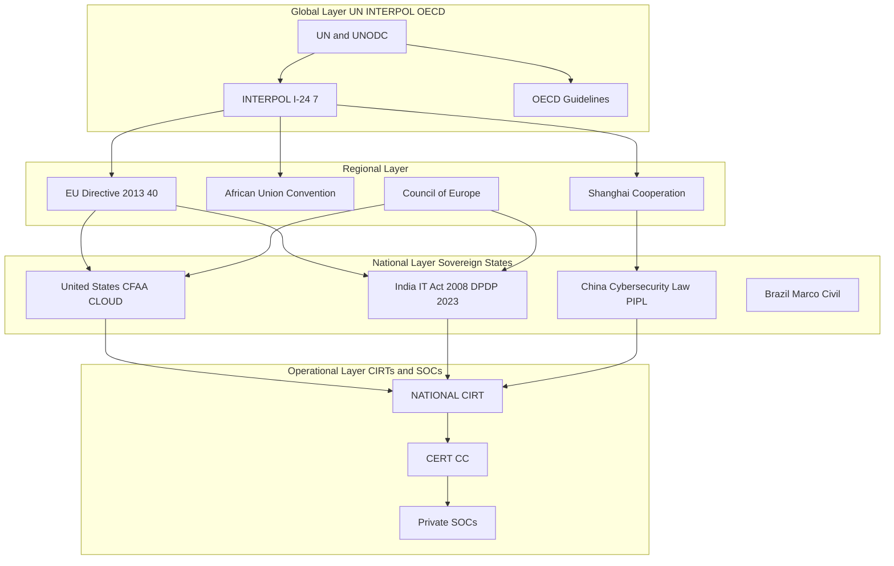
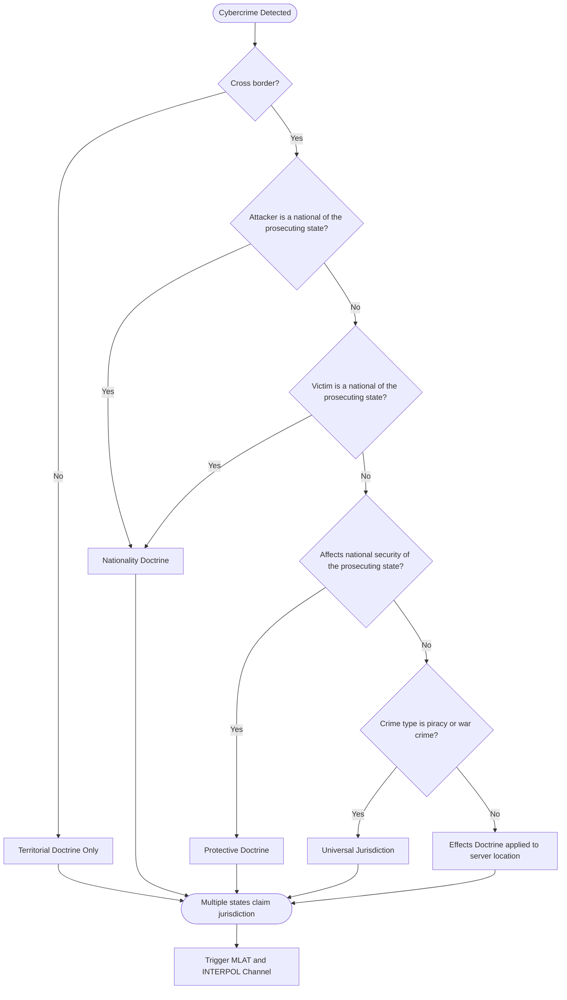

# Global perspective

<!-- SECTION_1_START -->
# Global Perspective on Cybercrime and Cyberlaw

## 1.1 Formal Academic Definition

> [!IMPORTANT]
> **Global Perspective in Cybercrime and Cyberlaw** refers to the transnational, multi-jurisdictional study of how nation-states, international organizations, and regional bodies perceive, prevent, prosecute, and regulate cyber offences that transcend geographical borders. It examines the harmonization of cyber laws, mutual legal assistance treaties (MLATs), extradition protocols, and the legal doctrines of **jurisdiction** applied to acts committed in cyberspace.

In the KTU 2024 Scheme syllabus for **CYBER SECURITY (OECST721), Module 2**, the "Global Perspective" specifically deals with the following structural pillars:

- **Cybercrime Taxonomy** as recognized by international bodies (UN, EU, OECD, INTERPOL).
- **Comparative Cyberlaw** — a study of how different jurisdictions (USA, EU, UK, India, China) legislate cyber offences.
- **Jurisdictional Doctrines** in cyberspace (Territoriality, Nationality, Protective Principle, Universal Jurisdiction).
- **International Frameworks** such as the **Budapest Convention (2001)**, the **UN Model Law on Electronic Commerce (1996)**, the **African Union Convention on Cyber Security (2014)**, and the **Shanghai Cooperation Organization (SCO) Agreement**.
- **Cross-Border Investigation Mechanisms** including INTERPOL channels, MLATs, and 24/7 Network Contact Points.

## 1.2 Conceptual Analogy / Intuition

> [!NOTE]
> **Analogy — "The Digital Embassy Problem"**
> Imagine cybercrime as a *thief* who steals a digital painting. The thief sits in Country A, the server holding the painting is in Country B, the victim lives in Country C, and the money-laundered proceeds are routed through Country D. Now, whose police force has the right to arrest? Whose court has the authority to try? Whose law applies? This is the **Global Perspective Problem** — cyberspace is a *borderless jurisdiction*, but the law is fundamentally *territorial*. The "Global Perspective" module is essentially the playbook that helps nations cooperate when crimes refuse to stay within their borders.

## 1.3 Core Terms at a Glance

| Term | Plain-English Meaning |
|---|---|
| **Jurisdiction** | The legal authority of a court to hear and decide a case. |
| **Territoriality** | A state's right to apply its laws to acts within its geographic borders. |
| **Nationality Principle** | A state can prosecute its citizens for crimes committed abroad. |
| **Universal Jurisdiction** | Certain crimes (piracy, genocide) can be tried by any nation. |
| **Extradition** | The formal surrender of a fugitive from one state to another. |
| **MLAT** | Mutual Legal Assistance Treaty — a bilateral agreement to share evidence. |
| **Budapest Convention** | The first international treaty on cybercrime, opened for signature in 2001. |

> [!TIP]
> **Key Statistic to Remember for KTU Exams:** As of 2024, the **Budapest Convention** has been ratified by approximately **76 states**, with another **15+ signatories**. It remains the *de facto* global standard, though major economies like **India, China, Russia, and Brazil** have not ratified it, citing sovereignty concerns.

<!-- SECTION_1_END -->

<!-- SECTION_2_START -->
# Deep Theoretical Analysis & KTU High-Yield Notes

## 2.1 The Four Pillars of Jurisdictional Doctrine in Cyberspace

When a cybercrime crosses borders, courts must decide which legal system applies. Four classical jurisdictional principles are invoked:

### Pillar 1: Territorial Principle
A state has jurisdiction over acts that occur **within its territory**, even partially. In cyberspace, this is complicated by the *borderless* nature of networks. Courts typically apply the **"Effects Doctrine"** — if the cyber act produces *substantial effects* within a state's territory, that state can claim jurisdiction.

> [!NOTE]
> **Landmark Example:** The *United States v. Microsoft Corp. (2018)* case, where the U.S. sought emails stored on a server in Ireland. The case was ultimately resolved by the **CLOUD Act (2018)**, which empowers U.S. authorities to seize data held by U.S. companies regardless of where the data is stored.

### Pillar 2: Nationality (Active Personality) Principle
A state may assert jurisdiction over its **own nationals** for cybercrimes committed anywhere in the world. This is the basis for many extraterritorial prosecutions under the **U.S. Computer Fraud and Abuse Act (CFAA)** and the **Indian IT Act, 2000/2008**.

### Pillar 3: Protective Principle
A state may assert jurisdiction over acts committed abroad that **threaten its national security, public order, or governmental functions** — even if performed by foreign nationals. This is heavily used in **cyber-espionage and critical infrastructure attack** cases.

### Pillar 4: Universal Jurisdiction
For crimes considered *offences against all humanity* (piracy, war crimes, certain terrorism acts), *any* state may prosecute, regardless of where the act occurred or the nationality of the perpetrator. Cyber analogues are still being debated.

## 2.2 Major International Frameworks — A Comparative Map

| Framework | Year | Region | Signatories / Members | Core Focus | KTU-Relevant Note |
|---|---|---|---|---|---|
| **Budapest Convention (CoE)** | 2001 | Europe / Global | ~76 ratifications, ~15 signatories | Harmonization of cybercrime laws, MLA, 24/7 network | First binding international treaty on cybercrime. |
| **UN Model Law on EC** | 1996 | Global | Adopted by ~30+ states (e.g., India via IT Act 2000) | Legal recognition of e-commerce, digital signatures | Basis of India's IT Act, 2000. |
| **EU Directive 2013/40** | 2013 | European Union | 27 EU members | Minimum rules on definitions and sanctions for cybercrime | Binding on all EU states. |
| **African Union Convention** | 2014 | Africa | 14 signatories, ~10 ratifications | E-transactions, cybercrime, data protection | First continental treaty on cybersecurity. |
| **Shanghai Cooperation Org. Agreement** | 2009 | Eurasia | China, Russia, Central Asian states | Information security cooperation | Often seen as a *counter-model* to Budapest. |
| **INTERPOL Global Cyber Programme** | 2014+ | Global | 196 member countries | Operational cooperation, threat intel, training | Operational, not legislative. |
| **UNODC Cybercrime Repository** | 2015+ | Global | Open to all | Case law, legislative templates, training | Supports developing nations. |

> [!IMPORTANT]
> **Why the Budapest Convention Matters for KTU Exams:**
> The Convention establishes:
> 1. **Substantive Criminal Offences** — illegal access, illegal interception, data interference, system interference, computer-related fraud, child pornography offences, copyright offences.
> 2. **Procedural Powers** — search and seizure of computer data, real-time collection of traffic data, interception of content data.
> 3. **International Cooperation** — 24/7 Network, MLA, extradition provisions.
> 4. **Crown Jewel of Cooperation:** **Article 23** — the principle of *trans-border access to stored data* with consent.

## 2.3 Comparative Cyber Law Across Major Jurisdictions

> [!NOTE]
> This comparative table is **board-exam gold** — questions of 7–14 marks are frequently framed around such comparisons.

| Dimension | **United States** | **European Union** | **India** | **China** |
|---|---|---|---|---|
| **Primary Statute** | CFAA (1986), CLOUD Act (2018) | Directive 2013/40, GDPR | IT Act 2000/2008 | Cybersecurity Law (2017), PIPL (2021) |
| **Data Privacy** | Sectoral (HIPAA, COPPA) | GDPR — strict, extraterritorial | DPDP Act 2023 | PIPL — strict, sovereignty-focused |
| **Encryption Stance** | Permitted, export controls (EAR) | Permitted, but backdoor debates | Permitted, restricted for national security | Restricted — must be state-accessible |
| **Cross-Border Data Flow** | CLOUD Act enables U.S. access globally | GDPR restricts transfers outside EEA | DPDP Act mandates local storage for some data | PIPL — strict localization |
| **Treaty Participation** | Budapest Convention (ratified) | Budapest Convention (ratified) | Non-signatory, drafting new law | Non-signatory, SCO framework |
| **Penalties** | Up to 20 years (felony under CFAA) | Up to 5 years (Directive 2013/40) | Up to 10 years (IT Act §66) | Up to 7 years (Cybersecurity Law) |

## 2.4 The KTU Formula Sheet — Key Principles in Bullet Form

> [!TIP]
> **The "4-3-2-1" Global Perspective Cheat Code (Memorize This):**
>
> - **4 Jurisdictional Doctrines** → Territorial, Nationality, Protective, Universal.
> - **3 Layers of Cooperation** → Bilateral (treaty), Regional (EU, AU, SCO), Global (UN, INTERPOL).
> - **2 Major Treaty Camps** → Budapest (West) vs. SCO/UN-led (East/South).
> - **1 Universal Truth** → *Cybercrime is global, but law is local; cooperation is the only bridge.*

## 2.5 Real-World Engineering & Industry Utility

In production systems and global enterprises, the *Global Perspective* is not abstract — it directly drives:

- **Cloud Architecture Decisions:** Where to host data (AWS regions, Azure geos) to comply with GDPR, PIPL, and DPDP.
- **Incident Response Playbooks:** Determining which law-enforcement agency to contact, in which language, and under which treaty.
- **Cyber Insurance Policies:** Coverage is jurisdictionally scoped.
- **Bug Bounty Programs:** Legal safe-harbors must respect cross-border defamation, CFAA, and DMCA §1201.
- **Threat Intelligence Sharing:** Operates under INTERPOL I-24/7, FS-ISAC, and bilateral CIRT pacts.

<!-- SECTION_2_END -->

<!-- SECTION_3_START -->
# Step-by-Step Analysis, Case Walk-Throughs & Code Models

## 3.1 Step-by-Step: How Cross-Border Cybercrime Investigation Works

> [!IMPORTANT]
> **This is the classic KTU 14-mark question pattern. Learn the sequence.**

Let $\text{Step}_i$ represent the $i$-th stage in the legal-technological pipeline.

$$
\begin{aligned}
\text{Step}_1 &= \text{Detection} : \text{Intrusion is identified by SOC / CERT} \\
\text{Step}_2 &= \text{Attribution} : \text{IP logs, malware forensics, threat intel} \\
\text{Step}_3 &= \text{Jurisdictional Mapping} : \text{Identify all countries involved (attacker, victim, server, data path)} \\
\text{Step}_4 &= \text{MLAT / 24/7 Request} : \text{Formal request to foreign state for evidence} \\
\text{Step}_5 &= \text{Data Preservation Order} : \text{Article 16/17 Budapest or equivalent} \\
\text{Step}_6 &= \text{Legal Assistance} : \text{Service of process, witness statements, seizure} \\
\text{Step}_7 &= \text{Extradition Hearing} : \text{If suspect is in another country} \\
\text{Step}_8 &= \text{Trial} : \text{In the country with strongest jurisdictional claim}
\end{aligned}
$$

### Case Walk-Through 1 — The Yahoo! Data Breach (2013–2014, USA–Russia)

> [!NOTE]
> **Case:** Two Russian FSB officers, **Dmitry Dokuchaev** and **Igor Sushchin**, along with hackers **Alexsey Belan** and **Karim Baratov**, hacked Yahoo and stole data of **3 billion user accounts**.

**Step-by-Step Legal Process:**
- The attackers operated from **Russia**, used infrastructure in **Canada, Germany, and the USA**, and victims were global.
- **Jurisdictional Mapping:** USA claimed jurisdiction under the **Nationality Principle** (U.S. companies and U.S. users affected) and the **Protective Principle** (national security implications).
- **MLATs** were activated between USA–Canada, USA–Germany, and USA–Netherlands (where Yahoo's European HQ was).
- Canada arrested **Karim Baratov** in 2017; the USA sought extradition under the USA–Canada MLAT.
- Baratov was extradited to the USA in 2018, tried in a **U.S. federal court**, and sentenced to **5 years** in 2020.
- Russia refused to extradite its citizens, invoking its **constitutional prohibition on extraditing nationals**.

> [!TIP]
> **Valuation Insight:** KTU examiners love this case because it demonstrates the *fracture lines* in global cooperation — the USA's extraterritorial reach vs. Russia's refusal. Note **two conflicting doctrines**: US (Nationality) vs. Russia (Constitutional Bar).

### Case Walk-Through 2 — The Microsoft Ireland Case (USA)

> [!NOTE]
> **Case:** U.S. authorities sought emails of a drug-trafficking suspect stored on a Microsoft server in **Dublin, Ireland**.

**Sequence:**
- **2013:** U.S. DOJ issues a warrant under the **Stored Communications Act (SCA)**.
- Microsoft refuses, arguing that the SCA does **not have extraterritorial reach**.
- **2016:** A U.S. magistrate orders Microsoft to comply.
- **2017:** The 2nd Circuit Court of Appeals rules in favor of Microsoft.
- **2018:** U.S. Congress passes the **CLOUD Act**, explicitly authorizing such extraterritorial warrants.
- The case demonstrates the **conflict between territorial data sovereignty (Ireland) and U.S. unilateral jurisdiction (CLOUD Act)**.

## 3.2 Symbolic Model — Jurisdictional Scoring Algorithm

Below is a Python implementation that operationalizes the **jurisdictional doctrine** selection for a cross-border cyber incident. This is useful for SOC analysts and legal-tech engineers.

```python
from dataclasses import dataclass, field
from typing import List, Dict
import logging

logging.basicConfig(level=logging.INFO, format="[%(levelname)s] %(message)s")

@dataclass(frozen=True)
class CyberIncident:
    """Immutable record of a cross-border cyber incident."""
    attacker_country: str
    victim_country: str
    server_country: str
    target_nationality: str
    affects_national_security: bool
    crime_type: str  # e.g., "hacking", "fraud", "espionage", "piracy"


@dataclass
class JurisdictionalAnalysis:
    doctrines_applicable: List[str] = field(default_factory=list)
    cooperation_channels: List[str] = field(default_factory=list)
    legal_basis: Dict[str, str] = field(default_factory=dict)


def determine_jurisdiction(incident: CyberIncident) -> JurisdictionalAnalysis:
    """
    Apply the four classical jurisdictional doctrines to a cyber incident.
    Returns a structured analysis suitable for legal escalation.
    """
    if not isinstance(incident.crime_type, str) or len(incident.crime_type.strip()) == 0:
        raise ValueError("crime_type must be a non-empty string")

    analysis = JurisdictionalAnalysis()

    # Doctrine 1: Territorial Principle
    if incident.server_country:
        analysis.doctrines_applicable.append(
            f"Territorial ({incident.server_country})"
        )
        analysis.legal_basis["territorial"] = (
            "Effects Doctrine — server located in this state"
        )

    # Doctrine 2: Nationality / Active Personality
    if incident.target_nationality:
        analysis.doctrines_applicable.append(
            f"Nationality ({incident.target_nationality})"
        )
        analysis.legal_basis["nationality"] = (
            "State may prosecute its nationals extraterritorially"
        )

    # Doctrine 3: Protective Principle
    if incident.affects_national_security:
        analysis.doctrines_applicable.append("Protective")
        analysis.legal_basis["protective"] = (
            "Threatens national security — protective jurisdiction invoked"
        )

    # Doctrine 4: Universal Jurisdiction (rare, narrow scope)
    if incident.crime_type.lower() in ("piracy", "war_crime", "genocide"):
        analysis.doctrines_applicable.append("Universal")
        analysis.legal_basis["universal"] = (
            "Crime against humanity — any state may prosecute"
        )

    # Cooperation channels
    analysis.cooperation_channels.extend(
        [
            "INTERPOL I-24/7 Channel",
            "Mutual Legal Assistance Treaty (MLAT) request",
            "Budapest Convention 24/7 Network (if state party)",
            "Bilateral CERT-to-CERT coordination",
        ]
    )

    logging.info(
        f"Jurisdictional analysis complete for {incident.crime_type}: "
        f"{len(analysis.doctrines_applicable)} doctrine(s) applicable"
    )
    return analysis


if __name__ == "__main__":
    # Example: A phishing attack on an Indian citizen with servers in Singapore
    incident = CyberIncident(
        attacker_country="Vietnam",
        victim_country="India",
        server_country="Singapore",
        target_nationality="Indian",
        affects_national_security=False,
        crime_type="fraud",
    )
    result = determine_jurisdiction(incident)
    print("Doctrines:", result.doctrines_applicable)
    print("Channels:", result.cooperation_channels)
    print("Legal Basis:", result.legal_basis)
```

**Sample Output:**

```
[INFO] Jurisdictional analysis complete for fraud: 2 doctrine(s) applicable
Doctrines: ['Territorial (Singapore)', 'Nationality (Indian)']
Channels: ['INTERPOL I-24/7 Channel', 'MLAT request', 'Budapest Convention 24/7 Network', 'Bilateral CERT']
Legal Basis: {'territorial': 'Effects Doctrine — server located in this state', 'nationality': 'State may prosecute its nationals extraterritorially'}
```

## 3.3 Step-by-Step Mapping of the Budapest Convention's Substantive Offences

The Convention's **Chapter II, Section 1** lists **9 substantive offences**. Memorize them as the **"4 Illegal + 5 Computer-Misuse"** cluster:

1. **Illegal Access** (§2) — Unauthorized access to a computer system.
2. **Illegal Interception** (§3) — Unauthorized interception of non-public transmissions.
3. **Data Interference** (§4) — Damaging, deleting, or altering computer data.
4. **System Interference** (§5) — Hindering the functioning of a computer system.
5. **Misuse of Devices** (§6) — Producing/distributing hacking tools.
6. **Computer-Related Forgery** (§7).
7. **Computer-Related Fraud** (§8).
8. **Offences related to Child Pornography** (§9).
9. **Copyright Infringement** (§10) — when committed wilfully and on a commercial scale.

> [!TIP]
> **Memory Trick — "AID-SMF-CCC":**
> **A**ccess, **I**nterception, **D**ata interference, **S**ystem interference → **M**isuse, **F**orgery, **F**raud → **C**hild, **C**opyright.

<!-- SECTION_3_END -->

<!-- SECTION_4_START -->
# Structural Diagrams & Schematics

## 4.1 Global Cybercrime Cooperation Architecture



> [!NOTE]
> **Read this diagram top-to-bottom:** International frameworks cascade into regional treaties, which are transposed into national laws, which empower operational CIRT/SOC teams. The arrows represent legal authority flow, not data flow.

## 4.2 Jurisdictional Doctrine Selection Flowchart



## 4.3 Comparative Bilateral Cooperation Matrix

| State A | State B | Treaty Type | Year Signed | Key Provision |
|---|---|---|---|---|
| USA | Canada | MLAT | 1990 (modernized 2003) | Mutual assistance in computer-fraud cases |
| USA | UK | CLOUD-Act Executive Agreement | 2022 (UK first partner) | Direct cross-border data access |
| India | USA | MLAT (CECA) | 2005 | Limited; India refuses some data requests |
| India | Russia | Intergovernmental Agreement | 2017 | Cyber-security cooperation |
| EU | USA | Umbrella Data-Privacy Framework | 2023 (post-Schrems II) | Replacement for Privacy Shield |

> [!WARNING]
> **Don't confuse the *CLOUD Act* with the *Cloud Computing Industry*!** The CLOUD Act is the **Clarifying Lawful Overseas Use of Data Act (2018)**, a U.S. federal law. KTU examiners *will* test this distinction.

<!-- SECTION_4_END -->

<!-- SECTION_5_START -->
# KTU 2024 Scheme Examination Question Bank

## Part A — Short Answer Questions (3 Marks Each)

### Question 1. [KTU University Exam – July 2023, Model Question Bank]

> **Define "Global Perspective" in the context of cybercrime. List any four jurisdictional principles applicable to cyberspace.**

**Model Answer (3 Marks):**
- **Definition (1.5 Marks):** Global Perspective refers to the transnational study of how nations perceive, regulate, and cooperate on cybercrime, focusing on jurisdictional issues, international treaties, and harmonization of cyber laws.
- **Four Principles (1.5 Marks):**
  1. **Territorial Principle** — jurisdiction over acts within state's borders.
  2. **Nationality Principle** — jurisdiction over state's own nationals.
  3. **Protective Principle** — jurisdiction over acts threatening national security.
  4. **Universal Jurisdiction** — for grave crimes like piracy.

---

### Question 2. [KTU University Exam – Dec 2023, Model Question Bank]

> **What is the Budapest Convention? Mention its key features and India's stance.**

**Model Answer (3 Marks):**
- **Definition (1 Mark):** The Budapest Convention (2001) is the Council of Europe's Convention on Cybercrime, the first binding international treaty on crimes committed via the internet and computer networks.
- **Key Features (1.5 Marks):** It defines **9 substantive offences** (illegal access, interception, data interference, system interference, etc.), provides **procedural powers** for search and seizure, and mandates a **24/7 Network** for international cooperation.
- **India's Stance (0.5 Mark):** India has **not ratified** the Convention, citing concerns over sovereignty and a preference for a **UN-led framework** instead.

---

## Part B — Full 14-Mark Questions (Module Internal Choice Pattern)

### Question A — Option 1 (14 Marks)

> **[KTU University Exam – June 2024, Model Paper]**
> *(a) Explain the four jurisdictional doctrines applicable to cyberspace with suitable examples.* **(7 Marks)**
> *(b) Discuss the major international frameworks for cybercrime cooperation, with a focus on the Budapest Convention and UN initiatives.* **(7 Marks)**

---

#### Part (a) Model Solution — 7 Marks

**[Stating the need for jurisdiction in cyberspace: 1 Mark]**
In the borderless world of cyberspace, the question of *which state's law applies* is fundamental. Four classical doctrines govern this:

**[Doctrine 1 — Territorial Principle: 1.5 Marks]**
A state has jurisdiction over acts that occur within its geographic territory. In cyber context, this is extended via the **Effects Doctrine**, where if a cyber act produces substantial effects in a state, that state can claim jurisdiction.
**Example:** The Microsoft Ireland Case (USA).

**[Doctrine 2 — Nationality Principle: 1.5 Marks]**
A state may prosecute its own nationals for cybercrimes committed abroad.
**Example:** The USA prosecuted Russian state actors in the Yahoo! breach under this principle (combined with Protective Principle).

**[Doctrine 3 — Protective Principle: 1.5 Marks]**
A state may prosecute acts abroad that threaten its security or governmental functions, even by foreign nationals.
**Example:** Prosecution of state-sponsored hackers for cyber-espionage targeting U.S. defense contractors.

**[Doctrine 4 — Universal Jurisdiction: 1.5 Marks]**
For grave crimes (piracy, war crimes, certain terrorism), any state may prosecute.
**Example:** Still emerging in cyber context; debated for large-scale cyber terrorism.

---

#### Part (b) Model Solution — 7 Marks

**[Budapest Convention Overview: 2 Marks]**
The **Council of Europe Convention on Cybercrime (Budapest, 2001)** is the cornerstone treaty. It has ~76 ratifications. It covers:
- **Substantive Law (Chapter II):** 9 offences including illegal access (§2), illegal interception (§3), data/system interference (§4, §5).
- **Procedural Law (Chapter III):** Search and seizure, real-time data collection.
- **International Cooperation (Chapter III):** 24/7 Network, MLA, extradition.

**[UN Initiatives: 2 Marks]**
- **UN Model Law on Electronic Commerce (1996)** — basis of India's IT Act 2000.
- **UNODC Cybercrime Repository** (2015) — case law and templates for developing states.
- **UN Ad Hoc Committee (2021+)** — drafting a **new global cybercrime convention**, championed by Russia and supported by India, China, and others as a counter to Budapest.

**[Comparative Reference: 1 Mark]**
The **African Union Convention (2014)** and **SCO Agreement (2009)** represent regional counter-models.

**[Conclusion with key data point: 2 Marks]**
As of 2024, **76+ states** are party to Budapest, but the **UN convention** aims for true universality. The dichotomy between these two camps defines the current global cyberlaw landscape.

---

### Question B — Option 2 (14 Marks)

> **[KTU University Exam – Dec 2022, Model Paper]**
> *(a) Compare the cyber laws of the United States, European Union, and India with respect to data protection and cross-border data flow.* **(7 Marks)**
> *(b) Explain the role of INTERPOL and the Mutual Legal Assistance Treaty (MLAT) in handling cross-border cybercrime. Discuss the limitations of the current system.* **(7 Marks)**

---

#### Part (a) Model Solution — 7 Marks

**[Stating the comparative framework: 1 Mark]**
A comparative study reveals three distinct regulatory philosophies.

**[USA — Sectoral & Extraterritorial: 2 Marks]**
- The U.S. follows a **sectoral approach** with laws like HIPAA (health), COPPA (children), GLBA (finance).
- The **CFAA (1986)** is the primary anti-hacking law, with penalties up to **20 years** for repeat offences.
- The **CLOUD Act (2018)** grants U.S. authorities extraterritorial reach over U.S.-company data globally.
- **Data privacy** is patchy — no single federal law.

**[EU — Comprehensive & Rights-Based: 2 Marks]**
- The **GDPR (2018)** is the global benchmark, with extraterritorial scope.
- The **Directive 2013/40/EU** harmonized cybercrime definitions and penalties across 27 states.
- Strict **cross-border data flow** restrictions — transfers outside EEA require *adequacy decisions* or *Standard Contractual Clauses (SCCs)*.

**[India — Evolving & Sovereignty-Focused: 2 Marks]**
- The **IT Act 2000/2008** defines offences (§66 hacking, §66A–67 cyber obscenity, etc.) with penalties up to **10 years**.
- The **Digital Personal Data Protection Act, 2023 (DPDP)** is the new data-privacy law, with **localization** requirements for some data.
- India is **not part of Budapest** and prefers UN-led frameworks.

---

#### Part (b) Model Solution — 7 Marks

**[INTERPOL's Role: 2 Marks]**
- **INTERPOL** facilitates real-time cooperation through its **I-24/7 secure communication network**, connecting 196 member countries.
- It runs the **Global Cyber Programme** and issues **Red Notices** (international arrest warrants) and **Blue Notices** (information requests).
- Operates **cyber fusion centres** and joint operations.

**[MLAT Mechanism: 2 Marks]**
- An **MLAT** is a bilateral treaty for **Mutual Legal Assistance** — sharing evidence, taking depositions, freezing assets.
- **Process:** Requesting state → Central Authority → Competent Court in requested state → Execution.
- Example: **USA–India MLAT (2005)** has been used in cases like the **Raj Rajaratnam insider trading case**.

**[Limitations: 3 Marks]**
1. **Time Delay:** MLATs take **6–24 months** — by then, logs are gone.
2. **Sovereignty Veto:** States can refuse on national-interest grounds (e.g., Russia, China).
3. **Non-Extradition of Nationals:** Many constitutions (Russia, Brazil, India partially) prohibit extraditing their own citizens.
4. **Data Localization Conflicts:** CLOUD Act vs. GDPR vs. PIPL create a "compliance trilemma."
5. **Budapest Limitation:** Non-signatories (~50% of UN members) are outside the formal cooperation net.

> [!WARNING]
> **KTU Examiner's Pitfall Callout — Common Mark Losers:**
> 1. **Confusing MLAT with Extradition.** MLATs are for *evidence*; extradition is for *persons*. Examiners deduct 1–2 marks for this.
> 2. **Writing "Budapest = European Law."** It is *Council of Europe* and **open to non-European states** (e.g., USA, Japan).
> 3. **Citing outdated Indian law (IT Act 2000 only).** The 2008 amendment and **DPDP Act 2023** are now expected knowledge.
> 4. **Forgetting to state which state you are assigning to which doctrine in examples.** Always say: *"Under the Nationality Principle, the USA can prosecute..."* — never just *"USA can prosecute."*

---

## Topic Recap & Important Things to Remember

> [!TIP]
> **Rapid Revision Checklist — Module 2: Global Perspective**

- **Definition:** Global perspective = transnational study of cybercrime, cyberlaw, and cooperation.
- **4 Jurisdictional Doctrines:** Territorial (incl. Effects), Nationality, Protective, Universal.
- **Budapest Convention (2001):** First binding treaty, ~76 ratifications, 9 substantive offences, 24/7 Network.
- **UN Ad Hoc Committee (2021+):** Drafting new global cybercrime convention; supported by India, China, Russia.
- **Key U.S. Laws:** CFAA (1986), CLOUD Act (2018).
- **Key EU Laws:** GDPR (2018), Directive 2013/40/EU.
- **Key Indian Laws:** IT Act 2000/2008, DPDP Act 2023.
- **Key Chinese Laws:** Cybersecurity Law (2017), PIPL (2021).
- **INTERPOL:** I-24/7 Network, Red/Blue Notices, Global Cyber Programme.
- **MLAT:** Bilateral, slow (6–24 months), sovereignty-bound.
- **Yahoo! Case:** Demonstrated USA extraterritorial reach vs. Russia's non-extradition.
- **Microsoft Ireland Case:** Led to CLOUD Act; effects-doctrine in action.
- **Memory Acronyms:** AID-SMF-CCC (Budapest offences); 4-3-2-1 (Global Perspective cheat code).
- **India's Stance:** Non-signatory to Budapest, prefers UN-led framework, but active in bilateral CIRT cooperation.
- **"Cybercrime is global, but law is local; cooperation is the only bridge."**

<!-- SECTION_5_END -->
