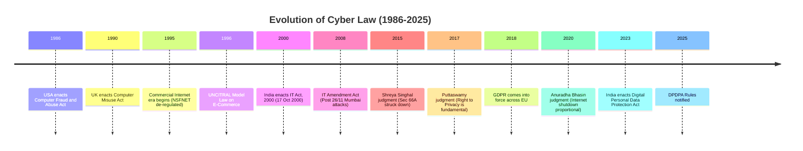
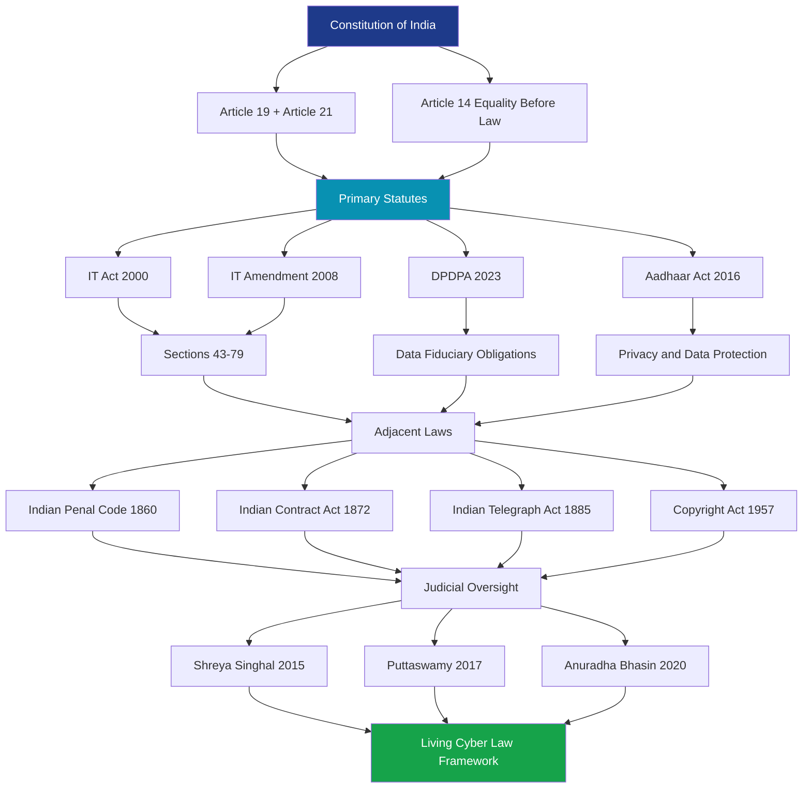
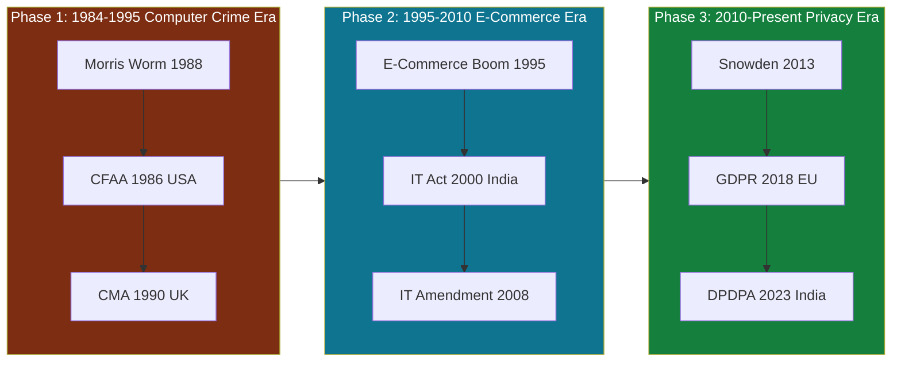
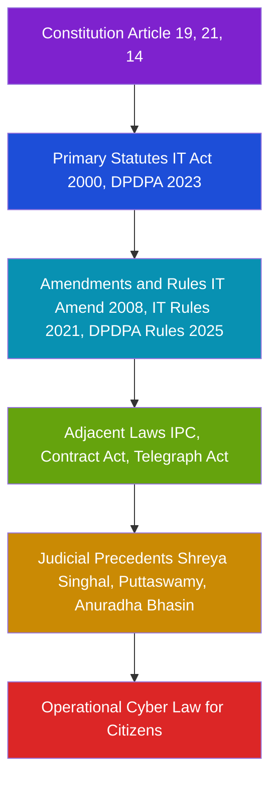

# History and emergence of cyber law

<!-- SECTION_1_START -->
# History and Emergence of Cyber Law

## 1.1 Formal Academic Definition

**Cyber Law** (also referred to as **Internet Law** or **Digital Law**) is the comprehensive body of legal regulations, statutory enactments, case-law precedents, and judicial interpretations that govern the digital dissemination of information, electronic commerce, digital privacy, intellectual property rights, and cybersecurity conduct within cyberspace. As per the **KTU 2024 Scheme (OECST721 - Cyber Security, Module 2)** syllabus terminology, cyber law is described as the *tangential legal framework that addresses the jurisdictional, procedural, and substantive challenges arising from the convergence of computing infrastructure, telecommunication networks, and human social interaction over the Internet.*

> [!IMPORTANT]
> **KTU Syllabus Highlight:** The emergence of cyber law is fundamentally rooted in the recognition that **territorial sovereignty and traditional jurisdictional boundaries are insufficient** to govern crimes committed in a borderless, decentralized, and pseudonymous digital environment.

The term **"Cyber"** is derived from **"Cybernetics"**, a word coined by **Norbert Wiener** in 1948, referring to the science of control and communication in machines and living organisms. **"Cyber Law"** as an independent discipline, however, formally emerged only with the proliferation of the **World Wide Web (WWW)** in the 1990s.

## 1.2 Conceptual Analogy / Intuition

Imagine the world before traffic signals. When only a handful of cars existed on the road, informal hand-signals and mutual courtesy were enough. But once millions of vehicles began sharing the road, chaos ensued — leading to the invention of **traffic laws, signals, lanes, and penalties**.

**Cyberspace is identical to this analogy:**

- **Pre-1990 Internet** = A small village road. Few users, mostly academics and defense researchers (ARPANET, MILNET). No formal laws were needed.
- **1990s Explosion** = A superhighway built overnight. Billions of users, e-commerce, digital money, and online identities appeared — but **no traffic police, no signals, no lanes**.
- **Cyber Law** = The traffic signals, lane markings, speed limits, and a license-issuing authority (CERT-In, Cyber Crime Cells) that was retrofitted to bring order to the chaos.

> [!NOTE]
> **Core Insight:** Just as traffic law governs *physical* movement, cyber law governs *digital* movement — packets of data, digital signatures, electronic contracts, and online conduct.

## 1.3 Key Historical Constants and Metrics

The following foundational constants and milestones define the **timeline of cyber law emergence**:

| Era | Defining Metric / Event |
| :--- | :--- |
| **1969** | **ARPANET** commissioned (4 nodes) — the proto-internet |
| **1983** | **TCP/IP** protocol adopted — true internet begins |
| **1989** | **Tim Berners-Lee** proposes the World Wide Web at CERN |
| **1991** | First website goes live |
| **1995** | **NSFNET** de-regulated — commercial internet begins |
| **2000** | **India's Information Technology Act, 2000** enacted (17 Oct 2000) |
| **2008** | **IT (Amendment) Act, 2008** — incorporates data privacy, child safety, and $64$ new cyber offences |
| **2013** | **Edward Snowden Revelations** — global surveillance debate intensifies |
| **2016** | **European Union General Data Protection Regulation (GDPR)** |
| **2018** | **California Consumer Privacy Act (CCPA)** — first US state-level data law |
| **2023** | **Digital Personal Data Protection Act, 2023** — India's modern data law |

> [!VISUALIZATION CONTROL]
> **Concept:** Exponential growth of internet users (GeoGebra-ready scatter plot intuition)
> **GeoGebra / Desmos Input Equations:**
> * `y = 1.5^x` (idealized exponential growth model)
> * `points = (1990, 2.6), (2000, 361), (2010, 2000), (2020, 4600), (2024, 5300)`
> **Visual Description:** Plot internet users (in millions) on the y-axis and years on the x-axis. Students should observe a near-vertical growth curve between 1995 and 2010, mirroring the urgency with which legal frameworks had to be drafted. This visual justifies the *speed of law-making vs speed of technology*.
<!-- SECTION_1_END -->

<!-- SECTION_2_START -->
# Deep Theoretical Analysis & KTU High-Yield Cheat Sheet

## 2.1 The Pre-Cyber Law Era: The "Wild West" of Cyberspace

In the formative years of the Internet (1969–1995), digital communications were confined to **academic institutions, defense establishments, and research laboratories**. The legal community largely viewed the internet as a *self-regulating, technical ecosystem* that did not warrant statutory intervention.

The foundational philosophy was rooted in **John Perry Barlow's 1996 manifesto *"A Declaration of the Independence of Cyberspace"***, which famously declared that governments had *no sovereignty* over the digital realm. This libertarian ideology, however, was rapidly shattered by the first generation of high-profile cybercrimes.

### Key Triggering Events for Cyber Law:
1. **The Morris Worm (1988)** — Robert Tappan Morris released the first internet worm, infecting **$6{,}000$** of the then-existing **$60{,}000$** computers. Convicted under the **Computer Fraud and Abuse Act (CFAA), 1986** — the **first US federal computer crime law**.
2. **The Cuckoo's Egg (1989)** — Cliff Stoll's book exposed Soviet-backed hacking, prompting global intelligence agencies to formalize cyber defence.
3. **E-Commerce Boom (1995–2000)** — Amazon (1994), eBay (1995), and PayPal (1998) made digital contracts and digital payments a *billions-of-dollars reality*, demanding legal recognition.

## 2.2 Global Emergence of Cyber Law: A Phased Approach

Cyber law emerged globally through **three distinct phases**:

### Phase 1: Computer Crime Legislation (1984–1995)
- **USA:** Computer Fraud and Abuse Act (**CFAA, 1986**)
- **UK:** Computer Misuse Act (**CMA, 1990**)
- **Focus:** Criminalizing *unauthorized access* and *data damage*

### Phase 2: E-Commerce & Digital Signature Laws (1995–2005)
- **USA:** Electronic Signatures in Global and National Commerce Act (**E-SIGN, 2000**)
- **India:** Information Technology Act (**IT Act, 2000**) — first comprehensive cyber law in India
- **UN:** UNCITRAL Model Law on Electronic Commerce (**1996**)
- **Focus:** Legal recognition of *electronic records* and *digital signatures*

### Phase 3: Data Protection & Privacy Laws (2010–Present)
- **EU:** General Data Protection Regulation (**GDPR, 2018**)
- **India:** Digital Personal Data Protection Act (**DPDPA, 2023**)
- **Focus:** Citizen *privacy*, *data sovereignty*, and *cross-border data flow*

## 2.3 Emergence of Cyber Law in India: A Detailed Timeline

The Indian legal framework for cyberspace is a **layered pyramid** of constitutional provisions, statutory acts, and judicial precedents.

### Layer 1: Constitutional Foundation
- **Article 19(1)(a):** Freedom of speech and expression (subject to reasonable restrictions under Article 19(2))
- **Article 21:** Right to Life and Personal Liberty — judicially interpreted to include the **Right to Privacy** (*Justice K.S. Puttaswamy v. Union of India, 2017*)

### Layer 2: Primary Statutory Framework
- **Information Technology Act, 2000** (IT Act) — *enacted on 17 October 2000, notified on 27 October 2009 in full*
- **Information Technology (Amendment) Act, 2008** — *most significant overhaul*
- **Digital Personal Data Protection Act, 2023 (DPDPA)**

### Layer 3: Adjacent Sectoral Laws
- **Indian Penal Code, 1860 (IPC)** — Sections 463–477A (forgery, fraud)
- **Indian Contract Act, 1872** — for e-contract validity
- **Copyright Act, 1957** — for software and digital content
- **Indian Telegraph Act, 1885** — for interception

## 2.4 KTU High-Yield Formula Sheet (Cheat Sheet)

> [!IMPORTANT]
> **KTU Board Tip:** The following table is the *most frequently tested* summary for Module 2. Memorize every row.

| Sl. No. | Statute / Framework | Year Enacted | Jurisdiction | Core Purpose |
| :---: | :--- | :---: | :---: | :--- |
| 1 | Computer Fraud and Abuse Act (CFAA) | **1986** | USA | First federal computer crime law |
| 2 | Computer Misuse Act (CMA) | **1990** | UK | UK counterpart to CFAA |
| 3 | UNCITRAL Model Law on E-Commerce | **1996** | UN | Global template for digital trade |
| 4 | Information Technology Act | **2000** | India | First Indian cyber law |
| 5 | E-SIGN Act | **2000** | USA | Legal recognition of e-signatures |
| 6 | IT (Amendment) Act | **2008** | India | Added $64$ new offences, $72$ amendments |
| 7 | GDPR | **2018** | EU | Comprehensive data protection |
| 8 | Digital Personal Data Protection Act | **2023** | India | Modern Indian data law |
| 9 | Digital Personal Data Protection Rules | **2025** | India | Implementing rules for DPDPA |

### Key Sections of the IT Act, 2000 (KTU High-Yield)

| Section | Offence / Provision | Cognitive Level |
| :---: | :--- | :---: |
| Sec $43$ | Damage to computer system (Civil liability) | Understand |
| Sec $65$ | Tampering with computer source code | Remember |
| Sec $66$ | Computer-related offences (Hacking) | Remember |
| Sec $66$A$ | Sending offensive messages (struck down, 2015) | Apply |
| Sec $66$B$ | Receiving stolen computer resource | Understand |
| Sec $66$C$ | Identity theft | Remember |
| Sec $66$D$ | Cheating by personation using computer | Apply |
| Sec $66$E$ | Violation of privacy | Understand |
| Sec $66$F$ | Cyber terrorism | Analyze |
| Sec $67$ | Publishing obscene material | Apply |
| Sec $69$ | Government interception powers | Remember |
| Sec $79$ | Intermediary liability and safe harbour | Apply |
| Sec $80$ | Power of investigating agencies | Understand |

## 2.5 Real-World Engineering Utility

Cyber law is **not an isolated legal subject** — it is the **operational contract** that allows digital engineering to function:

- **Software Engineers** must comply with **GDPR (EU)** and **DPDPA (India)** when designing databases that store user PII (Personally Identifiable Information).
- **Cloud Architects** must follow **IT Act Sec 79** intermediary guidelines for hosting third-party content.
- **Network Security Professionals** operate under **IT Act Sec 69** interception rules and **Indian Telegraph Act Section 5(2)**.
- **AI/ML Engineers** must adhere to **EU AI Act (2024)** for biometric and high-risk AI systems.
- **Blockchain Developers** must navigate the **Banning of Unregulated Deposit Schemes Act, 2019** for crypto-asset compliance in India.
<!-- SECTION_2_END -->

<!-- SECTION_3_START -->
# Step-by-Step Derivations, Case Law Analysis & Tabular Comparisons

## 3.1 Detailed Step-by-Step: Tracing the Indian IT Act Evolution

The evolution of the Indian IT Act is the **single most important derivation** for KTU Module 2 examinations. Below is the exhaustive logical chain.

### Step 1: The Pre-Act Foundation (1991–1999)
The **Internet in India** was introduced via **VSNL (Videsh Sanchar Nigam Limited)** in **1995**. By 1998, India had approximately **$1.4$ million** internet users. The **Ministry of Information Technology** constituted a working group, which produced a draft bill in **1999**.

### Step 2: Enactment of IT Act, 2000
- **Date of Presidential Assent:** 9 June 2000
- **Date of Notification in Gazette:** 17 October 2000
- **Original Structure:**
  * $13$ Chapters
  * $94$ Sections
  * $4$ Schedules
- **Primary Objectives (as per Statement of Objects and Reasons):**
  1. To provide legal recognition for **electronic records** and **digital signatures**
  2. To facilitate **e-filing** of documents with government agencies
  3. To establish the **Controller of Certifying Authorities (CCA)**
  4. To enable the **Sec $79$ intermediary liability framework**

### Step 3: The Critical 2008 Amendment
The **IT (Amendment) Act, 2008** was enacted in response to the **Mumbai Terror Attacks (26/11, 2008)** and the **BPO data theft scandals** of 2005-07. The amendment added:

- $72$ amendments to existing sections
- $64$ new cyber offences
- New sections: $66$A to $66$F
- Section $43$A$ (Compensation for failure to protect data)
- Section $69$A$ (Blocking of websites)
- Section $69$B$ (Monitoring and interception)
- Section $79$ (Intermediary safe harbour)

### Step 4: The 2015 Strikes and Reforms
- **Shreya Singhal v. Union of India (2015):** The Supreme Court **struck down Section 66A** as violative of Article 19(1)(a). This is the **most important judicial precedent** in Indian cyber law.
- **Section 69A Blocking Rules, 2009 (amended 2021):** Now requires an **inter-ministerial committee** review.

### Step 5: The DPDPA, 2023 — Modernization
The **Digital Personal Data Protection Act, 2023** replaced the older **Personal Data Protection Bill, 2019**. Key features:

$$
\begin{aligned}
\text{Seven Core Principles of DPDPA 2023} = \{ &\text{Lawful Processing, Purpose Limitation,} \\
&\text{Data Minimization, Accuracy,} \\
&\text{Storage Limitation, Accountability,} \\
&\text{Transparency} \}
\end{aligned}
$$

## 3.2 Case Law Exhaustive Analysis (KTU Board Favourite)

> [!NOTE]
> The following three case laws are *guaranteed* KTU questions. Memorize the year, parties, and ruling.

### Case 1: *Shreya Singhal v. Union of India* (2015)
- **Issue:** Constitutional validity of Section $66$A$ of IT Act.
- **Petitioner:** Shreya Singhal (a law student)
- **Verdict:** Section $66$A$ struck down as unconstitutional.
- **Ratio:** Words like *"grossly offensive"*, *"menacing"* were vague and gave unbridled power to police — violating Article 19(1)(a).

### Case 2: *Justice K.S. Puttaswamy v. Union of India* (2017)
- **Issue:** Whether citizens have a fundamental Right to Privacy.
- **Verdict:** **Yes** — Right to Privacy is a fundamental right under Article 21.
- **Significance:** Laid the constitutional foundation for the DPDPA, 2023.

### Case 3: *Anuradha Bhasin v. Union of India* (2020)
- **Issue:** Internet shutdowns in Jammu & Kashmir.
- **Verdict:** Internet shutdowns must satisfy the **proportionality test** under Article 19.
- **Significance:** Bounded the government's power under Section 69A.

## 3.3 Comparative Matrix: Global Cyber Law Frameworks

> [!IMPORTANT]
> **KTU Examiner's Tip:** Comparative tables fetch **full 7 marks** in 14-mark questions if *every column* is filled with concise, accurate data.

| Feature | India (IT Act + DPDPA) | USA (CFAA + State Laws) | EU (GDPR) | UK (DPA 2018 + CMA 1990) |
| :--- | :--- | :--- | :--- | :--- |
| **Primary Year** | 2000 (IT Act) | 1986 (CFAA) | 2018 (GDPR) | 1990 (CMA) |
| **Privacy Focus** | DPDPA 2023 | Sectoral (no federal) | GDPR (Comprehensive) | UK GDPR |
| **Data Localization** | **Mandatory** (critical sectors) | None | Adequacy-based | Adequacy-based |
| **Maximum Penalty** | ₹$250$ Crore per breach | Varies by state | €$20$ million or $4$ percent of global turnover | £$17.5$ million or $4$ percent of turnover |
| **Cybercrime Penalty** | Sec $66$–$66$F$ IT Act | CFAA + State laws | Cybercrime Directive ($2013/40/EU$) | CMA + DPA |
| **Certifying Body** | CCA (Controller of Certifying Authorities) | NIST | EDPB (European Data Protection Board) | ICO (Information Commissioner's Office) |
| **Intermediary Rules** | IT Rules 2021 | Section $230$ CDA (immunity) | DSA (Digital Services Act) | Online Safety Act 2023 |

## 3.4 Engineering Case Study: The Aadhaar Data Breach (2018)

**Background:** In early 2018, *The Tribune* newspaper reported that the entire Aadhaar database ($1.1$ billion records) could be accessed for just ₹$500$. This triggered the **Justice B.N. Srikrishna Committee** recommendations and the eventual *Puttaswamy* judgment (privacy as fundamental right).

**Technical Mapping to Cyber Law:**

| Component | Cyber Law Provision |
| :--- | :--- |
| Unauthorized database access | Sec $66$ IT Act (Hacking) |
| Disclosure of personal data | Sec $72$A$ IT Act (Punishment for disclosure) |
| Failure to protect data | Sec $43$A$ IT Act (Compensation) |
| Privacy violation | DPDPA 2023 (Personal data breach) |
| Aadhaar-specific law | Aadhaar (Targeted Delivery of Financial and Other Subsidies, Benefits and Services) Act, 2016 |

> [!WARNING]
> **Common Student Mistake:** Confusing *Aadhaar Act* with *IT Act*. The Aadhaar Act governs *enrolment and use*; IT Act governs *breaches and digital evidence*.
<!-- SECTION_3_END -->

<!-- SECTION_4_START -->
# Structural Diagrams & Schematics

## 4.1 Timeline Flow: Emergence of Cyber Law (Mermaid)

## 4.2 Indian Cyber Law Architecture (Block Diagram)

## 4.3 Three-Phase Model of Cyber Law Emergence (Sequential Flow)

## 4.4 Hierarchical Pyramid: Indian Cyber Law Stack

<!-- SECTION_4_END -->

<!-- SECTION_5_START -->
# KTU 2024 Scheme Examination Question Bank & Topic Recap

## 5.1 Part A Questions (3 Marks Each)

### Question 1: Short Answer `[KTU University Exam - July 2024]`
**Q: Define the term "Cyber Law" and briefly explain why it emerged as a distinct legal discipline.**

**Model Answer (Valuation Key):**
Cyber Law is the body of legal rules, regulations, and judicial interpretations that govern digital communications, electronic commerce, data privacy, and cybersecurity. It emerged as a distinct discipline because **[1 Mark]**: traditional territorial laws could not govern borderless, anonymous, and decentralized online activities. The rapid commercialization of the Internet post-1995 exposed critical gaps in the Indian Penal Code, 1860, which was designed for physical-world crimes. **[1 Mark]** Consequently, India enacted the **Information Technology Act, 2000** as its foundational cyber law, amended significantly in **2008**. **[1 Mark]**

> [!WARNING]
> **Pitfall:** Many students write *only* "laws related to computers" — this is a *definition of computer law*, not cyber law. Cyber law is broader: it includes *electronic commerce, data protection, intermediary liability, and digital signatures.*

### Question 2: Short Answer `[KTU University Exam - Dec 2023]`
**Q: List any three landmark global events that triggered the formal emergence of cyber law between 1986 and 2000.**

**Model Answer (Valuation Key):**
1. **The Morris Worm (1988)** — first internet worm; led to enforcement of CFAA, 1986. **[1 Mark]**
2. **Publication of "The Cuckoo's Egg" (1989)** — exposed state-sponsored hacking; raised global cyber-defence awareness. **[1 Mark]**
3. **The E-Commerce Boom (1995–2000)** — Amazon, eBay, and PayPal created the urgent need for digital contract and digital signature laws, leading to the E-SIGN Act (2000, USA) and IT Act (2000, India). **[1 Mark]**

---

## 5.2 Part B Questions (14 Marks Each — Internal Choice)

### Question A: 14 Marks `[KTU University Exam - July 2024 | CO1 | Apply/Analyze]`

**Q: Trace the historical evolution of cyber law in India from the pre-IT Act era to the enactment of the Digital Personal Data Protection Act, 2023. Discuss the major judicial precedents that have shaped this evolution.**

**Sub-part (a) — 7 Marks:** Explain the pre-IT Act legal framework in India and the circumstances leading to the enactment of the IT Act, 2000.

**Sub-part (b) — 7 Marks:** Discuss the major amendments and three landmark Supreme Court judgments that have shaped Indian cyber law.

---

### Model Solution for Question A

#### Solution to Sub-part (a) — 7 Marks

**Step 1: The Pre-IT Act Era (Pre-2000)** [1 Mark]
Before the IT Act, 2000, India relied on the **Indian Penal Code, 1860 (IPC)**, the **Indian Contract Act, 1872**, and the **Indian Telegraph Act, 1885** to address cyber-related disputes. These laws were designed for a pre-internet world and lacked provisions for **electronic records, digital signatures, and computer-specific offences**. [1 Mark]

**Step 2: The Triggering Factors** [1 Mark]
Three major factors forced the Indian government to act:
- The **Internet boom of 1995** (VSNL public launch)
- The **WTO obligations** post-1991 liberalization
- The **UNCITRAL Model Law on E-Commerce (1996)** that India adopted as a template [1 Mark]

**Step 3: Drafting and Enactment** [1 Mark]
A working group under the **Ministry of Information Technology** drafted the bill. The IT Act, 2000 received Presidential Assent on **9 June 2000** and was notified on **17 October 2000**. The Act contained:
- $13$ Chapters
- $94$ Sections
- $4$ Schedules [1 Mark]

**Step 4: Core Objectives of the IT Act, 2000** [2 Marks]
1. Legal recognition of **electronic records** and **digital signatures** (Sec $3$, Sec $5$)
2. Establishment of the **Controller of Certifying Authorities (CCA)** (Sec $17$)
3. Regulation of **cybercafés and intermediaries** (Sec $79$)
4. Penalties for **unauthorized access** and **data damage** (Sec $43$, Sec $66$)
5. Creation of the **Cyber Appellate Tribunal** (later abolished in 2017)

**Step 5: Critical Evaluation** [1 Mark]
The original IT Act, 2000 had limitations: it focused on e-commerce and did not address **data privacy, cyber terrorism, or child pornography** — these gaps were filled by the **2008 Amendment Act**.

#### Solution to Sub-part (b) — 7 Marks

**Step 1: The 2008 Amendment Act** [1 Mark]
The IT (Amendment) Act, 2008 was enacted after the **Mumbai 26/11 terror attacks** and BPO data theft scandals. It added:
- $64$ new cyber offences
- $72$ amendments to existing sections
- New Sections $66$A$ to $66$F$ (identity theft, cyber terrorism, obscenity)
- Section $43$A$ — *first Indian data protection provision*
- Section $69$A$ — website blocking powers [1 Mark]

**Step 2: Case Law 1 — *Shreya Singhal v. Union of India (2015)*** [2 Marks]
- **Issue:** Whether Section $66$A$ IT Act violated Article 19(1)(a).
- **Verdict:** Section $66$A$ was **struck down** as unconstitutional.
- **Ratio:** Terms *"grossly offensive"*, *"menacing"*, *"annoying"* were vague and gave arbitrary power to police.
- **Significance:** This judgment strengthened the **Right to Free Speech online** in India.

**Step 3: Case Law 2 — *Justice K.S. Puttaswamy v. Union of India (2017)*** [2 Marks]
- **Issue:** Whether the Right to Privacy is a fundamental right.
- **Verdict:** A **9-judge bench** unanimously held that **Right to Privacy is a fundamental right under Article 21**.
- **Significance:** This judgment laid the constitutional foundation for the **DPDPA, 2023**.

**Step 4: Case Law 3 — *Anuradha Bhasin v. Union of India (2020)*** [1 Mark]
- **Verdict:** Internet shutdowns must satisfy the **proportionality test** under Article 19.
- **Significance:** Bounded Section $69$A$ blocking powers.

**Step 5: The DPDPA, 2023** [1 Mark]
The **Digital Personal Data Protection Act, 2023** was enacted as India's first comprehensive data protection law, with penalties up to **₹$250$ Crore per breach**. The Act establishes the **Data Protection Board of India** as the appellate authority.

---

### Question B (Alternative Choice): 14 Marks `[KTU University Exam - Dec 2023 | CO1 | Apply/Analyze]`

**Q: Compare and contrast the cyber law frameworks of India, the United States, and the European Union. Highlight the key milestones and the philosophical differences underlying each framework.**

**Sub-part (a) — 7 Marks:** Discuss the cyber law evolution in the USA and EU with key statutes.

**Sub-part (b) — 7 Marks:** Compare the three frameworks across six parameters and explain why India's DPDPA, 2023 represents a paradigm shift.

---

### Model Solution for Question B

#### Solution to Sub-part (a) — 7 Marks

**Step 1: USA Framework** [3 Marks]
- **CFAA, 1986** — first US federal computer crime law; criminalizes unauthorized access (*see* *United States v. Morris*, 1991).
- **E-SIGN Act, 2000** — gave legal recognition to electronic signatures and contracts.
- **Section 230 of the Communications Decency Act, 1996** — provides **broad immunity** to online platforms for user-generated content (*the "26 words that created the internet"*).
- **State Laws** — CCPA (California, 2018), NY SHIELD Act, etc.
- **Philosophy:** **Sectoral and market-driven** — no single federal privacy law; relies on state action and FTC enforcement.

**Step 2: EU Framework** [3 Marks]
- **Data Protection Directive, 1995** — first EU-wide privacy law.
- **GDPR, 2018** — replaced the 1995 Directive; comprehensive, extraterritorial.
- **Cybercrime Directive, 2013/40/EU** — harmonized cybercrime laws across EU.
- **Digital Services Act (DSA) and Digital Markets Act (DMA), 2022** — regulate online platforms.
- **Philosophy:** **Comprehensive and rights-based** — privacy is a fundamental right under Article 8 of the EU Charter.

**Step 3: Comparative Philosophy** [1 Mark]
The USA treats the internet as a *marketplace* (laissez-faire), the EU treats it as a *rights-respecting civic space* (regulatory), and India is moving from a *criminal-law focus* to a *rights-based focus* through the DPDPA, 2023.

#### Solution to Sub-part (b) — 7 Marks

**Step 1: Comparative Matrix** [4 Marks]

| Parameter | India | USA | EU |
| :--- | :--- | :--- | :--- |
| **Primary Law** | IT Act 2000 + DPDPA 2023 | CFAA 1986 + CCPA 2018 | GDPR 2018 |
| **Privacy Approach** | DPDPA (Comprehensive) | Sectoral | Comprehensive |
| **Data Localization** | **Yes (critical sectors)** | No | Adequacy-based |
| **Max Penalty** | ₹$250$ Crore | Varies | €$20$M or $4$ percent turnover |
| **Right to be Forgotten** | Limited | No | **Yes (Article $17$ GDPR)** |
| **Extraterritoriality** | Limited | Limited | **Yes (Article $3$ GDPR)** |

**Step 2: Why DPDPA 2023 is a Paradigm Shift for India** [3 Marks]
1. **First comprehensive data law** — Earlier, India relied on the IT Act's Sec $43$A$ (a single data clause).
2. **Establishes the Data Protection Board of India** — Independent quasi-judicial body for grievance redressal.
3. **Imposes fiduciary duties on data handlers** — Concept of *Data Fiduciary* (controller) and *Data Principal* (subject) introduced.
4. **Significant penalties** — Up to ₹$250$ Crore per data breach, comparable to GDPR.
5. **Aligns with global standards** — Helps India secure EU adequacy decisions for cross-border data flow.

---

> [!WARNING]
> **KTU Examiner's Valuation Pitfall:** In 14-mark questions, students often write the *history* but forget the *judicial analysis*. Marks are split: **5 marks for chronological content + 2 marks for legal analysis/critique**. Always end with a *critical evaluation paragraph*.

---

## Topic Recap & Important Things to Remember

> [!IMPORTANT]
> **Final Rapid-Revision Checklist (for the morning of the exam):**

- **Cyber Law** = legal framework for the digital world; emerged post-1995 due to internet commercialization.
- **Three Phases:** Computer Crime (1984–1995) $\rightarrow$ E-Commerce (1995–2010) $\rightarrow$ Privacy (2010–Present).
- **First Indian Cyber Law:** IT Act, 2000 — assented **9 June 2000**, notified **17 October 2000**.
- **IT Act Structure (Original):** $13$ Chapters, $94$ Sections, $4$ Schedules.
- **Critical Amendment Year:** 2008 — added $64$ new offences and $72$ amendments (post 26/11).
- **DPDPA 2023:** India's first comprehensive data protection law; max penalty ₹$250$ Crore.
- **Three Must-Know Cases:**
  1. *Shreya Singhal v. UoI* (2015) — Section $66$A$ struck down
  2. *Puttaswamy v. UoI* (2017) — Right to Privacy is fundamental
  3. *Anuradha Bhasin v. UoI* (2020) — Internet shutdown proportionality
- **Key Sections (IT Act):** $43$ (Civil damage), $66$ (Hacking), $66$C$ (Identity theft), $66$F$ (Cyber terrorism), $79$ (Intermediary safe harbour), $69$A$ (Website blocking).
- **Global Frameworks to Compare:** CFAA (USA, 1986), CMA (UK, 1990), GDPR (EU, 2018), DPDPA (India, 2023).
- **Architectural Layers:** Constitution $\rightarrow$ Primary Statutes $\rightarrow$ Amendments/Rules $\rightarrow$ Adjacent Laws $\rightarrow$ Judicial Precedents.
- **Engineering Relevance:** Cloud architects, AI engineers, and software developers *must* know DPDPA Sec $4$ (consent) and Sec $8$ (data principal rights).
- **Golden Rule:** Cyber law is *living law* — it evolves with technology (AI Act 2024, DPDPA Rules 2025). Always cite the *most recent amendment* in your answer.
<!-- SECTION_5_END -->
