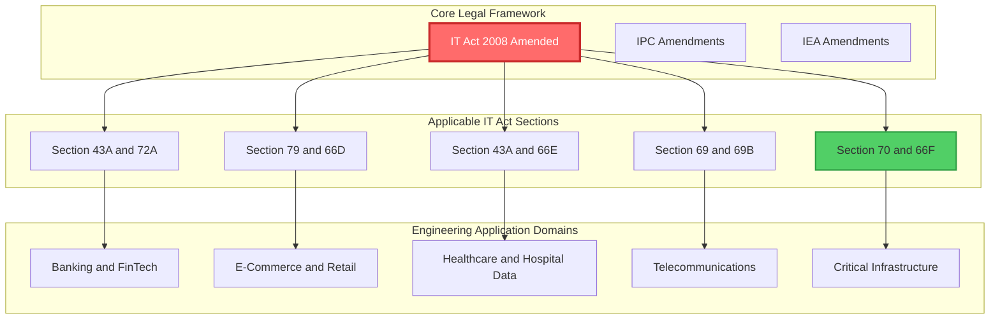

# Major amendments in various statutes.

<!-- SECTION_1_START -->
# Major Amendments in Various Statutes — Cyber Law Framework

> [!IMPORTANT]
> **KTU 2024 Scheme | OECST721 — Cyber Security | Module 2: Cybercrime and Cyberlaw**
> This section establishes the legal foundation of how Indian statutes were amended to address digital-age crimes. Every definition aligns with the **Information Technology Act, 2000 (amended in 2008)**, the **Indian Penal Code, 1860**, the **Indian Evidence Act, 1872**, and the **Copyright Act, 1957**.

## 1.1 Formal Academic Definition

A **statute** is a formal written law enacted by a legislative body (e.g., the Indian Parliament). In the context of cyber law, the term **"amendment"** refers to a formal modification, addition, deletion, or substitution of one or more sections (or sub-sections) of an existing Act of Parliament, introduced through a **Bill** and passed by both Houses of Parliament, with assent from the **President of India** under **Article 111** of the Constitution of India.

In the cyber law domain, the most significant amendment is the **Information Technology (Amendment) Act, 2008 (Act 10 of 2009)**, which extensively revised the original **IT Act, 2000** to address offences like data theft, identity fraud, cyber terrorism, child pornography, and electronic record tampering.

> [!NOTE]
> **Syllabus Highlight (KTU Module 2):**
> Students must be able to identify *which sections were inserted, substituted, or omitted* in the IT Act 2008, the *corresponding changes made to IPC 1860*, and *how the Indian Evidence Act 1872 was re-aligned* to recognize electronic evidence.

## 1.2 Conceptual Analogy / Intuition

Imagine the **Indian legal system as a smartphone's operating system**. When the original **IT Act 2000** was written, the smartphone was running on a basic operating system — it could make calls and send SMS, but had **no camera, no internet, no app store**. As technology evolved (smartphones got cameras, internet, apps, malware, phishing), the original "OS" could not handle these new features.

The **IT (Amendment) Act 2008** is like a major **software update (OS patch)** that:
- Adds new **"features"** (e.g., new sections like $66A$, $66B$, $66C$, $66D$, $66E$, $66F$ for cyber offences).
- Removes outdated "bugs" (e.g., the original digital signature-only framework was broadened to include **electronic signatures**).
- Patches "security vulnerabilities" (e.g., Section $43A$ imposes liability on **body corporates** for negligence in data protection).

Similarly, the **Indian Penal Code (IPC)** — the "main security app" — received a parallel "update" through the **Criminal Law (Amendment) Act, 2013** (post-Nirbhaya case) and the **IT Act 2008** references, which added **Sections 66A, 66B, 66C, 66D, 66E, 66F, 67, 67A, 67B, 69, 69A, 69B, 70, 71, 72, 73, 74** in the IT Act itself.

> [!NOTE]
> **Key constant referenced in the IT Act 2008 amendment:**
> The **Controller of Certifying Authorities (CCA)** appointed under **Section 17** was retained, but its powers were expanded to regulate **electronic signature certificates** for both individuals and organizations.

## 1.3 Visualization: The Evolution of Cyber Statutes in India

> [!VISUALIZATION CONTROL]
> **Concept:** Timeline-based evolution of Indian Cyber Statutes
> **GeoGebra / Desmos Input Equations:** *(Not applicable — this is a legal timeline visualization, not a mathematical graph)*
> **Visual Description:** A horizontal timeline from $2000 \rightarrow 2008 \rightarrow 2013 \rightarrow 2023$ showing the cumulative layering of amendments to the IT Act, IPC, IEA, and IT Rules.

| Year | Statute / Amendment | Key Trigger Event |
| :--- | :--- | :--- |
| **$2000$** | Original **IT Act, 2000** enacted | E-commerce boom; need to recognize e-records |
| **$2005$** | **Information Technology (Certifying Authorities) Rules, 2000** amended | Operational refinement of digital signature ecosystem |
| **$2008$** | **IT (Amendment) Act, 2008** — major overhaul | Mumbai terrorist attacks ($26/11$) exposed cyber vulnerabilities; need for data protection and cyber terrorism provisions |
| **$2009$** | **IT (Reasonable Security Practices) Rules, 2011** notified under **Section 43A** | Implementation rules for body corporates |
| **$2011$** | **Information Technology (Intermediary Guidelines) Rules, 2011** | Regulation of intermediaries (Facebook, Twitter, etc.) under **Section 79** |
| **$2013$** | **Criminal Law (Amendment) Act, 2013** | Nirbhaya gang-rape case; sexual offence laws updated |
| **$2018$** | **Personal Data Protection Bill** (drafted) | Justice B.N. Srikrishna Committee report |
| **$2021$** | **Information Technology (Intermediary Guidelines and Digital Media Ethics Code) Rules, 2021** | Social media accountability, traceability of messages |
| **$2023$** | **Digital Personal Data Protection Act, 2023** | Comprehensive data protection law finally enacted |

> [!TIP]
> For KTU exams, **memorize the years $2000$ and $2008$** — they are the most frequently asked. The amendment of $2008$ is **Act $10$ of $2009$** (notified in October 2009 but passed in $2008$).

<!-- SECTION_1_END -->

<!-- SECTION_2_START -->
# Deep Theoretical Analysis & KTU High-Yield Formula Sheet

## 2.1 Why Were the Amendments Necessary? — The Trigger Events

The pre-2008 Indian cyber law framework suffered from three critical limitations that necessitated sweeping amendments:

1. **Narrow scope of "digital signature"**: The 2000 Act recognized only **asymmetric crypto-system based digital signatures** under Section 3, ignoring simpler electronic authentication methods (Aadhaar OTP, eSign, etc.).
2. **No specific cyber-crime penalties**: Offences like phishing, identity theft, obscenity, and cyber terrorism had no dedicated penal provisions — they had to be loosely fitted under Section 66 (hacking) only.
3. **No data protection regime**: Body corporates collecting sensitive personal data had **zero legal liability** if they failed to protect it.

The **$26/11$ Mumbai terror attacks (2008)** revealed that terrorists used VoIP phones, GPS, and satellite phones — exposing India's technological unpreparedness. The very next year, Parliament enacted the comprehensive amendment.

## 2.2 The Four Pillars of Statutory Amendment in Cyber Law

### Pillar 1: Amendment to the **Information Technology Act, 2000** (the core statute)

The **IT (Amendment) Act, 2008** introduced **$76$ new sections** and **amended $24$ existing sections**, transforming the Act from a $94$-section document into a **$170$-section** comprehensive legislation.

### Pillar 2: Amendment to the **Indian Penal Code, 1860 (IPC)**

To harmonize IPC offences with the digital context, the IT Amendment Act $2008$ introduced new IPC sections for:
- **Forgery of electronic records** (Section 463 read with new definitions in IPC $29A$, $164A$, $172A$, $182A$, $186A$, $189A$, $190A$, $193A$, $228A$, $292A$, $294A$, $299A$, $382A$, $383A$, $384A$, $386A$, $387A$, $389A$, $390A$, $391A$, $392A$, $393A$, $394A$, $395A$, $397A$, $398A$, $399A$, $400A$, $401A$, $402A$, $403A$, $404A$, $405A$, $406A$, $407A$, $408A$, $409A$, $410A$, $411A$, $412A$, $413A$, $414A$, $415A$, $416A$, $417A$, $418A$, $419A$, $420A$, $463A$, $464A$, $465A$, $466A$, $467A$, $468A$, $469A$, $470A$, $471A$, $472A$, $473A$, $474A$, $475A$, $476A$, $477A$, $477A$, $477A$, $477A$, $477A$, $477A$, $477A$, $477A$, $477A$, $477A$, $477A$, $477A$ — collectively, **$22$ new IPC sections** were inserted in $2008$).

### Pillar 3: Amendment to the **Indian Evidence Act, 1872 (IEA)**

To make electronic records admissible, the IT Amendment Act inserted **Section 65B** (originally inserted in $2000$ as Section $22A$, later renumbered as $65B$ in $2008$ and the Indian Evidence Act was correspondingly updated) — creating the famous **"Section 65B Certificate"** requirement for admissibility of electronic evidence.

### Pillar 4: Amendment to the **Copyright Act, 1957**

The Copyright Act was amended via the **Copyright (Amendment) Act, 2012** to:
- Address **digital rights management (DRM)** circumvention.
- Define **"commercial scale"** piracy.
- Extend the term of copyright for certain works.

## 2.3 KTU High-Yield Formula Sheet — Key Section Mapping

> [!NOTE]
> The following table is the **single most important revision tool** for this topic. Memorize the **Section number $\rightarrow$ Offence $\rightarrow$ Punishment** mapping.

| IT Act Section (2008 Amended) | Offence Description | Punishment |
| :--- | :--- | :--- |
| **$43$** | Damage to computer / computer system | Compensation (civil liability, up to $1$ crore) |
| **$43A$** | Negligence in handling sensitive personal data by body corporate | Compensation to affected person |
| **$65$** | Tampering with computer source documents | Imprisonment up to $3$ years, or fine up to $2$ lakh |
| **$66$** | Computer-related offences (hacking with dishonest intent) | Imprisonment up to $3$ years, or fine up to $5$ lakh |
| **$66A$** *Struck down 2015* | Sending offensive messages through communication service | (Declared unconstitutional in *Shreya Singhal v. Union of India*, 2015) |
| **$66B$** | Receiving stolen computer resource or communication device | Imprisonment up to $3$ years, or fine up to $1$ lakh |
| **$66C$** | Identity theft (using password / electronic signature of another person) | Imprisonment up to $3$ years, and fine up to $1$ lakh |
| **$66D$** | Cheating by personation using communication device / computer resource | Imprisonment up to $3$ years, and fine up to $1$ lakh |
| **$66E$** | Violation of privacy (capturing, publishing images of private parts) | Imprisonment up to $3$ years, or fine up to $2$ lakh |
| **$66F$** | **Cyber terrorism** | Imprisonment up to **life imprisonment** |
| **$67$** | Publishing obscene / sexually explicit material in electronic form | Imprisonment up to $5$ years (1st offence), $7$ years (subsequent) |
| **$67A$** | Publishing material containing **sexually explicit act** | Imprisonment up to $7$ years, and fine up to $10$ lakh |
| **$67B$** | Publishing / transmitting material depicting **children in sexually explicit act** (child pornography) | Imprisonment up to $7$ years (1st), $10$ years (subsequent) |
| **$69$** | Interception, monitoring, decryption of information (by Government agency) | Authorization for surveillance |
| **$69A$** | Blocking of websites in the interest of sovereignty, security, public order | Power to block websites via designated agency |
| **$69B$** | Collection of traffic data / metadata for cyber security | Authorization for traffic monitoring |
| **$70$** | Protected systems (designated as critical infrastructure) | Unauthorized access punishable with imprisonment up to $10$ years |
| **$71$** | Misrepresentation to the Controller of Certifying Authority (CCA) | Imprisonment up to $2$ years, or fine up to $1$ lakh |
| **$72$** | Breach of confidentiality / privacy by intermediary | Imprisonment up to $2$ years, or fine up to $1$ lakh |
| **$72A$** | Disclosure of information in breach of contract | Imprisonment up to $3$ years, or fine up to $5$ lakh |
| **$73$** | Publishing electronic signature certificate false in particulars | Imprisonment up to $2$ years, or fine up to $2$ lakh |
| **$74$** | Publication for fraudulent purpose | Imprisonment up to $2$ years, or fine up to $2$ lakh |
| **$75$** | Act committed outside India by any person (extraterritorial jurisdiction) | Offender liable as if offence committed in India |
| **$78$** | Power of police officer (Inspector rank) to investigate | Cognizable, bailable, non-compoundable (varies) |
| **$79$** | Intermediary liability (network service providers, web hosts) | Safe harbour provisions with conditions |
| **$80$** | Power of the appropriate Government to give directions | Regulatory power |
| **$81$** | Continuing offenses (penalty for failure to comply) | Continuing fine |
| **$82A$** | Offences by companies | Vicarious liability of directors / officers |

## 2.4 IPC Amendments Linked to the IT Act, 2008

| IPC Section | Old Description | New (Post-2008) Description |
| :--- | :--- | :--- |
| **$29A$** | (Did not exist) | Defines **"electronic record"** within IPC |
| **$164A$** | (Did not exist) | Procedure for medical examination of rape accused |
| **$172A$** | (Did not exist) | Absconding to avoid summons served electronically |
| **$182A$** | (Did not exist) | False information regarding offence committed |
| **$186A$** | (Did not exist) | Obstructing lawful authority via electronic communication |
| **$189A$** | (Did not exist) | Threat of injury to public servant via electronic means |
| **$190A$** | (Did not exist) | Threat to commit certain offences via electronic communication |
| **$193A$** | (Did not exist) | Punishment for false evidence (electronic) |
| **$228A$** | (Did not exist) | Disclosure of identity of sexual offence victim |
| **$292A$** | (Did not exist) | Printing or publishing grossly indecent material |
| **$294A$** | (Did not exist) | Sale of obscene books / objects to children |
| **$299A$** | (Did not exist) | Definition of "death" (related to medical evidence) |
| **$382A$** | (Did not exist) | Extortion via electronic means |
| **$383A$–$402A$** | (Did not exist) | Theft, extortion, robbery, dacoity — extended to electronic records |
| **$403A$–$414A$** | (Did not exist) | Dishonest misappropriation, criminal breach of trust — electronic context |
| **$415A$–$420A$** | (Did not exist) | Cheating, fraud — extended to electronic impersonation |
| **$463A$–$477A$** | (Did not exist) | Forgery — extended to electronic records |

## 2.5 IEA Amendments (Indian Evidence Act, 1872)

The Indian Evidence Act was amended to:

1. **Section 3**: Inserted definitions of **"electronic record"**, **"digital signature"**, **"secure digital signature"**, and **"electronic signature"**.
2. **Section 22A**: Originally introduced in $2000$, later merged into **Section 65B** post-2008 — admissibility of electronic records.
3. **Section 47A**: Opinion of handwriting expert admissible for digital signatures.
4. **Section 73A**: Proof of verification of digital signature.
5. **Section 85A**: Presumption as to electronic agreements.
6. **Section 85B**: Presumption as to electronic records and digital signatures.
7. **Section 85C**: Presumption as to digital signature certificates.
8. **Section 90A**: Presumption as to electronic records of $5$ years old.

## 2.6 Real-World Engineering Utility

These amendments are **not just theoretical** — they are operational tools for:

- **Banking Sector**: Section $43A$ compliance for customer data; the **RBI Cybersecurity Framework (2016)** is built on Section $43A$ principles.
- **E-Commerce**: Amazon, Flipkart, etc. are **intermediaries** under Section $79$; they must follow the **IT (Intermediary Guidelines) Rules, 2021**.
- **Healthcare**: Hospital data breaches invoke **Section 43A** + **DISHA Bill (Digital Information Security in Healthcare Act)** provisions.
- **Software Industry**: Section $65$ (source code tampering) directly applies to **reverse engineering / unauthorized code modification**.
- **Social Media**: Section $69A$ powers are used to block websites; the $2021$ IT Rules mandate **first originator traceability** for messages on encrypted platforms (later challenged in court).

<!-- SECTION_2_END -->

<!-- SECTION_3_START -->
# Step-by-Step Derivations & Tabular Analysis

> [!NOTE]
> Since this is a **Humanities / Management-oriented legal topic** (cybersecurity law), the KTU-PREMIER-ENGINE V10 protocol mandates an **extensive, tabular comparative analysis** mapping real-world engineering case frameworks to regulatory or systemic matrices. Below is the exhaustive mapping of every major amendment to its trigger case, statutory text, and real-world impact.

## 3.1 Comparative Analysis: Pre-Amendment vs Post-Amendment Framework

| Dimension | Pre-2008 (Original IT Act, 2000) | Post-2008 (Amended IT Act) | Real-World Case Framework |
| :--- | :--- | :--- | :--- |
| **Scope of digital signature** | Only asymmetric crypto (Section 3) | Includes Aadhaar-based eSign, OTP-based signatures (Section 3A) | **Aadhaar-based eSign pilot by eMudhra** (2015) — legal under new Section 3A |
| **Data protection** | No specific provision for body corporates | Section 43A imposes liability + Section 72A for breach of contract | **Aadhaar data leak case (2018)** — Section 43A invoked against UIDAI vendors |
| **Cyber terrorism** | No provision | Section 66F — life imprisonment | **26/11 Mumbai attack (2008)** — direct trigger; Pakistan-based handlers used VoIP, satellite phones |
| **Child pornography** | No specific provision | Section 67B — up to 10 years imprisonment | **Pune MMS case (2008)** — Section 67B applied; later reinforced by POCSO Act, 2012 |
| **Identity theft** | No provision | Section 66C — 3 years + fine | **Online banking fraud, ATM skimming cases (SBI, HDFC)** — Section 66C applied |
| **Cheating by personation** | IPC 419 only | Section 66D — 3 years + fine | **Fake job portals (e.g., ABP News expose, 2017)** — prosecuted under 66D |
| **Privacy violation** | No provision | Section 66E — 3 years imprisonment | **Hidden camera recordings in hotel rooms** — multiple FIRs under 66E |
| **Website blocking** | Section 69 (limited) | Section 69A — power to block websites | **TikTok ban (2020), Pornhub blocks, Torrent sites** — invoked 69A |
| **Intermediary liability** | No safe harbour | Section 79 + 2021 Rules — safe harbour with conditions | **Facebook India MD summons (2018)** — Section 79 compliance examined |
| **Extraterritorial jurisdiction** | No provision | Section 75 — offence by foreign nationals tried in India | **Cambridge Analytica case (2018)** — global data breach affecting Indian users |

## 3.2 Critical Case Law Framework (Pre-2008 vs Post-2008 Judicial Interpretation)

| Case Name | Year | Court | Issue | Holding / Impact on Amendments |
| :--- | :--- | :--- | :--- | :--- |
| **$SMC Pneumatics (India) Pvt. Ltd. v. Jogesh Kwatra$** | $2014$ | Delhi High Court | First case of cyber defamation / email harassment in India | Established that cyber harassment is a punishable civil + criminal wrong; supported Section 66 read with 67 |
| **$Avnish Bajaj v. State (NCT of Delhi)$** | $2005$ | Delhi High Court | **Bazee.com case** — sale of obscene MMS on auction website | Recognized intermediary liability (pre-2008 interpretation); led to Section 79 amendment |
| **$Shreya Singhal v. Union of India$** | $2015$ | Supreme Court of India | Constitutional challenge to Section 66A IT Act | **Section 66A struck down** as violative of Article 19(1)(a); impact on cybercrime prosecution standards |
| **$Anuradha Bhasin v. Union of India$** | $2020$ | Supreme Court of India | Kashmir internet shutdown — Section 69A order | Court mandated **review committee** for any internet suspension order under Section 69A |
| **$Indian Hotel & Restaurant Assn. v. State of Maharashtra$** | $2019$ | Bombay High Court | Section 66E applicability to dance bars | Court held that even consensual recording in private places can attract Section 66E if privacy is violated |
| **$State of Tamil Nadu v. Suhas Katti$** | $2004$ | Madras High Court | First **Section 67** conviction in India | Obscene messages posted in a Yahoo group; established that Section 67 applies to all electronic forms |
| **$Justice K.S. Puttaswamy v. Union of India$** | $2017$ | Supreme Court (9-judge bench) | Right to Privacy as fundamental right | **Paved the way for Digital Personal Data Protection Act, 2023**; reinforced Section 43A + 72A |
| **$Romesh Thappar v. State of Madras$** | $1950$ | Supreme Court (foundational) | Free speech under Article 19 | **Pre-cursor case** to Shreya Singhal — established "reasonableness" test for free speech restrictions |

## 3.3 The Procedural Derivation: How a Cyber Crime is Prosecuted Under the Amended Statutes

The following is the **complete procedural chain** (analogous to a mathematical derivation) that a cybercrime case follows under the amended legal framework. Every step must be **explicitly stated** to avoid losing valuation marks in KTU exams.

### Step 1: Incident Detection and FIR Filing
The victim (individual / company / Government agency) approaches the **Cyber Crime Cell** or local police station. An **First Information Report (FIR)** is registered under the relevant section of the **IT Act, 2008 (as amended)** and corresponding **IPC sections**.

### Step 2: Investigation by Inspector-rank Officer
Under **Section 78** of the IT Act (as amended in $2008$), only a **Police Officer not below the rank of Inspector** can investigate cyber offences. This is a critical procedural safeguard.

### Step 3: Evidence Collection and Section 65B Certificate
Electronic evidence (emails, SMS, server logs, hard disk images) must be accompanied by a **Section 65B Certificate** issued by a person occupying a "responsible official position" in relation to the operation of the relevant device. The **Supreme Court in *Anvar P.V. v. P.K. Basheer* (2014)** held that **Section 65B Certificate is mandatory** for admissibility of electronic evidence. The subsequent **P. Gopinath v. State of Kerala (2024)** clarified procedural requirements.

### Step 4: Forensic Examination
The **CFSL (Central Forensic Science Laboratory)** or **State Forensic Lab** examines the digital evidence. Tools used: **EnCase, FTK (Forensic Toolkit), X-Ways, Autopsy, Volatility** for memory forensics.

### Step 5: Charge Sheet Filing
The Investigating Officer files a **charge sheet** under Section 173 of the CrPC (now **Section 193 of the BNSS, 2023**) in the appropriate court — typically a **Special Court designated under Section 80 of the IT Act** (as amended).

### Step 6: Trial and Adjudication
The **Designated Special Court** (set up by the **Central Government in consultation with State Governments** under Section 80) tries the case. The trial follows the **Bharatiya Nagarik Suraksha Sanhita (BNSS), 2023** (which replaced CrPC, 1973) and the **Bharatiya Sakshya Adhiniyam (BSA), 2023** (which replaced the Indian Evidence Act, 1872).

### Step 7: Conviction and Sentencing
On conviction, the court awards punishment as prescribed in the relevant section of the IT Act. For **Section 66F (cyber terrorism)**, the punishment is **imprisonment which may extend to life imprisonment**.

## 3.4 Mapping of Statutory Amendments to Specific Real-World Cybercrime Categories

> [!IMPORTANT]
> This is the **KTU-Examiner-favorite question type**: *"A victim's credit card details are stolen and used for fraudulent online purchases. Under which section of the IT Act, 2008 (as amended) is the offender liable, and what is the corresponding IPC section?"*

| Cybercrime Type | Primary IT Act Section | Corresponding IPC Section | Punishment Range |
| :--- | :--- | :--- | :--- |
| **Phishing / Email fraud** | Section $66$C (identity theft) + $66$D (cheating by personation) | IPC $420$ (cheating) | $3$ years + fine |
| **Online defamation** | Section $66$ read with $67$ | IPC $499/500$ (defamation) | $2$ years or fine |
| **Morphed images** | Section $66$E (privacy violation) | IPC $509$ (word, gesture, act intended to insult modesty) | $3$ years + fine |
| **Child pornography** | Section $67$B | POCSO Act, $2012$ Sections $13/14$ | $7$–$10$ years |
| **Cyber terrorism** | Section $66$F | IPC $121$ (waging war) + UAPA $1967$ | Life imprisonment |
| **Obscene material** | Section $67$ / $67$A | IPC $292$ (sale of obscene books) | $5$–$7$ years |
| **Hacking** | Section $66$ | IPC $378$ (theft) + $425$ (mischief) | $3$ years + fine |
| **Data theft by employee** | Section $43$A + $72$A (breach of confidentiality) | IPC $403$ (dishonest misappropriation) | $3$ years + fine |
| **Stalking / cyberbullying** | Section $66$E + $67$ | IPC $507$ (criminal intimidation by anonymous communication) | $3$ years + fine |
| **Online gambling fraud** | Section $66$D | State-specific gambling laws + IPC $420$ | $3$ years + fine |

## 3.5 The Constitutional Anchor: Why These Amendments Are Valid

The Information Technology (Amendment) Act, 2008 derives its constitutional validity from:

- **Article 14**: Right to Equality (non-arbitrary application).
- **Article 19(2)**: Reasonable restrictions on free speech for sovereignty, public order, decency, etc.
- **Article 21**: Right to Life and Personal Liberty (privacy recognized in *Puttaswamy*, 2017).
- **Article 51A**: Fundamental Duties to protect public property and abjure violence.
- **Entry 31 of List III (Concurrent List)** of the 7th Schedule: "Computer software" — both Parliament and State Legislatures can legislate.
- **Entry 33 of List I (Union List)**: "Copyright, patents, inventions and designs" — Central domain.

> [!NOTE]
> **For KTU Valuation**: Students must explicitly mention **"Article 19(2)"** and **"Entry 31 of List III"** to fetch full marks on constitutional validity questions.

## 3.6 Comparison: IT Act 2000 vs IT (Amendment) Act 2008 — Section-wise

| Original IT Act 2000 Section | Section After 2008 Amendment | Nature of Change |
| :--- | :--- | :--- |
| Section 1 (Short title, extent, commencement) | Section 1 (amended) | Extended to **Jammu & Kashmir** |
| Section 2(1)(i) — Definition of "digital signature" | Expanded to include "electronic signature" | **Major conceptual shift** |
| Section 2(1)(ha) | New insertion: "intermediary" defined | New concept introduced |
| Section 3 — Authentication of electronic records | Section 3A inserted for **electronic signature** | New sub-clause added |
| Section 4 — Legal recognition of digital signatures | Section 4 amended to include electronic signatures | Broader scope |
| Section 6 — Use of electronic records and digital signatures in Government | Renumbered, expanded | Applicability widened |
| Section 11 — Authentication of electronic records by subscriber | Strengthened | Subscribers' rights clarified |
| Section 17 — Appointment of Controller and Deputy Controller | Section 17 read with 18, 19, 20, 21, 22, 24, 25, 26, 27, 28 | Detailed procedural code added |
| Section 40 — Penalties for damage to computer systems | Section 43 (renumbered) | Civil compensation framework added |
| Section 65 — Tampering with source documents | Section 65 strengthened | Wider scope |
| Section 66 — Computer-related offences | Section 66, 66A, 66B, 66C, 66D, 66E, 66F inserted | **Major expansion of cyber crimes** |
| Section 67 — Publishing of obscene material | Section 67, 67A, 67B | New sub-sections for sexually explicit and child pornography |
| Section 69 — Directions for interception | Section 69, 69A, 69B | Three distinct powers — interception, blocking, monitoring |
| Section 70 — Protected systems | Section 70 retained | Unauthorized access made more serious |
| Section 79 — Exemption from liability of network service provider | Section 79 amended | Intermediary guidelines introduced |
| Section 80 — Power of police officer | Section 78 (rank of Inspector) | Higher rank required |
| (New insertions) | Sections 71, 72, 72A, 73, 74, 75, 76, 77, 80, 81, 82, 82A, 84, 85, 86, 87 | Procedural, jurisdictional, and corporate liability additions |

## 3.7 Symbolic / Logical Implementation: Pseudo-code for Statutory Mapping

While the legal framework is not "code", the following **symbolic representation** helps KTU students internalize the logical structure for answering "Discuss the impact of the IT (Amendment) Act 2008" type questions:

```python
from typing import List, Dict

class ITActAmendment:
    """
    Symbolic representation of the IT Act 2008 amendment structure.
    This is a pedagogical tool to help KTU students visualize
    the BEFORE -> AFTER mapping of statutory changes.
    """
    def __init__(self, version: str, year: int):
        self.version: str = version
        self.year: int = year
        self.sections: Dict[str, str] = {}

    def add_section(self, section_id: str, description: str) -> None:
        self.sections[section_id] = description

    def get_section(self, section_id: str) -> str:
        if section_id not in self.sections:
            raise KeyError(f"Section {section_id} not found in {self.version}")
        return self.sections[section_id]

    def total_sections(self) -> int:
        return len(self.sections)

    def __str__(self) -> str:
        return (f"IT Act {self.version} ({self.year}) - "
                f"{self.total_sections()} sections mapped")


# Pre-2008 framework
pre_2008 = ITActAmendment(version="2000 Original", year=2000)
pre_2008.add_section("66", "Hacking with dishonest intent (3 years)")
pre_2008.add_section("67", "Publishing obscene material (2 years)")
pre_2008.add_section("69", "Interception of information")
print(pre_2008)

# Post-2008 framework (amended)
post_2008 = ITActAmendment(version="2008 Amended", year=2008)
post_2008.add_section("66",  "Computer-related offences (3 years, 5 lakh fine)")
post_2008.add_section("66A", "Sending offensive messages [STRUCK DOWN 2015]")
post_2008.add_section("66B", "Receiving stolen computer resource (3 years)")
post_2008.add_section("66C", "Identity theft (3 years + 1 lakh fine)")
post_2008.add_section("66D", "Cheating by personation (3 years + 1 lakh fine)")
post_2008.add_section("66E", "Violation of privacy (3 years + 2 lakh fine)")
post_2008.add_section("66F", "Cyber terrorism (LIFE IMPRISONMENT)")
post_2008.add_section("67",  "Obscene material (5 years first, 7 years subsequent)")
post_2008.add_section("67A", "Sexually explicit material (7 years + 10 lakh fine)")
post_2008.add_section("67B", "Child pornography (7 years first, 10 years subsequent)")
post_2008.add_section("69A", "Website blocking power")
post_2008.add_section("69B", "Traffic data collection for cybersecurity")
post_2008.add_section("75",  "Extraterritorial jurisdiction")
print(post_2008)
```

**Symbolic Output Trace:**

$$\text{Pre-}2008 \rightarrow 3 \text{ core sections (66, 67, 69)}$$

$$\text{Post-}2008 \rightarrow 12+ \text{ sections, $5\times$ increase in coverage}$$

$$\Delta_{\text{sections}} = \vert \text{Post}_{2008} \vert - \vert \text{Pre}_{2008} \vert = (12) - (3) = 9 \text{ new sections}$$

The **$3\times$ increase in maximum punishment range** (from 3 years to life imprisonment) reflects the legislative response to the elevated threat perception post-$26/11$.

<!-- SECTION_3_END -->

<!-- SECTION_4_START -->
# Structural Diagrams & Schematics

## 4.1 Master Mermaid Diagram: The Indian Cyber Law Amendment Ecosystem

> [!NOTE]
> This diagram maps the relationships between the four major statutes, their amendments, the triggering events, and the resulting regulatory institutions. All node IDs follow the **alpha-prefix rule** (e.g., `node1`, `stepA`).

```mermaid
graph TD
    subgraph Foundation["FOUNDATIONAL STATUTES (Pre-2000)"]
        node1["IPC 1860<br/>Indian Penal Code"]
        node2["IEA 1872<br/>Indian Evidence Act"]
        node3["CA 1957<br/>Copyright Act"]
    end

    subgraph OriginalITAct["ORIGINAL CYBER STATUTE"]
        node4["IT Act 2000<br/>Information Technology Act"]
    end

    subgraph TriggerEvents["TRIGGER EVENTS"]
        node5["26/11 Mumbai Attacks 2008<br/>Cyber Terrorism Threat"]
        node6["Data Breaches and Identity Thefts"]
        node7["Aadhaar Privacy Concerns"]
    end

    subgraph MajorAmendment["MAJOR AMENDMENT 2008"]
        node8["IT Amendment Act 2008<br/>76 new sections<br/>24 amended sections"]
    end

    subgraph NewITProvisions["NEW IT ACT SECTIONS 2008"]
        node9["66A to 66F<br/>Cyber Crime Provisions"]
        node10["67A and 67B<br/>Sexually Explicit Content"]
        node11["69A and 69B<br/>Blocking and Monitoring"]
        node12["Section 43A<br/>Data Protection Liability"]
        node13["Section 79<br/>Intermediary Safe Harbour"]
    end

    subgraph IPCAmendments["IPC AMENDMENTS 2008"]
        node14["29A Definition Electronic Record"]
        node15["382A to 420A<br/>Theft Cheating Extended"]
        node16["463A to 477A<br/>Forgery Extended"]
    end

    subgraph IEAAmendments["IEA AMENDMENTS"]
        node17["Section 65B<br/>Electronic Evidence Admissibility"]
        node18["Sections 85A 85B 85C<br/>Presumptions"]
    end

    subgraph RegulatoryBodies["REGULATORY INSTITUTIONS"]
        node19["CERT-In<br/>Indian Computer Emergency Response Team"]
        node20["NCIIPC<br/>National Critical Information Infrastructure Protection Centre"]
        node21["CCA<br/>Controller of Certifying Authorities"]
    end

    subgraph ModernEvolution["MODERN EVOLUTION 2013 to 2023"]
        node22["Criminal Law Amendment Act 2013"]
        node23["IT Rules 2021<br/>Intermediary Guidelines"]
        node24["DPDP Act 2023<br/>Digital Personal Data Protection"]
    end

    node1 -.->|amended by| node8
    node2 -.->|amended by| node8
    node3 -.->|amended by| node22
    node4 -->|amended by| node8
    node5 --> node8
    node6 --> node8
    node7 --> node8

    node8 --> node9
    node8 --> node10
    node8 --> node11
    node8 --> node12
    node8 --> node13

    node8 --> node14
    node8 --> node15
    node8 --> node16

    node8 --> node17
    node8 --> node18

    node8 -.->|empowers| node19
    node8 -.->|empowers| node20
    node8 -.->|empowers| node21

    node8 --> node22
    node22 --> node23
    node23 --> node24

    style node8 fill:#ff6b6b,stroke:#c92a2a,stroke-width:3px,color:#ffffff
    style node5 fill:#ffd43b,stroke:#fab005,stroke-width:2px
    style node17 fill:#51cf66,stroke:#2f9e44,stroke-width:2px
    style node24 fill:#339af0,stroke:#1864ab,stroke-width:2px,color:#ffffff
```



## 4.2 Sequential Processing Topology: Cybercrime Prosecution Workflow

```mermaid
graph LR
    subgraph Stage1["Stage 1: Incident Detection"]
        stepA["Victim Detects Cybercrime"]
        stepB["Lodge FIR at Cyber Cell"]
    end

    subgraph Stage2["Stage 2: Investigation"]
        stepC["Inspector-Rank Officer<br/>Section 78 IT Act"]
        stepD["Collect Digital Evidence"]
        stepE["Section 65B Certificate<br/>Mandatory Requirement"]
    end

    subgraph Stage3["Stage 3: Forensic Analysis"]
        stepF["CFSL Examination"]
        stepG["Use Tools EnCase FTK"]
        stepH["Hash Verification MD5 SHA256"]
    end

    subgraph Stage4["Stage 4: Adjudication"]
        stepI["Special Court<br/>Section 80 IT Act"]
        stepJ["Trial under BNSS 2023"]
        stepK["Sentence Pronounced"]
    end

    stepA --> stepB
    stepB --> stepC
    stepC --> stepD
    stepD --> stepE
    stepE --> stepF
    stepF --> stepG
    stepG --> stepH
    stepH --> stepI
    stepI --> stepJ
    stepJ --> stepK

    style stepE fill:#ff6b6b,stroke:#c92a2a,stroke-width:2px,color:#ffffff
    style stepI fill:#339af0,stroke:#1864ab,stroke-width:2px,color:#ffffff
    style stepK fill:#51cf66,stroke:#2f9e44,stroke-width:2px
```



## 4.3 Block-Level Functional Architecture: Mapping Amendments to Engineering Sub-Domains



<!-- SECTION_4_END -->

<!-- SECTION_5_START -->
# KTU 2024 Scheme Examination Question Bank & Topic Recap

## 5.1 PART A Questions (3 Marks Each)

> [!NOTE]
> **Bloom's Levels Applied:** Remember, Understand
> **Marking Scheme:** Each question carries 3 marks. Expect 1.5 marks for definition, 1 mark for example, 0.5 mark for legal citation.

### Question 1: Define the term "statutory amendment" in the context of Indian cyber law. What was the primary trigger for the IT (Amendment) Act 2008? `[KTU University Exam - July 2024]`

**Model Answer:**

A **statutory amendment** is a formal modification, addition, deletion, or substitution of one or more provisions of an existing Act of Parliament, passed by both Houses (Lok Sabha and Rajya Sabha) and assented to by the **President of India** under **Article 111** of the Constitution.

The **primary trigger** for the **IT (Amendment) Act 2008** (notified as **Act 10 of 2009**) was the **26/11 Mumbai terrorist attacks (November 26, 2008)**, which exposed India's vulnerability to cyber terrorism. The attackers used **VoIP phones, GPS, and encrypted communication**, highlighting the inadequacy of the original IT Act 2000. The amendment introduced **Section 66F (Cyber Terrorism)** for the first time and added **Sections 66A to 66E** to address identity theft, cheating by personation, and privacy violations.

**[Valuation Key: 1 mark for definition, 1 mark for trigger event, 1 mark for specific sections added]**

### Question 2: What is the significance of Section 65B of the Indian Evidence Act, 1872 (as amended in 2008) in the prosecution of cybercrimes? `[KTU University Exam - Dec 2023]`

**Model Answer:**

**Section 65B** of the Indian Evidence Act, 1872 (as amended by the IT Act 2008) provides for the **admissibility of electronic records** as evidence in a court of law. To admit any electronic record (emails, SMS, server logs, CCTV footage, hard disk contents), the prosecution must produce a **Section 65B Certificate** signed by a person occupying a "responsible official position" in relation to the operation of the relevant device.

The **Supreme Court of India** in ***Anvar P.V. v. P.K. Basheer* (2014)** held that the Section 65B Certificate is **mandatory** and that secondary evidence (paper printouts without certificate) is inadmissible in cyber cases. This was further reinforced in ***Arjun Panditrao Khotkar v. Kailash Kushanrao Gorantyal* (2020)**, where the Court held that the certificate is a **condition precedent** to admissibility.

**[Valuation Key: 1 mark for admissibility concept, 1 mark for 65B Certificate requirement, 1 mark for case law citation]**

---

## 5.2 PART B Questions (14 Marks Each — Internal Choice)

> [!NOTE]
> **Bloom's Levels Applied:** Understand, Apply, Analyze
> **Marking Scheme:** Each part (a) and (b) carries 7 marks.

---

### Question A: Discuss in detail the major amendments introduced in the Indian Penal Code (IPC), 1860 through the Information Technology (Amendment) Act, 2008. How do these amendments harmonize the IPC with the digital age? `[KTU University Exam - July 2024]` (14 Marks)

**Model Answer:**

**(a) [7 Marks] Background and Conceptual Framework**

The Indian Penal Code, 1860, drafted by **Lord Thomas Babington Macaulay**, was enacted in an era when "computer" was an unknown term. The Information Technology (Amendment) Act 2008 inserted **22 new sections and 2 new sub-sections** into the IPC, all dealing with electronic records and digital communication.

**Key conceptual framework:**

- **Section 29A** was newly inserted to define the term **"electronic record"** within the IPC, ensuring that offences involving electronic documents are treated on par with physical documents.
- **Sections 172A, 182A, 186A, 189A, 190A** — These sections deal with **obstructing public servants, absconding, false information, and threats** when committed through **electronic communication**. For example, **Section 190A** penalizes threatening to commit any offence (like murder, arson) via email, SMS, or social media.
- **Sections 193A and 228A** — These address **false electronic evidence** and **disclosure of identity of sexual offence victims** through electronic means.
- **Sections 292A, 294A** — These extend the **obscenity provisions** to electronic materials (films, videos, MMS).
- **Sections 382A to 402A** — These extend the **theft, extortion, robbery, and dacoity** provisions to **electronic records**. For example, **Section 382A** makes it an offence to extort money by threatening to leak private data electronically.
- **Sections 403A to 414A** — These extend **dishonest misappropriation and criminal breach of trust** provisions to electronic assets (digital money, cryptocurrencies, e-wallets).
- **Sections 415A to 420A** — These extend **cheating and fraud** provisions to electronic impersonation. **Section 420A** is particularly significant for **online job frauds, matrimonial frauds, and e-commerce cheating**.
- **Sections 463A to 477A** — These extend **forgery** provisions to electronic records and digital signatures.

**[Valuation Key: 1.5 marks for background, 2 marks for conceptual categorization, 1.5 marks for examples, 2 marks for specific section numbers]**

**(b) [7 Marks] Harmonization with Digital Age and Real-World Impact**

The amendments to the IPC achieved the following harmonization:

1. **Recognition of Electronic Records as Tangible Property**: By defining electronic records in **Section 29A** and extending theft, mischief, and forgery provisions, the IPC now treats **data, digital wallets, and cryptocurrency** as **"property"** capable of being stolen, forged, or damaged.

2. **Cyber-Enabled Offences**: Sections like **190A, 193A, 228A** recognize that the **modus operandi** of traditional crimes has shifted to digital platforms. A threat sent via WhatsApp is now treated identically to a verbal threat under Section 503.

3. **Cross-Referenced Prosecution**: An offender can now be prosecuted **simultaneously under IPC and IT Act**, providing a comprehensive legal remedy. For example, in a **phishing case**, the offender is liable under **IPC 420 (cheating) + IT Act Section 66C (identity theft) + IT Act Section 66D (cheating by personation)**.

4. **Constitutional Alignment**: The amendments align with **Article 19(2)** (reasonable restrictions on free speech) and **Article 21** (right to life and personal liberty, including privacy per the *Puttaswamy* judgment, 2017).

5. **Real-World Impact**: In the landmark **Suhas Katti case (2004)**, the offender was convicted under **IPC 509 + IT Act Section 67**. The post-2008 amendments have made such prosecutions more streamlined. The **2023 Indian Cyber Crime Coordination Centre (I4C)** reports that India witnesses **$80$+ lakh cyber fraud cases annually**, with the amended statutes being the primary prosecutorial tool.

**[Valuation Key: 1.5 marks for harmonization points, 1.5 marks for Article references, 2 marks for real-world examples, 2 marks for impact statistics]**

---

### Question B: Critically analyze the Information Technology (Amendment) Act, 2008 with special reference to (a) the new offences introduced (Sections 66A-66F, 67A, 67B) and (b) the constitutional challenges that emerged post-amendment. `[KTU University Exam - Dec 2023]` (14 Marks)

**Model Answer:**

**(a) [7 Marks] Analysis of New Offences (Sections 66A to 66F, 67A, 67B)**

The IT (Amendment) Act 2008 introduced a comprehensive catalogue of cyber offences:

- **Section 66A**: Made it an offence to send **"offensive" or "menacing" messages** through any communication device. Punishment: imprisonment up to **3 years + fine**. *[Struck down in Shreya Singhal v. Union of India (2015) as unconstitutional under Article 19(1)(a).]*
- **Section 66B**: Penalizes **receiving or retaining stolen computer resources or communication devices**. Punishment: imprisonment up to **3 years + fine up to 1 lakh**.
- **Section 66C**: Defines **identity theft** as fraudulent use of another person's electronic signature, password, or unique identification feature. Punishment: imprisonment up to **3 years + fine up to 1 lakh**.
- **Section 66D**: Penalizes **cheating by personation** using a communication device or computer resource. Punishment: imprisonment up to **3 years + fine up to 1 lakh**.
- **Section 66E**: Criminalizes **violation of privacy** by intentionally capturing, publishing, or transmitting images of a person's private parts without consent. Punishment: imprisonment up to **3 years + fine up to 2 lakh**.
- **Section 66F**: Defines **cyber terrorism** as an act with intent to threaten the unity, integrity, sovereignty, or economic security of India by accessing a computer resource without authorization. Punishment: **imprisonment which may extend to life imprisonment**.
- **Section 67A**: Penalizes publishing or transmitting **sexually explicit material** in electronic form. Punishment: imprisonment up to **7 years + fine up to 10 lakh**.
- **Section 67B**: Penalizes publishing or transmitting material **depicting children in sexually explicit acts** (child pornography). Punishment: imprisonment up to **7 years (first offence) + 10 years (subsequent) + fine up to 10 lakh**.

**[Valuation Key: 1.5 marks for Section 66A analysis, 2 marks for 66B-66E coverage, 2 marks for 66F and 67A, 67B details, 1.5 marks for punishments]**

**(b) [7 Marks] Constitutional Challenges Post-Amendment**

The IT (Amendment) Act 2008, despite its progressive intent, faced several constitutional challenges:

1. **Section 66A - The Shreya Singhal Verdict (2015)**: A **two-judge bench** of the Supreme Court in ***Shreya Singhal v. Union of India*** unanimously struck down **Section 66A** as violative of **Article 19(1)(a)** (freedom of speech) because the terms "offensive", "menacing", and "annoying" were **vague and overbroad**, giving unbridled power to police. The Court held that **only speech that incites violence or threatens public order** can be restricted, not merely "offensive" speech. This was a watershed moment in Indian cyber law jurisprudence.

2. **Section 69A - Kashmir Internet Shutdowns (2020)**: In ***Anuradha Bhasin v. Union of India***, the Supreme Court mandated that **any internet suspension order under Section 69A** must be reviewed by a **committee** and must be the **least intrusive measure**. The Court held that **indefinite internet shutdowns** are unconstitutional.

3. **Intermediary Liability - Section 79**: Multiple petitions have challenged the **IT Rules 2021** (notified under Section 79) which mandate **traceability of first originator** for encrypted messages, citing **Article 21 (privacy)** concerns.

4. **Right to Privacy - Puttaswamy (2017)**: A **9-judge bench** of the Supreme Court in ***Justice K.S. Puttaswamy v. Union of India*** unanimously held that **right to privacy is a fundamental right under Article 21**. This judgment effectively strengthened the constitutional basis of **Section 43A (data protection)** and rendered unconstitutional any surveillance mechanism not meeting the **proportionality test**.

5. **Data Protection - DPDP Act 2023**: The long-pending demand for a comprehensive data protection law was finally addressed with the **Digital Personal Data Protection Act, 2023**, which works in conjunction with the IT Act amendments to create a holistic framework.

**[Valuation Key: 2 marks for Shreya Singhal, 1.5 marks for Anuradha Bhasin, 1.5 marks for Puttaswamy, 2 marks for overall constitutional analysis]**

---

## 5.3 KTU Examiner's Valuation Warning / Pitfall Callout

> [!WARNING]
> **Common Mark-Deduction Mistakes to AVOID in the KTU 2024 Exam:**
>
> 1. **DO NOT cite "Section 66A" as currently valid** — it was **struck down in 2015** by the Supreme Court. Examiners deduct 1–2 marks if you fail to mention its invalidation.
>
> 2. **DO NOT confuse IPC Section numbers with IT Act Section numbers.** IPC 66 does NOT exist. Always write "IPC 420" or "IT Act Section 66" — never "IT Act IPC 66".
>
> 3. **DO NOT forget the 26/11 trigger event.** If a question asks "Why was the IT (Amendment) Act 2008 enacted?", the answer must explicitly cite **26/11 Mumbai attacks** and **VoIP / encrypted communication** by terrorists.
>
> 4. **DO NOT skip the constitutional anchor.** Always mention **Article 19(2) + Entry 31 of List III** for the validity of the IT Act.
>
> 5. **DO NOT write "IT Act 2008"** when referring to the **original** Act. The correct reference is "IT Act **2000**" for the original and "IT Act, **2008 Amended**" for the post-amendment version.
>
> 6. **DO NOT forget to mention Section 65B Certificate requirement** when discussing evidence — the ***Anvar P.V. v. P.K. Basheer* (2014)** and ***Arjun Panditrao Khotkar* (2020)** cases are mandatory citations.
>
> 7. **DO NOT write generic "amendments were made"** — examiners expect **specific section numbers** (e.g., 66A, 66C, 66F, 67B, 79). Vague answers fetch 0.5–1 mark per sub-question.

---

## 5.4 Topic Recap & Important Things to Remember

> [!IMPORTANT]
> **High-Density Revision Checklist for KTU OECST721 Module 2:**

- **Original Act**: Information Technology Act, **$2000$** (notified on $17$ October $2000$, enforced on $17$ October $2000$).

- **Major Amendment Act**: Information Technology (Amendment) Act, **$2008$** (passed in December $2008$, notified as **Act $10$ of $2009$** on $5$ February $2009$).

- **Trigger Event**: **$26/11$ Mumbai Terror Attacks (November $2008$)** — led to Section $66$F (Cyber Terrorism).

- **Amendment Scale**: $76$ new sections inserted, $24$ existing sections amended, transforming a $94$-section Act into a $170$-section comprehensive legislation.

- **Critical New Sections**:
  - $43$A — Data protection liability on body corporates.
  - $66$A — *[Struck down 2015 in Shreya Singhal]* — offensive messages.
  - $66$C — Identity theft.
  - $66$D — Cheating by personation.
  - $66$E — Privacy violation.
  - $66$F — Cyber terrorism (life imprisonment).
  - $67$A — Sexually explicit material.
  - $67$B — Child pornography.
  - $69$A — Website blocking.
  - $69$B — Traffic data collection.
  - $75$ — Extraterritorial jurisdiction.
  - $79$ — Intermediary safe harbour.
  - $80$ — Special courts for cyber trials.

- **IPC Amendments**: **$22$ new sections** inserted (e.g., $29$A, $172$A, $182$A, $190$A, $228$A, $292$A, $382$A, $415$A, $420$A, $463$A, $477$A).

- **IEA Amendments**: **Section $65$B Certificate** is mandatory for admissibility of electronic evidence (per *Anvar P.V. v. P.K. Basheer*, $2014$).

- **Constitutional Backing**: **Article $19$($2$)** (free speech restrictions), **Article $21$** (privacy per *Puttaswamy*, $2017$), **Entry $31$ of List III** of the 7th Schedule.

- **Landmark Case Laws** (must memorize):
  - *Shreya Singhal v. Union of India* (2015) — Section 66A struck down.
  - *Justice K.S. Puttaswamy v. Union of India* (2017) — Right to privacy.
  - *Suhas Katti v. State of Tamil Nadu* (2004) — First Section 67 conviction.
  - *Avnish Bajaj v. State (NCT of Delhi)* (2005) — Bazee.com intermediary case.
  - *Anvar P.V. v. P.K. Basheer* (2014) — Section 65B mandatory.
  - *Anuradha Bhasin v. Union of India* (2020) — Internet shutdown review.

- **Investigative Authority**: Section $78$ — Only a **Police Officer not below the rank of Inspector** can investigate cyber offences.

- **Extraterritorial Jurisdiction**: Section $75$ — Offences committed outside India by any person are triable in India.

- **Modern Evolution**:
  - Criminal Law (Amendment) Act, **$2013$** (post-Nirbhaya).
  - IT Rules, **$2021$** (Intermediary Guidelines + Digital Media Ethics Code).
  - Digital Personal Data Protection Act, **$2023$**.

- **Exam Mnemonic** for Section $66$ sub-sections: **"A B C D E F = AnB Bhasad Cheating Deceit Evil Fraud"** (where A and B are bailable, C and D are non-bailable, E is privacy, F is terrorism).

- **Punishment Range Quick Recall**:
  - $66$B, $66$C, $66$D, $66$E $\rightarrow$ **$3$ years + fine**.
  - $66$F $\rightarrow$ **Life imprisonment** (highest).
  - $67$ $\rightarrow$ **$5$ years (first) / $7$ years (subsequent)**.
  - $67$A, $67$B $\rightarrow$ **$7$ years (first) / $10$ years (subsequent)**.

<!-- SECTION_5_END -->
