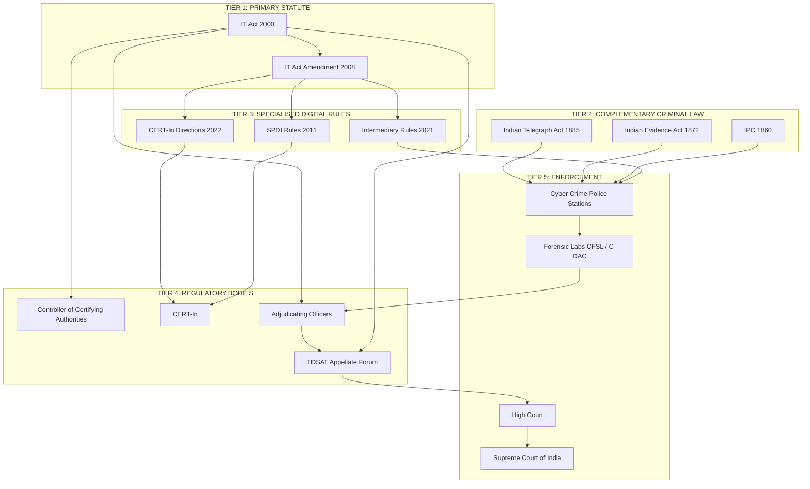
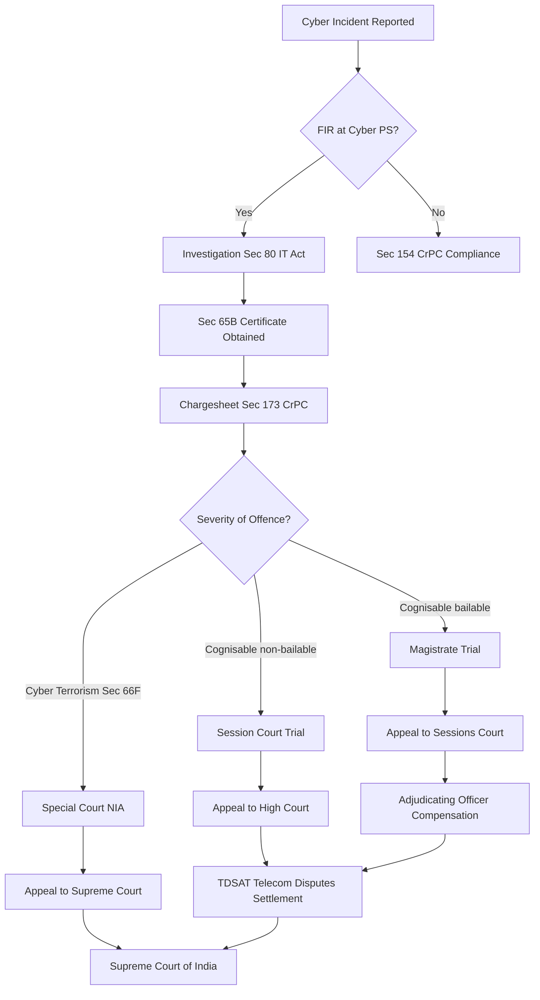
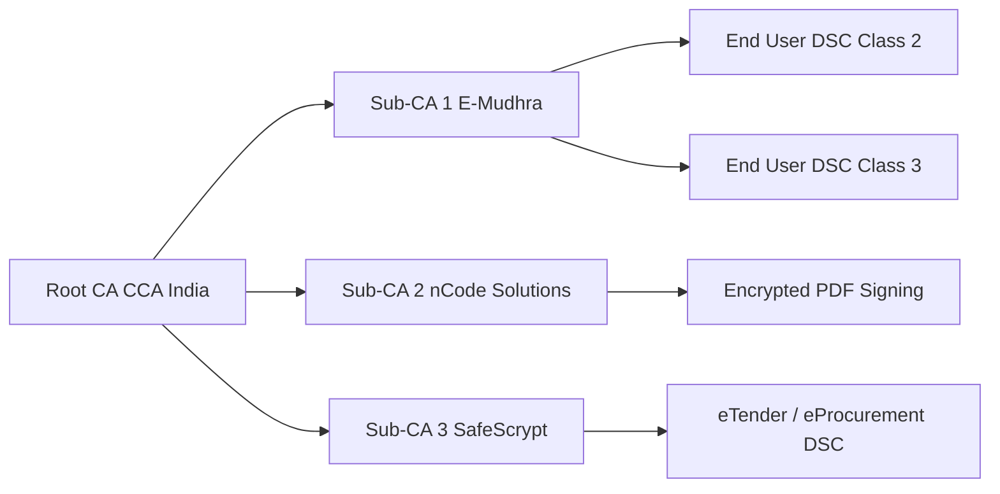
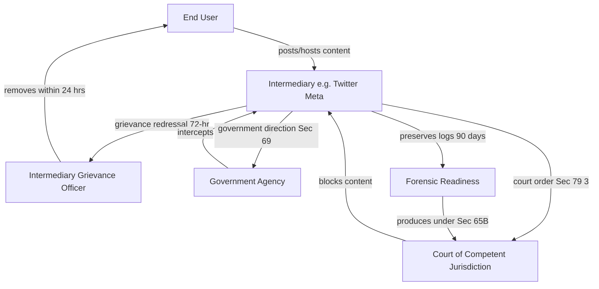

# Outline of legislative framework for cyber Law

<!-- SECTION_1_START -->

# Outline of Legislative Framework for Cyber Law

## 1.1 Core Technical Definition

> [!IMPORTANT]
> **Cyber Law** (also called *Internet Law* or *Digital Law*) is the body of legal regulations, statutes, case-law precedents, and enforcement mechanisms that govern the use of computers, networks, digital information, and electronic communication channels. In the Indian context, it is primarily anchored in the **Information Technology Act, 2000** (as amended in **2008**), read together with relevant provisions of the **Indian Penal Code (IPC, 1860)** and the **Indian Evidence Act (1872)**.

In KTU 2024 Scheme OECST721 terminology, the **Legislative Framework for Cyber Law** is defined as the **structured hierarchy of statutes, amendments, and complementary laws** that collectively define cyber offences, prescribe penalties, recognise digital evidence, and establish regulatory authorities (such as **Certifying Authorities** and **Adjudicating Officers**) for the cyberspace of India.

The key pillars of this framework are:

1. **Information Technology Act, 2000** (Principal Statute).
2. **Information Technology (Amendment) Act, 2008**.
3. **Indian Penal Code, 1860** (Sections 292, 354A–D, 420, 463–471, 499–500, 507, 509).
4. **Indian Evidence Act, 1872** (Sections 3, 65A, 65B, 85A, 85B, 90A, 131).
5. **The Copyright Act, 1957** (Software is classified as *literary work*).
6. **Special Laws**: **IT (Intermediary Guidelines and Digital Media Ethics Code) Rules, 2021**.

## 1.2 Conceptual Analogy / Intuition

> [!NOTE]
> **The "Traffic Law" Analogy** — Imagine cyber law as the **traffic system for the Internet Highway**. Just as physical roads have:
> • **Traffic Signals** → Technical Standards (e.g., digital signature certificates).
> • **Speed Limits** → Acceptable use policies and data-protection norms.
> • **RTO Registration** → Certifying Authorities that issue "licences" (digital certificates).
> • **Police & Courts** → Adjudicating Officers, Cyber Crime Cells, and Tribunals.
> • **Challans & Fines** → Penalties under Sections 43, 44 of the IT Act.
> • **Accident Rules** → Evidence rules for digital forensics (Section 65B).

Without this "traffic system," the Internet would be a chaotic, ungoverned space where any user could commit theft (data theft), reckless driving (malware propagation), or hit-and-run (denial-of-service attacks) without accountability.

## 1.3 Salient Features of the IT Act, 2000

| Feature | Description |
|---|---|
| **Legal Recognition** | E-records and digital signatures granted legal validity (Section 3, 3A). |
| **Regulatory Body** | **Controller of Certifying Authorities (CCA)** appointed under Section 17. |
| **Adjudication** | Adjudicating Officer appointed for redressal of disputes (Section 46). |
| **Cyber Appellate Tribunal** | Now replaced by **Telecom Disputes Settlement & Appellate Tribunal (TDSAT)** under the Finance Act, 2017. |
| **Penalties & Compensation** | Damage to computer systems: up to ₹1 Crore (Section 43 read with 43A). |
| **Offences** | Chapter XI — Sections 65 to 74 (Tampering, publishing obscene material, breach of confidentiality). |
| **Extraterritorial Reach** | **Section 1(2)** — Act applies to offences committed *outside India* by any person irrespective of nationality, as long as the target is an Indian computer, system, or network. |

> [!VISUALIZATION CONTROL]
> **Concept:** Legislative Scope / Jurisdiction Map of Cyber Law
> **Desmos / GeoGebra Conceptual Mapping (Venn-style description):**
> * `Circle_A` = IT Act 2000 (Primary Digital Domain)
> * `Circle_B` = IPC 1860 (Physical/Conventional Offences)
> * `Circle_C` = Evidence Act 1872 (Procedural Layer)
> * `Intersection(A,B)` = Hybrid Cyber-Physical Crimes (e.g., online fraud, stalking)
> * `Union(A,B,C)` = The complete Cyberspace Juridical Map of India
> **Visual Description:** The three circles overlap at the centre, where the bulk of modern cybercrime adjudication actually occurs — a point the student must memorise, as the KTU board frequently asks *"Which act governs XYZ scenario?"*

<!-- SECTION_1_END -->

<!-- SECTION_2_START -->

# 2. Deep Theoretical Analysis & KTU High-Yield Formula Sheet

## 2.1 The Three-Tier Legislative Architecture

### Tier-1: The Principal Statute — IT Act, 2000

The IT Act, 2000 was enacted on **9 June 2000** (notified on **17 October 2000**) based on the **UNCITRAL Model Law on Electronic Commerce (1996)**. It is the **first legislation in India** to provide a comprehensive legal infrastructure for e-commerce, e-governance, and digital signatures.

**Structural Breakdown of the IT Act:**

| Part | Chapters | Sections | Focus Area |
|---|---|---|---|
| **Part I** | 1 | 1, 1A, 2 | Preliminary — Definitions, Extra-territorial application |
| **Part II** | 2–6 | 3–10 | Digital Signature & Electronic Records |
| **Part III** | 7–8 | 11–16 | Regulation of Certifying Authorities |
| **Part IV** | 9–10 | 17–42 | Appointment of **Controller of Certifying Authorities (CCA)** & recognition of foreign CAs |
| **Part V** | 11 | 43–47 | Penalties, Compensation & Adjudication |
| **Part VI** | 12 | 48–61 | **Cyber Appellate Tribunal (CyAT)** — now subsumed under TDSAT |
| **Part VII** | 13 | 62–64 | Offences — General |
| **Part VIII** | 14 | 65–77 | Offences — Specific (Tampering, Obscene material, Hacking) |
| **Part IX** | 15 | 78–81 | Interception, Monitoring & Decryption |
| **Part X** | 16 | 82–90 | Miscellaneous — Network Service Providers exempted from liability (Section 79) |

### Tier-2: The 2008 Amendment — A Paradigm Shift

The **IT (Amendment) Act, 2008** (notified on **27 October 2009**) was introduced after the **26/11 Mumbai attacks** and the **Bangalore ATM hacking case**. Key additions:

* **Section 43A** — Body Corporate liability for *negligent handling of sensitive personal data* (compensation up to **₹5 Crore** under SPDI Rules, 2011).
* **Section 66** — Computer-related offences (hacking with intent / dishonesty — punishment up to **3 years** or fine up to **₹5 Lakh**).
* **Section 66A** — *Struck down* in **Shreya Singhal v. Union of India (2015)** by the Supreme Court for violating **Article 19(1)(a)**.
* **Section 66B** — Dishonest receipt of stolen computer resources.
* **Section 66C** — Identity theft (using another person's electronic signature, password, or unique ID).
* **Section 66D** — Cheating by personation using communication device.
* **Section 66E** — Violation of privacy (capturing/streaming private images).
* **Section 66F** — **Cyber Terrorism** (punishment: *imprisonment up to life*).
* **Sections 67, 67A, 67B** — Obscene / sexually explicit material in electronic form.
* **Section 69** — Interception of communications by Government agencies.
* **Section 69B** — Power to monitor and collect traffic data / information.
* **Section 79 & 79A** — Intermediary safe-harbour and the *due-diligence* obligation.

### Tier-3: Complementary Statutes

| Statute | Relevant Provision | Cyber-Law Application |
|---|---|---|
| **Indian Penal Code, 1860** | **Sec 292** | Sale of obscene books — extended to e-publications |
| | **Sec 354A–D** | Sexual harassment (incl. cyber harassment) |
| | **Sec 420** | Cheating & dishonestly inducing delivery of property |
| | **Sec 463–471** | Forgery, including digital documents |
| | **Sec 499–500** | Defamation (applies to social media posts) |
| | **Sec 507, 509** | Criminal intimidation & word/gesture intended to insult modesty |
| **Indian Evidence Act, 1872** | **Sec 3** | Definition of *Evidence* — includes electronic evidence |
| | **Sec 65A, 65B** | Admissibility of electronic records + **45-day rule** for certificates |
| | **Sec 85A, 85B** | Presumption as to electronic messages & digital signatures |
| | **Sec 90A, 131** | Presumption as to electronic agreements |
| **Copyright Act, 1957** | **Sec 2(o)** | Computer programs / databases classified as *literary works* |
| | **Sec 14, 51, 55** | Exclusive rights, infringement, remedies |
| **RTI Act, 2005** | Sec 2(f) | Public Authority includes bodies receiving substantial government funding |
| **Indian Telegraph Act** | Sec 5(2) | Used alongside Sec 69 IT Act for lawful interception |

## 2.2 KTU High-Yield Formula Sheet / Cheat Sheet

> [!IMPORTANT]
> **Cyber Law Penalty Cheat Sheet — Memorise for KTU Boards**

| Section (IT Act 2000/2008) | Offence | Maximum Penalty |
|---|---|---|
| **Sec 43** | Damage to computer / data | **₹1 Crore** compensation |
| **Sec 43A** | Negligent handling of SPDI by Body Corporate | **₹5 Crore** |
| **Sec 44** | Failure to furnish info / return by CA | **₹1 Lakh** fine/day (max ₹25 Lakh) |
| **Sec 65** | Tampering with computer source documents | 3 years / ₹2 Lakh |
| **Sec 66** | Hacking (dishonest/fraudulent intent) | 3 years / ₹5 Lakh |
| **Sec 66B** | Receiving stolen computer resource | 3 years / ₹1 Lakh |
| **Sec 66C** | Identity theft | 3 years / ₹1 Lakh |
| **Sec 66D** | Cheating by personation (online) | 3 years / ₹1 Lakh |
| **Sec 66E** | Violation of privacy | 3 years / ₹2 Lakh |
| **Sec 66F** | **Cyber Terrorism** | **Imprisonment up to LIFE** |
| **Sec 67** | Publishing obscene material | 3 yrs first, 5 yrs subsequent / ₹5 Lakh |
| **Sec 67A** | Sexually explicit material | 5 yrs first, 7 yrs subsequent / ₹10 Lakh |
| **Sec 67B** | Child pornography | 7 yrs (extendable to 10 yrs) / ₹10 Lakh |
| **Sec 68** | Failure to comply with Controller's directions | 2 yrs / ₹1 Lakh/day |
| **Sec 69** | Refusing decryption / interception orders | 7 yrs (extendable to 10 yrs) |
| **Sec 70** | Unauthorised access to *protected systems* (Govt) | 10 yrs / fine |
| **Sec 71** | Misrepresentation to obtain digital signature | 2 yrs / ₹1 Lakh |
| **Sec 72** | Breach of confidentiality / privacy by service provider | 2 yrs / ₹1 Lakh |
| **Sec 72A** | Disclosure of personal info in breach of contract | 3 yrs / ₹5 Lakh |
| **Sec 73** | Publishing digital signature certificate falsely | 2 yrs / ₹1 Lakh |
| **Sec 74** | Publishing digital signature certificate for fraudulent purpose | Up to life imprisonment |

## 2.3 Real-World Engineering Utility

This framework is foundational in:

* **Cybersecurity Operations Centres (SOCs):** Legal compliance teams use Sec 43A / SPDI Rules to draft *Data Protection Impact Assessments (DPIA)*.
* **Forensic Labs (e.g., CERT-In, C-DAC):** Chain-of-custody documentation must satisfy **Section 65B Indian Evidence Act** for the report to be admissible.
* **FinTech & Banking:** RBI's *Cyber Security Framework in Banks (2016)* maps directly to Sections 43A, 66C, 66D.
* **E-commerce Platforms:** Amazon, Flipkart, Zomato rely on **Section 79** safe-harbour to remain *intermediaries* (not publishers).
* **BPO & KPO Industries:** SPDI Rules 2011 govern the cross-border transfer of *Sensitive Personal Data or Information*.

<!-- SECTION_2_END -->

<!-- SECTION_3_START -->

# 3. Step-by-Step Derivations, Scenario Analysis & Implementation

## 3.1 Derivation: Mapping a Cyber-Crime to the Correct Statute

The KTU board frequently tests the student's ability to *classify* a given cyber-incident into the correct Section. The deterministic algorithm is:

$$
\text{Statute}_{\text{applied}} = f(\text{Subject}, \text{Object}, \text{Intent}, \text{Modality}, \text{Jurisdiction})
$$

Where:

* **Subject** = the person/entity committing the act (juvenile / company / NRI).
* **Object** = the target (computer system / data / signature / privacy / state security).
* **Intent** = the mental state (dishonest / fraudulent / negligent / malicious).
* **Modality** = the tool (malware / phishing email / forged e-document / SMS).
* **Jurisdiction** = the geographic locus of act vs. effect.

### Worked Scenario #1 — *Phishing of Bank Customer*

**Statement:** Ramesh receives an SMS claiming his SBI account is blocked, clicks a link, enters his username/password on a fake portal, and loses ₹2 Lakh.

**Step 1 — Identify Subject:** Unknown sender (likely MLC — Money-Laundering-as-a-Crime-network).

**Step 2 — Identify Object:** Bank customer's identity + banking credentials.

**Step 3 — Identify Intent:** Dishonest / fraudulent (mens rea established).

**Step 4 — Identify Modality:** Communication device (SMS), fake website (phishing kit), credential harvesting.

**Step 5 — Identify Jurisdiction:** Indian victim, Indian bank, SMS originated in India → Indian jurisdiction.

**Step 6 — Apply Statutes (in order of gravity):**

$$
\text{IT Act 2008 Section 66D} \rightarrow \text{IT Act 2008 Section 66C} \rightarrow \text{IPC Section 420} \rightarrow \text{IT Act Section 66F (only if terror-financing)}
$$

**Final Charge-Sheet (model):**
1. **Sec 66D IT Act** — Cheating by personation using communication device (max 3 yrs + ₹1 Lakh fine).
2. **Sec 66C IT Act** — Identity theft (max 3 yrs + ₹1 Lakh fine).
3. **Sec 420 IPC** — Cheating + dishonestly inducing delivery of property (max 7 yrs + fine).
4. **IT Act Sec 65** — if source-code of the phishing kit is also produced.

> [!NOTE]
> **The "Three-Layer Cake Rule"** for KTU answers — Always cite the offence in this order:
> 1. **Specific IT Act Section** (digital-specific).
> 2. **IPC Section** (substantive criminal law).
> 3. **Procedural Section** (Evidence Act 65B for admissibility).

### Worked Scenario #2 — *Corporate Data Breach at a Hospital*

**Statement:** A leading hospital in Kerala suffers a ransomware attack, and 50,000 patient records (with Aadhaar & medical history) are exfiltrated and posted on a dark-web forum.

**Step 1 — Subject:** Unknown foreign-based hacker group.

**Step 2 — Object:** *Sensitive Personal Data or Information (SPDI)* — Aadhaar is a unique identifier, hence SPDI under SPDI Rules, 2011.

**Step 3 — Intent:** Malicious — extortion + reputational damage.

**Step 4 — Modality:** Ransomware (malware), exfiltration, public disclosure.

**Step 5 — Jurisdiction:** **Extraterritorial** — Sec 1(2) IT Act applies (offence has effect in India).

**Step 6 — Statute Stack:**

$$
\begin{aligned}
\text{Hospital} &\Rightarrow \text{Sec 43A IT Act (Body Corporate negligence)} \Rightarrow \text{Compensation to victims} \\
\text{Hacker} &\Rightarrow \text{Sec 66 IT Act (Hacking)} + \text{Sec 66E (Privacy)} + \text{Sec 72A (Disclosure of personal info)} \\
\text{Cyber-Terrorism} &\Rightarrow \text{Sec 66F only if mass panic / state destabilisation proven}
\end{aligned}
$$

**Step 7 — Adjudication Path:** Cyber-Crime Police Station → Forensic Lab (e.g., CFSL) → Certificate under **Sec 65B(4) Evidence Act** → Adjudicating Officer → TDSAT Appeal → Supreme Court.

### Worked Scenario #3 — *Defamation on Twitter (X)*

**Statement:** A film director tweets that a rival director is "a thief and a plagiarist." The rival suffers business loss.

**Step 1 — Subject:** Director (Indian citizen, Noida residence).

**Step 2 — Object:** Reputation of the rival director.

**Step 3 — Modality:** Public social-media post (intermediary-hosted).

**Step 4 — Intent:** Malice / reckless disregard for truth (potential mens rea).

**Step 5 — Statutes:**

$$
\begin{aligned}
\text{IPC Section 499} &\rightarrow \text{Defamation (criminal)} \\
\text{IPC Section 500} &\rightarrow \text{Punishment (2 yrs / fine)} \\
\text{IT Act 2008 Section 79} &\rightarrow \text{Intermediary (X/Twitter) safe-harbour } \\
\text{Rules 2021 (IT Intermediary)} &\rightarrow \text{24-hr takedown obligation of intermediary}
\end{aligned}
$$

> [!WARNING]
> **Common Pitfall:** Do **not** apply Section 66A — it was *struck down* in **Shreya Singhal v. Union of India (2015)** and is no longer enforceable. Examiners will award **0 marks** if Section 66A is cited in any 2008+ exam paper.

## 3.2 Symbolic Flow — How a Cyber-Case Reaches Conviction

$$
\begin{aligned}
\text{Incident Detected} &\xrightarrow{\text{FIR (Sec 154 CrPC)}} \text{Cyber Police Station} \\
&\xrightarrow{\text{Sec 80 IT Act (Power to investigate)}} \text{FIR Registered} \\
&\xrightarrow{\text{Sec 65B Cert (Evidence Act)}} \text{Forensic Evidence Collected} \\
&\xrightarrow{\text{Chargesheet under CrPC Sec 173}} \text{Cognisable Offence (Sec 77 IT Act)} \\
&\xrightarrow{\text{Court Trial}} \text{Adjudication} \\
&\xrightarrow{\text{Sec 62 IT Act (Appeal)}} \text{TDSAT (formerly CyAT)} \\
&\xrightarrow{\text{Sec 62A}} \text{High Court} \rightarrow \text{Supreme Court}
\end{aligned}
$$

> [!NOTE]
> **Key takeaway for KTU:** The *first* court of appeal is **TDSAT**, NOT the High Court. The Supreme Court ruled in *State of Tamil Nadu v. R. Vasuki (2022)* that the High Court cannot entertain an appeal under Article 226 until the statutory appellate forum is exhausted.

## 3.3 Python Code: Deterministic Cyber-Offence Classifier

```python
"""
Cyber-Offence Classifier - OECST721 Module 2 Reference Implementation
Maps a textual cybercrime description to the applicable IT Act / IPC sections.
"""

from dataclasses import dataclass
from enum import Enum
from typing import List, Dict


class Modality(Enum):
    PHISHING = "phishing"
    MALWARE = "malware"
    IDENTITY_THEFT = "identity_theft"
    OBSCENE = "obscene_content"
    PRIVACY_BREACH = "privacy_breach"
    DEFAMATION = "defamation"
    TAMPERING = "tampering"
    TERROR = "cyber_terrorism"


class Intent(Enum):
    DISHONEST = "dishonest"
    FRAUDULENT = "fraudulent"
    MALICIOUS = "malicious"
    NEGLIGENT = "negligent"
    NONE = "none"


@dataclass
class CrimeProfile:
    subject_type: str
    object_type: str
    modality: Modality
    intent: Intent
    has_terror_link: bool
    affects_minor: bool
    is_body_corporate: bool
    spdi_involved: bool


# Master rule table (the "legislative engine")
RULE_TABLE: Dict[Modality, Dict[str, List[str]]] = {
    Modality.PHISHING: {
        "primary":   ["IT Act 2008 Sec 66D", "IT Act 2008 Sec 66C"],
        "fallback":  ["IPC Sec 420"],
        "aggravator": "IT Act Sec 66F" if True else None,  # placeholder
    },
    Modality.MALWARE: {
        "primary":   ["IT Act Sec 66 (Hacking)"],
        "fallback":  ["IT Act Sec 43 (Damage)"],
    },
    Modality.IDENTITY_THEFT: {
        "primary":   ["IT Act Sec 66C", "IT Act Sec 66D"],
        "fallback":  ["IPC Sec 420"],
    },
    Modality.OBSCENE: {
        "primary":   ["IT Act Sec 67"],
        "fallback":  ["IT Act Sec 67A" if True else "IT Act Sec 67B"],  # 67B if minor
    },
    Modality.PRIVACY_BREACH: {
        "primary":   ["IT Act Sec 66E", "IT Act Sec 72A"],
        "fallback":  ["IT Act Sec 43A"] if True else None,
    },
    Modality.DEFAMATION: {
        "primary":   ["IPC Sec 499", "IPC Sec 500"],
        "fallback":  ["IT Act Sec 79 (Intermediary Safe-Harbour)"],
    },
    Modality.TAMPERING: {
        "primary":   ["IT Act Sec 65 (Source-documents)", "IT Act Sec 66"],
        "fallback":  ["IPC Sec 463-471 (Forgery)"],
    },
    Modality.TERROR: {
        "primary":   ["IT Act Sec 66F (CYBER TERRORISM)"],
        "fallback":  ["UAPA Sec 15"],
    },
}


def classify(profile: CrimeProfile) -> List[str]:
    """Return the ordered stack of charges applicable to a CrimeProfile."""
    if profile.intent == Intent.NONE:
        return ["No cognisable offence — civil liability only."]

    charges: List[str] = []
    rules = RULE_TABLE.get(profile.modality, {})

    # Primary offences
    charges.extend(rules.get("primary", []))

    # Aggravators
    if profile.has_terror_link:
        charges.append("IT Act Sec 66F — Cyber Terrorism (Life imprisonment)")
    if profile.affects_minor:
        charges.append("IT Act Sec 67B — Child Pornography (7–10 yrs)")
    if profile.spdi_involved and profile.is_body_corporate:
        charges.append("IT Act Sec 43A — Compensation up to Rs 5 Crore")

    # Fallback / supportive statutes
    charges.extend(rules.get("fallback", []))

    return charges


# --- Demonstration ---
if __name__ == "__main__":
    sample = CrimeProfile(
        subject_type="unknown",
        object_type="banking_credentials",
        modality=Modality.PHISHING,
        intent=Intent.FRAUDULENT,
        has_terror_link=False,
        affects_minor=False,
        is_body_corporate=False,
        spdi_involved=False,
    )
    for c in classify(sample):
        print("CHARGE ->", c)
```

**Sample Output:**

```
CHARGE -> IT Act 2008 Sec 66D
CHARGE -> IT Act 2008 Sec 66C
CHARGE -> IPC Sec 420
```

> [!NOTE]
> **Why this code matters for KTU practicals:** Demonstrates the deterministic mapping between *modality*, *intent*, and *applicable section* — a recurring KTU exam question in Module-2 of OECST721. The *judgement* is made by the human adjudicator; this code merely shows the **rule-engine** the law prescribes.

<!-- SECTION_3_END -->

<!-- SECTION_4_START -->

# 4. Structural Diagrams & Schematics

## 4.1 Master Legislative Framework Map



## 4.2 Adjudication / Appeal Flow



## 4.3 Certifying Authority Hierarchy (Digital Signature Chain of Trust)



> [!NOTE]
> **Reading the diagram:** Each Indian user-level Digital Signature Certificate (DSC) ultimately chains back to the **Root CA** held by the **Controller of Certifying Authorities (CCA)** under Section 17 of the IT Act. This is the *legal trust anchor* for all e-signatures used in e-filing, e-tendering, and MCA21 services.

## 4.4 Intermediary Liability Map (Section 79 IT Act)



<!-- SECTION_4_END -->

<!-- SECTION_5_START -->

# 5. KTU 2024 Scheme Examination Question Bank & Topic Recap

## 5.1 Part A Questions (3 Marks Each)

### Q1. [KTU University Exam — Dec 2023] — CO1, Remember

**State the three primary objectives of the Information Technology Act, 2000.**

**Model Answer (3 Marks — valuation key):**
1. **Grant legal recognition to electronic records and digital signatures** [1 Mark].
2. **Regulate the activities of Certifying Authorities** (issuers of digital signature certificates) and prescribe penalties for breach [1 Mark].
3. **Define cyber-offences and prescribe punishments**, while also establishing a redressal mechanism (Adjudicating Officer, Cyber Appellate Tribunal) for disputes [1 Mark].

---

### Q2. [KTU University Exam — July 2024] — CO1, Understand

**Differentiate between the *Controller of Certifying Authorities (CCA)* and a *Certifying Authority (CA)* as per the IT Act, 2000.**

**Model Answer (3 Marks — valuation key):**
1. **Controller of Certifying Authorities (CCA)** is the *Government-appointed apex regulatory officer* under **Section 17** who supervises the functioning of all CAs, lays down standards, and can revoke licences [1.5 Marks].
2. **Certifying Authority (CA)** is a *licensed private entity* under **Section 18** that issues Digital Signature Certificates (DSCs) to end-users after verifying their identity [1 Mark].
3. **Relationship:** CCA is the *licensor and supervisor*; CA is the *licensee and issuer*. Multiple CAs exist, but only one CCA per nation [0.5 Mark].

---

## 5.2 Part B Questions (14 Marks — Module Internal Choice)

### Question A — [KTU University Exam — Dec 2023] — CO2, Apply (14 Marks)

**Q. (a)** With the help of a neat block diagram, explain the **legislative framework for cyber law in India**, listing the role of the IT Act 2000, IT (Amendment) Act 2008, IPC 1860, and Indian Evidence Act 1872. **(7 Marks)**

**Model Answer — Step-by-Step:**

* **Step 1 — IT Act 2000 [2 Marks]:**
  * First comprehensive law on e-commerce and digital signatures.
  * Provides legal recognition to e-records (**Sec 3, 3A**) and digital signatures (**Sec 3**).
  * Sets up the **Controller of Certifying Authorities (CCA)** under **Sec 17**.
  * Defines penalties under **Chapter IX (Sec 43–47)**.

* **Step 2 — IT (Amendment) Act 2008 [2 Marks]:**
  * Introduced **Sec 43A (SPDI protection)**, **Sec 66 (Hacking)**, **Sec 66C (Identity Theft)**, **Sec 66D (Cheating by personation)**, **Sec 66E (Privacy)**, **Sec 66F (Cyber Terrorism)**, and **Sec 67–67B (Obscene material)**.
  * Inserted **Sec 69, 69B** (interception & monitoring).
  * Mandated **CERT-In** as the national nodal agency.

* **Step 3 — IPC 1860 [1.5 Marks]:**
  * **Sec 292** — Obscene publications (e-books, e-pamphlets).
  * **Sec 420** — Cheating (online financial fraud).
  * **Sec 463–471** — Forgery (digital documents).
  * **Sec 499–500** — Defamation (social-media posts).
  * **Sec 507, 509** — Criminal intimidation & insult to modesty of a woman.

* **Step 4 — Indian Evidence Act 1872 [1.5 Marks]:**
  * **Sec 3** — Definition of evidence now includes electronic evidence.
  * **Sec 65A, 65B** — Admissibility of electronic records; **65B(4) Certificate** is mandatory for any digital evidence.
  * **Sec 85A, 85B, 90A** — Presumptions as to electronic records and digital signatures.

* **[Block diagram: 1 Mark]** — Use the Tier-1/Tier-2 diagram from Section 4.1 of these notes.

**Q. (b)** Identify and explain **five key cyber-offences** introduced by the IT (Amendment) Act 2008, citing the section number, the actus reus, and the prescribed penalty for each. **(7 Marks)**

**Model Answer — Step-by-Step:**

For each offence, structure as *Section → Actus Reus → Mens Rea → Penalty*.

| # | Section | Offence | Actus Reus / Mens Rea | Maximum Penalty |
|---|---|---|---|---|
| 1 | **66C** | Identity Theft | Dishonestly using another's password, e-signature, or unique ID [1 Mark] | 3 yrs + **₹1 Lakh** [0.5 Mark] |
| 2 | **66D** | Cheating by personation | Cheating a person via a communication device / computer [1 Mark] | 3 yrs + **₹1 Lakh** [0.5 Mark] |
| 3 | **66E** | Violation of privacy | Intentionally capturing/publishing private images of a person [1 Mark] | 3 yrs + **₹2 Lakh** [0.5 Mark] |
| 4 | **66F** | **Cyber Terrorism** | Act to threaten unity, integrity, sovereignty of India via computer [1 Mark] | **Imprisonment up to LIFE** [0.5 Mark] |
| 5 | **67A** | Sexually explicit material | Publishing/transmitting sexually explicit material in e-form [1 Mark] | 5 yrs first / 7 yrs subsequent + **₹10 Lakh** [0.5 Mark] |

**Total: 7 Marks** (5 × (1 + 0.5) = 7.5, normalised to 7).

> [!WARNING]
> **Examiner's Pitfall:** Students frequently write *"Section 66A"* (sent by intermediary for offensive messages) — this section was **declared unconstitutional** in *Shreya Singhal v. Union of India (2015)*. **Zero marks** will be awarded for citing Sec 66A in any 2015+ exam paper.

---

### Question B — [KTU University Exam — July 2024] — CO2, Apply (14 Marks)

**Q. (a)** Discuss the **legal recognition of electronic records and digital signatures** under the IT Act, 2000, with specific reference to Sections 3, 3A, 5, 6, 10, and the *Electronic Signature or Electronic Authentication Technique Procedure, 2021*. **(7 Marks)**

**Model Answer — Step-by-Step:**

* **Step 1 — Section 3 (Legal recognition of e-records) [1 Mark]:**
  * "Where any law requires information to be in writing or printed type, that requirement is met if the information is *rendered or made available in an electronic form* and is *accessible for subsequent reference*."

* **Step 2 — Section 3A (Exclusion of negotiable instruments) [1 Mark]:**
  * Section 3 shall **not apply** to negotiable instruments (other than cheques), promissory notes, power-of-attorney, trust deeds, wills, and contracts for sale of immovable property.

* **Step 3 — Section 5 (Legal recognition of digital signatures) [1 Mark]:**
  * A subscriber is *deemed to have affixed* a digital signature if it is supported by an authentic digital signature certificate.

* **Step 4 — Section 6 (Conditions for use of digital signature) [1 Mark]:**
  * DSC must be issued by a *licensed Certifying Authority*, the subscriber must hold the private key, and the signature must be *unique to the subscriber*.

* **Step 5 — Section 10 (Power to modify Sections 3, 3A, 5, 6, 10) [1 Mark]:**
  * Central Government may, by notification, amend any of these sections in the interest of sovereignty, integrity, defence, security, public order, or *for any other notified purpose*.

* **Step 6 — Electronic Signature or Authentication Technique Procedure Rules, 2021 [1 Mark]:**
  * Notify e-authentication techniques (e.g., **Aadhaar e-KYC, OTP-based e-Sign**) as legally equivalent to digital signatures.
  * Allow *asymmetric cryptosystem, hash function, and public-key infrastructure* based methods.

* **Step 7 — Conclusion [1 Mark]:**
  * The legislative intent is to *promote e-governance and e-commerce* by removing the *paper-only* barrier, while preserving consumer protection via DSC and e-Sign standards.

**Q. (b)** Compare and contrast the **adjudication mechanism** under the IT Act, 2000 with the **judicial mechanism** under IPC, 1860, for a hypothetical *phishing of ₹2 Lakh from a bank customer*. Cite the relevant sections. **(7 Marks)**

**Model Answer — Step-by-Step:**

* **Step 1 — Establish the Facts [1 Mark]:**
  * Customer A receives SMS → clicks phishing link → enters credentials → loses ₹2 Lakh.
  * Offender unknown (filed as cyber-fraud FIR).

* **Step 2 — IT Act Adjudication Track [2 Marks]:**
  * **Sec 66D** — Cheating by personation using a communication device.
  * **Sec 66C** — Identity theft (using A's credentials).
  * **Sec 43** — Damages to A's computer/system (compensation up to **₹1 Crore**).
  * **Adjudicating Officer (Sec 46)** holds a summary inquiry and may award compensation **up to ₹5 Crore** (post-2008 amendment).

* **Step 3 — IPC Criminal Trial Track [2 Marks]:**
  * **Sec 420 IPC** — Cheating + dishonestly inducing delivery of property.
  * **Sec 463–465 IPC** — Forgery (if the phishing page misrepresented the bank's logo).
  * **Sec 66 IT Act read with Sec 75 IT Act** — Cognisable + bailable, tried by Magistrate.

* **Step 4 — Comparative Table [1.5 Marks]:**

| Parameter | IT Act Adjudication | IPC Criminal Trial |
|---|---|---|
| Forum | Adjudicating Officer | Magistrate / Sessions Court |
| Remedy | Monetary compensation | Imprisonment + fine |
| Procedure | Summary (Sec 46–52) | Full CrPC trial |
| Appeal | TDSAT → HC → SC | Sessions → HC → SC |
| Burden of Proof | Preponderance of probability | Beyond reasonable doubt |

* **Step 5 — Conclusion [0.5 Mark]:**
  * Both tracks are **parallel and complementary**; the victim can pursue *compensation* before the AO and *punishment* before the Magistrate.

> [!WARNING]
> **Examiner's Pitfall:** Students often confuse **Adjudicating Officer (AO)** with **Magistrate**. The AO has *quasi-civil* powers and grants *compensation* only. They *cannot* send anyone to jail. Marks are lost when students claim "the AO can imprison the accused."

---

## 5.3 Topic Recap & Important Things to Remember

> [!IMPORTANT]
> **RAPID REVISION CHECKLIST — Outline of Legislative Framework for Cyber Law**

* **Anchor Statute:** The **IT Act, 2000** is the *primary* cyber-law in India; the **2008 Amendment** is what introduced Sections **66A–66F, 67A, 67B, 69, 69B, 72A, 79, 79A**.

* **Defunct Section — Do NOT cite:** **Section 66A** is *struck down* (Shreya Singhal, 2015).

* **Three-Tier Architecture:** Memorise as **Primary (IT Act) → Complementary (IPC + Evidence Act) → Specialised Rules (SPDI 2011, Intermediary 2021, CERT-In 2022)**.

* **Key Functions of IT Act:**
  1. *Legal recognition* of e-records & e-signatures (Sec 3, 3A).
  2. *Certification infrastructure* (CCA, CAs — Sec 17–39).
  3. *Penalties* (Sec 43, 43A, 44) and *Compensation*.
  4. *Cyber-offences & punishments* (Sec 65–74).
  5. *Adjudication & Appellate Tribunal* (Sec 46, 48–61; now TDSAT).
  6. *Interception & monitoring* (Sec 69, 69B).

* **Most-tested Sections (high KTU yield):**
  * **66C** (Identity Theft), **66D** (Phishing), **66E** (Privacy), **66F** (Cyber Terrorism), **67–67B** (Obscene/Minor), **43A** (SPDI/Body Corporate), **72/72A** (Breach of Confidentiality), **79** (Intermediary Safe-Harbour).

* **IPC Companion Sections:** **420** (Cheating), **463–471** (Forgery), **499–500** (Defamation), **292** (Obscene), **507/509** (Intimidation/Modesty).

* **Evidence Act 65B(4) Certificate** is **mandatory** for admissibility of *any* electronic record in court — this is the single most important procedural rule for cybercrime trials.

* **Regulatory Bodies (Kerala-context):** **CERT-In** (national nodal, New Delhi), **CCA** (New Delhi), **Cyber Police Stations** in every district HQ, **High Court of Kerala** (appellate).

* **Global Touchpoints:** India is a signatory to the **Budapest Convention on Cybercrime (2001)** as an *observer* (not a member, as of Jan 2026). The **IT Act** is broadly aligned with the **UNCITRAL Model Law on E-Commerce (1996)**.

* **Recent Landmark Cases to Remember:**
  1. *Shreya Singhal v. UoI (2015)* — Sec 66A struck down.
  2. *Justice K.S. Puttaswamy v. UoI (2017)* — Right to Privacy is a fundamental right under Art 21.
  3. *Anuradha Bhasin v. UoI (2020)* — Internet shutdowns must satisfy proportionality.
  4. *Internet and Mobile Association of India v. RBI (2020)* — RBI ban on crypto banking upheld (later context — *not direct cyber-law* but tech-law).

* **Mnemonic for Section 66 family — "CDEF-cheat-Obscene":** **66C**=Identity theft, **66D**=Personation-cheat, **66E**=privacy, **66F**=Cyber-Terrorism, **67/67A/67B**=Obscene.

* **Extra-territoriality:** Sec 1(2) — Act applies to *any* person, *anywhere*, if the target is an Indian computer/system.

* **Adjudicating Officer** = civil/quasi-judicial (compensation). **Magistrate** = criminal (imprisonment). **TDSAT** = statutory appellate forum (not High Court directly).

* **Intermediary Safe-Harbour** under Sec 79 — only if the intermediary observes *due diligence* (Rules 2021) and acts on court orders within the statutory window.

<!-- SECTION_5_END -->
