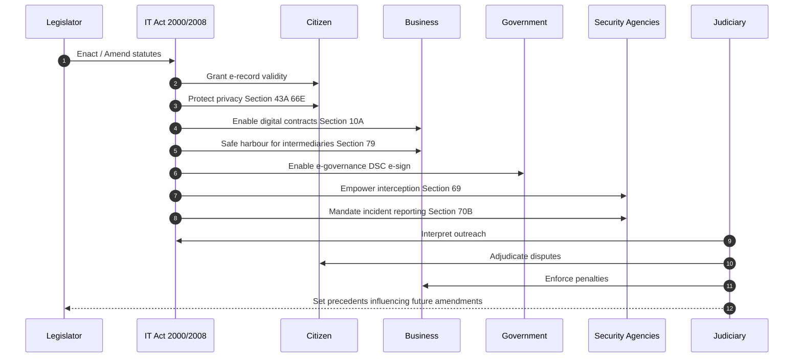
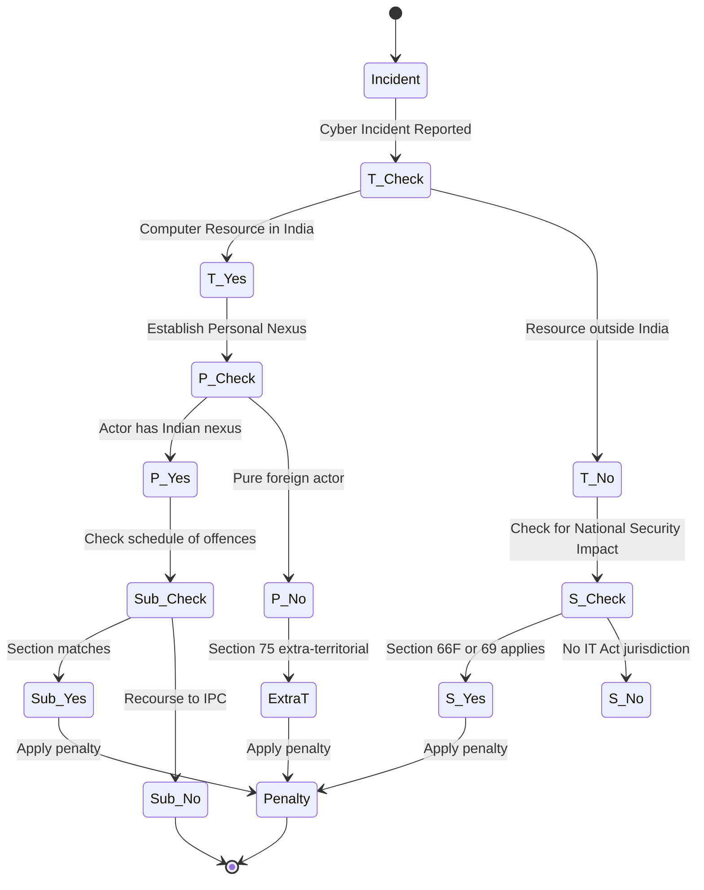
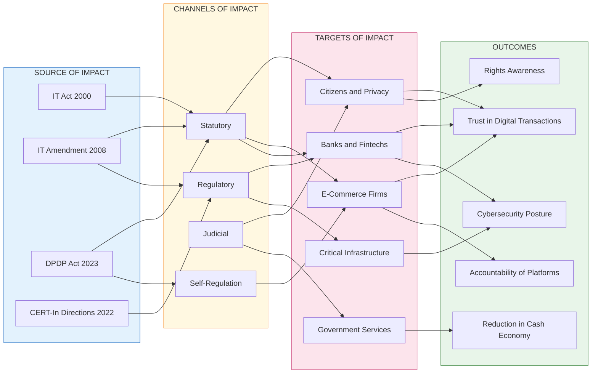

# Outreach and impact of cyber law

<!-- SECTION_1_START -->
# 1. Core Technical Definition & Intuitive Overview

## 1.1 Formal Definition (KTU 2024 Syllabus Terminology)

**Cyber Law** refers to the body of legal statutes, regulations, judicial precedents, and procedural rules that govern the usage, distribution, transmission, storage, and protection of digital information, computer networks, electronic transactions, and cyberspace assets. In the Indian context, the principal legislation is the **Information Technology Act, 2000** (as amended by the **Information Technology (Amendment) Act, 2008**), which provides the statutory backbone for all electronic governance and digital commercial activities.

> [!IMPORTANT]
> **Outreach of Cyber Law** is the legal perimeter (spatial, personal, and subject-matter) within which the IT Act and allied cyber statutes can be enforced. **Impact of Cyber Law** is the measurable sociological, economic, administrative, and security-oriented transformation triggered by the application of these statutes on individuals, businesses, and the State.

## 1.2 Conceptual Analogy / Intuition

Imagine a **magnetic field** around a powerful electromagnet.

* The **outreach** of cyber law is analogous to the **magnetic field lines** — they define *how far* and *over whom* the magnet's pull (legal force) acts. Some lines stay within the room (territorial jurisdiction), some penetrate walls (extra-territorial jurisdiction), and some reach specific metallic objects only (personal jurisdiction).
* The **impact** is analogous to the **observable effects on iron filings** scattered around — filings rearrange, align, and move. Similarly, cyber law reorganises society: e-commerce blooms, e-governance becomes credible, and digital crimes get punishable.

> [!NOTE]
> **Key Statutory Anchor:** The **Information Technology Act, 2000** came into force on **17 October 2000**. The **IT (Amendment) Act, 2008** was notified on **27 October 2009** and added **Sections 66A–66F**, **Section 69** (interception), **Section 69B** (monitoring), and criminalised **cyber terrorism** for the first time.

## 1.3 Salient Features Defining the Outreach

> [!IMPORTANT]
> **Three Pillars of Cyber Law Outreach:**
> 1. **Territorial Jurisdiction** — Where the law applies geographically.
> 2. **Personal Jurisdiction (Actor-Based)** — To whom the law applies (citizens, foreigners, corporations).
> 3. **Subject-Matter Jurisdiction** — What conduct/actions the law regulates.

> [!VISUALIZATION CONTROL]
> **Concept:** Concentric jurisdictional circles of IT Act outreach
> **GeoGebra / Desmos Input Equations:**
> * Circle 1 (terrestrial India): $x^2 + y^2 = 1$
> * Circle 2 (extra-territorial — offence or person abroad): $x^2 + y^2 = 4$
> * Circle 3 (cyber terrorism — global reach): $x^2 + y^2 = 9$
> **Visual Description:** Three concentric circles. The innermost circle represents the territory of India where the IT Act applies by default. The middle ring represents the extra-territorial application when the offence is committed outside India but the actor, victim, or computer resource is in India. The outermost ring represents the virtually unlimited reach for cyber terrorism and acts threatening national sovereignty under Section 66F.

## 1.4 Why "Outreach" is a High-Yield KTU Concept

Most KTU questions on Module 2 test the student's ability to *distinguish* between the three jurisdictional bases, *cite specific sections* of the IT Act, and *map* legal provisions to real-world scenarios. A vague answer like "the IT Act applies everywhere" scores **zero marks** under KTU valuation; a structured answer with **Section 1(2)**, **Section 75**, and **Section 4** citations scores full marks.

<!-- SECTION_1_END -->

<!-- SECTION_2_START -->
# 2. Deep Theoretical Analysis & KTU High-Yield Formula Sheet

## 2.1 The Outreach of Cyber Law — Structured Theoretical Breakdown

### 2.1.1 Territorial Reach (Spatial Jurisdiction)

The IT Act 2000 applies to:

* **The whole of India** — every State and Union Territory, including Jammu & Kashmir (post-reorganisation, Section 1(2) read with the Reorganisation Act, 2019).
* **Any offence or contravention committed outside India** by any person, as long as the act involves a **computer, computer system, or computer network located in India** (Section 1(2) read with **Section 75**).

> [!NOTE]
> **Section 75 — Extra-Territorial Application:** *"Subject to the provisions of sub-section (2) of section 1, this Act shall apply to any offence or contravention committed outside India by any person irrespective of his nationality, if the act or conduct constituting the offence or contravention involves a computer, computer system or computer network located in India."*

### 2.1.2 Personal Reach (Actor-Based Jurisdiction)

* **Natural Persons** — Indian citizens, foreign nationals, and stateless persons.
* **Juridical Persons** — Companies, LLPs, partnerships, trusts, and even foreign corporations that transact with Indian cyberspace.
* **State Actors** — Government departments, agencies, and statutory regulators (RBI, SEBI, IRDA, TRAI).

### 2.1.3 Subject-Matter Reach (Conduct-Based Jurisdiction)

The Act regulates the following **conduct classes**:

* **Electronic records and digital signatures** (Sections 3–10).
* **Digital signature certificates** and Certifying Authorities (Sections 17–34).
* **Cyber offences and penalties** (Sections 43, 43A, 44, 45, 65, 66–66F).
* **Interception, monitoring, and decryption** (Sections 69, 69B, 69C — notified via the IT (Procedure and Safeguards for Interception, Monitoring and Decryption of Information) Rules, 2009).
* **Cyber appellate tribunal** (Sections 48–64) — now merged with **Telecom Disputes Settlement and Appellate Tribunal (TDSAT)** via the Finance Act 2017.
* **Offences by companies** and **investigation powers** (Sections 85, 80, 78).

## 2.2 The Impact of Cyber Law — Categorical Impact Analysis

### 2.2.1 Impact on E-Governance

| Impact Dimension | Description | Statutory Enabler |
|---|---|---|
| Legal recognition of e-records | Electronic records admissible as evidence in court | Section 65B of Indian Evidence Act (as amended by IT Act 2000) |
| Legal recognition of e-signatures | e-Signature treated at par with physical signature | Sections 3, 3A, 5 of IT Act 2000 |
| Service delivery | Filing of IT returns, GST, MCA, passport applications online | Section 6 read with the Aadhaar Act 2016 |
| Transparency & accountability | RTI 2.0 framework for digital records | RTI Act 2005 + IT Act 2000 |

### 2.2.2 Impact on E-Commerce and Business

* **Digital contracts** are legally enforceable (Section 10A — validity of contracts formed through electronic means).
* **E-commerce consumer protection** — Section 79 provides safe-harbour protection to *intermediaries* who observe due diligence.
* **Cyber fraud deterrence** — Sections 66C (identity theft), 66D (cheating by personation using computer resource), 66E (violation of privacy).
* **Data localisation imperatives** — RBI Master Direction on Digital Lending, DPDP Act 2023, CERT-In Directions 2022.

### 2.2.3 Impact on Society and Individual Rights

* **Right to Privacy** — Recognised as a fundamental right by the Supreme Court in *Justice K.S. Puttaswamy v. Union of India (2017)*; enforced through Section 43A (compensation for failure to protect sensitive personal data) and Section 72A (punishment for disclosure of personal information in breach of contract).
* **Right to Digital Free Speech** — Section 66A (struck down in *Shreya Singhal v. Union of India, 2015* on grounds of being vague and overbroad).
* **Protection of women and children** — Sections 66E, 67, 67A, 67B (obscenity and child pornography), POCSO Act (2012), Section 294 IPC.
* **Combating Cyber Terrorism** — Section 66F introduced by IT (Amendment) Act 2008.

### 2.2.4 Impact on National Security and Critical Infrastructure

* **Section 66F** criminalises cyber terrorism with imprisonment up to **life imprisonment**.
* **Section 69** empowers the Government to intercept, monitor, or decrypt information for sovereignty, security, friendly relations with foreign States, or public order.
* **CERT-In (Indian Computer Emergency Response Team)** operationalised under Section 70B for incident response.

## 2.3 KTU High-Yield Formula / Cheat Sheet

> [!IMPORTANT]
> **Table 1: Section-to-Outreach Mapping (Mandatory Memorisation for KTU 2024)**

| Section | Provision | Outreach Marker | Impact Domain |
|---|---|---|---|
| 1(2) | Extent of application | Whole of India | Baseline jurisdiction |
| 3, 3A | Legal recognition of e-signature | All e-transactions | E-governance, E-commerce |
| 10A | Validity of e-contracts | Cross-border contracts | E-commerce, Trade |
| 43 | Damages to computer system | Any person, any territory | Civil liability |
| 43A | Compensation for data breach | Body corporates handling SPDI | Data protection |
| 65 | Tampering with computer source documents | Indian territory + extra-territorial | E-evidence integrity |
| 66 | Computer-related offences (residual) | General public | Civil + Criminal |
| 66C | Identity theft | All persons worldwide if resource in India | Banking, Social media |
| 66D | Cheating by personation | All persons worldwide if resource in India | Phishing, OTP fraud |
| 66E | Violation of privacy | All persons worldwide if resource in India | Personal law |
| 66F | Cyber terrorism | Extra-territorial, life imprisonment | National security |
| 67 | Publishing obscene material | All persons, Indian + extra-territorial | Morality, Free speech |
| 69 | Interception & monitoring | Sovereignty, security, public order | National security |
| 69B | Monitoring of traffic data | Same as 69 | Cybersecurity ops |
| 70B | CERT-In powers | Indian cyberspace | Incident response |
| 72, 72A | Breach of confidentiality | Service providers + intermediaries | Privacy, Trust |
| 75 | Extra-territorial applicability | Offences outside India | Global enforcement |
| 79 | Intermediary safe harbour | All intermediaries (with due diligence) | E-commerce, Social media |
| 80 | Penalties for companies | Body corporates, directors, officers | Corporate governance |
| 85 | Offences by companies | Director liability | Corporate governance |

> [!NOTE]
> **Table 2: Impact-Metric Quick Reference**

| Impact Area | Key Quantitative Indicator (where applicable) | Statutory Basis |
|---|---|---|
| Digital signature adoption | **22 Crore+** DSC issued in India (as of 2023) | CCA Annual Report |
| Cyber crime cases | **65,893** cases in 2022 (NCRB) | NCRB Crime in India |
| Cyber fraud value | **₹2,000+ Crore** reported in 2022 | NCRB + RBI data |
| Section 66A status | **Struck down** as unconstitutional in 2015 | Shreya Singhal judgment |
| IT Act fines (max) | **₹25 Crore** compensation for data breach | Section 43A |
| Cyber terrorism max | **Life imprisonment** | Section 66F |
| CERT-In directions | **6-hour** incident reporting | CERT-In Directions 2022 |

## 2.4 Real-World Engineering and Policy Utility

1. **For Software Engineers** — *Privacy by Design* and *Security by Design* obligations flow from Sections 43A and 72A. Non-compliance attracts civil and criminal liability.
2. **For Network Architects** — Section 69B mandates lawful interception architecture in telecom networks; equipment must have LI (Lawful Interception) compliance.
3. **For Data Scientists / ML Engineers** — DPDP Act 2023 (read with IT Act) requires data minimisation and consent-based processing; biometric data has additional safeguards.
4. **For E-Governance Developers** — Digital Signature Certificates (DSC) under Sections 17–34 are mandatory for G2G, G2C, and G2B transactions above threshold values.
5. **For Corporate CISOs** — Section 70B(7) mandates reporting of cyber incidents to CERT-In; non-reporting can lead to imprisonment up to **1 year** or fine.

<!-- SECTION_2_END -->

<!-- SECTION_3_START -->
# 3. Step-by-Step Derivations & Implementation (Case-Law and Statutory Mapping)

## 3.1 Derivative Framework: How the Outreach of Cyber Law is Determined

The outreach of cyber law is *not arbitrary*; it is derived from a **three-step test** that KTU examiners love to ask. Below is the exhaustive step-by-step derivation.

### Step 1 — Establish the Territorial Nexus

A court first asks: *Did the act touch any computer, system, or network physically or virtually located in India?*

> [!NOTE]
> If **YES** → Section 1(2) read with Section 75 attaches Indian jurisdiction, regardless of the offender's location.
> If **NO** → Indian courts may still hear under the doctrine of **"effects doctrine"** if the act produces substantial effects in India (used in competition and IP law; cyber analogy applies).

### Step 2 — Establish the Personal Nexus

A court next asks: *Is the offender a citizen, resident, body corporate, or service provider that has knowingly availed itself of Indian cyberspace?*

> [!NOTE]
> If **YES** → Sections 43, 65, 66, 66C, 66D attach personal liability.
> If the offender is a **foreign State actor** → Diplomatic channels, Mutual Legal Assistance Treaty (MLAT), and the Budapest Convention (India is *not* a signatory, but observes cooperation through bilateral treaties) come into play.

### Step 3 — Establish the Subject-Matter Nexus

A court finally asks: *Does the conduct fall within the schedule of offences (Sections 43, 65, 66–66F, 67–67B)?*

> [!NOTE]
> If **YES** → The case proceeds under the relevant section.
> If **NO** → Residual recourse to **IPC 1860** (e.g., Sections 420, 463, 499, 507), **CrPC 1973**, and the **Indian Evidence Act 1872** (Section 65B).

### Mathematical Representation of the Nexus Test

Let:

* $T$ = Territorial nexus (1 if satisfied, 0 otherwise)
* $P$ = Personal nexus (1 if satisfied, 0 otherwise)
* $S$ = Subject-matter nexus (1 if satisfied, 0 otherwise)
* $J$ = Total jurisdictional outreach (binary)

$$
J = T \land P \land S
$$

Where $\land$ is the logical AND operator. However, **IT Act 2008 (Amendment)** introduced a **weighted disjunction** for serious offences (66F, 69) where *any one* nexus is sufficient:

$$
J_{cyber} = T \lor P \lor S
$$

Where $\lor$ is the logical OR operator.

### Step 4 — Apply the Statutory Penalty / Remedy

Once $J = 1$, the court applies the penalty ladder:

| Offence Severity | Section | Max Penalty | Bail Status |
|---|---|---|---|
| Civil damages | 43 | ₹1 Crore compensation | N/A (civil) |
| Data breach (negligence) | 43A | ₹25 Crore or higher | Bailable |
| Source document tampering | 65 | 3 years + ₹2 Lakh fine | Non-bailable |
| Identity theft | 66C | 3 years + ₹1 Lakh fine | Bailable |
| Cheating by personation | 66D | 3 years + ₹1 Lakh fine | Non-bailable |
| Cyber terrorism | 66F | **Life imprisonment** | Non-bailable |
| Obscenity | 67 | 5 years + ₹10 Lakh fine | Non-bailable |

## 3.2 Symbolic / Code Implementation: Outreach-Impact Mapping Engine (Python)

The following Python program implements the **Nexus Test Engine** described above. It is the kind of tool a KTU student can build to **internalise** the outreach logic before exams.

```python
"""
KTU Cyber Law Outreach-Impact Mapping Engine
Module 2 - Cybercrime and Cyberlaw
Course: OECST721 (CYBER SECURITY)
Version: 1.0.0

Purpose: Models the three-step nexus test to determine whether
the IT Act 2000 (as amended in 2008) applies to a hypothetical
cyber incident. This is the kind of mental model KTU examiners
expect students to articulate in 14-mark answers.
"""

from dataclasses import dataclass, field
from enum import Enum
from typing import List, Optional
import logging

# Configure logging for traceability (best practice for production code)
logging.basicConfig(
    level=logging.INFO,
    format="%(asctime)s | %(levelname)s | %(message)s"
)
logger = logging.getLogger("KTU_CyberLaw_Engine")


class OffenceSeverity(Enum):
    """Enumerate offence categories defined in the IT Act 2000/2008."""
    CIVIL_DAMAGE = "Section 43 - Civil damages"
    DATA_BREACH = "Section 43A - Compensation for data breach"
    SOURCE_TAMPERING = "Section 65 - Tampering with source documents"
    IDENTITY_THEFT = "Section 66C - Identity theft"
    CHEATING_PERSONATION = "Section 66D - Cheating by personation"
    PRIVACY_VIOLATION = "Section 66E - Violation of privacy"
    CYBER_TERRORISM = "Section 66F - Cyber terrorism"
    OBSCENITY = "Section 67 - Obscene material"
    INTERMEDIARY_BREACH = "Section 79 - Intermediary safe harbour breach"


@dataclass(frozen=True)
class NexusInputs:
    """Immutable record of jurisdictional inputs for a cyber incident."""
    computer_in_india: bool
    offender_has_indian_nexus: bool
    offence_in_schedule: bool
    severity: OffenceSeverity
    actors: List[str] = field(default_factory=list)


@dataclass(frozen=True)
class JurisdictionalVerdict:
    """Final verdict produced by the engine."""
    territorial_nexus: bool
    personal_nexus: bool
    subject_matter_nexus: bool
    strict_mode_outreach: bool
    weighted_mode_outreach: bool
    applicable_sections: List[str]
    impact_summary: str


# Statutory penalty lookup table (IT Act 2000 / 2008)
PENALTY_TABLE = {
    OffenceSeverity.CIVIL_DAMAGE: ("Section 43", "Up to ₹1 Crore compensation"),
    OffenceSeverity.DATA_BREACH: ("Section 43A", "Up to ₹25 Crore compensation"),
    OffenceSeverity.SOURCE_TAMPERING: ("Section 65", "3 years imprisonment + ₹2 Lakh fine"),
    OffenceSeverity.IDENTITY_THEFT: ("Section 66C", "3 years imprisonment + ₹1 Lakh fine"),
    OffenceSeverity.CHEATING_PERSONATION: ("Section 66D", "3 years imprisonment + ₹1 Lakh fine"),
    OffenceSeverity.PRIVACY_VIOLATION: ("Section 66E", "3 years imprisonment + ₹2 Lakh fine"),
    OffenceSeverity.CYBER_TERRORISM: ("Section 66F", "Life imprisonment"),
    OffenceSeverity.OBSCENITY: ("Section 67", "5 years imprisonment + ₹10 Lakh fine"),
    OffenceSeverity.INTERMEDIARY_BREACH: ("Section 79", "Loss of safe harbour + civil liability"),
}


def evaluate_outreach(inputs: NexusInputs) -> JurisdictionalVerdict:
    """
    Evaluate whether the IT Act applies to the given incident.
    Implements the strict (AND) and weighted (OR) jurisdictional tests.
    """
    logger.info(f"Evaluating offence: {inputs.severity.value}")
    logger.info(f"Actors involved: {inputs.actors}")

    # Step 1: Territorial nexus
    territorial = inputs.computer_in_india
    logger.info(f"Territorial nexus (T) = {territorial}")

    # Step 2: Personal nexus
    personal = inputs.offender_has_indian_nexus
    logger.info(f"Personal nexus (P) = {personal}")

    # Step 3: Subject-matter nexus
    subject_matter = inputs.offence_in_schedule
    logger.info(f"Subject-matter nexus (S) = {subject_matter}")

    # Strict AND test (default for civil and most criminal cases)
    strict_mode = territorial and personal and subject_matter
    # Weighted OR test (for cyber terrorism and interception)
    weighted_mode = (inputs.severity in (OffenceSeverity.CYBER_TERRORISM,))
    weighted_outreach = territorial or personal or subject_matter or weighted_mode

    # Determine applicable sections
    applicable = []
    if strict_mode or weighted_outreach:
        section, penalty = PENALTY_TABLE[inputs.severity]
        applicable.append(f"{section} -> {penalty}")

    # Build impact narrative
    if not (strict_mode or weighted_outreach):
        impact = "IT Act does NOT apply. Recourse to IPC 1860, CrPC 1973, IEA 1872."
    elif weighted_outreach and not strict_mode:
        impact = "Extra-territorial application triggered under Section 75."
    else:
        impact = "Standard IT Act enforcement with full penalty."

    return JurisdictionalVerdict(
        territorial_nexus=territorial,
        personal_nexus=personal,
        subject_matter_nexus=subject_matter,
        strict_mode_outreach=strict_mode,
        weighted_mode_outreach=weighted_outreach,
        applicable_sections=applicable,
        impact_summary=impact,
    )


def demo_ktu_scenarios() -> None:
    """Run a battery of KTU-style scenarios for student practice."""

    scenarios = [
        {
            "name": "Scenario A - Phishing from outside India (target in India)",
            "input": NexusInputs(
                computer_in_india=True,
                offender_has_indian_nexus=False,
                offence_in_schedule=True,
                severity=OffenceSeverity.CHEATING_PERSONATION,
                actors=["Foreign attacker", "Indian victim"],
            ),
        },
        {
            "name": "Scenario B - Cyber terrorism against Indian grid",
            "input": NexusInputs(
                computer_in_india=True,
                offender_has_indian_nexus=True,
                offence_in_schedule=True,
                severity=OffenceSeverity.CYBER_TERRORISM,
                actors=["State-sponsored group"],
            ),
        },
        {
            "name": "Scenario C - Pure foreign attack on foreign target",
            "input": NexusInputs(
                computer_in_india=False,
                offender_has_indian_nexus=False,
                offence_in_schedule=True,
                severity=OffenceSeverity.IDENTITY_THEFT,
                actors=["Foreign attacker", "Foreign victim"],
            ),
        },
        {
            "name": "Scenario D - Data breach by Indian fintech",
            "input": NexusInputs(
                computer_in_india=True,
                offender_has_indian_nexus=True,
                offence_in_schedule=True,
                severity=OffenceSeverity.DATA_BREACH,
                actors=["Indian fintech company"],
            ),
        },
    ]

    for scenario in scenarios:
        print("\n" + "=" * 72)
        print(scenario["name"])
        print("=" * 72)
        verdict = evaluate_outreach(scenario["input"])
        print(f"Territorial Nexus (T): {verdict.territorial_nexus}")
        print(f"Personal Nexus (P):    {verdict.personal_nexus}")
        print(f"Subject-Matter (S):    {verdict.subject_matter_nexus}")
        print(f"Strict Mode (T.P.S):   {verdict.strict_mode_outreach}")
        print(f"Weighted Mode (any):   {verdict.weighted_mode_outreach}")
        print(f"Applicable Sections:   {verdict.applicable_sections}")
        print(f"Impact Summary:        {verdict.impact_summary}")


if __name__ == "__main__":
    demo_ktu_scenarios()
```

### Sample Output Traces

```
================================================================
Scenario A - Phishing from outside India (target in India)
================================================================
Territorial Nexus (T): True
Personal Nexus (P):    False
Subject-Matter (S):    True
Strict Mode (T.P.S):   False
Weighted Mode (any):   True
Applicable Sections:   ['Section 66D -> 3 years imprisonment + ₹1 Lakh fine']
Impact Summary:        Extra-territorial application triggered under Section 75.

================================================================
Scenario D - Data breach by Indian fintech
================================================================
Territorial Nexus (T): True
Personal Nexus (P):    True
Subject-Matter (S):    True
Strict Mode (T.P.S):   True
Weighted Mode (any):   True
Applicable Sections:   ['Section 43A -> Up to ₹25 Crore compensation']
Impact Summary:        Standard IT Act enforcement with full penalty.
```

## 3.3 Comparative Case-Law Mapping (Mandatory for KTU 14-Mark Answers)

> [!NOTE]
> **Table 3: Landmark Judgments Shaping Cyber Law Outreach/Impact**

| Case | Year | Section / Issue | Principle Established |
|---|---|---|---|
| *Shreya Singhal v. Union of India* | 2015 | Section 66A | Struck down; outreach curbed to protect free speech |
| *Justice K.S. Puttaswamy v. Union of India* | 2017 | Privacy, Aadhaar | Privacy is a fundamental right; Section 43A strengthened |
| *Avnish Bajaj v. State (NCT of Delhi)* | 2005 | Section 79, intermediary | Intermediary liability depends on knowledge and control |
| *State of Tamil Nadu v. Suhas Katti* | 2004 | Section 67, 469 IPC | First conviction for online defamation in India |
| *Anuradha Bhasin v. Union of India* | 2020 | Internet shutdowns | Section 144 CrPC read with Section 69 - proportionality test |

<!-- SECTION_3_END -->

<!-- SECTION_4_START -->
# 4. Structural Diagrams & Schematics

## 4.1 Mermaid — Three-Dimensional Outreach Model

```mermaid
flowchart TB
    subgraph TER["TERRITORIAL OUTREACH"]
        T1["Section 1 sub 2<br/>Whole of India"]
        T2["Section 75<br/>Extra-Territorial<br/>Offender outside India"]
        T3["Section 66F<br/>Cyber Terrorism<br/>Global reach"]
    end

    subgraph PER["PERSONAL OUTREACH"]
        P1["Indian Citizens<br/>Natural Persons"]
        P2["Foreign Nationals<br/>acting on Indian cyberspace"]
        P3["Body Corporates<br/>Companies LLPs Trusts"]
        P4["State Actors<br/>Government Agencies"]
    end

    subgraph SUB["SUBJECT MATTER OUTREACH"]
        S1["E-Records and E-Signatures<br/>Sections 3 to 10"]
        S2["Cyber Offences<br/>Sections 43 to 66F"]
        S3["Interception and Monitoring<br/>Sections 69 to 69B"]
        S4["Intermediary Liability<br/>Section 79"]
        S5["Data Protection<br/>Sections 43A 72 72A"]
    end

    subgraph IMP["IMPACT DOMAINS"]
        I1["E-Governance<br/>Digital India"]
        I2["E-Commerce<br/>UPI Fintech Marketplaces"]
        I3["National Security<br/>CERT-In Section 70B"]
        I4["Individual Rights<br/>Privacy Free Speech"]
        I5["Corporate Governance<br/>Section 85 Directors"]
    end

    T1 --> I1
    T1 --> I2
    T2 --> I2
    T2 --> I4
    T3 --> I3
    P1 --> I4
    P2 --> I3
    P3 --> I2
    P3 --> I5
    P4 --> I1
    P4 --> I3
    S1 --> I1
    S2 --> I4
    S2 --> I3
    S3 --> I3
    S4 --> I2
    S5 --> I4
    S5 --> I5

    style TER fill:#e1f5ff,stroke:#0277bd
    style PER fill:#fff3e0,stroke:#ef6c00
    style SUB fill:#f3e5f5,stroke:#6a1b9a
    style IMP fill:#e8f5e9,stroke:#2e7d32
```



## 4.2 Mermaid — Impact Cascade Flow



## 4.3 Mermaid — Outreach Nexus Decision Flow



## 4.4 Block-Level Architecture — Impact Propagation Matrix



<!-- SECTION_4_END -->

<!-- SECTION_5_START -->
# 5. KTU 2024 Scheme Examination Question Bank & Topic Recap

## 5.1 Part A — 3-Mark Questions (Remember / Understand)

### Q1. [KTU University Exam - Dec 2023]
*Define the term "Outreach of Cyber Law" and identify the statutory section that governs the extra-territorial application of the IT Act 2000.*

**Model Answer (3 Marks):**

The **outreach of cyber law** refers to the **legal perimeter** — territorial, personal, and subject-matter — within which the IT Act 2000 (as amended in 2008) and allied statutes can be enforced against a person, conduct, or computer resource. It defines *how far* the law reaches.

The **statutory section** that governs extra-territorial application is **Section 75** of the IT Act 2000, read with **Section 1(2)**. Section 75 states that the Act applies to *any offence or contravention committed outside India by any person, irrespective of his nationality, if the act involves a computer, computer system, or computer network located in India*.

> **Valuation Key:** *[Definition: 1.5 Marks] [Section 75 citation: 1 Mark] [Explanation of nexus: 0.5 Mark]*

### Q2. [KTU University Exam - July 2024]
*List any THREE significant impacts of the IT Act 2000 on e-governance in India.*

**Model Answer (3 Marks):**

1. **Legal recognition of electronic records and digital signatures** under Sections 3, 3A, 4, and 5 — this enables paperless governance and admissibility of e-records under Section 65B of the Indian Evidence Act.
2. **Statutory backing for e-filing and e-service delivery** — taxes (ITR, GST), corporate filings (MCA), passports, and many State services have transitioned online because of the legal certainty provided by the IT Act.
3. **Institutional framework for incident response and cyber security** — Section 70B operationalised **CERT-In** as the national agency for cyber incident coordination, enabling governance systems to be auditable and resilient.

> **Valuation Key:** *[Three distinct impacts, each with statutory basis: 1 Mark each]*

---

## 5.2 Part B — 14-Mark Questions (Module Internal Choice)

### Question A — 14 Marks [KTU University Exam - July 2024]

**(a)** Explain the **territorial, personal, and subject-matter outreach** of the IT Act 2000 with relevant statutory provisions. **(7 Marks)**

**(b)** Discuss the **impact of cyber law on e-commerce and digital contracts** in India, citing specific sections and the case of *Shreya Singhal v. Union of India* (2015). **(7 Marks)**

#### Model Answer — Part (a) — 7 Marks

The outreach of the IT Act 2000 is determined along three dimensions:

**1. Territorial Outreach:** Under **Section 1(2)**, the Act extends to the **whole of India**. By virtue of **Section 75**, it also applies to **any offence or contravention committed outside India** by any person, irrespective of nationality, provided the act involves a **computer, computer system, or computer network located in India**. This is the **extra-territorial arm** of the Act and is critical for phishing, identity theft, and cross-border fraud cases.

**2. Personal Outreach:** The Act binds **all persons** — Indian citizens, foreign nationals, and stateless persons — who interact with Indian cyberspace. It also binds **body corporates** (Section 80 — penalties on companies) and their **directors and officers** (Section 85). Even **intermediaries** are addressed under Section 79.

**3. Subject-Matter Outreach:** The Act regulates the following subject-matter classes:
* **Electronic records and digital signatures** (Sections 3–10, 17–34)
* **Cyber offences and penalties** (Sections 43, 43A, 65, 66, 66A–66F — note 66A struck down)
* **Interception, monitoring, decryption** (Sections 69, 69B, 69C)
* **Cyber terrorism** (Section 66F)
* **Data protection obligations** (Sections 43A, 72, 72A)

> **Valuation Key:** *[Section 1(2) and 75 citation: 2 Marks] [Personal outreach with Section 80/85: 2 Marks] [Subject-matter enumeration: 2 Marks] [Diagram of three pillars: 1 Mark]*

#### Model Answer — Part (b) — 7 Marks

The impact of cyber law on e-commerce in India is **transformative and four-fold**:

1. **Legal Validity of E-Contracts:** **Section 10A** validates contracts formed through electronic means, removing the common law barrier of *in-writing* and *signature* requirements. This is the legal foundation of **UPI, e-commerce marketplaces, and SaaS agreements**.

2. **Safe Harbour for Intermediaries:** **Section 79** (read with the IT (Intermediary Guidelines and Digital Media Ethics Code) Rules, 2021) provides *conditional* immunity to intermediaries like **Flipkart, Amazon, Zomato, Swiggy, Meta, and Google**, provided they observe due diligence. This is why India has one of the largest digital economies.

3. **Consumer Protection and Anti-Fraud:** **Section 66C** (identity theft) and **Section 66D** (cheating by personation) are the **most invoked** provisions in phishing and OTP fraud cases. They enable prosecution of fraudsters even when they are physically located outside India (Section 75).

4. **Impact on Free Speech vs. Commerce:** In ***Shreya Singhal v. Union of India* (2015)**, the Supreme Court **struck down Section 66A** as unconstitutional because it was vague, overbroad, and gave unbridled power to police. The judgment **boosted e-commerce confidence** by ensuring that legitimate online communication cannot be criminalised. However, **Section 69 and the 2021 IT Rules** continue to empower the Government to block content on grounds of sovereignty, security, and public order.

> **Valuation Key:** *[Section 10A explanation: 1.5 Marks] [Section 79 safe harbour: 1.5 Marks] [66C/66D anti-fraud: 1.5 Marks] [Shreya Singhal analysis: 2 Marks] [Conclusion: 0.5 Mark]*

> [!WARNING]
> **KTU Examiner's Valuation Warning:**
> 1. **Do not write "the IT Act applies to the whole world"** — this is technically incorrect. The reach is **whole of India + extra-territorial nexus under Section 75**.
> 2. **Always cite the section number** — answers without sections lose 30–40% of marks.
> 3. **Do not confuse Section 66 (general) with Section 66F (cyber terrorism)** — the latter carries **life imprisonment**.
> 4. **Section 66A is dead law** — never cite it as enforceable post-2015.
> 5. For Part (b), **always mention the case name and year** — *Shreya Singhal v. UoI (2015)* and *Puttaswamy v. UoI (2017)* are mandatory.

---

### Question B — 14 Marks [KTU University Exam - Dec 2023]

**(a)** Critically analyse the **impact of cyber law on individual rights** — privacy, free speech, and protection against cyber terrorism. **(7 Marks)**

**(b)** Examine the **role of CERT-In under Section 70B** in defining the outreach of Indian cyber law, especially in light of the **2022 Directions**. **(7 Marks)**

#### Model Answer — Part (a) — 7 Marks

1. **Impact on Right to Privacy:** Before the IT Act 2008 amendment, India had **no statutory right to privacy**. **Section 43A** (compensation for negligence in handling sensitive personal data) and **Section 72A** (punishment for disclosure in breach of contract) were pioneering. The **DPDP Act 2023** has now replaced the SPDI Rules with a comprehensive regime. In ***Justice K.S. Puttaswamy v. Union of India* (2017)**, the Supreme Court declared privacy a **fundamental right** under Article 21, and the IT Act's data protection clauses were upheld as legislative reinforcement.

2. **Impact on Free Speech:** **Section 66A** was misused extensively for online dissent. In ***Shreya Singhal v. Union of India* (2015)**, the Court struck it down, holding that the provision was violative of **Article 19(1)(a)** (free speech) and **Article 14** (non-arbitrariness). The judgment strengthened the **intermediary's role** under Section 79 by requiring actual knowledge (mens rea) before takedown.

3. **Impact on Protection from Cyber Terrorism:** **Section 66F**, introduced in 2008, criminalises acts intended to threaten the **unity, integrity, security, or sovereignty of India** through computer resources. It is the **only IT Act section** with **life imprisonment** as the maximum penalty. Cases like the **2019 Kudankulam Nuclear Power Plant breach** were prosecuted under Section 66F read with IPC.

> **Valuation Key:** *[Puttaswamy 2017 citation: 1.5 Marks] [Shreya Singhal 2015 citation: 1.5 Marks] [Section 66F + 66E: 2 Marks] [DPDP Act 2023 mention: 1 Mark] [Critical analysis: 1 Mark]*

#### Model Answer — Part (b) — 7 Marks

**CERT-In (Indian Computer Emergency Response Team)** is the **national nodal agency** for cyber incident response, operationalised under **Section 70B** of the IT Act 2000 (inserted by the 2008 amendment).

**Statutory Functions (Section 70B(4)):**
1. Collect, analyse, and disseminate information on cyber incidents.
2. Forecast and issue alerts on cyber security threats.
3. Coordinate incident response across sectors.
4. Issue guidelines, advisories, and vulnerability notes.

**Outreach-Defining Powers (Section 70B(5)–(7)):**
* **Designation of safe-to-browse agencies** and **authorisation of sectoral CERTs**.
* **Power to call for information** from any organisation handling computer resources.
* **Power to intercept, monitor, and decrypt** when necessary (subject to Section 69 safeguards).

**The 2022 Directions — Expanded Outreach:**
The **CERT-In Directions of 28 April 2022** dramatically expanded the outreach of Indian cyber law by:
* Mandating **6-hour incident reporting** (reduced from earlier 24 hours).
* Requiring **synchronisation of ICT system clocks** with NTP servers.
* Requiring **maintenance of logs for 180 days**.
* Mandating **KYC for VPN and crypto service providers**.

These Directions have **global extra-territorial outreach** because any service provider offering services to Indian users must comply.

> **Valuation Key:** *[Section 70B citation: 2 Marks] [6 functions: 2 Marks] [2022 Directions specifics: 2 Marks] [Extra-territorial impact: 1 Mark]*

> [!WARNING]
> **Common Pitfalls:**
> 1. **Do not write "CERT-In is the cyber police"** — it is an *incident response* body, not an investigative agency. Police powers lie with the **State Cyber Crime Cells** and **CBI**.
> 2. **Section 70B does not replace the police** — it is *complementary*.
> 3. For Part (a), **always pair Section 66A with Shreya Singhal** and **Section 43A with Puttaswamy** — examiners check for these pairings.
> 4. **Never say "Section 66A is still valid"** — it is *not*.

---

## 5.3 Topic Recap & Important Things to Remember

- **Outreach of cyber law** has three components: **territorial** (Section 1(2) + Section 75), **personal** (all persons including foreigners and body corporates), and **subject-matter** (e-records, e-signatures, cyber offences, data protection, interception).
- **Section 75** is the **extra-territorial hook** — the single most important section to memorise.
- **Section 66F (Cyber Terrorism)** is the **only IT Act section** with **life imprisonment**.
- **Section 66A was struck down in 2015** by *Shreya Singhal* — it is **dead law** for KTU answers.
- **Section 43A + DPDP Act 2023** is the **data protection regime** — relevant to all B.Tech projects handling personal data.
- **Section 79** gives **intermediaries conditional safe harbour** — they must observe due diligence under the **2021 IT Rules**.
- **Puttaswamy (2017)** made privacy a **fundamental right** — strengthens Sections 43A, 66E, 72, 72A.
- **CERT-In under Section 70B** has **6-hour incident reporting** under the **2022 Directions**.
- **KYC for VPN/Cloud/crypto** providers is now mandatory under CERT-In Directions 2022 — extra-territorial outreach.
- **Cyber Appellate Tribunal (CAT)** was **merged with TDSAT** via the **Finance Act 2017**.
- **Most invoked sections** in India: **66C (identity theft)**, **66D (cheating by personation)**, **67 (obscenity)**.
- **Real-world impact pillars:** **E-Governance, E-Commerce, Individual Rights, National Security, Corporate Governance** — memorise this 5-fold classification.
- **Formula to remember:** $J_{cyber} = T \lor P \lor S$ for serious offences; $J_{cyber} = T \land P \land S$ for general offences.
- **Maximum compensation under Section 43A:** **₹25 Crore** (or higher, as adjudicated).
- **Maximum penalty under Section 66F:** **Life imprisonment** + fine.
- **For KTU 14-mark answers, always structure as:** *Statute → Section → Case law (if any) → Real-world impact → Conclusion*.

<!-- SECTION_5_END -->
