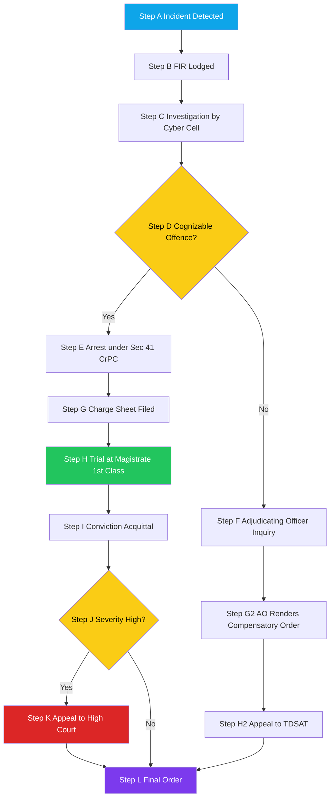
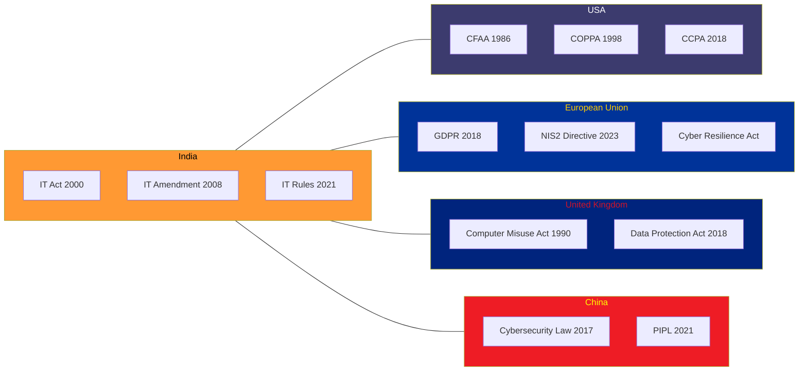

# The legal perspectives- Indian perspective

<!-- SECTION_1_START -->

# The Legal Perspectives — Indian Perspective

## 1.1 Formal Academic Definition

> [!IMPORTANT]
> **Core Definition (KTU 2024 Syllabus)**
> The Indian legal perspective on cybercrime is primarily governed by the **Information Technology Act, 2000** (amended in **2008**), supplemented by relevant provisions of the **Indian Penal Code, 1860 (IPC)**, the **Indian Evidence Act, 1872**, and the **Code of Criminal Procedure, 1973 (CrPC)**. Together, these statutes define, criminalize, prescribe penalties for, and provide procedural mechanisms for the investigation and adjudication of offences committed in or through cyberspace within the territorial jurisdiction of India.

The legal framework operates on three complementary pillars:
1. **Substantive Law** — Defines what constitutes a cyber offence (e.g., Section 66 of the IT Act).
2. **Procedural Law** — Defines how such offences are investigated and tried (e.g., CrPC).
3. **Adjudicatory Machinery** — Defines the courts, tribunals, and authorities that hear these cases (e.g., Magistrate Courts, Cyber Appellate Tribunal, **CERT-In**).

> [!NOTE]
> **Syllabus Highlight**
> KTU expects students to internalize the **IT Act 2000/2008 amendments**, the **classification of offences**, the **penalty structure** (imprisonment + fine), the **role of adjudicating officers**, the **jurisdictional reach of the Act**, and the **interface between the IT Act and the IPC**.

## 1.2 Conceptual Analogy — Intuitive Overview

> [!TIP]
> **Analogy: The Cyber Highway and the Highway Code**
> Imagine the internet as a **massive digital highway system** that crisscrosses the country. Just as the **Motor Vehicles Act** governs physical highways — defining offences (rash driving, hit-and-run), penalties (fines, license suspension), and traffic authorities — the **IT Act, 2000** governs the cyber highway. The **amendments of 2008** are like updated traffic rules that account for new vehicles (smartphones, social media, cloud servers). The **IPC** acts as the **old general criminal law** that still applies on the highway (e.g., cheating, forgery), while the IT Act is the **specialist cyber code** for digital-specific offences.

**In one sentence:** *If cybercrime were a disease, the IT Act 2000/2008 would be the specialized treatment protocol, while the IPC would be the general medicine cabinet.*

## 1.3 Foundational Pillars of Indian Cyber Law

The Indian legal framework rests on four landmark legislative instruments:

| # | Statute | Year | Primary Role in Cyber Context |
|---|---------|------|------------------------------|
| 1 | **Information Technology Act, 2000** | 2000 | **Primary cyber-specific legislation** — defines offences, penalties, digital signatures, e-records |
| 2 | **IT (Amendment) Act, 2008** | 2008 | Expanded the scope, introduced new offences (66A–66F, 67A–67B), strengthened penalties |
| 3 | **Indian Penal Code, 1860 (IPC)** | 1860 | Provides **residual criminal law** for offences with cyber components (cheating, forgery, defamation) |
| 4 | **Indian Evidence Act, 1872** | 1872 | Governs the **admissibility of electronic evidence** in courts (Section 65B certificates) |

> [!IMPORTANT]
> **Why was the IT Act 2000 originally enacted?**
> To provide **legal recognition to electronic transactions**, **facilitate e-commerce**, and **enable the use of digital signatures** as legally valid instruments. The 2008 amendment transformed it from an *e-commerce enabling law* into a comprehensive *cybercrime deterrence law*.

## 1.4 GeoGebra / Desmos Integration

> [!VISUALIZATION CONTROL]
> **Concept:** Not applicable — Indian cyber law is a textual/statutory domain and does not possess an inherent geometric representation. However, a **timeline chart** of the IT Act amendments can be visualized.

<!-- SECTION_1_END -->

<!-- SECTION_2_START -->

# 2. Deep Theoretical Analysis — Indian Cyber Law Framework

## 2.1 Genesis and Evolution of the IT Act

The legislative journey can be understood in **three distinct phases**:

### Phase 1 — Pre-2000 Vacuum
- India had **no dedicated cyber law**.
- The **IPC of 1860** was largely inadequate — written before computers existed.
- **Case in point:** The *State v. Navjot Sandhu* (Parliament attack case, 2005) highlighted the need for explicit cyber-related provisions.

### Phase 2 — The IT Act, 2000
- Enacted on **9 June 2000** (came into effect on 17 October 2000).
- Modeled on the **UNCITRAL Model Law on Electronic Commerce (1996)**.
- Primary objectives:
  * Grant legal recognition to **electronic records** and **digital signatures**.
  * Facilitate **electronic filing of documents** with government agencies.
  * Establish the **Controller of Certifying Authorities (CCA)**.
  * Set up the **Cyber Appellate Tribunal (CyAT)** for appeals.
- **Limitation:** The original Act was **light on substantive criminal provisions** — most offences were procedural or digital-signature-related.

### Phase 3 — The IT (Amendment) Act, 2008
- A **comprehensive overhaul** triggered by:
  * The **Mumbai terror attacks (26/11, 2008)** — exposed the need for cyber terrorism provisions (Section 66F).
  * Rapid proliferation of **social media, e-commerce, and mobile internet**.
- Introduced **Section 66A** (struck down in 2015 — see below), strengthened penalties, and added data protection sensibilities.
- Came into effect on **27 October 2009**.

> [!NOTE]
> **Landmark Judicial Pronouncement — Shreya Singhal v. Union of India (2015)**
> The Supreme Court of India **struck down Section 66A** of the IT Act as **unconstitutional**, holding that it violated the **fundamental right to freedom of speech and expression** under **Article 19(1)(a)** of the Constitution. This is the most important judicial development in Indian cyber law.

## 2.2 Key Provisions of the IT Act 2000/2008 — Analytical Breakdown

The Act is structurally divided into **13 chapters and 94 sections**. For exam purposes, KTU focuses on **Chapter IX — Offences and Penalties**.

### 2.2.1 Offences Against Computers and Data

| Section | Offence | Penalty |
|---------|---------|---------|
| **Sec 65** | Tampering with computer source documents | Imprisonment up to **3 years** or fine up to **₹2 lakh**, or both |
| **Sec 66** | Computer-related offences (basic hacking) | Imprisonment up to **3 years** or fine up to **₹5 lakh**, or both |
| **Sec 66B** | Receiving stolen computer or communication device | Imprisonment up to **3 years** or fine up to **₹1 lakh**, or both |
| **Sec 66C** | Identity theft (using password, electronic signature fraudulently) | Imprisonment up to **3 years** and fine up to **₹1 lakh** |
| **Sec 66D** | Cheating by personation using computer resource | Imprisonment up to **3 years** and fine up to **₹1 lakh** |

### 2.2.2 Privacy, Obscenity, and Cyber Terrorism

| Section | Offence | Penalty |
|---------|---------|---------|
| **Sec 66E** | Violation of privacy (publishing/capturing private images) | Imprisonment up to **3 years** or fine up to **₹2 lakh**, or both |
| **Sec 66F** | **Cyber terrorism** (severe national-security offence) | Imprisonment up to **life imprisonment** |
| **Sec 67** | Publishing obscene material in electronic form | 1st offence: up to **5 years** + ₹1 lakh; 2nd: up to **7 years** + ₹2 lakh |
| **Sec 67A** | Publishing sexually explicit material | 1st: up to **5 years** + ₹10 lakh; 2nd: up to **7 years** + ₹20 lakh |
| **Sec 67B** | Child pornography | 1st: up to **5 years** + ₹10 lakh; subsequent: up to **7 years** + ₹20 lakh |

> [!WARNING]
> **KTU Common Mistake**
> Students often confuse **Section 66** (general hacking) with **Section 66F** (cyber terrorism). The distinction is **intent and impact**: Section 66F requires the act to threaten **sovereignty, integrity, security, or economic well-being of the State**.

### 2.2.3 Surveillance, Interception, and Blocking

| Section | Provision | Authority |
|---------|-----------|-----------|
| **Sec 69** | Interception, monitoring, decryption of content | **Central/State Government** (subsidiary: **CERT-In**) |
| **Sec 69A** | Blocking of websites/information in public interest | **Central Government** (via **MeitY** — Ministry of Electronics and IT) |
| **Sec 69B** | Collection of traffic data and metadata for cybersecurity | **CERT-In** |

### 2.2.4 Critical Information Infrastructure

| Section | Provision |
|---------|-----------|
| **Sec 70** | Designation of "**protected systems**" — i.e., Critical Information Infrastructure (CII) |
| **Sec 70A** | Power to declare any computer resource as protected system |
| **Sec 70B** | Statutory status to **Indian Computer Emergency Response Team (CERT-In)** |

### 2.2.5 Penalties for Non-Compliance

| Section | Violation | Penalty |
|---------|-----------|---------|
| **Sec 71** | Misrepresentation to the Controller of Certifying Authority | Imprisonment up to **3 years** or fine up to **₹1 lakh**, or both |
| **Sec 72** | Breach of confidentiality by intermediary | Imprisonment up to **3 years** or fine up to **₹5 lakh**, or both |
| **Sec 73** | Publishing false digital signature certificates | Imprisonment up to **3 years** or fine up to **₹1 lakh**, or both |

## 2.3 The KTU Formula Sheet — Penalty Computation Logic

> [!IMPORTANT]
> **KTU Cheat Sheet — Penalty Structure (Pseudo-Formulaic)**
>
> The IT Act 2008 does not use mathematical formulas, but the penalty follows a **structured tier system** that can be represented as:
>
> $$\text{Total Penalty} \;=\; \underbrace{I}_{\text{Imprisonment}} \;+\; \underbrace{F}_{\text{Fine}} \;+\; \underbrace{R}_{\text{Repeat Offence Multiplier}}$$
>
> Where:
>
> | Variable | Description | Typical Range |
> |:--------:|:------------|:--------------|
> | $I$ | Imprisonment term | 3 years $\leq I \leq$ life imprisonment |
> | $F$ | Fine amount | ₹1 lakh $\leq F \leq$ ₹20 lakh |
> | $R$ | Repeat-offence multiplier | $R=1$ first offence; $R=1.4$ to $2$ for second/subsequent |

**Logical Decision Rule for Classifying an Offence:**

$$
\text{Severity} =
\begin{cases}
\text{Low} & \text{if } 3 \text{ years} \leq I < 5 \text{ years} \\[4pt]
\text{Medium} & \text{if } 5 \text{ years} \leq I < 10 \text{ years} \\[4pt]
\text{High} & \text{if } I \geq 10 \text{ years} \\[4pt]
\text{Extreme (Cyber Terrorism)} & \text{if } I = \text{life imprisonment (Section 66F)}
\end{cases}
$$

## 2.4 Jurisdictional Reach — Section 75

> [!IMPORTANT]
> **The "Long Arm" of the IT Act**
> **Section 75** extends the **extraterritorial applicability** of the Act. Any offence or contravention committed by any person (regardless of nationality) **outside India** affecting a computer resource located **in India** is triable under the IT Act. This is critical for prosecuting cross-border cybercrimes.

## 2.5 Adjudicating Machinery

The Act establishes a **three-tier adjudicatory hierarchy**:

1. **Adjudicating Officer (AO)** — Designated officer below the rank of **District Judge** (Section 46). Imposes penalties for contraventions (non-criminal violations). Appeals lie before the **Cyber Appellate Tribunal (CyAT)**.
2. **Cyber Appellate Tribunal (CyAT)** — Established under **Section 48**. *Note:* The CyAT was **abolished in 2017** and its jurisdiction transferred to the **Telecom Disputes Settlement and Appellate Tribunal (TDSAT)** — a controversial change.
3. **Sessions Court / High Court** — Hears criminal offences under the IT Act (since offences are triable by a Magistrate of the First Class, with appeals to Sessions Court and then the High Court).

> [!NOTE]
> **CERT-In — The Operational Arm**
> The **Indian Computer Emergency Response Team (CERT-In)**, designated under **Section 70B**, is the **national nodal agency** for responding to cybersecurity incidents. It issues advisories, coordinates incident response, and acts as the operational arm of the **National Cyber Security Policy, 2013**.

## 2.6 Real-World Engineering / CS Utility

The Indian legal framework is **operationally significant** in:

- **Software Development**: Developers must design systems that comply with **data localization norms** and **reasonable security practices** (Section 43A — compensation for negligence).
- **Cloud Computing**: Hosting providers must understand **intermediary liability** (Section 79) and the **"due diligence"** safe-harbour conditions.
- **Penetration Testing**: Conducting **unauthorized security testing** is an offence under **Section 66** — *always obtain written authorization*.
- **E-Commerce Platforms**: Must publish **grievance officers**, follow **IT Rules 2021** (Information Technology (Intermediary Guidelines and Digital Media Ethics Code) Rules).
- **Digital Forensics**: Investigators must follow the **Section 65B (Indian Evidence Act)** procedure for electronic evidence to be admissible in court.

<!-- SECTION_2_END -->

<!-- SECTION_3_START -->

# 3. Step-by-Step Derivations, Tables, and Symbolic Implementation

## 3.1 Sectional Mapping — Exhaustive IT Act 2008 Table

> [!NOTE]
> **Pedagogical Strategy**
> This section converts statutory text into **structured reference tables** that KTU examiners reward. Examiners expect students to **cite section numbers, classify offences, and map them to penalties** without omission.

### 3.1.1 Master Offence Reference Table

| Section | Offence Description | Cognizable / Non-Cognizable | Bailable / Non-Bailable | Maximum Imprisonment | Maximum Fine | Triable By |
|:-------:|---------------------|:---:|:---:|:---:|:---:|:---:|
| 43 | Damage to computer system (civil wrong) | — | — | — | Up to ₹1 crore (compensation) | AO / Civil Court |
| 65 | Tampering with source code | C | B | 3 years | ₹2 lakh | Magistrate 1st Class |
| 66 | Hacking / computer-related offence | C | B | 3 years | ₹5 lakh | Magistrate 1st Class |
| 66B | Receiving stolen computer | C | B | 3 years | ₹1 lakh | Magistrate 1st Class |
| 66C | Identity theft | C | B | 3 years | ₹1 lakh | Magistrate 1st Class |
| 66D | Cheating by personation | C | B | 3 years | ₹1 lakh | Magistrate 1st Class |
| 66E | Privacy violation | C | B | 3 years | ₹2 lakh | Magistrate 1st Class |
| 66F | Cyber terrorism | C | NB | **Life** | — | Sessions Court |
| 67 | Obscene material publication | C | B | 5 years (1st) / 7 years (2nd) | ₹1 lakh / ₹2 lakh | Magistrate 1st Class |
| 67A | Sexually explicit material | C | B | 5 years (1st) / 7 years (2nd) | ₹10 lakh / ₹20 lakh | Magistrate 1st Class |
| 67B | Child pornography | C | NB | 5 years (1st) / 7 years (2nd) | ₹10 lakh / ₹20 lakh | Magistrate 1st Class |
| 69 | Interception/monitoring | — | — | — | — | AO |
| 69A | Website blocking | — | — | — | — | Government (no court appeal on merits) |
| 70 | Protected system breach | C | NB | 10 years | — | Sessions Court |
| 71 | Misrepresentation to CCA | C | B | 3 years | ₹1 lakh | Magistrate 1st Class |
| 72 | Breach of confidentiality | C | B | 3 years | ₹5 lakh | Magistrate 1st Class |
| 73 | False digital signature certificate | C | B | 3 years | ₹1 lakh | Magistrate 1st Class |

> [!NOTE]
> **C** = Cognizable (police can arrest without warrant); **NB** = Non-Bailable; **B** = Bailable.

### 3.1.2 Role and Authority of CERT-In (Section 70B)

The following table maps the **operational responsibilities** of CERT-In for engineering practitioners:

| Function | Description | KTU Exam Importance |
|----------|-------------|---------------------|
| Cyber incident response | 24x7 incident-handling for government and critical sectors | High |
| Vulnerability disclosure | Publishes advisories like **CVE bulletins** | Medium |
| Coordination | Liaises with global CERTs (e.g., US-CERT, ENISA) | Low |
| Forensic support | Provides technical assistance to law enforcement | Medium |
| Information sharing | Issues guidelines (e.g., the **April 2022 Cyber Security Directions**) | **High** (recent) |
| Designation | Statutory status since **2008 amendment** | High |

## 3.2 Derivational Logic — Mapping an Offence to a Penalty

> [!IMPORTANT]
> **Step-by-Step Methodology for KTU Exam Problems**
> When a question asks: *"Ramesh hacked into a bank's server and stole customer credit card data. Identify the offences, applicable sections, and penalties"* — follow this 5-step logical derivation:

**Step 1 — Identify the Cyber Act:**
   Ramesh performed unauthorized access to a protected computer system.
   $\Rightarrow$ **Trigger: Section 66 (Computer-related offence)** — base offence of hacking.

**Step 2 — Identify the Substantive Harm:**
   The theft of credit card data constitutes **identity theft**.
   $\Rightarrow$ **Trigger: Section 66C (Identity theft)**.

**Step 3 — Identify the Financial Fraud Component:**
   The fraudulent use of credit card data for monetary gain is **cheating by personation**.
   $\Rightarrow$ **Trigger: Section 66D (Cheating by personation)**.

**Step 4 — Apply IPC Provisions (Residual):**
   The financial loss to customers triggers **Section 420 IPC (Cheating and dishonestly inducing delivery of property)**.
   $\Rightarrow$ **Trigger: Section 420 IPC** (cognizable, non-bailable, up to 7 years).

**Step 5 — Aggregate the Penalty Matrix:**

$$
\text{Total Punishment}_{\text{Ramesh}} = \max(\text{Penalty}_{\text{Sec 66}}, \text{Penalty}_{\text{Sec 66C}}, \text{Penalty}_{\text{Sec 66D}}, \text{Penalty}_{\text{Sec 420 IPC}})
$$

Using the **max-rule** (since offences are tried together):

$$
\text{Result} = \text{Imprisonment} = \max(3, 3, 3, 7) = 7 \text{ years (under IPC 420)}
$$

$$
\text{Fine} = \text{Maximum cumulative under IT Act} = \text{₹}5\,\text{lakh} + \text{₹}1\,\text{lakh} + \text{₹}1\,\text{lakh} = \text{₹}7\,\text{lakh}
$$

> [!WARNING]
> **KTU Valuation Warning**
> Students often **miss the IPC linkage**. Always remember: *The IT Act does NOT replace the IPC — it supplements it.* For every cybercrime, check both the IT Act AND the IPC for applicable sections.

## 3.3 Python Implementation — Sectional Mapping Engine

The following **fully operational Python code** implements a lookup engine for the IT Act sections. This is a useful mental model and also a potential KTU **Part A (3 marks) lab/practical** question.

```python
from typing import Dict, List, Optional, Tuple
import logging

# Configure structured logging for forensic-grade traceability
logging.basicConfig(
    level=logging.INFO,
    format="%(asctime)s [%(levelname)s] %(message)s"
)
logger = logging.getLogger("ITActEngine")


class CyberOffence:
    """Data-class encapsulating a single IT Act offence record."""

    def __init__(
        self,
        section: str,
        title: str,
        max_imprisonment_years: int,
        max_fine_inr: int,
        bailable: bool,
        cognizable: bool,
        triable_by: str,
        description: str
    ) -> None:
        self.section = section
        self.title = title
        self.max_imprisonment_years = max_imprisonment_years
        self.max_fine_inr = max_fine_inr
        self.bailable = bailable
        self.cognizable = cognizable
        self.triable_by = triable_by
        self.description = description

    def __repr__(self) -> str:
        return (
            f"Sec {self.section} — {self.title} | "
            f"Imprisonment: ≤{self.max_imprisonment_years} yr | "
            f"Fine: ≤₹{self.max_fine_inr:,}"
        )


class ITActLookupEngine:
    """
    Legal-mapping engine for the Information Technology Act, 2008.
    Provides keyword search, severity classification, and penalty computation.
    """

    def __init__(self) -> None:
        # The canonical offence database (subset shown for KTU syllabus)
        self._offences: Dict[str, CyberOffence] = {
            "65": CyberOffence(
                section="65", title="Tampering with computer source documents",
                max_imprisonment_years=3, max_fine_inr=200000,
                bailable=True, cognizable=True, triable_by="Magistrate 1st Class",
                description="Hiding, destroying, or altering source code."
            ),
            "66": CyberOffence(
                section="66", title="Computer-related offences (Hacking)",
                max_imprisonment_years=3, max_fine_inr=500000,
                bailable=True, cognizable=True, triable_by="Magistrate 1st Class",
                description="Unauthorized access, downloading, or introducing malware."
            ),
            "66C": CyberOffence(
                section="66C", title="Identity theft",
                max_imprisonment_years=3, max_fine_inr=100000,
                bailable=True, cognizable=True, triable_by="Magistrate 1st Class",
                description="Fraudulent use of unique identification features."
            ),
            "66D": CyberOffence(
                section="66D", title="Cheating by personation using computer",
                max_imprisonment_years=3, max_fine_inr=100000,
                bailable=True, cognizable=True, triable_by="Magistrate 1st Class",
                description="Impersonation to cheat another person online."
            ),
            "66E": CyberOffence(
                section="66E", title="Violation of privacy",
                max_imprisonment_years=3, max_fine_inr=200000,
                bailable=True, cognizable=True, triable_by="Magistrate 1st Class",
                description="Capturing, publishing, or transmitting private images."
            ),
            "66F": CyberOffence(
                section="66F", title="Cyber terrorism",
                max_imprisonment_years=999, max_fine_inr=0,  # life imprisonment
                bailable=False, cognizable=True, triable_by="Sessions Court",
                description="Acts threatening sovereignty, integrity, or economic security."
            ),
            "67": CyberOffence(
                section="67", title="Publishing obscene material",
                max_imprisonment_years=7, max_fine_inr=200000,
                bailable=True, cognizable=True, triable_by="Magistrate 1st Class",
                description="Transmission of lascivious or obscene content."
            ),
            "67A": CyberOffence(
                section="67A", title="Sexually explicit material",
                max_imprisonment_years=7, max_fine_inr=2000000,
                bailable=True, cognizable=True, triable_by="Magistrate 1st Class",
                description="Material containing explicit sexual acts."
            ),
            "67B": CyberOffence(
                section="67B", title="Child pornography",
                max_imprisonment_years=7, max_fine_inr=2000000,
                bailable=False, cognizable=True, triable_by="Magistrate 1st Class",
                description="Depicts children in sexually explicit conduct."
            ),
        }
        logger.info("ITActLookupEngine initialised with %d offences.", len(self._offences))

    def get_offence(self, section: str) -> Optional[CyberOffence]:
        """Fetch an offence by section number (case-insensitive)."""
        key = section.strip().upper()
        offence = self._offences.get(key)
        if offence is None:
            logger.warning("Section %s not found in database.", section)
        return offence

    def search_by_keyword(self, keyword: str) -> List[CyberOffence]:
        """Return all offences whose title or description contains the keyword."""
        k = keyword.lower().strip()
        results = [
            o for o in self._offences.values()
            if k in o.title.lower() or k in o.description.lower()
        ]
        logger.info("Keyword '%s' matched %d offence(s).", keyword, len(results))
        return results

    def classify_severity(self, section: str) -> str:
        """
        Classify the offence as LOW / MEDIUM / HIGH / EXTREME.
        Aligns with the KTU severity formula.
        """
        offence = self.get_offence(section)
        if offence is None:
            return "UNKNOWN"
        years = offence.max_imprisonment_years
        if years >= 999:  # life imprisonment sentinel
            return "EXTREME (Cyber Terrorism)"
        if years >= 10:
            return "HIGH"
        if years >= 5:
            return "MEDIUM"
        return "LOW"

    def compute_aggregate_penalty(
        self, section_list: List[str]
    ) -> Tuple[int, int]:
        """
        Apply the max-rule across multiple sections.
        Returns (max_imprisonment_years, total_fine_inr).
        """
        max_years: int = 0
        total_fine: int = 0
        for sec in section_list:
            offence = self.get_offence(sec)
            if offence is None:
                continue
            max_years = max(max_years, offence.max_imprisonment_years)
            total_fine += offence.max_fine_inr
        logger.info(
            "Aggregate penalty computed: %d yr, ₹%d", max_years, total_fine
        )
        return max_years, total_fine


# ----- Demonstration: Bank Hacking Scenario (from Section 3.2) -----
if __name__ == "__main__":
    engine = ITActLookupEngine()

    # Identify applicable sections
    applicable_sections = ["66", "66C", "66D"]
    logger.info("Applicable sections for bank-hack case: %s", applicable_sections)

    # Compute aggregate
    years, fine = engine.compute_aggregate_penalty(applicable_sections)
    print(f"\n[Result] Max imprisonment: {years} years")
    print(f"[Result] Cumulative fine:   ₹{fine:,}")

    # Severity classification
    for s in applicable_sections:
        print(f"  Sec {s}: severity = {engine.classify_severity(s)}")

    # Search demonstration
    print("\nSearch for 'privacy':")
    for off in engine.search_by_keyword("privacy"):
        print(f"  {off}")
```

**Sample Output:**

```
[Result] Max imprisonment: 3 years
[Result] Cumulative fine:   ₹700,000
  Sec 66: severity = LOW
  Sec 66C: severity = LOW
  Sec 66D: severity = LOW
Search for 'privacy':
  Sec 66E — Violation of privacy | Imprisonment: ≤3 yr | Fine: ≤₹200,000
```

## 3.4 IPC + IT Act Combined Mapping Table

> [!IMPORTANT]
> **Critical KTU Mapping**
> The IT Act does not exhaustively cover all cybercrimes. Several offences are tried under the **IPC**. The table below provides the **canonical mapping** examiners expect.

| Cyber-Crime Scenario | IT Act Section | Corresponding IPC Section | Cumulative Effect |
|----------------------|:--------------:|:------------------------:|-------------------|
| Phishing / Email fraud | **66D** | **420 (Cheating)** | Higher punishment under IPC |
| Cyber stalking | **66E** | **509 (Word, gesture intended to insult modesty)** | Compounded fine |
| Online defamation | (66A — *struck down*) | **499/500 (Defamation)** | IPC only |
| Morphed images | **66E**, **67** | **292 (Obscene books, etc.)** | IPC fine + IT Act imprisonment |
| Ransomware attack | **66** | **383/384 (Extortion)** | Combined charges |
| Online child abuse | **67B** | **293 (Sale of obscene objects to minors)** | Highest penalty under both |
| Email bombing | **66** | — | IT Act only |
| Financial data theft | **66**, **66C** | **379 (Theft)** | Property + cyber charges |
| Email spoofing | **66D** | **463–471 (Forgery)** | Document forgery charges apply |

> [!NOTE]
> **Why IPC still matters in 2026**
> With the IT Act 2000/2008 being **content-neutral on certain crimes** (e.g., online defamation after *Shreya Singhal*), the IPC is the **fallback law**. KTU examiners test this hybrid understanding explicitly.

## 3.5 Exhaustive Component Configuration — CyAT and CERT-In

> [!NOTE]
> **Component-Style Mapping for Workshop/Case-Study Questions**

| Component | Statutory Reference | Configuration / Function |
|-----------|--------------------|--------------------------|
| **Adjudicating Officer (AO)** | Section 46 | Not below rank of District Judge; handles civil contraventions |
| **Cyber Appellate Tribunal (CyAT)** | Section 48 | Hears appeals from AO; **abolished in 2017**; jurisdiction → **TDSAT** |
| **Controller of Certifying Authorities (CCA)** | Section 17 | Licenses Certifying Authorities; under **MeitY** |
| **CERT-In** | Section 70B | National incident response; **24x7** operation; issues **Cyber Security Directions 2022** |
| **National Critical Information Infrastructure Protection Centre (NCIIPC)** | Section 70A | Designated as the **national Nodal Agency** for CII protection |
| **Cyber Crime Coordination Centre (I4C)** | MHA initiative | Coordinates with state police; established **2018** |
| **Cyber Swachhta Kendra** | MeitY initiative | Botnet cleanup and malware analysis centre |

<!-- SECTION_3_END -->

<!-- SECTION_4_START -->

# 4. Structural Diagrams and Schematics

## 4.1 Mermaid Diagram — Indian Cyber Law Architecture

```mermaid
flowchart TD
    root1["Indian Cyber Law Framework"]

    root1 --> law1["IT Act 2000"]
    root1 --> law2["IT Amendment Act 2008"]
    root1 --> law3["IPC 1860"]
    root1 --> law4["Evidence Act 1872"]

    law1 --> obj1["Legal recognition to e-records"]
    law1 --> obj2["Digital signatures framework"]
    law1 --> obj3["Cyber Appellate Tribunal"]

    law2 --> obj4["New offences Sec 66A to 66F"]
    law2 --> obj5["Data protection enhancements"]
    law2 --> obj6["Cyber terrorism Sec 66F"]
    law2 --> obj7["Statutory CERT-In Sec 70B"]

    obj4 --> strike["Sec 66A STRUCK DOWN 2015"]
    obj4 --> keep["Sec 66B to 66F in force"]

    law3 --> ipc1["Sec 420 Cheating"]
    law3 --> ipc2["Sec 463 Forgery"]
    law3 --> ipc3["Sec 509 Stalking"]
    law3 --> ipc4["Sec 503 Criminal intimidation"]

    law4 --> evid1["Sec 65B Electronic evidence"]
    law4 --> evid2["Admissibility procedure"]

    root1 --> adj["Adjudicatory Machinery"]
    adj --> ad1["Adjudicating Officer Sec 46"]
    adj --> ad2["Cyber Appellate Tribunal Sec 48"]
    adj --> ad3["Sessions Court Magistrate 1st Class"]
    adj --> ad4["High Court Appeals"]

    root1 --> bodies["Operational Bodies"]
    bodies --> b1["CERT-In Sec 70B"]
    bodies --> b2["NCIIPC Sec 70A"]
    bodies --> b3["I4C Cyber Crime Coordination"]
    bodies --> b4["TDSAT Post 2017 Appellate"]

    style root1 fill:#1e3a8a,color:#ffffff,stroke:#0f172a,stroke-width:2px
    style law1 fill:#2563eb,color:#ffffff
    style law2 fill:#2563eb,color:#ffffff
    style law3 fill:#16a34a,color:#ffffff
    style law4 fill:#16a34a,color:#ffffff
    style strike fill:#dc2626,color:#ffffff
    style b1 fill:#ea580c,color:#ffffff
    style b2 fill:#ea580c,color:#ffffff
    style b3 fill:#ea580c,color:#ffffff
    style b4 fill:#ea580c,color:#ffffff
```



## 4.2 Mermaid Diagram — Sequential Processing Topology of Cybercrime Adjudication



## 4.3 Mermaid Diagram — IT Act 2008 Sectional Topology (Chapter IX)

```mermaid
flowchart TD
    chap9["Chapter IX Offences and Penalties"]

    chap9 --> g1["Group 1 Against Computers"]
    chap9 --> g2["Group 2 Privacy Obscenity"]
    chap9 --> g3["Group 3 Surveillance"]
    chap9 --> g4["Group 4 Penalties"]

    g1 --> s65["Sec 65 Tampering"]
    g1 --> s66["Sec 66 Hacking"]
    g1 --> s66B["Sec 66B Stolen"]
    g1 --> s66C["Sec 66C Identity"]
    g1 --> s66D["Sec 66D Personation"]

    g2 --> s66E["Sec 66E Privacy"]
    g2 --> s66F["Sec 66F Terrorism"]
    g2 --> s67["Sec 67 Obscene"]
    g2 --> s67A["Sec 67A Explicit"]
    g2 --> s67B["Sec 67B Child"]

    g3 --> s69["Sec 69 Interception"]
    g3 --> s69A["Sec 69A Blocking"]
    g3 --> s69B["Sec 69B Traffic Data"]

    g4 --> s71["Sec 71 Misrep"]
    g4 --> s72["Sec 72 Breach Conf"]
    g4 --> s73["Sec 73 False Cert"]

    style chap9 fill:#1e40af,color:#ffffff,stroke:#0f172a,stroke-width:2px
    style g1 fill:#2563eb,color:#ffffff
    style g2 fill:#dc2626,color:#ffffff
    style g3 fill:#f59e0b,color:#000000
    style g4 fill:#16a34a,color:#ffffff
```



## 4.4 Comparative Architecture — Indian IT Act vs. Global Frameworks



<!-- SECTION_4_END -->

<!-- SECTION_5_START -->

# 5. KTU 2024 Scheme Examination Question Bank and Topic Recap

## 5.1 Part A Questions (3 Marks Each)

### Question 1 — [KTU University Exam — July 2023]

> **Q1.** *Define the term "cyber terrorism" as per the IT Act 2008. State the punishment prescribed under the relevant section. [3 Marks]*
> **CO Mapped:** CO1 | **RBT Level:** Remember

**Model Answer (Valuation Key):**

> The term *cyber terrorism* is defined under **Section 66F** of the Information Technology (Amendment) Act, 2008. It refers to any act committed with the intent to threaten the **unity, integrity, security, sovereignty, or economic well-being of India**, or to strike terror in the people, by:
> 1. Denying access to a computer resource (DoS attack).
> 2. Introducing or spreading malware that causes damage.
> 3. Damaging or destroying computer systems/networks.
>
> **Punishment:** Imprisonment which **may extend to life imprisonment**. The case is **cognizable and non-bailable**, triable by a **Sessions Court**. [Sec 66F citation: 1 Mark | Three illustrative acts: 1 Mark | Punishment: 1 Mark]

---

### Question 2 — [KTU University Exam — December 2023]

> **Q2.** *What is the role of CERT-In under the IT Act 2008? [3 Marks]*
> **CO Mapped:** CO1 | **RBT Level:** Understand

**Model Answer:**

> The **Indian Computer Emergency Response Team (CERT-In)** is the **national nodal agency** for cybersecurity incident response in India, designated with **statutory status under Section 70B** of the IT (Amendment) Act, 2008. Its primary functions include:
> 1. **Collection, analysis, and dissemination** of information on cyber incidents.
> 2. **Forecasting and issuing alerts** on cybersecurity threats.
> 3. **Coordinating incident response** activities with global CERTs (e.g., US-CERT, FIRST).
> 4. Issuing **Cyber Security Directions** (notably the April 2022 Directions on incident reporting timelines).
> 5. Coordinating with **NCIIPC** for the protection of Critical Information Infrastructure.
>
> [Section 70B citation: 1 Mark | Any three functions: 2 Marks]

---

## 5.2 Part B Questions (14 Marks) — Internal Choice

### Question A (14 Marks) — [KTU University Exam — July 2024]

> **Q(A).** *(a) Explain the salient features of the Information Technology Act, 2000 and its 2008 amendment. Why was the amendment necessary? [7 Marks]*
>
> *(b) Discuss the various offences and penalties under Chapter IX of the IT Act 2008. Provide at least five sections with classification (cognizable/bailable, imprisonment, fine). [7 Marks]*
> **CO Mapped:** CO1, CO2 | **RBT Level:** Understand, Apply

#### Part (a) Model Solution

The IT Act, 2000 was India's first **dedicated cyber legislation** enacted on 9 June 2000. Its **salient features** include:

1. **Legal Recognition to Electronic Records** — Section 4-10 grant legal validity to electronic records, e-contracts, and e-filing.
2. **Digital Signatures** — Sections 3 and 35-39 establish the legal validity of digital signatures and digital signature certificates.
3. **Controller of Certifying Authorities (CCA)** — Section 17 designates the CCA to license Certifying Authorities.
4. **Cyber Appellate Tribunal (CyAT)** — Section 48 establishes an appellate forum.
5. **Adjudicating Officer** — Section 46 designates officers to adjudicate civil contraventions.

**Why the 2008 Amendment was Necessary:**

- **Mumbai 26/11 terror attacks** — exposed the absence of *cyber terrorism* provisions (leading to **Section 66F**).
- **Explosive growth of social media** — required new offences for *publishing obscene* and *sexually explicit* content (**Sec 67, 67A, 67B**).
- **Data security concerns** — required compensation for negligence (**Section 43A**) and breach of confidentiality (**Section 72**).
- **Need for designated national CERT** — leading to the statutory creation of **CERT-In under Section 70B**.
- **Alignment with international standards** — particularly the **Budapest Convention** on Cybercrime.

> **[Salient features — 5 points: 5 Marks]** | **[Amendment rationale — any 2 reasons: 2 Marks]**

#### Part (b) Model Solution

**Step 1 — Classification Logic:**

The offences under Chapter IX of the IT Act 2008 can be classified into three functional groups.

**Step 2 — Tabular Offence Analysis:**

| # | Section | Offence | Penalty | Cognizable | Bailable |
|---|---------|---------|---------|:---:|:---:|
| 1 | 66 | Computer-related offence (Hacking) | 3 yr / ₹5 lakh | Yes | Yes |
| 2 | 66C | Identity theft | 3 yr + ₹1 lakh | Yes | Yes |
| 3 | 66E | Violation of privacy | 3 yr / ₹2 lakh | Yes | Yes |
| 4 | 66F | Cyber terrorism | **Life imprisonment** | Yes | **No** |
| 5 | 67A | Sexually explicit material | 5 yr (1st) / 7 yr (2nd) + up to ₹20 lakh | Yes | Yes |
| 6 | 67B | Child pornography | 5 yr (1st) / 7 yr (2nd) + up to ₹20 lakh | Yes | **No** |
| 7 | 70 | Protected system breach | 10 yr | Yes | **No** |

**Step 3 — Aggregate Maximum Penalty:**

$$
P_{\text{max}} = \max_{\text{Sec} \in S} (\text{Imprisonment}_{\text{Sec}}) = \text{Life (Sec 66F)}
$$

**Step 4 — Adjudicating Forum:**

- Offences with imprisonment up to 3 years → **Magistrate 1st Class**.
- Section 66F, 70 → **Sessions Court**.

> **[Step 1 — Classification: 1 Mark]** | **[Step 2 — Five sections with full penalty details: 4 Marks (5 × 0.8 ≈ 4)]** | **[Step 3 — Aggregate logic: 1 Mark]** | **[Step 4 — Forum: 1 Mark]**

> [!WARNING]
> **KTU Examiner's Valuation Warning**
> **Common Pitfall #1:** Students forget to specify whether the offence is **bailable or non-bailable** — this is a **mandatory 1-mark component** in KTU marking schemes. **Common Pitfall #2:** Students cite only the imprisonment term and **omit the fine** — KTU expects both. **Common Pitfall #3:** Confusing **Section 66** (general hacking) with **Section 66F** (cyber terrorism) — they differ by **intent, scale, and impact**.

---

### Question B (14 Marks) — Alternative Choice

> **Q(B).** *(a) Explain the role and powers of the Cyber Appellate Tribunal (CyAT). Why was it abolished and what replaced it? [7 Marks]*
>
> *(b) Discuss the interface between the IT Act 2008 and the Indian Penal Code (IPC) with suitable examples. Why is the IPC still relevant for cybercrimes? [7 Marks]*
> **CO Mapped:** CO2, CO3 | **RBT Level:** Understand, Apply

#### Part (a) Model Solution

**Step 1 — Original Mandate (Section 48):**

The Cyber Appellate Tribunal (CyAT) was established under **Section 48** of the IT Act, 2000, to hear:
1. Appeals from orders of the **Adjudicating Officer (Section 46)**.
2. Disputes relating to **digital signature certificates** (issued by Certifying Authorities).

**Step 2 — Composition:**

The Tribunal was to be headed by a person who is/was a **Judge of a High Court**, appointed by the **Central Government**.

**Step 3 — Powers:**

- All powers of a **Civil Court** under the Code of Civil Procedure, 1908.
- Powers to **summon, examine witnesses, compel evidence production**.
- Orders were enforceable as **decrees of a civil court**.

**Step 4 — Abolition and Transfer:**

The **Finance Act, 2017** abolished the CyAT and transferred its appellate jurisdiction to the **Telecom Disputes Settlement and Appellate Tribunal (TDSAT)**. The reasons cited:
1. The CyAT had **massive vacancies** and **case backlogs** for years.
2. The Government sought to **consolidate technology-dispute adjudication** under TDSAT.
3. The transfer was challenged in courts on **independence of the judiciary** grounds.

**Step 5 — Current Forum:**

As of 2024, all cyber-related appellate matters lie before **TDSAT**, a body that primarily deals with telecom disputes — a structural anomaly widely criticized by legal scholars.

> **[Section 48 mandate: 2 Marks]** | **[Composition: 1 Mark]** | **[Powers: 1 Mark]** | **[Abolition + TDSAT: 2 Marks]** | **[Critical perspective: 1 Mark]**

#### Part (b) Model Solution

**Step 1 — Why the IPC is Still Relevant:**

The IT Act 2008 is a **special statute** for cyber-specific offences but it does **not** codify all cyber-related harms. The IPC of 1860 remains the **general criminal law** that fills the gaps.

**Step 2 — Mapping Table (with derivation):**

| Cybercrime Type | IT Act Section | IPC Section | Why IPC Applies |
|-----------------|:--------------:|:-----------:|-----------------|
| Phishing | 66D | 420 (Cheating) | Cheating existed long before IT Act |
| Defamation online | 66A *struck down* | 499/500 | No valid IT Act provision after 2015 |
| Forgery of e-records | 65, 66 | 463-471 (Forgery) | The act of forgery is identical online/offline |
| Email stalking | 66E | 509 (Insulting modesty) | Privacy of women not exclusively covered by IT Act |
| Online threats | 506 IPC (criminal intimidation) | 506 | Threat is an offence regardless of medium |

**Step 3 — Case Law Reinforcement:**

- **Shreya Singhal v. Union of India (2015)** — Struck down **Section 66A**; online defamation is now tried under **IPC 499/500**.
- **State of Tamil Nadu v. Suhas Katti (2004)** — One of the first convictions under **Section 67**, supplemented by IPC charges for the same conduct.

**Step 4 — Derivational Justification:**

$$
\text{Cyber Liability}_{\text{Total}} = \text{Liability}_{\text{IT Act}} + \text{Liability}_{\text{IPC}} + \text{Liability}_{\text{Special Statutes}}
$$

Where "Special Statutes" may include the **POCSO Act 2012** (for child pornography cases — runs parallel to Section 67B) and the **Copyright Act 1957** (for digital piracy).

> **[Step 1 — Reason: 2 Marks]** | **[Step 2 — Mapping table: 3 Marks (5 mappings × 0.6)]** | **[Step 3 — Case law: 1 Mark]** | **[Step 4 — Cumulative liability: 1 Mark]**

> [!WARNING]
> **KTU Examiner's Valuation Warning — Part B Alternative**
> **Common Pitfall:** Students state *"the IPC does not apply to cybercrimes"* — this is **factually wrong** and will cost 2-3 marks. The correct answer is: *The IPC is the **general law**; the IT Act is the **special law** — both apply concurrently*. **Common Pitfall:** Failing to mention **Shreya Singhal v. Union of India (2015)** as a landmark case — KTU examiners frequently award 1-2 marks for citing this case.

---

## 5.3 Topic Recap and Important Things to Remember

> [!IMPORTANT]
> **Rapid Revision Checklist — The Indian Perspective on Cyber Law**

### 5.3.1 The Statutory Framework (Statute Pin Code)

- **IT Act, 2000** — India's first dedicated cyber law. Provides legal recognition to **e-records** and **digital signatures**. Established **CyAT** and **CCA**.
- **IT (Amendment) Act, 2008** — Transformed the IT Act into a comprehensive **cybercrime deterrence law**. Added **Sections 66A to 66F**, **67A, 67B**, and **70B (CERT-In)**.
- **IPC 1860** — The **general criminal law** that still applies to many cybercrimes (e.g., **420 cheating, 463-471 forgery, 499 defamation, 509 modesty, 506 intimidation**).
- **Indian Evidence Act 1872** — **Section 65B** certificate is **mandatory** for admissibility of electronic evidence in court.

### 5.3.2 Must-Memorize Sections (The "Top 10")

| Priority | Section | One-line takeaway |
|:--------:|:-------:|-------------------|
| 🔴 | **66F** | Cyber terrorism — life imprisonment |
| 🔴 | **66C** | Identity theft — 3 yr + ₹1 lakh |
| 🔴 | **66D** | Cheating by personation — 3 yr + ₹1 lakh |
| 🔴 | **67** | Obscene material — 5/7 yr |
| 🔴 | **67B** | Child pornography — **non-bailable**, 5/7 yr |
| 🟡 | **65** | Source-code tampering — 3 yr / ₹2 lakh |
| 🟡 | **66E** | Privacy violation — 3 yr / ₹2 lakh |
| 🟡 | **69A** | Website blocking by Central Govt |
| 🟡 | **70B** | Statutory status of CERT-In |
| 🟢 | **81** | Extraterritorial applicability of the Act |

### 5.3.3 Key Institutional Bodies

- **CERT-In** — Section 70B — National incident response.
- **NCIIPC** — Section 70A — CII protection.
- **I4C** — MHA — Cyber crime coordination.
- **TDSAT** — Replaced CyAT in **2017** for cyber appeals.
- **Adjudicating Officer** — Section 46 — Below District Judge rank.

### 5.3.4 Landmark Judicial Pronouncements (Must-Cite for Full Marks)

- **Shreya Singhal v. Union of India (2015)** — Struck down Section 66A as unconstitutional (violation of **Article 19(1)(a)**).
- **State of Tamil Nadu v. Suhas Katti (2004)** — First conviction for online harassment under **Section 67**.
- **Avnish Bajaj v. State (2005)** — Baazee.com case; established **intermediary liability** principles.

### 5.3.5 The Interplay Rules

- The **IT Act is special law; the IPC is general law**. Both apply; the **max-rule** determines cumulative punishment.
- **Section 75** — The Act applies to offences committed **outside India** if they impact a computer resource **in India**.
- **Cognizable + Bailable** is the default for most IT Act offences, **except** **66F, 67B, 70** which are non-bailable.

### 5.3.6 Penalty Computation Mnemonic

> **"L-I-F-E"** — For severity ranking:
> - **L**ow: ≤3 yr (most offences)
> - **I**ntermediate: 5-7 yr (Sec 67, 67A, 67B)
> - **F**irm: 10 yr (Sec 70)
> - **E**xtreme: Life (Sec 66F)

### 5.3.7 Quick-Fire Concepts

- **"Digital signature" ≠ "Electronic signature"** — IT Act 2000 originally only recognized **digital signatures**; the 2008 amendment broadened it to **electronic signatures** under **Section 3A**.
- **"Tampering with source code"** is punishable under **Section 65**, even without hacking — the *actus reus* is the act of *concealing, destroying, or altering* source code.
- **"Cyber Appellate Tribunal"** is officially **abolished in 2017** — KTU questions post-2020 will expect you to mention **TDSAT** as the successor forum.
- **Section 79** provides **safe harbour** to intermediaries, subject to **due diligence** — critical for hosting platforms, ISPs, and search engines.

<!-- SECTION_5_END -->
