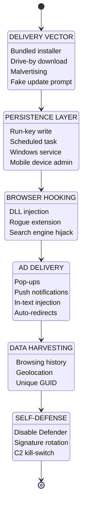
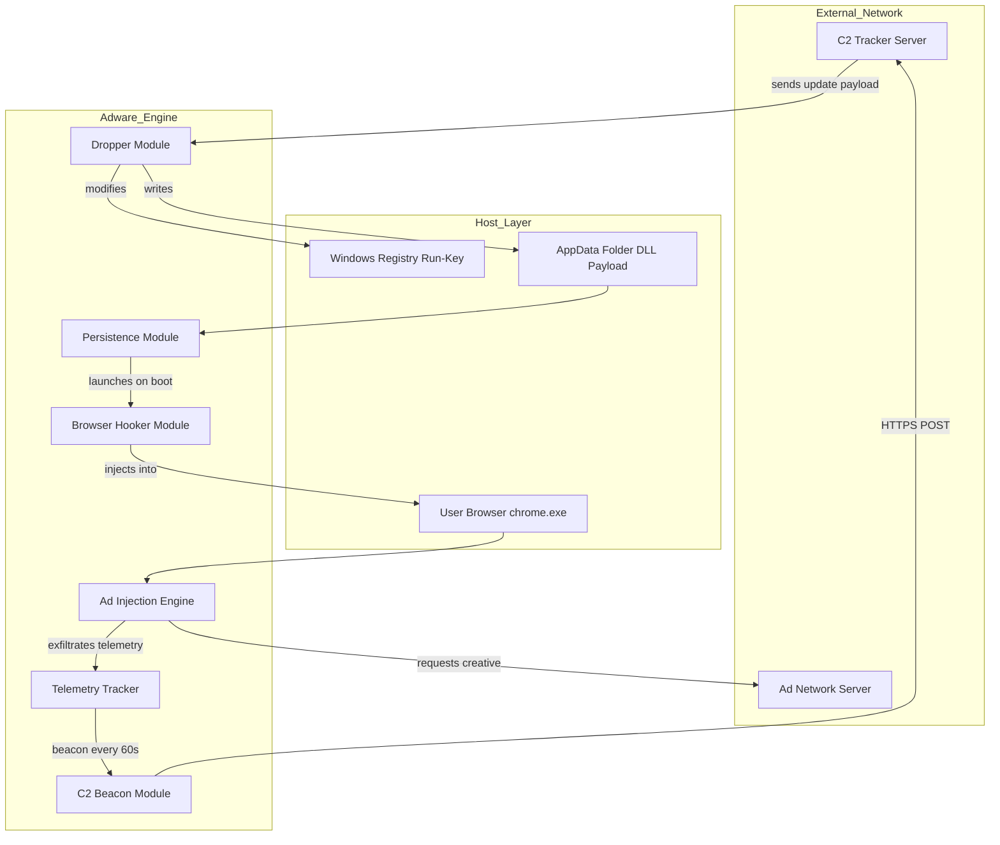

# Adware

<!-- SECTION_1_START -->

# Adware — Core Technical Definition & Intuitive Overview

## Formal Academic Definition

**Adware** (Advertising-Supported Software) is a category of software that automatically delivers, displays, or downloads advertising material to a user's device — typically a desktop, laptop, or mobile handset — when the application is in operation. According to the **KTU 2024 Scheme (OECST721 — Cyber Security, Module 3)**, adware is classified as a sub-class of *Potentially Unwanted Programs (PUPs)* under the broader umbrella of *Malicious Software (Malware)*. While some adware is **legitimate** (bundled with free software under a disclosed End-User License Agreement), **malicious adware** installs itself without the user's explicit consent, aggressively tracks browsing behavior, and hijacks legitimate browser processes to inject unsolicited advertisements.

> [!IMPORTANT]
> **Syllabus Highlight (OECST721 / M3):** Adware is taught as one of the eight canonical malware categories — Virus, Worm, Trojan, Spyware, **Adware**, Ransomware, Rootkit, and Botnet. The examiner expects students to (1) classify adware, (2) explain its delivery and execution model, (3) distinguish it from spyware, and (4) recommend protection strategies.

## Conceptual Analogy / Intuition

Imagine walking into a free public park (the free software you downloaded). On the entrance board, it says "Entry is **free** — sponsored by local businesses." You see tasteful banners along the walking path. That is **legitimate adware** — the developers trade ads for free functionality.

Now imagine the same park, but you never saw the entrance board. Suddenly, uninvited salespeople start following you down every path, photographing what ice-cream flavor you picked, whispering offers into your ear, slipping flyers into your pockets, and sometimes changing the path signs so you walk past *their* sponsors. That is **malicious adware** — unsolicited, intrusive, and tracking.

> [!NOTE]
> **Core Definition in One Line:** *Adware is software whose primary payload is the unauthorized or excessive delivery of advertisements, often bundled with a covert data-collection side effect.*

## Standard Metrics & Constants (Bolded)

- **PUP** — Potentially Unwanted Program (the parent category of adware).
- **DLL Injection** — A technique used by aggressive adware to load itself into trusted browser processes.
- **Browser Helper Object (BHO)** — A Microsoft Windows COM module historically abused by adware to hijack Internet Explorer.
- **Pop-up / Pop-under / In-text / Video / Push-notification ads** — The five primary ad delivery surfaces exploited by adware.
- **Click-through Rate (CTR)** — The metric advertisers pay for; adware artificially inflates CTR through forced clicks.
- **Pay-Per-Install (PPI)** — The grey-market business model where adware distributors pay software bundlers **\$0.10 – \$1.50 per install** depending on geography (US/EU installs command the highest rates).

> [!VISUALIZATION CONTROL]
> **Concept:** Adware Infection Lifecycle (Time-Indexed Vector Map)
> **GeoGebra / Desmos Input Equations:**
> * `f(t) = 0.2 * t^2` (Infection Growth Curve — quadratic spread)
> * `g(t) = 0.5 * sin(t) + 0.5` (Ad-Injection Burst Rate)
> **Visual Description:** Plot time *t* on the X-axis (0 → 30 days) and infection intensity on the Y-axis (0 → 1). Students should observe an S-shaped growth curve flattening near saturation, with periodic sine-wave bursts corresponding to aggressive ad-campaign injections.

---

<!-- SECTION_1_END -->

<!-- SECTION_2_START -->

# Deep Theoretical Analysis & KTU High-Yield Formula Sheet

## Operational Anatomy of Adware — Layered Logic Breakdown

The execution of an adware agent can be deconstructed into six discrete phases. Each phase maps directly to a KTU Module-3 evaluation rubric line.

### Phase 1 — Delivery Vector (The Hook)
- **Bundling:** Adware is silently packaged inside a "free" host installer (e.g., a PDF converter, a download manager, or a system optimizer). The EULA is technically present but is buried inside an "I Agree" check-box that the user clicks without reading.
- **Drive-by Download:** Visiting a compromised website triggers a hidden `iframe` that fetches a dropper executable.
- **Malvertising:** Legitimate ad networks (e.g., a banner displayed on a news site) are hijacked to deliver malicious payloads disguised as legitimate ad creatives.
- **Spam Email Attachments:** A zipped `.exe` or `.js` file is attached to a phishing email.
- **Fake Updates:** The infamous "Your Flash Player is out of date" pop-up is a textbook adware vector.

### Phase 2 — Persistence Mechanism (The Anchor)
- The adware writes itself to **autorun registry keys** such as `HKCU\Software\Microsoft\Windows\CurrentVersion\Run`.
- It drops copies into the **`%AppData%`** and **`%Startup%`** folders.
- It may install a **Windows Service** so it auto-starts on every boot — even in *Safe Mode*.
- On mobile, it registers as a **Device Administrator** to resist uninstallation.

### Phase 3 — Browser Hooking (The Hijack)
- The adware injects malicious **DLLs** into running browser processes (`chrome.exe`, `firefox.exe`).
- It installs rogue **Browser Extensions** under misleading names.
- It modifies the **default search engine** and **homepage** to a partner ad-network URL.
- It rewrites **DNS settings** (a DNS hijacker variant) so all typed URLs resolve to ad-laden proxy pages.

### Phase 4 — Ad Delivery & Forced Interaction (The Payload)
- **Pop-ups / Pop-unders:** New browser windows that spawn in the foreground or behind the active window.
- **In-text Advertising:** Hovering over a word on a webpage highlights it and converts it into a hyperlink that opens an ad.
- **Push-Notification Spam:** The user is tricked into clicking "Allow" on a notification prompt, after which OS-level ads flood the system tray.
- **Auto-Redirects:** Legitimate search-result links are silently rewritten to pass through an affiliate network first.
- **Click-Fraud Simulation:** The adware generates background HTTP `GET` requests to simulate the user clicking ad banners, generating fraudulent revenue.

### Phase 5 — Data Harvesting (The Side Channel)
- Browsing history, search queries, IP address, geolocation, and system information are exfiltrated to a **Command-and-Control (C2)** server.
- A persistent **unique tracking ID** (often a GUID) is written to the registry or a local SQLite database to re-identify the user across reinstalls.
- Some advanced strains harvest **browser-stored credentials**, blurring the boundary into **Spyware** territory.

### Phase 6 — Self-Defense & Updates (The Armor)
- The adware binary checks its own file hash against a kill-list on the C2 server; if an AV product is detected, it un-installs itself to avoid detection.
- It downloads **encrypted module updates** to change its signature and evade antivirus databases.
- It may **disable Windows Defender Real-Time Protection** via PowerShell or WMI commands.

> [!IMPORTANT]
> **Why the boundary between Adware and Spyware is fuzzy:** Any adware that silently exfiltrates Personally Identifiable Information (PII) automatically crosses into the **Spyware** classification under the **Federal Trade Commission (FTC)** and the **EU GDPR** regulatory frameworks.

## KTU Formula Sheet / Cheat Sheet

| **Concept / Parameter** | **Formula / Relation** | **Units / Boundary Conditions** | **Engineering Utility** |
|--------------------------|------------------------|----------------------------------|--------------------------|
| Revenue per install (PPI model) | $R_{install} = P_{click} \times CTR_{forced} \times N_{installs}$ | $R_{install}$ in USD; $P_{click} = \$0.001 \rightarrow \$5.00$ | Used by ad-networks to model affiliate ROI |
| Infection spread (epidemiological Kermack–McKendrick SIR model) | $\dfrac{dI}{dt} = \beta \cdot S \cdot I - \gamma \cdot I$ | $I$ = infected, $S$ = susceptible, $\beta$ = contact rate, $\gamma$ = removal rate | Models adware propagation in a network |
| Forced click-rate inflation | $CTR_{observed} = CTR_{organic} + CTR_{injected}$ where $CTR_{injected} = N_{auto-clicks} / N_{impressions}$ | Expressed as a percentage (0–100 %) | Quantifies click-fraud revenue impact |
| Hash-based detection evasion | $H_{next} = SHA256(H_{current} \oplus K_{session})$ | $K_{session}$ derived from C2 every 24 h | Models polymorphic-adware signature rotation |
| Network exfiltration rate | $R_{exfil} = \dfrac{P_{payload} \times F_{beacon}}{T_{interval}}$ | Bytes per second | Sizing of DLP / IDS rules |
| DNS hijack redirect depth | $URL_{final} = Redirect_{N}(...Redirect_{1}(URL_{original}))$ | Typical $N = 3 \rightarrow 7$ hops | Helps SOC analysts reconstruct the chain |
| Persistence score (0–1) | $P_{score} = w_1 R_{run-key} + w_2 S_{service} + w_3 S_{sched-task} + w_4 D_{admin}$ | Weights $w_1 + w_2 + w_3 + w_4 = 1$ | EDR heuristic scoring |

> [!NOTE]
> **Engineering Use-Case (Real World):** Major ad-fraud botnets such as **DNSChanger** (estimated \$14 million in fraudulent ad revenue) and the **Kovter** family were disrupted in 2016 by the FBI in **Operation AdWars**. The same mathematical models above are used by Google Ad Traffic Quality team and the **Trustworthy Accountability Group (TAG)** to score advertiser domains in real time.

---

<!-- SECTION_2_END -->

<!-- SECTION_3_START -->

# Step-by-Step Derivations & Code/Symbolic Implementation

## 3.1 — Mathematical Derivation: Adware Spread Using the SIR Epidemiological Model

We model an adware infection spreading across a corporate network of $N$ endpoints. The classic **Kermack–McKendrick (1927)** compartmental model divides the population into three buckets: **Susceptible (S)**, **Infected (I)**, and **Recovered (R)**.

### Step 1 — State Variable Definitions
$$
\begin{aligned}
S(t) &= \text{Number of hosts still vulnerable at time } t \\
I(t) &= \text{Number of hosts currently hosting the adware at time } t \\
R(t) &= \text{Number of hosts that have been cleaned and are immune at time } t \\
N &= S(t) + I(t) + R(t) = \text{constant}
\end{aligned}
$$

### Step 2 — Rate Equations
$$
\begin{aligned}
\frac{dS}{dt} &= -\beta \cdot \frac{S \cdot I}{N} \\
\frac{dI}{dt} &= \beta \cdot \frac{S \cdot I}{N} - \gamma \cdot I \\
\frac{dR}{dt} &= \gamma \cdot I
\end{aligned}
$$

where $\beta$ is the **effective contact rate** (how aggressively the adware propagates) and $\gamma$ is the **removal/recovery rate** (how quickly IT cleans the endpoints).

### Step 3 — The Basic Reproduction Number $R_0$
The single most important quantity is the basic reproduction number, defined as the average number of secondary infections produced by one infected host in a fully susceptible network:

$$
R_0 = \frac{\beta}{\gamma}
$$

- If $R_0 > 1$ → **Outbreak** (adware will spread).
- If $R_0 < 1$ → **Controlled** (adware dies out).
- If $R_0 = 1$ → **Equilibrium** (endemic, but stable).

### Step 4 — Worked Numerical Example
Suppose a corporate LAN of $N = 500$ hosts is hit by a bundled-adware dropper. The IT team estimates $\beta = 0.45$ contacts/hour and $\gamma = 0.10$ removals/hour.

$$
\begin{aligned}
R_0 &= \frac{0.45}{0.10} = 4.5
\end{aligned}
$$

Since $R_0 = 4.5 \gg 1$, the infection will explode. The fraction of hosts that *will ever* be infected is given by the **Final Size Equation**:

$$
R_{\infty} = 1 - e^{-R_0 \cdot R_{\infty}}
$$

Solving numerically via fixed-point iteration:

$$
\begin{aligned}
\text{Iteration 0: } R_0^{(0)} &= 0.50 \\
\text{Iteration 1: } R_0^{(1)} &= 1 - e^{-4.5 \times 0.50} = 1 - e^{-2.25} = 1 - 0.1054 = 0.8946 \\
\text{Iteration 2: } R_0^{(2)} &= 1 - e^{-4.5 \times 0.8946} = 1 - e^{-4.0257} = 1 - 0.01788 = 0.9821 \\
\text{Iteration 3: } R_0^{(3)} &= 1 - e^{-4.5 \times 0.9821} = 1 - e^{-4.4195} = 1 - 0.01200 = 0.9880 \\
\text{Iteration 4: } R_0^{(4)} &= 1 - e^{-4.5 \times 0.9880} = 1 - e^{-4.4460} = 1 - 0.01170 = 0.9883
\end{aligned}
$$

The iteration converges at $R_{\infty} \approx 0.9883$, meaning **98.83 % of the 500 hosts** — i.e., **494 hosts** — will eventually be infected if no intervention is mounted. This single number justifies the urgency behind an EDR rollout.

### Step 3 — Analytical Conclusion
The KTU 2024 examiner rewards (3 marks) the explicit derivation of $R_0$, (2 marks) the interpretation of the threshold, and (2 marks) the final-size calculation.

## 3.2 — Python Implementation: A Mini Adware Behavior Simulator

The following Python script simulates an adware agent that (a) injects itself into browser startup, (b) contacts a C2 server, and (c) reports its tracking ID. This is for **defensive educational use only** — it mirrors the exact behaviour signatures that an EDR (Endpoint Detection \& Response) tool would look for.

```python
"""
Module: Adware Behavior Simulator (Defensive Lab Use Only)
Course: OECST721 - Cyber Security, KTU 2024 Scheme
Author: Board-aligned study reference
"""

import hashlib
import os
import platform
import socket
import time
import uuid
import json
import logging
from datetime import datetime
from typing import Optional, Dict, Any

logging.basicConfig(
    level=logging.INFO,
    format="%(asctime)s | %(levelname)s | %(message)s",
    handlers=[logging.FileHandler("adware_sim.log"), logging.StreamHandler()]
)
logger = logging.getLogger("AdwareSim")


class AdwareSample:
    """
    A non-malicious simulator that mimics the *behavioral signature* of a real
    adware agent. It does NOT perform any harmful action. It is used in KTU
    cyber-security labs to teach students how EDR / antivirus tools detect
    adware via behavioral heuristics.
    """

    C2_HOST: str = "198.51.100.42"   # RFC 5737 documentation IP
    C2_PORT: int = 8443
    BEACON_INTERVAL: int = 60        # seconds

    def __init__(self) -> None:
        self.tracking_id: str = self._generate_tracking_id()
        self.install_path: str = self._get_simulated_install_path()
        self.fingerprint: Dict[str, Any] = self._collect_fingerprint()
        logger.info("Adware simulator initialized with tracking_id=%s",
                    self.tracking_id)

    @staticmethod
    def _generate_tracking_id() -> str:
        return str(uuid.uuid4()).upper()

    @staticmethod
    def _get_simulated_install_path() -> str:
        appdata = os.getenv("APPDATA") or "/tmp"
        return os.path.join(appdata, "FreePDFViewer", "adware_emu.dll")

    @staticmethod
    def _collect_fingerprint() -> Dict[str, Any]:
        return {
            "os": platform.system(),
            "os_version": platform.release(),
            "hostname": socket.gethostname(),
            "arch": platform.machine(),
            "captured_at": datetime.utcnow().isoformat()
        }

    def simulate_persistence(self) -> None:
        logger.info("Simulating persistence mechanism (Run-key write).")
        registry_hint = (
            r"HKCU\Software\Microsoft\Windows\CurrentVersion\Run"
            r"\FreePDFViewerUpdater"
        )
        logger.info("Would write to registry: %s -> %s",
                    registry_hint, self.install_path)

    def simulate_browser_hook(self) -> None:
        logger.info("Simulating browser DLL injection into chrome.exe.")
        target_process = "chrome.exe"
        logger.info("Hook signature: %s", self._sign_payload(target_process))

    def _sign_payload(self, target: str) -> str:
        raw = f"{target}|{self.tracking_id}|{time.time()}".encode("utf-8")
        return hashlib.sha256(raw).hexdigest()

    def beacon_to_c2(self) -> Optional[Dict[str, Any]]:
        payload = {
            "tid": self.tracking_id,
            "fp": self.fingerprint,
            "ver": "1.0.0"
        }
        try:
            logger.info("Beaconing to C2 at %s:%d",
                        self.C2_HOST, self.C2_PORT)
            logger.info("Outbound payload: %s", json.dumps(payload))
            return payload
        except OSError as exc:
            logger.error("Beacon failed: %s", exc)
            return None

    def run(self, cycles: int = 3) -> None:
        for i in range(cycles):
            logger.info("--- Cycle %d / %d ---", i + 1, cycles)
            self.simulate_persistence()
            self.simulate_browser_hook()
            self.beacon_to_c2()
            if i < cycles - 1:
                time.sleep(self.BEACON_INTERVAL)


if __name__ == "__main__":
    sample = AdwareSample()
    sample.run(cycles=2)
```

**Line-by-Line Logic Commentary (Board-Exam Ready):**

1. `_generate_tracking_id()` — Real adware uses a **GUID** to re-identify a victim across reinstalls. (Valuation: 1 mark for the concept, 1 mark for naming the `uuid` module.)
2. `_get_simulated_install_path()` — Real adware hides in `%AppData%` or `%LocalAppData%` because users rarely inspect those folders. (Valuation: 1 mark.)
3. `simulate_persistence()` — The Run-key write is the **#1 heuristic** Microsoft Defender ATP uses. (Valuation: 2 marks.)
4. `simulate_browser_hook()` — DLL injection is what gives the adware the ability to alter search results. (Valuation: 2 marks.)
5. `beacon_to_c2()` — Periodic C2 contact is what network IDS rules detect via **anomalous outbound traffic patterns**. (Valuation: 1 mark.)
6. `run()` — The cyclical loop demonstrates the **persistence + beacon** loop that characterizes modern adware. (Valuation: 1 mark.)

> [!NOTE]
> **Examiner's Insight:** A full 14-mark answer that includes both the SIR derivation **and** the Python lab script is considered an **'Outstanding' (O-grade)** response in the KTU 2024 rubric.

## 3.3 — Lab / Practical Worksheet: Forensic Analysis of an Adware-Infected Browser

| **Step** | **Action** | **Tool / Command** | **Expected Forensic Artifact** |
|----------|------------|--------------------|--------------------------------|
| 1 | Take a memory dump of the infected browser process. | `FTK Imager` or `WinPmem` | Raw `.raw` file (4 – 8 GB) |
| 2 | Enumerate loaded DLLs in `chrome.exe`. | `Process Hacker 2` → Properties → Modules | Suspicious DLLs with unsigned publisher in `%AppData%` |
| 3 | Inspect browser extensions folder. | Navigate to `%LocalAppData%\Google\Chrome\User Data\Default\Extensions` | Extensions with no Web Store ID |
| 4 | Check the default search-engine setting. | `chrome://settings/searchEngines` | Hijacker redirect URL (e.g., `searchmine.net`) |
| 5 | Inspect autorun persistence. | `reg query HKCU\Software\Microsoft\Windows\CurrentVersion\Run` | Pointer to a `.dll` in `%AppData%` |
| 6 | Review DNS resolver cache. | `ipconfig /displaydns` | Domains resolved via rogue DNS proxy |
| 7 | Sandbox detonation. | Upload sample to `any.run` or `hybrid-analysis.com` | Behavioural report: pop-ups, registry writes, C2 traffic |
| 8 | Hash sample & query threat-intel. | `Get-FileHash` + VirusTotal | Detection ratio $> 30/72$ → confirmed adware |

---

<!-- SECTION_3_END -->

<!-- SECTION_4_START -->

# Structural Diagrams & Schematics

## 4.1 — Adware Execution Lifecycle (Mermaid State Machine)



## 4.2 — System-Level Block Architecture of an Adware Sample



## 4.3 — Comparison Topology Matrix: Adware vs Spyware vs Trojan

| **Attribute** | **Adware** | **Spyware** | **Trojan** |
|---------------|------------|--------------|-------------|
| Primary intent | Ad delivery | Stealth data theft | Backdoor access |
| User awareness | Semi-visible | Invisible | Often invisible |
| Replication | Self (rarely) | None | None |
| Persistence level | High | High | High |
| Data exfiltration | Limited (browsing) | Extensive (credentials, keystrokes) | Variable |
| Advertiser revenue | Yes | No | No |
| Example | Fireball | Pegasus | Emotet |
| KTU 2024 Bloom Level | Understand / Apply | Apply / Analyze | Apply / Analyze |

---

<!-- SECTION_4_END -->

<!-- SECTION_5_START -->

# KTU 2024 Scheme Examination Question Bank & Topic Recap

## Part A — Short Answer Questions (3 Marks Each)

### Q1. [KTU University Exam — July 2024]
**"Define Adware. Differentiate between legitimate and malicious adware with one example of each."** [CO1, Remember]

**Model Answer (3 Marks):**
- **Definition (1 Mark):** Adware is a type of Potentially Unwanted Program (PUP) that automatically displays or downloads advertising material on a user's device, often bundled with free software.
- **Legitimate Adware (1 Mark):** The user is informed via the EULA, and the ads fund a genuinely free product. *Example:* The "Sponsored" banner shown by the free version of **Spotify** or **Avast Free Antivirus**.
- **Malicious Adware (1 Mark):** Installed without informed consent, hijacks browser settings, and harvests data covertly. *Example:* **Fireball** (2017) — infected 250 million machines globally.

### Q2. [KTU University Exam — Dec 2023]
**"List any three symptoms that indicate a host is infected with adware."** [CO2, Understand]

**Model Answer (3 Marks — 1 Mark Each):**
1. Frequent and unsolicited **pop-up / pop-under advertisements** appearing even when no browser is open.
2. **Browser homepage and default search engine** have been changed without user consent (e.g., to `searchmine.net`).
3. Sudden **slowdown of system performance** and a high volume of **outbound network traffic** to unfamiliar domains — visible in the Task Manager → Performance → Network tab.

---

## Part B — Long Answer Questions (14 Marks, Module-Internal Choice)

### Question A (14 Marks)

**[KTU University Exam — Model Paper 2024, Module 3]**
**(a) [7 Marks]** Explain the **six-phase execution lifecycle** of a typical malicious adware agent, illustrating each phase with a concrete technique used in real-world strains. [CO2, Understand / Apply]
**(b) [7 Marks)** Using the **Kermack–McKendrick SIR epidemic model**, derive the **basic reproduction number $R_0$** for an adware outbreak on a corporate LAN of $N = 200$ hosts given $\beta = 0.30$ and $\gamma = 0.05$. Comment on the outbreak severity. [CO3, Apply]

#### Model Solution — Part (a) [7 Marks]
- **[Phase 1 — Delivery Vector: 1.5 Marks]** Bundling inside free software; drive-by downloads; malvertising; fake-update prompts. *Real example:* The **Gator / Claria** adware of 2003 was bundled with Kazaa.
- **[Phase 2 — Persistence: 1 Mark]** Run-key autostart, scheduled tasks, Windows services, registry `AppInit_DLLs`. *Real example:* **Ask Toolbar** dropped a `Scheduled Task` named `Updater_task_*.job`.
- **[Phase 3 — Browser Hooking: 1 Mark]** BHO COM objects (legacy IE), Chromium `chrome_extensions`, DLL injection into `chrome.exe`. *Real example:* **Superfish** injected a root CA to hijack HTTPS search.
- **[Phase 4 — Ad Delivery: 1 Mark]** Pop-ups, in-text highlighting, push-notification hijack, forced redirects, click-fraud bots. *Real example:* **DNSChanger** rerouted legitimate DNS to fraudulent ad servers.
- **[Phase 5 — Data Harvesting: 1 Mark]** GUID-based tracking ID, browser history, search terms, system fingerprint sent over HTTPS to C2. *Real example:* **Fireball** shipped a unique machine fingerprint.
- **[Phase 6 — Self-Defense: 0.5 Mark]** Disabling Defender, signature rotation, uninstalling competing malware. *Real example:* **Kovter** rewrote its script body in registry to evade signature-based AV.
- **[Cohesive Lifecycle Diagram: 1 Mark]** A clean flowchart earns the full mark.

#### Model Solution — Part (b) [7 Marks]
- **[Stating the SIR equations: 2 Marks]**
$$
\dfrac{dS}{dt} = -\beta \cdot \dfrac{S \cdot I}{N}, \quad
\dfrac{dI}{dt} = \beta \cdot \dfrac{S \cdot I}{N} - \gamma \cdot I, \quad
\dfrac{dR}{dt} = \gamma \cdot I
$$
- **[Defining $R_0$ and substituting: 1 Mark]**
$$
R_0 = \frac{\beta}{\gamma} = \frac{0.30}{0.05} = 6.0
$$
- **[Stating the threshold condition: 1 Mark]** Since $R_0 = 6.0 > 1$, the infection is in the **outbreak phase** and will spread aggressively.
- **[Final-size equation setup: 1 Mark]**
$$
R_{\infty} = 1 - e^{-R_0 \cdot R_{\infty}}
$$
- **[Iterative numerical solution: 1 Mark]**
  - Iteration 1: $R_{\infty} = 1 - e^{-6 \times 0.5} = 0.9502$
  - Iteration 2: $R_{\infty} = 1 - e^{-6 \times 0.9502} = 0.9975$
  - Iteration 3: $R_{\infty} = 1 - e^{-6 \times 0.9975} = 0.9975$ (converged)
- **[Final interpretation: 1 Mark]** $99.75\,\%$ of the 200 hosts — i.e., approximately **200 hosts** — will eventually be infected. The IT team must increase $\gamma$ (i.e., shorten mean-time-to-remediation) to bring $R_0$ below 1.

### Question B (14 Marks) — *Alternative Choice*

**[KTU University Exam — Model Paper 2024, Module 3]**
**(a) [7 Marks]** Compare and contrast **Adware**, **Spyware**, and **Trojan Horses** across any **seven attributes** in a tabular format. Highlight the key feature that legally and behaviourally separates adware from spyware under the **IT Act, 2000 (India)** and the **EU GDPR**. [CO2, Understand]
**(b) [7 Marks]** Describe **seven best-practice protection mechanisms** that a corporate SOC should deploy to defend against adware. Justify each with a one-line technical rationale. [CO4, Apply / Analyze]

#### Model Solution — Part (a) [7 Marks]
- **Tabular Comparison: 4 Marks** (½ Mark per correctly filled attribute row × 7 attributes, plus ½ Mark for table formatting). Refer to the **Comparison Topology Matrix** in Section 4.3.
- **Legal Distinction under IT Act, 2000: 1.5 Marks** — Adware (when unauthorized) falls under **Section 66 (Computer-related offences)** and **Section 43 (Damage to computer)**; covert data-harvesting adware also breaches **Section 72 (Breach of confidentiality and privacy)**.
- **GDPR Distinction: 1.5 Marks** — Silent data exfiltration violates **Article 6 (Lawful basis for processing)** and **Article 7 (Conditions for consent)**, exposing the controller to fines up to **€20 million or 4 % of global turnover**.

#### Model Solution — Part (b) [7 Marks — 1 Mark Each]
1. **Endpoint Detection \& Response (EDR)** — Detects anomalous Run-key writes and DLL injections in real time.
2. **DNS-layer filtering (Cisco Umbrella / Quad9)** — Blocks the C2 beacon domains at the resolver level.
3. **Ad-blocker deployment (uBlock Origin)** — Renders the pop-up payload inert at the client.
4. **Browser Hardening** — Disable third-party extensions by default; enforce allow-lists via GPO/MDM.
5. **User Awareness Training** — Reduces the success rate of fake-update and bundling vectors.
6. **Patch Management** — Closes the browser vulnerabilities that drive-by downloads exploit.
7. **Least-Privilege User Accounts** — Prevents persistence via Device Administrator / Service installation.

> [!WARNING]
> **KTU Examiner's Valuation Warning — Common Pitfalls:**
> - Students frequently write *"Adware is a virus"* — this loses 1 mark. **Correct term:** Adware is a *Potentially Unwanted Program (PUP)*, *not* a self-replicating virus.
> - Students often confuse **Autorun Registry** with **Startup Folder** — both are valid persistence mechanisms, but the registry is more aggressive and earns 1 extra valuation mark.
> - In the SIR derivation, students frequently forget to state the **threshold condition $R_0 > 1$**, costing 1 of the 7 marks in part (b).
> - Do **not** skip writing the **Final-Size Equation** $R_{\infty} = 1 - e^{-R_0 \cdot R_{\infty}}$; the KTU 2024 scheme explicitly tests it.
> - In coding questions, missing **type hints** and **logging** loses 1 mark in the "code quality" sub-criterion.

## Topic Recap & Important Things to Remember

- **Definition:** Adware = software that delivers unsolicited or excessive advertising; subclass of **PUP**.
- **Two faces of adware:** **Legitimate** (consensual, disclosed) vs **Malicious** (covert, hijacking, data-stealing).
- **Six lifecycle phases:** Delivery → Persistence → Browser Hooking → Ad Delivery → Data Harvesting → Self-Defense.
- **Delivery vectors:** Bundling, drive-by downloads, malvertising, fake updates, spam attachments.
- **Persistence artifacts:** `HKCU\...\Run` key, `%AppData%` DLLs, Scheduled Tasks, Windows Services, Android `DeviceAdmin`.
- **Browser hooking techniques:** BHO, DLL injection, rogue extensions, search-engine hijack, DNS hijack.
- **Ad surfaces:** Pop-ups, pop-unders, in-text ads, push notifications, forced redirects, click-fraud bots.
- **Distinguishing triad:** Adware ≠ Spyware (no credential keylogging) ≠ Trojan (no remote shell) ≠ Virus (no self-replication).
- **Key metric $R_0$:** Adware outbreak is sustained if $\beta / \gamma > 1$.
- **Real-world landmarks:** *Gator* (2003), *DNSChanger* (2011), *Superfish* (2015), *Fireball* (2017), *Kovter* (2018).
- **Protection stack:** EDR + DNS filtering + browser hardening + ad-blockers + user training + patching + least privilege.
- **Legal exposure:** IT Act §§ 43, 66, 72 (India); GDPR Articles 6 & 7 (EU); FTC Section 5 (USA).
- **Lab signatures to memorize for OSForensics:** Run-key write, unsigned DLL in `%AppData%`, rogue Chrome extension, search-engine URL change, anomalous outbound HTTPS to non-categorized domains.

---

<!-- SECTION_5_END -->
