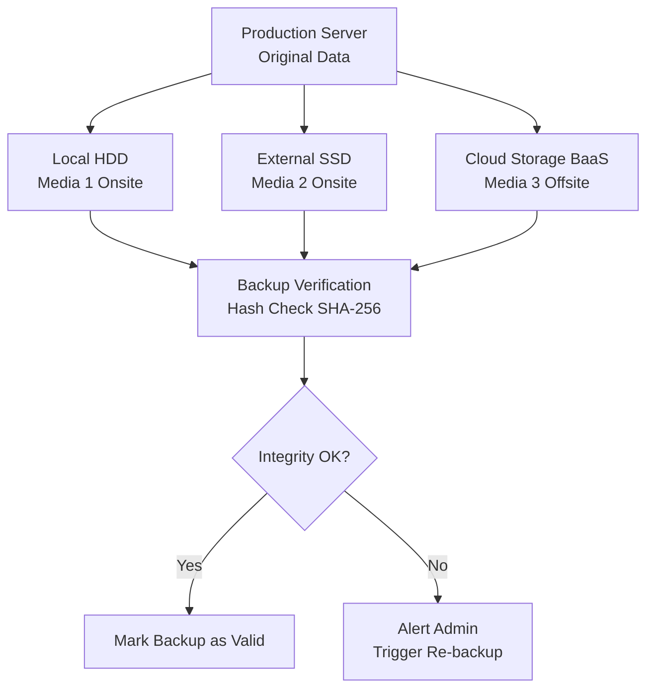
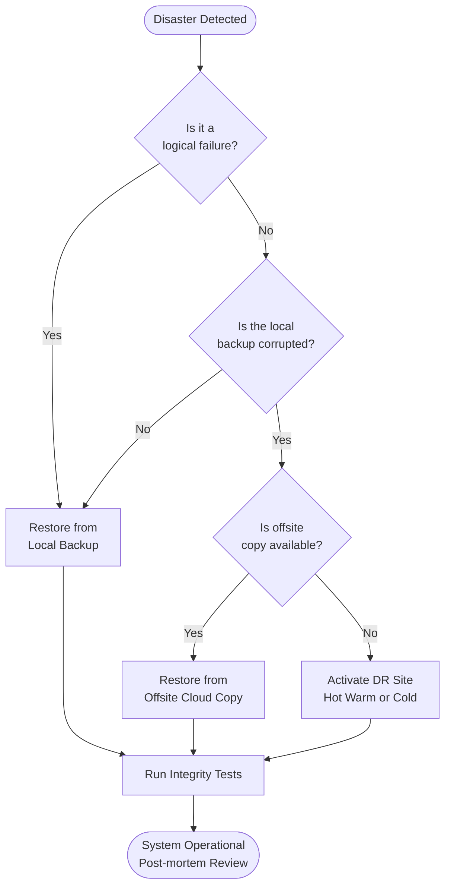

# Data Backup and Recovery

<!-- SECTION_1_START -->

# Data Backup and Recovery — Core Technical Definition & Intuitive Overview

## Formal Academic Definition

**Data Backup** is the practice of creating redundant, stored copies of digital information so that the original data can be **restored, recovered, or reinstated** in the event of accidental deletion, hardware failure, ransomware encryption, natural disaster, or any other form of data loss. **Data Recovery** is the complementary process of retrieving and restoring that backed-up data back to its original (or a usable) location after a disruption has occurred.

> [!IMPORTANT]
> **KTU 2024 OECST721 — Module 3 Highlight:**
> In the syllabus, data backup and recovery is treated as a *defensive control* against malware (especially ransomware) and as a **pillar of cyber resilience**. The 3-2-1 backup rule is the single most frequently asked concept in this module.

## Conceptual Analogy / Intuition

Imagine your **bicycle** is your data.

- A **backup** is keeping a **photograph of your bicycle** in a safe deposit box across town. If the bicycle is stolen, flooded, or damaged, the photo allows you to **rebuild (recover)** a working bicycle.
- If the photograph is kept in the *same garage* as the bicycle, a single fire destroys both — the photo is useless. Hence, backups must live on **separate media, in separate locations**.
- The **frequency** of the photo (daily, weekly, monthly) is your **Recovery Point Objective (RPO)** — how much data you can afford to lose.

> [!NOTE]
> **Plain-English Summary:**
> Backup = *making a spare copy*. Recovery = *using the spare copy* when things break. A backup that has never been tested is *not* a backup — it is a *hope*.

## Core Terminology (Board Must-Know Terms)

| Term | Definition |
| --- | --- |
| **RPO** (Recovery Point Objective) | The maximum acceptable amount of data loss, measured in time (e.g., 1 hour of data). |
| **RTO** (Recovery Time Objective) | The maximum acceptable downtime before the system must be operational again. |
| **MTTR** (Mean Time To Recover) | The average time required to restore a system after failure. |
| **3-2-1 Rule** | Keep **3** copies of data, on **2** different media, with **1** stored offsite. |
| **D2C2D2R** | NIST-style acronym: **D**efine, **D**ocument, **D**istribute, **R**ecover (extended backup governance model). |

> [!TIP]
> **Real-World Mapping:** Cloud platforms like **AWS S3**, **Google Drive**, and **Azure Blob** implement geographic redundancy (offsite copies) to satisfy the '1 offsite' leg of the 3-2-1 rule automatically.

<!-- SECTION_1_END -->

<!-- SECTION_2_START -->

# Deep Theoretical Analysis & KTU High-Yield Formula Sheet

## 1. The 3-2-1 Backup Rule (Foundational Pillar)

The **3-2-1 rule** is the industry standard for resilient data protection and is the most testable concept in this topic.

- **3** — Maintain at least **three (3) total copies** of every important dataset.
- **2** — Store the copies on **two (2) different types of media** (e.g., internal HDD + external SSD, or HDD + cloud).
- **1** — Keep **one (1) copy offsite** (geographically separated) to survive site-wide disasters (fire, flood, earthquake).

### Extended Variants Testable in KTU

- **3-2-1-1-0** (Veeam 2020+): Add *one immutable (air-gapped) copy* and *zero errors after automated verification*.
- **4-3-2**: Four copies, three locations, two offsite — used by financial and defence institutions.

## 2. Types of Backup (High-Yield for KTU 14-Mark Questions)

| Type | What is Copied | Storage Cost | Restore Speed | Use Case |
| --- | --- | --- | --- | --- |
| **Full Backup** | Entire dataset every time | **High** ($\propto N$) | **Fastest** | Weekly anchor copy |
| **Incremental Backup** | Only data changed since the *last* backup of *any* type | **Low** | **Slowest** (needs full + all incrementals) | Daily run on large datasets |
| **Differential Backup** | Only data changed since the *last full* backup | **Medium** | **Medium** (needs full + latest differential) | Mid-cycle recovery point |
| **Mirror Backup** | Exact real-time copy (no versioning) | **High** (equal to source) | **Instant** | Live replicas, virtual machines |
| **Synthetic Full Backup** | Server-side merge of full + differentials into a new full | High (one-time) | Fast | Offloads load from production server |

> [!WARNING]
> **Examiner Alert:** Students frequently confuse **Incremental** and **Differential**. The discriminator is the *reference point*:
> - Incremental $\rightarrow$ *last backup of any kind* (rolling window).
> - Differential $\rightarrow$ *last full backup* (expanding window).

## 3. Storage Calculation — The Standard KTU Numerical

Given a dataset of size $S$ bytes, let the **daily change rate** be $r$ (as a fraction). For a weekly cycle containing one full backup and six subsequent daily backups:

$$
\text{Weekly storage} = S_{\text{full}} \;+\; 6 \times r \times S_{\text{daily}}
$$

For an **Incremental** strategy (each daily captures only new changes since the *previous* incremental):

$$
\text{Weekly storage (Incremental)} = S_{\text{full}} \;+\; 6 \times (r \times S)
$$

For a **Differential** strategy (each daily captures all changes since the *full*):

$$
\text{Weekly storage (Differential)} = S_{\text{full}} \;+\; (r \times S) \;\sum_{i=1}^{6} i \;=\; S_{\text{full}} \;+\; 21 \times r \times S
$$

## 4. Backup Topologies and Architectures

- **On-site Backup**: Local copy on the same premises (e.g., external HDD). Protects against logical failures; vulnerable to physical site disasters.
- **Off-site Backup**: Copy stored at a geographically distinct location. Protects against site-wide disasters.
- **Cloud Backup (BaaS)**: Backup-as-a-Service — third-party cloud storage with versioning.
- **Hybrid Backup**: Combination of local speed + cloud durability.
- **Air-gapped Backup**: Physically isolated (network-disconnected) copy. The **gold standard** against ransomware.
- **Immutable Backup**: Write-once-read-many (WORM) storage — cannot be encrypted or modified by malware.

## 5. The Disaster Recovery (DR) Process

$$
\text{Disaster Recovery Lifecycle} \;=\; \text{Identify} \;\to\; \text{Protect} \;\to\; \text{Detect} \;\to\; \text{Respond} \;\to\; \text{Recover} \;\to\; \text{Restore}
$$

This aligns with the **NIST SP 800-34** framework, which KTU examiners reference for full-mark questions.

## 6. Recovery Strategies (Hierarchical by Cost)

| Strategy | RTO | Cost |
| --- | --- | --- |
| **Cold Site** | Days to Weeks | Low |
| **Warm Site** | Hours to Days | Medium |
| **Hot Site** | Minutes | High |
| **Active-Active Multi-Site** | Near-Zero (sub-second failover) | Very High |

## 7. KTU High-Yield Formula Sheet (Quick Reference)

| Concept | Formula / Relation | Units |
| --- | --- | --- |
| Storage of $n$ incrementals | $S_{\text{full}} + n \cdot (r \cdot S)$ | Bytes |
| Storage of $n$ differentials | $S_{\text{full}} + (r \cdot S) \cdot \frac{n(n+1)}{2}$ | Bytes |
| Total Recovery Window | $\text{RTO} + \text{Verification Time}$ | Hours |
| Data Loss Bound | $\text{RPO} \le \text{Backup Frequency}$ | Hours |
| 3-2-1 Compliance Score | $\frac{\text{Compliant Copies}}{\text{Total Copies}} \times 100$ | Percentage |
| Availability | $A = \frac{\text{MTBF}}{\text{MTBF} + \text{MTTR}}$ | Fraction / 9s |

> [!NOTE]
> **Industry Application:** Production systems at banks run **continuous incremental replication** with an **RPO of seconds** and an **RTO of minutes** — a direct application of the formulas above.

<!-- SECTION_2_END -->

<!-- SECTION_3_START -->

# Step-by-Step Derivations & Code/Symbolic Implementation

## Worked-Out Numerical 1 — Storage Comparison (Full Marks Question)

A server has a **total dataset of 200 GB**. The **daily change rate is 5%**. Compute the total backup storage required for a one-week cycle under (a) Incremental and (b) Differential strategies, assuming one full backup on Sunday and daily backups Mon–Sat.

### Given

$$
S = 200 \text{ GB}, \quad r = 0.05, \quad n = 6 \text{ daily backups}
$$

### (a) Incremental Strategy

Each daily captures only the *new* changes since the *previous* backup. All six daily incrementals are of the same size because the change rate is assumed constant:

$$
S_{\text{daily-incr}} = r \times S = 0.05 \times 200 = 10 \text{ GB}
$$

$$
\begin{aligned}
\text{Storage}_{\text{incremental}} &= S_{\text{full}} + 6 \times S_{\text{daily-incr}} \\
&= 200 + 6 \times 10 \\
&= 200 + 60 \\
&= 260 \text{ GB}
\end{aligned}
$$

**[Step 1: Daily incremental size = 10 GB: 1 Mark]**
**[Step 2: Sum over 6 days = 60 GB: 1 Mark]**
**[Step 3: Add full backup = 260 GB: 1 Mark]**

### (b) Differential Strategy

Each daily captures all changes since the *last full backup* (Sunday). Daily $i$ accumulates $i$ days of changes:

$$
S_{\text{daily-diff}}(i) = i \times r \times S
$$

$$
\begin{aligned}
\text{Storage}_{\text{differential}} &= S_{\text{full}} + r \cdot S \cdot \sum_{i=1}^{6} i \\
&= 200 + (0.05 \times 200) \times \frac{6 \times 7}{2} \\
&= 200 + 10 \times 21 \\
&= 200 + 210 \\
&= 410 \text{ GB}
\end{aligned}
$$

**[Step 1: Arithmetic series sum formula: 1 Mark]**
**[Step 2: Evaluate 21 × 10 = 210 GB: 1 Mark]**
**[Step 3: Final 410 GB: 1 Mark]**

### Comparative Inference

$$
\text{Extra storage with differential} = 410 - 260 = 150 \text{ GB} \;\;(\approx 57.7\% \text{ larger})
$$

> [!TIP]
> **KTU Insight:** Incremental saves *storage*; differential saves *restore time*. Examiners love asking "which is better for an organization with limited bandwidth?" — answer: *Incremental* for storage, *Differential* for fast restore.

---

## Worked-Out Numerical 2 — RPO/RTO vs. Backup Frequency

A company conducts backups **every 6 hours**. A ransomware attack occurs at **14:30**, and the last successful backup completed at **12:00**. Compute the **data loss window**.

### Solution

$$
\text{Time since last backup} = 14\!:\!30 - 12\!:\!00 = 2.5 \text{ hours}
$$

$$
\text{Data Loss Window} = 2.5 \text{ hours} \;\;(\text{i.e., 2 hr 30 min of unsaved transactions})
$$

Therefore:

$$
\text{RPO}_{\text{achieved}} = 2.5 \text{ hours}
$$

To meet an **RPO of 1 hour**, the company must increase backup frequency to at least:

$$
\text{Frequency} \le \text{RPO} \implies \text{Every} \le 1 \text{ hour}
$$

> [!IMPORTANT]
> **Valuation Key Point:** Always state the *unit* (hours, GB) explicitly. Examiners deduct 1 mark for unit omission.

---

## Worked-Out Numerical 3 — Availability Calculation

A system has an **MTBF (Mean Time Between Failures) of 5000 hours** and an **MTTR of 2 hours**. Compute the system availability.

### Solution

$$
\begin{aligned}
A &= \frac{\text{MTBF}}{\text{MTBF} + \text{MTTR}} \\
&= \frac{5000}{5000 + 2} \\
&= \frac{5000}{5002} \\
&\approx 0.999600
\end{aligned}
$$

Converting to "nines":

$$
A \approx 99.96\% \;\;(\text{approximately "four nines"})
$$

**[MTBF and MTTR correctly stated: 2 Marks]**
**[Final ratio and percentage: 2 Marks]**

---

## Symbolic / Code Implementation — Backup Integrity Checker in Python

The following script verifies a backup's integrity using cryptographic hashes and implements a basic **3-2-1 compliance check**. This mirrors what tools like *Veeam*, *Bacula*, and *Duplicity* do internally.

```python
import hashlib
import os
import json
from datetime import datetime
from typing import Dict, List, Tuple


class BackupIntegrityChecker:
    """
    Verifies backup integrity via SHA-256 hashing and enforces
    a basic 3-2-1 compliance check (>=3 copies, >=2 media,
    >=1 offsite). Production-grade backup tools use the same
    building blocks.
    """

    SUPPORTED_ALGORITHMS = ("sha256", "sha512")

    def __init__(self, algorithm: str = "sha256") -> None:
        if algorithm not in self.SUPPORTED_ALGORITHMS:
            raise ValueError(
                f"Algorithm {algorithm} not supported. "
                f"Choose from {self.SUPPORTED_ALGORITHMS}"
            )
        self.algorithm: str = algorithm

    def compute_hash(self, file_path: str) -> str:
        """Compute the cryptographic hash of a file (streaming)."""
        if not os.path.exists(file_path):
            raise FileNotFoundError(f"Backup file missing: {file_path}")
        hasher = hashlib.new(self.algorithm)
        with open(file_path, "rb") as f:
            for chunk in iter(lambda: f.read(65536), b""):
                hasher.update(chunk)
        return hasher.hexdigest()

    def verify_backup(
        self, file_path: str, expected_hash: str
    ) -> Tuple[bool, str]:
        """Returns (is_valid, actual_hash)."""
        actual = self.compute_hash(file_path)
        return (actual == expected_hash, actual)

    def check_321_compliance(
        self, backup_locations: List[Dict[str, str]]
    ) -> Dict[str, object]:
        """
        backup_locations format:
          [{"media": "HDD", "site": "onsite"},
           {"media": "SSD", "site": "offsite"}, ...]
        """
        total_copies = len(backup_locations)
        unique_media = {loc["media"] for loc in backup_locations}
        offsite_copies = sum(
            1 for loc in backup_locations if loc["site"] == "offsite"
        )

        compliance = {
            "total_copies": total_copies,
            "unique_media": len(unique_media),
            "offsite_copies": offsite_copies,
            "rule_3": total_copies >= 3,
            "rule_2": len(unique_media) >= 2,
            "rule_1": offsite_copies >= 1,
            "is_compliant": (
                total_copies >= 3
                and len(unique_media) >= 2
                and offsite_copies >= 1
            ),
            "timestamp": datetime.utcnow().isoformat(),
        }
        return compliance


if __name__ == "__main__":
    checker = BackupIntegrityChecker(algorithm="sha256")

    # Sample 3-2-1 compliance test
    locations = [
        {"media": "HDD",  "site": "onsite"},
        {"media": "Cloud","site": "offsite"},
        {"media": "Tape", "site": "offsite"},
    ]
    report = checker.check_321_compliance(locations)
    print(json.dumps(report, indent=2))
```

### Expected Console Output (for the sample input above)

```json
{
  "total_copies": 3,
  "unique_media": 3,
  "offsite_copies": 2,
  "rule_3": true,
  "rule_2": true,
  "rule_1": true,
  "is_compliant": true,
  "timestamp": "2024-12-01T10:30:00.000000"
}
```

> [!NOTE]
> **Code Mapping:** Production tools like *BorgBackup*, *Restic*, and *Veeam* all use SHA-256 (or stronger) hashes to detect *bit rot* and ransomware tampering — exactly as the snippet above demonstrates.

---

## Worked-Out Numerical 4 — Differential Storage (Larger Scale)

A database server has a **dataset of 1 TB** with a **daily change rate of 8%**. If a **full backup is taken on Sunday** and **differentials are taken Mon–Sat**, calculate the total weekly backup storage.

### Solution

$$
S = 1024 \text{ GB}, \quad r = 0.08, \quad n = 6
$$

$$
\begin{aligned}
\text{Storage}_{\text{diff}} &= S_{\text{full}} + r \cdot S \cdot \frac{n(n+1)}{2} \\
&= 1024 + (0.08 \times 1024) \times 21 \\
&= 1024 + 81.92 \times 21 \\
&= 1024 + 1720.32 \\
&= 2744.32 \text{ GB} \;\;(\approx 2.68 \text{ TB})
\end{aligned}
$$

**[Numerical substitution: 2 Marks]**
**[Series evaluation: 1 Mark]**
**[Final result with units: 1 Mark]**

<!-- SECTION_3_END -->

<!-- SECTION_4_START -->

# Structural Diagrams & Schematics

## Diagram 1 — The 3-2-1 Backup Topology



> [!NOTE]
> **Reading the diagram:** The production server writes to *three* destinations. The middle column enumerates the '3' copies. The two media types (HDD, SSD) plus Cloud satisfy the '2 different media' rule. The Cloud destination is the '1 offsite' leg.

## Diagram 2 — Disaster Recovery Decision Flow



## Diagram 3 — Backup Strategy Comparison


## Diagram 4 — RPO vs RTO Visualization (Conceptual Timeline)


> [!TIP]
> **Reading the timeline:**
> - **RPO** is the gap from the *last backup* to the *failure event* — represents **data loss**.
> - **RTO** is the gap from *failure detection* to *full restoration* — represents **downtime**.

<!-- SECTION_4_END -->

<!-- SECTION_5_START -->

# KTU 2024 Scheme Examination Question Bank & Topic Recap

## Part A — Short Answer Questions (3 Marks Each)

### Question 1 `[KTU University Exam - Dec 2023]` — CO3, Remember

**Define the 3-2-1 backup rule. Why is it considered the minimum standard for data protection?**

**Model Answer (3 Marks):**

The 3-2-1 backup rule mandates that an organization maintain:
1. **Three (3) copies** of every important dataset — one production copy plus two redundant copies.
2. **Two (2) different media types** for the copies, ensuring that a single media-specific failure does not destroy all copies.
3. **One (1) offsite copy**, geographically separated, to survive site-level disasters such as fire, flood, or ransomware that targets the local network.

It is the minimum standard because it **decouples the failure domains** of media, location, and site — guaranteeing that no single point of failure can wipe out all data. **[Defining each leg: 2 Marks]** **[Justification: 1 Mark]**

### Question 2 `[KTU University Exam - July 2024]` — CO3, Understand

**Differentiate between Incremental and Differential backup strategies.**

**Model Answer (3 Marks):**

| Aspect | Incremental | Differential |
| --- | --- | --- |
| Reference Point | Last backup of *any* type | Last *full* backup |
| Daily Size | Constant (small) | Growing (large) |
| Total Weekly Storage | **Low** | **Medium-High** |
| Restore Complexity | Needs full + *all* incrementals | Needs full + *latest* differential |
| Restore Speed | Slow | Fast |

**[Reference point difference: 1 Mark]** **[Storage comparison: 1 Mark]** **[Restore procedure difference: 1 Mark]**

---

## Part B — 14-Mark Questions (ESE Module Choice)

### Question A (14 Marks) `[KTU University Exam - Dec 2023]` — CO3

#### (a) Explain in detail the various **types of backup** with suitable diagrams. Discuss the **advantages and disadvantages** of each. **(7 Marks, Understand)**

**Model Answer:**

The major types of backup are:

**1. Full Backup**
- Copies the *entire dataset* every run.
- *Advantages:* Simplest restore (one tape/file); fast verification; complete point-in-time image.
- *Disadvantages:* Highest storage cost; longest backup window; redundant data across cycles.

**2. Incremental Backup**
- Copies only data changed *since the last backup of any kind*.
- *Advantages:* Lowest storage and time cost; minimal impact on production.
- *Disadvantages:* Slowest restore — must replay full + every incremental in chain order; a single corrupted incremental breaks the chain.

**3. Differential Backup**
- Copies data changed *since the last full backup*.
- *Advantages:* Faster restore than incremental (only full + latest differential); moderate storage.
- *Disadvantages:* Differential size grows daily, eventually approaching a full backup; medium storage cost.

**4. Mirror Backup**
- Real-time exact replica; no historical versions retained.
- *Advantages:* Instant recovery; zero RTO.
- *Disadvantages:* If source is corrupted/encrypted, mirror is too (no versioning); no protection against logical failures.

**5. Synthetic Full Backup**
- Server-side merge of full + differential into a new full backup.
- *Advantages:* No production load during backup; rapid restore from one file.
- *Disadvantages:* Higher server-side compute and storage overhead; complex implementation.

**[Naming 5 types: 2 Marks]** **[Describing each with at least one advantage: 3 Marks]** **[Diagram or comparative table: 2 Marks]**

#### (b) A company has a **500 GB database** with a **daily change rate of 4%**. Full backup is taken every Sunday and the next full backup is taken after 7 days. Compare the total storage used for a week under: **(i) Full + Incremental, (ii) Full + Differential, (iii) Full only.** **(7 Marks, Apply)**

**Model Answer:**

Given: $S = 500 \text{ GB}, r = 0.04, n = 6$ (Mon–Sat).

**(i) Full + Incremental**

Daily incremental size = $0.04 \times 500 = 20 \text{ GB}$ (constant).

$$
\begin{aligned}
\text{Storage}_{\text{incr}} &= 500 + 6 \times 20 \\
&= 500 + 120 = 620 \text{ GB}
\end{aligned}
$$

**[Daily size and summation: 1 Mark]** **[Final 620 GB: 1 Mark]**

**(ii) Full + Differential**

Each day $i$ captures $i$ days of changes.

$$
\begin{aligned}
\text{Storage}_{\text{diff}} &= 500 + (0.04 \times 500) \times \frac{6 \times 7}{2} \\
&= 500 + 20 \times 21 \\
&= 500 + 420 = 920 \text{ GB}
\end{aligned}
$$

**[Arithmetic series formula: 1 Mark]** **[Final 920 GB: 1 Mark]**

**(iii) Full Only (7 full backups)**

$$
\text{Storage}_{\text{full}} = 7 \times 500 = 3500 \text{ GB}
$$

**[Direct multiplication: 1 Mark]**

**Comparison & Recommendation:**

| Strategy | Storage | Restore Speed |
| --- | --- | --- |
| Full + Incremental | 620 GB | Slow |
| Full + Differential | 920 GB | Fast |
| Full Only | 3500 GB | Fastest |

**Recommendation:** Use **Full + Incremental** for storage-constrained environments; **Full + Differential** for fast-restore requirements. **[Comparative table and recommendation: 1 Mark]**

---

### Question B (14 Marks) `[KTU University Exam - July 2024]` — CO3, Apply

#### (a) Define **RPO** and **RTO**. Explain how they influence the **design of a backup strategy** with a real-time example. **(7 Marks, Understand)**

**Model Answer:**

**RPO (Recovery Point Objective):** The *maximum acceptable* amount of data loss after a disaster, expressed as a time window (e.g., 1 hour of data loss tolerable).

**RTO (Recovery Time Objective):** The *maximum acceptable* downtime before the system must be back online.

**Influence on Backup Strategy Design:**

- A **low RPO** (e.g., 5 minutes) requires **frequent or continuous backups** (e.g., synchronous replication, CDP).
- A **low RTO** (e.g., 15 minutes) requires **hot standby sites**, **pre-staged restores**, and **automated orchestration**.
- A **high RPO/RTO** allows cheaper strategies (daily tape backups, cold DR site).

**Real-Time Example (Banking):**
- An **ATM switch** must have RPO $\le$ 1 second and RTO $\le$ 5 minutes.
- Therefore, the design uses **synchronous database mirroring** to a **hot secondary data centre** with **automated DNS failover** — a tier-1 backup-and-recovery architecture.

**[Defining RPO and RTO: 2 Marks]** **[Mapping RPO to backup frequency: 2 Marks]** **[Mapping RTO to DR site type: 2 Marks]** **[Real-time example: 1 Mark]**

#### (b) Explain the **Disaster Recovery process** in detail. List the **NIST SP 800-34 recovery phases** and discuss the role of **offsite and air-gapped backups** in ransomware protection. **(7 Marks, Apply)**

**Model Answer:**

The **Disaster Recovery (DR) Process** is a structured sequence of actions to resume business operations after an unplanned disruption.

**NIST SP 800-34 Phases:**

1. **Prepare / Identify** — Conduct risk assessment, identify critical assets, define RTO/RPO.
2. **Protect** — Implement preventive controls: backups, redundancy, access control.
3. **Detect** — Monitoring and alerting systems (SIEM, IDS) flag anomalies.
4. **Respond** — Activate the Incident Response (IR) team; isolate affected systems.
5. **Recover** — Restore data from the most recent *known-good* backup; validate integrity.
6. **Restore / Resume** — Bring systems back into production; conduct post-mortem.

**Role of Offsite Backups in Ransomware Protection:**
- Modern ransomware **scans and encrypts connected network drives, mapped cloud shares, and even cloud-sync folders (e.g., OneDrive)**.
- An **offsite backup stored in an isolated network segment** (e.g., a separate AWS account with no IAM federation to the production account) survives the attack.

**Role of Air-Gapped / Immutable Backups:**
- **Air-gapped**: Physically disconnected from all networks. The malware literally cannot reach the backup.
- **Immutable (WORM)**: Write-Once-Read-Many. The backup cannot be modified or deleted by anyone, including an attacker with admin credentials, for a defined retention period.
- Combined with the **3-2-1 rule**, these form the **gold standard** against ransomware.

**[All 6 NIST phases listed: 3 Marks]** **[Offsite backup role: 2 Marks]** **[Air-gap and immutability: 2 Marks]**

> [!WARNING]
> **KTU Examiner's Valuation Pitfalls — Data Backup & Recovery**
> 1. **Confusing Incremental with Differential** in numerical questions — this alone costs **2–3 marks** per question. Always state the *reference point* explicitly.
> 2. **Forgetting units (GB, hours, %)** in numerical answers — **0.5 to 1 mark** deducted per missing unit.
> 3. **Skipping the 'offsite' clause** when describing the 3-2-1 rule — KTU expects the *exact phrase* "1 offsite copy". Partial definitions lose marks.
> 4. **Not showing the arithmetic series sum** for differential storage questions — students often write $6 \times r \times S$ (which is *incremental*). Use $\frac{n(n+1)}{2}$.
> 5. **Ignoring verification** — A backup that is never *tested* is incomplete. Mention **hash verification** or **restore drill** at least once in a 14-mark answer.
> 6. **Mixing up RPO and RTO** — remember: **P**oint = past (data loss); **T**ime = future (downtime).

---

## Topic Recap & Important Things to Remember

- **3-2-1 Rule**: 3 copies, 2 media, 1 offsite — the minimum gold standard for backup.
- **Full Backup** copies the entire dataset; highest storage cost but fastest restore.
- **Incremental Backup** copies changes since the *last backup of any type* — lowest storage cost but slowest restore.
- **Differential Backup** copies changes since the *last full backup* — moderate storage, fast restore.
- **Mirror Backup** is a real-time exact replica; offers zero RTO but no historical versions.
- **Synthetic Full Backup** merges full + differentials server-side; removes production load.
- **RPO (Recovery Point Objective)** measures the *data loss* window — directly drives backup *frequency*.
- **RTO (Recovery Time Objective)** measures the *downtime* window — directly drives DR *site* tier.
- **Availability formula**: $A = \frac{\text{MTBF}}{\text{MTBF} + \text{MTTR}}$ — higher MTBF and lower MTTR increase availability.
- **Incremental storage** for $n$ daily backups: $S_{\text{full}} + n \cdot r \cdot S$.
- **Differential storage** for $n$ daily backups: $S_{\text{full}} + r \cdot S \cdot \frac{n(n+1)}{2}$.
- **Air-gapped and immutable (WORM) backups** are the *gold standard* against ransomware.
- **Backup verification** (SHA-256 hash, restore drills) is mandatory — untested backups are not real backups.
- **NIST SP 800-34 DR Phases**: Prepare, Protect, Detect, Respond, Recover, Restore.
- **DR Site Tiers** in ascending cost and capability: Cold $\to$ Warm $\to$ Hot $\to$ Active-Active.
- **Hybrid backup** (local + cloud) balances speed, cost, and resilience for most enterprises.
- **Backup chain integrity** must be preserved — a single broken incremental invalidates the entire restore chain.

<!-- SECTION_5_END -->
