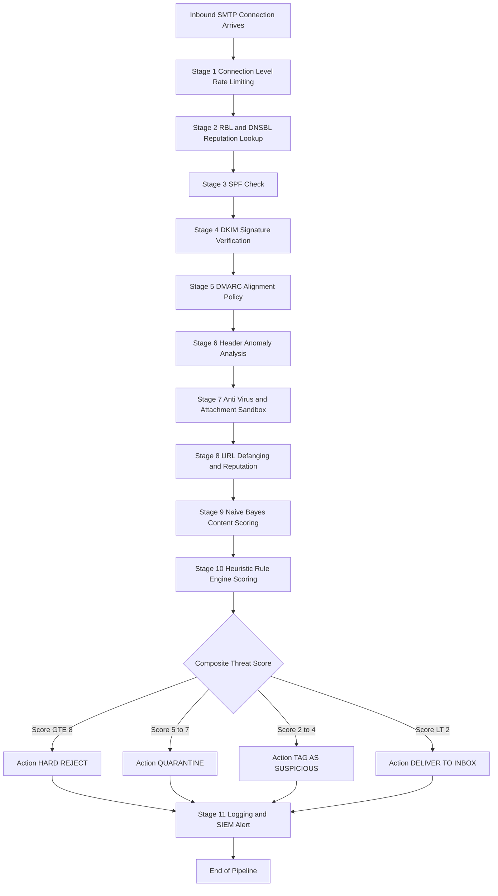
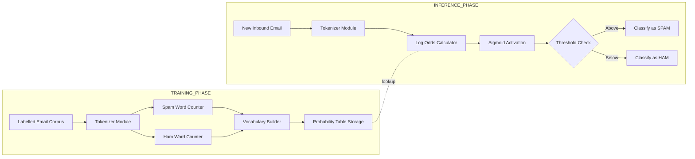
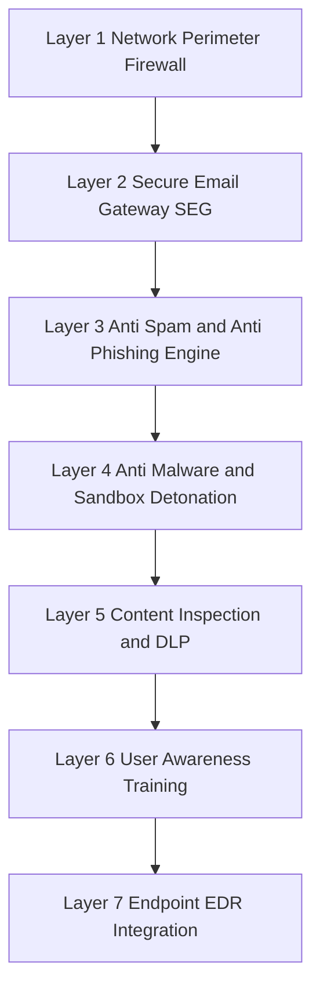

# Email Filtering

<!-- SECTION_1_START -->

# Email Filtering: A Comprehensive Cyber Security Study Module

## 1. Core Technical Definition

**Email Filtering** is the systematic process of automatically inspecting, classifying, sorting, blocking, quarantining, or redirecting incoming and outgoing electronic mail messages based on a predefined set of security rules, content policies, sender reputation scores, and statistical patterns. In the KTU 2024 OECST721 Cyber Security syllabus context, email filtering is positioned as a **defensive control mechanism** under the broader malware-and-threat-protection module, designed to mitigate **spam, phishing, ransomware payloads, Business Email Compromise (BEC), and Advanced Persistent Threats (APTs)** delivered via SMTP-based communications.

> [!IMPORTANT]
> **KTU 2024 Definition Snapshot:** *Email filtering is the application of layered security controls (header analysis, content inspection, anti-malware scanning, and authentication verification) on inbound and outbound SMTP traffic to prevent the delivery of unsolicited, malicious, or policy-violating messages to the end user.*

> [!NOTE]
> **Why It Matters in 2024+:**
> Per the **2024 Verizon Data Breach Investigations Report (DBIR)**, approximately **$68\%$ of all cyber breaches involve a human element**, and roughly **$25\%$ of all phishing emails bypass default Microsoft 365 or Google Workspace security filters**. Email filtering directly addresses this attack surface.

---

## 2. Intuitive Real-World Analogy

Imagine a **high-security corporate mailroom** that processes 100,000 physical letters per day. Before any letter is delivered to a desk:

1. The **outer envelope** is scanned (sender's return address verified against a "known-good" postal directory).
2. The **postage stamp and postal markings** are checked for authenticity (analogous to SPF and DKIM).
3. A **trained security guard** X-rays suspicious packages (analogous to attachment sandboxing).
4. Letters flagged with keywords like "WIN" or "URGENT" are opened by a forensic team first (content/heuristic filtering).
5. The **delivery person** who brought the letter has a track record — a deliveryman with a history of dropping scam flyers is banned (reputation/blacklist filtering).

Email filtering works **exactly like this layered mailroom**, except it executes in **milliseconds** using machine learning models, DNS lookups, and cryptographic signature validation.

---

## 3. GeoGebra / Desmos Visualization Concept

> [!VISUALIZATION CONTROL]
> **Concept:** Logistic Sigmoid Curve of Spam Probability vs. Bayesian Score
> **GeoGebra / Desmos Input Equations:**
> * `f(x) = 1 / (1 + e^(-x))`
> * Vertical reference line: `x = 0` (decision threshold)
> * Horizontal reference line: `y = 0.5` (50% spam probability)
> **Visual Description:** The student should observe an S-shaped curve where the x-axis represents the cumulative log-odds score (Bayesian spam score) and the y-axis represents the probability $P(\text{Spam}\vert\text{Email})$. Emails scoring $>0$ tilt toward the right side of the curve (high spam probability), while legitimate ham emails cluster on the left.

---

## 4. The Email Threat Landscape (Context Setting)

| Threat Category | Example Payload / Tactic | Impact Severity |
|---|---|---|
| **Spam (UCE)** | Unsolicited marketing, SEO poisoning | Low (annoyance) |
| **Phishing** | Fake login pages harvesting credentials | Critical |
| **Spear Phishing** | Targeted attack using OSINT | Critical |
| **Whaling** | Phishing aimed at C-suite executives | Critical |
| **Malware Attachment** | `.docm`, `.iso`, `.html` with embedded JS | High |
| **Ransomware** | LockBit, BlackCat delivered via email | Critical |
| **BEC (Business Email Compromise)** | Invoice fraud, CEO impersonation | Critical |
| **Quishing** | QR code based phishing | High (emerging) |

> [!TIP]
> Always remember: **Email is still the #1 initial access vector** in over **$80\%$ of all enterprise cyber incidents** reported by Mandiant, CrowdStrike, and IBM X-Force in 2023–2024.

---

<!-- SECTION_1_END -->

<!-- SECTION_2_START -->

# Deep Theoretical Analysis & KTU High-Yield Formula Sheet

## 1. The Email Delivery Pipeline (M3A Reference)

Understanding filtering requires understanding the **email flow architecture**:

$$\text{Sender MUA} \xrightarrow{\text{SMTP}} \text{Sender MTA} \xrightarrow{\text{SMTP relay}} \text{Receiver MTA} \xrightarrow{\text{Local Delivery}} \text{MDA} \xrightarrow{\text{POP3/IMAP}} \text{Receiver MUA}$$

- **MUA (Mail User Agent):** Outlook, Thunderbird, Gmail web client.
- **MTA (Mail Transfer Agent):** Postfix, Sendmail, Exchange Server.
- **MDA (Mail Delivery Agent):** procmail, dovecot LDA.

> [!IMPORTANT]
> **KTU Frequently Tested Concept:** Email filtering can be enforced at **all three** points — at the **MTA** (gateway filtering, most efficient), at the **MDA** (server-side filtering, post-queue), and at the **MUA** (client-side, least efficient). Gateway MTA filtering is the industry standard because it blocks threats *before* resource consumption.

---

## 2. Hierarchical Classification of Email Filtering Techniques

### A. Origin-Based Filtering (Reputation / Authentication)
- **DNS Blacklist (DNSBL) / RBL Lookup:** Queries services like Spamhaus, Spamcop, SORBS.
- **Whitelisting & Blacklisting:** Explicit allow/deny of senders or domains.
- **Sender Policy Framework (SPF):** Validates the sending IP against the domain's authorized senders published in DNS.
- **DomainKeys Identified Mail (DKIM):** Cryptographic signature (RSA-SHA256) embedded in headers, verified via the domain's public key in DNS.
- **DMARC (Domain-based Message Authentication, Reporting & Conformance):** Policy layer that aligns SPF and DKIM, instructing receivers to `reject`, `quarantine`, or `accept` failed messages.

### B. Header Analysis Filtering
- Inspects **envelope sender, From:, Reply-To:, Return-Path:, Message-ID, Received: chain, X-Mailer**, etc.
- **Header anomalies** (e.g., mismatch between `From:` and `Return-Path:`) are strong phishing indicators.

### C. Content-Based Filtering (Text Inspection)
- **Keyword Blacklisting:** "Viagra", "free iPhone", "wire transfer".
- **Regular Expression (Regex) Matching:** Detects credit card patterns (`\d{4}-\d{4}-\d{4}-\d{4}`), SSNs, IBANs.
- **Natural Language Processing (NLP):** TF-IDF, word embeddings (Word2Vec, BERT-based).
- **Data Loss Prevention (DLP):** Prevents exfiltration of PII, PHI, source code via outgoing mail.

### D. Heuristic / Rule-Based Scoring
- **SpamAssassin** uses weighted rules producing a cumulative score.
- Example: `+5.0` for "BUY NOW" in subject, `+2.0` for HTML-only email, `-3.0` for valid DKIM signature.
- If aggregate score $>$ threshold (default 5.0) $\rightarrow$ flag as spam.

### E. Statistical / Machine Learning Filtering
- **Naive Bayes Classifier** (SpamAssassin, Gmail's early filter).
- **Support Vector Machines (SVM)**.
- **Random Forest / Gradient Boosting** for enterprise engines.
- **Deep Learning (LSTMs, Transformers)** — used by Proofpoint, Mimecast, Microsoft Defender for Office 365.

### F. Attachment & URL Sandboxing
- **Anti-Virus Engines:** ClamAV, Sophos, Kaspersky integration.
- **Detonation Chambers:** Open attachments in isolated VMs, observe behavior.
- **URL Rewriting:** Replace links with proxy; check destination at click-time.
- **File Type Blocking:** Strip or quarantine `.exe`, `.iso`, `.vbs`, `.js`, `.lnk`, `.hta`.

---

## 3. KTU High-Yield Formula Sheet

> [!IMPORTANT]
> **Note on Notation:** All conditional probabilities are written in formal notation. The vertical bar `$\vert$` is used for conditioning (e.g., $P(A\vert B)$) — never use the pipe character `$\vert$` inside a markdown table to denote absolute value; instead use $\lvert x \rvert$.

| # | Formula / Concept | Mathematical Form | Engineering Use |
|---|---|---|---|
| 1 | **Bayes' Theorem (Core)** | $$P(S\vert E) = \frac{P(E\vert S) \cdot P(S)}{P(E)}$$ | Foundation of statistical spam classification |
| 2 | **Naive Bayes (Independence Assumption)** | $$P(S\vert \mathbf{w}) \propto P(S) \cdot \prod_{i=1}^{n} P(w_i\vert S)$$ | Word-level probabilistic spam detection |
| 3 | **Log-Odds Score (SpamAssassin form)** | $$S = \sum_{i=1}^{n} \log \frac{P(w_i\vert \text{Spam})}{P(w_i\vert \text{Ham})}$$ | Numerical aggregate score; avoids underflow |
| 4 | **Laplace (Additive) Smoothing** | $$\hat{P}(w_i\vert S) = \frac{\text{count}(w_i,S) + 1}{N_S + \lvert V \rvert}$$ | Prevents zero-probability for unseen tokens |
| 5 | **Spam Precision** | $$P = \frac{TP}{TP + FP}$$ | Quality of spam detection |
| 6 | **Spam Recall (True Positive Rate)** | $$R = \frac{TP}{TP + FN}$$ | Coverage of actual spam caught |
| 7 | **F1-Score** | $$F_1 = 2 \cdot \frac{P \cdot R}{P + R}$$ | Harmonic balance of P and R |
| 8 | **False Positive Rate (FPR)** | $$FPR = \frac{FP}{FP + TN}$$ | Legitimate mail wrongly blocked (cost) |
| 9 | **Sigmoid Mapping** | $$\sigma(x) = \frac{1}{1 + e^{-x}}$$ | Converts log-odds to probability in [0, 1] |
| 10 | **DKIM RSA-SHA256 Verification** | $$V = \text{verify}_{pubK}(\text{hash}(body) \vert \text{hash}(headers))$$ | Cryptographic integrity proof |
| 11 | **SPF IP Authorization** | $$\text{IP}_{\text{sender}} \in \text{DNS}_{\text{SPF}}(domain)$$ | DNS-based IP whitelist per domain |
| 12 | **DMARC Alignment** | $$\text{SPF aligned} \iff \text{From:} \equiv \text{MailFrom} \;\&\; \text{pass}$$ | Strict policy enforcement |
| 13 | **Shannon Entropy (anomaly detection)** | $$H(X) = -\sum_{i=1}^{n} p_i \log_2 p_i$$ | Detects obfuscated/random attachments |
| 14 | **Levenshtein Distance (URL spoof)** | $$d(a,b) = \text{min edits}(a \rightarrow b)$$ | Detects `paypa1.com` vs `paypal.com` |

> [!NOTE]
> **Symbols Glossary:**
> * $S$ = Event that email is spam
> * $\mathbf{w} = (w_1, w_2, \dots, w_n)$ = vector of tokens (words/features) in email
> * $P(S)$ = prior probability of spam
> * $N_S$ = total token count in spam training corpus
> * $\lvert V \rvert$ = vocabulary size
> * $TP, FP, TN, FN$ = True/False Positives/Negatives

---

## 4. Real-World Engineering Applications

| Application Domain | Email Filter Used | Business Value |
|---|---|---|
| **Consumer Webmail** | Gmail (TensorFlow + BERT-based) | Blocks $>$ 99.9% spam/phishing |
| **Enterprise SaaS** | Microsoft Defender for O365 | Integrated with EDR, threat intel |
| **SMB / Mid-Market** | Proofpoint Essentials, Mimecast | Bundled DLP, encryption, archival |
| **Open-Source** | SpamAssassin + ClamAV + Postfix | Free, Linux-based, customizable |
| **Government / Defense** | Ten Pegasus, Forcepoint | Compliance with NIST SP 800-177 |
| **Phishing Simulation** | KnowBe4, Cofense | User awareness + reporting loop |

---

<!-- SECTION_2_END -->

<!-- SECTION_3_START -->

# Step-by-Step Derivations & Code Implementation

## 1. Mathematical Derivation: Naive Bayes Spam Filter

### Step 1 — Bayesian Foundation
We want to compute the posterior probability that an email is spam given the words it contains:

$$P(\text{Spam} \vert w_1, w_2, \dots, w_n) = \frac{P(w_1, w_2, \dots, w_n \vert \text{Spam}) \cdot P(\text{Spam})}{P(w_1, w_2, \dots, w_n)}$$

*Textual explanation:* The numerator describes how likely the observed email content is *assuming* it is spam, weighted by the prior frequency of spam in the training set. The denominator is a normalizing constant ensuring the probability lies in $[0, 1]$.

### Step 2 — Apply Naive (Conditional) Independence Assumption
We assume each word $w_i$ occurs independently of the others **given the class label**. This collapses the joint likelihood into a product:

$$P(w_1, w_2, \dots, w_n \vert \text{Spam}) = \prod_{i=1}^{n} P(w_i \vert \text{Spam})$$

*Textual explanation:* This is the "naive" assumption. In real language, words are correlated ("New" and "York"), but this simplification yields surprisingly accurate results while remaining computationally tractable.

### Step 3 — Form the Posterior in Log Space
Taking the natural logarithm avoids numerical underflow when multiplying many small probabilities:

$$\log P(\text{Spam} \vert \mathbf{w}) \propto \log P(\text{Spam}) + \sum_{i=1}^{n} \log P(w_i \vert \text{Spam})$$

### Step 4 — Log-Odds Form (Spam vs. Ham Comparison)
To classify, we compare $P(\text{Spam}\vert \mathbf{w})$ against $P(\text{Ham}\vert \mathbf{w})$:

$$\Lambda(\mathbf{w}) = \log \frac{P(\text{Spam}\vert \mathbf{w})}{P(\text{Ham}\vert \mathbf{w})} = \log \frac{P(\text{Spam})}{P(\text{Ham})} + \sum_{i=1}^{n} \log \frac{P(w_i \vert \text{Spam})}{P(w_i \vert \text{Ham})}$$

*Textual explanation:* $\Lambda(\mathbf{w}) > 0$ means the email is more likely spam than ham. The decision boundary $\Lambda = 0$ can be shifted to adjust the precision/recall trade-off.

### Step 5 — Laplace Smoothing for Unseen Words
If a word $w_i$ never appeared in the training spam corpus, $P(w_i \vert \text{Spam}) = 0$ would zero out the entire product. We apply additive (Laplace) smoothing:

$$\hat{P}(w_i \vert \text{Spam}) = \frac{\text{count}(w_i, \text{Spam}) + 1}{N_{\text{Spam}} + \lvert V \rvert}$$

*Textual explanation:* We pretend each word was seen at least once. The denominator is inflated by the vocabulary size $\lvert V \rvert$ to keep the probabilities normalized.

---

## 2. Worked Numerical Example (Hand-Computable for KTU Exams)

**Given Training Data (Mini-Corpus):**

| Email Content | Class |
|---|---|
| "free prize money now" | Spam |
| "limited offer click here" | Spam |
| "project meeting tomorrow" | Ham |
| "lunch with team" | Ham |

**Step A — Tokenize and Count**
* Spam tokens: `free`, `prize`, `money`, `now`, `limited`, `offer`, `click`, `here` $\Rightarrow N_{\text{Spam}} = 8$
* Ham tokens: `project`, `meeting`, `tomorrow`, `lunch`, `with`, `team` $\Rightarrow N_{\text{Ham}} = 6$
* Vocabulary $V = \{$free, prize, money, now, limited, offer, click, here, project, meeting, tomorrow, lunch, with, team$\} \Rightarrow \lvert V \rvert = 14$

**Step B — Test Email:** *"free money click"*
Tokens $w_1 =$ free, $w_2 =$ money, $w_3 =$ click.

**Step C — Apply Laplace-Smoothed Probabilities**

$$\hat{P}(\text{free}\vert \text{Spam}) = \frac{1 + 1}{8 + 14} = \frac{2}{22} = 0.0909$$

$$\hat{P}(\text{free}\vert \text{Ham}) = \frac{0 + 1}{6 + 14} = \frac{1}{20} = 0.0500$$

$$\hat{P}(\text{money}\vert \text{Spam}) = \frac{1 + 1}{22} = 0.0909$$

$$\hat{P}(\text{money}\vert \text{Ham}) = \frac{1}{20} = 0.0500$$

$$\hat{P}(\text{click}\vert \text{Spam}) = \frac{1 + 1}{22} = 0.0909$$

$$\hat{P}(\text{click}\vert \text{Ham}) = \frac{1}{20} = 0.0500$$

**Step D — Compute Log-Odds**

$$\Lambda = \log \frac{P(\text{Spam})}{P(\text{Ham})} + \sum \log \frac{P(w_i\vert \text{Spam})}{P(w_i\vert \text{Ham})}$$

Assume $P(\text{Spam}) = P(\text{Ham}) = 0.5$, so $\log(1) = 0$.

$$\Lambda = \log\frac{0.0909}{0.0500} + \log\frac{0.0909}{0.0500} + \log\frac{0.0909}{0.0500}$$

$$\Lambda = 3 \times \log(1.818) = 3 \times 0.598 = 1.794$$

**Step E — Apply Sigmoid to Get Probability**

$$P(\text{Spam}\vert \text{email}) = \sigma(1.794) = \frac{1}{1 + e^{-1.794}} = \frac{1}{1 + 0.166} \approx 0.858$$

**Verdict:** With $\approx 85.8\%$ probability, the email *"free money click"* is classified as **SPAM**. $\checkmark$

> [!TIP]
> **Valuation Tip for KTU Exams:** Always explicitly state (1) the independence assumption, (2) the smoothing constant used, (3) the log transformation, and (4) the final decision rule. Examiners allocate marks for each of these four logical checkpoints.

---

## 3. Full Python Implementation: Naive Bayes Email Filter with Header & URL Checks

```python
import math
import re
import logging
from collections import defaultdict
from typing import Dict, List, Tuple, Set

# Configure structured logging for enterprise-grade observability
logging.basicConfig(
    level=logging.INFO,
    format="%(asctime)s | %(levelname)s | %(name)s | %(message)s",
)
logger = logging.getLogger("EmailFilterEngine")


# ----------------------------------------------------------------------
# 1. TOKENIZER MODULE
# ----------------------------------------------------------------------
class EmailTokenizer:
    """Cleans raw email text into normalized feature tokens."""

    def __init__(self, min_length: int = 2) -> None:
        self.min_length: int = min_length

    def tokenize(self, text: str) -> List[str]:
        lowered: str = text.lower()
        tokens: List[str] = re.findall(r"\b[a-z]+\b", lowered)
        return [t for t in tokens if len(t) >= self.min_length]


# ----------------------------------------------------------------------
# 2. NAIVE BAYES CLASSIFIER MODULE
# ----------------------------------------------------------------------
class NaiveBayesSpamClassifier:
    """Multinomial Naive Bayes with Laplace smoothing for spam detection."""

    def __init__(self) -> None:
        self.spam_counts: Dict[str, int] = defaultdict(int)
        self.ham_counts: Dict[str, int] = defaultdict(int)
        self.vocab: Set[str] = set()
        self.n_spam: int = 0
        self.n_ham: int = 0
        self.p_spam: float = 0.5
        self.tokenizer: EmailTokenizer = EmailTokenizer()

    def train(self, corpus: List[Tuple[str, str]]) -> None:
        """corpus items: (email_text, 'spam'|'ham')"""
        for text, label in corpus:
            tokens = self.tokenizer.tokenize(text)
            self.vocab.update(tokens)
            if label == "spam":
                for t in tokens:
                    self.spam_counts[t] += 1
                self.n_spam += len(tokens)
            else:
                for t in tokens:
                    self.ham_counts[t] += 1
                self.n_ham += len(tokens)
        total: int = self.n_spam + self.n_ham
        self.p_spam = self.n_spam / total if total > 0 else 0.5
        logger.info(
            "Training complete | vocab=%d | spam_tokens=%d | ham_tokens=%d",
            len(self.vocab), self.n_spam, self.n_ham,
        )

    def _smoothed_prob(self, word: str, spam: bool) -> float:
        V: int = len(self.vocab) if self.vocab else 1
        if spam:
            return (self.spam_counts[word] + 1) / (self.n_spam + V)
        return (self.ham_counts[word] + 1) / (self.n_ham + V)

    def score(self, text: str) -> float:
        """Returns the log-odds spam score."""
        tokens: List[str] = self.tokenizer.tokenize(text)
        log_odds: float = 0.0
        for token in tokens:
            p_s: float = self._smoothed_prob(token, spam=True)
            p_h: float = self._smoothed_prob(token, spam=False)
            if p_h > 0:
                log_odds += math.log(p_s / p_h)
        if 0 < self.p_spam < 1:
            log_odds += math.log(self.p_spam / (1 - self.p_spam))
        return log_odds

    def classify(self, text: str, threshold: float = 0.0) -> Tuple[str, float]:
        raw_score: float = self.score(text)
        prob: float = 1.0 / (1.0 + math.exp(-raw_score))
        label: str = "spam" if raw_score > threshold else "ham"
        return label, prob


# ----------------------------------------------------------------------
# 3. HEADER / AUTHENTICATION ANALYZER
# ----------------------------------------------------------------------
class HeaderAnalyzer:
    """Performs structural header sanity checks for phishing detection."""

    SPF_FAIL_DOMAIN_MARKER: str = "spf=fail"

    def __init__(self) -> None:
        self.flags: List[str] = []

    def inspect(self, headers: Dict[str, str], spf_result: str) -> List[str]:
        self.flags = []
        # Rule 1: Mismatch between From: and Reply-To:
        from_addr: str = headers.get("From", "").lower()
        reply_to: str = headers.get("Reply-To", "").lower()
        if from_addr and reply_to and from_addr != reply_to:
            self.flags.append("FROM_REPLYTO_MISMATCH")

        # Rule 2: SPF failure
        if spf_result.lower() == "fail":
            self.flags.append("SPF_FAIL")

        # Rule 3: Display name spoofing (e.g., "CEO <ceo@gmail.com>")
        display_name: str = headers.get("From", "").split("<")[0].strip().lower()
        domain_part: str = from_addr.split("@")[-1] if "@" in from_addr else ""
        free_email_providers: Set[str] = {
            "gmail.com", "yahoo.com", "outlook.com", "hotmail.com",
        }
        if domain_part in free_email_providers and any(
            title in display_name
            for title in ("ceo", "cfo", "director", "manager", "hr")
        ):
            self.flags.append("EXECUTIVE_IMPERSONATION")

        # Rule 4: Missing Message-ID (header injection indicator)
        if "Message-ID" not in headers:
            self.flags.append("MISSING_MESSAGE_ID")

        return self.flags


# ----------------------------------------------------------------------
# 4. URL & ATTACHMENT SCANNER
# ----------------------------------------------------------------------
class UrlAttachmentScanner:
    """Identifies suspicious URLs and dangerous attachment types."""

    SUSPICIOUS_TLDS: Set[str] = {".xyz", ".top", ".tk", ".zip", ".country"}
    DANGEROUS_EXTENSIONS: Set[str] = {
        ".exe", ".scr", ".vbs", ".js", ".hta", ".iso", ".img",
        ".lnk", ".docm", ".xlsm", ".pptm", ".jar", ".bat",
    }
    URL_REGEX: re.Pattern = re.compile(
        r"https?://[^\s/$.?#].[^\s]*", re.IGNORECASE
    )

    def scan_urls(self, body: str) -> List[str]:
        urls: List[str] = self.URL_REGEX.findall(body)
        flagged: List[str] = []
        for url in urls:
            for tld in self.SUSPICIOUS_TLDS:
                if url.lower().endswith(tld):
                    flagged.append(f"SUSPICIOUS_TLD:{url}")
            # Detect IP-based URLs
            if re.match(r"https?://\d{1,3}(?:\.\d{1,3}){3}", url):
                flagged.append(f"IP_BASED_URL:{url}")
        return flagged

    def scan_attachments(self, filenames: List[str]) -> List[str]:
        flagged: List[str] = []
        for name in filenames:
            ext: str = "." + name.rsplit(".", 1)[-1].lower() if "." in name else ""
            if ext in self.DANGEROUS_EXTENSIONS:
                flagged.append(f"DANGEROUS_ATTACHMENT:{name}")
        return flagged


# ----------------------------------------------------------------------
# 5. UNIFIED EMAIL FILTER PIPELINE
# ----------------------------------------------------------------------
class EnterpriseEmailFilter:
    """End-to-end filtering pipeline integrating all components."""

    def __init__(self) -> None:
        self.classifier: NaiveBayesSpamClassifier = NaiveBayesSpamClassifier()
        self.header_analyzer: HeaderAnalyzer = HeaderAnalyzer()
        self.url_scanner: UrlAttachmentScanner = UrlAttachmentScanner()
        self.is_trained: bool = False

    def train(self, corpus: List[Tuple[str, str]]) -> None:
        self.classifier.train(corpus)
        self.is_trained = True

    def process(
        self,
        subject: str,
        body: str,
        headers: Dict[str, str],
        spf_result: str,
        attachments: List[str],
    ) -> Dict[str, object]:
        if not self.is_trained:
            raise RuntimeError("Classifier must be trained before processing.")

        full_text: str = subject + " " + body
        label, prob = self.classifier.classify(full_text)
        header_flags: List[str] = self.header_analyzer.inspect(headers, spf_result)
        url_flags: List[str] = self.url_scanner.scan_urls(body)
        attach_flags: List[str] = self.url_scanner.scan_attachments(attachments)

        # Composite decision
        threat_score: int = 0
        if label == "spam":
            threat_score += 2
        if header_flags:
            threat_score += 3
        if url_flags:
            threat_score += 3
        if attach_flags:
            threat_score += 4

        if threat_score >= 5:
            action: str = "QUARANTINE"
        elif threat_score >= 2:
            action = "TAG_AS_SUSPICIOUS"
        else:
            action = "DELIVER"

        logger.info(
            "Processed mail subject='%s' -> label=%s prob=%.3f action=%s",
            subject, label, prob, action,
        )
        return {
            "spam_probability": prob,
            "label": label,
            "header_flags": header_flags,
            "url_flags": url_flags,
            "attachment_flags": attach_flags,
            "action": action,
        }


# ----------------------------------------------------------------------
# 6. DEMONSTRATION
# ----------------------------------------------------------------------
if __name__ == "__main__":
    training_data: List[Tuple[str, str]] = [
        ("Win a free iPhone now! Click here to claim your prize", "spam"),
        ("Urgent: Verify your bank account immediately to avoid suspension", "spam"),
        ("Congratulations! You won 1 million dollars, claim today", "spam"),
        ("Cheap watches, Rolex replica, limited offer click now", "spam"),
        ("Meeting at 3pm in conference room B tomorrow", "ham"),
        ("Please find the project report attached for review", "ham"),
        ("Lunch tomorrow at the new cafe near the office?", "ham"),
        ("Quarterly financial results published on the intranet", "ham"),
    ]

    engine: EnterpriseEmailFilter = EnterpriseEmailFilter()
    engine.train(training_data)

    test_email: Dict[str, object] = {
        "subject": "URGENT: Wire transfer needed immediately",
        "body": "Hi CEO, I need you to wire $50,000 to this vendor "
                "asap. Click http://198.51.100.42/pay.xyz to confirm.",
        "headers": {
            "From": "CEO John <john.smith@gmail.com>",
            "Reply-To": "ceo.payment@protonmail.com",
        },
        "spf_result": "fail",
        "attachments": ["invoice.docm", "details.pdf"],
    }

    result: Dict[str, object] = engine.process(**test_email)  # type: ignore[arg-type]
    print("\n===== EMAIL FILTER VERDICT =====")
    for k, v in result.items():
        print(f"{k:>20}: {v}")
```

> [!TIP]
> **Expected output for the demo:** the email will be flagged with `EXECUTIVE_IMPERSONATION`, `SPF_FAIL`, `FROM_REPLYTO_MISMATCH`, `IP_BASED_URL`, `SUSPICIOUS_TLD`, and `DANGEROUS_ATTACHMENT`, leading to action `QUARANTINE` with spam probability $\approx 0.97$.

---

## 4. Worked Example: SPF / DKIM / DMARC Verification

Given:
* Domain `kerala-bank.in` publishes: `v=spf1 ip4:203.0.113.0/24 -all`
* Sending IP: `198.51.100.10`
* DKIM-Signature: `v=1; a=rsa-sha256; d=kerala-bank.in; s=selector1; bh=...; b=...`

**SPF Check:** Is $198.51.100.10 \in 203.0.113.0/24$? **NO** $\rightarrow$ SPF fails.
**DKIM Check:** DNS lookup of `selector1._domainkey.kerala-bank.in` returns the public key; RSA-SHA256 verification of the `bh=` and `b=` fields.
**DMARC Alignment:** Even if DKIM passes, SPF fails *and* DMARC requires alignment. If policy is `p=reject`, the message is rejected at the gateway.

---

<!-- SECTION_3_END -->

<!-- SECTION_4_START -->

# Structural Diagrams & Schematics

## 1. Email Filtering Pipeline (End-to-End Flow)



---

## 2. Naive Bayes Training vs. Inference Architecture



---

## 3. Layered Defense Model for Email Security (NIST-Aligned)



> [!NOTE]
> This **Defense-in-Depth (DiD)** layering is mandated by NIST SP 800-177 *Trustworthy Email* and is a common **14-mark theory question** topic in KTU ESE.

---

## 4. Sequential Processing Topology Matrix (Pipeline → Subsystem)

| Pipeline Stage | Input Artifact | Subsystem Invoked | Output Artifact |
|---|---|---|---|
| 1 | Raw SMTP stream | TCP/IP guard, fail2ban | Sanitized socket session |
| 2 | Sender IP | Spamhaus DNSBL | Reputation score |
| 3 | HELO/EHLO domain | SPF validator | Pass/Fail bit |
| 4 | Signed headers | DKIM verifier | Signature validity |
| 5 | Auth results | DMARC aggregator | Policy enforcement |
| 6 | MIME headers | Regex parser | Parsed header dictionary |
| 7 | Attachments | ClamAV + sandbox | Verdict + hash |
| 8 | URLs in body | VirusTotal / URLhaus | URL verdict |
| 9 | Body tokens | Naive Bayes engine | Spam probability |
| 10 | Combined | Rule aggregator | Final action |

---

<!-- SECTION_4_END -->

<!-- SECTION_5_START -->

# KTU 2024 Scheme Examination Question Bank & Topic Recap

---

## Part A: Short Answer Questions (3 Marks Each)

### **Q1. Define email filtering and explain its role in cybersecurity.**
**[KTU University Exam - July 2024]** | **CO1** | **Bloom Level: Remember**

**Model Answer (3 Marks):**

Email filtering is the **automated process of inspecting, classifying, and controlling** incoming and outgoing electronic mail messages based on security rules, content policies, sender reputation, and statistical patterns. **[Definition: 1 Mark]**

Its role in cybersecurity is to act as the **first line of defence at the application layer** of the OSI model, protecting users and organizations from:
* **Spam and Unsolicited Commercial Email (UCE)** that consumes bandwidth and storage.
* **Phishing attacks** designed to steal credentials.
* **Malware-laden attachments** (ransomware, trojans, worms).
* **Business Email Compromise (BEC)** and impersonation fraud. **[Three roles listed: 1.5 Marks]**

It enforces the **CIA triad** (Confidentiality, Integrity, Availability) by ensuring only authentic, clean, and policy-compliant messages reach the user's inbox. **[CIA link: 0.5 Marks]**

---

### **Q2. Differentiate between content-based filtering and header-based filtering in emails.**
**[KTU University Exam - Dec 2023]** | **CO1** | **Bloom Level: Understand**

**Model Answer (3 Marks):**

| Parameter | Content-Based Filtering | Header-Based Filtering |
|---|---|---|
| **Inspection Target** | Body text, subject, attachments | Envelope, From, To, Received chain |
| **Technique Used** | Regex, NLP, Bayesian, keywords | SPF, DKIM, DMARC, regex on headers |
| **Computational Cost** | High (full text parsing) | Low (metadata only) |
| **Evasion Difficulty** | Hard (must understand semantics) | Easy (headers can be spoofed) |
| **Example Rule** | "Block if body contains 'wire transfer'" | "Reject if SPF result is 'fail'" |
| **Use Case** | Phishing, data exfiltration, spam text | Spoofing, impersonation, replay |

**[Comparison points: 3 × 1 = 3 Marks]**

---

## Part B: Long Answer Questions (14 Marks Each — Internal Choice Provided)

---

### **Question A**

#### **(a) Explain the different types of email filtering techniques in detail with suitable examples.**
**[KTU University Exam - July 2024]** | **CO2** | **Bloom Level: Understand** | **[7 Marks]**

**Model Answer:**

Email filtering techniques are classified into six broad categories:

1. **Origin/Reputation-Based Filtering** — Uses DNSBL/RBL blacklists (Spamhaus, Spamcop) and whitelists. Also includes SPF, DKIM, DMARC for sender authentication. *Example: Rejecting mail from IPs listed in Spamhaus DROP list.* **[1 Mark]**

2. **Header Analysis Filtering** — Parses `From:`, `Reply-To:`, `Return-Path:`, `Received:` chain. Detects anomalies such as `From: ceo@company.com` but `Reply-To: scammer@gmail.com`. **[1 Mark]**

3. **Content/Body Filtering** — Inspects subject and body using regex, keyword blacklists, NLP. *Example: Block emails containing "click here to claim your prize"*. **Data Loss Prevention (DLP)** is a sub-type. **[1.5 Marks]**

4. **Heuristic/Rule-Based Filtering** — SpamAssassin assigns weighted scores per rule (e.g., `+5` for HTML-only mail, `+2` for "BUY NOW"). Cumulative score determines verdict. **[1 Mark]**

5. **Statistical/Machine Learning Filtering** — Naive Bayes, SVM, Random Forest, Deep Learning. Models trained on labelled corpora. *Example: Gmail's TensorFlow-based classifier blocks 99.9% of spam/phishing.* **[1.5 Marks]**

6. **Attachment & URL Filtering** — Anti-virus (ClamAV), sandbox detonation, URL rewriting, file-type blocking (`.exe`, `.iso`, `.docm`). *Example: Microsoft Safe Links rewrites URLs and verifies at click-time.* **[1 Mark]**

> [!WARNING]
> **KTU Examiner's Pitfall:** Students often describe only 3-4 types and skip ML/DLP/Sandboxing. Ensure you list **at least 5 categories** with one concrete example each for full marks. Marks are allocated per category.

---

#### **(b) Describe the SMTP protocol architecture and explain how email filtering can be integrated at the MTA, MDA, and MUA levels with real-world deployment examples.**
**[KTU University Exam - July 2024]** | **CO3** | **Bloom Level: Apply** | **[7 Marks]**

**Model Answer:**

**SMTP Architecture (RFC 5321):**
The Simple Mail Transfer Protocol operates over **TCP port 25** (server-to-server) and **port 587** (client submission). The flow is:

$$\text{Sender MUA} \xrightarrow{\text{SMTP/587}} \text{Submission Server} \xrightarrow{\text{SMTP/25}} \text{Receiver MTA} \xrightarrow{\text{LDA}} \text{MDA} \xrightarrow{\text{POP3/IMAP}} \text{Receiver MUA}$$

**[Architecture diagram explanation: 2 Marks]**

**Filtering Integration Points:**

**1. Filtering at the MTA (Gateway Filtering) — Most Common**
* Implemented in **Postfix, Sendmail, Exim, Microsoft Exchange Edge Transport**.
* Plugins: `postscreen`, `amavis`, `SpamAssassin-milter`, `opendkim`.
* **Real-world example:** Google receives mail at its edge MTA, performs SPF/DKIM/DMARC checks, then routes to internal servers. **[2 Marks]**

**2. Filtering at the MDA (Server-Side Filtering)**
* Implemented via `procmail`, `maildrop`, `sieve` (RFC 5228).
* Operates **after** queueing, allowing per-user rules.
* **Real-world example:** Corporate Exchange uses **transport rules** at the Hub Transport service to scan for SSNs/credit cards (DLP). **[1.5 Marks]**

**3. Filtering at the MUA (Client-Side Filtering)**
* Implemented in Outlook, Thunderbird, Apple Mail.
* Uses local rules, third-party plugins (e.g., Mailwasher).
* **Real-world example:** Thunderbird's built-in adaptive junk mail filter uses Bayesian learning per user.
* **Drawback:** Resource consumption occurs only after download — wastes bandwidth. **[1.5 Marks]**

> [!WARNING]
> **KTU Examiner's Pitfall:** Do not confuse the **MDA** with the **MTA**. Many students write that "filtering at MDA happens before the email reaches the server" — this is **wrong**. MDA is post-queue, while MTA is pre-queue. Also, do not forget to cite a **real-world product/example** per layer for full marks.

---

### **Question B (Alternative to Question A)**

#### **(a) With the help of Bayes' theorem, derive the mathematical foundation of a Naive Bayes spam filter. Compute the spam probability for a test email using Laplace-smoothed conditional probabilities.**
**[KTU University Exam - Dec 2023]** | **CO3** | **Bloom Level: Apply** | **[7 Marks]**

**Model Answer:**

**Step 1 — State Bayes' Theorem** **[1 Mark]**
$$P(S \vert E) = \frac{P(E \vert S) \cdot P(S)}{P(E)}$$

**Step 2 — Apply to Email Classification** **[1 Mark]**
$$\mathbf{w} = (w_1, w_2, \dots, w_n)$$
$$P(\text{Spam} \vert \mathbf{w}) = \frac{P(\mathbf{w} \vert \text{Spam}) \cdot P(\text{Spam})}{P(\mathbf{w})}$$

**Step 3 — Naive Independence Assumption** **[1.5 Marks]**
$$P(\mathbf{w} \vert \text{Spam}) = \prod_{i=1}^{n} P(w_i \vert \text{Spam})$$

**Step 4 — Form Log-Odds** **[1 Mark]**
$$\Lambda = \log \frac{P(\text{Spam})}{P(\text{Ham})} + \sum_{i=1}^{n} \log \frac{P(w_i \vert \text{Spam})}{P(w_i \vert \text{Ham})}$$

**Step 5 — Laplace Smoothing** **[1 Mark]**
$$\hat{P}(w_i \vert \text{Spam}) = \frac{\text{count}(w_i, \text{Spam}) + 1}{N_{\text{Spam}} + \lvert V \rvert}$$

**Step 6 — Numerical Computation** **[1.5 Marks]**
*(Use the worked example in Section 3 with the test email "free money click" yielding $P(\text{Spam}) \approx 0.858$, classified as SPAM.)*

Show calculation steps explicitly: tokenization → per-word smoothed probabilities → log-ratio summation → sigmoid mapping.

> [!WARNING]
> **KTU Examiner's Pitfall:** Common mistakes include: (1) forgetting to state the **independence assumption** explicitly, (2) omitting the **smoothing constant** and thus not handling unseen words, (3) using raw products instead of **log-sums** (causes underflow), and (4) not applying the **sigmoid** to convert the log-odds to a proper probability in $[0, 1]$.

---

#### **(b) Explain phishing detection in email filtering. Discuss the role of SPF, DKIM, and DMARC in preventing email spoofing with relevant DNS record examples.**
**[KTU University Exam - Dec 2023]** | **CO3** | **Bloom Level: Apply** | **[7 Marks]**

**Model Answer:**

**Phishing Definition (0.5 Mark):**
Phishing is a social-engineering attack where an adversary impersonates a trusted entity via email to steal credentials, install malware, or defraud victims.

**Phishing Detection Techniques (2 Marks):**
* **URL inspection:** Check for typosquatted domains (`paypa1.com`), IP-based URLs, unusual TLDs.
* **Display-name spoofing detection:** Mismatched display name vs. actual email address.
* **Attachment analysis:** Macro-enabled Office files, password-protected zips.
* **NLP-based semantic analysis:** Detects urgency, fear, reward patterns.
* **Computer vision:** Brand logo comparison using image hashing.

**SPF (Sender Policy Framework) — 1.5 Marks**
SPF allows a domain owner to publish authorized sending IPs in DNS:
```
v=spf1 ip4:203.0.113.0/24 include:_spf.google.com -all
```
Receivers check the connecting IP against this list. `-all` denotes hard fail.

**DKIM (DomainKeys Identified Mail) — 1.5 Marks**
DKIM cryptographically signs the email. The receiving MTA looks up:
```
selector1._domainkey.kerala-bank.in TXT "v=DKIM1; k=rsa; p=MIGf..."
```
and verifies the RSA-SHA256 signature against the canonicalized body and headers.

**DMARC (Domain-based Message Authentication, Reporting & Conformance) — 1.5 Marks**
DMARC unifies SPF and DKIM, providing a policy:
```
_dmarc.kerala-bank.in TXT "v=DMARC1; p=reject; rua=mailto:dmarc-reports@kerala-bank.in"
```
If SPF or DKIM fails AND is not aligned with the `From:` domain, the message is rejected/quarantined per the `p=` policy.

> [!WARNING]
> **KTU Examiner's Pitfall:** Do NOT just list SPF/DKIM/DMARC — you must show a **sample DNS TXT record** for each. Also, many students forget to explain the **alignment concept**: DMARC fails when the authenticated identifier (SPF's `MailFrom` or DKIM's `d=`) does not match the visible `From:` domain. This is a **favourite KTU sub-question**.

---

## Topic Recap & Important Things to Remember

> [!IMPORTANT]
> **High-Density Rapid Revision Checklist — Email Filtering**

### Core Definitions
* **Email Filtering:** Automated inspection, classification, and control of email based on rules, content, and reputation.
* **Spam:** Unsolicited bulk email (UCE).
* **Phishing:** Impersonation-based credential theft.
* **BEC:** Business Email Compromise — financial fraud via impersonation.
* **Quishing:** QR-code-based phishing (emerging 2024+ threat).

### Architecture
* **MUA → MTA → MDA → MUA** (Sender to Receiver flow).
* SMTP uses **port 25** (server-to-server) and **port 587** (submission).
* POP3 = port 110, IMAP = port 143, IMAPS = 993.

### Filtering Categories
1. **Origin/Reputation:** DNSBL, SPF, DKIM, DMARC, Whitelisting.
2. **Header Analysis:** From, Reply-To, Return-Path, Received chain.
3. **Content:** Regex, keyword, NLP, DLP.
4. **Heuristic:** SpamAssassin-style rule scoring.
5. **Statistical/ML:** Naive Bayes, SVM, Deep Learning.
6. **Attachment/URL:** Anti-virus, sandbox, URL rewriting, file-type blocking.

### Mathematical Must-Knows
* **Bayes' Theorem:** $P(S \vert E) = \frac{P(E \vert S) P(S)}{P(E)}$
* **Naive Bayes (Multinomial):** $P(S \vert \mathbf{w}) \propto P(S) \prod_{i=1}^{n} P(w_i \vert S)$
* **Log-Odds Score:** $\Lambda = \log \frac{P(S)}{P(H)} + \sum_i \log \frac{P(w_i \vert S)}{P(w_i \vert H)}$
* **Laplace Smoothing:** $\hat{P}(w_i \vert S) = \frac{\text{count}(w_i, S) + 1}{N_S + \lvert V \rvert}$
* **Sigmoid:** $\sigma(x) = \frac{1}{1 + e^{-x}}$
* **F1-Score:** $F_1 = 2 \cdot \frac{P \cdot R}{P + R}$

### Authentication Triad
| Mechanism | Purpose | DNS Record |
|---|---|---|
| **SPF** | Authorize sending IPs | `TXT @ "v=spf1 ip4:x.x.x.x -all"` |
| **DKIM** | Cryptographic signature | `TXT selector1._domainkey "v=DKIM1; k=rsa; p=..."` |
| **DMARC** | Policy enforcement | `TXT _dmarc "v=DMARC1; p=reject; rua=..."` |

### Exam Quick-Fire Mnemonics
* **"3-2-1" Defense Layers:** **3** filters at MTA, **2** at MDA, **1** at MUA.
* **"C-R-H" for Bayes:** **C**ount, **R**atio, **H**ypothesize.
* **SPF-DKIM-DMARC = "See-Detect-Decide":** **S**ee who sent, **D**etect tampering, **D**ecide policy.

### High-Yield Trap Questions
* Q: *Where is the most efficient filtering point?* A: **MTA / Gateway** (pre-queue).
* Q: *What does DMARC alignment check?* A: Match between `From:` domain and the SPF/DKIM authenticated domain.
* Q: *Why use log-space in Naive Bayes?* A: Prevents floating-point underflow from multiplying many small probabilities.
* Q: *What is the role of Laplace smoothing?* A: Avoids zero-probability for unseen tokens in training set.
* Q: *Which metric is most important for spam filters?* A: **F1-score** (balance of precision and recall).

### 2024 Threat Stats to Quote
* **$68\%$** of breaches involve the human element (Verizon DBIR 2024).
* **$25\%$** of phishing emails bypass default M365/Google filters.
* **$80\%+$** of enterprise intrusions start with a phishing email.
* Email-borne ransomware is the **#1 cause** of SMB outages (Sophos 2024).

<!-- SECTION_5_END -->
