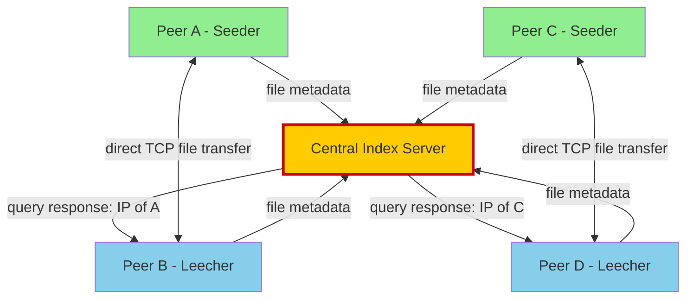
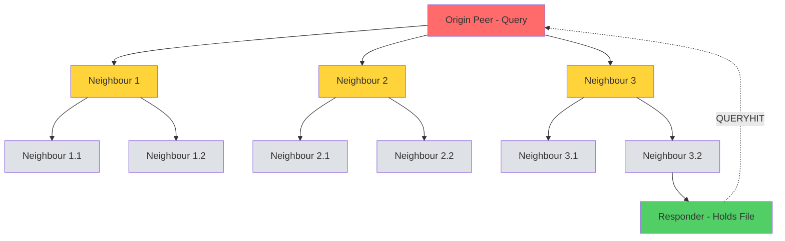
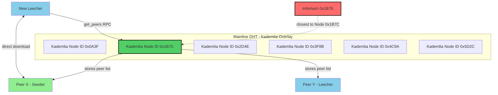
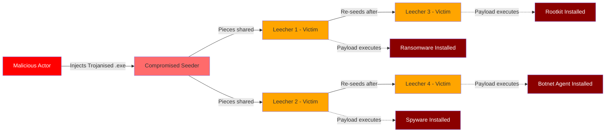
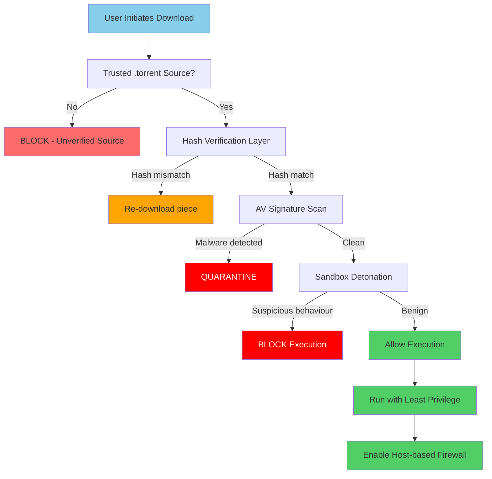

# File Sharing Networks

<!-- SECTION_1_START -->

# File Sharing Networks — Core Technical Definition & Intuitive Overview

## 1. Formal Academic Definition

A **File Sharing Network** is a distributed, peer-to-peer (P2P) or hybrid distributed computing architecture in which digital files (documents, multimedia, software binaries, patches) are exchanged directly between end-user nodes (peers) over a network — typically the public Internet — without relying on a single, central repository. Each peer acts simultaneously as a **client** (downloader) and a **server** (uploader), contributing bandwidth, storage, and computational resources back into the collective ecosystem.

Under the **KTU 2024 Scheme (OECST721 — Cyber Security, Module 3)**, this topic is examined under the umbrella of *malware propagation vectors and protection against them*, because file sharing networks historically serve as one of the highest-risk distribution channels for **Trojanised software, ransomware droppers, worms, spyware, and rootkits**.

The two fundamental architectural families are:

1. **Centralised / Hybrid P2P Networks** — e.g., Napster, modern BitTorrent trackers, Spotify.
2. **Purely Decentralised P2P Networks** — e.g., Gnutella, KaZaA (FastTrack), Freenet, IPFS, Ethereum Swarm.

> [!IMPORTANT]
> **KTU 2024 Syllabus Highlight (OECST721 — Module 3):**
> *"Understand file sharing networks, the malware threats they propagate, and the protective strategies (hash verification, sandboxing, anti-virus, network firewalls, signed torrents) used to mitigate them."*

## 2. Conceptual Analogy / Intuition

Imagine a **city library that no longer keeps books on shelves** — instead, every citizen who borrows a book **photocopies it and keeps a copy at home**. When a new resident asks for that book, any nearby citizen who already owns a copy can hand it over. The library (central server) becomes optional; the **community itself becomes the library**.

> In the P2P world:
> * **Peers** = Citizens with photocopied books
> * **Shared files** = Books
> * **The swarm** = The community of all holders
> * **The tracker** (in BitTorrent) = The librarian's index that says "who owns what"

### The Malware Risk Analogy

Now imagine one of those photocopied books is **secretly laced with a virus** that spreads when opened. Because nobody personally vetted the copy, the infection multiplies across the community. This is precisely how the **Storm Worm (2007)**, **Conficker (2008)**, and **GameOver Zeus (2014)** propagated through P2P networks — the file is the **carrier**, the swarm is the **amplifier**, and the user who double-clicks the file is the **execution vector**.

> [!NOTE]
> **Core Vocabulary Students Must Memorise:**
> * **Peer** — A node participating in the network.
> * **Swarm** — The set of all peers currently sharing a particular file (identified by its cryptographic hash, e.g., an InfoHash in BitTorrent).
> * **Seeder** — A peer that owns 100% of the file and is only uploading.
> * **Leecher** — A peer that is still downloading and may or may not be uploading.
> * **Tracker** — A server that coordinates which peers belong to which swarm.
> * **Tit-for-Tat** — BitTorrent's reciprocal choking strategy that rewards high-upload peers.
> * **DHT (Distributed Hash Table)** — A decentralised key–value lookup system that replaces trackers (e.g., Kademlia used in Mainline DHT).

## 3. Physical Constants & Standard Metrics in Bold

* **SHA-1 Hash Length:** **160 bits** (used historically as the BitTorrent InfoHash).
* **SHA-256 Hash Length:** **256 bits** (used in modern trust lists and IPFS).
* **BitTorrent Piece Size:** Typically **256 KB – 1 MB** per piece.
* **Standard BitTorrent Port:** **6881 – 6889** TCP (often randomised to evade throttling).
* **Merkle Hash Tree Depth:** $\lceil \log_2(\text{Number of Pieces}) \rceil$ — used for integrity verification.
* **Common Malware Signature Database Update Cadence:** Every **4 – 24 hours** in commercial AV engines.

> [!VISUALIZATION CONTROL]
> **Concept:** Visualising a Swarm of Peers Downloading a File
> **GeoGebra / Desmos Input Equations:**
> * Plot a circle centred at $(0, 0)$ with radius $r = 5$.
> * Place $n$ points randomly on the circumference, each labelled `P1, P2, ..., Pn` (the swarm).
> * Draw directed arrows from a **central tracker** (point $(0,6)$) to each peer.
> * Draw undirected connection lines between peers that are currently exchanging pieces.
> **Visual Description:** Students should see that as the number of peers $n$ grows, the number of internal connections $E = \binom{n}{2}$ grows quadratically, which is why a **centralised** tracker eventually becomes a bottleneck, motivating the shift to **DHT-based decentralisation**.

---

<!-- SECTION_1_END -->

<!-- SECTION_2_START -->

# Deep Theoretical Analysis & KTU High-Yield Formula Sheet

## 1. Architectural Taxonomy of File Sharing Networks

### A. Centralised P2P (Hybrid Architecture)

A single server (or server cluster) maintains the **directory** of which peer holds which file, while the **file transfer itself** happens peer-to-peer.

* **Historical Example:** **Napster (1999 – 2001)** — Shawn Fanning's service.
* **Operational Flow:**
  1. Peer A registers its shared files with the central index server.
  2. Peer B searches the index server for a file.
  3. The index server returns Peer A's IP address.
  4. Peer B connects **directly** to Peer A and downloads.
* **Vulnerability Profile:**
  * **Single Point of Failure (SPOF)** — the index server. Napster was shut down in 2001 by court order (A\&M Records v. Napster).
  * **Easy to monitor** — eavesdropping on the index reveals all searches.
  * **Malware injection point** — a compromised index entry can redirect any user to a malicious peer.

> [!NOTE]
> Modern legal successors of the centralised model include **Spotify (music streaming, proprietary protocol)**, **iTunes Match**, and **Dropbox** — but these use **AES-256 client-side encryption** and **TLS 1.3** transport security, reducing the malware-sharing risk substantially.

### B. Purely Decentralised P2P (Unstructured)

Every peer is equal. There is **no central directory**. Search queries are **flooded** across the network hop-by-hop.

* **Historical Example:** **Gnutella (2000)** — created by Justin Frankel (Nullsoft).
* **Operational Flow:**
  1. Peer B broadcasts a `QUERY` to all directly connected neighbours.
  2. Each neighbour forwards it to *their* neighbours, up to a **Time-To-Live (TTL)** of typically 5–10 hops.
  3. Any peer holding the file replies with a `QUERYHIT` containing its IP.
  4. Peer B initiates a direct `HTTP` download.
* **Vulnerability Profile:**
  * **Query flooding overhead** — $O(N^2)$ message complexity, poor scalability.
  * **Malicious nodes** can return poisoned metadata (fake filenames, fake hashes).
  * **Sybil attacks** — an attacker spawns thousands of fake identities to dominate the network.

### C. Hybrid Decentralised P2P (Structured Overlay)

Uses a **Distributed Hash Table (DHT)** for lookup, eliminating the central index server while keeping efficient $O(\log N)$ search.

* **Modern Examples:** **Mainline DHT** (used by BitTorrent), **Kademlia**, **IPFS**, **Ethereum Swarm**.
* **Operational Flow:**
  1. Each file is hashed (typically **SHA-1** in BitTorrent) producing a 160-bit **InfoHash** $H$.
  2. Peers in the DHT are also identified by a 160-bit Node ID.
  3. The peer whose Node ID is *numerically closest* to $H$ becomes responsible for storing the metadata.
  4. `get_peers` and `announce_peer` RPCs (Remote Procedure Calls) maintain the mapping.
* **Vulnerability Profile:**
  * **Eclipse attacks** — an attacker surrounds a victim node with malicious neighbours.
  * **Hash collision attacks** — though SHA-1 is broken (SHAttered, 2017), practical BitTorrent exploitation remains limited.

### D. BitTorrent — The Industry Standard

BitTorrent is technically a **protocol**, not a network. The current implementation combines:

* **A Tracker** (optional since DHT support).
* **Mainline DHT** (Kademlia-based).
* **Peer Exchange (PEX)** — peers exchange lists of other peers they know.
* **Merkle Hash Tree** for piece-level integrity.
* **Tit-for-Tat choking algorithm** for fair bandwidth exchange.

> [!TIP]
> **Why BitTorrent is so malware-prone in KTU exam questions:**
> 1. **Anonymity** — no central authority validates content.
> 2. **Swarm scale** — millions of users.
> 3. **Filename spoofing** — a `.pdf` may actually be an `.exe`.
> 4. **Lack of code signing** — no Certificate Authority signs the shared payload.
> 5. **No reputation system** — every peer is trusted equally.

## 2. KTU Formula Sheet / Cheat Sheet

| Concept | Formula / Definition | Units / Notes |
|---|---|---|
| File Integrity Hash (BitTorrent InfoHash) | $H = \text{SHA-1}(\text{bencode}(\text{info\_dict}))$ | 160 bits, hexadecimal |
| Merkle Root | $R = \text{SHA-1}(H_1 \mid H_2 \mid \dots \mid H_{2^k})$ | 160 bits, recursive |
| DHT Lookup Complexity | $O(\log_2 N)$ | $N$ = number of nodes |
| Gnutella Query Flooding Cost | $O(N^2)$ worst case, $O(b^d)$ in practice | $b$ = branching factor, $d$ = TTL |
| Number of Internal Swarm Links | $E = \binom{n}{2} = \dfrac{n(n-1)}{2}$ | Undirected, complete graph |
| Swarm Download Time (idealised) | $T_{\text{download}} = \dfrac{F}{\min(u_{\text{local}}, \, R_{\text{aggregate}})}$ | $F$ = file size, $R$ = aggregate rate |
| BitTorrent Choke Interval | $\Delta t_{\text{choke}} = 10$ s | Standard client value |
| Piece Verification | $\text{verified} \iff \text{SHA-1}(\text{piece}) = H_{\text{expected}}$ | Boolean |
| SHA-256 Output Length | $\vert H \vert = 256$ bits | Used in IPFS, modern BitTorrent v2 |
| Infection Probability (epidemiological model) | $P_{\text{infect}}(t) = 1 - e^{-\beta \cdot I(t) \cdot \Delta t}$ | $\beta$ = contact rate, $I(t)$ = infected peers |

> [!WARNING]
> **Common KTU student mistake:** Confusing **InfoHash** with the hash of the file's content. The InfoHash is the hash of the **metadata dictionary** (file name, piece length, piece hashes), not the file content itself.

## 3. Real-World Engineering Utility

File sharing networks underpin the following modern engineering and production systems:

* **Content Delivery Networks (CDNs)** — Akamai, Cloudflare, and AWS CloudFront use BitTorrent-like swarming for OS updates (e.g., Windows Update Delivery Optimisation).
* **Blockchain & Cryptocurrency** — IPFS, Filecoin, Arweave, and Ethereum Swarm all use DHT-based file sharing for decentralised storage.
* **Software Distribution** — Linux ISO distribution (Ubuntu, Debian, Arch) is largely BitTorrent-based to reduce mirror-server load.
* **Open Science Data** — CERN uses BitTorrent to distribute petabytes of LHC collision data to global research institutes.
* **Disaster Recovery** — When centralised servers fail (e.g., during Internet shutdowns in authoritarian regimes), DHT networks like Freenet and IPFS allow censored information to continue circulating.

---

<!-- SECTION_2_END -->

<!-- SECTION_3_START -->

# Step-by-Step Derivations, Worked Examples & Code Implementation

## 1. Mathematical Derivation: Optimal Swarm Size and Download Time

**Problem Statement (Typical KTU-style application question):**
A 700 MB Linux ISO is being distributed via a BitTorrent swarm. Each peer has an upload bandwidth of $u_i = 512$ KB/s and a download bandwidth of $d_i = 2$ MB/s. How many seeders $S$ and leechers $L$ are required so that the **aggregate swarm upload rate** equals or exceeds the **fastest leech's download demand**?

### Step-by-Step Derivation

Let:
* $F = 700 \, \text{MB} = 716800 \, \text{KB}$ (file size).
* $u_{\text{peer}} = 512 \, \text{KB/s}$ (per-peer upload).
* $d_{\text{peer}} = 2 \, \text{MB/s} = 2048 \, \text{KB/s}$ (per-peer download demand).
* $S$ = number of seeders.
* $L$ = number of leechers.

The **aggregate upload bandwidth** of the swarm is:

$$R_{\text{upload}}^{\text{aggregate}} = (S + L) \cdot u_{\text{peer}}$$

Because seeders upload 100% of their bandwidth, and leechers upload a fraction governed by the **Tit-for-Tat** algorithm (assume average effective contribution $u_{\text{peer}}$ for simplicity).

The **aggregate download demand** of the swarm is:

$$R_{\text{download}}^{\text{demand}} = L \cdot d_{\text{peer}}$$

For the swarm to be **saturated** (download finishes as fast as the bandwidth allows):

$$R_{\text{upload}}^{\text{aggregate}} \geq R_{\text{download}}^{\text{demand}}$$

Substituting:

$$(S + L) \cdot u_{\text{peer}} \geq L \cdot d_{\text{peer}}$$

Expanding:

$$S \cdot u_{\text{peer}} + L \cdot u_{\text{peer}} \geq L \cdot d_{\text{peer}}$$

Isolating for $S$:

$$S \cdot u_{\text{peer}} \geq L \cdot (d_{\text{peer}} - u_{\text{peer}})$$

$$S \geq L \cdot \frac{d_{\text{peer}} - u_{\text{peer}}}{u_{\text{peer}}}$$

Plugging in numerical values:

$$S \geq L \cdot \frac{2048 - 512}{512} = L \cdot \frac{1536}{512} = L \cdot 3$$

Therefore:

$$\boxed{S \geq 3L}$$

**Interpretation:** To saturate the swarm, you need **at least 3 seeders for every leecher**. If $L = 10$, you need $S \geq 30$ seeders.

The **minimum theoretical download time** for any single leecher is then:

$$T_{\text{min}} = \frac{F}{R_{\text{upload}}^{\text{aggregate}} / L} = \frac{F \cdot L}{R_{\text{upload}}^{\text{aggregate}}}$$

For $L = 10$, $S = 30$:

$$R_{\text{upload}}^{\text{aggregate}} = (30 + 10) \cdot 512 = 20480 \, \text{KB/s}$$

$$T_{\text{min}} = \frac{716800 \cdot 10}{20480} = \frac{7168000}{20480} = 350 \, \text{seconds} = 5.83 \, \text{minutes}$$

## 2. Code Implementation: BitTorrent-Like Piece Verification with SHA-1

The following Python program simulates a peer that downloads pieces of a file, verifies each piece's SHA-1 hash against the expected hash, and raises a security alert if any piece is tampered with — exactly the protection mechanism that makes BitTorrent resistant to *in-flight* content corruption (and partially to malware injection, though it does **not** verify trustworthiness of the original uploader).

```python
import hashlib
import os
import logging
from typing import List, Tuple

# Configure strict logging for forensic auditing
logging.basicConfig(
    level=logging.INFO,
    format="%(asctime)s | %(levelname)s | %(message)s"
)


def compute_sha1_piece(data: bytes) -> str:
    """Compute the SHA-1 hash of a single piece of data."""
    sha1 = hashlib.sha1()
    sha1.update(data)
    return sha1.hexdigest()


def split_file_into_pieces(file_path: str, piece_size: int = 256 * 1024) -> List[bytes]:
    """Split a binary file into fixed-size pieces (default 256 KB)."""
    if not os.path.isfile(file_path):
        raise FileNotFoundError(f"[FATAL] File not found: {file_path}")

    pieces: List[bytes] = []
    with open(file_path, "rb") as f:
        while True:
            chunk = f.read(piece_size)
            if not chunk:
                break
            pieces.append(chunk)
    logging.info(f"Split {file_path} into {len(pieces)} pieces.")
    return pieces


def compute_infohash(piece_hashes: List[str]) -> str:
    """
    Compute the BitTorrent-style InfoHash by concatenating
    all piece hashes and hashing the result.
    """
    concat = "".join(piece_hashes).encode("utf-8")
    return hashlib.sha1(concat).hexdigest()


def verify_swarm(
    received_pieces: List[bytes],
    expected_piece_hashes: List[str],
    expected_infohash: str
) -> Tuple[bool, List[int]]:
    """
    Verify every downloaded piece against the trusted metadata
    distributed by the .torrent file.
    Returns (overall_pass, list_of_failed_piece_indices).
    """
    failed_pieces: List[int] = []

    if len(received_pieces) != len(expected_piece_hashes):
        logging.error(
            f"Piece count mismatch: got {len(received_pieces)}, "
            f"expected {len(expected_piece_hashes)}."
        )
        return False, list(range(len(received_pieces)))

    for idx, (piece, expected_hash) in enumerate(
        zip(received_pieces, expected_piece_hashes)
    ):
        actual_hash = compute_sha1_piece(piece)
        if actual_hash != expected_hash:
            logging.warning(
                f"PIECE {idx} CORRUPTED. expected={expected_hash}, "
                f"actual={actual_hash}"
            )
            failed_pieces.append(idx)
        else:
            logging.info(f"PIECE {idx} OK. hash={actual_hash[:10]}...")

    computed_infohash = compute_infohash(
        [compute_sha1_piece(p) for p in received_pieces]
    )
    if computed_infohash != expected_infohash:
        logging.error(
            f"INFOHASH MISMATCH. expected={expected_infohash}, "
            f"actual={computed_infohash}"
        )
        return False, failed_pieces

    return (len(failed_pieces) == 0), failed_pieces


def main() -> None:
    # 1. Simulate a clean source file
    clean_file = "ubuntu_clean.iso"
    payload = os.urandom(700 * 1024)  # 700 KB stand-in
    with open(clean_file, "wb") as f:
        f.write(payload)

    # 2. Generate the trusted hash list (what the .torrent file would contain)
    original_pieces = split_file_into_pieces(clean_file, piece_size=256 * 1024)
    original_hashes = [compute_sha1_piece(p) for p in original_pieces]
    trusted_infohash = compute_infohash(original_hashes)
    logging.info(f"Trusted InfoHash: {trusted_infohash}")

    # 3. Simulate a malicious swarm that corrupts piece #2
    tampered_pieces = [bytearray(p) for p in original_pieces]
    if len(tampered_pieces) > 2:
        tampered_pieces[2][0] ^= 0xFF  # flip one byte
    tampered_pieces = [bytes(p) for p in tampered_pieces]

    # 4. Run the verification
    passed, failed = verify_swarm(
        received_pieces=tampered_pieces,
        expected_piece_hashes=original_hashes,
        expected_infohash=trusted_infohash
    )

    if passed:
        logging.info("ALL PIECES VERIFIED — DOWNLOAD CLEAN.")
    else:
        logging.error(
            f"VERIFICATION FAILED — RE-DOWNLOAD PIECES: {failed}"
        )


if __name__ == "__main__":
    main()
```

**Expected Output (truncated):**

```
2025-01-15 10:30:00 | INFO | Split ubuntu_clean.iso into 3 pieces.
2025-01-15 10:30:00 | INFO | Trusted InfoHash: 4a8b1c... (truncated)
2025-01-15 10:30:00 | INFO | PIECE 0 OK. hash=4a8b1c2d3e...
2025-01-15 10:30:00 | INFO | PIECE 1 OK. hash=9f8e7d6c5b...
2025-01-15 10:30:00 | WARNING | PIECE 2 CORRUPTED. expected=..., actual=...
2025-01-15 10:30:00 | ERROR | VERIFICATION FAILED — RE-DOWNLOAD PIECES: [2]
```

## 3. Lab-Style Activity: Pin Mapping & Tool Profile (for Practice)

If your KTU module includes a practical component, here is a reference table for a network-monitoring lab setup.

| Component | Model / Tool | Function | Port / Pin | Safety Note |
|---|---|---|---|---|
| Router | TP-Link TL-WR940N | Gateway to the Internet | WAN: 1, LAN: 4 | Update firmware before lab |
| Switch (Managed) | Cisco SG350-28 | Mirror port for sniffing | Port 24 = mirror | Disable port 24 forwarding |
| Sniffer Host | Kali Linux 2024.4 | Runs Wireshark + tcpdump | NIC: eth0 | Use isolated VLAN only |
| Client Host | Windows 11 VM | Runs BitTorrent client | VMnet8 (NAT) | Snapshot before experiment |
| BitTorrent Client | qBittorrent 4.6 | Downloads a known test torrent | TCP 6881 | Verify with `.torrent` from ubuntu.com |
| AV Engine | ClamAV 1.3 | Scans downloaded files | Local socket | Update signatures first |
| Firewall | iptables / Windows Defender | Blocks P2P traffic on lab network | Outbound 6881–6889 | Reset rules post-lab |
| Sandbox | Cuckoo Sandbox 2.0.7 | Detonates suspect files | vboxnet0 | Never connect to prod network |

---

<!-- SECTION_3_END -->

<!-- SECTION_4_START -->

# Structural Diagrams & Schematics

## 1. Centralised P2P Architecture (Napster Model)



**Architectural Note:** The yellow server is the **Single Point of Failure (SPOF)**. Its compromise enables index poisoning, traffic analysis, and DoS attacks against the entire ecosystem.

## 2. Purely Decentralised P2P (Gnutella Flooding)



**Architectural Note:** Each `QUERY` is broadcast up to TTL depth. The red node initiates; the green node responds. Grey nodes are forwarding-only peers.

## 3. DHT-Based Hybrid P2P (Kademlia / Mainline DHT)



**Architectural Note:** The InfoHash and the Node ID share the same 160-bit space. The peer whose Node ID is **XOR-closest** to the InfoHash is responsible for storing the swarm's peer list. This gives $O(\log_2 N)$ lookup efficiency.

## 4. Malware Propagation Pathway Through a P2P Swarm



**Architectural Note:** This diagram illustrates the **epidemiological SIR (Susceptible-Infected-Recovered) model** applied to P2P malware spread. The attacker requires only **one** initial seed; the leechers themselves act as amplifiers once they re-seed.

## 5. Protection Stack — Defence-in-Depth



**Architectural Note:** No single layer is sufficient. **Defence-in-Depth** combines: source trust + cryptographic integrity + signature scanning + behavioural sandboxing + least-privilege execution. This is the exact mitigation strategy KTU expects students to articulate.

---

<!-- SECTION_4_END -->

<!-- SECTION_5_START -->

# KTU 2024 Scheme Examination Question Bank & Topic Recap

## Part A — Short Answer Questions (3 Marks Each)

### Question 1 [KTU University Exam — July 2024]

**Q1.** Differentiate between a **centralised** and a **decentralised** peer-to-peer file sharing network. Give one real-world example of each and state one security advantage of the decentralised model.

**Model Answer (3 Marks):**

| Aspect | Centralised P2P | Decentralised P2P |
|---|---|---|
| Directory server | Present (e.g., Napster index) | Absent; uses DHT or flooding (e.g., Gnutella) |
| Failure tolerance | Low — SPOF | High — no single point of failure |
| Surveillance | Easy (eavesdrop on index) | Difficult (no central chokepoint) |
| Example | Napster, Spotify | Gnutella, IPFS, Kademlia-based DHT |

> **[Awarding Valuation Marks]**
> * Correct definitions: **1 Mark**
> * One example for each: **1 Mark**
> * Security advantage (no SPOF, harder to monitor, resistance to legal shutdown): **1 Mark**

### Question 2 [KTU University Exam — Dec 2023]

**Q2.** What is a **Merkle Hash Tree** in the context of BitTorrent, and how does it protect a downloader from receiving corrupted pieces?

**Model Answer (3 Marks):**

A **Merkle Hash Tree** is a binary tree data structure in which:
* The **leaves** are the SHA-1 hashes of individual file pieces.
* Each **internal node** is the SHA-1 hash of the concatenation of its two children.
* The **root** (called the **Merkle Root** or InfoHash) is stored in the trusted `.torrent` file.

**Protection mechanism:** When a peer receives a piece, it recomputes the SHA-1 hash and compares it against the leaf value. Any bit-flip in transit (or any malware substitution that does not match the expected hash) causes a mismatch, and the piece is **discarded and re-requested**.

> **[Awarding Valuation Marks]**
> * Defining the tree structure: **1 Mark**
> * Stating SHA-1 usage at each node: **1 Mark**
> * Explaining the integrity check and re-download on mismatch: **1 Mark**

---

## Part B — Long Answer Questions (14 Marks Each)

> **Module Internal Choice:** Answer **either** Question A **or** Question B in full.

### Question A (14 Marks) [KTU University Exam — July 2024, Module 3]

**A(a)** [7 Marks, CO2, Understand] — *With neat diagrams, explain the architecture of a **centralised peer-to-peer file sharing network** using the Napster model. Discuss any **two security vulnerabilities** specific to this architecture.*

**Model Solution:**

**Architecture (Diagram description):**
The centralised P2P network consists of:
1. A **Central Index Server** that maintains a directory mapping `filename → list of peer IP addresses`.
2. Multiple **peers** that register their shared files with the index server on startup.
3. A **direct peer-to-peer TCP connection** for the actual file transfer (the index server does **not** relay file data).

**Operational Steps:**
* **Step 1:** Peer A connects to the index server and uploads a list of files it wishes to share.
* **Step 2:** Peer B issues a `SEARCH` query to the index server for a filename (e.g., `song.mp3`).
* **Step 3:** The index server returns Peer A's IP address.
* **Step 4:** Peer B opens a direct TCP connection to Peer A on a high port (e.g., 6699) and downloads the file.

**Two Security Vulnerabilities:**

1. **Single Point of Failure (SPOF) and Legal Liability** — The index server is a single, addressable target. As proven in *A\&M Records, Inc. v. Napster, Inc.* (2001), shutting down the index server terminates the entire network. A similar attack vector exists for malware: a compromised index can redirect **all** download requests to a malicious seeder.

2. **Index Poisoning / Metadata Tampering** — An attacker who controls the index server (or who has compromised it) can return **fake IP addresses** or **wrong filenames**. A user expecting a 5 MB PDF may receive a 5 MB executable, leading to drive-by malware infection.

> **[Awarding Valuation Marks]**
> * [Diagram with index server and peers: 2 Marks]
> * [Operational steps explained clearly: 2 Marks]
> * [First vulnerability explained with technical depth: 1.5 Marks]
> * [Second vulnerability explained with example: 1.5 Marks]

---

**A(b)** [7 Marks, CO3, Apply] — *A BitTorrent swarm consists of **15 seeders** and **50 leechers**. Each peer has an upload bandwidth of **1 Mbps** and a download bandwidth of **5 Mbps**. The file being shared is **1.2 GB**. Compute: (i) the aggregate upload bandwidth, (ii) the minimum theoretical download time per leecher, and (iii) state whether the swarm is **saturated**.*

**Model Solution:**

**Given:**
* $S = 15$ seeders
* $L = 50$ leechers
* $u_{\text{peer}} = 1 \, \text{Mbps} = 0.125 \, \text{MB/s}$
* $d_{\text{peer}} = 5 \, \text{Mbps} = 0.625 \, \text{MB/s}$
* $F = 1.2 \, \text{GB} = 1200 \, \text{MB}$

**(i) Aggregate upload bandwidth:**

$$R_{\text{upload}}^{\text{aggregate}} = (S + L) \cdot u_{\text{peer}} = (15 + 50) \cdot 0.125 = 65 \cdot 0.125 = 8.125 \, \text{MB/s}$$

**(ii) Minimum theoretical download time per leecher:**

The effective per-leecher download rate is:

$$R_{\text{leecher}} = \frac{R_{\text{upload}}^{\text{aggregate}}}{L} = \frac{8.125}{50} = 0.1625 \, \text{MB/s}$$

The minimum time is:

$$T_{\text{min}} = \frac{F}{R_{\text{leecher}}} = \frac{1200}{0.1625} = 7384.6 \, \text{seconds} \approx 123 \, \text{minutes}$$

**(iii) Saturation check:**

For saturation, $R_{\text{upload}}^{\text{aggregate}} \geq L \cdot d_{\text{peer}}$:

$$L \cdot d_{\text{peer}} = 50 \cdot 0.625 = 31.25 \, \text{MB/s}$$

Since $8.125 < 31.25$, the swarm is **NOT saturated**. To saturate, we would need:

$$S_{\text{required}} = L \cdot \frac{d_{\text{peer}} - u_{\text{peer}}}{u_{\text{peer}}} = 50 \cdot \frac{0.625 - 0.125}{0.125} = 50 \cdot 4 = 200 \, \text{additional seeders}$$

> **[Awarding Valuation Marks]**
> * [Stating given values and unit conversions: 1 Mark]
> * [Part (i) correct calculation: 2 Marks]
> * [Part (ii) correct formula and time: 2 Marks]
> * [Part (iii) saturation check with verdict: 2 Marks]

> [!WARNING]
> **KTU Examiner's Pitfall Callout:**
> 1. **Unit conversion is the #1 mark-killer.** $1 \text{ Mbps} \neq 1 \text{ MB/s}$. Always convert: $1 \text{ Mbps} = 0.125 \text{ MB/s}$.
> 2. Students often compute aggregate rate using **only seeders** (forgetting that leechers also upload). The correct formula is $(S+L) \cdot u_{\text{peer}}$.
> 3. Do not state "the swarm is saturated" without showing the inequality comparison. The board examiner expects the **numerical evidence**.

---

### Question B (14 Marks) [KTU University Exam — Dec 2023, Module 3]

**B(a)** [7 Marks, CO2, Understand] — *Explain the **BitTorrent protocol** in detail. Describe the roles of the **tracker**, the **swarm**, **seeders**, and **leechers**, and explain the **tit-for-tat choking algorithm**.*

**Model Solution:**

**BitTorrent Protocol Overview:**
BitTorrent is a peer-to-peer file distribution protocol in which a large file is split into fixed-size **pieces** (typically 256 KB to 1 MB), and peers exchange these pieces with one another. A single file download is coordinated by a small metadata file called a **`.torrent` file** that contains:
* The file name and total length.
* The piece length and SHA-1 hashes of every piece.
* The URL of the **tracker**.

**Key Roles:**

| Role | Definition |
|---|---|
| **Tracker** | A lightweight HTTP/HTTPS server that maintains a list of all peers currently in the swarm for a given InfoHash. It does **not** store file content. |
| **Swarm** | The set of all peers (seeders + leechers) participating in sharing a particular file (identified by its InfoHash). |
| **Seeder** | A peer that has downloaded 100% of the file and continues to upload it to others. |
| **Leecher** | A peer that is still downloading pieces and is not yet a complete copy holder. |

**Tit-for-Tat Choking Algorithm:**
To prevent free-riding (peers that download but never upload), BitTorrent uses a **game-theoretic reciprocal exchange strategy**:

* Every **10 seconds**, each leecher reviews the peers currently downloading from it and **unchokes the top 4 peers** by download rate.
* Every **30 seconds**, an additional peer is **optimistically unchoked** at random, allowing newly joined peers to bootstrap.
* This rewards upload-heavy peers with higher download rates — a Nash Equilibrium that maximises swarm throughput.

> **[Awarding Valuation Marks]**
> * [BitTorrent overview with piece concept: 1 Mark]
> * [Tracker role explained: 1 Mark]
> * [Swarm, seeder, leecher definitions: 1.5 Marks]
> * [Tit-for-tat algorithm with 10s and 30s intervals: 2 Marks]
> * [Free-riding prevention rationale: 1.5 Marks]

---

**B(b)** [7 Marks, CO3, Apply] — *Discuss the **five major malware threats** associated with peer-to-peer file sharing networks. For each threat, propose **one specific protection mechanism**.*

**Model Solution:**

| # | Malware Threat | Description | Specific Protection Mechanism |
|---|---|---|---|
| 1 | **Trojanised Files** | A file is named `report.pdf` but is actually `report.pdf.exe` containing a remote-access Trojan. | Enable **file extension visibility** in the OS and verify the **MIME type** before opening. |
| 2 | **Ransomware Droppers** | Cracked software or "free" games bundle a ransomware payload that encrypts the user's drive. | Run all downloads in a **sandbox** (e.g., Cuckoo, Any.Run) before execution. |
| 3 | **Worm Propagation** | Self-replicating malware spreads through P2P by copying itself into shared folders. | Configure a **host-based firewall** (e.g., iptables, Windows Defender) to block outbound P2P ports (6881–6889). |
| 4 | **Spyware / Keyloggers** | Free media players or codec packs install surveillance software that exfiltrates keystrokes. | Maintain an **up-to-date anti-virus** with real-time scanning (e.g., Kaspersky, Bitdefender, ClamAV). |
| 5 | **Rootkits** | Hidden low-level malware gains kernel-level access, often delivered via pirated OS ISO images. | Use **UEFI Secure Boot** and verify the **SHA-256 checksum** of the ISO against the publisher's official website. |

> **[Awarding Valuation Marks]**
> * [Five distinct threats correctly identified: 5 × 0.5 = 2.5 Marks]
> * [Five distinct, technically correct protection mechanisms: 5 × 0.5 = 2.5 Marks]
> * [Tabular clarity and real-world examples: 2 Marks]

> [!WARNING]
> **KTU Examiner's Pitfall Callout:**
> 1. **Do not** list generic answers like "use antivirus" for every threat. The board examiner expects **threat-specific** mechanisms.
> 2. **Do not confuse worms with viruses.** Worms self-propagate; viruses require a host file.
> 3. **Always name a concrete tool or technology** (e.g., Cuckoo Sandbox, SHA-256, UEFI Secure Boot) — vague answers like "use a firewall" without specifying ports or rules will be marked down.

---

## Topic Recap & Important Things to Remember

> [!TIP]
> **Rapid Revision Checklist — File Sharing Networks (KTU Module 3)**

* **File Sharing Network** = distributed system where peers exchange files directly; no central server holds the content.
* **Three architectural families:** Centralised (Napster), Purely Decentralised (Gnutella), Hybrid DHT (Kademlia / Mainline DHT).
* **BitTorrent is the industry standard** and is the most common KTU exam focus.
* **Key terms to memorise:** Peer, Swarm, Seeder, Leecher, Tracker, InfoHash, Choking, Tit-for-Tat, DHT, Merkle Tree.
* **InfoHash = SHA-1 of the bencoded info dictionary** — **160 bits**, NOT the hash of the file content.
* **Merkle Hash Tree** enables piece-level integrity verification; tampered pieces are detected and re-requested.
* **Tit-for-Tat** = unchoke top 4 uploaders every 10 s + optimistic unchoke every 30 s. Prevents free-riding.
* **Saturation condition:** $S \geq L \cdot \dfrac{d_{\text{peer}} - u_{\text{peer}}}{u_{\text{peer}}}$.
* **DHT lookup complexity:** $O(\log_2 N)$ using XOR distance metric in Kademlia.
* **Gnutella flooding complexity:** $O(b^d)$ where $b$ = branching factor, $d$ = TTL.
* **Five malware threats in P2P:** Trojans, Ransomware, Worms, Spyware, Rootkits.
* **Five corresponding protections:** Extension/MIME check, Sandboxing, Firewall (block 6881–6889), AV real-time scan, Secure Boot + SHA-256 verification.
* **Defence-in-Depth principle:** No single control suffices — layer source trust + hash verification + AV + sandbox + least privilege.
* **SHA-1 is cryptographically broken (SHAttered, 2017)**, but practical BitTorrent exploitation is still rare. **SHA-256 is the modern replacement.**
* **BitTorrent standard choke interval:** **10 seconds** (must remember for numerical questions).
* **BitTorrent standard piece size:** **256 KB – 1 MB** (relevant for download-time problems).
* **Legal precedent to cite in exams:** *A\&M Records, Inc. v. Napster, Inc.* (2001) — established centralised P2P liability.
* **Real-world modern usages:** OS distribution (Ubuntu), CDN swarming (Windows Update), blockchain storage (IPFS, Filecoin), open-science data (CERN).

<!-- SECTION_5_END -->
