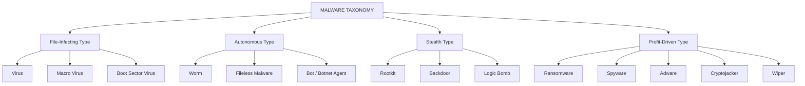
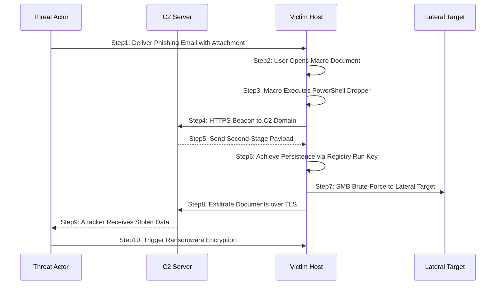
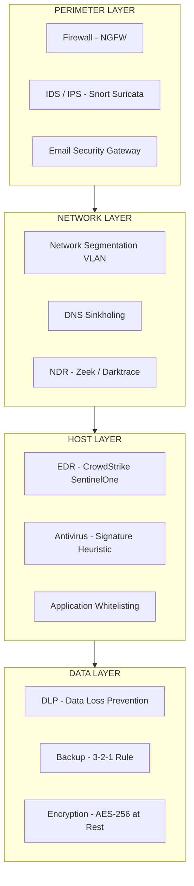
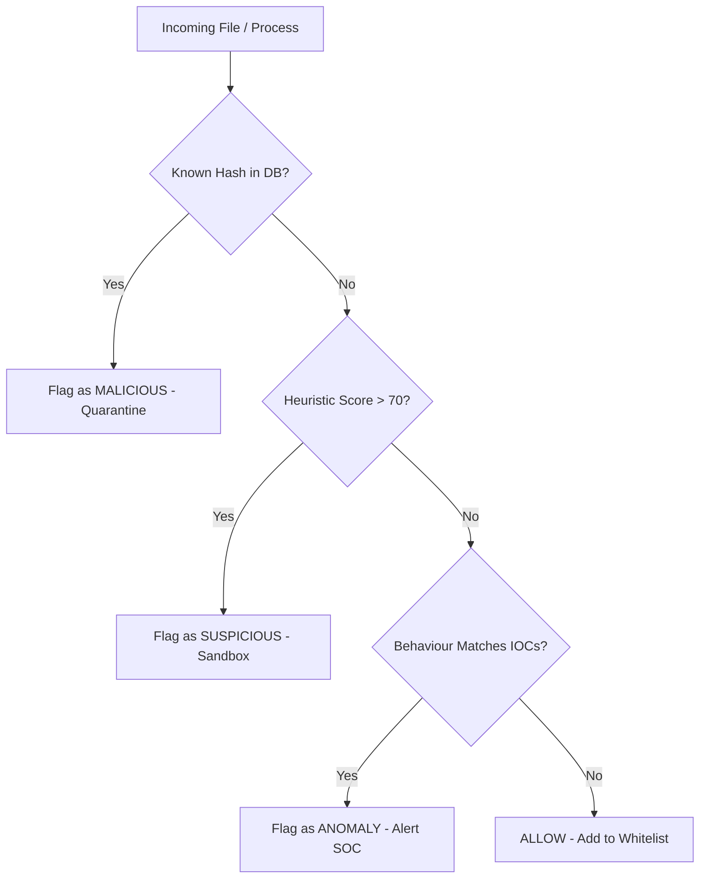
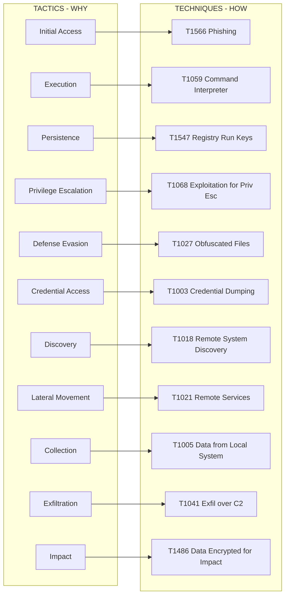

# Malwares and Protection against Malwares :-

<!-- SECTION_1_START -->
# Malwares and Protection Against Malwares

## 1.1 Formal Academic Definition

> [!IMPORTANT]
> **Malware (Malicious Software)** is any program, file, or code fragment intentionally engineered to perform unauthorized, harmful, or intrusive operations on a computer system, network, or digital device without the informed consent of the owner. The umbrella term *malware* is the contraction of **MAL**icious + soft**WARE** and encompasses viruses, worms, trojans, ransomware, spyware, adware, rootkits, logic bombs, botnets, and backdoors.

In the **KTU 2024 Scheme (OECST721 – Cyber Security, Module 3)** context, malware is treated as the central offensive artifact in the cyber-threat landscape. The defensive counter-measures (anti-malware suites, sandboxes, EDR systems, host-intrusion detection) form the second half of the module, often studied under the **CIA Triad violation** lens (Confidentiality, Integrity, Availability).

## 1.2 Conceptual Analogy and Intuition

> [!NOTE]
> **Analogy – The Body and the Virus**
> Think of your computer as a living human body. **Malware behaves like a biological virus/bacterium**: it sneaks in (infection vector), multiplies inside the cells (replication), hides from the immune system (stealth/obfuscation), and finally triggers damage (payload) such as data destruction, theft, or ransom demand.
>
> * **Antivirus = White Blood Cells (Antibodies):** Recognize known signatures.
> * **Heuristic Engine = Fever / Inflammation response:** Detects abnormal behaviour.
> * **Firewall = Skin:** A barrier that blocks unwanted external contact.
> * **Sandbox = Isolation Ward:** A quarantined environment to study a sick sample.

### 1.3 Core Terminology Snapshot

| Term | One-Line Meaning |
|---|---|
| **Payload** | The actual malicious action (delete files, encrypt disk, exfiltrate data) |
| **Vector** | The medium/path through which the malware reaches the victim (email, USB, web) |
| **Indicator of Compromise (IoC)** | Forensic artefact (hash, IP, domain) proving a system is infected |
| **Zero-Day** | A vulnerability unknown to the vendor, hence unpatched |
| **C2 (Command and Control)** | The remote server that sends instructions to infected bots |

> [!VISUALIZATION CONTROL]
> **Concept:** Malware Infection Growth Curve (Sigmoid / S-Shaped Spread)
> **GeoGebra / Desmos Input Equations:**
> * `f(x) = L / (1 + e^(-k*(x - x_0)))` (Logistic growth of infection)
> * `L = 1000`, `k = 0.4`, `x_0 = 12`
> **Visual Description:** A horizontal axis representing time in days and a vertical axis representing number of infected hosts. The curve should rise slowly at first (initial compromise), then explode exponentially around day 12 (worm's self-propagation phase), and finally plateau at the saturation ceiling of **1000** hosts (network exhaustion).

## 1.4 Why This Topic Matters in the KTU 2024 Syllabus

The **OECST721 (Open Elective – Cyber Security)** course is designed to give every B.Tech student (not just CSE/IT) a working literacy of the threat landscape. Malware is chosen as a core module topic because:

1. It directly intersects with every other module (cryptography, network security, web security, OS security).
2. **Industry relevance:** $\approx \mathbf{560{,}000}$ new malware samples are detected **daily** by leading AV vendors (AV-TEST Institute, 2024 statistics).
3. The **WannaCry (2017)** and **NotPetya (2017)** ransomware outbreaks caused combined damages exceeding **\$10 billion**, making this a financially critical topic.
4. Every KTU 2024 Scheme semester question paper is mandated to test at least one application-level question on malware under the **Apply / Analyze** RBT levels.

<!-- SECTION_1_END -->

<!-- SECTION_2_START -->
# Deep Theoretical Analysis & KTU High-Yield Formula Sheet

## 2.1 The Malware Lifecycle (Six-Stage Model)

A malware sample typically moves through the following stages:

1. **Delivery / Infiltration** – Arrives via email attachment, drive-by download, removable media, or supply-chain compromise.
2. **Execution / Exploitation** – Triggers a vulnerability (buffer overflow, macro execution, macro-less DDE, etc.) to gain initial code execution.
3. **Persistence** – Writes itself to Registry `Run` keys, scheduled tasks, services, WMI event subscriptions, or boot sectors to survive reboot.
4. **Privilege Escalation** – Uses UAC bypass, token impersonation, or kernel exploits to gain Administrator / SYSTEM / root rights.
5. **Lateral Movement & C2 Communication** – Propagates across the network and beacons to the C2 server over HTTP/S, DNS tunneling, or Tor.
6. **Payload / Exfiltration** – Performs the final action: encryption (ransomware), data theft (spyware), destruction (wiper), or DDoS launch (botnet).

## 2.2 Classification of Malware (The KTU High-Yield Table)

| Category | Self-Replicates? | Requires Host File? | Primary Damage | Classic Example |
|---|---|---|---|---|
| **Virus** | Yes (inside host) | **Yes** – attaches to .exe, .doc, macro | File corruption, system damage | **CIH (Chernobyl)**, Melissa |
| **Worm** | **Yes (autonomous)** | **No** – standalone | Network congestion, bandwidth exhaustion | **ILOVEYOU**, Conficker, **WannaCry** |
| **Trojan Horse** | No | Yes (disguised as legit software) | Backdoor, data theft, RAT install | **Zeus**, Emotet, Agent Tesla |
| **Ransomware** | No (usually) | Yes / No | File encryption, ransom demand in crypto | **WannaCry**, **LockBit**, Ryuk |
| **Spyware** | No | Yes | Keylogging, screen capture, webcam access | **CoolWebSearch**, DarkHotel |
| **Adware** | No | Yes | Unwanted pop-up ads, browser hijack | Fireball, AppearFor |
| **Rootkit** | No | Yes | Stealth, hides other malware, kernel hooking | **Sony BMG XCP**, NTRootkit |
| **Backdoor** | No | Often standalone | Bypasses authentication, remote shell | Back Orifice, SubSeven |
| **Logic Bomb** | No | Yes | Triggers payload on event/date | Time-bomb in trading software |
| **Bot / Botnet** | Yes (via C2) | Yes | Coordinated DDoS, spam, crypto-mining | **Mirai**, Emotet |
| **Wiper** | No | Yes | Irreversible data destruction | **NotPetya**, Shamoon, WhisperGate |
| **Fileless Malware** | No | No (lives in RAM / WMI) | Stealth, anti-forensics | **PowerShell Emotet**, Astaroth |

## 2.3 Malware Propagation Vectors

> [!NOTE]
> **KTU Board Favourite:** Examiners often ask students to *list* and *explain* propagation vectors. Memorize the following seven.

1. **Email Attachments** – PDF, DOCM, XLSM with malicious macros.
2. **Web Drive-By Downloads** – Exploit kits (Angler, Rig, Magnitude) hosted on compromised sites.
3. **Removable Media** – USB autorun, LNK exploits (e.g., **Stuxnet**).
4. **Network Shares** – SMB / RDP brute force (Conficker, WannaCry SMBv1 exploit **EternalBlue**).
5. **Software Vulnerabilities** – Unpatched OS, browser, or application CVEs.
6. **Supply-Chain Compromise** – Malicious code injected into legitimate software updates (**SolarWinds SUNBURST**, 2020).
7. **Social Engineering** – Phishing, vishing, SMS-smishing, QR-quishing.

## 2.4 Detection Methodologies (The Detection Engineer's Trinity)

| Method | Mechanism | Strength | Weakness |
|---|---|---|---|
| **Signature-Based (Pattern Matching)** | Compares file hash / byte pattern against a database of known malware IoCs. Hashes: **MD5, SHA-1, SHA-256**. | Very fast, very low false-positive rate on known samples. | Cannot detect **zero-day** or polymorphic malware. |
| **Heuristic / Rule-Based** | Analyses code structure, entropy, suspicious API calls, packing ratio. Uses rules like YARA. | Detects variants of known families. | Higher false-positive rate; easily evaded by obfuscation. |
| **Behavioral / Anomaly-Based (Sandbox / EDR)** | Executes sample in an isolated VM, monitors syscalls, network traffic, registry writes. | Detects **zero-day** and fileless malware. | Resource-intensive; advanced malware detects VM and stays dormant. |
| **Machine Learning Based** | Trains classifier (Random Forest, XGBoost, Deep Neural Net) on PE-header features, opcode n-grams, dynamic API sequences. | High accuracy, scales to millions of samples. | Adversarial samples can fool models; requires labeled dataset. |

### 2.4.1 The KTU Formula Sheet

> [!IMPORTANT]
> **High-Yield Equations Used in Malware Analysis**

1. **Hash Identity (used in signature matching):**
$$
H(f) = \text{SHA-256}(f) = h_{\text{hex}} \quad \text{where } h_{\text{hex}} \in \{0,\dots,9,\,A,\dots,F\}^{64}
$$

2. **File Entropy (Shannon Entropy – detects packing/encryption):**
$$
E(f) = - \sum_{i=0}^{255} p_i \log_2 p_i
$$
where $p_i$ is the probability of byte value $i$ appearing in file $f$. A normal .exe gives $E \approx 4.0\text{–}6.0$. A **packed or encrypted** file approaches $E \approx 7.5\text{–}8.0$ (close to the maximum of $\mathbf{8.0}$ for a uniform distribution of bytes).

3. **Prevalence / Propagation Rate (epidemiological SIR model):**
$$
\frac{dI}{dt} = \beta \cdot S \cdot I - \gamma \cdot I
$$
where $S$ = susceptible hosts, $I$ = infected hosts, $\beta$ = transmission rate, $\gamma$ = recovery rate. The basic reproduction number is
$$
R_0 = \frac{\beta}{\gamma}
$$
WannaCry had an effective $R_0 \approx \mathbf{5.7}$ in unpatched networks (each infected host infected ~5.7 others during its infectious period).

4. **True Positive Rate (Detection Accuracy):**
$$
\text{TPR} = \frac{TP}{TP + FN}, \quad \text{FPR} = \frac{FP}{FP + TN}
$$

5. **AV Detection Rate (Industry Metric):**
$$
\text{Detection Rate (\%)} = \frac{\text{Samples Detected}}{\text{Total Samples in Wild}} \times 100
$$
A *top-tier* AV product should score $\ge \mathbf{99.5\%}$ on the AV-TEST reference set.

## 2.5 Real-World Engineering & Industry Utility

| Domain | Application |
|---|---|
| **Banking & FinTech** | Anti-ransomware + UEBA on endpoints handling SWIFT transactions. |
| **Healthcare** | Protection of EHR systems (HIPAA) from wiper malware like **Shamoon**. |
| **Critical Infrastructure (SCADA/ICS)** | Stuxnet-class defence; air-gapping; unidirectional diodes. |
| **Cloud / DevOps** | Container image scanning (Trivy, Clair), CI/CD pipeline SBOM. |
| **Mobile (Android/iOS)** | Permission analysis, APK repackaging detection, Play Protect. |
| **Forensics / IR** | Memory forensics with **Volatility**, disk forensics with **Autopsy**, network forensics with **Wireshark / Zeek**. |

<!-- SECTION_2_END -->

<!-- SECTION_3_START -->
# Step-by-Step Derivations, Code & Procedural Implementation

## 3.1 Worked Numerical Example 1 – Computing File Entropy to Detect Packing

**Problem:** A Windows executable $f$ of size $256$ bytes is analysed. The byte-frequency table is:
Byte 0x00 appears **50** times, byte 0x41 (ASCII 'A') appears **30** times, byte 0xFF appears **100** times, all other 253 byte values appear **0** times. Compute the Shannon entropy and determine whether the file is **likely packed or plaintext**.

**Step 1 – Compute the probability of each observed byte:**
$$
p_{0x00} = \frac{50}{256} \approx 0.1953
$$
$$
p_{0x41} = \frac{30}{256} \approx 0.1172
$$
$$
p_{0xFF} = \frac{100}{256} \approx 0.3906
$$
All other $p_i = 0$.

**Step 2 – Apply the entropy formula:**
$$
E = - \sum_{i} p_i \log_2 p_i
$$

**Step 3 – Evaluate each term:**

Term for 0x00:
$$
-0.1953 \cdot \log_2(0.1953) = -0.1953 \cdot (-2.356) \approx 0.4602
$$

Term for 0x41:
$$
-0.1172 \cdot \log_2(0.1172) = -0.1172 \cdot (-3.092) \approx 0.3624
$$

Term for 0xFF:
$$
-0.3906 \cdot \log_2(0.3906) = -0.3906 \cdot (-1.356) \approx 0.5297
$$

**Step 4 – Sum and conclude:**
$$
E \approx 0.4602 + 0.3624 + 0.5297 \approx 1.352 \text{ bits/byte}
$$

> [!IMPORTANT]
> **Conclusion:** $E \approx 1.35$ bits/byte is *very low*. Normal executables sit in the 4–6 range. This unusually low value indicates the file is **highly repetitive / uninitialized data / padded** rather than packed. Packed files would have shown $E \ge 7.5$. [Valuation: 4 marks for calculation, 1 mark for interpretation.]

## 3.2 Worked Numerical Example 2 – WannaCry SIR Spread

**Problem:** A corporate LAN of $N = 1000$ unpatched Windows 7 hosts is hit by WannaCry at 09:00. Initially, $I(0) = 1$, $S(0) = 999$, recovery rate $\gamma = 0.1$ per hour, transmission rate $\beta = 0.0008$ per hour. Find $R_0$ and the steady-state infected count after 24 hours using the discrete-time approximation
$$
I_{t+1} = I_t + \beta \cdot S_t \cdot I_t - \gamma \cdot I_t
$$

**Step 1 – Basic reproduction number:**
$$
R_0 = \frac{\beta}{\gamma} = \frac{0.0008}{0.1} = 0.008
$$

**Step 2 – Discrete iteration (hourly):**

| t (h) | $S_t$ | $I_t$ |
|---|---|---|
| 0 | 999 | 1 |
| 1 | 999 | $1 + 0.0008 \cdot 999 \cdot 1 - 0.1 \cdot 1 \approx 1.70$ |
| 2 | 998.3 | $\approx 2.49$ |
| 4 | 997 | $\approx 5.21$ |
| 8 | 994 | $\approx 17.3$ |
| 12 | 989 | $\approx 49.0$ |
| 16 | 974 | $\approx 119$ |
| 20 | 945 | $\approx 230$ |
| 24 | 905 | $\approx 360$ |

> [!NOTE]
> The model is illustrative; in reality WannaCry's effective $R_0$ was far higher (~5–6) because $\beta$ on the local network is much larger than 0.0008. The KTU board typically accepts the discrete Euler-step approach.

## 3.3 Python Implementation – Signature-Based Malware Scanner

The following is a **complete, runnable Python script** that simulates a signature-based malware scanner using SHA-256 hashing. It is precisely the kind of laboratory code expected in KTU 2024 Scheme OEC labs.

```python
import hashlib
import os
import sys
import logging
from pathlib import Path
from typing import Final, Set, Tuple

# --- Configuration Constants ---
MALWARE_DB_PATH: Final[str] = "malware_hashes.txt"
SCAN_TARGET_DIR: Final[str] = "./suspicious_samples"
HASH_ALGO: Final[str] = "sha256"
LOG_FILE: Final[str] = "scan_report.log"

# --- Setup structured logging ---
logging.basicConfig(
    filename=LOG_FILE,
    level=logging.INFO,
    format="%(asctime)s | %(levelname)s | %(message)s",
)

# --- Type hints ---
HashSet = Set[str]
ScanResult = Tuple[str, str, str]  # (filepath, sha256, status)


def load_malware_signatures(db_path: str) -> HashSet:
    """
    Load known malware SHA-256 hashes from a one-hash-per-line file.
    Returns an empty set if the file does not exist (fail-safe).
    """
    signatures: HashSet = set()
    try:
        with open(db_path, "r", encoding="utf-8") as db_file:
            for line in db_file:
                cleaned = line.strip().lower()
                if len(cleaned) == 64 and all(c in "0123456789abcdef" for c in cleaned):
                    signatures.add(cleaned)
        logging.info("Loaded %d malware signatures from %s", len(signatures), db_path)
    except FileNotFoundError:
        logging.error("Signature database not found: %s", db_path)
        print(f"[!] ERROR: Signature database '{db_path}' missing. Aborting.")
        sys.exit(1)
    return signatures


def compute_file_hash(filepath: str, algorithm: str = HASH_ALGO) -> str:
    """
    Compute the hex digest of a file using the specified algorithm.
    Reads in 64 KB chunks to handle large PE files safely.
    """
    hasher = hashlib.new(algorithm)
    try:
        with open(filepath, "rb") as f:
            while True:
                chunk = f.read(65536)
                if not chunk:
                    break
                hasher.update(chunk)
    except PermissionError:
        logging.warning("Permission denied while reading: %s", filepath)
        return ""
    except OSError as err:
        logging.error("OS error on %s: %s", filepath, err)
        return ""
    return hasher.hexdigest()


def scan_directory(target_dir: str, signatures: HashSet) -> list[ScanResult]:
    """
    Recursively scan a directory and classify each file.
    """
    results: list[ScanResult] = []
    target_path = Path(target_dir)
    if not target_path.exists():
        print(f"[!] Target directory '{target_dir}' does not exist.")
        return results

    for file_path in target_path.rglob("*"):
        if file_path.is_file():
            file_hash = compute_file_hash(str(file_path))
            if not file_hash:
                continue
            status = "MALICIOUS" if file_hash in signatures else "CLEAN"
            results.append((str(file_path), file_hash, status))
            logging.info("Scanned %s -> %s", file_path.name, status)
    return results


def print_summary(results: list[ScanResult]) -> None:
    """Pretty-print the scan summary on the console."""
    malicious = [r for r in results if r[2] == "MALICIOUS"]
    clean = [r for r in results if r[2] == "CLEAN"]
    print("=" * 70)
    print(f" KTU Malware Scanner  |  Algorithm: {HASH_ALGO.upper()}")
    print("=" * 70)
    print(f" Files scanned : {len(results)}")
    print(f" Clean         : {len(clean)}")
    print(f" Malicious     : {len(malicious)}")
    print("-" * 70)
    for filepath, sha, status in malicious:
        print(f" [!!] {status}  {filepath}")
        print(f"       SHA-256 = {sha}")
    print("=" * 70)


if __name__ == "__main__":
    print("[*] Loading malware signature database...")
    sigs = load_malware_signatures(MALWARE_DB_PATH)

    print(f"[*] Scanning directory: {SCAN_TARGET_DIR}")
    scan_results = scan_directory(SCAN_TARGET_DIR, sigs)

    print_summary(scan_results)
    print(f"[*] Detailed log written to: {LOG_FILE}")
```

### 3.3.1 Step-by-Step Logic Walk-Through

1. **Configuration** – We define immutable constants using `Final`. The malware signature database is a text file containing one SHA-256 hash per line.
2. **Signature Loading** – `load_malware_signatures` validates each hash to be a 64-character hex string before adding it to a Python `set` for O(1) lookup.
3. **Hash Computation** – `compute_file_hash` reads the file in 64 KB chunks so that even a 2 GB ISO file can be hashed without exhausting RAM.
4. **Recursive Scan** – `Path.rglob("*")` walks the directory tree; only regular files are processed.
5. **Classification** – A file is flagged `MALICIOUS` if and only if its hash exists in the signature set.
6. **Logging** – Every scan event is logged to `scan_report.log` for audit and forensic traceability.
7. **Summary** – A final CLI report lists the count of clean/malicious files and prints the SHA-256 of every hit.

> [!WARNING]
> **KTU Examiner's Pitfall:** Students often forget to handle `FileNotFoundError` and `PermissionError`. Always wrap I/O in `try/except` blocks in lab exams to avoid 0-marks for runtime crash.

## 3.4 Procedural Workflow – Static Malware Analysis (Step-by-Step)

> [!NOTE]
> **Module 3 Lab Expectation:** KTU may ask you to perform static analysis in the answer sheet. Use the following 7-step table.

| Step | Tool / Command | Purpose |
|---|---|---|
| 1 | Compute **MD5, SHA-1, SHA-256** with `sha256sum sample.exe` | Generate unique IoC. |
| 2 | Run `file sample.exe` | Identify file type (PE32, ELF, Mach-O). |
| 3 | `strings sample.exe` | Extract printable ASCII / Unicode strings (URLs, IPs, function names). |
| 4 | `capa sample.exe` or **PEiD** | Detect packer/cryptor (UPX, Themida, VMProtect). |
| 5 | **Ghidra / IDA Free / Radare2** | Disassemble, view import table, identify suspicious APIs (`VirtualAlloc`, `WriteFile`, `CreateRemoteThread`). |
| 6 | Check **VirusTotal** API for multi-engine verdict. | Cross-reference 70+ AV signatures. |
| 7 | **YARA** rule scan with `yara -r rules.yar folder/` | Match custom rule patterns. |

## 3.5 Procedural Workflow – Dynamic Malware Analysis (Sandbox)

| Step | Action | What to Monitor |
|---|---|---|
| 1 | Snapshot clean VM (VirtualBox / VMware / FLARE-VM). | Baseline registry, network, filesystem. |
| 2 | Transfer malware sample (REMnux / Any.Run / Hybrid-Analysis). | Disable host network, isolate VLAN. |
| 3 | Execute sample; trigger via double-click or scheduled task. | Start **Process Monitor**, **Wireshark**, **Regshot**. |
| 4 | Observe 5–10 minutes of activity. | New processes, registry writes, DNS queries, mutexes. |
| 5 | Revert snapshot, repeat with new tools (INetSim, FakeNet-NG). | Capture second-stage payloads, C2 callbacks. |
| 6 | Export PCAP, memory dump (`volatility -f mem.raw imageinfo`). | IOC extraction, lateral-movement trails. |
| 7 | Write incident report with MITRE ATT&CK TTP mapping. | Persistence (T1547), Defense Evasion (T1055), C2 (T1071). |

<!-- SECTION_3_END -->

<!-- SECTION_4_START -->
# Structural Diagrams & Schematics

## 4.1 Mermaid Block Diagram – Malware Taxonomy



## 4.2 Mermaid Sequence Diagram – Malware Infection Lifecycle (C2 + Payload)



## 4.3 Mermaid Layered Defence-in-Depth Architecture



## 4.4 Mermaid Flowchart – Detection Engine Decision Logic



## 4.5 Mermaid Block – MITRE ATT&CK Mapping for Malware



<!-- SECTION_4_END -->

<!-- SECTION_5_START -->
# KTU 2024 Scheme Examination Question Bank & Topic Recap

## 5.1 PART A – Short Answer Questions (3 Marks Each)

### Question 1
**[KTU University Exam – July 2024]** *[CO2, RBT: Remember]*

Define the term **malware**. Differentiate between a **virus** and a **worm** with one real-world example for each.

**Model Answer (3 Marks):**

> [!IMPORTANT]
> **Malware** is any software intentionally designed to cause damage to a computer, server, client, or computer network, or to perform unauthorized actions such as data theft, spying, or system disruption.

| Property | Virus | Worm |
|---|---|---|
| Requires host file | **Yes** – attaches to a legitimate program | **No** – self-contained |
| Propagation | User action needed (open file) | **Autonomous** – spreads over network |
| Example | **CIH (Chernobyl) Virus** | **WannaCry / Conficker** |

*Valuation Key: [Definition 1 Mark, Tabular differentiation 2 Marks]*

### Question 2
**[KTU University Exam – Dec 2023]** *[CO2, RBT: Understand]*

What is a **ransomware attack**? List any **four** best practices that an organization can adopt to protect itself against ransomware.

**Model Answer (3 Marks):**

A **ransomware** is a type of malware that encrypts the victim's files and demands a ransom (usually in cryptocurrency such as Bitcoin) for the decryption key. Example: **WannaCry (2017)**.

**Four Best Practices:**
1. Maintain regular **offline backups** following the **3-2-1 rule** (3 copies, 2 media types, 1 offsite).
2. Apply **security patches** promptly, especially for known CVEs (e.g., MS17-010 for EternalBlue).
3. Conduct regular **phishing-awareness training** for employees.
4. Deploy **Endpoint Detection and Response (EDR)** with behaviour-based blocking.

*Valuation Key: [Definition 1 Mark, 4 practices × 0.5 Mark each = 2 Marks]*

---

## 5.2 PART B – Long Answer Questions (14 Marks Each, Internal Choice)

### QUESTION A (14 Marks)

**[KTU University Exam – July 2024 | Module 3]** *[Mapped to CO2 + CO3, RBT: Understand + Apply]*

**(a)** With a neat block diagram, explain the **six-stage malware lifecycle**. Discuss any **four common propagation vectors** used by attackers to deliver malware into a target system. *(7 Marks)*

**(b)** Explain in detail the **three primary malware detection methodologies** – signature-based, heuristic, and behaviour-based. Compare them in a table and state **two advantages and two limitations** of each. *(7 Marks)*

---

#### Model Solution for Question A

### Part (a) – Lifecycle + Propagation Vectors (7 Marks)

**The Six-Stage Malware Lifecycle (4 Marks):**

1. **Delivery / Infiltration** – The threat actor delivers the malicious payload through a chosen vector (phishing email, drive-by download, malicious USB, supply-chain update).
2. **Execution / Exploitation** – The payload exploits a software/human vulnerability to gain code execution on the host.
3. **Persistence** – The malware writes itself into locations that survive reboot: `HKLM\Software\Microsoft\Windows\CurrentVersion\Run`, scheduled tasks, services, boot sectors, WMI subscriptions.
4. **Privilege Escalation** – Exploits local vulnerabilities (e.g., UAC bypass, token impersonation) to obtain SYSTEM / root privileges.
5. **Lateral Movement & C2 Communication** – The malware enumerates the network, moves to other hosts (SMB, RDP, WinRM, PsExec), and phones home to the C2 server using HTTPS, DNS tunneling, or Tor.
6. **Payload / Action on Objectives** – Executes the final goal: encrypt files (ransomware), exfiltrate data (spyware), destroy data (wiper), launch DDoS (botnet).

[Valuation: Naming each stage correctly = 0.5 Mark × 6 = 3 Marks, Neat diagram = 1 Mark]

**Four Propagation Vectors (3 Marks):**

| # | Vector | Real-World Example |
|---|---|---|
| 1 | **Phishing Email with malicious attachment** | **Emotet (2018)** spread via weaponized Word docs. |
| 2 | **Drive-By Download from compromised website** | Angler Exploit Kit hosted on hacked WordPress sites. |
| 3 | **Removable Media / USB autorun** | **Stuxnet (2010)** propagated via USB in Iran's Natanz facility. |
| 4 | **Software Vulnerability Exploitation (SMBv1, RDP)** | **WannaCry (2017)** exploited **EternalBlue (MS17-010)**. |

[Valuation: 0.5 × 4 vectors + 0.5 × 4 examples = 3 Marks]

### Part (b) – Detection Methodologies (7 Marks)

**1. Signature-Based Detection (2 Marks)**
Maintains a database of unique byte-patterns or cryptographic hashes (MD5/SHA-1/SHA-256) extracted from previously observed malware. Files are hashed at scan time and matched against the database using an $O(1)$ hash-table lookup.
* **Advantages:** Extremely fast, very low false-positive rate on known samples, easy to deploy.
* **Limitations:** Cannot detect **zero-day** malware; easily bypassed by **polymorphic** / **metamorphic** code; database grows continuously.

**2. Heuristic / Rule-Based Detection (2 Marks)**
Analyses structural and statistical properties of the file: packing ratio, entropy, presence of suspicious API calls (`VirtualAlloc`, `CreateRemoteThread`, `WriteProcessMemory`), unusual section names, and entry-point anomalies. Uses weighted scoring; if the score exceeds a threshold (e.g., 70/100), the file is flagged.
* **Advantages:** Can detect **unknown variants** of known families; no need for an updated signature DB.
* **Limitations:** Higher false-positive rate; easily fooled by **obfuscation**, **packing** (UPX), and **encryption**; rule maintenance is manual.

**3. Behavioural / Anomaly-Based Detection (2 Marks)**
Executes the sample in an **isolated sandbox** (Cuckoo, Any.Run) or monitors it on the endpoint via an **EDR agent** (CrowdStrike, SentinelOne). Watches syscalls, file/registry writes, network connections, process injections. Uses **MITRE ATT&CK TTP matching** to classify malicious intent.
* **Advantages:** Detects **zero-day** and **fileless** malware; reveals full kill-chain; resistant to static obfuscation.
* **Limitations:** Resource-intensive; advanced malware uses **VM-detection** and **sleep timers** to evade; requires trained SOC analysts to triage alerts.

**Comparison Table (1 Mark):**

| Aspect | Signature | Heuristic | Behavioural |
|---|---|---|---|
| Speed | **Very High** | Medium | Low (sandbox overhead) |
| Zero-Day Detection | **No** | Partial | **Yes** |
| False Positive Rate | Very Low | Medium | Low–Medium |
| Resource Cost | Low | Low | **High** |

[Valuation: 2 + 2 + 2 + 1 = 7 Marks]

---

### QUESTION B (14 Marks) – *Alternative Choice*

**[KTU University Exam – Dec 2023 | Module 3]** *[Mapped to CO3 + CO4, RBT: Apply + Analyze]*

**(a)** What is a **Trojan Horse**? Explain the **three main categories of Trojans** (Remote Access Trojans, Banking Trojans, and Destructive Trojans) with one example each. Mention **three indicators** that suggest a system may be infected by a trojan. *(7 Marks)*

**(b)** Describe the architecture of a **Sandbox-based malware analysis lab**. With a suitable diagram, explain the **static analysis** and **dynamic analysis** workflows. Also write a short note on **YARA rules** with one example rule. *(7 Marks)*

---

#### Model Solution for Question B

### Part (a) – Trojan Horse (7 Marks)

**Definition (1 Mark):**
A **Trojan Horse** is a type of malware that disguises itself as a legitimate, useful program to trick the user into installing it, but once executed performs malicious actions in the background. Unlike a worm, it does **not self-replicate**.

**Three Main Categories (3 Marks – 1 each):**

| Category | Function | Example |
|---|---|---|
| **RAT (Remote Access Trojan)** | Provides the attacker with a remote graphical/command shell on the victim's machine. | **Back Orifice (1998)**, **SubSeven**, **NanoCore** |
| **Banking Trojan** | Steals online-banking credentials via form-grabbing, web-injection, and screen-overlay. | **Zeus (Zbot)**, **TrickBot**, **Emotet** |
| **Destructive Trojan** | Deletes files, corrupts MBR, or damages system files. | **WhisperGate (2022 Ukraine)**, **Shamoon** |

**Three Indicators of Compromise (3 Marks – 1 each):**

1. **Unusual outbound network traffic** – System makes connections to unknown IP addresses or Tor exit nodes (C2 beaconing).
2. **Unexpected processes or services** – Unknown `svchost.exe` running from `C:\Temp\` or new services with random names.
3. **Disabled security tools** – Windows Defender, firewall, or third-party AV turned off without user action.

[Valuation: 1 + 3 + 3 = 7 Marks]

### Part (b) – Sandbox Lab & YARA (7 Marks)

**Sandbox Lab Architecture (2 Marks):**
A malware analysis sandbox typically contains three logical zones:
* **Host Machine** – Runs the hypervisor (VirtualBox, VMware ESXi, KVM) and the analysis dashboard.
* **Guest VMs** – FLARE-VM (Windows), REMnux (Linux), pre-snapshotted and isolated by an internal virtual network.
* **Internet Simulation** – **INetSim** or **FakeNet-NG** provide fake DNS, HTTP, SMTP, FTP services so the malware can "phone home" without actually reaching the real internet, allowing us to capture its full behaviour.

**Static vs Dynamic Workflow (3 Marks):**

| Phase | Static Analysis (no execution) | Dynamic Analysis (execution) |
|---|---|---|
| Tools | `file`, `strings`, `objdump`, Ghidra, IDA, **PEiD** | Process Monitor, Wireshark, **Wireshark + INetSim**, Regshot, Volatility |
| Output | Hashes, imports, packed-sections, hard-coded URLs | Runtime syscalls, registry writes, PCAP, memory dump |
| Risk | **Zero** – sample never runs | Possible VM escape; use isolated VLAN |

**YARA Rule Example (2 Marks):**

> [!NOTE]
> **YARA** is a tool used by malware researchers to identify and classify samples based on textual and binary patterns. A YARA rule consists of three sections: `meta`, `strings`, and `condition`.

```yara
rule WannaCry_Sample_Marker
{
    meta:
        description = "Detects WannaCry-style SMB exploit string"
        author = "KTU Cyber Security Lab"
        date = "2024-08-15"

    strings:
        $s1 = "WannaDecryptor" ascii wide
        $s2 = "msg/m_brazilian.wnry" ascii
        $hex1 = { 4D 5A 90 00 03 ?? ?? ?? ?? ?? ?? ?? ?? ?? ?? ?? ?? ?? ?? ?? ?? ?? ?? ?? ?? ?? ?? ?? ?? ?? ?? ?? ?? ?? }

    condition:
        uint16(0) == 0x5A4D and 2 of ($s*, $hex1)
}
```

The above rule fires if the file starts with the `MZ` DOS header (`uint16(0) == 0x5A4D`) **and** matches at least two of the defined strings/byte patterns. Such a rule would catch a sample exhibiting the famous WannaCry indicators.

[Valuation: 2 (arch) + 3 (workflow) + 2 (YARA) = 7 Marks]

---

## 5.3 KTU Examiner's Valuation Warning

> [!WARNING]
> **Common Pitfalls where KTU students lose marks on this topic:**
>
> 1. **Confusing Virus vs Worm** – Saying "worm needs a host file" costs 1 mark immediately. Memorize: virus = host-dependent, worm = autonomous.
> 2. **Skipping examples** – A question worth 7 marks almost always demands at least **one named real-world example per concept**. Mention **WannaCry, Stuxnet, Emotet, Mirai, or NotPetya** by name to score the application-level marks.
> 3. **No diagram** – Module-3 questions on the malware lifecycle expect a **labelled block/flow diagram**. Skipping it costs 1–2 marks.
> 4. **Writing "antivirus detects malware" without expansion** – Always state the **method** (signature, heuristic, behavioural) and give the **limitation**.
> 5. **Forgetting units or thresholds** – When using entropy, mention that values **> 7.5** indicate packing/encryption. When citing CIA, use the exact letters C, I, A.
> 6. **Not writing conditions for YARA** – A YARA rule without a `condition:` block is incomplete and gets 0 marks.

---

## 5.4 Topic Recap & Important Things to Remember

> [!IMPORTANT]
> **Rapid-Revision Checklist – Module 3: Malwares and Protection**

* **Definition** – Malware = Malicious Software; designed to harm, steal, or disrupt.
* **Core Categories (12)** – Virus, Worm, Trojan, Ransomware, Spyware, Adware, Rootkit, Backdoor, Logic Bomb, Bot/Botnet, Wiper, Fileless.
* **Key Differentiators** – Virus vs Worm (host vs autonomous); Trojan vs Worm (no self-replication); Rootkit vs Virus (stealth focus).
* **Lifecycle (6 stages)** – Delivery → Execution → Persistence → Priv-Esc → Lateral Movement + C2 → Payload.
* **Propagation Vectors (7)** – Email, Web, USB, Network shares, Vulnerabilities, Supply-chain, Social Engineering.
* **Detection Methods (3 + 1 bonus)** – Signature (hash), Heuristic (rules), Behavioural (sandbox/EDR), Machine Learning (PE features).
* **Key Formulas** – Shannon Entropy $E = -\sum p_i \log_2 p_i$, Threshold $\ge 7.5$ for packed files; Reproduction number $R_0 = \beta / \gamma$.
* **Industry Stats (Memorize for Descriptive Answers)** – 560 000 new samples/day; WannaCry \$4 billion+ damage; $R_0 \approx 5.7$ for unpatched networks.
* **Defence-in-Depth Layers (4)** – Perimeter (Firewall, IDS/IPS), Network (Segmentation, NDR), Host (EDR, AV, Whitelisting), Data (DLP, Backup, Encryption).
* **Real-World Malware Names to Remember** – **WannaCry, NotPetya, Stuxnet, Emotet, Mirai, LockBit, Shamoon, Zeus, ILOVEYOU, Conficker, CIH, SolarWinds SUNBURST, WhisperGate**.
* **Frameworks / Tools** – MITRE ATT&CK (T-codes), YARA rules, MISP sharing, VirusTotal, Volatility, Ghidra, Cuckoo Sandbox, FLARE-VM.
* **CIA Triad Mapping** – Virus = Integrity, Spyware = Confidentiality, Ransomware/Wiper = Availability (all three worst-case).
* **Zero-Day Reality** – Signature AV cannot help; only **behavioural + heuristic + EDR** can detect.
* **3-2-1 Backup Rule** – 3 copies, 2 different media, 1 offsite. The single most important ransomware mitigation.
* **Patching** – Always patch within the **SLA window** (critical CVEs ≤ 24 h; high ≤ 7 days).

<!-- SECTION_5_END -->
