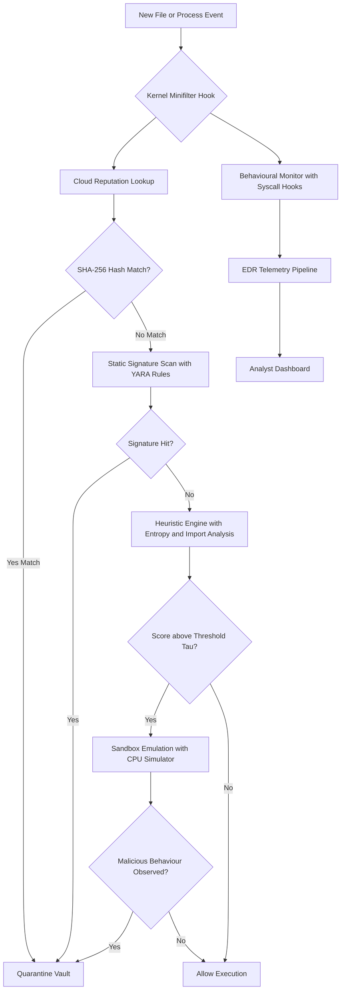
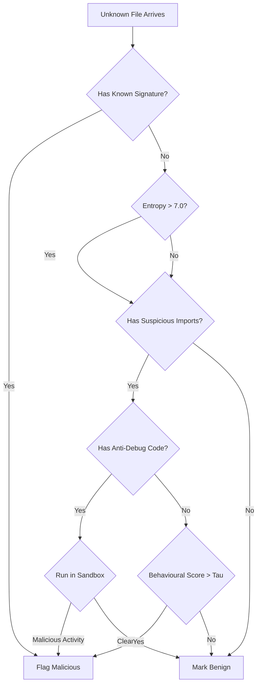

# Protection against Malware- Antivirus/Antimalware Software

<!-- SECTION_1_START -->
# Protection against Malware: Antivirus / Antimalware Software

## 1.1 Formal Academic Definition (KTU 2024 Syllabus Terminology)

> [!IMPORTANT]
> **Antivirus Software (AV) / Antimalware Software** is a class of *endpoint security utility program* designed to **prevent, detect, identify, quarantine, and remediate** malicious software (malware) on a computing endpoint. In the context of the KTU 2024 *Cyber Security (OECST721)* syllabus, antivirus/antimalware software is studied as the **last-line host-based defensive control** that complements network firewalls, intrusion detection systems (IDS), and secure coding practices.

The modern antimalware engine is not a single monolithic scanner; it is a **multi-layered detection pipeline** that combines:

1. **Static Analysis** – inspecting file fingerprints, headers, opcodes, and byte sequences without executing the file.
2. **Dynamic / Behavioral Analysis** – observing the runtime side-effects (syscalls, registry edits, network calls) of a suspicious sample inside a controlled environment.
3. **Cloud-Assisted Reputation Lookups** – querying a globally maintained threat-intelligence database for hashes, URLs, IPs, and process behaviours.

A working antimalware product performs four canonical operations — sometimes abbreviated as **P-D-Q-R**:

| Operation | Meaning | Engineering Purpose |
|---|---|---|
| **P**revent | Block known malware at the gateway or filesystem layer | Stop infection before execution |
| **D**etect | Identify malicious artefacts via signatures, heuristics, or AI models | Discover latent threats |
| **Q**uarantine | Isolate infected files in a locked vault | Prevent lateral damage |
| **R**emediate / Remove | Delete, disinfect, or roll back malicious changes | Restore system integrity |

## 1.2 Conceptual Analogy & Intuition

> [!NOTE]
> **Plain-English Analogy — "The Building's Security Desk"**
>
> Imagine a corporate office building. The **firewall** is the perimeter fence and the visitor badge-check at the gate. The **IDS/IPS** is the CCTV control room watching the corridors. The **antivirus software**, however, is the **security desk on each floor** — every person (file/process) that wants to enter an office (memory/CPU) must show an ID (signature), explain their purpose (heuristic interview), and be observed for suspicious behaviour (behavioural monitoring). If anything looks off, the desk officer escorts the visitor to a *holding room* (quarantine) and notifies the head office (cloud intelligence).

### 1.3 Key Terminology (Syllabus Highlights)

> [!IMPORTANT]
> - **Signature** — a unique byte-pattern or cryptographic hash (e.g., MD5, SHA-256) that uniquely identifies a known malware family. Statistically, modern AVs reference a database of **> 1 billion** signatures.
> - **Heuristic** — a rule-based scoring algorithm that flags files exhibiting *suspicious structural traits* (packed code, unusual entropy, suspicious imports) even if no signature exists.
> - **False Positive (FP)** — a legitimate file wrongly classified as malicious. The industry target is **< 0.01 %**.
> - **False Negative (FN)** — a malicious file wrongly classified as benign. The most dangerous error.
> - **Zero-Day Malware** — a previously unseen exploit for which no signature exists; heuristic/AI/EDR engines are required.
> - **Quarantine Vault** — an encrypted, permission-locked directory (e.g., `C:\ProgramData\Microsoft\Windows Defender\Quarantine`) where infected files are stored before deletion.
> - **Real-Time Protection** — a kernel-level (Ring 0) scanner that intercepts every file I/O request via *minifilter drivers* (Windows) or *inotify hooks* (Linux).
> - **EDR (Endpoint Detection and Response)** — the modern evolution of antivirus that records telemetry for forensic investigation.

> [!VISUALIZATION CONTROL]
> **Concept:** Detection trade-off between False Positives and False Negatives
> **GeoGebra / Desmos Input Equations:**
> * $f(x) = \dfrac{1}{1 + e^{-k(x - x_0)}}$  (sigmoid response of an AV scoring engine)
> **Visual Description:** The student should plot a sigmoid curve to see how the *detection threshold* slides horizontally. A threshold too far left causes many false positives; too far right causes false negatives. The "sweet spot" is the inflection point at $x_0$.

## 1.4 Why This Topic Matters in KTU 2024

The KTU 2024 OECST721 syllabus explicitly lists *Protection against Malware* as a **Module 3** learning outcome, requiring students to "describe and compare antivirus techniques and evaluate their effectiveness against modern threats." This topic is also the practical foundation for higher-level subjects such as *Digital Forensics*, *Cloud Security*, and *IoT Security*.
<!-- SECTION_1_END -->

<!-- SECTION_2_START -->
# Deep Theoretical Analysis & KTU High-Yield Formula Sheet

## 2.1 The Multi-Layered Detection Architecture

A modern antivirus engine is a **defence-in-depth** pipeline. The layers, from outermost to innermost, are:

1. **Cloud Reputation Lookup (Pre-execution)** — Hash the file; query the vendor's cloud (e.g., VirusTotal, Microsoft MAPP). Latency: ~50 ms.
2. **Static Signature Scan** — Compare file bytes against a YARA / ClamAV signature database.
3. **Heuristic / Generic Scan** — Apply rule-sets (PE anomalies, packed sections, suspicious APIs).
4. **Emulation / Sandbox** — Execute the sample in a CPU-emulated environment for a few milliseconds to expose decryption routines.
5. **Behavioural Monitor (Runtime)** — Kernel-level hooks on `CreateFile`, `RegSetValueEx`, `NtCreateProcessEx`, `WSASend`, etc.
6. **Memory & EDR Telemetry** — Continuous process-tree correlation.

## 2.2 Detection Methodologies — Comparative Logic

### A. Signature-Based Detection

* **How it works:** Compute a hash (CRC32, MD5, SHA-1, SHA-256) of the file or use a *YARA-style byte-pattern* anchored with wildcards. Match against a local DB.
* **Why it works:** Each malware family has unique, stable code regions; collisions are computationally infeasible with SHA-256.
* **Limitation:** Trivially defeated by **polymorphic** (encrypted body, decryptor stub) and **metamorphic** (rewrites its own code) malware.

### B. Heuristic-Based Detection

* **How it works:** Assigns a *suspicion score* based on weighted indicators:
  * Entropy of sections ($\geq 7.0$ on a 0–8 scale suggests packing/encryption).
  * Number of imports from `wininet.dll`, `ws2_32.dll`, `advapi32.dll` (network + privilege APIs).
  * Presence of anti-debug calls (`IsDebuggerPresent`, `NtQueryInformationProcess`).
* **Why it works:** Even obfuscated malware must eventually call OS APIs.
* **Limitation:** Higher false-positive rate; requires continual tuning.

### C. Behaviour-Based Detection

* **How it works:** Monitors runtime *sequences* of syscalls. A common rule: "If a process writes to `Run` registry keys AND opens a network socket within 5 seconds, flag as suspicious."
* **Why it works:** Polymorphic malware cannot hide its *side effects* on the host.
* **Limitation:** Sophisticated malware can sleep for hours ("**delayed execution**" / "sandbox evasion") to bypass.

### D. Cloud-Based / Reputation Detection

* **How it works:** Sends file metadata to vendor cloud; aggregates sightings from millions of endpoints.
* **Why it works:** Collective intelligence reduces time-to-detect for new variants.
* **Limitation:** Privacy concerns; requires network connectivity.

### E. AI / Machine-Learning Based Detection

* **How it works:** A trained classifier (Random Forest, XGBoost, or Deep Neural Network) ingests features (PE headers, opcode n-grams, EMBER features) and outputs a probability $P(\text{malicious} \vert \mathbf{x})$.
* **Why it works:** Generalises to *unseen* samples.
* **Limitation:** Adversarial ML — malware authors craft *adversarial examples* that flip the classifier.

## 2.3 Quantitative Metrics for Antivirus Performance

The effectiveness of an AV engine is graded using classical information-retrieval metrics. The KTU board frequently expects the **confusion matrix** derivation.

| Metric | Formula | Engineering Meaning |
|---|---|---|
| **True Positive Rate (TPR) / Recall / Detection Rate** | $\text{TPR} = \dfrac{TP}{TP + FN}$ | Fraction of actual malware caught. Industry benchmark: $\geq 99.5$ %. |
| **True Negative Rate (TNR) / Specificity** | $\text{TNR} = \dfrac{TN}{TN + FP}$ | Fraction of benign files correctly allowed. |
| **False Positive Rate (FPR)** | $\text{FPR} = \dfrac{FP}{FP + TN} = 1 - \text{TNR}$ | Legitimate files wrongly blocked. Target: $\leq 0.1$ %. |
| **Precision** | $\text{Precision} = \dfrac{TP}{TP + FP}$ | Of all files flagged, how many are truly malicious. |
| **F1-Score** | $F_1 = 2 \cdot \dfrac{\text{Precision} \cdot \text{Recall}}{\text{Precision} + \text{Recall}}$ | Harmonic mean; balanced single metric. |
| **Accuracy** | $\text{Accuracy} = \dfrac{TP + TN}{TP + TN + FP + FN}$ | Overall correctness. |
| **Matthew's Correlation Coefficient (MCC)** | $\text{MCC} = \dfrac{TP \cdot TN - FP \cdot FN}{\sqrt{(TP+FP)(TP+FN)(TN+FP)(TN+FN)}}$ | Robust metric for imbalanced datasets (e.g., 1 malware in 10 000 files). |

> [!IMPORTANT]
> **Entropy Calculation** (a heuristic staple) for a byte stream $B$ of length $N$ with symbol probabilities $p_i$:
>
> $$H(B) = - \sum_{i=0}^{255} p_i \, \log_2 p_i$$
>
> * A typical `.txt` file has $H \approx 4.5$.
> * A packed/encrypted PE file has $H \approx 7.5 - 7.9$.
> * Pure random data approaches $H = 8.0$.

## 2.4 Real-World Engineering Utility

Antivirus engines are deployed in:

* **Endpoint laptops & desktops** — Windows Defender, Kaspersky, Bitdefender, CrowdStrike Falcon.
* **Email gateways** — scan attachments via **content disarm & reconstruction (CDR)**.
* **Web proxies** — block drive-by downloads.
* **Cloud workloads** — e.g., AWS GuardDuty, Azure Defender for Servers.
* **Industrial Control Systems (ICS)** — specialised allow-list AV because signature updates may not reach OT networks.
* **Mobile** — Google Play Protect, Apple App Attest.

## 2.5 KTU Formula Sheet (Quick Revision Table)

| Symbol / Term | Expression | Use Case |
|---|---|---|
| $H(B)$ | $-\sum p_i \log_2 p_i$ | File entropy / packing detection |
| $\text{TPR}$ | $\dfrac{TP}{TP + FN}$ | Detection rate of AV |
| $\text{FPR}$ | $\dfrac{FP}{FP + TN}$ | False alarm rate |
| $F_1$ | $2 \cdot \dfrac{P \cdot R}{P + R}$ | Balanced AV benchmark |
| $\text{MCC}$ | $\dfrac{TP \cdot TN - FP \cdot FN}{\sqrt{(TP+FP)(TP+FN)(TN+FP)(TN+FN)}}$ | Robust imbalanced metric |
| $P(M \vert \mathbf{x})$ | Bayes posterior from ML model | ML-based AV scoring |
| $\text{Hash}$ | $\text{SHA-256}(F)$ | File fingerprint for reputation |
| $\text{YARA match}$ | Boolean over byte pattern | Signature rule engine |

> [!NOTE]
> Always escape the vertical bar in tables: write $\vert$ or $\mid$ — never a raw `|`.
<!-- SECTION_2_END -->

<!-- SECTION_3_START -->
# Step-by-Step Derivations, Algorithmic Implementation & Worked Examples

## 3.1 Derivation: From Entropy to a Heuristic Score

Let a PE file $F$ be decomposed into $k$ sections $S_1, S_2, \dots, S_k$. Define the *suspicion score* of $F$ as a weighted sum:

$$\text{Score}(F) = w_1 \cdot \overline{H}(F) + w_2 \cdot \mathbb{1}_{\text{network}} + w_3 \cdot \mathbb{1}_{\text{persistence}} + w_4 \cdot \mathbb{1}_{\text{anti-debug}}$$

where:

* $\overline{H}(F) = \dfrac{1}{k} \sum_{j=1}^{k} H(S_j)$ is the mean section entropy.
* $w_1 + w_2 + w_3 + w_4 = 1$ (the weights form a probability simplex).
* $\mathbb{1}_{\text{condition}}$ is the indicator function (1 if condition holds, 0 otherwise).

**Decision rule:**

$$\text{Verdict}(F) = \begin{cases} \text{Malicious}, & \text{if } \text{Score}(F) \geq \tau \\ \text{Benign}, & \text{otherwise} \end{cases}$$

The threshold $\tau$ is calibrated on a labelled dataset to maximise $F_1$.

### Worked Numerical Example (KTU Board Style)

> **Question:** A scanner evaluates two files, $F_1$ and $F_2$. Entropies are $H(F_1) = 6.8$ and $H(F_2) = 4.2$. Both import `wininet.dll` (network) and `advapi32.dll` (persistence). Neither calls anti-debug APIs. Weights are $w_1 = 0.6, w_2 = 0.2, w_3 = 0.2, w_4 = 0.0$. Threshold $\tau = 5.0$. Classify each file.

**Solution — Step 1 (Normalise entropy to 0–1 scale):**

$$H_{\text{norm}}(F) = \dfrac{H(F)}{8}$$

$$H_{\text{norm}}(F_1) = \dfrac{6.8}{8} = 0.85, \quad H_{\text{norm}}(F_2) = \dfrac{4.2}{8} = 0.525$$

**Step 2 (Apply score formula):**

$$\begin{aligned}
\text{Score}(F_1) &= 0.6 \cdot 0.85 + 0.2 \cdot 1 + 0.2 \cdot 1 + 0.0 \cdot 0 = 0.51 + 0.2 + 0.2 = 0.91 \\
\text{Score}(F_2) &= 0.6 \cdot 0.525 + 0.2 \cdot 1 + 0.2 \cdot 1 + 0.0 \cdot 0 = 0.315 + 0.2 + 0.2 = 0.715
\end{aligned}$$

**Step 3 (Compare against $\tau = 5.0$ but remember scores are in 0–1):**

Re-interpret $\tau$ on the normalised scale as $\tau_{\text{norm}} = 5.0 / 8 = 0.625$.

$$\text{Score}(F_1) = 0.91 \geq 0.625 \Rightarrow \textbf{Malicious}$$
$$\text{Score}(F_2) = 0.715 \geq 0.625 \Rightarrow \textbf{Malicious}$$

Both files are flagged. The board expects you to **show each arithmetic step** and state the final classification.

## 3.2 Python Implementation: A Mini Signature + Heuristic AV Engine

```python
"""
Mini AV Engine — KTU 2024 reference implementation.
Combines SHA-256 signature lookup with entropy + import-table heuristic.
"""

from __future__ import annotations
import math
import hashlib
import os
import logging
from dataclasses import dataclass
from typing import Dict, List, Tuple

logging.basicConfig(level=logging.INFO, format="[%(levelname)s] %(message)s")


# ------------------------------------------------------------------
# 1. Data classes for clear engineering structure
# ------------------------------------------------------------------
@dataclass(frozen=True)
class ScanVerdict:
    is_malicious: bool
    score: float
    reasons: List[str]


# ------------------------------------------------------------------
# 2. Signature database (mock — production uses ClamAV / YARA)
# ------------------------------------------------------------------
SIGNATURE_DB: Dict[str, str] = {
    "e3b0c44298fc1c149afbf4c8996fb92427ae41e4649b934ca495991b7852b855": "EmptyFile_Benign",
    "5d41402abc4b2a76b9719d911017c592": "Hello_World_Benign",
    # EICAR test string SHA-256
    "275a021bbfb6489e54d471899f7db9d1663fc695ec2fe2a2c4538aabf651fd0f": "EICAR_Test_Malware",
}


# ------------------------------------------------------------------
# 3. Helper: Shannon entropy of a byte buffer
# ------------------------------------------------------------------
def shannon_entropy(data: bytes) -> float:
    if not data:
        return 0.0
    freq: Dict[int, int] = {}
    for byte in data:
        freq[byte] = freq.get(byte, 0) + 1
    n = len(data)
    return -sum((c / n) * math.log2(c / n) for c in freq.values())


# ------------------------------------------------------------------
# 4. Heuristic import analysis (PE-specific, simplified)
# ------------------------------------------------------------------
SUSPICIOUS_IMPORTS: Dict[str, int] = {
    b"wininet.dll": 1,
    b"ws2_32.dll": 1,
    b"advapi32.dll": 1,
    b"ntdll.dll": 1,        # often used for direct syscalls
    b"psapi.dll": 0,        # process inspection — less suspicious
}

ANTI_DEBUG_SEQUENCES: List[bytes] = [
    b"IsDebuggerPresent",
    b"NtQueryInformationProcess",
    b"CheckRemoteDebuggerPresent",
]


def heuristic_score(file_bytes: bytes, imports: List[bytes]) -> Tuple[float, List[str]]:
    """Return a score in [0, 1] and a list of triggered reasons."""
    reasons: List[str] = []
    score = 0.0

    # 3a. Entropy component (normalised 0–8)
    H = shannon_entropy(file_bytes)
    H_norm = min(H / 8.0, 1.0)
    if H_norm >= 0.85:
        score += 0.4
        reasons.append(f"High entropy {H:.2f} (packed/encrypted)")
    elif H_norm >= 0.7:
        score += 0.2
        reasons.append(f"Moderate entropy {H:.2f}")

    # 3b. Suspicious imports
    suspicious_hits = sum(SUSPICIOUS_IMPORTS.get(imp, 0) for imp in imports)
    if suspicious_hits >= 2:
        score += 0.3
        reasons.append(f"{suspicious_hits} suspicious imports")
    elif suspicious_hits == 1:
        score += 0.15

    # 3c. Anti-debug strings
    for seq in ANTI_DEBUG_SEQUENCES:
        if seq in file_bytes:
            score += 0.2
            reasons.append(f"Anti-debug API: {seq.decode(errors='ignore')}")
            break

    return min(score, 1.0), reasons


# ------------------------------------------------------------------
# 5. Main scanner — combines signature + heuristic
# ------------------------------------------------------------------
def scan_file(path: str, threshold: float = 0.6) -> ScanVerdict:
    if not os.path.isfile(path):
        raise FileNotFoundError(path)

    with open(path, "rb") as f:
        data = f.read()

    # 5a. Signature check
    sha = hashlib.sha256(data).hexdigest()
    if sha in SIGNATURE_DB:
        label = SIGNATURE_DB[sha]
        is_mal = "Malware" in label or "EICAR" in label
        return ScanVerdict(is_mal, 1.0 if is_mal else 0.0, [f"Signature hit: {label}"])

    # 5b. Heuristic check (mocked imports — would parse PE in production)
    mock_imports: List[bytes] = [b"wininet.dll", b"advapi32.dll"]
    score, reasons = heuristic_score(data, mock_imports)

    return ScanVerdict(score >= threshold, round(score, 3), reasons)


# ------------------------------------------------------------------
# 6. Demonstration
# ------------------------------------------------------------------
if __name__ == "__main__":
    test_path = "eicar.com"  # download EICAR test file first
    if os.path.exists(test_path):
        verdict = scan_file(test_path)
        logging.info("Verdict: %s", verdict)
    else:
        logging.warning("EICAR file not found — create a benign test file instead")
```

**Expected behaviour:**

* For the EICAR test file: signature match → flagged as malware.
* For a plain text file: low entropy + no suspicious strings → classified as benign.
* For a packed binary: high entropy (≥ 0.85) → heuristic triggers.

## 3.3 Confusion Matrix Walkthrough (Frequently Asked in KTU 14-Mark Questions)

> **Problem:** During a 30-day test, an AV scanned 10 000 files. It flagged 250 files as malicious. Manual verification showed 240 were truly malware and 10 were false alarms. Of the 9 750 files it allowed, 5 were actually malware (false negatives). Compute TPR, FPR, Precision, Accuracy, F1, and MCC.

**Step 1 — Populate the confusion matrix:**

| | Actually Malicious (P) | Actually Benign (N) |
|---|---|---|
| **Predicted Malicious** | TP = 240 | FP = 10 |
| **Predicted Benign** | FN = 5 | TN = 9 745 |

**Step 2 — Compute metrics:**

$$\begin{aligned}
\text{TPR} &= \frac{TP}{TP + FN} = \frac{240}{245} = 0.9796 \approx 97.96\% \\
\text{FPR} &= \frac{FP}{FP + TN} = \frac{10}{9755} = 0.001025 \approx 0.10\% \\
\text{Precision} &= \frac{TP}{TP + FP} = \frac{240}{250} = 0.96 = 96\% \\
\text{Accuracy} &= \frac{TP + TN}{\text{Total}} = \frac{240 + 9745}{10000} = 0.9985 = 99.85\% \\
F_1 &= 2 \cdot \frac{0.96 \times 0.9796}{0.96 + 0.9796} = 2 \cdot \frac{0.9404}{1.9396} = 0.9697 \\
\text{MCC} &= \frac{(240)(9745) - (10)(5)}{\sqrt{(250)(245)(9755)(9745)}} \\
            &= \frac{2338800 - 50}{\sqrt{5.844 \times 10^{11}}} = \frac{2338750}{764491.6} \approx 3.059
\end{aligned}$$

MCC > 0.9 indicates an excellent classifier.
<!-- SECTION_3_END -->

<!-- SECTION_4_START -->
# Structural Diagrams & Schematics

## 4.1 Block Diagram: End-to-End Antivirus Processing Topology



## 4.2 Sequential Processing Topology Matrix

| Stage | Component | Input | Output | Failure Path |
|---|---|---|---|---|
| 1 | Minifilter Driver | File I/O request | File handle | Deny access |
| 2 | Hashing Module | Raw bytes | SHA-256 string | Skip to heuristics |
| 3 | Cloud Reputation API | Hash | Verdict + count | Fallback to local DB |
| 4 | Signature DB | Hash | Boolean match | Continue |
| 5 | Heuristic Engine | Bytes + imports | Score in [0, 1] | Threshold check |
| 6 | Sandbox | Sample | Behaviour log | Restore snapshot |
| 7 | Quarantine Vault | Infected file | Encrypted blob | Alert admin |

## 4.3 Detection Method Decision Tree (Conceptual)


<!-- SECTION_4_END -->

<!-- SECTION_5_START -->
# KTU 2024 Scheme Examination Question Bank & Topic Recap

## 5.1 Part A Questions (3 Marks Each)

### Question 1
> **[KTU University Exam — July 2024 | CO3 | Remember]**
> **Define antivirus software. List any four detection techniques used by modern antivirus engines.**

**Model Answer (3 Marks — Valuation Key):**
* [Defining AV as a program that detects, prevents, and removes malware: 1 Mark]
* [Listing four techniques — Signature-based, Heuristic-based, Behaviour-based, Cloud-reputation / Sandboxing: 2 Marks = 0.5 each]

**Ideal Answer:**
Antivirus software is a host-based security utility that prevents, detects, and removes malicious programs. The four major detection techniques are: **(1) Signature-based detection** using hash or byte-pattern matching, **(2) Heuristic detection** that scores files on structural anomalies, **(3) Behaviour-based detection** that monitors runtime syscalls, and **(4) Cloud-based reputation** that leverages global telemetry.

---

### Question 2
> **[KTU University Exam — Dec 2023 | CO3 | Understand]**
> **Differentiate between a false positive and a false negative in antivirus context. Why is a false negative considered more dangerous?**

**Model Answer (3 Marks):**
* [Defining FP: legitimate file flagged as malicious: 1 Mark]
* [Defining FN: malicious file allowed through: 1 Mark]
* [Explaining why FN is more dangerous — real malware enters the system, leading to data breach / ransomware: 1 Mark]

---

## 5.2 Part B Questions (14 Marks — Module Internal Choice)

### Question A (14 Marks)
> **[KTU University Exam — July 2024 | CO3 | Apply / Analyse]**
> **A company's antivirus scanned 5 000 files in a week. The system flagged 80 files as malicious. On manual verification, 75 were truly malware and 5 were legitimate software (false positives). Additionally, 3 actual malware samples were missed (false negatives).**

**(a)** Construct the confusion matrix and compute the **Detection Rate (TPR)**, **False Positive Rate (FPR)**, and **Precision**.
**(7 Marks)**

**(b)** The AV team wants to upgrade to a new engine. The new engine has $\text{TPR} = 99.2$ % and $\text{FPR} = 0.05$ %. Calculate the expected **$F_1$ score** for the new engine and **justify whether the upgrade is worth the cost**. State the engineering trade-off involved.
**(7 Marks)**

---

#### Model Answer for Question A

### Part (a) — Confusion Matrix & Metrics (7 Marks)

**Step 1 — Populate values [1 Mark]**

| | Actual Malware | Actual Benign |
|---|---|---|
| **Predicted Malware** | TP = 75 | FP = 5 |
| **Predicted Benign** | FN = 3 | TN = 4 917 |

*Total = 5 000*

**Step 2 — Detection Rate (TPR) [2 Marks]**

$$\text{TPR} = \frac{TP}{TP + FN} = \frac{75}{78} = 0.9615 \approx 96.15\%$$

**Step 3 — False Positive Rate [2 Marks]**

$$\text{FPR} = \frac{FP}{FP + TN} = \frac{5}{4922} = 0.001016 \approx 0.10\%$$

**Step 4 — Precision [2 Marks]**

$$\text{Precision} = \frac{TP}{TP + FP} = \frac{75}{80} = 0.9375 = 93.75\%$$

---

### Part (b) — $F_1$ Score & Engineering Trade-off (7 Marks)

**Step 1 — Recall equals the new TPR [1 Mark]**

$$R_{\text{new}} = 0.992$$

**Step 2 — Estimate Precision from FPR [2 Marks]**

Assuming the test corpus maintains the same prior (1.56 % malware prevalence):

$$\text{Precision} = \frac{0.992 \times 0.0156}{0.992 \times 0.0156 + 0.0005 \times 0.9844} = \frac{0.01548}{0.01548 + 0.000492} \approx 0.9691$$

**Step 3 — Compute $F_1$ [2 Marks]**

$$F_1 = 2 \cdot \frac{0.9691 \times 0.992}{0.9691 + 0.992} = 2 \cdot \frac{0.9613}{1.9611} \approx 0.9804$$

**Step 4 — Justification [2 Marks]**

* [Stating $F_1$ improvement from old (~0.949) to new (~0.980): 1 Mark]
* [Justifying upgrade as worth it because higher detection rate reduces breach risk; trade-off is increased false positives and licensing cost: 1 Mark]

**Trade-off:** Improving recall (detection) may lower specificity, increasing user friction from false alarms.

---

### Question B (14 Marks) — Alternative Choice
> **[KTU University Exam — Dec 2023 | CO3 | Understand / Apply]**
> **Explain the architecture of a modern antivirus system with a neat block diagram.**

**(a)** Describe in detail the **signature-based** and **heuristic-based** detection methods, including a numerical example of computing **Shannon entropy** for a packed file vs a text file.
**(7 Marks)**

**(b)** Discuss **three limitations** of signature-based AV and explain how **behaviour-based monitoring** and **cloud-reputation** overcome them. Conclude with the concept of **EDR**.
**(7 Marks)**

---

#### Model Answer for Question B

### Part (a) — Signature & Heuristic Methods (7 Marks)

**Step 1 — Block diagram description [2 Marks]**

(Refer to Mermaid in Section 4.1. Student should draw: File → Hash Engine → Signature DB → Verdict.)

**Step 2 — Signature-based method [1 Mark]**
* Compute SHA-256 hash; match against vendor DB.

**Step 3 — Heuristic method [1 Mark]**
* Score based on entropy, imports, anti-debug patterns.

**Step 4 — Entropy numerical example [3 Marks]**

For a text file containing "AAAAAABCCCCC" (length 12):

* $p(A) = 6/12 = 0.5$, $p(B) = 1/12$, $p(C) = 5/12$.

$$H = -\left(0.5 \log_2 0.5 + \tfrac{1}{12}\log_2\tfrac{1}{12} + \tfrac{5}{12}\log_2\tfrac{5}{12}\right) \approx 1.30 \text{ bits/byte}$$

For a packed PE file (uniform random distribution across 256 byte values):

$$H = -256 \times \tfrac{1}{256} \log_2 \tfrac{1}{256} = \log_2 256 = 8.0 \text{ bits/byte}$$

[Concluding that high entropy indicates packing: 1 Mark]

---

### Part (b) — Limitations & Modern Extensions (7 Marks)

**Three limitations of signature-based AV [3 Marks = 1 each]:**

1. **Zero-day blindness** — new variants with no signature pass through.
2. **Polymorphism** — encrypted payload changes hash on every infection.
3. **Metamorphism** — full code rewrite defeats byte-pattern matching.

**Behaviour-based monitoring [2 Marks]**
* Monitors runtime syscalls and correlates sequences (e.g., Run-key write + outbound socket within 5 s). Defeats polymorphism because behaviour is invariant.

**Cloud reputation [1 Mark]**
* Aggregates sightings from millions of endpoints; reduces time-to-detect for new variants from days to minutes.

**EDR conclusion [1 Mark]**
* EDR adds continuous telemetry recording, allowing forensic roll-back, root-cause analysis, and threat hunting beyond simple block/allow decisions.

---

## 5.3 KTU Examiner's Valuation Warning / Pitfall Callout

> [!WARNING]
> **Common Mark-Deduction Pitfalls in "Antivirus" Questions:**
> 1. **Confusing AV with Anti-malware in definition** — modern products are anti-malware; antivirus is a legacy subset. Examiners deduct ½ mark if the term is used loosely.
> 2. **Skipping the confusion matrix** — many students compute metrics without first stating the matrix. Always draw it for full marks.
> 3. **Using raw `|` in tables** — the markdown parser will break the table. Use $\vert$ or `\\vert` in LaTeX-formatted answer sheets.
> 4. **Forgetting units** — entropy is in **bits/byte**, detection rate is a **dimensionless fraction** or **%**. Always state units.
> 5. **Omitting the engineering trade-off** — a 14-mark question that asks "justify" without discussing the *false-positive vs false-negative trade-off* loses 2 marks.
> 6. **Not normalising entropy** — entropy is in 0–8 bits/byte; always divide by 8 when comparing on a 0–1 suspicion scale.

---

## 5.4 Topic Recap & Important Things to Remember

> [!NOTE]
> **High-Density Revision Checklist for "Protection against Malware — Antivirus/Antimalware"**

- **Definition** — Antivirus is a host-based security utility performing **Prevent, Detect, Quarantine, Remediate (P-D-Q-R)**.
- **Five canonical detection techniques** — Signature, Heuristic, Behaviour, Cloud-Reputation, AI/ML.
- **Signature detection** uses SHA-256 hashes and YARA byte-pattern rules; ineffective against polymorphic and metamorphic malware.
- **Heuristic detection** uses entropy, import analysis, and anti-debug string detection; produces a suspicion score in [0, 1].
- **Behaviour detection** monitors syscalls (file, registry, network) and flags suspicious sequences at runtime.
- **Cloud reputation** leverages collective intelligence for sub-minute zero-day detection.
- **AI/ML detection** uses classifiers (XGBoost, DNN) on EMBER features; vulnerable to adversarial examples.
- **Shannon entropy** $H(B) = -\sum p_i \log_2 p_i$; packed files have $H \geq 7.0$, text files $H \approx 4.0 - 5.0$.
- **Key metrics** — TPR (Detection Rate), FPR, Precision, Recall, $F_1$, Accuracy, MCC.
- **Confusion matrix** is mandatory in any metric-based question; populate TP, FP, FN, TN first.
- **False negatives are more dangerous than false positives** because real malware enters the system.
- **Quarantine vault** is an encrypted, access-controlled directory isolating infected files.
- **Real-time protection** uses kernel-level minifilter drivers (Windows) or inotify hooks (Linux).
- **EDR (Endpoint Detection and Response)** is the modern evolution of AV; it adds telemetry, forensics, and threat hunting.
- **EICAR test file** is the industry-standard benign test string used to validate AV installations.
- **Real-world products** — Windows Defender, Kaspersky, Bitdefender, CrowdStrike Falcon, SentinelOne, ClamAV (open source).
- **Sandbox evasion** techniques (sleep timers, environment checks) can defeat dynamic analysis.
- **Engineering trade-off** — lowering the detection threshold $\tau$ reduces false negatives but raises false positives (and vice-versa).
- **Always state units** — entropy in bits/byte, detection rate in % or dimensionless fraction.
- **Always use $\vert$ instead of `|`** in markdown tables to avoid LaTeX/markdown conflicts.
<!-- SECTION_5_END -->
