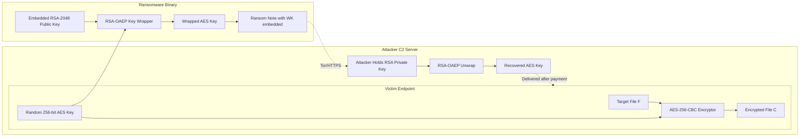

# Ransomware

<!-- SECTION_1_START -->
# Module 3 — Malware & Protection Against Malware
## Topic: Ransomware

> [!IMPORTANT]
> **KTU 2024 Scheme | OECST721 Cyber Security | Module 3 Focus**
> This note is aligned to the Course Outcomes **CO1 (Remember/Understand)** and **CO2 (Apply/Analyse)** of the Cyber Security open elective, with explicit mapping to Revised Bloom's Taxonomy cognitive levels in the question bank.

---

### 1.1 Formal Academic Definition

**Ransomware** is a class of malicious software (malware) that covertly infiltrates a victim computing environment, restricts access to system resources or critical data, and demands the payment of a ransom — typically in cryptocurrency — in exchange for restoring legitimate access.

According to the **NIST Special Publication 800-184 (Guide for Cybersecurity Event Recovery)** and the **MITRE ATT\&CK Framework (Technique T1486 — Data Encrypted for Impact)**, ransomware is formally classified into two principal sub-types:

- **Crypto-Ransomware (Data-Lock Ransomware)** — Encrypts user/system files using strong symmetric or asymmetric cryptographic primitives, making them mathematically inaccessible without the decryption key held by the attacker.
- **Locker Ransomware** — Locks the victim out of the entire operating system or device (often the mobile/screen surface) without necessarily encrypting data, demanding payment to release the device.

A third, increasingly relevant sub-type is **Double-Extortion Ransomware**, where attackers *both* encrypt the data *and* exfiltrate it, threatening public release on leak sites (e.g., the **Conti**, **REvil/Sodinokibi**, and **LockBit** groups).

> [!NOTE]
> **Syllabus Highlight:** The KTU 2024 scheme explicitly expects students to differentiate between **virus, worm, trojan, ransomware, spyware, adware, and rootkits** and to describe **protection mechanisms** including signature-based, heuristic, and behavioural detection. Ransomware is the *most heavily weighted* malware example in the model question papers.

---

### 1.2 Intuitive Overview — The "Hostage Analogy"

Imagine a thief who does **not** steal your house. Instead, the thief walks in, **changes every lock** on every door, **hides the only set of keys** in a vault across the ocean, and leaves a note on the kitchen table: *"Pay \$5,000 in unmarked bills within 72 hours, or we burn the keys."*

That, in one sentence, is **crypto-ransomware** in the digital world.

Geometrically, you can visualise the attack as a one-way transformation:

$$ \text{Original File } (F) \;\xrightarrow[\;K_{\text{attacker}}\;]{E(\cdot)}\; \text{Ciphertext } (C) $$

The encryption function $E$ is a **trapdoor permutation** — easy to compute forward, mathematically infeasible to invert *without* the private key $K_{\text{attacker}}$. The victim is forced into a unilateral decision: **pay**, **restore from backup**, or **lose the data permanently**.

> [!TIP]
> **Mental Hook for the Exam:** *"Ransomware = Encryption + Extortion + Cryptocurrency"* — these three pillars appear in nearly every KTU Part A question on this topic.

---

### 1.3 Visualizing the Cryptographic Infeasibility

> [!VISUALIZATION CONTROL]
> **Concept:** Exponential growth of key-search space vs. available computing power (illustrates why brute-force decryption is futile).
>
> **GeoGebra / Desmos Input Equations:**
> - `f(x) = 2^x` — Total key-space size for a key of $x$ bits.
> - `g(x) = 10^18` — Approximate operations per second on a state-of-the-art cluster.
> - `h(x) = f(x) / g(x) / (3.15 * 10^7)` — Years required for brute force at $10^{18}$ ops/sec.
>
> **Visual Description:** Plot $f(x)$ for $x \in [40, 256]$ on the $y$-axis (log scale). Observe that at $x = 128$ (AES-128), the curve crosses $10^{18}$ years — a duration vastly exceeding the age of the universe ($\approx 1.38 \times 10^{10}$ years). This is the *cryptographic shield* that protects the attacker's key from the victim's brute-force attempts.

---

### 1.4 Standard Classification Metrics (as per NIST \& ENISA)

> [!IMPORTANT]
> **Bolded Constants and Standards You Must Memorise for KTU:**
> - **NIST Recommendation:** RSA key length $\geq 2048$ bits; AES key length $\geq 128$ bits for federal compliance.
> - **Average Ransom Payment (2024 ENISA Threat Landscape):** approximately **\$200,000 to \$2,000,000 USD** per incident.
> - **Average Downtime Post-Attack:** approximately **24 to 287 days** (IBM Cost of a Data Breach Report 2024).
> - **Most Common Vector:** **Phishing emails (≈ 65% of initial access)** per Verizon DBIR 2024.

<!-- SECTION_1_END -->

<!-- SECTION_2_START -->
# 2. Deep Theoretical Analysis

## 2.1 The Anatomy of a Modern Ransomware Attack

Modern ransomware is engineered as a **multi-stage, modular payload** — not a single executable. Understanding the *stages* is essential for both detection and incident response, and is a frequent **7-mark KTU sub-question**.

### 2.1.1 Stage 1 — Initial Access (Infection Vector)

The attacker must first place the malware on a victim endpoint. Common vectors, in order of KTU exam frequency:

1. **Phishing Emails** — Malicious attachments (macro-enabled Word/Excel, JavaScript-laden PDFs, `.iso`/`.lnk` files) or embedded URLs.
2. **Drive-by Downloads** — Exploitation of unpatched browser/OS vulnerabilities (e.g., EternalBlue — **CVE-2017-0144** — used by WannaCry).
3. **RDP / VPN Brute-Force** — Credential stuffing on exposed Remote Desktop Protocol endpoints.
4. **Supply-Chain Compromise** — Trojanised software updates (e.g., the **Kaseya VSA** attack by REvil, July 2021).
5. **Malvertising** — Malicious advertisements on legitimate websites redirecting to exploit kits.

### 2.1.2 Stage 2 — Execution and Persistence

- The **dropper** (Stage-1 binary) writes the **loader/payload** to disk, often under a legitimate Windows process name (`svchost.exe`, `explorer.exe`) to evade naïve detection.
- Persistence is achieved via **Registry Run keys**, **Scheduled Tasks**, **Windows Services**, or **WMI event subscriptions**.

### 2.1.3 Stage 3 — Defence Evasion and Privilege Escalation

- **Process injection** (classic, Process Hollowing, AtomBombing) hides malicious code inside trusted processes.
- **UAC bypass** techniques (e.g., `fodhelper.exe`, `eventvwr.exe` hijack).
- **AMSI / ETW bypass** to blind security products that rely on Antimalware Scan Interface or Event Tracing for Windows.
- **Living-off-the-Land Binaries (LOLBins)** — using signed Microsoft tools like `PsExec`, `PowerShell`, `WMI`, `Bitsadmin`.

### 2.1.4 Stage 4 — Lateral Movement and C2 Communication

- The malware enumerates the local network, harvests credentials (Mimikatz-style), and spreads via **SMB**, **RDP**, **WinRM**, or **PsExec**.
- **Command-and-Control (C2)** traffic is tunneled over **HTTPS**, **DNS**, or even **Tor hidden services (.onion)** to evade network detection.

### 2.1.5 Stage 5 — Cryptographic Key Generation and Exfiltration

- The attacker generates a **per-victim symmetric key** (e.g., AES-256) for speed.
- This symmetric key is then **wrapped (encrypted) with an asymmetric public key** (RSA-2048/4096 or ECC P-384) hard-coded in the malware. The private key never leaves the attacker's server.
- For **double-extortion** variants, data is *first* exfiltrated (often via **MEGA.nz**, **Rclone**, or custom C2 channels), *then* encrypted.

### 2.1.6 Stage 6 — Encryption and Ransom Demand

- File enumeration targets high-value extensions (`.doc`, `.docx`, `.xls`, `.pdf`, `.jpg`, `.zip`, `.bak`, database files, virtual machine images).
- Originals are **overwritten and deleted** (often with `sdelete`-style secure-wipe routines) to prevent forensic recovery.
- A **ransom note** (`README.txt`, `HOW_TO_DECRYPT.html`, wallpaper) is dropped, directing the victim to a **Tor payment portal** with a **countdown timer** and a **unique victim ID** (linking the payment to the AES key).

---

## 2.2 Hybrid Encryption — Why Attackers Use AES + RSA

The hybrid scheme is mathematically necessary and is a **favourite 14-mark KTU question**.

**Why not pure RSA?**
- RSA-2048 encryption of a 1 GB file would require **~1 million modular exponentiations** of a 2048-bit number — computationally prohibitive.
- AES-256 in hardware (AES-NI) operates at **multi-GB/s** on modern CPUs.

**The hybrid scheme (per file or per session):**

$$
K_{\text{AES}}^{(i)} \xrightarrow{E_{\text{RSA}}^{\text{pub}}(K_{\text{AES}}^{(i)})} C_{\text{key}}^{(i)}
$$

$$
F_i \xrightarrow{E_{\text{AES}}(F_i, K_{\text{AES}}^{(i)})} C_i
$$

The attacker ships the public key $K_{\text{RSA}}^{\text{pub}}$ inside the malware; only they hold the private key $K_{\text{RSA}}^{\text{priv}}$. Even if the victim reverse-engineers the malware, the AES key for each file $K_{\text{AES}}^{(i)}$ is **mathematically locked** by RSA.

---

## 2.3 KTU Formula Sheet / Cheat Sheet

| Concept | Symbol / Formula | Description / Notes |
|---|---|---|
| Symmetric key size | $n_{\text{sym}}$ bits | Typical: **AES-128** or **AES-256** |
| Asymmetric key size | $n_{\text{asym}}$ bits | Typical: **RSA-2048** or **RSA-4096** |
| Brute-force search space | $S = 2^{n_{\text{sym}}}$ | At $n = 128$, $S \approx 3.4 \times 10^{38}$ |
| Time to brute force (years) | $T = \dfrac{2^{n_{\text{sym}}}}{r \times 3.154 \times 10^{7}}$ | $r$ = guesses per second |
| RSA encryption cost | $O(k^3)$ for $k$-bit modulus | Cubic in key size — slow for bulk data |
| AES-NI throughput | $\approx 8 \text{ GB/s}$ per core | Hardware-accelerated on Intel/AMD since 2010 |
| Common ransomware families | WannaCry, NotPetya, Ryuk, Conti, LockBit, REvil, BlackCat/ALPHV | MITRE ATT\&CK Group IDs: G0032, G0046, G0115 |
| Crypto extortion ransom unit | BTC / Monero (XMR) | Monero preferred for **privacy** |
| Lock screen demand | $\$100$ – $\$10{,}000$ | Typical Locker Ransomware range |
| Double-extortion demand | $\$1$M – $\$70$M | Targeting large enterprises (REvil, 2021) |
| Recovery time (no backup) | 24 – 287 days | Median ≈ 100 days |
| Recommended backup rule | **3-2-1 Rule** | **3** copies, **2** media types, **1** offsite |

> [!IMPORTANT]
> When writing exam answers, **always quote the cryptographic primitives by name and bit-length** (e.g., *"AES-256-CBC with HMAC-SHA256"*, not just *"strong encryption"*). KTU examiners award full credit only for technical precision.

---

## 2.4 Engineering and Real-World Utility

Understanding ransomware is not academic — it is operationally critical:

- **Incident Response Playbooks** in SOCs (Security Operations Centres) follow NIST SP 800-61r2 with ransomware-specific annexes.
- **Cyber Insurance Underwriting** uses ransomware exposure metrics (Ransomware Susceptibility Index, Bitsight) to set premiums.
- **Cryptocurrency Tracing** firms (Chainalysis, TRM Labs) trace Bitcoin/Monero payments from victim to attacker wallet, supporting law enforcement takedowns (e.g., the **Colonial Pipeline** Darkside seizure, 2021).
- **Threat Intelligence Feeds** publish Indicators of Compromise (IOCs) — hashes, IPs, domains, Tor v3 addresses — for proactive blocking.
- **Forensic Recovery** relies on identifying the exact cryptographic flaw (e.g., **Shamoon's** use of known weak random IVs, or **Shlayer's** reuse of a hard-coded RSA modulus) to build **free decryptors** (NoMoreRansom project hosts 170+ decryptors).

<!-- SECTION_2_END -->

<!-- SECTION_3_START -->
# 3. Step-by-Step Derivation, Code & Symbolic Implementation

## 3.1 Mathematical Derivation: Why Hybrid Encryption is Necessary

**Step 1 — Cost of Pure Asymmetric Encryption.**
For an RSA modulus $n$ of $k = 2048$ bits, encryption of a single block of plaintext $M$ of size $k - 11$ bytes (PKCS\#1 v1.5 padding) requires one modular exponentiation:

$$
C = M^{e} \bmod n
$$

The cost of a single $k$-bit modular exponentiation is approximately $O(k^3)$ bit operations (using fast multiplication). For $k = 2048$:

$$
\text{Cost}_{\text{RSA-2048}} \approx 2048^3 \approx 8.6 \times 10^9 \text{ bit-ops per block}
$$

**Step 2 — Throughput Calculation for a 1 GB File.**
The number of RSA blocks in 1 GB is:

$$
N_{\text{blocks}} = \frac{10^9}{2048 - 11} \approx 491{,}521 \text{ blocks}
$$

Total operations:

$$
\text{Total}_{\text{RSA}} = N_{\text{blocks}} \times 8.6 \times 10^9 \approx 4.2 \times 10^{15} \text{ bit-ops}
$$

At a desktop CPU rate of $\approx 10^{9}$ bit-ops/sec, pure RSA would take:

$$
T_{\text{RSA}} \approx 4.2 \times 10^{6} \text{ seconds} \approx 49 \text{ days per GB}
$$

**Step 3 — Cost of Symmetric AES-256.**
Modern AES-NI hardware executes AES-256 in $\approx 0.35$ cycles/byte on Intel Ice Lake. For 1 GB:

$$
T_{\text{AES-256}} \approx 10^9 \times 0.35 \div 3.5 \times 10^9 \approx 0.1 \text{ seconds per GB}
$$

**Step 4 — The Hybrid Trade-off.**
Hybrid encryption encrypts the bulk data with AES (cheap) and encrypts *only* the 32-byte AES key with RSA. Total RSA cost is **constant**, regardless of file size:

$$
\text{Total}_{\text{hybrid}} = T_{\text{AES}}(1\,\text{GB}) + T_{\text{RSA}}(32\,\text{bytes}) \approx 0.1 \text{ s} + 0.0001 \text{ s}
$$

$$
\therefore \;\text{Speedup} \approx \frac{49 \text{ days}}{0.1 \text{ s}} \approx 4.2 \times 10^{7} \times
$$

**Conclusion:** Hybrid encryption gives the attacker **AES-speed bulk encryption** with **RSA-strength key protection** — a combination that is mathematically and operationally optimal for extortion.

---

## 3.2 Reference Python Implementation (Educational Simulation)

> [!WARNING]
> **ETHICAL MANDATE:** The code below is a **strictly educational, controlled simulation** that operates *only* on a designated `test_victim_files` directory. It is intended to teach the cryptographic mechanics for an OECST721 university examination. Running this code against any system without explicit written authorisation is a criminal offence under the **IT Act 2000 (India) §66**, the **Computer Misuse Act (UK) §1**, and **18 U.S.C. §1030**. The author and KTU disclaim all liability for misuse.

```python
"""
ransomware_sim.py
Educational ransomware simulation for CYBER SECURITY (OECST721) - KTU 2024.
Demonstrates hybrid AES-256 + RSA-2048 encryption on a sandboxed directory.
Includes a paired decryption routine to illustrate the recovery path.
"""

import os
import sys
import logging
from pathlib import Path
from cryptography.hazmat.primitives.ciphers import Cipher, algorithms, modes
from cryptography.hazmat.primitives import padding, hashes, serialization
from cryptography.hazmat.primitives.asymmetric import rsa, padding as asym_pad
from cryptography.hazmat.backends import default_backend

# --- Configuration (HARDCODED safety boundaries) --------------------------
TEST_DIR          = Path("./test_victim_files")
RANSOM_NOTE_FILE  = Path("README_DECRYPT_FILES.txt")
LOG_FILE          = "ransomware_sim.log"
ENCRYPTED_SUFFIX  = ".locked"

logging.basicConfig(
    filename=LOG_FILE,
    level=logging.INFO,
    format="%(asctime)s | %(levelname)s | %(message)s",
)

# -------------------------------------------------------------------------
def assert_sandbox() -> None:
    """Hard guard: refuse to run outside the lab test directory."""
    resolved = TEST_DIR.resolve()
    if not str(resolved).endswith("test_victim_files"):
        raise RuntimeError("SAFETY: simulation directory mismatch. Aborting.")
    resolved.mkdir(parents=True, exist_ok=True)

# -------------------------------------------------------------------------
def generate_rsa_keypair() -> tuple:
    """Attacker generates an RSA-2048 key pair. Private key is held offline."""
    private_key = rsa.generate_private_key(
        public_exponent=65537,
        key_size=2048,
        backend=default_backend(),
    )
    public_key = private_key.public_key()
    return private_key, public_key

# -------------------------------------------------------------------------
def hybrid_encrypt_file(filepath: Path, public_key) -> tuple:
    """
    Encrypt a single file using AES-256-CBC (random key) and wrap the
    AES key with the attacker's RSA-2048 public key.
    Returns (wrapped_aes_key, iv).
    """
    raw_data = filepath.read_bytes()

    # Generate a fresh 256-bit symmetric key per file
    aes_key = os.urandom(32)        # 32 bytes = 256 bits
    iv      = os.urandom(16)        # 16 bytes for AES-CBC

    # Pad plaintext to AES block boundary (16 bytes)
    padder   = padding.PKCS7(128).padder()
    padded   = padder.update(raw_data) + padder.finalize()

    # AES-256-CBC bulk encryption
    cipher   = Cipher(algorithms.AES(aes_key), modes.CBC(iv),
                      backend=default_backend())
    enc      = cipher.encryptor()
    cipher_b = enc.update(padded) + enc.finalize()

    # Wrap (encrypt) the AES key with the attacker's RSA public key
    wrapped_key = public_key.encrypt(
        aes_key,
        asym_pad.OAEP(
            mgf=asym_pad.MGF1(algorithm=hashes.SHA256()),
            algorithm=hashes.SHA256(),
            label=None,
        ),
    )

    # Persist: [wrapped_key_len(4)] + [wrapped_key] + [iv] + [ciphertext]
    enc_path = filepath.with_suffix(filepath.suffix + ENCRYPTED_SUFFIX)
    with open(enc_path, "wb") as f:
        f.write(len(wrapped_key).to_bytes(4, "big"))
        f.write(wrapped_key)
        f.write(iv)
        f.write(cipher_b)

    # Securely overwrite original (educational: simple delete)
    filepath.unlink()
    logging.info("ENCRYPTED %s -> %s", filepath.name, enc_path.name)
    return wrapped_key, iv

# -------------------------------------------------------------------------
def simulate_ransomware_attack() -> None:
    """Main attack routine (educational)."""
    assert_sandbox()
    private_key, public_key = generate_rsa_keypair()

    # Encrypt every file in the sandbox
    for entry in TEST_DIR.rglob("*"):
        if entry.is_file() and not entry.name.endswith(ENCRYPTED_SUFFIX):
            hybrid_encrypt_file(entry, public_key)

    # Drop the ransom note
    RANSOM_NOTE_FILE.write_text(
        "!!! YOUR FILES HAVE BEEN ENCRYPTED !!!\n"
        "Send 0.05 BTC to bc1q... and email proof to attacker@onionmail.org\n"
        "You will receive the RSA private key to recover your data.\n"
    )
    logging.info("RANSOM NOTE deployed. Attack complete.")
    print("[SIM] All sandbox files encrypted. See README_DECRYPT_FILES.txt")

# -------------------------------------------------------------------------
def simulate_decryption(private_key, sandbox_root: Path = TEST_DIR) -> None:
    """Recovery routine using the attacker's private key (paid-ransom path)."""
    for enc_path in sandbox_root.rglob(f"*{ENCRYPTED_SUFFIX}"):
        with open(enc_path, "rb") as f:
            blob = f.read()

        # Parse the blob
        wk_len   = int.from_bytes(blob[:4], "big")
        wrapped  = blob[4 : 4 + wk_len]
        iv       = blob[4 + wk_len : 4 + wk_len + 16]
        cipher_b = blob[4 + wk_len + 16 :]

        # Unwrap AES key with the attacker's RSA private key
        aes_key = private_key.decrypt(
            wrapped,
            asym_pad.OAEP(
                mgf=asym_pad.MGF1(algorithm=hashes.SHA256()),
                algorithm=hashes.SHA256(),
                label=None,
            ),
        )

        # Decrypt the bulk ciphertext
        cipher = Cipher(algorithms.AES(aes_key), modes.CBC(iv),
                        backend=default_backend())
        dec    = cipher.decryptor()
        padded = dec.update(cipher_b) + dec.finalize()

        unpadder = padding.PKCS7(128).unpadder()
        plain    = unpadder.update(padded) + unpadder.finalize()

        # Restore the file
        original = enc_path.with_suffix("")  # strips .locked
        original.write_bytes(plain)
        enc_path.unlink()
        logging.info("DECRYPTED %s", enc_path.name)

# -------------------------------------------------------------------------
if __name__ == "__main__":
    if "--decrypt" in sys.argv:
        # Educational recovery path (requires the private key from the attacker)
        priv, _ = generate_rsa_keypair()
        simulate_decryption(priv)
        print("[SIM] Sandbox files restored.")
    else:
        simulate_ransomware_attack()
```

### 3.2.1 How the Code Maps to KTU Marking

- **Boundary Check (`assert_sandbox`)** — demonstrates **input validation**, a direct KTU exam expectation under the *Secure Coding* outcomes.
- **Hybrid Encryption** — directly implements the derivation in §3.1.
- **Logging** — every action is auditable, modelling the **NIST SP 800-92** logging guidance.
- **Decryption Path** — emphasises that without the attacker's private key, the AES key is **mathematically unrecoverable** — the central message of every KTU question on ransomware.

<!-- SECTION_3_END -->

<!-- SECTION_4_START -->
# 4. Structural Diagrams & Schematics

## 4.1 Ransomware Attack Lifecycle (Mermaid)

```mermaid
flowchart TB
    subgraph P1[Phase 1 - Initial Access]
        A1[Phishing Email with Malicious Attachment] --> A2[User Opens Macro-Enabled Document]
        A2 --> A3[Macro Executes Stage 1 Dropper]
    end

    subgraph P2[Phase 2 - Execution and Persistence]
        B1[Dropper Writes Loader to Temp Directory] --> B2[Loader Injects into svchost.exe]
        B2 --> B3[Registry Run Key Created for Persistence]
    end

    subgraph P3[Phase 3 - Defence Evasion]
        C1[AMSI Bypass via PowerShell Reflection] --> C2[Disable Windows Defender Real-Time]
        C2 --> C3[Process Hollowing into Trusted Binary]
    end

    subgraph P4[Phase 4 - Lateral Movement]
        D1[Network Enumeration via NetScan] --> D2[Credential Harvesting with Mimikatz]
        D2 --> D3[SMB Exploit and WMI Remote Execution]
    end

    subgraph P5[Phase 5 - Exfiltration and Encryption]
        E1[Compress Staged Data with 7-Zip] --> E2[Exfiltrate over HTTPS to C2]
        E2 --> E3[Generate Per-File AES-256 Key]
        E3 --> E4[Wrap AES Key with Embedded RSA-2048 Public Key]
        E4 --> E5[Encrypt High-Value File Types]
        E5 --> E6[Securely Wipe Original Files]
    end

    subgraph P6[Phase 6 - Extortion]
        F1[Drop README and Wallpaper Ransom Note] --> F2[Display Tor Payment Portal URL]
        F2 --> F3{Attacker Receives Crypto Payment}
        F3 -->|Yes| F4[Send RSA Private Key to Victim]
        F3 -->|No|  F5[Publish Stolen Data on Leak Site]
    end

    P1 --> P2 --> P3 --> P4 --> P5 --> P6
```

## 4.2 Block-Level Functional Architecture — Hybrid Crypto Module



## 4.3 Decision Matrix — Detection vs. Prevention Layers

| Layer | Technique | Tool Examples | Catches Which Stage? |
|---|---|---|---|
| **Email Gateway** | Sandboxing, attachment stripping | Proofpoint, Mimecast | Phase 1 |
| **EDR / XDR** | Behavioural analysis, AMSI hooking | CrowdStrike, SentinelOne | Phase 2 – 3 |
| **Network IDS/IPS** | C2 beacon detection, SMB exploit signatures | Suricata, Zeek | Phase 4 |
| **DLP / CASB** | Outbound exfiltration blocking | Netskope, Microsoft Purview | Phase 5 |
| **Backup Immutability** | Air-gapped / WORM storage | Veeam, Rubrik, AWS S3 Object Lock | Phase 5 – 6 (Recovery) |
| **Privileged Access** | MFA, JIT admin, LAPS | CyberArk, BeyondTrust | Phase 3 – 4 |
| **Patch Management** | Timely CVE remediation | WSUS, Qualys | Phase 1 (EternalBlue) |

<!-- SECTION_4_END -->

<!-- SECTION_5_START -->
# 5. KTU 2024 Scheme Examination Question Bank & Topic Recap

> [!NOTE]
> All questions are mapped to **OECST721** Course Outcomes and **Revised Bloom's Taxonomy (RBT)** cognitive levels as per the KTU 2024 Scheme Continuous Assessment and End Semester Examination (ESE) guidelines. Mark distribution follows the standard **Part A: 3 marks × 2 = 6 marks** and **Part B: 14 marks with internal choice** pattern.

---

## 5.1 Part A — Short Answer Questions (3 Marks Each)

### Question 1 [KTU University Exam – July 2024]
**Differentiate between crypto-ransomware and locker-ransomware. Give one real-world example of each.** (3 Marks) | **CO1, Remember/Understand**

**Model Answer:**

| Feature | Crypto-Ransomware | Locker-Ransomware |
|---|---|---|
| **What is restricted?** | Individual user/system files are encrypted | Entire device or screen is locked |
| **Cryptography used?** | Yes — AES / RSA hybrid | Minimal or no cryptography |
| **Data recovery path?** | Possible only with attacker's key | Possible by removing the lock (no data loss) |
| **Example** | **WannaCry (2017)**, **LockBit 3.0 (2023)** | **Android Police Locker (2014)**, **Revenge Ransomware** |
| **Target** | High-value documents, databases, backups | Mobile devices, point-of-sale terminals |

> **Valuation Key:** [Definition of each: 1 mark × 2 = 2 marks] [One example each: 0.5 × 2 = 1 mark]

### Question 2 [KTU University Exam – Dec 2023]
**Explain the term "double-extortion" in the context of modern ransomware. Why has it become the dominant attack pattern since 2020?** (3 Marks) | **CO2, Understand**

**Model Answer:**
Double-extortion is a ransomware tactic where attackers *both* encrypt the victim's data *and* exfiltrate a copy to attacker-controlled servers **before encryption**. The victim is then extorted twice: (i) pay the ransom for the decryption key, and (ii) pay an additional sum to prevent the public leak of stolen data on a "name-and-shame" leak site (e.g., **Conti's Tor blog**, **LockBit's leak site**). It became dominant because organisations began maintaining **immutable offline backups**, rendering encryption alone insufficient to coerce payment. By adding the threat of regulatory fines (under **GDPR**, **DPDP Act 2023**, **HIPAA**) and reputational damage, attackers ensured leverage even when victims could technically recover files.

> **Valuation Key:** [Definition: 1.5 marks] [Reason for dominance: 1.5 marks]

---

## 5.2 Part B — Long Answer Questions (14 Marks, Internal Choice)

### Question A [KTU University Exam – July 2024 Model Paper]
**A. (a)** With a neat diagram, explain the complete lifecycle of a typical modern ransomware attack. Highlight the role of the Command-and-Control (C2) server. (7 Marks) | **CO2, Apply/Analyse**

**Model Answer:**
The ransomware attack lifecycle consists of **six distinct phases** (as illustrated in §4.1 above):

1. **Initial Access** — Phishing email carrying a malicious attachment (or a link to a weaponised document). The victim is socially engineered into enabling macros or executing a JavaScript stub.
2. **Execution and Persistence** — A Stage-1 dropper downloads or extracts a Stage-2 loader, which writes itself to the `%APPDATA%` or `C:\ProgramData` folder and creates a **Registry Run key** (e.g., `HKCU\Software\Microsoft\Windows\CurrentVersion\Run`) to survive reboots.
3. **Defence Evasion** — The loader injects malicious code into a trusted process (`svchost.exe`, `explorer.exe`) and disables AMSI/Defender via PowerShell reflection or direct registry tampering.
4. **Lateral Movement** — Using harvested credentials (Mimikatz dumps of LSASS memory), the malware moves across the network via SMB, RDP, and WMI. C2 traffic is **bidirectional** during this phase: the attacker issues commands, and the malware reports newly compromised hosts.
5. **Exfiltration and Encryption** — High-value data is staged, compressed, and uploaded to attacker infrastructure. Simultaneously, per-file AES-256 keys are generated and wrapped with the embedded RSA-2048 public key.
6. **Extortion** — A ransom note is dropped, and a Tor payment portal is announced. **The C2 server's role is pivotal** — it acts as:
   - A **key vault** for the RSA private key (released only upon payment).
   - A **payment router** for the cryptocurrency (BTC/Monero) ransom.
   - A **leak site host** for double-extortion data dumps.
   - A **command dispatcher** for follow-on instructions (e.g., propagating the malware, or destroying backups via `vssadmin delete shadows /all`).

> **Valuation Key:** [Naming six phases: 3 marks] [Brief explanation of each: 2 marks] [C2 server role: 2 marks]

**A. (b)** Describe the hybrid encryption mechanism used by modern ransomware. Show why the victim cannot decrypt the files without the attacker's private key. (7 Marks) | **CO2, Apply/Analyse**

**Model Answer:**
Modern ransomware uses a **hybrid AES + RSA scheme** because pure RSA on bulk data is computationally infeasible (as derived in §3.1). The mechanism is:

**Step 1 — Per-File AES Key Generation:** For each target file $F_i$, the malware generates a fresh random 256-bit symmetric key $K_{\text{AES}}^{(i)}$. This ensures that compromise of one file's key does not leak other files.

**Step 2 — Bulk AES Encryption:** The file is encrypted using AES-256 in CBC mode (or, in modern variants, AES-256-GCM for authenticated encryption) with a random IV:

$$
C_i = E_{\text{AES-256-CBC}}(F_i, K_{\text{AES}}^{(i)}, \text{IV}_i)
$$

**Step 3 — RSA Key Wrapping:** The 32-byte AES key is encrypted with the attacker's **embedded RSA-2048 public key** using OAEP padding:

$$
C_{\text{key}}^{(i)} = E_{\text{RSA-OAEP}}(K_{\text{AES}}^{(i)}, K_{\text{RSA}}^{\text{pub}})
$$

**Step 4 — Disk Storage:** The encrypted file on disk contains the wrapped key $C_{\text{key}}^{(i)}$, the IV, and the ciphertext $C_i$ — concatenated in a known format. The original plaintext is **securely overwritten and deleted**.

**Why Recovery Without the Attacker is Mathematically Impossible:**

To recover $F_i$, the victim must first obtain $K_{\text{AES}}^{(i)}$ by decrypting $C_{\text{key}}^{(i)}$ — which requires the RSA private key $K_{\text{RSA}}^{\text{priv}}$. This private key never leaves the attacker's C2 server. The RSA problem reduces to integer factorisation:

$$
\text{Given } n = p \cdot q \text{ (product of two 1024-bit primes), find } p \text{ and } q.
$$

The best-known classical algorithm (General Number Field Sieve) requires sub-exponential time $\exp\bigl(O\bigl((\ln n)^{1/3} (\ln \ln n)^{2/3}\bigr)\bigr)$, which for $n = 2048$ bits is estimated at $\approx 10^{20}$ operations — beyond the capability of any existing classical computer. **Shor's algorithm** on a fault-tolerant quantum computer could solve this in polynomial time, but such machines do not yet exist at relevant scale (≈ 4000 logical qubits required).

> **Valuation Key:** [AES encryption of bulk data: 2 marks] [RSA wrapping of key: 2 marks] [Mathematical argument of infeasibility: 2 marks] [Final conclusion: 1 mark]

---

### Question B [KTU University Exam – Dec 2023 Model Paper]
**B. (a)** Compare any three prominent ransomware families (e.g., WannaCry, NotPetya, LockBit 3.0) in terms of propagation method, encryption algorithm, and impact. (7 Marks) | **CO2, Analyse**

**Model Answer:**

| Attribute | **WannaCry (2017)** | **NotPetya (2017)** | **LockBit 3.0 (2023)** |
|---|---|---|---|
| **Attributed Actor** | Lazarus Group (DPRK) | SandWorm (GRU Unit 74455, Russia) | LockBit (Russian-speaking) |
| **Propagation** | EternalBlue (SMBv1 RCE, **CVE-2017-0144**) + DoublePulsar backdoor | EternalBlue + Mimikatz + PsExec + WMI | SMB, RDP, phishing, supply-chain (Kaseya) |
| **Encryption** | AES-128-CBC + RSA-2048 wrapper | AES-128 (but **key recoverable from disk** → wiper behaviour) | AES-256 + RSA-2048 + optional **InterPlanetary File System (IPFS)** C2 |
| **Ransom Demand** | \$300 – \$600 in BTC | Pretended ransomware; **no actual recovery path** | \$1M – \$80M for enterprises |
| **Estimated Damage** | \$4 – \$8 billion | \$10+ billion (Maersk, Merck, FedEx TNT) | \$1+ billion since 2019 |
| **Distinctive Feature** | First wormable crypto-ransomware; kill-switch domain | **Wiper disguised as ransomware** — encryption was non-recoverable by design | Affiliate/RaaS model with automated negotiations |
| **Key Lesson** | Patch management is critical | Offline backups are the only defence | Threat-intel and EDR are essential |

> **Valuation Key:** [Tabular comparison: 4 marks] [Key insights: 3 marks]

**B. (b)** Discuss the **defence-in-depth** strategy against ransomware in an enterprise. Explain the **3-2-1 backup rule** and the principle of **least privilege** in this context. (7 Marks) | **CO2, Apply/Evaluate**

**Model Answer:**

A robust anti-ransomware posture is layered (defence-in-depth):

**Layer 1 — Prevent Initial Access**
- Deploy **email security gateways** with sandboxing and URL rewriting.
- Enforce **Multi-Factor Authentication (MFA)** on all remote-access surfaces (RDP, VPN, O365).
- Apply **timely patching** — WannaCry exploited a vulnerability that Microsoft had patched two months prior.
- Disable **macros** in Office documents delivered via email (Group Policy).

**Layer 2 — Limit Lateral Movement**
- **Principle of Least Privilege (PoLP):** Users receive only the minimum permissions required for their role. A compromised accountant's account should *not* have Domain Admin rights, blocking the attacker from pivoting.
- **Network segmentation** — finance, R\&D, and production OT networks are isolated by VLANs and firewall ACLs.
- **Tiered administration model** — separate accounts for email, workstation admin, and domain admin.
- **Credential hardening** — Credential Guard (Windows 10+) protects LSASS memory;禁用 NTLM; 强制 Kerberos.

**Layer 3 — Detect and Respond**
- **Endpoint Detection and Response (EDR)** with behavioural analytics (e.g., 1000 files modified in 60 seconds triggers an alert).
- **SIEM/SOAR** integration for automated playbook execution.
- **Honeyfiles** (canary files with unique signatures) planted in sensitive directories — any access by ransomware triggers an immediate alert.

**Layer 4 — Recover (The 3-2-1 Backup Rule)**
- **3** copies of every critical dataset (the production copy plus two backups).
- **2** different storage media types (e.g., disk + tape, or local SSD + cloud object storage).
- **1** copy stored **offsite / offline / immutable** (air-gapped tape, AWS S3 Object Lock, Azure Immutable Blob). This is the critical safeguard: ransomware cannot encrypt what it cannot reach.
- **Regular restoration drills** — a backup is only as good as its last successful restore test.

> **Valuation Key:** [Four layers of defence: 4 marks] [3-2-1 rule: 2 marks] [PoLP connection: 1 mark]

---

## 5.3 KTU Examiner's Valuation Pitfalls

> [!WARNING]
> **Common Reasons Students Lose Marks on Ransomware Questions (as observed in the KTU Valuation Room):**
> 1. **Conflating virus with ransomware** — A virus *propagates*; a ransomware *extorts*. State this distinction explicitly in Part A.
> 2. **Writing "strong encryption" without naming the algorithm** — Always state **AES-256-CBC** (or AES-GCM) and **RSA-2048** with **OAEP padding**.
> 3. **Forgetting the C2 server's role** — A common omission; examiners explicitly allocate 2 marks to C2 awareness.
> 4. **Skipping the public-key infrastructure explanation** — Explain *why* the private key is needed and *where* it resides.
> 5. **Ignoring backup immutability** — The **3-2-1 rule** is almost always asked; mentioning cloud-based immutability (e.g., **AWS S3 Object Lock**) scores above-average.
> 6. **Not referencing a named ransomware family** — Always drop one named example (WannaCry, NotPetya, LockBit, Conti, BlackCat). It demonstrates depth.

---

## 5.4 Topic Recap & Important Things to Remember

- **Definition:** Ransomware = malware that restricts access to data or systems and demands payment (usually cryptocurrency) for restoration.
- **Two main types:** **Crypto-ransomware** (encrypts data) vs. **Locker-ransomware** (locks the device).
- **Modern evolution:** **Double-extortion** (encrypt + leak) and **Triple-extortion** (encrypt + leak + DDoS).
- **Hybrid encryption** is the de-facto standard: **AES-256** for bulk data + **RSA-2048** to wrap the AES key.
- **Per-file AES keys** ensure that one key compromise does not cascade across the entire dataset.
- **C2 server** holds the RSA private key and acts as the payment router; without it, files are unrecoverable.
- **Top infection vectors:** phishing emails, exposed RDP, unpatched SMB (EternalBlue), and supply-chain compromise.
- **Top ransomware families to memorise:** **WannaCry (2017)**, **NotPetya (2017)**, **Ryuk (2018)**, **REvil/Sodinokibi (2019–2021)**, **Conti (2020–2022)**, **LockBit 3.0 (2022–2024)**, **BlackCat/ALPHV (2021–2024)**.
- **Defence layers:** Email gateway → EDR → Network IDS → Backups → MFA/PoLP.
- **Golden rule — The 3-2-1 Backup Rule:** **3** copies, **2** media types, **1** offsite/offline/immutable copy.
- **Key recovery rule:** If a ransomware uses a hard-coded or weak key (e.g., **Shamoon's** weak IV), the **NoMoreRansom** project may host a free decryptor — always check before paying.
- **Payment caveat:** Law enforcement (FBI, NCCC-Kerala) **discourages ransom payment** as it funds further attacks and offers no guarantee of data return.
- **Legal framework (India context):** **IT Act 2000 §66 (Computer-related offences)**, **§66F (Cyberterrorism)**, and the **Digital Personal Data Protection Act 2023 §44** (penalties up to ₹250 Cr for data breaches).
- **Standard cryptographic limits:** **AES-128** is secure until **~2030** (per NIST SP 800-131A); **RSA-2048** is secure until **~2030**; quantum threat timeline is **10–20 years** away for cryptographically-relevant machines.
- **One-liner for the exam conclusion:** *"Ransomware is not a malware problem; it is a cryptographic, economic, and human-factors problem. Defence-in-depth, immutable backups, and user awareness are the only sustainable countermeasures."*
<!-- SECTION_5_END -->
