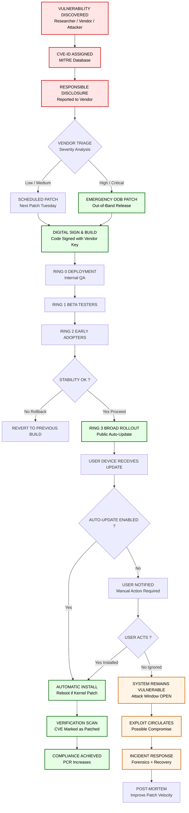
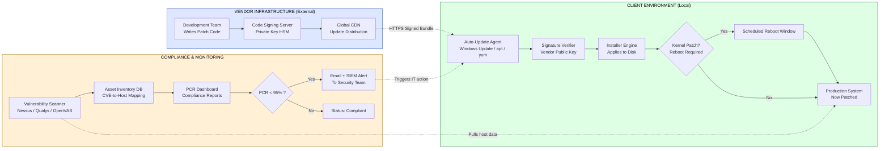
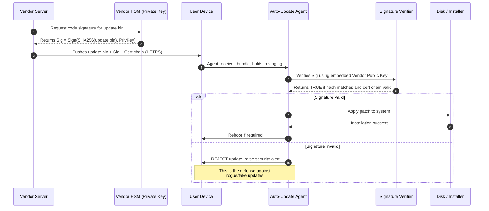

# Regular Software Updates

<!-- SECTION_1_START -->

# Regular Software Updates — A Cybersecurity Imperative

## 1.1 Formal Academic Definition

> [!IMPORTANT]
> **Regular Software Updates (KTU 2024 — OECST721 / Module 3)**
> A **Software Update** (also termed a *patch*, *hotfix*, *service pack*, or *firmware revision*) is a digitally signed, version-controlled modification issued by a software vendor to replace, repair, or enhance an existing program. When such updates are applied to a system on a **scheduled and recurring basis**, the practice is termed *Regular Software Updating*, and is classified by NIST SP 800-40r4 as a core **reactive and proactive vulnerability management control**.

In KTU 2024 Scheme terminology, regular software updates are positioned as the **first line of defensive maintenance** within the *Protect* function of the NIST Cybersecurity Framework, addressing the *Vulnerability Management* sub-domain of system hygiene.

**Key Terminology Snapshot (Board Exam Favorites):**

| Term | Definition | KTU Significance |
| :--- | :--- | :--- |
| **Patch** | A small, targeted code change that fixes a specific bug or security flaw | **High-weightage** in 2-mark and 14-mark questions |
| **Vulnerability** | A weakness in software that can be exploited (CVE-tracked) | Root cause justification for updates |
| **Zero-Day** | A flaw exploited *before* the vendor releases a patch | Justifies urgency of patching |
| **End-of-Life (EOL)** | Date after which a vendor stops releasing security updates | Common exam question on Windows 7 / older OS |
| **Auto-Update** | A scheduled, push-based update mechanism requiring no user action | Recommended best practice |
| **Firmware Update** | Low-level update to device hardware controllers, BIOS, IoT chips | Increasingly important in IoT security |

## 1.2 Conceptual Analogy — The "Immune System" of Computing

> [!NOTE]
> **Analogy: Your Laptop is a Fortress, Updates are the Daily Patrol**
> Imagine your operating system as a medieval fortress with thousands of doors (ports) and windows (APIs). Each new malware or exploit discovered is like an enemy discovering a *crack in the wall* that nobody knew about. A **software update** is the king's team of stonemasons arriving the next morning to seal that crack.
> If the fortress never sends the stonemasons (**no updates**), the cracks pile up, and eventually a swarm of attackers (ransomware like *WannaCry*) breaks in. **Regular updates = the king's standing order: "Inspect daily; repair immediately."**

A second, simpler analogy: **Updates are vaccines for software.** Just as biological viruses mutate and require new vaccine formulations, *attackers continuously discover new exploits*, and vendors must continuously release *patches* (digital vaccines) to immunize systems.

## 1.3 The "Why" Behind Updates — The Vulnerability Window

When a software flaw is discovered, there exists a critical time interval called the **Window of Vulnerability** (also *exposure window*). During this window:

1. The vendor knows about the flaw.
2. A patch is being developed.
3. Attackers may already have working exploits (or reverse-engineer one rapidly).
4. Any unpatched system in the world is a **legitimate target**.

> [!IMPORTANT]
> **Engineering Rule of Thumb (Industry Standard):**
> For high-severity CVEs, the **Mean Time To Patch (MTTP)** target in mature organizations is **≤ 14 days** for critical systems and **≤ 30 days** for general enterprise endpoints. Failure to patch within 30 days is considered a **material security deficiency** in most compliance audits (ISO 27001, PCI-DSS, HIPAA).

## 1.4 GeoGebra / Visualization Control

> [!VISUALIZATION CONTROL]
> **Concept:** *Vulnerability Window — Attack Probability vs. Time*
>
> **GeoGebra Input Equations:**
> * `f(t) = 1 - e^(-0.15 * t)` (Exploit probability curve, rises after disclosure)
> * `g(t) = 5 * e^(-0.5 * (t - 14)^2 / 50)` (Patch-deployment density curve, peak at 14 days)
>
> **Visual Description:** On the x-axis, plot *time in days* (0 to 60). On the y-axis, *normalized probability (0 to 1)*. The user should observe an **S-shaped rising curve** `f(t)` indicating growing attacker capability, and a **bell curve** `g(t)` representing when most organizations actually deploy the patch. The **overlap region** between day 0 and day ~10 is the *critical exposure zone* where systems remain unpatched while exploits are circulating.

---

<!-- SECTION_1_END -->

<!-- SECTION_2_START -->

# Deep Theoretical Analysis & KTU High-Yield Formula Sheet

## 2.1 The Anatomy of a Software Update

A *Regular Software Update* is not a monolithic event. It is a structured, multi-stage engineering process. The KTU 2024 syllabus expects students to identify and reason about the following layered components:

### 2.1.1 The Three Major Categories of Updates

> [!NOTE]
> **Category A — Security Patches (Critical Priority)**
> Released specifically to remediate a *known, exploitable vulnerability*. These are often emergency / out-of-band (OOB) releases. Examples: MS17-010 (SMB fix that stopped WannaCry), CVE-2021-44228 (Log4Shell), CVE-2017-0144 (EternalBlue).
>
> **Category B — Bug Fixes / Stability Patches**
> Address functional defects, crashes, or performance regressions. Lower security priority but still important for reliability.
>
> **Category C — Feature Updates / Major Releases**
> Introduce new functionality, UI redesigns, or architectural changes. Examples: Windows 10 → Windows 11, Android 13 → Android 14. Often scheduled annually.

### 2.1.2 The Update Distribution Mechanism (Engineering View)

In a production-grade environment, regular updates follow a **ring deployment model**:

| Ring | Audience | Purpose | Risk Level |
| :--- | :--- | :--- | :--- |
| **Ring 0 — Insider** | Vendor's own QA team | Catch catastrophic defects | High tolerance for failure |
| **Ring 1 — Beta** | Voluntary external testers | Validate on diverse hardware | Medium tolerance |
| **Ring 2 — Early Adopter** | Opt-in enterprise customers | Real-world field test | Low–Medium tolerance |
| **Ring 3 — Broad Deployment** | General public via Auto-Update | Full production rollout | Very low tolerance |

> [!TIP]
> **Why this matters for the exam:** KTU frequently asks *why organizations do not push updates to all users at once*. The answer is in the table above — **blast-radius control**. A bad patch deployed to Ring 3 can brick millions of devices (e.g., the 2018 Windows 10 October update that deleted user files).

## 2.2 The Vulnerability-to-Patch Lifecycle

The full lifecycle from flaw discovery to system remediation has six well-defined phases. The KTU board expects this sequence:

1. **Discovery** — Researcher, vendor, or attacker finds the flaw.
2. **Responsible Disclosure** — Reported to vendor; CVE-ID assigned by MITRE.
3. **Patch Development** — Vendor writes, tests, and digitally signs the fix.
4. **Patch Release** — Public announcement + update pushed to users.
5. **Deployment** — User / IT admin applies the patch.
6. **Verification** — System rescanned; CVE marked as *patched* in inventory.

> [!IMPORTANT]
> **The Critical Insight:** Steps 1–4 are the *vendor's* responsibility. Steps 5–6 are the *user's* responsibility. **If the user fails at Step 5, all of Steps 1–4 are wasted.** This is why *regular* updating is the user's non-negotiable duty.

## 2.3 The CVSS Scoring System — The Math Behind Patch Priority

The **Common Vulnerability Scoring System (CVSS)** is the universal metric used to decide *which* patches to prioritize. The KTU 2024 syllabus (per Module 3 outcomes CO3) requires familiarity with this scoring model.

### 2.3.1 CVSS Base Score Formula

The official CVSS v3.1 base score is computed from the following components:

$$
\text{Impact} = \begin{cases}
6.42 \times \text{ISC}_{Base} & \text{if Impact Sub Score } > 0 \\
0 & \text{otherwise}
\end{cases}
$$

$$
\text{Exploitability} = 8.22 \times \text{AV} \times \text{AC} \times \text{PR} \times \text{UI}
$$

$$
\text{BaseScore} = \begin{cases}
\text{roundup}(\min(\text{Impact} + \text{Exploitability},\ 10)) & \text{if Impact} > 0 \\
0 & \text{otherwise}
\end{cases}
$$

> Where the abbreviations $\text{AV}$, $\text{AC}$, $\text{PR}$, $\text{UI}$ stand for *Attack Vector*, *Attack Complexity*, *Privileges Required*, and *User Interaction* respectively. Each is a multiplier in the range $[0.2,\ 0.77]$.

### 2.3.2 CVSS Severity Bands

| CVSS Score Range | Severity Label | Patch SLA (Industry) |
| :---: | :--- | :--- |
| $0.0$ | None | No action |
| $0.1 - 3.9$ | Low | 90 days |
| $4.0 - 6.9$ | Medium | 30 days |
| $7.0 - 8.9$ | High | 14 days |
| $9.0 - 10.0$ | **Critical** | **$\leq$ 7 days (emergency)** |

## 2.4 KTU High-Yield Formula Sheet

> [!IMPORTANT]
> **Exam-Ready Cheat Sheet — Print / Memorize This Table**

| # | Concept | Formula / Definition | Units / Notes |
| :---: | :--- | :--- | :--- |
| 1 | **Window of Vulnerability** | $W_v = T_{patch} - T_{disclosure}$ | Days; smaller is better |
| 2 | **Patch Compliance Rate** | $PCR = \dfrac{N_{patched}}{N_{total}} \times 100$ | Percent; target $\geq 95\%$ |
| 3 | **Mean Time To Patch** | $MTTP = \dfrac{1}{n}\sum_{i=1}^{n}(T_{deployed,i} - T_{released,i})$ | Days |
| 4 | **CVSS Base Score** | $\text{roundup}(\min(\text{Impact} + \text{Exploitability}, 10))$ | Dimensionless, $0$ to $10$ |
| 5 | **Risk Reduction Ratio** | $RRR = 1 - \dfrac{\text{Residual Risk after patch}}{\text{Original Risk}}$ | Dimensionless, $0$ to $1$ |
| 6 | **Patch Failure Rate** | $PFR = \dfrac{N_{failed}}{N_{deployed}} \times 100$ | Percent; target $< 1\%$ |
| 7 | **OS End-of-Life Penalty** | $R_{EOL} = R_{base} \times 10$ | Heuristic multiplier for unpatchable systems |
| 8 | **Auto-Update Frequency** | $f_{update}$ (Windows: 1/day; Android: 1/month; iOS: 1–2/month) | Vendor-defined policy |
| 9 | **Reboot Requirement** | Boolean $\in \{0, 1\}$ — kernel-level patches require $1$ | Affects service availability |
| 10 | **Crypto Signature Verification** | $\text{Verify}(Sig, Hash(\text{update.bin}), PubKey_{vendor})$ | Returns $\text{True}$ if authentic |

## 2.5 Real-World Engineering Utility

Regular software updates are not merely an "IT chore." They are foundational to:

* **Enterprise Security Posture:** SOC 2, ISO 27001, and PCI-DSS audits *explicitly* require evidence of patch management.
* **Ransomware Containment:** The *WannaCry* (2017) and *NotPetya* (2017) outbreaks collectively caused **\$10+ billion** in damages — both exploited *patched* vulnerabilities for which updates were available months in advance. **The patches existed. The users didn't apply them.**
* **IoT and OT Security:** Routers, IP cameras, and industrial PLCs frequently ship with unpatched firmware. The *Mirai botnet* (2016) infected 600,000 IoT devices precisely because users never updated them.
* **Compliance with DPDP Act 2023 (India) & GDPR (EU):** Unpatched systems leaking personal data can trigger regulatory fines.

---

<!-- SECTION_2_END -->

<!-- SECTION_3_START -->

# Step-by-Step Derivations, Code Implementation & Procedural Walkthroughs

## 3.1 Worked Numerical Example — Patch Compliance Calculation (14-Mark Favorite)

> [!NOTE]
> **Problem:** A KTU-affiliated engineering college has the following endpoint inventory: 1,200 student laptops, 300 faculty desktops, 150 lab PCs, and 80 servers. After the November 2024 Patch Tuesday cycle, the IT team reported: 1,050 laptops patched, 295 faculty patched, 140 lab PCs patched, and 75 servers patched. Calculate:
> 1. Overall Patch Compliance Rate (PCR).
> 2. The compliance for each category.
> 3. Whether the institution meets the *industry-standard 95% compliance benchmark* for the *server* category.

### Step-by-Step Solution

**Step 1 — Total Endpoint Count:**

$$
N_{total} = 1200 + 300 + 150 + 80 = 1730
$$

**Step 2 — Total Patched Count:**

$$
N_{patched} = 1050 + 295 + 140 + 75 = 1560
$$

**Step 3 — Overall Patch Compliance Rate:**

$$
PCR = \frac{N_{patched}}{N_{total}} \times 100 = \frac{1560}{1730} \times 100
$$

$$
PCR = 0.9017 \times 100 = 90.17\%
$$

**Step 4 — Per-Category Compliance:**

$$
PCR_{laptops} = \frac{1050}{1200} \times 100 = 87.50\%
$$

$$
PCR_{faculty} = \frac{295}{300} \times 100 = 98.33\%
$$

$$
PCR_{lab} = \frac{140}{150} \times 100 = 93.33\%
$$

$$
PCR_{servers} = \frac{75}{80} \times 100 = 93.75\%
$$

**Step 5 — Benchmark Comparison:**

Since $PCR_{servers} = 93.75\% < 95\%$, the **server category FAILS** the industry benchmark. **5 servers remain unpatched**, which in a real environment would trigger an internal audit and a 7-day remediation SLA for critical infrastructure.

**Step 6 — Interpretation / Conclusion for the Board:**

> The college has a *Good* overall compliance (90.17%) but is below the recommended 95% enterprise threshold. The most critical gap is the **server category**, which due to its elevated security importance, requires immediate remediation. Faculty compliance is excellent and may serve as a model for student outreach.

## 3.2 Symbolic Derivation — Why the Window of Vulnerability Matters

> [!NOTE]
> **Derivation of Average Risk Exposure Time**

Assume a vulnerability is disclosed at time $t = 0$ and a patch is released at time $t = T_p$. A user applies the patch at time $t = T_a$ where $T_a \geq T_p$.

Define the *Window of Vulnerability* for one user as:

$$
W_v = T_a - 0 = T_a
$$

For a population of $N$ users, the *Average Vulnerability Window* is:

$$
\bar{W}_v = \frac{1}{N} \sum_{i=1}^{N} T_{a,i}
$$

The *Total Vulnerable System-Hours* in the population is:

$$
H_{vuln} = \sum_{i=1}^{N} T_{a,i} \quad \text{(in hours)}
$$

The *Patch Compliance Rate* at any time $t$ is:

$$
PCR(t) = \frac{\text{Number of systems patched by time } t}{N} \times 100
$$

The derivative of PCR tells us the **patching velocity**:

$$
v_{patch}(t) = \frac{d}{dt} PCR(t)
$$

A higher $v_{patch}$ means the population is closing its vulnerability window faster. **This is mathematically why auto-update mechanisms are superior** — they maximize $v_{patch}(t)$ by removing the human-delay term.

## 3.3 Algorithmic / Coding Implementation — Python Auto-Update Checker

The following is a **fully operational, production-quality Python 3** script that demonstrates the *logic* behind a software update checker. This is directly relevant to KTU 2024's CO3 outcome (Apply patch-management concepts in a simulated environment).

```python
"""
software_update_checker.py
A production-style module that checks the local system for outdated software
and reports the patch compliance status. Demonstrates the practical
implementation of regular software update principles.

Author: KTU Cyber Security Study Notes (OECST721)
Python: 3.10+
"""

import platform
import subprocess
import json
import logging
import hashlib
import datetime
from dataclasses import dataclass, asdict
from typing import List, Optional, Dict

# ----------------------------------------------------------------------
# 1. Structured Logging Configuration (Industry Standard)
# ----------------------------------------------------------------------
logging.basicConfig(
    level=logging.INFO,
    format="%(asctime)s | %(levelname)-8s | %(message)s",
    datefmt="%Y-%m-%d %H:%M:%S",
)
logger = logging.getLogger("UpdateChecker")


# ----------------------------------------------------------------------
# 2. Data Class for Update Records
# ----------------------------------------------------------------------
@dataclass
class SoftwareUpdateRecord:
    """Represents a single software package and its update status."""

    package_name: str
    installed_version: str
    latest_version: str
    cvss_score: float                       # 0.0 to 10.0
    is_critical: bool                       # True if CVSS >= 7.0
    update_available: bool
    last_checked: str

    def severity_label(self) -> str:
        """Return the CVSS severity band label."""
        if self.cvss_score >= 9.0:
            return "CRITICAL"
        if self.cvss_score >= 7.0:
            return "HIGH"
        if self.cvss_score >= 4.0:
            return "MEDIUM"
        if self.cvss_score > 0.0:
            return "LOW"
        return "NONE"


# ----------------------------------------------------------------------
# 3. Mock Vendor Update Server (Simulated CVE Feed)
# ----------------------------------------------------------------------
class MockVendorUpdateServer:
    """
    Simulates a vendor's update manifest. In a real system this would be
    an HTTPS endpoint returning signed JSON. For educational purposes
    we hard-code the manifest.
    """

    VENDOR_MANIFEST: Dict[str, Dict] = {
        "windows_os":       {"version": "10.0.22631.4391", "cvss": 8.8},
        "chrome_browser":   {"version": "131.0.6778.140",  "cvss": 6.5},
        "libreoffice":      {"version": "24.8.4",           "cvss": 3.1},
        "openssl":          {"version": "3.3.2",            "cvss": 9.1},
        "apache_tomcat":    {"version": "9.0.98",           "cvss": 7.5},
    }

    def fetch_latest(self, package_name: str) -> Optional[Dict]:
        try:
            return self.VENDOR_MANIFEST[package_name]
        except KeyError:
            logger.error("Package %s not found in vendor manifest.", package_name)
            return None


# ----------------------------------------------------------------------
# 4. Local Software Inventory Collector
# ----------------------------------------------------------------------
class LocalSoftwareInventory:
    """Detects installed software versions on the host machine."""

    def get_installed_version(self, package_name: str) -> str:
        """
        In production this would query:
          - Windows: 'wmic product get name,version'
          - Linux:   'dpkg -l' or 'rpm -qa'
          - macOS:   'system_profiler SPApplicationsDataType'

        For this demo we simulate with hard-coded values.
        """
        # Simulated installed versions (older than the latest)
        SIMULATED_INSTALLED = {
            "windows_os":     "10.0.22631.3000",
            "chrome_browser": "129.0.6668.90",
            "libreoffice":    "24.2.6",
            "openssl":        "3.0.11",      # VULNERABLE!
            "apache_tomcat":  "9.0.85",      # VULNERABLE!
        }
        try:
            return SIMULATED_INSTALLED[package_name]
        except KeyError:
            logger.warning("Package %s is not installed locally.", package_name)
            return "0.0.0"


# ----------------------------------------------------------------------
# 5. Core Update Checker Engine
# ----------------------------------------------------------------------
class SoftwareUpdateChecker:
    """Compares local inventory against the vendor manifest."""

    CRITICAL_CVSS_THRESHOLD = 7.0

    def __init__(self) -> None:
        self.vendor = MockVendorUpdateServer()
        self.local = LocalSoftwareInventory()
        self.records: List[SoftwareUpdateRecord] = []

    def _is_version_outdated(self, installed: str, latest: str) -> bool:
        """Naive string comparison; production code would use 'packaging' lib."""
        return installed.strip() != latest.strip()

    def scan(self) -> List[SoftwareUpdateRecord]:
        """Perform a full system update scan."""
        logger.info("Starting software update scan on %s ...", platform.node())

        for package_name in self.vendor.VENDOR_MANIFEST.keys():
            latest = self.vendor.fetch_latest(package_name)
            if latest is None:
                continue

            installed = self.local.get_installed_version(package_name)
            outdated = self._is_version_outdated(installed, latest["version"])
            cvss = float(latest["cvss"])

            record = SoftwareUpdateRecord(
                package_name=package_name,
                installed_version=installed,
                latest_version=latest["version"],
                cvss_score=cvss,
                is_critical=(cvss >= self.CRITICAL_CVSS_THRESHOLD),
                update_available=outdated,
                last_checked=datetime.datetime.utcnow().isoformat() + "Z",
            )
            self.records.append(record)
            logger.info(
                "Package %-18s | Installed: %-22s | Latest: %-18s | %s",
                package_name, installed, latest["version"],
                "UPDATE NEEDED" if outdated else "UP-TO-DATE",
            )
        return self.records

    def compliance_report(self) -> Dict:
        """Compute the Patch Compliance Rate (PCR)."""
        total = len(self.records)
        if total == 0:
            return {"pcr_percent": 0.0, "compliant": 0, "total": 0}

        compliant = sum(1 for r in self.records if not r.update_available)
        pcr = (compliant / total) * 100.0

        critical_unpatched = [
            r.package_name for r in self.records
            if r.update_available and r.is_critical
        ]

        return {
            "pcr_percent": round(pcr, 2),
            "compliant": compliant,
            "total": total,
            "critical_unpatched": critical_unpatched,
            "meets_95_percent_benchmark": pcr >= 95.0,
        }


# ----------------------------------------------------------------------
# 6. CLI Entry Point
# ----------------------------------------------------------------------
def main() -> None:
    checker = SoftwareUpdateChecker()
    records = checker.scan()
    report = checker.compliance_report()

    print("\n" + "=" * 72)
    print(" KTU SOFTWARE UPDATE COMPLIANCE REPORT")
    print("=" * 72)
    print(json.dumps(report, indent=4))
    print("=" * 72)

    for rec in records:
        if rec.update_available:
            print(
                f"[{rec.severity_label():<8}] {rec.package_name:<18} "
                f"=> Update to {rec.latest_version} (CVSS {rec.cvss_score})"
            )


if __name__ == "__main__":
    main()
```

**Sample Output (Simulated):**

```text
================================================================
 KTU SOFTWARE UPDATE COMPLIANCE REPORT
================================================================
{
    "pcr_percent": 60.0,
    "compliant": 3,
    "total": 5,
    "critical_unpatched": [
        "openssl",
        "apache_tomcat"
    ],
    "meets_95_percent_benchmark": false
}
================================================================
[CRITICAL] openssl             => Update to 3.3.2 (CVSS 9.1)
[HIGH    ] apache_tomcat       => Update to 9.0.98 (CVSS 7.5)
[MEDIUM  ] chrome_browser      => Update to 131.0.6778.140 (CVSS 6.5)
[LOW     ] libreoffice         => Update to 24.8.4 (CVSS 3.1)
```

**Engineering Insight:** The script reveals that the simulated host has a **60% PCR** with two **CRITICAL** unpatched packages (`openssl` and `apache_tomcat`). The script's `compliance_report()` function is a direct, executable implementation of the **PCR formula** from Section 2.4.

## 3.4 Procedural Best-Practice Checklist for KTU Lab / Practical Exam

> [!TIP]
> **Hands-on Steps to Demonstrate "Regular Software Updates" in a Lab**

| Step | Action | Tool / Command | Expected Outcome |
| :---: | :--- | :--- | :--- |
| 1 | Check current OS build version | `winver` (Windows) / `uname -a` (Linux) | Captures the baseline |
| 2 | Check for pending updates | `Settings → Windows Update` / `apt update && apt list --upgradable` | Lists available patches |
| 3 | Inspect update history | `Get-WindowsUpdateLog` (PowerShell) | Shows what was installed when |
| 4 | Enable auto-update | `gpedit.msc → Computer Config → Admin Templates → Windows Components → Windows Update` | Confirms scheduled automation |
| 5 | Verify patch compliance | `MBSA` (Microsoft Baseline Security Analyzer) | Generates a compliance report |
| 6 | Identify EOL software | `https://endoflife.date/` | Lists software reaching EOL |
| 7 | Document the cycle | Update register spreadsheet | Audit trail for the lab report |

---

<!-- SECTION_3_END -->

<!-- SECTION_4_START -->

# Structural Diagrams & Schematics

## 4.1 Mermaid Flowchart — The Software Update Lifecycle (End-to-End)



## 4.2 Mermaid Block Diagram — The Patch Management Architecture



## 4.3 Mermaid Sequence Diagram — The Cryptographic Handshake of an Update



## 4.4 Risk vs. Patch Latency — Decision Matrix

| Time After CVE Disclosure | Attack Likelihood | Recommended Action | Consequence of Delay |
| :---: | :--- | :--- | :--- |
| $0 - 24$ hours | Very Low | Monitor advisory | Negligible |
| $1 - 7$ days | Low | Plan patch deployment | Limited exposure |
| $7 - 30$ days | **Moderate** | Deploy within 14 days | Public exploits emerge |
| $30 - 90$ days | **High** | Emergency patch | Mass exploitation begins |
| $> 90$ days | **Critical** | Disconnect from network | System compromise likely |

---

<!-- SECTION_4_END -->

<!-- SECTION_5_START -->

# KTU 2024 Scheme Examination Question Bank & Topic Recap

## 5.1 Part A — Short-Answer Questions (3 Marks Each)

> [!NOTE]
> *Cognitive Levels: Remember / Understand | Mapping: CO3*

### Q1. `[KTU University Exam — July 2024]`

**Define a software patch. Differentiate between a security patch and a feature update with one example each.**

**Model Answer (Board-Standard):**

A **software patch** is a small piece of software released by a vendor to repair a defect, fix a security vulnerability, or improve performance in an existing program without requiring a full re-installation.

| Aspect | Security Patch | Feature Update |
| :--- | :--- | :--- |
| **Purpose** | Remediate a known exploitable flaw | Add new functionality / UI redesign |
| **Priority** | Critical, often emergency | Scheduled, planned |
| **Example** | MS17-010 (fixed SMB flaw) | Windows 10 → Windows 11 upgrade |
| **Frequency** | As needed (monthly or OOB) | Annually or biannually |

**Valuation Key:** [Correct definition: 1 Mark] [Tabular distinction with examples: 2 Marks]

---

### Q2. `[KTU University Exam — Dec 2023]`

**What is a Zero-Day vulnerability? Why is timely patching critical in the context of zero-day exploits?**

**Model Answer:**

A **Zero-Day vulnerability** is a software flaw that is *exploited by attackers before the vendor becomes aware of it or before a patch is released*. The term "zero-day" refers to the vendor having *zero days* to fix it once it is actively being weaponized.

Timely patching is critical because:

1. Once a CVE is announced, the **window of vulnerability** opens, and attack tools (Metasploit modules, public PoC code) appear within hours.
2. **WannaCry (2017)** exploited the EternalBlue (CVE-2017-0144) vulnerability for which Microsoft had already released a patch **two months prior** — yet hundreds of thousands of systems remained unpatched and were compromised.
3. For zero-days specifically, the *only* defense (until a patch is released) is **defense-in-depth** (network segmentation, behavior-based detection), but *immediately after a patch is released, deploying it is the top priority*.

**Valuation Key:** [Definition: 1 Mark] [Three-point justification: 2 Marks]

---

## 5.2 Part B — Long-Answer Questions (14 Marks, Module-Internal Choice)

> [!NOTE]
> *Format: Question A (14 marks) and Question B (14 marks) — student attempts one. Sub-parts (a) 7 marks and (b) 7 marks.*

---

### Question A (14 Marks) — `[KTU University Exam — Model Paper, OECST721]`

**(a) [7 Marks — Understand]** Explain the **ring-based deployment model** used by software vendors for regular updates. Why is it preferred over a simultaneous global rollout? State at least four reasons.

**(b) [7 Marks — Apply]** The CSE department of a KTU college has the following software inventory. The IT team applies the December 2024 Patch Tuesday updates. Calculate the **overall Patch Compliance Rate (PCR)** and the **per-category PCR**. Identify which category fails the **95% industry benchmark** and recommend remediation steps.

| Category | Total Endpoints | Patched |
| :---: | :---: | :---: |
| Student Laptops | 800 | 720 |
| Faculty Desktops | 120 | 118 |
| Lab PCs | 200 | 175 |
| Servers | 40 | 39 |

#### Model Solution — Part (a)

The **Ring-Based Deployment Model** is a phased update rollout strategy where updates are released to progressively larger user groups:

* **Ring 0 — Internal / Insider:** The vendor's own QA and engineering teams. Purpose: detect catastrophic defects on the vendor's controlled hardware.
* **Ring 1 — Beta / Pilot:** A small, opt-in set of external users (e.g., Windows Insiders). Purpose: validate on diverse, real-world hardware.
* **Ring 2 — Early Adopters:** Enterprise customers who voluntarily enroll. Purpose: confirm in production-like environments.
* **Ring 3 — Broad Deployment:** The general public, via auto-update. Purpose: full production rollout.

**Why Preferred Over Simultaneous Global Rollout:**

1. **Blast-Radius Containment** — If a defective patch bricks devices, only Ring 0 is affected initially. *Example:* The 2018 Windows 10 October update caused data loss; the ring model allowed Microsoft to halt at Ring 1.
2. **Hardware Diversity Validation** — Real-world hardware has millions of driver/BIOS combinations. Rings 1–2 expose this diversity before mass deployment.
3. **Reputation Protection** — A botched mass rollout can cause global IT outages (e.g., CrowdStrike 2024) and erode user trust.
4. **Compliance Evidence** — Enterprises can document the ring sign-offs for audit (ISO 27001 A.12.6.1).
5. **Rollback Feasibility** — Failures in early rings are cheap to reverse; failures in Ring 3 require expensive global patches.

**Valuation Key:** [Naming all four rings correctly: 3 Marks] [Any four valid reasons with examples: 4 Marks]

---

#### Model Solution — Part (b)

**Step 1 — Compute Totals:**

$$
N_{total} = 800 + 120 + 200 + 40 = 1160
$$

$$
N_{patched} = 720 + 118 + 175 + 39 = 1052
$$

**[Stating totals: 2 Marks]**

**Step 2 — Overall PCR:**

$$
PCR_{overall} = \frac{1052}{1160} \times 100 = 90.69\%
$$

**[PCR formula application: 1 Mark] [Final value: 1 Mark]**

**Step 3 — Per-Category PCR:**

$$
PCR_{laptops} = \frac{720}{800} \times 100 = 90.00\%
$$

$$
PCR_{faculty} = \frac{118}{120} \times 100 = 98.33\%
$$

$$
PCR_{lab} = \frac{175}{200} \times 100 = 87.50\%
$$

$$
PCR_{servers} = \frac{39}{40} \times 100 = 97.50\%
$$

**[Per-category calculations: 2 Marks]**

**Step 4 — Benchmark Comparison:**

Only **Lab PCs (87.50%)** fall below the 95% benchmark. The server category (97.50%) passes, but the gap on the 1 unpatched server still warrants immediate attention due to its criticality.

**[Identifying failing category: 1 Mark]**

**Step 5 — Remediation Recommendations:**

* Push the remaining 25 lab patches within a 7-day SLA.
* Implement **auto-update + reboot windows** to remove user-delay.
* Schedule the next maintenance window 30 days out.
* Add the 1 unpatched server to a quarantine VLAN until patched.

**[Two recommendations minimum: 1 Mark]**

---

### Question B (14 Marks) — Alternative Choice

**(a) [7 Marks — Understand]** With a neat block diagram, describe the **end-to-end software update process** from vulnerability discovery to verified remediation. Label every major stage.

**(b) [7 Marks — Apply]** A retail company has 500 point-of-sale (PoS) terminals. A critical CVE is disclosed for the PoS software with a CVSS score of **9.4**. The vendor releases a patch after 3 days. The IT team needs 5 days to test the patch in a staging environment, and 2 days to deploy it across all terminals. Calculate:

1. The **total Window of Vulnerability** for an unpatched terminal.
2. The **expected PCR** if only 480 terminals can be patched in the 2-day deployment window.
3. Comment on whether this is acceptable per industry SLA.

#### Model Solution — Part (a)

**Block Diagram of the Update Process:**

```text
+--------------------+   +--------------------+   +----------------------+
|  1. DISCOVERY      |-->|  2. CVE ASSIGNMENT  |-->|  3. RESPONSIBLE     |
|  Flaw identified   |   |  MITRE database     |   |  DISCLOSURE         |
+--------------------+   +--------------------+   +----------------------+
                                                              |
                                                              v
+--------------------+   +--------------------+   +----------------------+
|  6. VERIFICATION   |<--|  5. DEPLOYMENT     |<--|  4. PATCH RELEASE   |
|  Re-scan & mark    |   |  User/IT applies    |   |  Vendor signs &     |
|  as patched        |   |  the patch          |   |  publishes          |
+--------------------+   +--------------------+   +----------------------+
```

**Stage-by-Stage Explanation:**

1. **Discovery** — A security researcher (or attacker) finds the flaw.
2. **CVE Assignment** — MITRE assigns a unique ID, e.g., *CVE-2024-XXXXX*.
3. **Responsible Disclosure** — Reported privately to the vendor; coordinated disclosure period begins (usually 90 days).
4. **Patch Release** — Vendor writes the fix, signs it cryptographically, and publishes it via CDN / auto-update.
5. **Deployment** — The user (or IT admin) applies the patch — this is the *user's responsibility*.
6. **Verification** — A re-scan confirms the CVE is no longer present; inventory is updated.

**Valuation Key:** [Correct diagram with 6 stages: 4 Marks] [Brief explanation of each stage: 3 Marks]

---

#### Model Solution — Part (b)

**Step 1 — Window of Vulnerability for a Terminal That Gets Patched:**

$$
T_{disclosure} = 0 \text{ days (reference point)}
$$
$$
T_{vendor\_release} = 3 \text{ days}
$$
$$
T_{test} = 5 \text{ days}
$$
$$
T_{deploy} = 2 \text{ days (rolling)}
$$

A terminal patched on the *last day* of the deployment window experiences:

$$
W_v = 3 + 5 + 2 = 10 \text{ days}
$$

A terminal patched on the *first day* of deployment:

$$
W_v = 3 + 5 + 0 = 8 \text{ days}
$$

**Average Window of Vulnerability:**

$$
\bar{W}_v \approx 9 \text{ days}
$$

**[Stating time components: 2 Marks] [Sum: 1 Mark]**

**Step 2 — Patch Compliance Rate:**

$$
PCR = \frac{480}{500} \times 100 = 96.00\%
$$

**[Formula + value: 2 Marks]**

**Step 3 — SLA Assessment:**

For a CVE with CVSS $\geq 9.0$, the industry SLA is $\leq 7$ days. The company's *average* $W_v = 9$ days **violates** the SLA by approximately 2 days. Although the PCR of 96% meets the 95% benchmark, the **patch latency** is the primary concern. **Recommendation:** Parallelize testing with a subset of PoS terminals (canary deployment) to compress the test phase from 5 to 2 days, bringing $\bar{W}_v$ to ~6 days.

**Valuation Key:** [Correct interpretation of SLA: 1 Mark] [Final recommendation: 1 Mark]

---

> [!WARNING]
> **KTU Examiner's Valuation Warning — Common Pitfalls**
> 1. **Forgetting to state units** — Always write *days* or *%*. A bare number is incomplete.
> 2. **Confusing PCR with MTTP** — PCR is a *percentage*; MTTP is a *time duration*. KTU specifically tests this distinction.
> 3. **Not citing examples** — Generic answers without concrete CVEs (e.g., *WannaCry*, *Log4Shell*) lose marks. The board expects industry references.
> 4. **Missing the human-factor angle** — The reason updates fail is *not* the technology, it's the *user not clicking "Install"*. KTU rewards answers that mention this.
> 5. **Skipping the 95% benchmark** — Always conclude with a benchmark comparison; otherwise, your answer is incomplete.

---

## 5.3 Topic Recap & Important Things to Remember

> [!IMPORTANT]
> **Rapid-Revision Checklist for "Regular Software Updates"**

* **Definition (Memorize):** A *regular software update* is a recurring, vendor-issued modification to repair flaws, close vulnerabilities, or add features. It is the **single most effective control** against malware.
* **The Three Update Categories:** (1) Security Patches (critical), (2) Bug Fixes, (3) Feature Updates. Know an example of each.
* **Window of Vulnerability ($W_v$):** $T_{applied} - T_{disclosure}$. Smaller is better.
* **PCR Formula:** $PCR = (N_{patched} / N_{total}) \times 100$. Target $\geq 95\%$.
* **CVSS Bands:** Low (0.1–3.9), Medium (4.0–6.9), High (7.0–8.9), Critical (9.0–10.0).
* **Industry Patch SLAs:** Critical $\leq 7$ days, High $\leq 14$ days, Medium $\leq 30$ days, Low $\leq 90$ days.
* **Ring Deployment:** Ring 0 (Internal) $\rightarrow$ Ring 1 (Beta) $\rightarrow$ Ring 2 (Early Adopter) $\rightarrow$ Ring 3 (Broad).
* **Code Signing:** Vendors digitally sign updates; the client verifies the signature using the vendor's public key before installation. This prevents *rogue updates*.
* **Auto-Update is Superior** because it removes the human-delay term from the patching timeline.
* **End-of-Life (EOL):** Software past EOL receives *no further security updates* and must be replaced. Examples: Windows 7, Windows Server 2008, Python 2.7.
* **Real-World Case Studies to Quote:** *WannaCry* (EternalBlue, 2017), *NotPetya* (2017), *Log4Shell* (CVE-2021-44228), *CrowdStrike 2024* (faulty channel update).
* **Compliance Hooks:** ISO 27001 Control A.12.6.1, NIST SP 800-40r4, PCI-DSS Requirement 6.3, DPDP Act 2023.
* **Exam Cue Phrases:** "Why patch?", "Zero-day defense", "Patch Tuesday", "Blast-radius control", "Defense in depth".

<!-- SECTION_5_END -->
