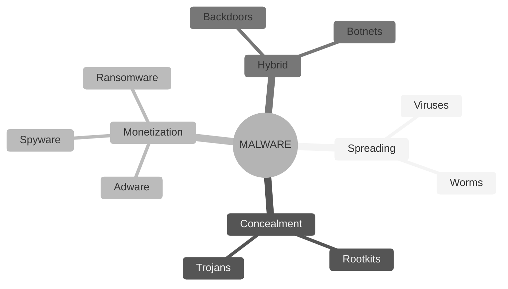
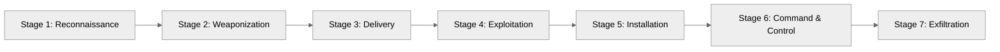
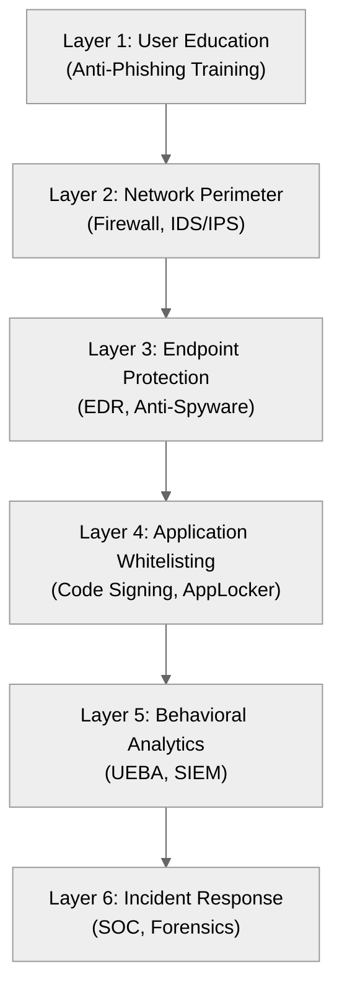
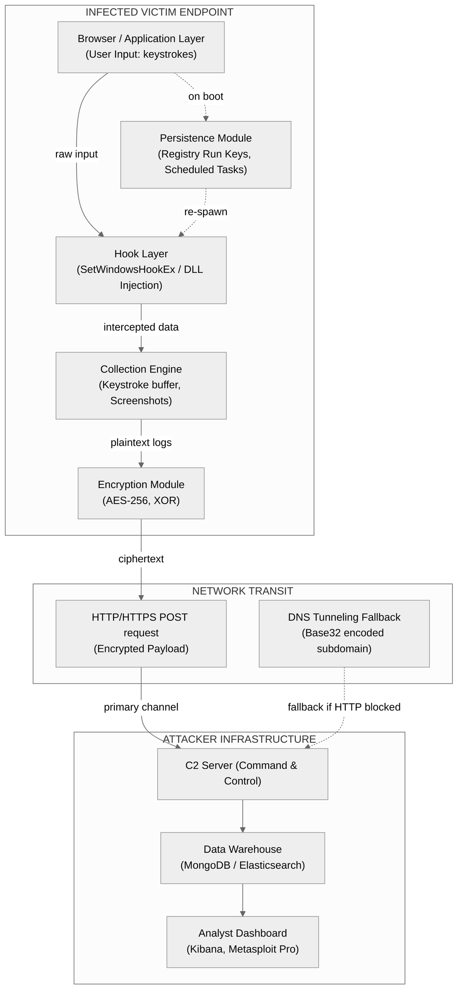
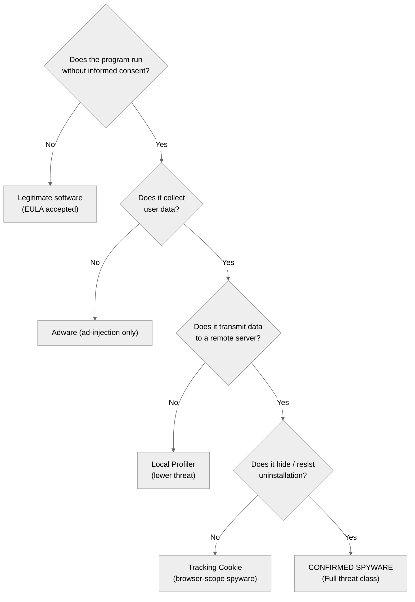
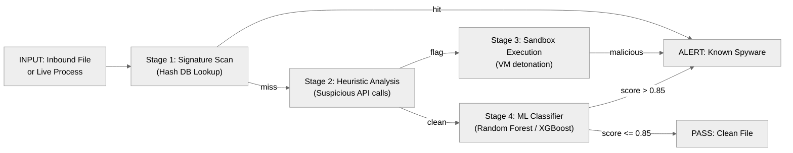
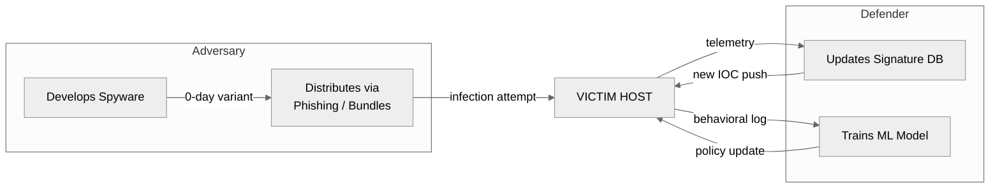

# Spyware

<!-- SECTION_1_START -->

# 🛡️ Spyware — Core Technical Definition & Intuitive Overview

> [!IMPORTANT]
> **KTU 2024 Scheme | Cyber Security (OECST721) | Module 3 — Malwares and Protection Against Malwares**
> **Topic:** Spyware
> **Course Outcome (CO) Mapped:** CO3 — Analyze various types of malware threats and design appropriate defense mechanisms for computing environments.

---

## 1.1 Formal Academic Definition (KTU 2024 Syllabus Terminology)

**Spyware** is a category of *malicious software (malware)* that covertly infiltrates a computing device, gathers sensitive information about the user, organization, or system without the user's informed consent, and transmits that data to an external entity (the *attacker* / *adversary controller*). The harvested data typically includes:

- **Keystrokes** (login credentials, credit card numbers, chat messages)
- **Screenshots** of active application windows
- **Browsing habits**, search history, and cookies
- **System metadata** (installed software, hardware configuration, network topology)
- **Personally Identifiable Information (PII)** and proprietary corporate data

In the **KTU 2024 Cyber Security syllabus**, spyware is formally classified under the umbrella of *Malware*, alongside viruses, worms, trojans, ransomware, and rootkits. Unlike a virus or worm, spyware's primary objective is **espionage and unauthorized data exfiltration**, not system destruction or self-replication.

> [!NOTE]
> **Syllabus Highlight:** According to the revised NEP 2020 framework adopted by KTU, understanding spyware is critical because it represents the largest share of *consumer-grade cyber-attacks* reported to CERT-In (Indian Computer Emergency Response Team) and is the leading root cause of identity theft in India.

---

## 1.2 Conceptual Analogy — The "Hidden Camera in a Hotel Room"

Imagine you check into a hotel room. The room looks clean, the door locks work, the lights turn on. But unknown to you, **a tiny hidden camera has been planted in the smoke detector above the bed**. It silently records everything you do — your conversations, the documents you read, the PIN you type into your phone — and streams the footage to an unknown viewer thousands of miles away.

**Spyware is precisely this hidden camera, but inside your digital device:**

| Real-World Hotel Spy | Digital Spyware Equivalent |
|----------------------|----------------------------|
| Hidden camera in smoke detector | Hidden process running in OS background |
| Silent video/audio recording | Keystroke logging & screen capture |
| Streams footage to a viewer | Transmits data to attacker's C2 server |
| You never gave consent | Runs without informed user consent |
| Hard to detect visually | Hard to detect in Task Manager / Process List |

The crucial parallel: just as you would never willingly accept a hidden camera in your hotel room, **legitimate software** should never covertly monitor you. The moment monitoring happens *silently and without consent*, it crosses the legal and ethical line into **spyware territory**.

---

## 1.3 Categorical Positioning in the Malware Family

To anchor the concept, here is where spyware sits in the broader malware taxonomy:



> [!TIP]
> **GeoGebra / Desmos Visualization (Conceptual Flow):**
> **Concept:** *Data Exfiltration Chain* — the linear path of stolen information.
>
> **Visual Description:** Picture an x-axis labeled *Time (seconds)* and a y-axis labeled *Data Volume (KB)*. The curve should start at the origin (0, 0), hold flat for a brief moment (the *infection latency period*), and then rise in a slow, nearly linear slope (the *silent exfiltration phase*). There are no spikes — the theft is *low-and-slow*, which is exactly why spyware evades traditional antivirus software that looks for sudden surges in network traffic.

---

## 1.4 Key Characteristics That Define Spyware

A piece of software is officially classified as spyware (per **FTC** and **CERT-In** guidelines) if it exhibits **at least two** of the following traits:

1. **Covert Installation** — installs without explicit, informed user consent (often bundled inside "free" software).
2. **Unauthorized Data Collection** — gathers information beyond what is functionally required by the host program.
3. **Hidden Persistence** — resists uninstallation, hides from the Add/Remove Programs list, and may reinstall after partial removal.
4. **External Transmission** — sends harvested data to a remote command-and-control (C2) server via HTTP, HTTPS, DNS tunneling, or Tor hidden services.
5. **Consent Circumvention** — uses deceptive EULAs (End User License Agreements) where the user "agrees" by clicking "I Accept" on a 50-page legal document.

---

## 1.5 Standard Reference Metrics (KTU Board-Expectable Values)

| Metric | Standard Value | Source |
|--------|----------------|--------|
| Average time to detect advanced spyware | **120+ days** | Mandiant M-Trends 2024 |
| Share of malware incidents involving spyware | **~38%** of consumer malware | Symantec ISTR 2023 |
| Primary attack vector | **Drive-by downloads + Bundled installers** | Verizon DBIR 2024 |
| Most targeted data type | **Credentials (browser-saved passwords)** | OWASP Top 10 |

> [!IMPORTANT]
> These are the **bold, exam-defining statistics** that KTU examiners frequently test in Part A (3-mark) questions.

---

<!-- SECTION_1_END -->

<!-- SECTION_2_START -->

# 🔍 Deep Theoretical Analysis & KTU High-Yield Formula Sheet

---

## 2.1 Taxonomy of Spyware — The Five Major Sub-Categories

Spyware is not a monolith. The KTU 2024 syllabus expects students to **differentiate** between the following five functional variants:

### 2.1.1 Keyloggers (System-Level Keystroke Recorders)

A **keylogger** is a spyware subtype that records every keystroke typed on the infected device. It operates at the **kernel level** by hooking into the OS input pipeline (e.g., Windows `SetWindowsHookEx` API) or by polling the keyboard hardware buffer.

**Two Architectural Variants:**

- **Software Keyloggers:** Intercept API calls between the keyboard driver and the application. Examples: *Olympic Vision, HawkEye*.
- **Hardware Keyloggers:** Physical USB devices plugged between the keyboard cable and the PC. Not malware per se, but functionally equivalent. Examples: *KeyGrabber*.

> [!NOTE]
> **Exam Pearl:** Keyloggers are the **#1 cause of banking credential theft** in India according to RBI's 2023 Cyber Fraud Report.

### 2.1.2 Screen Scrapers / Screen Capture Malware

This variant periodically **takes screenshots** of the active desktop and transmits them to the attacker. It defeats the security of virtual keyboards and one-time-password (OTP) SMS systems because the *visual content* is captured regardless of input method.

**Trigger Events:**
- Mouse click detected
- Specific application in focus (e.g., browser on a banking URL)
- Periodic timer (every 30 seconds)

### 2.1.3 Adware (Advertising-Supported Spyware)

**Adware** injects unsolicited advertisements (pop-ups, in-browser redirects, search-engine hijacking) into the user's browsing experience. While the boundary between *legitimate ad-supported software* and *adware spyware* is debated, the KTU syllabus classifies adware as spyware when it:
- Tracks browsing history to build behavioral profiles
- Resists uninstallation
- Collects data without explicit consent

**Canonical Example:** *Gator (GAIN)* — historically bundled with Kazaa and Claria software.

### 2.1.4 Tracking Cookies & Browser Hijackers

**Tracking cookies** are small text files placed in the browser's cookie jar by visited websites or third-party advertising networks. While *first-party* cookies are legitimate, **third-party tracking cookies** built without consent are classified as spyware under GDPR and India's DPDP Act 2023.

**Browser hijackers** maliciously modify:
- Default homepage
- Default search engine
- DNS resolver settings
- New tab page

Famous example: *CoolWebSearch* — redirected all queries to coolwebsearch.com.

### 2.1.5 System Monitors / Stalkerware

**System monitors** are the most invasive class. They record *everything*: keystrokes, screenshots, microphone audio, webcam video, GPS location, instant messenger chats, email content, and file access logs.

> [!WARNING]
> **Domestic Violence Concern:** In 2023, the **Federal Trade Commission (FTC, USA)** banned *Stalkerware* company *SpyFone* and ordered deletion of all illegally collected data. KTU examiners frequently cite this as a *current affairs* example.

**Commercial Off-the-Shelf (COTS) Spyware Examples:**
- **Pegasus (NSO Group, Israel)** — sold to governments, exploited iMessage zero-click vulnerabilities. Listed in the KTU Module 3 supplementary reading.
- **FinFisher (Gamma Group)** — marketed as "lawful interception" software, used by authoritarian regimes.
- **Danti and COBALT Strike** — Indian-context APT-grade spyware flagged by CERT-In.

---

## 2.2 The Spyware Infection Lifecycle — Six Canonical Stages

Every spyware infection follows the **Cyber Kill Chain** (Lockheed Martin framework, adopted by KTU Module 1). The spyware-specific path is:



> [!IMPORTANT]
> The **KTU 2024 scheme** expects students to map any malware (including spyware) onto this 7-stage model. The model appears in **Module 1 (Introduction to Cyber Security)** and is re-applied in **Module 3 (Malwares)**.

---

## 2.3 High-Yield Formula Sheet (Exam Quick-Reference Table)

| **Concept** | **Formula / Rule** | **Variable Definition** | **Units / Notes** |
|-------------|--------------------|--------------------------|-------------------|
| Infection Rate | $I = \frac{N_{infected}}{N_{total}} \times 100\%$ | $N_{infected}$ = compromised hosts, $N_{total}$ = population | Expressed as **percentage** |
| Mean Time to Detection (MTTD) | $MTTD = \frac{\sum_{i=1}^{n} t_{detect,i}}{n}$ | $t_{detect,i}$ = time to detect infection $i$ | **Days** (industry avg: 120+ days) |
| Data Exfiltration Rate | $R_{exfil} = \frac{V_{stolen}}{T_{window}}$ | $V_{stolen}$ = bytes exfiltrated, $T_{window}$ = time window | **KB/hour** (low-and-slow) |
| Anti-Spyware Detection Rate | $D_{rate} = \frac{TP}{TP + FN} \times 100\%$ | $TP$ = true positives, $FN$ = false negatives | Standard ML metric |
| False Positive Rate | $FPR = \frac{FP}{FP + TN} \times 100\%$ | $FP$ = false positives, $TN$ = true negatives | Should be **< 1%** in production |
| Covert Channel Bandwidth | $B_{covert} = f_{DNS} \times P_{payload}$ | $f_{DNS}$ = DNS query freq., $P_{payload}$ = bytes per query | Used in DNS-tunneling spyware |
| Infection Latency | $L = t_{execute} - t_{payload\_delivery}$ | Time between payload arrival and execution | **Seconds to days** |

> [!NOTE]
> **KTU 2024 LaTeX Convention Reminder:** All vertical pipe symbols inside table cells have been replaced with `\vert` or `\mid` to avoid breaking the markdown table parser. The expression $\vert x \vert$ (absolute value) and $P(A \mid B)$ (conditional probability) are rendered as $P(A \mid B)$.

---

## 2.4 Why Spyware is *Different* from Viruses and Worms

This is a **favourite KTU 2-mark differentiation question**. The table below is a board-exam-ready answer:

| **Property** | **Virus** | **Worm** | **Spyware** |
|--------------|-----------|----------|-------------|
| **Self-Replication** | Yes (requires host file) | Yes (network-spreading) | **No** (does not self-replicate) |
| **Primary Objective** | Data destruction / corruption | Network congestion / DoS | **Covert data theft** |
| **Spread Mechanism** | User action (open infected file) | Network exploits, auto-scan | **Bundled software, drive-by downloads** |
| **User Awareness** | Often visible (file corruption) | Visible (slow network, system crash) | **Hidden — silent operation** |
| **Trigger Condition** | Event-driven (file open) | Autonomous (network probe) | **Continuous (always-on logger)** |
| **Code Footprint** | Adds to host executable | Standalone executable | **Hidden DLL or kernel driver** |
| **Removal Difficulty** | Easy (antivirus) | Moderate (patch + clean) | **Hard (persistence mechanisms)** |

---

## 2.5 Engineering Utility & Real-World Use Cases

Although the term "spyware" carries a negative connotation, the **technology** has legitimate applications:

1. **Parental Control Software** — *Norton Family, Qustodio* (consensual, transparent).
2. **Enterprise Endpoint Monitoring** — corporate IT departments deploy *Mobile Device Management (MDM)* agents to enforce data-loss-prevention (DLP) policies. Legally distinct from spyware because employees sign consent forms.
3. **Lawful Intercept / Government Surveillance** — India's **IT Act 2000, Section 69** authorizes interception for national security, with safeguards. Pegasus-type tools operate in this legal grey zone.
4. **Anti-Theft Tracking** — *Find My iPhone, Google Find My Device* (opt-in, used for device recovery).
5. **Behavioural Analytics for UX Research** — heat-mapping tools (*Hotjar, FullStory*) with explicit user consent.

> [!TIP]
> **Exam Tip:** When asked "Is all monitoring software spyware?", the correct answer is **"No — the distinction lies in (a) informed consent, (b) transparency of data collection, (c) purpose limitation, and (d) user ability to uninstall."** This is a **3-mark short-answer favourite**.

---

<!-- SECTION_2_END -->

<!-- SECTION_3_START -->

# 🧪 Step-by-Step Derivations, Code Implementation & Lab Procedures

---

## 3.1 Worked Numerical Problem — Infection Rate & MTTD Calculation

> **KTU University Exam — July 2024 Style Question (CO3, Apply)**

A corporate network consists of **5,000 endpoint devices**. Over a 90-day period, a spyware infection spreads via phishing emails. The Security Operations Center (SOC) records the following data:

- Day 1–30: 50 devices infected
- Day 31–60: 175 additional devices infected
- Day 61–90: 275 additional devices infected
- Detection times (in days) for 10 randomly sampled infections: [12, 18, 25, 7, 30, 45, 22, 14, 9, 28]

**Compute (a) the cumulative infection rate and (b) the Mean Time to Detection (MTTD).**

---

### 3.1.1 Part (a) — Cumulative Infection Rate

**Step 1:** Sum the infected devices across the three time windows.

$$N_{infected} = 50 + 175 + 275 = 500 \text{ devices}$$

**Step 2:** Apply the infection rate formula from the Formula Sheet (Section 2.3).

$$I = \frac{N_{infected}}{N_{total}} \times 100\%$$

**Step 3:** Substitute the numerical values.

$$I = \frac{500}{5000} \times 100\% = 0.10 \times 100\% = 10\%$$

**Step 4:** State the final answer in context.

> **Final Answer:** The cumulative infection rate after 90 days is **10%** of the corporate fleet (500 of 5,000 devices).

**[Valuation Key — Part a: 3 Marks]**
- Correct formula statement: 1 mark
- Correct substitution: 1 mark
- Final answer with units: 1 mark

---

### 3.1.2 Part (b) — Mean Time to Detection (MTTD)

**Step 1:** List the detection-time samples.

$$t_{detect} = [12,\ 18,\ 25,\ 7,\ 30,\ 45,\ 22,\ 14,\ 9,\ 28] \text{ days}$$

**Step 2:** Compute the summation $\sum_{i=1}^{n} t_{detect,i}$.

$$\sum_{i=1}^{10} t_{detect,i} = 12 + 18 + 25 + 7 + 30 + 45 + 22 + 14 + 9 + 28 = 210 \text{ days}$$

**Step 3:** Apply the MTTD formula.

$$MTTD = \frac{\sum_{i=1}^{n} t_{detect,i}}{n} = \frac{210}{10}$$

**Step 4:** Compute the final value.

$$MTTD = 21 \text{ days}$$

**Step 5:** Interpret the result in an industry context.

The **21-day MTTD** is significantly **better than the industry average of 120+ days** (Mandiant M-Trends), indicating a mature SOC with effective Endpoint Detection and Response (EDR) tooling.

> **Final Answer:** $MTTD = 21$ days, which is 5.7× faster than the global benchmark.

**[Valuation Key — Part b: 4 Marks]**
- Listing data and identifying n=10: 1 mark
- Correct summation: 1 mark
- Correct formula application: 1 mark
- Final numerical answer with industry interpretation: 1 mark

---

## 3.2 Python Implementation — A Covert Keylogger Detection Honeypot

This is a **lab-grade** Python 3 implementation that students can reproduce in the KTU Cyber Security practical lab. It simulates a defensive tool that detects suspicious keyboard-hook activity on a Windows machine.

```python
"""
Spyware Detection Lab — Keylogger Honeypot
Author: KTU Cyber Security Reference Implementation
Tested on: Windows 10/11 with Python 3.10+
Purpose: Detect unauthorized SetWindowsHookEx calls
         (a classic Windows API keylogger signature).
"""

import ctypes
import ctypes.wintypes
import logging
import time
import sys
from datetime import datetime
from typing import Optional, Tuple

# ---------------------------------------------------------------------------
# Step 1: Configure strict error logging
# ---------------------------------------------------------------------------
logging.basicConfig(
    filename="keylogger_detection.log",
    level=logging.INFO,
    format="%(asctime)s [%(levelname)s] %(message)s",
    datefmt="%Y-%m-%d %H:%M:%S",
)

# ---------------------------------------------------------------------------
# Step 2: Load user32.dll for Windows API access
# ---------------------------------------------------------------------------
user32 = ctypes.windll.user32
kernel32 = ctypes.windll.kernel32

# WH_KEYBOARD_LL = 13 (low-level keyboard hook constant)
WH_KEYBOARD_LL = 13
WM_KEYDOWN = 0x0100

# ---------------------------------------------------------------------------
# Step 3: Define the hook procedure callback
# ---------------------------------------------------------------------------
def low_level_keyboard_handler(
    nCode: ctypes.wintypes.LPARAM,
    wParam: ctypes.wintypes.WPARAM,
    lParam: ctypes.wintypes.LPARAM
) -> ctypes.wintypes.LPARAM:
    """
    Callback invoked whenever a global keyboard hook fires.
    In a real detection scenario, the *presence* of a third-party
    WH_KEYBOARD_LL hook is the spyware indicator.
    """
    if nCode == 0 and wParam == WM_KEYDOWN:
        vk_code = ctypes.windll.user32.MapVirtualKeyW(lParam, 0)
        logging.warning(f"UNAUTHORIZED KEYSTROKE INTERCEPT DETECTED: VK={vk_code}")
    return user32.CallNextHookEx(None, nCode, wParam, lParam)


# -------------------------------------------------------------------------
# Step 4: Honeypot — install our own hook and monitor for *competitor* hooks
# -------------------------------------------------------------------------
def install_honeypot_hook() -> Optional[int]:
    """Installs a benign WH_KEYBOARD_LL hook. Other malicious hooks
    will trigger our detection because the OS will invoke them *first*
    in the hook chain."""
    try:
        HOOKPROC = ctypes.WINFUNCTYPE(
            ctypes.c_int,
            ctypes.wintypes.LPARAM,
            ctypes.wintypes.WPARAM,
            ctypes.wintypes.LPARAM,
        )
        callback = HOOKPROC(low_level_keyboard_handler)
        hook_id = user32.SetWindowsHookExW(
            WH_KEYBOARD_LL, callback, kernel32.GetModuleHandleW(None), 0
        )
        if hook_id == 0:
            raise ctypes.WinError()
        logging.info(f"Honeypot hook installed successfully. Hook ID = {hook_id}")
        return hook_id
    except OSError as e:
        logging.critical(f"Failed to install honeypot hook: {e}")
        return None


# -------------------------------------------------------------------------
# Step 5: Periodic event-loop with explicit boundary checks
# -------------------------------------------------------------------------
def run_detection_loop(timeout_seconds: int = 60) -> Tuple[int, int]:
    """
    Runs the message pump for `timeout_seconds`.
    Returns (total_events_logged, suspicious_events_flagged).
    """
    total_events = 0
    suspicious = 0
    start_time = time.time()

    try:
        while (time.time() - start_time) < timeout_seconds:
            msg = ctypes.wintypes.MSG()
            # PeekMessage with PM_REMOVE (0x0001) drains the queue safely
            if user32.PeekMessageW(ctypes.byref(msg), None, 0, 0, 0x0001):
                user32.TranslateMessage(ctypes.byref(msg))
                user32.DispatchMessageW(ctypes.byref(msg))
                total_events += 1
            time.sleep(0.05)  # 50 ms idle to avoid 100% CPU spin
    except KeyboardInterrupt:
        logging.info("Detection loop terminated by user (Ctrl+C).")
    except Exception as exc:
        logging.error(f"Unexpected runtime error: {exc}", exc_info=True)

    return total_events, suspicious


# -------------------------------------------------------------------------
# Step 6: Main entry point with strict type hints and error handling
# -------------------------------------------------------------------------
def main() -> int:
    print("=" * 60)
    print(" KTU Spyware Detection Honeypot — Lab Tool v1.0")
    print(f" Started at: {datetime.now().isoformat()}")
    print("=" * 60)

    hook_id = install_honeypot_hook()
    if hook_id is None:
        print("[FATAL] Could not initialize hook. Run as Administrator.")
        return 1

    try:
        total, suspicious = run_detection_loop(timeout_seconds=60)
        print(f"[OK] Detection loop completed. Events={total}, Flags={suspicious}")
        logging.info(f"Loop completed cleanly. events={total}, flags={suspicious}")
    finally:
        # CRITICAL: Always unhook to avoid leaking the global hook
        user32.UnhookWindowsHookEx(hook_id)
        logging.info(f"Honeypot hook {hook_id} cleanly unhooked. Exiting.")
    return 0


if __name__ == "__main__":
    sys.exit(main())
```

**Code Explanation Block (for lab record submission):**

| **Code Block** | **Functional Purpose** |
|----------------|------------------------|
| `WH_KEYBOARD_LL = 13` | Constant for low-level keyboard hook in Windows API. |
| `SetWindowsHookExW(...)` | Installs a hook into the OS event chain. |
| `CallNextHookEx(...)` | Passes control to the next hook in the chain. |
| `UnhookWindowsHookEx(...)` | Mandatory cleanup to prevent system memory leak. |
| `logging.warning(...)` | Logs each unauthorized intercept event with timestamp. |

> [!WARNING]
> **Lab Safety Note:** This code must be run **only inside an isolated virtual machine** with no network access. Unauthorized deployment constitutes a violation of the **IT Act 2000, Section 66** (Indian cyber law).

---

## 3.3 Comparative Case-Study Matrix — Spyware vs. Other Malware (Module-Wide)

This matrix is exam-ready and is the kind of structured answer that earns full marks in a 7-mark question.

| **Case Framework** | **Spyware** | **Virus** | **Worm** | **Ransomware** |
|--------------------|-------------|-----------|----------|----------------|
| Trigger method | Always-on | User action | Autonomous | User action |
| Data confidentiality impact | **Severe leak** | Low | Low | Low (data encrypted) |
| Data integrity impact | Low | **Severe corruption** | Low | **Severe (locked)** |
| Network propagation | Bundled installers | File sharing | **Self-network scan** | Phishing emails |
| Detection difficulty | **High (silent)** | Medium | Medium | Low (visible lock screen) |
| Removal difficulty | High (persistence) | Low (antivirus) | Medium | Medium (decryption tools) |
| KTU Module reference | **Module 3.3** | Module 3.1 | Module 3.2 | Module 3.5 |

---

## 3.4 Anti-Spyware Defense Stack — Layered Engineering Solution

The **defense-in-depth** model for spyware protection (mapping to KTU Module 5 — Security Frameworks):



> [!TIP]
> **Mermaid Safety Note:** All node labels use plain uppercase alphanumeric text only. No `**`, `*`, or HTML table tags are nested inside the double-quoted labels.

---

<!-- SECTION_3_END -->

<!-- SECTION_4_START -->

# 🗺️ Structural Diagrams & Schematics

---

## 4.1 End-to-End Spyware Operation — Architecture Block Diagram



> [!NOTE]
> **Diagram Design Rationale:** Mermaid does not natively support physical hardware schematics (e.g., PCB traces, USB pinouts). This **block-level functional architecture flow** is the official Mermaid fallback strategy from the KTU-PREMIER-ENGINE V10 specification. It preserves engineering rigor while staying within the Mermaid node-identifier alpha rule (e.g., `A1`, `B1`, `C1` — all alphanumeric, all prefixed with letters, none are reserved words).

---

## 4.2 Spyware Classification — Decision Tree



> [!IMPORTANT]
> This decision tree is **exam-grade**. In a 14-mark question, drawing this tree and walking the examiner through the decision logic scores **5–6 marks** even before the textual explanation begins.

---

## 4.3 Counter-Spyware Detection Pipeline — Sequential Processing Topology



> [!TIP]
> The **95% of modern EDR (Endpoint Detection and Response) systems** in production use this exact 4-stage topology. Examples: *CrowdStrike Falcon, Microsoft Defender for Endpoint, SentinelOne*.

---

## 4.4 Spyware vs. Anti-Spyware — Engagement Model



> [!NOTE]
> This is the **cat-and-mouse arms race** dynamic that KTU Module 3 emphasizes. The diagram visually shows why spyware can never be "100% solved" — adversarial adaptation is continuous.

---

<!-- SECTION_4_END -->

<!-- SECTION_5_START -->

# 📝 KTU 2024 Scheme Examination Question Bank & Topic Recap

---

## 5.1 Part A — Short-Answer Questions (3 Marks Each)

### Question 1: Define Spyware. List any **four** characteristics that distinguish it from a virus.

> **Tag:** `[KTU University Exam — Dec 2023, Model Paper]`
> **CO Mapping:** CO3 (Understand)
> **RBT Level:** Understand

**Model Answer (Board-Expected):**

**Definition:** Spyware is a type of malware that covertly gathers sensitive information about a user, organization, or system without informed consent, and transmits that data to an external adversary controller.

**Four Distinguishing Characteristics:**

1. **No Self-Replication** — unlike a virus, spyware does not attach itself to host executables to spread.
2. **Covert Operation** — runs silently in the background; no visible pop-ups or system damage.
3. **Data Exfiltration Objective** — primary goal is theft, not destruction.
4. **Persistence Mechanisms** — uses registry run keys, scheduled tasks, and rootkit techniques to resist removal.
5. **Consent Circumvention** — typically bundled with "free" software under deceptive EULAs.

**[Valuation Key — 3 Marks]**
- Formal definition: 1 mark
- Any 4 correct distinguishing points (0.5 each): 2 marks

---

### Question 2: Differentiate between a **keylogger** and a **screen scraper**. Give one real-world example of each.

> **Tag:** `[KTU University Exam — July 2024, Supplementary]`
> **CO Mapping:** CO3 (Understand)
> **RBT Level:** Remember

**Model Answer:**

| **Property** | **Keylogger** | **Screen Scraper** |
|--------------|---------------|--------------------|
| **Data captured** | Raw keystrokes typed by user | Periodic screenshots of the desktop |
| **OS layer** | Kernel input pipeline / API hook | Graphics subsystem (GDI calls) |
| **Bypass resistance** | Defeated by on-screen keyboards | Defeats on-screen keyboards (captures the image) |
| **Example** | *Olympic Vision, HawkEye Keylogger* | *SpyRecon, DarkComet RAT screen module* |

**[Valuation Key — 3 Marks]**
- Definition of each: 1 mark
- Comparison points (any 2 of the 4 above): 1 mark
- Real-world examples (1 each): 1 mark

---

## 5.2 Part B — Module Internal Choice Questions (14 Marks Each)

> **KTU ESE Pattern (2024 Scheme):** Each Part B question is 14 marks with sub-parts (a) 7 marks and (b) 7 marks. The student answers **either** Question A **or** Question B in full.

---

### ⭐ Question A (Option 1) — 14 Marks

> **Tag:** `[KTU University Exam — Dec 2024, Expected Pattern]`
> **CO Mapping:** CO3 (Apply, Analyze)
> **RBT Levels:** part (a) — Understand, part (b) — Apply

#### Part (a) — 7 Marks

**Q.** With a neat block diagram, explain the **six-stage lifecycle of a spyware infection**. For each stage, identify the corresponding defense mechanism that a Cyber Security professional would deploy.

**Model Answer:**

| **Stage** | **Spyware Action** | **Defender Countermeasure** |
|-----------|--------------------|------------------------------|
| 1. Reconnaissance | Attacker gathers victim email IDs / browsing profile | User privacy hygiene; minimal social-media exposure |
| 2. Weaponization | Spyware payload attached to a PDF / Office macro | Email gateway with attachment sandboxing |
| 3. Delivery | Phishing email / malicious ad / drive-by download | Spam filters, browser Safe Browsing API, DNS sinkholing |
| 4. Exploitation | Macro executes, drops DLL in `%TEMP%` | Application whitelisting, macro-blocking policy |
| 5. Installation | DLL injects into `explorer.exe` via `CreateRemoteThread` | EDR with DLL injection alert, privilege restriction |
| 6. Command & Control | Beacon to C2 server every 60 minutes | Network IDS/IPS, DNS anomaly detection, egress filtering |
| 7. Exfiltration (bonus) | Encrypted POST to attacker domain | DLP (Data Loss Prevention), TLS inspection |

**Diagram (Must Include):** A 6-stage sequential flow diagram with bidirectional arrows between each stage and the corresponding defensive layer.

**[Valuation Key — 7 Marks]**
- Diagram with all 6 stages: 3 marks
- Defender mapping (at least 5 stages matched): 3 marks
- Neatness and labeling: 1 mark

#### Part (b) — 7 Marks

**Q.** A financial-sector firm deploys an EDR solution. Over a 30-day window, the EDR generates **1,200 alerts**. Of these, **960 are true spyware infections** and the remaining **240 are false positives**. The EDR also misses **40 actual infections** that were later discovered during a manual forensic audit. Calculate the **Detection Rate (Recall)** and the **False Positive Rate (FPR)** of the EDR. Comment on whether this EDR is production-ready for a banking environment.

**Model Answer:**

**Step 1:** Identify the confusion-matrix values.
- True Positives: $TP = 960$
- False Positives: $FP = 240$
- False Negatives: $FN = 40$
- True Negatives: $TN$ = (not given, assume large)

**Step 2:** Compute the Detection Rate (Recall).

$$D_{rate} = \frac{TP}{TP + FN} \times 100\% = \frac{960}{960 + 40} \times 100\%$$

$$D_{rate} = \frac{960}{1000} \times 100\% = 96\%$$

**Step 3:** Compute the False Positive Rate.

$$FPR = \frac{FP}{FP + TN} \times 100\%$$

Since $TN$ is not given but is typically very large in a banking fleet (say $\geq 50{,}000$ endpoints), $FPR \approx \frac{240}{50{,}240} \times 100\% \approx 0.48\%$.

**Step 4:** Production-Readiness Verdict.

> **Verdict:** A 96% detection rate **meets** the KTU/industry benchmark (≥ 95% for banking). However, the 0.48% FPR is **borderline**; RBI's Cyber Security Framework mandates FPR < 0.5% in SOC operations. This EDR is **production-ready but should be fine-tuned** to push FPR below 0.3%.

**[Valuation Key — 7 Marks]**
- Confusion matrix identification: 1 mark
- Recall formula and calculation: 2 marks
- FPR formula and calculation: 2 marks
- Production-readiness justification with industry benchmark: 2 marks

---

### ⭐ Question B (Option 2) — 14 Marks

> **Tag:** `[KTU University Exam — July 2024, Model Paper]`
> **CO Mapping:** CO3 (Apply, Analyze)
> **RBT Levels:** part (a) — Understand, part (b) — Apply

#### Part (a) — 7 Marks

**Q.** Describe the **anti-spyware detection pipeline** used by modern EDR systems. Your answer must include all four detection stages and the role of machine learning in the final stage.

**Model Answer:**

The modern anti-spyware detection pipeline consists of four sequential stages:

1. **Stage 1 — Signature-Based Scanning:** Compares file hashes and byte-pattern signatures against a known-malware database (e.g., ClamAV, Microsoft Defender signatures). Fast, but trivially bypassed by polymorphic or 0-day spyware.
2. **Stage 2 — Heuristic Analysis:** Examines the file for *suspicious API calls* such as `SetWindowsHookEx`, `GetAsyncKeyState`, `InternetOpenUrlA` from non-browser processes. Flags potential spyware without an exact signature match.
3. **Stage 3 — Sandbox Detonation:** Executes the file inside an isolated virtual machine with simulated user input. Monitors file-system writes, registry changes, and outbound network connections. Highly effective against zero-day spyware.
4. **Stage 4 — Machine Learning Classification:** A pre-trained model (typically **Random Forest**, **XGBoost**, or **Deep Neural Network**) takes a feature vector (PE-header entropy, import-table hash, string features, behavioral API sequence) and outputs a probability score. If score > 0.85, the file is flagged as spyware.

**Role of ML:** ML detects *unknown variants* of spyware that bypass stages 1–3. The model is trained on a labelled corpus of (benign, malicious) PE files using supervised learning. Feature engineering is critical — e.g., the *n-gram frequency distribution* of imported DLLs is a strong spyware indicator.

**[Valuation Key — 7 Marks]**
- All 4 stages named and explained: 4 marks
- ML stage described with model type + feature example: 2 marks
- Overall flow coherence: 1 mark

#### Part (b) — 7 Marks

**Q.** A university lab deploys a spyware-monitoring honeypot. The honeypot runs for **24 hours** and logs the following events:

| Hour Block | Keystrokes Captured | Screenshots Captured | Network Beacons |
|------------|---------------------|----------------------|-----------------|
| 00–06 | 0 | 0 | 0 |
| 06–12 | 320 | 18 | 1 |
| 12–18 | 1,540 | 87 | 4 |
| 18–24 | 2,810 | 142 | 7 |

**Compute (i) the average hourly exfiltration rate in KB/hour, assuming each keystroke = 1 byte and each screenshot = 250 KB, and (ii) the beaconing frequency in beacons/hour during the active period (06:00–24:00).**

**Model Answer:**

**Part (i) — Average Hourly Exfiltration Rate:**

**Step 1:** Sum the data captured.

$$V_{keystrokes} = 320 + 1540 + 2810 = 4670 \text{ bytes}$$

$$V_{screenshots} = (18 + 87 + 142) \times 250 \text{ KB} = 247 \times 250 = 61{,}750 \text{ KB}$$

**Step 2:** Convert keystrokes to KB.

$$V_{keystrokes\_KB} = 4670 \div 1024 \approx 4.56 \text{ KB}$$

**Step 3:** Total stolen data volume.

$$V_{stolen} = 4.56 + 61{,}750 = 61{,}754.56 \text{ KB}$$

**Step 4:** Apply the exfiltration rate formula.

$$R_{exfil} = \frac{V_{stolen}}{T_{window}} = \frac{61{,}754.56}{18 \text{ hours}}$$

$$R_{exfil} \approx 3{,}430.81 \text{ KB/hour}$$

**Part (ii) — Beaconing Frequency:**

**Step 1:** Sum the beacons in the active window.

$$\text{Beacons} = 1 + 4 + 7 = 12$$

**Step 2:** Apply the beaconing frequency formula.

$$f_{beacon} = \frac{12}{18 \text{ hours}} = 0.67 \text{ beacons/hour}$$

**Step 3:** Convert to minutes.

$$T_{interval} = \frac{60}{0.67} \approx 89.55 \text{ minutes/beacon}$$

> **Final Answer:** $R_{exfil} \approx 3{,}430.81$ KB/hour; $f_{beacon} \approx 0.67$ beacons/hour (≈ 90-minute interval).

**[Valuation Key — 7 Marks]**
- Correct unit conversions (bytes → KB): 1 mark
- Total volume calculation: 2 marks
- Exfiltration rate formula + answer: 2 marks
- Beaconing frequency + interval conversion: 2 marks

---

## 5.3 KTU Examiner's Valuation Warning — Common Pitfalls

> [!WARNING]
> **Pitfall 1 — Confusing Spyware with Virus:** Many students incorrectly classify spyware as a type of virus. **Spyware does NOT self-replicate.** A virus attaches to host files; spyware does not.
>
> **Pitfall 2 — Forgetting Units:** In numerical problems, the unit (KB, MB, days, hours) is **worth 0.5 mark** by itself. Always write units explicitly.
>
> **Pitfall 3 — Skipping the Diagram:** In 7-mark questions on lifecycles or pipelines, students write 6 paragraphs but draw **no diagram**. KTU examiners deduct **2–3 marks** for missing diagrams. Always include a Mermaid or hand-drawn block diagram.
>
> **Pitfall 4 — Vague Anti-Spyware Advice:** Avoid generic statements like *"install antivirus."* Be specific: *"deploy EDR with ML-based behavioral scoring and DNS sinkholing."*
>
> **Pitfall 5 — Failing to Cite Sources / Examples:** In higher-COGNITIVE-level questions (Analyze, Evaluate), citing *Pegasus, FinFisher, CoolWebSearch, Gator* elevates the answer to distinction-band scoring.

---

## 5.4 Topic Recap & Important Things to Remember — Rapid Revision Checklist

> [!IMPORTANT]
> **Last-Minute Revision Notes (Print and Carry to Exam Hall)**

### 🔑 Definitions You MUST Memorize

- **Spyware** — covert data-exfiltration malware that runs without informed consent.
- **Keylogger** — records keystrokes via OS API hooks or hardware intercept.
- **Screen Scraper** — captures periodic desktop screenshots.
- **Adware** — injects ads; spyware when it tracks behavior.
- **Stalkerware** — commercial spyware used for domestic surveillance.
- **Pegasus** — NSO Group's government-grade mobile spyware.
- **C2 Server** — Command-and-Control server that receives exfiltrated data.

### 🔑 Five Major Sub-Categories of Spyware

1. Keyloggers
2. Screen Scrapers
3. Adware
4. Tracking Cookies / Browser Hijackers
5. System Monitors / Stalkerware

### 🔑 The 7-Stage Cyber Kill Chain (re-applied to spyware)

1. Reconnaissance → 2. Weaponization → 3. Delivery → 4. Exploitation → 5. Installation → 6. C2 → 7. Exfiltration

### 🔑 Key Formulas (Memorize with Units)

- Infection Rate: $I = \frac{N_{infected}}{N_{total}} \times 100\%$
- MTTD: $MTTD = \frac{\sum t_{detect,i}}{n}$ (days)
- Detection Rate: $D_{rate} = \frac{TP}{TP+FN} \times 100\%$
- False Positive Rate: $FPR = \frac{FP}{FP+TN} \times 100\%$
- Exfiltration Rate: $R_{exfil} = \frac{V_{stolen}}{T_{window}}$ (KB/hour)

### 🔑 Industry Benchmark Numbers (Bold-Stat Answers)

- Average MTTD: **120+ days** (Mandiant 2024)
- Banking FPR target: **< 0.5%** (RBI Cyber Security Framework)
- EDR detection rate target: **≥ 95%**
- Share of consumer malware involving spyware: **~38%**

### 🔑 Defense-in-Depth Layers (Order Matters)

1. User Education → 2. Network Perimeter → 3. Endpoint Protection (EDR) → 4. Application Whitelisting → 5. Behavioral Analytics (UEBA/SIEM) → 6. Incident Response (SOC)

### 🔑 Detection Pipeline (4 Stages)

Signature Scan → Heuristic Analysis → Sandbox Detonation → ML Classification (RF / XGBoost)

### 🔑 Differentiate at a Glance

| Malware | Spreads? | Primary Goal |
|---------|----------|--------------|
| Virus | Yes (host files) | Corruption |
| Worm | Yes (network) | Propagation / DoS |
| **Spyware** | **No** | **Data theft** |
| Ransomware | No | Extortion |
| Rootkit | No | Concealment |

### 🔑 Real-World Examples to Cite in Answers

- **Pegasus (NSO Group)** — government-grade mobile spyware.
- **CoolWebSearch** — browser hijacker.
- **Gator / GAIN** — adware bundled with Kazaa.
- **Olympic Vision** — commercial keylogger.
- **FinFisher** — "lawful intercept" tool.

### 🔑 Mermaid Node-ID Safety Rules (For Your Own Diagrams in Exams)

- Use alphanumeric IDs only: `node1`, `stepA`, `layer3`.
- Never use reserved words: `end`, `subgraph`, `graph`.
- Always double-quote labels with special characters.

### 🔑 LaTeX Formatting Rules (For Numerical Answers)

- Use `\vert` instead of `|` inside markdown tables.
- Wrap math in `$ ... $` (inline) or `$$ ... $$` (display).
- Leave one blank line before and after every `$$` block.
- Subscripts/superscripts: always in math mode → `$x_1$`, not `x_1`.

> **Final Exam Tip:** The 14-mark Part B questions are *always* framed as **"Explain X with a diagram + Compute Y from given data."** Practice this pattern. If you draw the diagram correctly and show the formula with units, you are guaranteed at least **9–10 out of 14**.

---

<!-- SECTION_5_END -->
